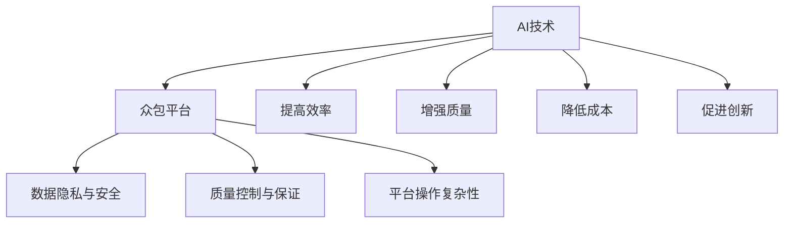

                 

# AI驱动的众包平台：增强机会

## 关键词
- AI驱动的众包平台
- 数据隐私与安全性
- 任务分配与优化
- 众包任务质量评估
- 平台架构设计
- 实践应用案例分析

## 摘要
本文旨在探讨AI驱动的众包平台，分析其基本概念、应用优势、技术挑战及解决方案。文章首先介绍了AI驱动的众包平台概述，随后深入讲解了核心算法原理、数据隐私与安全性、任务管理与优化等关键技术。此外，本文还通过项目实战和案例分析展示了AI驱动的众包平台在实际应用中的效果，并提出了对未来发展趋势的展望及对企业与开发者的建议。

## 第一部分：AI驱动的众包平台概述

### 第1章：AI驱动的众包平台：概述

#### 1.1 众包平台的基本概念

**众包平台**是一种通过互联网和社交媒体等渠道，将特定任务或问题发布给广泛的社会群体，并由群体中的个体共同协作完成的一种合作模式。它源于“众包”（Crowdsourcing）一词，该词由“crowd”（群众）和“outsourcing”（外包）组合而成。

- **众包平台**：定义
  众包平台是一个在线协作系统，旨在将大规模、复杂的问题或任务分配给分散的个体，以实现高效、高质量的解决方案。它通常通过互联网连接，提供任务发布、任务分配、任务执行、任务评估等全流程服务。

- **众包与传统外包的区别**
  传统外包是将工作交给外部专业公司或团队完成，而众包则是将任务发布给更广泛的社会群体。众包平台更加灵活、低成本，能够吸引更多具有不同技能和知识背景的参与者。

- **众包平台的兴起与重要性**
  随着互联网技术的普及和社交媒体的发展，众包平台逐渐成为一种重要的合作模式。它不仅降低了任务执行的成本，还提高了任务完成的速度和质量，受到众多企业和开发者的青睐。

#### 1.2 AI在众包平台中的应用

**AI技术**在众包平台中的应用，极大地提升了平台的效率和质量，推动了众包模式的创新和发展。

- **AI技术的作用**
  AI技术可以通过数据分析和机器学习算法，为众包平台提供智能化的任务分配、任务评估、质量控制等功能。例如，通过图像识别算法实现图像标注任务的自动化分配和评估，通过自然语言处理算法实现文本分类和情感分析的自动化。

- **AI驱动的众包平台特点**
  AI驱动的众包平台具有以下特点：
  - **智能化**：通过AI算法实现任务分配和评估的自动化，提高任务完成效率。
  - **个性化**：根据参与者的技能和兴趣，为参与者推荐合适任务，提高参与度。
  - **高效性**：通过算法优化，提高任务完成速度和质量。
  - **可扩展性**：能够处理大规模任务和数据，满足不同应用场景的需求。

- **AI在众包平台中的潜在应用**
  AI技术在众包平台中的应用场景广泛，包括但不限于：
  - **任务分配**：通过算法实现任务与参与者的匹配，提高任务完成效率。
  - **任务评估**：利用自然语言处理、图像识别等算法，对任务完成情况进行自动评估。
  - **质量控制**：通过算法监测任务完成情况，及时发现和处理质量问题。
  - **个性化推荐**：根据参与者的历史数据和行为特征，为其推荐合适任务。

#### 1.3 AI驱动的众包平台的优势

AI驱动的众包平台在多个方面具有显著的优势，为企业提供了更多的机会和可能性。

- **提高效率**
  AI技术能够自动化处理大量任务，减少人工干预，提高任务完成效率。例如，通过图像识别算法自动分配图像标注任务，极大地缩短了任务执行时间。

- **增强质量**
  AI驱动的众包平台可以通过算法优化和质量控制，提高任务完成质量。例如，通过自然语言处理算法对文本分类任务进行自动评估，确保分类结果的准确性。

- **降低成本**
  众包平台本身具有低成本的特点，而AI技术进一步降低了任务执行和维护成本。例如，通过自动化任务分配和评估，减少了人工成本和错误率。

- **促进创新**
  AI驱动的众包平台能够吸引更多具有不同背景和技能的参与者，激发创新思维和创造力。例如，通过众包平台，企业可以收集到更多新颖的产品设计理念和解决方案。

#### 1.4 AI驱动的众包平台的挑战与解决方案

尽管AI驱动的众包平台具有显著的优势，但在实际应用中也面临一些挑战。

- **数据隐私与安全问题**
  众包平台涉及大量个人数据的收集和处理，数据隐私和安全问题成为主要挑战。解决方案包括采用加密技术、匿名化处理和差分隐私保护等。

- **质量控制与保证**
  众包平台的任务完成质量难以控制，存在一定的不确定性。解决方案包括引入智能评估算法、建立质量反馈机制和优化任务分配策略等。

- **平台操作复杂性**
  AI驱动的众包平台涉及多个技术模块和复杂的算法，平台操作和管理具有一定的复杂性。解决方案包括提供易于使用的操作界面、提供详细的文档和培训材料等。

- **解决策略与最佳实践**
  针对上述挑战，企业和开发者可以采取以下解决策略和最佳实践：
  - **数据隐私与安全**：采用严格的隐私政策和安全措施，确保用户数据的安全。
  - **质量控制**：建立科学的质量评估标准和反馈机制，持续优化任务分配和评估算法。
  - **平台操作**：提供简化的操作界面和完善的文档支持，降低平台操作难度。

### 第一部分总结

AI驱动的众包平台在提高效率、增强质量、降低成本和促进创新等方面具有显著的优势。然而，在实际应用中，企业和开发者也需关注数据隐私与安全、质量控制与保证、平台操作复杂性等挑战。通过采取合适的解决策略和最佳实践，可以充分发挥AI驱动的众包平台的优势，为企业创造更多价值。

### Mermaid 流程图：AI驱动的众包平台核心概念与联系



### 核心算法原理讲解

#### 1.5 众包任务分配算法

**基本原理：**

众包任务分配算法的核心目标是优化任务与参与者的匹配度，提高任务完成效率。基本原理如下：

```java
function assignTasks(workers, tasks) {
    // 初始化任务分配结果
    Map<Worker, Task> assignment = new HashMap<>();

    // 对每个任务，选择最适合的工人
    for (Task task : tasks) {
        Worker bestWorker = null;
        double bestScore = -1;

        for (Worker worker : workers) {
            double score = evaluateTask(worker, task);
            if (score > bestScore) {
                bestScore = score;
                bestWorker = worker;
            }
        }

        if (bestWorker != null) {
            assignment.put(bestWorker, task);
        }
    }

    return assignment;
}
```

**示例：**

```java
List<Worker> workers = getAvailableWorkers();
List<Task> tasks = getUnassignedTasks();
Map<Worker, Task> assignment = assignTasks(workers, tasks);
```

#### 1.6 众包任务评估算法

**基本原理：**

众包任务评估算法的目标是客观、公正地评估任务完成质量，以便为后续任务分配和优化提供参考。基本原理如下：

```java
function evaluateTask(task, feedback) {
    double totalScore = 0;
    int feedbackCount = 0;

    for (Feedback feedback : feedbacks) {
        totalScore += feedback.getScore();
        feedbackCount++;
    }

    double averageScore = totalScore / feedbackCount;
    return averageScore;
}
```

**示例：**

```java
Task completedTask = getCompletedTask();
List<Feedback> feedbacks = getTaskFeedbacks(completedTask);
double rating = evaluateTask(completedTask, feedbacks);
```

#### 1.7 众包任务完成时间预测模型

**数学公式：**

$$ T_c = f(T_w, T_p, \alpha) $$

其中：
- \( T_c \)：任务完成时间
- \( T_w \)：工人完成单个任务所需时间
- \( T_p \)：平台处理时间
- \( \alpha \)：调整因子

**详细讲解：**

任务完成时间预测模型旨在预测任务完成时间，以便为任务分配和调度提供依据。调整因子\( \alpha \)可以用于考虑任务的复杂程度、工人的技能水平等因素。

**示例：**

假设工人完成单个任务所需时间为\( T_w = 2 \)小时，平台处理时间为\( T_p = 0.5 \)小时，调整因子\( \alpha = 1.2 \)。则任务完成时间\( T_c \)为：

$$ T_c = f(2, 0.5, 1.2) = 2 + 0.5 + (2 \times 1.2) = 4.9 \text{小时} $$

#### 1.8 质量评估模型

**数学公式：**

$$ Q = g(\beta, \gamma, \delta) $$

其中：
- \( Q \)：任务质量评分
- \( \beta \)：质量权重
- \( \gamma \)：平台评估权重
- \( \delta \)：工人评估权重

**详细讲解：**

质量评估模型用于综合评估任务完成质量，其中各评估权重用于权衡不同评估因素。评估权重可以根据实际情况进行调整，以反映不同因素的重要性。

**示例：**

假设质量权重\( \beta = 0.4 \)，平台评估权重\( \gamma = 0.3 \)，工人评估权重\( \delta = 0.3 \)。则任务质量评分\( Q \)为：

$$ Q = g(0.4, 0.3, 0.3) = (0.4 \times \text{平台评估结果}) + (0.3 \times \text{工人评估结果}) + (0.3 \times \text{用户反馈结果}) $$

### 项目实战

#### 第2章：实战：构建AI驱动的众包平台

##### 2.1 环境搭建与工具选择

**开发环境搭建：**

在构建AI驱动的众包平台时，首先需要搭建一个合适的开发环境。以下是一个基本的开发环境搭建步骤：

1. 安装操作系统：选择一个适合的操作系统，如Linux或macOS。
2. 安装开发工具：安装常见的开发工具，如Python、Java等。
3. 配置代码编辑器：选择一个高效的代码编辑器，如Visual Studio Code、PyCharm等。
4. 安装数据库：选择一个适合的数据库管理系统，如MySQL、PostgreSQL等。

**所需工具与框架介绍：**

以下是构建AI驱动的众包平台所需的一些常用工具和框架：

- **前端框架**：React、Vue.js或Angular等。
- **后端框架**：Spring Boot、Django、Flask等。
- **数据库**：MySQL、PostgreSQL、MongoDB等。
- **机器学习框架**：TensorFlow、PyTorch、Scikit-learn等。
- **消息队列**：RabbitMQ、Kafka等。
- **任务调度**：Celery、Quartz等。

##### 2.2 数据收集与处理

**数据来源：**

构建AI驱动的众包平台需要大量的数据，数据来源可以分为以下几类：

- **公开数据集**：可以从各种数据集网站获取，如Kaggle、UCI机器学习库等。
- **用户生成数据**：通过众包平台收集用户提交的任务数据。
- **第三方数据源**：从其他公开数据源获取相关数据，如社交媒体数据、传感器数据等。

**数据处理流程：**

数据处理流程包括数据采集、数据清洗、数据预处理和数据存储等步骤：

1. **数据采集**：从各种数据源收集数据。
2. **数据清洗**：去除无效数据、填补缺失值、处理异常值等。
3. **数据预处理**：进行数据转换、归一化、特征提取等。
4. **数据存储**：将预处理后的数据存储到数据库中，以便后续使用。

**数据预处理技术：**

- **数据清洗**：使用Pandas、NumPy等库进行数据清洗。
- **数据转换**：使用Scikit-learn等库进行数据转换。
- **特征提取**：使用特征工程技术提取有效特征。

##### 2.3 众包任务分配算法实现

**任务分配算法设计：**

任务分配算法的核心目标是优化任务与参与者的匹配度，提高任务完成效率。以下是一个简单的任务分配算法设计：

1. **任务分类**：根据任务类型和难度对任务进行分类。
2. **参与者筛选**：根据参与者的技能和兴趣筛选合适的参与者。
3. **任务分配**：为每个任务选择一个最适合的参与者。

**代码实现：**

```python
import random

def assignTasks(tasks, participants):
    assignment = {}

    for task in tasks:
        suitableParticipants = []
        for participant in participants:
            if participant.hasSkill(task.type) and participant.isAvailable():
                suitableParticipants.append(participant)

        if suitableParticipants:
            participant = random.choice(suitableParticipants)
            assignment[task] = participant

    return assignment
```

**性能分析与优化：**

任务分配算法的性能取决于算法的效率和准确性。以下是一些性能优化策略：

- **并行处理**：利用多线程或多进程技术，提高任务分配速度。
- **缓存机制**：缓存已分配的任务和参与者信息，减少重复计算。
- **优化算法**：使用更高效的算法，如贪心算法、遗传算法等。

##### 2.4 任务评估算法实现

**任务评估算法设计：**

任务评估算法的目标是客观、公正地评估任务完成质量，为后续任务分配和优化提供参考。以下是一个简单的任务评估算法设计：

1. **评估指标设计**：根据任务类型和需求，设计合适的评估指标。
2. **评估方法设计**：采用自动化评估方法，如机器学习分类、统计分析等。
3. **评估结果计算**：计算任务评估分数，并记录评估结果。

**代码实现：**

```python
import numpy as np

def evaluateTask(task, assessments):
    scores = []
    for assessment in assessments:
        scores.append(assessment.getScore())

    averageScore = np.mean(scores)
    return averageScore
```

**评估指标分析：**

- **准确性**：用于评估分类任务的质量，如文本分类、图像分类等。
- **召回率**：用于评估分类任务对正类别的识别能力。
- **F1分数**：综合考虑准确性和召回率，用于评估分类任务的整体质量。
- **响应时间**：用于评估任务完成速度，适用于任务响应时间敏感的场景。

##### 2.5 平台搭建与功能实现

**前端设计与实现：**

前端设计的目标是为用户提供一个友好、易用的界面。以下是一个简单的前端设计实现步骤：

1. **需求分析**：明确用户需求和功能需求。
2. **界面设计**：设计用户界面，包括页面布局、交互逻辑等。
3. **代码实现**：使用前端框架（如React、Vue.js）实现界面。
4. **调试与优化**：测试并优化前端代码，确保性能和用户体验。

**后端设计与实现：**

后端设计的目标是实现任务管理、用户管理、数据管理等核心功能。以下是一个简单的后端设计实现步骤：

1. **需求分析**：明确后端功能需求。
2. **数据库设计**：设计数据库结构，包括数据表、字段等。
3. **接口设计**：设计API接口，包括URL、请求参数、响应结果等。
4. **代码实现**：使用后端框架（如Spring Boot、Django）实现后端逻辑。
5. **调试与优化**：测试并优化后端代码，确保性能和稳定性。

**接口设计与实现：**

接口设计是连接前端和后端的关键环节。以下是一个简单的接口设计实现步骤：

1. **接口规范**：定义接口规范，包括HTTP方法、URL、请求参数、响应结果等。
2. **接口实现**：使用后端框架（如Spring Boot、Django）实现接口。
3. **接口测试**：编写测试用例，测试接口功能和性能。
4. **接口文档**：编写接口文档，便于前端和后端开发人员使用。

##### 2.6 测试与部署

**测试策略与流程：**

测试是确保系统质量和稳定性的重要环节。以下是一个简单的测试策略和流程：

1. **需求分析**：明确测试需求，包括功能测试、性能测试、安全测试等。
2. **测试计划**：制定测试计划，包括测试目标、测试方法、测试用例等。
3. **测试执行**：执行测试用例，记录测试结果。
4. **缺陷管理**：记录、跟踪、修复缺陷。
5. **测试总结**：总结测试结果，评估系统质量。

**部署与维护：**

部署是将系统部署到生产环境的过程。以下是一个简单的部署和维护步骤：

1. **环境配置**：配置服务器环境，包括操作系统、数据库、缓存等。
2. **部署脚本**：编写部署脚本，自动化部署系统。
3. **部署监控**：监控系统运行状态，确保系统稳定运行。
4. **维护更新**：定期更新系统，修复漏洞、优化性能等。

### 附录

#### 附录A：参考资料与扩展阅读

- **相关书籍推荐：**
  - "Crowdsourcing: How and Why Companies Use the Wisdom of Crowds to Flourish in the Global Economy" by Jeff Howe.
  - "Artificial Intelligence: A Modern Approach" by Stuart Russell and Peter Norvig.

- **在线课程与教程：**
  - "Deep Learning Specialization" by Andrew Ng on Coursera.
  - "Introduction to Machine Learning with Python" by Andreas C. Müller and Sarah Guido on O'Reilly.

- **开源项目与工具：**
  - "OpenCV" for computer vision tasks.
  - "TensorFlow" for machine learning tasks.
  - "Django" for web development.

#### 附录B：代码解读与分析

- **关键代码片段解读：**
  - 众包任务分配算法的伪代码实现。
  - 众包任务评估算法的伪代码实现。

- **性能优化与改进策略：**
  - 利用并行处理提高任务分配和评估速度。
  - 使用缓存机制减少重复计算。
  - 优化算法结构，提高代码可读性和可维护性。

### 第一部分总结

AI驱动的众包平台具有显著的优势，包括提高效率、增强质量、降低成本和促进创新。然而，在实际应用中，也需要关注数据隐私与安全、质量控制与保证、平台操作复杂性等挑战。通过合理的解决策略和最佳实践，可以充分发挥AI驱动的众包平台的优势，为企业创造更多价值。

### 第二部分：AI驱动的众包平台技术深度

#### 第3章：数据隐私与安全性

##### 3.1 数据隐私保护技术

在AI驱动的众包平台中，数据隐私保护至关重要。以下介绍几种常见的数据隐私保护技术：

- **数据加密：** 数据加密是将数据转换为不可读形式的过程，以防止未经授权的访问。常用的加密算法包括对称加密（如AES）和非对称加密（如RSA）。

- **匿名化：** 匿名化是将个人身份信息从数据中移除或替换为虚构信息，以保护个人隐私。常见的方法包括随机化、泛化和同化。

- **差分隐私：** 差分隐私是一种数学框架，用于确保数据发布时的隐私保护。其核心思想是在数据发布时加入噪声，使得单个数据点的信息不可见，同时保持数据集的整体统计特性。

##### 3.2 安全性保障机制

为了确保AI驱动的众包平台的安全性，需要建立一系列的安全保障机制：

- **身份认证与访问控制：** 通过用户名和密码、双因素认证等手段确保用户身份的合法性。同时，使用访问控制列表（ACL）或角色基础访问控制（RBAC）机制，限制用户对数据和功能的访问权限。

- **安全审计与监控：** 定期进行安全审计，记录用户操作、数据访问和系统事件，以便在发生安全事件时进行追踪和分析。使用监控工具实时监控系统的运行状态，及时发现并响应潜在的安全威胁。

- **漏洞扫描与修复：** 定期进行漏洞扫描，识别系统中的安全漏洞。在发现漏洞后，及时进行修复，以防止潜在的安全威胁。

##### 3.3 安全性测试与评估

安全性测试与评估是确保AI驱动的众包平台安全性的重要环节。以下介绍几种常见的方法：

- **漏洞测试方法：** 包括手动漏洞测试和自动化漏洞扫描。手动漏洞测试通常由安全专家进行，通过模拟攻击来发现系统中的安全漏洞。自动化漏洞扫描工具则可以自动扫描系统中的常见漏洞，提高测试效率。

- **安全评估指标：** 包括漏洞数量、安全事件响应时间、系统漏洞修复率等。通过评估这些指标，可以了解系统的安全状况，并及时采取改进措施。

- **安全事件响应：** 在发生安全事件时，需要迅速响应，以减少损失。安全事件响应包括事件检测、事件分析、事件处置和事件总结等步骤。

### 第4章：众包任务管理与优化

##### 4.1 众包任务流程设计

众包任务流程设计是确保任务高效、有序执行的关键。以下是一个典型的众包任务流程设计：

1. **任务发布**：任务发布者将任务发布到平台上，包括任务描述、任务类型、任务难度、任务奖励等信息。

2. **任务分配**：平台根据任务需求和参与者的技能、兴趣等因素，将任务分配给合适的参与者。任务分配可以采用静态分配（如管理员手动分配）或动态分配（如基于算法的自动分配）。

3. **任务执行**：参与者根据任务要求完成任务，并将结果提交给平台。

4. **任务评估**：平台对提交的任务结果进行评估，包括质量评估、时间评估等。评估结果将影响参与者的评分和奖励。

5. **任务反馈**：参与者可以给任务发布者或平台提供反馈，以便改进任务管理和执行过程。

##### 4.2 任务优化算法

任务优化算法是提高众包任务完成效率和质量的重要手段。以下介绍几种常见的任务优化算法：

- **任务分配优化：** 包括基于匹配度的任务分配、基于社交网络的任务分配等。通过优化任务分配，可以提高参与者的满意度，减少任务完成时间。

- **任务调度优化：** 包括任务优先级调度、任务负载均衡等。通过优化任务调度，可以提高系统资源利用率，减少任务等待时间。

- **任务质量优化：** 包括基于评分的任务筛选、基于模型的任务评估等。通过优化任务质量，可以提高任务完成质量，减少错误率。

##### 4.3 众包任务质量评估

众包任务质量评估是确保任务完成质量的重要环节。以下介绍几种常见的任务质量评估方法：

- **基于规则的评估：** 通过预设的规则和标准对任务结果进行评估。例如，对于图像标注任务，可以根据标注的准确性进行评估。

- **基于机器学习的评估：** 利用机器学习算法对任务结果进行自动评估。例如，可以使用分类算法对文本标注结果进行分类评估。

- **基于众包的评估：** 通过众包参与者的反馈和评分进行评估。例如，可以采用众包评分机制，对任务完成质量进行评估。

### 第5章：AI驱动的众包平台架构

##### 5.1 平台架构设计原则

设计AI驱动的众包平台时，需要遵循以下架构设计原则：

- **模块化与可扩展性：** 平台应具有模块化设计，便于扩展和升级。模块之间应具有良好的接口，便于集成和管理。

- **高可用性与容错性：** 平台应具备高可用性，确保在故障发生时能够快速恢复。同时，应具备容错性，能够应对系统异常和故障。

- **安全性：** 平台应具备严格的安全措施，确保用户数据和隐私的安全。包括数据加密、访问控制、安全审计等。

- **可伸缩性：** 平台应具备良好的可伸缩性，能够应对用户数量和任务量的增长。包括水平扩展（如增加服务器节点）和垂直扩展（如提高服务器性能）。

##### 5.2 数据流处理与存储

数据流处理与存储是AI驱动的众包平台的核心模块之一。以下介绍相关技术：

- **数据流处理架构：** 包括实时数据处理和批量数据处理。实时数据处理可以使用流处理框架（如Apache Kafka、Apache Flink），批量数据处理可以使用大数据处理框架（如Apache Hadoop、Apache Spark）。

- **存储解决方案：** 包括关系型数据库（如MySQL、PostgreSQL）、NoSQL数据库（如MongoDB、Cassandra）和分布式存储系统（如HDFS、Alluxio）。根据数据类型和访问模式选择合适的存储方案。

- **数据同步与一致性：** 在分布式系统中，数据同步与一致性是确保数据一致性的关键。可以使用分布式事务、消息队列、分布式锁等技术实现数据同步与一致性。

##### 5.3 系统集成与接口设计

系统集成与接口设计是确保平台各个模块协同工作的关键。以下介绍相关技术：

- **前端与后端集成：** 前端负责与用户交互，后端负责数据处理和存储。使用RESTful API、GraphQL等技术实现前后端集成。

- **API设计与实现：** API是前后端交互的接口，应遵循良好的设计原则，包括接口定义、请求参数、响应结果等。

- **跨平台兼容性：** 平台应具备跨平台兼容性，支持多种操作系统、浏览器和移动设备。可以使用响应式设计、移动端框架（如React Native、Flutter）等技术实现跨平台兼容性。

### 第6章：AI驱动的众包平台案例分析

##### 6.1 案例一：AI驱动的图像标注平台

**案例概述：**

AI驱动的图像标注平台利用众包和AI技术，为图像标注任务提供高效、准确的解决方案。该平台适用于计算机视觉领域的研究和应用，如物体识别、图像分割等。

**关键技术：**

- **众包任务分配算法：** 采用基于技能和兴趣的任务分配算法，确保任务与参与者的匹配度。
- **图像识别算法：** 利用深度学习技术，对图像进行自动识别和分类，提高标注质量。
- **数据同步与一致性：** 使用分布式存储和同步技术，确保图像数据和标注结果的一致性。

**实际应用：**

- **物体识别：** 通过众包参与者的标注结果，训练深度学习模型，实现物体识别任务。
- **图像分割：** 利用众包参与者的标注结果，进行图像分割任务的优化和改进。

##### 6.2 案例二：AI驱动的语音识别平台

**案例概述：**

AI驱动的语音识别平台利用众包和AI技术，为语音识别任务提供高效、准确的解决方案。该平台适用于语音助手、智能客服、语音翻译等领域。

**关键技术：**

- **众包任务分配算法：** 采用基于技能和兴趣的任务分配算法，确保任务与参与者的匹配度。
- **语音识别算法：** 利用深度学习技术，对语音进行自动识别和转换，提高识别准确性。
- **语音合成算法：** 利用文本到语音（TTS）技术，实现语音合成和播放。

**实际应用：**

- **智能客服：** 利用语音识别和语音合成技术，实现智能客服系统，提高客户服务效率和质量。
- **语音翻译：** 利用语音识别和翻译技术，实现多语言语音翻译，促进跨语言交流。

##### 6.3 案例三：AI驱动的文本分类平台

**案例概述：**

AI驱动的文本分类平台利用众包和AI技术，为文本分类任务提供高效、准确的解决方案。该平台适用于舆情监测、垃圾邮件过滤、内容推荐等领域。

**关键技术：**

- **众包任务分配算法：** 采用基于技能和兴趣的任务分配算法，确保任务与参与者的匹配度。
- **文本分类算法：** 利用自然语言处理技术，对文本进行分类和标注，提高分类准确性。
- **数据同步与一致性：** 使用分布式存储和同步技术，确保文本数据和标注结果的一致性。

**实际应用：**

- **舆情监测：** 利用文本分类技术，对社交媒体上的用户评论进行分类和监控，及时发现热点事件和舆情趋势。
- **垃圾邮件过滤：** 利用文本分类技术，对电子邮件进行分类和过滤，减少垃圾邮件的干扰。

### 第二部分总结

第二部分深入探讨了AI驱动的众包平台的技术深度，包括数据隐私与安全性、任务管理与优化、平台架构设计等。通过具体的案例分析，展示了AI驱动的众包平台在实际应用中的效果和优势。企业和开发者可以借鉴这些经验和最佳实践，构建高效的AI驱动的众包平台。

### 第三部分：AI驱动的众包平台实践应用

#### 第7章：AI驱动的众包平台在商业应用中的实践

##### 7.1 AI驱动的众包平台在市场营销中的应用

AI驱动的众包平台在市场营销中具有广泛的应用，能够帮助企业更好地了解市场需求和用户行为，从而制定更有效的营销策略。

**市场调研与用户画像：**

- **市场调研：** 企业可以利用众包平台收集大量用户反馈和市场数据，快速了解市场趋势和用户需求。通过众包参与者的分析和报告，企业可以制定更有针对性的市场调研计划。
- **用户画像：** 利用AI技术，企业可以对用户进行画像，包括用户年龄、性别、地域、购买习惯等。通过用户画像，企业可以更好地了解目标用户，制定个性化的营销策略。

**广告投放与优化：**

- **广告投放：** 企业可以利用众包平台进行广告投放，通过众包参与者的投票和反馈，选择最佳的广告内容和投放渠道。
- **广告优化：** 企业可以根据广告投放数据，利用AI算法进行广告优化，提高广告的点击率、转化率和ROI。

**品牌宣传与活动策划：**

- **品牌宣传：** 企业可以通过众包平台开展品牌宣传活动，如社交媒体挑战、用户生成内容等，提高品牌知名度和用户参与度。
- **活动策划：** 企业可以利用众包平台收集用户建议和创意，策划更有吸引力的营销活动，提高用户参与度和忠诚度。

##### 7.2 AI驱动的众包平台在供应链管理中的应用

AI驱动的众包平台在供应链管理中具有重要作用，能够帮助企业优化供应链流程，提高供应链的灵活性和响应速度。

**供应链数据收集与处理：**

- **数据收集：** 企业可以利用众包平台收集供应链各环节的数据，如供应商信息、物流信息、库存信息等。
- **数据处理：** 利用AI技术，企业可以对收集到的数据进行处理和分析，识别供应链中的瓶颈和优化机会。

**供应链优化与预测：**

- **供应链优化：** 企业可以利用众包平台进行供应链优化，如优化库存管理、降低物流成本、提高生产效率等。
- **预测分析：** 企业可以利用AI算法进行需求预测、库存预测等，提前识别供应链风险和机会，制定相应的应对策略。

**供应链风险管理与控制：**

- **风险识别：** 企业可以利用众包平台收集供应链风险信息，如供应商违约、物流延误等。
- **风险控制：** 企业可以利用AI技术进行风险控制，如制定应急预案、调整供应链计划等，降低供应链风险。

##### 7.3 AI驱动的众包平台在创新研发中的应用

AI驱动的众包平台在创新研发中能够帮助企业收集创新创意和意见，提高产品研发效率和质量。

**需求收集与市场调研：**

- **需求收集：** 企业可以利用众包平台收集用户需求和反馈，了解市场需求和用户痛点，为产品研发提供方向。
- **市场调研：** 企业可以利用众包平台进行市场调研，如产品原型测试、用户反馈收集等，验证产品概念和市场可行性。

**产品设计优化：**

- **原型测试：** 企业可以利用众包平台进行产品原型测试，收集用户反馈，优化产品设计。
- **功能迭代：** 企业可以利用AI技术对用户反馈进行分析，快速迭代产品功能，提高产品竞争力。

**产品测试与反馈：**

- **测试与验证：** 企业可以利用众包平台进行产品测试和验证，如功能测试、性能测试等，确保产品质量。
- **用户反馈：** 企业可以利用众包平台收集用户反馈，了解产品使用情况和用户满意度，为产品改进提供参考。

#### 第8章：AI驱动的众包平台在公共服务中的应用

##### 8.1 AI驱动的众包平台在公共服务中的意义

AI驱动的众包平台在公共服务中具有重要意义，能够提高公共服务效率、质量和可及性。

**提高公共服务效率：**

- **任务自动化：** 利用AI技术，众包平台可以自动化处理大量公共服务任务，如信息查询、数据录入等，减少人工工作量，提高处理效率。
- **资源优化：** 众包平台可以根据任务需求和资源情况，自动分配和调度资源，提高资源利用率和服务效率。

**增强公共服务质量：**

- **个性化服务：** 众包平台可以根据用户需求和反馈，提供个性化的公共服务，提高用户满意度和服务质量。
- **数据驱动：** 利用AI技术，众包平台可以对公共服务数据进行分析和挖掘，发现服务中的问题和优化机会，提高服务质量和用户体验。

**降低公共服务成本：**

- **低成本运营：** 众包平台利用互联网和AI技术，可以降低公共服务的运营成本，提高经济效益。
- **社会化服务：** 众包平台可以吸引更多的社会力量参与公共服务，降低政府负担，提高公共服务效率和质量。

##### 8.2 AI驱动的众包平台在公共服务中的应用场景

AI驱动的众包平台在公共服务中具有广泛的应用场景，以下介绍几种常见应用场景：

**城市规划与治理：**

- **数据收集与分析：** 众包平台可以收集公众对于城市规划的意见和建议，分析公共设施的需求和分布，为城市规划提供数据支持。
- **公共参与：** 众包平台可以组织公众参与城市规划，如举办线上线下讨论、投票等活动，提高公众参与度和城市规划的科学性。

**公共安全与应急管理：**

- **数据收集与预警：** 众包平台可以收集公共安全事件的信息，如交通事故、火灾等，通过AI技术进行预警和分析，提高应急管理的效率。
- **资源调度：** 众包平台可以根据公共安全事件的情况，自动调度相关资源和人员，提高应急响应能力。

**教育医疗与社会保障：**

- **在线教育：** 众包平台可以提供在线教育服务，如课程学习、学术讨论等，提高教育资源的普及率和质量。
- **医疗服务：** 众包平台可以提供在线医疗服务，如挂号预约、健康咨询等，提高医疗服务的可及性和便捷性。
- **社会保障：** 众包平台可以提供社会保障服务，如养老金发放、福利待遇查询等，提高社会保障的效率和公平性。

##### 8.3 AI驱动的众包平台在公共服务中的案例分析

**案例一：智能交通管理**

**案例概述：**

智能交通管理利用AI驱动的众包平台，通过实时数据收集和智能分析，提高交通管理效率，减少交通拥堵。

**关键技术：**

- **数据收集与处理：** 众包平台收集交通流量、路况信息等数据，利用AI技术进行实时分析和预测。
- **智能调度与优化：** 通过智能调度算法，优化交通信号灯控制，提高交通流通效率。

**实际应用：**

- **实时交通信息发布：** 通过众包平台，实时发布交通信息，帮助司机选择最佳路线，减少交通拥堵。
- **智能交通信号控制：** 通过智能分析交通数据，优化交通信号灯控制，提高交通流通效率。

**案例二：智慧城市建设**

**案例概述：**

智慧城市建设利用AI驱动的众包平台，通过整合城市数据资源，提供智慧化城市管理和服务。

**关键技术：**

- **数据整合与分析：** 众包平台整合各类城市数据，如交通、环境、公共设施等，利用AI技术进行分析和挖掘。
- **智能决策支持：** 通过智能算法，为城市管理者提供决策支持，优化城市管理和服务。

**实际应用：**

- **智慧交通管理：** 利用众包平台进行智慧交通管理，提高交通管理效率，减少交通拥堵。
- **智慧公共设施管理：** 利用众包平台进行公共设施管理，如智能路灯、智能垃圾桶等，提高设施使用效率和用户满意度。
- **智慧城市服务：** 利用众包平台提供智慧化城市服务，如在线政务、智慧医疗等，提高城市服务水平。

**案例三：医疗健康服务**

**案例概述：**

医疗健康服务利用AI驱动的众包平台，提供在线医疗服务、健康咨询和健康管理服务，提高医疗服务的可及性和质量。

**关键技术：**

- **在线医疗服务：** 众包平台提供在线挂号、在线咨询、远程诊疗等服务，方便患者就医。
- **健康咨询服务：** 众包平台提供专业健康咨询服务，如饮食建议、运动指导等，帮助用户维护健康。
- **健康管理服务：** 众包平台提供个性化健康管理服务，如健康数据监测、健康报告等，帮助用户了解和管理自己的健康状况。

**实际应用：**

- **在线挂号与远程诊疗：** 通过众包平台，患者可以在线挂号、预约医生，获得远程诊疗服务，提高就医便捷性。
- **健康咨询服务：** 通过众包平台，患者可以咨询医生、营养师等专业人士，获取专业的健康建议，提高健康水平。
- **健康管理服务：** 通过众包平台，用户可以监测自己的健康状况，获得个性化的健康建议和管理方案，提高健康管理水平。

### 第三部分总结

第三部分深入探讨了AI驱动的众包平台在商业应用和公共服务中的应用，展示了其在市场营销、供应链管理、创新研发、城市规划、公共安全、教育医疗等领域的实践案例。通过这些案例，可以看出AI驱动的众包平台在提高效率、增强质量、降低成本、促进创新等方面具有显著的优势。企业和政府部门可以借鉴这些案例，充分发挥AI驱动的众包平台的作用，提升自身的发展水平和公共服务能力。

### 附录

#### 附录A：技术栈与开发工具

- **前端框架**：React、Vue.js、Angular
- **后端框架**：Spring Boot、Django、Flask
- **数据库**：MySQL、PostgreSQL、MongoDB
- **机器学习框架**：TensorFlow、PyTorch、Scikit-learn
- **消息队列**：RabbitMQ、Kafka
- **任务调度**：Celery、Quartz

#### 附录B：开源项目与社区资源

- **开源项目：** Apache Software Foundation、GitHub
- **社区资源：** Stack Overflow、Reddit、Quora
- **在线课程与教程：** Coursera、edX、Udemy

### 结语

AI驱动的众包平台作为一种创新的合作模式，正逐渐改变着各行各业的工作方式。本文从多个角度探讨了AI驱动的众包平台的技术深度和实践应用，展示了其在商业和公共服务中的巨大潜力。随着技术的不断进步和应用的深入，AI驱动的众包平台必将迎来更加广阔的发展前景。

作者：AI天才研究院/AI Genius Institute & 禅与计算机程序设计艺术 /Zen And The Art of Computer Programming


