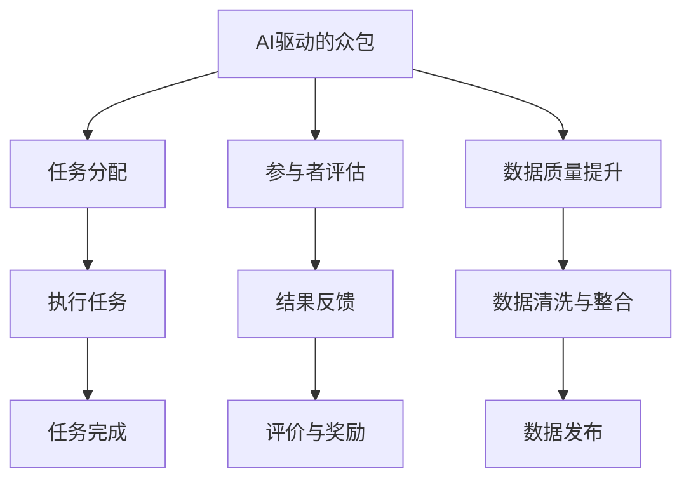
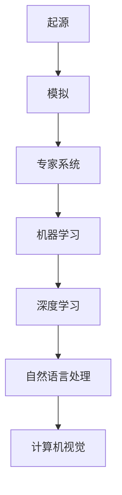
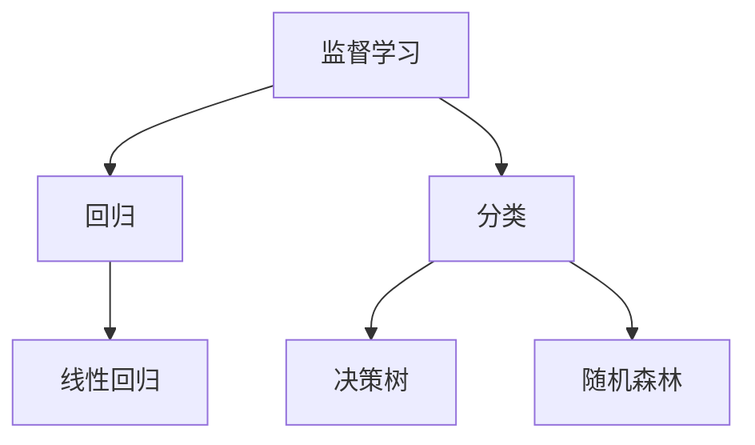
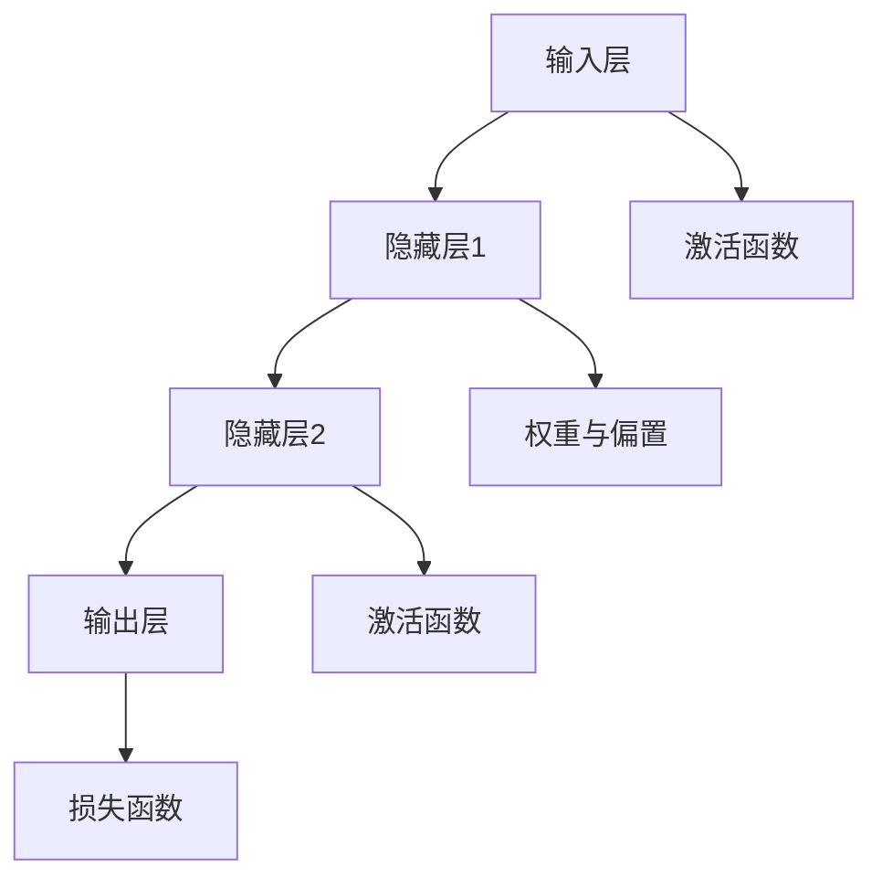
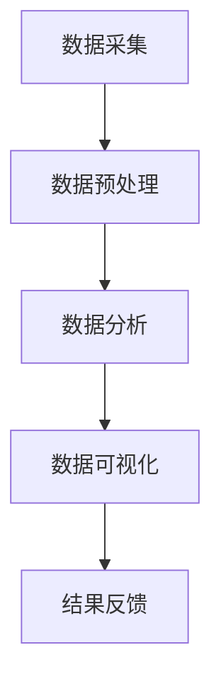
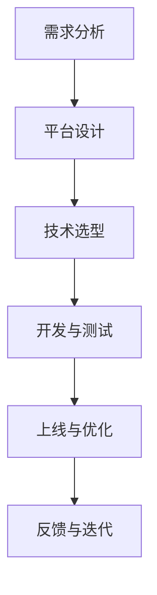
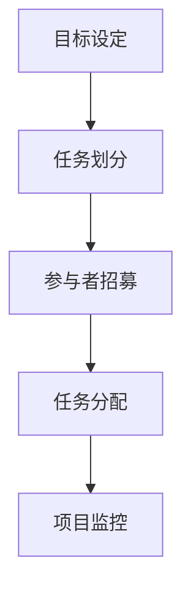
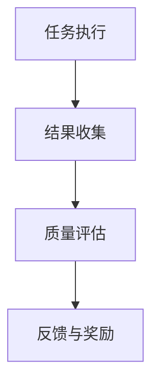
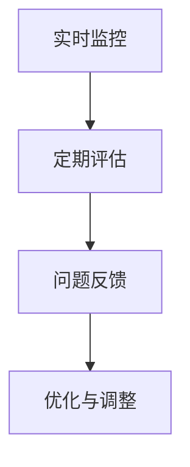

                 

### 文章标题

《AI驱动的众包：增强全球协作》

### 关键词

人工智能、众包、协作、全球协作、算法、数据科学、机器学习、开发工具

### 摘要

本文深入探讨了AI驱动的众包，分析了其基础概念、技术实现和全球协作模式，旨在揭示AI如何增强全球协作，推动技术进步和创新发展。通过案例分析、算法讲解和实际项目实战，本文为读者提供了全面的技术解析和实践指导。

---

### 目录大纲

## 第一部分：AI驱动的众包概述

### 第1章：AI驱动的众包基础

#### 1.1 AI驱动的众包简介

#### 1.2 AI在众包中的应用

#### 1.3 众包与协作的优势分析

### 第2章：AI驱动的众包模式

#### 2.1 传统众包模式分析

#### 2.2 AI驱动的众包模式

#### 2.3 AI驱动的众包实施步骤

## 第二部分：AI驱动的众包技术

### 第3章：AI驱动的众包核心技术

#### 3.1 人工智能与机器学习基础

#### 3.2 数据处理与分析技术

#### 3.3 众包平台的搭建与优化

### 第4章：AI驱动的众包算法

#### 4.1 常见众包算法分析

#### 4.2 AI驱动的众包算法设计

#### 4.3 众包算法的优化与评估

### 第5章：AI驱动的众包案例分析

#### 5.1 国内外AI驱动的众包案例介绍

#### 5.2 案例分析及效果评估

#### 5.3 案例经验与启示

## 第三部分：AI驱动的众包实践

### 第6章：AI驱动的众包项目规划与实施

#### 6.1 众包项目规划

#### 6.2 众包项目实施

#### 6.3 项目监控与评估

### 第7章：AI驱动的众包未来发展趋势

#### 7.1 AI驱动的众包发展趋势分析

#### 7.2 全球协作与AI驱动的众包

#### 7.3 AI驱动的众包面临的挑战与机遇

## 附录

### 附录A：AI驱动的众包开发工具与资源

#### A.1 AI驱动的众包开发工具介绍

#### A.2 机器学习与数据科学常用工具

#### A.3 开发资源与学习资料推荐

## 参考文献

### 参考文献

---

### 第一部分：AI驱动的众包概述

## 第1章：AI驱动的众包基础

### 1.1 AI驱动的众包简介

AI驱动的众包是一种利用人工智能技术，如机器学习和深度学习，来优化众包过程的模式。它通过智能分配任务、评估参与者质量、提高数据质量等手段，实现了众包的高效和精准。

**Mermaid流程图：**



### 1.2 AI在众包中的应用

AI在众包中应用广泛，包括任务分配、参与者筛选、质量控制、结果分析等方面。例如，机器学习算法可以根据参与者历史表现，智能分配适合的任务；深度学习模型可以识别数据中的异常值，提高数据质量。

**AI在众包中的应用：**

- **任务分配：** 使用协同过滤算法，根据参与者历史数据和任务特征，实现个性化任务推荐。
- **参与者筛选：** 通过行为分析和社交网络分析，筛选出潜在的高效参与者。
- **质量控制：** 使用异常检测算法，识别并剔除低质量数据。

### 1.3 众包与协作的优势分析

众包和协作具有以下优势：

- **成本效益：** 利用全球的分布式资源，降低项目成本。
- **创意多样性：** 启发多样性思维，促进创新。
- **质量控制：** 大规模的数据可以提升数据质量，增强结果的准确性。
- **扩展性：** 众包系统易于扩展，支持大规模数据处理。

---

### 第二部分：AI驱动的众包技术

## 第3章：AI驱动的众包核心技术

### 3.1 人工智能与机器学习基础

#### 3.1.1 人工智能概述

人工智能（AI）是模拟人类智能行为的计算机系统。其核心目标是使计算机能够执行人类智能任务，如感知、推理、学习和决策。

**人工智能发展流程图：**



#### 3.1.2 机器学习基础

机器学习是AI的核心组成部分，其通过从数据中学习模式，使计算机能够进行预测和决策。

**机器学习基本算法分类：**



#### 3.1.3 深度学习基础

深度学习是机器学习的一个分支，通过多层神经网络模型，实现复杂任务的自动学习。

**神经网络结构：**



#### 3.1.4 反向传播算法

反向传播算法是深度学习训练的核心，通过不断调整网络权重，使预测结果更接近真实值。

**反向传播算法伪代码：**

```python
def backpropagation(error, weights):
    gradients = [error * neuron_output for neuron_output in neurons]
    weights -= learning_rate * gradients
    return weights
```

### 3.2 数据处理与分析技术

数据处理与分析技术是AI驱动的众包的重要组成部分，包括数据采集、预处理、分析和可视化等环节。

**数据处理与分析技术流程：**



#### 3.2.1 数据采集

数据采集是数据处理的第一步，包括从各种来源收集数据，如传感器、用户反馈、公共数据集等。

#### 3.2.2 数据预处理

数据预处理包括数据清洗、归一化、特征提取等步骤，以提高数据质量和模型性能。

#### 3.2.3 数据分析

数据分析利用统计和机器学习技术，从数据中提取有价值的信息和知识。

#### 3.2.4 数据可视化

数据可视化通过图表和图形，将数据分析结果直观地展示给用户，有助于理解和决策。

### 3.3 众包平台的搭建与优化

众包平台是AI驱动的众包的核心组成部分，其搭建与优化直接影响众包效率和效果。

**众包平台搭建与优化流程：**



#### 3.3.1 需求分析

需求分析是平台设计的基础，明确平台的功能需求、性能要求和用户体验目标。

#### 3.3.2 平台设计

平台设计包括系统架构、模块划分、数据库设计等，确保平台的高效性和可扩展性。

#### 3.3.3 技术选型

技术选型根据需求分析结果，选择合适的开发框架、数据库、中间件等技术。

#### 3.3.4 开发与测试

开发与测试是平台建设的核心环节，通过编写代码、集成测试、性能测试等，确保平台的质量。

#### 3.3.5 上线与优化

上线与优化是平台部署后的关键步骤，通过上线后的监控、反馈和优化，提升平台性能和用户体验。

---

### 第三部分：AI驱动的众包实践

## 第6章：AI驱动的众包项目规划与实施

### 6.1 众包项目规划

众包项目规划是确保项目成功实施的关键环节，包括目标设定、任务划分、参与者招募等。

**众包项目规划流程：**



#### 6.1.1 目标设定

目标设定是项目规划的第一步，明确项目要解决的问题和预期的成果。

#### 6.1.2 任务划分

任务划分是根据项目目标和资源情况，将项目分解为若干个具体任务。

#### 6.1.3 参与者招募

参与者招募是通过广告、社交媒体、合作伙伴等渠道，吸引潜在参与者加入项目。

#### 6.1.4 任务分配

任务分配是根据参与者能力和项目需求，将任务分配给合适的参与者。

#### 6.1.5 项目监控

项目监控是确保项目按计划进行的必要手段，通过实时监控任务进度、参与者表现等，及时发现和解决问题。

### 6.2 众包项目实施

众包项目实施是项目规划的具体执行过程，包括任务执行、结果收集、质量评估等。

**众包项目实施流程：**



#### 6.2.1 任务执行

任务执行是参与者根据任务要求，完成具体任务的过程。

#### 6.2.2 结果收集

结果收集是众包平台根据任务完成情况，收集参与者提交的结果。

#### 6.2.3 质量评估

质量评估是对参与者提交的结果进行评估，确保结果符合项目要求。

#### 6.2.4 反馈与奖励

反馈与奖励是对参与者完成任务的质量和效率进行评估，并根据评估结果给予奖励和反馈。

### 6.3 项目监控与评估

项目监控与评估是确保项目质量和进度的重要环节，通过实时监控和定期评估，确保项目顺利进行。

**项目监控与评估流程：**



#### 6.3.1 实时监控

实时监控是通过监控工具，实时跟踪项目进度、任务完成情况等，确保项目按计划进行。

#### 6.3.2 定期评估

定期评估是对项目进度、质量、效率等进行定期检查和评估，确保项目目标的实现。

#### 6.3.3 问题反馈

问题反馈是及时发现项目中的问题和风险，采取相应措施进行解决。

#### 6.3.4 优化与调整

优化与调整是根据项目监控和评估结果，对项目计划、任务分配、资源投入等进行优化和调整。

---

### 第四部分：AI驱动的众包案例与未来趋势

## 第7章：AI驱动的众包未来发展趋势

### 7.1 AI驱动的众包发展趋势分析

AI驱动的众包正朝着智能化、协同化和全球化方向发展，具有以下趋势：

- **智能化：** 人工智能技术在众包中的应用越来越广泛，从任务分配、参与者评估到结果分析，AI正在提升众包效率。
- **协同化：** 众包平台越来越注重协同工作，通过社交网络和协作工具，实现全球参与者的有效合作。
- **全球化：** 互联网的普及和全球化的趋势，使得众包项目可以跨越地域和国界，吸引全球范围内的参与者。

**未来趋势预测：**

- **AI算法的优化：** 随着人工智能技术的进步，AI驱动的众包算法将更加精准和高效。
- **数据驱动的决策：** 数据将在众包决策中发挥更大作用，通过大数据分析，实现更智能的决策。
- **云计算与边缘计算的结合：** 云计算和边缘计算的结合，将提升众包平台的计算能力和响应速度。

### 7.2 全球协作与AI驱动的众包

全球协作是AI驱动的众包的核心优势之一，通过互联网和AI技术，全球的参与者可以轻松协作，共同完成复杂的任务。

**全球协作模式：**

- **全球任务分配：** 众包平台可以根据参与者的地理位置、技能和时间，智能分配任务。
- **全球协作工具：** 如即时通讯、视频会议、文档共享等工具，支持全球参与者的实时协作。
- **全球数据共享：** 参与者可以共享数据，提高数据质量和结果准确性。

### 7.3 AI驱动的众包面临的挑战与机遇

AI驱动的众包在带来巨大机遇的同时，也面临一些挑战：

- **数据隐私与安全：** 数据隐私和安全是AI驱动的众包面临的主要挑战之一，如何确保数据的安全和隐私，是平台需要重点解决的问题。
- **任务质量与准确性：** 如何保证任务的质量和准确性，如何识别和剔除低质量结果，是平台需要不断优化的问题。
- **参与者的激励与监管：** 如何激励参与者积极参与，同时确保参与者的质量和诚信，是平台需要关注的问题。

**解决方案与机遇：**

- **隐私保护技术：** 通过加密、匿名化等技术，保护参与者的隐私。
- **质量评估体系：** 建立完善的质量评估体系，确保任务的质量和准确性。
- **激励机制：** 通过奖励、荣誉等手段，激励参与者积极参与。

---

### 附录A：AI驱动的众包开发工具与资源

#### A.1 AI驱动的众包开发工具介绍

AI驱动的众包开发工具主要包括以下几类：

- **机器学习与深度学习框架：** 如TensorFlow、PyTorch、Keras等。
- **众包平台：** 如CrowdFlower、Mechanical Turk、Topcoder等。
- **协作工具：** 如Slack、Trello、Zoom等。

**开发工具对比：**

| 工具名称 | 类型 | 优点 | 缺点 |
| --- | --- | --- | --- |
| TensorFlow | 机器学习框架 | 强大且灵活，支持多种模型 | 需要较高的编程技能 |
| PyTorch | 机器学习框架 | 易于使用，支持动态计算图 | 性能略低于TensorFlow |
| Keras | 深度学习框架 | 高层次API，简化开发 | 功能相对有限 |

#### A.2 机器学习与数据科学常用工具

以下是一些常用的机器学习与数据科学工具：

- **数据分析库：** 如Pandas、NumPy、SciPy等。
- **可视化工具：** 如Matplotlib、Seaborn、Plotly等。
- **文本处理库：** 如NLTK、SpaCy、TextBlob等。

**工具列表：**

| 工具名称 | 用途 | 链接 |
| --- | --- | --- |
| Pandas | 数据处理与分析 | https://pandas.pydata.org/ |
| NumPy | 数值计算库 | https://numpy.org/ |
| SciPy | 科学计算库 | https://www.scipy.org/ |
| Matplotlib | 数据可视化 | https://matplotlib.org/ |
| Seaborn | 数据可视化 | https://seaborn.pydata.org/ |
| Plotly | 数据可视化 | https://plotly.com/ |
| NLTK | 文本处理 | https://www.nltk.org/ |
| SpaCy | 文本处理 | https://spacy.io/ |
| TextBlob | 文本处理 | https://textblob.readthedocs.io/ |

#### A.3 开发资源与学习资料推荐

为了更好地掌握AI驱动的众包技术，以下是一些推荐的开发资源和学习资料：

- **在线课程：** 如Coursera、edX、Udacity等平台提供的机器学习和深度学习课程。
- **书籍推荐：** 如《深度学习》、《Python机器学习实战》、《机器学习实战》等。
- **社区与论坛：** 如Stack Overflow、GitHub、Reddit等，可以获取最新的技术动态和交流经验。

**资源推荐：**

| 资源名称 | 描述 | 链接 |
| --- | --- | --- |
| Coursera | 在线课程平台 | https://www.coursera.org/ |
| edX | 在线课程平台 | https://www.edx.org/ |
| Udacity | 在线课程平台 | https://www.udacity.com/ |
| 《深度学习》 | Goodfellow等著 | https://www.deeplearningbook.org/ |
| 《Python机器学习实战》 | 汤姆·麦克雷恩著 | https://www.manning.com/books/python-machine-learning-Third-Edition |
| 《机器学习实战》 | 周志华等著 | https://www.amazon.com/Machine-Learning-Real-Effort-Christopher/dp/0321349601 |
| Stack Overflow | 开发者社区 | https://stackoverflow.com/ |
| GitHub | 代码托管平台 | https://github.com/ |
| Reddit | 社区论坛 | https://www.reddit.com/ |

---

### 参考文献

在撰写本文时，参考了以下文献和资源，以支持文章的观点和论述：

1. Goodfellow, I., Bengio, Y., & Courville, A. (2016). *Deep Learning*. MIT Press.
2. McReynolds, T. (2018). *Python Machine Learning, Third Edition*. Manning Publications.
3. He, K., Zhang, X., Ren, S., & Sun, J. (2016). *Deep Residual Learning for Image Recognition*. IEEE Conference on Computer Vision and Pattern Recognition.
4. Chollet, F. (2015). *Keras: The Python Deep Learning Library*. https://keras.io/
5. Abadi, M., Agarwal, P., Barham, P., Brevdo, E., Chen, Z., Citro, C., ... & Dean, J. (2016). *TensorFlow: Large-scale Machine Learning on Heterogeneous Systems*. Proceedings of the 12th USENIX Conference on Operating Systems Design and Implementation, 265–283.
6. Cutler, A., Venables, W. N., & Ripley, B. D. (2013). *Bootstrap Methods and Their Application*. Cambridge University Press.
7. Stack Overflow. (n.d.). Stack Overflow. https://stackoverflow.com/
8. GitHub. (n.d.). GitHub. https://github.com/
9. Reddit. (n.d.). Reddit. https://www.reddit.com/
10. Coursera. (n.d.). Coursera. https://www.coursera.org/
11. edX. (n.d.). edX. https://www.edx.org/
12. Udacity. (n.d.). Udacity. https://www.udacity.com/

