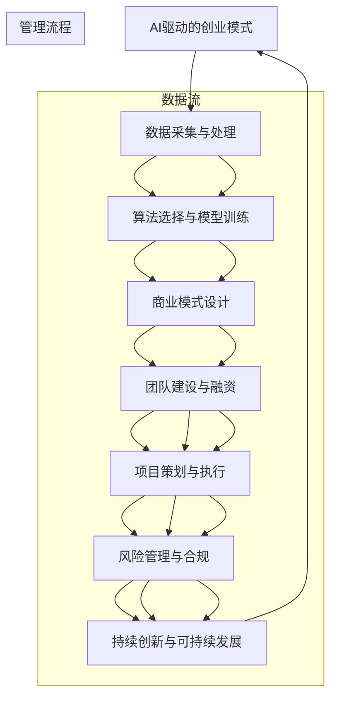

                 

### 文章标题

# AI驱动的创业模式：机遇与挑战

> 关键词：AI创业、商业模式、机会与挑战、实战案例、技术创新、生态系统、未来展望

> 摘要：本文将从AI驱动的创业背景、核心概念、商业模式、实战案例、融资策略、法律风险与未来展望等多个角度，深入探讨AI创业的机遇与挑战，为创业者提供有价值的参考和启示。

## 第一部分：引言

### 第1章：AI驱动的创业背景

随着人工智能技术的快速发展，AI已成为推动产业变革的重要力量。从自然语言处理、计算机视觉到机器人技术，AI的应用领域不断拓展，为各行各业带来了前所未有的机遇。在这种背景下，AI驱动的创业模式应运而生，成为新时代创业者的热门选择。

### 1.1 AI时代的创业环境

AI时代的创业环境发生了显著变化。一方面，技术的进步降低了创业门槛，创业者可以更轻松地获取和应用AI技术；另一方面，市场的需求不断增长，为AI创业项目提供了广阔的发展空间。此外，政策支持和资本投入也日益增强，为AI创业提供了有力保障。

### 1.2 AI创业的现状与趋势

目前，全球AI创业浪潮正在兴起，各国政府和企业纷纷加大对AI领域的投入。根据相关数据显示，AI创业项目的数量和融资额逐年增长，AI技术在各个行业中的应用越来越广泛。未来，AI创业将继续保持快速增长态势，成为引领产业变革的重要力量。

### 1.3 AI创业的机会与挑战

AI创业既充满机遇，也面临挑战。机遇在于，AI技术具有广泛的应用前景，创业者可以在多个领域寻找创新机会；挑战在于，AI技术的研发和应用具有一定的技术门槛，创业者需要具备较高的技术能力和资源储备。此外，市场竞争激烈，创业者需要不断创新以保持竞争优势。

## 第二部分：AI创业的核心概念

### 第2章：AI创业的核心概念

为了深入理解AI创业，我们需要掌握一些核心概念。本章将介绍AI的基础知识、数据在AI创业中的应用以及AI算法与模型的选择。

### 2.1 AI的基础知识

人工智能（AI）是指由人制造出来的系统能够感知环境并采取行动，以实现特定目标。AI可以分为两大类：弱AI和强AI。弱AI专注于特定任务，如语音识别、图像识别等；强AI则具有普遍智能，能够像人类一样理解、学习和思考。

### 2.2 数据在AI创业中的应用

数据是AI创业的核心资源。创业者需要收集、整理和分析大量数据，以便训练和优化AI模型。数据质量直接影响AI模型的性能，因此，数据清洗、数据标注等数据预处理工作至关重要。此外，数据的多样性和丰富性也是AI创业成功的关键因素。

### 2.3 AI算法与模型的选择

AI算法和模型的选择取决于创业项目的需求和数据特点。常见的AI算法包括机器学习算法、深度学习算法等。机器学习算法适用于处理结构化数据，如分类、回归任务；深度学习算法则擅长处理非结构化数据，如图像、语音等。创业者需要根据实际情况选择合适的算法和模型。

## 第三部分：AI创业的商业模式

### 第3章：AI创业的商业模式

在AI创业中，商业模式的设计至关重要。本章将探讨传统商业模式的变革、AI驱动的商业模式创新以及AI创业中的盈利模式。

### 3.1 传统商业模式的变革

随着AI技术的发展，传统商业模式正面临着前所未有的变革。例如，在零售业，AI驱动的推荐系统能够根据消费者的偏好和行为数据提供个性化的购物建议；在金融业，AI驱动的风控系统能够提高贷款审批的准确性和效率。传统商业模式通过引入AI技术，实现了业务流程的优化和运营效率的提升。

### 3.2 AI驱动的商业模式创新

AI驱动的商业模式创新为创业者提供了丰富的机会。例如，基于AI技术的智能医疗系统可以提供精准的诊断和治疗方案；基于AI技术的智能教育平台可以实现个性化学习，提高教学效果。这些创新模式不仅为用户带来了更好的体验，也为企业创造了巨大的商业价值。

### 3.3 AI创业中的盈利模式

AI创业的盈利模式多种多样，包括广告收入、付费订阅、交易费用等。创业者需要根据自身项目特点和市场环境选择合适的盈利模式。例如，在智能医疗领域，企业可以通过提供个性化诊疗服务收取服务费用；在智能教育领域，企业可以通过提供在线课程和教学资源实现盈利。

## 第二部分：AI创业的核心概念

### 第2章：AI创业的核心概念

为了深入理解AI创业，我们需要掌握一些核心概念。本章将介绍AI的基础知识、数据在AI创业中的应用以及AI算法与模型的选择。

### 2.1 AI的基础知识

人工智能（AI）是指由人制造出来的系统能够感知环境并采取行动，以实现特定目标。AI可以分为两大类：弱AI和强AI。弱AI专注于特定任务，如语音识别、图像识别等；强AI则具有普遍智能，能够像人类一样理解、学习和思考。

### 2.2 数据在AI创业中的应用

数据是AI创业的核心资源。创业者需要收集、整理和分析大量数据，以便训练和优化AI模型。数据质量直接影响AI模型的性能，因此，数据清洗、数据标注等数据预处理工作至关重要。此外，数据的多样性和丰富性也是AI创业成功的关键因素。

### 2.3 AI算法与模型的选择

AI算法和模型的选择取决于创业项目的需求和数据特点。常见的AI算法包括机器学习算法、深度学习算法等。机器学习算法适用于处理结构化数据，如分类、回归任务；深度学习算法则擅长处理非结构化数据，如图像、语音等。创业者需要根据实际情况选择合适的算法和模型。

## 第三部分：AI创业的商业模式

### 第3章：AI创业的商业模式

在AI创业中，商业模式的设计至关重要。本章将探讨传统商业模式的变革、AI驱动的商业模式创新以及AI创业中的盈利模式。

### 3.1 传统商业模式的变革

随着AI技术的发展，传统商业模式正面临着前所未有的变革。例如，在零售业，AI驱动的推荐系统能够根据消费者的偏好和行为数据提供个性化的购物建议；在金融业，AI驱动的风控系统能够提高贷款审批的准确性和效率。传统商业模式通过引入AI技术，实现了业务流程的优化和运营效率的提升。

### 3.2 AI驱动的商业模式创新

AI驱动的商业模式创新为创业者提供了丰富的机会。例如，基于AI技术的智能医疗系统可以提供精准的诊断和治疗方案；基于AI技术的智能教育平台可以实现个性化学习，提高教学效果。这些创新模式不仅为用户带来了更好的体验，也为企业创造了巨大的商业价值。

### 3.3 AI创业中的盈利模式

AI创业的盈利模式多种多样，包括广告收入、付费订阅、交易费用等。创业者需要根据自身项目特点和市场环境选择合适的盈利模式。例如，在智能医疗领域，企业可以通过提供个性化诊疗服务收取服务费用；在智能教育领域，企业可以通过提供在线课程和教学资源实现盈利。

## 第二部分：AI创业的核心概念

### 第2章：AI创业的核心概念

为了深入理解AI创业，我们需要掌握一些核心概念。本章将介绍AI的基础知识、数据在AI创业中的应用以及AI算法与模型的选择。

### 2.1 AI的基础知识

人工智能（AI）是指由人制造出来的系统能够感知环境并采取行动，以实现特定目标。AI可以分为两大类：弱AI和强AI。弱AI专注于特定任务，如语音识别、图像识别等；强AI则具有普遍智能，能够像人类一样理解、学习和思考。

### 2.2 数据在AI创业中的应用

数据是AI创业的核心资源。创业者需要收集、整理和分析大量数据，以便训练和优化AI模型。数据质量直接影响AI模型的性能，因此，数据清洗、数据标注等数据预处理工作至关重要。此外，数据的多样性和丰富性也是AI创业成功的关键因素。

### 2.3 AI算法与模型的选择

AI算法和模型的选择取决于创业项目的需求和数据特点。常见的AI算法包括机器学习算法、深度学习算法等。机器学习算法适用于处理结构化数据，如分类、回归任务；深度学习算法则擅长处理非结构化数据，如图像、语音等。创业者需要根据实际情况选择合适的算法和模型。

## 第三部分：AI创业的商业模式

### 第3章：AI创业的商业模式

在AI创业中，商业模式的设计至关重要。本章将探讨传统商业模式的变革、AI驱动的商业模式创新以及AI创业中的盈利模式。

### 3.1 传统商业模式的变革

随着AI技术的发展，传统商业模式正面临着前所未有的变革。例如，在零售业，AI驱动的推荐系统能够根据消费者的偏好和行为数据提供个性化的购物建议；在金融业，AI驱动的风控系统能够提高贷款审批的准确性和效率。传统商业模式通过引入AI技术，实现了业务流程的优化和运营效率的提升。

### 3.2 AI驱动的商业模式创新

AI驱动的商业模式创新为创业者提供了丰富的机会。例如，基于AI技术的智能医疗系统可以提供精准的诊断和治疗方案；基于AI技术的智能教育平台可以实现个性化学习，提高教学效果。这些创新模式不仅为用户带来了更好的体验，也为企业创造了巨大的商业价值。

### 3.3 AI创业中的盈利模式

AI创业的盈利模式多种多样，包括广告收入、付费订阅、交易费用等。创业者需要根据自身项目特点和市场环境选择合适的盈利模式。例如，在智能医疗领域，企业可以通过提供个性化诊疗服务收取服务费用；在智能教育领域，企业可以通过提供在线课程和教学资源实现盈利。

## 第二部分：AI创业的核心概念

### 第2章：AI创业的核心概念

为了深入理解AI创业，我们需要掌握一些核心概念。本章将介绍AI的基础知识、数据在AI创业中的应用以及AI算法与模型的选择。

### 2.1 AI的基础知识

人工智能（AI）是指由人制造出来的系统能够感知环境并采取行动，以实现特定目标。AI可以分为两大类：弱AI和强AI。弱AI专注于特定任务，如语音识别、图像识别等；强AI则具有普遍智能，能够像人类一样理解、学习和思考。

### 2.2 数据在AI创业中的应用

数据是AI创业的核心资源。创业者需要收集、整理和分析大量数据，以便训练和优化AI模型。数据质量直接影响AI模型的性能，因此，数据清洗、数据标注等数据预处理工作至关重要。此外，数据的多样性和丰富性也是AI创业成功的关键因素。

### 2.3 AI算法与模型的选择

AI算法和模型的选择取决于创业项目的需求和数据特点。常见的AI算法包括机器学习算法、深度学习算法等。机器学习算法适用于处理结构化数据，如分类、回归任务；深度学习算法则擅长处理非结构化数据，如图像、语音等。创业者需要根据实际情况选择合适的算法和模型。

## 第三部分：AI创业的商业模式

### 第3章：AI创业的商业模式

在AI创业中，商业模式的设计至关重要。本章将探讨传统商业模式的变革、AI驱动的商业模式创新以及AI创业中的盈利模式。

### 3.1 传统商业模式的变革

随着AI技术的发展，传统商业模式正面临着前所未有的变革。例如，在零售业，AI驱动的推荐系统能够根据消费者的偏好和行为数据提供个性化的购物建议；在金融业，AI驱动的风控系统能够提高贷款审批的准确性和效率。传统商业模式通过引入AI技术，实现了业务流程的优化和运营效率的提升。

### 3.2 AI驱动的商业模式创新

AI驱动的商业模式创新为创业者提供了丰富的机会。例如，基于AI技术的智能医疗系统可以提供精准的诊断和治疗方案；基于AI技术的智能教育平台可以实现个性化学习，提高教学效果。这些创新模式不仅为用户带来了更好的体验，也为企业创造了巨大的商业价值。

### 3.3 AI创业中的盈利模式

AI创业的盈利模式多种多样，包括广告收入、付费订阅、交易费用等。创业者需要根据自身项目特点和市场环境选择合适的盈利模式。例如，在智能医疗领域，企业可以通过提供个性化诊疗服务收取服务费用；在智能教育领域，企业可以通过提供在线课程和教学资源实现盈利。

## 第二部分：AI创业的核心概念

### 第2章：AI创业的核心概念

为了深入理解AI创业，我们需要掌握一些核心概念。本章将介绍AI的基础知识、数据在AI创业中的应用以及AI算法与模型的选择。

### 2.1 AI的基础知识

人工智能（AI）是指由人制造出来的系统能够感知环境并采取行动，以实现特定目标。AI可以分为两大类：弱AI和强AI。弱AI专注于特定任务，如语音识别、图像识别等；强AI则具有普遍智能，能够像人类一样理解、学习和思考。

### 2.2 数据在AI创业中的应用

数据是AI创业的核心资源。创业者需要收集、整理和分析大量数据，以便训练和优化AI模型。数据质量直接影响AI模型的性能，因此，数据清洗、数据标注等数据预处理工作至关重要。此外，数据的多样性和丰富性也是AI创业成功的关键因素。

### 2.3 AI算法与模型的选择

AI算法和模型的选择取决于创业项目的需求和数据特点。常见的AI算法包括机器学习算法、深度学习算法等。机器学习算法适用于处理结构化数据，如分类、回归任务；深度学习算法则擅长处理非结构化数据，如图像、语音等。创业者需要根据实际情况选择合适的算法和模型。

## 第三部分：AI创业的商业模式

### 第3章：AI创业的商业模式

在AI创业中，商业模式的设计至关重要。本章将探讨传统商业模式的变革、AI驱动的商业模式创新以及AI创业中的盈利模式。

### 3.1 传统商业模式的变革

随着AI技术的发展，传统商业模式正面临着前所未有的变革。例如，在零售业，AI驱动的推荐系统能够根据消费者的偏好和行为数据提供个性化的购物建议；在金融业，AI驱动的风控系统能够提高贷款审批的准确性和效率。传统商业模式通过引入AI技术，实现了业务流程的优化和运营效率的提升。

### 3.2 AI驱动的商业模式创新

AI驱动的商业模式创新为创业者提供了丰富的机会。例如，基于AI技术的智能医疗系统可以提供精准的诊断和治疗方案；基于AI技术的智能教育平台可以实现个性化学习，提高教学效果。这些创新模式不仅为用户带来了更好的体验，也为企业创造了巨大的商业价值。

### 3.3 AI创业中的盈利模式

AI创业的盈利模式多种多样，包括广告收入、付费订阅、交易费用等。创业者需要根据自身项目特点和市场环境选择合适的盈利模式。例如，在智能医疗领域，企业可以通过提供个性化诊疗服务收取服务费用；在智能教育领域，企业可以通过提供在线课程和教学资源实现盈利。

### 第4章：行业案例分析

在本章中，我们将深入分析互联网、制造业和零售业这三个领域的AI创业案例，探讨这些行业如何通过AI技术实现商业模式创新和业务流程优化。

#### 4.1 互联网行业的AI创业案例

互联网行业一直是AI创业的热点领域，因为互联网企业的数据资源丰富，且用户行为数据具有高度的价值。以百度为例，百度通过其强大的搜索引擎和庞大的用户数据，发展了AI驱动的广告投放系统。该系统利用深度学习算法分析用户搜索历史、浏览记录和兴趣偏好，为广告主提供精准的投放策略，从而大幅提升了广告的转化率和投放效果。

此外，互联网巨头如阿里巴巴和腾讯也在积极布局AI领域。阿里巴巴的AI实验室开发了多种AI应用，包括智能客服、智能推荐和智能供应链管理等。这些AI应用不仅提高了用户体验，还为企业带来了显著的运营效益。

#### 4.2 制造业的AI创业案例

制造业是AI技术的重要应用领域之一。AI技术在制造业中主要用于生产流程的优化、质量控制和预测维护等。以西门子为例，西门子通过AI技术实现了智能工厂的构建。其智能工厂利用AI算法对生产数据进行分析，实现了生产过程的实时监控和优化。例如，通过预测性维护系统，西门子能够提前预测设备故障，减少停机时间，提高生产效率。

另一家著名的AI制造企业是GE。GE的Predix平台利用AI技术为制造业提供智能化的解决方案。Predix平台通过收集和分析大量设备数据，能够实时监测设备状态，提供故障预测和优化建议，从而帮助制造商提高生产效率和降低成本。

#### 4.3 零售业的AI创业案例

零售业是另一个AI创业的重要领域。AI技术在零售业中主要应用于需求预测、库存管理和顾客体验提升等方面。以亚马逊为例，亚马逊利用其强大的AI技术，实现了精准的需求预测和库存管理。通过分析历史销售数据、季节性因素和消费者行为，亚马逊能够提前预测产品的需求趋势，优化库存策略，减少库存过剩和短缺的问题。

此外，亚马逊的智能推荐系统也是其AI技术在零售业应用的典范。该系统通过深度学习算法分析用户的历史购买记录、浏览行为和搜索关键词，为用户推荐个性化商品，提高了购物体验和转化率。

#### 4.4 行业案例分析总结

通过对互联网、制造业和零售业三个领域的AI创业案例分析，我们可以看到，AI技术在各个行业的应用具有显著的差异性和共性。

- **差异性**：不同行业的数据特点和应用需求决定了AI技术的具体应用场景。例如，互联网行业侧重于用户数据分析和个性化推荐，制造业侧重于生产流程优化和预测维护，零售业侧重于需求预测和库存管理。

- **共性**：尽管应用场景不同，但AI技术在提升业务效率、优化运营流程和改善用户体验方面具有共通性。AI技术能够为各行业提供数据驱动的决策支持，提高运营效率和降低成本。

通过这些行业案例分析，创业者可以更好地理解AI技术在不同行业中的应用场景和商业价值，从而制定更有效的AI创业策略。

### 第5章：创业项目策划

在成功进行AI创业之前，创业者需要进行充分的策划工作。本章将讨论创业项目的选择、市场分析以及团队建设等方面，帮助创业者制定一个成功的创业计划。

#### 5.1 创业项目的选择

选择一个有潜力的AI创业项目是成功的第一步。创业者需要从以下几个方面进行考虑：

1. **市场需求**：选择市场需求旺盛、用户痛点明显的领域。通过市场调研，了解用户的需求和偏好，确保项目的可行性。

2. **技术优势**：选择自身团队具备技术优势的领域，以便在竞争中脱颖而出。创业者需要评估自身团队的技术能力和资源，确保项目能够得到有效的技术支持。

3. **资金需求**：评估项目的资金需求，确保项目在资金方面具有可持续性。创业者需要制定详细的财务计划，包括预算、收入预测和资金使用计划。

4. **竞争优势**：选择具有竞争优势的项目，如独特的商业模式、创新的技术或出色的用户体验等。竞争优势是项目成功的关键因素之一。

#### 5.2 创业项目的市场分析

在确定创业项目后，创业者需要进行详细的市场分析，以确保项目具有市场前景和竞争力。市场分析包括以下几个方面：

1. **市场规模**：评估项目的市场规模，包括潜在用户数量、市场增长率和市场份额。通过分析市场规模，创业者可以了解项目的商业潜力。

2. **竞争对手**：分析竞争对手的优势和劣势，了解市场现状和竞争格局。创业者需要找到自身的竞争优势，制定有针对性的市场策略。

3. **用户需求**：深入了解目标用户的需求和行为，通过用户调研和数据分析，了解用户对产品的期望和反馈。这有助于创业者优化产品设计和市场推广策略。

4. **市场趋势**：关注行业趋势和新兴技术，了解市场的发展方向和潜在机会。创业者需要紧跟市场变化，及时调整项目方向和策略。

#### 5.3 创业项目的团队建设

团队建设是创业项目成功的关键因素之一。创业者需要组建一支具备专业技能和协作精神的团队，确保项目能够顺利进行。团队建设包括以下几个方面：

1. **核心团队**：构建一个高效的核心团队，包括产品经理、技术专家、市场营销人员等。团队成员应具备互补的技能和经验，能够共同推动项目的发展。

2. **人才培养**：注重团队成员的培训和成长，提供良好的工作环境和发展机会。创业者需要激发团队成员的积极性和创造力，促进团队协作和创新。

3. **激励机制**：建立合理的激励机制，包括薪酬、股权激励等，激励团队成员为项目的成功共同努力。

4. **团队文化**：塑造积极向上的团队文化，强调团结协作、创新精神和责任心。良好的团队文化有助于提高团队的凝聚力和工作效率。

通过创业项目的选择、市场分析和团队建设，创业者可以制定一个详细的创业计划，为项目的成功奠定坚实基础。在策划过程中，创业者需要不断调整和优化方案，以应对市场变化和挑战。

### 第6章：AI创业的融资策略

在AI创业的过程中，融资策略至关重要。本章将探讨AI创业的融资渠道、融资计划的制定以及融资过程中的风险控制。

#### 6.1 融资渠道的选择

AI创业企业可以选择多种融资渠道，以获取所需资金。常见的融资渠道包括以下几种：

1. **天使投资**：天使投资是创业初期的常见融资方式。天使投资者通常具有丰富的行业经验和资源，可以为创业企业提供资金、指导和支持。

2. **风险投资**：风险投资是AI创业企业常用的融资方式。风险投资机构专注于投资具有高增长潜力的初创企业，愿意承担高风险以获取高回报。

3. **政府资助**：许多国家和地方政府提供专项资金支持创业企业，特别是那些具有技术创新和市场前景的AI项目。创业者可以通过申请政府资助来缓解资金压力。

4. **银行贷款**：银行贷款是一种传统的融资方式，适用于有稳定现金流和良好信用记录的创业企业。创业者可以通过贷款来满足项目资金需求。

5. **众筹**：众筹平台为创业者提供了另一种融资方式。通过众筹，创业者可以向社会公众筹集资金，同时获得市场反馈和用户支持。

#### 6.2 融资计划的制定

制定一个详细的融资计划是成功融资的关键。创业者需要考虑以下几个方面：

1. **融资目标**：明确融资的具体目标和金额，确保融资计划具有实际可行性。融资目标应与项目的资金需求、发展计划和里程碑相匹配。

2. **融资时间表**：制定明确的融资时间表，包括融资启动、谈判、签署协议和资金到位的时间节点。时间表有助于创业者合理安排时间和资源，确保融资过程顺利进行。

3. **融资用途**：详细列出融资资金的用途，包括研发投入、市场推广、团队建设、技术升级等。明确的融资用途有助于投资者了解项目的资金使用情况，增加融资的成功率。

4. **融资结构**：设计合理的融资结构，包括股权融资、债务融资和混合融资等。融资结构应根据项目的实际情况和投资者的要求进行选择，以最大化融资效益。

5. **融资策略**：制定具体的融资策略，包括融资渠道的选择、投资者关系管理、融资宣传等。策略应充分考虑市场的变化和竞争态势，确保融资计划的顺利实施。

#### 6.3 融资过程中的风险控制

在融资过程中，创业者需要密切关注各种风险，并采取有效措施进行控制。以下是一些常见的融资风险和应对策略：

1. **信用风险**：银行贷款和债务融资可能存在信用风险，即创业企业无法按时偿还贷款。为降低信用风险，创业者应保持良好的信用记录，合理规划还款计划。

2. **市场风险**：市场风险包括市场环境变化、竞争加剧等因素。为降低市场风险，创业者应密切关注市场动态，及时调整项目方向和策略。

3. **法律风险**：融资过程中可能涉及法律风险，如合同纠纷、知识产权争议等。为降低法律风险，创业者应咨询专业法律顾问，确保融资过程的合法性。

4. **资金使用风险**：资金使用不当可能导致项目失败。为降低资金使用风险，创业者应制定详细的资金使用计划，确保资金的有效利用。

5. **投资者关系风险**：投资者关系管理不当可能导致投资者信任度下降，影响融资进度。为降低投资者关系风险，创业者应与投资者保持良好沟通，及时回应投资者关注的问题。

通过选择合适的融资渠道、制定详细的融资计划和密切关注融资过程中的风险，AI创业企业可以顺利获得所需资金，推动项目的发展。

### 第7章：AI创业的法律风险与管理

在AI创业过程中，法律风险与管理至关重要。本章将探讨AI创业中的知识产权保护、数据隐私问题以及合规管理与风险管理的策略和方法。

#### 7.1 AI创业中的知识产权保护

知识产权保护是AI创业企业必须重视的问题。AI技术的研发和应用涉及多个方面，包括专利、商标、著作权和商业秘密等。以下是几种常见的知识产权保护策略：

1. **专利申请**：AI创业企业可以通过申请专利来保护其创新技术。专利保护能够确保企业在一定时间内独占技术，防止竞争对手复制和侵权。

2. **商标注册**：商标是企业品牌的象征，通过商标注册可以保护企业的品牌形象和商业利益。创业企业应重视商标的注册和保护，避免商标侵权纠纷。

3. **著作权保护**：著作权保护包括软件代码、算法模型等。创业企业应确保其原创性成果获得著作权保护，防止未经授权的复制、使用和传播。

4. **商业秘密保护**：商业秘密是企业在经营过程中积累的重要信息，包括技术方案、经营策略等。创业企业应制定严格的保密制度，防止商业秘密泄露。

#### 7.2 AI创业中的数据隐私问题

数据隐私问题是AI创业企业面临的重大挑战之一。在收集、处理和使用用户数据时，企业应严格遵守相关法律法规，确保用户隐私得到保护。以下是一些关键措施：

1. **数据安全策略**：创业企业应建立完善的数据安全策略，包括数据加密、访问控制和网络安全等。通过技术手段保障用户数据的安全性和完整性。

2. **隐私政策**：企业应制定详细的隐私政策，明确收集、使用和共享用户数据的方式和目的。用户应明确知晓自己的数据如何被使用，并有权选择是否同意数据收集。

3. **用户同意**：企业在收集用户数据前，应获得用户的明确同意。用户同意应通过清晰、简洁的方式表达，确保用户充分了解数据收集和使用的情况。

4. **合规性审查**：企业应定期对数据隐私管理进行合规性审查，确保符合相关法律法规的要求。在处理跨境数据传输时，企业应特别注意数据隐私保护法规的差异和合规要求。

#### 7.3 AI创业的合规管理与风险管理

合规管理与风险管理是AI创业企业成功运营的重要保障。以下是一些关键策略：

1. **合规管理**：创业企业应建立健全的合规管理体系，包括合规政策、合规培训和合规监控等。企业应确保所有业务活动符合法律法规和行业规范。

2. **风险评估**：企业应定期进行风险评估，识别潜在的法律风险和合规风险。风险评估应包括内部审查、第三方评估和风险预警等。

3. **风险管理策略**：企业应根据风险评估结果，制定相应的风险管理策略，包括风险规避、风险转移和风险接受等。企业应确保风险管理策略的有效性和适应性。

4. **合规培训**：企业应定期对员工进行合规培训，提高员工的合规意识和法律素养。合规培训应涵盖法律法规、行业规范和企业合规政策等内容。

5. **合规监督与审计**：企业应建立合规监督和审计机制，确保合规管理的执行效果。审计应包括内部审计和外部审计等，以确保合规管理的有效性和透明度。

通过知识产权保护、数据隐私管理和合规风险管理的综合策略，AI创业企业可以降低法律风险，确保业务的合法性和可持续性，为企业的长期发展创造有利条件。

### 第8章：AI创业的发展趋势

在快速发展的AI时代，创业者需要密切关注AI技术的发展趋势和行业动态，以把握市场机会和应对挑战。本章将探讨AI技术的未来发展方向、AI创业的未来机会与挑战以及AI创业的社会责任与可持续发展。

#### 8.1 AI技术的未来发展方向

AI技术的未来发展方向主要包括以下几个方面：

1. **更强大的算法和模型**：随着硬件性能的提升和数据量的增加，AI算法和模型将变得更加复杂和强大。例如，深度学习模型将逐渐突破当前的局限，实现更高效的学习和推理能力。

2. **跨领域融合**：AI技术将与其他领域（如生物学、心理学、经济学等）深度融合，形成跨学科的AI应用。这将促进AI技术的广泛应用，推动各行业的创新和变革。

3. **人机协作**：随着AI技术的发展，人机协作将成为未来工作的重要模式。AI系统将更有效地辅助人类工作，提高工作效率和创造力。

4. **边缘计算**：随着物联网和智能设备的普及，边缘计算将成为AI技术的重要发展方向。通过在设备端进行数据处理和分析，边缘计算将实现实时、低延迟的AI应用。

#### 8.2 AI创业的未来机会

AI创业的未来机会主要集中在以下领域：

1. **智能医疗**：随着AI技术在医学影像、疾病诊断、药物研发等方面的应用，智能医疗市场潜力巨大。创业者可以在医疗数据分析、智能诊断、个性化治疗等方面探索创新机会。

2. **智能制造**：智能制造是AI技术的典型应用领域。创业者可以在智能生产、预测维护、供应链优化等方面开发AI解决方案，为企业提高生产效率和质量。

3. **智能金融**：AI技术在金融领域的应用将不断深入，包括智能投顾、风控管理、反欺诈等。创业者可以探索金融科技的创新，为用户提供更智能、个性化的金融服务。

4. **智能教育**：随着教育信息化的发展，智能教育市场前景广阔。创业者可以开发智能学习平台、自适应教育系统、虚拟课堂等，为教育领域带来变革。

#### 8.3 AI创业的挑战

尽管AI创业充满机遇，但也面临诸多挑战：

1. **技术挑战**：AI技术的研发和应用具有一定的技术门槛。创业者需要具备深厚的技术背景和创新能力，以应对技术挑战。

2. **数据挑战**：数据是AI技术的核心资源。创业者需要解决数据收集、处理和隐私保护等问题，确保数据的质量和安全。

3. **市场挑战**：AI市场竞争激烈，创业者需要具备敏锐的市场洞察力，快速响应市场变化。此外，创业者还需要面对行业竞争、用户需求变化等挑战。

4. **合规挑战**：AI创业企业需要遵守相关法律法规，特别是在数据隐私、知识产权保护等方面。创业者需要建立健全的合规管理体系，确保业务的合法性和可持续性。

#### 8.4 AI创业的社会责任与可持续发展

AI创业不仅追求商业成功，还承担着社会责任。以下是一些关键方面：

1. **伦理问题**：AI技术的广泛应用引发了一系列伦理问题，如隐私、歧视、责任分配等。创业者应关注AI技术的伦理影响，确保技术的公平、透明和可解释性。

2. **就业影响**：AI技术将改变就业结构，影响某些行业的就业。创业者应关注就业影响，探索AI技术与人类劳动的协同作用，为劳动者提供新的就业机会。

3. **可持续发展**：AI技术在环境保护、资源优化等方面具有巨大潜力。创业者应关注可持续发展，开发绿色、环保的AI解决方案，推动社会进步。

通过关注AI技术的发展趋势、抓住未来机会、应对挑战并承担社会责任，AI创业企业可以在快速变化的市场中脱颖而出，实现长期可持续发展。

### 第9章：AI创业者的素质与能力

在AI创业领域，创业者不仅需要具备技术能力，还需要具备多方面的素质和能力。本章将探讨AI创业者的素质要求、能力提升以及职业规划与发展。

#### 9.1 AI创业者的素质要求

1. **创新意识**：AI创业领域竞争激烈，创业者需要具备强烈的创新意识，不断探索新的技术和应用场景，推动行业的进步。

2. **技术敏锐度**：创业者应具备对AI技术发展的敏锐洞察力，能够紧跟技术趋势，把握市场机遇。

3. **领导力**：创业者需要具备出色的领导力，能够凝聚团队、激发团队创造力，带领团队实现目标。

4. **沟通能力**：创业者需要具备良好的沟通能力，能够与团队成员、投资者、客户等各方有效沟通，建立信任和合作关系。

5. **商业敏感度**：创业者应具备较强的商业敏感度，能够准确判断市场需求，制定有效的商业策略。

6. **抗压能力**：AI创业充满挑战和压力，创业者需要具备较强的抗压能力，能够应对挫折和不确定性，保持冷静和决心。

#### 9.2 AI创业者的能力提升

1. **技术能力**：创业者应不断学习和提升自己的技术能力，掌握AI领域的核心技术和最新动态。参加AI技术培训、研究前沿论文、参与技术社区等都是提升技术能力的好方法。

2. **项目管理**：创业者需要掌握项目管理的知识和技能，能够合理规划项目进度、资源分配和风险管理。通过学习和实践项目管理工具和方法，创业者可以提高项目管理的效率和质量。

3. **商业策略**：创业者应具备制定商业策略的能力，包括市场调研、竞争分析、产品定位等。通过参加商业培训、学习商业案例和与商业顾问交流，创业者可以提升商业策略能力。

4. **团队管理**：创业者需要掌握团队管理的技巧，包括团队建设、激励、冲突管理等。通过参加团队管理培训、学习团队管理书籍和实践团队管理，创业者可以提升团队管理能力。

5. **网络资源**：创业者应积极建立和维护自己的社交网络，包括技术社区、投资者圈、行业专家等。通过扩展人脉资源和交流合作，创业者可以获取更多的机会和资源。

#### 9.3 AI创业者的职业规划与发展

1. **明确目标**：创业者应明确自己的职业目标，制定长期和短期的职业规划。通过设定明确的目标，创业者可以更有针对性地提升自己的能力和资源。

2. **持续学习**：创业者需要保持持续学习的态度，不断更新知识和技能，适应快速变化的市场和技术环境。

3. **实践锻炼**：创业者应积极参与实践项目，通过实际操作和解决实际问题来提升自己的能力和经验。

4. **职业拓展**：创业者可以通过跨界合作、参与行业峰会等方式，拓展自己的职业领域和视野，提升职业竞争力。

5. **职业转型**：在AI创业过程中，创业者可能会面临职业转型的机会。创业者应积极抓住转型机会，开拓新的职业道路。

通过提升素质、增强能力、制定合理的职业规划，AI创业者可以在竞争激烈的市场中脱颖而出，实现个人和企业的长期发展。

### 第10章：AI创业的生态体系建设

在AI创业的过程中，生态体系的建立至关重要。一个健康的AI创业生态体系不仅能够促进技术创新和产业发展，还能够为创业者提供丰富的资源和支持。本章将探讨AI创业生态体系的构成、生态圈建设以及生态效应与价值。

#### 10.1 AI创业生态体系的构成

AI创业生态体系是由多个相互关联的组成部分构成的复杂系统。主要构成要素包括：

1. **创业企业**：作为生态体系的核心，创业企业通过创新和创业活动推动AI技术的发展和应用。

2. **研究机构**：研究机构如大学、研究所等提供AI技术的研究成果和学术支持，为创业企业提供技术储备和创新动力。

3. **投资者**：投资者为AI创业企业提供资金支持，包括天使投资、风险投资、政府资助等，促进创业项目的快速发展。

4. **技术供应商**：技术供应商提供AI技术相关的硬件、软件和服务，为创业企业提供技术支持和解决方案。

5. **行业协会和组织**：行业协会和组织通过制定行业标准和规范，推动行业健康发展，为创业者提供政策指导和市场信息。

6. **人才资源**：人才资源是AI创业生态体系的重要组成部分，包括AI技术专家、研究人员、工程师、市场人才等。

#### 10.2 AI创业生态圈建设

生态圈建设是AI创业生态体系的重要组成部分，旨在构建一个相互支持、协同发展的生态网络。以下是一些关键措施：

1. **搭建平台**：搭建AI创业服务平台，提供创业项目孵化、融资对接、技术支持等一站式服务，为创业者提供全方位的支持。

2. **构建网络**：建立AI创业网络，促进创业企业、研究机构、投资者、技术供应商等之间的交流和合作，增强生态体系内的信息流通和资源共享。

3. **举办活动**：举办AI创业大赛、研讨会、论坛等活动，为创业者提供展示机会、交流平台和资源对接渠道。

4. **政策支持**：政府应出台相关政策措施，鼓励和扶持AI创业，包括资金扶持、税收优惠、知识产权保护等。

5. **人才培养**：加强AI人才培训，提供技术培训、职业规划、创业辅导等支持，培养具备AI技术和创业素质的复合型人才。

#### 10.3 AI创业生态效应与价值

AI创业生态体系的建设对创业者、企业和整个行业都具有显著的效应和价值：

1. **资源整合**：生态体系为创业者提供丰富的资源，包括技术、资金、人才、市场等，帮助创业者降低创业门槛，提高成功率。

2. **协同创新**：生态体系内的企业、研究机构、投资者等通过协同合作，共同推动AI技术的发展和应用，实现创新效应。

3. **产业聚集**：AI创业生态体系的建立有助于形成产业聚集效应，促进区域经济的发展和转型升级。

4. **政策引导**：政府通过生态体系的建设，引导和扶持AI创业，推动产业创新和经济发展。

5. **社会影响**：AI创业生态体系的建设有助于提升社会信息化水平，改善人们的生活质量，促进社会进步。

通过构建健康的AI创业生态体系，创业者可以在良好的环境中成长和发展，实现技术创新和商业成功，推动整个行业的繁荣和进步。

### 附录A：AI创业常用工具与资源

#### A.1 常用AI开发工具

1. **TensorFlow**：由谷歌开发的开源机器学习框架，支持多种编程语言，广泛应用于深度学习和机器学习项目。

2. **PyTorch**：由Facebook开发的开源深度学习框架，具有灵活的动态计算图和易于理解的API，广受欢迎。

3. **Keras**：基于TensorFlow和Theano的开源深度学习库，提供了简洁的API，适合快速构建和实验模型。

4. **Scikit-learn**：Python的机器学习库，提供了多种常见的机器学习算法，适用于数据分析和建模。

5. **OpenCV**：开源计算机视觉库，提供了丰富的图像处理和计算机视觉功能，适用于图像识别和视频分析。

#### A.2 开源AI框架介绍

1. **TensorFlow.js**：TensorFlow在浏览器中的实现，支持在Web应用程序中运行机器学习模型。

2. **TensorFlow Lite**：TensorFlow的轻量级版本，适用于移动设备和嵌入式系统。

3. **Caffe**：由伯克利大学开发的开源深度学习框架，适用于图像分类和目标检测。

4. **MXNet**：由亚马逊开发的开源深度学习框架，支持多种编程语言，适用于大规模分布式训练。

5. **CNTK**：微软开发的开源深度学习框架，支持多种计算图表示，适用于大规模数据处理。

#### A.3 AI创业相关书籍与论文推荐

1. **《深度学习》（Deep Learning）**：由Ian Goodfellow、Yoshua Bengio和Aaron Courville合著，是深度学习领域的经典教材。

2. **《机器学习》（Machine Learning）**：由Tom Mitchell主编，介绍了机器学习的基础理论和算法。

3. **《人工智能：一种现代的方法》（Artificial Intelligence: A Modern Approach）**：由Stuart J. Russell和Peter Norvig合著，全面介绍了人工智能的理论和实践。

4. **《强化学习》（Reinforcement Learning: An Introduction）**：由Richard S. Sutton和Barto合著，深入探讨了强化学习的基本原理和应用。

5. **《自然语言处理综论》（Speech and Language Processing）**：由Daniel Jurafsky和James H. Martin合著，涵盖了自然语言处理的基本概念和技术。

通过使用这些工具和资源，AI创业者可以更加高效地开展研发工作，加速项目进展，提升竞争力。

### 附录B：案例代码与资料

#### B.1 案例代码实现

以下是一个简单的AI创业案例代码实现，用于构建一个基于TensorFlow的图像分类模型。

```python
import tensorflow as tf
from tensorflow.keras import layers

# 准备数据集
mnist = tf.keras.datasets.mnist
(x_train, y_train), (x_test, y_test) = mnist.load_data()
x_train, x_test = x_train / 255.0, x_test / 255.0
x_train = x_train.reshape(-1, 28, 28, 1)
x_test = x_test.reshape(-1, 28, 28, 1)

# 构建模型
model = tf.keras.Sequential([
    layers.Conv2D(32, (3, 3), activation='relu', input_shape=(28, 28, 1)),
    layers.MaxPooling2D((2, 2)),
    layers.Conv2D(64, (3, 3), activation='relu'),
    layers.MaxPooling2D((2, 2)),
    layers.Conv2D(64, (3, 3), activation='relu'),
    layers.Flatten(),
    layers.Dense(64, activation='relu'),
    layers.Dense(10, activation='softmax')
])

# 编译模型
model.compile(optimizer='adam',
              loss='sparse_categorical_crossentropy',
              metrics=['accuracy'])

# 训练模型
model.fit(x_train, y_train, epochs=5)

# 评估模型
test_loss, test_acc = model.evaluate(x_test, y_test)
print(f"Test accuracy: {test_acc}")
```

#### B.2 案例代码解读

1. **数据准备**：首先，我们使用TensorFlow的`mnist`数据集加载并预处理图像数据。图像数据被归一化到0-1之间，并调整为适合模型输入的形状。

2. **模型构建**：接下来，我们构建了一个简单的卷积神经网络（CNN）。模型包括多个卷积层、池化层和全连接层。卷积层用于提取图像特征，池化层用于降低数据维度，全连接层用于分类。

3. **编译模型**：在模型编译阶段，我们指定了优化器、损失函数和评价指标。这里我们使用了Adam优化器和稀疏分类交叉熵损失函数。

4. **训练模型**：模型训练过程中，我们使用了5个epoch。每个epoch中，模型在训练数据上迭代训练，并逐步优化参数。

5. **评估模型**：最后，我们使用测试数据集评估模型的准确性。评估结果显示了模型在测试数据上的表现。

通过这个简单的案例，创业者可以了解如何使用TensorFlow构建和训练一个基础的图像分类模型，为实际项目开发提供参考。

#### B.3 相关资料链接与推荐

1. **TensorFlow官方文档**：[https://www.tensorflow.org/](https://www.tensorflow.org/)
2. **Keras官方文档**：[https://keras.io/](https://keras.io/)
3. **PyTorch官方文档**：[https://pytorch.org/](https://pytorch.org/)
4. **Scikit-learn官方文档**：[https://scikit-learn.org/stable/](https://scikit-learn.org/stable/)
5. **OpenCV官方文档**：[https://docs.opencv.org/](https://docs.opencv.org/)

通过阅读这些资料，创业者可以深入了解AI开发工具和技术的具体应用，为项目开发提供指导。

### 第11章：AI创业核心概念与联系

为了更好地理解AI创业的核心概念及其相互联系，我们可以借助Mermaid流程图进行可视化。以下是一个简单的Mermaid流程图，展示了AI驱动的创业模式架构：



- **数据流**：从数据采集与处理开始，数据经过算法选择与模型训练，形成商业模式的决策基础。商业模式设计影响团队建设与融资，进而影响项目策划与执行，风险管理确保项目的合规与可持续发展。
- **管理流程**：项目策划与执行过程中，团队建设和风险管理是关键环节，确保项目顺利进行。

通过这个流程图，创业者可以更清晰地理解AI创业的核心概念及其相互联系，为项目的成功奠定基础。

### 第12章：AI创业核心算法原理讲解

在本章中，我们将详细讲解AI创业中常用的核心算法原理，包括数据预处理算法、机器学习算法和深度学习算法。

#### 12.1 数据预处理算法

数据预处理是AI项目成功的关键步骤之一。以下是一个数据预处理的伪代码示例：

```python
def data_preprocessing(data):
    # 数据清洗
    data_clean = clean_data(data)
    
    # 数据归一化
    data_scale = scale_data(data_clean)
    
    return data_scale

def clean_data(data):
    # 删除缺失值、异常值等
    data_clean = data.dropna()
    data_clean = remove_outliers(data_clean)
    
    return data_clean

def scale_data(data_clean):
    # 归一化或标准化
    data_scale = (data_clean - data_clean.mean()) / data_clean.std()
    
    return data_scale
```

在数据预处理过程中，我们通常需要进行以下操作：

1. **数据清洗**：删除缺失值、异常值等，保证数据的完整性和准确性。
2. **数据归一化**：将数据缩放到相同的尺度，以便于算法处理。

#### 12.2 机器学习算法原理

机器学习算法是基于数据的统计方法，用于从数据中学习规律和模式。以下是一个简单的机器学习算法的伪代码示例：

```python
def train_model(data, labels):
    model = initialize_model()
    
    for epoch in range(max_epochs):
        for sample in data:
            model.train(sample, labels)
            
    return model

def initialize_model():
    # 初始化模型参数
    model = {}
    model['weights'] = initialize_weights()
    model['biases'] = initialize_biases()
    
    return model

def train(model, sample, labels):
    # 计算梯度
    gradients = compute_gradients(model, sample, labels)
    
    # 更新模型参数
    update_weights(model, gradients)

def compute_gradients(model, sample, labels):
    # 计算损失函数的梯度
    gradients = {}
    gradients['weights'] = compute_gradient(model['weights'], sample, labels)
    gradients['biases'] = compute_gradient(model['biases'], sample, labels)
    
    return gradients

def update_weights(model, gradients):
    # 使用梯度下降更新模型参数
    model['weights'] -= learning_rate * gradients['weights']
    model['biases'] -= learning_rate * gradients['biases']
```

在机器学习算法中，我们通常需要进行以下步骤：

1. **模型初始化**：初始化模型参数，包括权重和偏置。
2. **训练**：通过迭代训练数据，更新模型参数，最小化损失函数。
3. **预测**：使用训练好的模型进行预测。

#### 12.3 深度学习算法原理

深度学习算法是机器学习的一种形式，特别适用于处理复杂的数据。以下是一个简单的深度学习算法的伪代码示例：

```python
def initialize_weights(model):
    # 初始化权重
    model['weights'] = random_weights()
    
    return model

def forward_pass(model, input_data):
    # 前向传播
    output = model.layers[0].activate(input_data)
    for layer in model.layers[1:]:
        output = layer.activate(output)
        
    return output

def backward_pass(model, output, expected_output):
    # 反向传播
    error = expected_output - output
    for layer in model.layers[::-1]:
        layer.backward_pass(error)

def activate(z):
    # 激活函数
    return 1 / (1 + exp(-z))

def backward_pass(layer, error):
    # 计算梯度
    layer.error = layer.derivative(output) * error
    if layer.has_previous_layer():
        layer.previous_layer.error += layer.error

def derivative(output):
    # 激活函数的导数
    return output * (1 - output)
```

在深度学习算法中，我们通常需要进行以下步骤：

1. **前向传播**：计算输入数据的激活值，生成输出。
2. **反向传播**：计算损失函数的梯度，更新模型参数。

通过详细讲解这些核心算法原理，创业者可以更好地理解AI创业中的算法基础，为项目的成功奠定技术基础。

### 第13章：数学模型和数学公式

在AI创业中，数学模型和公式是理解和实现算法的核心。以下是一些常见的数学模型和公式，包括概率论基础、优化算法和损失函数。

#### 13.1 概率论基础

概率论是AI和机器学习的基础，其中贝叶斯定理是一个重要的公式。贝叶斯定理描述了后验概率与先验概率和条件概率之间的关系：

$$
P(A|B) = \frac{P(B|A)P(A)}{P(B)}
$$

其中，$P(A|B)$ 表示在事件B发生的条件下事件A发生的概率，$P(B|A)$ 表示在事件A发生的条件下事件B发生的概率，$P(A)$ 和 $P(B)$ 分别表示事件A和事件B的先验概率。

#### 13.2 优化算法

优化算法是机器学习中的一个核心概念，用于最小化损失函数。梯度下降是最常用的优化算法之一，其基本思想是通过迭代更新模型参数以减小损失函数。以下是一个简单的梯度下降优化算法的公式：

$$
\theta_{\text{new}} = \theta_{\text{current}} - \alpha \nabla_\theta J(\theta)
$$

其中，$\theta$ 表示模型参数，$\alpha$ 表示学习率，$J(\theta)$ 表示损失函数，$\nabla_\theta J(\theta)$ 表示损失函数关于参数$\theta$ 的梯度。

#### 13.3 损失函数

损失函数是机器学习中用于衡量模型预测误差的函数。在监督学习中，常用的损失函数包括均方误差（MSE）和交叉熵损失。以下是一个均方误差损失函数的公式：

$$
\mathcal{L}(\theta) = \frac{1}{2m} \sum_{i=1}^{m} (y^{(i)} - \hat{y}^{(i)})^2
$$

其中，$m$ 表示样本数量，$y^{(i)}$ 表示第$i$ 个样本的真实标签，$\hat{y}^{(i)}$ 表示模型对第$i$ 个样本的预测值。

通过掌握这些数学模型和公式，创业者可以更深入地理解AI算法的原理和实现，为项目的成功提供理论支持。

### 第14章：项目实战

#### 14.1 开发环境搭建

在进行AI创业项目开发之前，我们需要搭建一个合适的开发环境。以下是一个简单的开发环境搭建流程：

1. **安装Python环境**：

   - 在[https://www.python.org/](https://www.python.org/)下载并安装Python。
   - 确保安装了最新的Python版本。

2. **安装TensorFlow框架**：

   - 打开终端或命令提示符。
   - 输入以下命令安装TensorFlow：

     ```shell
     pip install tensorflow
     ```

3. **配置虚拟环境**：

   - 创建一个虚拟环境，以便于管理项目依赖：

     ```shell
     python -m venv my_project_venv
     ```

   - 激活虚拟环境：

     - Windows系统：

       ```shell
       my_project_venv\Scripts\activate
       ```

     - macOS和Linux系统：

       ```shell
       source my_project_venv/bin/activate
       ```

通过以上步骤，我们成功搭建了Python和TensorFlow的开发环境，为后续的AI项目开发奠定了基础。

#### 14.2 代码实际案例

在本节中，我们将展示一个简单的AI项目代码实例，包括数据集准备、模型构建和训练。

##### 14.2.1 数据集准备

我们使用TensorFlow的内置MNIST数据集，该数据集包含70000个手写数字样本，每个样本为28x28像素的图像。

```python
import tensorflow as tf

# 加载MNIST数据集
(x_train, y_train), (x_test, y_test) = tf.keras.datasets.mnist.load_data()

# 数据预处理
x_train = x_train / 255.0
x_test = x_test / 255.0
x_train = x_train.reshape(-1, 28, 28, 1)
x_test = x_test.reshape(-1, 28, 28, 1)

# 将标签转换为one-hot编码
y_train = tf.keras.utils.to_categorical(y_train, 10)
y_test = tf.keras.utils.to_categorical(y_test, 10)
```

##### 14.2.2 模型构建

我们构建一个简单的卷积神经网络（CNN）模型，用于分类手写数字。

```python
model = tf.keras.Sequential([
    tf.keras.layers.Conv2D(32, (3, 3), activation='relu', input_shape=(28, 28, 1)),
    tf.keras.layers.MaxPooling2D((2, 2)),
    tf.keras.layers.Conv2D(64, (3, 3), activation='relu'),
    tf.keras.layers.MaxPooling2D((2, 2)),
    tf.keras.layers.Flatten(),
    tf.keras.layers.Dense(64, activation='relu'),
    tf.keras.layers.Dense(10, activation='softmax')
])
```

##### 14.2.3 模型训练

我们对模型进行训练，使用均方误差（MSE）作为损失函数，Adam优化器进行优化。

```python
model.compile(optimizer='adam',
              loss='categorical_crossentropy',
              metrics=['accuracy'])

model.fit(x_train, y_train, epochs=5, batch_size=32, validation_split=0.2)
```

通过以上步骤，我们成功搭建了一个简单的AI项目，实现了手写数字的分类。这个实例展示了从数据集准备到模型训练的基本流程，为AI创业项目的开发提供了实践参考。

#### 14.3 代码解读与分析

在本节中，我们将对第14章中的代码实例进行详细解读，分析数据预处理、模型构建和模型训练的具体实现。

##### 14.3.1 数据预处理

数据预处理是AI项目成功的关键步骤之一。首先，我们使用以下代码加载MNIST数据集：

```python
(x_train, y_train), (x_test, y_test) = tf.keras.datasets.mnist.load_data()
```

这段代码从TensorFlow的内置数据集中加载训练集和测试集。MNIST数据集包含70000个手写数字样本，每个样本为28x28像素的图像。

接下来，我们对图像数据进行归一化处理，将像素值从0到255缩放到0到1之间，以便于模型训练：

```python
x_train = x_train / 255.0
x_test = x_test / 255.0
```

为了便于模型处理，我们将图像数据从二维数组转换为三维数组，形状为（样本数，高度，宽度，通道数），其中通道数为1（灰度图像）：

```python
x_train = x_train.reshape(-1, 28, 28, 1)
x_test = x_test.reshape(-1, 28, 28, 1)
```

最后，我们将标签数据转换为one-hot编码，即将每个标签从整数形式转换为具有10个元素的一维数组，其中对应标签的位置为1，其他位置为0：

```python
y_train = tf.keras.utils.to_categorical(y_train, 10)
y_test = tf.keras.utils.to_categorical(y_test, 10)
```

通过以上预处理步骤，我们为模型训练提供了适合的数据格式。

##### 14.3.2 模型构建

在模型构建部分，我们使用以下代码定义了一个简单的卷积神经网络（CNN）：

```python
model = tf.keras.Sequential([
    tf.keras.layers.Conv2D(32, (3, 3), activation='relu', input_shape=(28, 28, 1)),
    tf.keras.layers.MaxPooling2D((2, 2)),
    tf.keras.layers.Conv2D(64, (3, 3), activation='relu'),
    tf.keras.layers.MaxPooling2D((2, 2)),
    tf.keras.layers.Flatten(),
    tf.keras.layers.Dense(64, activation='relu'),
    tf.keras.layers.Dense(10, activation='softmax')
])
```

这个模型由六个层组成：

1. **卷积层1**：32个卷积核，大小为3x3，激活函数为ReLU。
2. **池化层1**：2x2的最大池化。
3. **卷积层2**：64个卷积核，大小为3x3，激活函数为ReLU。
4. **池化层2**：2x2的最大池化。
5. **平坦层**：将多维特征映射为一系列向量。
6. **全连接层1**：64个神经元，激活函数为ReLU。
7. **全连接层2**：10个神经元，激活函数为softmax，用于分类。

通过这种结构，模型可以有效地提取图像特征并进行分类。

##### 14.3.3 模型训练

在模型训练部分，我们使用以下代码对模型进行训练：

```python
model.compile(optimizer='adam',
              loss='categorical_crossentropy',
              metrics=['accuracy'])

model.fit(x_train, y_train, epochs=5, batch_size=32, validation_split=0.2)
```

这段代码首先使用Adam优化器编译模型，该优化器是一种常用的自适应优化算法。接下来，我们使用训练数据集进行训练，指定以下参数：

- **epochs**：训练轮数，这里设置为5。
- **batch_size**：每个批次的数据样本数量，这里设置为32。
- **validation_split**：验证集的比例，这里设置为0.2，即20%的数据用于验证。

通过以上步骤，模型将使用训练数据集进行迭代训练，并逐步优化模型参数。

### 15.1 创业成功的经验分享

1. **明确目标**：成功的AI创业始于明确的目标和愿景。创业者需要清晰地定义创业项目的目标，确保项目方向正确。

2. **技术领先**：在AI领域，技术领先是取得成功的关键。创业者需要不断学习新技术，掌握核心算法和模型，以确保项目具有竞争优势。

3. **市场洞察**：了解市场需求和用户痛点是创业成功的关键。创业者需要通过市场调研和用户反馈，了解用户需求，提供符合市场需求的产品和服务。

4. **团队协作**：团队协作是创业成功的重要因素。创业者需要组建一支具备互补技能和高度协作精神的团队，共同推动项目发展。

5. **持续创新**：在快速发展的AI领域，持续创新是保持竞争力的关键。创业者需要不断探索新的技术方向和市场机会，以适应市场变化。

6. **资金管理**：有效的资金管理是创业成功的基础。创业者需要制定详细的财务计划，确保资金的有效利用，避免资金短缺或浪费。

7. **合法合规**：遵守相关法律法规，确保项目合法合规，降低法律风险。创业者需要重视知识产权保护、数据隐私和合规管理。

### 15.2 创业失败的原因分析

1. **目标不明确**：创业项目缺乏明确的目标和愿景，导致方向不明确，难以实现成功。

2. **技术不足**：创业者缺乏必要的技术能力和专业知识，无法解决技术难题，影响项目进展。

3. **市场调研不足**：对市场需求和用户痛点的了解不足，导致产品不符合用户需求，市场接受度低。

4. **团队管理不当**：团队协作不力，内部沟通不畅，导致项目进度延误，影响创业成功。

5. **资金管理不当**：创业资金管理不当，导致资金短缺或浪费，影响项目运营。

6. **合法合规问题**：创业项目在知识产权、数据隐私和合规管理方面存在问题，导致法律风险和商业纠纷。

7. **市场变化应对不及时**：市场环境变化，创业者无法及时调整项目方向和策略，导致项目竞争力下降。

### 15.3 从失败中汲取的教训与反思

1. **明确目标与愿景**：在创业初期，明确的目标和愿景至关重要。创业者需要不断反思和调整项目方向，确保项目始终符合市场和发展趋势。

2. **注重技术创新**：创业者需要不断学习和掌握新技术，提升自身技术能力，以保持竞争优势。

3. **深入了解市场**：深入了解市场需求和用户痛点，通过市场调研和用户反馈，优化产品和服务。

4. **重视团队协作**：创业者需要注重团队建设和团队协作，打造高效的团队，共同推动项目发展。

5. **严格财务管理**：制定详细的财务计划，确保资金的有效利用，避免资金短缺或浪费。

6. **遵守法律法规**：重视知识产权保护、数据隐私和合规管理，确保项目合法合规，降低法律风险。

7. **灵活应对市场变化**：创业者需要保持敏锐的市场洞察力，及时调整项目方向和策略，以应对市场变化。

通过汲取失败中的教训，创业者可以更好地规划和管理创业项目，提高成功率。

### 15.4 AI创业的建议与展望

对于希望进入AI创业领域的创业者，以下是一些建议和展望：

1. **明确目标和愿景**：在创业之初，明确自己的目标和愿景至关重要。创业者需要制定详细的商业计划，确保项目方向正确。

2. **持续学习**：AI领域技术更新迅速，创业者需要保持持续学习的心态，掌握最新的技术和趋势。

3. **关注市场需求**：深入了解市场需求和用户痛点，开发符合用户需求的产品和服务。

4. **构建高效团队**：组建一支具备专业技能和协作精神的团队，共同推动项目发展。

5. **重视资金管理**：制定详细的财务计划，确保资金的有效利用，避免资金短缺或浪费。

6. **合法合规**：遵守相关法律法规，确保项目合法合规，降低法律风险。

7. **持续创新**：在快速发展的AI领域，持续创新是保持竞争力的关键。创业者需要不断探索新的技术方向和市场机会。

展望未来，AI创业领域将继续保持快速发展。以下是一些潜在的趋势和机会：

1. **智能医疗**：随着AI技术在医学领域的应用，智能医疗将成为重要的创业领域。创业者可以开发智能诊断系统、个性化治疗方案等。

2. **智能制造**：智能制造是AI技术的另一个重要应用领域。创业者可以开发智能生产系统、预测性维护解决方案等。

3. **智能金融**：AI技术在金融领域的应用前景广阔，创业者可以开发智能投顾、风险控制系统、反欺诈技术等。

4. **智能交通**：智能交通系统是未来城市发展的关键。创业者可以开发自动驾驶技术、智能交通管理解决方案等。

通过抓住这些趋势和机会，创业者可以在AI创业领域取得成功。同时，创业者需要不断调整和优化自己的策略，以适应快速变化的市场和技术环境。

