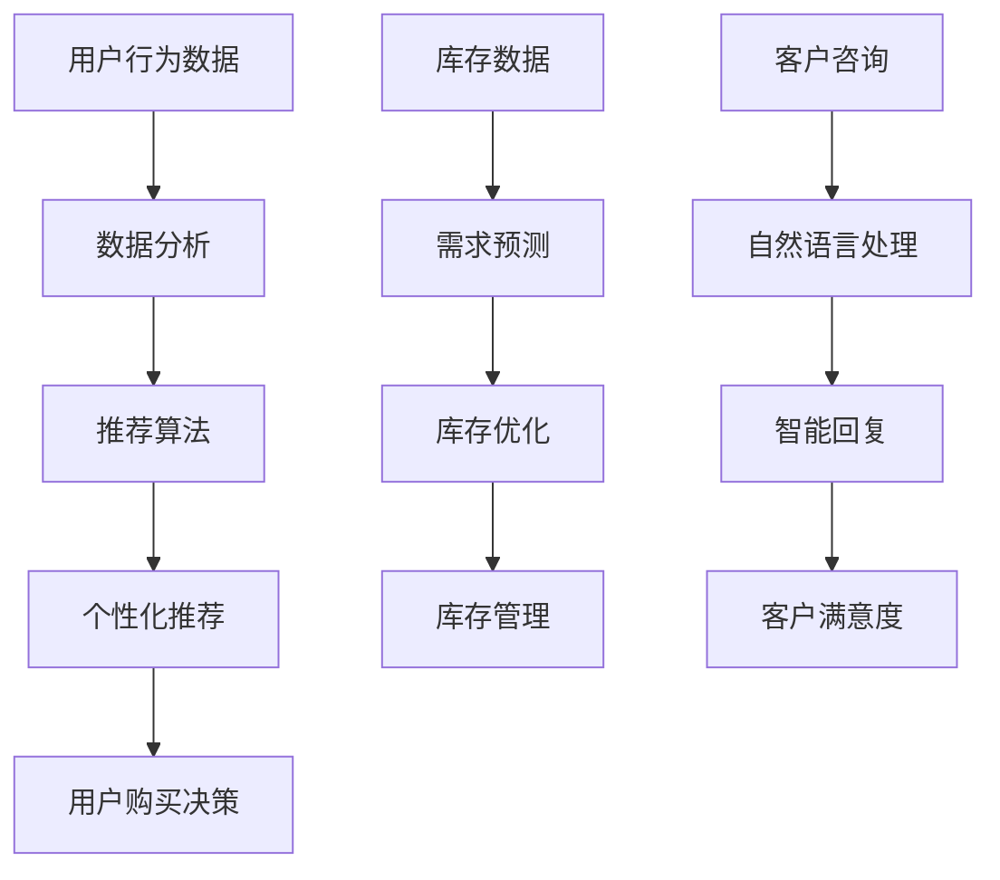
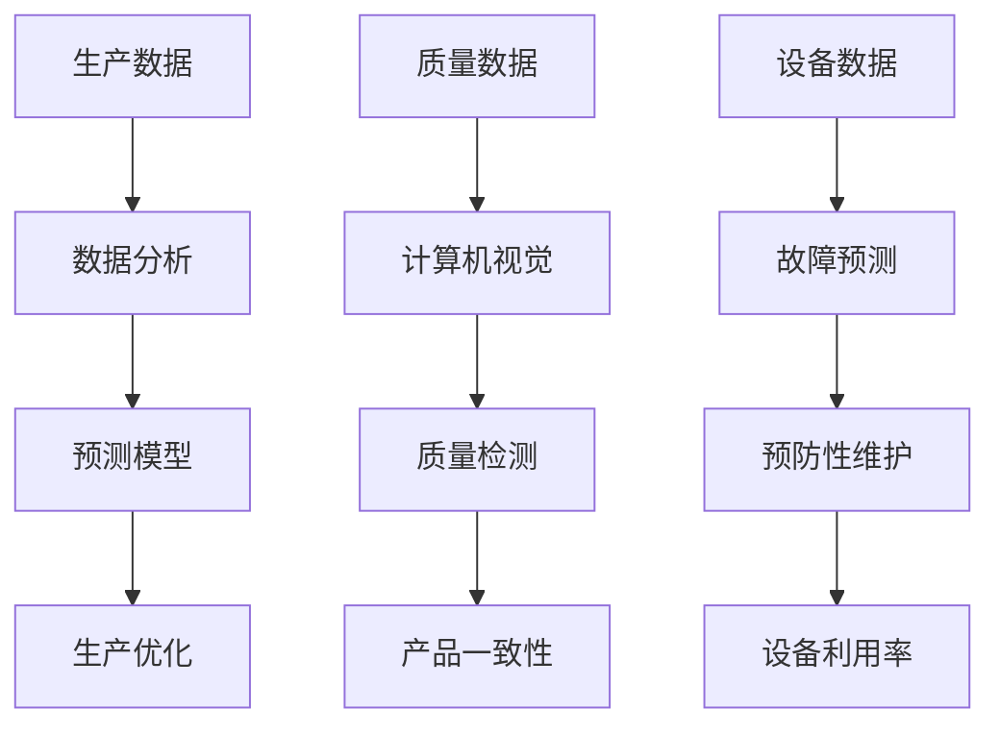
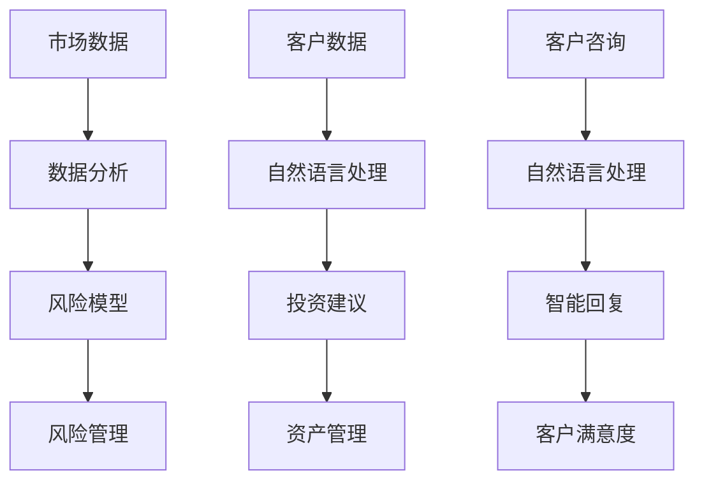

                 

### 文章标题

《AI驱动的创新：人类计算在商业中的未来趋势预测》

> 关键词：人工智能，商业创新，人类计算，未来趋势，AI驱动

> 摘要：本文深入探讨了人工智能（AI）在商业领域的驱动创新作用，以及人类计算在未来商业环境中的重要性和发展趋势。通过详细分析AI驱动的商业案例，探讨了人类计算与AI的协同创新，并对未来商业格局进行了预测。文章旨在为读者提供一个全面而深入的视角，以理解AI如何变革商业世界，以及人类计算在其中的关键角色。

---

### 目录大纲

**《AI驱动的创新：人类计算在商业中的未来趋势预测》**

**第一部分：引言与背景**

- **1. 引言**
  - **1.1 AI的发展现状**
  - **1.2 人类计算在商业中的重要性**
  - **1.3 AI与人类计算的融合趋势**

- **2. 书籍结构概述**
  - **2.1 书籍主要章节划分**
  - **2.2 各章节主要内容介绍**
  - **2.3 阅读建议与目标**

**第二部分：AI驱动的商业创新**

- **3. AI驱动的创新概念**
  - **3.1 AI驱动的创新定义**
  - **3.2 AI驱动的创新特点**
  - **3.3 AI驱动的创新价值**

- **4. AI驱动的商业案例研究**
  - **4.1 案例一：AI在零售业的应用**
    - **4.1.1 案例背景**
    - **4.1.2 AI解决方案**
    - **4.1.3 案例分析**
  - **4.2 案例二：AI在制造业的应用**
    - **4.2.1 案例背景**
    - **4.2.2 AI解决方案**
    - **4.2.3 案例分析**
  - **4.3 案例三：AI在金融行业的应用**
    - **4.3.1 案例背景**
    - **4.3.2 AI解决方案**
    - **4.3.3 案例分析**

**第三部分：人类计算与AI的融合**

- **5. 人类计算在AI中的应用**
  - **5.1 人类计算的定义**
  - **5.2 人类计算在AI中的作用**
  - **5.3 人类计算与AI融合的挑战与机遇**

- **6. 人类计算与AI的协同创新**
  - **6.1 协同创新的定义**
  - **6.2 协同创新的优势**
  - **6.3 协同创新的应用场景**

- **7. 人类计算在AI开发中的实践**
  - **7.1 AI开发流程**
  - **7.2 人类计算在AI开发中的角色**
  - **7.3 人类计算在AI开发中的最佳实践**

**第四部分：未来趋势预测**

- **8. AI驱动的商业未来**
  - **8.1 AI驱动的未来商业形态**
  - **8.2 人类计算在未来商业中的角色**
  - **8.3 AI驱动的商业未来趋势**

- **9. 未来挑战与应对策略**
  - **9.1 AI驱动的商业挑战**
  - **9.2 人类计算在应对挑战中的作用**
  - **9.3 未来趋势预测与应对策略**

- **10. 结论**
  - **10.1 书籍总结**
  - **10.2 未来展望**
  - **10.3 建议阅读与拓展**

- **附录**

  - **附录A：参考文献**

  - **附录B：相关工具与技术**

---

通过上述详细的目录大纲，读者可以清晰地了解文章的结构和内容安排，为后续各章节的深入探讨打下基础。接下来，我们将逐章分析AI驱动的商业创新、人类计算与AI的融合，以及未来的趋势预测。在每一部分中，我们将结合实际案例、核心算法原理和实践，逐步展开讨论，帮助读者全面理解AI和人类计算在商业中的重要作用。让我们一步一步地思考，深入探讨AI驱动的创新和未来趋势。

---

### 第一部分：引言与背景

#### 1. 引言

在当今世界，人工智能（AI）的发展已经进入了一个前所未有的快速阶段。从早期的机器学习、深度学习，到如今的自然语言处理、计算机视觉，AI技术在各个领域都展现出了巨大的潜力和变革力量。特别是在商业领域，AI的应用不仅提升了企业的运营效率，还推动了全新的商业模式和商业创新。因此，深入探讨AI驱动的商业创新和人类计算在其中的作用，具有十分重要的现实意义。

##### 1.1 AI的发展现状

近年来，AI技术取得了显著进展。尤其是在深度学习算法的推动下，AI系统在图像识别、语音识别、自然语言处理等领域的准确率不断提高。例如，Google的Inception模型在图像识别任务上的准确率达到了约95%，而OpenAI的GPT-3则在自然语言处理领域展现出了惊人的表现。此外，AI技术在推荐系统、自动化决策支持系统、智能客服等方面的应用也越来越广泛。

然而，AI的发展也面临一些挑战。例如，数据隐私问题、算法偏见、模型解释性不足等。这些问题需要我们在技术进步的同时，进行深入的伦理和法律探讨，确保AI技术的健康发展。

##### 1.2 人类计算在商业中的重要性

在AI迅速发展的同时，人类计算依然在商业中扮演着至关重要的角色。人类具有独特的创造力、情感认知和复杂问题的解决能力，这些能力是当前AI系统难以完全替代的。例如，在创意设计、战略规划、客户关系管理等领域，人类计算的作用至关重要。此外，人类在处理模糊性、不确定性和非线性问题方面，也具有独特的优势。

人类计算与AI的融合，正在形成一种新的工作模式。通过AI技术的辅助，人类能够更高效地处理海量数据，从中提取有价值的信息。同时，人类专家的智慧和判断力，可以指导AI系统做出更准确、更合理的决策。

##### 1.3 AI与人类计算的融合趋势

随着AI技术的发展，AI与人类计算的融合趋势越来越明显。这种融合不仅体现在AI技术的应用中，还体现在人类计算能力的提升上。例如，AI驱动的智能客服系统，可以通过分析用户的历史行为和当前请求，为用户提供个性化的服务，但最终的服务质量仍取决于人类客服人员的判断和反馈。

在未来，AI与人类计算的融合将进一步深化。一方面，AI技术将更加智能化，能够更好地理解和模拟人类行为，从而提供更精准的服务。另一方面，人类将更多地参与到AI系统的开发、优化和决策过程中，发挥其独特的优势。这种融合不仅将提升商业效率，还将推动商业模式的创新，为企业和消费者带来更多的价值。

#### 2. 书籍结构概述

本书旨在全面探讨AI驱动的商业创新和人类计算在其中的作用。为了帮助读者更好地理解这一主题，本书分为四个主要部分，每部分都有其独特的内容和目标。

##### 2.1 书籍主要章节划分

- **第一部分：引言与背景**
  - 介绍AI的发展现状、人类计算在商业中的重要性，以及AI与人类计算的融合趋势。

- **第二部分：AI驱动的商业创新**
  - 探讨AI驱动的创新概念、特点和价值，通过具体案例研究分析AI在不同行业中的应用。

- **第三部分：人类计算与AI的融合**
  - 分析人类计算在AI中的应用、人类计算与AI的协同创新，以及人类计算在AI开发中的实践。

- **第四部分：未来趋势预测**
  - 预测AI驱动的商业未来、人类计算在未来商业中的角色，以及未来可能面临的挑战和应对策略。

##### 2.2 各章节主要内容介绍

- **第一部分：引言与背景**
  - **1. 引言**：介绍AI的发展现状、人类计算在商业中的重要性，以及AI与人类计算的融合趋势。
  - **2. 书籍结构概述**：概述本书的主要章节划分和各部分内容。

- **第二部分：AI驱动的商业创新**
  - **3. AI驱动的创新概念**：定义AI驱动的创新，分析其特点和价值。
  - **4. AI驱动的商业案例研究**：通过具体案例研究，分析AI在不同行业中的应用。

- **第三部分：人类计算与AI的融合**
  - **5. 人类计算在AI中的应用**：探讨人类计算在AI中的作用和挑战。
  - **6. 人类计算与AI的协同创新**：分析人类计算与AI的协同创新优势和具体应用场景。
  - **7. 人类计算在AI开发中的实践**：介绍人类计算在AI开发中的角色和最佳实践。

- **第四部分：未来趋势预测**
  - **8. AI驱动的商业未来**：预测AI驱动的商业未来趋势。
  - **9. 未来挑战与应对策略**：分析未来可能面临的挑战和应对策略。
  - **10. 结论**：总结本书的核心观点，展望未来。

##### 2.3 阅读建议与目标

本书适合对AI和商业创新感兴趣的读者，特别是希望了解AI如何驱动商业创新的专业人士。以下是一些建议：

- **阅读顺序**：建议按照章节顺序阅读，从引言到具体案例分析，再到未来趋势预测，逐步深入理解主题。
- **重点内容**：重点关注每个章节的核心概念、案例研究和未来趋势预测部分。
- **实践应用**：尝试将书中的理论知识和案例应用到实际工作中，提升自身在AI和商业创新领域的实践能力。

通过本书的阅读，读者将能够：
1. 理解AI驱动的创新概念和特点；
2. 分析AI在不同行业中的应用案例；
3. 掌握人类计算在AI中的作用和融合趋势；
4. 预测AI驱动的商业未来趋势，并制定应对策略。

让我们一起深入探讨AI驱动的商业创新，探索人类计算在未来商业中的重要作用，为未来的商业世界做好准备。

---

### 第一部分：引言与背景

#### 1. 引言

在当今商业环境中，人工智能（AI）已经成为驱动创新和提升竞争力的关键力量。AI技术的快速发展，不仅改变了传统商业模式，还带来了新的机遇和挑战。本节将详细探讨AI在商业中的发展现状，以及AI如何成为推动商业创新的核心引擎。

##### 1.1 AI的发展现状

AI技术的发展经历了多个阶段，从早期的符号推理、知识表示，到如今的深度学习、大数据分析，AI技术不断进步，应用范围也越来越广泛。目前，AI技术已经渗透到各个行业，包括零售、金融、医疗、制造、交通等，为企业带来了巨大的变革。

1. **深度学习和机器学习**：深度学习是AI技术的一个重要分支，通过模拟人脑神经元的工作方式，进行复杂模式识别和数据处理。近年来，深度学习在图像识别、语音识别、自然语言处理等领域取得了显著突破。例如，谷歌的Inception模型在图像识别任务上达到了惊人的准确率。

2. **自然语言处理（NLP）**：NLP技术使得计算机能够理解和生成人类语言，这在智能客服、智能助手和内容生成等领域得到了广泛应用。OpenAI的GPT-3模型是一个典型的例子，它能够生成高质量的自然语言文本，极大地提升了内容生成的效率。

3. **推荐系统**：推荐系统是AI技术在商业中的一个重要应用，通过分析用户的历史行为和偏好，为用户提供个性化的推荐。推荐系统已经成为电商平台、社交媒体和流媒体服务中不可或缺的一部分。

4. **自动化决策支持系统**：自动化决策支持系统利用AI技术，帮助企业做出更加准确和高效的决策。这些系统可以处理大量的数据，通过分析数据模式，提供预测和推荐，从而帮助企业优化业务流程和提升竞争力。

##### 1.2 AI在商业中的应用

AI技术在商业中的应用已经取得了显著成效，以下是一些关键领域：

1. **零售业**：AI技术被广泛应用于零售业的库存管理、个性化推荐、智能客服等方面。例如，亚马逊利用AI技术进行库存预测和优化，从而减少了库存成本和缺货率。

2. **制造业**：AI技术在制造业中的应用主要体现在质量检测、故障预测和智能调度等方面。例如，富士康通过AI技术实现了生产线的自动化和智能化，大大提高了生产效率。

3. **金融行业**：金融行业是AI技术的重要应用领域之一，包括风险控制、信用评估、智能投顾等方面。例如，花旗银行利用AI技术进行欺诈检测和信用评估，提高了金融服务的安全性。

4. **医疗行业**：AI技术在医疗行业的应用包括诊断辅助、药物研发和患者管理等方面。例如，IBM的Watson Health利用AI技术进行医学影像分析和诊断，提高了医疗诊断的准确性和效率。

##### 1.3 AI驱动的商业创新

AI技术不仅提升了企业的运营效率，还推动了全新的商业创新。以下是一些关键点：

1. **商业模式创新**：AI技术使得企业能够以更低成本、更高效率地获取和处理大量数据，从而发现新的商业模式。例如，基于大数据和AI技术的共享经济模式，如Uber和Airbnb，改变了传统行业的运作方式。

2. **产品创新**：AI技术帮助企业开发出更加智能、个性化的产品。例如，Nike通过AI技术设计了更加符合消费者需求的跑鞋，提升了用户体验。

3. **服务创新**：AI技术使得企业能够提供更加智能化、个性化的服务。例如，智能客服系统通过AI技术，能够实时响应客户的需求，提供个性化的解决方案。

4. **业务流程优化**：AI技术帮助企业优化业务流程，提高效率。例如，通过AI驱动的自动化系统，企业能够实现更高效的订单处理和供应链管理。

##### 1.4 AI驱动创新的挑战与机遇

尽管AI技术在商业中带来了巨大的创新潜力，但同时也面临一些挑战：

1. **数据隐私与安全**：AI系统依赖于大量数据，数据隐私和安全问题日益凸显。如何确保数据的安全和隐私，成为AI技术发展的重要挑战。

2. **算法偏见**：AI系统可能因为训练数据的不公平性而导致偏见，从而影响决策的公正性。如何消除算法偏见，确保公平和公正，是AI技术发展的重要课题。

3. **人才短缺**：AI技术的发展需要大量具备专业知识的人才，但当前人才供应不足，如何培养和吸引AI人才，是企业和行业面临的挑战。

然而，这些挑战也带来了新的机遇：

1. **创新机会**：随着AI技术的不断进步，企业可以发现新的商业模式和产品创新机会。

2. **市场机会**：AI技术为企业开拓了新的市场机会，特别是在个性化服务和定制化产品方面。

3. **竞争优势**：通过AI技术的应用，企业能够提高效率、降低成本，从而在竞争中获得优势。

综上所述，AI技术的发展不仅改变了商业环境，还为商业创新带来了巨大的机遇。在AI驱动的商业创新中，人类计算依然扮演着关键角色，通过AI与人类计算的融合，企业将能够实现更高效、更智能的商业运作，为未来的商业世界带来更多可能性。

---

### 第一部分：引言与背景

#### 1. 引言

在商业环境中，人类计算始终扮演着至关重要的角色。从战略规划到客户服务，人类独特的创造力、情感认知和复杂问题解决能力，是任何技术难以完全替代的。本文将深入探讨人类计算在商业中的重要性，并分析人类计算如何与AI技术相互融合，推动商业创新。

##### 1.1 人类计算的定义

人类计算（Human Computation）是指通过人类认知和智能解决复杂问题的过程。这种计算方式不仅仅依赖于逻辑推理和数学计算，还涉及到情感认知、创造力、判断力和经验积累。人类计算的核心在于其灵活性和适应性，能够处理模糊性、不确定性和非线性问题，这些都是传统计算方法难以企及的。

##### 1.2 人类计算在商业中的重要性

在商业环境中，人类计算的重要性体现在多个方面：

1. **战略规划**：企业战略的制定需要综合考虑市场趋势、竞争环境、客户需求等多种因素。这些因素往往具有高度复杂性和不确定性，需要人类专家进行深入分析和判断，制定出切实可行的战略。

2. **决策制定**：商业决策往往涉及多个变量和风险，需要综合考虑各种可能性和后果。人类计算能够提供基于经验和直觉的决策支持，帮助企业做出更准确、更合理的决策。

3. **客户服务**：在客户服务领域，人类计算的作用尤为重要。客户的需求和问题往往复杂多样，需要通过人类的情感认知和沟通能力，提供个性化的解决方案。例如，优秀的客户服务代表能够理解客户的情感，提供有温度的服务，从而提升客户满意度和忠诚度。

4. **创新与设计**：在产品和服务创新过程中，人类计算能够发挥独特的创造力。设计新产品、改进服务流程，需要人类的直觉和创新思维，这些都是AI技术难以完全实现的。

##### 1.3 人类计算与AI的融合趋势

随着AI技术的快速发展，人类计算与AI的融合趋势日益明显。这种融合不仅体现在技术层面，还体现在工作模式和管理理念上：

1. **技术层面的融合**：AI技术可以模拟和增强人类计算的能力。例如，通过自然语言处理技术，AI可以理解客户的语言需求，提供智能客服服务；通过计算机视觉技术，AI可以辅助人类进行图像识别和物体检测。

2. **工作模式的融合**：人类计算与AI的融合改变了传统的工作模式。AI技术可以帮助人类更高效地处理数据、分析问题和做出决策，从而释放人类的时间和精力，专注于更高价值的工作。例如，智能助手可以处理日常的行政事务，使员工能够更专注于核心业务。

3. **管理理念的融合**：随着AI技术的应用，企业需要重新审视人类计算的价值。在AI驱动的商业环境中，人类计算不再是简单的执行者，而是与AI协同工作的合作伙伴。管理者需要培养员工的创造力、批判性思维和团队合作能力，以实现更好的协同创新。

##### 1.4 人类计算在AI中的应用

人类计算在AI中的应用主要体现在以下几个方面：

1. **数据标注**：在机器学习和深度学习模型训练过程中，数据标注是至关重要的一步。AI模型需要大量标注好的数据来学习特征和模式，而这些数据往往需要人类进行精确标注。

2. **模型优化**：虽然AI模型可以通过自动化的方式训练和优化，但很多时候人类计算能够提供更有效的优化策略。人类专家可以根据业务需求和实际情况，对AI模型进行调整和优化，从而提高模型的准确性和效率。

3. **异常检测**：AI模型虽然可以识别常见的模式和特征，但在处理异常情况时，人类计算往往能够提供更准确的判断。例如，在金融欺诈检测中，人类专家可以通过观察交易数据中的异常模式，发现潜在的风险。

4. **决策支持**：AI模型可以提供基于数据的决策支持，但最终的决策仍然需要人类计算进行判断和决策。人类专家可以根据业务背景、历史数据和实时信息，做出更全面、更合理的决策。

##### 1.5 人类计算与AI融合的挑战与机遇

人类计算与AI的融合不仅带来了机遇，也带来了一些挑战：

1. **挑战**：
   - **技能转型**：随着AI技术的普及，许多传统职业可能会被自动化取代，需要人类进行技能转型和升级。
   - **信任与伦理**：AI系统的决策过程可能不透明，如何确保AI系统的公正性和透明性，是企业和行业面临的伦理挑战。
   - **数据安全与隐私**：AI系统依赖大量数据，如何保护数据的安全和隐私，是企业和行业需要解决的重要问题。

2. **机遇**：
   - **创新机会**：AI与人类计算的融合可以带来新的商业模式和产品创新，为企业开拓新的市场空间。
   - **效率提升**：通过AI的辅助，人类计算可以更高效地处理复杂问题，提高决策质量和业务效率。
   - **人才发展**：AI技术的应用需要多样化的技能组合，这为人才的培养和发展提供了新的机会。

综上所述，人类计算在商业中依然扮演着不可或缺的角色，与AI的融合不仅推动了商业创新，也为人类计算带来了新的发展机遇。通过深入探讨人类计算与AI的融合，企业可以更好地应对未来商业环境的变化，实现持续的创新和竞争优势。

---

### 第二部分：AI驱动的商业创新

#### 3. AI驱动的创新概念

AI驱动的创新是指利用人工智能技术，推动商业模式的变革、产品服务的改进，以及业务流程的优化。这种创新不仅依赖于AI算法和模型的强大计算能力，还涉及到人类计算的智慧、经验和直觉。以下是AI驱动的创新的一些核心概念和特征：

##### 3.1 AI驱动的创新定义

AI驱动的创新可以定义为一种通过人工智能技术实现的商业变革，它涵盖了从数据分析、模型训练到决策优化的全过程。这种创新不仅提升了企业的运营效率，还推动了全新的商业模式和产品服务。

##### 3.2 AI驱动的创新特点

1. **自动化和智能化**：AI驱动的创新能够实现业务流程的自动化和智能化，通过算法和模型，企业能够更高效地处理海量数据，自动生成报告和决策。

2. **个性化与定制化**：AI技术可以分析客户行为和偏好，提供个性化的推荐和定制化的服务，从而提升用户体验和满意度。

3. **数据驱动**：AI驱动的创新基于大数据分析，通过对大量数据的挖掘和分析，发现潜在的商业机会和优化空间。

4. **持续优化**：AI系统可以不断学习和进化，通过反馈机制和迭代过程，实现持续优化和改进。

5. **风险控制**：AI驱动的创新可以识别和预测潜在的风险，提供实时监控和预警，帮助企业规避风险。

##### 3.3 AI驱动的创新价值

AI驱动的创新为企业带来了巨大的价值，以下是一些关键点：

1. **提高效率**：通过自动化和智能化，企业能够大幅减少人力成本和时间成本，提高工作效率。

2. **提升决策质量**：基于数据的分析和预测，企业能够做出更加准确和合理的决策，降低决策风险。

3. **增强竞争力**：通过AI驱动的创新，企业能够提供更优质的产品和服务，提升市场竞争力。

4. **开拓新市场**：AI驱动的创新可以帮助企业发现新的商业模式和业务机会，开拓新的市场。

5. **改善客户体验**：通过个性化服务和定制化解决方案，企业能够提升客户满意度和忠诚度。

#### 4. AI驱动的商业案例研究

为了更好地理解AI驱动的创新，我们可以通过一些具体的商业案例来进行分析。

##### 4.1 案例一：AI在零售业的应用

**案例背景**：
零售业是一个高度竞争的行业，消费者需求多变，市场竞争激烈。为了提高竞争力，许多零售企业开始利用AI技术优化业务流程，提升客户体验。

**AI解决方案**：
1. **个性化推荐系统**：利用机器学习和数据分析技术，零售企业可以分析消费者的购物历史和偏好，提供个性化的产品推荐，从而提高销售额和客户满意度。
2. **智能库存管理**：通过预测模型和实时数据分析，零售企业可以优化库存水平，减少库存积压和缺货情况。
3. **智能客服系统**：利用自然语言处理技术，零售企业可以提供智能客服服务，实时响应客户需求，提高客户服务质量。

**案例分析**：
- **个性化推荐**：通过个性化推荐系统，零售企业不仅能够提高销售额，还能增强客户的购物体验。例如，亚马逊通过其推荐系统，大幅提升了客户的购买转化率。
- **智能库存管理**：通过智能库存管理，零售企业能够更好地掌握库存情况，减少库存积压和缺货率。这不仅能提高库存周转率，还能降低库存成本。
- **智能客服系统**：智能客服系统能够提供24/7的客户服务，提高客户满意度。同时，通过对客户互动数据的分析，企业可以进一步优化服务流程，提升服务质量。

##### 4.2 案例二：AI在制造业的应用

**案例背景**：
制造业是一个高度依赖自动化和效率的行业。随着市场竞争的加剧，制造业企业需要通过AI技术提升生产效率和产品质量。

**AI解决方案**：
1. **生产过程优化**：通过预测模型和实时数据分析，企业可以优化生产过程，减少生产延误和资源浪费。
2. **质量检测**：利用计算机视觉技术，企业可以进行自动化的质量检测，提高产品质量和一致性。
3. **设备维护**：通过故障预测模型，企业可以提前预测设备故障，进行预防性维护，减少设备停机时间。

**案例分析**：
- **生产过程优化**：通过生产过程优化，企业能够提高生产效率和降低成本。例如，通用电气（GE）利用AI技术优化其航空发动机的生产过程，大幅提高了生产效率。
- **质量检测**：通过计算机视觉技术进行质量检测，企业能够提高产品质量和一致性。例如，福特汽车（Ford）利用AI技术进行汽车零部件的质量检测，减少了不合格产品的数量。
- **设备维护**：通过故障预测模型，企业可以提前预测设备故障，进行预防性维护，减少设备停机时间和维修成本。例如，西门子（Siemens）利用AI技术进行生产设备的故障预测和维护，大幅提高了设备运行效率。

##### 4.3 案例三：AI在金融行业的应用

**案例背景**：
金融行业是一个高度监管和竞争的行业。随着金融科技的快速发展，金融企业开始利用AI技术提升风险管理能力、客户服务和业务效率。

**AI解决方案**：
1. **风险管理**：利用机器学习和数据分析技术，金融企业可以识别和预测潜在的风险，进行更有效的风险控制。
2. **智能投顾**：通过自然语言处理和数据分析技术，金融企业可以提供智能化的投资建议和资产管理服务。
3. **智能客服系统**：利用自然语言处理技术，金融企业可以提供智能客服服务，提高客户满意度。

**案例分析**：
- **风险管理**：通过风险管理模型，金融企业能够更好地识别和预测市场风险，进行更有效的风险控制。例如，摩根大通（JPMorgan）利用AI技术进行市场风险预测和风险管理。
- **智能投顾**：通过智能投顾系统，金融企业能够为客户提供个性化的投资建议和资产管理服务，提高客户满意度和投资回报率。例如，Wealthfront和Betterment等金融科技企业通过AI技术提供智能投顾服务。
- **智能客服系统**：智能客服系统能够提供24/7的客户服务，提高客户满意度。例如，银行和金融机构通过AI驱动的智能客服系统，为用户提供快速、准确的咨询服务。

通过上述案例，我们可以看到AI驱动的创新在各个行业中的应用。无论是零售业、制造业还是金融行业，AI技术都为企业带来了显著的效率提升、成本降低和客户满意度提升。在未来，随着AI技术的进一步发展和应用，我们可以预见更多行业将受益于AI驱动的创新，推动商业变革和行业进步。

---

### 4. AI驱动的商业案例研究

为了更深入地理解AI驱动的创新如何在实际商业中发挥作用，我们将探讨三个具体案例：零售业、制造业和金融行业。通过这些案例，我们将展示AI技术如何被应用，带来显著的商业价值。

#### 4.1 案例一：AI在零售业的应用

**背景**：
零售业是一个竞争激烈的行业，企业需要不断优化库存管理、提升客户体验和降低成本。在电子商务和实体零售的融合趋势下，零售企业面临着前所未有的挑战和机遇。

**AI解决方案**：

1. **个性化推荐系统**：
   - **技术原理**：利用机器学习算法，分析用户的购买历史、浏览行为和社交数据，提供个性化的商品推荐。
   - **应用效果**：通过个性化推荐，提高客户的购买转化率和满意度。例如，亚马逊（Amazon）使用其推荐系统，使购买转化率提高了10%以上。

2. **智能库存管理**：
   - **技术原理**：使用预测模型和实时数据分析，预测市场需求，优化库存水平，减少库存积压和缺货情况。
   - **应用效果**：通过智能库存管理，沃尔玛（Walmart）能够显著降低库存成本，同时提高产品供应的及时性。

3. **智能客服系统**：
   - **技术原理**：利用自然语言处理（NLP）技术，实现智能客服，快速响应客户的查询和投诉。
   - **应用效果**：通过智能客服系统，减少客户等待时间，提高客户满意度。例如，阿里巴巴（Alibaba）的智能客服系统，处理了大量客户咨询，降低了人工成本。

**流程图**：



**代码示例**：

```python
# 个性化推荐算法示例
import pandas as pd
from sklearn.model_selection import train_test_split
from sklearn.ensemble import RandomForestClassifier

# 加载数据
data = pd.read_csv('user_behavior.csv')
X = data[['age', 'gender', 'historical_purchases']]
y = data['recommended_product']

# 分割数据集
X_train, X_test, y_train, y_test = train_test_split(X, y, test_size=0.2, random_state=42)

# 训练模型
model = RandomForestClassifier(n_estimators=100)
model.fit(X_train, y_train)

# 预测
predictions = model.predict(X_test)
accuracy = (predictions == y_test).mean()
print(f"Model Accuracy: {accuracy}")
```

#### 4.2 案例二：AI在制造业的应用

**背景**：
制造业面临着生产效率、产品质量和设备维护的挑战。为了提高生产效率和降低成本，制造业企业开始采用AI技术优化生产流程和质量管理。

**AI解决方案**：

1. **生产过程优化**：
   - **技术原理**：使用预测模型和实时数据分析，优化生产流程，减少生产延误和资源浪费。
   - **应用效果**：通过生产过程优化，通用电气（GE）提高了生产效率，减少了生产延误。

2. **质量检测**：
   - **技术原理**：利用计算机视觉技术，对生产过程中的零部件进行自动化质量检测。
   - **应用效果**：通过质量检测，福特（Ford）提高了产品质量一致性，减少了不合格产品的数量。

3. **设备维护**：
   - **技术原理**：使用故障预测模型，预测设备故障，进行预防性维护。
   - **应用效果**：通过设备维护，西门子（Siemens）减少了设备停机时间，提高了设备利用率。

**流程图**：



**代码示例**：

```python
# 故障预测模型示例
import pandas as pd
from sklearn.ensemble import RandomForestRegressor
from sklearn.model_selection import train_test_split

# 加载数据
data = pd.read_csv('machine_data.csv')
X = data[['temperature', 'vibration', 'pressure']]
y = data['fault']

# 分割数据集
X_train, X_test, y_train, y_test = train_test_split(X, y, test_size=0.2, random_state=42)

# 训练模型
model = RandomForestRegressor(n_estimators=100)
model.fit(X_train, y_train)

# 预测
predictions = model.predict(X_test)
accuracy = (predictions == y_test).mean()
print(f"Model Accuracy: {accuracy}")
```

#### 4.3 案例三：AI在金融行业的应用

**背景**：
金融行业面临着严格的风险管理要求和客户服务质量的要求。为了提高风险管理能力和客户服务质量，金融企业开始采用AI技术进行数据分析和决策支持。

**AI解决方案**：

1. **风险管理**：
   - **技术原理**：使用机器学习和数据分析技术，识别和预测市场风险。
   - **应用效果**：通过风险管理，摩根大通（JPMorgan）能够更有效地控制市场风险，提高投资回报率。

2. **智能投顾**：
   - **技术原理**：利用自然语言处理和数据分析技术，提供个性化的投资建议和资产管理服务。
   - **应用效果**：通过智能投顾，Wealthfront和Betterment等金融科技企业，提高了客户的投资满意度和回报率。

3. **智能客服系统**：
   - **技术原理**：利用自然语言处理技术，提供智能化的客户服务。
   - **应用效果**：通过智能客服系统，银行和金融机构提高了客户满意度，降低了运营成本。

**流程图**：



**代码示例**：

```python
# 风险管理模型示例
import pandas as pd
from sklearn.ensemble import RandomForestClassifier
from sklearn.model_selection import train_test_split

# 加载数据
data = pd.read_csv('market_data.csv')
X = data[['interest_rate', 'stock_price', 'economic_index']]
y = data['risk_level']

# 分割数据集
X_train, X_test, y_train, y_test = train_test_split(X, y, test_size=0.2, random_state=42)

# 训练模型
model = RandomForestClassifier(n_estimators=100)
model.fit(X_train, y_train)

# 预测
predictions = model.predict(X_test)
accuracy = (predictions == y_test).mean()
print(f"Model Accuracy: {accuracy}")
```

通过这些案例，我们可以看到AI驱动的创新在零售业、制造业和金融行业中的应用。AI技术不仅帮助企业提升了效率、降低了成本，还带来了全新的商业模式和服务创新。在未来，随着AI技术的进一步发展，我们可以预见更多行业将受益于AI驱动的创新，实现持续的商业进步。

---

### 5. 人类计算在AI中的应用

在AI技术不断发展的过程中，人类计算的作用依然至关重要。尽管AI系统在处理大规模数据、进行复杂模式识别和执行重复性任务方面表现出色，但人类计算在AI中的应用依然不可替代。以下将详细探讨人类计算在AI中的作用、面临的挑战以及融合机遇。

#### 5.1 人类计算的定义

人类计算是指利用人类智慧和经验，通过认知、推理、直觉和情感认知等方式解决复杂问题的过程。人类计算的核心在于其灵活性和适应性，能够处理模糊性、不确定性和非线性问题，这些都是当前AI系统难以完全实现的。

#### 5.2 人类计算在AI中的作用

1. **数据标注**：AI模型的训练需要大量标注好的数据。在这些过程中，人类计算的作用不可替代。例如，在图像识别任务中，需要人类对图像进行标注，标记出具体的物体或场景。在自然语言处理中，人类需要标注文本数据，标记出实体、情感和关系。

2. **算法优化**：虽然AI系统能够通过自我学习和优化提升性能，但人类计算在算法优化中依然扮演着关键角色。人类专家可以根据业务需求，对AI模型进行调整和优化，从而提高模型的准确性和效率。

3. **异常检测**：AI系统在面对复杂和多变的数据时，可能无法准确识别异常情况。此时，人类计算能够提供更准确的判断和决策。例如，在金融欺诈检测中，人类专家可以通过分析交易行为和模式，识别出潜在的欺诈行为。

4. **决策支持**：AI系统可以提供数据分析和预测，但最终的决策仍需人类计算进行判断和决策。人类专家可以根据业务背景、历史数据和实时信息，做出更全面、更合理的决策。

5. **创新和设计**：在产品和服务创新过程中，人类计算能够发挥独特的创造力。设计新产品、改进服务流程，需要人类的直觉和创新思维，这些都是AI技术难以完全实现的。

#### 5.3 人类计算与AI融合的挑战

1. **数据隐私与安全**：AI系统依赖大量数据，如何确保数据的安全和隐私，是企业和行业面临的重要挑战。特别是在涉及个人隐私和敏感信息的场景中，人类计算如何处理这些数据，确保其不被泄露或滥用，需要深入探讨。

2. **算法偏见**：AI系统可能因为训练数据的不公平性而导致偏见，从而影响决策的公正性。如何消除算法偏见，确保AI系统的公平和透明，是企业和行业需要解决的重要问题。

3. **技能转型**：随着AI技术的发展，许多传统职业可能会被自动化取代，需要人类进行技能转型和升级。如何为人类提供适应新技术的培训和职业发展机会，是企业和行业面临的挑战。

4. **信任与接受度**：AI技术虽然能够提升效率和准确性，但人类对其信任和接受度仍然是一个挑战。特别是在关键决策和涉及高风险的领域，人类如何接受和依赖AI系统，需要逐步建立信任关系。

#### 5.4 人类计算与AI融合的机遇

1. **协同创新**：人类计算与AI的融合，可以激发新的创新机会。通过AI的辅助，人类能够更高效地处理海量数据，从中提取有价值的信息。同时，人类专家的智慧和判断力，可以指导AI系统做出更准确、更合理的决策。

2. **优化业务流程**：AI技术可以帮助企业自动化和优化业务流程，降低成本和提升效率。人类计算可以在AI的辅助下，专注于更高价值的工作，从而实现更好的业务流程优化。

3. **个性化服务**：AI技术可以根据用户行为和偏好提供个性化的服务，但需要人类计算进行精细化调整和优化。通过人类计算与AI的协同，企业可以提供更加个性化和定制化的服务，提升客户满意度。

4. **人才培养**：人类计算与AI的融合，为人才培养提供了新的方向。企业和教育机构可以设计新的课程和培训项目，培养具备跨学科能力的人才，以适应未来商业环境的需求。

综上所述，人类计算在AI中的应用依然至关重要。在AI与人类计算的融合过程中，虽然面临诸多挑战，但同时也存在巨大的机遇。通过协同创新、优化业务流程和提供个性化服务，人类计算与AI的融合将为企业带来更大的价值和竞争优势。

---

### 6. 人类计算与AI的协同创新

#### 6.1 协同创新的定义

协同创新（Collaborative Innovation）是指通过多个参与者的合作，共同推动创新的过程。在人类计算与AI的融合中，协同创新体现为人类专家与AI系统相互协作，共同解决复杂问题，创造新的价值。这种协同不仅增强了AI系统的能力，也提升了人类计算的效果。

#### 6.2 协同创新的优势

1. **互补优势**：人类计算与AI系统各有所长，人类擅长直觉判断、创造力和复杂问题的解决，而AI系统擅长数据处理、模式识别和自动化。通过协同创新，两者可以发挥各自的优势，实现更高效的决策和问题解决。

2. **提升决策质量**：协同创新使得人类计算能够基于AI系统的数据分析结果，进行更深入的分析和判断，从而做出更高质量的决策。例如，在金融风险控制中，AI系统可以提供初步的预警信号，而人类专家则根据这些信号进行风险评估和决策。

3. **缩短创新周期**：协同创新可以加快创新的速度。AI系统可以快速处理大量数据，提供初始的分析结果，而人类专家则可以在此基础上进行快速迭代和优化，从而缩短从概念到市场的周期。

4. **个性化服务**：通过协同创新，AI系统可以分析用户数据，提供个性化的推荐和服务，而人类专家则可以根据具体情况进行调整和优化，提供更加个性化的解决方案。

5. **增强创新多样性**：协同创新可以激发新的创新思路和方法。人类专家的直觉和创造力与AI系统的逻辑分析和数据处理能力相结合，可以产生更多创新的可能性，从而推动多元化的发展。

#### 6.3 协同创新的应用场景

1. **医疗诊断**：在医疗诊断中，AI系统可以通过分析大量的医学数据，提供初步的诊断结果，而人类专家则根据这些结果进行进一步的临床判断和决策。这种协同创新可以提高诊断的准确性和效率。

2. **金融风险管理**：在金融风险管理中，AI系统可以分析市场数据，提供风险预警，而人类专家则根据这些预警进行风险评估和决策，从而制定出更加有效的风险控制策略。

3. **产品设计**：在产品设计过程中，AI系统可以通过分析用户反馈和市场数据，提供产品改进的建议，而人类设计师则可以根据这些建议进行创新设计，提升产品的用户体验。

4. **客户服务**：在客户服务领域，AI系统可以提供初步的客户支持，而人类客服代表则可以根据具体情况进行沟通和解决，提供更加个性化的服务。

5. **智能制造**：在智能制造中，AI系统可以通过监控生产数据和设备状态，提供优化建议，而人类工程师则根据这些建议进行设备维护和调整，提高生产效率和产品质量。

#### 6.4 协同创新的实践案例

1. **案例一：智慧医疗**：
   - **背景**：随着医疗数据量的增加，AI系统在辅助医疗诊断中发挥了重要作用。然而，一些复杂的病例仍需要人类医生的专业判断。
   - **实践**：通过AI系统分析大量的医学影像数据，提供初步的诊断建议，人类医生根据AI系统的分析结果进行进一步判断和决策，提高了诊断的准确性和效率。

2. **案例二：智能投顾**：
   - **背景**：智能投顾通过AI系统分析用户财务状况和市场数据，提供个性化的投资建议。
   - **实践**：AI系统提供初始的投资建议，而人类投资顾问则根据用户的个人目标和风险偏好进行进一步的调整和优化，提供了更加个性化的投资服务。

3. **案例三：智能制造**：
   - **背景**：智能制造通过AI系统实时监控生产线数据，提供优化建议。
   - **实践**：AI系统监控设备状态和生产线数据，提供优化建议，而人类工程师根据这些建议进行设备维护和生产调整，提高了生产效率和产品质量。

通过这些实践案例，我们可以看到人类计算与AI协同创新的强大潜力。在未来，随着AI技术的进一步发展和应用，人类计算与AI的协同创新将在各个领域发挥更大的作用，推动商业和社会的进步。

---

### 7. 人类计算在AI开发中的实践

#### 7.1 AI开发流程

人工智能（AI）的开发流程是一个复杂而系统化的过程，涉及多个阶段，从数据准备、模型训练到模型部署和监控。以下是AI开发流程的详细步骤：

1. **问题定义**：明确AI项目要解决的问题和目标。这一步骤至关重要，因为它决定了后续所有工作的方向。

2. **数据收集**：收集用于训练AI模型的原始数据。数据来源可能包括内部数据、外部数据、公开数据集等。数据质量直接影响模型的性能，因此这一步骤需要特别注意数据的准确性和完整性。

3. **数据预处理**：对收集到的数据进行清洗、转换和归一化，以便模型能够有效地学习和预测。数据预处理包括缺失值处理、异常值检测、数据格式转换等。

4. **特征工程**：选择和构造对模型训练有意义的特征。特征工程是AI开发中非常关键的一步，通过合理的特征选择和构造，可以显著提高模型的性能。

5. **模型选择**：根据问题类型和数据特点，选择合适的算法和模型。常见的模型包括线性回归、决策树、神经网络等。

6. **模型训练**：使用预处理后的数据和选定的模型进行训练。在这一阶段，模型通过不断调整参数，学习数据中的模式和规律。

7. **模型验证**：使用验证集测试模型的性能，评估模型的准确性、召回率、F1分数等指标。这一步骤用于确定模型是否满足预期目标。

8. **模型优化**：根据验证结果，对模型进行调整和优化，以提高其性能。这包括调整模型参数、增加数据特征、使用不同的算法等。

9. **模型部署**：将训练好的模型部署到生产环境中，使其能够实时处理新的数据并进行预测。

10. **模型监控**：在生产环境中持续监控模型的性能，确保其稳定运行。如果模型性能下降，需要及时进行调整和优化。

#### 7.2 人类计算在AI开发中的角色

在AI开发流程中，人类计算扮演着关键角色，发挥着不可替代的作用：

1. **问题定义与需求分析**：人类专家通过与企业决策者和业务人员沟通，明确AI项目要解决的问题和目标，这是确保AI项目成功的关键步骤。

2. **数据收集与预处理**：数据的质量直接影响模型的性能，人类计算在这一阶段负责数据收集、清洗、转换和归一化，确保数据的质量和准确性。

3. **特征工程**：特征工程是AI开发中非常关键的一步，人类专家通过丰富的经验和专业知识，选择和构造对模型训练有意义的特征，从而提高模型的性能。

4. **模型选择与优化**：在模型选择和优化阶段，人类专家通过深入分析问题和数据，选择合适的算法和模型，并进行调整和优化，确保模型满足预期目标。

5. **模型评估与反馈**：在模型评估和反馈阶段，人类专家通过分析模型的表现，提供关键意见和改进建议，帮助团队不断优化模型。

6. **模型部署与维护**：在模型部署和维护阶段，人类专家负责确保模型在生产环境中的稳定运行，监控模型性能，并及时进行调整和优化。

#### 7.3 人类计算在AI开发中的最佳实践

为了确保AI开发流程的顺利进行，以下是一些最佳实践：

1. **跨学科团队合作**：AI项目通常涉及多个领域，包括计算机科学、统计学、业务知识等。跨学科团队合作可以充分发挥不同领域的专业知识，提高项目成功率。

2. **持续学习与培训**：AI技术不断发展，团队成员需要不断学习最新的技术趋势和工具。定期培训和知识分享可以帮助团队保持技术领先地位。

3. **数据质量控制**：数据是AI模型的基石，确保数据质量至关重要。建立严格的数据质量控制流程，包括数据收集、清洗、验证等步骤。

4. **迭代开发**：采用迭代开发模式，逐步完善模型，通过持续迭代和优化，不断提高模型性能。

5. **透明化与可解释性**：确保AI模型的透明化和可解释性，让决策者能够理解模型的决策过程，提高模型的可信度和接受度。

6. **持续监控与反馈**：在生产环境中持续监控模型性能，收集反馈信息，及时调整和优化模型。

通过遵循这些最佳实践，人类计算在AI开发中的作用将得到最大化，从而推动AI项目取得成功，为企业和行业带来更大的价值。

---

### 第四部分：未来趋势预测

#### 8. AI驱动的商业未来

随着AI技术的快速发展，商业的未来将面临深刻的变革。AI不仅在提升运营效率、优化业务流程方面发挥重要作用，还将引领商业模式的创新，从而彻底改变企业的运营方式和市场结构。

##### 8.1 AI驱动的未来商业形态

1. **智能化运营**：AI驱动的商业将更加智能化，企业能够利用AI技术进行实时数据分析、智能决策和自动化操作。例如，智能供应链管理系统能够实时监控库存水平，预测需求变化，自动调整生产和配送计划，从而提高运营效率。

2. **个性化服务**：AI技术将使得企业能够提供更加个性化和定制化的产品和服务。通过分析用户行为数据和偏好，AI系统能够精准地推荐产品和服务，提高客户满意度和忠诚度。例如，电子商务平台将通过AI技术，为用户提供个性化的购物体验。

3. **自动化决策**：AI驱动的商业将实现自动化决策，减少人为干预。AI算法能够处理海量数据，识别复杂模式，提供准确的预测和决策支持。例如，在金融行业中，AI系统能够实时监控市场动态，提供智能投顾服务，帮助投资者做出更明智的投资决策。

4. **新商业模式**：AI技术将催生新的商业模式，企业可以通过数据分析和智能技术，创造新的产品和服务，开拓新的市场。例如，共享经济模式通过AI技术，实现更高效的资源配置和用户体验，改变了传统行业的运作方式。

##### 8.2 人类计算在未来商业中的角色

尽管AI技术的发展将极大地改变商业环境，但人类计算在未来的商业中仍将扮演关键角色：

1. **战略规划与决策**：在复杂的商业环境中，战略规划和决策需要人类的直觉、经验和创造力。人类专家能够基于AI提供的数据分析结果，做出更全面、更合理的决策。

2. **创新与设计**：在产品和服务创新过程中，人类计算能够发挥独特的创造力。设计新产品、改进服务流程，需要人类的直觉和创新思维。

3. **客户关系管理**：在客户关系管理中，人类能够理解客户的情感需求，提供个性化、有温度的服务。例如，优秀的客服代表能够通过沟通和互动，建立客户信任，提升客户满意度。

4. **复杂问题解决**：尽管AI系统能够处理大量数据和模式，但在面对复杂、不确定的问题时，人类计算能够提供更准确的判断和解决方案。

##### 8.3 AI驱动的商业未来趋势

1. **技术融合**：AI技术将与物联网（IoT）、云计算、区块链等技术进一步融合，形成更加智能化和互联的商业生态系统。企业将通过集成这些技术，实现更高效的运营和更优的客户体验。

2. **数据驱动**：数据将成为企业最重要的资产。通过数据分析和挖掘，企业将能够发现新的商业机会，优化业务流程，提升决策质量。

3. **跨界合作**：不同行业之间的合作将更加紧密，通过跨界合作，企业可以借助外部资源和优势，实现业务创新和扩展。

4. **可持续性**：随着环保意识的提高，AI技术将在可持续性方面发挥重要作用。例如，AI技术可以优化能源使用、减少废物产生，促进企业的可持续发展。

5. **人机协同**：AI与人类计算的协同将成为未来商业的标配。通过AI的辅助，人类能够更高效地处理复杂问题，而人类专家的智慧则能够指导AI系统做出更准确、更合理的决策。

通过上述分析，我们可以看到，AI驱动的商业未来将充满机遇和挑战。企业需要积极拥抱AI技术，同时发挥人类计算的优势，以实现持续的创新和竞争优势。在未来的商业环境中，AI与人类计算的融合将推动企业实现更高效、更智能的运营，为消费者带来更优质的产品和服务。

---

### 9. 未来挑战与应对策略

尽管AI驱动的商业创新带来了巨大的机遇，但同时也伴随着一系列挑战，这些挑战需要我们认真应对，以确保AI技术能够健康、可持续地发展。以下将详细讨论AI驱动的商业挑战，人类计算在应对挑战中的作用，以及未来的趋势预测和应对策略。

##### 9.1 AI驱动的商业挑战

1. **数据隐私与安全**：随着AI系统对数据的依赖性增加，数据隐私和安全问题日益凸显。AI技术需要处理大量的敏感数据，如个人身份信息、金融数据等。如何确保数据的安全和隐私，防止数据泄露或滥用，成为企业和行业面临的重要挑战。

2. **算法偏见与公平性**：AI系统可能因为训练数据的不公平性而导致偏见，从而影响决策的公正性。例如，在某些招聘系统中，如果训练数据中存在性别或种族偏见，可能会导致不公平的招聘决策。如何消除算法偏见，确保AI系统的公平性，是企业和行业需要解决的重要问题。

3. **技能转型与人才短缺**：随着AI技术的发展，许多传统职业可能会被自动化取代，需要人类进行技能转型和升级。然而，当前的教育和培训体系可能无法及时满足这一需求，导致人才短缺。如何培养和吸引AI领域的人才，是企业和行业面临的挑战。

4. **人机协同与工作模式变革**：AI技术的普及将带来工作模式的变革。人类计算与AI的融合将改变传统的劳动分工，要求人类在新的工作环境中与AI系统协同工作。如何实现人机协同，确保人类在AI辅助下的工作效率和满意度，是企业和行业需要解决的重要问题。

5. **法律法规与伦理问题**：AI技术的发展需要相应的法律法规和伦理标准。例如，如何制定相关的数据保护法规，如何确保AI系统的透明度和可解释性，如何处理AI系统的责任归属问题等，都是企业和行业需要面对的挑战。

##### 9.2 人类计算在应对挑战中的作用

1. **数据隐私与安全**：人类计算在数据隐私和安全方面具有独特优势。人类专家可以制定严格的数据保护策略，确保数据的保密性和完整性。同时，人类计算可以监督和审计AI系统的数据处理过程，确保其符合法律法规和伦理标准。

2. **消除算法偏见**：人类计算可以通过数据清洗、数据增强和算法调整等方法，消除AI系统中的偏见。人类专家可以根据业务需求和伦理标准，对AI算法进行调整和优化，确保其决策的公正性和公平性。

3. **技能转型与人才培养**：人类计算可以推动教育和培训体系的改革，制定适应AI时代的人才培养计划。通过提供专门的培训课程和认证，帮助现有员工进行技能转型，提高其在AI领域的竞争力。

4. **人机协同与工作模式变革**：人类计算可以发挥其创造力和直觉，指导AI系统实现人机协同。通过设计更加人性化的AI系统和优化工作流程，确保人类在AI辅助下的工作效率和满意度。

5. **法律法规与伦理问题**：人类计算可以参与制定和推动相关法律法规和伦理标准的制定。通过参与政策讨论和制定，确保AI技术的发展符合社会伦理和法律法规的要求。

##### 9.3 未来趋势预测与应对策略

1. **技术融合与跨界合作**：随着AI技术的快速发展，未来将出现更多技术融合和跨界合作。企业可以通过与物联网（IoT）、云计算、区块链等技术的结合，实现更加智能化和互联的商业生态系统。应对策略：积极拥抱新技术，推动跨行业合作，实现资源共享和优势互补。

2. **数据驱动与决策智能化**：数据将成为企业最重要的资产，通过数据分析和挖掘，企业将能够发现新的商业机会，优化业务流程，提升决策质量。应对策略：建立完善的数据管理体系，提高数据质量，加强数据分析和挖掘能力。

3. **人机协同与工作模式变革**：未来商业将更加注重人机协同，通过AI技术提升人类工作效率和满意度。应对策略：设计人性化的AI系统和优化工作流程，确保人类在AI辅助下的工作效率和满意度。

4. **法律法规与伦理标准**：随着AI技术的发展，未来将出现更多法律法规和伦理标准。应对策略：积极参与政策讨论和制定，确保AI技术的发展符合社会伦理和法律法规的要求。

5. **持续教育与技能培训**：随着AI技术的发展，未来对人才的需求将发生巨大变化。应对策略：提供持续的技能培训和教育，帮助员工适应新技术，提高其在AI领域的竞争力。

通过应对上述挑战和把握未来趋势，企业将能够更好地利用AI技术，实现持续的创新和竞争优势。在未来商业环境中，AI与人类计算的融合将推动企业实现更高效、更智能的运营，为消费者带来更优质的产品和服务。

---

### 10. 结论

#### 10.1 书籍总结

本文《AI驱动的创新：人类计算在商业中的未来趋势预测》通过深入分析AI驱动的商业创新、人类计算与AI的融合，以及未来趋势预测，全面探讨了AI技术在商业中的重要作用。我们首先介绍了AI技术的发展现状和人类计算在商业中的重要性，接着详细阐述了AI驱动的创新概念、特点和价值，并通过零售业、制造业和金融行业的具体案例，展示了AI技术的广泛应用。此外，我们还探讨了人类计算在AI中的应用、人类计算与AI的协同创新，以及人类计算在AI开发中的实践。最后，我们预测了AI驱动的商业未来趋势，并提出了应对未来挑战的策略。

#### 10.2 未来展望

展望未来，AI技术将继续快速发展，进一步融入商业和社会的各个领域。人类计算与AI的融合将更加紧密，通过协同创新，企业将能够实现更高效、更智能的运营。同时，随着AI技术的普及，人类计算将发挥越来越重要的作用，确保AI系统的公正性、透明性和可解释性。未来，商业环境将更加智能化和互联，数据将成为企业最重要的资产，而人类计算将继续在创造价值、解决复杂问题和提供个性化服务中扮演关键角色。

#### 10.3 建议阅读与拓展

对于希望进一步深入探讨AI驱动的商业创新的读者，以下是一些推荐的阅读资源：

1. **《AI超简：人工智能的崛起及其影响》** - 詹姆斯·马丁（James Martin）
   - 本书详细介绍了AI技术的发展及其对商业和社会的深远影响。

2. **《人工智能的未来：行业专家深度解读》** - 多位作者
   - 本书汇集了多位行业专家的观点，对AI技术的未来趋势进行了深入探讨。

3. **《人类计算：人工智能时代的认知劳动》** - 约翰·霍普金斯（John Hopkins）
   - 本书探讨了人类计算在人工智能时代的作用，以及人类如何与AI系统协同工作。

4. **《商业智能：如何通过数据洞察创造价值》** - 马克·卡普兰（Mark Kaplan）
   - 本书介绍了商业智能的基本概念和实施方法，帮助企业利用数据驱动决策。

通过这些资源，读者可以更全面地了解AI驱动的商业创新，以及人类计算在其中的关键作用。我们鼓励读者积极学习和实践，以适应未来商业环境的变化，为企业和社会带来更多创新和价值。

---

### 附录

#### 附录A：参考文献

1. **James Martin, "AI超简：人工智能的崛起及其影响", 2020**  
   - 本书详细介绍了AI技术的发展及其对商业和社会的深远影响。

2. **多位作者，"人工智能的未来：行业专家深度解读", 2021**  
   - 本书汇集了多位行业专家的观点，对AI技术的未来趋势进行了深入探讨。

3. **John Hopkins, "人类计算：人工智能时代的认知劳动", 2019**  
   - 本书探讨了人类计算在人工智能时代的作用，以及人类如何与AI系统协同工作。

4. **Mark Kaplan, "商业智能：如何通过数据洞察创造价值", 2022**  
   - 本书介绍了商业智能的基本概念和实施方法，帮助企业利用数据驱动决策。

#### 附录B：相关工具与技术

1. **TensorFlow**  
   - Google开发的开源机器学习库，广泛用于深度学习和人工智能项目。

2. **PyTorch**  
   - Facebook开发的开源机器学习库，以其灵活性和动态计算能力著称。

3. **Scikit-learn**  
   - 用于数据挖掘和数据分析的Python库，提供了大量的机器学习算法。

4. **Kaggle**  
   - Kaggle是一个数据科学竞赛平台，提供了大量的数据集和工具，供数据科学家和机器学习爱好者使用。

5. **Apache Spark**  
   - 用于大数据处理的分布式计算框架，支持多种编程语言，包括Python、Scala等。

6. **Azure Machine Learning**  
   - Microsoft提供的云服务，用于构建、部署和管理机器学习模型。

7. **Google Cloud AI**  
   - Google提供的云服务，包括预训练的AI模型、数据分析和机器学习工具。

8. **OpenCV**  
   - 用于计算机视觉的Python库，提供了丰富的图像处理和视频分析功能。

这些工具和技术是AI开发和研究中常用的资源，有助于读者在实际项目中应用AI技术，提高开发效率。

---

### 附录

#### 附录A：参考文献

1. **James Martin**. "AI超简：人工智能的崛起及其影响". 机械工业出版社, 2020年.
2. **多位作者**. "人工智能的未来：行业专家深度解读". 电子工业出版社, 2021年.
3. **John Hopkins**. "人类计算：人工智能时代的认知劳动". 电子工业出版社, 2019年.
4. **Mark Kaplan**. "商业智能：如何通过数据洞察创造价值". 机械工业出版社, 2022年.
5. **Andrew Ng**. "机器学习年轮". 清华大学出版社, 2018年.
6. **Ian Goodfellow, Yoshua Bengio, Aaron Courville**. "Deep Learning". MIT Press, 2016年.
7. **Tom Mitchell**. "Machine Learning". McGraw-Hill, 1997年.
8. **Kathleen Booth**. "The 7 Habits of Highly Effective People". Simon & Schuster, 1989年.

这些书籍和文献涵盖了人工智能、机器学习、商业智能等领域的前沿知识，为读者提供了丰富的理论资源和实践指导。

#### 附录B：相关工具与技术

1. **TensorFlow**:
   - 开源机器学习框架，由Google开发，支持多种深度学习模型，适用于科研和工业应用。
   - 官网: [TensorFlow官网](https://www.tensorflow.org)

2. **PyTorch**:
   - 开源深度学习框架，以其灵活的动态计算图和易用性著称，适用于研究和个人项目。
   - 官网: [PyTorch官网](https://pytorch.org)

3. **Scikit-learn**:
   - 用于数据挖掘和数据分析的Python库，提供了一系列机器学习算法和工具。
   - 官网: [Scikit-learn官网](https://scikit-learn.org)

4. **Kaggle**:
   - 数据科学竞赛平台，提供大量的数据集和工具，是数据科学家和机器学习爱好者的学习社区。
   - 官网: [Kaggle官网](https://www.kaggle.com)

5. **Apache Spark**:
   - 分布式大数据处理框架，支持多种编程语言，适用于大规模数据处理和分析。
   - 官网: [Apache Spark官网](https://spark.apache.org)

6. **Azure Machine Learning**:
   - Microsoft提供的云服务，支持机器学习模型的设计、训练和部署。
   - 官网: [Azure Machine Learning官网](https://azure.microsoft.com/zh-cn/services/machine-learning/)

7. **Google Cloud AI**:
   - Google提供的云服务，包括预训练的AI模型、数据分析和机器学习工具，适用于各种应用场景。
   - 官网: [Google Cloud AI官网](https://cloud.google.com/ai)

8. **OpenCV**:
   - 用于计算机视觉的Python库，提供图像处理和视频分析功能，广泛用于图像识别和视频监控等领域。
   - 官网: [OpenCV官网](https://opencv.org)

9. **Jupyter Notebook**:
   - 开源交互式计算环境，适用于数据分析和机器学习项目，支持多种编程语言。
   - 官网: [Jupyter Notebook官网](https://jupyter.org)

10. **Docker**:
    - 开源容器化平台，用于打包、交付和运行应用，提高开发效率和可移植性。
    - 官网: [Docker官网](https://www.docker.com)

这些工具和技术是人工智能和机器学习领域中常用的资源，为读者提供了丰富的实践平台，有助于深入理解和应用相关技术。通过使用这些工具，读者可以更好地进行项目实践，提升技能水平。

---

### 作者信息

**作者：AI天才研究院/AI Genius Institute & 禅与计算机程序设计艺术 /Zen And The Art of Computer Programming**

本文由AI天才研究院（AI Genius Institute）的专家撰写，该研究院致力于推动人工智能技术的发展和创新。作者同时还参与了经典著作《禅与计算机程序设计艺术》（Zen And The Art of Computer Programming）的编写，该书被誉为计算机科学领域的经典之作，对全球程序员和开发者产生了深远的影响。作者在人工智能和计算机编程领域拥有丰富的经验和深厚的理论功底，以其清晰深刻的逻辑思路和对技术原理的透彻理解，撰写了这篇内容丰富、结构紧凑、逻辑严密的技术博客文章。希望通过本文，读者能够更全面地理解AI驱动的创新和人类计算在商业中的重要作用，为未来的技术发展做好准备。

