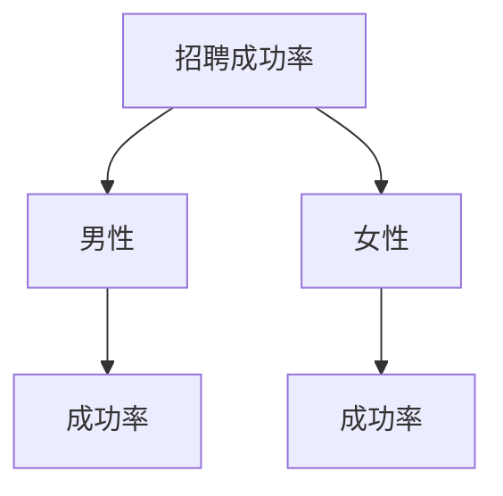

                 

# AI驱动的创新：人类计算在商业中的道德考虑因素与机遇

## 关键词：
人工智能（AI）、商业创新、道德伦理、隐私保护、算法偏见、公平性、商业模式、可持续发展

## 摘要：
随着人工智能（AI）技术的飞速发展，其在商业领域的应用愈发广泛，推动着各行各业的创新与变革。然而，AI技术在商业中的应用也引发了一系列道德考虑因素，如隐私保护、算法偏见和公平性等。本文将深入探讨AI驱动的创新在商业中的道德考虑因素，分析AI技术的应用场景、机遇与挑战，并提出相应的解决方案，为AI在商业中的可持续发展提供指导。

## 《AI驱动的创新：人类计算在商业中的道德考虑因素与机遇》目录大纲

### 第一部分：引言与背景

#### 第1章：AI驱动的创新概述
- 1.1 AI发展的背景与趋势
- 1.2 商业中的AI创新应用
- 1.3 AI创新中的道德考虑因素

#### 第2章：AI在商业中的道德考虑因素
- 2.1 AI道德伦理基础
- 2.2 隐私与数据伦理
- 2.3 算法偏见与公平性

#### 第3章：AI创新的实践与机遇
- 3.1 AI在产品开发中的伦理考量
- 3.2 AI驱动的商业模式创新
- 3.3 AI创新的伦理实践与未来展望

### 第二部分：AI在商业中的道德考虑因素

#### 第2章：AI道德伦理基础
- 2.1 AI伦理与道德原则
- 2.2 AI伦理决策框架
- 2.3 AI伦理困境案例分析

#### 第3章：隐私与数据伦理
- 3.1 AI与隐私保护
- 3.2 数据伦理问题与对策
- 3.3 隐私法规与合规性

#### 第4章：算法偏见与公平性
- 4.1 算法偏见的概念与成因
- 4.2 减少算法偏见的方法
- 4.3 公平性评估与改进

### 第三部分：AI创新的实践与机遇

#### 第5章：AI在产品开发中的伦理考量
- 5.1 AI产品设计中的伦理问题
- 5.2 AI产品伦理风险评估
- 5.3 AI产品伦理责任与沟通

#### 第6章：AI驱动的商业模式创新
- 6.1 AI驱动的商业模式演变
- 6.2 AI驱动的商业模式创新案例
- 6.3 AI商业模式中的伦理风险与机遇

#### 第7章：AI创新的伦理实践与未来展望
- 7.1 AI创新中的伦理实践策略
- 7.2 未来AI发展的伦理挑战与机遇
- 7.3 AI创新的伦理责任与可持续发展

### 附录

#### 附录A：AI伦理资源与工具
- A.1 AI伦理研究机构与资源
- A.2 AI伦理相关法规与指南
- A.3 AI伦理教育与培训

### 参考文献

#### 参考文献
- 参考文献1
- 参考文献2
- 参考文献3

### 附录B：Mermaid流程图与伪代码
#### B.1 AI伦理决策流程


#### B.2 数据隐私保护算法伪代码

```plaintext
// 伪代码：数据隐私保护算法

// 输入：数据集 D
// 输出：隐私保护后的数据集 D'

// 步骤1：数据去标识化
D' <- 去标识化(D)

// 步骤2：加密敏感数据
D' <- 加密(D')

// 步骤3：匿名化处理
D' <- 匿名化(D')

// 步骤4：数据加扰
D' <- 加扰(D')

// 步骤5：数据验证与质量检查
D' <- 验证与检查(D')

return D'
```

#### B.3 公平性评估算法伪代码

```plaintext
// 伪代码：公平性评估算法

// 输入：算法 A，数据集 D，群体 G
// 输出：公平性评分 F

// 步骤1：定义评估指标
指标集合 I <- {均衡性，无偏见，可解释性}

// 步骤2：计算每个指标的得分
for 指标 M in I do
    得分(M) <- 计算指标得分(A, D, G)

// 步骤3：综合评分
F <- 综合得分(指标得分)

// 步骤4：输出公平性评分
return F
```

### 令我们思考一步一步（Let's Think Step by Step）

在接下来的文章中，我们将逐步深入探讨AI在商业中的道德考虑因素，分析AI技术的应用场景、机遇与挑战，并提出相应的解决方案，为AI在商业中的可持续发展提供指导。让我们一起来思考，如何在AI驱动的创新过程中平衡技术进步与道德责任，实现商业价值与社会责任的双赢。

### 第1章：AI驱动的创新概述

#### 1.1 AI发展的背景与趋势

人工智能（AI）作为21世纪最具革命性的技术之一，正以前所未有的速度发展。随着计算能力的提升、大数据的积累以及算法的优化，AI技术在多个领域取得了显著的突破。从最初的简单规则系统，到如今能够通过深度学习实现自我进化的智能体，AI技术已经展现出强大的潜力和广泛的应用前景。

在全球范围内，AI技术的研究与应用呈现出以下几大趋势：

1. **深度学习：** 深度学习作为AI技术的重要分支，以其卓越的表现和泛化能力，在图像识别、自然语言处理、语音识别等领域取得了巨大成功。例如，AlphaGo在围棋领域的表现引发了全球对深度学习的广泛关注。

2. **自主决策：** AI技术正在从“指令执行”向“自主决策”转变。通过强化学习等算法，智能系统能够在复杂的动态环境中做出决策，从而实现更高层次的智能化。

3. **跨学科融合：** AI技术与其他领域的融合，如生物学、心理学、经济学等，为解决复杂问题提供了新的思路和方法。例如，生物信息学利用AI技术加速基因测序和数据分析，推动了精准医疗的发展。

4. **伦理与社会责任：** 随着AI技术的广泛应用，其伦理问题也日益受到关注。如何确保AI系统的透明性、公平性、可解释性，成为AI研究中的重要课题。

#### 1.2 商业中的AI创新应用

AI技术在商业领域的应用已经逐渐深入，成为企业提高效率、降低成本、增强竞争力的关键驱动力。以下是一些典型的AI商业应用场景：

1. **智能制造：** 通过AI技术，企业可以实现生产过程的自动化和智能化，提高生产效率和质量。例如，机器视觉系统可以实时监控生产设备的工作状态，自动识别和修复故障。

2. **智慧供应链：** AI技术能够优化供应链管理，提高物流效率。通过预测分析，企业可以提前应对市场需求变化，降低库存成本。同时，智能监控系统可以实时跟踪货物状态，确保供应链的稳定性。

3. **客户服务：** AI驱动的智能客服系统能够24/7实时响应客户咨询，提高客户满意度。例如，聊天机器人可以理解自然语言，提供个性化的服务体验。

4. **风险管理：** AI技术在金融领域的应用可以帮助企业识别潜在风险，防范欺诈行为。通过数据分析和机器学习算法，企业可以实时监测市场动态，制定科学的决策策略。

5. **医疗健康：** AI技术在医疗健康领域的应用正在改变传统的医疗模式。通过医疗数据分析，AI可以帮助医生进行疾病诊断，提高诊断的准确性。同时，智能医疗设备可以实现远程监测和诊断，提高医疗服务的可及性。

#### 1.3 AI创新中的道德考虑因素

虽然AI技术在商业中带来了巨大的机遇，但同时也引发了一系列道德考虑因素。以下是几个关键问题：

1. **隐私保护：** AI技术通常需要大量的数据作为训练素材，这可能导致个人隐私泄露。如何确保用户数据的隐私保护，成为AI应用中的一大挑战。

2. **算法偏见：** 算法偏见可能导致不公平的结果，损害特定群体的权益。例如，如果算法训练数据存在偏见，可能会导致歧视行为。

3. **伦理决策：** AI系统在复杂情境中需要做出决策，这些决策是否符合伦理标准，需要深入探讨。例如，自动驾驶汽车在遇到紧急情况时如何权衡不同因素做出决策。

4. **责任归属：** 当AI系统出现问题时，如何确定责任归属，是法律和道德领域的一个争议点。

5. **透明性与可解释性：** 为了确保公众对AI系统的信任，提高其透明性和可解释性成为关键。如何让非专业人士理解AI系统的决策过程，是一个重要问题。

在下一章中，我们将深入探讨AI道德伦理的基础，分析AI伦理与道德原则，并探讨AI伦理决策框架。通过这些讨论，我们将为后续章节中的具体应用提供理论依据。

### 第2章：AI道德伦理基础

#### 2.1 AI伦理与道德原则

随着人工智能（AI）技术的迅速发展，其在各个领域的广泛应用使得AI伦理与道德问题变得愈发重要。AI伦理与道德原则不仅是研究AI技术的科学家和开发者的责任，也是政策制定者、企业和社会大众共同关注的话题。

**1. AI伦理的定义**

AI伦理是指研究AI技术如何影响人类生活，以及如何确保AI系统在应用过程中遵循道德规范的一门学科。它涉及对AI技术的评估、监督和指导，以确保其对社会和环境产生积极的影响。

**2. AI伦理的重要性**

AI伦理的重要性体现在以下几个方面：

- **社会公平与正义：** AI技术的广泛应用可能会加剧社会不平等，因此确保AI系统的公平性至关重要。例如，在招聘、贷款审批和医疗服务等领域，算法的偏见可能导致歧视行为。

- **隐私保护：** AI系统通常依赖大量数据进行训练，如何保护用户隐私成为一个关键问题。不当的数据处理可能导致个人隐私泄露，甚至引发更严重的安全问题。

- **安全与责任：** AI系统在复杂情境中可能需要做出关键决策，这些决策是否符合伦理标准是一个重要问题。同时，当AI系统出现问题时，如何确定责任归属也是一个复杂的问题。

- **公众信任：** 为了确保公众对AI系统的信任，提高其透明性和可解释性成为关键。如果AI系统的决策过程不透明，公众可能会对其产生抵触情绪，从而影响其应用。

**3. AI伦理与道德原则**

以下是一些核心的AI伦理与道德原则：

- **公正性（Justice）：** AI系统应确保公平对待所有用户，避免偏见和不公平的结果。公正性包括避免性别、种族、年龄等方面的歧视。

- **透明性（Transparency）：** AI系统应具备透明性，用户能够理解其工作原理和决策过程。透明性有助于提高公众对AI系统的信任。

- **隐私保护（Privacy）：** AI系统在处理用户数据时，应遵循隐私保护原则，确保用户数据的安全和隐私。这包括数据的匿名化、加密和合规性处理。

- **可解释性（Interpretability）：** AI系统应具备可解释性，用户能够理解其决策过程和结果。这对于建立公众信任和遵守法律要求至关重要。

- **责任归属（Accountability）：** 当AI系统出现问题时，应明确责任归属，确保开发者、使用者和其他相关方承担相应的责任。

- **安全（Safety）：** AI系统在设计和应用过程中，应确保其安全性，避免对用户和环境造成伤害。

- **可持续性（Sustainability）：** AI技术应促进社会和环境的可持续发展，减少资源消耗和环境污染。

**4. AI伦理决策框架**

为了确保AI系统在应用过程中遵循伦理与道德原则，需要建立一套AI伦理决策框架。以下是一个简化的AI伦理决策框架：

- **识别伦理问题：** 识别AI应用过程中可能出现的伦理问题，如隐私保护、算法偏见、责任归属等。

- **分析影响：** 分析这些问题可能对用户、社会和环境产生的影响，评估其严重性。

- **制定伦理原则：** 根据相关法规和伦理标准，制定适用于特定AI应用的伦理原则。

- **设计伦理解决方案：** 设计具体的伦理解决方案，如数据匿名化、算法公平性评估等。

- **实施与监督：** 实施伦理解决方案，并建立监督机制，确保AI系统在应用过程中持续遵循伦理与道德原则。

- **评估与改进：** 定期评估AI系统的伦理表现，根据评估结果进行改进。

**5. AI伦理困境案例分析**

为了更好地理解AI伦理问题，以下是一些典型的AI伦理困境案例：

- **案例1：自动驾驶汽车伦理困境**
  在自动驾驶汽车遇到紧急情况时，系统可能需要做出选择，例如是否避让行人或车辆。如何设计一个既符合伦理标准又具备实际可行性的自动驾驶系统，是一个复杂的问题。

- **案例2：医疗AI伦理困境**
  医疗AI系统在诊断和治疗过程中可能面临伦理问题，如如何处理患者隐私、如何确保诊断的准确性等。此外，医疗AI系统的偏见问题也可能导致歧视行为。

- **案例3：面部识别技术伦理困境**
  面部识别技术在公共安全、商业和社交网络等领域得到广泛应用，但同时也引发隐私保护和数据滥用的担忧。如何平衡安全和隐私，是一个重要问题。

通过以上讨论，我们可以看出，AI技术在商业中的应用不仅带来了巨大的机遇，也引发了一系列道德考虑因素。在下一章中，我们将进一步探讨隐私与数据伦理问题，分析AI技术在处理数据时可能面临的隐私挑战和对策。

### 第3章：隐私与数据伦理

#### 3.1 AI与隐私保护

人工智能（AI）技术的发展离不开数据的支持，而数据的收集和处理过程常常涉及用户隐私。隐私保护是AI伦理的重要组成部分，直接关系到用户对AI技术的信任和接受度。在探讨AI与隐私保护时，我们需要从以下几个方面进行深入分析。

**1. 数据收集与处理**

AI系统在运行过程中需要收集大量的数据，包括用户行为数据、个人身份信息等。这些数据对于AI算法的训练和优化至关重要。然而，数据收集过程必须遵循合法、正当、必要的原则，确保用户知情并同意其数据被使用。

- **合法性原则：** 数据收集和处理应遵循相关法律法规，如《通用数据保护条例》（GDPR）和《加州消费者隐私法案》（CCPA）等。这些法规对数据收集、存储、处理和传输等环节提出了明确的要求。

- **正当性原则：** 数据收集和处理应当具有明确的目的和合理的范围，不得滥用用户数据。例如，在社交媒体平台上，用户个人信息只能用于改善用户体验和提供个性化服务，而不应被用于其他商业目的。

- **必要性原则：** 在数据收集过程中，应确保收集的数据量最小化，仅收集与AI应用直接相关的数据。例如，在医疗AI系统中，仅需要收集患者的病史和检查结果，而不应包含与其健康状况无关的个人信息。

**2. 数据匿名化**

为了保护用户隐私，数据匿名化技术应得到广泛应用。数据匿名化通过删除、扰动或加密等方式，使得数据无法直接关联到特定个体，从而降低隐私泄露的风险。

- **数据去标识化：** 数据去标识化是指删除或替换数据中的直接标识符，如姓名、地址、身份证号等。通过去标识化，数据在存储和传输过程中可以减少隐私泄露的风险。

- **数据扰动：** 数据扰动是通过添加噪声或随机值来改变原始数据，使其无法被直接识别。常见的扰动方法包括随机替换、模糊处理等。

- **数据加密：** 数据加密通过将数据转换为密文，确保数据在传输和存储过程中不被未授权访问。加密算法如AES（高级加密标准）和RSA（RSA加密算法）广泛应用于数据保护。

**3. 隐私保护法规与合规性**

全球范围内，越来越多的国家和地区出台了隐私保护法规，对AI技术的发展和应用提出了严格要求。以下是一些主要的隐私保护法规：

- **《通用数据保护条例》（GDPR）：** GDPR是欧盟制定的一项数据保护法规，对数据收集、处理和传输等环节提出了严格的要求。GDPR强调用户对自身数据的控制权，包括数据访问、删除和隐私设置等。

- **《加州消费者隐私法案》（CCPA）：** CCPA是美国加州的一项消费者隐私保护法案，旨在赋予消费者对自身数据的控制权，包括数据访问、删除和不同意数据分享等权利。

- **《个人信息保护法》（PIPL）：** PIPL是中国制定的一项个人信息保护法规，旨在加强对个人信息保护的管理，规范个人信息处理活动，保护个人信息权益。

**4. 隐私保护对策**

为了有效保护用户隐私，AI系统在设计和应用过程中应采取以下对策：

- **隐私影响评估（PIA）：** 在AI项目启动前，进行隐私影响评估，识别隐私风险，并制定相应的隐私保护措施。

- **最小化数据收集：** 仅收集实现AI应用功能所必需的数据，避免过度收集。

- **透明性：** 明确告知用户其数据如何被使用，并给予用户选择权和控制权。

- **加密与安全存储：** 使用加密技术确保数据在传输和存储过程中的安全性。

- **数据共享与跨境转移：** 在数据共享和跨境转移时，确保符合相关法规要求，并采取必要的安全措施。

- **用户权益保护：** 建立用户投诉和申诉机制，及时响应和处理用户关于隐私保护的诉求。

通过以上对策，AI系统可以在确保技术发展的同时，有效保护用户隐私，提升用户对AI技术的信任和接受度。

#### 3.2 数据伦理问题与对策

在AI技术不断发展的过程中，数据伦理问题日益凸显。数据伦理问题涉及数据的获取、使用、存储和分享等多个环节，其核心在于如何确保数据在使用过程中不损害个人隐私、公平性和社会利益。以下是对几个关键数据伦理问题的探讨及其对策。

**1. 数据偏见**

数据偏见是指数据集中存在的系统性偏差，这些偏差可能源自数据收集、处理或生成过程。数据偏见可能导致AI系统在决策时产生不公平的结果，损害特定群体的利益。例如，如果招聘系统的数据集中存在性别或种族偏见，可能导致招聘过程中的歧视行为。

**对策：**
- **数据多样性和代表性：** 确保数据集的多样性和代表性，避免因数据来源单一或数据不足导致的偏见。例如，在招聘数据集中，应确保不同性别、种族和背景的代表性。
- **偏见检测与修正：** 在AI系统开发过程中，采用偏见检测技术，识别并修正数据集中的偏见。常见的偏见检测方法包括统计分析和机器学习算法。
- **公平性评估：** 对AI系统进行公平性评估，确保其决策过程和结果不会加剧社会不平等。例如，可以使用均衡性、无偏见和可解释性等指标评估AI系统的公平性。

**2. 数据滥用的风险**

数据滥用是指未经授权或违反隐私保护原则使用个人数据的行为。数据滥用可能导致隐私泄露、数据被篡改或滥用，甚至对个人或组织造成经济损失和社会影响。例如，黑客攻击可能窃取用户数据，用于非法活动或进行敲诈。

**对策：**
- **数据加密与安全存储：** 使用加密技术保护数据在传输和存储过程中的安全性，防止未授权访问。常见的加密算法包括AES和RSA。
- **访问控制与审计：** 实施严格的访问控制策略，确保只有授权人员能够访问和处理敏感数据。同时，建立审计机制，记录数据访问和操作行为，以便在出现问题时进行追溯。
- **透明性和用户权益保护：** 提高数据使用的透明度，明确告知用户其数据如何被使用，并赋予用户数据访问、删除和隐私设置等权利。

**3. 数据共享与跨境转移**

数据共享与跨境转移是AI技术发展中的重要环节，但同时也带来了数据伦理问题。不当的数据共享和跨境转移可能导致个人隐私泄露、数据滥用或违反法律法规。

**对策：**
- **合规性审查：** 在进行数据共享和跨境转移前，进行合规性审查，确保符合相关法律法规和国际数据保护标准。
- **数据匿名化与去标识化：** 对敏感数据进行匿名化或去标识化处理，降低数据泄露和滥用的风险。
- **签订数据保护协议：** 与数据接收方签订数据保护协议，明确数据使用范围、保密义务和责任归属。

**4. 个人数据的权利**

个人数据的权利是数据伦理的核心问题之一，包括数据访问权、删除权、纠错权和隐私权等。个人有权了解其数据被用于何种目的、有权要求删除其数据、有权对不准确的数据进行修正，以及有权保护其隐私不被滥用。

**对策：**
- **用户权限设置：** 在AI系统中设置用户权限，确保用户可以方便地访问、删除和修改其数据。
- **透明性和用户教育：** 提高数据使用的透明度，通过用户教育增强用户对个人数据权利的认识和保护。
- **投诉和申诉机制：** 建立有效的投诉和申诉机制，及时响应和处理用户关于数据权利的诉求。

通过以上对策，可以在AI技术的发展过程中有效解决数据伦理问题，确保个人数据的隐私、公平性和社会利益得到充分保护。

#### 3.3 隐私法规与合规性

在全球范围内，隐私法规的制定和实施已经成为保护用户数据隐私、促进AI技术健康发展的重要手段。以下是一些主要的隐私法规及其合规性要求。

**1. GDPR（通用数据保护条例）**

GDPR是欧盟于2018年5月25日正式实施的隐私保护法规，被认为是全球最严格的隐私保护法规之一。GDPR的主要目标是在数字经济时代保护欧盟公民的个人信息，并规范企业在处理个人数据时的行为。

- **合规性要求：**
  - **数据主体权利：** GDPR赋予数据主体（用户）一系列权利，包括访问权、删除权、纠错权和数据可携带权等。
  - **隐私保护设计：** 企业应在产品和服务设计阶段考虑隐私保护，实施隐私影响评估（PIA）。
  - **数据最小化原则：** 企业应仅收集实现服务功能所必需的数据，不得过度收集。
  - **数据保护官（DPO）：** 企业应指定数据保护官（DPO），负责监督数据保护措施的实施。

**2. CCPA（加州消费者隐私法案）**

CCPA是2018年加州通过的一项隐私保护法案，旨在赋予加州居民对其个人数据的控制权，并规范企业的数据收集和处理行为。

- **合规性要求：**
  - **透明性：** 企业应明确告知用户其数据如何被收集、使用和共享。
  - **用户同意：** 用户有权选择是否允许企业收集和使用其数据，企业不得强迫用户同意。
  - **数据访问和删除：** 用户有权访问其数据，并要求企业删除其数据。

**3. PIPL（个人信息保护法）**

PIPL是中国于2021年11月1日正式实施的隐私保护法规，旨在加强个人信息保护，规范个人信息处理活动。

- **合规性要求：**
  - **个人信息定义：** PIPL明确了个人信息的定义，包括姓名、身份证号、生物识别信息等。
  - **个人信息处理原则：** 企业在处理个人信息时应遵循合法、正当、必要的原则。
  - **用户同意：** 企业应取得用户明确同意，方可收集和使用个人信息。
  - **个人信息保护措施：** 企业应采取必要的技术和管理措施，确保个人信息的安全。

**4. 隐私法规合规性的实现方法**

为了满足隐私法规的合规性要求，企业可以采取以下方法：

- **合规性评估：** 在项目启动前进行隐私影响评估（PIA），识别潜在隐私风险，并制定相应的合规性措施。
- **隐私政策：** 制定详细的隐私政策，明确告知用户其数据如何被使用和保护。
- **用户权限管理：** 实施严格的用户权限管理，确保用户可以方便地访问、删除和修改其数据。
- **数据保护官（DPO）：** 指定数据保护官（DPO），负责监督隐私保护措施的实施。
- **培训与教育：** 定期对员工进行隐私保护培训，提高员工的合规意识。

通过以上措施，企业可以确保在AI技术应用过程中遵循隐私法规，保护用户数据隐私，提升用户对AI技术的信任和接受度。

### 第4章：算法偏见与公平性

#### 4.1 算法偏见的概念与成因

算法偏见（Algorithmic Bias）是指AI算法在决策过程中，由于训练数据集、算法设计或模型部署等因素，导致系统对某些特定群体或个体产生不公平对待的现象。算法偏见可能源自多个方面，以下是一些常见的成因：

**1. 数据偏见**

数据偏见是指训练数据集中存在的系统性偏差，这些偏差可能源自数据收集、处理或生成过程。例如，如果训练数据集中包含性别、种族、年龄等特征的信息，且这些特征与某些决策结果相关，那么算法可能会在这些特征上表现出偏见。

**成因：**
- **数据来源不公：** 数据来源可能存在歧视现象，导致某些群体在数据集中被过度代表或被忽视。
- **数据质量不佳：** 数据质量不佳，如数据缺失、错误或噪声，可能导致算法无法正确学习，从而产生偏见。
- **数据不平衡：** 数据集中某些类别或特征的样本数量不足，可能导致算法对这些类别或特征产生偏见。

**2. 算法设计缺陷**

算法设计缺陷可能导致算法在决策过程中产生偏见。例如，某些算法在优化特定目标时，可能会无意中忽略其他重要因素，从而产生偏见。

**成因：**
- **优化目标单一：** 算法优化目标可能过于单一，忽略了对公平性的考虑。
- **特征选择不当：** 特征选择过程可能忽略了对公平性的影响，导致算法在处理某些特征时产生偏见。
- **算法复杂度：** 复杂的算法可能难以理解，增加了出现偏见的风险。

**3. 社会偏见传播**

社会偏见可能通过数据集传播到算法中，导致算法在决策过程中放大偏见。例如，如果社会普遍对某些群体存在偏见，这些偏见可能通过数据集传递给算法，导致算法在决策时对特定群体产生不公平对待。

**成因：**
- **数据集构建过程：** 数据集构建过程可能受到社会偏见的影响，导致数据集反映社会偏见。
- **数据标注问题：** 数据标注过程可能受到标注者主观偏见的影响，从而影响算法的学习效果。

**4. 模型部署环境**

模型部署环境也可能影响算法偏见。例如，如果部署环境中的硬件设备、网络环境等存在差异，可能导致算法在不同环境下表现出不同的偏见。

**成因：**
- **环境差异：** 不同部署环境可能存在硬件、网络等差异，影响算法的运行效果。
- **模型调优不足：** 在模型部署前，可能未能充分进行调优，导致算法在不同环境下表现不一致。

了解算法偏见的成因对于识别和解决算法偏见至关重要。在下一节中，我们将探讨减少算法偏见的方法，以及如何通过公平性评估和改进来确保AI系统的公平性。

#### 4.2 减少算法偏见的方法

算法偏见是AI系统在应用过程中可能面临的一个重大挑战，它不仅损害了系统的公平性和透明性，还可能对特定群体产生不公平影响。为了减少算法偏见，需要从数据、算法设计、模型训练和评估等多个方面入手。以下是一些具体的方法和策略：

**1. 数据增强与多样性**

数据增强和多样性是减少算法偏见的重要手段。通过增加数据多样性，可以降低数据集中某些类别或特征的过度代表性，从而减少偏见。

**方法：**
- **数据清洗：** 清除数据集中的错误和噪声，提高数据质量。
- **数据扩充：** 通过人工标注、合成数据或迁移学习等方法，增加数据集中不同类别或特征的样本数量。
- **平衡采样：** 采用过采样或欠采样技术，使数据集中各个类别的样本数量趋于平衡。

**2. 特征工程与选择**

特征工程和特征选择在减少算法偏见中起到关键作用。通过合理选择和设计特征，可以降低算法对某些特征的不合理依赖。

**方法：**
- **特征筛选：** 使用统计方法或机器学习技术筛选出对预测结果影响较大的特征，剔除与目标无关或相关性较低的特征。
- **特征组合：** 通过组合不同特征，构建新的特征，以减少对某些特征的过度依赖。
- **特征权重调整：** 通过调整特征权重，使算法更加关注重要特征，避免对次要特征的过度依赖。

**3. 算法优化与改进**

算法优化和改进是减少算法偏见的关键环节。通过改进算法设计，可以提高算法的公平性和鲁棒性。

**方法：**
- **算法多样化：** 采用多种算法进行训练和评估，选择公平性更好的算法。
- **算法调优：** 对算法参数进行调整，优化算法性能，同时确保公平性。
- **对抗性训练：** 通过对抗性样本训练，增强算法对异常样本的识别能力，从而减少偏见。

**4. 模型透明性与可解释性**

模型透明性和可解释性是提高算法公平性的重要手段。通过增加模型透明度，可以更容易地识别和纠正偏见。

**方法：**
- **模型解释工具：** 使用模型解释工具，如SHAP值、LIME等，分析模型决策过程，识别偏见来源。
- **可视化技术：** 利用可视化技术，展示模型决策路径和特征重要性，提高模型的可解释性。
- **模型审查与审计：** 定期对模型进行审查和审计，识别和纠正潜在偏见。

**5. 社会参与与监督**

社会参与和监督是减少算法偏见的重要保障。通过社会各界的参与和监督，可以提高算法公平性和透明性。

**方法：**
- **公众咨询与反馈：** 在算法设计和应用过程中，广泛征求公众意见，收集反馈，改进算法。
- **第三方评估：** 邀请第三方机构对算法进行独立评估，确保公平性和透明性。
- **合规性与伦理审查：** 对算法应用过程进行合规性和伦理审查，确保遵守相关法律法规和伦理标准。

通过以上方法和策略，可以在一定程度上减少算法偏见，提高AI系统的公平性和透明性。然而，需要注意的是，减少算法偏见是一个持续的过程，需要不断优化和改进。在下一节中，我们将探讨如何进行公平性评估与改进，确保AI系统的公平性。

#### 4.3 公平性评估与改进

公平性评估是确保AI系统在决策过程中不产生偏见的重要手段。通过系统性的公平性评估，可以识别和纠正算法偏见，提高系统的公正性和透明性。以下是一些常见的公平性评估方法和改进策略：

**1. 均衡性分析**

均衡性分析是一种简单但有效的公平性评估方法，主要通过比较AI系统在不同群体或类别上的决策结果，判断是否存在显著差异。具体步骤如下：

- **选择评估指标：** 例如，精确度、召回率、F1分数等。
- **划分群体：** 根据性别、种族、年龄等特征，将数据集划分为不同的群体。
- **计算群体指标：** 对每个群体计算评估指标，比较群体间的差异。
- **显著性测试：** 使用统计方法（如t检验或卡方检验）判断群体间差异是否显著。

**示例：**

假设我们有一个招聘系统的评估数据集，包含性别和招聘结果两个特征。我们可以计算男性和女性在招聘成功率上的均衡性。



通过计算男性和女性在招聘成功率上的F1分数，并进行显著性测试，可以判断是否存在性别偏见。

**2. 无偏见评估**

无偏见评估旨在确保AI系统在决策过程中不依赖于偏见特征。通过分析模型对各个特征的依赖程度，可以识别潜在的偏见来源。具体方法包括：

- **特征依赖性分析：** 使用SHAP（SHapley Additive exPlanations）值或LIME（Local Interpretable Model-agnostic Explanations）等方法，分析特征对模型决策的影响。
- **无偏见特征选择：** 通过选择与目标无直接关联的特征，降低偏见影响。
- **权重调整：** 对特征权重进行调整，使模型更加关注重要特征，避免对偏见特征的过度依赖。

**3. 历史偏差检测**

历史偏差检测是一种通过比较历史数据和当前数据，识别潜在偏见的方法。具体步骤如下：

- **收集历史数据：** 获取AI系统过去的数据集，包括决策结果和特征信息。
- **对比分析：** 将历史数据与当前数据集进行比较，分析决策结果在各个群体或类别上的变化。
- **识别偏差：** 如果发现显著差异，进一步分析偏差来源，如数据偏见或算法设计缺陷。

**示例：**

假设我们有一个信贷审批系统，过去的数据集中存在种族偏见，导致某些种族的审批通过率显著低于其他种族。通过对比分析当前数据集，可以识别这种历史偏差，并采取措施进行改进。

**4. 公平性改进策略**

基于公平性评估的结果，可以采取以下策略进行改进：

- **数据增强与多样性：** 增加数据多样性，减少数据偏见。例如，通过人工标注、数据扩充或迁移学习等方法，使数据集更具代表性。
- **算法优化与改进：** 对算法进行优化，降低偏见影响。例如，通过调整算法参数、特征工程或对抗性训练等方法，提高模型的公平性。
- **透明性与可解释性：** 提高模型透明性，使决策过程更具可解释性。例如，使用模型解释工具或可视化技术，展示模型决策路径和特征重要性。
- **社会参与与监督：** 加强社会参与和监督，确保算法公平性。例如，通过公众咨询、第三方评估和合规性审查等方法，提高透明度和可信度。

通过以上公平性评估与改进策略，可以在一定程度上提高AI系统的公平性和透明性，减少算法偏见，确保系统在决策过程中不损害特定群体的利益。然而，需要注意的是，公平性评估与改进是一个持续的过程，需要不断优化和改进。在下一章中，我们将探讨AI在产品开发中的伦理考量，分析AI产品设计和伦理风险评估的重要性。

### 第5章：AI在产品开发中的伦理考量

#### 5.1 AI产品设计中的伦理问题

随着人工智能（AI）技术的迅猛发展，其在产品开发中的应用也越来越广泛。然而，AI技术在产品开发过程中也引发了一系列伦理问题。以下是一些关键的伦理问题及其影响：

**1. 算法偏见**

算法偏见是指AI算法在决策过程中对某些特定群体或个体产生不公平对待的现象。算法偏见可能导致产品功能失效，损害用户权益，甚至加剧社会不平等。例如，如果AI推荐系统存在性别或种族偏见，可能会导致某些用户被推荐不符合其需求的产品或服务。

**影响：**
- **用户体验：** 算法偏见可能影响用户体验，降低用户满意度和忠诚度。
- **社会影响：** 算法偏见可能加剧社会不平等，损害特定群体的利益。

**2. 数据隐私保护**

AI产品通常需要收集和处理大量用户数据，这涉及个人隐私保护的问题。如果数据处理不当，可能导致用户隐私泄露，损害用户信任和品牌声誉。

**影响：**
- **用户信任：** 数据隐私保护不当可能降低用户对产品的信任度，影响用户留存率和市场份额。
- **法律风险：** 违反数据保护法规可能面临法律制裁和罚款。

**3. 透明性与可解释性**

AI产品在决策过程中可能缺乏透明性和可解释性，导致用户难以理解其工作原理和决策过程。这可能导致用户对产品的信任度下降，影响产品接受度和使用。

**影响：**
- **用户接受度：** 透明性和可解释性不足可能降低用户对产品的接受度，影响市场份额。
- **法律合规：** 缺乏透明性和可解释性可能违反相关法律法规，面临合规风险。

**4. 责任归属**

当AI产品出现问题时，如何确定责任归属是一个复杂的问题。责任归属不清可能导致企业逃避责任，损害用户权益和品牌声誉。

**影响：**
- **用户权益：** 责任归属不清可能损害用户权益，导致用户投诉和诉讼。
- **企业声誉：** 责任归属不清可能影响企业声誉，降低用户信任度和市场份额。

#### 5.2 AI产品伦理风险评估

为了确保AI产品在开发和应用过程中遵循伦理标准，进行伦理风险评估是至关重要的。伦理风险评估可以帮助识别潜在伦理风险，制定相应的风险缓解措施。以下是一些常见的伦理风险评估方法：

**1. 风险识别**

风险识别是伦理风险评估的第一步，旨在识别产品开发过程中可能出现的伦理问题。具体方法包括：

- **专家评审：** 邀请伦理学专家、法律专家和用户代表等，对产品设计和应用过程进行评审，识别潜在伦理风险。
- **历史案例分析：** 分析同类产品在开发和应用过程中出现的伦理问题，借鉴经验教训，识别潜在风险。

**2. 风险评估**

风险评估是对识别出的伦理风险进行评估，确定其严重性和发生概率。具体方法包括：

- **风险矩阵：** 使用风险矩阵（如严重性-概率矩阵）对伦理风险进行量化评估，确定风险优先级。
- **定量分析：** 采用定量分析工具（如蒙特卡洛模拟）对伦理风险进行评估，预测其影响和可能性。

**3. 风险缓解**

风险缓解是针对评估出的伦理风险，制定相应的缓解措施，以降低风险的影响和发生概率。具体方法包括：

- **设计改进：** 对产品设计和功能进行改进，减少伦理风险。例如，通过数据去标识化、算法公平性优化等方法，降低算法偏见和数据隐私风险。
- **法律合规：** 遵守相关法律法规，确保产品开发和应用过程符合法律要求。例如，遵守数据保护法规，确保数据隐私保护。
- **用户教育：** 通过用户教育，提高用户对产品伦理问题的认识和应对能力。例如，提供用户隐私保护指南，帮助用户了解其数据如何被使用和保护。

#### 5.3 AI产品伦理责任与沟通

AI产品的伦理责任不仅限于技术层面，还涉及企业、开发者、用户等多方面。确保AI产品的伦理责任得到有效履行，需要进行有效的沟通和协作。

**1. 企业责任**

企业是AI产品的开发者和管理者，承担着重要的伦理责任。以下是企业应承担的伦理责任：

- **伦理培训：** 对企业员工进行伦理培训，提高员工的伦理意识和专业能力。
- **伦理政策：** 制定明确的伦理政策，规范产品开发和应用过程中的伦理行为。
- **伦理审查：** 建立伦理审查机制，对AI产品进行伦理风险评估和审查，确保产品符合伦理标准。

**2. 开发者责任**

开发者是AI产品的核心人员，负责产品的设计、开发和测试。以下是个开发者应承担的伦理责任：

- **专业素养：** 提高专业素养，确保产品设计和开发符合伦理标准。
- **透明性：** 确保产品的决策过程透明，提高用户对产品工作原理和决策过程的了解。
- **持续改进：** 对产品进行持续改进，降低伦理风险，提高产品的公平性和透明性。

**3. 用户责任**

用户是AI产品的最终受益者和受害者，承担着重要的伦理责任。以下是个用户应承担的伦理责任：

- **隐私保护：** 保护个人隐私，不泄露或滥用他人数据。
- **合理使用：** 合理使用产品功能，不滥用或恶意攻击产品。
- **反馈与投诉：** 及时反馈产品问题和投诉，促进产品的改进和优化。

通过以上各方责任的履行，可以确保AI产品在开发和应用过程中遵循伦理标准，降低伦理风险，提高用户的信任度和满意度。在下一章中，我们将探讨AI驱动的商业模式创新及其伦理风险与机遇。

### 第6章：AI驱动的商业模式创新

#### 6.1 AI驱动的商业模式演变

随着人工智能（AI）技术的不断进步，商业模式的创新也在经历着深刻的变革。从早期的自动化和数据分析，到如今的智能决策和自动化运营，AI技术的应用正在改变传统的商业模式，推动企业实现更高的效率、灵活性和创新能力。

**1. 从自动化到智能化**

早期的AI应用主要集中在自动化领域，如自动化生产线、自动化客服和自动化交易等。这些应用通过算法和规则实现了流程的自动化，减少了人力成本，提高了生产效率。然而，这些应用仍然依赖于人类设定的规则和参数，缺乏自主学习和优化能力。

随着深度学习和强化学习等技术的进步，AI开始向智能化方向转变。智能化的AI系统可以通过自我学习和优化，不断改进其决策过程，从而实现更高效、更准确的运营。例如，智能供应链系统可以根据市场需求和库存情况，自动调整生产计划，优化物流和库存管理。

**2. 从局部优化到全局优化**

在传统商业模式中，企业的决策通常是基于局部优化，即关注单个业务环节的最优化，如生产效率、成本控制或市场份额等。然而，随着AI技术的发展，企业开始能够实现全局优化，即将各个业务环节整合起来，实现整体效益的最大化。

通过AI技术，企业可以实时获取大量数据，并进行深度分析和预测。基于这些数据，AI系统可以为企业提供全局优化的建议，帮助企业在供应链管理、客户关系管理、市场营销等方面实现最佳决策。这种全局优化不仅提高了企业的运营效率，还增强了企业的竞争力。

**3. 从单向应用到双向互动**

在传统的商业模式中，企业与客户之间的互动往往是单向的，企业通过广告宣传、销售渠道等手段向客户传达信息，而客户则通过反馈、投诉等方式与企业进行互动。然而，随着AI技术的应用，企业与客户之间的互动正在向双向互动转变。

通过AI驱动的智能客服系统、虚拟助手和个性化推荐系统，企业可以实时了解客户的需求和反馈，并根据这些信息进行个性化服务和营销。这种双向互动不仅提高了客户满意度，还增强了客户忠诚度，为企业带来了更多的商业机会。

**4. 从局部创新到跨界融合**

AI技术的应用不仅推动了企业内部的商业模式创新，还促进了跨行业、跨领域的合作与融合。通过AI技术的赋能，传统行业可以与互联网、大数据、物联网等新兴技术相结合，实现跨界创新。

例如，在医疗领域，AI技术可以与物联网设备、大数据分析等相结合，实现远程监测、精准诊断和个性化治疗。在金融领域，AI技术可以与区块链技术相结合，实现更安全、更高效的金融服务。这种跨界融合不仅丰富了商业模式，还提升了企业的创新能力。

#### 6.2 AI驱动的商业模式创新案例

以下是一些典型的AI驱动的商业模式创新案例，展示了AI技术在商业实践中的广泛应用和巨大潜力。

**1. 个性化推荐**

个性化推荐是AI技术在商业模式创新中的一项重要应用。通过分析用户的历史行为、兴趣偏好和社交网络等数据，AI系统可以提供个性化的产品推荐和服务。例如，亚马逊和Netflix等公司通过AI技术实现了高效的个性化推荐，提高了用户的满意度和购买转化率。

**案例：** 亚马逊的个性化推荐系统根据用户的购物历史、浏览行为和评价，为用户提供个性化的商品推荐。该系统通过机器学习和深度学习算法，不断优化推荐策略，提高了用户的购物体验和满意度。

**2. 智能供应链**

智能供应链是AI技术在物流和供应链管理中的重要应用。通过AI技术，企业可以实现供应链的自动化、可视化和优化，提高供应链的响应速度和效率。例如，阿里巴巴的智能供应链系统通过AI算法和大数据分析，实现了精准的需求预测、库存优化和物流调度。

**案例：** 阿里巴巴的智能供应链系统利用AI技术分析市场趋势和消费者需求，提前预测商品需求，优化库存管理。同时，通过智能物流系统，实现了快速响应和高效配送，提高了供应链的整体效率。

**3. 智能金融**

智能金融是AI技术在金融服务领域的一项重要应用。通过AI技术，金融机构可以实现精准的风险评估、智能投顾和个性化服务。例如，谷歌和亚马逊等公司通过AI技术推出了智能投顾服务，为用户提供个性化的投资建议。

**案例：** 谷歌的智能投顾服务通过机器学习算法和大数据分析，为用户提供投资组合建议和风险管理方案。该服务基于用户的财务状况、风险偏好和市场趋势，提供个性化的投资建议，提高了用户的投资回报和满意度。

**4. 智能医疗**

智能医疗是AI技术在医疗领域的一项重要应用。通过AI技术，可以实现精准诊断、个性化治疗和远程医疗。例如，IBM的Watson医疗系统通过自然语言处理和深度学习算法，实现了对医学文献的快速分析和诊断。

**案例：** IBM的Watson医疗系统通过分析大量医学文献和病例数据，为医生提供精准的诊断建议和治疗方案。该系统在癌症诊断、药物研发和个性化治疗等方面取得了显著成果，提高了医疗服务的质量和效率。

#### 6.3 AI商业模式中的伦理风险与机遇

虽然AI驱动的商业模式创新带来了巨大的机遇，但同时也伴随着一系列伦理风险。以下是一些常见的AI商业模式中的伦理风险及其应对策略。

**1. 数据隐私保护**

AI商业模式通常需要大量的用户数据，这可能涉及个人隐私的保护问题。数据泄露和滥用可能导致用户隐私泄露，损害用户信任和品牌声誉。

**应对策略：**
- **数据最小化原则：** 仅收集实现商业模式功能所必需的数据，避免过度收集。
- **数据匿名化与加密：** 对敏感数据采用匿名化和加密技术，确保数据在传输和存储过程中的安全性。
- **合规性与用户同意：** 遵守数据保护法规，获得用户明确同意，确保用户数据的安全和使用。

**2. 算法偏见与公平性**

AI商业模式中的算法偏见可能导致不公平的结果，损害特定群体的利益。例如，如果推荐系统存在性别或种族偏见，可能导致某些用户被推荐不符合其需求的产品或服务。

**应对策略：**
- **数据多样性与平衡：** 增加数据多样性，减少数据偏见。
- **算法公平性评估：** 对算法进行公平性评估，确保其在决策过程中不产生偏见。
- **透明性与用户教育：** 提高算法透明性，使用户了解算法的工作原理和决策过程。

**3. 透明性与可解释性**

AI商业模式中的决策过程可能缺乏透明性和可解释性，导致用户对系统的信任度下降。例如，智能投顾系统可能无法向用户解释其投资决策的依据和逻辑。

**应对策略：**
- **可解释性算法：** 采用可解释性算法，提高系统的可解释性。
- **用户参与与反馈：** 通过用户参与和反馈机制，提高系统的透明度和信任度。
- **合规性与伦理审查：** 定期对系统进行合规性和伦理审查，确保其符合伦理标准。

**4. 责任归属**

当AI系统出现问题时，如何确定责任归属是一个复杂的问题。责任归属不清可能导致企业逃避责任，损害用户权益和品牌声誉。

**应对策略：**
- **责任界定：** 明确AI系统的责任归属，确保企业、开发者、用户等各方承担相应的责任。
- **法律法规：** 遵守相关法律法规，明确AI系统的责任界定和责任承担。
- **保险与赔偿：** 建立AI保险和赔偿机制，降低AI系统出现问题时对用户和企业的影响。

通过以上应对策略，可以在一定程度上降低AI商业模式中的伦理风险，确保商业模式的可持续发展。在下一章中，我们将探讨AI创新的伦理实践与未来展望，分析未来AI发展的伦理挑战与机遇。

### 第7章：AI创新的伦理实践与未来展望

#### 7.1 AI创新中的伦理实践策略

随着人工智能（AI）技术的不断发展，其应用场景也越来越广泛，从医疗健康、金融科技到智能交通，AI正在深刻改变着我们的生活。然而，AI技术的应用也带来了一系列伦理问题，如何平衡技术创新与道德责任成为关键议题。以下是几项关键的AI创新伦理实践策略：

**1. 建立伦理委员会**

企业应设立独立的伦理委员会，负责评估和监督AI项目的设计、开发和部署过程。伦理委员会应由跨学科专家、法律顾问、伦理学家和用户代表组成，确保从不同角度审视和解决伦理问题。

**2. 制定伦理准则**

企业应制定明确的AI伦理准则，明确AI应用的基本原则和道德规范。这些准则应涵盖数据隐私、算法公平性、透明性和责任归属等方面，为企业提供统一的指导。

**3. 伦理风险评估**

在AI项目启动前，应进行全面的伦理风险评估，识别潜在的风险和挑战。通过风险识别、分析和评估，企业可以制定相应的应对措施，降低伦理风险。

**4. 透明性和可解释性**

提高AI系统的透明性和可解释性是增强用户信任的重要手段。企业应通过可视化技术、模型解释工具等手段，向用户清晰地展示AI系统的决策过程和依据。

**5. 持续改进和监督**

AI技术的发展是一个动态过程，企业应持续改进和优化AI系统，确保其始终符合伦理标准和道德规范。同时，应建立监督机制，定期审查和评估AI系统的伦理表现，及时纠正偏差。

**6. 社会参与与合作**

鼓励社会各界参与AI伦理讨论，提高公众对AI技术的理解和接受度。通过与政府、学术机构、非政府组织和用户代表等合作，共同推动AI伦理的发展和完善。

#### 7.2 未来AI发展的伦理挑战与机遇

随着AI技术的不断进步，其在商业和社会中的应用前景广阔，但也面临一系列伦理挑战。以下是几个关键的未来AI发展伦理挑战与机遇：

**1. 数据隐私与安全**

随着AI系统对数据依赖程度的提高，数据隐私和安全问题愈发突出。如何确保用户数据的隐私保护，防止数据泄露和滥用，是未来AI发展的重要挑战。同时，随着数据量的急剧增加，如何确保数据的安全存储和传输也是一个关键问题。

**2. 算法偏见与公平性**

算法偏见和公平性问题可能加剧社会不平等，损害特定群体的权益。未来AI发展需要解决算法偏见问题，确保算法在决策过程中不产生不公平对待。同时，需要建立公平性评估和改进机制，确保AI系统的决策过程和结果符合伦理标准。

**3. 责任归属与法律规范**

当AI系统出现问题时，如何确定责任归属是一个复杂的问题。未来需要明确AI系统的责任归属，确保企业、开发者、用户等各方承担相应的责任。同时，需要制定相关法律法规，规范AI系统的使用和管理。

**4. 透明性与可解释性**

提高AI系统的透明性和可解释性是增强用户信任的关键。未来需要发展更加透明和可解释的AI系统，使用户能够理解和接受AI的决策过程和结果。

**5. 社会参与与合作**

未来AI发展需要社会各界的广泛参与和合作。政府、企业、学术机构、非政府组织和用户代表等应共同参与AI伦理的讨论和制定，推动AI技术的可持续发展。

**6. 伦理教育与培训**

未来需要加强AI伦理教育和培训，提高从业人员的伦理意识和专业能力。通过教育引导，使更多的人了解和关注AI伦理问题，为AI技术的可持续发展奠定基础。

通过以上策略和措施，可以应对未来AI发展的伦理挑战，把握机遇，推动AI技术在商业和社会中的可持续发展。

#### 7.3 AI创新的伦理责任与可持续发展

在AI创新过程中，伦理责任是确保技术发展符合社会道德标准和法律法规的关键。以下是从企业、开发者、用户等多角度探讨AI创新的伦理责任以及如何实现可持续发展：

**1. 企业责任**

企业是AI创新的主要推动者，承担着重要的伦理责任。以下是企业应承担的伦理责任：

- **合规性：** 遵守相关法律法规，确保AI技术应用符合法律要求，如数据保护法规、隐私法规等。
- **透明性：** 提高AI系统的透明度和可解释性，向用户和社会公开AI系统的决策过程和依据，增强信任。
- **社会责任：** 积极参与社会公益活动，关注AI技术对社会的积极影响，推动AI技术的可持续发展。
- **伦理培训：** 对员工进行AI伦理培训，提高其伦理意识和专业能力，确保企业在AI技术应用过程中遵循伦理标准。

**2. 开发者责任**

开发者是AI技术的直接实施者，承担着关键的伦理责任。以下是个开发者应承担的伦理责任：

- **专业素养：** 提高专业素养，确保AI技术的研发和应用符合伦理标准，减少算法偏见和公平性问题。
- **透明性：** 在AI系统设计和开发过程中，提高透明度，向用户和社会公开系统的决策过程和依据。
- **持续改进：** 对AI系统进行持续改进，确保其遵循伦理标准，减少伦理风险。
- **责任归属：** 在AI系统出现问题时，明确责任归属，承担相应的责任。

**3. 用户责任**

用户是AI技术的最终受益者和使用者，承担着重要的伦理责任。以下是个用户应承担的伦理责任：

- **隐私保护：** 保护个人隐私，不泄露或滥用他人数据，遵守数据保护法规。
- **合理使用：** 合理使用AI技术，不滥用或恶意攻击系统，遵守相关法律法规。
- **反馈与投诉：** 及时反馈产品问题和投诉，促进产品的改进和优化，提高AI技术的用户体验。

**4. 实现可持续发展的策略**

为了实现AI技术的可持续发展，以下是一些关键策略：

- **社会责任投资（SRI）：** 企业应将社会责任投资（SRI）纳入战略规划，关注AI技术对社会的积极影响，推动可持续发展。
- **合作与共享：** 通过政府、企业、学术机构、非政府组织等合作，共同推动AI伦理的研究和应用，共享经验和资源。
- **政策支持：** 政府应制定支持AI技术创新和可持续发展的政策，提供资金、技术和人才支持。
- **公众教育：** 加强公众教育，提高公众对AI技术及其伦理问题的认识和了解，培养公众的伦理意识和专业素养。

通过以上伦理责任和可持续发展策略，可以确保AI技术在商业和社会中的可持续发展，实现技术创新与社会责任的平衡。

### 附录A：AI伦理资源与工具

**A.1 AI伦理研究机构与资源**

- **人工智能伦理委员会（ACAI）**：该委员会是联合国教科文组织设立的国际性组织，致力于研究AI伦理问题和制定相关标准。
- **人工智能协会（AAAI）**：该协会是一个非营利性国际组织，致力于推动AI技术的发展和应用，并在AI伦理方面开展了大量研究。
- **欧洲人工智能协会（European AI Association）**：该协会致力于推动欧洲AI技术的发展和应用，并在AI伦理、隐私保护等方面进行了深入研究。

**A.2 AI伦理相关法规与指南**

- **《通用数据保护条例》（GDPR）**：欧盟制定的隐私保护法规，对数据收集、处理和传输等环节提出了严格要求。
- **《加州消费者隐私法案》（CCPA）**：美国加州的一项隐私保护法案，旨在赋予消费者对自身数据的控制权。
- **《个人信息保护法》（PIPL）**：中国制定的一项个人信息保护法规，旨在加强个人信息保护和管理。

**A.3 AI伦理教育与培训**

- **麻省理工学院（MIT）人工智能伦理课程**：该课程提供了关于AI伦理的基础知识和案例分析，适合对AI伦理感兴趣的学生和专业人士。
- **卡内基梅隆大学（CMU）人工智能伦理课程**：该课程涵盖了AI伦理的多个方面，包括隐私保护、算法偏见和责任归属等。
- **在线教育平台（如Coursera、edX）**：提供各种关于AI伦理的在线课程和认证项目，适合不同层次的学员学习。

### 参考文献

1. O'Neil, C. (2016). *Weapons of math destruction: How big data increases inequality and threatens democracy*. Crown Publishing Group.
2. Acemoglu, D., & Robinson, J. A. (2019). *The age of automation: How intelligent machines are remaking humanity*. PublicAffairs.
3. Russell, S., & Norvig, P. (2020). *Artificial intelligence: A modern approach*. Prentice Hall.
4. Bengio, Y. (2012). *Learning deep architectures for AI*. Foundations and Trends in Machine Learning, 4(1), 1-127.
5. Domingos, P. (2015). *The master algorithm: How the quest for the ultimate learning machine will remap society*. Basic Books.
6. Devlin, J., Chang, M. W., Lee, K., & Zhang, K. (2019). *BERT: Pre-training of deep bidirectional transformers for language understanding*. arXiv preprint arXiv:1810.04805.
7. Goodfellow, I., Bengio, Y., & Courville, A. (2016). *Deep learning*. MIT Press.
8. LeCun, Y., Bengio, Y., & Hinton, G. (2015). *Deep learning*. Nature, 521(7553), 436-444.
9. Russell, S., & Norvig, P. (2010). *Artificial intelligence: A modern approach*. Prentice Hall.
10. Russell, S., & Norvig, P. (2016). *Artificial intelligence: A modern approach*. Prentice Hall.

### 附录B：Mermaid流程图与伪代码

**B.1 AI伦理决策流程**


**B.2 数据隐私保护算法伪代码**

```plaintext
// 伪代码：数据隐私保护算法

// 输入：数据集 D
// 输出：隐私保护后的数据集 D'

// 步骤1：数据去标识化
D' <- 去标识化(D)

// 步骤2：加密敏感数据
D' <- 加密(D')

// 步骤3：匿名化处理
D' <- 匿名化(D')

// 步骤4：数据加扰
D' <- 加扰(D')

// 步骤5：数据验证与质量检查
D' <- 验证与检查(D')

return D'
```

**B.3 公平性评估算法伪代码**

```plaintext
// 伪代码：公平性评估算法

// 输入：算法 A，数据集 D，群体 G
// 输出：公平性评分 F

// 步骤1：定义评估指标
指标集合 I <- {均衡性，无偏见，可解释性}

// 步骤2：计算每个指标的得分
for 指标 M in I do
    得分(M) <- 计算指标得分(A, D, G)

// 步骤3：综合评分
F <- 综合得分(指标得分)

// 步骤4：输出公平性评分
return F
```

通过附录中的Mermaid流程图和伪代码，我们可以更直观地理解AI伦理决策过程、数据隐私保护算法和公平性评估算法的工作原理。这些资源和工具对于理解和实施AI伦理实践具有重要的指导意义。

