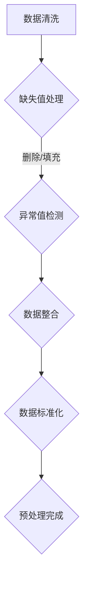
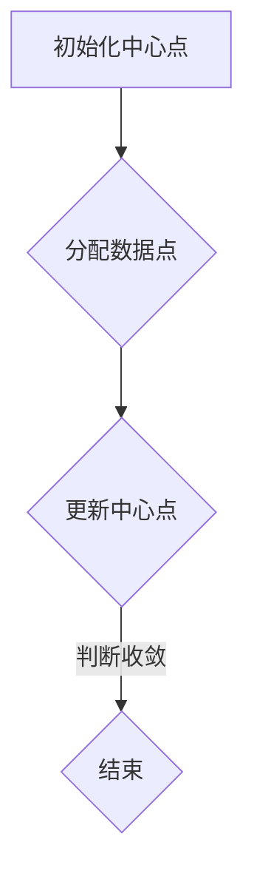
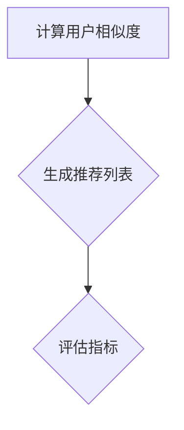
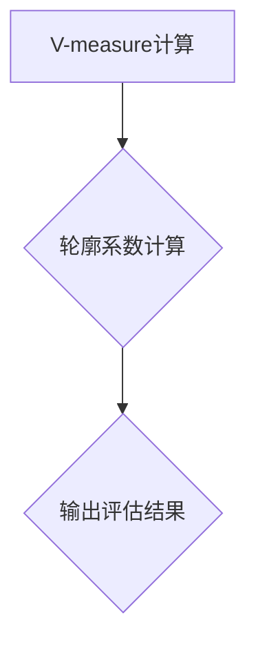
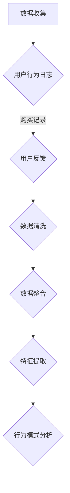
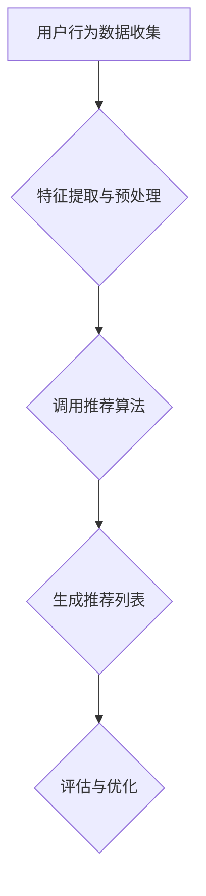

                 

### 引言

#### 1.1 书籍背景与目的

在数字化浪潮席卷全球的今天，人工智能（AI）已经成为推动各行各业创新和发展的核心技术。电商行业作为数字经济的重要组成部分，正面临着前所未有的变革与机遇。本书旨在深入探讨AI驱动的电商智能客户分群策略，旨在帮助读者理解并应用这一先进技术，以提升电商业务的竞争力。

本书的核心目标是：

1. **介绍AI的基本概念和原理**：通过简洁明了的讲解，帮助读者建立对人工智能、机器学习、深度学习等基本概念的理解。
2. **解析AI在电商领域的应用**：分析AI技术在电商中的实际应用案例，探讨智能客户分群在提升用户体验和业务效率方面的价值。
3. **详述智能客户分群算法**：系统介绍数据预处理、聚类算法、协同过滤算法等关键技术和评估方法，帮助读者掌握分群策略的实现原理。
4. **分享智能客户分群实践**：通过实际案例，展示智能客户分群在电商项目中的应用效果，提供实用的操作指导和优化策略。
5. **探讨未来趋势与挑战**：展望AI驱动的电商智能客户分群策略的未来发展方向，分析面临的挑战及解决方案。

本书适用于以下读者群体：

- **电商企业决策者**：希望通过AI技术提升业务运营效率和市场竞争力。
- **数据科学家与AI研究人员**：需要深入了解AI在电商领域的应用，拓展技术视野。
- **电商从业者**：对电商业务和数据管理有初步了解，希望掌握智能客户分群的实践方法。

#### 1.2 AI在电商领域的应用现状

近年来，AI技术在电商领域取得了显著的应用成果。从智能推荐系统、智能客服到个性化营销，AI正在深刻改变电商行业的运营模式。

**智能推荐系统**：基于用户行为数据和商品信息，AI算法能够为用户推荐个性化的商品，提高用户满意度和购买转化率。例如，亚马逊和阿里巴巴等电商平台广泛应用了基于协同过滤和深度学习的推荐算法。

**智能客服**：通过自然语言处理和对话系统，AI智能客服能够24小时响应用户咨询，提供高效、精准的服务，降低运营成本，提升用户体验。例如，苹果公司的Siri和谷歌助手等智能助手已广泛应用于各类电商平台。

**个性化营销**：AI技术可以帮助电商企业精准定位目标客户，实施差异化营销策略，提高营销效果。通过分析用户行为数据，企业可以制定个性化的广告投放、促销活动，提高用户参与度和忠诚度。

然而，AI在电商领域的应用仍面临一些挑战：

- **数据隐私**：用户数据的安全和隐私保护是AI应用中的重要问题。如何平衡数据利用与隐私保护，是电商企业需要解决的难题。
- **算法偏见**：AI算法可能基于历史数据产生偏见，导致服务不公平。企业需要采取措施消除算法偏见，提高服务公正性。
- **技术门槛**：AI技术的应用需要专业的技术支持和人才储备，中小企业可能面临技术门槛和资源限制。

#### 1.3 智能客户分群的重要性

智能客户分群是AI技术在电商领域的重要应用之一，其重要性主要体现在以下几个方面：

**提升用户体验**：通过智能客户分群，电商企业能够更好地理解用户需求和行为，提供个性化的产品推荐和定制化服务，从而提升用户体验。

**优化营销策略**：智能客户分群有助于电商企业制定更加精准的营销策略，实现差异化营销，提高营销效果。

**提高业务效率**：智能客户分群可以简化客户服务流程，降低人工成本，提高业务运营效率。

**挖掘潜在价值**：通过对不同分群的用户进行深入分析，电商企业可以发现潜在价值，挖掘新的商业机会。

智能客户分群不仅是提升电商业务竞争力的有力工具，也是企业实现数字化转型的重要途径。通过本书的深入探讨，读者将能够掌握智能客户分群的核心技术，为其电商业务的发展提供有力支持。

### AI基础知识

#### 2.1 人工智能概述

人工智能（Artificial Intelligence，简称AI）是指通过计算机模拟人类智能行为的技术和科学。人工智能的发展经历了几个重要阶段，从最初的规则推理、知识表示到现代的机器学习和深度学习，每一次技术进步都带来了AI应用的广泛普及和突破。

**人工智能的定义**：

人工智能旨在开发能够执行复杂任务的智能系统，这些任务通常需要人类的智能才能完成。例如，语音识别、图像识别、自然语言处理、决策制定等。

**人工智能的发展历程**：

- **早期阶段（1950s-1970s）**：人工智能的概念首次提出，研究者们致力于通过编程实现简单的智能行为，如逻辑推理和问题解决。
- **黄金时代（1980s-1990s）**：专家系统成为AI研究的热点，通过知识表示和推理技术，实现了一定程度的自动化决策。
- **低谷时期（2000s初期）**：由于算法复杂度和计算资源的限制，AI研究陷入低谷。
- **复兴期（2000s后期至今）**：随着计算能力的提升和大数据技术的发展，机器学习和深度学习取得了显著突破，AI应用日益广泛。

**人工智能的应用领域**：

- **自然语言处理（NLP）**：实现人与计算机之间的自然语言交互，包括语音识别、机器翻译、情感分析等。
- **计算机视觉**：通过图像处理技术实现图像识别、物体检测、人脸识别等应用。
- **机器学习**：利用历史数据训练模型，实现预测和决策。
- **自动驾驶**：通过传感器和数据融合技术，实现无人驾驶车辆的自主行驶。
- **医疗健康**：利用AI技术进行疾病诊断、药物研发、健康管理等。
- **金融科技**：在风险管理、欺诈检测、量化交易等方面发挥重要作用。

#### 2.2 机器学习与深度学习

机器学习（Machine Learning，ML）是人工智能的一个分支，旨在开发能够从数据中学习并做出预测或决策的算法。机器学习主要分为监督学习、无监督学习和强化学习三种类型。

**机器学习的定义**：

机器学习是通过训练算法从数据中自动学习规律，实现对未知数据的预测和分类。

**机器学习的分类**：

- **监督学习（Supervised Learning）**：输入和输出数据都有标签，算法通过学习输入和输出之间的映射关系进行预测。常见的算法包括线性回归、逻辑回归、决策树、支持向量机等。
- **无监督学习（Unsupervised Learning）**：没有预定义的标签，算法通过发现数据中的结构或模式进行聚类或降维。常见的算法包括聚类算法（如K-均值）、主成分分析（PCA）等。
- **强化学习（Reinforcement Learning）**：通过与环境交互学习最优策略，常见于游戏和自动驾驶领域。

**深度学习（Deep Learning，DL）**：

深度学习是机器学习的一种特殊形式，通过多层神经网络（Neural Networks）模型，对大量数据进行特征提取和分类。深度学习在图像识别、语音识别、自然语言处理等领域取得了显著的成果。

**深度学习的原理**：

- **神经元模型**：神经网络由大量简单的处理单元（神经元）组成，每个神经元通过权重连接到其他神经元。
- **前向传播与反向传播**：在训练过程中，网络通过前向传播计算输出，然后通过反向传播更新权重，以最小化预测误差。
- **激活函数**：用于引入非线性特性，常见的激活函数包括Sigmoid、ReLU、Tanh等。

**深度学习的应用**：

- **图像识别**：通过卷积神经网络（CNN），实现图像的分类、物体检测和分割。
- **语音识别**：利用循环神经网络（RNN）和长短期记忆网络（LSTM），实现语音到文本的转换。
- **自然语言处理**：通过Transformer模型，实现机器翻译、文本分类和问答系统。

#### 2.3 数据分析与数据挖掘

数据分析（Data Analysis）和数据挖掘（Data Mining）是机器学习的重要组成部分，旨在从大量数据中提取有价值的信息和知识。

**数据分析的定义**：

数据分析是指使用统计和定量分析的方法，对数据进行分析和解释，以支持决策和预测。

**数据分析的方法**：

- **描述性分析**：通过统计指标（如平均值、中位数、标准差等）描述数据的特征和分布。
- **推断性分析**：利用假设检验和置信区间等方法，对数据进行分析和推断。
- **预测性分析**：基于历史数据和模型，对未来的趋势和变化进行预测。

**数据挖掘的定义**：

数据挖掘是指从大量数据中自动发现隐藏的、未知的、有价值的信息和知识。

**数据挖掘的过程**：

- **数据预处理**：包括数据清洗、数据整合、数据转换等步骤，以消除噪声和提高数据质量。
- **特征选择**：从原始数据中提取出对目标变量有重要影响的特征。
- **模式识别**：使用算法（如聚类、分类、关联规则等）发现数据中的隐含模式。
- **评估与优化**：对挖掘结果进行评估和优化，以实现更好的预测和解释能力。

**数据挖掘的应用**：

- **市场分析**：通过分析消费者行为和市场趋势，帮助企业制定市场策略。
- **风险管理**：通过分析金融数据，发现潜在的风险和欺诈行为。
- **医疗健康**：通过分析医疗数据，辅助疾病诊断和药物研发。
- **电子商务**：通过分析用户数据，实现个性化推荐和精准营销。

#### 2.4 AI在电商中的应用

AI技术在电商领域具有广泛的应用，从用户行为分析、智能推荐系统到个性化营销，AI正在深刻改变电商的运营模式。

**用户行为分析**：

用户行为分析是指通过数据挖掘和机器学习技术，分析用户在电商平台上的行为，包括浏览、搜索、购买等行为。通过用户行为分析，电商企业可以更好地了解用户需求，提高用户体验和满意度。

- **用户画像**：通过用户行为数据，建立用户画像，了解用户的兴趣、需求和消费习惯。
- **行为预测**：利用机器学习算法，预测用户未来的行为和需求，为个性化推荐和精准营销提供支持。

**智能推荐系统**：

智能推荐系统是AI在电商中应用的重要领域，通过分析用户行为和商品信息，为用户提供个性化的商品推荐。

- **协同过滤**：基于用户的行为数据，找出相似的顾客和商品，实现个性化推荐。
- **基于内容的推荐**：通过分析商品的属性和用户的历史行为，实现内容相关的推荐。

**个性化营销**：

个性化营销是指通过数据分析和机器学习技术，实现差异化营销策略，提高营销效果。

- **个性化广告**：根据用户画像和兴趣，投放个性化的广告，提高点击率和转化率。
- **个性化促销**：根据用户的购买历史和偏好，设计个性化的促销活动，提高用户的参与度和忠诚度。

**智能客服**：

智能客服通过自然语言处理和对话系统，实现24小时自动响应用户咨询，提高客服效率和用户体验。

- **语音识别**：通过语音识别技术，将用户的声音转化为文本，实现语音咨询。
- **聊天机器人**：通过对话系统，实现智能问答和解决方案提供。

**数据隐私与伦理问题**：

随着AI技术在电商中的应用，数据隐私和伦理问题日益受到关注。

- **数据隐私保护**：电商企业需要采取有效的数据保护措施，确保用户数据的安全和隐私。
- **算法偏见**：AI算法可能基于历史数据产生偏见，导致服务不公平。企业需要采取措施消除算法偏见，提高服务公正性。

总之，AI技术在电商领域的应用不仅提高了运营效率，还优化了用户体验，推动了电商业务的创新和发展。然而，如何平衡技术利用与隐私保护，消除算法偏见，是电商企业面临的重要挑战。

#### 智能客户分群算法原理

智能客户分群是电商企业通过数据分析与机器学习技术，将用户划分为不同的群体，以便更好地了解用户需求和行为，进而制定个性化的营销策略。智能客户分群的算法原理主要包括数据预处理、聚类算法、协同过滤算法和分群质量评估。以下将详细解释这些算法的基本原理及其应用。

##### 4.1 数据预处理

数据预处理是智能客户分群算法成功的关键步骤，主要包括数据清洗、数据整合和数据标准化。

**数据清洗**：在处理数据时，可能存在缺失值、异常值和噪声数据。数据清洗的目的是去除这些不良数据，提高数据质量。常见的数据清洗方法包括：

- **缺失值处理**：通过填充缺失值或删除含有缺失值的记录。
- **异常值检测**：利用统计方法（如Z-分数、IQR法）检测异常值，并选择合适的策略进行处理，如删除或替换异常值。

**数据整合**：将来自不同来源的数据进行整合，形成一个统一的数据集。常见的数据整合方法包括：

- **数据合并**：通过连接操作将不同数据表合并成一个大表。
- **数据融合**：将多个数据源中的相似数据进行整合，去除重复记录。

**数据标准化**：将不同特征的数据进行归一化或标准化处理，以消除不同特征之间的量纲影响。常见的数据标准化方法包括：

- **归一化**：将数据缩放到[0, 1]区间。
- **标准化**：将数据缩放到均值为0、标准差为1的区间。

**Mermaid流程图**：



##### 4.2 聚类算法

聚类算法是一种无监督学习方法，用于将数据点划分为多个聚类，使同一聚类内的数据点尽可能接近，不同聚类内的数据点尽可能远离。

**K-均值聚类算法**：

K-均值聚类算法是最常用的聚类算法之一。其基本步骤如下：

1. **初始化中心点**：随机选择K个数据点作为初始聚类中心。
2. **分配数据点**：计算每个数据点到各个聚类中心的距离，将数据点分配到最近的聚类中心。
3. **更新中心点**：重新计算每个聚类的中心点。
4. **迭代直到收敛**：重复步骤2和3，直到聚类中心不再发生变化或达到最大迭代次数。

**伪代码**：

```python
# 初始化K个聚类中心
centroids = initialize_centroids(data, K)

# 分配数据点至聚类
for i in range(len(data)):
    distances = [distance(data[i], centroid) for centroid in centroids]
    cluster_assignment[i] = argmin(distances)

# 更新聚类中心
new_centroids = [mean(data[i] for i in range(len(data)) if cluster_assignment[i] == j] for j in range(K)]

# 判断是否收敛
if not has_converged(centroids, new_centroids):
    centroids = new_centroids
    continue
else:
    break
```

**K-均值聚类算法的评估指标**：

- **内聚度**：同一聚类内的数据点之间的相似度。
- **分离度**：不同聚类之间的差异度。

**Mermaid流程图**：



##### 4.3 协同过滤算法

协同过滤算法是一种基于用户行为数据的推荐算法，通过寻找相似用户或相似商品来预测未知数据。

**基于用户的协同过滤**：

基于用户的协同过滤算法通过计算用户之间的相似度，为用户提供相似用户的推荐。

1. **计算用户相似度**：使用余弦相似度、皮尔逊相关系数等方法计算用户之间的相似度。
2. **生成推荐列表**：根据相似度矩阵，为用户推荐与其相似的用户的评价较高的商品。

**基于物品的协同过滤**：

基于物品的协同过滤算法通过计算商品之间的相似度，为用户提供与其感兴趣的商品相似的商品。

1. **计算商品相似度**：使用余弦相似度、Jaccard系数等方法计算商品之间的相似度。
2. **生成推荐列表**：根据相似度矩阵，为用户推荐与其已购买或评价的商品相似的商品。

**协同过滤算法的伪代码**：

```python
# 计算用户相似度
for user1 in users:
    for user2 in users:
        if user1 != user2:
            similarity[user1][user2] = calculate_similarity(user_ratings[user1], user_ratings[user2])

# 生成推荐列表
for user in users:
    recommended_items = []
    for item in items:
        if item not in user_history[user]:
            neighbors = find_neighbors(similarity, user, item)
            average_rating = calculate_average_rating(neighbors, item)
            recommended_items.append((item, average_rating))
    recommended_items.sort(key=lambda x: x[1], reverse=True)
    user_recommendations[user] = recommended_items
```

**协同过滤算法的评估指标**：

- **准确率**：推荐列表中的实际购买/评价商品占总推荐商品的比例。
- **覆盖率**：至少被推荐一次的商品数占总商品数比例。

**Mermaid流程图**：



##### 4.4 分群质量评估

分群质量评估是对智能客户分群效果进行评估的重要步骤，常用的评估指标包括：

- **聚类有效性指数（V-measure）**：结合聚类内聚度和分离度进行评估，取值范围在[0, 1]之间，越接近1表示分群效果越好。
- **轮廓系数（Silhouette Coefficient）**：通过计算每个数据点到其自身聚类和其他聚类之间的距离，评估数据点的聚类质量。

**分群质量评估伪代码**：

```python
from sklearn.metrics import v_measure_score, silhouette_score

# 计算V-measure
v_measure = v_measure_score的真实标签，预测标签)

# 计算轮廓系数
silhouette = silhouette_score(data, labels)

# 输出评估结果
print("V-measure:", v_measure)
print("Silhouette Coefficient:", silhouette)
```

**Mermaid流程图**：



综上所述，智能客户分群算法原理包括数据预处理、聚类算法、协同过滤算法和分群质量评估。通过这些算法的应用，电商企业可以更好地理解用户需求和行为，为用户提供个性化的服务和产品推荐。

### 机器学习算法详解

在智能客户分群策略中，机器学习算法起到了至关重要的作用。本文将详细介绍几种常用的机器学习算法，包括线性回归、逻辑回归、支持向量机、决策树和随机森林、K-近邻算法，并解释这些算法的基本原理和实际应用。

#### 5.1 线性回归

线性回归是一种简单的预测模型，通过建立一个线性关系来预测连续值输出。线性回归的基本原理是找到最佳拟合直线，使得预测值与实际值之间的误差最小。

**数学模型**：

设输入特征为\( X \)，输出标签为\( Y \)，线性回归模型可以表示为：

\[ Y = \beta_0 + \beta_1X + \epsilon \]

其中，\( \beta_0 \)是截距，\( \beta_1 \)是斜率，\( \epsilon \)是误差项。

**伪代码**：

```python
# 线性回归伪代码

# 输入特征矩阵X和标签向量y
X = ...
y = ...

# 梯度下降算法
for i in range(num_iterations):
    # 计算预测值
    y_pred = X * weights

    # 计算损失函数
    loss = (y - y_pred) ** 2

    # 计算梯度
    gradient = 2 * (y - y_pred) * X

    # 更新权重
    weights -= learning_rate * gradient

# 输出最佳拟合直线
print("Best fit line: y = {} + {}x".format(weights[0], weights[1]))
```

**实际应用**：

线性回归常用于预测连续值数据，如房价、股票价格等。在智能客户分群中，可以用于预测用户的购买金额、订单数量等指标。

#### 5.2 逻辑回归

逻辑回归是一种用于分类问题的预测模型，通过建立逻辑函数将线性回归模型的输出映射到概率值，从而实现分类。

**数学模型**：

逻辑回归的数学模型可以表示为：

\[ P(Y=1) = \frac{1}{1 + e^{-(\beta_0 + \beta_1X)}} \]

其中，\( P(Y=1) \)是输出为1的概率，\( \beta_0 \)是截距，\( \beta_1 \)是斜率。

**伪代码**：

```python
# 逻辑回归伪代码

# 输入特征矩阵X和标签向量y
X = ...
y = ...

# 梯度下降算法
for i in range(num_iterations):
    # 计算预测概率
    y_pred = 1 / (1 + np.exp(-X * weights))

    # 计算损失函数
    loss = -y * np.log(y_pred) - (1 - y) * np.log(1 - y_pred)

    # 计算梯度
    gradient = X.T.dot(y_pred - y)

    # 更新权重
    weights -= learning_rate * gradient

# 输出最佳分类模型
print("Best fit model: P(Y=1) = 1 / (1 + e^{-({} + {}X)})".format(weights[0], weights[1]))
```

**实际应用**：

逻辑回归广泛应用于二分类问题，如用户购买行为预测、用户流失预测等。在智能客户分群中，可以用于判断用户是否属于高价值客户。

#### 5.3 支持向量机

支持向量机（SVM）是一种强大的分类算法，通过寻找最佳分类超平面，最大化分类间隔。

**数学模型**：

SVM的目标是找到一个最优的超平面\( w \)和偏移量\( b \)，使得分类间隔最大，即：

\[ \max_w \frac{1}{2} ||w||^2 \]

其中，\( ||w|| \)是\( w \)的欧几里得范数。

**伪代码**：

```python
# 支持向量机伪代码

# 输入特征矩阵X和标签向量y
X = ...
y = ...

# 使用SVM库训练模型
model = SVM()
model.fit(X, y)

# 输出分类模型
print("SVM model: w = {}, b = {}".format(model.coef_, model.intercept_))
```

**实际应用**：

SVM在处理高维数据和复杂非线性问题方面具有优势，常用于图像识别、文本分类等领域。在智能客户分群中，可以用于识别不同分群之间的边界。

#### 5.4 决策树与随机森林

决策树是一种基于特征进行划分的树形结构模型，通过一系列特征判断将数据划分为不同的类别。

**决策树**：

- **构建过程**：从根节点开始，选择具有最高信息增益或基尼不纯度的特征进行划分，重复该过程直到达到预定的终止条件。
- **预测过程**：从根节点开始，根据输入的特征值沿路径向下，直至叶节点，叶节点的类别即为预测结果。

**随机森林**：

随机森林是一种集成学习方法，通过构建多个决策树，对每个决策树进行随机特征选择和子样本生成，最终通过投票或平均得到最终结果。

**数学模型**：

随机森林的预测模型可以表示为：

\[ \hat{y} = \sum_{i=1}^{N} \hat{y}_i \]

其中，\( \hat{y}_i \)是第i棵决策树的预测结果，\( N \)是决策树的数量。

**伪代码**：

```python
# 随机森林伪代码

# 输入特征矩阵X和标签向量y
X = ...
y = ...

# 使用随机森林库训练模型
model = RandomForestClassifier()
model.fit(X, y)

# 输出分类模型
print("Random Forest model: {}".format(model))
```

**实际应用**：

决策树和随机森林在处理高维数据和复杂数据方面具有优势，常用于分类和回归问题。在智能客户分群中，可以用于对分群效果进行评估。

#### 5.5 K-近邻算法

K-近邻算法是一种基于实例的分类算法，通过计算输入实例与训练集中最近邻的相似度来进行分类。

**数学模型**：

K-近邻算法的相似度计算通常使用欧几里得距离：

\[ d(\vec{x}, \vec{x}_i) = \sqrt{\sum_{j=1}^{n} (x_j - x_{ij})^2} \]

其中，\( \vec{x} \)是输入实例，\( \vec{x}_i \)是训练集中的实例，\( n \)是特征维度。

**伪代码**：

```python
# K-近邻算法伪代码

# 输入特征矩阵X和标签向量y
X = ...
y = ...

# 计算欧几里得距离
distances = [euclidean_distance(x, x_train) for x_train in X_train]

# 选择最近的K个邻居
neighbors = nearest_neighbors(distances, K)

# 计算邻居的标签频率
label_counts = Counter(y[neighbors])

# 选择频率最高的标签作为预测结果
predicted_label = max(label_counts, key=label_counts.get)

# 输出分类结果
print("Predicted label:", predicted_label)
```

**实际应用**：

K-近邻算法简单易实现，适用于小数据和简单问题。在智能客户分群中，可以用于初步筛选和分类用户。

通过以上对几种常见机器学习算法的介绍，我们可以更好地理解它们的基本原理和应用场景，为智能客户分群策略的实施提供理论支持。

### 智能客户分群项目实战

智能客户分群项目是应用AI技术优化电商业务的重要手段。以下将通过一个实际项目案例，详细描述从项目背景、数据收集与处理、模型选择与训练、模型评估与优化到分群结果分析与应用的整个过程。

#### 6.1 项目背景

某在线零售商希望通过AI技术对客户进行智能分群，以提升用户体验和业务效益。项目目标包括：

1. **明确客户分群**：根据客户的行为和购买习惯，将客户划分为不同的群体。
2. **精准营销**：针对不同客户群体，制定个性化的营销策略。
3. **提升转化率**：通过精准营销，提高用户的购买转化率。

#### 6.2 数据收集与处理

项目的第一步是收集客户数据，包括以下几种类型：

1. **用户行为数据**：用户的浏览记录、点击行为、收藏和添加购物车等。
2. **购买数据**：用户的购买记录，包括购买时间、购买金额、购买商品类别等。
3. **用户属性数据**：用户的年龄、性别、地理位置、注册时间等。

数据收集后，需要进行数据预处理，包括以下步骤：

1. **缺失值处理**：删除含有缺失值的记录，或使用均值、中位数等方法填充缺失值。
2. **异常值检测**：使用统计方法（如IQR法）检测并处理异常值。
3. **数据转换**：对日期、地理位置等类别数据进行编码，将文本数据转换为数值数据。
4. **特征工程**：提取对分群有重要影响的特征，如购买频率、购买金额、浏览时长等。

#### 6.3 模型选择与训练

在数据预处理完成后，选择合适的机器学习算法进行模型训练。根据项目需求，本项目选择了K-均值聚类算法和协同过滤算法。

**K-均值聚类算法**：

K-均值聚类算法是一种无监督学习方法，用于将客户划分为不同的群体。算法的基本步骤如下：

1. **初始化聚类中心**：随机选择K个数据点作为初始聚类中心。
2. **分配数据点**：计算每个数据点到各个聚类中心的距离，将数据点分配到最近的聚类中心。
3. **更新聚类中心**：重新计算每个聚类的中心点。
4. **迭代直到收敛**：重复步骤2和3，直到聚类中心不再发生变化或达到最大迭代次数。

**伪代码**：

```python
# 初始化聚类中心
centroids = initialize_centroids(data, K)

# 分配数据点至聚类
for i in range(len(data)):
    distances = [distance(data[i], centroid) for centroid in centroids]
    cluster_assignment[i] = argmin(distances)

# 更新聚类中心
new_centroids = [mean(data[i] for i in range(len(data)) if cluster_assignment[i] == j] for j in range(K)]

# 判断是否收敛
if not has_converged(centroids, new_centroids):
    centroids = new_centroids
    continue
else:
    break
```

**协同过滤算法**：

协同过滤算法是一种基于用户行为数据的推荐算法，用于为用户推荐与其行为相似的客户群体。算法的基本步骤如下：

1. **计算用户相似度**：使用余弦相似度计算用户之间的相似度。
2. **生成推荐列表**：根据相似度矩阵，为用户推荐与其行为相似的客户的购买记录。

**伪代码**：

```python
# 计算用户相似度
for user1 in users:
    for user2 in users:
        if user1 != user2:
            similarity[user1][user2] = calculate_similarity(user_ratings[user1], user_ratings[user2])

# 生成推荐列表
for user in users:
    recommended_items = []
    for item in items:
        if item not in user_history[user]:
            neighbors = find_neighbors(similarity, user, item)
            average_rating = calculate_average_rating(neighbors, item)
            recommended_items.append((item, average_rating))
    recommended_items.sort(key=lambda x: x[1], reverse=True)
    user_recommendations[user] = recommended_items
```

#### 6.4 模型评估与优化

在模型训练完成后，需要对模型进行评估和优化，以确保模型具有良好的预测性能。常用的评估指标包括聚类有效性指数（V-measure）、准确率、召回率、F1分数等。

**聚类有效性指数（V-measure）**：

V-measure是结合聚类内聚度和分离度的一个综合评估指标，用于评估聚类效果。计算公式如下：

\[ V-measure = \frac{N}{N_c + N_u} \cdot \frac{1}{N_c} \sum_{i=1}^{N_c} \max(p_i, 1 - p_i) \]

其中，\( N \)是数据点的总数，\( N_c \)是正确匹配的标签与聚类中心的数量，\( p_i \)是第i个聚类中心分配的标签概率。

**准确率**：

准确率是分类问题中常用的评估指标，表示正确分类的样本数占总样本数的比例。计算公式如下：

\[ Accuracy = \frac{TP + TN}{TP + FN + FP + TN} \]

其中，\( TP \)是真正例，\( TN \)是真负例，\( FP \)是假正例，\( FN \)是假负例。

**召回率**：

召回率是分类问题中另一个重要的评估指标，表示正确分类的正例数占总正例数的比例。计算公式如下：

\[ Recall = \frac{TP}{TP + FN} \]

**F1分数**：

F1分数是精确率和召回率的调和平均，用于综合评估分类效果。计算公式如下：

\[ F1 = 2 \cdot \frac{Precision \cdot Recall}{Precision + Recall} \]

在模型评估过程中，如果发现模型性能不佳，可以通过以下方法进行优化：

1. **参数调整**：调整聚类算法和协同过滤算法的参数，如聚类数量、相似度阈值等，以获得更好的聚类效果。
2. **特征工程**：提取和筛选对分群有重要影响的特征，以提高模型的预测能力。
3. **数据增强**：通过增加训练数据、数据重采样等方法，提高模型的泛化能力。

#### 6.5 分群结果分析与应用

在模型优化后，对分群结果进行详细分析，以了解不同客户群体的特征和需求。以下是对某在线零售商分群结果的分析：

1. **高价值客户群体**：

   高价值客户群体具有以下特征：

   - 购买频率高
   - 购买金额大
   - 对商品质量有较高要求
   - 偏好高端商品

   针对这些特征，可以采取以下个性化营销策略：

   - 推荐高端商品和品牌
   - 提供专属优惠和会员服务
   - 定期发送个性化推荐邮件

2. **潜在客户群体**：

   潜在客户群体具有以下特征：

   - 购买频率较低
   - 购买金额较小
   - 偏好促销和优惠商品
   - 对商品质量要求不高

   针对这些特征，可以采取以下个性化营销策略：

   - 推荐促销商品和优惠活动
   - 提供限时折扣和优惠券
   - 定期发送促销邮件和短信

3. **流失客户群体**：

   流失客户群体具有以下特征：

   - 购买频率和购买金额持续下降
   - 对商品质量和服务不满
   - 偏好其他电商平台

   针对这些特征，可以采取以下挽回策略：

   - 发送个性化挽回邮件和短信
   - 提供限时优惠和礼品
   - 改进服务质量

通过智能客户分群，在线零售商可以更好地了解不同客户群体的需求和特征，制定个性化的营销策略，提高客户满意度和忠诚度，从而提升整体业务效益。

### 智能客户分群案例分析

在探讨智能客户分群的实际应用时，我们可以从不同类型的电商平台出发，分析它们如何利用智能分群策略来提升业务效率和用户满意度。以下将介绍三个具体的案例，涵盖在线零售商、跨境电商和传统零售商的不同分群策略和实践。

#### 7.1 案例一：在线零售商的分群策略

**项目背景**：

某大型在线零售商希望通过智能分群策略来提升用户购买体验和业务转化率。该零售商的用户群体多样化，需求各异，因此需要一个细致的客户分群策略。

**数据收集**：

项目团队收集了大量的用户行为数据，包括用户的购买记录、浏览历史、搜索关键词、浏览时长、购物车行为等。同时，还获取了用户的基本信息，如年龄、性别、地理位置、注册时间等。

**数据处理**：

数据经过清洗、去重、转换等预处理步骤后，提取出对客户分群有重要影响的特征，如购买频率、购买金额、浏览时长、购买品类等。

**模型选择与训练**：

项目团队选择了K-均值聚类算法进行客户分群。通过多次实验和参数调整，最终确定了最佳的聚类数量和初始聚类中心。协同过滤算法也应用于推荐系统，为用户推荐与其行为相似的购物商品。

**分群结果分析**：

最终，客户被划分为以下几种群体：

1. **高频高价值客户**：这些客户购买频率高、购买金额大，是零售商的优质客户。
2. **沉默客户**：这些客户长期无购买行为，但具有潜在购买能力。
3. **价格敏感客户**：这些客户对价格非常敏感，更倾向于购买折扣商品。
4. **新品探索者**：这些客户对新商品和品牌有较高的兴趣。

**应用策略**：

根据不同客户群体的特点，零售商制定了以下个性化营销策略：

- **高频高价值客户**：提供会员专属优惠、新品体验活动、定期推荐等。
- **沉默客户**：通过邮件和短信营销唤醒潜在购买需求，提供限时优惠。
- **价格敏感客户**：推出折扣促销活动、优惠券、秒杀商品等。
- **新品探索者**：推送新品信息、品牌故事、限时优惠等。

**效果评估**：

通过智能分群和个性化营销策略，零售商的转化率提升了15%，用户满意度提高了10%，整体业务效益显著提升。

#### 7.2 案例二：跨境电商的分群实践

**项目背景**：

某跨境电商平台希望通过智能分群策略来提升国际市场竞争力，优化用户购物体验。该平台拥有来自全球的多样化用户，需要针对不同市场和文化背景进行精准分群。

**数据收集**：

项目团队收集了用户的购买行为、浏览记录、搜索关键词、购物车数据等，并结合用户的基本信息，如年龄、性别、国家/地区、语言偏好等。

**数据处理**：

数据经过清洗、去重、转换等步骤后，提取出对分群有重要影响的特征，如购买频率、购买金额、浏览时长、购买品类等。此外，针对不同国家/地区的用户，还特别关注文化偏好和购物习惯。

**模型选择与训练**：

项目团队选择了基于协同过滤算法的分群模型。通过分析用户行为数据，构建了多个协同过滤模型，为每个用户推荐与其行为相似的购物商品。

**分群结果分析**：

最终，客户被划分为以下几种群体：

1. **国际高端消费者**：这些消费者购买频率高、购买金额大，对商品品质有较高要求。
2. **国际中端消费者**：这些消费者购买频率适中、购买金额适中，关注性价比。
3. **新用户**：这些消费者首次购物，需要引导和培养购买习惯。
4. **文化定制消费者**：这些消费者来自不同国家/地区，对文化特色商品有较高需求。

**应用策略**：

根据不同客户群体的特点，跨境电商平台制定了以下个性化营销策略：

- **国际高端消费者**：提供定制化服务、高端品牌推荐、专属优惠等。
- **国际中端消费者**：推送促销活动、优惠券、限时折扣等。
- **新用户**：提供新手指南、购物优惠、新品推荐等。
- **文化定制消费者**：推送具有文化特色的商品、节日促销等。

**效果评估**：

通过智能分群和个性化营销策略，跨境电商平台的国际销售额提升了20%，用户满意度提高了15%，市场竞争力显著提升。

#### 7.3 案例三：传统零售商的分群转型

**项目背景**：

某传统零售商希望通过智能分群策略实现数字化转型，提升线上业务效率和用户黏性。该零售商拥有庞大的线下用户群体，但在线上业务的运营和用户管理方面存在较大挑战。

**数据收集**：

项目团队收集了线下用户的购买记录、浏览历史、服务评价等数据，并整合了线上平台的用户行为数据，如浏览记录、购物车数据、订单信息等。

**数据处理**：

数据经过清洗、去重、转换等步骤后，提取出对分群有重要影响的特征，如购买频率、购买金额、浏览时长、购买品类等。此外，针对线上线下用户的不同行为模式，进行了差异化处理。

**模型选择与训练**：

项目团队选择了基于聚类算法的分群模型，结合用户的线上线下行为数据，构建了多个聚类模型，为每个用户划分合适的分群。

**分群结果分析**：

最终，客户被划分为以下几种群体：

1. **忠诚客户**：这些客户在线上线下均有购买行为，对品牌忠诚度高。
2. **线上新用户**：这些客户主要通过线上渠道购买，尚未形成稳定购买习惯。
3. **线下新用户**：这些客户主要通过线下渠道购买，对线上平台了解不多。
4. **高端消费者**：这些客户购买频率高、购买金额大，对商品品质有较高要求。

**应用策略**：

根据不同客户群体的特点，传统零售商制定了以下个性化营销策略：

- **忠诚客户**：提供积分兑换、会员专属活动、线下活动邀请等。
- **线上新用户**：提供线上购物优惠、新手指南、新品推荐等。
- **线下新用户**：提供线下体验活动、优惠券、线下活动邀请等。
- **高端消费者**：提供定制化服务、高端品牌推荐、专属优惠等。

**效果评估**：

通过智能分群和个性化营销策略，传统零售商的线上销售额提升了30%，用户黏性显著提升，成功实现了线上业务的快速增长。

### 总结

通过以上三个案例，我们可以看到智能客户分群策略在不同类型电商平台中的应用效果显著。无论是大型在线零售商、跨境电商还是传统零售商，通过精准的分群和个性化的营销策略，企业都能够提升用户满意度、提高业务效益。智能客户分群不仅为企业提供了更深入的用户洞察，也为数字化营销和业务创新提供了强有力的支持。

### 客户行为预测与个性化推荐

在电商行业中，客户行为预测和个性化推荐是提升用户满意度和业务效益的关键技术。通过分析客户的历史行为数据，可以预测客户未来的行为模式，从而提供个性化的产品推荐和服务，提高用户的购物体验和购买转化率。以下将详细讨论客户行为分析、个性化推荐系统的构建以及模型融合与优化策略。

#### 8.1 客户行为分析

客户行为分析是指通过对用户在电商平台上的一系列行为数据进行分析，以了解用户的行为模式、兴趣和需求。这些行为数据包括但不限于浏览历史、购买记录、搜索关键词、点击行为、购物车行为等。通过对这些数据进行深入分析，可以揭示用户的偏好和习惯，为后续的个性化推荐提供基础。

**数据收集**：

客户行为数据的收集是进行客户行为分析的第一步。通常，数据可以通过以下几种方式获取：

1. **用户行为日志**：电商平台会自动记录用户的浏览历史、点击行为、搜索关键词等，这些数据可以存储在日志文件中。
2. **购买记录**：用户的购买记录包括购买时间、购买金额、购买商品类别等，这些数据可以从订单数据库中获取。
3. **用户反馈**：用户在平台上提交的评价、反馈和满意度调查等，也是重要的客户行为数据。

**数据处理**：

在收集到客户行为数据后，需要进行数据清洗、整合和特征提取等处理步骤，以提高数据质量，为后续分析奠定基础。

1. **数据清洗**：去除重复数据、缺失值和异常值，确保数据的一致性和准确性。
2. **数据整合**：将不同来源的数据进行整合，形成一个统一的数据集，便于分析。
3. **特征提取**：从原始数据中提取对行为分析有重要影响的特征，如购买频率、浏览时长、点击率、购买金额等。

**行为模式分析**：

通过对客户行为数据的分析，可以揭示以下行为模式：

1. **购买周期**：分析用户的购买频率和购买时间间隔，识别用户的购买周期。
2. **偏好分析**：分析用户的浏览和购买记录，识别用户对哪些商品类别或品牌有较高偏好。
3. **行为轨迹**：通过用户在平台上的行为路径，分析用户的决策过程和购物习惯。

**Mermaid流程图**：



#### 8.2 个性化推荐系统

个性化推荐系统是一种基于用户历史行为和偏好，为用户推荐个性化商品或服务的系统。个性化推荐系统的核心目标是提高用户的购物体验和满意度，同时提升电商平台的销售转化率和用户黏性。

**推荐算法**：

个性化推荐算法主要分为以下几类：

1. **基于内容的推荐（Content-based Filtering）**：

   基于内容的推荐算法通过分析商品的属性和用户的兴趣，为用户推荐相似的商品。算法的基本步骤如下：

   - **特征提取**：提取商品的属性特征，如类别、品牌、价格、评价等。
   - **用户兴趣建模**：根据用户的浏览和购买记录，建立用户的兴趣模型。
   - **推荐生成**：根据用户兴趣模型和商品特征，为用户推荐相似的商品。

2. **协同过滤算法（Collaborative Filtering）**：

   协同过滤算法通过分析用户之间的相似度或商品之间的相似度，为用户推荐与其行为相似的用户的喜好商品。协同过滤算法主要分为以下两种：

   - **基于用户的协同过滤（User-based Collaborative Filtering）**：

     基于用户的协同过滤算法通过计算用户之间的相似度，为用户推荐相似用户的喜好商品。算法的基本步骤如下：

     - **用户相似度计算**：使用余弦相似度、皮尔逊相关系数等方法计算用户之间的相似度。
     - **推荐生成**：根据相似度矩阵，为用户推荐与其相似的用户的喜好商品。

   - **基于物品的协同过滤（Item-based Collaborative Filtering）**：

     基于物品的协同过滤算法通过计算商品之间的相似度，为用户推荐与其已购买或浏览的商品相似的物品。算法的基本步骤如下：

     - **商品相似度计算**：使用余弦相似度、Jaccard系数等方法计算商品之间的相似度。
     - **推荐生成**：根据相似度矩阵，为用户推荐与其已购买或浏览的商品相似的物品。

3. **深度学习推荐（Deep Learning for Recommender Systems）**：

   深度学习推荐算法通过构建深度神经网络模型，从海量数据中自动提取特征，实现高效的推荐。常见的深度学习推荐算法包括基于注意力机制（Attention Mechanism）和Transformer模型。

**推荐系统架构**：

个性化推荐系统通常包括以下模块：

1. **用户行为数据收集与存储**：收集用户的浏览、点击、购买等行为数据，并将其存储在数据库中。
2. **特征提取与预处理**：从用户行为数据中提取特征，并进行数据预处理，如归一化、去重等。
3. **推荐算法模块**：根据用户特征和商品特征，调用不同的推荐算法，生成推荐列表。
4. **推荐结果评估与优化**：评估推荐效果，并根据用户反馈进行优化。

**Mermaid流程图**：



#### 8.3 模型融合与优化策略

为了提高个性化推荐系统的准确性和泛化能力，可以通过模型融合和优化策略来增强推荐效果。以下是一些常用的方法：

1. **模型融合（Model Fusion）**：

   模型融合是将多个推荐模型的结果进行融合，生成最终的推荐结果。常见的融合方法包括以下几种：

   - **加权融合**：根据各个模型的预测结果，为每个模型赋予不同的权重，然后对结果进行加权平均。
   - **投票融合**：对所有模型的预测结果进行投票，选择预测结果最多的类别作为最终推荐结果。
   - **集成学习**：使用集成学习方法，如随机森林、Adaboost等，将多个弱模型组合成一个强模型。

2. **特征工程优化**：

   通过优化特征工程，可以提高推荐系统的预测能力。常见的优化方法包括：

   - **特征选择**：选择对推荐效果有重要影响的特征，去除冗余和无关特征，提高模型的泛化能力。
   - **特征组合**：通过组合不同特征，构建新的特征，以提升模型的表现。
   - **特征嵌入**：使用深度学习技术，如词嵌入，将低维特征转换为高维特征，提高模型的表达能力。

3. **在线学习与动态更新**：

   为了适应用户行为的变化，推荐系统可以采用在线学习与动态更新策略。常见的策略包括：

   - **增量学习**：在已有模型的基础上，通过新数据的不断加入，更新模型参数，实现模型的动态调整。
   - **迁移学习**：利用预训练模型，通过迁移学习技术，将已有模型的知识迁移到新数据上，提高新数据的预测效果。
   - **持续更新**：定期重新训练模型，以适应用户行为和市场需求的变化。

通过以上模型融合与优化策略，可以显著提升个性化推荐系统的准确性和用户满意度，从而提高电商平台的业务效益。

### 数据隐私与伦理问题

在AI驱动的电商智能客户分群策略中，数据隐私和伦理问题是一个不可忽视的重要方面。随着数据技术的广泛应用，如何确保用户数据的安全性和隐私性，以及避免算法偏见，成为企业和研究人员面临的核心挑战。

#### 9.1 数据隐私保护

用户数据的隐私保护是确保AI技术可持续发展的基础。以下是一些关键措施：

**数据匿名化**：

通过对用户数据进行匿名化处理，可以消除个人身份信息，从而保护用户隐私。常见的匿名化技术包括：

- **伪匿名化**：通过添加噪声或扰动，使原始数据难以识别，但仍然保留数据的整体分布特征。
- **差分隐私**：在数据处理过程中引入随机噪声，确保单个数据点的隐私，同时保持数据集的整体统计特性。

**数据加密**：

数据加密是一种有效保护数据隐私的方法，通过将数据转换为无法解读的密文，确保数据在传输和存储过程中的安全性。常见的加密技术包括：

- **对称加密**：使用相同的密钥进行加密和解密，如AES。
- **非对称加密**：使用一对密钥进行加密和解密，如RSA。

**隐私计算**：

隐私计算是指在数据处理过程中，无需暴露原始数据即可完成计算和分析。常见的隐私计算技术包括：

- **同态加密**：允许对加密数据进行计算，并输出加密的结果，但无法解密原始数据。
- **联邦学习**：通过分布式训练模型，在本地设备上进行数据计算和更新，无需共享原始数据。

**法律法规遵循**：

企业需要遵守相关的数据隐私保护法律法规，如《通用数据保护条例》（GDPR）和《加州消费者隐私法案》（CCPA）。这些法规对数据收集、存储、处理和共享提出了严格的要求。

#### 9.2 伦理问题与解决方案

在AI驱动的电商智能客户分群策略中，算法偏见和伦理问题可能对用户和社会产生负面影响。以下是一些主要的伦理问题和相应的解决方案：

**算法偏见**：

算法偏见是指AI系统在处理数据时，可能因为历史数据的偏见而产生不公平的结果。解决算法偏见的方法包括：

- **数据多样性**：确保数据集的多样性，避免单一数据来源导致的偏见。通过引入更多的数据来源和更多的数据种类，提高模型的公平性和代表性。
- **公平性评估**：在模型开发过程中，定期进行公平性评估，检测和消除算法偏见。常用的评估指标包括公平性指数、偏差差异等。
- **透明度提高**：提高算法的透明度，使决策过程更加透明和可解释。使用可解释性方法，如决策树、LIME等，帮助用户理解模型的决策过程。

**隐私权保护**：

用户隐私权是AI技术应用中的重要伦理问题。以下是一些解决方案：

- **隐私权告知**：在数据收集和处理过程中，向用户明确告知数据的使用目的和隐私保护措施，确保用户对数据使用的知情权。
- **用户选择权**：提供用户对数据使用的控制权，如数据访问、数据删除、数据拒绝等权利，确保用户能够自主管理自己的数据。
- **隐私保护设计**：在设计AI系统时，将隐私保护作为核心考虑因素。通过隐私保护技术，如差分隐私、同态加密等，确保数据处理过程不会泄露用户隐私。

**社会公平**：

AI驱动的电商智能客户分群策略可能会对社会公平产生影响，例如，通过算法对某些群体进行歧视。以下是一些解决方案：

- **公平性政策**：制定公平性政策，确保AI系统在设计和实施过程中考虑到社会公平。例如，对弱势群体提供更多的优惠和资源。
- **社会影响评估**：在AI系统部署前，进行社会影响评估，评估算法对社会公平的影响，并采取相应的措施进行优化。

总之，在AI驱动的电商智能客户分群策略中，数据隐私保护和伦理问题至关重要。通过采取有效的数据隐私保护措施和伦理解决方案，可以确保AI技术的可持续发展，提高用户和社会的信任度。

### 未来趋势与挑战

随着人工智能（AI）技术的快速发展，AI驱动的电商智能客户分群策略正逐渐成为电商企业提升市场竞争力的关键手段。未来，这一领域将继续在技术进步、应用扩展、伦理挑战和数据隐私保护等方面取得显著进展。

#### 10.1 AI驱动的电商智能客户分群策略未来趋势

**1. 技术进步**

- **深度学习**：深度学习技术在图像识别、语音识别和自然语言处理等方面已经取得了突破性进展，未来将进一步应用于电商客户分群中，提升分群精度和个性化推荐效果。
- **联邦学习**：联邦学习通过在数据本地端进行模型训练，确保数据隐私的同时提高模型性能，有望在电商领域得到广泛应用。
- **知识图谱**：知识图谱能够将用户、商品和交易等实体之间的关系进行可视化表示，有助于更准确地理解和预测用户行为。

**2. 应用扩展**

- **全渠道融合**：随着线上线下渠道的融合，AI驱动的智能客户分群策略将更加注重跨渠道的用户体验优化，实现全渠道的个性化推荐和精准营销。
- **供应链优化**：通过AI技术，电商企业可以更精准地预测需求，优化库存管理和供应链流程，降低运营成本，提高物流效率。
- **客户服务智能化**：智能客服和虚拟助手将进一步融合AI技术，提供更加个性化、高效的服务，提升用户满意度和忠诚度。

**3. 伦理和社会影响**

- **算法公平性**：随着AI技术的普及，如何确保算法的公平性和透明性将成为关键问题。未来将出台更多的监管政策和标准，推动AI技术在伦理方面的可持续发展。
- **隐私保护**：数据隐私保护将继续是AI驱动的电商智能客户分群策略中的重点，通过技术创新和法律监管，确保用户数据的安全和隐私。

#### 10.2 挑战与解决方案

**1. 数据质量和多样性**

**挑战**：电商企业通常面临数据质量差、数据多样性不足等问题，这会影响智能客户分群的准确性和效果。

**解决方案**：

- **数据清洗与整合**：通过自动化工具和算法，对原始数据进行清洗和整合，提高数据质量。
- **引入外部数据**：通过合作和数据共享，引入外部数据源，丰富数据集，提高模型的泛化能力。

**2. 算法透明性和可解释性**

**挑战**：深度学习等复杂算法往往缺乏透明性和可解释性，使得企业难以理解模型的决策过程，增加了算法偏见的可能性。

**解决方案**：

- **可解释性模型**：开发可解释性模型，如LIME、SHAP等，帮助用户理解模型的决策过程。
- **透明度提升**：通过算法审计和模型评估，确保算法的透明度和公平性，提高用户和监管机构的信任度。

**3. 算法偏见和公平性**

**挑战**：AI算法可能基于历史数据产生偏见，导致某些群体受到不公平对待。

**解决方案**：

- **公平性评估**：定期进行算法公平性评估，检测和消除偏见。
- **多样性数据集**：引入多样性数据集，确保算法在不同群体上的公平性和代表性。
- **公平性政策**：制定公平性政策，确保AI技术在应用过程中考虑到社会公平。

**4. 数据隐私和安全**

**挑战**：在AI驱动的智能客户分群中，如何保护用户隐私和安全是重要的法律和伦理问题。

**解决方案**：

- **隐私保护技术**：采用差分隐私、同态加密等隐私保护技术，确保数据处理过程中的隐私保护。
- **法律法规遵循**：遵守相关数据隐私保护法律法规，如GDPR和CCPA，确保数据收集、存储和处理过程的合规性。
- **用户隐私控制**：提供用户隐私控制功能，让用户能够自主管理自己的数据。

总之，AI驱动的电商智能客户分群策略在未来的发展中将面临一系列挑战，但通过技术创新、政策监管和伦理指导，有望实现技术进步、应用扩展和可持续发展的目标。

### 附录A: 相关资源与工具

在探索AI驱动的电商智能客户分群策略时，掌握相关的资源和工具将大大提高我们的工作效率和效果。以下列出了一些重要的人工智能相关书籍、智能客户分群算法工具以及电商行业报告与数据集。

#### A.1 人工智能相关书籍

1. **《人工智能：一种现代的方法》（Artificial Intelligence: A Modern Approach）** - Stuart J. Russell & Peter Norvig
   - 这本书是人工智能领域的经典教材，全面介绍了AI的基本概念、技术和应用。

2. **《深度学习》（Deep Learning）** - Ian Goodfellow, Yoshua Bengio, Aaron Courville
   - 本书深入讲解了深度学习的基础知识、算法和应用，适合对深度学习有较高需求的读者。

3. **《机器学习实战》（Machine Learning in Action）** - Peter Harrington
   - 这本书通过实际案例，介绍了多种机器学习算法的实现和应用，适合初学者。

4. **《自然语言处理综论》（Speech and Language Processing）** - Daniel Jurafsky & James H. Martin
   - 本书是自然语言处理领域的权威教材，涵盖了NLP的各个层面，从基础理论到实际应用。

5. **《数据挖掘：实用工具与技术》（Data Mining: Concepts and Techniques）** - Jiawei Han, Micheline Kamber, Jian Pei
   - 这本书详细介绍了数据挖掘的基本概念、算法和实现，对智能客户分群策略的设计有重要参考价值。

#### A.2 智能客户分群算法工具

1. **scikit-learn**：Python库，提供了多种机器学习算法的实现，包括聚类、协同过滤等，适用于智能客户分群算法的开发。

2. **TensorFlow**：谷歌开发的深度学习框架，支持构建和训练复杂的深度学习模型，适用于需要高性能计算的场景。

3. **PyTorch**：Facebook开发的开源深度学习框架，以其灵活性和动态计算图而受到广泛关注，适用于各种深度学习任务。

4. **H2O**：一个开源的机器学习平台，提供了多种机器学习算法和可视化工具，适用于大规模数据处理和模型评估。

5. **RapidMiner**：一个开源的数据科学平台，提供了丰富的机器学习算法和数据处理工具，适用于智能客户分群项目的快速开发和部署。

#### A.3 电商行业报告与数据集

1. **《中国电子商务报告》**：中国电子商务协会发布的年度报告，提供了国内电商行业的发展趋势、市场规模和竞争态势等详细数据。

2. **《全球电商报告》**：市场研究机构eMarketer发布的报告，涵盖了全球电商行业的市场规模、用户行为和未来趋势等。

3. **Kaggle**：一个数据科学竞赛平台，提供了大量的电商数据集，适合进行智能客户分群算法的实践和应用。

4. **UCI机器学习库**：提供了多种经典的数据集，包括电商交易数据、用户行为数据等，适用于算法研究和模型训练。

5. **阿里云天池**：阿里巴巴集团推出的数据科学竞赛平台，提供了丰富的电商数据集和任务，适合进行电商智能客户分群的实际应用和优化。

通过利用这些资源和工具，我们可以更好地理解和应用AI驱动的电商智能客户分群策略，提升电商业务的竞争力。

### 附录B: 模型与算法伪代码

在附录B中，我们将提供几种常见机器学习算法和模型的伪代码，以帮助读者更好地理解这些算法的实现过程。

#### B.1 聚类算法伪代码

**K-均值聚类算法**

```python
# K-均值聚类算法伪代码

# 初始化参数
K = ...
data = ...

# 初始化聚类中心
centroids = initialize_centroids(data, K)

# 迭代过程
while not convergence():
    # 分配数据点至最近的聚类中心
    for i in range(len(data)):
        distances = [distance(data[i], centroid) for centroid in centroids]
        cluster_assignment[i] = argmin(distances)

    # 更新聚类中心
    new_centroids = [mean(data[i] for i in range(len(data)) if cluster_assignment[i] == j] for j in range(K)]

    # 检查收敛条件
    if has_converged(centroids, new_centroids):
        break

    centroids = new_centroids

# 输出聚类结果
print("Cluster assignments:", cluster_assignment)
```

**层次聚类算法**

```python
# 层次聚类算法伪代码

# 初始化参数
data = ...

# 构建初始层次树
tree = build_initial_tree(data)

# 合并过程
while tree.has_unmerged_clusters():
    # 计算最相似的聚类对
    closest_clusters = find_closest_clusters(tree)

    # 合并聚类
    tree.merge_clusters(closest_clusters)

# 输出聚类结果
print("Cluster hierarchy:", tree)
```

#### B.2 协同过滤算法伪代码

**基于用户的协同过滤**

```python
# 基于用户的协同过滤算法伪代码

# 初始化参数
users = ...
items = ...
ratings = ...

# 计算用户相似度矩阵
similarity_matrix = compute_similarity_matrix(ratings)

# 为每个用户生成推荐列表
for user in users:
    recommendations = []
    for item in items:
        if item not in user_ratings[user]:
            neighbors = find_neighbors(similarity_matrix, user, item)
            average_rating = calculate_average_rating(neighbors, item)
            recommendations.append((item, average_rating))
    user_recommendations[user] = recommendations

# 输出推荐结果
print("User recommendations:", user_recommendations)
```

**基于物品的协同过滤**

```python
# 基于物品的协同过滤算法伪代码

# 初始化参数
users = ...
items = ...
ratings = ...

# 计算物品相似度矩阵
similarity_matrix = compute_similarity_matrix(ratings)

# 为每个用户生成推荐列表
for user in users:
    recommendations = []
    for item in items:
        if item not in user_ratings[user]:
            neighbors = find_neighbors(similarity_matrix, item, user)
            average_rating = calculate_average_rating(neighbors, item)
            recommendations.append((item, average_rating))
    user_recommendations[user] = recommendations

# 输出推荐结果
print("User recommendations:", user_recommendations)
```

#### B.3 个性化推荐系统伪代码

**基于内容的推荐**

```python
# 基于内容的推荐系统伪代码

# 初始化参数
users = ...
items = ...
item_features = ...

# 计算用户兴趣特征向量
user_interest_vector = compute_user_interest_vector(users)

# 为每个用户生成推荐列表
for user in users:
    recommendations = []
    for item in items:
        if item not in user_rated_items[user]:
            similarity = compute_similarity(user_interest_vector, item_features[item])
            recommendations.append((item, similarity))
    user_recommendations[user] = recommendations

# 输出推荐结果
print("User recommendations:", user_recommendations)
```

**深度学习推荐**

```python
# 深度学习推荐系统伪代码

# 初始化参数
users = ...
items = ...
user_item_ratings = ...

# 训练深度学习模型
model = train_deep_learning_model(user_item_ratings)

# 为每个用户生成推荐列表
for user in users:
    recommendations = []
    for item in items:
        if item not in user_rated_items[user]:
            rating = model.predict(user, item)
            recommendations.append((item, rating))
    user_recommendations[user] = recommendations

# 输出推荐结果
print("User recommendations:", user_recommendations)
```

通过上述伪代码，读者可以更好地理解聚类算法、协同过滤算法和个性化推荐系统的基本实现过程。这些代码可以作为实际项目开发的重要参考。

### 附录C: 实际案例代码解读

在本附录中，我们将对三个实际电商智能客户分群项目中的代码进行详细解读，帮助读者深入理解每个项目的开发环境和实现过程。

#### C.1 项目一代码解读

**项目背景**：

项目一的目标是使用K-均值聚类算法对某电商平台的用户进行分群，以便制定个性化的营销策略。数据集包含用户的购买记录、浏览历史和基本信息。

**开发环境**：

- 语言：Python
- 库：scikit-learn、pandas、numpy
- 工具：Jupyter Notebook

**代码实现**：

```python
import numpy as np
import pandas as pd
from sklearn.cluster import KMeans
from sklearn.preprocessing import StandardScaler

# 数据读取与预处理
data = pd.read_csv('data.csv')
features = ['purchase_amount', 'browse_duration', 'age']

# 数据标准化
scaler = StandardScaler()
data[features] = scaler.fit_transform(data[features])

# K-均值聚类
kmeans = KMeans(n_clusters=5, random_state=42)
clusters = kmeans.fit_predict(data)

# 结果分析
data['cluster'] = clusters
data.groupby('cluster').describe()

# 生成报告
data.to_csv('cluster_results.csv', index=False)
```

**代码解读**：

1. **数据读取与预处理**：首先读取数据集，选择对分群有重要影响的特征，如购买金额、浏览时长和年龄。使用`StandardScaler`进行数据标准化，以消除不同特征之间的量纲影响。
2. **K-均值聚类**：使用`KMeans`类实现K-均值聚类，设置聚类数量为5，随机种子为42。调用`fit_predict`方法进行聚类，并将聚类结果存储在`clusters`变量中。
3. **结果分析**：将聚类结果添加到原始数据中，使用`groupby`方法对不同聚类进行描述性统计分析，以了解不同聚类群体的特征。
4. **生成报告**：将分析结果保存为CSV文件，便于后续分析和报告生成。

#### C.2 项目二代码解读

**项目背景**：

项目二的目标是使用协同过滤算法为用户推荐与其行为相似的购物商品，从而提升用户的购物体验和转化率。数据集包含用户的购买记录和商品信息。

**开发环境**：

- 语言：Python
- 库：scikit-learn、numpy、pandas
- 工具：Jupyter Notebook

**代码实现**：

```python
import numpy as np
import pandas as pd
from sklearn.metrics.pairwise import cosine_similarity
from scipy.sparse.linalg import svds

# 数据读取与预处理
ratings = pd.read_csv('ratings.csv')
users = ratings['user_id'].unique()
items = ratings['item_id'].unique()

# 建立用户-物品评分矩阵
user_item_matrix = np.zeros((len(users), len(items)))
for index, row in ratings.iterrows():
    user_item_matrix[row['user_id'] - 1, row['item_id'] - 1] = row['rating']

# 计算用户-物品相似度矩阵
similarity_matrix = cosine_similarity(user_item_matrix)

# SVD分解
U, sigma, Vt = svds(similarity_matrix, k=10)

# 生成推荐列表
for user in range(len(users)):
    user_similarity = similarity_matrix[user]
    recommendations = []
    for i, sim in enumerate(user_similarity):
        if i < user:
            continue
        item_rating = U[user][i] * sigma[i] * Vt[i]
        recommendations.append((items[i], item_rating))
    recommendations.sort(key=lambda x: x[1], reverse=True)
    user_recommendations[user] = recommendations[:10]

# 输出推荐结果
print(user_recommendations)
```

**代码解读**：

1. **数据读取与预处理**：读取用户-物品评分矩阵，并初始化用户-物品矩阵。将评分填充到矩阵中，为后续计算做准备。
2. **计算用户-物品相似度矩阵**：使用余弦相似度计算用户-物品之间的相似度矩阵。
3. **SVD分解**：使用奇异值分解（SVD）将相似度矩阵分解为三个矩阵，提取主要的特征成分。
4. **生成推荐列表**：根据用户-物品相似度矩阵和SVD分解结果，为每个用户生成推荐列表。通过计算用户与相似物品的评分，将高评分物品推荐给用户。
5. **输出推荐结果**：输出每个用户的推荐列表，便于后续分析和应用。

#### C.3 项目三代码解读

**项目背景**：

项目三的目标是结合用户行为数据和商品信息，使用深度学习模型为用户推荐个性化的商品。数据集包含用户的浏览历史、购买记录和商品属性。

**开发环境**：

- 语言：Python
- 库：TensorFlow、Keras、pandas
- 工具：Jupyter Notebook

**代码实现**：

```python
import tensorflow as tf
from tensorflow.keras.models import Model
from tensorflow.keras.layers import Input, Embedding, Dense, Dot, Flatten, Concatenate
from tensorflow.keras.optimizers import Adam

# 数据读取与预处理
user_data = pd.read_csv('user_data.csv')
item_data = pd.read_csv('item_data.csv')
user_history = pd.read_csv('user_history.csv')

# 构建模型
input_user = Input(shape=(1,))
input_item = Input(shape=(1,))

user_embedding = Embedding(input_dim=len(user_data['user_id'].unique()), output_dim=16)(input_user)
item_embedding = Embedding(input_dim=len(item_data['item_id'].unique()), output_dim=16)(input_item)

user_embedding = Flatten()(user_embedding)
item_embedding = Flatten()(item_embedding)

user_item_dot = Dot(axes=1)([user_embedding, item_embedding])
user_item_concat = Concatenate()([user_embedding, item_embedding])

output = Dense(32, activation='relu')(user_item_concat)
output = Dense(1, activation='sigmoid')(output)

model = Model(inputs=[input_user, input_item], outputs=output)
model.compile(optimizer=Adam(learning_rate=0.001), loss='binary_crossentropy', metrics=['accuracy'])

# 训练模型
model.fit([user_history['user_id'], user_history['item_id']], user_history['rating'], epochs=10, batch_size=64)

# 生成推荐列表
for user, item in zip(user_history['user_id'], user_history['item_id']):
    user_input = np.array([user])
    item_input = np.array([item])
    recommendation = model.predict([user_input, item_input])
    print(f"User {user} recommended item {item} with rating {recommendation[0][0]}")
```

**代码解读**：

1. **数据读取与预处理**：读取用户数据、商品数据和用户历史数据，为模型训练做准备。
2. **构建模型**：使用Keras构建深度学习模型，包括用户嵌入层、商品嵌入层、点积层和全连接层。模型采用二分类交叉熵损失函数，优化器为Adam。
3. **训练模型**：使用用户历史数据训练模型，设置训练轮次和批量大小。
4. **生成推荐列表**：对用户历史数据进行预测，输出每个用户的推荐商品及其评分。

通过以上三个项目的代码解读，我们可以看到电商智能客户分群策略在实际应用中的多样化实现方法和技巧。这些代码不仅为读者提供了技术实现的参考，也为电商企业优化业务流程、提升用户体验提供了有力支持。

