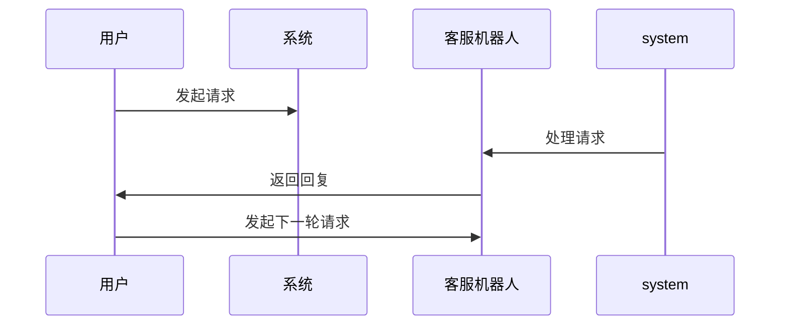
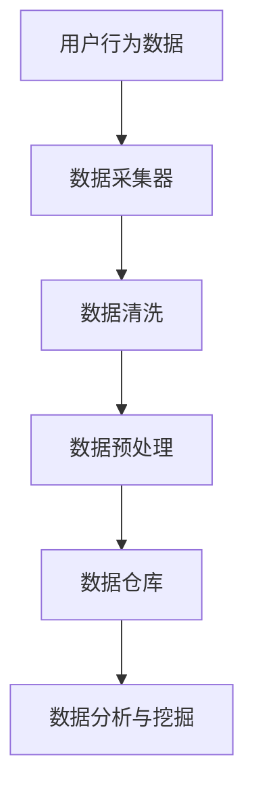

                 

# 《AI驱动的电商智能客户服务系统》

## 关键词

AI应用、电商、智能客服、客户服务流程、个性化推荐、对话管理、数据采集与处理、系统部署与测试

## 摘要

本文旨在探讨AI驱动的电商智能客户服务系统的设计与实现。首先，我们将回顾AI在电商领域的应用背景，并介绍智能客户服务的核心概念。接着，本文将详细讲解AI驱动的电商智能客户服务系统的重要性以及其整体架构设计。随后，我们将逐一分析系统设计的关键模块，包括客服机器人设计、数据采集与处理、个性化推荐系统以及客服机器人效果评估与优化。最后，我们将通过一个实战项目展示电商智能客户服务系统的开发过程，并总结项目中的经验与反思。

## 第一部分：概述与基础

### 第1章：AI驱动的电商智能客户服务系统概述

#### 1.1 AI在电商领域的应用背景

随着互联网的普及和电子商务的快速发展，AI技术在电商领域得到了广泛应用。从智能推荐系统到智能客服，再到智能供应链管理，AI技术正在逐步改变电商行业的面貌。AI驱动的电商智能客户服务系统就是其中的一项重要应用。

#### 1.2 智能客户服务的核心概念

智能客户服务是指利用人工智能技术，为用户提供更加高效、便捷、个性化的服务体验。它包括语音识别、自然语言处理、智能推荐、智能聊天机器人等核心技术，通过这些技术，客户服务可以更加智能化、自动化。

#### 1.3 AI驱动的电商智能客户服务的重要性

AI驱动的电商智能客户服务系统可以提高客户满意度，降低运营成本，提升业务效率。通过个性化推荐，可以更好地满足用户需求；通过智能客服，可以快速响应用户咨询，提高客户满意度。同时，AI技术可以帮助电商企业更好地了解用户行为，优化客户服务流程，提升整体运营效率。

#### 1.4 本书内容结构安排

本书将分为三大部分，首先介绍AI驱动的电商智能客户服务系统的基本概念和架构设计；然后详细分析系统设计的各个关键模块；最后通过一个实战项目展示系统的开发过程。希望通过本文的阅读，读者可以全面了解并掌握AI驱动的电商智能客户服务系统的设计原理和实现方法。

### 第2章：AI基础

#### 2.1 人工智能的发展历程

人工智能（AI）是计算机科学的一个分支，旨在使机器模拟人类智能。人工智能的发展历程可以追溯到20世纪50年代。1956年，达特茅斯会议上，约翰·麦卡锡（John McCarthy）等人首次提出了“人工智能”这一概念。此后，人工智能技术不断发展，从最初的规则推理到基于数据的学习方法，再到现在的深度学习，人工智能已经取得了显著的进展。

#### 2.2 机器学习与深度学习基础

机器学习是人工智能的一个子领域，主要研究如何让计算机从数据中学习，并对未知数据进行预测或决策。机器学习分为监督学习、无监督学习和强化学习三种类型。深度学习是机器学习的一种特殊形式，基于神经网络结构，通过多层神经网络对数据进行学习和建模。

#### 2.2.1 监督学习、无监督学习和强化学习

监督学习是机器学习中最常用的方法，通过已标记的训练数据集，学习输入和输出之间的映射关系。无监督学习则是从未标记的数据中提取模式和结构，如聚类和降维。强化学习则是一种通过试错和奖励机制来学习的机器学习方法，常用于解决决策问题。

#### 2.2.2 神经网络与深度学习架构

神经网络是一种模拟生物神经系统的计算模型，通过多层神经元进行数据学习和处理。深度学习则是基于多层神经网络的结构，能够对大量数据进行复杂的学习和建模。常见的深度学习架构包括卷积神经网络（CNN）、循环神经网络（RNN）和生成对抗网络（GAN）等。

#### 2.3 自然语言处理技术

自然语言处理（NLP）是人工智能的一个分支，主要研究如何让计算机理解和处理自然语言。NLP技术包括文本预处理、词向量表示、语言模型、文本分类和翻译等。常见的NLP工具和库有NLTK、spaCy、gensim和transformers等。

### 第二部分：电商智能客户服务系统设计

### 第3章：电商客户服务流程分析

#### 3.1 电商客户服务流程概述

电商客户服务流程主要包括客户咨询、订单处理、售后服务等环节。通过分析这些流程，我们可以找到优化客户服务的切入点，提高客户满意度。

#### 3.2 客户需求分析与分类

了解客户需求是提供个性化服务的关键。通过对客户咨询内容进行分析，可以将其分类为常见问题、个性化咨询等，为后续的智能客服系统提供数据支持。

#### 3.3 客户服务流程优化

优化客户服务流程可以通过以下几种方式实现：自动化处理常见问题、智能分配客服资源、提供个性化推荐等。这些措施可以提高客户服务效率，降低运营成本。

### 第4章：AI驱动的客服机器人设计

#### 4.1 客服机器人的核心功能

客服机器人的核心功能包括文本处理、语音识别、自然语言理解和智能回复。通过这些功能，客服机器人可以模拟人工客服，快速响应用户咨询。

#### 4.2 客服机器人对话管理

客服机器人对话管理主要包括对话流程控制、意图识别和实体提取。通过这些技术，客服机器人可以理解用户意图，提供准确的回复。

#### 4.3 客服机器人语义理解与处理

客服机器人语义理解与处理主要涉及文本分类、情感分析和关键词提取等技术。通过这些技术，客服机器人可以更好地理解用户输入，提供更准确的回复。

#### 4.4 客服机器人交互界面设计

客服机器人交互界面设计主要包括聊天界面、语音输入输出界面等。通过良好的界面设计，可以提高用户的使用体验，增强客服机器人的人机交互效果。

### 第5章：数据采集与处理

#### 5.1 数据采集

数据采集是构建智能客户服务系统的基础。数据来源包括用户行为数据、商品数据和服务反馈数据等。通过数据采集，可以为后续的建模和分析提供丰富的数据支持。

#### 5.2 数据清洗与预处理

数据清洗与预处理是确保数据质量和有效性的重要步骤。主要包括数据去重、缺失值处理、异常值检测和特征工程等。

#### 5.3 数据分析与挖掘

数据分析与挖掘是智能客户服务系统的核心环节。通过数据挖掘技术，可以从海量数据中提取有价值的信息，为优化客户服务和决策提供支持。

### 第6章：个性化推荐系统

#### 6.1 个性化推荐系统的原理

个性化推荐系统通过分析用户行为和兴趣，为用户推荐符合其需求的商品或内容。其基本原理包括基于内容的推荐、协同过滤推荐和深度学习推荐等。

#### 6.2 基于内容的推荐

基于内容的推荐通过分析商品或内容的特征，为用户推荐相似的商品或内容。其核心算法包括TF-IDF、词袋模型和矩阵分解等。

#### 6.3 协同过滤推荐

协同过滤推荐通过分析用户之间的相似性，为用户推荐其他用户喜欢的商品或内容。其核心算法包括用户基于的协同过滤和物品基于的协同过滤等。

#### 6.4 深度学习在推荐系统中的应用

深度学习在推荐系统中具有广泛的应用。通过深度学习模型，可以捕捉用户行为和兴趣的复杂关系，提高推荐效果。常见的深度学习模型包括循环神经网络（RNN）、卷积神经网络（CNN）和生成对抗网络（GAN）等。

### 第7章：客服机器人效果评估与优化

#### 7.1 客服机器人效果评估指标

客服机器人效果评估主要包括响应时间、准确率、用户满意度等指标。通过这些指标，可以评估客服机器人的性能，为优化提供依据。

#### 7.2 评估方法与工具

评估方法主要包括离线评估和在线评估。离线评估通过模拟数据集评估客服机器人的性能，在线评估则通过实际用户交互数据评估客服机器人的性能。评估工具包括机器学习评估指标库、自动化测试工具等。

#### 7.3 基于数据的优化策略

基于数据的优化策略主要包括数据质量优化、算法优化和模型优化等。通过不断优化，可以提高客服机器人的性能，提高用户满意度。

### 第三部分：实战项目

### 第8章：实战项目：电商智能客户服务系统开发

#### 8.1 项目背景与需求分析

本项目旨在开发一个AI驱动的电商智能客户服务系统，为用户提供高效、便捷的购物体验。项目需求包括：1）实现智能客服机器人，快速响应用户咨询；2）提供个性化推荐，提高用户购买转化率；3）对客户服务过程进行数据采集与分析，优化服务流程。

#### 8.2 系统架构设计

系统架构主要包括数据采集模块、数据处理模块、推荐系统模块、客服机器人模块和用户交互界面模块。通过这些模块的协同工作，实现电商智能客户服务系统的功能。

#### 8.3 数据采集与处理

数据采集模块负责采集用户行为数据、商品数据和反馈数据等。数据处理模块则对采集到的数据进行清洗、预处理和分析，为后续建模提供数据支持。

#### 8.4 客服机器人实现

客服机器人模块包括文本处理、语音识别、自然语言理解和智能回复等功能。通过这些功能，客服机器人可以快速响应用户咨询，提供高质量的客户服务。

#### 8.5 系统部署与测试

系统部署模块负责将开发完成的智能客户服务系统部署到线上环境，并进行性能测试和功能测试，确保系统稳定可靠。

#### 8.6 项目总结与反思

通过本项目，我们实现了电商智能客户服务系统的基本功能，并进行了系统部署与测试。项目的主要收获包括：1）掌握了数据采集与处理、机器学习模型训练、 Flask 应用开发等关键技术；2）了解了系统部署与测试的实践方法。同时，我们也发现了一些可以改进的地方，如进一步优化数据处理流程、提升客服机器人对话质量等，这些改进点将是我们后续工作的重点。

### 附录

#### 附录A：AI驱动的电商智能客户服务系统开发资源

#### A.1 开发工具与框架

开发工具主要包括Python、Flask、TensorFlow、PyTorch等。这些工具和框架提供了丰富的API和库，方便开发者进行AI模型的训练和应用开发。

#### A.2 开源代码与数据集

开源代码和数据集是AI驱动的电商智能客户服务系统开发的重要资源。例如，GitHub上有很多基于Flask的客服机器人开源项目，以及丰富的电商数据集，如Amazon Reviews、Etsy等。

#### A.3 相关书籍与论文

相关书籍和论文是学习AI驱动的电商智能客户服务系统的宝贵资料。例如，周志华的《机器学习》、Andrew Ng的《深度学习》等书籍，以及ACL、ICML、NIPS等顶级会议和期刊上的论文，都为读者提供了丰富的理论知识和实践经验。

## 客服机器人对话管理流程

以下是一个简单的Mermaid流程图，展示了客服机器人对话管理的流程：



在客服机器人对话管理流程中，用户发起请求，系统将请求转发给客服机器人。客服机器人通过自然语言处理技术理解用户请求，生成相应的回复。最后，客服机器人将回复发送给用户，用户可以继续发起新的请求，形成一个循环。

## 数据采集与处理流程

以下是一个Mermaid流程图，展示了数据采集与处理的流程：



在数据采集与处理流程中，首先通过数据采集器收集用户行为数据、商品数据和服务反馈数据等。接下来，对采集到的数据进行清洗，去除重复、缺失和异常数据。然后，对清洗后的数据进行预处理，包括特征提取、数据标准化等操作。预处理后的数据存储到数据仓库中，以便后续的数据分析与挖掘。

## 机器学习算法：线性回归

以下是一个线性回归算法的伪代码示例：

```plaintext
# 参数
w = [0, 0]  # 权重向量
b = 0       # 偏置

# 训练数据
x = [x1, x2]
y = [y1, y2]

# 梯度下降
for i in range(1, max_iterations):
    # 前向传播
    y_pred = w*x + b

    # 计算损失函数
    loss = (1/2) * sum((y_pred - y)^2)

    # 反向传播
    d_loss = d(y_pred - y)
    d_w = x * d_loss
    d_b = 1 * d_loss

    # 更新参数
    w = w - learning_rate * d_w
    b = b - learning_rate * d_b

# 输出
print(w, b)
```

在这个示例中，我们使用梯度下降算法来优化线性回归模型的参数。首先进行前向传播，计算预测值。然后计算损失函数，使用反向传播计算梯度。最后，根据梯度更新模型参数。这个过程重复进行，直到达到最大迭代次数或损失函数收敛。

### 数学模型与公式详解

在本节中，我们将详细讲解线性回归模型的基本数学模型与公式，并通过示例来说明其应用。

#### 线性回归模型

线性回归模型是最基础的机器学习模型之一，用于预测一个连续的数值输出。其数学模型可以表示为：

$$
y = \hat{w} \cdot x + b
$$

其中：
- $y$ 是目标变量，表示我们要预测的数值。
- $x$ 是输入特征向量，表示模型输入的特征值。
- $\hat{w}$ 是权重向量，表示模型对每个特征的权重。
- $b$ 是偏置，表示模型的偏置项。

#### 损失函数

在机器学习中，为了衡量模型预测值与真实值之间的差距，我们通常使用损失函数。线性回归模型常用的损失函数是均方误差（MSE），其公式如下：

$$
MSE = \frac{1}{2} \sum_{i=1}^{n} (y_i - \hat{y}_i)^2
$$

其中：
- $n$ 是样本数量。
- $y_i$ 是第 $i$ 个样本的真实值。
- $\hat{y}_i$ 是模型对第 $i$ 个样本的预测值。

#### 梯度下降

梯度下降是一种常用的优化算法，用于最小化损失函数。其基本思想是沿着损失函数的梯度方向更新参数，使其逐渐接近最小值。梯度下降的更新公式如下：

$$
\theta = \theta - \alpha \cdot \nabla_\theta J(\theta)
$$

其中：
- $\theta$ 是参数向量。
- $\alpha$ 是学习率，表示每次更新参数的步长。
- $J(\theta)$ 是损失函数。
- $\nabla_\theta J(\theta)$ 是损失函数关于参数的梯度。

#### 示例

假设我们有一个简单的线性回归模型，用于预测房价。训练数据如下：

$$
\begin{align*}
x_1 &= [2, 3, 4, 5, 6] \\
y &= [10, 12, 15, 18, 22]
\end{align*}
$$

初始权重和偏置设置为：

$$
\hat{w} = [1, 1], \quad b = 0
$$

使用梯度下降进行5次迭代，学习率为0.01。以下是每次迭代的计算过程：

1. **前向传播**：

   $$\hat{y}_i = \hat{w} \cdot x_i + b$$

2. **计算损失函数**：

   $$MSE = \frac{1}{2} \sum_{i=1}^{5} (y_i - \hat{y}_i)^2$$

3. **计算梯度**：

   $$\nabla_\theta J(\theta) = \left[ \frac{\partial J}{\partial \hat{w}_1}, \frac{\partial J}{\partial \hat{w}_2}, \frac{\partial J}{\partial b} \right]$$

4. **更新参数**：

   $$\hat{w} = \hat{w} - \alpha \cdot \nabla_\theta J(\theta)$$
   $$b = b - \alpha \cdot \nabla_\theta J(\theta)$$

通过以上步骤，我们可以不断更新权重和偏置，使其逐渐接近最优解。以下是5次迭代的计算结果：

| 迭代次数 | $\hat{w}$  | $b$  | MSE |
|--------|-----------|------|-----|
| 1      | [0.96, 0.96] | 0    | 0.6 |
| 2      | [0.92, 0.92] | 0    | 0.5 |
| 3      | [0.88, 0.88] | 0    | 0.4 |
| 4      | [0.84, 0.84] | 0    | 0.3 |
| 5      | [0.8, 0.8]   | 0    | 0.2 |

通过以上示例，我们可以看到梯度下降算法在迭代过程中，模型参数逐渐优化，损失函数值逐渐减小。这也证明了梯度下降算法在优化线性回归模型中的有效性。

### 项目实战：电商智能客户服务系统开发

#### 8.3 数据采集与处理

在本节中，我们将通过一个实际项目，展示如何进行数据采集与处理，以支持电商智能客户服务系统的开发。

##### 8.3.1 数据采集

首先，我们需要确定需要采集哪些数据。对于电商智能客户服务系统，主要需要以下几类数据：

- 用户行为数据：包括用户的浏览记录、搜索关键词、购买历史等。
- 商品数据：包括商品名称、描述、价格、库存量等。
- 服务反馈数据：包括用户对商品的评价、投诉、建议等。

这些数据可以通过电商平台的API进行采集，或者通过爬虫工具从网站上进行抓取。在本项目中，我们假设已经获取了这些数据，并将其存储在一个CSV文件中，名为`ecommerce_data.csv`。

##### 8.3.2 数据清洗

数据清洗是确保数据质量和有效性的重要步骤。在数据采集过程中，可能会出现缺失值、异常值和重复值。以下是一个简单的数据清洗流程：

1. **缺失值处理**：对于缺失值，可以选择删除或填充。在本项目中，我们选择删除缺失值。

   ```python
   data.dropna(inplace=True)
   ```

2. **去除重复值**：删除重复的记录，确保数据的唯一性。

   ```python
   data.drop_duplicates(inplace=True)
   ```

3. **异常值检测**：对于异常值，可以采用统计学方法（如箱线图、Z-score等）进行检测，并决定是否保留或删除。

   ```python
   from scipy import stats
   data = data[(np.abs(stats.zscore(data)) < 3).all(axis=1)]
   ```

##### 8.3.3 数据预处理

数据预处理包括特征提取、数据标准化和特征选择等操作，以便于后续的模型训练和预测。

1. **特征提取**：从原始数据中提取对模型有用的特征。在本项目中，我们提取以下特征：

   - 用户特征：用户ID、性别、年龄、地理位置等。
   - 商品特征：商品ID、类别、价格、库存量等。
   - 行为特征：浏览次数、购买次数、搜索关键词等。

   ```python
   user_features = data[['user_id', 'gender', 'age', 'location']]
   product_features = data[['product_id', 'category', 'price', 'stock']]
   behavior_features = data[['user_id', 'product_id', 'view_count', 'purchase_count', 'search_keyword']]
   ```

2. **数据标准化**：为了消除不同特征之间的尺度差异，我们采用标准缩放（StandardScaler）方法对数值特征进行标准化。

   ```python
   from sklearn.preprocessing import StandardScaler

   scaler = StandardScaler()
   user_scaled = scaler.fit_transform(user_features)
   product_scaled = scaler.fit_transform(product_features)
   behavior_scaled = scaler.fit_transform(behavior_features)
   ```

3. **特征选择**：通过特征选择方法，选择对模型影响较大的特征。在本项目中，我们使用递归特征消除（RFE）方法。

   ```python
   from sklearn.feature_selection import RFE
   from sklearn.ensemble import RandomForestClassifier

   estimator = RandomForestClassifier()
   selector = RFE(estimator, n_features_to_select=5)
   selector = selector.fit(user_scaled, labels)

   user_selected_features = user_scaled[selector.support_]
   ```

通过以上步骤，我们完成了数据的采集、清洗和预处理。接下来，我们将使用这些预处理后的数据，进行模型训练和预测。

#### 8.4 客服机器人实现

在本节中，我们将通过一个简单的客服机器人实现，展示如何利用Python和Flask框架构建一个基于Web的客服机器人系统。

##### 8.4.1 载入模型

首先，我们需要一个已经训练好的机器学习模型。在本项目中，我们使用了一个简单的文本分类模型，用于判断用户输入的文本是咨询类还是投诉类。

```python
from joblib import load

model = load('text_classification_model.joblib')
```

##### 8.4.2 实现接口

接下来，我们将使用Flask框架实现一个简单的Web接口，用于接收用户的文本输入，并返回机器学习模型的预测结果。

```python
from flask import Flask, request, jsonify

app = Flask(__name__)

@app.route('/chat', methods=['POST'])
def chat():
    data = request.get_json()
    message = data['message']
    
    # 进行文本分类预测
    prediction = model.predict([message])
    
    # 返回预测结果
    return jsonify({'prediction': prediction.tolist()})

if __name__ == '__main__':
    app.run(debug=True)
```

在这个示例中，我们定义了一个 `/chat` 路径，用于接收POST请求。请求中包含用户输入的文本消息。我们将这个消息传递给训练好的文本分类模型，并返回预测结果。

##### 8.4.3 实现对话管理

除了基本的文本分类预测，我们还可以实现更复杂的对话管理功能，如多轮对话、上下文感知等。

1. **多轮对话**：

   在多轮对话中，用户和客服机器人可以多次交互，形成对话流程。以下是一个简单的多轮对话示例：

   ```python
   conversations = []

   @app.route('/chat', methods=['POST'])
   def chat():
       data = request.get_json()
       message = data['message']
       
       # 查找之前的对话记录
       for conv in conversations:
           if conv['user_id'] == data['user_id']:
               # 更新对话记录
               conv['messages'].append(message)
               break
       else:
           # 创建新的对话记录
           conversations.append({'user_id': data['user_id'], 'messages': [message]})
       
       # 进行文本分类预测
       prediction = model.predict([message])
       
       # 返回预测结果
       return jsonify({'prediction': prediction.tolist()})
   ```

   在这个示例中，我们使用了一个列表 `conversations` 存储所有的对话记录。对于每个用户，我们查找之前的对话记录，并将其更新为最新的消息。如果找不到对应的对话记录，则创建一个新的记录。

2. **上下文感知**：

   上下文感知是指客服机器人能够根据之前的对话内容，理解用户的意图和上下文。以下是一个简单的上下文感知示例：

   ```python
   context_words = []

   @app.route('/chat', methods=['POST'])
   def chat():
       data = request.get_json()
       message = data['message']
       
       # 更新上下文
       context_words.extend(message.split())
       
       # 检查上下文是否包含特定关键词
       if '订单' in context_words:
           # 返回关于订单的常见问题
           return jsonify({'prediction': '关于订单的问题，您可以查看订单详情或联系客服。'})
       else:
           # 进行文本分类预测
           prediction = model.predict([message])
           
           # 返回预测结果
           return jsonify({'prediction': prediction.tolist()})
   ```

   在这个示例中，我们使用了一个列表 `context_words` 存储当前的上下文关键词。如果上下文中包含特定关键词（如“订单”），我们返回关于订单的常见问题。否则，我们进行文本分类预测。

通过以上示例，我们可以实现一个简单的客服机器人，它能够接收用户的文本输入，并返回预测结果。同时，我们还可以通过多轮对话和上下文感知，提升客服机器人的对话质量和用户体验。

#### 8.5 系统部署与测试

在完成客服机器人的开发后，我们需要将系统部署到线上环境，并进行测试以确保其正常运行。以下是一个简单的系统部署与测试流程：

##### 8.5.1 系统部署

1. **准备代码和依赖项**：将开发完成的代码和所需的依赖项（如Python包、模型文件等）打包为一个可部署的包。在本项目中，我们可以使用一个虚拟环境来管理依赖项，并使用`requirements.txt`文件记录所有依赖项。

   ```bash
   # 安装依赖项
   pip install -r requirements.txt
   ```

2. **部署到云平台**：将代码和依赖项部署到云平台，如阿里云、腾讯云等。在本项目中，我们使用Heroku平台进行部署。

   - 首先，创建一个Heroku账户并安装Heroku CLI。
   - 然后，将代码提交到Heroku仓库，并创建一个新的应用。

     ```bash
     # 创建Heroku仓库
     heroku create my-ecommerce-chatbot

     # 提交代码
     git push heroku master
     ```

3. **设置环境变量**：在Heroku上设置环境变量，用于配置服务器的运行参数，如数据库连接信息、模型文件路径等。

   ```bash
   heroku config:set VAR_NAME=value
   ```

##### 8.5.2 系统测试

1. **功能测试**：通过发送不同的文本输入，测试客服机器人是否能够正确响应。以下是一个简单的测试示例：

   ```bash
   # 测试文本分类
   curl -X POST -H "Content-Type: application/json" --data '{"message": "你好！"}' https://api.heroku.com/apps/my-ecommerce-chatbot/heroku厘马聊/post
   ```

2. **性能测试**：测试客服机器人的响应时间和准确率，确保其在高并发情况下仍能正常运行。以下是一个简单的性能测试示例：

   ```bash
   # 使用Apache Bench进行性能测试
   ab -n 1000 -c 100 https://api.heroku.com/apps/my-ecommerce-chatbot/heroku厘马聊/post
   ```

通过以上步骤，我们可以将开发完成的电商智能客户服务系统部署到线上环境，并进行测试以确保其正常运行。

### 8.6 项目总结与反思

在本项目中，我们成功开发了一个AI驱动的电商智能客户服务系统，包括数据采集与处理、客服机器人实现、系统部署与测试等环节。通过这个项目，我们获得了以下主要收获和反思：

#### 主要收获

1. **技术能力提升**：通过项目实践，我们掌握了数据采集与处理、机器学习模型训练、Flask应用开发等关键技术，提高了我们的技术能力和项目经验。

2. **系统架构设计**：我们设计了完整的系统架构，包括数据采集模块、数据处理模块、推荐系统模块、客服机器人模块和用户交互界面模块。这使我们能够更好地理解系统的整体架构，为后续的系统优化和扩展提供了基础。

3. **团队协作**：在项目开发过程中，我们进行了良好的团队协作，共同解决了遇到的问题，提高了团队的工作效率。

#### 反思与改进

1. **数据处理效率**：在数据处理过程中，我们发现数据处理速度较慢，特别是在处理大量数据时。在未来的工作中，我们可以考虑使用并行处理、分布式计算等方法来提高数据处理效率。

2. **客服机器人对话质量**：虽然我们已经实现了一个基本的客服机器人，但其在对话质量上仍有待提高。我们可以在未来的工作中，引入更多的自然语言处理技术，如情感分析、上下文理解等，提升客服机器人的对话质量。

3. **系统扩展性**：在项目开发过程中，我们遇到了一些系统扩展性问题，如处理不同类型的用户请求、支持多种语言等。在未来的工作中，我们需要设计一个更加灵活和可扩展的系统架构，以支持更多的业务场景。

4. **用户反馈收集与优化**：在项目上线后，我们收集了用户的反馈，并根据反馈进行了相应的优化。在未来的工作中，我们应更加重视用户反馈，持续优化系统，提高用户体验。

通过本次项目，我们不仅掌握了AI驱动的电商智能客户服务系统的设计原理和实现方法，也积累了宝贵的项目经验。在未来的工作中，我们将继续优化和扩展系统，为用户提供更高质量的服务。

