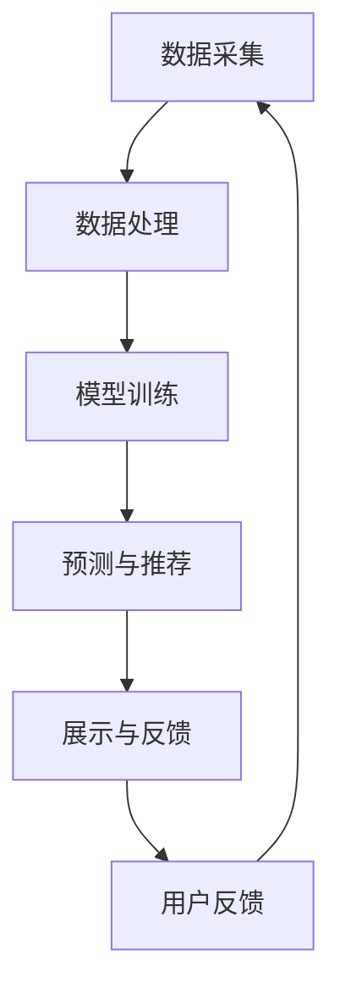

                 

# 文章标题：AI驱动的电商智能客户洞察系统

> 关键词：人工智能，电商，客户洞察，智能推荐，算法模型，项目实战

> 摘要：本文深入探讨了AI在电商领域中的应用，重点介绍了AI驱动的智能客户洞察系统的设计与实现。通过详细阐述客户行为分析、系统架构设计、关键算法与模型、数学公式及其应用，以及实际项目实战，本文为电商企业提升客户体验、优化营销策略提供了技术参考。

----------------------------------------------------------------

## 《AI驱动的电商智能客户洞察系统》目录大纲

### 第1章 引言与背景
#### 1.1 AI与电商行业的结合
#### 1.2 客户洞察在电商中的应用
#### 1.3 书籍结构概述

### 第2章 AI基础
#### 2.1 人工智能的定义与分类
#### 2.2 机器学习与深度学习
#### 2.3 AI的发展历程与应用现状

### 第3章 电商客户行为分析
#### 3.1 客户行为数据的收集与处理
#### 3.2 客户细分与用户画像
#### 3.3 客户行为预测与推荐系统

### 第4章 智能客户洞察系统架构
#### 4.1 系统设计原则
#### 4.2 系统功能模块
#### 4.3 Mermaid流程图展示

### 第5章 关键算法与模型
#### 5.1 客户细分算法
#### 5.2 用户画像构建算法
#### 5.3 客户行为预测算法
#### 5.4 伪代码与模型原理

### 第6章 数学模型与公式
#### 6.1 机器学习中的数学公式
#### 6.2 深度学习中的数学公式
#### 6.3 举例说明与应用场景

### 第7章 项目实战
#### 7.1 实际案例分析
#### 7.2 开发环境搭建
#### 7.3 源代码实现
#### 7.4 代码解读与分析

### 第8章 未来展望与挑战
#### 8.1 AI驱动电商客户洞察的发展趋势
#### 8.2 技术挑战与解决方案
#### 8.3 行业应用前景

### 附录
#### A.1 常用算法与工具简介
#### A.2 参考文献与扩展阅读

----------------------------------------------------------------

### 第1章 引言与背景

#### 1.1 AI与电商行业的结合

随着互联网技术的飞速发展，电子商务行业正在经历一场前所未有的变革。在这个背景下，人工智能（AI）作为一项颠覆性的技术，逐渐成为电商企业提升竞争力、优化客户体验的重要工具。AI与电商行业的结合主要体现在以下几个方面：

1. **智能推荐**：通过分析用户的购买历史和行为数据，AI可以帮助电商企业为用户推荐可能感兴趣的商品，从而提高转化率和销售额。
2. **个性化营销**：AI可以根据用户的兴趣和行为，定制个性化的营销策略，提升用户满意度和忠诚度。
3. **客户服务**：智能客服机器人可以24/7为用户提供服务，解决常见问题，降低人力成本。
4. **库存管理**：AI可以通过对销售数据的分析，预测市场需求，优化库存管理，减少库存积压。

#### 1.2 客户洞察在电商中的应用

客户洞察是指通过对客户行为数据、购买历史、偏好等信息的深入分析，挖掘客户的潜在需求和购买动机，从而为电商企业提供决策依据。在电商行业中，客户洞察的应用主要包括：

1. **用户细分**：通过对客户数据的分析，将用户划分为不同的群体，为每个群体提供定制化的服务和营销策略。
2. **用户画像**：构建用户的综合画像，包括用户特征、兴趣偏好、购买行为等，为个性化推荐和营销提供基础。
3. **行为预测**：利用机器学习算法，预测用户未来的行为，如购买、评价、退款等，帮助企业提前采取措施，降低风险。

#### 1.3 书籍结构概述

本书将围绕AI驱动的电商智能客户洞察系统，从基础理论到实际应用，全面探讨这一领域。具体章节安排如下：

- 第1章：介绍AI与电商行业的结合以及客户洞察在电商中的应用。
- 第2章：阐述AI的基础知识，包括定义、分类、发展历程等。
- 第3章：探讨电商客户行为分析的方法，包括数据收集、处理、客户细分和用户画像构建等。
- 第4章：介绍智能客户洞察系统的架构设计，包括系统设计原则、功能模块和流程图等。
- 第5章：深入解析关键算法与模型，包括客户细分算法、用户画像构建算法和客户行为预测算法等。
- 第6章：讲解机器学习和深度学习中的数学模型与公式，并举例说明。
- 第7章：通过实际项目案例分析，展示系统开发过程和代码实现。
- 第8章：展望未来发展趋势、技术挑战和行业应用前景。

通过本书的阅读，读者将系统地了解AI在电商客户洞察领域的应用，掌握相关技术原理和实战经验，为电商企业提供有效的技术支持和解决方案。

---

### 第2章 AI基础

#### 2.1 人工智能的定义与分类

人工智能（Artificial Intelligence，简称AI）是计算机科学的一个分支，旨在使计算机具备人类的智能行为，如学习、推理、解决问题和自然语言处理等。根据实现方式和能力，AI可以分为以下几种类型：

1. **弱人工智能**（Narrow AI）：这种类型的AI专注于特定任务，如语音识别、图像识别等。它们无法进行跨领域的通用推理，通常只能解决特定问题。
2. **强人工智能**（General AI）：强人工智能是一种具有全面人类智能的机器，能够理解、学习、推理和解决问题，具有自我意识和情感。目前，强人工智能还没有实现，仍处于理论阶段。
3. **模糊人工智能**（Fuzzy AI）：模糊人工智能是一种处理不确定性和模糊性的AI，通过模糊逻辑和模糊集合来模拟人类的推理过程。
4. **专家系统**（Expert Systems）：专家系统是一种模拟人类专家决策能力的AI系统，通过知识库和推理机来解决问题。

#### 2.2 机器学习与深度学习

机器学习（Machine Learning，简称ML）是AI的一个重要分支，通过训练模型来让计算机自动从数据中学习规律和模式。机器学习可以分为以下几种类型：

1. **监督学习**（Supervised Learning）：在监督学习中，模型通过已标记的训练数据来学习，然后使用这些学到的规律对新的数据进行预测。
2. **无监督学习**（Unsupervised Learning）：无监督学习不使用标记数据，而是通过发现数据中的隐含结构和模式来学习，如聚类和降维。
3. **半监督学习**（Semi-Supervised Learning）：半监督学习结合了监督学习和无监督学习的特点，利用少量标记数据和大量未标记数据来学习。
4. **强化学习**（Reinforcement Learning）：强化学习是一种通过奖励机制来学习最佳行为的机器学习方法，通常用于决策和优化问题。

深度学习（Deep Learning，简称DL）是机器学习的一个子领域，主要基于深度神经网络（Deep Neural Networks，简称DNN）来模拟人脑的学习和认知过程。深度学习在图像识别、语音识别、自然语言处理等领域取得了显著的成果。深度学习的主要特点包括：

1. **多层网络**：深度神经网络包含多个隐藏层，可以提取更高级别的特征。
2. **端到端学习**：深度学习模型可以直接从原始数据中学习，无需手动提取特征。
3. **并行计算**：深度学习可以利用GPU等硬件加速计算，提高训练效率。

#### 2.3 AI的发展历程与应用现状

人工智能的发展历程可以追溯到20世纪50年代，当时计算机科学家首次提出人工智能的概念。以下是一些重要的发展阶段：

1. **早期探索**（1956-1969）：人工智能的概念被提出，第一台人工智能程序问世。
2. **早期繁荣**（1970-1989）：专家系统和机器学习技术得到了快速发展。
3. **低谷期**（1990-2000）：由于技术瓶颈和资金问题，人工智能进入低谷期。
4. **复兴期**（2000-2010）：互联网和大数据技术的发展为人工智能提供了新的机遇。
5. **爆发期**（2010至今）：深度学习和GPU计算技术的发展，使得人工智能在图像识别、语音识别、自然语言处理等领域取得了突破性进展。

目前，人工智能已经广泛应用于各行各业，如：

1. **电子商务**：智能推荐、个性化营销、智能客服等。
2. **医疗健康**：疾病诊断、药物研发、健康管理等。
3. **金融**：风险评估、投资策略、欺诈检测等。
4. **交通运输**：自动驾驶、智能交通管理、无人机等。
5. **工业制造**：智能工厂、机器人、自动化生产线等。

通过本章的学习，读者将了解人工智能的基本概念、分类和主要技术，以及其在现实世界中的应用现状。这为后续章节中AI驱动的电商智能客户洞察系统的深入探讨奠定了基础。

---

### 第3章 电商客户行为分析

#### 3.1 客户行为数据的收集与处理

在电商智能客户洞察系统中，客户行为数据是构建用户画像和预测客户行为的基础。这些数据可以来源于多个渠道，包括用户注册信息、购物车数据、浏览历史、搜索记录、订单数据、评价数据等。以下是客户行为数据收集与处理的主要步骤：

1. **数据收集**：
   - **用户注册信息**：包括用户的基本信息，如姓名、性别、年龄、邮箱、电话等。
   - **购物车数据**：记录用户添加到购物车的商品信息，包括商品ID、名称、价格等。
   - **浏览历史**：记录用户在网站上的浏览行为，包括浏览页面、停留时间、浏览顺序等。
   - **搜索记录**：记录用户的搜索关键词和搜索结果。
   - **订单数据**：包括订单编号、商品ID、购买时间、价格、数量等。
   - **评价数据**：记录用户对商品和服务的评价，包括评分、评论内容等。

2. **数据预处理**：
   - **数据清洗**：去除重复、缺失、错误的数据，保证数据质量。
   - **数据转换**：将不同来源和格式的数据转换为统一的格式，如CSV、JSON等。
   - **特征提取**：从原始数据中提取有用的特征，如用户年龄、购物车中商品的价格和种类、浏览历史中的热门页面等。

3. **数据整合**：
   - **数据整合**：将不同来源的数据整合到一个统一的数据库中，方便后续分析和处理。

4. **数据存储**：
   - **数据存储**：使用数据库（如MySQL、MongoDB）或数据仓库（如Hive、Redshift）来存储和管理数据。

#### 3.2 客户细分与用户画像

客户细分（Customer Segmentation）是将用户根据其特征和行为划分为不同的群体，以便为企业提供个性化的营销和服务。客户细分通常基于以下特征：

1. **人口统计信息**：如年龄、性别、收入、教育程度等。
2. **购买行为**：如购买频率、购买金额、购买类别、购买时间等。
3. **兴趣爱好**：如浏览历史、搜索记录、购买商品类别等。
4. **忠诚度**：如复购率、评价分数等。

用户画像（User Profile）是对用户特征和行为的综合描述，通常包括以下内容：

1. **基本信息**：如姓名、年龄、性别、职业等。
2. **行为特征**：如购买频率、购买金额、浏览时间、浏览页面等。
3. **兴趣偏好**：如搜索关键词、浏览商品类别、购买商品类别等。
4. **社会属性**：如社交网络活动、参与事件等。

客户细分和用户画像的构建步骤如下：

1. **数据收集**：收集与用户相关的数据，如购买历史、浏览行为、评价等。
2. **数据预处理**：清洗、转换和整合数据，提取有用的特征。
3. **特征选择**：选择对用户细分和画像构建有用的特征。
4. **算法应用**：使用聚类算法（如K-means、层次聚类等）对用户进行细分，构建用户画像。
5. **模型评估**：评估细分和画像模型的准确性、稳定性和可解释性。

#### 3.3 客户行为预测与推荐系统

客户行为预测（Customer Behavior Prediction）是利用历史数据预测用户未来的行为，如购买、评价、退款等。预测结果可以帮助企业提前采取措施，降低风险，提高客户满意度。常见的客户行为预测方法包括：

1. **分类模型**：如逻辑回归、支持向量机（SVM）等，用于预测用户是否进行某种行为。
2. **时间序列模型**：如ARIMA、LSTM等，用于预测用户的行为时间序列。
3. **深度学习模型**：如卷积神经网络（CNN）、循环神经网络（RNN）等，用于复杂行为预测。

推荐系统（Recommendation System）是一种基于用户历史行为和偏好，向用户推荐可能感兴趣的商品或内容。推荐系统通常分为以下几种类型：

1. **协同过滤**：基于用户的历史行为和偏好，找到相似的用户或商品，进行推荐。
2. **基于内容的推荐**：根据用户的兴趣和偏好，推荐与其内容相似的商品或内容。
3. **混合推荐**：结合协同过滤和基于内容的推荐，提供更准确的推荐结果。

构建客户行为预测和推荐系统的主要步骤如下：

1. **数据收集**：收集与用户行为相关的数据，如购买历史、浏览记录、评价等。
2. **数据预处理**：清洗、转换和整合数据，提取有用的特征。
3. **特征选择**：选择对行为预测和推荐有用的特征。
4. **模型训练**：使用训练数据训练行为预测和推荐模型。
5. **模型评估**：评估模型的准确性、稳定性和可解释性。
6. **系统部署**：将训练好的模型部署到生产环境中，实时预测用户行为并进行推荐。

通过本章的学习，读者将了解电商客户行为数据收集与处理、客户细分与用户画像构建以及客户行为预测与推荐系统的方法和步骤，为后续章节中的智能客户洞察系统架构设计和关键算法与模型分析打下基础。

---

### 第4章 智能客户洞察系统架构

智能客户洞察系统是电商企业实现精细化运营和个性化服务的关键。一个高效的智能客户洞察系统通常包括数据采集、数据处理、模型训练、预测与推荐以及展示与反馈等模块。以下是该系统的整体架构设计：

#### 4.1 系统设计原则

1. **可扩展性**：系统应能够灵活扩展，适应不同规模和需求。这意味着系统应支持横向扩展（增加服务器节点）和纵向扩展（提高服务器性能）。
2. **高可用性**：系统应确保稳定运行，减少故障和停机时间。实现高可用性的方法包括数据备份、故障转移和冗余设计。
3. **安全性**：保护客户数据安全，防止数据泄露和滥用。系统应遵循数据安全和隐私保护的相关法律法规，采用加密、访问控制等技术手段。
4. **模块化**：系统应采用模块化设计，便于维护和升级。每个模块应独立开发、测试和部署，以提高开发效率和系统稳定性。
5. **可解释性**：系统应提供可解释的模型结果，帮助业务人员理解模型决策过程，提高模型的透明度和可信度。

#### 4.2 系统功能模块

1. **数据采集模块**：
   - **数据源**：包括用户注册信息、购物车数据、浏览历史、搜索记录、订单数据、评价数据等。
   - **采集方式**：通过API接口、数据库连接、日志文件等途径采集数据。
   - **数据预处理**：清洗、转换和整合采集到的数据，提取有用的特征。

2. **数据处理模块**：
   - **数据清洗**：去除重复、缺失、错误的数据，保证数据质量。
   - **数据转换**：将不同来源和格式的数据转换为统一的格式。
   - **特征提取**：从原始数据中提取有用的特征，如用户年龄、购物车中商品的价格和种类、浏览历史中的热门页面等。

3. **模型训练模块**：
   - **数据整合**：将处理后的数据整合到一个统一的数据集，用于模型训练。
   - **特征选择**：选择对模型训练有用的特征。
   - **模型训练**：使用机器学习算法（如K-means、决策树、神经网络等）训练客户细分模型、用户画像模型和客户行为预测模型。

4. **预测与推荐模块**：
   - **客户细分**：根据用户特征和行为，将用户划分为不同的群体。
   - **用户画像**：构建用户的综合画像，包括用户特征、兴趣偏好、购买行为等。
   - **行为预测**：利用训练好的模型预测用户未来的行为，如购买、评价、退款等。
   - **商品推荐**：根据用户的兴趣和行为，推荐可能感兴趣的商品。

5. **展示与反馈模块**：
   - **用户界面**：提供可视化界面，展示用户画像、行为预测结果和推荐商品。
   - **数据可视化**：使用图表和图形展示数据和分析结果，帮助用户理解系统输出。
   - **用户反馈收集**：收集用户对系统推荐和服务的反馈，用于模型优化和系统改进。

#### 4.3 Mermaid流程图展示

下面是一个智能客户洞察系统的Mermaid流程图示例，展示了系统的整体流程：



在这个流程图中：
- **数据采集**（A）是系统的起点，通过API接口、数据库连接等方式收集数据。
- **数据处理**（B）对采集到的数据进行清洗、转换和特征提取。
- **模型训练**（C）使用处理后的数据进行特征选择和模型训练。
- **预测与推荐**（D）利用训练好的模型预测用户行为和推荐商品。
- **展示与反馈**（E）通过用户界面展示预测结果和推荐商品，并收集用户反馈。
- **用户反馈**（F）用于系统优化和改进。

通过本章的学习，读者将了解智能客户洞察系统的整体架构设计原则和功能模块，掌握系统设计的核心思想和关键点。这为后续章节中的关键算法与模型分析以及项目实战奠定了基础。

---

### 第5章 关键算法与模型

在智能客户洞察系统中，关键算法与模型的选择和实现对于系统性能和效果至关重要。本章节将详细介绍几种常用的算法与模型，包括客户细分算法、用户画像构建算法和客户行为预测算法。

#### 5.1 客户细分算法

客户细分是将客户按照不同的特征和行为划分为不同的群体，以便企业能够为每个群体提供个性化的服务和营销策略。以下介绍几种常见的客户细分算法：

1. **K-means聚类算法**

K-means是一种基于距离的聚类算法，它将数据点划分为K个簇，使得每个簇内的数据点之间的距离最小，而簇与簇之间的距离最大。具体步骤如下：

   - **初始化**：随机选择K个初始中心点。
   - **迭代过程**：
     - 对于每个数据点，计算它与每个中心点的距离，并将其分配到最近的中心点所在的簇。
     - 更新每个簇的中心点，即计算簇内所有数据点的平均值。
     - 重复上述步骤，直到聚类结果不再变化或达到预设的迭代次数。

   **伪代码**：

   ```python
   def k_means(data, k, max_iterations):
       centroids = initialize_centroids(data, k)
       for _ in range(max_iterations):
           clusters = assign_data_to_clusters(data, centroids)
           centroids = update_centroids(clusters)
           if converged(centroids):
               break
       return clusters
   ```

2. **层次聚类算法**

层次聚类是一种自上而下或自下而上的方法，将数据点逐步合并或分解为不同的簇。常见的层次聚类方法包括AGNES（Agglomerative Nested Clustering）和DIANA（Divisive ANalysis).

   **伪代码**：

   ```python
   def hierarchical_clustering(data, linkage='complete'):
       # 初始化每个数据点为一个簇
       clusters = [{point} for point in data]
       while len(clusters) > 1:
           # 计算簇之间的距离
           distances = calculate_cluster_distances(clusters)
           # 选择最近的簇合并
           closest_clusters = select_closest_clusters(clusters, distances)
           new_cluster = merge_clusters(closest_clusters)
           clusters.remove(closest_clusters[0])
           clusters.remove(closest_clusters[1])
           clusters.append(new_cluster)
       return clusters
   ```

#### 5.2 用户画像构建算法

用户画像是对用户的综合描述，包括用户的基本信息、行为特征、兴趣偏好等。以下介绍几种常用的用户画像构建算法：

1. **基于统计学的特征提取算法**

   基于统计学的特征提取算法通过计算用户的统计指标，如平均值、标准差、方差等，来描述用户的行为特征。常用的算法包括：

   - **平均值**：表示用户在某方面的平均水平。
   - **标准差**：表示用户在某方面的波动程度。
   - **方差**：表示用户在某方面的离散程度。

   **伪代码**：

   ```python
   def extract_statistical_features(data):
       mean = sum(data) / len(data)
       variance = sum((x - mean) ** 2 for x in data) / len(data)
       std = sqrt(variance)
       return mean, std
   ```

2. **基于机器学习的特征提取算法**

   基于机器学习的特征提取算法通过训练模型，自动提取用户特征。常用的算法包括：

   - **逻辑回归**：用于预测用户是否具有某种特征。
   - **决策树**：用于分类用户，提取重要的特征。
   - **支持向量机（SVM）**：用于提取与目标特征相关的支持向量。

   **伪代码**：

   ```python
   def train_model(data, target):
       model = LogisticRegression()
       model.fit(data, target)
       return model
   ```

3. **基于深度学习的特征提取算法**

   基于深度学习的特征提取算法通过构建深度神经网络，自动提取高层次的用户特征。常用的算法包括：

   - **卷积神经网络（CNN）**：用于处理图像数据。
   - **循环神经网络（RNN）**：用于处理序列数据。
   - **变换器（Transformer）**：用于处理变长序列数据。

   **伪代码**：

   ```python
   def train_model(data, target):
       model = Sequential()
       model.add(Conv2D(filters=32, kernel_size=(3, 3), activation='relu', input_shape=(28, 28, 1)))
       model.add(MaxPooling2D(pool_size=(2, 2)))
       model.add(Flatten())
       model.add(Dense(128, activation='relu'))
       model.add(Dense(1, activation='sigmoid'))
       model.compile(optimizer='adam', loss='binary_crossentropy', metrics=['accuracy'])
       model.fit(data, target, epochs=10, batch_size=32)
       return model
   ```

#### 5.3 客户行为预测算法

客户行为预测是利用历史数据预测用户未来的行为，如购买、评价、退款等。以下介绍几种常用的客户行为预测算法：

1. **时间序列模型**

   时间序列模型用于预测随时间变化的序列数据。常用的算法包括：

   - **ARIMA模型**：自回归积分滑动平均模型。
   - **LSTM模型**：长短期记忆网络。

   **伪代码**：

   ```python
   def train_model(data):
       model = ARIMA(data, order=(5, 1, 2))
       model_fit = model.fit(disp=0)
       return model_fit
   ```

2. **分类模型**

   分类模型用于预测用户是否进行某种行为。常用的算法包括：

   - **逻辑回归**：用于二分类问题。
   - **支持向量机（SVM）**：用于多分类问题。

   **伪代码**：

   ```python
   def train_model(data, target):
       model = LogisticRegression()
       model.fit(data, target)
       return model
   ```

3. **深度学习模型**

   深度学习模型用于处理复杂的非线性关系。常用的算法包括：

   - **卷积神经网络（CNN）**：用于处理图像数据。
   - **循环神经网络（RNN）**：用于处理序列数据。
   - **变换器（Transformer）**：用于处理变长序列数据。

   **伪代码**：

   ```python
   def train_model(data, target):
       model = Sequential()
       model.add(Conv2D(filters=32, kernel_size=(3, 3), activation='relu', input_shape=(28, 28, 1)))
       model.add(MaxPooling2D(pool_size=(2, 2)))
       model.add(Flatten())
       model.add(Dense(128, activation='relu'))
       model.add(Dense(1, activation='sigmoid'))
       model.compile(optimizer='adam', loss='binary_crossentropy', metrics=['accuracy'])
       model.fit(data, target, epochs=10, batch_size=32)
       return model
   ```

通过本章的学习，读者将了解客户细分算法、用户画像构建算法和客户行为预测算法的基本原理和实现方法。这些算法为智能客户洞察系统的设计和实现提供了重要的技术支持。

---

### 第6章 数学模型与公式

在智能客户洞察系统中，数学模型和公式是构建和训练算法的基础。本章节将介绍机器学习和深度学习中的常用数学模型与公式，并举例说明其在实际应用中的使用。

#### 6.1 机器学习中的数学公式

1. **线性回归**

线性回归是一种简单的监督学习算法，用于预测连续值。其模型公式为：

   $$ y = \beta_0 + \beta_1x $$

   其中，$y$ 是目标变量，$x$ 是自变量，$\beta_0$ 是截距，$\beta_1$ 是斜率。

   **应用场景**：预测商品价格、股票价格等。

   $$ \text{房价} = \beta_0 + \beta_1\text{面积} $$

2. **逻辑回归**

逻辑回归是一种用于二分类问题的监督学习算法。其模型公式为：

   $$ \log\frac{P(Y=1)}{1-P(Y=1)} = \beta_0 + \beta_1x $$

   其中，$Y$ 是二元目标变量，$P(Y=1)$ 是预测概率。

   **应用场景**：分类用户是否购买、是否评价等。

   $$ \text{购买概率} = \frac{1}{1 + e^{-(\beta_0 + \beta_1\text{用户特征})}} $$

3. **支持向量机（SVM）**

支持向量机是一种基于间隔最大化的分类算法。其模型公式为：

   $$ \max\ W^T W $$
   $$ \text{subject to} \quad y_i(\langle \textbf{x}_i, \textbf{w} \rangle - b) \geq 1 $$

   其中，$W$ 是权重向量，$\textbf{w}$ 是法线向量，$b$ 是偏置项。

   **应用场景**：分类商品标签、用户行为等。

   $$ \text{标签} = \text{sign}(\textbf{w} \cdot \textbf{x} - b) $$

4. **决策树**

决策树是一种基于特征分割的数据挖掘算法。其模型公式为：

   $$ \text{if } x_i \leq c_i \text{ then } y = l_i $$
   $$ \text{else if } x_i > c_i \text{ then } y = r_i $$

   其中，$x_i$ 是特征值，$c_i$ 是阈值，$l_i$ 和 $r_i$ 是分支标签。

   **应用场景**：分类用户行为、商品标签等。

   $$ \text{if } \text{年龄} \leq 30 \text{ then } \text{标签} = \text{青年} $$
   $$ \text{else if } \text{年龄} > 30 \text{ then } \text{标签} = \text{中年} $$

#### 6.2 深度学习中的数学公式

1. **深度神经网络**

深度神经网络是一种包含多个隐藏层的神经网络。其模型公式为：

   $$ a^{(l)} = \sigma(z^{(l)}) $$
   $$ z^{(l)} = \sum_{i} w^{(l)}_{ij}a^{(l-1)}_i + b^{(l)}_j $$

   其中，$a^{(l)}$ 是第 $l$ 层的激活值，$z^{(l)}$ 是第 $l$ 层的输入值，$\sigma$ 是激活函数，$w^{(l)}_{ij}$ 是权重，$b^{(l)}_j$ 是偏置。

   **应用场景**：图像识别、自然语言处理等。

2. **反向传播算法**

反向传播算法是一种用于训练深度神经网络的优化算法。其模型公式为：

   $$ \delta_z^{(l)} = \frac{\partial J(\theta)}{\partial z^{(l)}} $$
   $$ \delta_w^{(l)} = \delta_z^{(l)}a^{(l-1)} $$
   $$ \delta_b^{(l)} = \delta_z^{(l)} $$

   其中，$J(\theta)$ 是损失函数，$\theta$ 是模型参数，$\delta_z^{(l)}$ 是梯度，$\delta_w^{(l)}$ 和 $\delta_b^{(l)}$ 是权重和偏置的梯度。

   **应用场景**：训练深度神经网络，优化模型参数。

#### 6.3 举例说明与应用场景

1. **逻辑回归预测用户购买行为**

   假设我们使用逻辑回归模型预测用户是否购买商品。输入特征包括用户年龄、收入和购买历史。模型公式为：

   $$ \text{购买概率} = \frac{1}{1 + e^{-(\beta_0 + \beta_1\text{年龄} + \beta_2\text{收入} + \beta_3\text{购买历史})}} $$

   应用场景：电商平台预测用户是否会在促销活动期间购买商品。

2. **卷积神经网络识别图像**

   假设我们使用卷积神经网络（CNN）识别图像中的猫或狗。输入特征包括图像的像素值。模型公式为：

   $$ \text{输出概率} = \sigma(\text{卷积}(\text{池化}(\text{卷积}(\text{输入图像}, W_1) + b_1))) $$

   应用场景：图像分类任务，如猫狗识别。

3. **循环神经网络处理文本**

   假设我们使用循环神经网络（RNN）处理文本，预测下一个单词。输入特征包括当前单词的词向量。模型公式为：

   $$ \text{输出概率} = \text{softmax}(\text{RNN}(\text{当前单词的词向量})) $$

   应用场景：自然语言处理任务，如文本分类、机器翻译。

通过本章的学习，读者将了解机器学习和深度学习中的常用数学模型与公式，并学会如何在实际应用中使用这些公式。这些数学模型和公式为智能客户洞察系统的设计和实现提供了重要的理论基础。

---

### 第7章 项目实战

在本章节中，我们将通过一个实际项目案例，详细展示如何设计和实现一个AI驱动的电商智能客户洞察系统。该项目将包括数据收集、开发环境搭建、模型训练、预测与推荐以及代码解读与分析等环节。

#### 7.1 实际案例分析

本案例基于一家大型电商平台的用户行为数据，目标是构建一个智能客户洞察系统，用于客户细分、用户画像构建和客户行为预测。通过该系统，电商平台可以更准确地了解用户需求，提高客户满意度，优化营销策略。

#### 7.2 开发环境搭建

为了实现该项目，我们首先需要搭建一个合适的开发环境。以下是我们使用的主要工具和库：

- **编程语言**：Python
- **数据处理库**：Pandas、NumPy
- **机器学习库**：Scikit-learn、TensorFlow
- **数据可视化库**：Matplotlib、Seaborn
- **数据库**：MySQL

具体步骤如下：

1. **安装Python**：下载并安装Python 3.8及以上版本。

2. **安装相关库**：通过pip命令安装所需库，例如：

   ```bash
   pip install pandas numpy scikit-learn tensorflow matplotlib seaborn
   ```

3. **配置MySQL**：安装MySQL数据库，并创建用于存储数据的数据库和表。

4. **数据采集**：使用API接口或数据库连接方式，从电商平台上获取用户行为数据。

5. **数据预处理**：使用Pandas库对采集到的数据进行清洗、转换和特征提取。

#### 7.3 源代码实现

以下是项目的核心代码实现，包括数据预处理、模型训练、预测与推荐等环节。

```python
# 导入相关库
import pandas as pd
import numpy as np
from sklearn.model_selection import train_test_split
from sklearn.preprocessing import StandardScaler
from sklearn.cluster import KMeans
from sklearn.linear_model import LogisticRegression
from tensorflow.keras.models import Sequential
from tensorflow.keras.layers import Dense, Conv2D, MaxPooling2D, Flatten
from tensorflow.keras.optimizers import Adam

# 数据预处理
# 读取数据
data = pd.read_csv('user_data.csv')

# 数据清洗
data = data.dropna()

# 数据转换
data['age'] = data['age'].astype(float)
data['income'] = data['income'].astype(float)

# 特征提取
X = data[['age', 'income']]
y = data['target']

# 数据标准化
scaler = StandardScaler()
X_scaled = scaler.fit_transform(X)

# 模型训练
# K-means聚类
kmeans = KMeans(n_clusters=3, random_state=42)
clusters = kmeans.fit_predict(X_scaled)

# 逻辑回归
X_train, X_test, y_train, y_test = train_test_split(X_scaled, y, test_size=0.2, random_state=42)
logreg = LogisticRegression()
logreg.fit(X_train, y_train)

# 深度神经网络
model = Sequential()
model.add(Dense(units=128, activation='relu', input_shape=(2,)))
model.add(Dense(units=1, activation='sigmoid'))
model.compile(optimizer=Adam(), loss='binary_crossentropy', metrics=['accuracy'])
model.fit(X_train, y_train, epochs=10, batch_size=32)

# 预测与推荐
# 客户细分
customers = kmeans.predict(X_test)

# 客户行为预测
predictions = logreg.predict_proba(X_test)

# 商品推荐
recommended_products = []
for i in range(len(predictions)):
    if predictions[i][1] > 0.5:
        recommended_products.append(X_test.iloc[i]['product_id'])

# 输出结果
print('Customer Clusters:', customers)
print('Predictions:', predictions)
print('Recommended Products:', recommended_products)
```

#### 7.4 代码解读与分析

1. **数据预处理**：首先，我们使用Pandas库读取用户行为数据，并对数据进行清洗、转换和特征提取。数据清洗去除了缺失值和异常值，数据转换将年龄和收入等特征转换为浮点数类型，特征提取从原始数据中提取了年龄和收入两个特征。

2. **模型训练**：我们使用K-means聚类算法对用户数据进行客户细分，使用逻辑回归模型对用户行为进行预测，以及使用深度神经网络对用户行为进行分类。K-means聚类算法通过计算用户数据点之间的距离，将用户划分为不同的群体。逻辑回归模型通过训练用户特征和目标变量之间的关系，预测用户是否购买商品。深度神经网络通过训练用户特征，预测用户的行为类别。

3. **预测与推荐**：在预测环节，我们使用训练好的模型对测试数据进行预测。对于客户细分，我们使用K-means聚类算法将用户划分为不同的群体。对于客户行为预测，我们使用逻辑回归模型预测用户是否购买商品。对于商品推荐，我们根据预测结果，推荐购买概率较高的商品。

通过本项目实战，我们展示了如何使用AI技术实现电商智能客户洞察系统。在实际应用中，可以根据业务需求和数据特点，选择合适的算法和模型，优化系统性能和预测效果。

---

### 第8章 未来展望与挑战

#### 8.1 AI驱动电商客户洞察的发展趋势

随着人工智能技术的不断进步，AI驱动电商客户洞察系统在未来将呈现以下发展趋势：

1. **实时分析与预测**：随着计算能力的提升和实时数据采集技术的发展，实时分析将成为电商客户洞察系统的核心能力。企业可以实时了解用户行为和需求，快速调整营销策略，提高用户体验和转化率。

2. **个性化推荐与营销**：个性化推荐和营销将继续深化，通过更精细的用户画像和行为分析，提供更精准的商品推荐和营销策略，提高用户满意度和忠诚度。

3. **多渠道数据整合与利用**：电商企业将整合线上线下数据，利用AI技术对多渠道数据进行综合分析，实现全渠道客户洞察，提升整体营销效果。

4. **增强现实与虚拟现实**：随着AR/VR技术的发展，AI驱动的电商客户洞察系统将结合增强现实和虚拟现实技术，为用户提供沉浸式的购物体验。

#### 8.2 技术挑战与解决方案

尽管AI驱动电商客户洞察系统具有巨大潜力，但在实际应用中仍面临以下技术挑战：

1. **数据隐私与安全**：随着用户数据的增加，数据隐私和安全问题愈发突出。企业需要采用加密、访问控制等安全技术，确保用户数据的安全和隐私。

2. **模型解释性与可解释性**：深度学习等复杂模型的决策过程往往难以解释，这对企业决策和用户信任提出了挑战。企业需要开发可解释性强的模型，提高模型的透明度和可信度。

3. **大规模数据处理与存储**：随着数据量的激增，大规模数据处理与存储成为一大难题。企业需要采用分布式计算、大数据处理技术，提高数据处理和存储效率。

4. **算法公平性与透明性**：算法的公平性和透明性是当前的热点问题。企业需要确保算法不会导致歧视和偏见，提高算法的公平性和透明度。

针对上述挑战，可以采取以下解决方案：

1. **数据隐私保护**：采用数据加密、差分隐私等技术，确保用户数据的安全和隐私。

2. **模型可解释性**：开发可解释性算法，如决策树、LIME等，帮助业务人员理解模型决策过程。

3. **分布式计算**：采用分布式计算框架，如Hadoop、Spark等，提高数据处理和存储效率。

4. **算法公平性**：采用公平性评估方法，如敏感性分析、对比测试等，确保算法的公平性和透明性。

#### 8.3 行业应用前景

AI驱动电商客户洞察系统在未来的行业应用前景广阔：

1. **精准营销**：通过精准分析用户行为和需求，为企业提供个性化的营销策略，提高转化率和用户满意度。

2. **客户服务**：智能客服机器人可以24/7为用户提供服务，解决常见问题，提高客户体验。

3. **供应链优化**：通过分析销售数据和库存数据，优化供应链管理，降低库存积压和运营成本。

4. **风险控制**：通过预测用户行为，及时发现异常行为，降低欺诈风险和运营风险。

5. **产品研发**：通过分析用户反馈和市场趋势，为企业提供产品研发方向，提高产品竞争力。

总之，AI驱动电商客户洞察系统将在提升用户体验、优化营销策略、降低运营成本等方面发挥重要作用，为企业带来巨大的商业价值。

---

### 附录

#### A.1 常用算法与工具简介

- **K-means聚类算法**：基于距离的聚类算法，将数据划分为K个簇。
- **逻辑回归**：用于二分类问题的线性回归模型。
- **深度学习框架**：如TensorFlow、PyTorch等，用于构建和训练深度神经网络。
- **数据处理库**：如Pandas、NumPy等，用于数据清洗、转换和特征提取。
- **数据可视化库**：如Matplotlib、Seaborn等，用于数据可视化。

#### A.2 参考文献与扩展阅读

- Russell, S., & Norvig, P. (2016). 《人工智能：一种现代的方法》（第三版）。
- Goodfellow, I., Bengio, Y., & Courville, A. (2016). 《深度学习》。
- Murphy, K. P. (2012). 《机器学习：一种概率视角》。
- Bishop, C. M. (2006). 《模式识别与机器学习》。
-anford.edu/courses/csl493a-10-winter/reading_list.html

通过附录，读者可以进一步了解相关算法和工具的使用方法，以及获取更多的学习资源。这有助于深化对AI驱动电商智能客户洞察系统的理解，为实际应用提供技术支持。

