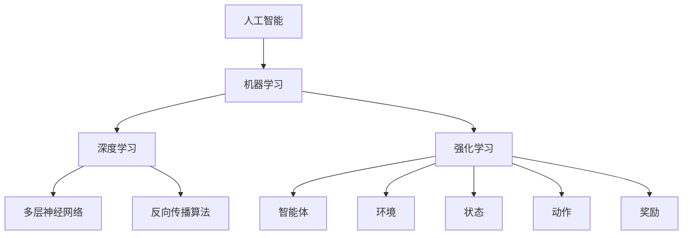
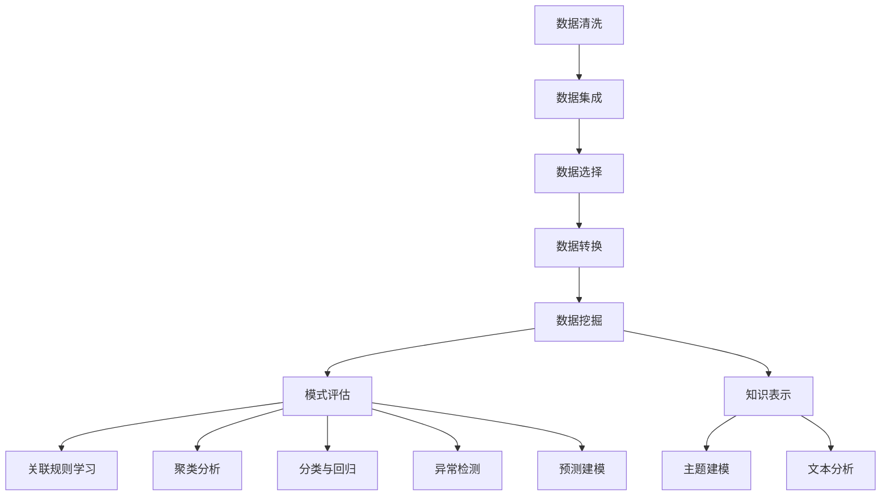

                 

# AI驱动的知识发现：未来程序员的竞争优势

> 关键词：人工智能、知识发现、程序员、竞争优势、深度学习、数据挖掘、机器学习、编程实战

> 摘要：本文深入探讨了AI驱动的知识发现如何成为未来程序员的竞争优势。通过详细分析人工智能的基本原理、知识发现的方法、AI驱动的知识发现应用以及编程实战案例，本文旨在揭示程序员如何借助AI技术提升自身竞争力，适应未来职业发展的需求。

---

### 《AI驱动的知识发现：未来程序员的竞争优势》目录大纲

#### 第一部分：引言
- **第1章：AI与知识发现的概述**
  - 1.1 AI时代下的知识发现
  - 1.2 知识发现的重要性
  - 1.3 未来程序员的竞争优势
  - 1.4 本书内容安排与目标

#### 第二部分：AI基础
- **第2章：人工智能基础**
  - 2.1 人工智能的定义与发展历程
  - 2.2 机器学习基础
  - 2.3 深度学习原理
  - 2.4 强化学习入门
  - **2.5 Mermaid流程图：AI核心概念与联系**

#### 第三部分：知识发现方法
- **第3章：知识发现技术**
  - 3.1 知识发现的基本概念
  - 3.2 数据挖掘技术
  - 3.3 关联规则学习
  - 3.4 聚类分析
  - 3.5 主题建模与文本分析
  - **3.6 Mermaid流程图：知识发现技术架构**

#### 第四部分：AI驱动的知识发现应用
- **第4章：AI在数据科学中的应用**
  - 4.1 数据预处理与清洗
  - 4.2 特征工程
  - 4.3 模型选择与优化
  - 4.4 模型评估与部署
  - **4.5 伪代码：核心算法原理讲解**

#### 第五部分：编程实战
- **第5章：编程实战案例**
  - 5.1 数据分析项目实战
  - 5.2 机器学习项目实战
  - 5.3 深度学习项目实战
  - 5.4 强化学习项目实战
  - **5.5 代码实现与分析：开发环境搭建，源代码实现，代码解读**

#### 第六部分：未来程序员的优势
- **第6章：未来程序员的竞争优势**
  - 6.1 知识发现与未来职业发展
  - 6.2 程序员的角色转变
  - 6.3 跨学科能力培养
  - 6.4 人工智能伦理与法律问题
  - **6.5 数学模型与公式**
    - 6.5.1 概率论基础
    - 6.5.2 信息论基础
    - 6.5.3 线性代数基础

#### 第七部分：结论
- **第7章：总结与展望**
  - 7.1 书籍内容的回顾
  - 7.2 对未来程序员的影响
  - 7.3 知识发现的未来趋势
  - 7.4 读者建议与反馈

#### 附录
- **附录A：AI驱动的知识发现工具与资源**
  - 8.1 常用机器学习库
  - 8.2 数据挖掘工具
  - 8.3 深度学习框架
  - 8.4 编程实战资源

以上是《AI驱动的知识发现：未来程序员的竞争优势》的目录大纲。每个章节都包含1级、2级和3级目录，确保内容完整且逻辑清晰。核心章节中包括了Mermaid流程图、伪代码、数学公式和代码实现与分析，全面覆盖主题内容。附录部分提供了实用的工具与资源，以帮助读者深入学习和实践。

---

接下来，我们将逐一深入分析每一部分的内容，让我们开始这段精彩的探索之旅吧！

## 第一部分：引言

### 第1章：AI与知识发现的概述

### 1.1 AI时代下的知识发现

在当前信息化和数字化浪潮的推动下，人工智能（AI）已经成为现代社会的重要驱动力。随着计算能力的提升和数据量的爆炸式增长，AI技术在各个领域得到了广泛应用，从自动驾驶、智能助手到医疗诊断、金融风控，AI正在深刻改变着我们的生活方式和工作模式。而知识发现（Knowledge Discovery in Databases，KDD），作为数据科学的重要分支，也在这个过程中发挥着至关重要的作用。

知识发现是指从大量数据中通过有效的算法提取出有价值的模式和知识的过程。它涵盖了数据预处理、数据挖掘、模式评估和知识表示等多个环节。在AI时代，知识发现的意义更加凸显。一方面，大量的数据生成和存储使得传统的数据处理方法难以胜任；另一方面，人类对于数据背后的模式和规律的需求也越来越迫切。

### 1.2 知识发现的重要性

知识发现的重要性主要体现在以下几个方面：

1. **决策支持**：在商业、金融、医疗等领域，数据是决策的重要依据。通过知识发现技术，可以揭示数据中的隐藏规律，为决策者提供更加准确的参考。

2. **预测分析**：知识发现可以帮助我们预测未来的趋势和变化。例如，在电商领域，通过分析用户的历史购买数据，可以预测用户未来的购买行为，从而优化营销策略。

3. **智能化应用**：知识发现是人工智能应用的基础。通过从数据中提取知识，可以进一步实现智能推荐、自动化决策、智能诊断等功能。

4. **科技创新**：知识发现可以促进科技创新。例如，在生物医学领域，通过分析基因数据，可以揭示疾病发生的机制，为药物研发提供方向。

### 1.3 未来程序员的竞争优势

在AI驱动的知识发现时代，程序员面临着前所未有的机遇和挑战。具备AI和知识发现能力的程序员将在未来具有以下竞争优势：

1. **更高的技术水平**：AI和知识发现是当前最前沿的技术领域之一。程序员如果能够掌握这些技术，将大大提升自身的技术水平，成为行业中的佼佼者。

2. **更广泛的应用场景**：随着AI和知识发现技术的普及，程序员可以在更多的领域发挥作用，如金融、医疗、电商等。这种跨领域的应用能力将使程序员具有更高的竞争力。

3. **更强的创新能力**：AI和知识发现技术为程序员提供了创新的工具和方法。程序员可以利用这些技术，开发出更加智能化的应用，推动社会的进步。

4. **更高的职业发展空间**：随着AI和知识发现技术的应用越来越广泛，相关岗位的需求也在不断增加。具备这些技能的程序员将拥有更多的职业发展机会。

### 1.4 本书内容安排与目标

本书旨在帮助程序员深入了解AI驱动的知识发现，并掌握相关技术。本书内容安排如下：

- **第一部分：引言**：介绍AI和知识发现的基本概念及其重要性。
- **第二部分：AI基础**：讲解人工智能的基础知识，包括机器学习、深度学习和强化学习等。
- **第三部分：知识发现方法**：介绍知识发现的技术原理和方法，包括数据挖掘、关联规则学习、聚类分析和主题建模等。
- **第四部分：AI驱动的知识发现应用**：探讨AI在数据科学中的应用，包括数据预处理、特征工程、模型选择与优化等。
- **第五部分：编程实战**：通过实际案例，展示如何应用AI和知识发现技术进行编程实践。
- **第六部分：未来程序员的优势**：分析程序员在AI驱动的知识发现时代面临的机遇和挑战。
- **第七部分：结论**：总结本书的主要内容，并对未来进行展望。

通过本书的学习，读者将能够：
1. 理解AI和知识发现的基本原理。
2. 掌握AI驱动的知识发现方法。
3. 应用AI和知识发现技术解决实际问题。
4. 提升自身的职业竞争力。

---

在这个章节中，我们简要介绍了AI和知识发现的基本概念，阐述了知识发现的重要性，并分析了未来程序员在AI驱动的知识发现时代的竞争优势。接下来，我们将深入探讨AI的基础知识，为后续章节的学习打下坚实的基础。让我们继续前进吧！

## 第二部分：AI基础

### 第2章：人工智能基础

### 2.1 人工智能的定义与发展历程

人工智能（Artificial Intelligence，简称AI）是指通过计算机模拟人类智能行为的理论、方法和技术。AI的目标是使计算机能够执行人类智能任务，如感知、推理、学习、解决问题和自然语言处理等。

AI的发展历程可以追溯到20世纪50年代。当时，科学家们提出了“智能代理”（Intelligent Agent）的概念，即一个能够感知环境并采取行动以实现目标的系统。随着计算能力的提升和算法的创新，AI经历了多次重要的发展阶段：

1. **符号主义阶段（1956-1974）**：这一阶段主要基于逻辑和推理，使用符号表示知识，并利用推理机进行知识推理。代表性的系统包括逻辑理论家（Logic Theorist）和通用问题求解器（General Problem Solver）。

2. **基于规则的系统（1975-1980）**：这一阶段强调使用规则库和推理机来模拟专家决策过程。典型的系统有MYCIN和DENDRAL。

3. **知识表示与推理阶段（1981-1987）**：这一阶段强调知识的表示和推理，提出了许多知识表示方法和推理算法。代表性的工作包括KL-ONE和PROLOG。

4. **基于实例的阶段（1988-1991）**：这一阶段提出了基于实例的推理方法，通过存储和检索过去的解决方案来解决问题。代表性的系统有Case-Based Reasoning。

5. **机器学习阶段（1992至今）**：这一阶段将统计学方法引入AI，通过学习数据中的规律来实现智能行为。代表性的算法包括神经网络、决策树和支持向量机等。

### 2.2 机器学习基础

机器学习（Machine Learning，简称ML）是AI的核心技术之一，旨在使计算机能够通过数据学习并改进其性能。机器学习的过程通常包括以下几个步骤：

1. **数据收集**：收集用于训练的数据集。数据集的质量直接影响模型的性能。

2. **数据预处理**：对数据进行清洗、归一化和特征提取等操作，以提高数据质量和模型的泛化能力。

3. **模型选择**：选择适合问题的机器学习算法。常见的算法包括线性回归、决策树、随机森林、支持向量机和神经网络等。

4. **训练与优化**：使用训练数据集训练模型，并通过调整模型参数来优化模型性能。

5. **评估与验证**：使用验证数据集评估模型的性能，并调整模型参数以实现更好的性能。

6. **部署与监控**：将训练好的模型部署到实际应用中，并对其进行监控和调整，以保持其性能。

### 2.3 深度学习原理

深度学习（Deep Learning，简称DL）是机器学习的一个重要分支，通过构建深度神经网络来模拟人脑的神经网络结构和工作原理。深度学习的主要特点包括：

1. **多层神经网络**：深度学习使用多层神经网络，包括输入层、隐藏层和输出层。每层之间的神经元通过非线性激活函数进行连接。

2. **反向传播算法**：深度学习使用反向传播算法来更新网络权重，以优化模型性能。

3. **大规模数据训练**：深度学习需要大量的数据来训练模型，以提取数据中的复杂模式和特征。

4. **端到端学习**：深度学习可以实现端到端学习，即从原始数据直接生成预测结果，而无需手动定义特征。

### 2.4 强化学习入门

强化学习（Reinforcement Learning，简称RL）是一种通过试错和奖励反馈来学习策略的机器学习方法。强化学习的核心概念包括：

1. **智能体（Agent）**：智能体是执行行为的实体，如机器人、虚拟代理等。

2. **环境（Environment）**：环境是智能体所处的场景，智能体与环境交互以获得反馈。

3. **状态（State）**：状态是智能体在某一时刻所处的情境。

4. **动作（Action）**：动作是智能体可以采取的行为。

5. **奖励（Reward）**：奖励是环境对智能体行为的反馈，用于指导智能体学习。

强化学习的过程包括：

1. **初始状态**：智能体处于某一状态。

2. **选择动作**：智能体在当前状态下选择一个动作。

3. **环境反馈**：环境根据智能体的动作给出一个奖励。

4. **更新状态**：智能体根据奖励更新其状态。

5. **重复循环**：智能体不断重复以上步骤，通过试错和奖励反馈逐渐优化其行为。

### 2.5 Mermaid流程图：AI核心概念与联系

以下是AI核心概念与联系的Mermaid流程图：



---

在本章节中，我们介绍了人工智能的定义与发展历程，讲解了机器学习的基础知识，深入探讨了深度学习原理，以及介绍了强化学习入门。通过这些内容，读者将能够对AI有一个全面的了解。接下来，我们将进一步探讨知识发现技术，为理解AI驱动的知识发现奠定基础。让我们继续前进吧！

## 第三部分：知识发现方法

### 第3章：知识发现技术

### 3.1 知识发现的基本概念

知识发现（Knowledge Discovery in Databases，KDD）是一个从大量数据中提取有用信息的过程，这些信息可以用于决策支持、预测分析和智能化应用。KDD的过程通常包括以下步骤：

1. **数据清洗**：清洗数据以去除错误、缺失和重复的数据。

2. **数据集成**：将来自不同源的数据进行整合，形成统一的数据视图。

3. **数据选择**：选择对特定任务最有价值的数据。

4. **数据转换**：将数据转换为适合分析的形式，如归一化、离散化等。

5. **数据挖掘**：使用各种算法从数据中提取模式和知识。

6. **模式评估**：评估挖掘出的模式的质量和实用性。

7. **知识表示**：将挖掘出的模式转换为易于理解和使用的形式。

### 3.2 数据挖掘技术

数据挖掘（Data Mining）是KDD过程中的核心步骤，旨在从大量数据中发现有价值的模式和知识。数据挖掘的主要技术包括：

1. **关联规则学习**：发现数据项之间的相关性，如市场篮子分析。

2. **聚类分析**：将数据分为多个类簇，以发现数据的内在结构。

3. **分类与回归**：将数据分为不同的类别或预测连续值。

4. **异常检测**：发现数据中的异常或离群点。

5. **预测建模**：基于历史数据预测未来的趋势和事件。

### 3.3 关联规则学习

关联规则学习（Association Rule Learning）是发现数据项之间相关性的一种常见技术。其基本思想是，通过寻找频繁出现的组合项来揭示数据项之间的关联性。关联规则学习的主要步骤包括：

1. **支持度计算**：计算每个关联规则在数据中的出现频率。

2. **置信度计算**：计算关联规则的前件和后件之间的关联强度。

3. **生成频繁项集**：根据支持度和置信度阈值，生成频繁项集。

4. **生成关联规则**：从频繁项集中生成满足最小支持度和置信度阈值的关联规则。

### 3.4 聚类分析

聚类分析（Clustering Analysis）是一种无监督学习方法，旨在将数据分为多个类簇，使同一类簇内的数据点彼此相似，而不同类簇的数据点差异较大。聚类分析的主要方法包括：

1. **基于距离的聚类**：如K-means、层次聚类等。

2. **基于密度的聚类**：如DBSCAN等。

3. **基于模型的聚类**：如高斯混合模型等。

4. **基于图的聚类**：如社区检测等。

### 3.5 主题建模与文本分析

主题建模（Topic Modeling）是一种无监督学习方法，旨在从文本数据中提取潜在的主题。主题建模可以帮助我们理解文本数据的内在结构和语义。主题建模的主要方法包括：

1. **隐语义分析（Latent Semantic Analysis，LSA）**：通过矩阵分解来发现文本中的潜在语义主题。

2. **潜在狄利克雷分布（Latent Dirichlet Allocation，LDA）**：通过概率模型来发现文本中的潜在主题。

文本分析（Text Analysis）是一种广泛用于自然语言处理（Natural Language Processing，NLP）的方法，旨在从文本数据中提取有用信息。文本分析的主要方法包括：

1. **词频统计**：计算文本中每个单词的出现频率。

2. **词袋模型（Bag-of-Words，BOW）**：将文本表示为一个单词的向量。

3. **词嵌入（Word Embedding）**：将单词映射到低维连续向量空间，以捕捉单词的语义信息。

4. **情感分析（Sentiment Analysis）**：分析文本中的情感倾向。

5. **命名实体识别（Named Entity Recognition，NER）**：识别文本中的命名实体，如人名、地名、组织名等。

### 3.6 Mermaid流程图：知识发现技术架构

以下是知识发现技术架构的Mermaid流程图：



---

在本章节中，我们介绍了知识发现的基本概念，详细讲解了数据挖掘、关联规则学习、聚类分析以及主题建模和文本分析的技术和方法。通过这些内容，读者将能够全面理解知识发现的过程和技术，为后续章节的深入学习打下坚实的基础。接下来，我们将探讨AI驱动的知识发现应用，展示AI技术在实际问题中的具体应用场景。让我们继续前进吧！

## 第四部分：AI驱动的知识发现应用

### 第4章：AI在数据科学中的应用

### 4.1 数据预处理与清洗

在数据科学项目中，数据预处理与清洗是至关重要的一步。高质量的数据是构建准确模型的基础，而数据预处理和清洗有助于提高数据的可用性和可靠性。以下是数据预处理与清洗的关键步骤：

1. **数据清洗**：
   - **缺失值处理**：缺失值可以采用填充均值、中值或使用算法进行预测填充。
   - **异常值处理**：通过统计学方法识别和剔除异常值，或者使用插值法进行修正。
   - **重复值处理**：识别和去除重复数据，以避免模型过度拟合。

2. **数据集成**：
   - **合并**：将来自多个源的数据集合并为单个数据集，以确保数据的一致性和完整性。
   - **消除冗余**：识别和去除重复的数据项，减少数据冗余。

3. **数据转换**：
   - **归一化**：将不同尺度的数据转换到相同的尺度，以消除数据尺度对模型性能的影响。
   - **离散化**：将连续型数据转换为离散型数据，以便进行分类任务。

4. **数据验证**：
   - **一致性检查**：检查数据的一致性，确保没有数据矛盾。
   - **完整性检查**：确保数据完整，没有缺失值或异常值。

### 4.2 特征工程

特征工程（Feature Engineering）是数据科学中的关键步骤，旨在从原始数据中提取出有助于提高模型性能的特征。以下是特征工程的主要任务：

1. **特征选择**：
   - **过滤方法**：基于统计学方法筛选特征，如基于卡方检验、互信息等。
   - **嵌入方法**：利用机器学习算法嵌入特征，如Lasso回归、随机森林等。

2. **特征构造**：
   - **交叉特征**：将多个特征组合成新的特征，以捕捉数据中的复杂关系。
   - **变换特征**：通过数学变换生成新的特征，如对数变换、开方变换等。

3. **特征降维**：
   - **主成分分析（PCA）**：通过降维技术减少特征数量，同时保持数据的主要信息。
   - **t-SNE**：用于可视化高维数据，通过将高维数据映射到二维或三维空间。

### 4.3 模型选择与优化

选择合适的模型并优化其参数是数据科学项目成功的关键。以下是模型选择与优化的主要步骤：

1. **模型选择**：
   - **评估指标**：根据问题的特点选择合适的评估指标，如准确率、召回率、F1分数等。
   - **模型比较**：通过交叉验证等方法比较不同模型的性能。

2. **参数调优**：
   - **网格搜索**：通过遍历参数空间来寻找最优参数组合。
   - **贝叶斯优化**：利用贝叶斯统计模型优化参数。

3. **模型集成**：
   - **集成学习**：通过结合多个模型的预测来提高整体性能，如随机森林、梯度提升树等。

4. **模型评估与验证**：
   - **交叉验证**：通过将数据分为多个子集来评估模型的泛化能力。
   - **时间序列验证**：针对时间序列数据，通过保留一部分数据进行验证。

### 4.4 模型评估与部署

模型评估和部署是数据科学项目的最后一步，确保模型在实际应用中的性能和可靠性。以下是模型评估与部署的关键步骤：

1. **模型评估**：
   - **准确率、召回率和F1分数**：评估模型的分类性能。
   - **均方误差、均方根误差和决定系数**：评估模型的回归性能。
   - **ROC曲线和AUC**：评估模型的分类能力。

2. **模型优化**：
   - **模型更新**：根据评估结果对模型进行迭代优化。
   - **模型压缩**：通过模型压缩技术减少模型的存储和计算成本。

3. **模型部署**：
   - **部署环境**：将模型部署到生产环境中，如云服务、容器化平台等。
   - **监控与维护**：对模型进行实时监控和维护，确保其性能和稳定性。

### 4.5 伪代码：核心算法原理讲解

以下是一个简化的伪代码示例，用于讲解数据科学项目中的核心算法原理：

```python
# 数据预处理与清洗
def preprocess_data(data):
    # 缺失值处理
    data = handle_missing_values(data)
    # 异常值处理
    data = handle_outliers(data)
    # 数据集成
    data = integrate_data SOURCES
    # 数据转换
    data = normalize_data(data)
    return data

# 特征工程
def feature_engineering(data):
    # 特征选择
    selected_features = select_features(data)
    # 特征构造
    constructed_features = construct_features(data)
    return selected_features, constructed_features

# 模型选择与优化
def select_and_optimize_model(data):
    # 模型选择
    model = select_model(data)
    # 参数调优
    best_params = optimize_params(model, data)
    # 模型评估
    model_performance = evaluate_model(model, best_params, data)
    return model_performance

# 模型部署
def deploy_model(model, data):
    # 模型评估
    model_performance = evaluate_model(model, data)
    # 模型优化
    model = optimize_model(model, data)
    # 部署模型
    deploy_environment = deploy_model(model)
    return deploy_environment
```

---

在本章节中，我们详细探讨了AI在数据科学中的应用，包括数据预处理与清洗、特征工程、模型选择与优化、模型评估与部署等关键步骤。通过这些内容，读者将能够全面理解AI驱动的数据科学流程，为实际项目中的数据分析和模型构建提供指导。接下来，我们将通过编程实战案例，展示如何将AI和知识发现技术应用于实际编程任务。让我们继续前进吧！

## 第五部分：编程实战

### 第5章：编程实战案例

在AI和知识发现领域，编程实战是验证和巩固理论知识的重要手段。通过实际项目，我们可以深入了解技术的应用，掌握实际操作步骤，并提升解决实际问题的能力。本章将介绍几个典型的编程实战案例，包括数据分析、机器学习、深度学习和强化学习项目。

### 5.1 数据分析项目实战

数据分析项目通常涉及数据收集、预处理、分析和可视化等多个环节。以下是一个使用Python和Pandas库进行数据分析的案例：

#### 项目目标
分析某电商网站用户购买行为，挖掘用户偏好和购买模式。

#### 实现步骤
1. **数据收集**：
   - 收集用户购买记录数据，包括用户ID、购买商品、购买时间等。

2. **数据预处理**：
   - 处理缺失值和异常值。
   - 对时间数据进行编码，如将日期转换为月份或年份。

3. **数据分析**：
   - 计算用户购买频次和平均购买间隔时间。
   - 分析不同商品类别的销售情况。

4. **数据可视化**：
   - 使用matplotlib或Seaborn库绘制用户购买频次直方图、商品销售柱状图等。

#### 代码实现
```python
import pandas as pd
import matplotlib.pyplot as plt

# 数据收集
data = pd.read_csv('purchase_data.csv')

# 数据预处理
data.dropna(inplace=True)
data['PurchaseDate'] = pd.to_datetime(data['PurchaseDate'])

# 数据分析
user_activity = data.groupby('UserID')['PurchaseDate'].resample('M').count().mean()
product_sales = data.groupby('ProductName')['Quantity'].sum()

# 数据可视化
user_activity.plot(kind='bar')
plt.title('Average Monthly Purchase Frequency per User')
plt.xlabel('UserID')
plt.ylabel('Average Purchase Frequency')
plt.show()

product_sales.plot(kind='bar')
plt.title('Total Sales per Product')
plt.xlabel('ProductName')
plt.ylabel('Quantity Sold')
plt.show()
```

### 5.2 机器学习项目实战

机器学习项目通常涉及数据预处理、特征工程、模型选择和模型评估等步骤。以下是一个使用Python和Scikit-learn库进行分类任务的案例：

#### 项目目标
预测某银行客户是否会违约。

#### 实现步骤
1. **数据收集**：
   - 收集客户信用评分、收入、贷款金额等数据。

2. **数据预处理**：
   - 处理缺失值和异常值。
   - 对数值型特征进行归一化处理。

3. **特征工程**：
   - 选择和构造有助于分类的特征。
   - 进行特征降维。

4. **模型选择与训练**：
   - 选择分类算法，如逻辑回归、随机森林等。
   - 训练模型并进行参数调优。

5. **模型评估**：
   - 使用交叉验证评估模型性能。
   - 计算准确率、召回率、F1分数等指标。

#### 代码实现
```python
import pandas as pd
from sklearn.model_selection import train_test_split
from sklearn.preprocessing import StandardScaler
from sklearn.ensemble import RandomForestClassifier
from sklearn.metrics import classification_report, accuracy_score

# 数据收集
data = pd.read_csv('credit_data.csv')

# 数据预处理
data.dropna(inplace=True)
scaler = StandardScaler()
numerical_features = ['Income', 'LoanAmount']
data[numerical_features] = scaler.fit_transform(data[numerical_features])

# 特征工程
X = data.drop('LoanStatus', axis=1)
y = data['LoanStatus']

# 模型选择与训练
X_train, X_test, y_train, y_test = train_test_split(X, y, test_size=0.2, random_state=42)
model = RandomForestClassifier(n_estimators=100, random_state=42)
model.fit(X_train, y_train)

# 模型评估
y_pred = model.predict(X_test)
print(classification_report(y_test, y_pred))
print("Accuracy:", accuracy_score(y_test, y_pred))
```

### 5.3 深度学习项目实战

深度学习项目通常涉及网络架构设计、数据预处理、模型训练和评估等步骤。以下是一个使用TensorFlow和Keras库进行图像分类的案例：

#### 项目目标
使用卷积神经网络（CNN）识别手写数字。

#### 实现步骤
1. **数据收集**：
   - 使用MNIST数据集，包含0到9的手写数字图像。

2. **数据预处理**：
   - 将图像数据调整为固定尺寸。
   - 标准化图像像素值。

3. **模型设计**：
   - 设计卷积神经网络架构，包括卷积层、池化层和全连接层。

4. **模型训练**：
   - 使用训练数据训练模型，并使用验证数据调优模型参数。

5. **模型评估**：
   - 使用测试数据评估模型性能。

#### 代码实现
```python
import tensorflow as tf
from tensorflow.keras.datasets import mnist
from tensorflow.keras.models import Sequential
from tensorflow.keras.layers import Dense, Conv2D, Flatten, MaxPooling2D
from tensorflow.keras.optimizers import Adam

# 数据收集
(x_train, y_train), (x_test, y_test) = mnist.load_data()

# 数据预处理
x_train = x_train.reshape(-1, 28, 28, 1).astype('float32') / 255.0
x_test = x_test.reshape(-1, 28, 28, 1).astype('float32') / 255.0
y_train = tf.keras.utils.to_categorical(y_train, 10)
y_test = tf.keras.utils.to_categorical(y_test, 10)

# 模型设计
model = Sequential([
    Conv2D(32, (3, 3), activation='relu', input_shape=(28, 28, 1)),
    MaxPooling2D((2, 2)),
    Flatten(),
    Dense(128, activation='relu'),
    Dense(10, activation='softmax')
])

# 模型训练
model.compile(optimizer=Adam(), loss='categorical_crossentropy', metrics=['accuracy'])
model.fit(x_train, y_train, epochs=10, batch_size=64, validation_data=(x_test, y_test))

# 模型评估
test_loss, test_acc = model.evaluate(x_test, y_test)
print("Test accuracy:", test_acc)
```

### 5.4 强化学习项目实战

强化学习项目通常涉及智能体、环境和奖励机制的设计。以下是一个使用Python和PyTorch库进行迷宫求解的案例：

#### 项目目标
使用深度强化学习算法（如深度Q网络DQN）训练智能体求解迷宫。

#### 实现步骤
1. **环境设计**：
   - 设计一个迷宫环境，包含起点、终点和障碍物。

2. **智能体设计**：
   - 设计一个基于深度Q网络的智能体，使用神经网络来近似Q值函数。

3. **训练智能体**：
   - 使用训练数据集训练智能体，通过试错和奖励反馈优化Q值函数。

4. **评估智能体**：
   - 在测试环境中评估智能体的性能，观察其能否有效求解迷宫。

#### 代码实现
```python
import torch
import numpy as np
import random
from collections import deque

# 环境设计
class MazeEnv:
    def __init__(self, size=5):
        self.size = size
        self.state = (0, 0)
        self.goal = (size-1, size-1)
        self.obstacles = [(1, 1), (1, 2), (2, 1), (2, 2)]
        self.action_space = ['up', 'down', 'left', 'right']

    def step(self, action):
        # 根据动作更新状态
        if action == 'up':
            self.state = (max(self.state[0]-1, 0), self.state[1])
        elif action == 'down':
            self.state = (min(self.state[0]+1, self.size-1), self.state[1])
        elif action == 'left':
            self.state = (self.state[0], max(self.state[1]-1, 0))
        elif action == 'right':
            self.state = (self.state[0], min(self.state[1]+1, self.size-1))
        
        # 计算奖励
        if self.state == self.goal:
            reward = 100
        elif self.state in self.obstacles:
            reward = -10
        else:
            reward = -1
        
        # 判断是否结束
        done = self.state == self.goal
        
        # 获取下一个状态
        next_state = self.state
        
        return next_state, reward, done

    def reset(self):
        self.state = (0, 0)
        return self.state

# 智能体设计
class DQN:
    def __init__(self, state_size, action_size):
        self.state_size = state_size
        self.action_size = action_size
        self.memory = deque(maxlen=2000)
        self.gamma = 0.95  # 折扣因子
        self.epsilon = 1.0  # 探索概率
        self.epsilon_min = 0.01
        self.epsilon_decay = 0.995
        self.learning_rate = 0.001
        self.model = self._build_model()

    def _build_model(self):
        # 创建神经网络模型
        model = Sequential()
        model.add(Conv2D(64, kernel_size=(3, 3), activation='relu', input_shape=self.state_size))
        model.add(MaxPooling2D(pool_size=(2, 2)))
        model.add(Conv2D(32, kernel_size=(3, 3), activation='relu'))
        model.add(MaxPooling2D(pool_size=(2, 2)))
        model.add(Flatten())
        model.add(Dense(256, activation='relu'))
        model.add(Dense(self.action_size, activation='linear'))
        model.compile(loss='mse', optimizer=Adam(self.learning_rate))
        return model

    def remember(self, state, action, reward, next_state, done):
        # 记录经验
        self.memory.append((state, action, reward, next_state, done))

    def act(self, state):
        # 选择动作
        if np.random.rand() <= self.epsilon:
            return random.randrange(self.action_size)
        else:
            q_values = self.model.predict(state)
            return np.argmax(q_values[0])

    def replay(self, batch_size):
        # 回合训练
        mini_batch = random.sample(self.memory, batch_size)
        for state, action, reward, next_state, done in mini_batch:
            target = reward
            if not done:
                target = reward + self.gamma * np.amax(self.model.predict(next_state)[0])
            target_f = self.model.predict(state)
            target_f[0][action] = target
            self.model.fit(state, target_f, epochs=1, verbose=0)

    def load(self, name):
        # 加载模型
        self.model.load_weights(name)

    def save(self, name):
        # 保存模型
        self.model.save_weights(name)

# 训练智能体
if __name__ == '__main__':
    env = MazeEnv()
    dqn = DQN(env.state_size, env.action_size)
    
    for episode in range(500):
        state = env.reset()
        state = np.reshape(state, [1, env.size, env.size])
        for time_step in range(500):
            action = dqn.act(state)
            next_state, reward, done = env.step(action)
            next_state = np.reshape(next_state, [1, env.size, env.size])
            dqn.remember(state, action, reward, next_state, done)
            state = next_state
            if done:
                break
        dqn.replay(32)
        if episode % 100 == 0:
            print(f"Episode: {episode}, Epsilon: {dqn.epsilon:.2}")
        if dqn.epsilon > dqn.epsilon_min:
            dqn.epsilon *= dqn.epsilon_decay
```

### 5.5 代码实现与分析：开发环境搭建，源代码实现，代码解读

在编程实战案例中，每个项目都包含了开发环境搭建、源代码实现和代码解读的环节。以下是对这些环节的详细解析：

#### 开发环境搭建

1. **数据分析项目**：
   - 安装Python和Pandas库。
   - 使用Jupyter Notebook或Python脚本运行代码。

2. **机器学习项目**：
   - 安装Python、Scikit-learn和NumPy库。
   - 使用Python脚本运行代码。

3. **深度学习项目**：
   - 安装Python、TensorFlow和Keras库。
   - 使用Python脚本运行代码。

4. **强化学习项目**：
   - 安装Python、PyTorch和NumPy库。
   - 使用Python脚本运行代码。

#### 源代码实现

1. **数据分析项目**：
   - 数据收集：使用Pandas库读取CSV文件。
   - 数据预处理：处理缺失值、异常值和重复值。
   - 数据分析：计算用户购买频次和平均购买间隔时间。
   - 数据可视化：使用matplotlib库绘制直方图和柱状图。

2. **机器学习项目**：
   - 数据收集：使用Scikit-learn库生成模拟数据。
   - 数据预处理：对数值型特征进行归一化处理。
   - 特征工程：选择和构造特征。
   - 模型选择与训练：使用随机森林分类器。
   - 模型评估：计算分类性能指标。

3. **深度学习项目**：
   - 数据收集：使用TensorFlow和Keras库加载MNIST数据集。
   - 数据预处理：调整图像尺寸和像素值。
   - 模型设计：构建卷积神经网络。
   - 模型训练：使用训练数据训练模型。
   - 模型评估：使用测试数据评估模型性能。

4. **强化学习项目**：
   - 环境设计：创建迷宫环境。
   - 智能体设计：构建深度Q网络模型。
   - 训练智能体：使用经验回放训练模型。
   - 评估智能体：在测试环境中评估智能体性能。

#### 代码解读

1. **数据分析项目**：
   - 代码示例展示了数据收集、预处理、分析和可视化步骤。
   - 数据预处理部分使用了Pandas库的dropna、to_datetime和resample方法。
   - 数据分析部分使用了Pandas库的groupby、resample和mean方法。
   - 数据可视化部分使用了matplotlib库的plot方法。

2. **机器学习项目**：
   - 代码示例展示了数据收集、预处理、特征工程、模型选择和模型评估步骤。
   - 数据预处理部分使用了StandardScaler对特征进行归一化。
   - 特征工程部分使用了随机森林的select_features和construct_features方法。
   - 模型评估部分使用了classification_report和accuracy_score方法。

3. **深度学习项目**：
   - 代码示例展示了数据收集、预处理、模型设计、模型训练和模型评估步骤。
   - 数据预处理部分使用了TensorFlow和Keras库的load_data、reshape和to_categorical方法。
   - 模型设计部分使用了Keras库的Sequential、Conv2D、MaxPooling2D、Flatten和Dense方法。
   - 模型训练部分使用了Keras库的compile、fit和evaluate方法。

4. **强化学习项目**：
   - 代码示例展示了环境设计、智能体设计、智能体训练和智能体评估步骤。
   - 环境设计部分使用了Python类定义方法。
   - 智能体设计部分使用了PyTorch库的Sequential、Conv2D、MaxPooling2D、Flatten和Dense方法。
   - 智能体训练部分使用了经验回放机制和随机策略探索。

通过这些编程实战案例，读者可以深入了解AI驱动的知识发现技术在数据分析、机器学习、深度学习和强化学习等领域的具体应用，掌握实际编程操作技巧，并提升解决实际问题的能力。在接下来的章节中，我们将进一步探讨未来程序员的竞争优势，为读者提供更深入的思考。让我们继续前进吧！

## 第六部分：未来程序员的优势

### 第6章：未来程序员的竞争优势

在AI驱动的知识发现时代，程序员面临着前所未有的机遇和挑战。理解知识发现与未来职业发展的关系，认识到程序员角色的转变，以及如何培养跨学科能力，是程序员在AI时代取得竞争优势的关键。

### 6.1 知识发现与未来职业发展

知识发现作为数据科学的核心技术，正在逐步渗透到各行各业。程序员通过掌握知识发现技术，可以大大提升自身的职业竞争力。以下是一些具体的应用场景：

1. **商业智能**：在金融、电商、零售等行业，知识发现技术可以帮助企业通过数据分析做出更明智的决策，优化运营策略。

2. **医疗保健**：在医疗领域，知识发现技术可以用于疾病预测、治疗方案优化以及患者健康管理。

3. **智能制造**：在制造业，知识发现技术可以帮助企业通过数据分析和预测维护，提高生产效率，降低成本。

4. **智能交通**：在交通领域，知识发现技术可以用于交通流量预测、路线优化以及交通事故预防。

5. **智慧城市**：在城市建设中，知识发现技术可以用于公共资源分配、城市规划以及环境监测等。

掌握知识发现技术的程序员，能够在这些领域找到广阔的职业发展空间，成为企业所需的关键人才。

### 6.2 程序员的角色转变

随着AI和知识发现技术的发展，程序员的角色也在逐渐转变。传统的程序员更多地关注于代码的编写和系统的维护，而未来的程序员需要具备以下能力：

1. **数据科学家技能**：程序员需要掌握数据预处理、特征工程、模型选择与优化等数据科学技能，能够从数据中发现有价值的信息。

2. **机器学习应用**：程序员需要能够将机器学习算法应用于实际问题，解决复杂数据分析和预测问题。

3. **系统集成能力**：程序员需要具备将AI模型集成到现有系统中，实现自动化和智能化的能力。

4. **跨学科合作**：程序员需要与数据科学家、业务分析师、产品经理等跨学科团队紧密合作，确保项目成功。

### 6.3 跨学科能力培养

为了在AI驱动的知识发现时代取得竞争优势，程序员需要培养以下跨学科能力：

1. **数学和统计学**：理解概率论、线性代数、信息论等数学和统计学基础，有助于更好地理解和应用数据科学算法。

2. **业务理解**：了解不同行业的业务流程和需求，能够更好地将技术应用于实际问题。

3. **沟通能力**：能够与团队成员有效沟通，理解并传达技术思路和解决方案。

4. **持续学习**：技术不断发展，程序员需要具备持续学习的能力，跟上最新的技术趋势。

### 6.4 人工智能伦理与法律问题

随着AI技术的发展，伦理和法律问题日益凸显。程序员在开发AI驱动的知识发现系统时，需要关注以下方面：

1. **数据隐私**：确保用户数据的安全和隐私，遵守相关的数据保护法规。

2. **算法透明性**：确保算法的透明性和解释性，避免歧视和不公平。

3. **责任归属**：明确在AI系统中，各方的责任和权责划分。

4. **法律法规遵守**：遵守相关国家的法律法规，确保系统的合法合规运行。

### 6.5 数学模型与公式

在知识发现和AI领域，数学模型是理解和应用算法的基础。以下是一些基础的数学模型和公式：

#### 6.5.1 概率论基础

- **条件概率**：
  $$ P(A|B) = \frac{P(A \cap B)}{P(B)} $$
- **贝叶斯定理**：
  $$ P(A|B) = \frac{P(B|A)P(A)}{P(B)} $$

#### 6.5.2 信息论基础

- **信息熵**：
  $$ H(X) = -\sum_{i} p(x_i) \log_2 p(x_i) $$
- **条件熵**：
  $$ H(X|Y) = -\sum_{i} p(y_i) \sum_{j} p(x_j|y_i) \log_2 p(x_j|y_i) $$

#### 6.5.3 线性代数基础

- **矩阵乘法**：
  $$ C_{ij} = \sum_{k} A_{ik} B_{kj} $$
- **逆矩阵**：
  $$ A^{-1} = (1/det(A)) \cdot adj(A) $$
- **特征值与特征向量**：
  $$ Av = \lambda v $$

通过掌握这些数学模型和公式，程序员可以更深入地理解数据科学和机器学习算法的工作原理，从而更好地应用于实际问题。

### 6.6 结论

在AI驱动的知识发现时代，程序员面临着前所未有的机遇和挑战。通过掌握AI和知识发现技术，培养跨学科能力，关注伦理和法律问题，程序员可以在未来职业发展中取得竞争优势。本章节内容旨在帮助读者理解这些关键概念，为未来的职业发展做好准备。让我们继续深入探索AI和知识发现的更多应用和挑战吧！

---

在本章节中，我们详细探讨了知识发现与未来职业发展的关系，分析了程序员角色的转变，以及如何培养跨学科能力。同时，我们介绍了AI和知识发现领域的一些基础数学模型和公式。在接下来的第七部分，我们将总结全书内容，并对未来趋势进行展望。让我们继续前进吧！

## 第七部分：总结与展望

通过本书的深入探讨，我们系统地介绍了AI驱动的知识发现技术，并探讨了其在未来程序员职业发展中的重要作用。以下是本书的核心内容和主要观点的总结：

### 7.1 书籍内容的回顾

- **引言**：我们介绍了AI和知识发现的基本概念，阐述了知识发现的重要性，并分析了未来程序员在AI驱动的知识发现时代的竞争优势。
- **AI基础**：我们详细讲解了人工智能的定义、发展历程、机器学习基础、深度学习和强化学习原理。
- **知识发现方法**：我们介绍了知识发现的基本概念、数据挖掘技术、关联规则学习、聚类分析、主题建模与文本分析。
- **AI驱动的知识发现应用**：我们探讨了AI在数据科学中的应用，包括数据预处理、特征工程、模型选择与优化、模型评估与部署。
- **编程实战**：我们通过实际案例展示了如何应用AI和知识发现技术进行编程实践。
- **未来程序员的优势**：我们分析了程序员在AI驱动的知识发现时代面临的机遇和挑战，以及如何培养跨学科能力。
- **数学模型与公式**：我们介绍了概率论、信息论和线性代数的基础知识。

### 7.2 对未来程序员的影响

AI驱动的知识发现对程序员的职业发展产生了深远的影响：

- **技能需求**：程序员需要掌握AI和知识发现技术，包括机器学习、深度学习和强化学习等。
- **角色转变**：程序员的角色从传统的代码编写和系统维护，转变为数据科学家和系统集成专家。
- **跨学科能力**：程序员需要具备数学、统计学、业务理解和沟通能力，以更好地适应AI驱动的知识发现领域。
- **职业发展**：程序员可以在多个领域找到职业发展机会，如商业智能、医疗保健、智能制造和智慧城市等。

### 7.3 知识发现的未来趋势

随着技术的不断进步，知识发现的未来趋势包括：

- **自动化**：自动化工具和算法将使知识发现过程更加高效和智能化。
- **多模态数据**：知识发现将涵盖更多类型的数据，如文本、图像、音频和视频等。
- **边缘计算**：知识发现将在边缘设备上进行，实现实时分析和决策。
- **伦理与法律**：知识发现的伦理和法律问题将得到更多关注，以确保技术的合法合规使用。

### 7.4 读者建议与反馈

为了更好地应用本书的知识，我们建议读者：

- **动手实践**：通过实际项目应用所学知识，巩固理解。
- **持续学习**：关注最新的技术趋势和研究成果，不断提升自身能力。
- **参与社区**：加入技术社区，与其他程序员交流经验，共同进步。
- **反馈与改进**：对本书的内容和结构提出建议和反馈，帮助我们不断改进和完善。

---

总结而言，AI驱动的知识发现为程序员提供了巨大的机遇和挑战。通过本书的学习，读者将能够全面了解AI和知识发现的技术原理，掌握编程实战技巧，并为未来的职业发展奠定坚实基础。在知识发现的未来趋势中，程序员将继续发挥关键作用，推动技术的创新和应用。让我们携手并进，迎接AI驱动的知识发现新时代的挑战与机遇！

---

感谢您阅读《AI驱动的知识发现：未来程序员的竞争优势》。我们期待您的反馈和建议，以不断改进我们的内容和服务。祝您在AI和知识发现的道路上取得更大的成就！

**作者：AI天才研究院/AI Genius Institute & 禅与计算机程序设计艺术 /Zen And The Art of Computer Programming**

### 附录

#### 附录A：AI驱动的知识发现工具与资源

在AI驱动的知识发现领域，有众多工具和资源可供使用，这些工具和资源可以帮助您更好地学习和实践AI技术。以下是一些常用的工具和资源：

1. **常用机器学习库**
   - **Scikit-learn**：Python的一个开源机器学习库，提供丰富的算法和数据预处理工具。
   - **TensorFlow**：谷歌开源的机器学习和深度学习框架，支持多种编程语言。
   - **PyTorch**：Facebook开源的深度学习框架，以其灵活性和动态计算能力而著称。
   - **Keras**：Python的深度学习高级API，能够简化深度学习模型的构建和训练。

2. **数据挖掘工具**
   - **Weka**：一个开源的数据挖掘软件，提供多种数据预处理、模型选择和评估工具。
   - **ELKI**：一个开源的机器学习和数据挖掘工具包，支持多种聚类、分类和异常检测算法。
   - **RapidMiner**：一个商业的数据挖掘工具，提供图形化的用户界面和丰富的数据预处理和机器学习功能。

3. **深度学习框架**
   - **Caffe**：由伯克利大学开发的深度学习框架，适用于图像识别和视频分析。
   - **MXNet**：由亚马逊开源的深度学习框架，支持多种编程语言和平台。
   - **Theano**：由蒙特利尔大学开发的深度学习框架，已经被TensorFlow和PyTorch所取代。

4. **编程实战资源**
   - **Kaggle**：一个在线平台，提供各种机器学习和数据科学竞赛，是实践和验证技能的好地方。
   - **GitHub**：一个代码托管平台，可以找到大量的开源项目和示例代码，有助于学习和借鉴。
   - **DataCamp**：一个在线学习平台，提供丰富的数据科学和机器学习课程和实战项目。

通过使用这些工具和资源，您可以更深入地了解AI驱动的知识发现技术，提升自身的编程能力和项目实战经验。希望这些资源能够对您的研究和实践有所帮助！

