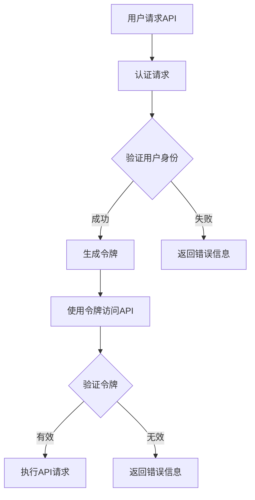

                 

### 文章标题

# API 安全和认证机制

> 关键词：API安全、认证机制、加密技术、令牌认证、API监控、最佳实践

> 摘要：本文将深入探讨API安全和认证机制的核心概念、原理及其在实际应用中的重要性。我们将从API安全和认证的基础知识开始，逐步介绍API安全防护技术、API安全最佳实践，并通过实战案例展示API安全测试和项目实现。通过本文的阅读，您将全面了解API安全和认证机制的各个方面，为实际开发和应用提供有力支持。

## 《API 安全和认证机制》目录大纲

### 第一部分：API安全和认证基础

#### 第1章：API安全概述

##### 1.1 API的概念与分类

##### 1.2 API安全的重要性

##### 1.3 常见API攻击类型

#### 第2章：API认证机制

##### 2.1 认证的原理与类型

##### 2.2 基于用户名的认证

##### 2.3 基于密码的认证

### 第二部分：API安全防护技术

#### 第3章：加密技术

##### 3.1 加密算法原理

##### 3.2 密钥管理

##### 3.3 实际应用案例

#### 第4章：令牌认证

##### 4.1 JWT（JSON Web Token）

##### 4.2 OAuth 2.0

##### 4.3 OpenID Connect

#### 第5章：API监控与审计

##### 5.1 API监控的重要性

##### 5.2 API监控工具介绍

##### 5.3 API审计方法

### 第三部分：API安全最佳实践

#### 第6章：设计安全的API

##### 6.1 设计原则

##### 6.2 常见安全设计模式

##### 6.3 避免常见的安全问题

#### 第7章：API安全策略与合规

##### 7.1 安全策略的制定

##### 7.2 API安全合规性要求

##### 7.3 企业API安全文化建设

### 第四部分：API安全实战

#### 第8章：API安全测试

##### 8.1 测试方法与工具

##### 8.2 漏洞扫描与测试

##### 8.3 安全测试实战案例

#### 第9章：API安全项目实战

##### 9.1 项目背景

##### 9.2 系统架构设计

##### 9.3 安全措施与实现

##### 9.4 项目总结与反思

### 附录

#### 附录A：API安全资源汇总

##### A.1 安全标准与规范

##### A.2 安全工具与库

##### A.3 安全社区与活动

#### 附录B：API安全流程图

##### B.1 用户请求API

##### B.2 认证请求

##### B.3 验证用户身份

##### B.4 生成令牌

##### B.5 使用令牌访问API

##### B.6 验证令牌

##### B.7 执行API请求

##### B.8 返回错误信息

## 第一部分：API安全和认证基础

### 第1章：API安全概述

在现代社会，API（应用程序编程接口）已经成为了软件开发中的关键组成部分。API允许不同的软件系统之间进行交互和通信，促进了应用程序的开发和扩展。然而，随着API的广泛应用，API安全问题也日益凸显，成为网络安全的重要一环。

#### 1.1 API的概念与分类

API，即应用程序编程接口，是一种让软件组件相互交互的接口。它定义了软件组件之间通信的规则、协议和接口。API可以是简单的函数调用，也可以是复杂的系统接口。

根据用途，API可以分为以下几类：

- **内部API**：用于应用程序内部模块之间的通信。
- **公共API**：提供给外部开发者使用的API，用于与其他应用程序或服务进行交互。
- **私有API**：只用于特定应用程序或服务内部的API。

#### 1.2 API安全的重要性

API作为应用程序的核心接口，直接涉及到数据传输和处理。因此，API的安全问题直接关系到整个系统的安全性。以下是API安全的重要性：

1. **数据保护**：API传输的数据可能包含敏感信息，如用户密码、信用卡信息等。如果API不安全，这些数据可能会被窃取或篡改。
2. **访问控制**：API安全能够确保只有授权的用户和应用程序才能访问受保护的资源。
3. **业务连续性**：API安全可以防止恶意攻击导致系统瘫痪或数据丢失，从而保证业务的连续性。
4. **合规性**：许多行业和组织都有特定的安全合规性要求，API安全是满足这些要求的关键。

#### 1.3 常见API攻击类型

随着API的使用日益广泛，攻击者也在不断寻找新的攻击方式。以下是常见的API攻击类型：

1. **API暴力破解攻击**：攻击者使用自动化工具不断尝试猜测API的认证凭证。
2. **SQL注入攻击**：攻击者通过在API参数中注入SQL代码，来操纵数据库。
3. **跨站点请求伪造（CSRF）攻击**：攻击者欺骗用户在不知情的情况下执行恶意操作。
4. **跨站脚本（XSS）攻击**：攻击者在API返回的内容中注入恶意脚本，来窃取用户信息或控制用户浏览器。
5. **拒绝服务（DoS）攻击**：攻击者通过大量无效请求使API无法响应。

为了确保API的安全，我们需要采取一系列安全措施，包括加密传输、认证和授权、输入验证等。接下来，我们将深入探讨API认证机制，了解如何通过不同的认证方式确保API的安全性。

### 第2章：API认证机制

认证是确保API安全的关键机制之一。它通过验证用户或应用程序的身份，来确保只有授权的用户和应用程序才能访问受保护的资源。在本节中，我们将介绍认证的基本原理、常见认证类型及其优缺点。

#### 2.1 认证的原理与类型

认证的基本原理是通过某种方式验证用户或应用程序的身份，以确保其具有访问受保护资源的权限。常见的认证类型包括基于用户名和密码的认证、基于令牌的认证等。

##### 2.1.1 基于用户名和密码的认证

基于用户名和密码的认证是最常见的认证方式之一。用户通过输入用户名和密码来证明自己的身份。以下是这种方式的基本流程：

1. **用户请求认证**：用户通过API接口发送用户名和密码。
2. **服务器验证**：服务器接收用户名和密码后，会与存储在数据库中的用户信息进行比对。
3. **认证成功**：如果用户名和密码匹配，服务器会生成一个会话令牌，并返回给用户。
4. **认证失败**：如果用户名或密码不匹配，服务器会返回错误信息。

优点：
- **简单易用**：用户只需记住用户名和密码，无需复杂的令牌管理。
- **广泛支持**：大多数应用程序都支持基于用户名和密码的认证。

缺点：
- **安全性较低**：用户名和密码容易被窃取或破解，特别是如果密码没有经过适当的加密处理。
- **密码重用问题**：用户可能会在不同应用程序上使用相同的密码，从而增加安全风险。

##### 2.1.2 基于令牌的认证

基于令牌的认证是一种更为安全且灵活的认证方式。令牌通常是短字符串，包含用户的身份信息和访问权限。常见的令牌认证方式包括JWT（JSON Web Token）和OAuth 2.0。

**JWT（JSON Web Token）**

JWT是一种开放标准（RFC 7519），用于生成安全令牌。JWT的基本流程如下：

1. **用户请求认证**：用户通过API接口发送用户信息。
2. **服务器生成令牌**：服务器验证用户信息后，使用加密算法生成JWT令牌。
3. **服务器返回令牌**：服务器将JWT令牌返回给用户。
4. **用户使用令牌访问API**：用户在后续请求中携带JWT令牌，服务器会验证令牌的签名和有效期。
5. **访问权限验证**：如果令牌有效，服务器允许用户访问受保护的资源。

优点：
- **安全性较高**：JWT令牌包含签名，确保令牌未被篡改。
- **无需多次认证**：用户在获取令牌后，无需再次进行用户名和密码验证。
- **易于使用**：JWT令牌可以直接嵌入HTTP请求头中，无需额外存储。

缺点：
- **存储和管理问题**：如果应用程序需要存储大量令牌，可能会增加存储和管理成本。

**OAuth 2.0**

OAuth 2.0是一种授权框架，主要用于第三方应用程序访问用户资源。OAuth 2.0的基本流程如下：

1. **用户请求授权**：用户登录资源服务器，并授权第三方应用程序访问其资源。
2. **资源服务器响应授权**：资源服务器生成授权码，并返回给用户。
3. **用户批准授权**：用户确认授权后，将授权码发送给第三方应用程序。
4. **应用程序请求访问令牌**：应用程序使用授权码和客户端凭证请求访问令牌。
5. **资源服务器生成访问令牌**：资源服务器验证授权码和客户端凭证后，生成访问令牌。
6. **应用程序使用访问令牌访问资源**：应用程序在后续请求中携带访问令牌，资源服务器验证令牌后，允许访问受保护的资源。

优点：
- **安全性高**：OAuth 2.0通过使用令牌和凭证，确保访问请求的安全。
- **灵活性高**：OAuth 2.0支持多种认证模式和授权模式，适用于不同的场景。
- **易于集成**：OAuth 2.0已成为行业标准，许多开发框架和库都支持OAuth 2.0。

缺点：
- **复杂性较高**：OAuth 2.0的认证流程较为复杂，需要仔细设计和实施。

#### 2.2 基于用户名的认证

基于用户名的认证是一种简单的认证方式，通常与基于密码的认证结合使用。用户在请求API时，需要提供用户名和密码。服务器会验证用户名和密码，并生成会话令牌，以允许用户访问受保护的资源。

优点：
- **简单易用**：用户只需记住用户名和密码，无需复杂的令牌管理。
- **易于实现**：大多数应用程序都支持基于用户名和密码的认证。

缺点：
- **安全性较低**：用户名和密码容易被窃取或破解，特别是如果密码没有经过适当的加密处理。
- **密码重用问题**：用户可能会在不同应用程序上使用相同的密码，从而增加安全风险。

#### 2.3 基于密码的认证

基于密码的认证是一种常见的认证方式，用户在请求API时，需要提供用户名和密码。服务器会验证用户名和密码，并生成会话令牌，以允许用户访问受保护的资源。

优点：
- **安全性较高**：通过加密存储和传输密码，可以减少密码被窃取的风险。
- **易于使用**：用户只需记住用户名和密码，无需复杂的令牌管理。

缺点：
- **密码泄露风险**：如果密码存储不当，如未加密或使用弱密码，可能会导致严重的安全问题。
- **密码重用问题**：用户可能会在不同应用程序上使用相同的密码，从而增加安全风险。

通过上述讨论，我们可以看到不同的认证方式各有优缺点。在实际应用中，我们可以根据具体需求和安全要求选择合适的认证方式。例如，对于内部API，可以采用基于用户名和密码的认证；对于公共API，可以采用基于令牌的认证，如JWT或OAuth 2.0，以提供更高的安全性。

### 第二部分：API安全防护技术

在了解了API安全和认证机制的基础后，接下来我们将讨论API安全防护技术。这些技术包括加密技术、令牌认证、API监控与审计等，旨在保护API免受各种攻击和威胁。通过这些技术，我们可以有效地提升API的安全性，确保系统的稳定和数据的完整性。

#### 第3章：加密技术

加密技术是API安全的重要组成部分，它通过将数据转换为不可读的形式，确保数据在传输和存储过程中的安全性。加密技术包括加密算法、密钥管理和实际应用案例。

##### 3.1 加密算法原理

加密算法是一种将明文转换为密文的方法，只有使用正确的密钥才能解密并恢复明文。常见的加密算法包括对称加密和非对称加密。

**对称加密**：对称加密算法使用相同的密钥进行加密和解密。典型的对称加密算法包括AES（高级加密标准）和DES（数据加密标准）。对称加密的优点是加密速度快，但缺点是密钥管理复杂，不适用于需要共享密钥的场景。

**非对称加密**：非对称加密算法使用一对密钥，即公钥和私钥。公钥用于加密，私钥用于解密。典型的非对称加密算法包括RSA（Rivest-Shamir-Adleman）和ECC（椭圆曲线密码学）。非对称加密的优点是解决了密钥共享问题，但缺点是加密和解密速度较慢。

**哈希函数**：哈希函数是一种将任意长度的输入数据映射为固定长度的输出数据的函数。常见的哈希函数包括SHA-256和MD5。哈希函数广泛应用于数字签名、数据完整性校验和密码存储等领域。

##### 3.2 密钥管理

密钥管理是加密技术的重要组成部分，它确保密钥的安全存储、分发和使用。以下是一些密钥管理的最佳实践：

- **密钥生成**：使用安全的随机数生成器生成密钥，避免使用弱密钥。
- **密钥存储**：将密钥存储在安全的密钥管理系统中，如硬件安全模块（HSM）或密钥管理服务（KMS）。避免将密钥存储在明文文件中，以防止泄露。
- **密钥备份和恢复**：定期备份密钥，并在需要时进行恢复。确保备份存储在安全的地方，并采取适当的安全措施保护备份。
- **密钥更新**：定期更换密钥，以降低长期暴露密钥的风险。
- **访问控制**：仅授权必要的人员访问密钥，并使用多因素认证（MFA）确保访问安全。

##### 3.3 实际应用案例

以下是一些实际应用案例，展示了加密技术在API安全中的使用：

**HTTPS**：HTTPS（Hyper Text Transfer Protocol Secure）是一种通过SSL/TLS加密的HTTP协议。它确保数据在客户端和服务器之间的传输过程中是加密的，防止中间人攻击和数据篡改。

**JWT**：JSON Web Token（JWT）是一种基于JSON的开放标准（RFC 7519），用于生成安全令牌。JWT使用哈希函数（如HMAC SHA-256）对令牌进行签名，确保令牌的真实性和完整性。

**API加密**：对于敏感数据，如用户密码或信用卡信息，可以在传输过程中进行加密。例如，使用AES算法对数据进行加密，确保数据在传输过程中不被窃取或篡改。

#### 第4章：令牌认证

令牌认证是一种常用的API认证方式，通过使用令牌来验证用户或应用程序的身份。令牌通常包含用户信息和访问权限，可以在不同的请求中重复使用。常见的令牌认证方式包括JWT和OAuth 2.0。

##### 4.1 JWT（JSON Web Token）

JWT是一种开放标准（RFC 7519），用于生成安全令牌。JWT包含三个部分：头部（Header）、载荷（Payload）和签名（Signature）。以下是一个简单的JWT示例：

```json
{
  "alg": "HS256",
  "typ": "JWT"
}
{
  "sub": "1234567890",
  "name": "John Doe",
  "admin": true
}
". Signs with a secret (usually a password or private key) as the key"
```

**头部（Header）**：头部包含JWT的类型和加密算法信息。在示例中，`alg` 表示使用HS256算法进行签名，`typ` 表示JWT类型。

**载荷（Payload）**：载荷包含用户信息，如用户ID、姓名和权限。在示例中，`sub` 表示用户ID，`name` 表示用户姓名，`admin` 表示用户是否有管理员权限。

**签名（Signature）**：签名是头部和载荷的哈希值，加上一个秘密（通常是密码或私钥）。在示例中，使用`HS256`算法对头部和载荷进行哈希，并使用秘密进行签名。

**生成JWT**：

```java
String jwt = Jwts.builder()
    .setHeaderParam("alg", "HS256")
    .setSubject("1234567890")
    .setPayload("{\"name\":\"John Doe\",\"admin\":true}")
    .signWith(SignatureAlgorithm.HS256, "secretKey")
    .compact();
```

**验证JWT**：

```java
Claims claims = Jwts.parser()
    .setSigningKey("secretKey")
    .parseClaimsJws(jwt)
    .getBody();
System.out.println("User ID: " + claims.getSubject());
System.out.println("Is Admin: " + claims.get("admin", Boolean.class));
```

**JWT的优势**：

- **安全性**：JWT使用哈希和签名确保令牌的真实性和完整性。
- **无需多次认证**：用户在获取JWT后，无需再次进行用户名和密码验证。
- **易于使用**：JWT可以直接嵌入HTTP请求头中，无需额外存储。

**JWT的劣势**：

- **存储和管理问题**：如果应用程序需要存储大量JWT，可能会增加存储和管理成本。
- **有限的生命周期**：JWT通常有较短的生命周期，需要定期刷新。

##### 4.2 OAuth 2.0

OAuth 2.0是一种开放标准（RFC 6749），用于授权第三方应用程序访问用户资源。OAuth 2.0的基本流程包括以下步骤：

1. **客户端注册**：客户端在资源服务器上注册，获取客户端ID和客户端密钥。
2. **用户认证**：用户登录资源服务器，并同意授权客户端访问其资源。
3. **生成授权码**：资源服务器生成授权码，并将其返回给用户。
4. **客户端交换授权码**：客户端使用授权码和客户端密钥请求访问令牌。
5. **资源服务器生成访问令牌**：资源服务器验证授权码和客户端密钥后，生成访问令牌。
6. **客户端使用访问令牌访问资源**：客户端在后续请求中携带访问令牌，资源服务器验证令牌后，允许访问受保护的资源。

**OAuth 2.0的优势**：

- **灵活性**：OAuth 2.0支持多种认证模式和授权模式，适用于不同的场景。
- **安全性**：OAuth 2.0使用令牌和凭证确保访问请求的安全。
- **易于集成**：OAuth 2.0已成为行业标准，许多开发框架和库都支持OAuth 2.0。

**OAuth 2.0的劣势**：

- **复杂性**：OAuth 2.0的认证流程较为复杂，需要仔细设计和实施。
- **授权码泄露风险**：如果授权码在传输过程中被窃取，攻击者可以使用授权码获取访问令牌。

##### 4.3 OpenID Connect

OpenID Connect（OIDC）是一种基于OAuth 2.0的认证协议，它提供了用户身份验证和授权功能。OIDC的基本流程包括以下步骤：

1. **用户请求认证**：用户通过客户端请求认证。
2. **认证服务器响应认证**：认证服务器验证用户身份，并生成身份令牌。
3. **客户端请求访问令牌**：客户端使用身份令牌请求访问令牌。
4. **认证服务器生成访问令牌**：认证服务器验证身份令牌和客户端密钥后，生成访问令牌。
5. **客户端使用访问令牌访问资源**：客户端在后续请求中携带访问令牌，资源服务器验证令牌后，允许访问受保护的资源。

**OIDC的优势**：

- **简化流程**：OIDC将OAuth 2.0和OpenID的结合，简化了认证流程。
- **扩展性**：OIDC支持扩展，可以添加额外的认证和授权功能。

**OIDC的劣势**：

- **依赖外部服务**：OIDC依赖认证服务器，如果认证服务器不可用，整个认证流程将失败。
- **安全性问题**：如果认证服务器不安全，可能导致用户信息泄露。

通过使用加密技术和令牌认证，我们可以有效地提升API的安全性。加密技术确保数据在传输和存储过程中的安全，而令牌认证确保只有授权的用户和应用程序才能访问受保护的资源。在实际应用中，我们可以根据具体需求和安全要求选择合适的加密技术和认证方式。

#### 第5章：API监控与审计

API监控与审计是确保API安全性的重要环节。通过监控API的访问行为，可以及时发现异常行为和潜在威胁，从而采取相应的措施。同时，定期进行API审计，可以识别和修复潜在的安全漏洞，确保API系统的稳健运行。以下是关于API监控与审计的详细讨论。

##### 5.1 API监控的重要性

API监控的重要性体现在以下几个方面：

1. **实时监控**：API监控可以实时捕获API的访问行为，包括请求次数、请求类型、请求时间和响应状态等。通过实时监控，可以快速发现异常行为和潜在威胁，从而及时采取措施。

2. **安全防护**：API监控可以帮助识别和防范常见的API攻击，如API暴力破解攻击、SQL注入攻击、跨站点请求伪造（CSRF）攻击等。通过监控，可以设置阈值和报警规则，当访问行为超过阈值时，及时发出警报，阻止恶意攻击。

3. **性能优化**：API监控还可以帮助优化API的性能。通过监控API的请求响应时间和资源消耗情况，可以识别性能瓶颈，进行针对性的优化，提高系统的响应速度和吞吐量。

4. **合规性检查**：许多行业和组织都有特定的安全合规性要求，如PCI-DSS、HIPAA等。API监控可以帮助确保API系统的安全合规性，避免因违规操作而导致的法律风险和财务损失。

##### 5.2 API监控工具介绍

市面上有许多API监控工具，以下是一些常见的API监控工具：

1. **APIMetrics**：APIMetrics是一款集成了API监控、性能测试和数据分析功能的工具。它支持多种API协议，提供实时的API监控和警报功能。

2. **Postman**：Postman是一款流行的API测试工具，也具备API监控功能。它可以记录API请求和响应，提供实时监控和性能分析。

3. **NewRelic**：NewRelic是一款综合性能监控工具，包括API监控功能。它提供实时性能监控、错误追踪和应用程序性能分析。

4. **Datadog**：Datadog是一款智能监控平台，支持API监控、日志监控和性能分析。它提供丰富的可视化功能，帮助用户快速识别问题并采取行动。

##### 5.3 API审计方法

API审计是确保API系统安全性的关键步骤。以下是一些常见的API审计方法：

1. **代码审计**：代码审计是通过分析API的源代码，查找潜在的安全漏洞和代码缺陷。它可以发现如SQL注入、跨站脚本（XSS）等常见漏洞。代码审计通常需要专业的安全人员使用静态代码分析工具进行。

2. **文档审计**：文档审计是检查API的文档，确保文档中的描述和实现一致，没有遗漏或错误。文档审计可以帮助开发者更好地理解API的功能和限制，避免因误用而导致的安全问题。

3. **黑盒测试**：黑盒测试是通过模拟恶意用户的攻击行为，尝试发现API的安全漏洞。它不依赖于API的源代码和文档，而是通过实际发送API请求，分析返回的响应。黑盒测试通常使用自动化工具进行，如OWASP ZAP、Burp Suite等。

4. **白盒测试**：白盒测试是通过分析API的源代码，查找潜在的安全漏洞和代码缺陷。与代码审计不同，白盒测试通常由开发人员进行，以发现代码中的逻辑错误和安全漏洞。

5. **安全评估**：安全评估是综合运用多种审计方法，对API系统进行全面的安全评估。它可以帮助识别和修复潜在的安全漏洞，提高系统的安全性。

通过API监控和审计，我们可以确保API系统的安全性。API监控可以帮助我们及时发现和应对潜在威胁，而API审计可以帮助我们识别和修复潜在的安全漏洞。在实际应用中，我们可以根据具体需求和安全要求，选择合适的监控工具和审计方法，确保API系统的稳健运行。

### 第三部分：API安全最佳实践

在了解了API安全和认证的基础知识以及防护技术后，我们需要将理论与实践相结合，制定并执行最佳实践，以确保API系统的安全性和可靠性。本部分将详细介绍设计安全的API、API安全策略与合规性要求以及企业API安全文化建设。

#### 第6章：设计安全的API

设计安全的API是确保API系统安全性的关键步骤。以下是一些设计原则和最佳实践，帮助开发者构建安全的API。

##### 6.1 设计原则

1. **最小权限原则**：API应遵循最小权限原则，只授予必要的权限，避免过度授权。这样可以减少潜在的安全风险，确保只有授权的用户和应用程序可以访问受保护的资源。

2. **单一功能原则**：每个API应实现单一功能，避免将多个功能混在一起。这样可以降低系统的复杂度，方便管理和维护，同时减少安全漏洞的可能性。

3. **输入验证原则**：对API的输入进行严格验证，确保输入数据的有效性和安全性。避免直接使用用户输入的数据，防止SQL注入、跨站脚本（XSS）等攻击。

4. **输出编码原则**：对API的输出进行适当的编码和转义，防止输出敏感信息或恶意代码。这样可以避免信息泄露和跨站脚本攻击。

5. **错误处理原则**：合理处理API的错误和异常，避免返回详细的错误信息，防止攻击者利用错误信息进行攻击。

##### 6.2 常见安全设计模式

1. **RESTful API设计**：遵循RESTful设计原则，使用标准的HTTP方法（GET、POST、PUT、DELETE等）和URL设计API，使API易于理解和使用。

2. **OAuth 2.0认证模式**：使用OAuth 2.0作为API认证和授权机制，确保只有授权的用户和应用程序可以访问受保护的资源。

3. **API网关模式**：使用API网关作为API入口，统一管理API的路由、认证和监控。API网关可以提供额外的安全防护，如防火墙、负载均衡和请求限流等。

4. **服务端加密**：对敏感数据进行服务端加密，确保数据在传输和存储过程中是加密的，防止窃取和篡改。

##### 6.3 避免常见的安全问题

1. **密码存储**：使用强加密算法（如SHA-256或bcrypt）存储用户密码，避免明文存储或使用弱加密算法。

2. **防止暴力破解攻击**：对API的认证请求进行速率限制，防止攻击者使用自动化工具进行暴力破解。

3. **防范SQL注入攻击**：使用参数化查询或ORM（对象关系映射）技术，避免直接使用用户输入的数据构建SQL查询。

4. **防范跨站脚本攻击（XSS）**：对API的输出进行适当的编码和转义，防止输出恶意脚本。

5. **防范跨站请求伪造攻击（CSRF）**：使用CSRF令牌或双重提交Cookie机制，确保请求是用户主动发起的。

通过遵循这些设计原则和最佳实践，我们可以构建安全的API，确保API系统的稳定性和安全性。

#### 第7章：API安全策略与合规

制定和执行API安全策略是确保API系统安全合规的关键。以下是一些API安全策略和合规性要求的介绍。

##### 7.1 安全策略的制定

1. **确定安全目标**：明确API系统的安全目标，如保护用户数据、确保业务连续性等。

2. **识别潜在威胁**：分析API系统的潜在威胁，如暴力破解攻击、SQL注入攻击、跨站脚本攻击等。

3. **评估风险**：对潜在威胁进行风险评估，确定风险优先级和应对策略。

4. **制定安全策略**：根据评估结果，制定具体的API安全策略，包括加密、认证、授权、监控和审计等方面的措施。

5. **文档和培训**：将安全策略文档化，并对开发人员进行安全培训，确保他们了解和遵守安全策略。

##### 7.2 API安全合规性要求

不同行业和组织对API安全有不同的合规性要求。以下是一些常见的合规性要求：

1. **PCI-DSS（支付卡行业数据安全标准）**：针对涉及信用卡支付的应用程序，PCI-DSS要求确保API传输和处理信用卡信息的安全。

2. **HIPAA（健康保险可携性和责任法案）**：针对涉及医疗健康信息的应用程序，HIPAA要求确保API传输和处理医疗健康信息的安全。

3. **GDPR（通用数据保护条例）**：欧盟的GDPR要求确保个人数据的保护，包括通过API传输和处理的数据。

4. **ISO/IEC 27001**：国际标准化组织（ISO）的ISO/IEC 27001认证要求建立和维护信息安全管理体系（ISMS），确保API系统的安全。

##### 7.3 企业API安全文化建设

企业API安全文化建设是确保API系统长期安全的关键。以下是一些文化建设方面的建议：

1. **安全意识培养**：通过培训和宣传，提高员工对API安全的认识和意识，使安全成为企业文化的一部分。

2. **安全责任分配**：明确API安全的责任人，包括开发人员、运维人员和安全管理员，确保每个人都清楚自己的安全职责。

3. **持续安全评估**：定期对API系统进行安全评估，识别和修复潜在的安全漏洞，确保API系统的稳健运行。

4. **安全最佳实践推广**：推广和实施API安全最佳实践，如加密、认证、授权、监控和审计，确保API系统的安全性。

通过制定和执行API安全策略，遵守合规性要求，以及推动API安全文化建设，我们可以确保API系统的安全性，保护用户数据和业务连续性。

### 第四部分：API安全实战

在前三部分中，我们系统地介绍了API安全和认证机制的基础知识、防护技术以及最佳实践。然而，理论知识只有通过实际操作才能真正发挥作用。本部分将聚焦于API安全的实战，通过具体的测试方法和工具、漏洞扫描与测试、以及一个真实的API安全项目实战案例，深入展示如何在实际环境中确保API系统的安全性。

#### 第8章：API安全测试

确保API系统的安全性，测试是至关重要的一环。通过全面的API安全测试，可以识别潜在的安全漏洞，及时进行修复，防止潜在威胁对系统造成损害。

##### 8.1 测试方法与工具

1. **手工测试**：手工测试是一种传统的测试方法，通常由安全专家进行。它包括模拟攻击、代码审查和测试用例设计等。虽然这种方法较为耗时，但可以深入挖掘系统中的潜在漏洞。

2. **自动化测试**：自动化测试使用专门的工具和脚本进行，可以快速执行大量测试用例，提高测试效率和覆盖面。常用的自动化测试工具包括OWASP ZAP、Burp Suite等。

3. **渗透测试**：渗透测试是一种模拟真实攻击的测试方法，通过模拟攻击者的行为，识别系统中的安全漏洞。渗透测试通常由专业的安全公司或独立安全专家进行。

4. **代码审计**：代码审计是通过分析API的源代码，查找潜在的安全漏洞。代码审计可以结合静态代码分析工具和动态分析工具进行。

##### 8.2 漏洞扫描与测试

1. **SQL注入测试**：SQL注入是一种常见的攻击方式，攻击者通过在API参数中注入SQL代码，操纵数据库。测试方法包括使用注入工具（如SQLMap）进行自动化测试，以及手工编写测试用例进行验证。

2. **XSS测试**：跨站脚本攻击（XSS）是通过在API返回的HTML中注入恶意脚本，窃取用户信息或控制用户浏览器。测试方法包括使用XSS测试工具（如XSSCheker）进行自动化测试，以及手工编写测试用例进行验证。

3. **CSRF测试**：跨站请求伪造（CSRF）攻击是通过欺骗用户在不知情的情况下执行恶意操作。测试方法包括使用CSRF测试工具（如OWASP CSRFGuard）进行自动化测试，以及手工模拟攻击场景进行验证。

4. **API暴力破解测试**：API暴力破解攻击是通过自动化工具不断尝试API的认证凭证，试图获取访问权限。测试方法包括使用暴力破解工具（如Hydra）进行自动化测试，以及手动模拟攻击场景进行验证。

##### 8.3 安全测试实战案例

以下是一个简单的API安全测试实战案例，展示了如何使用工具进行测试：

**测试环境**：

- 测试工具：OWASP ZAP
- 测试对象：一个简单的RESTful API，用于用户注册和登录

**测试步骤**：

1. **配置ZAP**：

   - 打开ZAP，新建项目，设置测试目标（例如，API的URL）。
   - 启动ZAP的自动扫描功能，配置扫描策略。

2. **自动化扫描**：

   - ZAP会自动发起各种API请求，分析返回的响应。
   - 查看扫描报告，识别潜在的安全漏洞。

3. **手动测试**：

   - 使用ZAP的代理功能，拦截并修改API请求，尝试进行SQL注入、XSS、CSRF等攻击。
   - 分析测试结果，识别和记录漏洞。

4. **修复漏洞**：

   - 根据测试结果，修复识别到的安全漏洞。
   - 重新进行测试，确保漏洞已得到有效修复。

通过上述测试步骤，我们可以全面评估API系统的安全性，及时发现并修复潜在的安全漏洞。

#### 第9章：API安全项目实战

本节将通过一个真实的API安全项目实战案例，详细展示如何在实际项目中确保API系统的安全性。

##### 9.1 项目背景

某企业开发了一个内部使用的数据分析API，用于向业务部门提供实时数据查询和分析功能。随着业务的发展，API的使用频率和访问量不断增加，系统安全性成为项目的关键挑战。

##### 9.2 系统架构设计

系统架构如下：

1. **API网关**：作为API的统一入口，负责路由、认证和监控。
2. **认证服务器**：负责用户认证和令牌生成，支持OAuth 2.0和JWT。
3. **数据服务**：处理数据查询和分析请求，返回结果。
4. **数据库**：存储用户数据和业务数据。

##### 9.3 安全措施与实现

1. **加密传输**：

   - 使用HTTPS确保数据在传输过程中是加密的。
   - 对敏感数据（如用户密码）进行服务端加密。

2. **认证与授权**：

   - 使用OAuth 2.0和JWT进行认证和授权，确保只有授权用户和应用程序可以访问受保护的资源。
   - 设置认证和授权的访问控制策略，遵循最小权限原则。

3. **输入验证**：

   - 对API的输入进行严格验证，防止SQL注入、XSS等攻击。
   - 使用参数化查询或ORM技术，避免直接使用用户输入的数据。

4. **日志与监控**：

   - 记录API的访问日志，包括请求时间、请求类型、请求参数、响应状态等。
   - 使用API监控工具（如APIMetrics）进行实时监控，设置阈值和报警规则。

5. **漏洞扫描与测试**：

   - 定期使用工具（如OWASP ZAP）进行漏洞扫描和测试。
   - 根据测试结果，修复识别到的安全漏洞。

##### 9.4 项目总结与反思

通过本项目的实施，我们取得了一些重要成果：

1. **安全性提升**：通过加密传输、认证与授权、输入验证等措施，API系统的安全性得到了显著提升，降低了潜在的安全风险。

2. **稳定性增强**：通过日志记录和实时监控，我们能够及时发现和应对异常情况，提高了系统的稳定性和可用性。

3. **合规性满足**：API系统满足了行业和组织的合规性要求，如PCI-DSS、HIPAA等，避免了因合规性问题带来的法律风险。

然而，我们也认识到一些不足之处：

1. **安全意识不足**：部分开发人员对API安全的认识不足，需要加强安全培训和意识培养。

2. **漏洞修复不及时**：部分安全漏洞在测试中未能及时发现和修复，需要优化漏洞扫描和测试流程。

3. **监控与审计不足**：虽然已经实现了API监控与审计，但覆盖面和深度仍需进一步提升。

通过总结和反思，我们可以不断优化和改进API安全措施，确保API系统的长期安全与稳定。

### 附录

#### 附录A：API安全资源汇总

在本附录中，我们汇总了API安全相关的标准、工具和社区资源，以供读者参考。

##### A.1 安全标准与规范

- **OWASP API Security Project**：https://owasp.org/www-project-api-security/
- **OWASP API Security Top 10**：https://owasp.org/www-project-api-security-top-ten/
- **ISO/IEC 27001**：https://www.iso.org/standard/71083.html
- **PCI-DSS**：https://www.pcisecuritystandards.org/
- **GDPR**：https://gdpr.europa.eu/

##### A.2 安全工具与库

- **OWASP ZAP**：https://zap.rb/（一款免费的自动化的漏洞扫描工具）
- **Burp Suite**：https://portswigger.net/burp/（一款功能强大的Web应用程序安全测试工具）
- **Postman**：https://www.postman.com/（一款流行的API测试工具）
- **Pytest**：https://pytest.org/（一款流行的Python测试框架）
- **JAX-RS**：https://jax-rs Spec.org/（用于构建RESTful Web服务的Java规范）

##### A.3 安全社区与活动

- **OWASP**：https://owasp.org/（开放网络应用安全项目）
- **OWASP Foundation**：https://owasp.org/foundation/（OWASP基金会）
- **API Security LinkedIn Group**：https://www.linkedin.com/groups/12003997/
- **API Security Summit**：https://www.apisecuritysummit.com/（一个专注于API安全的全球会议）

通过参考这些资源，开发者可以深入了解API安全的最佳实践和最新动态，提高自身在API安全领域的专业素养。

### 附录B：API安全流程图

为了更好地理解API认证流程，我们使用Mermaid图形化工具绘制了API认证流程图。以下是流程图：



#### 原理

伪代码：
```
1. 用户请求API。
2. API网关接收请求并转发到认证服务器。
3. 认证服务器接收请求并验证用户身份。
4. 如果验证成功，认证服务器生成JWT令牌。
5. 认证服务器将令牌返回给API网关。
6. API网关将令牌添加到响应头中，返回给用户。
7. 用户在后续请求中携带令牌。
8. API网关验证令牌的有效性。
9. 如果令牌有效，API网关转发请求到数据服务。
10. 数据服务执行API请求并返回结果。
11. API网关返回结果给用户。
```

通过这个流程图和伪代码，我们可以清晰地理解API认证的过程，包括用户请求、身份验证、令牌生成、令牌验证和API请求执行等步骤。这有助于开发者设计和实现安全的API系统。

