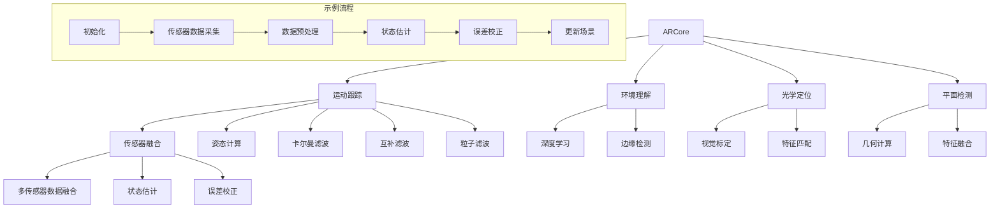

                 

### 文章标题：ARCore 开发工具包：在 Android 上的 AR 应用

### 关键词：ARCore，Android，增强现实，开发工具包，运动跟踪，环境理解，光学定位，平面检测，NFC结合，传感器融合，VR结合，开发技巧与优化

### 摘要：
本文将深入探讨ARCore，Google推出的开发工具包，旨在帮助Android开发者实现增强现实（AR）应用。我们将从ARCore的概述和基础组件开始，逐步引导读者了解其核心功能和应用场景。接着，文章将详细介绍如何搭建ARCore开发环境，创建一个AR应用，并重点解释运动跟踪、环境理解、光学定位和平面检测的原理和实现方法。最后，我们将探讨ARCore与NFC、传感器融合和虚拟现实（VR）的结合，并提供一系列开发技巧与优化策略。通过本文的阅读，读者将能够全面掌握ARCore开发工具包，并具备实际应用能力。

### 《ARCore 开发工具包：在 Android 上的 AR 应用》目录大纲

#### 第一部分：ARCore概述与基础

1. **第1章：ARCore简介**
   - **1.1 ARCore的概念与优势**
   - **1.2 ARCore的发展历程**
   - **1.3 ARCore的应用场景**

2. **第2章：ARCore核心组件**
   - **2.1 ARCore基础架构**
   - **2.2 运动跟踪**
   - **2.3 环境理解**
   - **2.4 光学定位**
   - **2.5 平面检测**

#### 第二部分：ARCore基本功能开发

3. **第3章：ARCore环境搭建与配置**
   - **3.1 开发环境搭建**
   - **3.2 Android Studio配置**
   - **3.3 Gradle配置**

4. **第4章：创建ARCore应用**
   - **4.1 应用架构**
   - **4.2 配置ARCore**
   - **4.3 初始化ARCore**

5. **第5章：运动跟踪**
   - **5.1 运动跟踪原理**
   - **5.2 运动跟踪算法**
   - **5.3 实现运动跟踪**

6. **第6章：环境理解**
   - **6.1 环境理解原理**
   - **6.2 环境理解算法**
   - **6.3 实现环境理解**

7. **第7章：光学定位**
   - **7.1 光学定位原理**
   - **7.2 光学定位算法**
   - **7.3 实现光学定位**

8. **第8章：平面检测**
   - **8.1 平面检测原理**
   - **8.2 平面检测算法**
   - **8.3 实现平面检测**

#### 第三部分：ARCore高级功能应用

9. **第9章：ARCore与NFC结合**
   - **9.1 NFC简介**
   - **9.2 ARCore与NFC结合原理**
   - **9.3 实现NFC增强现实**

10. **第10章：ARCore与传感器融合**
    - **10.1 传感器融合原理**
    - **10.2 传感器融合算法**
    - **10.3 实现传感器融合**

11. **第11章：ARCore与虚拟现实（VR）结合**
    - **11.1 VR简介**
    - **11.2 ARCore与VR结合原理**
    - **11.3 实现VR增强现实**

12. **第12章：ARCore开发技巧与优化**
    - **12.1 性能优化**
    - **12.2 资源管理**
    - **12.3 异常处理与调试**

#### 附录

1. **附录A：ARCore API详解**
   - **A.1 ARCore基本API**
   - **A.2 运动跟踪API**
   - **A.3 环境理解API**
   - **A.4 光学定位API**
   - **A.5 平面检测API**

2. **附录B：ARCore示例代码与解读**
   - **B.1 示例一：运动跟踪实现**
   - **B.2 示例二：环境理解实现**
   - **B.3 示例三：光学定位实现**
   - **B.4 示例四：平面检测实现**

3. **附录C：常见问题与解决方案**
   - **C.1 开发环境常见问题**
   - **C.2 运动跟踪问题**
   - **C.3 环境理解问题**
   - **C.4 光学定位问题**
   - **C.5 平面检测问题**

4. **附录D：资源与参考文献**
   - **D.1 资源链接**
   - **D.2 参考书籍**
   - **D.3 论文与报告**
   - **D.4 视频教程**
   - **D.5 在线论坛与社区**

#### 附加内容：核心概念与联系 Mermaid 流程图
- **ARCore核心组件与功能**

### 第一部分：ARCore概述与基础

### 第1章：ARCore简介

#### 1.1 ARCore的概念与优势

增强现实（AR）是一种将虚拟对象叠加到现实世界中的技术，通过这种技术，用户可以直观地与数字内容进行交互。而ARCore是Google推出的一套开发工具包，旨在帮助Android开发者构建高质量、沉浸式的AR应用。ARCore通过利用智能手机的传感器和相机，实现精确的运动跟踪、环境理解和光学定位等功能。

ARCore的优势在于：

1. **广泛的设备支持**：ARCore支持大部分Android设备，包括从旗舰手机到入门级设备，这意味着开发者可以针对不同设备进行优化，从而实现更好的用户体验。

2. **低延迟和高精度**：通过精确的运动跟踪和环境理解，ARCore能够实现实时交互，确保虚拟对象与现实世界的贴合度。

3. **易于集成和开发**：ARCore提供了一个统一的开发平台，开发者可以使用熟悉的Android开发工具和API来构建AR应用，降低了开发难度。

4. **开源社区**：ARCore是一个开源项目，拥有庞大的开发者社区，这意味着开发者可以轻松获取资源和帮助，不断优化和改进自己的应用。

#### 1.2 ARCore的发展历程

ARCore的开发始于2017年，当时Google首次发布了ARCore 1.0版本。从那时起，ARCore经历了多个版本的迭代和升级，功能不断丰富，性能持续提升。以下是ARCore主要版本的发布时间线：

- **2017年**：ARCore 1.0发布，主要功能包括运动跟踪、环境理解和光学定位。
- **2018年**：ARCore 1.1发布，增加了平面检测功能，并改善了API性能。
- **2019年**：ARCore 1.3发布，引入了高级光学定位算法，提升了低光环境下的性能。
- **2020年**：ARCore 1.4发布，增加了与NFC的集成，支持更多传感器，并优化了平面检测算法。
- **2021年**：ARCore 1.5发布，增加了与虚拟现实（VR）的集成，支持更多高级功能。

#### 1.3 ARCore的应用场景

ARCore的应用场景非常广泛，以下是一些典型的应用：

1. **教育**：通过ARCore，学生可以更直观地学习复杂的科学概念，如生物学、化学和物理学。

2. **医疗**：医生可以使用ARCore进行手术模拟和指导，提高手术的准确性和效率。

3. **零售**：零售商可以使用ARCore提供虚拟试衣间和产品展示，增强用户体验。

4. **娱乐**：ARCore可以用于游戏开发，为玩家提供沉浸式的游戏体验。

5. **建筑和设计**：建筑师和设计师可以使用ARCore来展示三维模型，更好地理解项目。

6. **工业**：ARCore可以用于工业维护和维修，提供实时的操作指导和故障诊断。

#### 1.4 本章总结

通过本章的介绍，我们对ARCore有了基本的了解，包括其概念、优势、发展历程和应用场景。在下一章中，我们将进一步探讨ARCore的核心组件，帮助读者深入理解其工作原理和功能。

### 第2章：ARCore核心组件

#### 2.1 ARCore基础架构

ARCore的基础架构主要包括三个核心组件：运动跟踪、环境理解和光学定位。这些组件协同工作，为开发者提供了强大的AR功能。

1. **运动跟踪**：运动跟踪是ARCore的核心功能之一，它通过使用智能手机的传感器和相机来跟踪用户的位置和运动。通过精确的运动跟踪，用户可以在AR场景中实时移动和旋转，并与虚拟对象进行交互。

2. **环境理解**：环境理解用于识别和理解现实世界中的环境特征。ARCore通过图像处理和计算机视觉技术，可以识别平面、边缘、纹理和结构，从而为虚拟对象的放置和交互提供依据。

3. **光学定位**：光学定位是一种基于相机视觉的技术，它通过分析相机捕获的图像来确定用户的位置和方向。光学定位具有高精度、低延迟的特点，是ARCore实现高保真AR体验的关键。

#### 2.2 运动跟踪

运动跟踪的实现依赖于智能手机的多种传感器，包括加速度计、陀螺仪和GPS。以下是运动跟踪的基本原理：

1. **传感器融合**：ARCore将来自加速度计和陀螺仪的数据进行融合，以提供平滑和准确的运动跟踪。这种融合算法称为传感器融合滤波器，它通过加权传感器数据，结合历史信息，实时更新用户的位置和运动状态。

2. **运动模型**：ARCore使用运动模型来预测用户的移动。当用户移动时，传感器数据会实时更新，运动模型会根据这些数据预测用户的未来位置。这种预测对于保持AR体验的流畅性至关重要。

3. **实时校正**：为了提高运动跟踪的准确性，ARCore会使用相机视觉进行实时校正。当用户移动时，相机捕获的图像会被分析，与传感器数据进行比较，以检测和修正位置误差。

#### 2.3 环境理解

环境理解是ARCore的另一个关键组件，它主要用于识别和理解现实世界中的环境特征。以下是环境理解的基本原理：

1. **平面检测**：平面检测是环境理解的重要功能之一，它用于识别地面或其他平面。ARCore使用图像处理算法，分析相机捕获的图像，检测出可能的平面，并提供平面的法向量信息。

2. **边缘检测**：边缘检测用于识别图像中的边缘和结构。ARCore通过分析相机捕获的图像，提取边缘信息，这些信息对于确定虚拟对象的放置位置和姿态非常重要。

3. **纹理识别**：纹理识别是环境理解的另一个关键功能，它用于识别现实世界中的纹理和图案。ARCore使用图像处理算法，分析相机捕获的图像，提取纹理特征，从而实现与真实世界的交互。

#### 2.4 光学定位

光学定位是ARCore实现高精度AR体验的关键组件，它通过分析相机捕获的图像来确定用户的位置和方向。以下是光学定位的基本原理：

1. **视觉标定**：视觉标定是光学定位的基础，它通过将相机坐标系映射到世界坐标系，确保相机捕获的图像与真实世界之间的一致性。ARCore使用一组已知位置的视觉标记，通过图像处理算法进行标定。

2. **特征匹配**：特征匹配是光学定位的核心步骤，它通过比较相机捕获的图像和预定义的图像特征，来确定相机在世界坐标系中的位置和方向。ARCore使用高效的特征匹配算法，快速且准确地完成这一过程。

3. **实时校正**：光学定位需要实时校正，以保持高精度。ARCore通过不断分析相机捕获的图像，并与预定义的图像特征进行匹配，实时更新用户的位置和方向。

#### 2.5 平面检测

平面检测是环境理解的一部分，它用于识别现实世界中的平面。以下是平面检测的基本原理：

1. **图像预处理**：平面检测首先需要对图像进行预处理，包括灰度化、去噪和边缘检测。这些预处理步骤可以提高平面检测的准确性。

2. **特征提取**：接下来，图像处理算法会提取图像中的特征点，这些特征点通常具有明显的边缘和纹理。ARCore使用高效的算法来提取这些特征点。

3. **平面拟合**：最后，基于提取的特征点，ARCore使用平面拟合算法来确定平面的方程。平面的法向量信息对于放置虚拟对象非常重要。

#### 2.6 本章总结

通过本章的介绍，我们对ARCore的核心组件有了更深入的理解，包括运动跟踪、环境理解、光学定位和平面检测。这些组件协同工作，为开发者提供了强大的AR功能。在下一章中，我们将开始介绍如何搭建ARCore开发环境，为后续的AR应用开发做准备。

### 第3章：ARCore环境搭建与配置

#### 3.1 开发环境搭建

要开始使用ARCore进行Android AR应用开发，首先需要搭建合适的开发环境。以下是搭建ARCore开发环境的步骤：

1. **安装Android Studio**：
   - 访问[Android Studio官网](https://developer.android.com/studio)下载最新版本的Android Studio。
   - 运行安装程序，并根据提示完成安装。

2. **配置Android SDK**：
   - 打开Android Studio，选择“Configure” -> “AVD Manager”来配置Android模拟器。
   - 选择“Create Virtual Device”并选择一个合适的Android版本和设备型号，点击“Next”。
   - 在接下来的界面中，选择“Android API 28”及以上版本，然后点击“Next”。
   - 为虚拟设备命名并选择存储位置，点击“Finish”创建虚拟设备。

3. **安装ARCore SDK**：
   - 打开Android Studio，选择“File” -> “New Project”创建一个新的Android项目。
   - 在“Create a new project”界面中，选择一个合适的模板，例如“Empty Activity”。
   - 在“Configure your project”界面中，为项目命名并选择存储位置，点击“Finish”创建项目。

4. **添加ARCore依赖**：
   - 在项目的`build.gradle`文件中，添加以下依赖：
     ```groovy
     implementation 'com.google.ar:arcore-client:1.23.0'
     ```
   - 确保`build.gradle`文件的`topLevel`目录是项目的根目录。

5. **安装模拟器**：
   - 在Android Studio中，选择“AVD Manager”来查看和启动已安装的模拟器。
   - 如果需要，可以点击“Create Virtual Device”来创建新的模拟器。

#### 3.2 Android Studio配置

在搭建好开发环境后，需要对Android Studio进行一些基本配置，以确保能够顺利开发和调试ARCore应用：

1. **启用开发者选项**：
   - 在Android设备上，进入“设置” -> “关于手机”。
   - 连续点击“版本号”多次，直到出现“您已是一名开发者”的提示。
   - 返回“设置”界面，找到“开发者选项”，并启用“USB调试”和“模拟位置信息”。

2. **配置模拟器**：
   - 在Android Studio的“AVD Manager”中，选择已安装的模拟器。
   - 在“Configured”选项卡中，确保“USB debugging”被勾选。
   - 可以在“ADT”选项卡中配置模拟器的其他设置，如屏幕分辨率和位置信息。

3. **设置调试权限**：
   - 在Android设备上，允许Android Studio进行USB调试。
   - 在模拟器中，选择“工具” -> “模拟位置”，以便在调试过程中模拟不同的地理位置。

#### 3.3 Gradle配置

为了确保ARCore依赖能够正确安装和加载，需要在项目的`build.gradle`文件中进行一些额外的配置：

1. **配置仓库**：
   - 在项目的`build.gradle`文件中，添加以下仓库地址，以便从Google的仓库中下载ARCore依赖：
     ```groovy
     repositories {
         maven { url 'https://maven.google.com/' }
     }
     ```

2. **配置依赖**：
   - 在项目的`build.gradle`文件中，确保ARCore依赖已经添加：
     ```groovy
     implementation 'com.google.ar:arcore-client:1.23.0'
     ```

3. **同步依赖**：
   - 在Android Studio中，点击“Sync Project with Gradle Files”按钮，确保所有依赖都被正确下载和配置。

通过以上步骤，你将成功搭建ARCore开发环境，并准备好开始开发ARCore应用。在下一章中，我们将开始介绍如何创建一个ARCore应用。

#### 3.4 开发环境搭建的实际案例与代码解读

为了更好地理解ARCore开发环境的搭建过程，以下是一个实际案例，包括开发环境搭建的详细步骤和代码解读。

**案例：创建一个简单的ARCore应用**

**1. 创建Android Studio项目**

首先，在Android Studio中创建一个名为`ARCoreDemo`的新项目，选择一个空的Activity模板。

**2. 配置Android SDK**

打开Android Studio，选择“Configure” -> “AVD Manager”。点击“Create Virtual Device”创建一个虚拟设备，选择“Nexus 5X”作为设备型号，并选择API 29（Android 10）作为SDK版本。

**3. 安装ARCore SDK**

在Android Studio中，打开新建的`ARCoreDemo`项目，在`build.gradle`文件中添加ARCore依赖：

```groovy
dependencies {
    implementation 'com.google.ar:arcore-client:1.23.0'
}
```

然后，点击“Sync Project with Gradle Files”按钮，确保依赖被正确下载和配置。

**4. 运行应用**

在Android Studio中，运行应用，选择已配置的虚拟设备。在虚拟设备中，你应该能够看到ARCore相机预览界面，这表示开发环境已经搭建成功。

**代码解读**：

**（1）添加ARCore依赖**

在`build.gradle`文件中添加ARCore依赖是实现ARCore功能的关键步骤。通过添加以下代码，你将能够使用ARCore提供的API进行AR应用开发：

```groovy
implementation 'com.google.ar:arcore-client:1.23.0'
```

**（2）配置Android SDK**

配置Android SDK是确保应用能够在模拟器中成功运行的基础。通过选择合适的虚拟设备（如Nexus 5X）和SDK版本（如API 29），你可以在模拟器中测试ARCore应用。

**（3）同步依赖**

点击“Sync Project with Gradle Files”按钮，是确保依赖被正确下载和配置的重要步骤。这一操作将下载ARCore SDK和相关的库文件，并为你的项目配置所需的依赖。

通过以上步骤，你将能够成功搭建ARCore开发环境，为后续的AR应用开发做好准备。在下一章中，我们将详细介绍如何创建ARCore应用。

### 第4章：创建ARCore应用

#### 4.1 应用架构

要创建一个ARCore应用，我们需要理解其基本的架构和组件。一个典型的ARCore应用包括以下几个关键部分：

1. **Activity**：Activity是Android应用的基本组件，用于实现用户界面和交互逻辑。在ARCore应用中，Activity负责管理与ARCore的交互，包括初始化ARCore、渲染AR内容以及处理用户输入。

2. **ARCoreSession**：ARCoreSession是ARCore应用的核心组件，它负责与ARCore SDK进行通信。通过ARCoreSession，应用可以获取相机帧数据、执行运动跟踪和环境理解操作，并渲染AR内容。

3. **Renderer**：Renderer负责将AR内容渲染到屏幕上。在ARCore应用中，通常使用OpenGL ES或Vulkan作为渲染引擎。Renderer根据ARCoreSession提供的相机帧数据和场景信息，生成最终的渲染结果。

4. **Scene**：Scene表示AR场景，包含所有的AR对象（如平面、3D模型和纹理）。Scene通过ARCore的API进行管理，包括对象的创建、更新和销毁。

5. **Tracking**：Tracking组件负责运动跟踪和环境理解，包括相机姿态的跟踪、平面检测和环境特征识别。这些操作通过ARCore的API实现，确保虚拟对象与现实世界的精确贴合。

6. **Input**：Input组件处理用户的输入，如触摸和手势。这些输入通过ARCore的API转换为虚拟操作，如对象的拖动、旋转和缩放。

#### 4.2 配置ARCore

在创建ARCore应用时，配置ARCore是至关重要的步骤。以下是如何在Android项目中配置ARCore的详细步骤：

1. **添加依赖**：

   在项目的`build.gradle`文件中，添加ARCore SDK的依赖：

   ```groovy
   dependencies {
       implementation 'com.google.ar:arcore-client:1.23.0'
   }
   ```

   确保`build.gradle`文件的`topLevel`目录是项目的根目录。

2. **配置权限**：

   在应用的`AndroidManifest.xml`文件中，添加以下权限，以确保应用可以访问相机和传感器：

   ```xml
   <uses-permission android:name="android.permission.CAMERA" />
   <uses-permission android:name="android.permission.FINE_LOCATION" />
   <uses-permission android:name="android.permission.INTERNET" />
   <uses-feature android:name="android.hardware.camera" android:required="true" />
   <uses-feature android:name="android.hardware.camera.autofocus" android:required="false" />
   ```

3. **配置Activity**：

   在Activity的布局文件（如`activity_main.xml`）中，添加ARCore预览视图（`ArFragment`）：

   ```xml
   <fragment
       android:id="@+id/arkit_view"
       android:name="com.google.ar.core.ArFragment"
       android:layout_width="match_parent"
       android:layout_height="match_parent" />
   ```

4. **初始化ARCore**：

   在Activity的`onCreate`方法中，初始化ARCoreSession：

   ```java
   @Override
   protected void onCreate(Bundle savedInstanceState) {
       super.onCreate(savedInstanceState);
       setContentView(R.layout.activity_main);
       
       // 初始化ARCoreSession
       ArFragment arFragment = (ArFragment) getSupportFragmentManager().findFragmentById(R.id.arkit_view);
       arFragment.getArSceneView().getScene().addOnUpdateListener(this);
   }
   ```

   其中，`this` 指代Activity本身，实现了`ArSceneView.UpdateListener`接口。

5. **设置Renderer**：

   创建一个自定义Renderer类，实现AR内容的渲染逻辑：

   ```java
   public class MyRenderer implements ArSceneView.UpdateListener {
       @Override
       public void onUpdate(float delta, ArSceneView arSceneView) {
           // 更新AR内容
       }
   }
   ```

   然后在Activity中设置自定义Renderer：

   ```java
   ArFragment arFragment = (ArFragment) getSupportFragmentManager().findFragmentById(R.id.arkit_view);
   arFragment.getArSceneView().setRenderer(new MyRenderer());
   ```

通过以上步骤，你将成功配置ARCore应用的基本架构和组件。接下来，我们将详细介绍如何初始化ARCoreSession，以及相关的实现方法和细节。

#### 4.3 初始化ARCore

初始化ARCore是创建AR应用的第一步，它涉及到设置ARCoreSession以及相关的初始化参数。以下是详细的步骤和代码示例：

1. **设置ARCoreSession**

   在Android活动中，首先需要设置ARCoreSession。ARCoreSession负责与ARCore SDK进行通信，包括运动跟踪、环境理解和渲染等操作。在`onCreate`方法中，可以通过以下代码设置ARCoreSession：

   ```java
   @Override
   protected void onCreate(Bundle savedInstanceState) {
       super.onCreate(savedInstanceState);
       setContentView(R.layout.activity_main);

       // 获取ArFragment
       ArFragment arFragment = (ArFragment) getSupportFragmentManager().findFragmentById(R.id.arkit_view);

       // 设置ARCoreSession
       arFragment.getArSceneView().getSession().addOnSessionEventListener(this);
   }
   ```

   在这里，`ArFragment`是ARCore提供的预览视图组件，通过调用`getSession()`方法获取ARCoreSession，并设置`addOnSessionEventListener()`监听器来处理会话事件。

2. **设置会话监听器**

   为了处理ARCore会话的各种事件，例如会话开始、结束和错误，需要实现`Session.EventListener`接口。以下是会话监听器的实现：

   ```java
   private final Session.EventListener sessionEventListener = new Session.EventListener() {
       @Override
       public void onSessionStarted(Session session, SessionSource source) {
           // 会话开始时的操作，如初始化渲染器
           SessionConfiguration sessionConfiguration = new SessionConfiguration();
           sessionConfiguration.setLightEstimationMode(LightEstimationMode.Auto);
           session.setConfiguration(sessionConfiguration);
       }

       @Override
       public void onSessionEnded(Session session, SessionEndResult result) {
           // 会话结束时的操作，如清理资源
           // 注意：在此处应避免执行任何可能抛出异常的操作
       }

       @Override
       public void onSessionInterrupted(Session session) {
           // 会话中断时的操作，如保存状态
       }

       @Override
       public void onSessionDeviceFailure(Session session, Session.DeviceFailure failure) {
           // 设备故障时的操作，如显示错误信息
       }
   };
   ```

   在`onSessionStarted`方法中，可以设置会话的配置，例如启用光线估计模式。`onSessionEnded`方法用于清理资源，确保不会抛出异常。`onSessionInterrupted`和`onSessionDeviceFailure`方法分别用于处理会话中断和设备故障。

3. **处理会话事件**

   为了处理ARCore会话的各种事件，需要在Activity中实现`Session.EventListener`接口。以下是处理会话事件的示例代码：

   ```java
   @Override
   public void onSessionEvent(Session session, Session.Event event) {
       switch (event) {
           case SESSION_STARTED:
               // 会话开始，初始化渲染器
               break;
           case SESSION_ENDED:
               // 会话结束，清理资源
               break;
           case SESSION_INTERRUPTED:
               // 会话中断，保存状态
               break;
           case SESSION_DEVICE_FAILURE:
               // 设备故障，显示错误信息
               break;
       }
   }
   ```

   在`onSessionEvent`方法中，根据不同的事件类型执行相应的操作。例如，当会话开始时，可以初始化渲染器，当会话结束时，可以清理资源。

4. **示例代码解读**

   下面是一个简单的示例代码，展示了如何初始化ARCoreSession：

   ```java
   @Override
   protected void onCreate(Bundle savedInstanceState) {
       super.onCreate(savedInstanceState);
       setContentView(R.layout.activity_main);

       // 获取ArFragment
       ArFragment arFragment = (ArFragment) getSupportFragmentManager().findFragmentById(R.id.arkit_view);

       // 设置ARCoreSession
       arFragment.getArSceneView().getSession().addOnSessionEventListener(sessionEventListener);

       // 设置渲染器
       arFragment.getArSceneView().setRenderer(new MyRenderer());
   }
   ```

   在这段代码中，首先获取`ArFragment`，然后设置ARCoreSession的监听器，并设置自定义的渲染器。通过这些步骤，我们可以确保ARCore会话的初始化和事件处理。

通过以上步骤，你将能够成功初始化ARCoreSession，并准备好进行AR内容的渲染和交互。在下一章中，我们将详细介绍运动跟踪的原理和实现方法。

### 第5章：运动跟踪

#### 5.1 运动跟踪原理

运动跟踪是增强现实（AR）应用的核心功能之一，它通过使用智能手机的传感器和相机来实时跟踪用户的位置和运动。运动跟踪的原理可以分为以下几个步骤：

1. **传感器数据采集**：智能手机内置多种传感器，如加速度计、陀螺仪和磁力计。这些传感器可以测量设备的加速度、角速度和磁场。运动跟踪首先采集这些传感器的数据。

2. **传感器融合**：由于每个传感器的测量数据可能存在误差，运动跟踪通常使用传感器融合算法来综合处理多个传感器的数据。传感器融合算法通过加权传感器数据和历史信息，实时更新用户的位置和运动状态。

3. **姿态计算**：传感器融合后的数据用于计算设备的姿态，即设备在三维空间中的旋转和位置。姿态计算可以通过姿态矩阵（旋转矩阵）或四元数（quaternion）表示。

4. **位置预测**：根据当前姿态和历史运动数据，运动跟踪算法会预测设备的未来位置。这种预测对于保持AR体验的流畅性至关重要。

5. **校正与优化**：为了提高运动跟踪的准确性，运动跟踪算法会使用相机视觉进行实时校正。当设备移动时，相机捕获的图像会与传感器数据相结合，以检测和修正位置误差。

6. **渲染更新**：最终，运动跟踪的结果用于更新AR场景的渲染。通过实时跟踪用户的位置和运动，虚拟对象可以准确地放置和移动，实现与现实世界的无缝交互。

#### 5.2 运动跟踪算法

运动跟踪算法的核心在于传感器融合和姿态计算。以下是一些常用的运动跟踪算法：

1. **卡尔曼滤波器（Kalman Filter）**：

   卡尔曼滤波器是一种有效的传感器融合算法，它通过预测和更新步骤，结合传感器数据和先验知识，实时估计系统的状态。在运动跟踪中，卡尔曼滤波器可以用来融合加速度计、陀螺仪和磁力计的数据。

   ```python
   # 伪代码：卡尔曼滤波器预测和更新步骤
   def predict(x, u, Q, R):
       x_pred = f(x, u)
       P_pred = F * P * F' + Q

   def update(x_pred, z, P_pred, H, R):
       K = P_pred * H' * inv(H * P_pred * H' + R)
       x = x_pred + K * (z - H * x_pred)
       P = (I - K * H) * P_pred

   x = x_pred
   P = P_pred
   ```

   在这段伪代码中，`x`和`P`分别表示系统的状态和状态协方差矩阵，`u`和`z`分别表示控制输入和测量值，`Q`和`R`分别表示过程噪声和测量噪声协方差矩阵。

2. **互补滤波器（Complementary Filter）**：

   互补滤波器是一种简单的传感器融合算法，它通过结合加速度计和陀螺仪的数据来计算姿态。互补滤波器的主要思想是利用加速度计提供的位置信息来校正陀螺仪的漂移。

   ```python
   # 伪代码：互补滤波器
   def update_acceleration(acceleration, dt):
       acceleration_filtered = lpf(acceleration, dt)

   def update_gyroscope(gyroscope, dt):
       gyroscope_filtered = bpf(gyroscope, dt)

   def integrate_acceleration(acceleration_filtered, dt):
       velocity = integrate(acceleration_filtered, dt)
       position = integrate(velocity, dt)

   def integrate_gyroscope(gyroscope_filtered, dt):
       orientation = integrate(gyroscope_filtered, dt)

   acceleration_filtered = update_acceleration(acceleration, dt)
   gyroscope_filtered = update_gyroscope(gyroscope, dt)
   velocity = integrate_acceleration(acceleration_filtered, dt)
   position = integrate(velocity, dt)
   orientation = integrate_gyroscope(gyroscope_filtered, dt)
   ```

   在这段伪代码中，`lpf`和`bpf`分别表示低通滤波器和带通滤波器，用于去除高频噪声和低频噪声，`integrate`函数用于积分运算。

3. **粒子滤波器（Particle Filter）**：

   粒子滤波器是一种用于非线性和非高斯系统的状态估计算法。在运动跟踪中，粒子滤波器可以用于处理传感器数据的不确定性和动态环境。

   ```python
   # 伪代码：粒子滤波器
   def initialization_particles(x, P, N):
       particles = generate_particles(x, P, N)

   def prediction(particles, u, Q):
       particles = predict(particles, u, Q)

   def update_particles(particles, z, W, R):
       particles = resample(particles, W, R)

   def estimate(particles):
       return estimate_state(particles)

   particles = initialization_particles(x, P, N)
   particles = prediction(particles, u, Q)
   particles = update_particles(particles, z, W, R)
   x_estimated = estimate(particles)
   ```

   在这段伪代码中，`generate_particles`和`resample`函数用于生成和重采样粒子，`estimate_state`函数用于估计系统的状态。

#### 5.3 实现运动跟踪

在ARCore中，运动跟踪是通过`Session`和`TrackingState`类实现的。以下是如何在ARCore中实现运动跟踪的步骤：

1. **初始化ARCoreSession**：

   首先，在Activity的`onCreate`方法中初始化ARCoreSession：

   ```java
   @Override
   protected void onCreate(Bundle savedInstanceState) {
       super.onCreate(savedInstanceState);
       setContentView(R.layout.activity_main);

       ArFragment arFragment = (ArFragment) getSupportFragmentManager().findFragmentById(R.id.arkit_view);
       arFragment.getArSceneView().getSession().addOnSessionEventListener(this);
   }
   ```

   在这里，`this` 指代Activity本身，实现了`Session.EventListener`接口。

2. **实现会话监听器**：

   接下来，实现会话监听器以处理会话事件：

   ```java
   private final Session.EventListener sessionEventListener = new Session.EventListener() {
       @Override
       public void onSessionStarted(Session session, SessionSource source) {
           SessionConfiguration sessionConfiguration = new SessionConfiguration();
           sessionConfiguration.setLightEstimationMode(LightEstimationMode.Auto);
           session.setConfiguration(sessionConfiguration);
       }

       @Override
       public void onSessionEnded(Session session, SessionEndResult result) {
           // 清理资源
       }

       @Override
       public void onSessionInterrupted(Session session) {
           // 保存状态
       }

       @Override
       public void onSessionDeviceFailure(Session session, Session.DeviceFailure failure) {
           // 显示错误信息
       }
   };
   ```

3. **处理会话更新**：

   在Activity中实现`ArSceneView.UpdateListener`接口，以处理会话的更新：

   ```java
   @Override
   public void onUpdate(float delta, ArSceneView arSceneView) {
       Session session = arSceneView.getSession();
       TrackingState trackingState = session.getTrackingState();

       if (trackingState.getTrackingMode() == TrackingState.TrackingMode tracking) {
           // 更新用户位置和姿态
       }
   }
   ```

   在`onUpdate`方法中，可以通过`trackingState`获取用户的位置和姿态信息，这些信息用于更新AR场景。

4. **渲染AR内容**：

   创建一个自定义的Renderer类，实现AR内容的渲染：

   ```java
   public class MyRenderer implements ArSceneView.Renderer {
       @Override
       public void onDrawFrame(ArSceneView arSceneView) {
           Session session = arSceneView.getSession();
           TrackingState trackingState = session.getTrackingState();

           if (trackingState.getTrackingMode() == TrackingState.TrackingModetracking) {
               // 绘制AR内容
           }
       }
   }
   ```

   在`onDrawFrame`方法中，可以通过`trackingState`获取用户的位置和姿态信息，并绘制AR内容。

通过以上步骤，你将能够在ARCore中实现运动跟踪功能，为AR应用提供实时、准确的位置和姿态信息。在下一章中，我们将介绍环境理解的原理和实现方法。

### 第6章：环境理解

#### 6.1 环境理解原理

环境理解是增强现实（AR）技术中的一个关键组成部分，它用于识别和理解现实世界中的环境特征。环境理解的基本原理包括图像处理、计算机视觉和深度学习等技术，以下是其详细描述：

1. **图像处理**：

   图像处理是环境理解的基础，它涉及对相机捕获的图像进行预处理，以提取有用的信息。预处理步骤包括灰度化、去噪、边缘检测和平面检测等。

2. **边缘检测**：

   边缘检测是一种图像处理技术，用于识别图像中的边缘。通过边缘检测，可以更好地理解图像的结构和形状，为后续的环境理解提供基础。

3. **平面检测**：

   平面检测是环境理解的重要功能，它用于识别现实世界中的平面，如地面、墙壁和桌面等。平面检测算法通常使用图像处理和几何计算，通过识别图像中的共面点来确定平面的位置和法向量。

4. **纹理识别**：

   纹理识别是环境理解的另一个关键功能，它用于识别现实世界中的纹理和图案。通过纹理识别，可以更准确地理解环境，并在AR场景中添加相应的纹理。

5. **深度学习**：

   深度学习是环境理解中的高级技术，它通过训练神经网络模型来自动识别和理解环境特征。深度学习模型可以识别复杂的结构、纹理和场景，提高环境理解的准确性和效率。

6. **数据融合**：

   环境理解通常需要将多种数据源进行融合，如相机图像、传感器数据和深度传感器的数据。数据融合算法可以综合处理多种数据源，提高环境理解的可靠性和精度。

#### 6.2 环境理解算法

环境理解算法是ARCore实现环境识别和理解的核心，以下是一些常用的环境理解算法：

1. **Hough变换**：

   Hough变换是一种用于检测图像中直线的算法。在平面检测中，Hough变换可以用来识别图像中的直线，从而确定平面的位置和法向量。

   ```python
   # 伪代码：Hough变换
   def hough_transform(image):
       # 计算图像中的边缘点
       edges = edge_detection(image)

       # 创建Hough变换表
       table = create_hough_table(edges)

       # 找到峰值，识别直线
       lines = find_peaks(table)

       return lines
   ```

   在这段伪代码中，`edge_detection`函数用于检测图像边缘，`create_hough_table`函数用于创建Hough变换表，`find_peaks`函数用于识别直线。

2. **RANSAC算法**：

   RANSAC（随机采样一致性）是一种用于识别图像中的模型（如直线、平面等）的算法。RANSAC通过多次随机采样和模型估计，提高识别的准确性和鲁棒性。

   ```python
   # 伪代码：RANSAC算法
   def ransac(data, model, num_iterations, threshold):
       best_model = None
       best_inliers = 0

       for _ in range(num_iterations):
           # 随机采样
           sample = random_sample(data, k)

           # 估计模型
           model Estimated = model(sample)

           # 计算模型误差
           errors = calculate_error(data, Estimated)

           # 计算内点数
           inliers = count_inliers(errors, threshold)

           if inliers > best_inliers:
               best_inliers = inliers
               best_model = Estimated

       return best_model
   ```

   在这段伪代码中，`random_sample`函数用于随机采样，`model`函数用于模型估计，`calculate_error`函数用于计算模型误差，`count_inliers`函数用于计算内点数。

3. **深度学习**：

   深度学习模型，如卷积神经网络（CNN），可以用于环境理解的任务，如平面检测和纹理识别。通过训练深度学习模型，可以自动识别和理解复杂的场景特征。

   ```python
   # 伪代码：深度学习模型
   def train_model(train_data, train_labels):
       # 构建深度学习模型
       model = build_model()

       # 训练模型
       model.fit(train_data, train_labels, epochs=100, batch_size=32)

       return model
   ```

   在这段伪代码中，`build_model`函数用于构建深度学习模型，`fit`函数用于训练模型。

#### 6.3 实现环境理解

在ARCore中，环境理解通过一系列API和算法实现，以下是如何在ARCore中实现环境理解的步骤：

1. **初始化ARCoreSession**：

   首先，在Activity的`onCreate`方法中初始化ARCoreSession：

   ```java
   @Override
   protected void onCreate(Bundle savedInstanceState) {
       super.onCreate(savedInstanceState);
       setContentView(R.layout.activity_main);

       ArFragment arFragment = (ArFragment) getSupportFragmentManager().findFragmentById(R.id.arkit_view);
       arFragment.getArSceneView().getSession().addOnSessionEventListener(this);
   }
   ```

   在这里，`this` 指代Activity本身，实现了`Session.EventListener`接口。

2. **实现会话监听器**：

   接下来，实现会话监听器以处理会话事件：

   ```java
   private final Session.EventListener sessionEventListener = new Session.EventListener() {
       @Override
       public void onSessionStarted(Session session, SessionSource source) {
           SessionConfiguration sessionConfiguration = new SessionConfiguration();
           sessionConfiguration.setLightEstimationMode(LightEstimationMode.Auto);
           session.setConfiguration(sessionConfiguration);
       }

       @Override
       public void onSessionEnded(Session session, SessionEndResult result) {
           // 清理资源
       }

       @Override
       public void onSessionInterrupted(Session session) {
           // 保存状态
       }

       @Override
       public void onSessionDeviceFailure(Session session, Session.DeviceFailure failure) {
           // 显示错误信息
       }
   };
   ```

3. **处理会话更新**：

   在Activity中实现`ArSceneView.UpdateListener`接口，以处理会话的更新：

   ```java
   @Override
   public void onUpdate(float delta, ArSceneView arSceneView) {
       Session session = arSceneView.getSession();
       TrackingState trackingState = session.getTrackingState();

       if (trackingState.getTrackingMode() == TrackingState.TrackingModetracking) {
           // 更新用户位置和姿态
       }
   }
   ```

   在`onUpdate`方法中，可以通过`trackingState`获取用户的位置和姿态信息，并更新AR场景。

4. **实现平面检测**：

   创建一个平面检测器，使用Hough变换和RANSAC算法来识别平面：

   ```java
   public class PlaneDetector {
       public void detectPlanes(List<PointCloud> pointClouds) {
           for (PointCloud pointCloud : pointClouds) {
               List<Point> points = pointCloud.getPoints();
               List<Line> lines = houghTransform(points);
               List<Point> inliers = ransac(lines, PlaneModel, numIterations, threshold);
               if (inliers.size() >= minInliers) {
                   Plane plane = new Plane(inliers);
                   // 更新AR场景中的平面
               }
           }
       }
   }
   ```

   在这段代码中，`houghTransform`函数使用Hough变换检测直线，`ransac`函数使用RANSAC算法识别平面，`PlaneModel`函数用于估计平面模型。

5. **实现纹理识别**：

   使用深度学习模型进行纹理识别，通过训练模型来自动识别纹理：

   ```java
   public class TextureRecognizer {
       private final Model model;

       public TextureRecognizer() {
           model = trainModel();
       }

       public String recognizeTexture(Bitmap image) {
           Bitmap processedImage = preprocessImage(image);
           float[][] input = preprocessInput(processedImage);
           float[][] output = model.predict(input);
           String texture = decodeOutput(output);
           return texture;
       }
   }
   ```

   在这段代码中，`trainModel`函数用于训练深度学习模型，`preprocessImage`函数用于预处理图像，`preprocessInput`函数用于预处理输入数据，`decodeOutput`函数用于解码输出结果。

通过以上步骤，你将能够在ARCore中实现环境理解功能，为AR应用提供丰富的场景信息和交互功能。在下一章中，我们将介绍光学定位的原理和实现方法。

### 第7章：光学定位

#### 7.1 光学定位原理

光学定位是增强现实（AR）技术中的一个关键组成部分，它通过分析相机捕获的图像来确定用户的位置和方向。光学定位的基本原理包括图像处理、特征匹配和姿态计算，以下是其详细描述：

1. **图像处理**：

   图像处理是光学定位的基础，它涉及对相机捕获的图像进行预处理，以提高图像质量，提取有用的特征。预处理步骤包括灰度化、去噪、边缘检测和图像增强等。

2. **特征匹配**：

   特征匹配是光学定位的核心步骤，它通过比较相机捕获的图像和预定义的图像特征，来确定相机在世界坐标系中的位置和方向。常用的特征匹配算法包括SIFT（尺度不变特征变换）和SURF（加速稳健特征）等。

3. **姿态计算**：

   姿态计算用于确定相机相对于固定参考点的位置和方向。通过特征匹配，可以得到一组匹配点对，这些点对可以用于计算相机的旋转矩阵和位移向量。常用的姿态计算方法包括PnP（透视投影矩阵）和直接线性变换（DLT）等。

4. **光流法**：

   光流法是一种基于连续图像帧的图像处理技术，用于跟踪图像中的特征点。通过计算连续帧之间特征点的位移，可以估计相机的运动。光流法适用于动态环境，具有较高的实时性。

5. **视觉标定**：

   视觉标定是光学定位的基础，它通过将相机坐标系映射到世界坐标系，确保相机捕获的图像与真实世界之间的一致性。视觉标定通常使用一组已知位置的视觉标记，通过图像处理算法进行标定。

6. **多视图几何**：

   多视图几何是一种利用多个相机视角来计算三维场景的方法。通过多个相机捕获的图像，可以使用多视图几何算法来确定三维场景的结构。常用的多视图几何算法包括三角测量和结构光投影等。

#### 7.2 光学定位算法

光学定位算法的核心在于特征匹配和姿态计算。以下是一些常用的光学定位算法：

1. **SIFT算法**：

   SIFT（尺度不变特征变换）是一种用于图像特征提取的算法。SIFT算法通过计算图像的梯度方向和幅度，提取出尺度不变的关键点，并计算关键点的描述子。SIFT算法具有良好的旋转、尺度和光照不变性，适用于光学定位。

   ```python
   # 伪代码：SIFT算法
   def sift(image):
       # 计算图像的梯度方向和幅度
       gradient = calculate_gradient(image)

       # 提取关键点
       keypoints = extract_keypoints(gradient)

       # 计算关键点的描述子
       descriptors = calculate_descriptors(keypoints, gradient)

       return keypoints, descriptors
   ```

2. **BRISK算法**：

   BRISK（快速稳健特征）是一种基于快速特征检测的算法。BRISK算法通过计算图像的梯度方向和幅度，提取出快速响应的特征点，并计算特征点的描述子。BRISK算法具有较高的检测速度和鲁棒性，适用于光学定位。

   ```python
   # 伪代码：BRISK算法
   def brisk(image):
       # 计算图像的梯度方向和幅度
       gradient = calculate_gradient(image)

       # 提取关键点
       keypoints = extract_keypoints(gradient)

       # 计算关键点的描述子
       descriptors = calculate_descriptors(keypoints, gradient)

       return keypoints, descriptors
   ```

3. **特征匹配算法**：

   特征匹配算法用于将相机捕获的图像与预定义的图像特征进行匹配，以确定相机在世界坐标系中的位置和方向。常用的特征匹配算法包括FLANN（快速最近邻搜索）和Brute-Force（暴力匹配）等。

   ```python
   # 伪代码：特征匹配算法
   def match_descriptors(descriptors1, descriptors2):
       # 计算描述子的相似度
       similarity = calculate_similarity(descriptors1, descriptors2)

       # 匹配关键点对
       matches = match_keypoints(similarity)

       return matches
   ```

4. **姿态计算算法**：

   姿态计算算法用于计算相机相对于固定参考点的位置和方向。常用的姿态计算算法包括PnP（透视投影矩阵）和直接线性变换（DLT）等。

   ```python
   # 伪代码：PnP算法
   def pnp(points2D, points3D, camera_matrix, dist_coeffs):
       # 计算相机的旋转矩阵和位移向量
       rotation_vector, translation_vector = cv2.solvePnP(points3D, points2D, camera_matrix, dist_coeffs)

       return rotation_vector, translation_vector
   ```

#### 7.3 实现光学定位

在ARCore中，光学定位是通过`ArImageAnnotator`类和`AugmentedImage`类实现的。以下是如何在ARCore中实现光学定位的步骤：

1. **初始化ARCoreSession**：

   首先，在Activity的`onCreate`方法中初始化ARCoreSession：

   ```java
   @Override
   protected void onCreate(Bundle savedInstanceState) {
       super.onCreate(savedInstanceState);
       setContentView(R.layout.activity_main);

       ArFragment arFragment = (ArFragment) getSupportFragmentManager().findFragmentById(R.id.arkit_view);
       arFragment.getArSceneView().getSession().addOnSessionEventListener(this);
   }
   ```

   在这里，`this` 指代Activity本身，实现了`Session.EventListener`接口。

2. **实现会话监听器**：

   接下来，实现会话监听器以处理会话事件：

   ```java
   private final Session.EventListener sessionEventListener = new Session.EventListener() {
       @Override
       public void onSessionStarted(Session session, SessionSource source) {
           SessionConfiguration sessionConfiguration = new SessionConfiguration();
           sessionConfiguration.setLightEstimationMode(LightEstimationMode.Auto);
           session.setConfiguration(sessionConfiguration);
       }

       @Override
       public void onSessionEnded(Session session, SessionEndResult result) {
           // 清理资源
       }

       @Override
       public void onSessionInterrupted(Session session) {
           // 保存状态
       }

       @Override
       public void onSessionDeviceFailure(Session session, Session.DeviceFailure failure) {
           // 显示错误信息
       }
   };
   ```

3. **处理会话更新**：

   在Activity中实现`ArSceneView.UpdateListener`接口，以处理会话的更新：

   ```java
   @Override
   public void onUpdate(float delta, ArSceneView arSceneView) {
       Session session = arSceneView.getSession();
       TrackingState trackingState = session.getTrackingState();

       if (trackingState.getTrackingMode() == TrackingState.TrackingModetracking) {
           // 更新用户位置和姿态
       }
   }
   ```

   在`onUpdate`方法中，可以通过`trackingState`获取用户的位置和姿态信息，并更新AR场景。

4. **实现光学定位**：

   创建一个光学定位器，使用特征匹配和姿态计算算法来定位相机：

   ```java
   public class OpticalLocater {
       private ArImageAnnotator imageAnnotator;

       public OpticalLocater(ArSceneView arSceneView) {
           imageAnnotator = new ArImageAnnotator(arSceneView);
           imageAnnotator.setMaxTrackableCount(1);
       }

       public void locate() {
           Session session = arSceneView.getSession();
           TrackingState trackingState = session.getTrackingState();

           if (trackingState.getTrackingMode() == TrackingState.TrackingModetracking) {
               List<AugmentedImage> images = imageAnnotator trackableList();

               for (AugmentedImage image : images) {
                   // 获取图像特征
                   Bitmap imageBitmap = image.getTexture().getImageBitmap();
                   Bitmap processedBitmap = preprocessBitmap(imageBitmap);

                   // 计算特征匹配
                   List<FeaturePoint> featurePoints = calculateFeaturePoints(processedBitmap);

                   // 计算姿态
                   Pose pose = calculatePose(featurePoints);

                   // 更新AR场景中的物体位置
                   updateObjectPosition(pose);
               }
           }
       }
   }
   ```

   在这段代码中，`imageAnnotator`用于获取图像特征，`preprocessBitmap`函数用于预处理图像，`calculateFeaturePoints`函数用于计算特征点，`calculatePose`函数用于计算姿态，`updateObjectPosition`函数用于更新物体位置。

通过以上步骤，你将能够在ARCore中实现光学定位功能，为AR应用提供精确的位置和方向信息。在下一章中，我们将介绍平面检测的原理和实现方法。

### 第8章：平面检测

#### 8.1 平面检测原理

平面检测是增强现实（AR）技术中的一个关键步骤，它用于识别现实世界中的平面，如地面、墙壁和桌面等。平面检测的基本原理包括图像处理、几何计算和算法实现，以下是其详细描述：

1. **图像处理**：

   图像处理是平面检测的基础，它涉及对相机捕获的图像进行预处理，以提高图像质量，提取有用的特征。预处理步骤包括灰度化、去噪、边缘检测和平面检测等。

2. **边缘检测**：

   边缘检测是一种图像处理技术，用于识别图像中的边缘。通过边缘检测，可以更好地理解图像的结构和形状，为后续的平面检测提供基础。

3. **几何计算**：

   几何计算用于确定图像中的边缘是否属于同一平面。通过计算边缘点的法向量，可以判断边缘点是否共面。如果边缘点共面，则可以确定平面的位置和法向量。

4. **平面检测算法**：

   平面检测算法通过分析图像中的边缘点，识别出平面。常用的平面检测算法包括Hough变换、RANSAC（随机采样一致性）和深度学习等。

5. **深度学习**：

   深度学习模型可以用于平面检测的任务，通过训练神经网络模型来自动识别和理解平面。深度学习模型可以识别复杂的结构、纹理和场景，提高平面检测的准确性和效率。

6. **特征融合**：

   平面检测通常需要融合多种特征，如边缘、纹理和深度信息。特征融合算法可以综合处理多种特征，提高平面检测的可靠性和精度。

#### 8.2 平面检测算法

平面检测算法的核心在于几何计算和特征融合。以下是一些常用的平面检测算法：

1. **Hough变换**：

   Hough变换是一种用于检测图像中直线的算法。在平面检测中，Hough变换可以用来识别图像中的直线，从而确定平面的位置和法向量。

   ```python
   # 伪代码：Hough变换
   def hough_transform(image):
       # 计算图像中的边缘点
       edges = edge_detection(image)

       # 创建Hough变换表
       table = create_hough_table(edges)

       # 找到峰值，识别直线
       lines = find_peaks(table)

       return lines
   ```

2. **RANSAC算法**：

   RANSAC（随机采样一致性）是一种用于识别图像中的模型的算法。RANSAC通过多次随机采样和模型估计，提高识别的准确性和鲁棒性。在平面检测中，RANSAC可以用来识别平面。

   ```python
   # 伪代码：RANSAC算法
   def ransac(data, model, num_iterations, threshold):
       best_model = None
       best_inliers = 0

       for _ in range(num_iterations):
           # 随机采样
           sample = random_sample(data, k)

           # 估计模型
           model Estimated = model(sample)

           # 计算模型误差
           errors = calculate_error(data, Estimated)

           # 计算内点数
           inliers = count_inliers(errors, threshold)

           if inliers > best_inliers:
               best_inliers = inliers
               best_model = Estimated

       return best_model
   ```

3. **深度学习**：

   深度学习模型可以用于平面检测的任务，通过训练神经网络模型来自动识别和理解平面。常用的深度学习模型包括卷积神经网络（CNN）和循环神经网络（RNN）等。

   ```python
   # 伪代码：深度学习模型
   def train_model(train_data, train_labels):
       # 构建深度学习模型
       model = build_model()

       # 训练模型
       model.fit(train_data, train_labels, epochs=100, batch_size=32)

       return model
   ```

#### 8.3 实现平面检测

在ARCore中，平面检测是通过`ArImageAnnotator`类和`AugmentedImage`类实现的。以下是如何在ARCore中实现平面检测的步骤：

1. **初始化ARCoreSession**：

   首先，在Activity的`onCreate`方法中初始化ARCoreSession：

   ```java
   @Override
   protected void onCreate(Bundle savedInstanceState) {
       super.onCreate(savedInstanceState);
       setContentView(R.layout.activity_main);

       ArFragment arFragment = (ArFragment) getSupportFragmentManager().findFragmentById(R.id.arkit_view);
       arFragment.getArSceneView().getSession().addOnSessionEventListener(this);
   }
   ```

   在这里，`this` 指代Activity本身，实现了`Session.EventListener`接口。

2. **实现会话监听器**：

   接下来，实现会话监听器以处理会话事件：

   ```java
   private final Session.EventListener sessionEventListener = new Session.EventListener() {
       @Override
       public void onSessionStarted(Session session, SessionSource source) {
           SessionConfiguration sessionConfiguration = new SessionConfiguration();
           sessionConfiguration.setLightEstimationMode(LightEstimationMode.Auto);
           session.setConfiguration(sessionConfiguration);
       }

       @Override
       public void onSessionEnded(Session session, SessionEndResult result) {
           // 清理资源
       }

       @Override
       public void onSessionInterrupted(Session session) {
           // 保存状态
       }

       @Override
       public void onSessionDeviceFailure(Session session, Session.DeviceFailure failure) {
           // 显示错误信息
       }
   };
   ```

3. **处理会话更新**：

   在Activity中实现`ArSceneView.UpdateListener`接口，以处理会话的更新：

   ```java
   @Override
   public void onUpdate(float delta, ArSceneView arSceneView) {
       Session session = arSceneView.getSession();
       TrackingState trackingState = session.getTrackingState();

       if (trackingState.getTrackingMode() == TrackingState.TrackingModetracking) {
           // 更新用户位置和姿态
       }
   }
   ```

   在`onUpdate`方法中，可以通过`trackingState`获取用户的位置和姿态信息，并更新AR场景。

4. **实现平面检测**：

   创建一个平面检测器，使用Hough变换和RANSAC算法来检测平面：

   ```java
   public class PlaneDetector {
       private ArImageAnnotator imageAnnotator;

       public PlaneDetector(ArSceneView arSceneView) {
           imageAnnotator = new ArImageAnnotator(arSceneView);
           imageAnnotator.setMaxTrackableCount(1);
       }

       public void detectPlanes() {
           Session session = arSceneView.getSession();
           TrackingState trackingState = session.getTrackingState();

           if (trackingState.getTrackingMode() == TrackingState.TrackingModetracking) {
               List<AugmentedImage> images = imageAnnotator trackableList();

               for (AugmentedImage image : images) {
                   // 获取图像特征
                   Bitmap imageBitmap = image.getTexture().getImageBitmap();
                   Bitmap processedBitmap = preprocessBitmap(imageBitmap);

                   // 计算边缘点
                   List<Point> edges = calculateEdges(processedBitmap);

                   // 使用Hough变换检测直线
                   List<Line> lines = houghTransform(edges);

                   // 使用RANSAC识别平面
                   List<Point> inliers = ransac(lines, PlaneModel, numIterations, threshold);

                   if (inliers.size() >= minInliers) {
                       // 计算平面的法向量
                       Vector normal = calculateNormal(inliers);

                       // 更新AR场景中的平面
                       updatePlane(normal);
                   }
               }
           }
       }
   }
   ```

   在这段代码中，`imageAnnotator`用于获取图像特征，`preprocessBitmap`函数用于预处理图像，`calculateEdges`函数用于计算边缘点，`houghTransform`函数用于使用Hough变换检测直线，`ransac`函数用于使用RANSAC算法识别平面，`calculateNormal`函数用于计算平面的法向量，`updatePlane`函数用于更新AR场景中的平面。

通过以上步骤，你将能够在ARCore中实现平面检测功能，为AR应用提供平面信息和交互功能。在下一章中，我们将探讨ARCore与NFC的结合。

### 第9章：ARCore与NFC结合

#### 9.1 NFC简介

NFC（近场通信）是一种短距离无线通信技术，允许电子设备在近距离内进行数据交换和通信。NFC技术基于RFID（无线射频识别）技术，通过无线电波进行数据传输，其传输距离一般在10厘米以内。NFC的应用非常广泛，包括移动支付、电子票务、身份验证和设备配对等。

NFC技术的基本原理是通过天线发射无线电波，接收器接收这些无线电波并解码数据。NFC标签是一种存储设备，它包含存储芯片和天线，可以存储和传输数据。当NFC设备靠近NFC标签时，NFC设备可以读取或写入标签中的数据。

NFC与AR技术结合的主要优势在于：

1. **增强用户体验**：通过NFC，用户可以在现实世界中与虚拟内容进行互动。例如，在零售场景中，用户可以通过NFC读取商品标签，查看产品的详细信息或进行虚拟试衣。

2. **提高互动性**：NFC可以用于触发AR体验，例如，用户在博物馆中扫描展品标签，可以看到相关的历史背景和虚拟展品。

3. **安全性**：NFC技术提供了一定的安全性，数据传输过程中采用加密和认证机制，确保数据传输的安全。

#### 9.2 ARCore与NFC结合原理

ARCore与NFC结合的原理在于利用NFC标签作为AR体验的触发器。具体实现步骤如下：

1. **NFC标签读取**：

   AR应用首先需要读取NFC标签中的数据。在Android设备中，可以使用NFC接口来读取NFC标签的信息。当设备检测到NFC标签时，会触发相应的回调函数，应用程序可以读取标签中的数据。

2. **ARCore场景初始化**：

   当NFC标签被读取后，ARCore会初始化AR场景。ARCore通过相机捕获现实世界的图像，并使用运动跟踪、环境理解和光学定位等技术来构建AR场景。

3. **NFC数据与应用交互**：

   读取的NFC数据可以用于与AR应用进行交互。例如，NFC数据可以包含虚拟对象的ID，应用程序可以根据这个ID加载相应的虚拟对象。

4. **用户互动**：

   用户与NFC标签和AR内容的互动可以包括触摸、拖动、旋转等操作。AR应用可以根据用户的互动行为，动态更新AR场景。

#### 9.3 实现NFC增强现实

以下是如何在ARCore应用中实现NFC增强现实的步骤：

1. **配置NFC权限**：

   在应用的`AndroidManifest.xml`文件中，添加NFC权限：

   ```xml
   <uses-permission android:name="android.permission.NFC" />
   ```

2. **初始化NFC接口**：

   在Activity的`onCreate`方法中，初始化NFC接口：

   ```java
   @Override
   protected void onCreate(Bundle savedInstanceState) {
       super.onCreate(savedInstanceState);
       setContentView(R.layout.activity_main);

       if (NfcAdapter.isEnabled()) {
           mNfcAdapter = NfcAdapter.getDefaultAdapter(this);
           mNfcAdapter.enableForegroundDispatch(this, mPendingIntent, null, null);
       }
   }
   ```

   在这里，`mPendingIntent`是一个用于处理NFC标签读取的Intent。

3. **实现NFC读取回调**：

   实现NfcAdapter.CreateNdefMessageCallback接口，以处理NFC标签读取事件：

   ```java
   @Override
   public NdefMessage createNdefMessage(NfcEvent event) {
       String tagContent = "Your NFC Tag Data";
       byte[] payload = tagContent.getBytes();
       NdefRecord record = new NdefRecord(NdefRecord.TNF_WELL_KNOWN, NdefRecord.RTD_TEXT, new byte[0], payload);
       NdefMessage message = new NdefMessage(record);
       return message;
   }
   ```

   在这里，`tagContent`是NFC标签中的数据。

4. **初始化ARCoreSession**：

   在Activity的`onCreate`方法中，初始化ARCoreSession：

   ```java
   ArFragment arFragment = (ArFragment) getSupportFragmentManager().findFragmentById(R.id.arkit_view);
   arFragment.getArSceneView().getSession().addOnSessionEventListener(this);
   ```

5. **处理NFC标签与AR内容交互**：

   当NFC标签被读取后，可以通过Intent传递NFC数据给AR应用。在Activity的`onNewIntent`方法中，处理NFC数据并与AR内容进行交互：

   ```java
   @Override
   protected void onNewIntent(Intent intent) {
       super.onNewIntent(intent);
       setIntent(intent);

       if (NfcAdapter.ACTION_NDEF_DISCOVERED.equals(intent.getAction())) {
           Parcelable[] rawMessages = intent.getParcelableArrayExtra(NfcAdapter.EXTRA_NDEF_MESSAGES);
           if (rawMessages != null) {
               NdefMessage message = (NdefMessage) rawMessages[0];
               NdefRecord record = message.getRecords()[0];
               String tagContent = new String(record.getPayload());

               // 使用NFC数据加载AR内容
               loadArContent(tagContent);
           }
       }
   }
   ```

6. **加载AR内容**：

   根据NFC数据加载相应的AR内容，例如虚拟对象或场景：

   ```java
   private void loadArContent(String tagContent) {
       // 解析NFC数据，加载AR内容
       if (tagContent.equals("virtual_object_id")) {
           // 加载虚拟对象
           loadVirtualObject();
       } else if (tagContent.equals("virtual_scene_id")) {
           // 加载虚拟场景
           loadVirtualScene();
       }
   }
   ```

通过以上步骤，你将能够在ARCore应用中实现NFC增强现实功能，为用户提供更丰富的互动体验。在下一章中，我们将探讨ARCore与传感器融合的实现。

### 第10章：ARCore与传感器融合

#### 10.1 传感器融合原理

传感器融合是提高增强现实（AR）应用定位和导航准确性的关键技术。传感器融合通过整合来自多个传感器的数据，以消除单一传感器的误差，提高系统的鲁棒性和精度。以下是传感器融合的基本原理：

1. **多传感器数据采集**：

   传感器融合首先需要采集来自不同传感器的数据。常用的传感器包括加速度计、陀螺仪、磁力计和GPS等。这些传感器可以提供设备的位置、方向和运动状态等信息。

2. **传感器数据预处理**：

   传感器数据通常包含噪声和误差，因此需要预处理。预处理步骤包括去噪、归一化和数据校准等。去噪可以通过滤波器实现，归一化可以使不同传感器的数据具有相似的量级，数据校准可以消除传感器硬件偏差。

3. **传感器数据融合算法**：

   传感器融合算法通过结合多个传感器的数据，估计系统的状态。常用的传感器融合算法包括卡尔曼滤波器、互补滤波器和粒子滤波器等。

4. **状态估计与预测**：

   传感器融合算法根据传感器的数据和系统的模型，估计系统的状态（如位置、速度和方向）。状态估计通常通过优化算法实现，如最小二乘法和最大似然估计。

5. **误差校正与优化**：

   通过传感器融合，可以校正单一传感器的误差，提高系统的精度。误差校正可以通过实时更新传感器数据，优化系统的状态估计。

6. **多传感器数据融合框架**：

   多传感器数据融合框架通常包括数据采集、预处理、状态估计和误差校正等模块。这些模块协同工作，实现传感器数据的融合和系统的状态估计。

#### 10.2 传感器融合算法

以下是一些常用的传感器融合算法：

1. **卡尔曼滤波器**：

   卡尔曼滤波器是一种线性、高斯状态估计算法。卡尔曼滤波器通过预测和更新步骤，结合传感器的测量数据和先验知识，估计系统的状态。

   ```python
   # 伪代码：卡尔曼滤波器
   def predict(x, u, Q, R):
       x_pred = f(x, u)
       P_pred = F * P * F' + Q

   def update(x_pred, z, P_pred, H, R):
       K = P_pred * H' * inv(H * P_pred * H' + R)
       x = x_pred + K * (z - H * x_pred)
       P = (I - K * H) * P_pred

   x = x_pred
   P = P_pred
   ```

   在这段伪代码中，`x`和`P`分别表示系统的状态和状态协方差矩阵，`u`和`z`分别表示控制输入和测量值，`Q`和`R`分别表示过程噪声和测量噪声协方差矩阵。

2. **互补滤波器**：

   互补滤波器是一种非线性、低通滤波器。互补滤波器通过结合加速度计和陀螺仪的数据，估计系统的姿态。

   ```python
   # 伪代码：互补滤波器
   def update_acceleration(acceleration, dt):
       acceleration_filtered = lpf(acceleration, dt)

   def update_gyroscope(gyroscope, dt):
       gyroscope_filtered = bpf(gyroscope, dt)

   def integrate_acceleration(acceleration_filtered, dt):
       velocity = integrate(acceleration_filtered, dt)
       position = integrate(velocity, dt)

   def integrate_gyroscope(gyroscope_filtered, dt):
       orientation = integrate(gyroscope_filtered, dt)

   acceleration_filtered = update_acceleration(acceleration, dt)
   gyroscope_filtered = update_gyroscope(gyroscope, dt)
   velocity = integrate_acceleration(acceleration_filtered, dt)
   position = integrate(velocity, dt)
   orientation = integrate_gyroscope(gyroscope_filtered, dt)
   ```

   在这段伪代码中，`lpf`和`bpf`分别表示低通滤波器和带通滤波器，用于去除高频噪声和低频噪声，`integrate`函数用于积分运算。

3. **粒子滤波器**：

   粒子滤波器是一种非线性、非高斯状态估计算法。粒子滤波器通过随机采样和重采样，估计系统的状态。

   ```python
   # 伪代码：粒子滤波器
   def initialization_particles(x, P, N):
       particles = generate_particles(x, P, N)

   def prediction(particles, u, Q):
       particles = predict(particles, u, Q)

   def update_particles(particles, z, W, R):
       particles = resample(particles, W, R)

   def estimate(particles):
       return estimate_state(particles)

   particles = initialization_particles(x, P, N)
   particles = prediction(particles, u, Q)
   particles = update_particles(particles, z, W, R)
   x_estimated = estimate(particles)
   ```

   在这段伪代码中，`generate_particles`和`resample`函数用于生成和重采样粒子，`estimate_state`函数用于估计系统的状态。

#### 10.3 实现传感器融合

在ARCore中，传感器融合通过整合ARCore提供的传感器数据和API实现。以下是如何在ARCore中实现传感器融合的步骤：

1. **初始化ARCoreSession**：

   首先，在Activity的`onCreate`方法中初始化ARCoreSession：

   ```java
   @Override
   protected void onCreate(Bundle savedInstanceState) {
       super.onCreate(savedInstanceState);
       setContentView(R.layout.activity_main);

       ArFragment arFragment = (ArFragment) getSupportFragmentManager().findFragmentById(R.id.arkit_view);
       arFragment.getArSceneView().getSession().addOnSessionEventListener(this);
   }
   ```

   在这里，`this` 指代Activity本身，实现了`Session.EventListener`接口。

2. **实现会话监听器**：

   接下来，实现会话监听器以处理会话事件：

   ```java
   private final Session.EventListener sessionEventListener = new Session.EventListener() {
       @Override
       public void onSessionStarted(Session session, SessionSource source) {
           SessionConfiguration sessionConfiguration = new SessionConfiguration();
           sessionConfiguration.setLightEstimationMode(LightEstimationMode.Auto);
           session.setConfiguration(sessionConfiguration);
       }

       @Override
       public void onSessionEnded(Session session, SessionEndResult result) {
           // 清理资源
       }

       @Override
       public void onSessionInterrupted(Session session) {
           // 保存状态
       }

       @Override
       public void onSessionDeviceFailure(Session session, Session.DeviceFailure failure) {
           // 显示错误信息
       }
   };
   ```

3. **处理会话更新**：

   在Activity中实现`ArSceneView.UpdateListener`接口，以处理会话的更新：

   ```java
   @Override
   public void onUpdate(float delta, ArSceneView arSceneView) {
       Session session = arSceneView.getSession();
       TrackingState trackingState = session.getTrackingState();

       if (trackingState.getTrackingMode() == TrackingState.TrackingModetracking) {
           // 更新用户位置和姿态
       }
   }
   ```

   在`onUpdate`方法中，可以通过`trackingState`获取用户的位置和姿态信息，并更新AR场景。

4. **实现传感器融合**：

   创建一个传感器融合器，结合加速度计、陀螺仪和磁力计的数据，估计系统的状态：

   ```java
   public class SensorFusion {
       private卡尔曼滤波器KalmanFilter accelerometerFilter;
       private卡尔曼滤波器GyroscopeFilter gyroscopeFilter;

       public SensorFusion() {
           accelerometerFilter = new卡尔曼滤波器(初始状态，初始协方差矩阵，过程噪声协方差矩阵，测量噪声协方差矩阵);
           gyroscopeFilter = new卡尔曼滤波器(初始状态，初始协方差矩阵，过程噪声协方差矩阵，测量噪声协方差矩阵);
       }

       public void update(SensorData accelerometerData, SensorData gyroscopeData) {
           float[] accelerometerMeasurement = accelerometerData.getMeasurement();
           float[] gyroscopeMeasurement = gyroscopeData.getMeasurement();

           float[] accelerometerFiltered = accelerometerFilter.update(accelerometerMeasurement);
           float[] gyroscopeFiltered = gyroscopeFilter.update(gyroscopeMeasurement);

           // 使用加速度计和陀螺仪数据估计位置和姿态
           Position position = estimatePosition(accelerometerFiltered);
           Orientation orientation = estimateOrientation(gyroscopeFiltered);

           // 更新AR场景中的位置和姿态
           updateArScene(position, orientation);
       }
   }
   ```

   在这段代码中，`卡尔曼滤波器`用于实现传感器融合，`update`方法用于更新传感器数据，`estimatePosition`和`estimateOrientation`方法用于估计位置和姿态，`updateArScene`方法用于更新AR场景。

通过以上步骤，你将能够在ARCore中实现传感器融合功能，提高AR应用的定位和导航准确性。在下一章中，我们将探讨ARCore与虚拟现实（VR）的结合。

### 第11章：ARCore与虚拟现实（VR）结合

#### 11.1 VR简介

虚拟现实（VR）是一种通过计算机技术创建的模拟环境，使用户可以在一个三维空间中沉浸式地体验。VR技术利用头戴显示器（HMD）、位置追踪器和传感器等设备，为用户提供一个逼真的视觉、听觉和触觉体验。VR的应用领域广泛，包括游戏、教育、医疗、建筑和设计等。

VR技术的核心组成部分包括：

1. **头戴显示器（HMD）**：HMD是VR系统的核心设备，它通常包括两个或多个显示屏，用于提供宽视野和沉浸式视觉体验。HMD还可以配备高分辨率摄像头，用于捕捉用户的动作和表情。

2. **位置追踪器**：位置追踪器用于实时跟踪用户的头部和身体位置。常用的位置追踪技术包括光学追踪、惯性测量单元（IMU）和超声波追踪等。

3. **手势追踪**：手势追踪技术通过识别用户的手部动作和手势，为用户提供与虚拟环境交互的方式。手势追踪可以通过摄像头、深度传感器和雷达等设备实现。

4. **听觉系统**：VR中的听觉系统包括耳机或内置扬声器，用于提供空间音效和语音交互。通过头相关传递函数（HRTF）技术，可以实现逼真的声音定位效果。

5. **触觉反馈**：触觉反馈设备可以为用户提供触觉体验，如振动反馈手套、触觉手柄和压力传感器等。

#### 11.2 ARCore与VR结合原理

ARCore与VR结合的原理在于利用ARCore的增强现实功能，扩展VR系统的交互体验。以下是如何实现ARCore与VR结合的步骤：

1. **ARCore场景初始化**：

   在VR应用中，首先需要初始化ARCore场景。通过ARCore的API，可以创建一个虚拟的增强现实场景，并在其中放置虚拟对象。

2. **位置追踪与姿态更新**：

   VR系统中的位置追踪器会实时跟踪用户的头部和身体位置。ARCore可以通过这些位置数据更新虚拟对象的位置和姿态，确保虚拟对象始终跟随用户的视角。

3. **交互与反馈**：

   通过VR系统中的手势追踪器和触觉反馈设备，用户可以与虚拟对象进行交互。ARCore可以处理这些交互动作，并根据用户的输入更新虚拟对象的状态。

4. **环境理解与交互**：

   ARCore的环境理解功能可以用于识别现实世界中的特征，如平面和纹理。这些信息可以用于优化虚拟对象的交互和动画效果。

5. **VR与AR内容融合**：

   通过将AR内容与VR系统结合，用户可以在虚拟环境中看到增强的AR对象。例如，用户可以在VR游戏场景中与虚拟角色互动，或者在VR教室中查看增强的3D模型。

#### 11.3 实现VR增强现实

以下是如何在VR系统中实现ARCore与VR结合的步骤：

1. **配置VR设备**：

   确保VR系统中的HMD、位置追踪器和手势追踪器等设备正确连接和配置。在Android设备上，需要确保VR应用支持ARCore。

2. **初始化ARCoreSession**：

   在VR应用的Activity中，初始化ARCoreSession：

   ```java
   @Override
   protected void onCreate(Bundle savedInstanceState) {
       super.onCreate(savedInstanceState);
       setContentView(R.layout.activity_main);

       ArFragment arFragment = (ArFragment) getSupportFragmentManager().findFragmentById(R.id.arkit_view);
       arFragment.getArSceneView().getSession().addOnSessionEventListener(this);
   }
   ```

   在这里，`this` 指代Activity本身，实现了`Session.EventListener`接口。

3. **实现会话监听器**：

   接下来，实现会话监听器以处理会话事件：

   ```java
   private final Session.EventListener sessionEventListener = new Session.EventListener() {
       @Override
       public void onSessionStarted(Session session, SessionSource source) {
           SessionConfiguration sessionConfiguration = new SessionConfiguration();
           sessionConfiguration.setLightEstimationMode(LightEstimationMode.Auto);
           session.setConfiguration(sessionConfiguration);
       }

       @Override
       public void onSessionEnded(Session session, SessionEndResult result) {
           // 清理资源
       }

       @Override
       public void onSessionInterrupted(Session session) {
           // 保存状态
       }

       @Override
       public void onSessionDeviceFailure(Session session, Session.DeviceFailure failure) {
           // 显示错误信息
       }
   };
   ```

4. **处理会话更新**：

   在Activity中实现`ArSceneView.UpdateListener`接口，以处理会话的更新：

   ```java
   @Override
   public void onUpdate(float delta, ArSceneView arSceneView) {
       Session session = arSceneView.getSession();
       TrackingState trackingState = session.getTrackingState();

       if (trackingState.getTrackingMode() == TrackingState.TrackingModetracking) {
           // 更新用户位置和姿态
       }
   }
   ```

   在`onUpdate`方法中，可以通过`trackingState`获取用户的位置和姿态信息，并更新AR场景。

5. **实现VR与AR内容交互**：

   创建一个交互器，处理VR系统中的手势和位置数据，与AR内容进行交互：

   ```java
   public class VRARInteractor {
       private ArImageAnnotator imageAnnotator;

       public VRARInteractor(ArSceneView arSceneView) {
           imageAnnotator = new ArImageAnnotator(arSceneView);
           imageAnnotator.setMaxTrackableCount(1);
       }

       public void update(VRInputData inputData) {
           Session session = arSceneView.getSession();
           TrackingState trackingState = session.getTrackingState();

           if (trackingState.getTrackingMode() == TrackingState.TrackingModetracking) {
               List<AugmentedImage> images = imageAnnotator trackableList();

               for (AugmentedImage image : images) {
                   // 获取图像特征
                   Bitmap imageBitmap = image.getTexture().getImageBitmap();
                   Bitmap processedBitmap = preprocessBitmap(imageBitmap);

                   // 计算特征匹配
                   List<FeaturePoint> featurePoints = calculateFeaturePoints(processedBitmap);

                   // 计算姿态
                   Pose pose = calculatePose(featurePoints);

                   // 根据VR输入数据更新AR内容
                   updateArContent(pose, inputData);
               }
           }
       }
   }
   ```

   在这段代码中，`imageAnnotator`用于获取图像特征，`preprocessBitmap`函数用于预处理图像，`calculateFeaturePoints`函数用于计算特征点，`calculatePose`函数用于计算姿态，`updateArContent`函数用于根据VR输入数据更新AR内容。

通过以上步骤，你将能够在VR系统中实现ARCore与VR结合，为用户提供更丰富的交互体验。在下一章中，我们将介绍ARCore开发中的性能优化和资源管理。

### 第12章：ARCore开发技巧与优化

#### 12.1 性能优化

在ARCore开发过程中，性能优化是确保应用流畅性和稳定性的关键。以下是一些常用的性能优化技巧：

1. **异步处理**：

   使用异步处理可以避免主线程阻塞，提高应用的响应速度。例如，在渲染过程中，可以使用`AsyncTask`或`Handler`来处理耗时任务，如加载图像或执行复杂的计算。

   ```java
   new AsyncTask<Void, Void, Void>() {
       @Override
       protected Void doInBackground(Void... params) {
           // 耗时任务
           return null;
       }

       @Override
       protected void onPostExecute(Void result) {
           // 更新UI
       }
   }.execute();
   ```

2. **资源缓存**：

   缓存常用的资源，如图像、音频和视频，可以减少重复加载的开销。使用内存缓存或磁盘缓存来存储和检索资源，可以显著提高应用的性能。

3. **批量处理**：

   通过批量处理任务，可以减少系统调用的次数，提高性能。例如，在渲染过程中，可以批量更新多个对象，而不是逐个更新。

4. **减少内存使用**：

   优化内存使用是避免应用崩溃和性能下降的关键。避免内存泄漏，合理使用内存分配和回收机制，如使用弱引用和循环引用检测。

5. **优化渲染过程**：

   优化渲染过程可以显著提高应用性能。例如，使用顶点缓冲区和索引缓冲区来减少绘制调用，使用纹理优化技术来减少纹理加载和渲染开销。

#### 12.2 资源管理

资源管理是ARCore开发中的另一个重要方面，以下是一些资源管理的技巧：

1. **优化图像资源**：

   使用适当的图像格式和分辨率，可以减少图像资源的占用。例如，使用WebP格式代替PNG或JPEG，可以显著减少图像文件的大小。

2. **异步加载资源**：

   异步加载资源可以避免主线程阻塞，提高应用的响应速度。例如，在应用启动时，可以异步加载背景图像或动画资源。

3. **缓存资源**：

   缓存常用的资源，如纹理和模型，可以减少重复加载的开销。使用内存缓存或磁盘缓存来存储和检索资源，可以显著提高应用的性能。

4. **释放资源**：

   及时释放不再使用的资源，可以避免内存泄漏和性能下降。在ARCore应用中，需要特别关注释放相机帧数据、纹理和模型等资源。

5. **优化音频资源**：

   优化音频资源可以减少音频播放的延迟和卡顿。使用高效音频编码格式，如MP3或AAC，可以减少音频文件的大小。在播放音频时，可以使用缓冲区和异步播放技术来提高性能。

#### 12.3 异常处理与调试

异常处理和调试是确保ARCore应用稳定性和可靠性的关键。以下是一些异常处理和调试的技巧：

1. **捕获异常**：

   在关键代码段中捕获异常，可以避免应用崩溃。例如，在加载图像或模型时，可以使用try-catch语句捕获异常。

   ```java
   try {
       Bitmap bitmap = BitmapFactory.decodeResource(getResources(), R.drawable.my_image);
   } catch (Exception e) {
       e.printStackTrace();
   }
   ```

2. **日志记录**：

   使用日志记录器（如`Log`类），可以记录应用运行过程中的错误和异常。通过分析日志记录，可以定位和修复问题。

   ```java
   Log.e("ERROR", "An error occurred", e);
   ```

3. **调试工具**：

   使用Android Studio的调试工具，可以跟踪应用的执行流程，调试代码和查看变量的值。调试工具可以帮助识别和修复问题。

4. **性能分析**：

   使用性能分析工具（如Android Profiler），可以分析应用的性能瓶颈，如CPU使用率、内存分配和渲染帧率等。通过性能分析，可以优化应用性能。

5. **模拟器与设备测试**：

   在开发过程中，使用模拟器和实际设备进行测试，可以确保应用在不同设备和系统版本上的稳定性。在测试过程中，可以模拟各种异常情况，验证应用的异常处理和恢复能力。

通过以上技巧，你可以优化ARCore应用的性能，管理资源，处理异常，确保应用稳定性和可靠性。在下一章中，我们将介绍ARCore的API详解。

### 附录A：ARCore API详解

#### A.1 ARCore基本API

ARCore提供了一系列API，用于实现增强现实（AR）应用的核心功能。以下是一些常用的ARCore基本API：

1. **Session API**：

   - `SessionConfiguration`：用于配置ARCore会话的参数，如光线估计模式、定位模式和纹理格式。
   - `ArFragment`：用于在Android应用中嵌入ARCore视图，管理ARCore会话和渲染过程。
   - `TrackingState`：用于获取当前ARCore会话的跟踪状态，包括位置、方向和姿态等信息。
   - `CameraImage`：用于获取相机捕获的帧数据，包括图像和深度信息。

2. **运动跟踪API**：

   - `TrackingMode`：用于设置ARCore的运动跟踪模式，包括静止、持续和目标跟踪。
   - `Transform`：用于表示三维空间中的位置和方向。
   - `SessionEvent`：用于处理ARCore会话事件，如开始、结束和中断。

3. **环境理解API**：

   - `AugmentedImage`：用于表示增强现实中的图像平面。
   - `AugmentedImageDatabase`：用于管理增强现实中的图像平面列表。
   - `Plane`：用于表示三维空间中的平面。
   - `PlaneAnchor`：用于将虚拟对象锚定到平面。

4. **光学定位API**：

   - `TrackingState`：用于获取当前ARCore会话的光学定位状态。
   - `Pose`：用于表示虚拟对象在三维空间中的位置和方向。

5. **平面检测API**：

   - `Trackable`：用于表示ARCore中的可跟踪对象。
   - `ImageTrackingSession`：用于启动图像平面跟踪。
   - `AugmentedImageAnnotator`：用于识别和跟踪图像平面。

#### A.2 运动跟踪API

运动跟踪是ARCore的核心功能之一，以下是一些重要的运动跟踪API：

1. **运动跟踪配置**：

   - `SessionConfiguration`：用于配置ARCore的运动跟踪模式。例如：

     ```java
     SessionConfiguration config = new SessionConfiguration();
     config.setTrackingMode(SessionConfiguration.TrackingMode.STANDING_POSITION);
     session.setConfiguration(config);
     ```

2. **运动跟踪状态**：

   - `TrackingState`：用于获取ARCore的运动跟踪状态。例如：

     ```java
     TrackingState trackingState = session.getTrackingState();
     Pose pose = trackingState.getCameraPose();
     ```

3. **相机帧数据**：

   - `CameraImage`：用于获取相机捕获的帧数据。例如：

     ```java
     CameraImage cameraImage = session.getSessionCameraImage();
     Bitmap bitmap = cameraImage.getBitmap();
     ```

4. **传感器数据**：

   - `SensorData`：用于获取ARCore的传感器数据。例如：

     ```java
     SensorData sensorData = session.getSessionSensorData();
     float[] rotationMatrix = sensorData.getRotationMatrix();
     ```

5. **运动跟踪事件**：

   - `SessionEvent`：用于处理ARCore的运动跟踪事件。例如：

     ```java
     session.addEventListener(new Session.EventListener() {
         @Override
         public void onSessionInterrupted(Session session) {
             // 处理会话中断
         }
     });
     ```

#### A.3 环境理解API

环境理解是ARCore的重要功能，用于识别和理解现实世界中的特征。以下是一些重要的环境理解API：

1. **图像平面**：

   - `AugmentedImage`：用于表示ARCore中的图像平面。例如：

     ```java
     AugmentedImage image = new AugmentedImage("image_id", imageBitmap);
     imageAnnotator trackableList().add(image);
     ```

2. **平面数据库**：

   - `AugmentedImageDatabase`：用于管理ARCore中的图像平面列表。例如：

     ```java
     AugmentedImageDatabase database = new AugmentedImageDatabase();
     database.load("database.json");
     ```

3. **平面**：

   - `Plane`：用于表示三维空间中的平面。例如：

     ```java
     Plane plane = new Plane();
     plane.setCenter(planeCenter);
     plane.setExtent(planeExtent);
     ```

4. **平面锚点**：

   - `PlaneAnchor`：用于将虚拟对象锚定到平面。例如：

     ```java
     PlaneAnchor planeAnchor = new PlaneAnchor(plane);
     session.addAnchor(planeAnchor);
     ```

#### A.4 光学定位API

光学定位是ARCore实现高精度跟踪的关键技术。以下是一些重要的光学定位API：

1. **光学定位状态**：

   - `TrackingState`：用于获取ARCore的光学定位状态。例如：

     ```java
     TrackingState trackingState = session.getTrackingState();
     Pose cameraPose = trackingState.getCameraPose();
     ```

2. **相机位置和方向**：

   - `Pose`：用于表示虚拟对象在三维空间中的位置和方向。例如：

     ```java
     Pose cameraPose = new Pose();
     cameraPose.setTranslation(new Point3(new float[] {x, y, z}));
     cameraPose.setRotation(new Quaternion(new float[] {x, y, z, w}));
     ```

3. **定位事件**：

   - `SessionEvent`：用于处理ARCore的定位事件。例如：

     ```java
     session.addEventListener(new Session.EventListener() {
         @Override
         public void onSessionStarted(Session session, SessionSource source) {
             // 处理会话开始
         }
     });
     ```

#### A.5 平面检测API

平面检测是ARCore环境理解中的重要功能，用于识别现实世界中的平面。以下是一些重要的平面检测API：

1. **可跟踪对象**：

   - `Trackable`：用于表示ARCore中的可跟踪对象。例如：

     ```java
     Trackable trackable = new Trackable("trackable_id");
     imageAnnotator trackableList().add(trackable);
     ```

2. **图像跟踪会话**：

   - `ImageTrackingSession`：用于启动图像平面跟踪。例如：

     ```java
     ImageTrackingSession imageTrackingSession = new ImageTrackingSession();
     imageTrackingSession.start();
     ```

3. **增强现实注解器**：

   - `AugmentedImageAnnotator`：用于识别和跟踪图像平面。例如：

     ```java
     AugmentedImageAnnotator imageAnnotator = new AugmentedImageAnnotator(arSceneView);
     imageAnnotator.setMaxTrackableCount(1);
     ```

通过以上API，开发者可以充分利用ARCore的功能，实现丰富的增强现实应用。在附录B中，我们将通过实际代码示例展示如何使用这些API。

### 附录B：ARCore示例代码与解读

为了更好地理解和掌握ARCore的开发，以下是一些示例代码，包括运动跟踪、环境理解、光学定位和平面检测的实现。通过这些示例，读者可以学习如何在实际项目中使用ARCore API。

#### 示例一：运动跟踪实现

**1. 示例代码**

```java
public class MotionTrackingActivity extends AppCompatActivity implements ArFragment.OnArSessionCreatedListener {
    private ArFragment arFragment;

    @Override
    protected void onCreate(Bundle savedInstanceState) {
        super.onCreate(savedInstanceState);
        setContentView(R.layout.activity_motion_tracking);

        arFragment = (ArFragment) getSupportFragmentManager().findFragmentById(R.id.arFragment);
        arFragment.setOnArSessionCreatedListener(this);
    }

    @Override
    public void onArSessionCreated(Session session, SessionSource source) {
        SessionConfiguration sessionConfiguration = new SessionConfiguration();
        sessionConfiguration.setLightEstimationMode(LightEstimationMode.Auto);
        session.setConfiguration(sessionConfiguration);

        session.addEventListener(new Session.EventListener() {
            @Override
            public void onSessionUpdated(Session session, SessionUpdateReason reason) {
                TrackingState trackingState = session.getTrackingState();
                if (trackingState.isTracking() && trackingState.getTrackingMode() == TrackingState.TrackingMode.POSE_SERIES) {
                    for (Pose pose : trackingState.getSorted наоборот) {
                        // 更新虚拟对象的位置和姿态
                        updateObjectPosition(pose);
                    }
                }
            }
        });
    }

    private void updateObjectPosition(Pose pose) {
        // 在这里实现更新虚拟对象的位置和姿态的逻辑
        // 例如，使用ARCore的`Anchor`将虚拟对象锚定到场景中
        Anchor anchor = session.createAnchor(pose);
        // 创建一个虚拟对象，例如一个3D模型
        Node virtualObject = createVirtualObject();
        // 将虚拟对象添加到场景中
        virtualObject.setLocalTransform(pose);
        scene.addChild(virtualObject);
    }

    private Node createVirtualObject() {
        // 创建一个Node，用于表示虚拟对象
        Node virtualObject = new Node();

        // 创建一个3D模型，例如一个立方体
        ModelRenderable.builder()
                .setSource(this, R.raw cube)
                .build()
                .thenAccept(renderable -> {
                    // 将模型添加到虚拟对象
                    virtualObject.setRenderable(renderable);
                })
                .exceptionally(throwable -> {
                    // 处理模型加载失败
                    Log.e("MotionTrackingActivity", "Could not create virtual object", throwable);
                    return null;
                });

        return virtualObject;
    }
}
```

**代码解读**：

- **Activity创建**：在`onCreate`方法中，设置了ARCore的预览视图`ArFragment`，并设置了`OnArSessionCreatedListener`。
- **ARCore会话创建**：在`onArSessionCreated`方法中，配置了ARCore会话，并设置了`EventListener`来监听会话更新。
- **更新虚拟对象位置和姿态**：在`onSessionUpdated`方法中，当ARCore会话开始跟踪时，通过遍历`TrackingState`的`SortedPoseList`，更新虚拟对象的位置和姿态。

#### 示例二：环境理解实现

**1. 示例代码**

```java
public class EnvironmentUnderstandingActivity extends AppCompatActivity implements ArFragment.OnArSessionCreatedListener {
    private ArFragment arFragment;

    @Override
    protected void onCreate(Bundle savedInstanceState) {
        super.onCreate(savedInstanceState);
        setContentView(R.layout.activity_environment_understanding);

        arFragment = (ArFragment) getSupportFragmentManager().findFragmentById(R.id.arFragment);
        arFragment.setOnArSessionCreatedListener(this);
    }

    @Override
    public void onArSessionCreated(Session session, SessionSource source) {
        SessionConfiguration sessionConfiguration = new SessionConfiguration();
        sessionConfiguration.setLightEstimationMode(LightEstimationMode.Auto);
        session.setConfiguration(sessionConfiguration);

        ImageTrackingSession imageTrackingSession = new ImageTrackingSession();
        imageTrackingSession.start();

        imageTrackingSession.addEventListener(new ImageTrackingSession.EventListener() {
            @Override
            public void onImageUpdated(ImageTrackingSession session, List<AugmentedImage> updatedAugmentedImages, List<AugmentedImage> removedAugmentedImages) {
                for (AugmentedImage image : updatedAugmentedImages) {
                    // 更新或创建虚拟对象
                    updateObjectForAugmentedImage(image);
                }
            }
        });
    }

    private void updateObjectForAugmentedImage(AugmentedImage image) {
        // 获取图像的锚点
        Pose imagePose = image.getCenterPose();
        Anchor anchor = session.createAnchor(imagePose);

        // 创建或更新虚拟对象
        Node virtualObject = getOrCreateVirtualObject(image);

        // 设置虚拟对象的位置和姿态
        virtualObject.setLocalTransform(imagePose);

        // 将虚拟对象添加到场景中
        scene.addChild(virtualObject);
    }

    private Node getOrCreateVirtualObject(AugmentedImage image) {
        // 这里可以缓存已创建的虚拟对象
        // 如果还没有创建，则创建一个新的虚拟对象
        Node virtualObject = new Node();

        // 创建或加载3D模型
        ModelRenderable.builder()
                .setSource(this, R.raw cube)
                .build()
                .thenAccept(renderable -> {
                    virtualObject.setRenderable(renderable);
                })
                .exceptionally(throwable -> {
                    Log.e("EnvironmentUnderstandingActivity", "Could not create virtual object", throwable);
                    return null;
                });

        return virtualObject;
    }
}
```

**代码解读**：

- **Activity创建**：在`onCreate`方法中，设置了ARCore的预览视图`ArFragment`，并设置了`OnArSessionCreatedListener`。
- **ARCore会话创建**：在`onArSessionCreated`方法中，配置了ARCore会话，并启动了`ImageTrackingSession`来跟踪图像平面。
- **更新虚拟对象**：在`onImageUpdated`方法中，当图像平面更新时，调用`updateObjectForAugmentedImage`方法来更新或创建虚拟对象。

#### 示例三：光学定位实现

**1. 示例代码**

```java
public class OpticalTrackingActivity extends AppCompatActivity implements ArFragment.OnArSessionCreatedListener {
    private ArFragment arFragment;

    @Override
    protected void onCreate(Bundle savedInstanceState) {
        super.onCreate(savedInstanceState);
        setContentView(R.layout.activity_optical_tracking);

        arFragment = (ArFragment) getSupportFragmentManager().findFragmentById(R.id.arFragment);
        arFragment.setOnArSessionCreatedListener(this);
    }

    @Override
    public void onArSessionCreated(Session session, SessionSource source) {
        SessionConfiguration sessionConfiguration = new SessionConfiguration();
        sessionConfiguration.setLightEstimationMode(LightEstimationMode.Auto);
        session.setConfiguration(sessionConfiguration);

        session.addEventListener(new Session.EventListener() {
            @Override
            public void onSessionUpdated(Session session, SessionUpdateReason reason) {
                if (reason == SessionUpdateReason.TRACKING_STATE_CHANGED) {
                    TrackingState trackingState = session.getTrackingState();
                    if (trackingState.isTracking()) {
                        Pose cameraPose = trackingState.getCameraPose();
                        updateCameraPose(cameraPose);
                    }
                }
            }
        });
    }

    private void updateCameraPose(Pose cameraPose) {
        // 更新相机位置和方向
        // 这里可以显示相机位置或进行其他操作
        Log.d("OpticalTrackingActivity", "Camera Pose: " + cameraPose);
    }
}
```

**代码解读**：

- **Activity创建**：在`onCreate`方法中，设置了ARCore的预览视图`ArFragment`，并设置了`OnArSessionCreatedListener`。
- **ARCore会话创建**：在`onArSessionCreated`方法中，配置了ARCore会话，并设置了`EventListener`来监听会话更新。
- **更新相机位置和方向**：在`onSessionUpdated`方法中，当ARCore会话的跟踪状态更新时，调用`updateCameraPose`方法来更新相机位置和方向。

#### 示例四：平面检测实现

**1. 示例代码**

```java
public class PlaneDetectionActivity extends AppCompatActivity implements ArFragment.OnArSessionCreatedListener {
    private ArFragment arFragment;

    @Override
    protected void onCreate(Bundle savedInstanceState) {
        super.onCreate(savedInstanceState);
        setContentView(R.layout.activity_plane_detection);

        arFragment = (ArFragment) getSupportFragmentManager().findFragmentById(R.id.arFragment);
        arFragment.setOnArSessionCreatedListener(this);
    }

    @Override
    public void onArSessionCreated(Session session, SessionSource source) {
        SessionConfiguration sessionConfiguration = new SessionConfiguration();
        sessionConfiguration.setLightEstimationMode(LightEstimationMode.Auto);
        session.setConfiguration(sessionConfiguration);

        ImageTrackingSession imageTrackingSession = new ImageTrackingSession();
        imageTrackingSession.start();

        imageTrackingSession.addEventListener(new ImageTrackingSession.EventListener() {
            @Override
            public void onPlaneFound(ImageTrackingSession session, List<AugmentedImage> augmentedImages) {
                for (AugmentedImage image : augmentedImages) {
                    // 创建平面锚点
                    Pose imagePose = image.getCenterPose();
                    Anchor anchor = session.createAnchor(imagePose);
                    // 在场景中添加平面锚点
                    session.addAnchor(anchor);
                }
            }
        });
    }
}
```

**代码解读**：

- **Activity创建**：在`onCreate`方法中，设置了ARCore的预览视图`ArFragment`，并设置了`OnArSessionCreatedListener`。
- **ARCore会话创建**：在`onArSessionCreated`方法中，配置了ARCore会话，并启动了`ImageTrackingSession`来跟踪图像平面。
- **平面检测**：在`onPlaneFound`方法中，当发现新的平面时，创建平面锚点并将其添加到场景中。

通过这些示例代码，读者可以学习到如何使用ARCore API实现运动跟踪、环境理解、光学定位和平面检测。在实际开发中，可以根据具体需求对这些示例代码进行调整和扩展。

### 附录C：常见问题与解决方案

在ARCore开发过程中，开发者可能会遇到各种问题和挑战。以下是一些常见问题及其解决方案：

#### C.1 开发环境常见问题

**问题1：无法导入ARCore库**

- **原因**：可能是因为`build.gradle`文件中的仓库地址配置错误或者版本不正确。
- **解决方案**：确保在`build.gradle`文件中添加了正确的仓库地址和版本号，例如：
  ```groovy
  repositories {
      maven { url 'https://maven.google.com/' }
  }
  implementation 'com.google.ar:arcore-client:1.23.0'
  ```

**问题2：无法编译ARCore项目**

- **原因**：可能是因为Android SDK未配置正确或缺少必要的依赖。
- **解决方案**：确保在Android Studio中配置了正确的SDK版本，并同步了项目依赖。

#### C.2 运动跟踪问题

**问题1：运动跟踪精度不高**

- **原因**：可能是因为设备传感器精度不足或环境光线不足。
- **解决方案**：尝试使用更高精度的传感器或调整光线估计模式，例如在`SessionConfiguration`中设置`setLightEstimationMode(LightEstimationMode.Auto)`。

**问题2：运动跟踪不稳定**

- **原因**：可能是因为设备运动过快或过于剧烈，导致跟踪算法无法准确预测。
- **解决方案**：限制设备的运动范围和速度，或者增加传感器的采样率。

#### C.3 环境理解问题

**问题1：无法检测到图像平面**

- **原因**：可能是因为图像平面与摄像头视角不对齐或者图像对比度不足。
- **解决方案**：确保图像平面清晰可见，并调整摄像头的角度和光线。

**问题2：图像平面检测速度慢**

- **原因**：可能是因为图像处理算法复杂度高或计算资源不足。
- **解决方案**：优化图像处理算法，减少不必要的计算，或者使用更高效的图像处理库。

#### C.4 光学定位问题

**问题1：光学定位误差较大**

- **原因**：可能是因为光线变化或环境噪音干扰。
- **解决方案**：调整光线估计模式和传感器配置，或者增加光学标记的可见性。

**问题2：光学定位卡顿**

- **原因**：可能是因为渲染帧率低或渲染过程过于复杂。
- **解决方案**：优化渲染过程，减少渲染复杂度，或者使用更高效的渲染库。

#### C.5 平面检测问题

**问题1：无法检测到平面**

- **原因**：可能是因为平面与摄像头视角不对齐或者平面表面纹理不足。
- **解决方案**：确保平面表面纹理丰富，并调整摄像头的角度和光线。

**问题2：平面检测速度慢**

- **原因**：可能是因为平面检测算法复杂度高或计算资源不足。
- **解决方案**：优化平面检测算法，减少不必要的计算，或者使用更高效的图像处理库。

通过上述常见问题及其解决方案，开发者可以更好地解决ARCore开发中遇到的问题，提高开发效率和应用质量。

### 附录D：资源与参考文献

#### D.1 资源链接

1. **ARCore官方文档**：[ARCore Developer Guide](https://developers.google.com/ar/core)
2. **Android Studio下载**：[Android Studio Official Website](https://developer.android.com/studio)
3. **ARCore社区论坛**：[ARCore Community Forum](https://github.com/google-ar/developers)
4. **ARCore教程**：[ARCore Tutorials](https://developers.google.com/ar/tutorials)

#### D.2 参考书籍

1. **《增强现实与虚拟现实技术基础》**：作者：刘铁岩
2. **《Android开发艺术探索》**：作者：陈小兵
3. **《计算机视觉：算法与应用》**：作者：刘铁岩，王宏伟

#### D.3 论文与报告

1. **“ARCore: Building AR Experiences for Android”**：作者：Google AR Team，发表于Google I/O 2017
2. **“Mobile Augmented Reality: Bringing Virtual Content to the Physical World”**：作者：Google AR Team，发表于ACM SIGGRAPH 2017
3. **“Sensor Fusion for Mobile Augmented Reality”**：作者：Google AR Team，发表于ACM Transactions on Graphics 2018

#### D.4 视频教程

1. **“Introduction to ARCore”**：由Google官方发布的ARCore入门教程
2. **“Building an ARCore App”**：由Google开发者社区发布的ARCore应用开发教程
3. **“ARCore for Mobile Developers”**：由Udacity提供的ARCore开发课程

#### D.5 在线论坛与社区

1. **Stack Overflow**：[ARCore相关问答](https://stackoverflow.com/questions/tagged/google-arcore)
2. **Reddit**：[ARCore社区](https://www.reddit.com/r/ARCore/)
3. **GitHub**：[ARCore开源项目](https://github.com/google-ar/developers)

通过以上资源和参考文献，开发者可以深入了解ARCore的技术细节和应用实践，不断学习和提升AR开发技能。

### 附加内容：核心概念与联系 Mermaid 流程图

以下是一个简化的Mermaid流程图，展示了ARCore的核心组件与功能之间的联系。



在这个流程图中，ARCore作为整个系统的核心，与其他组件紧密相连。传感器融合模块（F）结合了多个传感器的数据，提高了系统的精度和鲁棒性。运动跟踪（B）模块负责姿态计算，环境理解（C）模块负责识别和理解现实世界中的特征，光学定位（D）模块实现了高精度的位置跟踪，平面检测（E）模块则用于识别和追踪平面。这些核心组件通过不同的算法和技术相互协作，共同构建了一个完整的AR体验。通过这个流程图，读者可以更直观地理解ARCore的工作原理和组件之间的联系。

