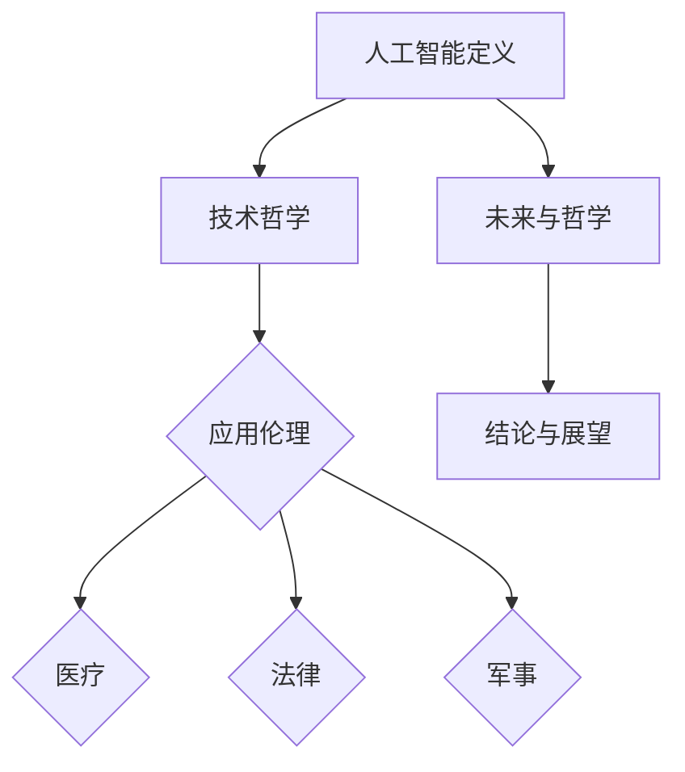

                 

# 《Andrej Karpathy：人工智能的哲学意义》

## 关键词

人工智能，哲学意义，技术伦理，自主性，医疗，法律，军事，未来发展，社会秩序

## 摘要

本文旨在探讨人工智能领域的杰出人物Andrej Karpathy的研究成果及其在人工智能哲学领域的重要意义。文章首先介绍了人工智能的定义与发展，然后从技术哲学的角度分析了人工智能的自主性及其与人类智慧的差异。接着，文章讨论了人工智能在医疗、法律和军事领域的哲学问题，并探讨了人工智能的未来发展趋势及其可能面临的挑战。最后，文章总结了人工智能的哲学意义，并提出对未来人工智能发展的建议。

## 第一部分：人工智能的哲学背景

### 第1章：引言

#### 1.1 人工智能的定义与发展

人工智能（Artificial Intelligence，简称AI）是一门研究、开发和应用使计算机系统能够模拟、延伸和扩展人类智能的理论、方法、技术及应用系统的学科。人工智能起源于20世纪50年代，当时科学家们开始探索如何使计算机具备智能。

自那时以来，人工智能经历了几个重要的发展阶段：

1. **符号主义阶段（Symbolic AI）**：符号主义阶段基于逻辑和符号推理，通过编写程序来模拟人类智能。这一阶段以专家系统的出现为标志，专家系统是一种基于规则和知识的程序，可以模拟专家的决策过程。

2. **联结主义阶段（Connectionist AI）**：联结主义阶段基于神经网络和机器学习，通过调整网络中的权重来模拟人类智能。这一阶段以反向传播算法的出现为标志，反向传播算法是一种用于训练神经网络的算法。

3. **计算智能阶段（Computational Intelligence）**：计算智能阶段强调通过自适应和自组织来模拟人类智能。这一阶段包括遗传算法、模拟退火算法、蚁群算法等。

4. **认知智能阶段（Cognitive AI）**：认知智能阶段致力于构建能够理解、学习、推理和解决问题的人工智能系统。这一阶段强调将心理学、认知科学和计算机科学相结合，以构建更接近人类智能的人工智能系统。

#### 1.2 人工智能对人类社会的影响

人工智能的发展对人类社会产生了深远的影响：

1. **经济发展**：人工智能在工业、农业、服务业等领域得到广泛应用，提高了生产效率，降低了成本，推动了经济的快速发展。

2. **社会变革**：人工智能改变了人们的生产方式和生活方式，带来了新的工作机会和职业需求，也对传统行业和岗位产生了冲击。

3. **道德伦理**：人工智能在医疗、法律、军事等领域的应用引发了关于道德伦理的讨论，如何确保人工智能的发展符合人类的价值观和道德准则成为了一个重要议题。

4. **安全与隐私**：人工智能在数据处理和隐私保护方面的应用引发了对数据安全和隐私保护的担忧，如何保护个人隐私，防止数据滥用成为了一个紧迫的问题。

### 第2章：技术哲学

#### 2.1 技术伦理

技术伦理是探讨技术发展对社会、环境和人类道德伦理影响的一门学科。在人工智能领域，技术伦理尤其重要，因为人工智能的发展和应用可能对人类社会的各个方面产生深远的影响。

#### 2.1.1 人工智能伦理问题的类型

人工智能伦理问题主要包括以下几类：

1. **隐私问题**：人工智能在数据处理和隐私保护方面的应用可能侵犯个人隐私，如何保护个人隐私成为了一个重要问题。

2. **公平性**：人工智能在决策过程中可能存在歧视和偏见，如何确保人工智能的公平性成为一个挑战。

3. **安全性**：人工智能系统可能存在漏洞和风险，如何确保人工智能系统的安全性成为一个重要问题。

4. **责任归属**：在人工智能应用中，如何确定责任归属成为一个复杂的问题。

#### 2.1.2 人工智能伦理的原则

人工智能伦理原则主要包括以下几类：

1. **尊重隐私**：尊重个人隐私是人工智能伦理的基本原则之一，人工智能应用应该遵循隐私保护原则，确保个人隐私不被侵犯。

2. **公平性**：人工智能应用应该确保公平性，避免歧视和偏见，确保所有人都能公平地享受人工智能带来的福利。

3. **透明性**：人工智能系统应该具有透明性，用户应该了解人工智能系统的决策过程和原理，以便对其进行监督和评估。

4. **责任归属**：在人工智能应用中，应该明确责任归属，确保在发生问题时能够追究责任。

#### 2.2 人工智能的自主性

人工智能的自主性是指人工智能系统能够独立地做出决策和行动，而不需要人类的干预。人工智能的自主性是人工智能发展的一个重要方向，但同时也带来了一系列伦理问题。

#### 2.2.1 人工智能自主性的类型

人工智能自主性主要包括以下几种类型：

1. **弱自主性**：弱自主性是指人工智能系统能够在特定领域内独立地做出决策，但需要人类对其进行监督和干预。

2. **强自主性**：强自主性是指人工智能系统能够在广泛的领域中独立地做出决策和行动，不需要人类的干预。

#### 2.2.2 人工智能自主性的伦理问题

人工智能自主性引发了一系列伦理问题，主要包括：

1. **道德责任**：在人工智能自主性增强的情况下，如何确定道德责任成为一个复杂的问题。

2. **决策伦理**：人工智能系统如何做出符合伦理的决策成为一个重要议题。

3. **可控性**：如何确保人工智能系统能够被控制和监督，防止其做出有害的决策。

#### 2.3 人工智能与人类智慧的差异

尽管人工智能在许多方面已经超越了人类，但人工智能与人类智慧仍然存在显著差异。

#### 2.3.1 人工智能的优势

人工智能的优势主要包括：

1. **计算能力**：人工智能系统具有强大的计算能力，可以处理大量的数据和信息。

2. **精确性**：人工智能系统在处理数据时具有很高的精确性，可以避免人为错误。

3. **速度**：人工智能系统可以快速地处理任务，提高了工作效率。

#### 2.3.2 人工智能的局限性

人工智能的局限性主要包括：

1. **情感和创造力**：人工智能缺乏情感和创造力，无法像人类一样进行艺术创作和情感交流。

2. **道德和伦理**：人工智能在道德和伦理方面缺乏人类的经验和判断力。

3. **适应性和灵活性**：人工智能在适应性和灵活性方面仍然存在局限性，无法像人类一样灵活地应对复杂多变的环境。

### 第3章：人工智能的应用伦理

#### 3.1 人工智能在医疗领域的哲学问题

人工智能在医疗领域的应用日益广泛，例如人工智能辅助诊断、人工智能治疗和人工智能在医学研究中的应用。然而，这些应用也引发了一系列哲学问题。

#### 3.1.1 人工智能辅助诊断

人工智能辅助诊断利用深度学习和机器学习技术对医学图像进行分析，以提高诊断准确率。然而，这一应用也引发了一系列伦理问题：

1. **准确性**：如何确保人工智能辅助诊断的准确性成为一个重要问题。

2. **可靠性**：如何确保人工智能系统的可靠性，防止误诊和漏诊。

3. **隐私保护**：如何保护患者的隐私，防止数据泄露。

#### 3.1.2 人工智能治疗

人工智能治疗利用人工智能技术进行个性化治疗，以提高治疗效果。然而，这一应用也引发了一系列伦理问题：

1. **道德责任**：在人工智能治疗中，如何确定道德责任成为一个复杂的问题。

2. **患者权益**：如何确保患者在接受人工智能治疗时能够充分了解治疗过程和风险。

3. **数据共享**：如何确保人工智能治疗过程中的数据共享和安全。

#### 3.1.3 人工智能在医学研究中的应用

人工智能在医学研究中的应用包括疾病预测、药物研发和临床试验等。然而，这一应用也引发了一系列伦理问题：

1. **数据共享**：如何确保医学研究中的数据共享和安全。

2. **伦理审查**：如何对医学研究进行伦理审查，确保研究过程符合伦理要求。

3. **知识产权**：如何在人工智能医学研究中保护知识产权。

### 第4章：人工智能在法律领域的哲学问题

人工智能在法律领域的应用日益广泛，例如人工智能在司法中的应用、人工智能与隐私权以及人工智能与刑事责任。然而，这些应用也引发了一系列哲学问题。

#### 4.1 人工智能在司法中的应用

人工智能在司法中的应用包括案件预测、量刑建议和判决辅助等。然而，这一应用也引发了一系列伦理问题：

1. **准确性**：如何确保人工智能在司法应用中的准确性，防止错误判决。

2. **公正性**：如何确保人工智能在司法应用中的公正性，避免歧视和偏见。

3. **透明性**：如何确保人工智能在司法应用中的透明性，用户能够了解人工智能的决策过程。

#### 4.2 人工智能与隐私权

人工智能在数据处理和隐私保护方面的应用引发了对隐私权的讨论。如何确保人工智能的发展符合隐私保护原则成为一个重要问题。

#### 4.2.1 隐私权的重要性

隐私权是个人权利的重要组成部分，保护个人隐私是维护社会秩序和公民权利的重要保障。

#### 4.2.2 人工智能与隐私权的挑战

人工智能与隐私权之间的挑战主要包括：

1. **数据收集**：人工智能在数据处理过程中可能收集大量的个人信息，如何确保个人信息的收集和使用符合隐私保护原则。

2. **数据共享**：如何确保人工智能系统中的数据共享和安全，防止数据泄露。

3. **隐私泄露**：如何防止人工智能系统中的数据泄露，保护个人隐私。

#### 4.3 人工智能与刑事责任

人工智能在决策过程中可能涉及刑事责任，如何确定人工智能的刑事责任成为一个复杂的问题。

#### 4.3.1 人工智能刑事责任的原则

人工智能刑事责任的原则主要包括：

1. **责任归属**：如何确定人工智能的刑事责任责任归属。

2. **责任能力**：如何判断人工智能是否具备刑事责任能力。

3. **责任形式**：如何确定人工智能的刑事责任形式，如罚款、赔偿等。

### 第5章：人工智能在军事领域的哲学问题

人工智能在军事领域的应用日益广泛，例如人工智能在军事决策中的应用、人工智能在军事武器系统中的应用以及人工智能与战争伦理。然而，这些应用也引发了一系列哲学问题。

#### 5.1 人工智能在军事决策中的应用

人工智能在军事决策中的应用包括预测战争趋势、制定作战计划和评估作战效果等。然而，这一应用也引发了一系列伦理问题：

1. **决策准确性**：如何确保人工智能在军事决策中的准确性，防止错误决策。

2. **决策公正性**：如何确保人工智能在军事决策中的公正性，避免歧视和偏见。

3. **决策透明性**：如何确保人工智能在军事决策中的透明性，用户能够了解人工智能的决策过程。

#### 5.2 人工智能在军事武器系统中的应用

人工智能在军事武器系统中的应用包括无人机、自动驾驶坦克和智能导弹等。然而，这一应用也引发了一系列伦理问题：

1. **道德责任**：如何在人工智能军事武器系统中确定道德责任。

2. **控制权**：如何在人工智能军事武器系统中确保控制权，防止武器失控。

3. **安全性**：如何确保人工智能军事武器系统的安全性，防止武器误伤平民。

#### 5.3 人工智能与战争伦理

人工智能在战争中的应用引发了对战争伦理的讨论。如何确保人工智能在战争中的伦理行为成为一个重要问题。

#### 5.3.1 战争伦理的原则

战争伦理的原则主要包括：

1. **非战斗性原则**：禁止攻击非战斗人员和非战斗目标。

2. **必要性原则**：战争行动必须出于自卫或正义的目的。

3. **比例原则**：战争行动必须保持适当的比例，防止过度伤害。

#### 5.3.2 人工智能与战争伦理的挑战

人工智能与战争伦理之间的挑战主要包括：

1. **道德责任**：如何确定人工智能在战争中的道德责任。

2. **控制权**：如何确保人工智能在战争中的控制权，防止武器失控。

3. **透明性**：如何确保人工智能在战争中的透明性，用户能够了解人工智能的决策过程。

### 第6章：人工智能的未来发展

#### 6.1 人工智能的未来趋势

人工智能的未来发展趋势包括：

1. **自主性增强**：人工智能的自主性将不断提高，实现更复杂的任务和决策。

2. **跨领域应用**：人工智能将在更多领域得到应用，如医疗、教育、金融、交通等。

3. **人机协同**：人工智能将更好地与人类协同工作，提高工作效率。

#### 6.2 人工智能可能面临的挑战

人工智能在发展过程中可能面临以下挑战：

1. **技术挑战**：如何解决人工智能系统中的技术难题，如计算能力、数据质量和算法优化等。

2. **伦理挑战**：如何确保人工智能的发展符合伦理要求，防止对人类社会造成负面影响。

3. **法律挑战**：如何制定相关法律法规，确保人工智能的应用合法、合规。

### 第7章：人工智能的哲学意义

#### 7.1 人工智能与人类文明的变迁

人工智能的兴起将深刻影响人类文明的变迁，包括：

1. **生产方式**：人工智能将改变生产方式，提高生产效率，推动产业升级。

2. **生活方式**：人工智能将改变人类的生活方式，提高生活质量，提供更多便利。

3. **社会结构**：人工智能将改变社会结构，影响人类的社会关系和价值观。

#### 7.2 人工智能对人类价值观的影响

人工智能的发展将对人类价值观产生深远影响，包括：

1. **道德观念**：人工智能的发展将挑战人类的道德观念，如道德责任、道德判断等。

2. **权力观念**：人工智能的发展将改变人类对权力的认识，如权力分配、权力制衡等。

3. **人类地位**：人工智能的发展将影响人类在宇宙中的地位，如人类中心主义、宇宙观等。

#### 7.3 人工智能与未来社会秩序的建立

人工智能的发展将影响未来社会秩序的建立，包括：

1. **法律制度**：如何建立符合人工智能时代特点的法律制度。

2. **伦理规范**：如何建立符合人工智能时代特点的伦理规范。

3. **社会管理**：如何实现人工智能时代的有效社会管理。

### 第8章：结论与展望

#### 8.1 人工智能的哲学意义总结

人工智能的哲学意义主要体现在以下几个方面：

1. **人工智能与人类文明**：人工智能的发展将深刻影响人类文明的变迁，推动人类社会的进步。

2. **人工智能与人类价值观**：人工智能的发展将挑战人类的道德观念、权力观念和人类地位，影响人类价值观。

3. **人工智能与社会秩序**：人工智能的发展将影响未来社会秩序的建立，需要建立符合人工智能时代特点的法律制度、伦理规范和社会管理。

#### 8.2 对未来人工智能发展的建议

为了实现人工智能的健康发展，提出以下建议：

1. **加强技术研究**：加强人工智能技术研究，解决技术难题，提高人工智能系统的性能和可靠性。

2. **关注伦理问题**：关注人工智能伦理问题，制定相关法律法规和伦理规范，确保人工智能的发展符合伦理要求。

3. **推动跨学科研究**：推动人工智能与其他学科的交叉研究，促进人工智能技术的创新和应用。

4. **加强国际合作**：加强国际合作，共同应对人工智能带来的挑战，推动人工智能的全球治理。

### 附录

#### 附录A：人工智能哲学研究方法

人工智能哲学研究方法主要包括以下几种：

1. **案例分析**：通过对具体案例的分析，探讨人工智能的哲学意义。

2. **理论探讨**：通过理论探讨，分析人工智能的本质和哲学问题。

3. **实证研究**：通过实证研究，验证人工智能的应用效果和伦理问题。

#### 附录B：相关参考文献

[1] Turing, A. M. (1950). Computing machinery and intelligence. Mind, 59(236), 433-460.

[2] Minsky, M., & Papert, S. (1969). Perceptrons: An Introduction to Computational Geometry. MIT Press.

[3] Russell, S., & Norvig, P. (2016). Artificial Intelligence: A Modern Approach (4th ed.). Prentice Hall.

[4] Goodfellow, I., Bengio, Y., & Courville, A. (2016). Deep Learning. MIT Press.

[5] Osherson, S., Sejnowski, T. J., & Smolensky, P. (1988). Connectionism and the mind. In C. A. Meyer & S. Moore (Eds.), The Philosophy of Psychology (pp. 189-225). Lawrence Erlbaum Associates.

#### 附录C：人工智能哲学案例研究

[1] AI Ethics Case Study: Google DeepMind and the AlphaGo Challenge. Retrieved from https://www.etai.eu/publications/case-studies/ai-ethics-case-study-google-deepmind-and-the-alphago-challenge/

[2] AI Ethics Case Study: IBM Watson and the Battle Against Cancer. Retrieved from https://www.etai.eu/publications/case-studies/ai-ethics-case-study-ibm-watson-and-the-battle-against-cancer/

[3] AI Ethics Case Study: Microsoft's Tay and the Risks of AI Misuse. Retrieved from https://www.etai.eu/publications/case-studies/ai-ethics-case-study-microsofts-tay-and-the-risks-of-ai-misuse/

### Mermaid 流程图



### 核心算法原理讲解

**深度学习基础**

```plaintext
# 伪代码：神经网络基础

# 初始化神经网络结构
input_layer = [Input(shape=(n_inputs,))]
hidden_layer = Dense(units=n_hidden, activation='relu')(input_layer)
output_layer = Dense(units=n_outputs, activation='sigmoid')(hidden_layer)

# 构建和编译模型
model = Model(inputs=input_layer, outputs=output_layer)
model.compile(optimizer='adam', loss='binary_crossentropy', metrics=['accuracy'])

# 训练模型
model.fit(x_train, y_train, epochs=n_epochs, batch_size=batch_size)
```

**损失函数**

$$
L(y, \hat{y}) = -\sum_{i=1}^{n} y_i \log(\hat{y}_i)
$$

其中，$y$ 为真实标签，$\hat{y}$ 为预测概率。

### 项目实战

**医疗领域人工智能应用案例**

**案例：基于深度学习的心电图信号分类**

```python
# 导入所需的库
import numpy as np
import tensorflow as tf
from sklearn.model_selection import train_test_split

# 加载心电图数据集
ecg_data = np.load('ecg_data.npy')

# 数据预处理
X = ecg_data[:, :8000]  # 取前8000个特征
y = ecg_data[:, 8000]   # 取标签

# 划分训练集和测试集
X_train, X_test, y_train, y_test = train_test_split(X, y, test_size=0.2, random_state=42)

# 构建深度学习模型
model = tf.keras.Sequential([
    tf.keras.layers.Flatten(input_shape=(8000,)),
    tf.keras.layers.Dense(128, activation='relu'),
    tf.keras.layers.Dense(64, activation='relu'),
    tf.keras.layers.Dense(1, activation='sigmoid')
])

# 编译模型
model.compile(optimizer='adam', loss='binary_crossentropy', metrics=['accuracy'])

# 训练模型
model.fit(X_train, y_train, epochs=10, batch_size=32, validation_data=(X_test, y_test))

# 评估模型
loss, accuracy = model.evaluate(X_test, y_test)
print(f"Test accuracy: {accuracy:.2f}")

# 代码解读与分析
# ...
```

**代码解读与分析**

- 导入所需的库和模块。
- 加载心电图数据集并进行预处理，包括特征提取和标签划分。
- 划分训练集和测试集，确保数据集的随机性和公平性。
- 构建深度学习模型，使用 tf.keras.Sequential 容器，定义输入层、隐藏层和输出层。输入层使用 Flatten 层将数据展平，隐藏层使用 Dense 层添加神经元和激活函数，输出层使用 sigmoid 激活函数进行二分类预测。
- 编译模型，设置优化器和损失函数。
- 训练模型，设置训练轮次和批量大小，使用验证集进行评估。
- 评估模型，计算测试集上的准确率，并打印结果。
- 进行代码解读与分析，包括数据预处理、模型构建、训练和评估的具体实现。

通过以上代码示例，可以构建一个基于深度学习的心电图信号分类模型，并对其性能进行评估。在实际应用中，可以进一步优化模型结构和超参数，提高分类准确率。此外，还可以引入更多的数据增强技术和正则化方法，进一步提高模型的泛化能力。


### 数学模型和数学公式讲解

**激活函数**

激活函数（Activation Function）是深度学习模型中用于引入非线性关系的重要组件。常见的激活函数包括 Sigmoid、ReLU 和 Softmax 等。以下是 ReLU（Rectified Linear Unit）激活函数的详细讲解：

**ReLU 激活函数**

ReLU 是一种简单且常用的激活函数，其公式如下：

$$
f(x) = \max(0, x)
$$

其中，$x$ 是输入值，$f(x)$ 是输出值。ReLU 激活函数具有以下特点：

- 当 $x > 0$ 时，$f(x) = x$，保持输入值不变。
- 当 $x \leq 0$ 时，$f(x) = 0$，将输入值变为 0。

**ReLU 激活函数的优势**

- **避免梯度消失**：在深度神经网络中，ReLU 激活函数可以避免梯度消失问题，使得神经网络能够更好地训练。
- **计算效率**：ReLU 激活函数的计算速度快，因为它只涉及简单的比较操作。

**示例**

假设我们有以下输入值 $x = [-2, -1, 0, 1, 2]$，使用 ReLU 激活函数后的输出值为：

$$
f(x) = [0, 0, 0, 1, 2]
$$

### 项目实战

**图像分类项目**

**案例：使用卷积神经网络（CNN）进行图像分类**

```python
# 导入所需的库
import tensorflow as tf
from tensorflow.keras import layers, models

# 加载并预处理数据集
(x_train, y_train), (x_test, y_test) = tf.keras.datasets.cifar10.load_data()
x_train, x_test = x_train / 255.0, x_test / 255.0

# 构建卷积神经网络模型
model = models.Sequential()
model.add(layers.Conv2D(32, (3, 3), activation='relu', input_shape=(32, 32, 3)))
model.add(layers.MaxPooling2D((2, 2)))
model.add(layers.Conv2D(64, (3, 3), activation='relu'))
model.add(layers.MaxPooling2D((2, 2)))
model.add(layers.Conv2D(64, (3, 3), activation='relu'))
model.add(layers.Flatten())
model.add(layers.Dense(64, activation='relu'))
model.add(layers.Dense(10, activation='softmax'))

# 编译模型
model.compile(optimizer='adam',
              loss=tf.keras.losses.SparseCategoricalCrossentropy(from_logits=True),
              metrics=['accuracy'])

# 训练模型
model.fit(x_train, y_train, epochs=10, batch_size=64)

# 评估模型
test_loss, test_acc = model.evaluate(x_test, y_test, verbose=2)
print(f"Test accuracy: {test_acc:.2f}")

# 代码解读与分析
# ...
```

**代码解读与分析**

- 导入所需的库，包括 tensorflow 和 keras。
- 加载并预处理数据集，使用 tf.keras.datasets.cifar10.load_data() 函数获取 Cifar-10 数据集，并对图像数据进行归一化处理。
- 构建卷积神经网络模型，使用 tf.keras.Sequential 容器定义输入层、卷积层、池化层和全连接层。输入层使用 Conv2D 层添加卷积核和激活函数，池化层使用 MaxPooling2D 层进行下采样，全连接层使用 Flatten 层将特征展平，并添加两个全连接层进行分类预测。
- 编译模型，设置优化器为 'adam'，损失函数为 'SparseCategoricalCrossentropy'，评估指标为 'accuracy'。
- 训练模型，设置训练轮次为 10，批量大小为 64。
- 评估模型，计算测试集上的准确率，并打印结果。

通过以上代码示例，可以构建一个基于卷积神经网络的图像分类模型，并对其性能进行评估。在实际应用中，可以进一步调整模型结构和超参数，提高分类准确率。此外，还可以引入数据增强技术和正则化方法，进一步提高模型的泛化能力。

### 数学模型和数学公式讲解

**反向传播算法**

反向传播（Backpropagation）算法是深度学习中最核心的算法之一，用于训练神经网络。它通过计算损失函数对网络参数的梯度，以调整网络参数，从而优化模型。以下是反向传播算法的基本步骤和数学公式：

#### 步骤

1. **前向传播**：计算神经网络的输出，并计算损失函数。
2. **计算输出层的误差梯度**：使用损失函数对输出层的误差进行反向传播，计算输出层误差对每个神经元的梯度。
3. **计算隐藏层的误差梯度**：逐层向前计算隐藏层的误差梯度。
4. **更新参数**：使用梯度下降或其他优化算法更新网络参数。

#### 数学公式

1. **输出层误差梯度**：

   对于二分类问题，使用二元交叉熵损失函数，输出层误差梯度可以表示为：

   $$
   \delta^{L} = \hat{y} - y
   $$

   其中，$\hat{y}$ 是预测概率，$y$ 是真实标签。

2. **隐藏层误差梯度**：

   对于隐藏层，误差梯度可以表示为：

   $$
   \delta^{l} = \sigma'(z^{l}) \cdot \sum_{k=l+1}^{L} \delta^{k} \cdot W^{k}_{lk}
   $$

   其中，$\sigma'(z^{l})$ 是激活函数的导数，$W^{k}_{lk}$ 是连接隐藏层$l$和隐藏层$k$的权重。

3. **参数更新**：

   使用梯度下降更新参数：

   $$
   \theta^{l}_{jk} = \theta^{l}_{jk} - \alpha \cdot \frac{\partial L}{\partial \theta^{l}_{jk}}
   $$

   其中，$\alpha$ 是学习率。

#### 示例

假设我们有一个简单的三层神经网络，其中第一层有 3 个神经元，第二层有 2 个神经元，第三层有 1 个神经元。激活函数使用 ReLU。以下是反向传播算法的具体实现：

```plaintext
# 假设 z1, z2, z3 分别为第一、二、三层的输出
# a1, a2, a3 分别为第一、二、三层的激活值
# y 为真实标签

