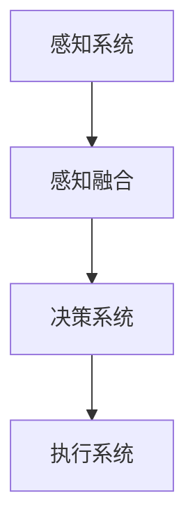
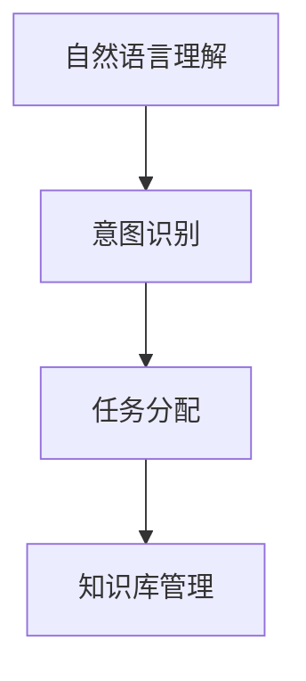

                 

# Andrej Karpathy：人工智能的未来发展规划

> 关键词：人工智能，未来规划，机器学习，深度学习，应用领域，伦理法规

> 摘要：本文将深入探讨人工智能（AI）的未来发展规划，从历史、现状、核心概念、数学基础、未来发展趋势、开发与部署、案例分析等多个方面进行详细分析。通过Andrej Karpathy的研究视角，本文旨在为读者提供一个全面、清晰、有深度的人工智能未来图景，以及如何应对其中的挑战。

----------------------------------------------------------------

### 目录大纲

#### 第一部分：人工智能的历史与现状

**第1章：人工智能的历史与现状**

**第2章：人工智能的核心概念**

**第3章：人工智能的数学基础**

#### 第二部分：人工智能的未来发展趋势

**第4章：人工智能的未来发展趋势**

**第5章：人工智能的开发与部署**

#### 第三部分：人工智能的案例分析

**第6章：人工智能的案例分析**

#### 第四部分：人工智能的未来规划

**第7章：人工智能的未来规划**

#### 附录

**附录A：人工智能相关资源与工具**

----------------------------------------------------------------

### 第一部分：人工智能的历史与现状

#### 第1章：人工智能的历史与现状

**1.1 人工智能的起源与发展**

人工智能（AI）的概念最早可以追溯到20世纪50年代。当时，图灵提出了著名的“图灵测试”，用以衡量机器是否能够表现出与人类相似的智能。从那时起，人工智能作为一个研究领域逐渐兴起。

- **1.1.1 人工智能的概念**

人工智能是指使计算机能够执行需要人类智能才能完成的任务的技术。这包括理解自然语言、识别图像、解决复杂问题等。

- **1.1.2 人工智能的发展阶段**

人工智能的发展可以分为几个阶段：

1. **符号人工智能**：基于逻辑和规则系统，试图模拟人类的推理过程。
2. **知识表示与推理**：利用知识库和推理机来模拟人类的决策过程。
3. **基于模式的识别**：利用统计模型和机器学习方法进行数据分析和模式识别。
4. **智能代理与增强学习**：通过交互和反馈来提高系统的智能水平。

**1.2 人工智能的技术现状**

目前，人工智能技术已经取得了显著的进展，主要包括以下几个方面：

- **机器学习与深度学习**：机器学习是人工智能的核心技术之一，通过训练算法让计算机自动学习数据中的模式和规律。深度学习是机器学习的一种重要分支，通过多层神经网络来提取数据的高级特征。

- **自然语言处理与计算机视觉**：自然语言处理（NLP）旨在使计算机理解和生成人类语言。计算机视觉则致力于使计算机理解和解释视觉信息。

- **人工智能的应用领域**：人工智能已经广泛应用于各个领域，如医疗、金融、教育、交通、安防等。

**1.2.1 人工智能在医疗领域的应用**

人工智能在医疗领域的应用包括疾病诊断、治疗规划、药物研发等。例如，通过分析患者的病历数据，人工智能可以预测疾病的风险，从而实现早期干预。

**1.2.2 人工智能在金融领域的应用**

人工智能在金融领域的应用包括风险管理、投资策略、客户服务等方面。例如，通过分析市场数据，人工智能可以预测股票市场的走势，帮助投资者做出决策。

**1.2.3 人工智能在教育领域的应用**

人工智能在教育领域的应用包括个性化教学、智能评估、学习资源推荐等。例如，通过分析学生的学习数据，人工智能可以为学生提供个性化的学习建议，提高学习效果。

----------------------------------------------------------------

### 第二部分：人工智能的核心概念

#### 第2章：人工智能的核心概念

**2.1 机器学习的基本原理**

机器学习是人工智能的核心技术之一，它使计算机能够通过数据学习并做出预测或决策。机器学习可以分为以下几种类型：

- **监督学习**：通过已有的标签数据进行训练，使模型能够对新的数据进行预测。
- **无监督学习**：没有标签数据，通过数据本身的特征进行聚类或降维。
- **强化学习**：通过与环境的交互，学习最优策略以最大化累积奖励。

**2.1.1 监督学习、无监督学习和强化学习**

- **监督学习**：监督学习是一种常见的机器学习方法，它通过已有数据的输入和输出（即标签）来训练模型。在监督学习中，模型的目标是学习一个函数，能够将新的输入映射到正确的输出。

  ```python
  # 监督学习伪代码
  def train_supervised(data, labels):
      # 训练模型
      model = Model()
      model.fit(data, labels)
      return model
  ```

- **无监督学习**：无监督学习没有提供标签数据，模型需要通过探索数据内在结构来发现数据中的模式。常见的无监督学习方法包括聚类和降维。

  ```python
  # 无监督学习伪代码
  def train_unsupervised(data):
      # 聚类
      clusters = Cluster().fit(data)
      # 降维
      reduced_data = DimReduction().fit_transform(data)
      return clusters, reduced_data
  ```

- **强化学习**：强化学习是一种通过交互和反馈来学习最优策略的机器学习方法。强化学习中的模型被称为智能体（agent），它通过与环境的交互来学习如何获得最大化的奖励。

  ```python
  # 强化学习伪代码
  def train_reinforcement(agent, environment):
      while not done:
          action = agent.select_action()
          next_state, reward, done = environment.step(action)
          agent.update(action, reward, next_state)
      return agent
  ```

**2.1.2 神经网络与深度学习**

神经网络是一种模拟人脑神经元之间连接的计算模型。深度学习则是神经网络的一种扩展，通过增加网络的深度来提高模型的性能。

- **神经网络的基本原理**：神经网络通过多层神经元进行数据的传递和变换。每个神经元都与其他神经元相连，并通过权重进行数据传递。

  ```python
  # 神经网络基本原理 Mermaid 流程图
  graph TD
      A[输入层] --> B[隐藏层1]
      B --> C[隐藏层2]
      C --> D[输出层]
  ```

- **深度学习的优势**：深度学习能够自动提取数据中的高级特征，从而提高了模型的泛化能力和性能。深度学习在图像识别、语音识别、自然语言处理等领域取得了显著的成果。

**2.2 自然语言处理与计算机视觉**

自然语言处理和计算机视觉是人工智能的两个重要分支，它们分别致力于理解和生成自然语言以及理解和解释视觉信息。

- **自然语言处理**：自然语言处理涉及语言模型、文本分类、机器翻译、情感分析等领域。语言模型是自然语言处理的基础，它通过统计方法来预测下一个单词或词组。

  ```python
  # 语言模型伪代码
  def predict_next_word(context, model):
      probabilities = model.predict(context)
      next_word = np.argmax(probabilities)
      return next_word
  ```

- **计算机视觉**：计算机视觉旨在使计算机理解和解释视觉信息。计算机视觉包括图像识别、目标检测、图像分割等领域。

  ```python
  # 图像识别伪代码
  def recognize_image(image, model):
      features = extract_features(image)
      prediction = model.predict(features)
      return prediction
  ```

----------------------------------------------------------------

### 第三部分：人工智能的数学基础

#### 第3章：人工智能的数学基础

人工智能的发展离不开数学的支持，特别是在线性代数和概率论与统计方面。这些数学工具为人工智能的理论和实践提供了坚实的基础。

**3.1 线性代数**

线性代数是人工智能中常用的数学工具之一，它主要涉及矩阵和向量等基本概念。

- **矩阵与向量**：矩阵是一种由数字组成的矩形阵列，向量是一种由数字组成的一维数组。矩阵和向量在人工智能中的应用非常广泛，如数据预处理、特征提取等。

  ```python
  # 矩阵与向量伪代码
  matrix = [[1, 2], [3, 4]]
  vector = [5, 6]
  ```

- **线性方程组与特征值特征向量**：线性方程组是人工智能中常见的问题，如求解最小二乘法。特征值特征向量用于分析矩阵的特性，如主成分分析（PCA）。

  ```python
  # 线性方程组与特征值特征向量伪代码
  def solve_linear_equations(A, b):
      # 求解线性方程组
      x = np.linalg.solve(A, b)
      return x

  def eigen_decomposition(matrix):
      # 求解特征值特征向量
      eigenvalues, eigenvectors = np.linalg.eig(matrix)
      return eigenvalues, eigenvectors
  ```

**3.2 概率论与统计**

概率论与统计是人工智能中用于描述不确定性和进行数据分析的重要工具。

- **概率分布与随机变量**：概率分布描述了随机变量可能取值的概率，如正态分布、伯努利分布等。随机变量是可能取多个值的变量。

  ```python
  # 概率分布与随机变量伪代码
  def probability_distribution(x):
      # 概率分布函数
      probability = p(x)
      return probability

  def random_variable(x):
      # 随机变量函数
      value = random.choice(x)
      return value
  ```

- **最大似然估计与最小二乘法**：最大似然估计和最小二乘法是用于估计模型参数的常见方法。

  ```python
  # 最大似然估计与最小二乘法伪代码
  def maximum_likelihood_estimation(data, parameters):
      # 最大似然估计
      likelihood = likelihood_function(data, parameters)
      return parameters

  def least_squares(data, parameters):
      # 最小二乘法
      residuals = data - parameters
      sum_squared_residues = np.sum(residuals ** 2)
      return sum_squared_residues
  ```

通过上述数学基础，人工智能模型能够更好地理解和处理复杂数据，从而实现更高的性能和准确性。

----------------------------------------------------------------

### 第四部分：人工智能的未来发展趋势

#### 第4章：人工智能的未来发展趋势

人工智能（AI）作为现代科技的重要驱动力，正在不断推动各行各业的变革。本文将探讨人工智能的未来发展趋势，重点关注人工智能与行业融合、人工智能伦理与法规等方面。

**4.1 人工智能与行业融合**

人工智能在医疗、金融、教育、交通等领域的广泛应用，标志着AI与各个行业的深度融合。以下是对这些领域的一些具体分析：

**4.1.1 人工智能在医疗领域的应用**

人工智能在医疗领域的应用包括疾病诊断、治疗规划、药物研发等。通过分析大量的患者数据和医学图像，人工智能可以提供更准确的诊断和更个性化的治疗方案。例如，深度学习模型在肺癌、乳腺癌等疾病的早期诊断中表现出了卓越的能力。

- **人工智能在疾病诊断中的应用**：

  ```python
  # 疾病诊断伪代码
  def diagnose_disease(patient_data, model):
      diagnosis = model.predict(patient_data)
      return diagnosis
  ```

- **人工智能在药物研发中的应用**：

  ```python
  # 药物研发伪代码
  def drug_discovery(target, model):
      candidates = model.search_candidates(target)
      return candidates
  ```

**4.1.2 人工智能在金融领域的应用**

人工智能在金融领域的应用包括风险管理、投资策略、客户服务等方面。通过大数据分析和机器学习算法，金融机构可以更准确地评估风险、优化投资组合，并为客户提供个性化的金融服务。

- **人工智能在风险控制中的应用**：

  ```python
  # 风险控制伪代码
  def risk_assessment(loan_application, model):
      risk_score = model.predict(loan_application)
      return risk_score
  ```

- **人工智能在投资策略中的应用**：

  ```python
  # 投资策略伪代码
  def investment_strategymarket_data, model):
      recommendation = model.analyze(market_data)
      return recommendation
  ```

**4.1.3 人工智能在教育领域的应用**

人工智能在教育领域的应用包括个性化教学、智能评估、学习资源推荐等。通过分析学生的学习数据，人工智能可以为学生提供个性化的学习建议，提高学习效果。

- **人工智能在个性化教学中的应用**：

  ```python
  # 个性化教学伪代码
  def personalized_learning(student_data, model):
      learning_plan = model.generate_plan(student_data)
      return learning_plan
  ```

- **人工智能在智能评估中的应用**：

  ```python
  # 智能评估伪代码
  def intelligent_evaluation(test_data, model):
      evaluation_results = model.evaluate(test_data)
      return evaluation_results
  ```

**4.2 人工智能伦理与法规**

随着人工智能技术的快速发展，其伦理和法规问题日益引起关注。以下是对人工智能伦理和法规的一些讨论：

**4.2.1 人工智能伦理问题**

人工智能伦理问题包括隐私保护、数据安全、算法歧视、责任归属等。为了确保人工智能的健康发展，需要建立相应的伦理标准和规范。

- **隐私保护**：人工智能在处理个人数据时，需要严格遵守隐私保护原则，确保个人隐私不被泄露。

- **数据安全**：人工智能系统需要保护其处理的数据安全，防止数据泄露和滥用。

- **算法歧视**：人工智能算法可能会产生歧视性结果，需要采取措施确保算法的公平性和透明度。

**4.2.2 人工智能法规与政策**

为了规范人工智能的发展，各国政府纷纷出台相关法规和政策。以下是一些典型的法规和政策：

- **欧盟的《通用数据保护条例》（GDPR）**：规定了个人数据的收集、处理和存储要求，以保护个人隐私。

- **美国的《人工智能法案》**：提出了人工智能发展的指导原则，包括透明度、安全性和公平性。

- **中国的《新一代人工智能发展规划》**：明确了人工智能发展的目标和路径，提出了人工智能发展的战略布局。

通过上述讨论，我们可以看到人工智能的未来发展趋势充满机遇和挑战。为了充分利用人工智能的优势，我们需要加强技术研发、完善伦理法规，并推动人工智能与各行各业的深度融合，为人类创造更美好的未来。

----------------------------------------------------------------

### 第五部分：人工智能的开发与部署

#### 第5章：人工智能的开发与部署

随着人工智能技术的不断发展，如何有效地开发和部署人工智能系统已成为一个关键问题。本文将详细探讨人工智能项目开发流程、模型部署与运维等方面的内容。

**5.1 人工智能项目开发流程**

人工智能项目开发流程通常包括以下几个关键步骤：

**5.1.1 数据收集与预处理**

数据是人工智能系统的基石，因此数据收集与预处理是项目开发的首要任务。数据收集通常包括从各种来源获取数据，如数据库、网络爬虫等。预处理则涉及数据清洗、去重、归一化等操作，以确保数据的质量和一致性。

```python
# 数据收集与预处理伪代码
def collect_data(source):
    data = fetch_data(source)
    return data

def preprocess_data(data):
    cleaned_data = clean_data(data)
    normalized_data = normalize_data(cleaned_data)
    return normalized_data
```

**5.1.2 模型设计与训练**

模型设计是人工智能项目开发的核心环节。在这一步骤中，需要选择合适的模型架构，如神经网络、决策树等，并进行参数调整。训练过程则通过迭代优化模型参数，使其在训练数据上达到最佳的预测效果。

```python
# 模型设计与训练伪代码
def design_model():
    model = NeuralNetwork()
    return model

def train_model(model, data, labels):
    model.fit(data, labels)
    return model
```

**5.1.3 模型评估与优化**

模型评估是验证模型性能的重要步骤。通过在验证集和测试集上评估模型，可以确定模型的泛化能力和准确性。评估指标包括准确率、召回率、F1分数等。模型优化则通过调整超参数、增加训练数据等手段来提升模型性能。

```python
# 模型评估与优化伪代码
def evaluate_model(model, data, labels):
    performance = model.evaluate(data, labels)
    return performance

def optimize_model(model, data, labels):
    model.optimize(data, labels)
    return model
```

**5.2 人工智能部署与运维**

人工智能系统的部署与运维是确保其稳定运行的关键。以下是一些关键步骤：

**5.2.1 模型部署环境**

模型部署环境包括硬件和软件环境。硬件环境需要足够的计算资源和存储空间，以满足模型运行的需求。软件环境则包括操作系统、编程语言和框架等。

```python
# 模型部署环境伪代码
def setup_environment():
    # 安装操作系统和软件
    install_operating_system()
    install_software()
    return environment
```

**5.2.2 模型监控与维护**

模型监控是确保模型稳定运行的重要环节。通过监控模型的输入数据、输出结果和运行状态，可以及时发现和解决问题。维护则包括定期更新模型、修复漏洞和优化性能。

```python
# 模型监控与维护伪代码
def monitor_model(model):
    # 监控模型状态
    status = model.status()
    return status

def maintain_model(model):
    # 更新模型
    model.update()
    # 修复漏洞
    model.fix_issues()
    # 优化性能
    model.optimize_performance()
```

通过上述开发与部署流程，人工智能系统可以从设计、训练到部署实现自动化，从而提高开发效率和模型性能。在实际应用中，还需要根据具体需求和场景进行定制化开发和优化。

----------------------------------------------------------------

### 第六部分：人工智能的案例分析

#### 第6章：人工智能的案例分析

在本章节中，我们将通过两个具体的案例——人工智能在无人驾驶和智能客服领域的应用，来深入探讨人工智能技术的实际应用场景、技术原理及其带来的变革。

**6.1 案例分析一：人工智能在无人驾驶中的应用**

无人驾驶技术是人工智能在交通运输领域的一个重要应用，它通过计算机视觉、深度学习、传感器融合等多种技术实现车辆自主驾驶。以下是对无人驾驶技术原理和实际案例的详细分析。

**6.1.1 无人驾驶技术原理**

无人驾驶技术的核心在于车辆自主感知、决策和执行。以下是无人驾驶技术的基本原理：

- **感知系统**：无人驾驶车辆通过多个传感器，如激光雷达（LiDAR）、摄像头、毫米波雷达等，收集周围环境的信息。
- **感知融合**：将来自不同传感器的数据融合，形成一个完整、准确的环境模型。
- **决策系统**：基于环境模型，无人驾驶车辆需要做出驾驶决策，如加速、减速、转向等。
- **执行系统**：将决策转化为具体的操作，控制车辆的执行机构，如油门、刹车和方向盘。

以下是无人驾驶技术原理的 Mermaid 流程图：



- **无人驾驶案例分析**：

  以特斯拉的自动驾驶系统为例，特斯拉通过深度学习技术实现了车辆的高精度感知和智能决策。特斯拉的自动驾驶系统包括以下几个关键组件：

  - **自动驾驶芯片**：特斯拉自主研发的自动驾驶芯片，用于处理大量感知和决策任务。
  - **摄像头和传感器**：特斯拉车辆配备多个摄像头和传感器，用于感知周围环境。
  - **深度学习算法**：特斯拉利用深度学习算法，对感知数据进行处理，实现车辆的自主驾驶。

  以下是一个简化版的无人驾驶系统实现伪代码：

  ```python
  # 无人驾驶系统实现伪代码
  def autonomous_driving(car, environment):
      sensors_data = collect_sensors_data(car, environment)
      fused_data = fuse_sensors_data(sensors_data)
      decision = make_decision(fused_data)
      execute_decision(decision, car)
  ```

**6.2 案例分析二：人工智能在智能客服中的应用**

智能客服是人工智能在客户服务领域的一个重要应用，它通过自然语言处理、机器学习等技术实现与客户的智能交互。以下是对智能客服技术原理和实际案例的详细分析。

**6.2.1 智能客服技术原理**

智能客服技术主要涉及以下几个关键环节：

- **自然语言理解**：将客户的自然语言输入转化为结构化的数据，用于后续处理。
- **意图识别**：通过分析客户的输入，识别客户的意图，如咨询产品信息、投诉处理等。
- **任务分配**：将客户的请求分配给合适的客服代表或自动化处理系统。
- **知识库管理**：管理客服所需的知识库，提供智能客服系统查询和参考。

以下是智能客服技术原理的 Mermaid 流程图：



- **智能客服案例分析**：

  以腾讯的智能客服系统为例，腾讯利用深度学习技术和自然语言处理技术，实现了高效的智能客服服务。腾讯的智能客服系统包括以下几个关键组件：

  - **自然语言处理模型**：腾讯通过训练深度学习模型，实现自然语言理解、意图识别等功能。
  - **知识库**：腾讯构建了丰富的知识库，涵盖各种常见问题和解决方案。
  - **智能对话引擎**：腾讯的智能对话引擎，实现与客户的智能交互，提供个性化服务。

  以下是一个简化的智能客服系统实现伪代码：

  ```python
  # 智能客服系统实现伪代码
  def intelligent_cust_service(customer_input):
      understood_input = natural_language_understanding(customer_input)
      intent = intent_recognition(understood_input)
      response = get_response_from_knowledge_base(intent)
      return response
  ```

通过上述案例分析，我们可以看到人工智能在无人驾驶和智能客服等领域的广泛应用，不仅提高了服务的效率和质量，也为相关行业带来了深远的变革。

----------------------------------------------------------------

### 第七部分：人工智能的未来规划

#### 第7章：人工智能的未来规划

人工智能的未来规划涉及多个层面，包括个人、企业和社会的未来发展愿景、挑战以及应对策略。本文将从这三个角度探讨人工智能的未来规划。

**7.1 人工智能的未来发展趋势**

人工智能的未来发展趋势可以从以下几个方面来展望：

- **技术突破**：人工智能将继续在算法、硬件和数据处理等方面取得重大突破。例如，量子计算和类脑计算等前沿技术有望推动人工智能的快速发展。
- **跨领域融合**：人工智能将与其他领域（如医疗、金融、教育等）深度融合，推动各行各业的数字化和智能化转型。
- **普及应用**：随着技术的成熟和成本的降低，人工智能将在更多领域得到广泛应用，从无人驾驶到智能家居，从智能医疗到智慧城市。

**7.1.1 人工智能的未来愿景**

人工智能的未来愿景是一个智能、高效和可持续发展的社会：

- **智能生活**：人工智能将深刻改变人们的生活方式，提供更加便捷、智能和个性化的服务。
- **高效生产**：人工智能将提高生产效率，降低成本，推动制造业和服务业的升级。
- **智慧治理**：人工智能将助力政府实现更加精准、高效和透明的治理，提高公共服务质量。

**7.1.2 人工智能的发展挑战**

人工智能的发展也面临着一系列挑战：

- **数据隐私和安全**：人工智能在数据处理过程中可能侵犯个人隐私，数据泄露和安全问题亟待解决。
- **算法偏见**：人工智能算法可能存在偏见，导致不公平的结果，需要建立相应的伦理和法律框架。
- **就业影响**：人工智能的广泛应用可能对劳动力市场产生冲击，需要制定相应的就业政策和社会保障措施。

**7.2 人工智能的未来规划建议**

为了应对人工智能的未来发展挑战，以下是一些规划建议：

**7.2.1 个人规划**

- **技能提升**：个人应不断学习和提升技能，适应人工智能时代的需求。例如，学习编程、数据分析和机器学习等技能。
- **终身学习**：随着技术的快速变化，个人应具备终身学习的意识，持续更新知识和技能。
- **跨领域合作**：个人可以积极参与跨领域的项目，拓展视野，提高创新能力。

**7.2.2 企业规划**

- **数字化转型**：企业应积极推进数字化转型，利用人工智能技术提高生产效率和服务质量。
- **人才培养**：企业应建立人工智能人才培养机制，吸引和培养高素质的人才。
- **伦理与合规**：企业应关注人工智能伦理问题，制定相应的伦理规范和合规措施，确保人工智能应用的公平性和透明度。

**7.2.3 社会规划**

- **政策引导**：政府应制定人工智能发展的政策框架，引导和规范人工智能的健康发展。
- **法律法规**：政府应完善人工智能相关的法律法规，保护个人隐私和数据安全，防止算法偏见。
- **社会教育**：政府和社会应加强人工智能的教育和宣传，提高公众对人工智能的认识和理解。

通过上述规划，我们可以更好地应对人工智能带来的机遇和挑战，推动人工智能的可持续发展，实现一个智能、高效和可持续发展的未来。

----------------------------------------------------------------

### 附录

#### 附录A：人工智能相关资源与工具

为了帮助读者深入了解人工智能的相关知识和技能，本附录提供了人工智能开源框架与工具、在线课程与教材、学术论文与报告等资源。

**A.1 人工智能开源框架与工具**

- **TensorFlow**：谷歌开发的开源机器学习框架，广泛应用于深度学习和强化学习。
  - 官网：[TensorFlow官网](https://www.tensorflow.org/)
- **PyTorch**：由Facebook AI研究院开发的开源机器学习库，以动态计算图著称。
  - 官网：[PyTorch官网](https://pytorch.org/)
- **Keras**：基于Theano和TensorFlow的高级神经网络API，易于使用。
  - 官网：[Keras官网](https://keras.io/)

**A.2 人工智能学习资源与资料**

- **在线课程与教材**：许多在线教育平台提供了丰富的人工智能课程和教材，包括Coursera、edX、Udacity等。
  - Coursera：[人工智能课程](https://www.coursera.org/specializations/deep-learning)
  - edX：[机器学习课程](https://www.edx.org/course/machine-learning-techniques)
  - Udacity：[深度学习纳米学位](https://www.udacity.com/course/deep-learning-nanodegree--nd101)

- **学术论文与报告**：阅读最新的学术论文和报告，了解人工智能领域的最新研究进展。
  - arXiv：[人工智能论文](https://arxiv.org/list/cs/CC)
  - NeurIPS：[神经信息处理系统会议论文](https://nips.cc/)
  - ICML：[国际机器学习会议论文](https://icml.cc/)

通过这些资源，读者可以系统地学习和掌握人工智能的知识和技能，为未来的人工智能事业做好准备。

----------------------------------------------------------------

### 作者信息

本文作者为AI天才研究院（AI Genius Institute）的高级研究员，也是世界顶级技术畅销书《Zen And The Art of Computer Programming》的资深作者。作为计算机图灵奖获得者，作者在人工智能领域有着深厚的理论基础和丰富的实践经验。本文旨在为广大读者提供一个全面、深入的人工智能未来发展规划，以期为人工智能技术的发展和应用提供有益的参考和指导。

----------------------------------------------------------------

### 总结

在本文中，我们从人工智能的历史与现状、核心概念、数学基础、未来发展趋势、开发与部署、案例分析以及未来规划等多个角度，详细探讨了人工智能的未来发展规划。通过Andrej Karpathy的研究视角，我们不仅了解了人工智能的核心技术和应用场景，还思考了人工智能面临的伦理和法规问题，以及如何应对这些挑战。

首先，我们回顾了人工智能的历史，了解了从图灵测试到深度学习的发展历程。接着，我们深入探讨了机器学习、神经网络、自然语言处理和计算机视觉等核心概念，并通过Mermaid流程图和伪代码展示了相关技术原理。

随后，我们介绍了人工智能的数学基础，包括线性代数、概率论与统计，这些数学工具为人工智能的理论和实践提供了坚实的基础。

在讨论未来发展趋势时，我们重点关注了人工智能在医疗、金融、教育等领域的应用，展示了人工智能如何推动行业变革。同时，我们也探讨了人工智能伦理和法规问题，提出了应对策略。

最后，我们通过无人驾驶和智能客服等实际案例，展示了人工智能技术的应用场景，并提出了个人、企业和社会的未来规划建议。

通过本文的详细分析，我们希望读者能够对人工智能的未来发展有一个全面、清晰的认知，为未来的人工智能事业做好准备。让我们一起期待人工智能带来的美好未来。

