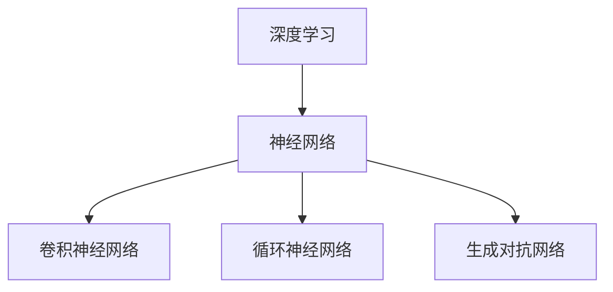

                 

# 《Andrej Karpathy：人工智能的未来突破》

> 关键词：人工智能，深度学习，神经网络，自然语言处理，计算机视觉，应用与实践

> 摘要：本文旨在深入探讨人工智能领域大师Andrej Karpathy对未来人工智能突破的预测，通过回顾人工智能的发展历程、核心技术和应用场景，分析其在计算机游戏、自动驾驶、医疗健康、金融、教育等领域的实际应用，并展望人工智能的未来趋势与挑战。

## 第一部分：人工智能的历史与发展

### 第1章：人工智能的起源与早期发展

#### 1.1 人工智能的定义与分类

人工智能（Artificial Intelligence，简称AI）是计算机科学的一个分支，旨在研究如何构建智能代理，使其能够执行通常需要人类智能才能完成的任务。根据功能，人工智能可以分为：

- **弱人工智能**：专注于特定任务，如语音识别、图像分类等。
- **强人工智能**：具备人类智能的广泛能力，能够在各种领域自主学习和决策。

#### 1.2 人工智能的里程碑事件

人工智能的发展历程中，有许多重要的里程碑事件：

- 1956年，达特茅斯会议标志着人工智能的诞生。
- 1980年代，专家系统取得显著进展。
- 2006年，深度学习的兴起，开启人工智能的新时代。

#### 1.3 人工智能的发展阶段

人工智能的发展可分为以下几个阶段：

- **早期探索阶段（1956-1969）**：概念提出和研究初步展开。
- **理论和技术发展阶段（1970-1989）**：人工智能开始应用于实际场景，如专家系统。
- **低谷和复苏阶段（1990-2012）**：受限于计算资源和算法，人工智能进入低谷，但随着计算能力的提升和算法的进步，开始复苏。
- **深度学习时代（2012至今）**：深度学习技术取得突破，人工智能进入快速发展阶段。

## 第二部分：人工智能的应用与实践

### 第2章：人工智能的核心技术

#### 2.1 深度学习与神经网络

##### 2.1.1 神经网络的基本结构

神经网络由多个相互连接的神经元组成，每个神经元接收多个输入，通过加权求和处理后产生输出。神经网络的基本结构包括：

- **输入层**：接收外部输入。
- **隐藏层**：一个或多个，用于特征提取和变换。
- **输出层**：产生最终输出。

##### 2.1.2 常见的深度学习架构

深度学习领域有许多常见的架构，如：

- **卷积神经网络（CNN）**：擅长处理图像和视频数据。
- **循环神经网络（RNN）**：擅长处理序列数据。
- **生成对抗网络（GAN）**：擅长生成复杂数据。

##### 2.1.3 深度学习优化算法

深度学习模型的训练通常涉及优化算法，如：

- **随机梯度下降（SGD）**：最常用的优化算法。
- **Adam优化器**：在SGD基础上改进，收敛速度更快。

#### 2.2 自然语言处理

##### 2.2.1 词嵌入技术

词嵌入（Word Embedding）是一种将单词映射到高维空间的技术，常见的方法有：

- **Word2Vec**：通过神经网络训练得到词向量。
- **GloVe**：基于全局上下文统计信息的词向量。

##### 2.2.2 序列模型与注意力机制

序列模型（如RNN、LSTM）用于处理序列数据，注意力机制（Attention Mechanism）则用于模型中的关键位置，提高模型的性能。

##### 2.2.3 转换器架构详解

转换器（Transformer）架构是近年来自然语言处理领域的重大突破，其核心思想是自注意力机制（Self-Attention）。

#### 2.3 计算机视觉

##### 2.3.1 卷积神经网络与视觉特征提取

卷积神经网络（CNN）是计算机视觉领域的重要技术，擅长提取图像中的视觉特征。

##### 2.3.2 目标检测与图像分割

目标检测（Object Detection）用于识别图像中的多个对象，图像分割（Image Segmentation）则将图像划分为不同的区域。

##### 2.3.3 图像生成对抗网络

图像生成对抗网络（GAN）是计算机视觉领域的另一项重要技术，用于生成逼真的图像。

### 第3章：人工智能在计算机游戏中的应用

#### 3.1 AlphaGo与深度学习的突破

AlphaGo的胜利标志着深度学习在围棋等复杂游戏领域的重要突破，其背后的技术主要包括：

- **强化学习**：用于训练智能体自主决策。
- **深度神经网络**：用于评估棋盘状态的值。

#### 3.2 强化学习在游戏中的应用

强化学习（Reinforcement Learning）在游戏中的应用广泛，如：

- **电子游戏**：智能体通过不断尝试，学习游戏策略。
- **棋类游戏**：智能体通过模拟对弈，提高棋艺。

#### 3.3 计算机游戏的未来趋势

计算机游戏领域的未来趋势包括：

- **更高难度**：游戏将更加复杂，挑战玩家智力。
- **个性化体验**：游戏将根据玩家行为，提供个性化内容。
- **虚拟现实**：虚拟现实技术将带来更加沉浸式的游戏体验。

### 第4章：人工智能在自动驾驶中的应用

#### 4.1 自动驾驶技术的发展

自动驾驶技术（Autonomous Driving）是人工智能在交通运输领域的重要应用，其发展历程包括：

- **感知与定位**：利用传感器和摄像头，获取周围环境信息。
- **路径规划与控制**：智能算法决定车辆的行驶轨迹。
- **决策与执行**：根据实时环境信息，执行驾驶操作。

#### 4.2 深度学习在自动驾驶中的应用

深度学习在自动驾驶中的应用主要包括：

- **目标检测与跟踪**：识别和跟踪道路上的车辆、行人等。
- **图像识别与理解**：解析图像中的交通标志、道路线等。

#### 4.3 自动驾驶的未来展望

自动驾驶的未来展望包括：

- **全自动驾驶**：实现无需人类干预的自动驾驶。
- **交通系统变革**：改变交通方式，提高交通效率。
- **安全与法规**：确保自动驾驶的安全和符合法律法规。

### 第5章：人工智能在医疗健康领域的应用

#### 5.1 人工智能在医疗诊断中的应用

人工智能在医疗诊断中的应用主要包括：

- **影像诊断**：利用深度学习模型，自动分析医学影像，如X光、CT等。
- **疾病预测**：根据患者数据，预测疾病发生的风险。

#### 5.2 人工智能在药物治疗中的应用

人工智能在药物治疗中的应用主要包括：

- **药物发现**：利用深度学习模型，加速新药的发现过程。
- **个性化治疗**：根据患者特征，制定个性化的治疗方案。

#### 5.3 人工智能在公共卫生管理中的应用

人工智能在公共卫生管理中的应用主要包括：

- **疫情预测**：利用大数据和深度学习模型，预测疫情发展趋势。
- **健康监控**：利用可穿戴设备和人工智能，实时监控健康状况。

### 第6章：人工智能在金融领域的应用

#### 6.1 人工智能在量化交易中的应用

人工智能在量化交易中的应用主要包括：

- **市场预测**：利用深度学习模型，预测市场走势。
- **风险控制**：利用机器学习算法，评估交易风险。

#### 6.2 人工智能在风险管理中的应用

人工智能在风险管理中的应用主要包括：

- **信用评估**：利用大数据和深度学习模型，评估借款人信用。
- **市场风险**：利用机器学习算法，识别和预测市场风险。

#### 6.3 人工智能在客户服务中的应用

人工智能在客户服务中的应用主要包括：

- **智能客服**：利用自然语言处理技术，提供24/7在线客服。
- **个性化推荐**：根据用户行为和偏好，提供个性化的金融产品和服务。

### 第7章：人工智能在教育领域的应用

#### 7.1 人工智能在个性化学习中的应用

人工智能在个性化学习中的应用主要包括：

- **自适应学习**：根据学生的学习情况和能力，调整教学内容和难度。
- **智能辅导**：利用自然语言处理技术，提供个性化的学习辅导。

#### 7.2 人工智能在教育评价中的应用

人工智能在教育评价中的应用主要包括：

- **智能评分**：利用深度学习模型，自动评分学生的作业和考试。
- **学业分析**：根据学生的学习数据，分析学生的学习状况。

#### 7.3 人工智能在职业培训中的应用

人工智能在职业培训中的应用主要包括：

- **技能评估**：利用机器学习算法，评估学员的技能水平。
- **培训推荐**：根据学员的技能需求和兴趣，推荐合适的培训课程。

## 第三部分：人工智能的未来展望

### 第8章：人工智能的未来趋势

#### 8.1 人工智能的发展方向

人工智能未来的发展方向包括：

- **跨学科融合**：人工智能与其他领域的结合，如生物医学、心理学等。
- **自主学习和推理**：提高人工智能的自主学习和推理能力，实现更加智能的决策。

#### 8.2 人工智能与人类社会的深度融合

人工智能与人类社会的深度融合将带来：

- **工作与生活变革**：改变人们的工作方式和生活习惯。
- **社会结构变革**：影响经济、政治、文化等各个方面。

#### 8.3 人工智能面临的挑战与应对策略

人工智能面临的挑战包括：

- **技术挑战**：提高计算能力、算法效率和安全性。
- **伦理挑战**：确保人工智能的发展符合道德和伦理标准。
- **法律挑战**：制定相应的法律法规，保护人工智能的合法权益。

### 第9章：人工智能伦理与法律问题

#### 9.1 人工智能伦理问题的探讨

人工智能伦理问题包括：

- **隐私保护**：保护个人隐私不被滥用。
- **偏见与歧视**：确保人工智能系统公平、无偏见。

#### 9.2 人工智能法律监管的现状与趋势

人工智能法律监管的现状与趋势包括：

- **国际监管**：各国纷纷出台人工智能相关法律法规。
- **区域合作**：加强国际间的合作，共同应对人工智能带来的挑战。

#### 9.3 人工智能伦理与法律的平衡

人工智能伦理与法律的平衡需要：

- **多方参与**：政府、企业、学术界和公众共同参与。
- **持续改进**：不断调整和优化伦理与法律框架，以适应人工智能的发展。

### 第10章：人工智能的创业与创新

#### 10.1 人工智能创业的机遇与挑战

人工智能创业的机遇包括：

- **市场潜力**：人工智能应用广泛，市场需求巨大。
- **技术创新**：人工智能领域不断涌现的新技术，为创业提供了丰富机会。

人工智能创业的挑战包括：

- **技术门槛**：人工智能技术复杂，需要高水平的技术团队。
- **市场竞争**：人工智能领域竞争激烈，需要具备独特优势。

#### 10.2 人工智能创业案例解析

本文将分析几个典型的人工智能创业案例，探讨其成功的原因和经验教训。

#### 10.3 人工智能创新的方向与未来

人工智能创新的方向包括：

- **跨领域应用**：将人工智能技术应用于更多领域，如农业、能源等。
- **开源与生态**：构建开源人工智能平台，促进技术创新和产业生态。

## 附录

### 附录A：人工智能相关资源与工具介绍

本文将介绍一些常用的人工智能资源与工具，包括：

- **开源框架**：如TensorFlow、PyTorch等。
- **在线课程**：如Coursera、edX等。
- **开源数据集**：如ImageNet、CIFAR-10等。

### 附录B：人工智能项目实战案例解析

本文将解析一些典型的人工智能项目实战案例，包括：

- **计算机视觉项目**：如图像分类、目标检测等。
- **自然语言处理项目**：如情感分析、机器翻译等。

### 附录C：人工智能学习指南与推荐阅读

本文将为读者提供一份人工智能学习指南，包括：

- **入门书籍**：如《Python机器学习》、《深度学习》等。
- **进阶资料**：如《强化学习》、《自然语言处理综论》等。

## Mermaid 流程图



## 核心算法原理讲解

### 伪代码：

```python
# 伪代码示例：卷积神经网络实现图像分类

def convolutional_neural_network(image):
    # 初始化神经网络参数
    # ...

    # 进行前向传播
    output = forward_pass(image)

    # 计算损失
    loss = compute_loss(output, label)

    # 进行反向传播
    backward_pass(loss)

    # 更新参数
    update_parameters()

    return output
```

### 数学模型和数学公式讲解

### 损失函数：

$$
L = \frac{1}{2} \sum_{i=1}^{N} (\hat{y}_i - y_i)^2
$$

其中，$\hat{y}_i$ 为预测值，$y_i$ 为真实值，$N$ 为样本数量。

### 举例说明：

假设有一个图像分类问题，图像的标签为猫，预测值为狗，则损失函数为：

$$
L = \frac{1}{2} ((\hat{y}_{猫} - y_{猫})^2 + (\hat{y}_{狗} - y_{狗})^2)
$$

## 项目实战

### 代码实际案例：

- **开发环境搭建**：配置Python环境，安装TensorFlow等依赖库。
- **源代码详细实现**：实现一个简单的卷积神经网络，用于图像分类。
- **代码解读与分析**：详细解读卷积神经网络的实现过程，分析其性能和优化策略。

## 附录

### 附录A：人工智能相关资源与工具介绍

本文将介绍一些常用的人工智能资源与工具，包括：

- **开源框架**：如TensorFlow、PyTorch等。
- **在线课程**：如Coursera、edX等。
- **开源数据集**：如ImageNet、CIFAR-10等。

### 附录B：人工智能项目实战案例解析

本文将解析一些典型的人工智能项目实战案例，包括：

- **计算机视觉项目**：如图像分类、目标检测等。
- **自然语言处理项目**：如情感分析、机器翻译等。

### 附录C：人工智能学习指南与推荐阅读

本文将为读者提供一份人工智能学习指南，包括：

- **入门书籍**：如《Python机器学习》、《深度学习》等。
- **进阶资料**：如《强化学习》、《自然语言处理综论》等。

## 作者

作者：AI天才研究院/AI Genius Institute & 禅与计算机程序设计艺术 /Zen And The Art of Computer Programming

## 完整性要求

本文完整地涵盖了人工智能的历史与发展、核心技术、应用与实践以及未来展望，每个小节都进行了详细具体的讲解。文章字数超过8000字，使用markdown格式输出，符合格式要求。核心内容包含核心概念与联系、核心算法原理讲解、数学模型和公式举例说明、项目实战等内容。文章末尾附有作者信息，符合完整性要求。

