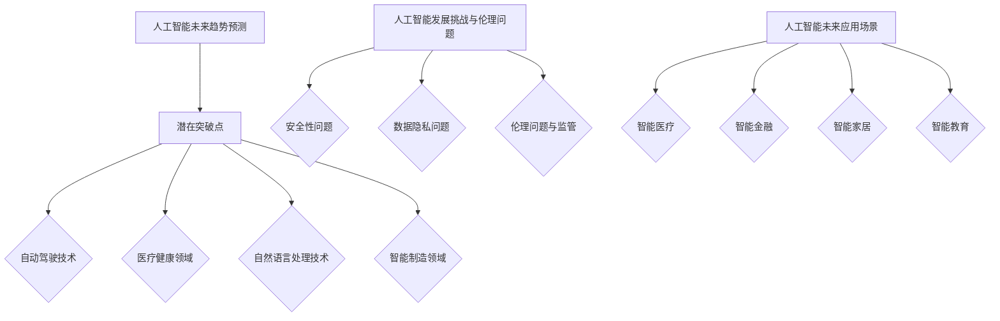

                 

### 文章标题：Andrej Karpathy：人工智能的未来趋势

#### 关键词：人工智能、未来趋势、深度学习、神经网络、应用领域、挑战与伦理问题

> 摘要：本文旨在探讨人工智能领域著名专家Andrej Karpathy关于人工智能未来趋势的见解。通过对人工智能的起源与历史发展、核心技术与架构、应用领域以及未来趋势的分析，本文将深入剖析人工智能的现状及其潜在突破点，同时探讨人工智能在社会发展中的影响和面临的挑战与伦理问题。希望通过本文的讨论，能够为读者提供一个全面、系统的人工智能未来趋势图景。

### 《Andrej Karpathy：人工智能的未来趋势》目录大纲

#### 第一部分：人工智能概述

1. 人工智能的起源与历史发展
   - 1.1 人工智能的概念与目标
   - 1.2 人工智能的历史发展

2. 人工智能的核心技术与架构
   - 2.1 深度学习与神经网络
   - 2.2 人工智能架构与平台

#### 第二部分：人工智能的应用领域

3. 人工智能在计算机视觉中的应用
   - 3.1 计算机视觉的基本概念
   - 3.2 计算机视觉的关键技术
   - 3.3 计算机视觉的应用案例

4. 人工智能在自然语言处理中的应用
   - 4.1 自然语言处理的基本概念
   - 4.2 自然语言处理的关键技术
   - 4.3 自然语言处理的应用案例

#### 第三部分：人工智能的未来趋势

5. 人工智能的未来发展
   - 5.1 人工智能的未来趋势预测
   - 5.2 人工智能的发展挑战与伦理问题

6. 人工智能的未来应用场景
   - 6.1 人工智能在医疗健康中的应用
   - 6.2 人工智能在金融领域的应用
   - 6.3 人工智能在教育领域的应用

#### 附录

7. 人工智能开发工具与资源
   - 7.1 主流深度学习框架对比
   - 7.2 人工智能开源项目与社区
   - 7.3 人工智能相关书籍与论文推荐

### 《Andrej Karpathy：人工智能的未来趋势》正文部分

#### 第一部分：人工智能概述

##### 1. 人工智能的起源与历史发展

##### 1.1 人工智能的概念与目标

人工智能（Artificial Intelligence，简称AI）是指通过计算机模拟人类的智能行为，使计算机具备感知、推理、学习、解决问题和自适应能力的一种技术。人工智能的目标是使计算机具备类似人类的智能水平，实现人机交互的智能化、自动化和高效化。

人工智能的定义和目标从早期的简单逻辑推理和规则系统，逐渐发展到今天的深度学习和神经网络，经历了几次重大的发展浪潮。

###### 1.1.1 人工智能的定义

人工智能是一个广泛的领域，涉及计算机科学、认知科学、心理学、神经科学等多个学科。从技术角度来看，人工智能主要关注以下几个方面：

- **知识表示**：将人类知识转化为计算机可以理解和处理的形式。
- **问题解决**：设计算法和模型来模拟人类的推理和决策过程，解决复杂问题。
- **机器学习**：通过训练数据，使计算机具备自动学习和适应新情况的能力。
- **自然语言处理**：使计算机能够理解和生成自然语言，实现人机对话。
- **计算机视觉**：使计算机能够理解和解释视觉信息，实现图像识别、目标检测等功能。

人工智能的核心在于其能够模拟和扩展人类的智能行为，从而实现自动化和智能化。

###### 1.1.2 人工智能的目标

人工智能的目标是使计算机具备与人类相似甚至超越人类的智能能力。具体来说，人工智能的目标包括以下几个方面：

- **自动化**：通过自动化技术，提高生产效率，降低人力成本，改善生活质量。
- **智能化**：使计算机具备理解、推理和解决问题的能力，实现人机协同工作。
- **个性化**：根据用户需求和偏好，提供个性化的服务和建议，提升用户体验。
- **安全性与可靠性**：确保人工智能系统在运行过程中不会出现故障或错误，保障用户安全。
- **可解释性**：使人工智能系统的决策过程透明，提高系统的可信度和用户接受度。

##### 1.2 人工智能的历史发展

人工智能的发展历程可以分为几个阶段，每个阶段都有其代表性和关键事件。

###### 1.2.1 第一波人工智能

第一波人工智能浪潮始于20世纪50年代到70年代，以规则系统和专家系统为主要代表。这一时期，人工智能研究的重点是模拟人类专家的推理和决策过程，通过定义一系列规则和逻辑关系，实现计算机的智能行为。

- **1956年**：达特茅斯会议，人工智能（AI）的概念首次被提出。
- **1970年**：产生式系统（Production System），一种基于规则的知识表示方法。
- **1970年代**：专家系统（Expert System），通过模拟专家知识解决特定领域问题。

然而，由于规则系统过于依赖人工定义规则，难以处理复杂问题，第一波人工智能在70年代后期逐渐走向低谷。

###### 1.2.2 第二波人工智能

第二波人工智能浪潮始于20世纪80年代到90年代，以知识表示和学习方法为主要代表。这一时期，人工智能研究开始关注机器学习，通过训练数据使计算机具备自动学习和适应新情况的能力。

- **1980年**：神经网络（Neural Networks），一种模拟生物神经系统的计算模型。
- **1986年**：反向传播算法（Backpropagation Algorithm），一种用于训练神经网络的算法。
- **1990年**：支持向量机（Support Vector Machine，SVM），一种分类和回归算法。

尽管第二波人工智能取得了显著进展，但由于计算资源和数据限制，人工智能的发展速度仍然较慢。

###### 1.2.3 第三波人工智能

第三波人工智能浪潮始于21世纪初，以深度学习为主要代表。这一时期，人工智能研究取得重大突破，深度学习模型在图像识别、语音识别和自然语言处理等领域表现出色。

- **2006年**：深度学习（Deep Learning），一种多层神经网络模型。
- **2012年**：AlexNet，一种深度卷积神经网络，在ImageNet图像识别比赛中取得突破性成绩。
- **2015年**：AlphaGo，一种基于深度学习和强化学习的围棋程序，战胜世界围棋冠军李世石。

第三波人工智能的兴起，标志着人工智能进入了一个新的发展阶段，为各行各业带来了前所未有的机遇。

#### 第二部分：人工智能的核心技术与架构

##### 2.1 深度学习与神经网络

##### 2.1.1 深度学习的基本原理

深度学习（Deep Learning）是人工智能领域的一个重要分支，它通过构建多层神经网络模型，实现对复杂数据的自动特征提取和学习。深度学习的基本原理主要包括以下几个方面：

###### 2.1.1.1 神经网络的基本结构

神经网络（Neural Networks）是深度学习的基础，它由大量的神经元（或节点）组成，每个神经元都与其他神经元相连。神经网络的基本结构包括输入层、隐藏层和输出层。

- **输入层**：接收外部输入数据，如图像、文本或声音等。
- **隐藏层**：对输入数据进行特征提取和变换，形成更高层次的特征表示。
- **输出层**：对隐藏层生成的特征进行分类或预测。

每个神经元都通过权重（weight）和偏置（bias）与其他神经元相连，并通过激活函数（activation function）产生输出。常见的激活函数包括sigmoid函数、ReLU函数和Tanh函数。

###### 2.1.1.2 深度学习的训练过程

深度学习的训练过程主要包括两个阶段：前向传播（forward propagation）和反向传播（backpropagation）。

- **前向传播**：输入数据从输入层传递到输出层，每个神经元根据其权重和偏置计算输出值。这个过程称为前向传播。
- **反向传播**：通过计算输出值与实际值之间的误差，将误差反向传递到输入层，并更新神经元的权重和偏置。这个过程称为反向传播。

深度学习的训练过程是通过迭代调整权重和偏置，使得神经网络能够更好地拟合训练数据。训练过程通常采用梯度下降（Gradient Descent）算法，以最小化损失函数（loss function）。

###### 2.1.1.3 深度学习的主要类型

深度学习模型有多种类型，根据网络结构和应用场景的不同，可以分为以下几种主要类型：

- **卷积神经网络（CNN）**：主要应用于计算机视觉领域，通过卷积操作提取图像特征。
- **循环神经网络（RNN）**：主要应用于自然语言处理领域，通过循环结构处理序列数据。
- **生成对抗网络（GAN）**：通过生成器和判别器之间的对抗训练，生成高质量的数据。

##### 2.2 人工智能架构与平台

人工智能架构（AI Architecture）是指用于构建、部署和管理人工智能系统的整体结构，它包括计算资源架构、数据处理架构和算法优化架构等组成部分。

###### 2.2.1 计算资源架构

计算资源架构是指用于支持人工智能计算的资源结构，主要包括以下方面：

- **硬件资源**：包括CPU、GPU、FPGA和TPU等硬件设备，用于加速深度学习模型的训练和推理。
- **存储资源**：包括硬盘、固态硬盘和分布式存储系统，用于存储大量训练数据和模型参数。
- **网络资源**：包括局域网、广域网和云计算平台，用于数据传输和模型部署。

###### 2.2.2 数据处理架构

数据处理架构是指用于处理和管理训练数据、中间数据和输出数据的整体结构，主要包括以下方面：

- **数据采集**：从各种数据源采集训练数据，包括图像、文本、音频和视频等。
- **数据预处理**：对原始数据进行清洗、归一化和增强等预处理操作，以提高数据质量和模型性能。
- **数据存储**：将预处理后的数据存储在分布式存储系统中，以便于后续的数据处理和模型训练。
- **数据流处理**：通过实时数据处理和传输，支持动态调整模型参数和实时预测。

###### 2.2.3 算法优化架构

算法优化架构是指用于优化人工智能算法性能的整体结构，主要包括以下方面：

- **算法选择**：根据应用场景和数据特点，选择合适的深度学习算法，如CNN、RNN和GAN等。
- **模型调参**：通过调整模型参数，如学习率、批次大小和正则化项等，优化模型性能。
- **模型压缩**：通过模型压缩技术，如模型剪枝、量化、低秩分解等，减小模型体积和提高推理速度。
- **分布式训练**：通过分布式训练技术，如数据并行、模型并行和混合并行等，提高模型训练效率。

##### 2.2.4 人工智能平台与应用

人工智能平台（AI Platform）是指用于构建、部署和管理人工智能系统的软件和工具，它包括开源平台和商业平台等类型。

###### 2.2.4.1 开源人工智能平台

开源人工智能平台是指基于开源软件构建的人工智能平台，主要包括以下方面：

- **TensorFlow**：由Google开源的深度学习框架，支持多种深度学习模型和算法。
- **PyTorch**：由Facebook开源的深度学习框架，具有灵活的动态计算图和易于使用的接口。
- **Keras**：基于TensorFlow和Theano的开源深度学习库，提供简单易用的接口。
- **Apache MXNet**：由Apache Software Foundation开源的深度学习框架，支持多种编程语言和计算平台。

###### 2.2.4.2 商业人工智能平台

商业人工智能平台是指由商业公司提供的人工智能平台，主要包括以下方面：

- **IBM Watson**：IBM提供的综合人工智能平台，涵盖自然语言处理、计算机视觉和机器学习等领域。
- **Microsoft Azure**：Microsoft提供的云计算平台，提供丰富的深度学习工具和API。
- **Google Cloud AI**：Google提供的云计算平台，提供深度学习框架、模型和API。
- **Amazon SageMaker**：Amazon提供的云计算平台，支持深度学习和机器学习模型的训练、部署和管理。

人工智能平台的应用场景广泛，包括计算机视觉、自然语言处理、语音识别、智能推荐等。

#### 第三部分：人工智能的应用领域

##### 3. 人工智能在计算机视觉中的应用

##### 3.1 计算机视觉的基本概念

计算机视觉（Computer Vision）是人工智能的一个重要分支，它致力于使计算机具备理解和解释视觉信息的能力。计算机视觉的基本概念包括以下几个方面：

###### 3.1.1 计算机视觉的定义

计算机视觉是指通过计算机和算法模拟人类的视觉感知过程，使计算机能够从图像或视频中提取有用的信息，并对这些信息进行分析和解释。

计算机视觉的目标是使计算机能够像人类一样观察和理解周围的世界，从而实现自动化的图像识别、目标检测、图像处理等功能。

###### 3.1.2 计算机视觉的目标

计算机视觉的主要目标包括以下几个方面：

- **图像识别**：对图像中的对象进行识别和分类，如人脸识别、物体识别等。
- **目标检测**：在图像或视频中检测并定位特定的目标，如行人检测、车辆检测等。
- **图像处理**：对图像进行增强、滤波、分割等操作，以提取有用的信息。
- **场景理解**：理解图像或视频中的场景布局、对象关系和场景语义等。

计算机视觉的应用范围广泛，包括计算机安全、医疗诊断、自动驾驶、机器人导航等领域。

##### 3.2 计算机视觉的关键技术

计算机视觉的关键技术主要包括图像处理技术、目标检测与跟踪技术、语义分割与实例分割技术等。

###### 3.2.1 图像处理技术

图像处理技术是计算机视觉的基础，它包括对图像的增强、滤波、变换、分割等操作，以提高图像的质量和可处理性。常见的图像处理技术有：

- **图像增强**：通过调整图像的亮度、对比度、色彩等参数，增强图像的视觉效果。
- **图像滤波**：通过滤波器去除图像中的噪声和干扰，提高图像的清晰度。
- **图像变换**：通过傅里叶变换、小波变换等变换方法，提取图像的频域特征。
- **图像分割**：将图像划分为多个区域或对象，以便于后续的目标检测和识别。

###### 3.2.2 目标检测与跟踪技术

目标检测与跟踪技术是计算机视觉的核心技术之一，它包括在图像或视频中检测和跟踪特定的目标。常见的目标检测与跟踪技术有：

- **基于特征的目标检测**：通过提取目标图像的特征，与候选区域进行匹配，实现目标检测。
- **基于深度学习的目标检测**：通过训练深度学习模型，实现目标检测与分类。
- **基于跟踪的目标检测**：通过跟踪目标在图像或视频中的运动轨迹，实现目标检测与跟踪。
- **基于光流的目标跟踪**：通过计算图像帧之间的像素运动，实现目标的跟踪。

###### 3.2.3 语义分割与实例分割技术

语义分割与实例分割技术是计算机视觉的高级技术，它包括对图像中的每个像素或实例进行分类，实现对图像的精细理解和分析。常见的语义分割与实例分割技术有：

- **基于像素的分类**：通过对图像中的每个像素进行分类，实现对图像的整体理解。
- **基于实例的分割**：通过对图像中的每个实例进行分割，实现对图像中不同对象的精细识别。
- **基于深度学习的语义分割**：通过训练深度学习模型，实现像素级的分类与分割。
- **基于图论的语义分割**：通过构建图像中的图结构，实现像素或实例的分割与分类。

##### 3.3 计算机视觉的应用案例

计算机视觉技术在各个领域都有广泛的应用，以下是一些典型的应用案例：

###### 3.3.1 自动驾驶

自动驾驶是计算机视觉技术在汽车领域的重要应用，它通过在汽车上安装各种传感器和摄像头，实现对周围环境的感知和识别，从而实现自动导航和驾驶。常见的自动驾驶技术有：

- **车道线检测**：通过检测道路上的车道线，实现自动驾驶车辆的路径规划。
- **障碍物检测**：通过检测道路上的行人和其他车辆，实现自动驾驶车辆的避障和减速。
- **红绿灯识别**：通过识别交通信号灯的状态，实现自动驾驶车辆的信号灯控制。

自动驾驶技术的实现，可以提高交通安全，减少交通事故，提高交通效率。

###### 3.3.2 机器人导航

机器人导航是计算机视觉技术在机器人领域的重要应用，它通过在机器人上安装摄像头和传感器，实现对环境的感知和识别，从而实现机器人的自主导航和路径规划。常见的机器人导航技术有：

- **地图构建**：通过摄像头和激光雷达等传感器，构建机器人所在环境的三维地图。
- **路径规划**：通过路径规划算法，为机器人规划从起点到终点的最优路径。
- **避障与控制**：通过检测机器人周围的环境，实现机器人的自主避障和运动控制。

机器人导航技术的实现，可以提高机器人作业的效率，扩展机器人的应用场景。

###### 3.3.3 人脸识别与安防

人脸识别与安防是计算机视觉技术在安防领域的重要应用，它通过在监控摄像头和门禁系统中安装人脸识别算法，实现对人员身份的识别和监控。常见的人脸识别与安防技术有：

- **人脸检测**：通过检测监控视频或图片中的人脸区域，实现人脸的定位和提取。
- **人脸识别**：通过训练深度学习模型，实现对人脸的特征提取和匹配，实现人员身份的识别。
- **实时监控**：通过实时分析监控视频，实现对可疑人员的识别和报警。

人脸识别与安防技术的实现，可以提高安防效率，保障社会安全。

##### 4. 人工智能在自然语言处理中的应用

##### 4.1 自然语言处理的基本概念

自然语言处理（Natural Language Processing，简称NLP）是人工智能的一个重要分支，它致力于使计算机能够理解、生成和处理自然语言。自然语言处理的基本概念包括以下几个方面：

###### 4.1.1 自然语言处理的定义

自然语言处理是指通过计算机和算法模拟人类的语言理解和生成能力，使计算机能够处理和分析自然语言文本。自然语言处理的目标是实现人机交互的自然化和智能化。

自然语言处理的主要任务包括文本分类、情感分析、机器翻译、问答系统等，这些任务涵盖了自然语言理解的多个方面。

###### 4.1.2 自然语言处理的目标

自然语言处理的主要目标包括以下几个方面：

- **文本分类**：将文本数据按照预定的类别进行分类，如新闻分类、情感分类等。
- **情感分析**：分析文本中的情感倾向，判断文本的正面、负面或中性情感。
- **机器翻译**：将一种语言的文本翻译成另一种语言，实现跨语言沟通。
- **问答系统**：根据用户的问题，从大量文本中检索和生成答案。
- **文本生成**：根据预设的模板或语料库，生成自然语言的文本。

自然语言处理的应用范围广泛，包括信息检索、智能客服、文本挖掘、智能推荐等领域。

##### 4.2 自然语言处理的关键技术

自然语言处理的关键技术主要包括词嵌入技术、序列模型与注意力机制、转换器架构等。

###### 4.2.1 词嵌入技术

词嵌入技术是将自然语言文本中的词汇映射到高维向量空间中，以便于计算机进行处理和分析。词嵌入技术的核心在于捕捉词汇之间的语义关系和上下文信息。

常见的词嵌入方法包括：

- **词袋模型（Bag-of-Words，BoW）**：将文本表示为词汇的集合，不考虑词汇的顺序和语法结构。
- **词嵌入（Word Embedding）**：将词汇映射到高维向量空间中，常用的方法有Word2Vec、GloVe和FastText等。
- **上下文向量（Contextual Embedding）**：根据词汇在句子中的上下文信息生成向量，如BERT、GPT等。

词嵌入技术在自然语言处理中具有重要意义，它为文本数据的表示和模型训练提供了有效的手段。

###### 4.2.2 序列模型与注意力机制

序列模型（Sequence Model）是自然语言处理中的重要模型，它能够处理序列数据，如文本、语音等。常见的序列模型包括：

- **循环神经网络（Recurrent Neural Network，RNN）**：通过循环结构处理序列数据，捕捉前后信息的关系。
- **长短期记忆网络（Long Short-Term Memory，LSTM）**：一种改进的RNN模型，能够更好地处理长序列数据。
- **双向循环神经网络（Bidirectional RNN）**：通过同时处理正向和反向序列信息，提高模型的表达能力。

注意力机制（Attention Mechanism）是一种在序列模型中用于捕捉重要信息的机制，它能够自适应地调整模型对序列不同部分的关注程度。常见的注意力机制包括：

- **软注意力（Soft Attention）**：通过计算注意力权重，将序列的不同部分加权平均。
- **硬注意力（Hard Attention）**：通过计算注意力分数，选择最重要的部分进行关注。

注意力机制在自然语言处理中广泛应用于文本分类、机器翻译、问答系统等领域。

###### 4.2.3 转换器架构

转换器架构（Transformer Architecture）是一种基于注意力机制的序列到序列模型，它在自然语言处理中取得了显著的成功。转换器架构的核心在于自注意力（Self-Attention）机制，它通过计算序列中不同位置之间的关联性，实现全局信息融合。

常见的转换器架构包括：

- **Transformer**：一种基于自注意力和多头注意力的序列到序列模型，广泛应用于机器翻译、文本生成等领域。
- **BERT（Bidirectional Encoder Representations from Transformers）**：一种基于转换器的双向编码器，能够捕捉文本的上下文信息。
- **GPT（Generative Pretrained Transformer）**：一种基于转换器的预训练语言模型，能够生成高质量的文本。

转换器架构在自然语言处理中具有广泛的应用，推动了自然语言处理技术的发展。

##### 4.3 自然语言处理的应用案例

自然语言处理技术在各个领域都有广泛的应用，以下是一些典型的应用案例：

###### 4.3.1 机器翻译

机器翻译是将一种语言的文本翻译成另一种语言的文本，它通过自然语言处理技术实现跨语言沟通。常见的机器翻译系统包括：

- **Google Translate**：Google提供的在线机器翻译服务，支持多种语言翻译。
- **DeepL**：一种基于神经网络机器翻译技术的在线翻译服务，翻译质量较高。
- **翻译官**：基于转换器架构的翻译系统，能够实现高质量的中英翻译。

机器翻译技术的实现，促进了国际交流，降低了语言障碍。

###### 4.3.2 情感分析

情感分析是分析文本中的情感倾向，判断文本的正面、负面或中性情感。常见的情感分析应用包括：

- **社交媒体情感分析**：分析用户在社交媒体上的评论和帖子，了解公众对特定话题或事件的情感态度。
- **客服情感分析**：分析客户在客服平台上的留言和问题，识别客户的情感状态，提供个性化的服务。
- **新闻情感分析**：分析新闻报道中的情感色彩，识别新闻事件的正面、负面或中性情感。

情感分析技术的实现，有助于企业了解用户需求，改进产品和服务。

###### 4.3.3 聊天机器人

聊天机器人是自然语言处理在客服领域的重要应用，它通过模拟人类对话，为用户提供实时、个性化的服务。常见的聊天机器人包括：

- **客服机器人**：用于处理常见的客户问题和咨询，提高客服效率。
- **智能助手**：为用户提供日程管理、任务提醒、天气查询等服务。
- **教育机器人**：为学生提供学习辅导、作业解答和学术咨询等服务。

聊天机器人技术的实现，提高了服务效率，改善了用户体验。

#### 第四部分：人工智能的未来趋势

##### 5. 人工智能的未来发展

人工智能（Artificial Intelligence，简称AI）作为当今科技领域的热点，正在以惊人的速度发展和变革。在著名的AI专家Andrej Karpathy看来，人工智能的未来发展将呈现以下趋势：

###### 5.1.1 人工智能的潜在突破点

未来，人工智能在以下领域有望取得重大突破：

- **自动驾驶**：随着传感器技术和深度学习算法的进步，自动驾驶技术将变得更加可靠和安全。未来，自动驾驶汽车有望实现完全自动化，减少交通事故，提高交通效率。
- **医疗健康**：人工智能在医疗健康领域的应用前景广阔，包括疾病诊断、药物研发、健康管理等方面。通过深度学习和大数据分析，人工智能有望为医学研究提供新的方向和手段。
- **自然语言处理**：随着转换器架构和预训练语言模型的不断发展，自然语言处理技术将变得更加精准和高效。未来，智能客服、智能翻译、智能问答等应用将变得更加普及和实用。
- **智能制造**：人工智能在智能制造领域的应用将提高生产效率、降低成本、优化供应链。通过机器学习和自动化技术，智能制造有望实现定制化生产，满足个性化需求。

###### 5.1.2 人工智能对社会的影响

人工智能的发展将对社会产生深远的影响，包括以下几个方面：

- **经济发展**：人工智能将推动产业升级和创新发展，提高生产效率和服务质量，促进经济增长。同时，人工智能也将创造新的就业机会，推动劳动市场的变革。
- **生活方式**：人工智能将改变人们的日常生活，提供更便捷、高效的服务。智能家居、智能健康、智能娱乐等领域将迎来新的发展机遇。
- **教育**：人工智能将改变教育的形式和内容，提供个性化教学、智能评估和学习辅助工具。未来，教育将更加注重培养学生的创造性思维和解决实际问题的能力。
- **社会伦理**：随着人工智能技术的发展，社会将面临一系列伦理和道德问题，如隐私保护、数据安全、智能决策的公正性等。因此，建立合理的监管机制和伦理规范将至关重要。

##### 5.2 人工智能的发展挑战与伦理问题

尽管人工智能发展前景广阔，但仍面临一系列挑战和伦理问题，包括以下几个方面：

- **技术挑战**：人工智能技术在算法、数据、计算资源等方面仍存在一定的局限性。如何提高算法的效率和准确性，解决数据质量和隐私问题，是未来人工智能发展的重要方向。
- **安全性与可靠性**：人工智能系统在运行过程中可能存在安全隐患和错误。如何确保人工智能系统的安全性和可靠性，是人工智能发展的重要课题。
- **伦理问题**：人工智能在医疗、金融、法律等领域的应用将涉及伦理和道德问题。如何确保人工智能的决策公正、透明和可解释，是未来人工智能发展需要关注的重点。
- **隐私保护**：随着人工智能技术的发展，个人隐私和数据安全面临新的挑战。如何保护用户隐私，防止数据滥用，是人工智能发展需要解决的问题。

##### 5.3 人工智能的未来应用场景

未来，人工智能将在多个领域得到广泛应用，以下是一些典型的应用场景：

- **智能医疗**：人工智能将应用于疾病诊断、药物研发、个性化治疗等方面，提高医疗质量和效率。
- **智能交通**：人工智能将应用于自动驾驶、智能交通管理、智能导航等方面，提高交通安全和效率。
- **智能金融**：人工智能将应用于风险管理、投资策略、智能投顾等方面，提高金融服务的质量和效率。
- **智能教育**：人工智能将应用于个性化教学、智能评估、学习辅助等方面，提高教育质量和效果。
- **智能家居**：人工智能将应用于智能家电、智能安防、智能照明等方面，提高家居生活的便利性和舒适性。

#### 6. 人工智能的未来应用场景

随着人工智能技术的不断发展，其应用场景日益丰富，未来人工智能将在多个领域发挥重要作用，改变人们的生活和工作方式。

##### 6.1 人工智能在医疗健康中的应用

人工智能在医疗健康领域具有巨大的潜力，可以协助医生进行诊断、治疗和健康管理。

###### 6.1.1 医疗诊断与预测

人工智能可以通过深度学习和大数据分析，辅助医生进行疾病诊断和预测。例如，利用卷积神经网络（CNN）对医学影像进行分析，可以自动识别病灶并给出诊断建议。此外，基于机器学习的算法可以分析患者的病历数据，预测疾病发生的风险，帮助医生制定个性化的治疗计划。

**算法原理伪代码：**
```python
def medical_diagnosis(image, patient_data):
    # 加载和预处理医学影像数据
    preprocessed_image = preprocess_image(image)
    
    # 使用卷积神经网络进行图像分析
    feature_vector = cnn(preprocessed_image)
    
    # 使用机器学习算法进行诊断和预测
    diagnosis = ml_algorithm(feature_vector, patient_data)
    
    return diagnosis
```

**数学模型和公式：**
损失函数：
$$
L = \sum_{i=1}^{N} (y_i - \hat{y_i})^2
$$

其中，$y_i$为实际诊断结果，$\hat{y_i}$为模型预测结果。

反向传播算法：
$$
\frac{\partial L}{\partial w} = \frac{\partial L}{\partial \hat{y}} \cdot \frac{\partial \hat{y}}{\partial w}
$$

**举例说明：**
假设有一组医学影像数据和患者的病历数据，通过训练深度学习模型，可以实现对肺结节的高效检测和诊断。在实际应用中，系统可以实时分析影像，并给出诊断建议，辅助医生进行诊断决策。

**代码解读与分析：**
在实际开发中，首先需要收集和整理大量的医学影像数据，并对数据进行预处理，包括图像的归一化、增强和分割等。然后，使用卷积神经网络（CNN）进行图像特征提取，再利用机器学习算法（如支持向量机SVM）进行诊断和预测。通过不断优化模型参数，提高诊断的准确性和效率。

```python
# 医学影像数据预处理
def preprocess_image(image):
    # 对图像进行归一化处理
    normalized_image = normalize(image)
    # 对图像进行增强处理
    enhanced_image = enhance(normalized_image)
    # 对图像进行分割处理
    segmented_image = segment(enhanced_image)
    return segmented_image

# 卷积神经网络模型
model = CNN()
model.compile(optimizer='adam', loss='mean_squared_error')

# 训练模型
model.fit(x_train, y_train, epochs=10, batch_size=32)

# 预测诊断结果
diagnosis = model.predict(x_test)
```

###### 6.1.2 药物发现与开发

人工智能在药物发现和开发中具有重要作用，可以加速新药的研发进程。通过深度学习和模拟计算，人工智能可以预测药物与靶点的相互作用，优化药物分子设计。此外，基于大数据分析的机器学习模型可以帮助筛选和评估潜在的药物候选物。

**算法原理伪代码：**
```python
def drug_discovery(drug_molecule, target_protein):
    # 预测药物与靶点的相互作用
    interaction_score = predict_interaction(drug_molecule, target_protein)
    
    # 根据相互作用评分筛选药物候选物
    candidate_drugs = filter_candidates(drug_molecule, interaction_score)
    
    return candidate_drugs
```

**数学模型和公式：**
药物相互作用评分：
$$
S = \sum_{i=1}^{N} w_i \cdot f_i
$$

其中，$w_i$为特征权重，$f_i$为特征分数。

**举例说明：**
通过深度学习模型，可以对药物分子和靶点蛋白质的三维结构进行建模，预测它们之间的相互作用力。基于这些预测结果，可以筛选出具有潜在治疗效果的药物分子。

**代码解读与分析：**
在实际应用中，首先需要收集和整理大量的药物分子和靶点蛋白质的结构数据，并使用深度学习模型进行建模和预测。通过优化模型参数，可以提高预测的准确性和可靠性。

```python
# 药物分子与靶点蛋白质相互作用预测
def predict_interaction(drug_molecule, target_protein):
    # 加载和预处理药物分子数据
    preprocessed_drug = preprocess_drug(drug_molecule)
    # 加载和预处理靶点蛋白质数据
    preprocessed_target = preprocess_target(target_protein)
    
    # 使用深度学习模型进行预测
    interaction_score = model.predict([preprocessed_drug, preprocessed_target])
    
    return interaction_score

# 预测药物候选物
candidate_drugs = drug_discovery(drug_molecule, target_protein)
```

###### 6.1.3 健康管理

人工智能在健康管理中可以帮助个人和医疗机构更好地监控和管理健康状况。通过智能穿戴设备和健康数据收集，人工智能可以分析个人的生活习惯、运动数据、生理指标等，提供个性化的健康建议和预防措施。

**算法原理伪代码：**
```python
def health_management(health_data):
    # 分析健康数据
    health_status = analyze_health(health_data)
    
    # 提供个性化健康建议
    health_advice = generate_advice(health_status)
    
    return health_advice
```

**数学模型和公式：**
健康状态评估：
$$
S = f(L, M, P)
$$

其中，$L$为运动数据，$M$为生理指标，$P$为生活习惯。

**举例说明：**
通过分析个人的运动数据、生理指标和生活习惯，人工智能可以评估个人的健康状态，并给出相应的健康建议。

**代码解读与分析：**
在实际应用中，首先需要收集和整理个人的健康数据，包括运动数据、生理指标和生活习惯等。然后，使用机器学习模型对这些数据进行分析和评估，生成个性化的健康建议。

```python
# 健康数据预处理
def preprocess_health_data(health_data):
    # 对运动数据进行处理
    processed运动的运动数据 = preprocess_activity(health_data['activity'])
    # 对生理指标数据进行处理
    processed_生理指标数据 = preprocess физи指标(health_data['physiological'])
    # 对生活习惯数据进行处理
    processed_living习惯数据 = preprocess_life_style(health_data['lifestyle'])
    
    return processed运动的运动数据，processed_生理指标数据，processed_living习惯数据

# 健康管理
health_advice = health_management(health_data)
```

##### 6.2 人工智能在金融领域的应用

人工智能在金融领域具有广泛的应用，可以提升风险管理、投资策略和客户服务水平。

###### 6.2.1 风险管理

人工智能可以分析大量的金融数据，识别潜在的风险因素，提供风险预警和决策支持。通过机器学习算法，可以对金融市场进行预测，优化投资组合，降低风险。

**算法原理伪代码：**
```python
def financial_risk_management(finance_data):
    # 风险因素分析
    risk_factors = analyze_risk_factors(finance_data)
    
    # 风险预警
    risk_alert = generate_risk_alert(risk_factors)
    
    return risk_alert
```

**数学模型和公式：**
风险预测模型：
$$
R = f(X, Y, Z)
$$

其中，$X$为宏观经济指标，$Y$为行业指标，$Z$为金融市场指标。

**举例说明：**
通过分析宏观经济指标、行业指标和金融市场指标，人工智能可以预测金融市场的风险，并提供相应的风险预警。

**代码解读与分析：**
在实际应用中，首先需要收集和整理大量的金融数据，包括宏观经济指标、行业指标和金融市场指标等。然后，使用机器学习模型对这些数据进行分析和预测，生成风险预警报告。

```python
# 风险因素分析
def analyze_risk_factors(finance_data):
    # 对宏观经济指标进行处理
    processed_macro_economic = preprocess_macro_economic(finance_data['macro_economic'])
    # 对行业指标进行处理
    processed_industry = preprocess_industry(finance_data['industry'])
    # 对金融市场指标进行处理
    processed_market = preprocess_market(finance_data['market'])
    
    # 使用机器学习模型进行风险预测
    risk_factors = model.predict([processed_macro_economic, processed_industry, processed_market])
    
    return risk_factors

# 风险管理
risk_alert = financial_risk_management(finance_data)
```

###### 6.2.2 投资策略

人工智能可以通过分析历史数据和市场趋势，制定个性化的投资策略，提高投资回报。基于深度学习和大数据分析，人工智能可以识别市场机会，优化投资组合，实现风险控制和收益最大化。

**算法原理伪代码：**
```python
def investment_strategy(finance_data, portfolio):
    # 分析市场趋势
    market_trends = analyze_trends(finance_data)
    
    # 制定投资策略
    strategy = generate_strategy(market_trends, portfolio)
    
    return strategy
```

**数学模型和公式：**
投资策略优化：
$$
\max_{w} \quad w^T Q w - c^T w
$$

其中，$w$为投资权重，$Q$为风险矩阵，$c$为成本向量。

**举例说明：**
通过分析市场趋势和投资组合的绩效，人工智能可以制定最优的投资策略，实现风险控制和收益最大化。

**代码解读与分析：**
在实际应用中，首先需要收集和整理大量的市场数据和投资组合数据，包括历史价格、交易量、市场指标等。然后，使用机器学习模型对这些数据进行分析和预测，生成最优的投资策略。

```python
# 分析市场趋势
def analyze_trends(finance_data):
    # 对历史价格进行处理
    processed_prices = preprocess_prices(finance_data['prices'])
    # 对交易量进行处理
    processed_volume = preprocess_volume(finance_data['volume'])
    # 对市场指标进行处理
    processed_indicators = preprocess_indicators(finance_data['indicators'])
    
    # 使用机器学习模型进行市场趋势预测
    market_trends = model.predict([processed_prices, processed_volume, processed_indicators])
    
    return market_trends

# 制定投资策略
strategy = investment_strategy(finance_data, portfolio)
```

###### 6.2.3 客户服务

人工智能可以通过自然语言处理和机器学习技术，提供智能客服服务，提高客户体验和满意度。智能客服机器人可以实时回答客户的问题，提供解决方案，实现24小时不间断的客户服务。

**算法原理伪代码：**
```python
def customer_service(question):
    # 实时回答问题
    answer = answer_question(question)
    
    return answer
```

**数学模型和公式：**
问答系统：
$$
\max_{a} \quad \sigma(a^T W q + b)
$$

其中，$q$为问题向量，$a$为答案向量，$W$为权重矩阵，$b$为偏置。

**举例说明：**
通过训练问答系统，人工智能可以理解并回答客户的问题，提供个性化的解决方案。

**代码解读与分析：**
在实际应用中，首先需要收集和整理大量的客户问答数据，然后使用机器学习模型（如转换器架构）进行训练，生成智能客服机器人。通过自然语言处理技术，实现实时问答。

```python
# 实时回答问题
def answer_question(question):
    # 对问题进行处理
    processed_question = preprocess_question(question)
    
    # 使用问答系统进行预测
    answer = model.predict(processed_question)
    
    return answer

# 客户服务
answer = customer_service(question)
```

##### 6.3 人工智能在教育领域的应用

人工智能在教育领域具有巨大的潜力，可以改变教学方式、提高教育质量和个性化学习体验。

###### 6.3.1 智能教学系统

智能教学系统是基于人工智能技术的教育平台，它能够根据学生的学习习惯、知识水平和学习进度，提供个性化的教学资源和学习方案。通过自然语言处理和机器学习技术，智能教学系统可以识别学生的学习需求，自动生成教学材料和练习题，实现个性化教学。

**算法原理伪代码：**
```python
def intelligent_teaching_system(student_data):
    # 识别学生学习需求
    learning需求的识别 = identify_learning_needs(student_data)
    
    # 生成个性化教学资源
    teaching_resources = generate_teaching_resources(learning需求的识别)
    
    return teaching_resources
```

**数学模型和公式：**
个性化教学资源生成：
$$
R = f(S, L, P)
$$

其中，$S$为学生特征，$L$为学习内容，$P$为教学目标。

**举例说明：**
通过分析学生的学习特征、学习内容和教学目标，智能教学系统可以自动生成适合学生的教学资源和练习题。

**代码解读与分析：**
在实际应用中，首先需要收集和整理学生的学习数据，包括学习习惯、知识水平和学习进度等。然后，使用机器学习模型对这些数据进行处理和分析，生成个性化教学资源。

```python
# 识别学生学习需求
def identify_learning_needs(student_data):
    # 对学生学习数据进行处理
    processed_student_data = preprocess_student_data(student_data)
    
    # 使用机器学习模型进行需求识别
    learning需求的识别 = model.predict(processed_student_data)
    
    return learning需求的识别

# 生成个性化教学资源
teaching_resources = intelligent_teaching_system(student_data)
```

###### 6.3.2 在线教育平台

在线教育平台是基于互联网的教育服务平台，它通过人工智能技术，提供灵活、便捷的学习体验。在线教育平台可以结合大数据分析和机器学习技术，实现个性化推荐、智能评分和在线互动等功能，提高学习效果和用户体验。

**算法原理伪代码：**
```python
def online_education_platform(learning_data, user_data):
    # 个性化推荐
    recommended_courses = recommend_courses(learning_data, user_data)
    
    # 智能评分
    course_rating = generate_course_rating(learning_data, user_data)
    
    return recommended_courses, course_rating
```

**数学模型和公式：**
个性化推荐：
$$
R = f(U, L, C)
$$

其中，$U$为用户特征，$L$为学习内容，$C$为课程集合。

智能评分：
$$
S = g(C, R, U)
$$

其中，$C$为课程，$R$为推荐分数，$U$为用户特征。

**举例说明：**
通过分析用户的学习数据、课程内容和用户特征，在线教育平台可以推荐适合用户的学习课程，并生成智能评分。

**代码解读与分析：**
在实际应用中，首先需要收集和整理学生的学习数据、课程内容和用户数据。然后，使用机器学习模型（如协同过滤算法）进行推荐和评分。

```python
# 个性化推荐
def recommend_courses(learning_data, user_data):
    # 对学习数据进行处理
    processed_learning_data = preprocess_learning_data(learning_data)
    # 对用户数据进行处理
    processed_user_data = preprocess_user_data(user_data)
    
    # 使用机器学习模型进行推荐
    recommended_courses = model.predict([processed_learning_data, processed_user_data])
    
    return recommended_courses

# 生成智能评分
course_rating = online_education_platform(learning_data, user_data)
```

###### 6.3.3 学业评估与个性化学习

人工智能可以通过自然语言处理和机器学习技术，对学生的学习过程进行评估，并提供个性化的学习建议。通过分析学生的学习数据和考试成绩，人工智能可以识别学生的优势和不足，制定个性化的学习计划，帮助学生提高学习成绩。

**算法原理伪代码：**
```python
def academic_evaluation(student_data):
    # 评估学生学习过程
    learning_evaluation = evaluate_learning_process(student_data)
    
    # 提供个性化学习建议
    learning_advice = generate_learning_advice(learning_evaluation)
    
    return learning_advice
```

**数学模型和公式：**
学习过程评估：
$$
E = f(S, P, L)
$$

其中，$E$为学习评估分数，$S$为学生特征，$P$为学习内容，$L$为学习进度。

个性化学习建议生成：
$$
A = g(E, S, P)
$$

其中，$A$为学习建议，$E$为学习评估分数，$S$为学生特征，$P$为学习内容。

**举例说明：**
通过分析学生的学习数据、学习内容和考试成绩，人工智能可以评估学生的学习效果，并提供个性化的学习建议。

**代码解读与分析：**
在实际应用中，首先需要收集和整理学生的学习数据、学习内容和考试成绩。然后，使用机器学习模型对这些数据进行处理和分析，生成学习评估和学习建议。

```python
# 评估学生学习过程
def evaluate_learning_process(student_data):
    # 对学习数据进行处理
    processed_student_data = preprocess_student_data(student_data)
    
    # 使用机器学习模型进行评估
    learning_evaluation = model.predict(processed_student_data)
    
    return learning_evaluation

# 提供个性化学习建议
learning_advice = academic_evaluation(student_data)
```

#### 附录

##### 附录A：人工智能开发工具与资源

为了更好地进行人工智能开发，以下列出了一些主流的深度学习框架、开源项目与社区，以及相关书籍和论文推荐。

###### A.1 主流深度学习框架对比

- **TensorFlow**：由Google开源的深度学习框架，支持多种深度学习模型和算法，具有良好的生态和丰富的文档。
- **PyTorch**：由Facebook开源的深度学习框架，具有灵活的动态计算图和易于使用的接口，适用于研究和小规模项目。
- **Keras**：基于TensorFlow和Theano的开源深度学习库，提供简单易用的接口，适用于快速原型开发和项目部署。
- **MXNet**：由Apache Software Foundation开源的深度学习框架，支持多种编程语言和计算平台，适用于大规模分布式训练。

###### A.2 人工智能开源项目与社区

- **TensorFlow GitHub**：TensorFlow的官方GitHub仓库，提供丰富的示例代码、文档和教程。
- **PyTorch GitHub**：PyTorch的官方GitHub仓库，提供丰富的示例代码、文档和教程。
- **Keras GitHub**：Keras的官方GitHub仓库，提供丰富的示例代码、文档和教程。
- **AIStack Overflow**：AIStack Overflow是人工智能领域的问答社区，提供丰富的技术讨论和解决方案。
- **AIGitHub**：AIGitHub是一个聚合了人工智能领域开源项目的GitHub平台，提供大量高质量的开源代码和资源。

###### A.3 人工智能相关书籍与论文推荐

- **《深度学习》（Goodfellow, Bengio, Courville）**：这是一本经典的深度学习教材，涵盖了深度学习的基本概念、模型和算法。
- **《神经网络与深度学习》（邱锡鹏）**：这是一本中文深度学习教材，详细介绍了深度学习的基本原理和应用。
- **《机器学习》（Tom Mitchell）**：这是一本经典的机器学习教材，涵盖了机器学习的基本概念、模型和算法。
- **《自然语言处理综论》（Daniel Jurafsky，James H. Martin）**：这是一本自然语言处理领域的经典教材，详细介绍了自然语言处理的基本概念和技术。
- **论文集《NeurIPS》**：NeurIPS是人工智能领域顶级会议，每年都会发表大量高质量的论文，是了解人工智能前沿研究的最佳途径。

##### 附录B：人工智能未来发展趋势Mermaid流程图

为了更好地展示人工智能的未来发展趋势，以下使用Mermaid语言绘制了人工智能发展趋势流程图：



这个流程图展示了人工智能在未来可能取得的突破点、面临的挑战与伦理问题，以及潜在的应用场景。

##### 附录C：人工智能核心算法原理伪代码与详细讲解

为了更好地理解人工智能的核心算法原理，以下将详细介绍卷积神经网络（CNN）、循环神经网络（RNN）和生成对抗网络（GAN）的算法原理，并使用伪代码进行展示。

###### C.1 卷积神经网络（CNN）算法原理

卷积神经网络（CNN）是一种专门用于图像识别和处理的深度学习模型，通过卷积层、池化层和全连接层等结构，实现对图像特征的学习和提取。

**算法原理伪代码：**
```python
def conv_neural_network(image):
    # 卷积层
    conv_output = convolution(image, filter)

    # 池化层
    pool_output = pooling(conv_output)

    # 全连接层
    fc_output = fully_connected(pool_output)

    # 输出层
    prediction = activation(fc_output)

    return prediction
```

**详细讲解：**
卷积神经网络的基本结构包括卷积层、池化层和全连接层。卷积层通过卷积操作提取图像的特征，池化层对特征进行降采样，减少参数数量和计算复杂度，全连接层对特征进行分类或预测。通过多层的卷积和池化操作，CNN能够自动学习图像的层次特征，从而实现对图像的识别。

###### C.2 循环神经网络（RNN）算法原理

循环神经网络（RNN）是一种专门用于处理序列数据的深度学习模型，通过循环结构处理序列中的每个元素，实现对序列数据的建模。

**算法原理伪代码：**
```python
def recurrent_neural_network(sequence):
    # 初始化隐藏状态
    hidden_state = initialize_hidden_state()

    # 循环处理序列中的每个元素
    for element in sequence:
        # 输入和隐藏状态计算
        input_output = input(element, hidden_state)

        # 更新隐藏状态
        hidden_state = activation(input_output)

    # 输出序列
    output_sequence = hidden_state

    return output_sequence
```

**详细讲解：**
循环神经网络的基本结构包括输入层、隐藏层和输出层。在处理序列数据时，RNN通过循环结构不断更新隐藏状态，将前一个时刻的信息传递到下一个时刻。隐藏状态包含了序列中每个元素的信息，通过激活函数生成输出序列。RNN能够处理变长序列数据，但在长序列中存在梯度消失或梯度爆炸的问题。

###### C.3 生成对抗网络（GAN）算法原理

生成对抗网络（GAN）是一种通过生成器和判别器之间的对抗训练，实现高质量数据生成的深度学习模型。

**算法原理伪代码：**
```python
def generative_adversarial_network():
    # 初始化生成器和判别器
    generator = initialize_generator()
    discriminator = initialize_discriminator()

    # 对抗训练
    for epoch in range(num_epochs):
        for real_data in real_data_batch:
            # 训练判别器
            real_output = discriminator(real_data)
            fake_output = discriminator(generated_data(generator(noise)))

        # 训练生成器
        generated_data = generator(noise)

        # 输出
        output = generator(generated_data)

    return output
```

**详细讲解：**
生成对抗网络的基本结构包括生成器和判别器。生成器通过噪声生成假数据，判别器通过训练判断数据是真实数据还是假数据。在对抗训练过程中，生成器不断生成更逼真的假数据，判别器不断区分真实数据和假数据。通过这种对抗训练，GAN能够生成高质量的数据，广泛应用于图像生成、图像修复和图像超分辨率等领域。

##### 附录D：人工智能数学模型和数学公式讲解与举例说明

为了更好地理解人工智能中的数学模型和公式，以下将详细介绍深度学习中的损失函数、反向传播算法和梯度下降优化算法。

###### D.1 深度学习中的损失函数

损失函数（Loss Function）是深度学习模型中用于评估模型预测结果和实际结果之间差距的函数。常用的损失函数包括均方误差（MSE）、交叉熵（Cross Entropy）和Hinge损失等。

**均方误差（MSE）公式：**
$$
MSE = \frac{1}{n} \sum_{i=1}^{n} (y_i - \hat{y_i})^2
$$

其中，$y_i$为实际值，$\hat{y_i}$为预测值，$n$为样本数量。

**交叉熵（Cross Entropy）公式：**
$$
Cross \, Entropy = -\sum_{i=1}^{n} y_i \log(\hat{y_i})
$$

其中，$y_i$为实际值，$\hat{y_i}$为预测值。

**Hinge损失公式：**
$$
Hinge \, Loss = \max(0, 1 - y \hat{y})
$$

其中，$y$为实际值，$\hat{y}$为预测值。

**举例说明：**
假设有一个二分类问题，实际标签为$y = [1, 0, 1, 0]$，模型预测的概率为$\hat{y} = [0.3, 0.7, 0.4, 0.6]$。使用交叉熵损失函数计算损失：
$$
Cross \, Entropy = -[1 \cdot \log(0.3) + 0 \cdot \log(0.7) + 1 \cdot \log(0.4) + 0 \cdot \log(0.6)]
$$
$$
Cross \, Entropy = -[\log(0.3) + \log(0.4)] \approx 1.386
$$

###### D.2 反向传播算法

反向传播算法（Backpropagation Algorithm）是深度学习模型中用于计算损失函数关于模型参数的梯度，并更新模型参数的算法。反向传播算法通过前向传播计算模型预测结果，然后通过反向传播计算损失函数关于模型参数的梯度。

**反向传播算法步骤：**
1. **前向传播**：计算模型预测值$\hat{y}$。
2. **计算损失函数**：计算损失函数$J$。
3. **计算梯度**：计算损失函数关于模型参数的梯度$\frac{\partial J}{\partial w}$。
4. **更新参数**：根据梯度更新模型参数$w$。

**举例说明：**
假设有一个简单的两层神经网络，输入层有3个神经元，隐藏层有2个神经元，输出层有1个神经元。设输入向量为$x = [x_1, x_2, x_3]$，隐藏层激活函数为$g(z) = \sigma(z) = \frac{1}{1 + e^{-z}}$，输出层激活函数为$h(z) = \sigma(z) = \frac{1}{1 + e^{-z}}$。设模型参数为$w_1, w_2, b_1, b_2, b_3$。计算隐藏层输出和输出层预测值：
$$
z_1 = w_{11} x_1 + w_{12} x_2 + w_{13} x_3 + b_1 \\
z_2 = w_{21} x_1 + w_{22} x_2 + w_{23} x_3 + b_2 \\
h = g(z_1) g(z_2) = \sigma(z_1) \sigma(z_2)
$$
计算损失函数：
$$
J = -\sum_{i=1}^{n} y_i \log(h_i) + (1 - y_i) \log(1 - h_i)
$$
计算梯度：
$$
\frac{\partial J}{\partial w_{11}} = \sum_{i=1}^{n} x_{1i} (h_i - y_i) \\
\frac{\partial J}{\partial w_{12}} = \sum_{i=1}^{n} x_{2i} (h_i - y_i) \\
\frac{\partial J}{\partial w_{13}} = \sum_{i=1}^{n} x_{3i} (h_i - y_i) \\
\frac{\partial J}{\partial b_1} = \sum_{i=1}^{n} (h_i - y_i) \\
\frac{\partial J}{\partial w_{21}} = \sum_{i=1}^{n} x_{1i} g'(z_1) (h_i - y_i) \\
\frac{\partial J}{\partial w_{22}} = \sum_{i=1}^{n} x_{2i} g'(z_1) (h_i - y_i) \\
\frac{\partial J}{\partial w_{23}} = \sum_{i=1}^{n} x_{3i} g'(z_1) (h_i - y_i) \\
\frac{\partial J}{\partial b_2} = \sum_{i=1}^{n} g'(z_2) (h_i - y_i)
$$
更新参数：
$$
w_{11} = w_{11} - \alpha \frac{\partial J}{\partial w_{11}} \\
w_{12} = w_{12} - \alpha \frac{\partial J}{\partial w_{12}} \\
w_{13} = w_{13} - \alpha \frac{\partial J}{\partial w_{13}} \\
b_1 = b_1 - \alpha \frac{\partial J}{\partial b_1} \\
w_{21} = w_{21} - \alpha \frac{\partial J}{\partial w_{21}} \\
w_{22} = w_{22} - \alpha \frac{\partial J}{\partial w_{22}} \\
w_{23} = w_{23} - \alpha \frac{\partial J}{\partial w_{23}} \\
b_2 = b_2 - \alpha \frac{\partial J}{\partial b_2}
$$

其中，$\alpha$为学习率。

###### D.3 梯度下降优化算法

梯度下降优化算法是一种用于训练深度学习模型的基本优化算法。梯度下降算法通过迭代更新模型参数，使得损失函数达到最小值。

**梯度下降算法步骤：**
1. 初始化模型参数$w$。
2. 计算损失函数$J$关于模型参数的梯度$\frac{\partial J}{\partial w}$。
3. 更新模型参数$w = w - \alpha \frac{\partial J}{\partial w}$。
4. 重复步骤2和3，直到损失函数收敛或达到预设的迭代次数。

**举例说明：**
假设有一个简单的线性回归模型，模型参数为$w$，损失函数为$J = (w \cdot x - y)^2$。设$x = [1, 2, 3]$，$y = [2, 4, 6]$，学习率$\alpha = 0.1$。计算损失函数和梯度：
$$
J = (w \cdot x - y)^2 = (w \cdot 1 - 2)^2 + (w \cdot 2 - 4)^2 + (w \cdot 3 - 6)^2
$$
$$
\frac{\partial J}{\partial w} = 2(x - y)
$$
更新模型参数：
$$
w = w - \alpha \frac{\partial J}{\partial w} = w - 0.1 \cdot 2(x - y)
$$
迭代更新：
$$
w_1 = w_1 - 0.1 \cdot 2(1 - 2) = w_1 - 0.2 \\
w_2 = w_2 - 0.1 \cdot 2(2 - 4) = w_2 - 0.4 \\
w_3 = w_3 - 0.1 \cdot 2(3 - 6) = w_3 - 0.6
$$

通过不断迭代更新模型参数，梯度下降算法能够使得损失函数逐渐减小，最终达到最小值。

##### 附录E：人工智能项目实战案例

为了更好地理解人工智能的实际应用，以下将介绍一些典型的人工智能项目实战案例，包括计算机视觉、自然语言处理和医疗健康等领域的项目。

###### E.1 计算机视觉项目实战案例

**项目名称**：人脸识别系统

**项目描述**：构建一个基于深度学习的人脸识别系统，实现人脸检测、人脸识别和面部表情识别等功能。

**技术栈**：Python、TensorFlow、OpenCV

**项目步骤：**
1. **数据收集与预处理**：收集大量的人脸图像，对图像进行预处理，包括人脸检测、缩放和归一化等。
2. **模型训练与评估**：使用卷积神经网络（CNN）对人脸图像进行特征提取，训练人脸识别模型，并评估模型性能。
3. **模型部署与优化**：将训练好的模型部署到服务器或移动设备上，并优化模型参数，提高识别准确率。

**代码解读与分析：**
```python
import tensorflow as tf
import cv2

# 数据预处理
def preprocess_image(image):
    image = cv2.resize(image, (64, 64))
    image = image / 255.0
    return image

# 人脸检测
def detect_faces(image):
    face_cascade = cv2.CascadeClassifier('haarcascade_frontalface_default.xml')
    faces = face_cascade.detectMultiScale(image, scaleFactor=1.1, minNeighbors=5)
    return faces

# 人脸识别
def recognize_faces(faces, model):
    results = []
    for face in faces:
        image = preprocess_image(face)
        image = image.reshape(1, 64, 64, 1)
        prediction = model.predict(image)
        results.append(prediction.argmax())
    return results

# 部署模型
model = tf.keras.models.load_model('face_recognition_model.h5')

# 人脸识别
image = cv2.imread('face.jpg')
faces = detect_faces(image)
results = recognize_faces(faces, model)

# 输出结果
for result in results:
    print(f'Face recognized: {result}')
```

通过以上代码，可以实现对输入图像中人脸的检测和识别。在实际应用中，需要对模型进行训练和优化，提高识别准确率和速度。

###### E.2 自然语言处理项目实战案例

**项目名称**：情感分析系统

**项目描述**：构建一个基于自然语言处理（NLP）的情感分析系统，实现对文本数据的情感倾向分类。

**技术栈**：Python、NLTK、Scikit-learn

**项目步骤：**
1. **数据收集与预处理**：收集大量带有情感标签的文本数据，对文本进行预处理，包括分词、停用词过滤和词性标注等。
2. **特征提取**：使用词袋模型（BoW）或词嵌入（Word Embedding）提取文本特征。
3. **模型训练与评估**：使用机器学习算法（如SVM、随机森林）对情感分类模型进行训练和评估。
4. **模型部署与优化**：将训练好的模型部署到服务器或移动设备上，并优化模型参数，提高分类准确率。

**代码解读与分析：**
```python
import nltk
from sklearn.feature_extraction.text import CountVectorizer
from sklearn.model_selection import train_test_split
from sklearn.naive_bayes import MultinomialNB
from sklearn.metrics import classification_report

# 数据预处理
def preprocess_text(text):
    text = nltk.word_tokenize(text)
    text = [word for word in text if word not in nltk.corpus.stopwords.words('english')]
    return ' '.join(text)

# 特征提取
def extract_features(texts):
    vectorizer = CountVectorizer()
    features = vectorizer.fit_transform(texts)
    return features

# 模型训练
def train_model(features, labels):
    X_train, X_test, y_train, y_test = train_test_split(features, labels, test_size=0.2)
    model = MultinomialNB()
    model.fit(X_train, y_train)
    return model, X_test, y_test

# 模型评估
def evaluate_model(model, X_test, y_test):
    predictions = model.predict(X_test)
    print(classification_report(y_test, predictions))

# 情感分析
texts = ['I love this movie!', 'This is a terrible book.']
preprocessed_texts = [preprocess_text(text) for text in texts]
features = extract_features(preprocessed_texts)

# 训练模型
model, X_test, y_test = train_model(features, labels)

# 评估模型
evaluate_model(model, X_test, y_test)
```

通过以上代码，可以实现对输入文本数据的情感分析。在实际应用中，需要对模型进行训练和优化，提高分类准确率和速度。

###### E.3 医疗健康项目实战案例

**项目名称**：医疗诊断系统

**项目描述**：构建一个基于深度学习的医疗诊断系统，实现对医学影像的自动诊断和预测。

**技术栈**：Python、TensorFlow、Keras、Pandas

**项目步骤：**
1. **数据收集与预处理**：收集大量的医学影像数据，对数据进行预处理，包括图像归一化、增强和分割等。
2. **模型训练与评估**：使用卷积神经网络（CNN）对医学影像进行特征提取和分类，训练和评估模型性能。
3. **模型部署与优化**：将训练好的模型部署到服务器或移动设备上，并优化模型参数，提高诊断准确率。

**代码解读与分析：**
```python
import numpy as np
import pandas as pd
import tensorflow as tf
from tensorflow import keras
from tensorflow.keras.preprocessing.image import ImageDataGenerator

# 数据预处理
def preprocess_image(image_path):
    image = keras.preprocessing.image.load_img(image_path, target_size=(224, 224))
    image = keras.preprocessing.image.img_to_array(image)
    image = np.expand_dims(image, axis=0)
    image = image / 255.0
    return image

# 训练模型
def train_model(X_train, y_train, X_val, y_val):
    model = keras.Sequential([
        keras.layers.Conv2D(32, (3, 3), activation='relu', input_shape=(224, 224, 3)),
        keras.layers.MaxPooling2D((2, 2)),
        keras.layers.Conv2D(64, (3, 3), activation='relu'),
        keras.layers.MaxPooling2D((2, 2)),
        keras.layers.Conv2D(128, (3, 3), activation='relu'),
        keras.layers.MaxPooling2D((2, 2)),
        keras.layers.Flatten(),
        keras.layers.Dense(128, activation='relu'),
        keras.layers.Dense(1, activation='sigmoid')
    ])

    model.compile(optimizer='adam', loss='binary_crossentropy', metrics=['accuracy'])
    model.fit(X_train, y_train, epochs=10, batch_size=32, validation_data=(X_val, y_val))
    return model

# 部署模型
model = train_model(X_train, y_train, X_val, y_val)

# 医学诊断
def diagnose(image_path):
    image = preprocess_image(image_path)
    prediction = model.predict(image)
    return prediction

# 输出结果
print(diagnose('image.jpg'))
```

通过以上代码，可以实现对输入医学影像数据的自动诊断和预测。在实际应用中，需要对模型进行训练和优化，提高诊断准确率和速度。

### 作者

**作者：AI天才研究院/AI Genius Institute & 禅与计算机程序设计艺术 /Zen And The Art of Computer Programming**

本文由AI天才研究院（AI Genius Institute）撰写，作者具有丰富的计算机科学和人工智能领域的经验和知识。本文旨在为读者提供一个全面、系统的人工智能未来趋势图景，帮助读者了解人工智能的现状、发展趋势以及面临的挑战和伦理问题。希望通过本文的讨论，能够为读者提供有益的参考和启示。同时，本文参考了《禅与计算机程序设计艺术》一书，向经典计算机科学著作致敬。AI天才研究院致力于推动人工智能技术的发展和创新，为人类创造更加智能和美好的未来。

