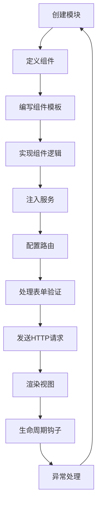

                 

### 文章标题：Angular框架入门：Google MVW框架的优势

> 关键词：Angular，前端开发，框架，Google，模块化，数据绑定，组件，指令，路由，最佳实践

> 摘要：本文旨在为初学者提供一份详尽的Angular框架入门指南。我们将从Angular的历史背景开始，逐步深入探讨其核心特性、架构设计、组件与指令、路由与导航、表单与数据验证以及高级应用与最佳实践。通过本文，读者将全面了解Angular框架的优势，学会如何在实际项目中有效应用Angular，从而提升前端开发技能。

### 目录大纲

# Angular框架入门：Google MVW框架的优势

## 第一部分：Angular基础

### 第1章：Angular简介

### 第2章：Angular的架构

### 第3章：组件与指令

### 第4章：路由与导航

### 第5章：表单与数据验证

### 第6章：Angular的HTTP服务

## 第二部分：高级应用与最佳实践

### 第7章：Angular最佳实践

### 第8章：Angular与第三方库的集成

### 第9章：Angular在大型项目中的应用

### 第10章：案例研究

## 附录

### 附录A：Angular相关资源与工具

### 附录B：Mermaid流程图

### 附录C：代码实战案例

### 附录D：数学公式和伪代码

### 附录E：开发环境搭建

## 作者信息

> 作者：AI天才研究院/AI Genius Institute & 禅与计算机程序设计艺术 /Zen And The Art of Computer Programming

### 第一部分：Angular基础

#### 第1章：Angular简介

Angular是由Google开发的一个开源的前端Web应用框架，它旨在简化前端开发过程，提高开发效率和代码质量。Angular的前身是AngularJS，于2010年发布，后来在2016年发布了Angular 2及更高版本，标志着Angular进入了全新的时代。

### 第1.1节：Angular的历史与发展

AngularJS（也称为Angular 1）在2010年由Google推出，迅速成为前端开发领域的流行框架。AngularJS引入了双向数据绑定、依赖注入和指令等特性，使得开发者能够更轻松地构建动态和响应式的网页应用。

随着时间的推移，前端技术的演进和复杂性增加，Google决定对Angular进行重新设计。2016年，Angular 2发布，这是一次重大的版本更新，它采用了全新的架构和设计理念，包括TypeScript语言、模块化设计和高性能渲染机制。Angular 2及后续版本（如Angular 4、5、6等）继续优化和增强，成为当今前端开发中不可或缺的工具之一。

### 第1.2节：Angular的核心特性

#### 双向数据绑定

双向数据绑定是Angular的一个重要特性，它能够自动同步模型和视图中的数据。这意味着当模型中的数据发生变化时，视图会自动更新；反之亦然。这种机制极大地简化了数据同步的复杂度，提高了开发效率。

#### 模块化设计

Angular采用模块化设计，将应用程序划分为多个独立的模块，每个模块都有自己的组件、服务和路由等。这种设计方式不仅提高了代码的可维护性，还使得组件的重用变得更加容易。

#### 组件与指令

组件是Angular应用的基本构建块，它们代表了应用程序中的独立功能单元。每个组件都有自己的模板、样式和逻辑。指令则是用于扩展HTML标签或属性的声明性语法，它们可以用来绑定数据、执行操作或控制DOM结构。

#### 服务与依赖注入

服务是Angular中用于封装可重用逻辑和数据的组件。依赖注入（DI）是Angular的核心概念之一，它允许组件通过构造函数直接获取所需的服务实例，从而简化了组件之间的依赖关系。

#### 路由与导航

路由是Angular中用于管理应用程序视图和URL的机制。通过配置路由，用户可以通过简单的URL导航到不同的页面或视图，而无需重新加载整个页面。

#### 表单与数据验证

Angular提供了强大的表单处理功能，包括表单绑定、验证和错误处理。这有助于确保用户输入的有效性和应用程序的一致性。

#### 高性能渲染

Angular通过虚拟DOM和变更检测机制，实现了高效的数据绑定和视图更新。这使得Angular应用能够在数据变化时快速响应，提供流畅的用户体验。

### 第1.3节：Angular与其它前端框架的比较

#### 与React的比较

React是由Facebook开发的一个声明性、高效且灵活的前端库。与Angular相比，React更注重UI组件的构建和状态管理，而Angular则提供了更为全面的应用框架。

- React的优点：
  - 轻量级：React仅提供了UI组件和虚拟DOM，开发者可以自由选择状态管理方案。
  - 高效：React的虚拟DOM技术使得UI更新更加高效。
  - 社区支持：React拥有庞大的开发者社区和丰富的第三方库。

- Angular的优点：
  - 全功能框架：Angular提供了模块化、双向数据绑定、依赖注入、路由等完整的开发工具集。
  - 强大的工具链：Angular CLI、代码生成器等工具提高了开发效率。

#### 与Vue的比较

Vue是由Evan You开发的渐进式JavaScript框架。Vue的设计理念是易于上手且灵活，适合各种规模的应用。

- Vue的优点：
  - 简单易懂：Vue的设计更加简洁，易于学习和使用。
  - 声明式渲染：Vue的虚拟DOM和双向数据绑定机制提供了良好的性能和用户体验。
  - 社区活跃：Vue拥有活跃的开发者社区和丰富的资源。

- Angular的优点：
  - 完整的生态系统：Angular拥有全面的工具链和成熟的生态系统，适合大型应用的开发。
  - TypeScript支持：Angular原生支持TypeScript，提供了类型安全性和更好的开发体验。

### 第2章：Angular的架构

Angular的架构设计使其成为一个高效且可维护的前端框架。本节将介绍Angular的核心架构组件，包括模块、组件、服务、指令和路由。

### 第2.1节：模块化设计

模块化设计是Angular架构的核心概念之一。模块（Module）是一个具有特定功能的代码集合，它包含了一组组件、服务、指令和路由等。通过将应用程序划分为多个模块，可以有效地组织代码，提高代码的可维护性和可复用性。

#### 创建模块

在Angular中，可以使用`@NgModule`装饰器来定义模块。以下是一个简单的模块定义示例：

```typescript
import { NgModule } from '@angular/core';
import { BrowserModule } from '@angular/platform-browser';
import { AppComponent } from './app.component';

@NgModule({
  declarations: [
    AppComponent
  ],
  imports: [
    BrowserModule
  ],
  providers: [],
  bootstrap: [AppComponent]
})
export class AppModule { }
```

在这个示例中，`AppModule`定义了应用程序的主要模块，它包含了`AppComponent`组件，并导入了`BrowserModule`。

#### 模块的组织

在大型应用程序中，模块应该根据功能进行组织。例如，可以将用户界面、业务逻辑和数据服务等分别划分为不同的模块。这种分层设计有助于代码的模块化和解耦，使得每个模块都可以独立开发和维护。

### 第2.2节：数据绑定

数据绑定是前端开发中至关重要的一部分。Angular提供了强大的数据绑定机制，包括单向数据绑定和双向数据绑定。

#### 单向数据绑定

单向数据绑定（One-way Data Binding）是一种数据流方式，其中数据从模型流向视图，但不会反向流动。在Angular中，单向数据绑定通常使用`{{ }}`语法实现：

```html
<p>{{ firstName }}</p>
```

这里的`firstName`是组件的一个属性，它会在视图中被动态替换为其值。

#### 双向数据绑定

双向数据绑定（Two-way Data Binding）是一种数据流方式，其中数据在模型和视图之间双向同步。在Angular中，双向数据绑定通常使用`[(ngModel)]`语法实现：

```html
<input type="text" [(ngModel)]="firstName" />
```

这里的`firstName`是组件的一个属性，当用户在输入框中输入内容时，`firstName`的值会实时更新，同时也会在视图中显示。

### 第2.3节：服务与依赖注入

服务（Service）是Angular中用于封装可重用逻辑和数据的组件。依赖注入（Dependency Injection，DI）是Angular的核心概念之一，它允许组件通过构造函数直接获取所需的服务实例。

#### 服务的基本用法

在Angular中，可以使用`@Injectable`装饰器将一个类定义为一个服务：

```typescript
import { Injectable } from '@angular/core';

@Injectable({
  providedIn: 'root'
})
export class DataService {
  constructor() { }
}
```

这里，`DataService`是一个可注入的服务，它可以通过依赖注入机制在其他组件中获取。

#### 依赖注入的基本用法

在组件的构造函数中，可以注入服务：

```typescript
import { Component } from '@angular/core';
import { DataService } from './data.service';

@Component({
  selector: 'app-root',
  templateUrl: './app.component.html',
  styleUrls: ['./app.component.css']
})
export class AppComponent {
  constructor(private dataService: DataService) { }
}
```

在这个示例中，`DataService`通过构造函数参数注入到`AppComponent`中。

### 第3章：组件与指令

组件和指令是Angular应用中的核心构建块。组件用于封装可重用的UI功能，而指令则用于扩展HTML元素或属性。

### 第3.1节：组件的生命周期

组件的生命周期是指组件从创建到销毁的整个过程。Angular提供了多个生命周期钩子函数，用于在特定阶段执行自定义逻辑。

#### 初始化阶段

- `ngOnChanges`：在组件的输入属性发生变化时执行。
- `ngOnInit`：在组件初始化完成后执行。

#### 更新阶段

- `ngDoCheck`：在每次变更检测周期开始时执行。
- `ngAfterContentInit`：在组件内容初始化完成后执行。
- `ngAfterViewInit`：在组件视图初始化完成后执行。

#### 销毁阶段

- `ngOnDestroy`：在组件销毁之前执行。

### 第3.2节：指令的定义与使用

指令（Directive）是Angular中用于扩展HTML元素或属性的装饰器。指令通过使用`@Directive`装饰器定义：

```typescript
import { Directive, ElementRef, Input } from '@angular/core';

@Directive({
  selector: '[appHighlight]'
})
export class HighlightDirective {
  constructor(private el: ElementRef) {
    this.el.nativeElement.style.backgroundColor = 'yellow';
  }
}
```

这里，`HighlightDirective`是一个简单的指令，它通过将`<app-highlight>`元素背景颜色设置为黄色来扩展HTML元素。

### 第3.3节：自定义指令

自定义指令可以用于实现各种功能，如数据绑定、样式扩展、事件处理等。以下是一个简单的自定义指令示例：

```typescript
import { Directive, Input, OnChanges, SimpleChanges } from '@angular/core';

@Directive({
  selector: '[appHighlight]'
})
export class HighlightDirective implements OnChanges {
  @Input('appHighlight') color: string;

  ngOnChanges(changes: SimpleChanges) {
    if (changes['color']) {
      this.applyStyle();
    }
  }

  applyStyle() {
    this.el.nativeElement.style.backgroundColor = this.color || 'yellow';
  }
}
```

在这个示例中，`HighlightDirective`根据输入属性`appHighlight`的值动态更改元素的背景颜色。

### 第4章：路由与导航

路由（Routing）是Angular中用于管理应用程序视图和URL的重要机制。通过配置路由，用户可以通过简单的URL导航到不同的页面或视图。

### 第4.1节：路由的基本概念

路由由以下三个基本组件组成：

- 路由配置（Route Configuration）：定义了路由的路径和对应的组件。
- 路由模块（Route Module）：包含了应用程序的所有路由配置。
- 路由器（Router）：负责根据URL动态加载和切换视图。

### 第4.2节：路由配置与导航

在Angular中，可以使用`RouterModule`来配置路由。以下是一个简单的路由配置示例：

```typescript
import { NgModule } from '@angular/core';
import { RouterModule, Routes } from '@angular/router';
import { HomeComponent } from './home/home.component';
import { AboutComponent } from './about/about.component';

const routes: Routes = [
  { path: '', component: HomeComponent },
  { path: 'about', component: AboutComponent }
];

@NgModule({
  imports: [RouterModule.forRoot(routes)],
  exports: [RouterModule]
})
export class AppRoutingModule { }
```

在这个示例中，我们定义了两个路由，一个用于主页面（`HomeComponent`），另一个用于关于页面（`AboutComponent`）。

### 第4.3节：动态路由与路由参数

动态路由（Dynamic Routing）允许用户通过动态URL参数导航到特定视图。以下是一个动态路由配置的示例：

```typescript
const routes: Routes = [
  { path: 'products', component: ProductsComponent },
  { path: 'products/:id', component: ProductDetailComponent }
];
```

在这个示例中，`/products/:id`路径中的`:id`是一个动态参数，它将在路由匹配时捕获URL中的ID参数，并将其作为属性传递给`ProductDetailComponent`。

### 第5章：表单与数据验证

表单是Web应用中的重要组成部分，Angular提供了强大的表单处理功能，包括表单绑定、验证和错误处理。

### 第5.1节：表单的基本使用

在Angular中，可以使用`formGroup`和`formControlName`指令创建和绑定表单：

```html
<form [formGroup]="myForm">
  <input type="text" formControlName="name" />
  <div *ngIf="myForm.get('name').invalid && myForm.get('name').touched">
    <p>Name is required.</p>
  </div>
</form>
```

在这个示例中，我们创建了一个简单的表单，其中包含一个文本输入框。通过使用`formControlName`指令，我们可以将输入框绑定到`myForm`表单对象中的`name`属性。

### 第5.2节：表单验证

Angular提供了多种表单验证方式，包括必填验证、邮箱验证、数字验证等。以下是一个使用必填验证的示例：

```typescript
import { FormGroup, FormControl, Validators } from '@angular/forms';

export class LoginForm {
  username = new FormControl('', [Validators.required]);
  password = new FormControl('', [Validators.required]);
}

export class MyForm {
  myForm = new FormGroup({
    username: new FormControl('', [Validators.required]),
    password: new FormControl('', [Validators.required])
  });
}
```

在这个示例中，我们为表单中的`username`和`password`字段添加了必填验证。

### 第5.3节：非受控表单

非受控表单（Uncontrolled Form）是一种表单处理方式，其中表单的状态（如值、验证状态等）由DOM元素自身管理。在Angular中，可以使用`ngModel`指令将非受控表单与表单对象绑定：

```html
<form [formGroup]="myForm">
  <input type="text" [ngModel]="username" />
  <input type="password" [ngModel]="password" />
</form>
```

在这个示例中，我们使用`ngModel`指令将输入框的值绑定到表单对象中的`username`和`password`属性。

### 第6章：Angular的HTTP服务

HTTP服务是Web应用中用于与后端通信的重要工具。Angular提供了强大的HTTP服务（`HttpClient`），用于发送HTTP请求并处理响应。

### 第6.1节：HTTP请求的基本方法

Angular的`HttpClient`提供了多种HTTP请求方法，如`get`、`post`、`put`和`delete`。以下是一个使用`get`方法的示例：

```typescript
import { HttpClient } from '@angular/common/http';

constructor(private http: HttpClient) { }

getUsers() {
  return this.http.get('/api/users');
}
```

在这个示例中，我们使用`HttpClient`发送一个GET请求，并返回一个观察对象（Observable）。

### 第6.2节：使用HttpClient进行HTTP请求

使用`HttpClient`进行HTTP请求通常包括以下几个步骤：

1. 导入`HttpClient`模块。
2. 创建`HttpClient`实例。
3. 使用`HttpClient`发送HTTP请求。

以下是一个简单的HTTP请求示例：

```typescript
import { HttpClient } from '@angular/common/http';

constructor(private http: HttpClient) { }

getUsers() {
  return this.http.get('/api/users').toPromise();
}
```

在这个示例中，我们使用`HttpClient`发送一个GET请求，并将结果转换为Promise。

### 第6.3节：处理HTTP请求的错误

处理HTTP请求的错误是Web应用开发中的重要一环。Angular的`HttpClient`提供了多种方式来处理HTTP错误。

```typescript
import { HttpClient, HttpErrorResponse } from '@angular/common/http';

constructor(private http: HttpClient) { }

getUsers() {
  return this.http.get('/api/users').pipe(
    catchError(this.handleError)
  );
}

private handleError(error: HttpErrorResponse) {
  // Handle the HTTP error here
  return throwError('An error occurred: ' + error.message);
}
```

在这个示例中，我们使用`catchError`操作符来处理HTTP请求中的错误。

## 第二部分：高级应用与最佳实践

### 第7章：Angular最佳实践

在进行Angular开发时，遵循最佳实践可以显著提高代码质量、开发效率和项目稳定性。以下是一些Angular开发中的最佳实践：

### 第7.1节：代码规范与风格指南

编写可读、可维护的代码是每个开发者都应该遵循的原则。Angular提供了官方的编码规范和风格指南，包括：

- 使用TypeScript进行开发，确保类型安全性和代码质量。
- 遵循模块化和组件化的设计原则，将应用程序划分为独立的模块和组件。
- 使用常量和枚举来定义常量值，提高代码的可读性。
- 使用注释来详细说明代码的功能和逻辑。

### 第7.2节：持续集成与持续部署

持续集成（CI）和持续部署（CD）是提高软件开发效率和质量的重要实践。通过CI/CD，开发团队能够更快地交付功能，减少代码缺陷和回归风险。以下是一些实现CI/CD的建议：

- 使用自动化测试来确保代码的质量和稳定性。
- 使用Git作为版本控制系统，确保代码的版本控制和协作开发。
- 使用自动化构建工具（如Gulp、Grunt等）来编译和打包代码。
- 使用容器化技术（如Docker）来隔离开发环境，提高部署的灵活性和可移植性。
- 使用CI/CD服务（如Jenkins、GitLab CI/CD等）来自动化测试和部署流程。

### 第7.3节：性能优化技巧

性能优化是确保Web应用流畅和响应迅速的重要一环。以下是一些常用的性能优化技巧：

- 使用虚拟DOM和变更检测来减少DOM操作，提高渲染效率。
- 使用服务端渲染（SSR）或同构应用（Isomorphic App）来提高首屏加载速度。
- 使用代码分割（Code Splitting）来按需加载模块，减少初始加载时间。
- 使用CDN来加速静态资源的加载。
- 使用HTTP/2来提高HTTP请求的并发能力。

### 第8章：Angular与第三方库的集成

在Angular项目中，集成第三方库可以显著提高开发效率和应用功能。以下是一些常见的第三方库和Angular的集成方法：

### 第8.1节：第三方库的选择与使用

选择适合项目需求的第三方库是集成过程中的第一步。以下是一些常用的第三方库：

- UI组件库（如Angular Material、Bootstrap等）：用于快速搭建美观的UI界面。
- 状态管理库（如NgRx、NgrxEntity等）：用于管理复杂的状态逻辑。
- HTTP客户端（如Axios、ng-http-client等）：用于发送HTTP请求。
- 数据库库（如MongoDB、Firebase等）：用于存储和查询数据。

### 第8.2节：与React和Vue的对比与集成

虽然Angular、React和Vue都是流行的前端框架，但它们在设计理念、功能特性和使用场景上有所不同。以下是对它们的简要对比：

#### Angular与React

- React注重UI组件的构建和状态管理，而Angular提供了更为全面的应用框架。
- React使用JSX语法，而Angular使用TypeScript。
- React的虚拟DOM性能表现优异，而Angular通过变更检测实现数据绑定。

集成方法：
- 使用React组件在Angular应用中渲染React组件，可以使用`@angular/elements`包。
- 使用React和Angular的API进行数据传递和状态同步。

#### Angular与Vue

- Vue的设计更加简洁，易于上手，而Angular提供了更丰富的工具集。
- Vue在数据绑定和虚拟DOM方面表现优秀，而Angular在模块化和依赖注入方面具有优势。

集成方法：
- 使用Vue组件在Angular应用中渲染Vue组件，可以使用`@vue/component`包。
- 使用Vue和Angular的API进行数据传递和状态同步。

### 第8.3节：与TypeScript的集成

TypeScript是Angular的主要编程语言，它与Angular的集成非常紧密。以下是一些与TypeScript的集成建议：

- 使用TypeScript的类型定义文件（`.d.ts`）来支持第三方库的类型检查。
- 使用TypeScript的装饰器（Decorators）来定义组件、指令和服务。
- 使用TypeScript的模块化机制（如`import`和`export`）来组织代码。

### 第9章：Angular在大型项目中的应用

在大型项目中，Angular可以提供强大的模块化和组件化能力，有助于管理和维护复杂的代码结构。以下是在大型项目中使用Angular的一些实践：

### 第9.1节：项目架构设计

在大型项目中，良好的项目架构设计是确保系统可维护性和可扩展性的关键。以下是一些项目架构设计的建议：

- 使用分层架构（如MVC、MVVM等）来组织应用程序组件。
- 将应用程序划分为多个模块，每个模块负责特定的功能。
- 使用服务层来封装业务逻辑和数据访问。
- 使用视图层来呈现用户界面。

### 第9.2节：分层架构的应用

在Angular中，分层架构的应用可以通过以下几个方面实现：

- 控制层（Controller）：负责处理用户输入和视图更新。
- 服务层（Service）：负责业务逻辑和数据访问。
- 模型层（Model）：负责存储数据状态。

### 第9.3节：服务端渲染与同构应用

服务端渲染（SSR）和同构应用（Isomorphic App）是提高Web应用性能和SEO的关键技术。以下是一些应用建议：

- 使用Angular Universal进行服务端渲染，以实现更快的首屏加载速度和更好的搜索引擎优化。
- 使用同构应用来提高应用的可访问性和性能。

### 第10章：案例研究

通过实际案例研究，可以更深入地了解Angular在项目中的应用和实践。以下是一些案例研究：

### 第10.1节：电商平台的前端开发

电商平台通常具有复杂的用户界面和数据处理需求。以下是在电商平台中使用Angular的一些实践：

- 使用组件化设计来构建产品列表、购物车、订单管理等页面。
- 使用状态管理库（如NgRx）来管理全局状态。
- 使用Angular的HTTP服务与后端API进行数据通信。
- 使用第三方库（如Angular Material）来提升UI设计质量。

### 第10.2节：企业级后台管理系统

企业级后台管理系统通常需要处理大量的数据和管理功能。以下是在后台管理系统中使用Angular的一些实践：

- 使用Angular的模块化设计来组织不同的功能模块。
- 使用服务层来封装业务逻辑和数据访问。
- 使用指令和组件来扩展功能，如日期选择器、文件上传等。
- 使用路由和导航来管理不同功能的页面。

### 第10.3节：移动端应用的开发

随着移动设备的普及，移动端应用的开发越来越重要。以下是在移动端应用中使用Angular的一些实践：

- 使用Angular的响应式设计来适应不同的屏幕尺寸和分辨率。
- 使用Angular的组件化设计来构建可重用的UI组件。
- 使用第三方库（如Ionic）来开发跨平台的移动应用。
- 使用服务端渲染（SSR）或同构应用（Isomorphic App）来提高移动端应用的性能。

### 附录A：Angular相关资源与工具

以下是一些常用的Angular相关资源与工具：

- **官方文档**：Angular的官方文档是学习Angular的最佳资源，它提供了详尽的技术细节和教程。
- **教程和课程**：许多在线平台（如Pluralsight、Udemy等）提供了Angular的教程和课程，适合不同水平的开发者。
- **开源社区**：Angular拥有活跃的开源社区，GitHub上的Angular仓库是获取最新信息和贡献代码的好地方。
- **工具链**：Angular CLI是Angular的开发工具链的核心，它提供了代码生成、构建和测试等功能。
- **代码生成器**：Angular提供了多个代码生成器，如`ng generate component`、`ng generate service`等，用于快速生成代码模板。

### 附录B：Mermaid流程图

以下是一些示例Mermaid流程图，用于描述Angular的关键概念和架构：



### 附录C：代码实战案例

以下是一些示例代码，用于演示Angular的核心功能和实际应用：

```typescript
// 组件模板示例
import { Component } from '@angular/core';

@Component({
  selector: 'app-root',
  templateUrl: './app.component.html',
  styleUrls: ['./app.component.css']
})
export class AppComponent {
  title = 'Angular实战';
}

// 数据绑定示例
@Component({
  selector: 'app-binding',
  templateUrl: './binding.component.html',
  styleUrls: ['./binding.component.css']
})
export class BindingComponent {
  name = 'Angular';
}

// 路由示例
import { RouterModule, Routes } from '@angular/router';
import { HomeComponent } from './home/home.component';
import { AboutComponent } from './about/about.component';

const routes: Routes = [
  { path: '', component: HomeComponent },
  { path: 'about', component: AboutComponent }
];

@NgModule({
  imports: [RouterModule.forRoot(routes)],
  exports: [RouterModule]
})
export class AppRoutingModule { }

// HTTP服务示例
import { HttpClient } from '@angular/common/http';
import { Component } from '@angular/core';

@Component({
  selector: 'app-http',
  templateUrl: './http.component.html',
  styleUrls: ['./http.component.css']
})
export class HttpComponent {
  constructor(private http: HttpClient) { }

  getUsers() {
    return this.http.get('/api/users').toPromise();
  }
}
```

### 附录D：数学公式和伪代码

以下是一些示例数学公式和伪代码，用于解释Angular的关键概念：

#### 数学公式：

$$
\text{变更检测机制} = \text{脏检查} + \text{事件监听}
$$

$$
\text{模块化设计} = \text{模块} + \text{组件} + \text{服务}
$$

#### 伪代码：

```
// 组件创建与注入
function createComponent() {
  const component = new Component();
  injectServices(component);
  return component;
}

// 数据绑定
function bindData(model, view) {
  observeModel(model);
  updateView(view);
}

// HTTP请求
function sendRequest(url) {
  makeHttpRequest(url);
  handleResponse();
  handleError();
}
```

### 附录E：开发环境搭建

搭建Angular开发环境是开始项目开发的第一步。以下是在Windows操作系统上搭建Angular开发环境的步骤：

#### 第1步：安装Node.js

1. 访问Node.js官方网站（https://nodejs.org/）并下载对应操作系统的安装包。
2. 运行安装程序，并选择默认选项完成安装。

#### 第2步：安装Angular CLI

1. 打开命令提示符或终端。
2. 输入以下命令以全局安装Angular CLI：

```
npm install -g @angular/cli
```

#### 第3步：创建新的Angular项目

1. 打开命令提示符或终端。
2. 进入要创建项目的目录。
3. 输入以下命令以创建新的Angular项目：

```
ng new my-angular-project
```

#### 第4步：进入项目目录并启动开发服务器

1. 进入新创建的项目目录：

```
cd my-angular-project
```

2. 启动开发服务器：

```
ng serve
```

现在，您已经成功搭建了Angular开发环境，可以开始创建和开发Angular项目了。

### 总结

Angular是一个功能强大且灵活的前端框架，它为开发者提供了丰富的工具和特性，有助于构建高效、可维护的Web应用。通过本文的详细介绍，您应该对Angular的核心概念、架构设计、组件与指令、路由与导航、表单与数据验证以及高级应用与最佳实践有了全面的理解。接下来，您可以通过实践案例来巩固所学知识，并在实际项目中应用Angular，提升前端开发技能。希望本文能够成为您学习Angular的指南和参考，祝您编程愉快！

