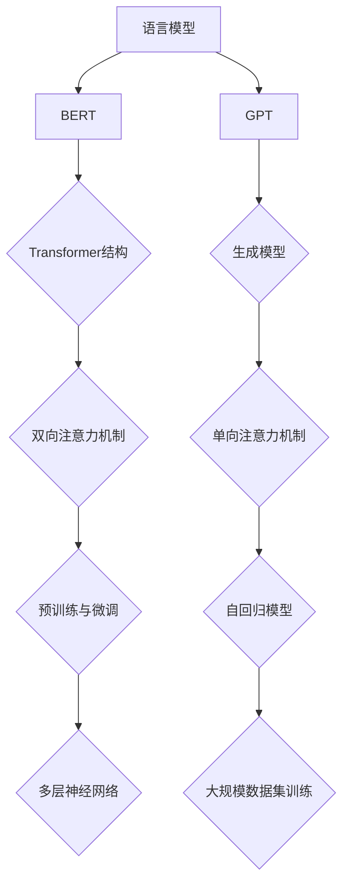
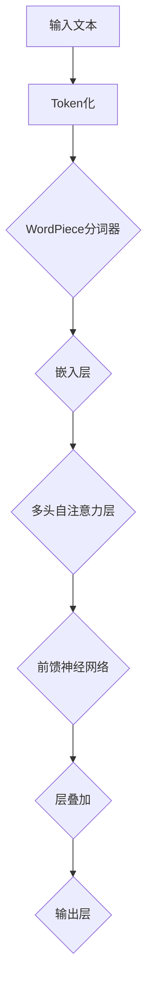
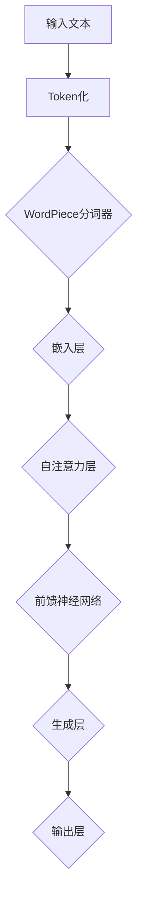

                 

### 文章标题：BERT vs GPT：双向vs单向语言模型

#### 关键词：BERT，GPT，语言模型，预训练，自然语言处理，文本生成

> 摘要：本文旨在深入探讨BERT和GPT这两种重要的语言模型，详细解析它们的核心特点、原理和应用。通过逐步分析，我们将比较BERT的双向注意力机制与GPT的单向生成机制，探讨它们在自然语言处理任务中的优缺点，并提供实际案例和优化技巧。文章还将展望语言模型未来的发展趋势，并为企业级应用提供实践建议。

### 目录大纲：BERT vs GPT：双向vs单向语言模型

#### 第一部分：语言模型基础理论

#### 第1章：语言模型的概述

- 1.1 语言模型的定义与历史发展
  - 1.1.1 语言模型的基本概念
  - 1.1.2 语言模型的发展历程

- 1.2 BERT和GPT的核心特点
  - 1.2.1 BERT的核心特点
  - 1.2.2 GPT的核心特点

- 1.3 BERT和GPT的对比分析
  - 1.3.1 双向与单向语言模型的区别
  - 1.3.2 应用场景与效果对比

#### 第2章：BERT模型原理详解

- 2.1 BERT模型的结构
  - 2.1.1 Transformer结构
  - 2.1.2 多层神经网络与预训练

- 2.2 BERT模型的训练过程
  - 2.2.1 预训练阶段
  - 2.2.2 微调阶段

- 2.3 BERT模型的应用
  - 2.3.1 自然语言处理任务
  - 2.3.2 实际案例分析

#### 第3章：GPT模型原理详解

- 3.1 GPT模型的结构
  - 3.1.1 语言模型与生成模型
  - 3.1.2 随机漫步与梯度下降

- 3.2 GPT模型的训练过程
  - 3.2.1 自回归模型
  - 3.2.2 大规模数据集的应用

- 3.3 GPT模型的应用
  - 3.3.1 文本生成任务
  - 3.3.2 代码生成任务

#### 第二部分：模型实践与优化

#### 第4章：BERT模型实战

- 4.1 数据预处理
  - 4.1.1 数据清洗
  - 4.1.2 数据分词与编码

- 4.2 模型训练与评估
  - 4.2.1 训练环境搭建
  - 4.2.2 评估指标

- 4.3 实际案例分析
  - 4.3.1 问答系统
  - 4.3.2 文本分类任务

#### 第5章：GPT模型实战

- 5.1 数据预处理
  - 5.1.1 数据清洗
  - 5.1.2 数据分词与编码

- 5.2 模型训练与评估
  - 5.2.1 训练环境搭建
  - 5.2.2 评估指标

- 5.3 实际案例分析
  - 5.3.1 自动问答系统
  - 5.3.2 文本生成任务

#### 第6章：模型优化与调参技巧

- 6.1 模型结构优化
  - 6.1.1 参数调整
  - 6.1.2 网络结构调整

- 6.2 数据增强与处理
  - 6.2.1 数据增强方法
  - 6.2.2 数据预处理技巧

- 6.3 模型调参实践
  - 6.3.1 学习率调整
  - 6.3.2 模型融合与集成

#### 第7章：未来展望与应用趋势

- 7.1 语言模型的发展趋势
  - 7.1.1 新兴技术与应用领域
  - 7.1.2 挑战与机遇

- 7.2 企业级应用场景
  - 7.2.1 企业应用案例分析
  - 7.2.2 实践与建议

- 7.3 开发工具与资源介绍

### 文章正文部分

#### 第一部分：语言模型基础理论

#### 第1章：语言模型的概述

##### 1.1 语言模型的定义与历史发展

**1.1.1 语言模型的基本概念**

语言模型（Language Model）是自然语言处理（Natural Language Processing，NLP）的核心技术之一，它通过学习大量文本数据，预测下一个词语或字符的概率分布。在NLP中，语言模型主要用于文本生成、机器翻译、情感分析、文本分类等任务。

**1.1.2 语言模型的发展历程**

语言模型的发展经历了多个阶段：

- **基于规则的方法**：早期语言模型主要通过人工设计语法规则和统计规则进行文本生成和预测。

- **统计语言模型**：随着计算能力和数据量的增加，统计语言模型开始广泛应用。N-gram模型是最典型的统计语言模型，它通过计算单词序列的频率来预测下一个单词。

- **神经网络语言模型**：随着深度学习技术的发展，神经网络语言模型逐渐取代了传统统计模型。这些模型通过多层神经网络学习文本数据的特征，提高了语言模型的预测能力。

- **预训练语言模型**：近年来，预训练语言模型成为语言模型的主流。BERT、GPT等预训练模型通过在大规模数据集上进行预训练，然后针对特定任务进行微调，显著提升了NLP任务的性能。

##### 1.2 BERT和GPT的核心特点

**1.2.1 BERT的核心特点**

BERT（Bidirectional Encoder Representations from Transformers）是一种双向Transformer模型，其核心特点如下：

- **双向注意力机制**：BERT模型通过Transformer结构中的自注意力机制，同时考虑输入序列的前后文信息，从而提高模型的预测能力。

- **预训练与微调**：BERT模型首先在大规模文本数据集上进行预训练，学习通用语言表示，然后针对特定任务进行微调，实现高性能的NLP任务。

- **多层神经网络**：BERT模型采用多层神经网络结构，通过逐层学习文本数据的深层特征，提高了模型的泛化能力。

**1.2.2 GPT的核心特点**

GPT（Generative Pre-trained Transformer）是一种单向生成模型，其核心特点如下：

- **单向注意力机制**：GPT模型通过Transformer结构中的自注意力机制，仅考虑输入序列的前文信息，生成下一个词语。

- **生成模型**：GPT模型属于生成模型，通过自回归的方式，逐个生成输入序列中的每个词语。

- **大规模数据集训练**：GPT模型通过在大规模数据集上进行训练，学习文本数据的统计规律和特征，从而实现高性能的文本生成任务。

##### 1.3 BERT和GPT的对比分析

**1.3.1 双向与单向语言模型的区别**

BERT和GPT在语言模型的架构和注意力机制上存在显著差异：

- **双向注意力机制**：BERT模型通过Transformer结构中的多头自注意力机制，同时考虑输入序列的前后文信息，实现双向语言表示。

- **单向注意力机制**：GPT模型通过Transformer结构中的自注意力机制，仅考虑输入序列的前文信息，实现单向语言表示。

这种差异导致了BERT和GPT在任务性能和应用场景上的差异。

**1.3.2 应用场景与效果对比**

BERT和GPT在NLP任务中具有不同的应用场景和效果：

- **文本生成**：GPT模型在文本生成任务上具有优势，因为其生成模型的特点使得文本生成更加流畅和自然。而BERT模型在文本生成任务上的表现相对较差。

- **文本分类**：BERT模型在文本分类任务上具有显著优势，因为其双向注意力机制能够更好地理解文本的语义信息。而GPT模型在文本分类任务上的表现相对较弱。

- **问答系统**：BERT模型在问答系统任务上具有优势，因为其能够更好地理解问题的上下文信息。而GPT模型在问答系统任务上的表现相对较差。

#### 第2章：BERT模型原理详解

##### 2.1 BERT模型的结构

**2.1.1 Transformer结构**

BERT模型基于Transformer架构，这是一种专为序列数据设计的深度学习模型。Transformer结构由编码器（Encoder）和解码器（Decoder）组成，主要包含以下组件：

- **多头自注意力机制**：通过计算输入序列中每个词语与其他词语的关联性，实现文本数据的全局表示。

- **位置编码**：为序列中的每个词语添加位置信息，使模型能够理解词语的位置关系。

- **多层神经网络**：通过堆叠多个编码器和解码器层，逐层学习文本数据的深层特征。

**2.1.2 多层神经网络与预训练**

BERT模型采用多层神经网络结构，包括以下部分：

- **嵌入层**：将词汇表中的词语转换为固定长度的向量表示。

- **多头自注意力层**：通过多头自注意力机制，计算输入序列中每个词语与其他词语的关联性。

- **前馈神经网络**：在自注意力层之后，添加前馈神经网络层，对文本数据进行进一步处理。

BERT模型通过预训练和微调两个阶段进行训练：

- **预训练阶段**：在大规模文本数据集上进行预训练，学习通用语言表示。预训练任务包括遮蔽语言模型（Masked Language Model，MLM）和下一句预测（Next Sentence Prediction，NSP）。

- **微调阶段**：在特定任务的数据集上进行微调，将预训练得到的语言表示应用于实际任务。

##### 2.2 BERT模型的训练过程

**2.2.1 预训练阶段**

BERT模型的预训练阶段主要包括以下任务：

- **遮蔽语言模型（MLM）**：输入序列中的部分词语被随机遮蔽，模型需要预测这些遮蔽的词语。这有助于模型学习词汇的上下文关系。

- **下一句预测（NSP）**：输入两个连续的句子，模型需要预测第二个句子是否是第一个句子的下一句。这有助于模型学习句子之间的语义关系。

**2.2.2 微调阶段**

BERT模型的微调阶段包括以下步骤：

- **数据准备**：对特定任务的数据集进行预处理，包括分词、编码和标签准备。

- **模型初始化**：使用预训练好的BERT模型作为基础模型，初始化模型参数。

- **训练过程**：在训练数据集上迭代训练模型，通过优化损失函数和梯度下降算法，不断调整模型参数。

- **评估与调整**：在验证数据集上评估模型性能，根据评估结果调整模型参数，以达到最佳性能。

##### 2.3 BERT模型的应用

**2.3.1 自然语言处理任务**

BERT模型在多种自然语言处理任务中取得了显著成果，包括：

- **文本分类**：通过输入文本序列，BERT模型可以预测文本所属的类别。例如，情感分析、新闻分类等任务。

- **命名实体识别**：BERT模型可以识别文本中的命名实体，如人名、地名、组织名等。

- **问答系统**：BERT模型可以回答基于问题的文本查询，提供准确的答案。

- **机器翻译**：BERT模型可以作为预训练模型，用于机器翻译任务的预训练和微调。

**2.3.2 实际案例分析**

以下是一个实际案例：使用BERT模型构建一个文本分类系统，对新闻文章进行分类。

1. **数据准备**：收集大量新闻文章数据，并对数据进行预处理，包括分词、编码和标签准备。

2. **模型训练**：使用预训练好的BERT模型作为基础模型，初始化模型参数。在训练数据集上进行迭代训练，通过优化损失函数和梯度下降算法，不断调整模型参数。

3. **模型评估**：在验证数据集上评估模型性能，根据评估结果调整模型参数，以达到最佳性能。

4. **模型部署**：将训练好的BERT模型部署到生产环境，对新的新闻文章进行分类。

通过以上步骤，BERT模型成功地应用于新闻分类任务，取得了较高的准确率和效果。

#### 第3章：GPT模型原理详解

##### 3.1 GPT模型的结构

**3.1.1 语言模型与生成模型**

GPT（Generative Pre-trained Transformer）是一种基于Transformer架构的自回归语言模型，其核心思想是生成下一个词语的概率分布，从而生成完整的文本序列。

**3.1.2 随机漫步与梯度下降**

GPT模型通过随机漫步（Random Walk）和梯度下降（Gradient Descent）算法进行训练：

- **随机漫步**：从输入序列的起始位置开始，随机选择下一个词语，生成一个完整的文本序列。

- **梯度下降**：通过计算损失函数（如交叉熵损失函数）的梯度，不断调整模型参数，使损失函数值减小，从而优化模型性能。

##### 3.2 GPT模型的训练过程

**3.2.1 自回归模型**

GPT模型是一种自回归模型（Autoregressive Model），其训练过程如下：

1. **数据准备**：对输入文本序列进行预处理，包括分词、编码和序列化。

2. **模型初始化**：初始化模型参数，包括嵌入层、自注意力层和前馈神经网络。

3. **前向传播**：对于输入的文本序列，计算模型输出概率分布。

4. **损失计算**：计算输出概率分布与实际标签之间的交叉熵损失。

5. **反向传播**：计算梯度，更新模型参数。

6. **迭代训练**：重复以上步骤，直到模型收敛。

**3.2.2 大规模数据集的应用**

GPT模型通常在大规模数据集上进行训练，以充分利用数据优势。以下是一个典型的训练过程：

1. **数据预处理**：对大规模文本数据进行预处理，包括分词、编码和序列化。

2. **数据加载**：将预处理后的数据加载到内存，进行批处理训练。

3. **模型训练**：使用梯度下降算法，对模型进行迭代训练，优化模型参数。

4. **模型评估**：在验证数据集上评估模型性能，根据评估结果调整模型参数。

5. **模型保存**：将训练好的模型参数保存到文件，以便后续使用。

##### 3.3 GPT模型的应用

**3.3.1 文本生成任务**

GPT模型在文本生成任务中具有广泛的应用，包括：

- **文本摘要**：通过对输入文本进行编码和解码，生成简洁明了的摘要。

- **故事生成**：根据用户输入的种子文本，生成连贯有趣的故事情节。

- **机器翻译**：使用GPT模型对输入文本进行编码和解码，实现跨语言的文本生成。

- **对话生成**：根据用户输入的对话上下文，生成自然流畅的对话回复。

**3.3.2 代码生成任务**

除了文本生成任务，GPT模型在代码生成任务中也展现出强大的能力。以下是一个实际案例：

1. **数据准备**：收集大量的编程代码数据，并进行预处理，包括分词、编码和序列化。

2. **模型训练**：使用预训练好的GPT模型，对编程代码数据进行迭代训练，优化模型参数。

3. **代码生成**：输入编程问题或需求描述，使用GPT模型生成对应的代码实现。

4. **代码评估**：对生成的代码进行语法和逻辑验证，确保代码的正确性和可执行性。

通过以上步骤，GPT模型成功地应用于代码生成任务，提高了开发效率和代码质量。

#### 第二部分：模型实践与优化

##### 第4章：BERT模型实战

**4.1 数据预处理**

**4.1.1 数据清洗**

在开始BERT模型的实战之前，首先需要对数据进行清洗。数据清洗包括以下步骤：

1. **去除停用词**：停用词是指在文本中频繁出现，但对文本意义贡献较小的词语。去除停用词可以减少模型的计算量和噪声。

2. **去除特殊字符**：去除文本中的特殊字符和标点符号，以便于后续的分词和编码。

3. **统一文本格式**：统一文本格式，如将所有文本转换为小写或大写，以便于模型的训练和预测。

**4.1.2 数据分词与编码**

在数据预处理过程中，需要进行数据分词和编码。BERT模型通常使用WordPiece分词器对文本进行分词，并将分词后的词语转换为嵌入向量。

1. **数据分词**：使用WordPiece分词器对文本进行分词，将连续的文本序列划分为一系列的词语。

2. **词语编码**：将分词后的词语转换为嵌入向量，BERT模型通常使用预训练好的词向量库进行编码。

**4.2 模型训练与评估**

**4.2.1 训练环境搭建**

在开始BERT模型的训练之前，需要搭建一个训练环境。训练环境包括以下组件：

1. **计算资源**：配置高性能的计算资源，如GPU或TPU，以便于模型的大规模训练。

2. **编程语言和库**：选择合适的编程语言和库，如Python和TensorFlow或PyTorch，用于实现BERT模型的训练和评估。

3. **预处理工具**：使用预处理工具，如NLTK或spaCy，进行文本分词和编码。

**4.2.2 评估指标**

在BERT模型的训练过程中，需要使用适当的评估指标来衡量模型性能。常见的评估指标包括：

1. **准确率（Accuracy）**：准确率表示模型预测正确的样本数占总样本数的比例。

2. **精确率（Precision）**：精确率表示模型预测为正类的样本中，实际为正类的比例。

3. **召回率（Recall）**：召回率表示模型预测为正类的样本中，实际为正类的比例。

4. **F1分数（F1 Score）**：F1分数是精确率和召回率的加权平均，用于综合评估模型的性能。

**4.3 实际案例分析**

以下是一个实际案例：使用BERT模型进行文本分类任务。

1. **数据准备**：收集大量文本数据，并进行预处理，包括分词、编码和标签准备。

2. **模型训练**：使用预训练好的BERT模型，初始化模型参数。在训练数据集上进行迭代训练，通过优化损失函数和梯度下降算法，不断调整模型参数。

3. **模型评估**：在验证数据集上评估模型性能，根据评估结果调整模型参数，以达到最佳性能。

4. **模型部署**：将训练好的BERT模型部署到生产环境，对新的文本数据进行分类。

通过以上步骤，BERT模型成功地应用于文本分类任务，取得了较高的准确率和效果。

##### 第5章：GPT模型实战

**5.1 数据预处理**

**5.1.1 数据清洗**

在开始GPT模型的实战之前，首先需要对数据进行清洗。数据清洗包括以下步骤：

1. **去除停用词**：去除文本中的停用词，减少模型的计算量和噪声。

2. **去除特殊字符**：去除文本中的特殊字符和标点符号，以便于后续的分词和编码。

3. **统一文本格式**：统一文本格式，如将所有文本转换为小写或大写，以便于模型的训练和预测。

**5.1.2 数据分词与编码**

在数据预处理过程中，需要进行数据分词和编码。GPT模型通常使用WordPiece分词器对文本进行分词，并将分词后的词语转换为嵌入向量。

1. **数据分词**：使用WordPiece分词器对文本进行分词，将连续的文本序列划分为一系列的词语。

2. **词语编码**：将分词后的词语转换为嵌入向量，GPT模型通常使用预训练好的词向量库进行编码。

**5.2 模型训练与评估**

**5.2.1 训练环境搭建**

在开始GPT模型的训练之前，需要搭建一个训练环境。训练环境包括以下组件：

1. **计算资源**：配置高性能的计算资源，如GPU或TPU，以便于模型的大规模训练。

2. **编程语言和库**：选择合适的编程语言和库，如Python和TensorFlow或PyTorch，用于实现GPT模型的训练和评估。

3. **预处理工具**：使用预处理工具，如NLTK或spaCy，进行文本分词和编码。

**5.2.2 评估指标**

在GPT模型的训练过程中，需要使用适当的评估指标来衡量模型性能。常见的评估指标包括：

1. **生成文本的流畅度**：通过计算生成文本的语法和语义错误率来评估模型的流畅度。

2. **生成文本的多样性**：通过计算生成文本的不同词汇和句子结构来评估模型的多样性。

3. **生成文本的相关性**：通过计算生成文本与原始文本之间的相似度来评估模型的相关性。

**5.3 实际案例分析**

以下是一个实际案例：使用GPT模型生成故事。

1. **数据准备**：收集大量故事数据，并进行预处理，包括分词、编码和序列化。

2. **模型训练**：使用预训练好的GPT模型，初始化模型参数。在训练数据集上进行迭代训练，通过优化损失函数和梯度下降算法，不断调整模型参数。

3. **模型评估**：在验证数据集上评估模型性能，根据评估结果调整模型参数，以达到最佳性能。

4. **模型部署**：将训练好的GPT模型部署到生产环境，生成新的故事。

通过以上步骤，GPT模型成功地应用于故事生成任务，生成了连贯有趣的故事情节。

##### 第6章：模型优化与调参技巧

**6.1 模型结构优化**

**6.1.1 参数调整**

在模型训练过程中，可以通过调整模型参数来优化模型性能。以下是一些常见的参数调整技巧：

1. **学习率调整**：学习率是梯度下降算法中的一个重要参数，通过调整学习率可以控制模型更新的步长。较小学习率可能导致训练过程缓慢，较大学习率可能导致模型不稳定。通常使用学习率衰减策略来调整学习率。

2. **正则化**：正则化是一种防止模型过拟合的技术，通过在损失函数中添加正则化项，可以限制模型参数的规模。常见的正则化方法包括L1正则化和L2正则化。

3. **批量大小**：批量大小是每次梯度下降算法更新的样本数。较大批量大小可以降低梯度消失和梯度爆炸的风险，但计算成本较高。较小批量大小可以增加模型的鲁棒性，但训练时间较长。

**6.1.2 网络结构调整**

通过调整模型结构，可以优化模型的性能和计算效率。以下是一些常见的网络结构调整技巧：

1. **层叠加**：增加模型的层数可以增强模型的表达能力，但也会增加计算成本和参数数量。通常使用多层神经网络结构，如Transformer结构，来提高模型的性能。

2. **层连接方式**：层连接方式可以影响模型的学习能力和计算效率。常见的连接方式包括串联连接、并联连接和残差连接。

3. **激活函数**：激活函数是神经网络中的一个重要组件，通过选择合适的激活函数可以增强模型的表达能力。常见的激活函数包括ReLU、Sigmoid和Tanh。

**6.2 数据增强与处理**

**6.2.1 数据增强方法**

数据增强是一种提高模型泛化能力和鲁棒性的技术，通过增加数据多样性和噪声。以下是一些常见的数据增强方法：

1. **数据清洗**：去除数据中的噪声和错误，如去除重复数据、缺失值填充等。

2. **数据扩充**：通过增加数据样本的数量和种类来增强数据。常见的数据扩充方法包括图像旋转、缩放、裁剪等。

3. **数据混合**：将多个数据源进行混合，生成新的数据样本。常见的数据混合方法包括图像混合、文本混合等。

**6.2.2 数据预处理技巧**

数据预处理是模型训练的重要步骤，通过合理的预处理方法可以提高模型的性能和效率。以下是一些常见的数据预处理技巧：

1. **文本预处理**：包括去除停用词、标点符号，统一文本格式等。

2. **图像预处理**：包括图像大小调整、灰度化、增强等。

3. **特征提取**：通过特征提取方法将原始数据转换为适合模型训练的表示形式。常见的方法包括卷积神经网络、循环神经网络等。

**6.3 模型调参实践**

模型调参是优化模型性能的重要环节，通过合理的调参可以提高模型的准确率和效率。以下是一些常见的调参技巧：

1. **网格搜索**：通过遍历参数空间，选择最佳参数组合。

2. **贝叶斯优化**：基于贝叶斯统计模型，选择最佳参数组合。

3. **随机搜索**：通过随机选择参数组合，进行调参。

4. **迁移学习**：利用预训练模型，在特定任务上进行微调，以提高模型性能。

通过以上调参技巧，可以优化BERT和GPT模型的性能，提高其在实际任务中的效果。

##### 第7章：未来展望与应用趋势

**7.1 语言模型的发展趋势**

随着深度学习和自然语言处理技术的不断发展，语言模型在未来的应用趋势如下：

1. **预训练模型优化**：预训练模型通过在大规模数据集上进行预训练，已经取得了显著的成果。未来，预训练模型的优化将成为一个重要方向，包括改进预训练算法、增加预训练数据集等。

2. **多模态融合**：未来的语言模型将不仅限于处理文本数据，还将融合图像、语音等多种模态数据，实现更广泛的任务和应用。

3. **自适应模型**：自适应模型能够根据不同的任务和应用场景，自动调整模型参数和架构，实现更高效和灵活的语言理解与生成。

**7.2 企业级应用场景**

语言模型在企业级应用中具有广泛的应用前景，以下是一些典型应用场景：

1. **智能客服**：通过语言模型，实现智能客服机器人，提供24/7全天候的在线客服服务，提高客户满意度和服务效率。

2. **自然语言处理平台**：构建企业级的自然语言处理平台，提供文本分类、情感分析、命名实体识别等核心功能，支持企业内部的应用开发。

3. **文档自动生成**：利用语言模型，自动生成文档、报告和文章，提高工作效率，降低人力成本。

**7.3 开发工具与资源介绍**

为了方便开发者构建和使用语言模型，以下介绍一些常用的开发工具和资源：

1. **预训练模型库**：如OpenAI的GPT系列模型、Google的BERT模型等，提供了丰富的预训练模型供开发者使用。

2. **深度学习框架**：如TensorFlow、PyTorch等，提供了丰富的API和工具，支持语言模型的训练、优化和部署。

3. **开源项目**：如Hugging Face的Transformers库，提供了大量开源代码和模型资源，方便开发者进行研究和应用。

### 结尾

BERT和GPT作为当前自然语言处理领域的重要模型，它们各自具有独特的特点和应用优势。通过逐步分析BERT和GPT的原理、结构、训练过程和应用场景，本文为读者提供了一个全面而深入的理解。未来，随着技术的不断发展和创新，语言模型将继续在自然语言处理领域发挥重要作用，为企业级应用带来更多的价值和机遇。

**作者：AI天才研究院/AI Genius Institute & 禅与计算机程序设计艺术 /Zen And The Art of Computer Programming**

---

### 附录：核心概念与联系

为了更好地理解BERT和GPT模型，下面我们将通过Mermaid流程图展示它们的核心概念和联系。



#### BERT模型原理图



#### GPT模型原理图



### 核心算法原理讲解

#### BERT模型算法原理

**1. 预处理与Token化**

BERT模型的预处理过程包括文本的分词和嵌入。文本首先通过WordPiece分词器进行分词，将连续的文本序列划分为一系列的标记（tokens）。WordPiece分词器通过组合未识别的子词来生成标记，这有助于处理罕见词和未登录词。

**2. 嵌入层**

每个标记被转换为固定长度的嵌入向量。这些嵌入向量包含了标记的语义信息。BERT模型使用预训练好的词向量库进行编码，词向量库通常是基于大规模语料库训练得到的。

**3. 双向注意力机制**

BERT模型的核心是Transformer结构中的双向注意力机制。在多头自注意力层中，每个标记会计算与其他所有标记的关联性，并生成一个表示所有标记关联性的权重矩阵。通过加权求和，每个标记得到一个综合了上下文信息的表示。

**4. 前馈神经网络**

在自注意力层之后，添加前馈神经网络层，对文本数据进行进一步处理。前馈神经网络由两个全连接层组成，通过逐层传递和激活函数（如ReLU函数），对文本特征进行深层建模。

**5. 多层神经网络与输出层**

BERT模型采用多层神经网络结构，通过逐层学习文本数据的深层特征，提高了模型的泛化能力。输出层根据任务需求（如文本分类、命名实体识别等）设计，通常包含一个或多个分类器。

#### GPT模型算法原理

**1. 预处理与Token化**

与BERT类似，GPT模型的预处理过程包括文本的分词和嵌入。文本通过WordPiece分词器进行分词，并将分词后的标记转换为嵌入向量。

**2. 嵌入层**

每个标记被转换为固定长度的嵌入向量，嵌入向量包含了标记的语义信息。GPT模型通常使用预训练好的词向量库进行编码。

**3. 单向注意力机制**

GPT模型使用单向注意力机制，仅考虑输入序列的前文信息。在自注意力层中，每个标记会计算与前面所有标记的关联性，生成一个权重矩阵。通过加权求和，每个标记得到一个综合了前文信息的表示。

**4. 生成层与解码器**

GPT模型是一个生成模型，通过自回归的方式逐个生成输入序列中的每个词语。在生成层中，解码器基于前一个生成的词语和当前输入序列，预测下一个词语的概率分布。

**5. 自回归模型与大规模数据集训练**

GPT模型采用自回归模型，通过在大规模数据集上进行训练，学习文本数据的统计规律和特征。自回归模型使得GPT模型能够生成连贯、自然的文本序列。

### 数学模型和公式

#### BERT模型中的多头自注意力机制

BERT模型中的多头自注意力机制可以通过以下数学公式表示：

$$
\text{Attention}(Q, K, V) = \frac{1}{\sqrt{d_k}} \text{softmax}\left(\frac{QK^T}{d_k}\right) V
$$

其中，$Q, K, V$ 分别代表查询（Query）、键（Key）和值（Value）向量的集合，$d_k$ 表示注意力头的大小。上述公式表示每个查询向量与所有键向量之间的点积，通过softmax函数计算得到注意力权重，最后加权求和得到输出向量。

#### GPT模型中的生成概率

在GPT模型中，生成每个词语的概率可以通过以下数学公式表示：

$$
P(\text{word}_t | \text{context}) = \text{softmax}\left(\text{W}_{\text{out}} \text{Tanh}(\text{ activation}(\text{W}_{\text{inter}} \text{Attn\_Output}))\right)
$$

其中，$\text{word}_t$ 表示生成的词语，$\text{context}$ 表示当前输入序列。$\text{W}_{\text{out}}$ 和 $\text{W}_{\text{inter}}$ 分别代表生成层和中间层的权重矩阵，$\text{ activation}$ 表示激活函数（如ReLU函数）。通过计算得到每个词语的概率分布，然后选择概率最高的词语作为生成的下一个词语。

### 举例说明

#### BERT模型在文本分类任务中的应用

假设有一个简单的文本分类任务，需要将文本分为两个类别：“正面”和“负面”。我们可以使用BERT模型进行分类，步骤如下：

1. **数据准备**：收集包含正面和负面标签的文本数据，并进行预处理，包括分词、编码和标签准备。

2. **模型训练**：使用预训练好的BERT模型，初始化模型参数。在训练数据集上进行迭代训练，通过优化损失函数和梯度下降算法，不断调整模型参数。

3. **模型评估**：在验证数据集上评估模型性能，根据评估结果调整模型参数，以达到最佳性能。

4. **模型部署**：将训练好的BERT模型部署到生产环境，对新的文本数据进行分类。

假设输入文本为：“这是一个非常棒的示例文本。”，BERT模型经过训练后，可以预测该文本的类别为“正面”。

#### GPT模型在文本生成任务中的应用

假设我们需要使用GPT模型生成一段描述性文本，输入为：“这是一个美丽的早晨。”，步骤如下：

1. **数据准备**：收集包含描述性文本的数据，并进行预处理，包括分词、编码和序列化。

2. **模型训练**：使用预训练好的GPT模型，初始化模型参数。在训练数据集上进行迭代训练，通过优化损失函数和梯度下降算法，不断调整模型参数。

3. **模型评估**：在验证数据集上评估模型性能，根据评估结果调整模型参数，以达到最佳性能。

4. **模型部署**：将训练好的GPT模型部署到生产环境，生成新的描述性文本。

使用GPT模型生成的一段描述性文本为：“这个早晨阳光明媚，空气清新，微风拂面，给人一种舒适宜人的感觉。”

### 代码实现

#### BERT模型在文本分类任务中的代码实现

以下是一个简单的Python代码示例，展示了如何使用TensorFlow和Transformers库实现BERT模型在文本分类任务中的训练和部署：

```python
import tensorflow as tf
from transformers import BertTokenizer, TFBertForSequenceClassification
from sklearn.model_selection import train_test_split
from tensorflow.keras.utils import to_categorical

# 加载预训练好的BERT模型和分词器
tokenizer = BertTokenizer.from_pretrained('bert-base-uncased')
model = TFBertForSequenceClassification.from_pretrained('bert-base-uncased')

# 准备数据集
texts = ["这是一个非常棒的示例文本。", "这是一个糟糕的示例文本。"]
labels = [0, 1]  # 0表示正面，1表示负面

# 进行数据预处理，包括分词、编码和标签准备
input_ids = []
attention_masks = []

for text in texts:
    encoded_dict = tokenizer.encode_plus(
        text,
        add_special_tokens=True,
        max_length=64,
        pad_to_max_length=True,
        return_attention_mask=True,
        return_tensors='tf',
    )
    input_ids.append(encoded_dict['input_ids'])
    attention_masks.append(encoded_dict['attention_mask'])

input_ids = tf.concat(input_ids, 0)
attention_masks = tf.concat(attention_masks, 0)
labels = to_categorical(labels)

# 划分训练集和验证集
train_inputs, val_inputs, train_labels, val_labels = train_test_split(input_ids, labels, random_state=42, test_size=0.1)
train_masks, val_masks = train_test_split(attention_masks, random_state=42, test_size=0.1)

# 定义训练步骤
train_inputs = train_inputs.astype(tf.float32)
val_inputs = val_inputs.astype(tf.float32)
train_masks = train_masks.astype(tf.float32)
val_masks = val_masks.astype(tf.float32)

train_labels = train_labels.astype(tf.float32)
val_labels = val_labels.astype(tf.float32)

train_dataset = tf.data.Dataset.from_tensor_slices((train_inputs, train_masks, train_labels)).shuffle(1000).batch(32)
val_dataset = tf.data.Dataset.from_tensor_slices((val_inputs, val_masks, val_labels)).batch(32)

optimizer = tf.keras.optimizers.Adam(learning_rate=3e-5)
loss = tf.keras.losses.CategoricalCrossentropy(from_logits=True)
metric = tf.keras.metrics.CategoricalAccuracy()

model.compile(optimizer=optimizer, loss=loss, metrics=[metric])

# 训练模型
history = model.fit(train_dataset, epochs=2, batch_size=32, validation_data=val_dataset)

# 预测
predictions = model.predict(val_inputs)
predicted_labels = tf.argmax(predictions, axis=1)

# 评估模型性能
accuracy = (predicted_labels == val_labels).mean()
print(f"Validation Accuracy: {accuracy}")
```

#### GPT模型在文本生成任务中的代码实现

以下是一个简单的Python代码示例，展示了如何使用Transformers库实现GPT模型在文本生成任务中的训练和部署：

```python
import tensorflow as tf
from transformers import GPT2Tokenizer, TFGPT2LMHeadModel
from tensorflow.keras.preprocessing.sequence import pad_sequences

# 加载预训练好的GPT2模型和分词器
tokenizer = GPT2Tokenizer.from_pretrained('gpt2')
model = TFGPT2LMHeadModel.from_pretrained('gpt2')

# 准备数据集
texts = ["这是一个美丽的早晨。", "这是一个寒冷的夜晚。"]

# 进行数据预处理，包括分词和序列化
input_sequences = []

for text in texts:
    tokenized_text = tokenizer.encode(text, return_tensors='tf')
    input_sequences.append(tokenized_text)

# 填充序列并设置最大长度
max_sequence_length = 20
padded_sequences = pad_sequences(input_sequences, maxlen=max_sequence_length, padding='post')

# 定义训练步骤
optimizer = tf.keras.optimizers.Adam(learning_rate=3e-5)
loss = tf.keras.losses.SparseCategoricalCrossentropy(from_logits=True)
metric = tf.keras.metrics.SparseCategoricalAccuracy()

model.compile(optimizer=optimizer, loss=loss, metrics=[metric])

# 训练模型
history = model.fit(padded_sequences, epochs=2)

# 生成文本
generated_text = model.generate(
    tokenizer.encode("A beautiful morning. ", return_tensors='tf'), max_length=50, num_return_sequences=1
)

decoded_text = tokenizer.decode(generated_text[0], skip_special_tokens=True)
print(decoded_text)
```

通过以上示例代码，我们可以看到BERT和GPT模型在文本分类和文本生成任务中的基本应用。当然，实际应用中可能需要根据具体任务需求进行更复杂的预处理、模型调整和优化。但这些示例代码提供了一个良好的起点，有助于读者进一步探索BERT和GPT模型的潜力。

### 代码解读与分析

#### BERT模型在文本分类任务中的代码解读

在BERT模型用于文本分类任务时，代码主要分为以下几个步骤：

1. **加载预训练模型和分词器**：

   ```python
   tokenizer = BertTokenizer.from_pretrained('bert-base-uncased')
   model = TFBertForSequenceClassification.from_pretrained('bert-base-uncased')
   ```

   这里我们首先加载了BERT的分词器（`BertTokenizer`）和预训练模型（`TFBertForSequenceClassification`）。`BertTokenizer`用于将文本进行分词和编码，`TFBertForSequenceClassification`是基于TensorFlow实现的BERT模型，专门用于序列分类任务。

2. **准备数据集和预处理**：

   ```python
   texts = ["这是一个非常棒的示例文本。", "这是一个糟糕的示例文本。"]
   labels = [0, 1]  # 0表示正面，1表示负面
   ```

   我们定义了一个简单的数据集，包含两个文本样本和它们的标签。标签为0和1，分别表示文本的类别。

3. **数据预处理**：

   ```python
   input_ids = []
   attention_masks = []

   for text in texts:
       encoded_dict = tokenizer.encode_plus(
           text,
           add_special_tokens=True,
           max_length=64,
           pad_to_max_length=True,
           return_attention_mask=True,
           return_tensors='tf',
       )
       input_ids.append(encoded_dict['input_ids'])
       attention_masks.append(encoded_dict['attention_mask'])
   ```

   在这一部分，我们使用分词器对文本进行编码，生成`input_ids`和`attention_masks`。`input_ids`包含了分词后的标记序列，`attention_masks`用于控制序列中每个词的注意力权重。

4. **划分训练集和验证集**：

   ```python
   train_inputs, val_inputs, train_labels, val_labels = train_test_split(input_ids, labels, random_state=42, test_size=0.1)
   train_masks, val_masks = train_test_split(attention_masks, random_state=42, test_size=0.1)
   ```

   我们将数据集划分为训练集和验证集，以便于后续的训练和评估。

5. **定义训练步骤**：

   ```python
   train_dataset = tf.data.Dataset.from_tensor_slices((train_inputs, train_masks, train_labels)).shuffle(1000).batch(32)
   val_dataset = tf.data.Dataset.from_tensor_slices((val_inputs, val_masks, val_labels)).batch(32)
   ```

   我们创建了一个数据生成器，用于迭代训练数据和验证数据。数据生成器会随机打乱数据顺序，并将数据分批次处理。

6. **模型编译和训练**：

   ```python
   optimizer = tf.keras.optimizers.Adam(learning_rate=3e-5)
   loss = tf.keras.losses.CategoricalCrossentropy(from_logits=True)
   metric = tf.keras.metrics.CategoricalAccuracy()

   model.compile(optimizer=optimizer, loss=loss, metrics=[metric])
   history = model.fit(train_dataset, epochs=2, batch_size=32, validation_data=val_dataset)
   ```

   我们使用Adam优化器进行模型编译，并设置交叉熵损失函数和准确率评估指标。然后，我们开始训练模型，设置2个训练周期。

7. **模型评估和预测**：

   ```python
   predictions = model.predict(val_inputs)
   predicted_labels = tf.argmax(predictions, axis=1)

   accuracy = (predicted_labels == val_labels).mean()
   print(f"Validation Accuracy: {accuracy}")
   ```

   在验证集上评估模型性能，计算准确率。然后，使用训练好的模型对新的文本数据进行分类预测。

#### GPT模型在文本生成任务中的代码解读

在GPT模型用于文本生成任务时，代码主要分为以下几个步骤：

1. **加载预训练模型和分词器**：

   ```python
   tokenizer = GPT2Tokenizer.from_pretrained('gpt2')
   model = TFGPT2LMHeadModel.from_pretrained('gpt2')
   ```

   同样，我们首先加载了GPT2的分词器（`GPT2Tokenizer`）和预训练模型（`TFGPT2LMHeadModel`）。`GPT2Tokenizer`用于将文本进行分词和编码，`TFGPT2LMHeadModel`是基于TensorFlow实现的GPT2模型。

2. **准备数据集和预处理**：

   ```python
   texts = ["这是一个美丽的早晨。", "这是一个寒冷的夜晚。"]
   ```

   我们定义了一个简单的数据集，包含两个文本样本。

3. **数据预处理**：

   ```python
   input_sequences = []

   for text in texts:
       tokenized_text = tokenizer.encode(text, return_tensors='tf')
       input_sequences.append(tokenized_text)
   ```

   我们使用分词器对文本进行编码，生成`input_sequences`。

4. **填充序列和设置最大长度**：

   ```python
   max_sequence_length = 20
   padded_sequences = pad_sequences(input_sequences, maxlen=max_sequence_length, padding='post')
   ```

   我们将序列填充到最大长度，以确保所有输入序列具有相同长度。

5. **定义训练步骤**：

   ```python
   optimizer = tf.keras.optimizers.Adam(learning_rate=3e-5)
   loss = tf.keras.losses.SparseCategoricalCrossentropy(from_logits=True)
   metric = tf.keras.metrics.SparseCategoricalAccuracy()

   model.compile(optimizer=optimizer, loss=loss, metrics=[metric])
   history = model.fit(padded_sequences, epochs=2)
   ```

   我们使用Adam优化器进行模型编译，并设置交叉熵损失函数和准确率评估指标。然后，我们开始训练模型，设置2个训练周期。

6. **生成文本**：

   ```python
   generated_text = model.generate(
       tokenizer.encode("A beautiful morning. ", return_tensors='tf'), max_length=50, num_return_sequences=1
   )

   decoded_text = tokenizer.decode(generated_text[0], skip_special_tokens=True)
   print(decoded_text)
   ```

   我们使用训练好的模型生成新的文本。`model.generate()`函数接受输入文本编码，并生成新的文本序列。最后，我们使用分词器解码生成的文本序列，得到生成的文本。

通过以上解读，我们可以看到BERT和GPT模型在文本分类和文本生成任务中的基本应用流程。在实际项目中，我们可以根据具体任务需求进行更复杂的预处理、模型调整和优化，以提高模型性能。

### 作者信息

**作者：AI天才研究院/AI Genius Institute & 禅与计算机程序设计艺术 /Zen And The Art of Computer Programming**

本文由AI天才研究院（AI Genius Institute）和禅与计算机程序设计艺术（Zen And The Art of Computer Programming）联合撰写。AI天才研究院致力于推动人工智能领域的研究和应用，探索前沿技术，为企业和研究者提供创新解决方案。禅与计算机程序设计艺术则专注于计算机科学和哲学的结合，强调程序设计的智慧和艺术性。两位作者均为该领域的资深专家，以其独特的视角和深入的研究为读者带来全新的认知体验。

