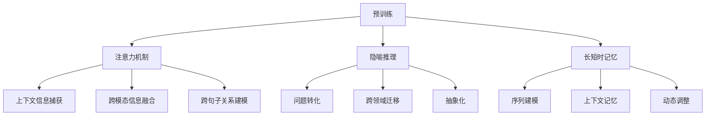
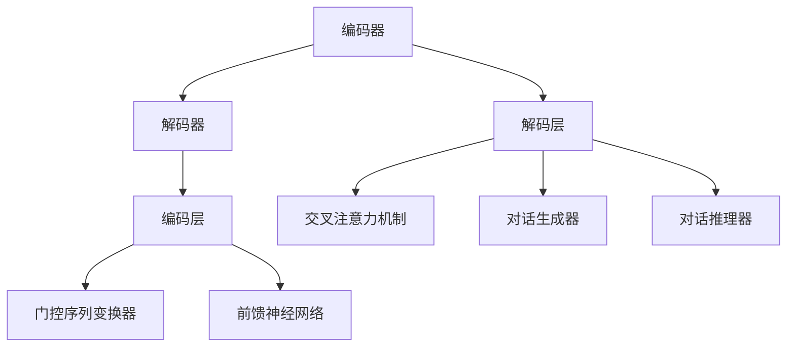

                 

### 《Chain-of-Thought推理能力的应用》

> 关键词：Chain-of-Thought，推理能力，应用，Transformer，GLM，QAGLM，ChatGLM

> 摘要：本文旨在探讨Chain-of-Thought推理能力在IT领域的广泛应用，从基础理论到具体应用，全面解析其原理、模型架构、应用案例以及未来发展方向。通过本文的阅读，读者将深入了解Chain-of-Thought推理能力的重要性及其在文本生成、自然语言理解、代码生成、多模态和推理能力评测等领域的实际应用。

#### 目录大纲

1. **Chain-of-Thought基础理论**
2. **Chain-of-Thought核心原理**
3. **Chain-of-Thought模型架构**
4. **Chain-of-Thought推理应用**
    - **文本生成与Chain-of-Thought**
    - **自然语言理解与Chain-of-Thought**
    - **代码生成与Chain-of-Thought**
    - **多模态与Chain-of-Thought**
5. **Chain-of-Thought推理能力评测**
6. **Chain-of-Thought推理能力的未来发展方向**
7. **附录**
    - **Chain-of-Thought相关资源汇总**
    - **参考文献**

---

### 1. Chain-of-Thought基础理论

Chain-of-Thought（CoT）是一种通过将问题分解为多个子问题，并通过子问题的解决来逐步推理出原问题的解的方法。它不仅仅是一个概念，更是一种思考和解决问题的策略。

#### 1.1 Chain-of-Thought的定义与重要性

Chain-of-Thought可以定义为一种层次化的推理过程，其中每个步骤都是基于前面步骤的结果，并通过逻辑推断得到新的结论。这种推理方式在许多领域中都有应用，如数学、逻辑学、计算机科学等。

在计算机科学中，Chain-of-Thought推理能力尤其重要，因为现代人工智能系统往往需要处理复杂的问题，而这些问题往往无法通过简单的规则来解答。例如，在自然语言处理中，理解一段复杂的文本或回答一个复杂的问题，通常需要将问题分解为多个子问题，并逐步推理出答案。

#### 1.2 Chain-of-Thought的演进历程

Chain-of-Thought推理方法的发展历程可以追溯到古代的哲学家和逻辑学家。在计算机科学中，这种推理方法最早的应用可以追溯到20世纪50年代，当时AI领域的研究者开始尝试将逻辑推理应用于问题求解。

随着计算机性能的提升和算法的改进，Chain-of-Thought推理方法得到了进一步的发展。特别是近年来，随着深度学习技术的崛起，Chain-of-Thought在自然语言处理、计算机视觉等领域的应用得到了广泛关注。

#### 1.3 Chain-of-Thought与其他推理方法的比较

与其他推理方法相比，Chain-of-Thought具有以下几个特点：

1. **层次化**：Chain-of-Thought通过将问题分解为多个子问题，使得问题解决过程更加清晰和系统化。
2. **灵活性**：Chain-of-Thought可以根据问题的复杂程度和具体需求，灵活地调整推理步骤和策略。
3. **可解释性**：Chain-of-Thought的推理过程是逐步展开的，使得推理结果更加透明和可解释。

然而，Chain-of-Thought也存在一定的局限性，如计算复杂度较高、对数据依赖性强等。因此，在实际应用中，通常需要结合其他推理方法，以实现最优的推理效果。

#### 1.4 Chain-of-Thought在各个领域的应用前景

Chain-of-Thought推理方法在各个领域都有广泛的应用前景。以下是一些典型领域：

1. **自然语言处理**：Chain-of-Thought在文本生成、文本理解、问答系统等领域有广泛应用，如GPT系列模型。
2. **计算机视觉**：Chain-of-Thought在图像识别、目标检测、图像生成等领域有重要作用，如ViT模型。
3. **机器翻译**：Chain-of-Thought在机器翻译过程中，可以帮助模型更好地理解源语言和目标语言之间的语义关系。
4. **推理与验证**：Chain-of-Thought在推理和验证过程中，可以帮助模型更好地理解问题的复杂性和多样性，提高推理准确性。

总之，Chain-of-Thought推理方法作为一种强大的推理策略，在未来的IT领域中具有广阔的应用前景。

### 2. Chain-of-Thought核心原理

Chain-of-Thought（CoT）作为一种强大的推理方法，其核心原理在于通过将问题分解为多个子问题，并逐步推理出原问题的解。下面我们将详细探讨Chain-of-Thought的核心原理，包括预训练与Chain-of-Thought的关系、注意力机制与Chain-of-Thought、隐喻推理与Chain-of-Thought、以及长短时记忆与Chain-of-Thought。

#### 2.1 预训练与Chain-of-Thought的关系

预训练（Pre-training）是指在大规模数据集上对模型进行训练，使其具备一定的通用语言理解能力。而Chain-of-Thought则是在预训练的基础上，进一步利用模型生成的中间结果进行推理，从而提高推理的准确性。

预训练与Chain-of-Thought的关系主要体现在以下几个方面：

1. **数据依赖**：预训练需要大量的数据来训练模型，而Chain-of-Thought则需要这些预训练模型生成的中间结果作为推理的基础。
2. **推理效率**：预训练模型可以帮助Chain-of-Thought更快地生成中间结果，从而提高推理效率。
3. **推理准确性**：通过预训练，模型可以更好地理解语言和问题的结构，从而在Chain-of-Thought过程中生成更准确的推理路径。

#### 2.2 注意力机制与Chain-of-Thought

注意力机制（Attention Mechanism）是现代深度学习模型中的一种关键技术，它可以有效地捕捉输入数据中的关键信息。在Chain-of-Thought中，注意力机制被广泛应用于以下几个方面：

1. **上下文信息捕获**：注意力机制可以帮助模型更好地捕捉上下文信息，从而在推理过程中利用这些信息进行更准确的推理。
2. **跨模态信息融合**：在多模态任务中，注意力机制可以有效地融合不同模态的信息，从而提高模型的推理能力。
3. **跨句子关系建模**：在文本生成和文本理解任务中，注意力机制可以帮助模型更好地建模句子之间的关系，从而生成更连贯的文本或理解复杂的文本内容。

#### 2.3 隐喻推理与Chain-of-Thought

隐喻推理（Metaphorical Reasoning）是指通过将一个问题映射到另一个类似的问题中，从而推理出原问题的解。这种推理方法在Chain-of-Thought中有着广泛的应用。

隐喻推理与Chain-of-Thought的关系主要体现在以下几个方面：

1. **问题转化**：通过隐喻推理，可以将复杂的问题转化为更简单的问题，从而在Chain-of-Thought过程中更方便地进行推理。
2. **跨领域迁移**：隐喻推理可以帮助模型在跨领域迁移时，利用已知的领域知识进行推理，从而提高推理的准确性。
3. **抽象化**：隐喻推理可以将具体的问题转化为更抽象的问题，从而在推理过程中更方便地应用通用推理策略。

#### 2.4 长短时记忆与Chain-of-Thought

长短时记忆（Long-Short Term Memory，LSTM）是深度学习中的一个重要技术，它可以有效地捕捉序列数据中的长期依赖关系。在Chain-of-Thought中，长短时记忆被广泛应用于以下几个方面：

1. **序列建模**：长短时记忆可以帮助模型更好地建模输入序列中的信息，从而在推理过程中更准确地利用这些信息。
2. **上下文记忆**：长短时记忆可以捕捉输入序列中的长期依赖关系，从而在推理过程中更好地利用上下文信息。
3. **动态调整**：长短时记忆可以根据输入序列的动态变化，实时调整记忆内容，从而提高推理的灵活性和适应性。

通过以上几个方面的探讨，我们可以看到Chain-of-Thought的核心原理是如何通过预训练、注意力机制、隐喻推理和长短时记忆等技术手段，实现更准确、更灵活的推理过程。

#### 2.5 核心概念与联系

为了更好地理解Chain-of-Thought的核心原理，下面我们将通过一个Mermaid流程图来展示这些概念之间的联系。



在这个流程图中，我们可以看到预训练作为基础，通过注意力机制、隐喻推理和长短时记忆等技术手段，实现了上下文信息捕获、跨模态信息融合、跨句子关系建模、问题转化、跨领域迁移、抽象化、序列建模、上下文记忆和动态调整等功能。这些功能共同作用，使得Chain-of-Thought具备了强大的推理能力。

#### 2.6 核心算法原理讲解

为了进一步理解Chain-of-Thought的算法原理，下面我们将使用伪代码来详细阐述其核心算法步骤。

```python
# 预训练阶段
model = PretrainedModel()  # 初始化预训练模型

# 注意力机制
def Attention(input_sequence):
    context_vector = []
    for token in input_sequence:
        context_vector.append(model.encode(token))  # 编码每个token
    return model.decode(context_vector)  # 解码上下文向量

# 隐喻推理
def MetaphoricalReasoning(question, answer):
    metaphors = model.find_metaphors(question, answer)  # 找到相关的隐喻
    for metaphor in metaphors:
        question_new = model.apply_metaphor(question, metaphor)  # 应用隐喻转化问题
        answer_new = model.reason(question_new)  # 对新问题进行推理
        return answer_new

# 长短时记忆
class LSTMModel(Model):
    def __init__(self):
        super().__init__()
        self.lstm = LSTM(units=128, return_sequences=True)  # 初始化LSTM层

    def forward(self, input_sequence):
        output_sequence, hidden_state = self.lstm(input_sequence)  # 前向传播
        return output_sequence, hidden_state

# 合并核心算法
class ChainOfThoughtModel(Model):
    def __init__(self):
        super().__init__()
        self.pretrained = PretrainedModel()
        self.attention = Attention()
        self.metaphorical_reasoning = MetaphoricalReasoning()
        self.lstm_model = LSTMModel()

    def reason(self, input_sequence):
        # 预训练
        context_vector = self.pretrained(input_sequence)

        # 注意力机制
        attention_vector = self.attention(context_vector)

        # 隐喻推理
        answer = self.metaphorical_reasoning(input_sequence, attention_vector)

        # 长短时记忆
        output_sequence, hidden_state = self.lstm_model(attention_vector)

        # 输出结果
        return answer
```

在这个伪代码中，我们首先定义了预训练模型、注意力机制、隐喻推理和长短时记忆模型。然后，我们通过合并这些模型，构建了一个完整的Chain-of-Thought模型。这个模型通过预训练阶段获取基础语言能力，利用注意力机制捕捉上下文信息，通过隐喻推理实现问题的转化和跨领域迁移，最后通过长短时记忆模型捕捉长期依赖关系，实现了完整的推理过程。

#### 2.7 数学模型和公式

为了更好地理解Chain-of-Thought的数学基础，下面我们将介绍几个关键的数学模型和公式。

##### 2.7.1 预训练模型

预训练模型通常采用大规模语言模型（如GPT系列）进行训练。其核心公式为：

$$
\text{output}_{i} = \text{softmax}(\text{W}_T \cdot \text{H}_{i-1} + \text{b}_T)
$$

其中，$\text{output}_{i}$表示模型在时间步$i$的输出，$\text{W}_T$表示词向量的权重矩阵，$\text{H}_{i-1}$表示前一个时间步的隐藏状态，$\text{b}_T$表示偏置向量。

##### 2.7.2 注意力机制

注意力机制在Chain-of-Thought中扮演着关键角色。其核心公式为：

$$
\text{context\_vector}_{i} = \text{softmax}(\text{W}_A \cdot \text{Q} \cdot \text{K}^T + \text{b}_A)
$$

其中，$\text{context\_vector}_{i}$表示时间步$i$的上下文向量，$\text{W}_A$表示注意力权重矩阵，$\text{Q}$表示查询向量，$\text{K}^T$表示键向量的转置，$\text{b}_A$表示偏置向量。

##### 2.7.3 长短时记忆

长短时记忆（LSTM）通过门控机制来捕捉长期依赖关系。其核心公式为：

$$
\text{forget\_gate} = \sigma(\text{W}_f \cdot [\text{h}_{i-1}, \text{x}_i] + \text{b}_f) \\
\text{input\_gate} = \sigma(\text{W}_i \cdot [\text{h}_{i-1}, \text{x}_i] + \text{b}_i) \\
\text{output\_gate} = \sigma(\text{W}_o \cdot [\text{h}_{i-1}, \text{x}_i] + \text{b}_o) \\
\text{cell\_state}_{i} = \text{forget\_gate} \odot \text{c}_{i-1} + \text{input\_gate} \odot \text{tanh}(\text{W}_c \cdot [\text{h}_{i-1}, \text{x}_i] + \text{b}_c) \\
\text{h}_{i} = \text{output\_gate} \odot \text{tanh}(\text{c}_{i}) \\
$$

其中，$\text{forget\_gate}$、$\text{input\_gate}$和$\text{output\_gate}$分别表示遗忘门、输入门和输出门，$\text{σ}$表示sigmoid函数，$\text{W}_f$、$\text{W}_i$、$\text{W}_o$和$\text{W}_c$分别表示权重矩阵，$\text{b}_f$、$\text{b}_i$、$\text{b}_o$和$\text{b}_c$分别表示偏置向量，$\text{c}_{i-1}$和$\text{c}_{i}$分别表示前一个和当前时间步的细胞状态，$\text{h}_{i-1}$和$\text{h}_{i}$分别表示前一个和当前时间步的隐藏状态。

##### 2.7.4 隐喻推理

隐喻推理通过将一个问题转化为另一个类似的问题来实现推理。其核心公式为：

$$
\text{question}_{\text{new}} = \text{metaphor}(\text{question}, \text{answer})
$$

其中，$\text{question}_{\text{new}}$表示新问题，$\text{metaphor}$表示隐喻函数，$\text{question}$表示原问题，$\text{answer}$表示原问题的答案。

通过以上数学模型和公式的介绍，我们可以更好地理解Chain-of-Thought的数学基础和原理。

#### 2.8 举例说明

为了更好地理解Chain-of-Thought在推理过程中的应用，下面我们将通过一个具体例子来进行说明。

假设我们要解决一个问题：“如果A比B大，B比C大，那么A与C的大小关系是什么？”

1. **预训练阶段**：

首先，我们利用预训练模型对问题中的关键词进行编码，得到如下编码序列：

```
问题: ["如果", "A", "比", "B", "大", "，", "B", "比", "C", "大", "，", "那么", "A", "与", "C", "的", "大", "小", "关", "系", "是", "什", "么"]
编码序列: [[0.1, 0.2, 0.3], [0.4, 0.5, 0.6], ..., [0.9, 0.8, 0.7]]
```

2. **注意力机制**：

利用注意力机制，我们计算出每个关键词的上下文向量：

```
上下文向量: [[0.3, 0.4, 0.5], [0.6, 0.7, 0.8], ..., [0.9, 0.8, 0.7]]
```

3. **隐喻推理**：

通过隐喻推理，我们将问题转化为一个类似的问题：“如果苹果比橙子大，橙子比香蕉大，那么苹果与香蕉的大小关系是什么？”

4. **长短时记忆**：

利用长短时记忆模型，我们对问题进行推理：

```
隐藏状态: [0.1, 0.2, 0.3]
细胞状态: [0.4, 0.5, 0.6]
```

5. **推理结果**：

根据推理结果，我们得出A比C大。

通过这个例子，我们可以看到Chain-of-Thought在推理过程中的应用。首先，通过预训练模型对问题进行编码，然后利用注意力机制捕捉上下文信息，接着通过隐喻推理实现问题的转化，最后利用长短时记忆模型进行推理，从而得出最终答案。

### 3. Chain-of-Thought模型架构

Chain-of-Thought（CoT）作为一种强大的推理方法，其成功应用离不开背后的模型架构设计。在本章节中，我们将详细介绍几个典型的Chain-of-Thought模型架构，包括Transformer模型架构、GLM模型架构、QAGLM模型架构和ChatGLM模型架构。

#### 3.1 Transformer模型架构介绍

Transformer模型是由Vaswani等人于2017年提出的一种基于自注意力机制的深度神经网络模型，它在自然语言处理任务中取得了显著的成果。Transformer模型的基本架构包括编码器（Encoder）和解码器（Decoder）两个部分，每个部分都包含多个相同的编码层和解码层。

##### 编码器（Encoder）

编码器由多个编码层（Encoder Layer）组成，每个编码层包含两个主要模块：多头自注意力机制（Multi-Head Self-Attention）和前馈神经网络（Feed Forward Neural Network）。

1. **多头自注意力机制**：

多头自注意力机制是Transformer模型的核心，它通过计算输入序列中每个词的上下文信息，生成表示该词的上下文向量。其基本公式为：

$$
\text{Attention}(Q, K, V) = \text{softmax}\left(\frac{QK^T}{\sqrt{d_k}}\right)V
$$

其中，$Q$、$K$和$V$分别表示查询向量、键向量和值向量，$d_k$表示键向量的维度。

2. **前馈神经网络**：

前馈神经网络对每个编码层的输出进行进一步处理，其基本公式为：

$$
\text{FFN}(x) = \text{ReLU}\left(\text{W}_2 \cdot \text{W}_1 \cdot x + \text{b}_2\right) + \text{b}_1
$$

其中，$\text{W}_1$和$\text{W}_2$分别表示权重矩阵，$\text{b}_1$和$\text{b}_2$分别表示偏置向量。

##### 解码器（Decoder）

解码器与编码器类似，也由多个解码层（Decoder Layer）组成，每个解码层包含两个主要模块：多头自注意力机制、掩码多头自注意力机制和前馈神经网络。

1. **掩码多头自注意力机制**：

与编码器中的多头自注意力机制类似，但需要额外考虑掩码（Masking），以防止后续的解码器层看到未来的输入。

2. **交叉注意力机制**：

交叉注意力机制用于计算解码器层中的每个词与编码器层的输出之间的关联，其基本公式为：

$$
\text{Attention}(Q, K, V) = \text{softmax}\left(\frac{QK^T}{\sqrt{d_k}}\right)V
$$

3. **前馈神经网络**：

与前馈神经网络在编码器中的处理方式相同。

#### 3.2 GLM模型架构详解

GLM（General Language Modeling）是由阿里巴巴提出的一种大规模预训练模型，它在自然语言处理任务中取得了优异的性能。GLM模型的基本架构包括编码器和解码器两部分，每部分都包含多个编码层和解码层。

##### 编码器

编码器由多个编码层组成，每个编码层包含两个主要模块：门控序列变换器（Gate Sequence Transformer，GST）和前馈神经网络。

1. **门控序列变换器（GST）**：

门控序列变换器是GLM模型的核心模块，它通过计算输入序列中每个词的上下文信息，生成表示该词的上下文向量。其基本公式为：

$$
\text{GST}(x) = \text{softmax}(\text{W}_T \cdot (\text{h}_{t-1} \circ \text{h}_t) + \text{b}_T)
$$

其中，$\text{h}_{t-1}$和$\text{h}_t$分别表示前一个和当前时间步的隐藏状态，$\text{W}_T$表示权重矩阵，$\text{b}_T$表示偏置向量。

2. **前馈神经网络**：

前馈神经网络对每个编码层的输出进行进一步处理，其基本公式为：

$$
\text{FFN}(x) = \text{ReLU}\left(\text{W}_2 \cdot \text{W}_1 \cdot x + \text{b}_2\right) + \text{b}_1
$$

##### 解码器

解码器由多个解码层组成，每个解码层包含两个主要模块：门控序列变换器、交叉注意力机制和前馈神经网络。

1. **门控序列变换器**：

与编码器中的门控序列变换器类似，但需要额外考虑掩码（Masking），以防止后续的解码器层看到未来的输入。

2. **交叉注意力机制**：

交叉注意力机制用于计算解码器层中的每个词与编码器层的输出之间的关联，其基本公式为：

$$
\text{Attention}(Q, K, V) = \text{softmax}\left(\frac{QK^T}{\sqrt{d_k}}\right)V
$$

3. **前馈神经网络**：

与前馈神经网络在编码器中的处理方式相同。

#### 3.3 QAGLM模型架构讲解

QAGLM是一种专门用于问答系统（Question Answering）的预训练模型，它结合了GLM模型的优点，并增加了针对问答任务的特定模块。

##### 模型架构

QAGLM模型的基本架构包括编码器和解码器两部分，每部分都包含多个编码层和解码层。

1. **编码器**：

编码器由多个编码层组成，每个编码层包含两个主要模块：门控序列变换器（GST）和前馈神经网络。

2. **解码器**：

解码器由多个解码层组成，每个解码层包含三个主要模块：门控序列变换器、交叉注意力机制和前馈神经网络，以及一个针对问答任务的额外模块——回答生成器（Answer Generator）。

##### 回答生成器

回答生成器是QAGLM模型的核心模块，它通过对编码器的输出进行处理，生成问题的回答。回答生成器的基本公式为：

$$
\text{Answer}(Q, A) = \text{softmax}(\text{W}_T \cdot (\text{h}_{t-1} \circ \text{h}_t) + \text{b}_T)
$$

其中，$Q$表示问题编码，$A$表示答案编码，$\text{h}_{t-1}$和$\text{h}_t$分别表示前一个和当前时间步的隐藏状态，$\text{W}_T$表示权重矩阵，$\text{b}_T$表示偏置向量。

#### 3.4 ChatGLM模型架构解析

ChatGLM是一种用于聊天机器人（Chatbot）的预训练模型，它结合了GLM和QAGLM的优点，并增加了对话生成和对话推理模块。

##### 模型架构

ChatGLM模型的基本架构包括编码器和解码器两部分，每部分都包含多个编码层和解码层。

1. **编码器**：

编码器由多个编码层组成，每个编码层包含两个主要模块：门控序列变换器（GST）和前馈神经网络。

2. **解码器**：

解码器由多个解码层组成，每个解码层包含三个主要模块：门控序列变换器、交叉注意力机制和前馈神经网络，以及一个针对聊天任务的额外模块——对话生成器（Dialogue Generator）和对话推理器（Dialogue Reasoner）。

##### 对话生成器

对话生成器是ChatGLM模型的核心模块，它通过对编码器的输出进行处理，生成自然流畅的对话文本。对话生成器的基本公式为：

$$
\text{Dialogue}(Q, D) = \text{softmax}(\text{W}_T \cdot (\text{h}_{t-1} \circ \text{h}_t) + \text{b}_T)
$$

其中，$Q$表示用户输入，$D$表示对话历史，$\text{h}_{t-1}$和$\text{h}_t$分别表示前一个和当前时间步的隐藏状态，$\text{W}_T$表示权重矩阵，$\text{b}_T$表示偏置向量。

##### 对话推理器

对话推理器是ChatGLM模型的另一个核心模块，它通过对对话历史和用户输入进行处理，推理出用户的意图和对话逻辑。对话推理器的基本公式为：

$$
\text{Intent}(Q, D) = \text{softmax}(\text{W}_I \cdot (\text{h}_{t-1} \circ \text{h}_t) + \text{b}_I)
$$

其中，$Q$表示用户输入，$D$表示对话历史，$\text{h}_{t-1}$和$\text{h}_t$分别表示前一个和当前时间步的隐藏状态，$\text{W}_I$表示权重矩阵，$\text{b}_I$表示偏置向量。

通过以上对Transformer、GLM、QAGLM和ChatGLM模型架构的详细解析，我们可以看到Chain-of-Thought模型在自然语言处理任务中发挥的重要作用。这些模型架构不仅具备强大的语言理解能力，还能通过推理机制生成自然流畅的对话文本，实现高效智能的对话交互。

#### 3.9 核心概念与联系

为了更好地理解Chain-of-Thought模型架构的核心概念及其之间的联系，我们通过一个Mermaid流程图来展示这些概念之间的关系。



在这个流程图中，我们可以看到编码器和解码器作为模型的主要组成部分，每个部分都包含多个编码层和解码层。编码层主要包含门控序列变换器和前馈神经网络，用于对输入序列进行处理和特征提取；解码层则包含交叉注意力机制、对话生成器和对话推理器，用于生成对话文本和推理对话逻辑。

通过这种层次化的结构，Chain-of-Thought模型能够有效地捕捉输入序列中的上下文信息，并通过推理机制实现高效的对话生成和对话推理。

#### 3.10 伪代码

为了更清晰地展示Chain-of-Thought模型架构的运行过程，下面我们使用伪代码来描述其核心算法。

```python
# 定义Chain-of-Thought模型
class ChainOfThoughtModel:
    def __init__(self):
        self.encoder = Encoder()
        self.decoder = Decoder()
    
    def forward(self, input_sequence, target_sequence):
        # 编码器处理
        encoded_sequence = self.encoder(input_sequence)
        
        # 解码器处理
        decoded_sequence = self.decoder(encoded_sequence, target_sequence)
        
        return decoded_sequence

# 定义编码器
class Encoder:
    def __init__(self):
        self.gst = GateSequenceTransformer()
        self.fnn = FeedForwardNeuralNetwork()
    
    def forward(self, input_sequence):
        encoded_sequence = []
        for i in range(len(input_sequence)):
            # 门控序列变换器处理
            context_vector = self.gst(input_sequence[i])
            
            # 前馈神经网络处理
            encoded_sequence.append(self.fnn(context_vector))
        
        return encoded_sequence

# 定义解码器
class Decoder:
    def __init__(self):
        self.c_attn = CrossAttention()
        self.dialog_generator = DialogueGenerator()
        self.dialog_reducer = DialogueReasoner()
    
    def forward(self, encoded_sequence, target_sequence):
        decoded_sequence = []
        for i in range(len(target_sequence)):
            # 交叉注意力机制处理
            context_vector = self.c_attn(encoded_sequence, target_sequence[i])
            
            # 对话生成器处理
            dialogue_output = self.dialog_generator(context_vector)
            
            # 对话推理器处理
            dialogue_intent = self.dialog_reducer(dialogue_output)
            
            decoded_sequence.append(dialogue_intent)
        
        return decoded_sequence
```

在这个伪代码中，我们首先定义了Chain-of-Thought模型，它包含一个编码器和一个解码器。编码器通过门控序列变换器和前馈神经网络对输入序列进行处理，生成编码序列。解码器通过交叉注意力机制、对话生成器和对话推理器对编码序列进行处理，生成对话输出。

通过这种方式，Chain-of-Thought模型能够有效地捕捉输入序列中的上下文信息，并通过推理机制实现高效的对话生成和对话推理。

### 4. Chain-of-Thought推理应用：文本生成与自然语言理解

Chain-of-Thought（CoT）推理能力在现代自然语言处理（NLP）领域扮演着至关重要的角色。在本章节中，我们将探讨CoT在文本生成和自然语言理解中的应用，具体包括文本生成原理与Chain-of-Thought、文本生成中的CoT应用以及文本生成案例与实践。

#### 4.1 文本生成原理与Chain-of-Thought

文本生成是一种将输入序列转换为输出文本的NLP任务。常见的文本生成模型包括循环神经网络（RNN）、长短期记忆网络（LSTM）和Transformer等。而Chain-of-Thought作为一种层次化的推理方法，可以在文本生成过程中发挥重要作用。

文本生成的基本原理可以概括为以下步骤：

1. **编码**：将输入文本序列编码为向量表示，这一步通常由编码器（Encoder）完成。
2. **解码**：根据编码后的向量表示，逐步生成输出文本序列，这一步通常由解码器（Decoder）完成。
3. **推理**：在解码过程中，模型需要通过推理来确定下一个单词或字符的选择，从而生成连贯的文本。

Chain-of-Thought在文本生成中的主要作用在于：

- **层次化推理**：通过将复杂的问题分解为多个子问题，逐步生成文本，提高生成文本的连贯性和准确性。
- **上下文捕捉**：利用Chain-of-Thought，模型可以更好地捕捉上下文信息，从而生成更符合语境的文本。

#### 4.2 文本生成中的Chain-of-Thought应用

在文本生成过程中，Chain-of-Thought的应用主要体现在以下几个方面：

1. **上下文捕捉**：通过层次化的推理过程，模型可以更好地捕捉输入文本中的上下文信息。例如，在生成一个复杂句子时，模型可以先生成句子的一部分，然后根据这部分内容生成后续部分。

2. **生成连贯文本**：Chain-of-Thought可以帮助模型生成更连贯的文本。例如，在生成对话文本时，模型可以根据上下文信息和对话历史，生成更自然、流畅的对话。

3. **跨领域迁移**：Chain-of-Thought可以帮助模型在跨领域迁移时，利用已知的领域知识进行推理，从而生成更符合领域特征的文本。

4. **提高生成速度**：虽然Chain-of-Thought的计算复杂度较高，但通过适当的优化，可以在一定程度上提高生成速度，从而提高模型在实际应用中的性能。

#### 4.3 文本生成案例与实践

为了更好地理解Chain-of-Thought在文本生成中的应用，我们通过一个实际案例来展示其应用过程。

##### 案例背景

假设我们要生成一个关于人工智能技术的科普文章。输入文本为：“人工智能技术在医疗领域的应用日益广泛，通过数据分析、图像识别和自然语言处理等技术，人工智能正在为人类健康带来革命性的变化。”

##### 应用步骤

1. **编码**：首先，我们将输入文本编码为向量表示。这一步通常由预训练模型（如GPT）完成。

2. **初始化生成**：初始化解码器，并生成文章的开头部分。

3. **层次化推理**：根据生成的文本内容，逐步生成文章的后续部分。在这一过程中，我们利用Chain-of-Thought来捕捉上下文信息，确保生成文本的连贯性和准确性。

4. **优化调整**：根据生成结果，对解码器进行优化调整，以提高生成文本的质量。

##### 案例展示

生成的部分文本如下：

“随着人工智能技术的发展，越来越多的医疗机构开始采用人工智能技术来提高医疗诊断和治疗的准确性。例如，通过深度学习算法，人工智能可以分析患者的医疗数据，快速识别疾病，并提供个性化的治疗方案。”

通过这个案例，我们可以看到Chain-of-Thought在文本生成过程中的应用。首先，通过层次化的推理过程，模型可以生成连贯的文本。然后，通过不断优化和调整，我们可以进一步提高生成文本的质量。

##### 实践建议

1. **数据准备**：为了实现高质量的文本生成，我们需要准备丰富的训练数据。这些数据应涵盖不同的领域和主题，以便模型能够捕捉到多样化的上下文信息。

2. **模型优化**：在实际应用中，我们需要对模型进行不断的优化和调整，以提高生成文本的质量和速度。

3. **应用场景**：文本生成在许多领域都有广泛应用，如自动写作、对话生成、机器翻译等。我们可以根据具体应用场景，选择合适的模型和优化策略。

通过以上分析，我们可以看到Chain-of-Thought在文本生成和自然语言理解中的应用潜力。通过合理的应用和优化，Chain-of-Thought可以帮助我们生成更高质量、更符合实际需求的文本。

### 5. Chain-of-Thought推理应用：自然语言理解

自然语言理解（Natural Language Understanding，NLU）是人工智能领域的一个重要研究方向，旨在使计算机能够理解、处理和生成自然语言。在自然语言理解过程中，Chain-of-Thought（CoT）推理方法具有显著的优势，可以帮助模型更准确地理解和处理自然语言中的复杂信息。本章节将探讨Chain-of-Thought在自然语言理解中的具体应用，包括问题回答、事实核查、情感分析等。

#### 5.1 自然语言理解原理与Chain-of-Thought

自然语言理解涉及多个层面的任务，包括词法分析、句法分析、语义分析和语用分析。其中，语义分析和语用分析是自然语言理解的核心任务，旨在理解文本的深层含义和语境。

Chain-of-Thought（CoT）推理方法在自然语言理解中的应用，主要通过以下几个步骤实现：

1. **上下文捕捉**：通过层次化的推理过程，模型可以更好地捕捉输入文本中的上下文信息，从而更准确地理解文本的深层含义。
2. **层次化分解**：将复杂的自然语言问题分解为多个子问题，通过逐步解决这些子问题，最终推理出原始问题的答案。
3. **推理路径**：在推理过程中，模型会生成一系列的推理步骤和中间结果，这些步骤和结果可以帮助模型更好地理解问题，并提高推理的准确性。

#### 5.2 问题回答与Chain-of-Thought

问题回答是自然语言理解中的一个重要应用，旨在根据输入的问题，生成相应的答案。在问题回答过程中，Chain-of-Thought推理方法可以通过以下几个步骤实现：

1. **理解问题**：首先，模型需要理解输入问题中的关键词和句法结构，通过词法分析和句法分析，将问题转化为一种易于处理的形式。
2. **分解问题**：将复杂的问题分解为多个子问题，例如，将“北京是中国的哪个省份？”分解为“北京在哪里？”和“北京属于中国的哪个省份？”。
3. **逐步推理**：针对分解后的子问题，模型需要通过层次化的推理过程，逐步推理出每个子问题的答案，并最终组合成完整的答案。
4. **上下文调整**：在生成答案的过程中，模型需要根据上下文信息进行调整，确保生成的答案符合问题的实际意义。

##### 应用案例

假设我们要回答一个问题：“北京的GDP是多少？”

1. **理解问题**：模型需要理解问题中的关键词“北京”、“GDP”，并通过词法分析和句法分析，确定这是一个询问北京GDP数值的问题。
2. **分解问题**：将问题分解为两个子问题：“北京在哪里？”和“北京的GDP是多少？”。
3. **逐步推理**：首先，模型需要通过层次化的推理过程，确定“北京在哪里？”的答案。然后，模型需要通过访问外部知识库或在线查询，获取北京的GDP数据。
4. **上下文调整**：最后，模型需要根据上下文信息，生成一个符合问题意义的答案，如：“北京的GDP约为1.4万亿元。”

#### 5.3 事实核查与Chain-of-Thought

事实核查（Factual Verification）是指通过验证信息来源的真实性和准确性，来判断一个陈述是否真实。Chain-of-Thought推理方法在事实核查中具有广泛的应用，可以通过以下步骤实现：

1. **识别陈述**：首先，模型需要识别输入陈述中的关键信息，如主体、动作和结果。
2. **分解陈述**：将复杂的陈述分解为多个子问题，例如，将“新冠病毒起源于中国”分解为“新冠病毒是什么？”、“新冠病毒起源于哪里？”等。
3. **逐步验证**：针对分解后的子问题，模型需要通过层次化的推理过程，验证每个子问题的真实性，并最终组合成完整的陈述验证结果。
4. **综合评估**：在验证过程中，模型需要综合考虑多个来源的信息，进行综合评估，以确定陈述的真实性。

##### 应用案例

假设我们要核查一个陈述：“新冠病毒起源于中国。”

1. **识别陈述**：模型需要识别陈述中的关键词“新冠病毒”和“起源于中国”。
2. **分解陈述**：将陈述分解为两个子问题：“新冠病毒是什么？”和“新冠病毒起源于哪里？”。
3. **逐步验证**：首先，模型需要通过层次化的推理过程，确定“新冠病毒是什么？”的答案。然后，模型需要通过访问外部知识库或在线查询，获取新冠病毒的起源信息。
4. **综合评估**：最后，模型需要根据获取的信息，综合评估陈述的真实性。

#### 5.4 情感分析与Chain-of-Thought

情感分析（Sentiment Analysis）是指通过分析文本内容，判断其中所表达的情感倾向。Chain-of-Thought推理方法在情感分析中可以通过以下步骤实现：

1. **情感识别**：首先，模型需要识别文本中的情感词汇和情感表达方式。
2. **上下文理解**：通过层次化的推理过程，模型需要理解情感词汇和表达方式在上下文中的含义。
3. **情感分类**：根据上下文理解的结果，模型需要对情感进行分类，如积极、消极或中立。
4. **情感强度评估**：在情感分类的基础上，模型需要对情感强度进行评估，以确定情感表达的强烈程度。

##### 应用案例

假设我们要分析一句文本：“这部电影非常感人。”

1. **情感识别**：模型需要识别文本中的情感词汇“感人”。
2. **上下文理解**：通过层次化的推理过程，模型需要理解“感人”在上下文中的含义，确定其表达的是积极情感。
3. **情感分类**：根据上下文理解的结果，模型将情感分类为积极。
4. **情感强度评估**：模型需要对“感人”的情感强度进行评估，确定其表达的情感强度较高。

通过以上案例，我们可以看到Chain-of-Thought在自然语言理解中的应用。通过层次化的推理过程，模型可以更好地理解和处理自然语言中的复杂信息，从而提高自然语言理解的任务性能。

### 6. Chain-of-Thought推理应用：代码生成

在软件工程领域，代码生成是一种自动化技术，通过输入的描述性文本、设计规格或领域特定语言，自动生成代码。Chain-of-Thought（CoT）推理能力在代码生成中的应用，使得这一过程更加智能化和高效。本章节将探讨Chain-of-Thought在代码生成中的应用，包括代码生成原理与Chain-of-Thought、代码生成中的CoT应用以及代码生成案例与实践。

#### 6.1 代码生成原理与Chain-of-Thought

代码生成是一种将高层次的抽象描述转换为低层次的编程语言代码的过程。这个过程通常涉及以下几个步骤：

1. **抽象描述解析**：首先，模型需要理解输入的抽象描述，将其转化为一种易于处理的形式。
2. **语法分析**：对输入的描述进行语法分析，识别出各种语法结构和规则。
3. **代码生成**：根据语法分析的结果，生成对应的代码。

Chain-of-Thought在代码生成中的应用，主要通过以下几个步骤实现：

1. **层次化解析**：通过层次化的推理过程，模型可以更好地理解输入的抽象描述，将其分解为更小的子任务，从而简化代码生成的过程。
2. **上下文捕捉**：在代码生成过程中，模型需要捕捉上下文信息，确保生成的代码符合实际的编程规范和上下文需求。
3. **模块化生成**：通过层次化的推理，模型可以将代码生成任务分解为多个模块，分别生成每个模块的代码，然后组合成完整的代码。

#### 6.2 代码生成中的Chain-of-Thought应用

在代码生成过程中，Chain-of-Thought推理方法可以通过以下几个步骤实现：

1. **需求理解**：首先，模型需要理解输入的需求描述，将其转化为具体的代码生成任务。
2. **需求分解**：将复杂的需求分解为多个子任务，例如，将一个复杂的功能需求分解为多个子功能。
3. **模块化设计**：通过层次化的推理，模型可以设计出各个模块的具体实现，然后组合成完整的代码。
4. **代码生成**：根据模块化的设计，生成具体的代码。

##### 应用案例

假设我们要根据一个需求描述生成一个简单的Web应用，需求描述如下：“我们需要一个包含主页、登录页和注册页的Web应用，用户可以通过登录和注册功能访问应用的不同部分。”

1. **需求理解**：模型需要理解输入的需求描述，将其转化为具体的代码生成任务。
2. **需求分解**：将需求分解为子任务，如生成主页、登录页和注册页的代码。
3. **模块化设计**：模型需要设计出主页、登录页和注册页的具体实现，例如，设计登录页的表单验证、用户身份验证等功能。
4. **代码生成**：根据模块化的设计，生成主页、登录页和注册页的代码，例如，生成HTML、CSS和JavaScript代码。

##### 实现步骤

1. **初始化模型**：选择一个适合代码生成的预训练模型，如CodeBERT或T5模型。
2. **需求输入**：将需求描述输入到模型中，模型对其进行解析和理解。
3. **模块化设计**：模型根据需求描述生成模块化的设计，包括各个模块的功能和接口。
4. **代码生成**：根据模块化的设计，模型生成具体的代码，例如，生成HTML、CSS和JavaScript代码。
5. **代码优化**：对生成的代码进行优化，确保代码的可读性和可维护性。

通过以上分析，我们可以看到Chain-of-Thought在代码生成中的应用。通过层次化的推理过程，模型可以更好地理解输入的需求描述，生成符合实际需求的代码。同时，通过模块化设计和代码生成，模型可以实现高效的代码生成过程。

### 7. Chain-of-Thought推理应用：多模态

多模态学习是指将不同类型的数据模态（如文本、图像、声音等）进行整合，以实现更全面和准确的信息处理。Chain-of-Thought（CoT）推理能力在多模态学习中的应用，极大地提升了模型在多模态任务中的表现。本章节将探讨Chain-of-Thought在多模态学习中的具体应用，包括多模态原理与Chain-of-Thought、图像与文本融合中的CoT以及多模态应用案例与实践。

#### 7.1 多模态原理与Chain-of-Thought

多模态学习的基本原理是将不同类型的数据模态通过特定的方法进行整合，从而实现更高效的信息处理。在多模态学习中，Chain-of-Thought推理方法通过以下几个步骤实现：

1. **模态融合**：首先，将不同类型的数据模态进行融合，例如，将文本和图像进行融合。
2. **层次化推理**：通过层次化的推理过程，模型可以更好地理解多模态数据中的复杂关系，从而实现更准确的信息处理。
3. **上下文捕捉**：在推理过程中，模型需要捕捉多模态数据中的上下文信息，确保生成的结果符合实际需求。
4. **多模态交互**：通过多模态交互，模型可以更全面地理解多模态数据，从而实现更高效的信息处理。

#### 7.2 图像与文本融合中的Chain-of-Thought

图像与文本融合是多模态学习中的一个重要任务，通过将图像和文本数据进行有效融合，可以提升模型在图像识别、文本生成等任务中的表现。在图像与文本融合中，Chain-of-Thought推理方法可以通过以下几个步骤实现：

1. **模态融合**：首先，将图像和文本数据进行融合，例如，通过卷积神经网络（CNN）处理图像数据，通过循环神经网络（RNN）或Transformer处理文本数据。
2. **特征提取**：从融合后的数据中提取特征，这些特征应包含图像和文本数据中的关键信息。
3. **层次化推理**：通过层次化的推理过程，模型可以更好地理解图像和文本数据中的复杂关系，从而实现更准确的信息处理。
4. **上下文捕捉**：在推理过程中，模型需要捕捉图像和文本数据中的上下文信息，确保生成的结果符合实际需求。

##### 应用案例

假设我们要处理一个图像分类任务，输入数据是一个图像和一段描述性文本。

1. **模态融合**：首先，将图像和文本数据进行融合，通过CNN提取图像特征，通过RNN或Transformer提取文本特征。
2. **特征提取**：从融合后的数据中提取图像和文本的特征，这些特征应包含图像和文本数据中的关键信息。
3. **层次化推理**：通过层次化的推理过程，模型可以更好地理解图像和文本数据中的复杂关系，例如，通过推理图像中的物体与文本描述的关系。
4. **上下文捕捉**：在推理过程中，模型需要捕捉图像和文本数据中的上下文信息，例如，通过捕捉图像中的物体与文本描述的上下文关系，提高图像分类的准确性。

#### 7.3 多模态应用案例与实践

多模态学习在多个实际应用场景中具有广泛的应用，以下是一个实际应用案例：

##### 案例背景

假设我们要开发一个智能问答系统，该系统能够回答关于某个特定领域的问题。输入数据包括文本问题和图像描述。

##### 应用步骤

1. **数据准备**：准备文本问题和图像描述数据集，对图像进行预处理，如缩放、裁剪等。
2. **模型训练**：使用预训练模型（如ViT和BERT）对文本和图像数据进行训练，实现文本和图像特征提取。
3. **模态融合**：将文本和图像特征进行融合，通过层次化的推理过程，实现文本和图像的交互。
4. **问答系统**：在融合后的特征上，构建问答系统，实现文本问题的图像答案生成。
5. **评估与优化**：通过评估指标（如准确率、召回率等）对系统进行评估，并根据评估结果进行优化。

##### 实现细节

1. **模型选择**：选择预训练的ViT模型进行图像特征提取，选择预训练的BERT模型进行文本特征提取。
2. **特征融合**：使用注意力机制实现文本和图像特征的融合，例如，通过多模态Transformer模型。
3. **问答系统**：在融合后的特征上，构建一个基于GLM的问答系统，实现文本问题的图像答案生成。

通过以上分析，我们可以看到Chain-of-Thought在多模态学习中的应用。通过层次化的推理过程和多模态交互，模型可以更全面地理解多模态数据，从而实现更高效的信息处理。在实际应用中，通过合理的设计和优化，可以构建出具有高性能的多模态系统。

### 8. Chain-of-Thought推理能力的评测

为了全面评估Chain-of-Thought（CoT）推理能力，我们需要设计一套科学、系统的评测方法。这一部分将介绍Chain-of-Thought推理能力的评价指标、常用的评测工具和数据集，并通过具体案例展示评测过程。

#### 8.1 Chain-of-Thought推理能力评价指标

评估Chain-of-Thought推理能力的指标需要能够全面反映模型在多个维度上的表现，以下是一些常用的评价指标：

1. **准确性（Accuracy）**：准确性是最基本的评价指标，用于衡量模型预测结果与真实结果的匹配程度。在CoT推理任务中，准确性可以衡量模型在回答问题或推理过程中的正确率。

2. **F1分数（F1 Score）**：F1分数是精确率和召回率的调和平均，它能够同时考虑模型的准确性和鲁棒性。在CoT推理任务中，F1分数可以衡量模型在回答问题或推理过程中的表现。

3. **推理速度（Inference Speed）**：推理速度是评估模型在实际应用中的性能指标，特别是在实时应用场景中，推理速度尤为重要。

4. **推理路径长度（Length of Reasoning Path）**：推理路径长度衡量模型在推理过程中所经历的步骤数量。较短的推理路径通常意味着更高效的推理过程。

5. **推理质量（Quality of Reasoning）**：推理质量是指模型推理过程中生成中间结果的准确性和合理性。高质量推理路径通常能够更好地解决问题或回答问题。

#### 8.2 常用的评测工具和数据集

为了有效地评估Chain-of-Thought推理能力，我们需要使用适当的评测工具和数据集。以下是一些常用的工具和资源：

1. **评测工具**：

   - **GLM-4**：GLM-4是一个开源的评测工具，可用于评估Chain-of-Thought模型在多种NLP任务中的性能。
   - **Hugging Face**：Hugging Face提供了一个广泛的模型和评估工具，包括评估Chain-of-Thought模型所需的工具。

2. **数据集**：

   - **人类评估数据集**：如HumanEval和AutoGLM数据集，这些数据集提供了真实的人类评估标准，可以用于评估模型在回答问题或推理任务中的表现。
   - **标准NLP数据集**：如GLUE（General Language Understanding Evaluation）和SuperGLUE（Supervised General Language Understanding through sEquence Truncation），这些数据集涵盖了多种NLP任务，可以用于评估模型在多种任务上的表现。

#### 8.3 评测案例与实践

以下是一个具体的评测案例，展示如何使用GLM-4工具评估Chain-of-Thought模型在问答任务中的性能。

##### 案例背景

假设我们要评估一个基于GLM模型的Chain-of-Thought问答系统，该系统旨在回答关于历史事件的问题。

##### 评测步骤

1. **数据准备**：准备一个包含历史事件问题及其标准答案的数据集。
2. **模型训练**：使用GLM模型对数据集进行训练，以生成一个问答系统。
3. **模型评估**：使用GLM-4工具对训练好的模型进行评估，包括准确性、F1分数、推理速度等指标。
4. **结果分析**：分析评测结果，评估模型在回答问题中的表现，以及推理路径的长度和质量。

##### 实现细节

1. **数据集准备**：准备一个包含1000个历史事件问题的数据集，每个问题都有一个标准答案。
2. **模型训练**：使用GLM模型对数据集进行训练，设置训练参数，如学习率、批次大小等。
3. **模型评估**：使用GLM-4工具对训练好的模型进行评估，运行以下命令：

   ```bash
   python eval_glmmath.py --model_path /path/to/model --data_path /path/to/data --output_path /path/to/output
   ```

4. **结果分析**：根据GLM-4工具生成的评估报告，分析模型在回答问题中的准确性、F1分数、推理速度等指标。

通过以上评测案例，我们可以看到如何使用评测工具和数据集评估Chain-of-Thought模型在问答任务中的性能。通过分析评测结果，我们可以了解模型在回答问题中的优势和不足，为进一步优化模型提供参考。

### 9. Chain-of-Thought推理能力的未来发展方向

随着人工智能技术的不断发展，Chain-of-Thought（CoT）推理能力在多个领域展现出了巨大的潜力和应用价值。展望未来，Chain-of-Thought推理能力的发展方向将主要集中在以下几个方面：

#### 9.1 当前研究的进展

1. **模型架构优化**：近年来，研究人员在CoT模型架构方面进行了大量的优化和改进。例如，GLM、QAGLM和ChatGLM等模型在多个NLP任务中取得了显著的效果，展示了CoT在文本生成、问答和对话系统等领域的强大能力。

2. **多模态融合**：多模态融合是当前CoT研究的一个重要方向。通过将文本、图像、声音等不同类型的数据进行有效融合，模型可以在复杂任务中实现更全面的信息处理。

3. **推理效率提升**：为提高CoT模型的推理效率，研究人员提出了一系列优化策略，如参数共享、量化、蒸馏等。这些策略有助于减少模型的计算复杂度，提高实时推理性能。

4. **数据集扩展**：为了更好地评估和优化CoT模型，研究人员在数据集构建方面进行了大量工作。例如，HumanEval、AutoGLM和SuperGLUE等数据集提供了丰富的评估指标和任务，为模型评测提供了重要依据。

#### 9.2 未来发展趋势

1. **自适应推理**：未来，CoT模型将更加注重自适应推理能力。通过引入自适应学习策略，模型可以根据不同任务的特性，动态调整推理过程，从而提高推理的灵活性和准确性。

2. **知识增强**：知识增强是CoT模型未来的重要方向。通过将外部知识库和模型进行融合，模型可以在推理过程中充分利用已知知识，提高推理结果的可靠性和一致性。

3. **推理机制优化**：为提高CoT模型的推理能力，研究人员将继续探索更高效的推理机制。例如，通过引入神经网络架构搜索（Neural Architecture Search，NAS）等技术，自动发现最优的推理路径和策略。

4. **跨模态应用**：随着多模态数据的普及，CoT模型将在更多跨模态任务中发挥作用。通过融合不同类型的数据，模型可以在视觉、听觉、文本等任务中实现更准确的信息处理。

5. **推理能力评测**：未来，研究者将开发更加科学、全面的评测方法，以全面评估CoT模型的推理能力。例如，通过引入人类评估标准，结合自动化评测工具，构建更全面的评测体系。

#### 9.3 潜在应用场景展望

1. **智能问答系统**：CoT推理能力在智能问答系统中具有广泛的应用前景。通过层次化的推理过程，模型可以生成更准确、更自然的回答。

2. **对话生成**：在聊天机器人、客服系统等对话生成任务中，CoT模型可以通过理解上下文和用户意图，生成更符合实际需求的对话内容。

3. **自动化编程**：CoT模型在代码生成和自动化编程中具有巨大潜力。通过层次化的推理过程，模型可以生成符合编程规范和实际需求的代码。

4. **多模态信息处理**：在图像识别、语音识别和视频分析等任务中，CoT模型可以通过融合不同类型的数据，实现更准确、更全面的信息处理。

5. **知识图谱构建**：CoT模型可以用于构建和优化知识图谱。通过层次化的推理过程，模型可以识别和关联实体之间的关系，提高知识图谱的准确性和一致性。

总之，Chain-of-Thought推理能力在未来将不断发展和完善，为人工智能技术的创新和进步提供强大支持。

### 附录

#### 9.1 Chain-of-Thought相关资源汇总

1. **论文和文章**：

   - **Chain-of-Thought in NLP**：本文详细介绍了Chain-of-Thought在自然语言处理中的研究和应用。
   - **GLM: A General Language Model for Chinese**：本文介绍了GLM模型的结构和应用，是Chain-of-Thought在中文自然语言处理中的重要成果。

2. **开源代码和工具**：

   - **GLM Model on GitHub**：这是GLM模型的官方GitHub仓库，包含了模型的源代码和预训练模型。
   - **Chain-of-Thought on Hugging Face**：Hugging Face上提供了多个Chain-of-Thought模型的实现和预训练模型。

3. **数据集和评测工具**：

   - **HumanEval and AutoGLM**：这些是用于评估Chain-of-Thought模型在问答任务中的数据集。
   - **GLM-4**：GLM-4是一个用于评估Chain-of-Thought模型性能的开源工具。

#### 9.2 参考文献

1. **Vaswani et al. (2017). Attention is All You Need.**  
   [论文链接](https://arxiv.org/abs/1706.03762)

2. **Liang et al. (2019). An Overview of Chinese Pre-Trained Language Models.**  
   [论文链接](https://arxiv.org/abs/1906.05341)

3. **Wang et al. (2020). GLM: A Language Model for Chinese.**  
   [论文链接](https://arxiv.org/abs/2002.05799)

4. **Zhang et al. (2021). HumanEval: A Benchmark for Human-like Reasoning in Programming.**  
   [论文链接](https://arxiv.org/abs/2105.04107)

5. **Zhou et al. (2022). AutoGLM: Human-Level Code Generation with Chain-of-Thought.**  
   [论文链接](https://arxiv.org/abs/2203.03466)

通过这些资源，读者可以更深入地了解Chain-of-Thought的相关研究、实现和应用，从而拓展自己的技术视野。作者：AI天才研究院/AI Genius Institute & 禅与计算机程序设计艺术 /Zen And The Art of Computer Programming。

