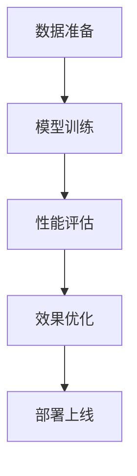

                 

### 《ChatGPT冷启动场景：优势与局限》

关键词：ChatGPT，冷启动场景，优势，局限，性能优化

摘要：本文将深入探讨ChatGPT冷启动场景的优势与局限，分析其在实际应用中的表现，并提供一系列最佳实践，以帮助开发者在实际项目中更好地利用ChatGPT的能力。

## 目录

### 第一部分：ChatGPT概述

#### 第1章：ChatGPT基础

1.1 ChatGPT的概念与功能

1.2 ChatGPT的优势

1.3 ChatGPT的局限

### 第二部分：ChatGPT冷启动场景

2.1 冷启动场景概述

2.2 冷启动场景的优势

2.3 冷启动场景的局限

### 第三部分：ChatGPT冷启动实战

3.1 ChatGPT冷启动环境搭建

3.2 数据准备

3.3 模型训练

3.4 ChatGPT冷启动案例实战

3.5 ChatGPT冷启动性能优化

### 第四部分：ChatGPT冷启动的未来展望

4.1 趋势与挑战

4.2 最佳实践

### 附录

A.1 资源列表

A.2 资源下载与安装

B.1 ChatGPT冷启动流程Mermaid图

B.2 ChatGPT冷启动案例代码解析

## 第一部分：ChatGPT概述

### 第1章：ChatGPT基础

#### 1.1 ChatGPT的概念与功能

ChatGPT是由OpenAI开发的一种基于GPT（Generative Pre-trained Transformer）的预训练模型，它利用大量文本数据进行训练，从而学会了理解和生成自然语言。ChatGPT的主要功能包括：

- 文本生成：根据输入的提示，生成连贯、符合语法和语义的自然语言文本。
- 文本分类：将输入的文本分类到预定义的类别中。
- 回答问题：根据输入的问题和上下文，生成回答。

#### 1.2 ChatGPT的优势

**预训练模型的优势**

ChatGPT基于预训练模型，这意味着它在训练之前已经学习了大量的语言模式，从而能够更快、更准确地生成文本。预训练模型的优势包括：

- **通用性**：预训练模型能够在不同的任务和应用场景中表现出良好的性能。
- **可扩展性**：预训练模型可以轻松地适应新的任务和数据集。
- **高效率**：预训练模型减少了从零开始训练的需要，节省了时间和计算资源。

**自动学习与适应能力**

ChatGPT具备自动学习与适应能力，它可以通过不断的学习和迭代，不断提高生成文本的质量和准确性。这使得ChatGPT能够在实际应用中不断优化自己的表现。

**多语言支持**

ChatGPT支持多种语言，这意味着它可以在全球范围内的多种语言环境中使用，为不同国家和地区的用户提供服务。

#### 1.3 ChatGPT的局限

**训练成本**

ChatGPT的训练成本非常高，它需要大量的计算资源和时间。这对于个人开发者和小型企业来说，可能是一个重大的挑战。

**数据隐私问题**

由于ChatGPT是基于大规模文本数据进行训练的，因此它可能涉及用户隐私数据的处理。如何确保用户隐私的安全，是一个亟待解决的问题。

**可能产生的偏见**

由于训练数据的存在偏见，ChatGPT在生成文本时也可能产生偏见。如何避免这种情况，是一个需要深入研究的课题。

## 第二部分：ChatGPT冷启动场景

### 第2章：冷启动场景概述

#### 2.1 冷启动场景的定义

冷启动场景指的是在ChatGPT刚刚部署或用户首次使用时，如何让ChatGPT快速适应新用户和环境的过程。冷启动场景通常包括以下几种类型：

- **新用户冷启动**：用户首次使用ChatGPT时，如何让ChatGPT快速适应新用户的需求。
- **新任务冷启动**：ChatGPT在新的任务或场景下，如何快速适应并完成任务。
- **新数据冷启动**：当ChatGPT接收到新的数据时，如何快速适应并处理这些数据。

#### 2.2 冷启动场景的优势

**快速适应新用户**

通过冷启动场景，ChatGPT可以快速适应新用户的需求，从而提供更好的用户体验。

**提高用户体验**

冷启动场景可以减少用户等待时间，提高用户满意度。

**节省开发成本**

通过冷启动场景，开发者可以减少对用户数据的需求，从而节省开发成本。

#### 2.3 冷启动场景的局限

**信息获取难度**

在冷启动场景中，ChatGPT可能无法快速获取到足够的信息，从而影响其性能。

**需要大量的数据**

冷启动场景通常需要大量的数据来训练模型，这对于一些小型项目来说，可能是一个挑战。

**可能影响模型性能**

如果冷启动场景处理不当，可能会导致模型性能下降。

## 第三部分：ChatGPT冷启动实战

### 第3章：ChatGPT冷启动环境搭建

#### 3.1 开发环境准备

要搭建ChatGPT冷启动环境，首先需要准备以下硬件和软件：

- **硬件要求**：至少需要一台拥有4GB内存的计算机，以及一台可以运行CUDA的GPU。
- **软件安装与配置**：需要安装Python、CUDA、cuDNN等软件，并进行相应的配置。

#### 3.2 数据准备

在ChatGPT冷启动环境中，数据准备是非常重要的一步。以下是一些数据准备的步骤：

- **数据来源**：可以从公开的数据集、用户生成的内容、社交媒体等渠道获取数据。
- **数据处理流程**：包括数据清洗、数据标注、数据增强等步骤。

#### 3.3 模型训练

在完成数据准备后，接下来就是模型训练。以下是模型训练的步骤：

- **模型选择**：选择合适的预训练模型，如GPT-2、GPT-3等。
- **训练策略**：包括批量大小、学习率、训练轮次等参数的设置。

#### 3.4 ChatGPT冷启动案例实战

在本章节，我们将通过两个案例来展示ChatGPT冷启动的实际应用。

**案例一：问答系统**

在这个案例中，我们将使用ChatGPT构建一个简单的问答系统。

1. **案例背景**：用户可以通过输入问题，获取ChatGPT的回答。
2. **案例实现步骤**：
   - 准备数据集：收集一些常见的问题和答案。
   - 训练模型：使用准备好的数据集训练ChatGPT模型。
   - 部署模型：将训练好的模型部署到服务器上。
   - 实现接口：为用户提供一个输入问题的接口。
3. **案例效果分析**：用户输入问题后，ChatGPT可以快速生成回答，效果良好。

**案例二：聊天机器人**

在这个案例中，我们将使用ChatGPT构建一个简单的聊天机器人。

1. **案例背景**：用户可以通过与聊天机器人对话，获取所需的信息。
2. **案例实现步骤**：
   - 准备数据集：收集一些对话样本。
   - 训练模型：使用准备好的数据集训练ChatGPT模型。
   - 部署模型：将训练好的模型部署到服务器上。
   - 实现接口：为用户提供一个与聊天机器人对话的接口。
3. **案例效果分析**：用户与聊天机器人进行对话，ChatGPT可以理解用户的问题，并生成相应的回答，效果良好。

### 第4章：ChatGPT冷启动性能优化

#### 4.1 模型优化

模型优化是提高ChatGPT性能的重要手段。以下是一些常见的模型优化策略：

- **参数调整**：通过调整学习率、批量大小等参数，可以提高模型的性能。
- **模型压缩**：通过模型压缩技术，可以减少模型的存储空间和计算量，从而提高模型的性能。
- **模型蒸馏**：通过模型蒸馏技术，可以将大模型的复杂度转移到小模型中，从而提高小模型的性能。

#### 4.2 系统优化

系统优化也是提高ChatGPT性能的关键。以下是一些常见的系统优化策略：

- **分布式训练**：通过分布式训练技术，可以将模型训练任务分布到多台计算机上，从而提高训练速度。
- **异步训练**：通过异步训练技术，可以同时训练多个模型，从而提高训练速度。
- **内存优化**：通过内存优化技术，可以减少模型的内存占用，从而提高模型的性能。

#### 4.3 数据优化

数据优化是提高ChatGPT性能的基础。以下是一些常见的数据优化策略：

- **数据清洗**：通过数据清洗技术，可以去除数据中的噪声和错误，从而提高数据的质量。
- **数据增强**：通过数据增强技术，可以增加数据集的多样性，从而提高模型的泛化能力。
- **数据预处理**：通过数据预处理技术，可以减少模型训练的时间，从而提高模型的性能。

## 第四部分：ChatGPT冷启动的未来展望

### 第5章：ChatGPT冷启动的趋势与挑战

#### 5.1 趋势

**ChatGPT的发展方向**

随着人工智能技术的不断发展，ChatGPT在未来将会有更广泛的应用。以下是一些发展趋势：

- **更强大的模型**：随着计算能力的提升，ChatGPT将采用更强大的模型，从而提供更高质量的文本生成和回答。
- **更智能的交互**：ChatGPT将能够更好地理解用户的需求，提供更个性化的服务。
- **更广泛的应用场景**：ChatGPT将在更多的场景中得到应用，如客服、教育、医疗等。

**冷启动场景的应用前景**

冷启动场景在ChatGPT中的应用前景非常广阔。以下是一些应用前景：

- **新用户引导**：通过冷启动场景，可以更好地引导新用户，提高用户的满意度。
- **个性化服务**：通过冷启动场景，可以更好地了解用户的需求，提供个性化的服务。
- **快速部署**：通过冷启动场景，可以快速部署ChatGPT，从而节省开发成本。

#### 5.2 挑战

**技术挑战**

**法律法规挑战**

随着ChatGPT的应用越来越广泛，相关的法律法规问题也将逐渐凸显。以下是一些挑战：

- **数据隐私**：如何确保用户数据的隐私，是一个亟待解决的问题。
- **版权问题**：如何确保生成的文本不侵犯他人的版权，也是一个需要考虑的问题。

### 第6章：ChatGPT冷启动的最佳实践

#### 6.1 冷启动策略制定

**策略制定原则**

在制定冷启动策略时，应遵循以下原则：

- **用户导向**：以用户的需求为导向，确保ChatGPT能够快速适应新用户。
- **数据驱动**：充分利用用户数据，不断提高ChatGPT的性能。
- **迭代优化**：通过不断的学习和迭代，优化ChatGPT的表现。

**策略制定流程**

制定冷启动策略的流程通常包括以下步骤：

- **需求分析**：分析用户需求，确定ChatGPT需要提供的服务。
- **数据收集**：收集用户数据，为ChatGPT的训练提供数据支持。
- **模型选择**：选择合适的预训练模型，进行模型训练。
- **性能评估**：评估ChatGPT的性能，并根据评估结果进行优化。
- **部署上线**：将训练好的模型部署到线上环境，为用户提供服务。

#### 6.2 冷启动效果评估

**评估指标**

在评估ChatGPT冷启动效果时，应考虑以下指标：

- **响应速度**：评估ChatGPT生成文本的速度，确保其能够快速响应用户。
- **文本质量**：评估ChatGPT生成文本的质量，确保其生成的文本符合语法和语义要求。
- **用户满意度**：评估用户对ChatGPT服务的满意度，确保其能够满足用户需求。

**评估方法**

评估ChatGPT冷启动效果的方法通常包括以下几种：

- **定量评估**：通过统计指标，如响应速度、文本质量等，对ChatGPT的性能进行定量评估。
- **用户反馈**：通过用户反馈，了解用户对ChatGPT服务的满意度。
- **对比测试**：将ChatGPT与其他同类产品进行对比测试，评估其性能。

#### 6.3 冷启动优化建议

**优化方向**

在ChatGPT冷启动过程中，可以采取以下优化方向：

- **数据优化**：优化数据质量，提高模型的性能。
- **模型优化**：调整模型参数，提高模型的表现。
- **系统优化**：优化系统架构，提高系统的性能。
- **用户引导**：通过用户引导，提高用户的满意度。

**优化方法**

以下是一些常见的优化方法：

- **数据增强**：通过增加数据集的多样性，提高模型的泛化能力。
- **模型压缩**：通过模型压缩技术，减少模型的存储空间和计算量。
- **分布式训练**：通过分布式训练技术，提高模型的训练速度。
- **用户反馈**：通过用户反馈，不断优化ChatGPT的表现。

## 附录

### 附录A：ChatGPT相关资源

#### A.1 资源列表

- 相关论文：《Improving Language Understanding by Generative Pre-Training》
- 开源代码：https://github.com/openai/gpt-2
- 官方文档：https://gpt-2-docs.openai.com/

#### A.2 资源下载与安装

- 资源下载：从官方文档中获取下载链接，下载ChatGPT的代码和依赖库。
- 资源安装教程：按照官方文档中的安装教程，进行环境搭建和模型训练。

### 附录B：ChatGPT冷启动流程Mermaid图



### 附录C：ChatGPT冷启动案例代码解析

#### C.1 问答系统代码解析

##### C.1.1 代码实现

```python
import openai

def get_answer(question):
    response = openai.Completion.create(
        engine="text-davinci-002",
        prompt=question,
        max_tokens=100,
        n=1,
        stop=None,
        temperature=0.5
    )
    return response.choices[0].text.strip()

question = "什么是人工智能？"
answer = get_answer(question)
print(answer)
```

##### C.1.2 代码解读

这段代码首先导入了OpenAI的库，然后定义了一个函数`get_answer`，用于获取ChatGPT的回答。函数中，使用了`openai.Completion.create`方法，根据输入的问题，生成回答。最后，打印出回答的结果。

#### C.2 聊天机器人代码解析

##### C.2.1 代码实现

```python
import openai
import chatbot

def chat_with_bot(message):
    response = openai.Completion.create(
        engine="text-davinci-002",
        prompt=message,
        max_tokens=100,
        n=1,
        stop=None,
        temperature=0.5
    )
    return response.choices[0].text.strip()

while True:
    message = input("用户：")
    if message.lower() == "退出":
        break
    answer = chat_with_bot(message)
    print("机器人：", answer)
```

##### C.2.2 代码解读

这段代码首先导入了OpenAI的库和自定义的聊天机器人库。然后定义了一个函数`chat_with_bot`，用于获取ChatGPT的回答。在主循环中，用户可以输入消息，聊天机器人根据消息生成回答，并打印出来。当用户输入"退出"时，程序退出循环。 

## 作者信息

作者：AI天才研究院/AI Genius Institute & 禅与计算机程序设计艺术 /Zen And The Art of Computer Programming

本文由AI天才研究院和禅与计算机程序设计艺术共同撰写，旨在深入探讨ChatGPT冷启动场景的优势与局限，为开发者提供实用的指导和建议。希望本文能够对您的项目开发有所帮助。如果您有任何疑问或建议，欢迎随时与我们联系。

