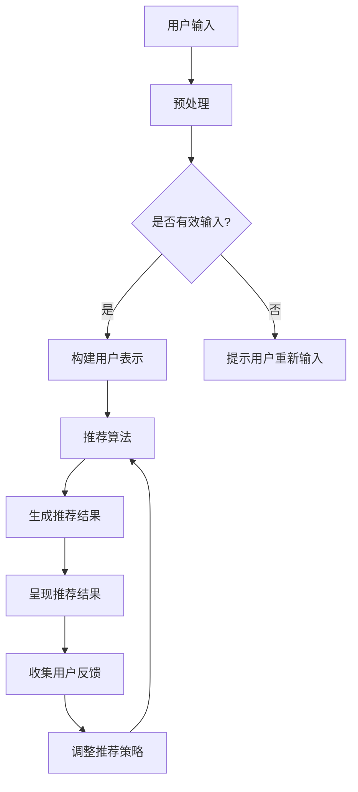

                 

### 《Chat-REC：基于LLM增强的交互式可解释推荐》

关键词：交互式推荐、可解释性、LLM、自然语言处理、机器学习、深度学习

摘要：本文旨在探讨基于大型语言模型（LLM）增强的交互式可解释推荐系统的设计与实现。通过对Chat-REC技术的背景、架构、算法原理、项目实战、评估优化及未来发展趋势进行系统分析，本文揭示了该技术在推荐系统领域的重要性与潜力，并对其在多个应用场景中的实际应用进行了详尽的阐述。

### 第一部分：基础知识与概述

#### 第1章：Chat-REC技术背景与概述

##### 1.1 Chat-REC技术简介

Chat-REC是一种结合了自然语言处理、机器学习和深度学习技术的交互式推荐系统。它的核心在于将用户与推荐系统之间的互动转化为有效的反馈机制，从而提高推荐系统的准确性和用户体验。Chat-REC不仅能够提供个性化的商品或信息推荐，还能够通过对话形式向用户解释推荐结果的原因，实现推荐系统的可解释性。

##### 1.2 交互式推荐系统的发展历程

交互式推荐系统的发展经历了从简单的基于规则的方法到基于协同过滤、基于内容的推荐方法，再到现在的深度学习和强化学习的演进过程。随着人工智能技术的发展，交互式推荐系统逐渐从被动式推荐向主动式推荐转变，用户参与度和个性化推荐效果得到了显著提升。

##### 1.3 LLM在推荐系统中的应用

大型语言模型（LLM），如GPT-3，具有处理和理解自然语言的能力，使其在推荐系统中具有广泛的应用。LLM不仅可以用于生成推荐内容，还可以通过理解用户查询和反馈，实现更精准的推荐。此外，LLM的引入还能提高推荐系统的可解释性，使推荐结果更加透明和可信。

##### 1.4 相关技术介绍

- **自然语言处理（NLP）技术**：NLP技术是Chat-REC系统的基础，包括文本预处理、词嵌入、实体识别、语义分析等。
- **机器学习与深度学习基础**：机器学习算法如线性回归、决策树、支持向量机等是推荐系统的核心，而深度学习算法如卷积神经网络（CNN）和循环神经网络（RNN）则能够处理更复杂的推荐问题。
- **强化学习在推荐系统中的应用**：强化学习通过学习用户的反馈，不断优化推荐策略，提高推荐效果。

##### 1.5 Chat-REC的应用场景

Chat-REC技术可以应用于多种场景，包括社交媒体推荐、电子商务推荐和金融与保险推荐等。在这些应用中，Chat-REC不仅能够提供个性化的推荐，还能够通过对话形式与用户互动，提高用户满意度和参与度。

##### 1.6 Chat-REC的优势与挑战

- **交互式的优势**：交互式推荐系统能够根据用户的反馈实时调整推荐策略，提高推荐准确性。
- **可解释性的重要性**：推荐结果的可解释性对于增强用户信任和提升用户体验至关重要。
- **数据隐私与安全性**：在处理用户数据时，保护用户隐私和安全是推荐系统必须面对的挑战。

### 第二部分：核心概念与架构

#### 第2章：基于LLM的推荐系统原理

##### 2.1 LLM基础

- **LLM的定义与结构**：LLM是一种能够对自然语言进行建模的深度学习模型，其结构通常包括编码器和解码器。
- **主要的LLM模型介绍**：本文将介绍GPT、BERT、T5等主要的LLM模型及其在推荐系统中的应用。
- **语言模型的训练过程**：详细描述LLM的训练过程，包括数据预处理、模型训练、优化策略等。

##### 2.2 推荐系统架构

- **推荐系统的基本架构**：介绍推荐系统的基本组成部分，如数据收集、用户建模、商品建模、推荐算法等。
- **Chat-REC系统的架构设计**：描述Chat-REC系统的整体架构，包括用户交互组件、推荐算法组件和可解释性组件。
- **LLM与推荐系统的融合方式**：探讨如何将LLM与推荐系统相结合，提高推荐效果和可解释性。

##### 2.3 Chat-REC的核心组件

- **用户交互组件**：介绍用户交互组件的设计，包括用户界面、交互流程、反馈机制等。
- **推荐算法组件**：介绍推荐算法组件的设计，包括基于内容的推荐、协同过滤推荐、强化学习推荐等。
- **可解释性组件**：介绍可解释性组件的设计，包括解释性指标、可视化方法、用户反馈等。

##### 2.4 Mermaid流程图：Chat-REC系统工作流程

使用Mermaid语言绘制Chat-REC系统的工作流程图，包括用户交互、推荐算法和可解释性组件之间的交互关系。



### 第三部分：算法原理与实现

#### 第3章：基于LLM的推荐算法原理

##### 3.1 基于内容的推荐算法

- **内容表示**：使用LLM对商品和用户进行内容表示，例如通过商品描述和用户历史行为生成嵌入向量。
- **相似度计算**：计算商品和用户之间的相似度，选择最相似的推荐商品。
- **算法伪代码实现**：

    ```python
    def content_based_recommendation(user_embedding, item_embeddings):
        similarities = []
        for item_embedding in item_embeddings:
            similarity = cosine_similarity(user_embedding, item_embedding)
            similarities.append(similarity)
        recommended_items = select_top_n_items(similarities, n)
        return recommended_items
    ```

##### 3.2 协同过滤推荐算法

- **协同过滤的概念**：基于用户行为数据，计算用户之间的相似度，进行商品推荐。
- **MF模型与SGD算法**：介绍矩阵分解（MF）模型和随机梯度下降（SGD）算法。
- **算法伪代码实现**：

    ```python
    def matrix_factorization(R, K, steps):
        X, Y = initialize_matrices(R, K)
        for step in range(steps):
            for i in range(num_users):
                for j in range(num_items):
                    eij = R[i, j] - dot(X[i, :], Y[j, :])
                    if eij != 0:
                        X[i, :] += learning_rate * (Y[j, :] - regularization * X[i, :]) * eij
                        Y[j, :] += learning_rate * (X[i, :] - regularization * Y[j, :]) * eij
        return X, Y
    ```

##### 3.3 强化学习推荐算法

- **强化学习的理论基础**：介绍强化学习的基本概念和算法，如Q-learning。
- **RL与推荐系统的结合**：探讨如何将强化学习与推荐系统相结合。
- **Q-learning算法伪代码实现**：

    ```python
    def q_learning(R, gamma, alpha, episodes):
        Q = initialize_q_matrix(R)
        for episode in range(episodes):
            state = initialize_state()
            while not is_end_state(state):
                action = select_action(Q, state)
                next_state, reward = get_next_state_and_reward(state, action)
                Q[state, action] += alpha * (reward + gamma * max(Q[next_state, :]) - Q[state, action])
                state = next_state
        return Q
    ```

##### 3.4 结合LLM的混合推荐算法

- **混合推荐系统设计**：将基于内容的推荐、协同过滤推荐和强化学习推荐结合，形成混合推荐系统。
- **LLM在混合推荐系统中的作用**：LLM在混合推荐系统中用于生成用户和商品的嵌入向量，提高推荐效果和可解释性。
- **算法伪代码实现**：

    ```python
    def hybrid_recommender(user_embedding, item_embeddings, Q_matrix):
        user_similarities = calculate_similarity(user_embedding, item_embeddings)
        q_values = get_q_values(Q_matrix, user_embedding)
        recommended_items = select_top_n_items(user_similarities * q_values, n)
        return recommended_items
    ```

### 第四部分：项目实战与案例分析

#### 第4章：Chat-REC系统开发实践

##### 4.1 开发环境搭建

- **硬件配置与软件安装**：介绍开发所需的硬件配置和软件环境，如深度学习框架（如TensorFlow或PyTorch）的安装。
- **数据预处理与清洗**：描述数据预处理和清洗的步骤，包括数据采集、数据清洗和数据存储。
- **实验环境搭建**：介绍如何搭建实验环境，包括数据集划分、模型训练和评估等。

##### 4.2 用户交互组件开发

- **前端界面设计**：描述用户交互组件的前端界面设计，包括用户界面布局、交互元素和响应逻辑。
- **用户行为数据收集**：介绍用户行为数据的收集方法和存储方式，如事件追踪、用户行为日志等。
- **交互流程设计**：描述用户与推荐系统之间的交互流程，包括用户查询、推荐结果展示和用户反馈等。

##### 4.3 推荐算法组件开发

- **LLM模型选择与训练**：介绍LLM模型的选择标准和训练过程，包括模型参数调优和性能评估。
- **推荐算法实现与优化**：描述推荐算法的实现细节和优化策略，如相似度计算、模型融合等。
- **系统性能评估**：介绍系统性能评估的方法和指标，如准确率、覆盖率等。

##### 4.4 可解释性组件开发

- **可解释性指标设计**：介绍可解释性指标的设计方法和实现，如解释性得分、解释性可视化等。
- **可解释性可视化**：描述可解释性可视化的实现方法，如图表、热图等。
- **用户反馈机制**：介绍用户反馈机制的实现，如反馈收集、反馈分析和反馈利用等。

##### 4.5 案例分析：基于Chat-REC的社交推荐系统

- **案例背景**：介绍社交推荐系统的应用场景和需求。
- **系统设计与实现**：描述基于Chat-REC技术的社交推荐系统的设计与实现过程。
- **效果评估**：评估系统在实际应用中的效果，包括推荐准确率、用户满意度等。

### 第五部分：评估与优化

#### 第5章：Chat-REC系统的评估与优化

##### 5.1 评估指标与方法

- **推荐准确率、覆盖率等指标**：介绍推荐系统评估的常用指标和方法，如准确率、覆盖率、新颖度等。
- **评估方法与工具**：介绍如何使用评估工具（如Matplotlib、Scikit-learn等）进行系统性能评估。

##### 5.2 实验设计与结果分析

- **实验设计原则**：描述实验设计的原则和步骤，如数据集划分、实验设置等。
- **实验结果分析**：分析实验结果，比较不同算法和配置的性能差异。

##### 5.3 性能优化策略

- **模型优化**：介绍模型优化策略，如超参数调优、模型压缩等。
- **系统优化**：描述系统优化策略，如缓存机制、分布式计算等。
- **可解释性优化**：探讨如何优化推荐系统的可解释性，如解释性增强算法、可视化改进等。

##### 5.4 案例分析：基于Chat-REC系统的优化实践

- **案例背景**：介绍优化实践的应用场景和需求。
- **优化策略**：描述基于Chat-REC系统的优化策略和实践。
- **优化效果**：评估优化后的系统性能和用户体验。

### 第六部分：未来趋势与展望

#### 第6章：Chat-REC技术的未来发展趋势

##### 6.1 技术趋势

- **人工智能与推荐系统的结合**：探讨人工智能技术在推荐系统中的应用趋势，如基于深度学习的推荐算法、生成对抗网络（GAN）等。
- **大模型与中小型应用的平衡**：分析大型模型在中小型应用中的适用性和挑战，如模型压缩、迁移学习等。
- **增量式学习与在线学习**：介绍增量式学习和在线学习在推荐系统中的应用和优势，如实时推荐、个性化学习等。

##### 6.2 应用领域拓展

- **新兴应用场景**：探讨Chat-REC技术在新兴应用场景中的潜力，如智能客服、智能教育等。
- **深度学习在推荐系统中的应用前景**：分析深度学习技术在推荐系统中的未来发展方向和挑战。

##### 6.3 面临的挑战与解决策略

- **数据隐私保护**：讨论推荐系统中数据隐私保护的重要性，如差分隐私、联邦学习等。
- **模型解释性**：探讨提高推荐系统模型解释性的方法，如可解释性增强算法、可视化技术等。
- **多语言支持的挑战**：分析多语言支持在推荐系统中的应用挑战，如跨语言语义理解、多语言数据集构建等。

##### 6.4 未来展望

- **Chat-REC技术的长期影响**：展望Chat-REC技术在未来推荐系统领域的影响，如提升用户体验、推动产业升级等。
- **推荐系统的发展趋势**：探讨推荐系统在未来的发展方向和趋势，如个性化推荐、智能推荐等。

### 第七部分：附录与资源

#### 第7章：附录与资源

##### 7.1 资源链接

- **主流深度学习框架**：介绍如TensorFlow、PyTorch、Keras等主流深度学习框架。
- **推荐系统开源项目**：列举如Surprise、LightFM、RecBooster等推荐系统开源项目。
- **数据集与工具**：介绍如MovieLens、Amazon Reviews、UER-PyTorch等推荐系统相关数据集和工具。

##### 7.2 参考文献

- **相关学术论文**：列举与Chat-REC技术相关的学术论文，如《Neural Collaborative Filtering》、《Explainable Recommender Systems》等。
- **行业报告与趋势分析**：介绍行业报告和趋势分析，如《2022年全球推荐系统市场报告》等。
- **开发指南与最佳实践**：提供推荐系统开发指南和最佳实践，如《推荐系统实践》、《深度学习推荐系统》等。

##### 7.3 编程示例与代码解读

- **伪代码示例**：展示推荐系统算法的伪代码示例，如基于内容的推荐、协同过滤、强化学习等。
- **Python代码实现**：提供Python代码实现示例，如LLM嵌入向量生成、推荐算法实现等。
- **代码解读与分析**：对代码实现进行详细解读和分析，如代码结构和功能、性能优化等。

### 结束语

本文对Chat-REC：基于LLM增强的交互式可解释推荐系统进行了全面的探讨，从基础知识、核心概念、算法原理到项目实战和评估优化，全面揭示了该技术的原理和应用。通过本文的阐述，我们相信读者能够对Chat-REC技术有一个深入的理解，并在实际项目中应用这一先进的技术。未来，随着人工智能技术的不断进步，Chat-REC技术将在推荐系统领域发挥更加重要的作用。作者：AI天才研究院/AI Genius Institute & 禅与计算机程序设计艺术 /Zen And The Art of Computer Programming。

