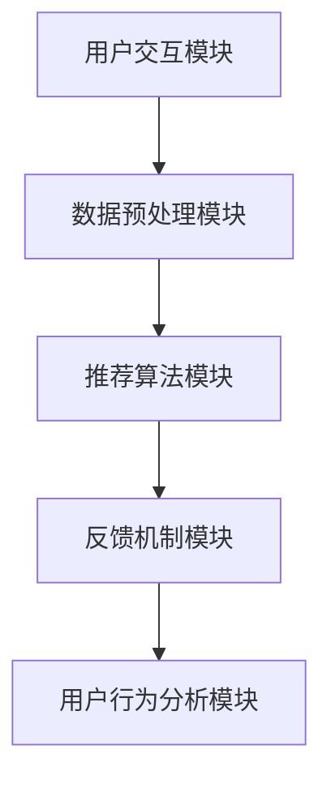
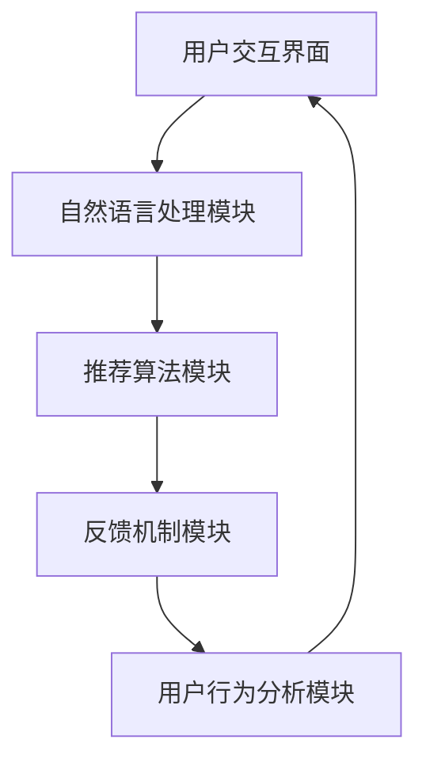
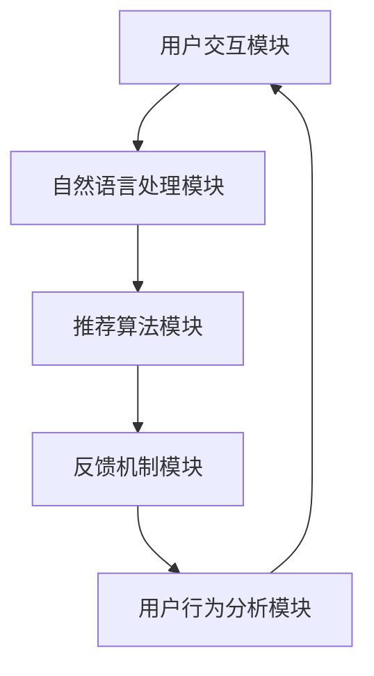
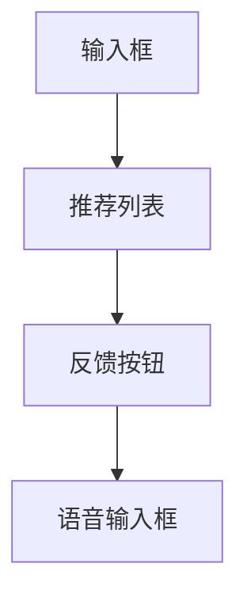
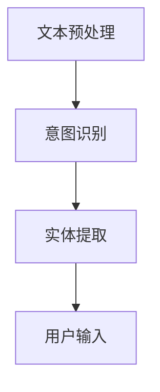
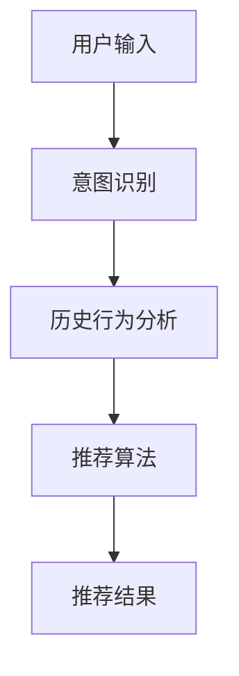
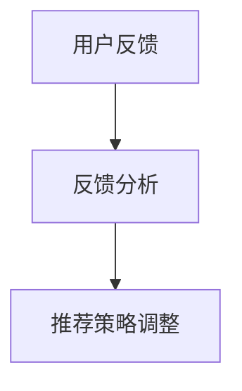

                 

### 文章标题：Chat-Rec的实践：交互式推荐系统的进步

#### 关键词：交互式推荐系统、Chat-Rec、自然语言处理、用户行为预测、实时交互、个性化推荐

> **摘要：** 本文章旨在探讨交互式推荐系统的发展及其应用，重点介绍Chat-Rec技术及其在实际项目中的实现。通过对交互式推荐系统的基本概念、架构设计、核心算法、用户行为分析以及实时交互与个性化推荐策略的详细分析，本文揭示了Chat-Rec技术在实际应用中的优势与挑战，并展望了交互式推荐系统的未来发展趋势。**

### 目录大纲：Chat-Rec的实践：交互式推荐系统的进步

#### 第一部分：交互式推荐系统概述

##### 第1章：交互式推荐系统基础
- **1.1 交互式推荐系统的定义与意义**
- **1.2 交互式推荐系统的架构**
- **1.3 交互式推荐系统的核心概念**

##### 第2章：Chat-Rec概述
- **2.1 Chat-Rec的定义与特点**
- **2.2 Chat-Rec的架构设计**

##### 第3章：自然语言处理技术基础
- **3.1 自然语言处理基础**
- **3.2 交互式对话系统**

##### 第4章：推荐算法原理
- **4.1 基于内容的推荐算法**
- **4.2 协同过滤推荐算法**
- **4.3 交互式推荐算法**

##### 第5章：用户行为分析与预测
- **5.1 用户行为分析**
- **5.2 用户行为预测**

##### 第6章：实时交互与个性化推荐
- **6.1 实时交互设计**
- **6.2 个性化推荐策略**

#### 第二部分：项目实战与案例研究

##### 第7章：交互式推荐系统开发实战
- **7.1 项目背景与目标**
- **7.2 系统设计与实现**
- **7.3 实施步骤与关键点**

##### 第8章：案例研究与经验分享
- **8.1 案例研究一：某电商平台的交互式推荐系统**
- **8.2 案例研究二：某内容平台的智能问答系统**

##### 第9章：交互式推荐系统的发展趋势
- **9.1 交互式推荐系统的未来趋势**
- **9.2 交互式推荐系统的挑战与机遇**

#### 附录
##### 附录A：交互式推荐系统开发工具与资源

### 第1章：交互式推荐系统基础

#### 1.1 交互式推荐系统的定义与意义

**交互式推荐系统** 是一种基于用户与系统之间交互的推荐系统，它不仅依赖于用户的历史行为和偏好，还利用实时交互信息来动态调整推荐结果，提高推荐的准确性和用户满意度。与传统的基于内容的推荐和协同过滤推荐系统相比，交互式推荐系统更加关注用户在交互过程中的实时反馈和行为变化，从而实现更加个性化和精准的推荐。

**交互式推荐系统的意义** 主要体现在以下几个方面：

1. **提高推荐效果**：通过实时交互，系统能够获取用户的实时反馈，从而动态调整推荐策略，提高推荐结果的准确性和相关性。
2. **增强用户体验**：交互式推荐系统能够根据用户的反馈和行为动态调整推荐内容，提供更加个性化的服务，从而提升用户满意度和使用时长。
3. **降低用户流失率**：通过提供高质量的推荐，交互式推荐系统能够降低用户流失率，提高用户留存率。
4. **商业价值**：交互式推荐系统有助于电商平台、内容平台等提高销售转化率和用户参与度，从而带来更高的商业价值。

#### 1.2 交互式推荐系统的架构

交互式推荐系统的整体架构可以分为以下几个模块：

1. **用户交互模块**：负责与用户进行交互，收集用户的实时反馈和行为数据。用户交互模块包括聊天界面、语音识别、手势识别等。
2. **数据预处理模块**：对收集到的用户交互数据进行清洗、转换和特征提取，以便后续的推荐算法处理。
3. **推荐算法模块**：根据用户交互数据和用户历史行为数据，利用各种推荐算法生成推荐结果。
4. **反馈机制模块**：根据用户的反馈调整推荐策略，优化推荐效果。
5. **用户行为分析模块**：对用户行为进行深度分析，挖掘用户行为模式，用于指导推荐策略的调整。

**交互式推荐系统的架构设计**

交互式推荐系统的架构设计需要考虑以下几个方面：

1. **模块化设计**：各个模块之间相互独立，便于维护和升级。
2. **高效的数据处理能力**：确保能够快速处理大量的用户交互数据，提供实时推荐。
3. **可扩展性**：系统应具备良好的可扩展性，能够根据需求添加新的功能模块。
4. **高可用性**：系统应具备高可用性，确保在高峰期也能稳定运行。

#### 1.3 交互式推荐系统的核心概念

**内容推荐**：基于用户的历史行为和兴趣，将相关的信息内容推荐给用户。内容推荐可以包括文章、视频、商品等。

**协同过滤**：通过分析用户的行为数据，找出相似的用户或项目，然后根据这些用户或项目的评分预测目标用户对项目的评分。

**交互式反馈**：用户在交互过程中提供的实时反馈，包括点赞、评论、评分等。这些反馈用于调整推荐策略，提高推荐效果。

**实时交互**：用户与系统之间的实时通信，包括文本、语音、手势等形式。实时交互能够帮助系统更好地理解用户需求，提供更加个性化的推荐。

#### Mermaid 流程图



#### 结论

交互式推荐系统作为一种新兴的推荐技术，具有显著的优势和应用前景。通过本章的介绍，我们了解了交互式推荐系统的基本概念、架构设计以及核心概念，为后续章节的详细探讨打下了基础。

### 第2章：Chat-Rec概述

#### 2.1 Chat-Rec的定义与特点

**Chat-Rec** 是一种基于对话的交互式推荐系统，它通过自然语言处理技术和推荐算法，实现用户与系统之间的实时对话，从而提供个性化的推荐服务。Chat-Rec 的核心特点如下：

1. **实时交互**：Chat-Rec 支持用户与系统之间的实时对话，能够快速响应用户的需求，提供即时的推荐。
2. **自然语言理解**：Chat-Rec 利用自然语言处理技术，能够理解用户的自然语言输入，并生成相应的推荐结果。
3. **个性化推荐**：Chat-Rec 通过分析用户的对话历史和行为数据，动态调整推荐策略，实现个性化的推荐。
4. **跨平台支持**：Chat-Rec 支持多种平台，如网页、移动应用、智能语音助手等，方便用户在不同场景下使用。

#### 2.2 Chat-Rec的架构设计

Chat-Rec 的整体架构可以分为以下几个主要模块：

1. **用户交互界面**：负责与用户进行交互，接收用户的输入，并显示推荐结果。
2. **自然语言处理模块**：对用户的输入文本进行预处理，包括分词、词性标注、实体识别等，以便更好地理解用户意图。
3. **推荐算法模块**：根据用户的历史行为和对话数据，利用推荐算法生成推荐结果。
4. **反馈机制模块**：收集用户的反馈信息，如点击、点赞、评分等，用于调整推荐策略。
5. **用户行为分析模块**：对用户的行为数据进行深度分析，以优化推荐效果。

#### Mermaid 流程图



#### Chat-Rec的应用场景

Chat-Rec 的应用场景非常广泛，以下是一些典型的应用场景：

1. **电商推荐**：通过对话帮助用户找到感兴趣的商品，提升购物体验。
2. **内容推荐**：根据用户的阅读历史和对话内容，推荐相关的文章、视频等。
3. **客服系统**：通过智能问答和推荐，快速解决用户问题，提高客服效率。
4. **教育辅导**：通过对话了解学生的学习需求，推荐相应的学习资源和课程。

#### 结论

Chat-Rec 作为一种基于对话的交互式推荐系统，具有实时交互、自然语言理解、个性化推荐等核心特点。通过本章的介绍，我们了解了 Chat-Rec 的定义、特点以及架构设计，为后续章节的详细探讨提供了基础。

### 第3章：自然语言处理技术基础

#### 3.1 自然语言处理基础

**自然语言处理（NLP）** 是人工智能领域的一个重要分支，旨在使计算机能够理解和处理人类自然语言。NLP 的基础包括以下几个方面：

1. **文本预处理**：包括分词、去除停用词、词性标注、句子解析等，以便更好地理解文本内容。
2. **词嵌入技术**：将单词或句子映射为高维向量，以便进行数学运算和模型训练。
3. **语言模型**：用于预测下一个单词或句子的概率，是许多 NLP 应用的重要基础。
4. **实体识别**：识别文本中的命名实体，如人名、地名、组织名等。

#### 3.2 文本预处理

文本预处理是 NLP 的第一步，对于后续的词嵌入、实体识别和语义理解等步骤至关重要。以下是文本预处理的主要步骤：

1. **分词**：将连续的文本切分成一组组有意义的词语。
   - **分词算法**：包括基于规则的分词、基于统计的分词和基于深度学习的分词。
   - **分词工具**：如 Python 的 jieba 库、NLTK 库等。

2. **去除停用词**：去除对文本内容影响不大的常见词汇，如“的”、“了”、“在”等。

3. **词性标注**：为每个词分配一个词性，如名词、动词、形容词等，以便进行更精细的分析。

4. **句子解析**：将句子拆分成词、短语和句法结构，以便进行语义分析。

#### 3.3 词嵌入技术

**词嵌入（Word Embedding）** 是将单词或句子映射为高维向量的一种技术，其主要目的是将语义信息编码到向量中，以便进行后续的机器学习模型训练。以下是几种常见的词嵌入技术：

1. **Word2Vec**：基于神经网络的词嵌入技术，通过训练词向量来表示单词的语义。
   - **CBOW（Continuous Bag-of-Words）**：预测中心词周围的单词。
   - **Skip-Gram**：预测中心词的上下文单词。

2. **GloVe（Global Vectors for Word Representation）**：基于矩阵分解的方法，通过优化全局损失函数来学习词向量。

3. **BERT（Bidirectional Encoder Representations from Transformers）**：基于双向转换器（Transformer）的词嵌入技术，能够捕捉单词的前后文关系。

#### 3.4 交互式对话系统

**交互式对话系统（Interactive Dialogue System）** 是一种能够与用户进行实时交互的人工智能系统，其主要目标是提供自然、流畅的对话体验。以下是交互式对话系统的核心组成部分：

1. **意图识别**：从用户的输入中识别用户的意图，如提问、命令、请求等。
2. **实体识别**：识别用户输入中的关键实体，如人名、地点、组织名等。
3. **对话管理**：管理对话流程，包括上下文维护、对话策略等。
4. **回复生成**：根据用户的意图和对话上下文生成合适的回复。

**意图识别** 是交互式对话系统的关键步骤，可以通过以下方法实现：

1. **规则方法**：基于预定义的规则进行意图识别，简单但效果有限。
2. **机器学习方法**：利用机器学习算法，如决策树、支持向量机、神经网络等，进行意图识别。

**实体识别** 是另一个重要步骤，可以通过以下方法实现：

1. **基于词典的方法**：利用预定义的词典进行实体识别。
2. **基于机器学习的方法**：利用实体识别模型，如 CRF（条件随机场）、BERT 等。

#### 结论

自然语言处理技术是交互式推荐系统的重要组成部分，包括文本预处理、词嵌入技术和交互式对话系统等。通过本章的介绍，我们了解了自然语言处理的基础知识，为后续章节的推荐算法和用户行为分析奠定了基础。

### 第4章：推荐算法原理

#### 4.1 基于内容的推荐算法

**基于内容的推荐算法（Content-Based Recommendation）** 是一种不依赖于用户行为数据，而是根据用户兴趣和偏好来生成推荐的一种推荐算法。其核心思想是：

- **内容表示**：将物品（如新闻、电影、商品等）表示为特征向量。
- **用户兴趣表示**：将用户兴趣表示为特征向量。
- **相似度计算**：计算用户兴趣向量与物品特征向量之间的相似度，根据相似度高低进行推荐。

**基于内容的推荐算法的主要步骤如下**：

1. **内容特征提取**：对物品进行内容分析，提取出特征。例如，对于文本内容，可以使用词频、TF-IDF、词嵌入等技术提取特征；对于图像，可以使用颜色直方图、边缘特征等提取特征。

2. **用户兴趣表示**：根据用户的历史行为和偏好，提取出用户兴趣特征。

3. **相似度计算**：计算用户兴趣特征与物品特征向量之间的相似度。常用的相似度计算方法包括余弦相似度、欧氏距离等。

4. **推荐结果生成**：根据相似度值，为用户生成推荐列表。

**伪代码**：

```python
def content_based_recommender(content_features, user_interests):
    similarity_scores = []
    for item in content_features:
        sim_score = cosine_similarity(user_interests, item)
        similarity_scores.append(sim_score)
    recommended_items = sort_by_similarity(similarity_scores)
    return recommended_items
```

**数学公式**：

$$
\text{similarity\_score} = \frac{\sum_{i=1}^{n} \text{user\_interests}[i] \cdot \text{content\_features}[i]}{\sqrt{\sum_{i=1}^{n} \text{user\_interests}[i]^2 \cdot \sum_{i=1}^{n} \text{content\_features}[i]^2}}
$$

#### 4.2 协同过滤推荐算法

**协同过滤推荐算法（Collaborative Filtering）** 是一种基于用户行为数据，通过分析用户之间的相似性来生成推荐的一种推荐算法。协同过滤算法主要分为两种类型：**用户基于的协同过滤（User-Based Collaborative Filtering）** 和 **物品基于的协同过滤（Item-Based Collaborative Filtering）**。

1. **用户基于的协同过滤**：找到与目标用户最相似的其他用户，然后推荐这些用户喜欢的物品。
   - **步骤**：
     1. 计算用户之间的相似度。
     2. 找到最相似的 K 个用户。
     3. 推荐这些用户喜欢的物品。
   
   **伪代码**：

   ```python
   def user_based_collaborative_filtering(train_data, target_user, K):
       similarity_scores = calculate_similarity(train_data, target_user)
       similar_users = sort_by_similarity(similarity_scores, K)
       recommended_items = get_common_items(similar_users, train_data)
       return recommended_items
   ```

2. **物品基于的协同过滤**：找到与目标物品最相似的物品，然后推荐这些物品给目标用户。
   - **步骤**：
     1. 计算物品之间的相似度。
     2. 找到最相似的 K 个物品。
     3. 推荐这些物品给目标用户。

   **伪代码**：

   ```python
   def item_based_collaborative_filtering(train_data, target_item, K):
       similarity_scores = calculate_similarity(train_data, target_item)
       similar_items = sort_by_similarity(similarity_scores, K)
       recommended_users = get_common_users(similar_items, train_data)
       return recommended_users
   ```

#### 4.3 交互式推荐算法

**交互式推荐算法（Interactive Recommendation）** 是一种结合用户交互行为和历史数据的推荐算法，旨在提供更加个性化、及时的推荐结果。其核心思想是：

- **动态调整**：根据用户的实时交互行为，动态调整推荐策略。
- **个性化建模**：利用用户的历史行为和交互数据，建立个性化的推荐模型。

**交互式推荐算法的主要步骤如下**：

1. **用户行为收集**：收集用户的交互行为数据，如点击、评价、浏览时间等。

2. **用户行为建模**：利用机器学习算法，如决策树、神经网络等，建立用户行为模型。

3. **实时推荐**：根据用户的行为模型和实时交互数据，动态生成推荐结果。

**伪代码**：

```python
def interactive_recommender(user_history, user_interactions):
    user_model = build_user_model(user_history)
    recommendations = generate_recommendations(user_model, user_interactions)
    return recommendations
```

**数学模型**：

$$
\text{user\_model} = f(\text{user\_history}, \text{user\_interactions})
$$

#### 结论

本章介绍了基于内容的推荐算法、协同过滤推荐算法以及交互式推荐算法的基本原理和实现方法。通过这些算法，我们可以根据用户的行为和偏好生成个性化的推荐结果，提升用户的满意度和使用体验。

### 第5章：用户行为分析与预测

#### 5.1 用户行为分析

用户行为分析是交互式推荐系统中的重要环节，通过对用户行为数据的收集、处理和分析，可以挖掘出用户的行为模式、兴趣偏好和潜在需求，从而为推荐系统提供有力的数据支持。以下是用户行为分析的主要步骤：

1. **数据收集**：收集用户在平台上的行为数据，包括点击、浏览、搜索、购买等。这些数据可以来自日志文件、数据库或者第三方数据分析平台。

2. **数据预处理**：对收集到的用户行为数据进行清洗、去噪和转换，提取出有用的特征信息。例如，可以将用户的行为数据转换成数值型数据，并去除重复和异常数据。

3. **特征提取**：从用户行为数据中提取出与用户兴趣和偏好相关的特征，如浏览时长、点击率、购买频率等。这些特征可以帮助我们更好地理解用户的行为模式。

4. **行为模式识别**：利用统计分析和机器学习方法，识别用户的行为模式。例如，可以通过聚类分析将用户分为不同的群体，每个群体具有相似的行为特征。

5. **兴趣偏好分析**：根据用户的行为模式，分析用户的兴趣偏好。例如，可以通过分析用户的浏览历史，识别出用户对某些类型的内容或商品的偏好。

**用户行为数据收集方法**：

1. **日志文件**：通过记录用户在平台上的行为，生成日志文件。这些日志文件可以记录用户的浏览时间、点击次数、搜索关键词等。

2. **数据库**：将用户行为数据存储到数据库中，便于后续的数据处理和分析。

3. **第三方数据分析平台**：利用第三方数据分析平台，如 Google Analytics、Mixpanel 等，收集和分析用户行为数据。

**用户行为特征提取方法**：

1. **统计特征**：通过计算用户行为的统计指标，如点击率、浏览时长、购买频率等，提取出与用户兴趣和偏好相关的特征。

2. **文本特征**：对于文本类型的数据，如用户评论、搜索关键词等，可以使用词频、TF-IDF、词嵌入等技术提取特征。

3. **图像特征**：对于图像类型的数据，如用户上传的图片、商品图片等，可以使用颜色直方图、边缘特征、卷积神经网络等技术提取特征。

**行为模式识别方法**：

1. **聚类分析**：通过将用户行为数据分为不同的群体，识别出用户的行为模式。常用的聚类算法包括 K-均值聚类、层次聚类等。

2. **分类分析**：通过将用户行为数据分类，识别出用户的兴趣偏好。常用的分类算法包括决策树、支持向量机、神经网络等。

#### 5.2 用户行为预测

用户行为预测是交互式推荐系统中的重要任务，通过预测用户未来的行为，可以为推荐系统提供更准确的推荐结果。以下是用户行为预测的主要步骤：

1. **预测模型构建**：选择合适的预测模型，如线性回归、决策树、神经网络等，构建用户行为预测模型。

2. **模型训练**：利用历史用户行为数据，对预测模型进行训练，得到模型参数。

3. **模型评估**：通过交叉验证、A/B 测试等方法，评估预测模型的性能。

4. **模型应用**：将训练好的模型应用于实际场景，预测用户未来的行为。

**用户行为预测模型**：

1. **基于用户的模型**：利用用户的历史行为数据，构建一个针对每个用户的预测模型。例如，可以使用 K-近邻（K-Nearest Neighbors, KNN）算法，根据最近邻的用户行为数据来预测目标用户的行为。

2. **基于项目的模型**：利用项目的历史行为数据，构建一个针对每个项目的预测模型。例如，可以使用线性回归（Linear Regression）算法，根据项目的特征数据来预测用户对项目的行为。

3. **基于时间的模型**：利用用户行为的时间序列数据，构建一个随时间变化的预测模型。例如，可以使用时间序列分析（Time Series Analysis）方法，如 ARIMA（AutoRegressive Integrated Moving Average）模型，来预测用户的行为。

**预测模型评估方法**：

1. **准确性评估**：通过计算预测结果的准确性来评估模型性能。常用的准确性评估指标包括准确率（Accuracy）、精确率（Precision）、召回率（Recall）等。

2. **F1 值评估**：通过计算 F1 值（F1 Score）来综合评估模型的精确率和召回率。

3. **交叉验证**：通过交叉验证（Cross-Validation）方法，将数据集分为训练集和验证集，多次训练和验证，以评估模型的稳定性和泛化能力。

**预测模型优化方法**：

1. **特征工程**：通过提取和选择有用的特征，优化模型的性能。

2. **模型调参**：通过调整模型的超参数，如学习率、迭代次数等，优化模型的性能。

3. **集成学习**：通过集成多个模型，提高预测的准确性和稳定性。

#### 结论

用户行为分析和预测是交互式推荐系统中至关重要的一环。通过分析用户的行为数据和预测用户未来的行为，可以提供更加个性化的推荐结果，提升用户体验和满意度。本章介绍了用户行为分析的方法和用户行为预测的模型构建与评估，为交互式推荐系统提供了理论和技术支持。

### 第6章：实时交互与个性化推荐

#### 6.1 实时交互设计

实时交互设计是交互式推荐系统的关键组成部分，它直接影响到用户的使用体验和推荐系统的效果。实时交互设计需要考虑以下几个方面：

1. **响应速度**：实时交互的核心是快速响应用户的操作，确保用户在提出请求后能够迅速得到反馈。这要求系统在高并发环境下依然能够保持高性能，减少延迟。

2. **交互方式**：根据应用场景和用户需求，设计多样化的交互方式，如文本聊天、语音通话、手势控制等。多样化的交互方式能够满足不同用户的需求，提高系统的适用性。

3. **交互体验**：实时交互不仅仅是技术的实现，还需要注重用户体验。例如，交互界面的设计要简洁直观，交互过程要流畅自然，以提升用户满意度。

4. **数据传输**：实时交互过程中会产生大量的数据传输需求，需要设计高效的数据传输协议，确保数据的实时性和完整性。

5. **容错性**：系统应具备良好的容错性，能够应对网络波动、服务器故障等异常情况，确保用户操作不被中断。

**实时交互原理**

实时交互的原理可以概括为以下几个步骤：

1. **用户输入**：用户通过文本、语音、手势等方式向系统发送请求或反馈。

2. **数据处理**：系统接收到用户的输入后，进行预处理，如分词、语法解析、实体识别等，以理解用户的意图。

3. **推荐生成**：根据用户的输入和用户历史数据，系统利用推荐算法生成推荐结果。

4. **反馈发送**：将推荐结果发送给用户，并通过合适的交互方式（如文本、语音等）进行展示。

5. **用户反馈**：用户对推荐结果进行反馈，如点赞、评论、评分等，系统根据反馈调整推荐策略。

**实时交互策略**

实时交互策略包括以下几个关键点：

1. **动态调整**：根据用户行为和反馈，实时调整推荐策略，提高推荐的个性化程度。

2. **上下文感知**：利用上下文信息，如用户的历史交互记录、浏览历史等，为用户提供更加相关和个性化的推荐。

3. **多模态交互**：支持多种交互方式，如文本、语音、手势等，以适应不同用户的需求和场景。

4. **异步处理**：在处理用户请求时，采用异步处理方式，降低系统的响应时间，提高系统吞吐量。

5. **优化网络性能**：通过优化数据传输协议和缓存策略，提高网络传输效率和数据响应速度。

**实时交互挑战**

实时交互设计面临以下挑战：

1. **性能瓶颈**：在高并发环境下，如何保证系统的响应速度和稳定性。

2. **数据一致性问题**：在分布式系统中，如何保证数据的一致性。

3. **实时性要求**：如何处理大量实时数据，确保推荐结果的准确性和实时性。

4. **用户体验**：如何设计简洁直观的交互界面，提高用户的满意度。

5. **隐私保护**：在收集和处理用户数据时，如何保护用户隐私。

#### 6.2 个性化推荐策略

个性化推荐策略是交互式推荐系统的核心，它旨在根据用户的兴趣、行为和反馈，为用户提供高度个性化的推荐结果。以下是几种常见的个性化推荐策略：

1. **基于内容的个性化推荐**：根据用户的历史行为和兴趣，推荐与用户兴趣相关的物品。例如，如果用户经常浏览体育新闻，可以推荐其他体育相关的新闻。

   - **推荐算法**：协同过滤、基于内容的推荐算法等。
   - **优点**：推荐结果与用户兴趣高度相关，用户满意度高。
   - **缺点**：容易产生信息过载，推荐结果可能不够全面。

2. **基于协同过滤的个性化推荐**：通过分析用户之间的相似性，推荐与相似用户喜欢的物品。例如，如果其他喜欢某部电影的用户也喜欢另一部同样的电影，可以推荐给目标用户。

   - **推荐算法**：矩阵分解、K-近邻等。
   - **优点**：能够发现用户未明确表达的兴趣，推荐结果多样。
   - **缺点**：推荐结果可能过于依赖用户行为数据，对于新用户或冷启动问题效果不佳。

3. **混合推荐策略**：结合基于内容和基于协同过滤的推荐策略，为用户提供更全面的推荐结果。例如，在推荐新闻时，可以先基于内容推荐相关的新闻，再根据用户的兴趣推荐其他相似的新闻。

   - **推荐算法**：混合模型、深度学习等。
   - **优点**：能够充分利用不同推荐策略的优点，提高推荐效果。
   - **缺点**：系统复杂度较高，需要更多的计算资源和时间。

**个性化推荐策略的评估**

个性化推荐策略的评估通常包括以下几个方面：

1. **准确性**：推荐结果的准确性，即推荐的物品是否与用户的兴趣相关。
2. **覆盖率**：推荐的物品是否覆盖了用户可能感兴趣的各种类别。
3. **多样性**：推荐结果的多样性，即推荐列表中是否包含了多种不同类型的物品。
4. **新颖性**：推荐的新颖性，即推荐列表中是否包含了用户未知的或不同类型的物品。

**评估方法**：

1. **A/B 测试**：将用户随机分为两组，一组使用新推荐策略，另一组使用旧推荐策略，比较两组用户的使用情况和反馈。

2. **在线评估**：在实际应用中，实时收集用户的数据，评估推荐策略的效果。

3. **离线评估**：利用模拟数据集或历史数据，评估推荐策略的性能。

#### 结论

实时交互与个性化推荐策略是交互式推荐系统的核心，通过实时交互，系统能够更好地理解用户的需求和反馈，提供更加个性化的推荐结果。本章介绍了实时交互设计的原则和策略，以及个性化推荐的不同策略和方法，为交互式推荐系统的开发和优化提供了理论指导。

### 第7章：交互式推荐系统开发实战

#### 7.1 项目背景与目标

在当前竞争激烈的市场环境中，电商平台、内容平台和社交平台等都需要通过提供高质量的推荐服务来提高用户满意度和商业转化率。本项目旨在开发一个交互式推荐系统，该系统将基于用户的实时交互和个性化偏好，提供高度相关的推荐结果。

**项目背景：** 随着互联网技术的发展，用户获取信息的途径日益多样化，传统的推荐系统已经难以满足用户的需求。交互式推荐系统能够通过实时交互，更准确地捕捉用户意图，提高推荐效果。

**项目目标：**
1. **实时响应**：确保系统在高并发环境下能够快速响应用户的请求。
2. **个性化推荐**：根据用户的历史行为和实时交互，提供个性化的推荐结果。
3. **用户体验**：优化交互界面，提高用户的操作便捷性和满意度。
4. **系统稳定性**：确保系统在长时间运行和大规模用户访问下保持稳定。

**项目范围：**
1. **用户交互界面**：设计简洁直观的交互界面，支持文本、语音等多种交互方式。
2. **自然语言处理**：实现对用户输入的自然语言理解，提取用户意图和关键信息。
3. **推荐算法**：结合基于内容和基于协同过滤的推荐算法，提供个性化的推荐结果。
4. **实时反馈**：收集用户对推荐结果的反馈，动态调整推荐策略。

#### 7.2 系统设计与实现

**系统架构设计**

交互式推荐系统的整体架构可以分为以下几个主要模块：

1. **用户交互模块**：负责与用户进行实时交互，接收用户的输入和反馈。
2. **自然语言处理模块**：处理用户输入的自然语言，提取用户意图和关键信息。
3. **推荐算法模块**：根据用户的历史行为和意图，生成个性化的推荐结果。
4. **反馈机制模块**：收集用户对推荐结果的反馈，用于优化推荐策略。
5. **用户行为分析模块**：对用户行为进行实时分析，为推荐算法提供支持。

**系统架构图**



**用户交互界面设计**

用户交互界面设计是交互式推荐系统的关键，需要考虑以下方面：

1. **简洁直观**：界面设计应简洁直观，减少用户的操作步骤，提高用户体验。
2. **多样化交互方式**：支持文本、语音、手势等多种交互方式，满足不同用户的需求。
3. **实时反馈**：在用户输入和操作过程中，提供实时反馈，提高用户对系统的信任感。

**界面设计图**



**自然语言处理模块**

自然语言处理模块是实现交互式推荐系统的核心，其主要任务包括：

1. **文本预处理**：对用户输入的文本进行分词、词性标注、实体识别等预处理。
2. **意图识别**：从用户的输入中识别用户的意图，如查询、命令、请求等。
3. **实体提取**：从用户的输入中提取出关键实体，如人名、地点、组织名等。

**自然语言处理流程图**



**推荐算法模块**

推荐算法模块是交互式推荐系统的核心，其性能直接影响到推荐效果。常用的推荐算法包括基于内容的推荐、协同过滤推荐和混合推荐等。

**推荐算法流程图**



**实时反馈与调整模块**

实时反馈与调整模块是优化推荐算法的重要手段，其主要任务包括：

1. **用户反馈收集**：收集用户对推荐结果的反馈，如点赞、评论、评分等。
2. **推荐策略调整**：根据用户反馈，动态调整推荐策略，提高推荐效果。

**反馈与调整流程图**



#### 7.3 实施步骤与关键点

**步骤 1：需求分析与规划**

- **需求分析**：与业务团队讨论，明确系统功能、性能和用户体验等方面的需求。
- **系统规划**：制定系统架构设计、模块划分和开发计划。

**步骤 2：环境搭建**

- **开发环境**：搭建 Python、Java 或其他开发环境，安装必要的库和框架。
- **数据存储**：选择合适的数据库（如 MySQL、MongoDB 等），存储用户数据、日志数据等。

**步骤 3：模块开发**

- **用户交互模块**：设计并实现用户交互界面，支持文本、语音、手势等多种交互方式。
- **自然语言处理模块**：实现文本预处理、意图识别和实体提取等功能。
- **推荐算法模块**：选择并实现基于内容的推荐、协同过滤推荐和混合推荐等算法。
- **反馈机制模块**：实现用户反馈收集、分析和推荐策略调整等功能。

**步骤 4：集成与测试**

- **系统集成**：将各个模块集成到一起，确保系统功能完整。
- **性能测试**：进行压力测试和性能测试，确保系统在高并发环境下能够稳定运行。
- **用户测试**：邀请用户参与测试，收集反馈并优化系统。

**步骤 5：部署与运维**

- **部署**：将系统部署到服务器，确保系统可随时访问。
- **监控**：实时监控系统运行状态，确保系统稳定运行。
- **运维**：定期进行系统维护和升级，确保系统安全、可靠。

**关键点**

1. **性能优化**：在高并发环境下，确保系统的高性能和稳定性。
2. **用户体验**：设计简洁直观的交互界面，提高用户的满意度。
3. **数据安全**：确保用户数据的保密性和完整性，防止数据泄露。
4. **持续优化**：根据用户反馈和业务需求，持续优化系统功能和性能。

#### 结论

本章详细介绍了交互式推荐系统开发实战的项目背景、目标、系统设计、实施步骤和关键点。通过本章的介绍，读者可以了解交互式推荐系统的开发过程和关键要素，为实际项目开发提供指导。

### 第8章：案例研究与经验分享

#### 8.1 案例研究一：某电商平台的交互式推荐系统

**案例背景**：某大型电商平台希望通过引入交互式推荐系统，提高用户购物体验和销售额。该平台拥有海量的商品数据和用户行为数据，具备实施交互式推荐系统的条件。

**系统设计**

1. **用户交互界面**：设计简洁直观的购物界面，支持文本和语音交互方式，提供实时推荐功能。
2. **自然语言处理模块**：实现文本预处理、意图识别和实体提取，确保系统能够理解用户的购物意图。
3. **推荐算法模块**：结合基于内容的推荐和协同过滤推荐算法，提供个性化的购物推荐。
4. **反馈机制模块**：收集用户的点击、购买、评价等反馈，用于优化推荐策略。

**案例分析**

1. **系统优势**：通过实时交互，系统能够快速响应用户的需求，提供个性化的购物推荐，提高了用户的满意度和购物体验。此外，系统还通过用户反馈不断优化推荐策略，提高了推荐准确性。

2. **系统不足**：虽然交互式推荐系统在提升用户体验方面取得了显著效果，但在推荐多样性方面仍有改进空间。部分用户反馈认为推荐结果过于集中，缺乏新颖性。此外，系统在处理高峰期用户请求时，存在一定的延迟问题。

3. **优化建议**：为提高推荐多样性，可以引入更多的推荐算法，如基于兴趣的推荐、基于上下文的推荐等。同时，可以优化系统架构，提高处理请求的速度和并发能力。此外，还可以通过用户画像和深度学习技术，进一步提高推荐准确性。

#### 8.2 案例研究二：某内容平台的智能问答系统

**案例背景**：某知名内容平台希望通过引入智能问答系统，提高用户互动体验和内容利用率。该平台拥有丰富的内容资源和用户提问数据，具备实施智能问答系统的条件。

**系统设计**

1. **用户交互界面**：设计简洁直观的问答界面，支持文本交互方式，提供实时问答和推荐功能。
2. **自然语言处理模块**：实现文本预处理、意图识别和实体提取，确保系统能够理解用户的提问意图。
3. **推荐算法模块**：结合基于内容的推荐和基于协同过滤的推荐算法，提供个性化的内容推荐。
4. **反馈机制模块**：收集用户的点击、提问、评价等反馈，用于优化推荐策略。

**案例分析**

1. **系统特点**：智能问答系统能够快速响应用户的提问，提供相关的内容推荐，提高了用户的互动体验。系统还通过分析用户提问和互动行为，不断优化推荐策略，提高了推荐准确性。

2. **系统应用**：智能问答系统广泛应用于平台的内容推荐、用户问答和客服等领域，为平台带来了显著的用户增长和内容利用率提升。

3. **用户反馈与改进**：用户对智能问答系统的整体满意度较高，认为系统能够快速解答问题，提供有价值的内容推荐。但也有部分用户提出，系统在处理复杂问题时，回答的准确性仍有待提高。为此，平台可以通过引入更多的算法和技术，如深度学习、知识图谱等，进一步提高问答系统的性能。

#### 结论

通过以上两个案例研究，我们可以看到交互式推荐系统在实际应用中取得了显著的成效，但也存在一些不足。通过不断优化和改进，交互式推荐系统有望在提升用户体验、增加商业价值等方面发挥更大的作用。

### 第9章：交互式推荐系统的发展趋势

#### 9.1 交互式推荐系统的未来趋势

随着人工智能技术的不断发展和用户需求的多样化，交互式推荐系统正逐渐成为各大平台提升用户体验和商业价值的重要手段。以下是交互式推荐系统的未来发展趋势：

1. **多模态交互**：未来的交互式推荐系统将支持文本、语音、图像、手势等多种模态的交互，以适应不同用户的使用习惯和场景需求。

2. **个性化推荐**：随着用户数据的积累和推荐算法的进步，交互式推荐系统将能够提供更加个性化的推荐结果，满足用户的个性化需求。

3. **实时性增强**：为了提高用户体验，交互式推荐系统将更加注重实时性的提升，通过优化算法和系统架构，实现快速响应和实时调整推荐策略。

4. **深度学习技术的应用**：深度学习技术，如卷积神经网络（CNN）、递归神经网络（RNN）和变换器（Transformer）等，将在交互式推荐系统中得到更广泛的应用，以提高推荐算法的准确性和多样性。

5. **跨平台融合**：未来的交互式推荐系统将能够无缝融合多种平台，如移动应用、网页、智能语音助手等，为用户提供一致性和连贯性的推荐体验。

6. **隐私保护**：随着用户隐私保护意识的提高，交互式推荐系统将更加注重用户隐私的保护，通过加密、匿名化等技术，确保用户数据的隐私安全。

#### 9.2 交互式推荐系统的挑战与机遇

**挑战**

1. **数据质量与隐私**：交互式推荐系统依赖于用户数据，数据的质量和隐私保护成为系统面临的主要挑战。如何确保数据的质量，同时保护用户的隐私，是一个亟待解决的问题。

2. **实时性要求**：交互式推荐系统需要快速响应用户的需求，这要求系统在高并发环境下依然能够保持高性能，这对系统的架构设计和优化提出了更高的要求。

3. **推荐多样性**：为了提高用户体验，交互式推荐系统需要提供多样化的推荐结果，避免用户产生疲劳和厌烦情绪。如何在保证准确性的同时提高推荐多样性，是一个重要的挑战。

4. **算法复杂度**：随着推荐算法的复杂度不断提高，如何高效地实现和优化算法，降低系统的计算资源和时间成本，是一个关键的挑战。

**机遇**

1. **新兴技术的应用**：随着人工智能、深度学习、自然语言处理等新兴技术的发展，交互式推荐系统将能够实现更加智能化和个性化的推荐。

2. **商业价值**：交互式推荐系统在电商、内容、社交等领域具有巨大的商业价值，能够帮助企业提高用户满意度、增加用户粘性和提升销售额。

3. **用户需求多样化**：随着用户需求的多样化，交互式推荐系统将能够更好地满足用户个性化的需求，为用户提供更加精准和有价值的服务。

4. **跨平台融合**：随着互联网和移动互联网的普及，交互式推荐系统将能够无缝融合多种平台，为用户提供一致性和连贯性的推荐体验，扩大系统的应用场景。

#### 结论

交互式推荐系统在人工智能和互联网技术的推动下，正迎来快速发展的机遇。虽然面临诸多挑战，但通过不断创新和优化，交互式推荐系统有望在提升用户体验、增加商业价值等方面发挥更大的作用，成为未来智能服务的重要组成部分。

### 附录A：交互式推荐系统开发工具与资源

**A.1 常用开发工具与框架**

- **Python开发环境**：Python 是交互式推荐系统开发的主要编程语言，其简洁易懂的语法和丰富的库支持使得开发者能够快速搭建系统。

- **自然语言处理库**：
  - **NLTK**：提供文本处理、词性标注、分词等功能。
  - **spaCy**：提供快速和准确的自然语言处理功能，包括实体识别、词性标注等。
  - **TextBlob**：提供简单的文本处理和情感分析功能。

- **推荐系统框架**：
  - **Surprise**：一个用于快速构建和评估推荐系统的Python库。
  - **LightFM**：结合了因子分解和矩阵分解的推荐系统框架。

**A.2 资源与参考文献**

- **开源代码与数据集**：
  - **GitHub**：查找相关开源项目，获取推荐系统的实现代码。
  - **UCI Machine Learning Repository**：获取各种推荐系统的数据集。

- **相关论文与书籍**：
  - **"Recommender Systems Handbook"**：一本关于推荐系统的权威参考书。
  - **"Natural Language Processing with Python"**：关于自然语言处理在Python中实现的指南。

- **在线资源链接**：
  - **Kaggle**：提供各种推荐系统的竞赛和数据分析资源。
  - **arXiv**：查找最新的自然语言处理和推荐系统论文。

通过这些工具和资源，开发者可以搭建和优化交互式推荐系统，探索人工智能领域的更多可能性。

