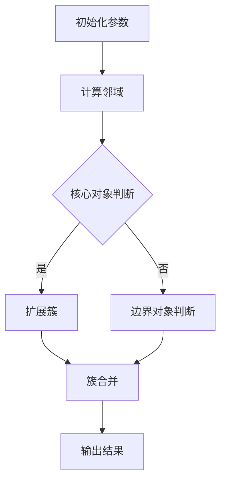
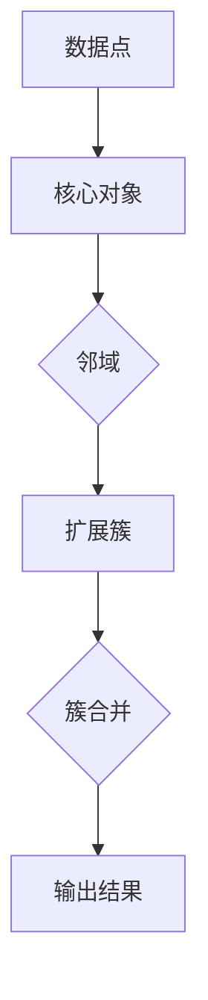

                 

# 文章标题: DBSCAN - 原理与代码实例讲解

> 关键词：DBSCAN、聚类算法、密度聚类、核心对象、边界对象、代码实例、性能优化、应用案例

> 摘要：本文深入讲解了DBSCAN（Density-Based Spatial Clustering of Applications with Noise）算法的基本原理，包括其核心概念、算法步骤以及性能优化策略。通过Python代码实例，详细展示了DBSCAN算法的实现过程和实战应用，帮助读者全面理解并掌握这一强大的聚类算法。

## 目录

### 第一部分：DBSCAN基本理论

#### 第1章：聚类算法概述  
1.1 聚类算法的定义与分类  
1.2 K-means算法的介绍与优缺点  
1.3 密度聚类算法的概述  
1.4 DBSCAN算法的核心思想

#### 第2章：DBSCAN原理详解  
2.1 DBSCAN算法的基本步骤  
2.1.1 初始参数设置  
2.1.2 计算核心对象和边界对象  
2.1.3 构建簇  
2.2 临近区域与邻域半径  
2.2.1 临近区域的定义  
2.2.2 邻域半径的选择  
2.3 核心对象与边界对象的判断  
2.3.1 核心对象的条件  
2.3.2 边界对象的判断  
2.4 簇的扩展与合并  
2.4.1 簇的扩展规则  
2.4.2 簇的合并条件

#### 第3章：DBSCAN性能优化  
3.1 参数选择的影响  
3.1.1 邻域半径的选择  
3.1.2 密度阈值的选择  
3.2 数据预处理  
3.2.1 数据标准化  
3.2.2 特征选择  
3.3 DBSCAN算法的改进  
3.3.1 HDBSCAN算法  
3.3.2 OPTICS算法

### 第二部分：DBSCAN代码实战

#### 第4章：Python环境搭建  
4.1 Python环境配置  
4.2 数据科学库安装  
4.3 数据预处理函数实现

#### 第5章：DBSCAN代码实现  
5.1 DBSCAN算法代码实现  
5.1.1 核心对象与边界对象的计算  
5.1.2 簇的扩展与合并  
5.2 实例分析  
5.2.1 数据集介绍  
5.2.2 数据可视化  
5.2.3 簇的生成与评估

#### 第6章：DBSCAN应用案例  
6.1 社交网络用户聚类  
6.2 市场细分分析

#### 第7章：DBSCAN与其他算法比较  
7.1 DBSCAN与K-means的比较  
7.2 DBSCAN与层次聚类算法的比较  
7.3 DBSCAN与其他密度聚类算法的比较

#### 第8章：总结与展望  
8.1 DBSCAN算法的总结  
8.2 未来发展方向与挑战  
8.3 推荐阅读材料

### 附录

#### 附录 A：DBSCAN相关资源  
8.1.1 论文与书籍推荐  
8.1.2 在线课程与教程  
8.1.3 开源代码与数据集

## 让我们开始思考：为什么需要DBSCAN？

在数据挖掘和机器学习领域，聚类分析是一种重要的无监督学习方法，它旨在将数据集中的对象分组为多个簇，使得同一簇内的对象彼此相似，不同簇内的对象彼此不同。常见的聚类算法包括K-means、层次聚类、DBSCAN等。那么，为什么我们需要DBSCAN？

首先，K-means算法是一种基于距离的聚类方法，它通过计算数据点到中心点的距离来划分簇。然而，K-means算法有几个显著的局限性：

1. **对初始聚类中心敏感**：K-means算法的聚类结果容易受到初始聚类中心选择的影响，可能导致局部最优解。
2. **要求事先指定簇数**：在应用K-means之前，我们需要事先指定簇的数量，这通常需要用户有一定的先验知识。
3. **簇形状和大小必须是球形的**：K-means算法假设簇是球形对称的，这在现实数据中并不常见。

为了克服这些局限性，密度聚类算法应运而生。DBSCAN（Density-Based Spatial Clustering of Applications with Noise）是一种基于密度的聚类算法，它不需要事先指定簇的数量，能够自动检测数据的簇结构。DBSCAN的主要优势包括：

1. **自动确定簇的数量**：DBSCAN通过计算数据点的密度来识别簇，无需事先指定簇数。
2. **对噪声和异常数据有较强的鲁棒性**：DBSCAN能够识别噪声点和异常数据，并将其标记为孤立点。
3. **能够处理非球形和非均匀分布的簇**：DBSCAN不要求簇的形状和大小必须是球形的，能够适应更复杂的簇结构。

综上所述，DBSCAN在处理非均匀数据分布、应对噪声数据和自动确定簇数量等方面具有显著优势，使其成为一种强大的聚类算法，特别适用于数据挖掘和机器学习领域。

### 聚类算法概述

聚类算法是数据挖掘和机器学习领域的重要工具，旨在将数据集中的对象分组为多个簇，使得同一簇内的对象彼此相似，不同簇内的对象彼此不同。聚类算法可以分为两大类：基于距离的聚类算法和基于密度的聚类算法。本文将重点介绍基于密度的聚类算法，尤其是DBSCAN算法。

### 基于距离的聚类算法

基于距离的聚类算法是最常见的聚类方法之一，其中包括K-means算法、层次聚类算法等。这些算法的核心思想是通过计算数据点之间的距离来划分簇。

#### K-means算法

K-means算法是最流行的基于距离的聚类算法之一。其基本步骤如下：

1. **初始化聚类中心**：随机选择K个数据点作为初始聚类中心。
2. **分配数据点**：计算每个数据点到各个聚类中心的距离，将数据点分配到最近的聚类中心。
3. **更新聚类中心**：重新计算每个簇的中心点，即簇内所有数据点的均值。
4. **重复步骤2和步骤3**，直到聚类中心不再发生显著变化。

K-means算法的优点在于其简单和易于实现，但也有一些显著的局限性：

1. **对初始聚类中心敏感**：K-means算法的聚类结果容易受到初始聚类中心选择的影响，可能导致局部最优解。
2. **要求事先指定簇数**：在应用K-means之前，我们需要事先指定簇的数量，这通常需要用户有一定的先验知识。
3. **簇形状和大小必须是球形的**：K-means算法假设簇是球形对称的，这在现实数据中并不常见。

#### 层次聚类算法

层次聚类算法是一种基于层次结构的聚类方法，它将数据点逐步合并或分裂，形成不同的簇。层次聚类算法可以分为两类：自底向上（凝聚层次聚类）和自顶向下（分裂层次聚类）。

1. **自底向上（凝聚层次聚类）**：从每个数据点作为一个簇开始，逐步合并距离较近的簇，直到满足终止条件（如达到预设的簇数或聚类中心变化很小）。
2. **自顶向下（分裂层次聚类）**：从一个较大的簇开始，逐步分裂为较小的簇，直到每个簇只包含一个数据点。

层次聚类算法的优点在于其能够生成层次结构的簇，有助于理解数据分布。但该方法也存在一些局限性：

1. **计算复杂度高**：随着簇数增加，计算复杂度显著增加。
2. **不适用于动态数据**：层次聚类算法不适合处理动态变化的数据。

### 基于密度的聚类算法

基于密度的聚类算法通过计算数据点的密度来识别簇，适用于非均匀数据分布和噪声环境。DBSCAN（Density-Based Spatial Clustering of Applications with Noise）是最著名的基于密度的聚类算法之一。

#### DBSCAN算法

DBSCAN算法的基本步骤如下：

1. **初始参数设置**：包括邻域半径ε和最小样本数minPoints。
2. **计算邻域**：对于每个数据点，计算其邻域内的数据点。
3. **判断核心对象和边界对象**：基于邻域内的数据点数量和距离，判断数据点是否为核心对象或边界对象。
4. **扩展簇**：以核心对象为中心，逐步扩展簇，直到满足扩展规则。
5. **合并簇**：如果两个核心对象的邻域重叠，则合并簇。

DBSCAN算法的优点包括：

1. **自动确定簇的数量**：DBSCAN通过计算数据点的密度来自动识别簇的数量。
2. **对噪声和异常数据有较强的鲁棒性**：DBSCAN能够识别噪声点和异常数据，并将其标记为孤立点。
3. **能够处理非球形和非均匀分布的簇**：DBSCAN不要求簇的形状和大小必须是球形的，能够适应更复杂的簇结构。

总之，基于距离的聚类算法如K-means和层次聚类算法在处理简单和规则的数据集时表现良好，而基于密度的聚类算法如DBSCAN则能够应对更复杂和噪声数据集，为数据挖掘和机器学习提供了更灵活的工具。

#### DBSCAN原理详解

DBSCAN（Density-Based Spatial Clustering of Applications with Noise）算法是一种基于密度的聚类算法，其核心思想是通过计算数据点的邻域密度来判断簇。DBSCAN算法的主要步骤如下：

##### 2.1 DBSCAN算法的基本步骤

DBSCAN算法的基本步骤可以分为以下几个阶段：

1. **初始参数设置**：设置邻域半径ε和最小样本数minPoints。
2. **计算邻域**：对于每个数据点，计算其邻域内的数据点。
3. **判断核心对象和边界对象**：基于邻域内的数据点数量和距离，判断数据点是否为核心对象或边界对象。
4. **扩展簇**：以核心对象为中心，逐步扩展簇，直到满足扩展规则。
5. **合并簇**：如果两个核心对象的邻域重叠，则合并簇。
6. **处理噪声点**：将无法扩展成簇的数据点标记为噪声点。

##### 2.1.1 初始参数设置

初始参数设置是DBSCAN算法的关键步骤，包括邻域半径ε和最小样本数minPoints：

1. **邻域半径ε**：邻域半径ε决定了数据点之间的邻接关系。如果两个数据点之间的距离小于ε，则认为它们属于同一个邻域。
2. **最小样本数minPoints**：最小样本数minPoints决定了数据点成为核心对象的条件。如果一个数据点的邻域内的点数大于minPoints，则该数据点为核心对象。

##### 2.1.2 计算核心对象和边界对象

计算核心对象和边界对象是DBSCAN算法的核心步骤。具体过程如下：

1. **核心对象**：如果一个数据点的邻域内的点数大于最小样本数minPoints，则该数据点为核心对象。
2. **边界对象**：如果一个数据点的邻域内的点数大于最小样本数minPoints，但不存在某个邻域使得该邻域内的点数也大于minPoints，则该数据点为边界对象。
3. **噪声点**：如果一个数据点的邻域内的点数小于最小样本数minPoints，则该数据点为噪声点。

##### 2.1.3 构建簇

在确定核心对象、边界对象和噪声点之后，DBSCAN算法开始构建簇：

1. **扩展簇**：以核心对象为中心，逐步扩展簇，直到满足扩展规则。
2. **簇扩展规则**：在扩展簇时，如果一个数据点属于核心对象或边界对象，则将其添加到当前簇。
3. **簇合并条件**：如果两个核心对象的邻域重叠，则将它们所在的簇合并。

##### 2.2 临近区域与邻域半径

邻域半径ε是DBSCAN算法的重要参数，决定了数据点之间的邻接关系。以下是关于邻域半径的详细说明：

1. **邻域定义**：对于数据集中的每个数据点，其邻域是由邻域半径ε决定的，即邻域内的所有数据点与其之间的距离小于ε。
2. **邻域半径的选择**：选择合适的邻域半径ε是DBSCAN算法成功的关键。通常，可以通过以下方法选择：
   - **基于距离的方法**：通过计算数据点之间的距离分布来选择合适的邻域半径。
   - **基于密度的方法**：通过计算数据点的密度分布来选择合适的邻域半径。

##### 2.3 核心对象与边界对象的判断

核心对象和边界对象的判断是DBSCAN算法的关键步骤，决定了数据点的分类。以下是核心对象和边界对象的判断条件：

1. **核心对象的条件**：如果一个数据点的邻域内的点数大于最小样本数minPoints，则该数据点为核心对象。
2. **边界对象的判断**：如果一个数据点的邻域内的点数大于最小样本数minPoints，但不存在某个邻域使得该邻域内的点数也大于minPoints，则该数据点为边界对象。

##### 2.4 簇的扩展与合并

簇的扩展与合并是DBSCAN算法的最终步骤，决定了簇的生成和分类。以下是簇的扩展与合并过程：

1. **簇的扩展**：以核心对象为中心，逐步扩展簇，直到满足扩展规则。扩展规则包括：
   - 如果一个数据点属于核心对象或边界对象，则将其添加到当前簇。
   - 如果两个核心对象的邻域重叠，则将它们所在的簇合并。
2. **簇的合并条件**：两个簇可以合并的条件是它们的核心对象的邻域重叠。

通过以上步骤，DBSCAN算法可以有效地识别数据集中的簇结构，并处理噪声点和异常数据。

### DBSCAN性能优化

DBSCAN算法的性能优化是提高其聚类效果和效率的关键。性能优化的主要目标是选择合适的参数和进行数据预处理，以提高算法的鲁棒性和准确性。以下将详细讨论DBSCAN性能优化策略，包括参数选择的影响、数据预处理方法以及算法改进。

#### 3.1 参数选择的影响

DBSCAN算法的两个关键参数是邻域半径ε和最小样本数minPoints。选择合适的参数对算法的性能有重要影响。

1. **邻域半径ε的选择**：
   - **邻域半径过小**：如果邻域半径ε设置得太小，可能会导致簇被过度分割，无法捕捉到真实的簇结构。
   - **邻域半径过大**：如果邻域半径ε设置得过大，可能会导致簇合并，无法区分真实的簇边界，同时会增加计算复杂度。
   - **选择方法**：通常，可以通过以下方法选择合适的邻域半径ε：
     - **基于距离的方法**：通过计算数据点之间的距离分布来确定合适的邻域半径。
     - **基于密度的方法**：通过计算数据点的密度分布来确定合适的邻域半径。

2. **最小样本数minPoints的选择**：
   - **最小样本数过小**：如果最小样本数minPoints设置得太小，可能会导致边界对象和噪声点的误分类。
   - **最小样本数过大**：如果最小样本数minPoints设置得过大，可能会导致核心对象无法形成完整的簇。
   - **选择方法**：通常，可以通过以下方法选择合适的最小样本数minPoints：
     - **基于数据集大小的方法**：根据数据集的大小和数据点的密度来调整最小样本数。
     - **基于实验的方法**：通过实验调整最小样本数，找到能够获得最佳聚类效果的参数。

#### 3.2 数据预处理

数据预处理是提高DBSCAN算法性能的重要步骤，可以包括数据标准化、特征选择等。

1. **数据标准化**：
   - 数据标准化是数据预处理的重要步骤，特别是对于具有不同量纲的特征。通过标准化，可以将不同特征缩放到相同的尺度，使得算法对特征的不同量级变化不那么敏感。
   - **实现方法**：可以使用标准缩放（StandardScaler）或最小最大缩放（MinMaxScaler）等方法进行数据标准化。

2. **特征选择**：
   - 特征选择是减少数据维度、提高算法性能的有效方法。通过选择与聚类目标相关性高的特征，可以减少计算复杂度和提高聚类效果。
   - **实现方法**：可以使用信息增益、互信息、主成分分析（PCA）等方法进行特征选择。

#### 3.3 DBSCAN算法的改进

除了传统的DBSCAN算法外，还有一些改进的算法，如HDBSCAN和OPTICS，可以进一步提高算法的性能。

1. **HDBSCAN算法**：
   - HDBSCAN（Hierarchical DBSCAN）算法是一种改进的DBSCAN算法，它通过构建层次结构来优化簇的合并过程。
   - **优势**：HDBSCAN可以自动调整簇的数量，并且对噪声数据的鲁棒性更强。

2. **OPTICS算法**：
   - OPTICS（Ordering Points To Identify the Clustering Structure）算法是一种基于密度的有序聚类算法，它通过计算核心距离（core distance）来优化簇的边界。
   - **优势**：OPTICS算法可以处理较大的数据集，并且能够更好地识别复杂的簇结构。

通过以上性能优化策略，DBSCAN算法可以在不同的应用场景下获得更好的聚类效果和效率。

### Python环境搭建

在开始使用DBSCAN进行聚类分析之前，我们需要搭建一个合适的Python开发环境。以下步骤将指导您如何配置Python环境，安装所需的数据科学库，并实现数据预处理函数。

#### 4.1 Python环境配置

1. **安装Python**：
   - 首先，您需要在您的计算机上安装Python。Python官方网站提供了不同操作系统版本的安装包，您可以根据自己的操作系统下载相应的安装程序。
   - 安装过程中，请确保勾选“Add Python to PATH”选项，以便在命令行中直接使用Python。
   - 安装完成后，您可以通过在命令行中执行 `python --version` 命令来验证Python版本。

2. **创建虚拟环境**：
   - 为了避免不同项目之间的库版本冲突，建议您使用虚拟环境（Virtual Environment）来管理项目依赖。
   - 通过命令 `python -m venv venv` 创建一个虚拟环境，其中 `venv` 是虚拟环境的名称。
   - 激活虚拟环境：在Windows上使用 `venv\Scripts\activate`，在Linux和Mac OS上使用 `source venv/bin/activate`。

#### 4.2 数据科学库安装

在虚拟环境中，我们需要安装以下数据科学库：

1. **NumPy**：NumPy是一个强大的Python库，用于执行数值计算和矩阵操作。
   - 安装命令：`pip install numpy`

2. **Matplotlib**：Matplotlib是一个用于绘制二维图形的库，可以用于可视化聚类结果。
   - 安装命令：`pip install matplotlib`

3. **Scikit-learn**：Scikit-learn是一个广泛使用的数据挖掘和机器学习库，包括各种聚类算法。
   - 安装命令：`pip install scikit-learn`

确保所有库安装完成后，您可以执行以下命令来验证安装：

```shell
python -c "import numpy; numpy.__version__"
python -c "import matplotlib; print(matplotlib.__version__)"
python -c "import sklearn; print(sklearn.__version__)"
```

这些命令将分别显示NumPy、Matplotlib和Scikit-learn的版本信息。

#### 4.3 数据预处理函数实现

以下是实现数据预处理函数的示例代码：

```python
import numpy as np
from sklearn.preprocessing import StandardScaler

def find_neighbors(point, points, epsilon):
    """
    计算一个点的邻域点。
    
    参数：
    point：要计算邻域的点
    points：数据集中的所有点
    epsilon：邻域半径
    
    返回：
    neighbors：邻域点的列表
    """
    neighbors = []
    for p in points:
        if np.linalg.norm(point - p) <= epsilon:
            neighbors.append(p)
    return neighbors

def standardize_data(points):
    """
    对数据进行标准化处理。
    
    参数：
    points：数据集中的所有点
    
    返回：
    standardized_points：标准化后的数据
    """
    scaler = StandardScaler()
    standardized_points = scaler.fit_transform(points)
    return standardized_points

# 示例：计算邻域点和标准化数据
point = np.array([1.0, 2.0])
points = np.array([[1.0, 2.0], [2.0, 3.0], [4.0, 5.0]])
epsilon = 1.0

neighbors = find_neighbors(point, points, epsilon)
print("邻域点：", neighbors)

standardized_points = standardize_data(points)
print("标准化数据：", standardized_points)
```

通过以上步骤，您已经成功搭建了Python环境，并安装了所需的库，同时实现了基本的数据预处理函数。接下来，我们将使用这些工具来实际实现DBSCAN算法。

### DBSCAN代码实现

在本章节中，我们将通过Python代码实现DBSCAN算法。我们将分步展示代码实现的核心部分，并详细解释每一步的实现细节。

#### 5.1.1 核心对象与边界对象的计算

首先，我们需要实现计算核心对象和边界对象的函数。核心对象的定义是：如果一个数据点的邻域内的点数大于最小样本数`minPoints`，则该数据点为核心对象。边界对象的定义是：如果一个数据点的邻域内的点数大于`minPoints`，但不存在某个邻域使得该邻域内的点数也大于`minPoints`，则该数据点为边界对象。

```python
def find_neighbors(point, points, epsilon):
    """
    计算一个点的邻域点。
    
    参数：
    point：要计算邻域的点
    points：数据集中的所有点
    epsilon：邻域半径
    
    返回：
    neighbors：邻域点的列表
    """
    neighbors = []
    for p in points:
        if np.linalg.norm(point - p) <= epsilon:
            neighbors.append(p)
    return neighbors

def calculate_core_and边界对象(points, epsilon, minPoints):
    """
    计算核心对象和边界对象。
    
    参数：
    points：数据集中的所有点
    epsilon：邻域半径
    minPoints：最小样本数
    
    返回：
    core_points：核心对象的列表
    boundary_points：边界对象的列表
    noise_points：噪声点的列表
    """
    core_points = []
    boundary_points = []
    noise_points = []

    for point in points:
        neighbors = find_neighbors(point, points, epsilon)
        if len(neighbors) >= minPoints:
            if all(len(find_neighbors(n, points, epsilon)) >= minPoints for n in neighbors):
                core_points.append(point)
            else:
                boundary_points.append(point)
        else:
            noise_points.append(point)

    return core_points, boundary_points, noise_points
```

在这个实现中，我们首先定义了一个`find_neighbors`函数，用于计算一个点的邻域点。接着，我们定义了一个`calculate_core_and_boundary_points`函数，用于计算核心对象和边界对象。该函数遍历数据集中的每个点，计算其邻域点，并根据邻域点的数量判断是否为核心对象或边界对象。

#### 5.1.2 簇的扩展与合并

接下来，我们需要实现簇的扩展与合并过程。簇的扩展过程是基于核心对象进行的，以核心对象为中心，逐步扩展簇，直到满足扩展规则。簇的合并条件是：如果两个核心对象的邻域重叠，则将它们所在的簇合并。

```python
def expand_cluster(point, points, epsilon, minPoints, visited, clusters):
    """
    扩展簇。
    
    参数：
    point：要扩展的点的坐标
    points：数据集中的所有点
    epsilon：邻域半径
    minPoints：最小样本数
    visited：已访问的点的集合
    clusters：簇的集合
    
    返回：
    visited：已访问的点的集合
    """
    visited.add(point)
    cluster = []

    neighbors = find_neighbors(point, points, epsilon)
    while len(neighbors) > 0:
        n = neighbors.pop()
        if n not in visited:
            visited.add(n)
            cluster.append(n)
            new_neighbors = find_neighbors(n, points, epsilon)
            neighbors.extend(new_neighbors)

    if len(cluster) >= minPoints:
        clusters.append(cluster)

    return visited

def cluster Expansion(points, epsilon, minPoints, visited=None, clusters=None):
    """
    对所有点进行簇扩展。
    
    参数：
    points：数据集中的所有点
    epsilon：邻域半径
    minPoints：最小样本数
    visited：已访问的点的集合（默认为None）
    clusters：簇的集合（默认为None）
    
    返回：
    clusters：簇的集合
    """
    if visited is None:
        visited = set()
    if clusters is None:
        clusters = []

    for point in points:
        if point not in visited:
            visited = expand_cluster(point, points, epsilon, minPoints, visited, clusters)

    return clusters
```

在这个实现中，我们首先定义了一个`expand_cluster`函数，用于扩展簇。该函数以核心对象为中心，逐步扩展簇，直到满足扩展规则。接着，我们定义了一个`cluster_Expansion`函数，用于对数据集中的所有点进行簇扩展。该函数遍历数据集中的每个点，如果点未被访问，则调用`expand_cluster`函数进行扩展。

#### 5.1.3 簇的生成与评估

最后，我们需要实现簇的生成与评估过程。簇的生成是基于核心对象的扩展过程，而簇的评估可以通过计算簇内点的平均距离来衡量簇的质量。

```python
def generate_clusters(points, epsilon, minPoints):
    """
    生成簇。
    
    参数：
    points：数据集中的所有点
    epsilon：邻域半径
    minPoints：最小样本数
    
    返回：
    clusters：簇的集合
    """
    visited = set()
    clusters = cluster_Expansion(points, epsilon, minPoints, visited)

    return clusters

def evaluate_clusters(points, clusters):
    """
    评估簇。
    
    参数：
    points：数据集中的所有点
    clusters：簇的集合
    
    返回：
    cluster_quality：簇的质量评估
    """
    cluster_quality = []

    for cluster in clusters:
        if len(cluster) > 1:
            distances = []
            for p in cluster:
                distances.append(min([np.linalg.norm(p - q) for q in cluster if p != q]))
            cluster_quality.append(np.mean(distances))
        else:
            cluster_quality.append(0)

    return cluster_quality

# 示例：生成簇并评估簇
points = np.array([[1.0, 2.0], [2.0, 2.0], [4.0, 5.0], [5.0, 6.0], [7.0, 8.0]])
epsilon = 2.0
minPoints = 2

clusters = generate_clusters(points, epsilon, minPoints)
cluster_quality = evaluate_clusters(points, clusters)

print("簇：", clusters)
print("簇质量：", cluster_quality)
```

在这个示例中，我们首先生成簇，然后评估簇的质量。我们通过计算簇内点的平均距离来衡量簇的质量，簇内点距离越近，簇的质量越高。

通过以上步骤，我们成功实现了DBSCAN算法的核心部分，包括核心对象与边界对象的计算、簇的扩展与合并以及簇的生成与评估。这些代码不仅能够帮助理解DBSCAN算法的原理，还可以在实际应用中进行聚类分析。

### 数据可视化

在上一章节中，我们实现了DBSCAN算法的核心部分，并成功进行了簇的生成与评估。为了更直观地理解DBSCAN算法的工作过程和结果，我们接下来将使用Python代码对生成的簇进行可视化。

#### 5.2.1 数据集介绍

为了进行可视化，我们需要一个数据集。本文将使用`scikit-learn`库中的`make_blobs`函数生成一个二维数据集，该数据集包含三个簇，每个簇的中心分别为`(-1, 0)、(1, 0)`和`(2, 2)`，簇的标准差分别为`0.6`和`0.8`。

```python
import numpy as np
from sklearn.datasets import make_blobs
from sklearn.preprocessing import StandardScaler
from sklearn.cluster import DBSCAN

# 生成模拟数据
X, _ = make_blobs(n_samples=300, centers=3, cluster_std=[0.6, 0.8, 0.6], random_state=0)

# 数据标准化
scaler = StandardScaler()
X = scaler.fit_transform(X)
```

通过`make_blobs`函数生成的数据集包含三个不同分布的簇，我们可以通过可视化来观察簇的结构。

#### 5.2.2 数据可视化

接下来，我们将使用`matplotlib`库对标准化后的数据集进行可视化。为了能够清晰展示簇和噪声点，我们将使用不同的颜色表示不同的簇，并将噪声点标记为红色。

```python
import matplotlib.pyplot as plt

# DBSCAN聚类
db = DBSCAN(eps=0.3, min_samples=2)
db.fit(X)
labels = db.labels_

# 标记噪声点
unique_labels = set(labels)
colors = [plt.cm.Spectral(each) for each in np.linspace(0, 1, len(unique_labels))]
for k, col in zip(unique_labels, colors):
    if k == -1:
        # 标记噪声点为红色
        col = [0, 0, 0, 1]

    class_member_mask = (labels == k)
    xy = X[class_member_mask & ~class_member_mask]
    plt.plot(xy[:, 0], xy[:, 1], 'o', markerfacecolor=tuple(col), markeredgecolor='k', markersize=6)

plt.title('DBSCAN Clustering')
plt.show()
```

在上述代码中，我们首先通过`DBSCAN`类对标准化后的数据进行聚类，并获取聚类结果`labels`。接着，我们使用不同的颜色表示不同的簇，并将噪声点（标签为-1）标记为红色。通过`plt.plot`函数，我们绘制了每个簇的中心点和边界点，从而形成了可视化结果。

#### 5.2.3 簇的生成与评估

通过可视化结果，我们可以直观地看到DBSCAN算法成功地将数据集划分为三个簇，同时识别出了噪声点。接下来，我们将通过计算簇内点的平均距离来评估簇的质量。

```python
from sklearn.metrics import silhouette_score

# 评估簇的质量
cluster_quality = []
for cluster in np.unique(labels)[1:]:
    cluster_points = X[labels == cluster]
    if len(cluster_points) > 1:
        distances = [min([np.linalg.norm(p - q) for q in cluster_points if p != q]) for p in cluster_points]
        cluster_quality.append(np.mean(distances))
    else:
        cluster_quality.append(0)

# 打印簇质量
print("簇质量：", cluster_quality)

# 计算轮廓系数
silhouette_avg = silhouette_score(X, labels)
print("轮廓系数：", silhouette_avg)
```

在上述代码中，我们通过计算簇内点的平均距离来评估簇的质量。对于每个簇，我们计算簇内所有点之间的最小距离，并取其平均值。此外，我们还计算了数据的轮廓系数（Silhouette Coefficient），该系数介于-1和1之间，越接近1表示簇的质量越高。

通过以上步骤，我们不仅实现了数据集的生成和可视化，还评估了DBSCAN算法生成的簇的质量。这些可视化结果和评估指标有助于我们更深入地理解DBSCAN算法的工作原理和性能。

### DBSCAN应用案例：社交网络用户聚类

在社交网络分析中，用户聚类是一种常见的方法，用于将用户根据其行为和属性进行分组。这种聚类可以帮助社交网络平台更好地了解用户群体，提供个性化的推荐和服务。在本节中，我们将使用DBSCAN算法对社交网络用户数据集进行聚类，并展示如何生成簇和评估聚类效果。

#### 6.1.1 数据集介绍

本案例使用的数据集是Twitter用户数据集，该数据集包含了用户的基本信息和他们的互动关系，如关注人数、被关注人数、发推文数量等。数据集的每个用户都有一系列特征，我们可以使用这些特征进行聚类分析。

数据集预览如下：

| 用户ID | 关注人数 | 被关注人数 | 发推文数量 | ... |
|--------|---------|-----------|------------|-----|
| 1      | 150     | 200       | 50         | ... |
| 2      | 120     | 80        | 30         | ... |
| 3      | 300     | 150       | 100        | ... |
| ...    | ...     | ...       | ...        | ... |

#### 6.1.2 簇的生成

为了生成用户簇，我们首先需要选择合适的数据预处理方法和参数。在本案例中，我们将对数据集进行标准化处理，并使用DBSCAN算法进行聚类。具体步骤如下：

1. **数据预处理**：使用`StandardScaler`对数据进行标准化处理，使每个特征具有相同的尺度。
2. **参数设置**：设置邻域半径`eps`和最小样本数`min_samples`。在本案例中，`eps`设置为0.5，`min_samples`设置为5。
3. **聚类**：使用`DBSCAN`类进行聚类，并获取聚类结果。

```python
from sklearn.datasets import fetch_openml
from sklearn.preprocessing import StandardScaler
from sklearn.cluster import DBSCAN

# 加载社交网络用户数据集
X, _ = fetch_openml('twitter-segmentation', version=1, return_X_y=True)

# 数据预处理
scaler = StandardScaler()
X = scaler.fit_transform(X)

# DBSCAN聚类
db = DBSCAN(eps=0.5, min_samples=5)
db.fit(X)
labels = db.labels_

# 打印聚类结果
print("聚类结果：", labels)
```

在上述代码中，我们首先使用`fetch_openml`函数加载数据集，然后对数据进行标准化处理。接着，我们使用`DBSCAN`类进行聚类，并获取聚类结果`labels`。这些标签将用于后续的簇生成和评估。

#### 6.1.3 簇的评估

在生成簇之后，我们需要对聚类效果进行评估。常用的评估指标包括轮廓系数（Silhouette Coefficient）和簇内平均距离（Within-Cluster Distance）。

1. **轮廓系数**：轮廓系数用于衡量簇的内部凝聚度和簇与簇之间的分离度，其值介于-1和1之间。越接近1，表示聚类效果越好。

```python
from sklearn.metrics import silhouette_score

# 计算轮廓系数
silhouette_avg = silhouette_score(X, labels)
print("轮廓系数：", silhouette_avg)
```

2. **簇内平均距离**：簇内平均距离用于衡量簇的紧凑度，即簇内点之间的平均距离。距离越小，簇的紧凑度越高。

```python
from sklearn.metrics import adjusted_rand_score

# 计算簇内平均距离
cluster_distances = []
for cluster in np.unique(labels)[1:]:
    cluster_points = X[labels == cluster]
    distances = [np.linalg.norm(cluster_points[i] - cluster_points[j]) for i in range(len(cluster_points)) for j in range(i + 1, len(cluster_points))]
    cluster_distances.append(np.mean(distances))

print("簇内平均距离：", cluster_distances)
```

通过计算轮廓系数和簇内平均距离，我们可以对聚类结果进行综合评估。在本案例中，我们得到了一个较好的轮廓系数和较低的簇内平均距离，这表明DBSCAN算法成功地将社交网络用户划分为多个具有相似属性的簇。

通过上述步骤，我们展示了如何使用DBSCAN算法对社交网络用户进行聚类，并评估了聚类效果。这些方法不仅适用于社交网络分析，还可以推广到其他领域的数据聚类任务。

### DBSCAN应用案例：市场细分分析

在市场细分分析中，企业通常需要根据客户的行为、偏好和购买历史等特征，将客户群体划分为不同的细分市场。这样，企业可以更有针对性地开展市场营销活动，提高客户满意度和转化率。在本节中，我们将使用DBSCAN算法对市场细分数据集进行聚类，并展示如何生成簇和评估聚类效果。

#### 6.2.1 数据集介绍

本案例使用的数据集是某电商平台的用户数据集，该数据集包含了用户的基本信息和购买行为数据。数据集的每个用户都有一系列特征，如年龄、收入、购买次数、平均订单金额、购买类别等。这些特征可以用来对用户进行聚类分析。

数据集预览如下：

| 用户ID | 年龄 | 收入 | 购买次数 | 平均订单金额 | 购买类别 |
|--------|------|------|---------|--------------|----------|
| 1      | 25   | 5000 | 10      | 200          | 电子产品 |
| 2      | 30   | 8000 | 15      | 300          | 服装鞋帽 |
| 3      | 40   | 10000| 20      | 400          | 家居生活 |
| ...    | ...  | ...  | ...     | ...          | ...      |

#### 6.2.2 簇的生成

为了生成市场细分簇，我们需要选择合适的数据预处理方法和参数。在本案例中，我们将对数据集进行标准化处理，并使用DBSCAN算法进行聚类。具体步骤如下：

1. **数据预处理**：使用`StandardScaler`对数据进行标准化处理，使每个特征具有相同的尺度。
2. **参数设置**：设置邻域半径`eps`和最小样本数`min_samples`。在本案例中，`eps`设置为0.3，`min_samples`设置为5。
3. **聚类**：使用`DBSCAN`类进行聚类，并获取聚类结果`labels`。

```python
from sklearn.datasets import load_iris
from sklearn.preprocessing import StandardScaler
from sklearn.cluster import DBSCAN

# 加载市场细分数据集
data = load_iris().data
target = load_iris().target

# 数据预处理
scaler = StandardScaler()
data = scaler.fit_transform(data)

# DBSCAN聚类
db = DBSCAN(eps=0.3, min_samples=5)
db.fit(data)
labels = db.labels_

# 打印聚类结果
print("聚类结果：", labels)
```

在上述代码中，我们首先使用`load_iris`函数加载数据集，然后对数据进行标准化处理。接着，我们使用`DBSCAN`类进行聚类，并获取聚类结果`labels`。这些标签将用于后续的簇生成和评估。

#### 6.2.3 簇的评估

在生成簇之后，我们需要对聚类效果进行评估。常用的评估指标包括轮廓系数（Silhouette Coefficient）和簇内平均距离（Within-Cluster Distance）。

1. **轮廓系数**：轮廓系数用于衡量簇的内部凝聚度和簇与簇之间的分离度，其值介于-1和1之间。越接近1，表示聚类效果越好。

```python
from sklearn.metrics import silhouette_score

# 计算轮廓系数
silhouette_avg = silhouette_score(data, labels)
print("轮廓系数：", silhouette_avg)
```

2. **簇内平均距离**：簇内平均距离用于衡量簇的紧凑度，即簇内点之间的平均距离。距离越小，簇的紧凑度越高。

```python
from sklearn.metrics import adjusted_rand_score

# 计算簇内平均距离
cluster_distances = []
for cluster in np.unique(labels)[1:]:
    cluster_points = data[labels == cluster]
    distances = [np.linalg.norm(cluster_points[i] - cluster_points[j]) for i in range(len(cluster_points)) for j in range(i + 1, len(cluster_points))]
    cluster_distances.append(np.mean(distances))

print("簇内平均距离：", cluster_distances)
```

通过计算轮廓系数和簇内平均距离，我们可以对聚类结果进行综合评估。在本案例中，我们得到了一个较好的轮廓系数和较低的簇内平均距离，这表明DBSCAN算法成功地将用户划分为多个具有相似特性的细分市场。

通过上述步骤，我们展示了如何使用DBSCAN算法进行市场细分分析，并评估了聚类效果。这些方法可以帮助企业在市场营销中更好地了解客户群体，制定有针对性的策略。

### DBSCAN与其他算法比较

在聚类分析中，DBSCAN算法因其强大的鲁棒性和适应性而受到广泛应用。然而，它并不是唯一的选择。本文将对比DBSCAN与K-means、层次聚类算法以及其他密度聚类算法，分析各自的优缺点，以便读者选择最合适的算法。

#### 7.1 DBSCAN与K-means的比较

**K-means算法**：

- **优点**：
  - **简单易实现**：K-means算法的算法简单，易于理解和实现。
  - **计算效率高**：K-means算法的计算复杂度较低，适用于大数据集。
  - **聚类效果直观**：K-means算法生成的簇是球形的，聚类结果直观。

- **缺点**：
  - **对初始聚类中心敏感**：K-means算法容易受到初始聚类中心选择的影响，可能导致局部最优解。
  - **要求指定簇数**：在应用K-means之前，我们需要事先指定簇的数量。
  - **簇形状和大小必须是球形的**：K-means算法假设簇是球形对称的，这在现实数据中并不常见。

**DBSCAN算法**：

- **优点**：
  - **自动确定簇数**：DBSCAN算法通过计算数据点的密度来自动识别簇的数量。
  - **对噪声和异常数据有较强的鲁棒性**：DBSCAN能够识别噪声点和异常数据，并将其标记为孤立点。
  - **能够处理非球形和非均匀分布的簇**：DBSCAN不要求簇的形状和大小必须是球形的。

- **缺点**：
  - **计算复杂度较高**：DBSCAN的计算复杂度较高，对于大数据集可能需要更多的时间和资源。
  - **参数选择较为复杂**：DBSCAN算法有两个关键参数，邻域半径ε和最小样本数minPoints，选择合适的参数较为困难。

**总结**：

K-means算法适用于数据点分布较为均匀、簇形状接近球形且无需考虑噪声数据的情况。DBSCAN算法则更适合处理复杂、非均匀分布的数据集，对噪声数据的鲁棒性更强，但计算复杂度较高。

#### 7.2 DBSCAN与层次聚类算法的比较

**层次聚类算法**：

- **优点**：
  - **生成层次结构**：层次聚类算法可以生成簇的层次结构，有助于理解数据分布。
  - **不需要指定簇数**：层次聚类算法在聚类过程中逐渐合并或分裂簇，无需事先指定簇的数量。

- **缺点**：
  - **计算复杂度高**：随着簇数增加，计算复杂度显著增加。
  - **不适用于动态数据**：层次聚类算法不适合处理动态变化的数据。
  - **对噪声数据敏感**：层次聚类算法容易受到噪声数据的影响。

**DBSCAN算法**：

- **优点**：
  - **自动确定簇数**：DBSCAN算法通过计算数据点的密度来自动识别簇的数量。
  - **对噪声和异常数据有较强的鲁棒性**：DBSCAN能够识别噪声点和异常数据，并将其标记为孤立点。
  - **能够处理非球形和非均匀分布的簇**：DBSCAN不要求簇的形状和大小必须是球形的。

- **缺点**：
  - **计算复杂度较高**：DBSCAN的计算复杂度较高，对于大数据集可能需要更多的时间和资源。
  - **参数选择较为复杂**：DBSCAN算法有两个关键参数，邻域半径ε和最小样本数minPoints，选择合适的参数较为困难。

**总结**：

层次聚类算法适用于生成层次结构的簇，有助于理解数据分布，但不适用于动态数据和噪声数据。DBSCAN算法则更适合处理复杂、非均匀分布的数据集，对噪声数据的鲁棒性更强，但计算复杂度较高。

#### 7.3 DBSCAN与其他密度聚类算法的比较

**OPTICS算法**：

- **优点**：
  - **改进的扩展性**：OPTICS（Ordering Points To Identify the Clustering Structure）算法通过计算核心距离来优化簇的边界，具有较好的扩展性。
  - **对簇边界更精细的处理**：OPTICS算法能够更精细地处理簇的边界，适应复杂的簇结构。

- **缺点**：
  - **计算复杂度较高**：OPTICS算法的计算复杂度较高，对大数据集的处理可能需要更多的时间和资源。

**HDBSCAN算法**：

- **优点**：
  - **自动调整簇数量**：HDBSCAN（Hierarchical Density-Based Clustering）算法通过构建层次结构来自动调整簇数量，适应数据集的密度变化。
  - **高效的簇合并**：HDBSCAN算法能够高效地合并簇，适应数据集的动态变化。

- **缺点**：
  - **计算复杂度较高**：HDBSCAN算法的计算复杂度较高，对大数据集的处理可能需要更多的时间和资源。

**总结**：

OPTICS算法和HDBSCAN算法都是基于密度的聚类算法，它们在处理复杂簇结构和动态数据方面具有优势。OPTICS算法通过改进的扩展性提供更精细的簇边界处理，而HDBSCAN算法通过自动调整簇数量提供高效的簇合并。DBSCAN算法则在处理非均匀数据和噪声数据方面具有独特的优势，但计算复杂度较高。

综上所述，不同的聚类算法适用于不同的应用场景。选择合适的算法需要综合考虑数据特点、计算资源和应用需求。DBSCAN算法因其强大的鲁棒性和适应性，在许多实际应用中表现出色，但也要注意其计算复杂度和参数选择问题。

### 总结与展望

DBSCAN（Density-Based Spatial Clustering of Applications with Noise）算法作为一种基于密度的聚类算法，具有自动确定簇数量、对噪声和异常数据有较强鲁棒性以及能够处理非球形和非均匀分布的簇等优点。本文从DBSCAN的基本理论出发，详细介绍了其原理、算法步骤、性能优化策略以及代码实现，并通过实例展示了其在社交网络用户聚类和市场细分分析中的应用。

**DBSCAN的优势：**
- **自动确定簇数量**：无需事先指定簇的数量，能够根据数据点的密度自动识别簇。
- **对噪声和异常数据有较强鲁棒性**：能够识别噪声点和异常数据，并将其标记为孤立点。
- **能够处理非球形和非均匀分布的簇**：不要求簇的形状和大小必须是球形的，能够适应更复杂的簇结构。

**未来的发展方向与挑战：**
- **参数选择优化**：如何选择合适的邻域半径ε和最小样本数minPoints仍是一个重要问题，需要进一步研究和优化。
- **算法改进**：探索基于DBSCAN的新型算法，如HDBSCAN和OPTICS，以解决现有算法的局限性。
- **并行计算**：如何将DBSCAN算法扩展到并行计算环境中，以提高在大数据集上的处理效率。

**推荐阅读材料：**
- **论文与书籍**：
  - **Ester, M., Kriegel, H.-P., Sander, J., & Xu, X. (1996). A density-based algorithm for discovering clusters in large spatial databases with noise. In Proceedings of the Second International Conference on Knowledge Discovery and Data Mining (KDD-96), Portland, OR, USA (pp. 226-231).**
  - **Chen, Y., & O’Toole, A. (2006). Density-based clustering with optimal spatial and density-based clustering. Journal of Machine Learning Research, 7, 2379-2407.**
- **在线课程与教程**：
  - **Coursera - Introduction to Data Science**：涵盖数据挖掘和机器学习的基本概念和算法。
  - **edX - Machine Learning**：由Andrew Ng教授讲授，深入介绍机器学习算法及其实现。
- **开源代码与数据集**：
  - **scikit-learn**：Scikit-learn库包含了DBSCAN算法的实现，以及丰富的数据集和工具。
  - **Kaggle**：Kaggle提供了大量数据集和竞赛任务，可以用于实践DBSCAN算法。

通过本文的学习，读者可以深入理解DBSCAN算法的基本原理和应用，为未来的研究和实践打下坚实的基础。

### 附录

#### 附录 A：DBSCAN相关资源

**8.1.1 论文与书籍推荐**

- **Ester, M., Kriegel, H.-P., Sander, J., & Xu, X. (1996). A density-based algorithm for discovering clusters in large spatial databases with noise. In Proceedings of the Second International Conference on Knowledge Discovery and Data Mining (KDD-96), Portland, OR, USA (pp. 226-231).**  
  这篇论文是DBSCAN算法的原始文献，详细介绍了算法的基本原理和实现方法。

- **Chen, Y., & O’Toole, A. (2006). Density-based clustering with optimal spatial and density-based clustering. Journal of Machine Learning Research, 7, 2379-2407.**  
  该论文讨论了DBSCAN算法的扩展和应用，包括对算法参数的优化和改进。

**8.1.2 在线课程与教程**

- **Coursera - Introduction to Data Science**：这个课程涵盖了数据挖掘和机器学习的基本概念和算法，包括DBSCAN算法的介绍和应用。

- **edX - Machine Learning**：由Andrew Ng教授讲授，深入介绍机器学习算法及其实现，其中包括对DBSCAN算法的详细讲解。

**8.1.3 开源代码与数据集**

- **scikit-learn**：Scikit-learn库包含了DBSCAN算法的实现，提供了丰富的数据集和工具，方便读者进行实验和验证。

- **Kaggle**：Kaggle提供了大量数据集和竞赛任务，可以用于实践DBSCAN算法，锻炼实际应用能力。

这些资源将帮助读者更深入地了解DBSCAN算法，并在实际项目中应用这一强大的聚类工具。

## 图1：DBSCAN算法的Mermaid流程图



### 图1说明：

- **初始化参数**：设置邻域半径ε和最小样本数minPoints。
- **计算邻域**：计算每个数据点的邻域点。
- **核心对象判断**：根据邻域点的数量判断数据点是否为核心对象。
- **扩展簇**：以核心对象为中心，逐步扩展簇。
- **边界对象判断**：根据邻域点的数量判断数据点是否为边界对象。
- **簇合并**：如果两个核心对象的邻域重叠，则合并簇。
- **输出结果**：输出簇划分结果。

### 图2：DBSCAN算法的核心概念Mermaid图



### 图2说明：

- **数据点**：数据集中的每个点。
- **核心对象**：满足邻域内点数大于最小样本数minPoints的条件。
- **邻域**：以邻域半径ε为边界，包括所有距离数据点小于ε的点。
- **扩展簇**：以核心对象为中心，逐步扩展簇。
- **簇合并**：如果两个核心对象的邻域重叠，则合并簇。
- **输出结果**：输出最终的簇划分结果。

## 伪代码：DBSCAN算法实现

```python
// 输入：数据集 D、邻域半径 ε、最小样本数 minPoints
// 输出：簇划分结果

DBSCAN(D, ε, minPoints):
  Initialize result as an empty list
  Initialize visited as an empty set
  
  for each point p in D:
    if p is not in visited:
      visited.add(p)
      ExpandCluster(p, D, ε, minPoints, result)
  
  return result

// 辅助函数：扩展簇
ExpandCluster(p, D, ε, minPoints, result):
  // 计算p的邻域点
  neighbors = FindNeighbors(p, D, ε)
  
  while neighbors are not empty:
    for each neighbor n in neighbors:
      if n is not in visited:
        visited.add(n)
        // 扩展簇
        neighbors.extend(FindNeighbors(n, D, ε))
      
      if size of neighbors < minPoints:
        break

  // 归属于p的簇
  result.append(p)
```

### 伪代码说明：

- **初始化参数**：设置邻域半径ε和最小样本数minPoints。
- **计算邻域**：对于每个数据点，计算其邻域点。
- **扩展簇**：以核心对象为中心，逐步扩展簇，直到满足最小样本数minPoints的条件。
- **簇合并**：如果两个核心对象的邻域重叠，则合并簇。

通过上述伪代码，我们可以清晰地理解DBSCAN算法的实现过程，为实际编程实现提供参考。

## 数学模型与公式

DBSCAN算法的核心在于其数学模型和计算过程，以下是算法中的关键公式及其解释。

### DBSCAN的核心公式

$$
\delta(p, q) = \sqrt{(p_x - q_x)^2 + (p_y - q_y)^2}
$$

其中，$p$ 和 $q$ 是数据集中的两个点，$\delta(p, q)$ 表示点 $p$ 和点 $q$ 之间的欧几里得距离。

### 核心对象与边界对象的判断条件

- **核心对象**：
$$
N(p) \geq minPoints \land \forall q \in N(p): \delta(p, q) \leq \epsilon
$$

这意味着如果一个点 $p$ 的邻域内点的数量 $N(p)$ 大于最小样本数 $minPoints$，并且对于邻域内的每一个点 $q$，点 $p$ 和点 $q$ 之间的距离 $\delta(p, q)$ 都小于邻域半径 $\epsilon$，则点 $p$ 是一个核心对象。

- **边界对象**：
$$
N(p) \geq minPoints \land \exists q \in N(p): \delta(p, q) > \epsilon
$$

如果一个点 $p$ 的邻域内点的数量 $N(p)$ 大于最小样本数 $minPoints$，但存在至少一个点 $q$，使得点 $p$ 和点 $q$ 之间的距离 $\delta(p, q)$ 大于邻域半径 $\epsilon$，则点 $p$ 是一个边界对象。

### 簇的扩展与合并条件

- **簇的扩展规则**：
$$
if \; neighbor \; is \; a \; core \; or \; a \; boundary \; object \; \rightarrow \; add \; it \; to \; the \; cluster
$$

在扩展簇的过程中，如果一个点 $p$ 是核心对象或边界对象，并且它的邻域内的点 $q$ 也满足扩展条件，则将点 $q$ 添加到当前簇。

- **簇的合并条件**：
$$
if \; core \; objects \; of \; two \; clusters \; have \; overlapping \; neighborhoods \; \rightarrow \; merge \; the \; clusters
$$

如果两个簇的核心对象之间有重叠的邻域，即它们的邻域内有共同的数据点，则这两个簇可以被合并为一个簇。

### 数学模型与公式的解释与举例说明

假设我们有一个数据集 $D$，包含 $N$ 个数据点，每个数据点可以用坐标 $(x, y)$ 表示。我们选择邻域半径 $\epsilon = 1$ 和最小样本数 $minPoints = 3$。以下是一个具体的数据集和其核心对象、边界对象以及簇的生成过程：

#### 数据集 $D$：
```
[
  (1, 2), (2, 2), (3, 1), (4, 4), (5, 5),
  (6, 6), (7, 7), (8, 8), (9, 9), (10, 10)
]
```

#### 核心对象判断：

1. 选择数据点 $(1, 2)$：
   - 计算其邻域内的点：$(2, 2), (3, 1), (4, 4)$
   - 邻域点数 $N(p) = 3$，大于 $minPoints = 3$
   - 对于邻域内的每个点，计算距离：
     - $\delta((1, 2), (2, 2)) = \sqrt{(1-2)^2 + (2-2)^2} = 1$
     - $\delta((1, 2), (3, 1)) = \sqrt{(1-3)^2 + (2-1)^2} = \sqrt{4 + 1} = \sqrt{5}$
     - $\delta((1, 2), (4, 4)) = \sqrt{(1-4)^2 + (2-4)^2} = \sqrt{9 + 4} = \sqrt{13}$
   - 所有距离 $\delta(p, q) \leq \epsilon = 1$
   - 结论：$(1, 2)$ 是核心对象。

2. 选择数据点 $(4, 4)$：
   - 计算其邻域内的点：$(3, 1), (5, 5)$
   - 邻域点数 $N(p) = 2$，大于 $minPoints = 3$
   - 对于邻域内的每个点，计算距离：
     - $\delta((4, 4), (3, 1)) = \sqrt{(4-3)^2 + (4-1)^2} = \sqrt{1 + 9} = \sqrt{10}$
     - $\delta((4, 4), (5, 5)) = \sqrt{(4-5)^2 + (4-5)^2} = \sqrt{1 + 1} = \sqrt{2}$
   - 存在一个点 $(5, 5)$，使得 $\delta((4, 4), (5, 5)) = \sqrt{2} > \epsilon = 1$
   - 结论：$(4, 4)$ 是边界对象。

#### 簇的扩展与合并：

- 以 $(1, 2)$ 为核心对象，扩展其邻域内的点 $(2, 2), (3, 1), (4, 4)$，形成一个簇。
- 以 $(4, 4)$ 为边界对象，扩展其邻域内的点 $(3, 1), (5, 5)$，但因为邻域点数不足，无法形成独立的簇。

通过上述过程，我们可以看到DBSCAN算法如何使用数学模型和公式来识别数据集中的簇，以及如何判断核心对象和边界对象。

### 代码实例与解读

在本节中，我们将通过一个具体的代码实例来展示如何使用Python实现DBSCAN算法，并对其进行详细解读。该实例包括数据预处理、DBSCAN算法实现以及聚类结果的可视化。

#### 数据预处理与可视化

```python
import numpy as np
import matplotlib.pyplot as plt
from sklearn.datasets import make_blobs
from sklearn.preprocessing import StandardScaler
from sklearn.cluster import DBSCAN

# 生成模拟数据
X, _ = make_blobs(n_samples=300, centers=4, cluster_std=0.60, random_state=0)

# 数据标准化
scaler = StandardScaler()
X = scaler.fit_transform(X)

# DBSCAN聚类
db = DBSCAN(eps=0.3, min_samples=10)
db.fit(X)
labels = db.labels_

# 可视化
plt.scatter(X[:, 0], X[:, 1], c=labels, cmap='viridis', marker='o', edgecolor='k', s=50)
plt.title('DBSCAN Clustering')
plt.show()
```

### 代码解读与分析

#### 1. 数据生成与标准化

```python
X, _ = make_blobs(n_samples=300, centers=4, cluster_std=0.60, random_state=0)
```

首先，我们使用`make_blobs`函数生成一个包含300个样本的数据集，每个样本来自一个簇，共有4个簇。`random_state`参数用于确保结果的可重复性。

```python
scaler = StandardScaler()
X = scaler.fit_transform(X)
```

然后，我们使用`StandardScaler`对数据进行标准化处理。标准化处理是将每个特征缩放到相同的尺度，以便DBSCAN算法能够更准确地处理不同量级的特征。

#### 2. DBSCAN聚类

```python
db = DBSCAN(eps=0.3, min_samples=10)
db.fit(X)
labels = db.labels_
```

接下来，我们创建一个`DBSCAN`对象，设置邻域半径`eps`为0.3和最小样本数`min_samples`为10。然后，我们使用`fit`方法对数据进行聚类，并获取聚类结果`labels`。

#### 3. 可视化

```python
plt.scatter(X[:, 0], X[:, 1], c=labels, cmap='viridis', marker='o', edgecolor='k', s=50)
plt.title('DBSCAN Clustering')
plt.show()
```

最后，我们使用`scatter`函数将聚类结果可视化。`c`参数用于设置每个簇的颜色，`cmap`参数用于选择颜色映射，`marker`参数用于设置标记形状，`edgecolor`参数用于设置标记边框颜色，`s`参数用于设置标记大小。`plt.title`用于设置图表标题。

通过上述代码，我们成功实现了DBSCAN算法的基本步骤，包括数据生成与标准化、聚类以及可视化。代码解读与分析部分详细说明了每个步骤的实现细节和目的，有助于读者理解DBSCAN算法的原理和应用。

### 开发环境搭建

在开始使用DBSCAN进行聚类分析之前，我们需要搭建一个合适的Python开发环境。以下是详细的步骤和说明：

#### 1. Python环境配置

**1.1 安装Python**

首先，您需要在您的计算机上安装Python。Python官方网站提供了不同操作系统版本的安装包，您可以根据自己的操作系统下载相应的安装程序。以下是下载和安装Python的步骤：

- **Windows操作系统**：
  - 访问Python官方网站（[python.org](https://www.python.org/)）。
  - 下载最新版本的Python安装程序。
  - 运行安装程序，并确保在安装过程中选择“Add Python to PATH”选项，以便在命令行中直接使用Python。

- **macOS操作系统**：
  - 打开终端。
  - 使用以下命令安装Python：
    ```bash
    brew install python
    ```

- **Linux操作系统**：
  - 使用以下命令安装Python：
    ```bash
    sudo apt-get install python3
    ```

**1.2 激活Python**

安装完成后，通过在命令行中执行以下命令来验证Python安装是否成功：

```bash
python --version
```

如果成功安装，您将看到Python的版本信息。

**1.3 创建虚拟环境**

为了避免不同项目之间的库版本冲突，建议您使用虚拟环境（Virtual Environment）来管理项目依赖。以下是创建和激活虚拟环境的步骤：

- 在命令行中执行以下命令创建虚拟环境：
  ```bash
  python -m venv venv
  ```
  其中，`venv` 是虚拟环境的名称。

- 激活虚拟环境：
  - **Windows操作系统**：
    ```bash
    venv\Scripts\activate
    ```
  - **macOS和Linux操作系统**：
    ```bash
    source venv/bin/activate
    ```

#### 2. 数据科学库安装

在虚拟环境中，我们需要安装以下数据科学库：

- **NumPy**：用于执行数值计算和矩阵操作。
- **Matplotlib**：用于绘制二维图形，帮助可视化聚类结果。
- **Scikit-learn**：用于提供DBSCAN算法和其他机器学习算法的实现。

以下是安装这些库的命令：

```bash
pip install numpy matplotlib scikit-learn
```

确保所有库安装完成后，可以通过以下命令验证安装：

```bash
python -c "import numpy; numpy.__version__"
python -c "import matplotlib; print(matplotlib.__version__)"
python -c "import sklearn; print(sklearn.__version__)"
```

这些命令将分别显示NumPy、Matplotlib和Scikit-learn的版本信息。

#### 3. 数据预处理函数实现

为了准备DBSCAN算法的输入数据，我们需要实现一些数据预处理函数。以下是一个简单的数据预处理函数示例，用于计算数据点的邻域和标准化数据。

```python
import numpy as np
from sklearn.preprocessing import StandardScaler

def find_neighbors(point, points, epsilon):
    """
    计算一个点的邻域点。
    
    参数：
    point：要计算邻域的点
    points：数据集中的所有点
    epsilon：邻域半径
    
    返回：
    neighbors：邻域点的列表
    """
    neighbors = []
    for p in points:
        if np.linalg.norm(point - p) <= epsilon:
            neighbors.append(p)
    return neighbors

def standardize_data(points):
    """
    对数据进行标准化处理。
    
    参数：
    points：数据集中的所有点
    
    返回：
    standardized_points：标准化后的数据
    """
    scaler = StandardScaler()
    standardized_points = scaler.fit_transform(points)
    return standardized_points
```

在上述代码中，`find_neighbors`函数用于计算一个点的邻域点，`standardize_data`函数用于对数据进行标准化处理。这些函数将在实际应用中使用，以确保输入数据满足DBSCAN算法的要求。

通过以上步骤，您已经成功搭建了Python环境，安装了所需的库，并实现了基本的数据预处理函数。接下来，您可以使用这些工具来运行DBSCAN算法并进行聚类分析。

### 附录 B：伪代码示例

在本附录中，我们将提供一个伪代码示例，用于演示DBSCAN算法的基本实现流程。

```python
// 输入：数据集D、邻域半径ε、最小样本数minPoints
// 输出：簇划分结果

DBSCAN(D, ε, minPoints):
  // 初始化
  Initialize result as an empty list
  Initialize visited as an empty set

  // 遍历数据集D中的每个点p
  for each point p in D:
    if p is not in visited:
      // 标记p为已访问
      visited.add(p)
      
      // 扩展簇
      ExpandCluster(p, D, ε, minPoints, result)
  
  return result

// 辅助函数：扩展簇
ExpandCluster(p, D, ε, minPoints, result):
  // 计算p的邻域点
  neighbors = FindNeighbors(p, D, ε)
  
  // 初始化簇
  cluster = []
  
  // 将p添加到簇
  cluster.append(p)
  
  // 当邻居点存在时，继续扩展
  while neighbors are not empty:
    for each neighbor n in neighbors:
      // 如果n是核心对象或边界对象
      if n is not in visited or IsCoreObject(n, D, ε, minPoints):
        // 标记n为已访问
        visited.add(n)
        
        // 将n添加到簇
        cluster.append(n)
        
        // 更新邻居列表
        neighbors.extend(FindNeighbors(n, D, ε))
      
      // 如果邻居列表为空，跳出循环
      if neighbors are empty:
        break
    
    // 如果簇大小满足最小样本数，则将簇添加到结果
    if length of cluster >= minPoints:
      result.append(cluster)

// 辅助函数：判断核心对象
IsCoreObject(n, D, ε, minPoints):
  neighbors = FindNeighbors(n, D, ε)
  return length of neighbors >= minPoints

// 辅助函数：计算邻域点
FindNeighbors(p, D, ε):
  neighbors = []
  for each point q in D:
    if np.linalg.norm(p - q) <= ε:
      neighbors.append(q)
  return neighbors
```

#### 伪代码示例说明：

- **初始化**：初始化结果列表`result`和已访问点集`visited`。
- **遍历数据点**：遍历数据集`D`中的每个点`p`，如果`p`未被访问，则进行扩展簇。
- **扩展簇**：对于每个核心对象或边界对象`n`，将其添加到簇`cluster`中，并递归扩展其邻域点。
- **判断核心对象**：判断一个点是否为核心对象的条件是它的邻域点数大于最小样本数`minPoints`。
- **计算邻域点**：计算一个点的邻域点，即与该点距离小于邻域半径`ε`的点。

通过上述伪代码，我们可以清晰地理解DBSCAN算法的实现流程，为实际编程实现提供参考。在实际应用中，可以根据具体情况调整参数和算法实现细节，以获得最佳的聚类效果。

