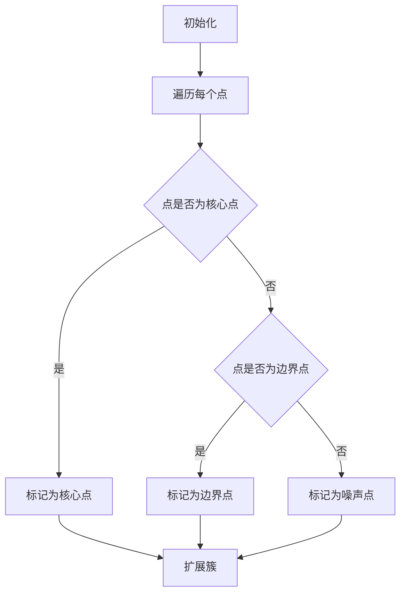

                 

## 文章标题

《DBSCAN：基于密度的空间聚类算法》

### 文章关键词

- DBSCAN
- 空间聚类
- 密度聚类
- 簇识别
- 异常点检测

### 文章摘要

本文深入探讨了DBSCAN（Density-Based Spatial Clustering of Applications with Noise）算法，一种基于密度的空间聚类方法。文章首先介绍了DBSCAN算法的基本概念、核心参数和目标，然后通过详细的工作流程和原理分析，帮助读者理解DBSCAN如何通过密度连接扩展簇。文章还包括对核心算法原理的伪代码讲解、数学模型和公式解析，以及实际项目中的应用案例，使读者能够全面掌握DBSCAN算法的原理和应用方法。

## 第一部分：DBSCAN算法概述

### 1.1 DBSCAN算法介绍

DBSCAN（Density-Based Spatial Clustering of Applications with Noise）是一种基于密度的空间聚类算法，最初由Ester等人在1996年提出。该算法通过对数据点进行邻域分析，发现高密度区域，从而将这些区域划分为簇。与传统的基于距离的聚类方法不同，DBSCAN不需要预先设定簇的数量，而是根据数据点的密度动态地确定簇的边界。

### 1.2 DBSCAN算法的基本概念

DBSCAN算法的核心在于其两个参数：邻域半径（eps）和邻域最小点数（minPoints）。

- **邻域半径（eps）**：eps是定义数据点邻域的关键参数。它决定了数据点之间的距离阈值，如果一个点的邻域中至少包含minPoints个点，那么这个点被认为是核心点。
- **邻域最小点数（minPoints）**：minPoints是另一个重要参数，用于确定一个核心点的最小邻域大小。只有当一个点的邻域中包含至少minPoints个点时，这个点才被认为是核心点。

### 1.3 DBSCAN算法的目标

DBSCAN算法的主要目标是发现空间中的聚类结构，并识别异常点。具体而言，它有以下三个目标：

1. **聚类**：将高密度区域划分为同一簇。
2. **标记核心点**：标记那些邻域内包含足够多点的数据点为核心点。
3. **标记边界点和噪声点**：对于既不满足核心点条件也不满足边界点条件的点，标记为噪声点。

### 1.4 DBSCAN算法的工作原理

DBSCAN算法的工作流程可以分为三个步骤：

1. **确定邻域**：对于每个数据点，计算其eps邻域内的点。
2. **标记簇**：根据邻域点的密度，将数据点划分为核心点、边界点和噪声点。
3. **扩展簇**：以核心点为中心，通过连接核心点和其邻域内的其他核心点，扩展形成簇。

下面是DBSCAN算法的工作流程的Mermaid流程图：

在下一部分，我们将详细分析DBSCAN算法的各个步骤和核心概念，帮助读者深入理解该算法的工作原理和实现方法。

---

**让我们一步一步思考：**

1. **核心概念与联系**：DBSCAN的核心在于如何根据密度信息来识别簇。我们需要理解密度是如何定义的，以及如何通过邻域半径（eps）和邻域最小点数（minPoints）来定义核心点和边界点。

2. **核心算法原理讲解**：通过伪代码来展示DBSCAN算法的步骤，使读者能够清晰地看到每个步骤的实现细节。

3. **数学模型和公式**：我们需要解释DBSCAN算法中的一些关键数学概念，如密度函数和距离度量。

4. **项目实战**：提供一个实际的案例，展示如何使用DBSCAN算法进行聚类，并解释代码的实现细节。

通过这样的逐步分析，我们可以确保读者能够全面掌握DBSCAN算法，并在实际项目中应用这一强大的聚类工具。在下一部分，我们将开始深入探讨DBSCAN算法的细节。让我们继续思考，并准备揭开DBSCAN算法的神秘面纱。

