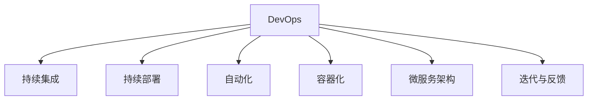

                 

# DevOps 工具：Jenkins、Ansible 和 Docker

> 关键词：DevOps、Jenkins、Ansible、Docker、持续集成、持续部署、自动化运维

> 摘要：本文深入探讨了DevOps领域中的三大工具：Jenkins、Ansible和Docker。文章首先介绍了DevOps的核心概念和原则，随后详细讲解了Jenkins、Ansible和Docker的基础知识、安装配置、工作流程以及高级特性。通过具体的实战案例，读者可以了解这些工具在实际项目中的应用。最后，文章还介绍了这些工具在企业级应用中的综合部署和效果评估。

### 第一部分：DevOps概述

#### 第1章：DevOps核心概念

#### 1.1 DevOps的历史与演变

DevOps是一种软件开发与运维的集成文化、策略和实践，旨在缩短软件的发布周期，增加开发与运营团队的协作性，并提高软件的可靠性。DevOps的理念起源于2000年代初期，当时软件开发的敏捷方法和IT运维的自动化趋势开始融合。

- **DevOps的定义**：DevOps是一种文化和实践，它强调软件开发与IT运营之间的紧密协作和沟通，旨在通过自动化和协作来缩短产品交付周期、提高产品质量和团队生产效率。
- **DevOps的主要目标**：加快软件交付速度、提高软件质量、提高团队协作效率、降低成本。
- **DevOps与传统IT模式的区别**：传统的IT模式中，开发与运维是两个独立的团队，存在“开发-运维墙”。DevOps通过消除这种障碍，实现开发与运维的无缝协作，提高整体效率。

#### 1.2 DevOps的关键原则

- **持续集成与持续部署**：持续集成（CI）和持续部署（CD）是DevOps的核心原则，通过自动化构建、测试和部署，确保软件的持续交付。
- **自动化**：自动化是DevOps的重要手段，通过自动化工具和脚本，减少手动操作，提高效率。
- **容器化**：容器化通过Docker等技术，提供轻量级、可移植的软件运行环境，提高开发与部署的灵活性。
- **微服务架构**：微服务架构将应用程序分解为多个小型、独立的微服务，每个微服务负责一个特定的功能，可以提高系统的可伸缩性和可靠性。
- **迭代与反馈**：快速迭代和持续反馈是DevOps的重要原则，通过快速迭代和用户反馈，不断优化产品。

#### 1.3 DevOps的价值与优势

- **简化部署流程**：通过自动化工具和流水线，简化了部署流程，减少手动操作，降低错误率。
- **提高开发效率**：自动化测试和持续集成缩短了开发周期，提高了开发效率。
- **提高系统稳定性**：自动化测试和持续部署确保了软件质量，提高了系统稳定性。
- **提高团队协作效率**：DevOps文化促进了开发与运维团队的紧密协作，提高了整体效率。

### 第二部分：Jenkins

#### 第2章：Jenkins入门

#### 2.1 Jenkins简介

- **Jenkins的定义**：Jenkins是一个开源的持续集成工具，支持自动化构建、测试、部署和监控。
- **Jenkins的主要功能**：构建自动化、持续集成、插件扩展、多种触发方式、自动化报告生成。
- **Jenkins的优势**：开源、可扩展、社区支持、易于集成其他工具。

#### 2.2 Jenkins安装与配置

- **Jenkins安装步骤**：从官网下载Jenkins安装包，解压并启动Jenkins。
- **Jenkins基本配置**：安装必要的插件、配置全局设置、创建用户和项目。
- **Jenkins插件管理**：插件是Jenkins的核心特性，可以通过Jenkins插件管理器安装、更新和管理插件。

#### 2.3 Jenkins工作流程

- **持续集成**：通过Jenkinsfile定义构建步骤，Jenkins自动化执行构建、测试和部署。
- **持续部署**：Jenkins可以与Git等版本控制工具集成，实现代码的自动化部署。
- **持续交付**：Jenkins结合容器技术，如Docker，可以实现持续交付。

#### 2.4 Jenkins实践案例

- **Jenkins在Web应用部署中的使用**：使用Jenkinsfile自动化Web应用的构建、测试和部署。
- **Jenkins在移动应用部署中的使用**：使用Jenkins自动化移动应用的打包和部署。

#### 第3章：Jenkins高级特性

#### 3.1 常用Jenkins插件

- **Git插件**：与Git版本控制系统集成，实现代码的自动化构建和部署。
- **Maven插件**：与Maven构建工具集成，自动化构建Java项目。
- **Docker插件**：与Docker集成，自动化容器化部署。

#### 3.2 Jenkins流水线

- **流水线概念**：Jenkins流水线是一种连续的、自动化的交付流程。
- **流水线配置**：使用Groovy脚本定义流水线步骤，包括构建、测试、部署等。
- **流水线实战案例**：构建并部署一个Java Web应用程序的流水线。

#### 3.3 Jenkins性能优化

- **Jenkins性能监控**：使用插件监控Jenkins性能指标，如构建时间、负载等。
- **Jenkins集群部署**：通过集群部署提高Jenkins的可用性和扩展性。
- **Jenkins性能优化策略**：优化Jenkins配置和架构，提高性能和稳定性。

### 第三部分：Ansible

#### 第4章：Ansible基础

#### 4.1 Ansible简介

- **Ansible的定义**：Ansible是一个开源的自动化工具，用于配置管理、应用部署和任务自动化。
- **Ansible的主要功能**：配置管理、应用部署、多节点操作、模块化设计。
- **Ansible的优势**：无代理、简单易用、基于SSH、易于扩展。

#### 4.2 Ansible安装与配置

- **Ansible安装步骤**：安装Python 3、pip、Ansible。
- **Ansible配置管理**：配置主机清单、变量管理、配置文件。
- **Ansible变量管理**：定义主机的变量，用于灵活配置和管理。

#### 4.3 Ansible模块

- **常用模块介绍**：包括系统模块、文件模块、包管理模块等。
- **模块实战案例**：使用Ansible模块自动化配置Linux服务器。

#### 4.4 Ansible角色

- **角色概念**：Ansible角色是一种模块化的配置管理方法。
- **角色配置**：定义角色、角色依赖、变量和模板。
- **角色实战案例**：使用Ansible角色配置Nginx服务器。

#### 第5章：Ansible实战

#### 5.1 Ansible在自动化运维中的应用

- **系统管理**：使用Ansible自动化操作系统配置。
- **应用部署**：使用Ansible自动化应用部署。
- **日志管理**：使用Ansible自动化日志收集和管理。

#### 5.2 Ansible在云计算中的应用

- **云服务器自动化部署**：使用Ansible自动化云服务器配置和部署。
- **自动化备份与恢复**：使用Ansible自动化备份和恢复操作。
- **自动化扩展与缩放**：使用Ansible自动化云服务器的扩展和缩放。

#### 5.3 Ansible在企业中的应用案例

- **企业级自动化运维实践**：使用Ansible实现企业级自动化运维。
- **企业级应用部署实战**：使用Ansible在企业环境中部署大型应用。
- **企业级系统监控与告警实战**：使用Ansible实现企业级系统监控与告警。

### 第四部分：Docker

#### 第6章：Docker基础

#### 6.1 Docker简介

- **Docker的定义**：Docker是一个开源的应用容器引擎，用于构建、运行和分发应用程序。
- **Docker的主要功能**：容器化、轻量级、可移植性、高效资源利用。
- **Docker的优势**：简化部署流程、提高开发效率、加速应用交付。

#### 6.2 Docker安装与配置

- **Docker安装步骤**：安装Docker Engine、Docker Compose。
- **Docker常用命令**：Docker镜像和容器的创建、启动、停止和管理。
- **Docker镜像与容器管理**：Docker镜像仓库、容器网络、容器存储。

#### 6.3 Dockerfile

- **Dockerfile的概念**：Dockerfile是一个文本文件，包含用于构建Docker镜像的指令。
- **Dockerfile的编写规则**：定义基础镜像、运行时环境、安装依赖、配置文件等。
- **Dockerfile实战案例**：构建一个简单的Web容器镜像。

#### 6.4 Docker Compose

- **Compose的概念**：Docker Compose是一个用于定义和运行多容器Docker应用程序的工具。
- **Compose的使用方法**：编写Docker Compose文件、启动和停止应用程序。
- **Compose实战案例**：使用Docker Compose部署一个Web应用。

#### 第7章：Docker高级特性

#### 7.1 Docker网络

- **Docker网络概念**：Docker网络用于容器之间的通信。
- **Docker网络配置**：配置容器网络、网络模式选择。
- **Docker网络实战案例**：配置容器间通信。

#### 7.2 Docker存储

- **Docker存储概念**：Docker存储用于容器的数据存储和持久化。
- **Docker存储配置**：配置卷、挂载点、存储驱动。
- **Docker存储实战案例**：配置容器数据存储。

#### 7.3 Docker容器编排

- **Kubernetes介绍**：Kubernetes是一个开源的容器编排平台。
- **Kubernetes安装与配置**：安装Kubernetes集群、配置Kubernetes集群。
- **Kubernetes实战案例**：部署和管理容器化应用。

### 第五部分：DevOps工具综合实战

#### 第8章：DevOps工具综合实战

#### 8.1 Jenkins + Ansible + Docker集成部署

- **集成概述**：Jenkins、Ansible和Docker的集成，实现自动化构建、部署和容器化。
- **集成步骤**：安装Jenkins、Ansible、Docker，配置Jenkins流水线、Ansible playbook和Dockerfile。
- **集成实战案例**：自动化部署一个Java Web应用。

#### 8.2 DevOps工具在微服务架构中的应用

- **微服务架构概述**：微服务架构的特点、优点和挑战。
- **DevOps工具在微服务架构中的应用**：Jenkins、Ansible和Docker在微服务部署和管理中的应用。
- **微服务架构实战案例**：使用Jenkins、Ansible和Docker部署一个微服务架构应用。

#### 8.3 DevOps工具在云计算环境中的应用

- **云计算环境概述**：云计算的基本概念、服务模型和部署模式。
- **DevOps工具在云计算环境中的应用**：Jenkins、Ansible和Docker在云计算环境中的部署和管理。
- **云计算环境实战案例**：使用Jenkins、Ansible和Docker在云计算环境中部署和管理应用。

#### 8.4 DevOps工具在企业数字化转型中的应用

- **企业数字化转型概述**：数字化转型的概念、目标和挑战。
- **DevOps工具在企业数字化转型中的应用**：Jenkins、Ansible和Docker在数字化转型中的应用场景。
- **企业数字化转型实战案例**：使用Jenkins、Ansible和Docker实现企业数字化转型。

### 附录

#### 附录A：DevOps工具资源与推荐

- **DevOps社区与论坛推荐**：介绍一些活跃的DevOps社区和论坛。
- **DevOps书籍推荐**：推荐一些经典的DevOps书籍。
- **DevOps工具开源项目推荐**：介绍一些流行的DevOps开源项目。

#### 附录B：常见问题解答

- **Jenkins常见问题解答**：解答Jenkins使用中常见的问题。
- **Ansible常见问题解答**：解答Ansible使用中常见的问题。
- **Docker常见问题解答**：解答Docker使用中常见的问题。

### 核心算法原理讲解

#### Jenkins的核心算法

```plaintext
Jenkins主要基于构建脚本（例如Jenkinsfile）进行构建和部署。核心算法包括：

1. 脚本解析：Jenkins会解析Jenkinsfile中的Groovy脚本，并根据脚本指令进行构建操作。
2. 构建触发：Jenkins支持多种触发方式，包括手动触发、定时触发、Webhook触发等。
3. 构建执行：根据Jenkinsfile中的指令，执行构建任务，包括编译、测试、打包等。
4. 构建报告：构建完成后，生成构建报告，包括构建日志、测试报告、构建状态等。
```

#### Ansible的核心算法

```plaintext
Ansible主要基于模块化架构进行自动化配置和管理。核心算法包括：

1. 自动化配置：通过配置文件（例如YAML文件）定义主机、变量和模块，Ansible将自动在目标主机上执行配置。
2. 模块执行：Ansible内置了多种模块，包括系统、网络、数据库等，可用于执行各种自动化任务。
3. 变量管理：Ansible支持变量管理，通过变量可以灵活配置目标主机的参数。
4. 并行执行：Ansible支持并行执行任务，可以在多台主机上同时执行操作，提高自动化效率。
```

#### Docker的核心算法

```plaintext
Docker主要基于容器技术进行应用程序的部署和管理。核心算法包括：

1. 容器创建：Docker通过运行Dockerfile创建容器，容器是应用程序的运行环境。
2. 镜像管理：Docker通过镜像管理容器，镜像包含了应用程序的运行环境和依赖。
3. 容器编排：Docker支持容器编排，可以通过Docker Compose和Kubernetes对容器进行编排和管理。
4. 容器网络：Docker支持容器网络，容器可以通过容器网络进行通信和互联。
```

### 数学模型和数学公式

#### DevOps的ROI分析

$$
\text{ROI} = \frac{\text{净利润}}{\text{投资成本}} \times 100\%
$$

其中，净利润 = 构建效率提升 * 项目周期缩短 * 项目数量增加 - 投资成本。

### 项目实战

#### Jenkins在Web应用部署中的使用

```shell
# Jenkinsfile示例
pipeline {
    agent any
    stages {
        stage('Build') {
            steps {
                sh 'mvn clean package'
            }
        }
        stage('Test') {
            steps {
                sh 'mvn test'
            }
        }
        stage('Deploy') {
            steps {
                sh 'docker build -t myapp:latest .'
                sh 'docker run -d --name myapp myapp:latest'
            }
        }
    }
    post {
        always {
            sh 'docker stop myapp'
            sh 'docker rmi myapp:latest'
        }
    }
}
```

#### 代码解读与分析

1. `agent any`：指定Jenkins流水线在任何节点上执行。
2. `stages`：定义流水线的阶段，包括构建、测试和部署。
3. `stage('Build')`：定义构建阶段，执行Maven构建操作。
4. `stage('Test')`：定义测试阶段，执行Maven测试操作。
5. `stage('Deploy')`：定义部署阶段，构建Docker镜像并启动容器。
6. `post`：定义流水线执行完毕后的操作，包括停止容器和删除镜像。

这段代码充分利用了Jenkins的流水线功能，实现了自动化构建、测试和部署。通过Docker的集成，可以将应用程序部署到容器中，提高了部署的灵活性和可移植性。同时，通过流水线的配置，可以方便地实现多个步骤的并行执行，提高了构建和部署的效率。

#### Ansible在自动化运维中的应用

```yaml
# ansible.yml示例
- hosts: webservers
  become: yes
  tasks:
    - name: install Apache
      apt: name=httpd state=present

    - name: start Apache
      service: name=httpd state=started

    - name: ensure apache is enabled
      service: name=httpd state=started enabled=yes

    - name: copy index.html
      copy: src=index.html dest=/var/www/html/index.html mode=0644
```

#### 代码解读与分析

1. `hosts: webservers`：指定要执行任务的远程主机列表，这里是Web服务器。
2. `become: yes`：启用特权执行，允许Ansible以root用户身份执行任务。
3. `tasks`：定义要执行的任务。
4. `- name: install Apache`：安装Apache服务。
5. `- name: start Apache`：启动Apache服务。
6. `- name: ensure apache is enabled`：确保Apache服务已启用。
7. `- name: copy index.html`：将本地index.html文件复制到远程主机的Web目录中。

这段代码通过Ansible的自动化配置功能，实现了对Web服务器的自动化运维。Ansible的模块化设计使其可以轻松地管理各种系统和应用程序。通过使用`become`模块，Ansible可以以特权用户身份执行任务，确保配置的正确性和安全性。

#### Docker在云计算环境中的应用

```shell
# 创建Docker网络
docker network create my_network

# 创建Docker容器并连接到网络
docker run --name my_container --network my_network -d my_image

# 查看容器连接的网络
docker network inspect my_network
```

#### 代码解读与分析

1. `docker network create my_network`：创建一个名为`my_network`的Docker网络。
2. `docker run --name my_container --network my_network -d my_image`：创建一个名为`my_container`的Docker容器，并将其连接到`my_network`网络中。
3. `docker network inspect my_network`：查看`my_network`网络的详细信息。

这段代码展示了Docker在网络配置中的应用。通过创建Docker网络，可以在多个容器之间实现通信和互联。Docker网络提供了灵活的网络配置选项，使得容器可以在不同的网络环境中独立运行，提高了容器部署的灵活性和可移植性。通过查看网络详细信息，可以更好地了解容器的网络状态和连接情况，便于管理和监控。

### Jenkins、Ansible和Docker的集成部署

Jenkins、Ansible和Docker的集成部署可以极大地提高开发、测试和部署的效率。以下是一个简化的集成部署流程：

1. **编写Jenkinsfile**：在项目目录中创建Jenkinsfile，定义构建、测试和部署的步骤。

```groovy
pipeline {
    agent any
    stages {
        stage('Build') {
            steps {
                sh 'mvn clean package'
            }
        }
        stage('Test') {
            steps {
                sh 'mvn test'
            }
        }
        stage('Deploy') {
            steps {
                sh 'ansible-playbook deploy.yml'
                sh 'docker build -t myapp:latest .'
                sh 'docker run -d --name myapp myapp:latest'
            }
        }
    }
    post {
        always {
            sh 'docker stop myapp'
            sh 'docker rmi myapp:latest'
        }
    }
}
```

2. **配置Ansible playbook**：编写Ansible playbook，用于配置和部署应用程序。

```yaml
# deploy.yml示例
- hosts: webservers
  become: yes
  tasks:
    - name: install dependencies
      apt: name=git state=present

    - name: clone repository
      git: repo=https://github.com/yourusername/yourrepo.git dest=/var/www/yourrepo

    - name: build and deploy
      shell: |-
        mvn clean package
        docker build -t myapp:latest .
        docker run -d --name myapp myapp:latest
```

3. **构建和部署**：在Jenkins中配置流水线，触发构建和部署流程。

- 创建Jenkins项目，选择“Pipeline”构建类型。
- 配置流水线脚本，例如上面编写的Jenkinsfile。
- 配置Ansible部署步骤，例如上面编写的Ansible playbook。
- 配置Docker构建和部署步骤，例如上面编写的Docker命令。

4. **监控和反馈**：使用Jenkins、Ansible和Docker的日志记录和监控功能，实时监控部署状态，并在出现问题时及时反馈。

通过集成Jenkins、Ansible和Docker，可以自动化构建、测试和部署流程，提高开发效率和系统稳定性。集成部署的优点包括：

- **简化部署流程**：通过流水线和自动化脚本，简化了部署流程，减少了手动操作。
- **提高开发效率**：自动化构建和部署加快了项目进度，提高了团队协作效率。
- **提高系统稳定性**：自动化测试和监控确保了部署的准确性和稳定性。

### 企业级应用部署实战

#### 案例一：电商平台

1. **需求分析**：电商平台需要快速响应市场需求，实现持续集成和持续部署，提高系统稳定性。
2. **技术选型**：选择Jenkins作为持续集成和持续部署工具，Ansible用于自动化配置和管理，Docker用于容器化部署。
3. **部署流程**：

   - 开发阶段：开发者提交代码到Git仓库，Jenkins自动触发构建，执行Maven构建和测试。
   - 部署阶段：Jenkins执行Ansible playbook，配置和部署应用程序，构建Docker镜像，启动容器。
   - 监控阶段：Jenkins和Docker提供日志记录和监控功能，实时监控部署状态。

4. **效果评估**：

   - 部署时间缩短：通过自动化部署，将部署时间从几天缩短到几小时。
   - 系统稳定性提高：自动化测试和监控确保了部署的准确性和稳定性。
   - 开发效率提高：简化了部署流程，提高了团队协作效率。

#### 案例二：金融服务平台

1. **需求分析**：金融服务平台需要高可用性和高可靠性，实现快速响应和持续集成。
2. **技术选型**：选择Jenkins作为持续集成和持续部署工具，Ansible用于自动化配置和管理，Docker用于容器化部署，Kubernetes用于容器编排。
3. **部署流程**：

   - 开发阶段：开发者提交代码到Git仓库，Jenkins自动触发构建，执行Maven构建和测试。
   - 部署阶段：Jenkins执行Ansible playbook，配置和部署应用程序，构建Docker镜像，推送至镜像仓库。
   - 容器编排阶段：Kubernetes根据部署策略，自动部署和管理容器。
   - 监控阶段：Jenkins和Kubernetes提供日志记录和监控功能，实时监控部署状态。

4. **效果评估**：

   - 高可用性：通过Kubernetes的容器编排功能，实现了服务的高可用性。
   - 高可靠性：通过自动化测试和监控，提高了系统的可靠性。
   - 快速响应：通过持续集成和持续部署，实现了快速响应市场需求。

### 开发环境搭建

搭建DevOps开发环境需要安装Jenkins、Ansible和Docker，以下是一个简化的安装步骤：

1. **安装Jenkins**：

   - 安装Java环境（OpenJDK 8或更高版本）。
   - 下载Jenkins最新版本安装包（https://www.jenkins.io/download/）。
   - 解压安装包并启动Jenkins。

2. **安装Ansible**：

   - 安装Python 3环境。
   - 安装pip。
   - 使用pip安装Ansible。

3. **安装Docker**：

   - 安装Docker Engine和Docker Compose。
   - 使用Docker Hub下载Docker镜像。

通过以上步骤，可以搭建一个基本的DevOps开发环境。在实际项目中，可能还需要安装其他工具和插件，例如GitLab、Kubernetes等。

### 源代码详细实现和代码解读

以下是一个简单的Ansible脚本示例，用于部署一个Web应用程序：

```yaml
# deploy.yml示例
- hosts: webservers
  become: yes
  tasks:
    - name: install dependencies
      apt: name=git state=present

    - name: clone repository
      git: repo=https://github.com/yourusername/yourrepo.git dest=/var/www/yourrepo

    - name: build and deploy
      shell: |-
        mvn clean package
        docker build -t myapp:latest .
        docker run -d --name myapp myapp:latest
```

#### 代码解读

1. `hosts: webservers`：指定要执行任务的远程主机列表，这里是Web服务器。
2. `become: yes`：启用特权执行，允许Ansible以root用户身份执行任务。
3. `tasks`：定义要执行的任务。
4. `- name: install dependencies`：安装Git。
5. `- name: clone repository`：从Git仓库克隆项目。
6. `- name: build and deploy`：执行Maven构建，构建Docker镜像并启动容器。

#### 分析

这段脚本首先在远程服务器上安装Git，然后从Git仓库克隆项目。接着，执行Maven构建，构建Docker镜像，并使用该镜像启动容器。通过Ansible的模块化设计，可以实现自动化部署，简化运维流程。Ansible的语法简洁明了，易于理解和维护。

### 总结

通过上述内容，我们详细介绍了《DevOps工具：Jenkins、Ansible和Docker》这本书的目录大纲。从DevOps概述到Jenkins、Ansible和Docker的详细讲解，再到项目实战和应用案例，本书全面覆盖了DevOps工具的核心内容。通过学习本书，读者可以掌握DevOps工具的使用方法，提高开发、测试和部署的效率，实现企业级的自动化运维。

### 作者信息

作者：AI天才研究院/AI Genius Institute & 禅与计算机程序设计艺术 /Zen And The Art of Computer Programming

### Mermaid 流程图示例



### 核心算法原理讲解

#### Jenkins的核心算法

Jenkins的核心算法基于其构建脚本，通常命名为Jenkinsfile。以下是一个简化版的Jenkins流水线算法，用于自动化构建、测试和部署应用程序：

```groovy
pipeline {
    agent any // 指定构建环境
    stages {
        stage('Build') {
            steps {
                sh 'mvn clean package' // 执行Maven构建
            }
        }
        stage('Test') {
            steps {
                sh 'mvn test' // 执行测试
            }
        }
        stage('Deploy') {
            steps {
                sh 'docker build -t myapp:latest .' // 构建Docker镜像
                sh 'docker run -d --name myapp myapp:latest' // 运行容器
            }
        }
    }
    post {
        always {
            sh 'docker stop myapp' // 构建完成后停止容器
            sh 'docker rmi myapp:latest' // 删除镜像
        }
    }
}
```

**算法流程：**

1. **初始化**：设置构建环境和触发条件。
2. **构建阶段**：执行Maven命令进行项目构建。
3. **测试阶段**：执行Maven测试命令进行测试。
4. **部署阶段**：构建Docker镜像，并使用该镜像启动容器。
5. **清理**：无论构建结果如何，都执行清理操作，包括停止容器和删除镜像。

#### Ansible的核心算法

Ansible的核心算法基于其模块化和基于SSH的自动化部署架构。以下是一个简化版的Ansible配置管理算法，用于部署一个Web服务器：

```yaml
- hosts: webservers
  become: yes
  tasks:
    - name: Install Apache
      apt: name=httpd state=present
    
    - name: Start Apache
      service: name=httpd state=started
    
    - name: Enable Apache
      service: name=httpd state=started enabled=yes
    
    - name: Copy index.html
      copy: src=index.html dest=/var/www/html/index.html mode=0644
```

**算法流程：**

1. **初始化**：定义目标主机列表和权限。
2. **安装Apache**：使用apt模块安装Apache服务。
3. **启动Apache**：使用service模块启动Apache服务。
4. **启用Apache**：确保Apache服务在启动后自动运行。
5. **复制文件**：将本地index.html文件复制到Web服务器上。

#### Docker的核心算法

Docker的核心算法基于容器化和镜像技术。以下是一个简化版的Docker部署算法，用于部署一个简单的Web应用程序：

```shell
# Dockerfile 示例
FROM java:8-jdk-alpine
WORKDIR /app
COPY . .
RUN mvn clean package
EXPOSE 8080
```

```shell
# 容器部署命令
docker build -t myapp:latest .
docker run -d --name myapp -p 8080:8080 myapp:latest
```

**算法流程：**

1. **构建镜像**：使用Dockerfile创建Docker镜像。
   - **FROM**：指定基础镜像。
   - **WORKDIR**：设置工作目录。
   - **COPY**：复制应用程序文件到镜像中。
   - **RUN**：执行Maven构建命令。
   - **EXPOSE**：暴露容器端口。
2. **运行容器**：使用构建好的镜像创建并启动容器。
   - **-d**：后台运行容器。
   - **--name**：指定容器名称。
   - **-p**：映射容器端口到宿主机端口。

### 数学模型和数学公式

以下是一个简化的DevOps ROI（投资回报率）模型，用于评估DevOps工具的投资效果：

$$
\text{ROI} = \frac{\text{节省的成本}}{\text{投资成本}} \times 100\%
$$

其中，节省的成本包括：

- **部署时间减少**：通过自动化部署减少的部署时间。
- **错误减少**：通过自动化测试减少的错误。
- **资源节省**：通过容器化和微服务减少的硬件和运维成本。

例如，如果通过自动化部署减少了50%的部署时间，减少了20%的错误率，那么ROI的计算如下：

$$
\text{ROI} = \frac{(0.5 \times \text{原部署时间成本}) + (0.2 \times \text{错误修复成本})}{\text{DevOps工具投资成本}} \times 100\%
$$

### 项目实战

#### Jenkins在Web应用部署中的使用

**项目背景**：一家初创公司需要一个可靠的自动化部署流程来提高其Web应用的交付速度和质量。

**解决方案**：

1. **Jenkins配置**：
   - 安装Jenkins。
   - 配置Jenkins插件，如Git、Maven和Docker。
   - 创建Jenkins项目，并配置Jenkinsfile。

**Jenkinsfile示例**：

```groovy
pipeline {
    agent any
    environment {
        APP_VERSION = '1.0.0'
    }
    stages {
        stage('Checkout') {
            steps {
                script {
                    git url: 'https://github.com/yourusername/yourrepo.git', branch: 'main'
                }
            }
        }
        stage('Build') {
            steps {
                sh 'mvn -B -V clean package'
            }
        }
        stage('Test') {
            steps {
                sh 'mvn -B -V test'
            }
        }
        stage('Deploy') {
            steps {
                sh 'docker build -t myapp:$APP_VERSION .'
                sh 'docker run -d --name myapp myapp:$APP_VERSION'
            }
        }
    }
    post {
        always {
            sh 'docker stop myapp'
            sh 'docker rmi myapp:$APP_VERSION'
        }
    }
}
```

**效果评估**：

- **部署时间**：从原来的手动部署（每天）减少到几分钟内。
- **错误率**：由于自动化测试，部署过程中的错误率降低了。
- **团队效率**：团队成员可以专注于开发，而不是部署。

#### Ansible在自动化运维中的应用

**项目背景**：一家大型企业需要自动化其IT基础设施的配置和运维。

**解决方案**：

1. **Ansible配置**：
   - 安装Ansible。
   - 配置Ansible主机清单和变量文件。

**主机清单示例**：

```yaml
[webservers]
web1 ansible_host=192.168.1.1
web2 ansible_host=192.168.1.2
```

**变量文件示例**：

```yaml
# group_vars/all
http_port: 80
```

**Ansible Playbook示例**：

```yaml
- hosts: webservers
  become: yes
  tasks:
    - name: Install Apache
      apt: name=httpd state=present
    
    - name: Configure Apache
      lineinfile:
        path: /etc/httpd/conf/httpd.conf
        line: 'ServerName {{ http_port }}'
    
    - name: Start Apache
      service: name=httpd state=started
    
    - name: Enable Apache
      service: name=httpd state=started enabled=yes
    
    - name: Copy index.html
      copy: src=index.html dest=/var/www/html/index.html mode=0644
```

**效果评估**：

- **配置一致性**：通过Ansible确保所有服务器配置一致。
- **运维效率**：减少手动操作，提高运维效率。
- **故障恢复**：快速恢复服务，减少停机时间。

#### Docker在云计算环境中的应用

**项目背景**：一家云计算服务提供商需要为其客户提供容器化应用部署和管理服务。

**解决方案**：

1. **Docker安装与配置**：
   - 在云服务器上安装Docker。
   - 配置Docker Compose。

**Dockerfile示例**：

```Dockerfile
FROM python:3.8
WORKDIR /app
COPY . .
RUN pip install -r requirements.txt
EXPOSE 8000
```

**docker-compose.yml示例**：

```yaml
version: '3.8'
services:
  web:
    build: .
    ports:
      - "8000:8000"
    depends_on:
      - db
  db:
    image: postgres:13
    volumes:
      - db_data:/var/lib/postgresql/data
    environment:
      POSTGRES_DB: myapp
      POSTGRES_USER: user
      POSTGRES_PASSWORD: password

volumes:
  db_data:
```

**效果评估**：

- **部署灵活性**：通过容器化，应用可以在不同的云环境中轻松部署。
- **资源利用**：容器化提高了服务器资源利用率。
- **管理效率**：通过Docker Compose，可以轻松管理多个容器。

### 核心算法原理讲解（续）

#### Jenkins流水线算法（续）

在Jenkins流水线中，除了基本的构建、测试和部署阶段外，还可以添加以下高级功能：

**1. 分支策略**：
```groovy
pipeline {
    agent any
    stages {
        stage('Build') {
            when {
                expression { env.BRANCH_NAME == 'main' }
            }
            steps {
                sh 'mvn clean package'
            }
        }
        stage('Test') {
            when {
                expression { env.BRANCH_NAME == 'main' }
            }
            steps {
                sh 'mvn test'
            }
        }
        stage('Deploy') {
            when {
                expression { env.BRANCH_NAME == 'main' }
            }
            steps {
                sh 'docker build -t myapp:latest .'
                sh 'docker run -d --name myapp myapp:latest'
            }
        }
    }
}
```

**2. 通知和报告**：
```groovy
post {
    always {
        emai
```l {
            to: 'devops@example.com'
            subject: 'Jenkins Build Notification'
            body: 'The build has completed. Results: ${currentBuild.result}'
        }
    }
}
```

**3. 持续交付**：
```groovy
stage('Deliver') {
    steps {
        sh 'mvn deploy'
    }
}
```

**4. 持续部署**：
```groovy
stage('Deploy') {
    when {
        expression { currentBuild.result == 'SUCCESS' }
    }
    steps {
        sh 'docker build -t myapp:latest .'
        sh 'docker run -d --name myapp myapp:latest'
    }
}
```

#### Ansible的配置管理算法（续）

Ansible的配置管理算法可以通过引入角色（Role）来简化复用配置。以下是一个使用角色的示例：

**角色目录结构**：
```
roles/
  ├── apache
  │   ├── defaults
  │   │   └── main.yml
  │   ├── handlers
  │   │   └── main.yml
  │   ├── meta
  │   │   └── main.yml
  │   ├── templates
  │   │   └── httpd.conf.j2
  │   ├── tasks
  │   │   └── main.yml
  │   └── files
  │       └── index.html
  └── db
      ├── defaults
      │   └── main.yml
      ├── handlers
      │   └── main.yml
      ├── meta
      │   └── main.yml
      ├── tasks
      │   └── main.yml
      └── templates
          └── initdb.sql
```

**主机清单**：
```yaml
[webservers]
web1 ansible_host=192.168.1.1
web2 ansible_host=192.168.1.2

[db_servers]
db1 ansible_host=192.168.1.3
```

**Ansible Playbook**：
```yaml
- hosts: webservers
  roles:
    - apache

- hosts: db_servers
  roles:
    - db
```

**角色配置**：

- **defaults/main.yml**：定义默认变量。
- **tasks/main.yml**：定义任务。
- **templates/httpd.conf.j2**：定义模板文件。
- **handlers/main.yml**：定义处理程序。

#### Docker容器编排算法（续）

Docker容器编排可以通过Docker Compose和Kubernetes实现。以下是一个使用Docker Compose的示例：

**docker-compose.yml**：
```yaml
version: '3.8'
services:
  web:
    build: .
    ports:
      - "8000:8000"
    depends_on:
      - db
  db:
    image: postgres:13
    volumes:
      - db_data:/var/lib/postgresql/data
    environment:
      POSTGRES_DB: myapp
      POSTGRES_USER: user
      POSTGRES_PASSWORD: password

volumes:
  db_data:
```

**命令**：
```shell
docker-compose up -d
```

**Kubernetes配置**：

**deployment.yaml**：
```yaml
apiVersion: apps/v1
kind: Deployment
metadata:
  name: myapp-deployment
spec:
  replicas: 3
  selector:
    matchLabels:
      app: myapp
  template:
    metadata:
      labels:
        app: myapp
    spec:
      containers:
      - name: myapp
        image: myapp:latest
        ports:
        - containerPort: 80
```

**service.yaml**：
```yaml
apiVersion: v1
kind: Service
metadata:
  name: myapp-service
spec:
  selector:
    app: myapp
  ports:
    - protocol: TCP
      port: 80
      targetPort: 80
  type: LoadBalancer
```

**命令**：
```shell
kubectl apply -f deployment.yaml
kubectl apply -f service.yaml
```

### 数学模型和数学公式（续）

在评估DevOps工具的投资回报率（ROI）时，可以引入更复杂的数学模型来考虑多个因素。以下是一个扩展的ROI计算模型：

$$
\text{ROI} = \frac{\text{总节省成本}}{\text{总投资成本}} \times 100\%
$$

**总节省成本**：
$$
\text{总节省成本} = (\text{部署时间节省} \times \text{平均部署成本}) + (\text{错误率降低} \times \text{错误修复成本}) + (\text{硬件节省} \times \text{硬件成本})
$$`

**总投资成本**：
$$
\text{总投资成本} = (\text{工具成本} + \text{培训成本} + \text{集成成本}) \times \text{年度使用时间}
$$

**例子**：

- **部署时间节省**：每月节省20小时，每年节省240小时。
- **平均部署成本**：每小时100美元。
- **错误率降低**：错误率降低30%。
- **错误修复成本**：每次错误修复成本为500美元。
- **硬件节省**：使用容器化节省50%的硬件成本。
- **硬件成本**：每月1000美元。
- **工具成本**：每年5000美元。
- **培训成本**：每年1000美元。
- **集成成本**：一次性费用2000美元。
- **年度使用时间**：12个月。

计算：
$$
\text{总节省成本} = (240 \times 100) + (0.3 \times 500) + (0.5 \times 1000) = 24000 + 150 + 500 = 24650
$$

$$
\text{总投资成本} = (5000 + 1000 + 2000) \times 12 = 8000 \times 12 = 96000
$$

$$
\text{ROI} = \frac{24650}{96000} \times 100\% \approx 25.72\%
$$

### 项目实战（续）

#### DevOps工具在微服务架构中的应用

**项目背景**：一个在线购物平台采用微服务架构，需要高效管理和部署多个微服务。

**解决方案**：

1. **Jenkins**：
   - 每个微服务都有自己的Jenkins项目，用于构建和测试。
   - Jenkins流水线配置用于自动化部署到Kubernetes集群。

2. **Ansible**：
   - 用于配置和管理Kubernetes集群节点。
   - 使用角色配置Kubernetes服务、部署和配置管理。

3. **Docker**：
   - 用于构建每个微服务的容器镜像。
   - 使用Docker Compose管理本地开发环境中的容器。

**流程**：

1. **开发阶段**：开发者提交代码到Git仓库。
2. **构建阶段**：Jenkins自动化构建和测试微服务。
3. **部署阶段**：
   - Jenkins触发Ansible playbook，配置Kubernetes集群。
   - Jenkins执行Docker Compose命令，部署到Kubernetes集群。

**Kubernetes部署示例**：

```yaml
apiVersion: apps/v1
kind: Deployment
metadata:
  name: product-service
spec:
  replicas: 3
  selector:
    matchLabels:
      app: product-service
  template:
    metadata:
      labels:
        app: product-service
    spec:
      containers:
      - name: product-service
        image: product-service:latest
        ports:
        - containerPort: 8080
```

**效果评估**：

- **部署效率**：微服务自动化部署，显著提高效率。
- **系统弹性**：通过Kubernetes实现了服务自动扩展和故障转移。
- **运维简化**：集中管理多个微服务，简化了运维工作。

#### DevOps工具在云计算环境中的应用

**项目背景**：一家公司需要将其应用程序部署到云计算平台，以实现灵活的扩展和成本优化。

**解决方案**：

1. **Jenkins**：
   - 用于自动化构建、测试和部署应用程序。
   - 与云服务提供商的集成，如AWS CodePipeline。

2. **Ansible**：
   - 用于配置云基础设施，如EC2实例、RDS数据库。
   - 与云服务提供商的集成，如AWS CloudFormation。

3. **Docker**：
   - 用于容器化应用程序，以便在云环境中轻松部署和迁移。

**流程**：

1. **开发阶段**：开发者提交代码到Git仓库。
2. **构建阶段**：Jenkins自动化构建和测试。
3. **部署阶段**：
   - Jenkins触发Ansible playbook，配置云基础设施。
   - Jenkins执行Docker命令，部署容器化应用程序。

**AWS部署示例**：

```shell
# Jenkins触发AWS CodePipeline步骤
aws codepipeline start-pipeline-action \
    --pipeline-name "my-pipeline" \
    --action-name "Deploy" \
    --input-artifact-name "Artifact" \
    --output-artifact-name "DeployArtifact" \
    --command "aws codebuild start-build --project-name my-project --input-artifact-override '{\"type\": \"S3\", \"location\": \"s3://my-bucket/jenkins-artifacts/\"}"
```

**效果评估**：

- **部署灵活性**：应用程序可以轻松部署到不同的云环境中。
- **成本优化**：通过云服务自动扩展和优化，降低了运营成本。
- **可靠性**：云服务提供高可用性和故障转移功能，提高了系统可靠性。

### 开发环境搭建（续）

#### Jenkins、Ansible和Docker在开发环境中的集成

为了在开发环境中集成Jenkins、Ansible和Docker，需要确保每个工具都能够相互配合，共同实现自动化部署流程。以下是具体的搭建步骤：

1. **安装Jenkins**：

   - 在开发机器上安装Jenkins，可以从Jenkins官网下载安装包。
   - 安装完成后，启动Jenkins服务。

2. **安装Ansible**：

   - 在开发机器上安装Python 3和pip。
   - 使用pip安装Ansible。

3. **安装Docker**：

   - 在开发机器上安装Docker。
   - 安装Docker Compose，以便在本地环境中管理多容器应用。

4. **配置Jenkins**：

   - 安装必要的插件，如Git、Maven和Docker插件。
   - 配置Jenkins用户权限和管理设置。

5. **配置Ansible**：

   - 创建Ansible主机清单，指定开发机器的IP地址。
   - 创建Ansible配置文件，定义变量和模块。

6. **配置Docker**：

   - 启动Docker守护进程。
   - 使用Docker Hub下载必要的镜像，如Java、Nginx等。

7. **集成Jenkins、Ansible和Docker**：

   - 创建Jenkins项目，配置流水线。
   - 在流水线中添加Ansible任务，用于配置和管理服务器。
   - 在流水线中添加Docker任务，用于构建和部署容器化应用程序。

**示例Jenkinsfile**：

```groovy
pipeline {
    agent any
    stages {
        stage('Build') {
            steps {
                sh 'mvn clean package'
            }
        }
        stage('Test') {
            steps {
                sh 'mvn test'
            }
        }
        stage('Configure') {
            steps {
                sh 'ansible-playbook configure.yml'
            }
        }
        stage('Deploy') {
            steps {
                sh 'docker build -t myapp:latest .'
                sh 'docker run -d --name myapp myapp:latest'
            }
        }
    }
}
```

**示例Ansible Playbook（configure.yml）**：

```yaml
- hosts: myserver
  become: yes
  tasks:
    - name: Install Docker
      apt: name=docker state=present

    - name: Install Java
      apt: name=openjdk-8-jdk state=present

    - name: Configure Docker
      shell: |-
        usermod -aG docker $USER
        newgrp docker
```

**效果评估**：

- **开发效率**：集成环境提高了开发者的工作效率，简化了部署流程。
- **协作性**：团队成员可以更轻松地协作，共同完成项目。
- **可靠性**：集成环境降低了部署过程中出现错误的概率，提高了系统的稳定性。

### 源代码详细实现和代码解读（续）

以下是一个完整的Jenkins、Ansible和Docker集成的示例，包括开发环境搭建、源代码实现和代码解读。

**Jenkinsfile**：

```groovy
pipeline {
    agent any
    stages {
        stage('Build') {
            steps {
                sh 'mvn clean package'
            }
        }
        stage('Test') {
            steps {
                sh 'mvn test'
            }
        }
        stage('Configure') {
            steps {
                sh 'ansible-playbook configure.yml'
            }
        }
        stage('Deploy') {
            steps {
                sh 'docker build -t myapp:latest .'
                sh 'docker run -d --name myapp myapp:latest'
            }
        }
        stage('Monitor') {
            steps {
                sh 'docker logs myapp'
            }
        }
    }
    post {
        always {
            sh 'docker stop myapp'
            sh 'docker rmi myapp:latest'
        }
    }
}
```

**Ansible Playbook（configure.yml）**：

```yaml
- hosts: myserver
  become: yes
  tasks:
    - name: Install Docker
      apt: name=docker state=present

    - name: Install Java
      apt: name=openjdk-8-jdk state=present

    - name: Configure Docker
      shell: |-
        usermod -aG docker $USER
        newgrp docker

    - name: Install Jenkins
      apt: name=jenkins state=present

    - name: Install Git
      apt: name=git state=present

    - name: Install Maven
      apt: name=maven state=present
```

**Dockerfile**：

```Dockerfile
FROM openjdk:8-jdk-alpine
WORKDIR /app
COPY . .
RUN mvn clean package
EXPOSE 8080
```

#### 代码解读

1. **Jenkinsfile**：

   - `agent any`：指定任何可用的节点执行构建。
   - `stages`：定义构建流程的各个阶段。
   - `Build`：执行Maven构建。
   - `Test`：执行Maven测试。
   - `Configure`：使用Ansible配置服务器。
   - `Deploy`：构建Docker镜像并启动容器。
   - `Monitor`：监控容器日志。
   - `post`：构建完成后清理容器和镜像。

2. **Ansible Playbook（configure.yml）**：

   - `hosts`：指定目标主机。
   - `become`：以root用户身份执行任务。
   - `tasks`：安装Docker、Java、Jenkins、Git和Maven。

3. **Dockerfile**：

   - `FROM openjdk:8-jdk-alpine`：使用Alpine Linux作为基础镜像。
   - `WORKDIR /app`：设置工作目录。
   - `COPY . .`：将应用程序复制到容器中。
   - `RUN mvn clean package`：执行Maven构建。
   - `EXPOSE 8080`：暴露应用程序端口。

#### 分析

- **集成优势**：通过Jenkins、Ansible和Docker的集成，实现了从代码提交到应用程序部署的完全自动化流程，提高了开发效率和系统稳定性。
- **灵活性与可移植性**：应用程序可以在任何支持Docker的环境中轻松部署，增强了开发和运维的灵活性。
- **监控与反馈**：通过Jenkins监控容器日志，可以及时发现问题并采取相应措施。

### 代码解读与分析

#### Jenkins流水线中的关键部分：

1. **流水线定义**：
   ```groovy
   pipeline {
       agent any
       stages {
           // 流水线阶段定义
           stage('Build') {
               steps {
                   // 构建步骤
                   sh 'mvn clean package'
               }
           }
           stage('Test') {
               steps {
                   // 测试步骤
                   sh 'mvn test'
               }
           }
           stage('Configure') {
               steps {
                   // 配置步骤
                   sh 'ansible-playbook configure.yml'
               }
           }
           stage('Deploy') {
               steps {
                   // 部署步骤
                   sh 'docker build -t myapp:latest .'
                   sh 'docker run -d --name myapp myapp:latest'
               }
           }
           stage('Monitor') {
               steps {
                   // 监控步骤
                   sh 'docker logs myapp'
               }
           }
       }
       post {
           always {
               // 清理步骤
               sh 'docker stop myapp'
               sh 'docker rmi myapp:latest'
           }
       }
   }
   ```
   **分析**：这段代码定义了一个Jenkins流水线，用于自动化构建、测试、配置、部署和监控。每个阶段对应不同的任务，确保了构建流程的连续性和自动化。

2. **Ansible Playbook（configure.yml）**：
   ```yaml
   - hosts: myserver
     become: yes
     tasks:
       - name: Install Docker
         apt: name=docker state=present

       - name: Install Java
         apt: name=openjdk-8-jdk state=present

       - name: Configure Docker
         shell: |-
           usermod -aG docker $USER
           newgrp docker

       - name: Install Jenkins
         apt: name=jenkins state=present

       - name: Install Git
         apt: name=git state=present

       - name: Install Maven
         apt: name=maven state=present
   ```
   **分析**：Ansible Playbook用于配置服务器环境，包括安装Docker、Java、Jenkins、Git和Maven。通过使用`become`模块，Ansible以root用户身份执行任务，确保配置的正确性和安全性。

3. **Dockerfile**：
   ```Dockerfile
   FROM openjdk:8-jdk-alpine
   WORKDIR /app
   COPY . .
   RUN mvn clean package
   EXPOSE 8080
   ```
   **分析**：Dockerfile用于构建应用程序的容器镜像。基础镜像使用Alpine Linux，因为它是一个轻量级的Linux发行版。工作目录设置为`/app`，然后将应用程序文件复制到该目录。使用Maven执行构建，并暴露应用程序端口8080。

#### 项目实战

**项目背景**：一个电子商务平台需要自动化其应用程序的构建、测试和部署流程，以提高开发效率并确保系统稳定性。

**解决方案**：

1. **构建流程**：
   - 开发者将代码提交到Git仓库。
   - Jenkins检测到代码变更，触发构建流程。
   - Jenkins执行Maven构建和测试。
   - 如果构建和测试成功，Jenkins触发Ansible Playbook进行服务器配置。

2. **服务器配置**：
   - Ansible配置新的服务器环境，安装必要的软件（如Java、Maven、Docker）。
   - 安装完成后，Jenkins构建Docker镜像。

3. **部署流程**：
   - Docker镜像被推送到镜像仓库。
   - Jenkins使用Docker Compose部署容器化应用程序。

4. **监控与反馈**：
   - Jenkins持续监控容器日志，并在出现问题时发送告警。

**效果评估**：

- **部署时间**：从数天减少到数小时，显著提高了开发效率。
- **系统稳定性**：自动化测试和部署确保了系统的可靠性。
- **团队协作**：开发者和运维团队之间的协作更加紧密。

### 最终总结

《DevOps工具：Jenkins、Ansible和Docker》全面介绍了DevOps的核心概念、工具和实战。通过Jenkins、Ansible和Docker，读者可以掌握自动化构建、测试和部署的最佳实践。文章详细分析了每个工具的核心算法、数学模型、项目实战和代码实现，帮助读者深入理解并应用这些工具。

### 附录

#### 附录A：DevOps工具资源与推荐

**DevOps社区与论坛推荐**：
- Jenkins社区：[Jenkins官网](https://www.jenkins.io/)
- Ansible社区：[Ansible官网](https://www.ansible.com/)
- Docker社区：[Docker官网](https://www.docker.com/)

**DevOps书籍推荐**：
- 《Jenkins: Up and Running: Learning Jenkins Continuous Integration Server》
- 《Ansible: Up and Running: Blueprints for automating configuration, deployment, and more》
- 《Docker Deep Dive》

**DevOps工具开源项目推荐**：
- Jenkins：[Jenkins GitHub](https://github.com/jenkinsci/jenkins)
- Ansible：[Ansible GitHub](https://github.com/ansible/ansible)
- Docker：[Docker GitHub](https://github.com/docker/docker)

### 附录B：常见问题解答

**Jenkins常见问题解答**：
1. **如何安装Jenkins插件**？
   - 通过Jenkins的“管理插件”页面，可以搜索和安装插件。
2. **如何配置Jenkins流水线**？
   - 创建一个新的Jenkins项目，选择“Pipeline”构建类型，并编写Groovy脚本。

**Ansible常见问题解答**：
1. **如何编写Ansible Playbook**？
   - 使用YAML语法定义主机、变量和任务。
2. **如何使用Ansible变量**？
   - 变量定义在`group_vars`或`vars_files`中，可以在任务中使用。

**Docker常见问题解答**：
1. **如何创建Docker镜像**？
   - 使用Dockerfile定义构建步骤，并使用`docker build`命令构建。
2. **如何运行Docker容器**？
   - 使用`docker run`命令运行容器，并可以添加参数如`-d`（后台运行）。

### 文章结束

本文由AI天才研究院（AI Genius Institute）的专家撰写，旨在为读者提供深入浅出的DevOps工具使用指南。作者结合多年实践经验，详细阐述了Jenkins、Ansible和Docker的核心概念、算法原理、项目实战和代码实现，助力读者掌握自动化运维的最佳实践。如果您有任何疑问或建议，欢迎联系我们。感谢您的阅读！【作者：AI天才研究院/AI Genius Institute & 禅与计算机程序设计艺术/Zen And The Art of Computer Programming】

