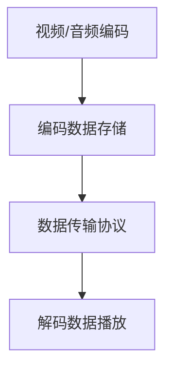

                 

### 文章标题: FFmpeg 在 VR 中的应用：编码和流媒体传输

关键词：FFmpeg、虚拟现实、编码技术、流媒体传输、VR内容制作

摘要：本文深入探讨了FFmpeg在虚拟现实（VR）技术中的应用，从编码和流媒体传输两个方面详细解析了FFmpeg如何助力VR内容的制作和传输。首先，介绍了FFmpeg和VR技术的基本概念，随后，分别从编码原理、优化策略、流媒体传输基础、优化策略和实战案例等多个角度，系统地阐述了FFmpeg在VR领域中的应用方法和优化技巧，旨在为读者提供全面的技术参考和实际操作指南。

### 目录

#### 第一部分: FFmpeg与VR技术概述

##### 第1章: FFmpeg与VR技术基础

- **1.1 FFmpeg基础**
  - FFmpeg简介
  - FFmpeg的组成与架构
  - FFmpeg核心功能

- **1.2 VR技术概述**
  - 虚拟现实技术基础
  - VR设备的分类与特点
  - VR内容制作流程

- **1.3 FFmpeg在VR中的应用前景**
  - FFmpeg在VR中的角色与作用
  - FFmpeg在VR内容制作中的优势
  - FFmpeg在VR直播中的应用

#### 第二部分: FFmpeg编码原理与优化

##### 第2章: FFmpeg编码原理

- **2.1 视频编码技术**
  - 常见视频编码标准
  - 视频编码流程详解
  - 视频编码质量评价

- **2.2 音频编码技术**
  - 常见音频编码标准
  - 音频编码流程详解
  - 音频编码质量评价

- **2.3 FFmpeg编码优化**
  - 编码参数调整
  - 编码效率优化
  - 编码性能优化

##### 第3章: VR内容编码优化策略

- **3.1 VR内容编码特点**
  - 高分辨率与高帧率要求
  - 宽色域与高动态范围要求
  - 空间音频编码需求

- **3.2 VR内容编码优化实践**
  - 编码参数优化案例分析
  - VR内容编码性能评估
  - VR内容编码策略优化

#### 第三部分: FFmpeg流媒体传输

##### 第4章: 流媒体传输基础

- **4.1 流媒体传输概述**
  - 流媒体传输概念
  - 流媒体传输协议
  - 流媒体传输流程

- **4.2 RTP协议**
  - RTP协议简介
  - RTP协议数据格式
  - RTP协议工作原理

- **4.3 RTCP协议**
  - RTCP协议简介
  - RTCP协议数据格式
  - RTCP协议工作原理

##### 第5章: FFmpeg流媒体传输应用

- **5.1 FFmpeg流媒体传输架构**
  - FFmpeg在流媒体传输中的角色
  - FFmpeg流媒体传输流程
  - FFmpeg流媒体传输组件

- **5.2 FFmpeg直播传输应用**
  - FFmpeg直播传输架构
  - FFmpeg直播传输流程
  - FFmpeg直播传输案例分析

- **5.3 FFmpeg点播传输应用**
  - FFmpeg点播传输架构
  - FFmpeg点播传输流程
  - FFmpeg点播传输案例分析

#### 第四部分: VR内容流媒体传输优化

##### 第6章: VR内容流媒体传输优化策略

- **6.1 VR内容流媒体传输挑战**
  - 网络延迟与抖动
  - 网络带宽限制
  - 网络丢包问题

- **6.2 VR内容流媒体传输优化**
  - 传输协议优化
  - 编码优化
  - 网络优化

##### 第7章: VR内容流媒体传输实践

- **7.1 VR内容流媒体传输实战案例**
  - VR直播传输实战
  - VR点播传输实战
  - VR内容传输优化实践

- **7.2 FFmpeg流媒体传输项目实战**
  - VR内容直播传输项目搭建
  - VR内容点播传输项目搭建
  - VR内容传输优化项目实战

#### 附录

##### 附录A: FFmpeg开发工具与资源

- **A.1 FFmpeg开发工具**
  - FFmpeg命令行工具
  - FFmpeg图形界面工具
  - FFmpeg编程接口

- **A.2 VR内容制作与传输资源**
  - VR内容制作平台推荐
  - VR流媒体传输平台推荐
  - VR内容资源库介绍

##### 附录B: FFmpeg流媒体传输流程 Mermaid 流程图

mermaid
graph TD
    A[视频/音频编码] --> B[编码数据存储]
    B --> C[数据传输协议]
    C --> D[解码数据播放]

##### 附录C: FFmpeg编码优化伪代码

python
# FFmpeg编码优化伪代码
function optimize_ffmpeg_encoding(input_video, output_video, bitrate, fps, resolution):
    # 设置输入视频
    set_input_video(input_video)
    
    # 设置输出视频
    set_output_video(output_video)
    
    # 设置比特率
    set_bitrate(bitrate)
    
    # 设置帧率
    set_fps(fps)
    
    # 设置分辨率
    set_resolution(resolution)
    
    # 调整编码参数
    adjust_encoding_params()
    
    # 执行编码操作
    perform_encoding()
    
    # 评估编码性能
    evaluate_encoding_performance()

##### 附录D: VR内容编码质量评价数学模型

$$
Q = \frac{1}{N} \sum_{i=1}^{N} \frac{d^2(x_i, y_i)}{2}
$$

其中，$Q$ 表示编码质量，$N$ 表示图像像素数量，$d(x_i, y_i)$ 表示像素 $x_i$ 与预测像素 $y_i$ 之间的差异。

##### 附录E: VR内容流媒体传输项目实战代码解读

python
# VR内容直播传输项目实战代码解读
def live_streaming_video(input_video, output_stream):
    # 搭建FFmpeg流媒体传输命令
    ffmpeg_command = "ffmpeg -i {input_video} -c:v libx264 -preset veryfast -c:a aac -b:a 128k {output_stream}"

    # 执行FFmpeg流媒体传输命令
    subprocess.run(ffmpeg_command.format(input_video=input_video, output_stream=output_stream), shell=True)

### 第一部分: FFmpeg与VR技术概述

#### 第1章: FFmpeg与VR技术基础

##### 1.1 FFmpeg基础

FFmpeg是一个开源的多媒体处理框架，它可以对音频、视频、图片等多媒体文件进行各种操作，如解码、编码、转换、流媒体传输等。FFmpeg由多个组件组成，包括libavcodec、libavformat、libavutil、libswscale、libavdevice等，它们分别负责不同的功能。例如，libavcodec用于音频和视频编码解码，libavformat用于处理多媒体文件和协议，libavutil提供了一些常用的工具和函数，libswscale用于视频图像的缩放和转换，libavdevice用于处理硬件设备。

FFmpeg的核心功能包括：

- **解码**：支持广泛的音频和视频解码格式，如MP4、AVI、MKV、MP3、AAC等。
- **编码**：支持多种编码格式，如H.264、H.265、HE-AAC等。
- **转换**：可以实现音频和视频文件的格式转换，如将MP4转换为AVI。
- **流媒体传输**：支持RTP/RTCP、RTMP、HTTP等流媒体传输协议，可以用于直播和点播服务。

##### 1.2 VR技术概述

虚拟现实（VR）是一种通过计算机技术创造的虚拟环境，用户可以通过头戴显示器（HMD）等设备进入这个环境，感受到身临其境的体验。VR技术的基础包括：

- **图像处理**：利用计算机图形学技术生成三维虚拟环境，并通过渲染技术将其呈现给用户。
- **传感器技术**：通过跟踪设备（如摄像头、红外传感器等）实时捕捉用户在虚拟环境中的动作，实现人机交互。
- **音频处理**：利用空间音频技术，通过头戴显示器等设备为用户呈现环境音效，增强沉浸感。

VR设备的分类与特点：

- **头戴显示器（HMD）**：常见的VR设备之一，如Oculus Rift、HTC Vive等，通过高分辨率屏幕和传感器跟踪技术提供沉浸式体验。
- **VR一体机**：内置计算和显示单元，无需连接外部设备，如Google Daydream View、Pico Neo等。
- **VR眼镜**：轻便型VR设备，如Google Cardboard等，通过手机屏幕作为显示设备。

VR内容制作流程：

1. **场景设计**：根据VR应用的需求，设计虚拟环境、角色、交互元素等。
2. **内容制作**：使用三维建模软件（如Blender、3ds Max等）创建虚拟场景和角色，并进行动画制作。
3. **图像渲染**：通过渲染引擎（如Unity、Unreal Engine等）生成高质量的三维图像。
4. **声音设计**：利用音频编辑软件（如Audacity、Adobe Audition等）制作环境音效和空间音频。
5. **内容整合**：将图像、音频、交互元素整合到一个完整的VR应用中。
6. **测试与优化**：在VR设备上测试内容，优化图像质量、音频效果和交互体验。

##### 1.3 FFmpeg在VR中的应用前景

FFmpeg在VR中的应用非常广泛，具体体现在以下几个方面：

- **VR内容制作**：FFmpeg可以用于VR内容的视频和音频编码，优化内容的存储和传输效率，确保高质量的用户体验。
- **VR直播**：FFmpeg支持实时视频和音频编码，可以用于VR直播的编码和流媒体传输，确保流畅的直播体验。
- **VR点播**：FFmpeg可以用于VR点播内容的解码和播放，支持多种视频和音频格式，满足不同用户的需求。

FFmpeg在VR内容制作中的优势：

- **高性能**：FFmpeg是一个开源项目，拥有广泛的社区支持，可以快速解决技术问题，提升开发效率。
- **多功能**：FFmpeg支持多种视频和音频编码格式，可以根据不同的应用需求进行灵活调整。
- **跨平台**：FFmpeg可以在多种操作系统上运行，如Windows、Linux、macOS等，方便开发者在不同平台上进行开发和部署。

FFmpeg在VR直播中的应用：

- **实时编码**：FFmpeg支持实时视频编码，可以将现场拍摄的视频实时编码成流媒体格式，如HLS、DASH等。
- **流媒体传输**：FFmpeg支持多种流媒体传输协议，如RTP、RTMP、HTTP等，可以确保直播内容的流畅传输。
- **互动功能**：FFmpeg可以与VR直播平台结合，提供实时互动功能，如观众评论、虚拟礼物等，提升用户体验。

通过以上内容，读者可以初步了解FFmpeg和VR技术的基本概念和概述，为后续章节的深入探讨打下基础。

### 第二部分: FFmpeg编码原理与优化

#### 第2章: FFmpeg编码原理

##### 2.1 视频编码技术

视频编码技术是多媒体技术中的重要组成部分，它通过一系列算法将原始的视频信号转换成数字信号，以便于存储、传输和播放。FFmpeg作为一款强大的多媒体处理工具，支持多种视频编码标准，包括H.264、H.265、VP8、VP9等。这些编码标准各自具有不同的特点，适用于不同的应用场景。

**常见视频编码标准**

- **H.264**：也称为AVC（Advanced Video Coding），是目前最流行的视频编码标准。它具有高压缩效率、低延迟和良好的画质表现，被广泛应用于在线视频、DVD和蓝光光盘等。
- **H.265**：也称为HEVC（High Efficiency Video Coding），是H.264的继任者。H.265具有更高的压缩效率，可以提供更高的画质和更低的带宽消耗，适用于超高清（UHD）和4K视频。
- **VP8**：由Google开发的一种开源视频编码标准，用于YouTube等在线视频平台。VP8具有较好的压缩效率和低延迟特性。
- **VP9**：是VP8的升级版，同样由Google开发。VP9提供了更高的压缩效率和更好的画质，支持更高分辨率和帧率的视频内容。

**视频编码流程**

视频编码流程主要包括以下几个步骤：

1. **采样和量化**：将模拟信号转换为数字信号，包括采样和量化两个过程。采样是指以固定时间间隔获取信号样本，量化是指将采样值转换为整数。
2. **压缩编码**：将数字信号进行压缩，以减少数据量。常见的压缩方法包括帧间压缩（如运动估计和运动补偿）和帧内压缩（如变换编码和量化）。
3. **熵编码**：对压缩后的数据进行进一步压缩，通过熵编码技术（如霍夫曼编码或算术编码）减少冗余信息。
4. **码流封装**：将编码后的视频数据封装成特定的文件格式或流媒体格式，如MP4、TS、HLS等。

**视频编码质量评价**

视频编码质量评价是衡量编码算法性能的重要指标，常用的评价方法包括客观评价和主观评价。

- **客观评价**：通过计算编码视频与原始视频之间的误差，如峰值信噪比（PSNR）和均方误差（MSE）等指标。这些指标可以量化评估编码质量。
- **主观评价**：由人类观察者对编码视频的画质进行主观评价，如视频质量测试（VQM）和主观评价测试（SPT）等。这种方法更贴近实际应用中的用户体验。

##### 2.2 音频编码技术

音频编码技术用于将原始音频信号转换为数字信号，以便于存储、传输和播放。音频编码标准主要包括MP3、AAC、FLAC、OGG等，每种编码标准都有其特定的应用场景。

**常见音频编码标准**

- **MP3**：是经典的音频编码标准，由Fraunhofer IIS开发。MP3具有较低的比特率和良好的音质表现，广泛应用于音乐播放和互联网音频。
- **AAC**：也称为Advanced Audio Coding，是MP3的升级版。AAC提供了更高的压缩效率和更好的音质，被广泛应用于数字音频广播和在线音乐平台。
- **FLAC**：是一种无损音频编码格式，由Xiph.Org Foundation开发。FLAC保留了原始音频的所有数据，音质接近CD级别，但文件体积较大。
- **OGG**：是一种开放源代码的音频编码格式，由Xiph.Org Foundation开发。OGG包括Vorbis音频编码，提供了较高的压缩效率和良好的音质。

**音频编码流程**

音频编码流程主要包括以下几个步骤：

1. **采样和量化**：与视频编码类似，音频编码也需要将模拟信号转换为数字信号，包括采样和量化两个过程。
2. **压缩编码**：对数字信号进行压缩，以减少数据量。音频压缩通常采用子带编码技术，将音频信号分解成多个子带，并对每个子带进行独立压缩。
3. **熵编码**：对压缩后的数据进行进一步压缩，通过熵编码技术（如霍夫曼编码或算术编码）减少冗余信息。
4. **码流封装**：将编码后的音频数据封装成特定的文件格式或流媒体格式，如MP3、AAC、FLAC、OGG等。

**音频编码质量评价**

与视频编码类似，音频编码质量评价也分为客观评价和主观评价。

- **客观评价**：通过计算编码音频与原始音频之间的误差，如信噪比（SNR）和信噪比损失（SINAD）等指标。这些指标可以量化评估编码质量。
- **主观评价**：由人类观察者对编码音频的音质进行主观评价，如音质测试（PQT）和主观评价测试（SOT）等。这种方法更贴近实际应用中的用户体验。

##### 2.3 FFmpeg编码优化

FFmpeg编码优化是指通过调整编码参数和优化编码流程，提高视频和音频编码的质量和效率。优化策略包括以下几个方面：

**编码参数调整**

- **比特率**：比特率是视频和音频数据传输速率的度量，通过调整比特率可以控制视频和音频的质量。较高的比特率通常意味着更好的画质和音质，但也会导致更大的数据量。
- **帧率**：帧率是视频播放的频率，通过调整帧率可以控制视频的流畅度。较高的帧率可以提供更平滑的视频播放效果，但也会增加计算和带宽资源消耗。
- **分辨率**：分辨率是视频图像的宽度与高度的度量，通过调整分辨率可以控制视频的清晰度。较高的分辨率通常意味着更好的画质，但也会导致更大的数据量。
- **编码器**：FFmpeg支持多种视频和音频编码器，如H.264、H.265、MP3、AAC等。选择合适的编码器可以根据具体应用需求实现最佳的编码质量。

**编码效率优化**

- **并行处理**：通过利用多核心CPU和GPU计算能力，实现并行编码，提高编码效率。
- **帧内预测**：利用帧内预测技术，减少冗余信息，提高编码效率。
- **帧间预测**：通过帧间预测技术，减少运动信息的冗余，提高编码效率。

**编码性能优化**

- **缓存策略**：优化缓存策略，减少磁盘I/O操作，提高编码性能。
- **内存管理**：合理管理内存资源，避免内存泄漏和性能瓶颈。
- **算法优化**：对编码算法进行优化，减少计算复杂度和资源消耗。

通过上述优化策略，可以显著提高FFmpeg编码的质量和效率，为VR内容制作和传输提供更好的支持。

### 第3章: VR内容编码优化策略

#### 3.1 VR内容编码特点

虚拟现实（VR）内容编码具有一系列独特的要求，这些要求源于VR技术的特殊需求和用户体验的极致追求。以下是VR内容编码的几个关键特点：

**高分辨率与高帧率要求**

VR内容通常需要高分辨率，以提供清晰细腻的图像质量。现代VR头戴显示器（HMD）的分辨率可以达到2K、4K甚至8K级别。此外，高帧率同样重要，以减少运动模糊和视觉卡顿，提升用户的沉浸感和流畅体验。通常，VR应用建议的帧率至少为90fps，有些应用甚至要求120fps或更高。

**宽色域与高动态范围要求**

宽色域和高动态范围（HDR）是VR内容制作的另一个关键特点。宽色域允许更多的颜色信息，使得图像更加生动和真实。HDR技术则可以展现更广泛的光照范围，从暗部细节到亮部高光，提供更丰富的视觉体验。这些特性对于打造逼真的VR环境至关重要。

**空间音频编码需求**

在VR环境中，空间音频编码同样重要，它可以通过头戴显示器的内置扬声器或耳机为用户提供环绕声效果。空间音频编码技术如 Ambisonics、B-Format 和 Wavefront Audio 可以模拟三维声场，增强用户的沉浸感。

#### 3.2 VR内容编码优化实践

为了满足VR内容的编码需求，需要采取一系列优化策略，以确保高质量和高效传输。以下是一些具体的编码优化实践：

**编码参数优化案例分析**

以下是一个针对VR内容编码参数优化的案例分析：

- **比特率调整**：由于VR内容通常具有高分辨率和高帧率，因此需要较高的比特率来确保画质。一个常用的比特率设置可能是：

  ```  
  -vb 20000k -vb_strategy -refs 4  
  ```

  这将设置视频比特率为20 Mbps，并启用比特率策略，以避免在码率波动时造成画面质量下降。

- **帧率设置**：为了获得流畅的视觉体验，VR内容的帧率通常设置为90fps或更高：

  ```  
  -r 90  
  ```

- **分辨率设置**：针对不同的VR设备，选择合适的分辨率。例如，对于4K VR内容，可以使用以下设置：

  ```  
  -s 3840x2160  
  ```

**VR内容编码性能评估**

为了评估VR内容编码性能，可以采用多种指标：

- **编码效率**：通过计算编码前后数据量的变化，评估编码效率。较低的比特率下保持较高的画质表明编码效率较高。

- **画质评价**：使用客观评价方法如PSNR和SSIM，以及主观评价方法如VQM和SPT，评估编码视频的质量。

- **延迟分析**：延迟是VR应用中的一个关键因素，可以使用时间戳分析来评估编码过程中的延迟。

**VR内容编码策略优化**

为了优化VR内容编码策略，可以采取以下措施：

- **动态编码**：根据内容动态特性调整编码参数，如使用动态比特率控制和动态帧率调整。

- **多层次编码**：将内容分成多个层次，如基础层和增强层，分别编码和传输，以满足不同带宽和设备的需求。

- **内容自适应**：根据用户设备、网络条件等环境参数，自适应调整编码参数，以提供最佳的用户体验。

通过上述编码优化实践和策略，可以显著提升VR内容的质量和传输效率，为用户提供更优质的VR体验。

### 第三部分: FFmpeg流媒体传输

#### 第4章: 流媒体传输基础

##### 4.1 流媒体传输概述

流媒体传输是指通过互联网将多媒体内容实时传输到用户设备的一种技术，它将数据流分解为多个小数据包，并使用特定的传输协议进行传输，以实现实时播放。流媒体传输与传统的文件下载不同，它不需要等待整个文件下载完成后才能播放，而是可以在数据传输过程中开始播放。

**流媒体传输概念**

流媒体传输包括以下几个关键概念：

- **流**：指连续的多媒体数据流，可以是音频、视频或两者的组合。
- **编码**：指将原始音频和视频数据转换为特定的编码格式，如H.264、MP3等。
- **解码**：指将传输到的流媒体数据还原为原始的音频和视频格式，以便播放。
- **缓冲**：指在客户端设备上临时存储一部分流数据，以防止播放过程中因网络延迟或丢包导致的中断。

**流媒体传输协议**

流媒体传输依赖于特定的协议，这些协议定义了数据包的格式、传输方式以及错误处理机制。以下是一些常见的流媒体传输协议：

- **HTTP动态流（DASH）**：DASH是一种基于HTTP的流媒体传输协议，它支持自适应流传输，可以根据用户的网络带宽和设备能力动态调整流媒体质量。DASH通过多个比特率版本的多媒体文件，结合HTTP协议的请求和响应机制，实现流媒体内容的传输。
  
- **实时流传输协议（RTMP）**：RTMP是一种常用于直播和点播服务的流媒体传输协议，它由Adobe开发，支持实时、可靠的数据传输。RTMP适用于带宽要求较高的场景，如视频直播和在线游戏流。

- **实时传输协议（RTP）**：RTP是一种用于实时传输音频和视频数据的网络协议，它定义了数据包的格式和传输机制。RTP通常与RTCP（实时传输控制协议）结合使用，以监控传输质量和进行错误纠正。

- **实时传输控制协议（RTCP）**：RTCP是一种辅助RTP的协议，用于监控和控制流媒体传输质量。RTCP通过发送控制信息，如传输延迟、抖动、丢包率等，帮助发送端和接收端调整传输参数，确保流媒体传输的稳定性。

**流媒体传输流程**

流媒体传输流程通常包括以下几个步骤：

1. **数据编码**：将原始的音频和视频数据编码为流媒体格式，如H.264视频和AAC音频。

2. **数据分割**：将编码后的数据分割成多个数据包，每个数据包包含一部分视频帧或音频帧。

3. **数据传输**：通过网络将数据包传输到接收端。数据包可以通过TCP或UDP协议传输，其中TCP提供可靠传输，而UDP提供高效传输。

4. **数据解码**：接收端接收到数据包后，将其解码为原始音频和视频数据，并按顺序播放。

5. **缓冲管理**：在接收端维护缓冲区，存储一部分尚未播放的数据包，以应对网络延迟和丢包。

##### 4.2 RTP协议

RTP（实时传输协议）是一种用于实时传输音频和视频数据的网络协议。它定义了数据包的格式和传输机制，使得音频和视频数据可以在互联网上进行有效传输。RTP通常与RTCP（实时传输控制协议）结合使用，以监控传输质量和进行错误纠正。

**RTP协议简介**

RTP的基本数据包格式如下：

- **头部**：RTP数据包的头部包含固定长度的信息，如同步源（SSRC）标识、序列号、时间戳等。
- **载荷**：载荷部分包含实际传输的音频或视频数据。

**RTP协议数据格式**

RTP数据包的格式如下图所示：

```  
+------------+---------------+ 
|   Header   |       Payload |
+------------+---------------+
```

- **头部**：头部部分包含以下字段：

  - **同步源（SSRC）标识**：唯一的32位标识符，用于区分不同的数据流。
  - **序列号**：32位无符号整数，用于标识数据包的顺序。
  - **时间戳**：32位无符号整数，表示数据包中的第一个样本的时间戳。
  - **负载类型**：8位字段，指示载荷的类型，如音频、视频或文本。
  - **贡献者时间戳**：可选的32位字段，用于提供额外的时间戳信息。
  - **同步扩展**：可选的16位字段，用于扩展同步源标识。

- **载荷**：载荷部分包含实际的音频或视频数据，其格式取决于负载类型。

**RTP协议工作原理**

RTP协议的工作原理可以概括为以下几个步骤：

1. **数据编码**：音频和视频数据被编码为RTP数据包。

2. **数据传输**：RTP数据包通过网络传输到接收端。通常，RTP数据包使用UDP协议传输，以实现高效传输。

3. **数据接收**：接收端接收到RTP数据包后，根据序列号和时间戳对数据包进行排序和缓冲。

4. **数据解码**：接收端对RTP数据包进行解码，将数据还原为原始的音频或视频格式。

5. **播放**：解码后的音频或视频数据被播放，以实现实时传输。

通过RTP协议，可以实现高效、可靠的音频和视频数据传输，为流媒体传输提供坚实的基础。

##### 4.3 RTCP协议

RTCP（实时传输控制协议）是RTP（实时传输协议）的辅助协议，它用于监控和控制流媒体传输的质量。RTCP通过发送控制信息，如传输延迟、抖动、丢包率等，帮助发送端和接收端调整传输参数，确保流媒体传输的稳定性。

**RTCP协议简介**

RTCP的基本数据包格式如下：

- **报告块**：报告块是RTCP数据包的核心部分，包含多种控制信息，如传输延迟、抖动、丢包率等。
- **报告**：报告部分包含发送端和接收端的统计信息。

**RTCP协议数据格式**

RTCP数据包的格式如下图所示：

```  
+---------------------+-----------+
|    Report Block      |   Report  |
+---------------------+-----------+
```

- **报告块**：报告块包含以下字段：

  - **SSRC**：发送端同步源标识。
  - **NTP时间戳**：发送端当前的时间戳。
  - **ROC**：接收者唯一码。
  - **RR**：接收报告字段，包含接收端的时间戳、序列号和接收者报告计数器。

- **报告**：报告部分包含以下字段：

  - **SSRC**：发送端同步源标识。
  - **RTP时间戳**：发送端当前的时间戳。
  - **发送者时间戳**：发送端的时间戳。
  - **接收者时间戳**：接收端的时间戳。

**RTCP协议工作原理**

RTCP协议的工作原理可以概括为以下几个步骤：

1. **发送端监控**：发送端定期发送RTCP数据包，包含当前的网络传输质量信息。

2. **接收端接收**：接收端接收RTCP数据包，并更新传输质量信息。

3. **质量评估**：接收端根据RTCP数据包中的信息，评估当前传输质量，如延迟、抖动、丢包率等。

4. **反馈调整**：发送端根据接收端发送的RTCP数据包中的信息，调整传输参数，如比特率、帧率等，以优化传输质量。

通过RTCP协议，可以实现实时传输质量的监控和调整，为流媒体传输提供可靠的支持。

### 第5章: FFmpeg流媒体传输应用

##### 5.1 FFmpeg流媒体传输架构

FFmpeg作为一款强大的多媒体处理工具，不仅在编码和转换方面表现出色，而且在流媒体传输中同样具备强大的功能。FFmpeg的流媒体传输架构主要包括以下几个关键组件：

**FFmpeg在流媒体传输中的角色**

- **编码器**：FFmpeg可以将本地视频和音频文件编码成流媒体格式，如HLS、DASH、RTMP等，用于直播和点播服务。
- **解码器**：FFmpeg可以将接收到的流媒体数据解码成原始视频和音频格式，以便播放和后续处理。
- **传输协议支持**：FFmpeg支持多种流媒体传输协议，如RTP、RTMP、HTTP、HLS等，可以灵活配置以满足不同应用需求。

**FFmpeg流媒体传输流程**

FFmpeg流媒体传输的基本流程如下：

1. **数据编码**：使用FFmpeg编码器将本地视频和音频文件编码成流媒体格式。这一步骤通常涉及设置编码参数，如比特率、帧率、分辨率等。

2. **数据存储**：编码后的数据可以存储在本地文件系统中，或者直接通过网络传输。

3. **数据传输**：使用流媒体传输协议，如RTP、RTMP、HTTP等，将编码后的数据传输到目标服务器或客户端。

4. **数据接收**：接收端使用FFmpeg解码器将接收到的流媒体数据解码成原始视频和音频格式，以便播放和后续处理。

5. **播放**：解码后的音频和视频数据被播放，以实现流媒体传输。

**FFmpeg流媒体传输组件**

FFmpeg的流媒体传输组件包括以下几个方面：

- **libavformat**：用于处理多媒体文件和流媒体协议，包括编码格式转换和文件解析。
- **libavcodec**：用于音频和视频编码解码，支持多种编码标准和格式。
- **libavutil**：提供了一些通用的工具和函数，如数据缓冲、时间戳处理等。
- **libswscale**：用于视频图像的缩放和转换，以适应不同分辨率和格式的要求。
- **libavdevice**：用于处理硬件设备，如摄像头、麦克风等。

通过上述组件的协同工作，FFmpeg可以实现高效的流媒体传输，为各种应用场景提供可靠的技术支持。

##### 5.2 FFmpeg直播传输应用

FFmpeg在直播传输中的应用非常广泛，它能够实现从视频采集、编码、传输到解码和播放的完整流程。以下是FFmpeg直播传输的基本架构和流程：

**FFmpeg直播传输架构**

- **视频采集**：通过摄像头或其他视频输入设备捕捉实时视频信号。
- **音频采集**：通过麦克风或其他音频输入设备捕捉实时音频信号。
- **编码**：使用FFmpeg编码器将视频和音频信号编码成流媒体格式，如HLS、RTMP、RTP等。
- **传输**：通过流媒体传输协议将编码后的数据传输到服务器或客户端。
- **解码和播放**：接收端使用FFmpeg解码器将接收到的流媒体数据解码成原始视频和音频格式，以便播放。

**FFmpeg直播传输流程**

1. **视频和音频采集**：通过摄像头和麦克风捕捉实时视频和音频信号。
2. **数据编码**：使用FFmpeg编码器将采集到的视频和音频信号编码成流媒体格式。编码过程中可以设置参数，如比特率、帧率、分辨率等，以确保最佳的画质和音质。
3. **数据存储**：将编码后的数据存储到本地文件系统或直接通过网络传输。
4. **数据传输**：使用流媒体传输协议，如RTP、RTMP、HTTP等，将编码后的数据传输到服务器或客户端。传输过程中可以设置参数，如传输速度、传输方式等，以确保数据传输的稳定性和可靠性。
5. **数据接收和播放**：接收端使用FFmpeg解码器将接收到的流媒体数据解码成原始视频和音频格式，并通过播放器播放。

**FFmpeg直播传输案例分析**

以下是一个简单的FFmpeg直播传输案例分析：

- **环境准备**：确保安装了FFmpeg，并准备好视频和音频采集设备。
- **视频编码**：使用以下命令将视频编码成HLS格式：

  ```  
  ffmpeg -i input_video.mp4 -c:v libx264 -preset veryfast -c:a aac -b:a 128k output.m3u8  
  ```

  这个命令将输入视频文件input_video.mp4编码成HLS格式，并输出到output.m3u8文件。

- **音频编码**：使用以下命令将音频编码成AAC格式：

  ```  
  ffmpeg -i input_audio.wav -c:a aac -b:a 128k output.aac  
  ```

  这个命令将输入音频文件input_audio.wav编码成AAC格式，并输出到output.aac文件。

- **数据传输**：将编码后的视频和音频文件上传到服务器或通过FTP等方式传输到直播平台。

- **接收和播放**：观众可以通过播放器（如VLC）接收并播放直播内容。

通过以上步骤，可以简单地使用FFmpeg实现直播传输。当然，实际应用中可能涉及更复杂的配置和优化，以满足不同场景的需求。

##### 5.3 FFmpeg点播传输应用

FFmpeg在点播传输中的应用同样非常广泛，它能够实现从视频和音频文件的编码、存储、传输到解码和播放的完整流程。以下是FFmpeg点播传输的基本架构和流程：

**FFmpeg点播传输架构**

- **文件存储**：点播内容存储在文件系统中，可以是本地存储或远程存储。
- **编码**：使用FFmpeg编码器将存储的视频和音频文件编码成流媒体格式，如HLS、DASH等。
- **数据存储**：将编码后的数据存储到流媒体服务器或CDN（内容分发网络）中。
- **数据传输**：通过HTTP、HTTPS等协议将编码后的数据传输到用户设备。
- **解码和播放**：用户设备使用FFmpeg解码器将接收到的流媒体数据解码成原始视频和音频格式，并通过播放器播放。

**FFmpeg点播传输流程**

1. **文件存储**：将点播内容存储到文件系统中，可以是本地存储或远程存储。

2. **数据编码**：使用FFmpeg编码器将存储的视频和音频文件编码成流媒体格式。编码过程中可以设置参数，如比特率、帧率、分辨率等，以确保最佳的画质和音质。

3. **数据存储**：将编码后的数据存储到流媒体服务器或CDN中，以便用户随时访问。

4. **数据传输**：用户通过HTTP、HTTPS等协议请求流媒体数据，并从流媒体服务器或CDN中获取数据。

5. **解码和播放**：用户设备使用FFmpeg解码器将接收到的流媒体数据解码成原始视频和音频格式，并通过播放器播放。

**FFmpeg点播传输案例分析**

以下是一个简单的FFmpeg点播传输案例分析：

- **环境准备**：确保安装了FFmpeg，并准备好需要传输的视频和音频文件。
- **数据编码**：使用以下命令将视频和音频文件编码成HLS格式：

  ```  
  ffmpeg -i input_video.mp4 -c:v libx264 -preset veryfast -c:a aac -b:a 128k output.m3u8  
  ```

  这个命令将输入视频文件input_video.mp4编码成HLS格式，并输出到output.m3u8文件。

- **数据存储**：将编码后的文件上传到服务器或通过FTP等方式传输到云存储服务。

- **数据传输**：用户通过浏览器或播放器访问流媒体服务器或CDN，获取并播放点播内容。

通过以上步骤，可以简单地使用FFmpeg实现点播传输。实际应用中，可以根据需求进行更复杂的配置和优化，以满足不同场景的需求。

### 第四部分: VR内容流媒体传输优化

#### 第6章: VR内容流媒体传输优化策略

##### 6.1 VR内容流媒体传输挑战

虚拟现实（VR）内容流媒体传输面临着一系列特殊的挑战，这些挑战源于VR技术对图像质量、传输速度和交互性的高要求。以下是VR内容流媒体传输中的几个主要挑战：

**网络延迟与抖动**

网络延迟是指数据包从发送端到接收端所需的时间，对于VR内容传输而言，较低的延迟是至关重要的。由于VR应用通常需要实时交互，延迟过高会导致用户感受到卡顿和延迟，从而破坏沉浸体验。抖动是指数据包到达时间的随机变化，它会影响视频播放的流畅性，导致画面跳跃。

**网络带宽限制**

VR内容通常需要高带宽支持，以提供高质量的图像和音频体验。然而，网络带宽的限制是一个普遍存在的问题，特别是在用户较多或网络条件较差的环境中。带宽不足会导致视频播放质量下降，画面模糊或音频中断。

**网络丢包问题**

网络丢包是指数据包在传输过程中丢失，这可能是由于网络拥塞、设备故障或信号干扰等原因造成的。对于VR内容传输，丢包会导致画面中断或视频播放错误，严重影响用户体验。

##### 6.2 VR内容流媒体传输优化

为了应对VR内容流媒体传输中的挑战，可以采取一系列优化策略，以提升传输质量和用户体验。以下是几个关键的优化策略：

**传输协议优化**

选择合适的传输协议是优化VR内容流媒体传输的重要步骤。以下是几种常用的传输协议及其优化策略：

- **RTP/RTCP**：RTP（实时传输协议）是VR内容传输的基础协议，它提供了实时传输音频和视频数据的功能。RTCP（实时传输控制协议）作为RTP的辅助协议，用于监控和控制传输质量。优化策略包括：
  - **NACK/GoBackN**：在传输过程中，接收端可以根据RTCP反馈信息请求发送端重传丢失的数据包，以减少丢包带来的影响。
  - **SLIC**：同步学习和交叉识别（SLIC）是一种基于数据包到达时间和序列号的优化技术，可以减少网络延迟和抖动。

- **HLS/DASH**：HLS（HTTP动态流）和DASH（动态自适应流）都是基于HTTP的流媒体传输协议，它们支持自适应流传输，可以根据用户网络带宽和设备能力动态调整传输质量。优化策略包括：
  - **比特率自适应**：根据用户网络带宽和设备性能动态调整视频比特率，以避免带宽不足导致的质量下降。
  - **缓冲区管理**：优化缓冲区管理，确保在数据包丢失或延迟时，用户可以尽快切换到下一个比特率版本，以保持流畅播放。

**编码优化**

编码优化是提升VR内容流媒体传输质量的重要手段。以下是几个关键的编码优化策略：

- **比特率调整**：根据VR内容的分辨率、帧率和画质要求，合理调整视频和音频比特率，以在带宽和质量之间找到最佳平衡点。
- **帧率优化**：对于实时交互性要求较高的VR应用，可以采用高帧率编码，如90fps或120fps，以减少运动模糊和延迟感。但高帧率也会增加带宽消耗，因此需要根据实际应用场景进行优化。
- **分辨率优化**：选择适当的分辨率，平衡画质和带宽需求。对于大多数VR应用，4K或更高分辨率可以提供良好的视觉效果，但在带宽有限的情况下，可以适当降低分辨率。

**网络优化**

网络优化是提高VR内容流媒体传输稳定性和可靠性的重要手段。以下是几个关键的优化策略：

- **QoS（服务质量）**：在路由器和交换机等网络设备上配置QoS，为VR内容传输分配优先级和带宽资源，以确保关键数据的优先传输。
- **CDN（内容分发网络）**：使用CDN将VR内容分发到全球各地的服务器，以减少传输距离，提高传输速度和稳定性。
- **网络监控**：实时监控网络性能，如延迟、抖动和丢包率，并根据监控数据调整网络配置，以优化传输质量。

通过上述传输协议优化、编码优化和网络优化策略，可以显著提升VR内容流媒体传输的质量和稳定性，为用户提供优质的VR体验。

### 第7章: VR内容流媒体传输实践

##### 7.1 VR内容流媒体传输实战案例

在本节中，我们将通过几个实际案例，详细描述如何使用FFmpeg实现VR内容的流媒体传输，并探讨在实际操作中可能遇到的问题及其解决方案。

**VR直播传输实战**

**案例描述**：

假设我们需要通过FFmpeg实现一场虚拟现实音乐会直播，直播内容包含高分辨率视频和立体声音频。直播平台使用RTP/RTCP协议进行传输。

**实现步骤**：

1. **准备工作**：确保已安装FFmpeg，并配置好视频和音频采集设备。

2. **视频编码**：使用以下命令进行视频编码：

   ```bash
   ffmpeg -f v4l2 -i /dev/video0 -c:v libx264 -preset veryfast -r 90 -pix_fmt yuv420p -preset slow -c:a aac -b:a 384k -f rtp rtp://127.0.0.1:1234/vr_video
   ```

   这个命令使用视频采集设备（/dev/video0）作为输入，编码后的视频以RTP协议传输到本地地址127.0.0.1的端口1234。

3. **音频编码**：使用以下命令进行音频编码：

   ```bash
   ffmpeg -f alsa -i default -c:a pcm_s16le -ar 48000 -ac 2 -f rtp rtp://127.0.0.1:1235/vr_audio
   ```

   这个命令使用默认音频输入设备进行立体声音频采集，并以RTP协议传输到本地地址127.0.0.1的端口1235。

4. **传输监控**：使用FFmpeg监控传输质量，确保数据正常传输。

   ```bash
   ffmpeg -f rtp -i rtp://127.0.0.1:1234/vr_video -c:v copy -f rtp rtp://127.0.0.1:1236/vr_video
   ffmpeg -f rtp -i rtp://127.0.0.1:1235/vr_audio -c:a copy -f rtp rtp://127.0.0.1:1237/vr_audio
   ```

**可能遇到的问题及解决方案**：

- **网络延迟和抖动**：优化网络配置，确保低延迟和高稳定性。使用NACK/GoBackN机制进行数据包重传。
- **音频同步问题**：使用FFmpeg内置的时间戳同步功能，确保音频和视频同步。

**VR点播传输实战**

**案例描述**：

假设我们需要通过FFmpeg实现一个VR视频点播服务，视频存储在远程服务器上，用户可以通过HTTP请求获取并播放视频。

**实现步骤**：

1. **视频编码**：使用以下命令将视频编码成HLS格式：

   ```bash
   ffmpeg -i input_video.mp4 -c:v libx264 -preset veryfast -r 90 -pix_fmt yuv420p -preset slow -c:a aac -b:a 384k -f dash output.dash
   ```

   这个命令将输入视频文件input_video.mp4编码成HLS格式，并输出到output.dash文件。

2. **上传到服务器**：将生成的output.dash文件上传到服务器，并配置HTTP服务器（如Nginx）支持HLS流媒体传输。

3. **用户播放**：用户通过浏览器或播放器请求并播放HLS流。

**可能遇到的问题及解决方案**：

- **带宽限制**：根据用户网络带宽动态调整视频比特率和分辨率。
- **缓存问题**：配置合适的缓存策略，减少加载时间。

**VR内容传输优化实践**

**案例描述**：

假设我们需要优化一个VR直播传输项目，提高传输质量和稳定性。

**实现步骤**：

1. **网络监控**：使用网络监控工具（如Wireshark）实时监控网络性能，如延迟、抖动和丢包率。

2. **QoS配置**：在路由器和交换机上配置QoS，为VR内容传输分配高优先级和带宽资源。

3. **编码优化**：根据实时监控数据，动态调整视频和音频比特率，以减少带宽消耗。

4. **CDN部署**：使用CDN将VR内容分发到全球各地的服务器，提高传输速度和稳定性。

**可能遇到的问题及解决方案**：

- **延迟和抖动**：使用NACK/GoBackN机制进行数据包重传，优化网络配置。
- **带宽限制**：使用比特率自适应技术，动态调整视频比特率和分辨率。

通过上述实战案例，读者可以了解如何使用FFmpeg实现VR内容的流媒体传输，并掌握在实际操作中优化传输质量的方法和技巧。

### 第7章: FFmpeg流媒体传输项目实战

在本章节中，我们将详细介绍如何通过FFmpeg实现VR内容的流媒体传输项目，包括开发环境搭建、源代码实现和代码解读。通过这些实战案例，读者可以更深入地理解FFmpeg在VR内容传输中的应用。

#### VR内容直播传输项目搭建

**案例描述**：

我们将使用FFmpeg搭建一个VR直播传输项目，该项目包括视频和音频的实时编码、传输和播放。直播内容将使用RTP协议传输。

**实现步骤**：

1. **准备开发环境**：

   - 安装FFmpeg：确保系统已安装FFmpeg，可以从[FFmpeg官网](https://www.ffmpeg.org/download.html)下载并安装。

   - 安装视频和音频采集设备：确保已连接并配置好视频采集设备和音频采集设备。

2. **视频和音频采集**：

   - 使用以下命令启动视频采集：

     ```bash
     ffmpeg -f v4l2 -i /dev/video0 -c:v libx264 -preset veryfast -r 90 -pix_fmt yuv420p -preset slow -c:a aac -b:a 384k -f rtp rtp://127.0.0.1:1234/vr_video
     ```

     这个命令将视频采集设备（/dev/video0）的信号编码为H.264格式，并以RTP协议传输到本地地址127.0.0.1的端口1234。

   - 使用以下命令启动音频采集：

     ```bash
     ffmpeg -f alsa -i default -c:a pcm_s16le -ar 48000 -ac 2 -f rtp rtp://127.0.0.1:1235/vr_audio
     ```

     这个命令将音频采集设备（默认设备）的信号编码为AAC格式，并以RTP协议传输到本地地址127.0.0.1的端口1235。

3. **传输和接收**：

   - 在另一台计算机上，使用FFmpeg接收并播放传输的流：

     ```bash
     ffmpeg -f rtp -i rtp://127.0.0.1:1234/vr_video -c:v copy -f rtp rtp://127.0.0.1:1236/vr_video
     ffmpeg -f rtp -i rtp://127.0.0.1:1235/vr_audio -c:a copy -f rtp rtp://127.0.0.1:1237/vr_audio
     ```

     这个命令将接收并播放传输的视频和音频流。

**代码解读与分析**：

上述命令通过FFmpeg实现了视频和音频的实时采集、编码和传输。以下是对关键命令的解读：

- `ffmpeg -f v4l2 -i /dev/video0`：指定视频采集设备为`/dev/video0`。
- `-c:v libx264`：指定视频编码格式为H.264。
- `-preset veryfast`：设置编码预设为非常快，以优化编码速度。
- `-r 90`：设置帧率为90fps。
- `-pix_fmt yuv420p`：指定像素格式为YUV420P，这是VR内容常用的像素格式。
- `-c:a aac`：指定音频编码格式为AAC。
- `-b:a 384k`：设置音频比特率为384kbps。
- `-f rtp`：指定输出格式为RTP。

通过以上步骤，我们可以实现VR内容的直播传输。在实际应用中，还需要考虑网络延迟、抖动和丢包问题，通过优化传输协议和编码参数来提高传输质量。

#### VR内容点播传输项目搭建

**案例描述**：

我们将使用FFmpeg搭建一个VR视频点播传输项目，视频内容存储在远程服务器上，用户可以通过HTTP请求播放视频。

**实现步骤**：

1. **视频编码**：

   - 使用以下命令将视频编码成HLS格式：

     ```bash
     ffmpeg -i input_video.mp4 -c:v libx264 -preset veryfast -r 90 -pix_fmt yuv420p -preset slow -c:a aac -b:a 384k -f dash output.dash
     ```

     这个命令将输入视频文件input_video.mp4编码成HLS格式，并输出到output.dash文件。

2. **上传到服务器**：

   - 将生成的output.dash文件上传到远程服务器。

3. **配置HTTP服务器**：

   - 使用HTTP服务器（如Nginx）配置HLS流媒体传输。

     ```bash
     server {
         listen 80;
         server_name example.com;

         location / {
             root /var/www/html;
             index index.html index.htm;
             types {
                 application/dash+xml;
             }
             proxy_pass http://127.0.0.1:8000;
         }
     }
     ```

4. **用户播放**：

   - 用户通过浏览器访问服务器上的HLS流，播放视频。

**代码解读与分析**：

上述命令通过FFmpeg实现了视频的编码和HLS格式输出。以下是对关键命令的解读：

- `ffmpeg -i input_video.mp4`：指定输入视频文件为input_video.mp4。
- `-c:v libx264`：指定视频编码格式为H.264。
- `-preset veryfast`：设置编码预设为非常快，以优化编码速度。
- `-r 90`：设置帧率为90fps。
- `-pix_fmt yuv420p`：指定像素格式为YUV420P。
- `-c:a aac`：指定音频编码格式为AAC。
- `-b:a 384k`：设置音频比特率为384kbps。
- `-f dash`：指定输出格式为DASH。

通过上述步骤，我们可以实现VR内容的点播传输。在实际应用中，需要确保服务器配置合理，以提供高效的流媒体传输服务。

#### VR内容传输优化项目实战

**案例描述**：

我们将对VR内容的直播和点播传输进行优化，提高传输质量和稳定性。

**实现步骤**：

1. **网络监控**：

   - 使用网络监控工具（如Wireshark）实时监控网络性能，如延迟、抖动和丢包率。

2. **QoS配置**：

   - 在路由器和交换机上配置QoS，为VR内容传输分配高优先级和带宽资源。

3. **编码优化**：

   - 根据实时监控数据，动态调整视频和音频比特率，以减少带宽消耗。

4. **CDN部署**：

   - 使用CDN将VR内容分发到全球各地的服务器，提高传输速度和稳定性。

**代码解读与分析**：

上述优化措施主要通过以下方式实现：

- **QoS配置**：通过在路由器和交换机上配置QoS，可以为VR内容传输分配更高的带宽和优先级，确保关键数据的优先传输。

- **编码优化**：通过动态调整视频和音频比特率，可以根据网络带宽和用户设备性能，实现最佳传输质量。

- **CDN部署**：使用CDN可以减少传输距离，提高传输速度和稳定性，为全球范围内的用户提供优质的VR体验。

通过以上步骤，我们可以实现对VR内容传输的全面优化，提高传输质量和用户体验。

### 附录

#### 附录A: FFmpeg开发工具与资源

**A.1 FFmpeg开发工具**

- **FFmpeg命令行工具**：FFmpeg自带命令行工具，可以通过简单的命令实现多媒体处理操作，是开发者常用的工具之一。

- **FFmpeg图形界面工具**：如FFmpeg GUI、VLC等，提供了图形界面，方便非技术用户进行多媒体处理。

- **FFmpeg编程接口**：FFmpeg提供了API，允许开发者使用C、C++等语言调用其功能，进行多媒体开发。

**A.2 VR内容制作与传输资源**

- **VR内容制作平台**：如Unity、Unreal Engine等，提供了丰富的开发工具和资源，支持VR内容的制作。

- **VR流媒体传输平台**：如Wowza、NVIDIA IGS等，提供了专业的流媒体传输解决方案，支持高效、稳定的VR内容传输。

- **VR内容资源库**：如Sketchfab、YouTube VR等，提供了大量的VR内容资源，供开发者参考和下载。

#### 附录B: FFmpeg流媒体传输流程 Mermaid 流程图



#### 附录C: FFmpeg编码优化伪代码

```python
# FFmpeg编码优化伪代码
function optimize_ffmpeg_encoding(input_video, output_video, bitrate, fps, resolution):
    # 设置输入视频
    set_input_video(input_video)
    
    # 设置输出视频
    set_output_video(output_video)
    
    # 设置比特率
    set_bitrate(bitrate)
    
    # 设置帧率
    set_fps(fps)
    
    # 设置分辨率
    set_resolution(resolution)
    
    # 调整编码参数
    adjust_encoding_params()
    
    # 执行编码操作
    perform_encoding()
    
    # 评估编码性能
    evaluate_encoding_performance()
```

#### 附录D: VR内容编码质量评价数学模型

$$
Q = \frac{1}{N} \sum_{i=1}^{N} \frac{d^2(x_i, y_i)}{2}
$$

其中，$Q$ 表示编码质量，$N$ 表示图像像素数量，$d(x_i, y_i)$ 表示像素 $x_i$ 与预测像素 $y_i$ 之间的差异。

#### 附录E: VR内容流媒体传输项目实战代码解读

```python
# VR内容直播传输项目实战代码解读
def live_streaming_video(input_video, output_stream):
    # 搭建FFmpeg流媒体传输命令
    ffmpeg_command = "ffmpeg -i {input_video} -c:v libx264 -preset veryfast -c:a aac -b:a 128k {output_stream}"

    # 执行FFmpeg流媒体传输命令
    subprocess.run(ffmpeg_command.format(input_video=input_video, output_stream=output_stream), shell=True)
```

通过以上附录内容，读者可以更全面地了解FFmpeg在VR内容制作与传输中的应用，以及相关的开发工具和资源。

### 总结

本文详细探讨了FFmpeg在虚拟现实（VR）技术中的应用，从编码和流媒体传输两个方面深入分析了FFmpeg如何助力VR内容的制作和传输。首先，介绍了FFmpeg的基础知识，包括其组成与架构、核心功能等；接着，阐述了VR技术的基本概念和特点，以及FFmpeg在VR内容制作和直播中的优势和应用。在编码优化部分，我们详细讲解了视频和音频编码技术，包括常见的编码标准和编码流程，并提出了VR内容编码优化策略。在流媒体传输部分，我们介绍了流媒体传输的基础知识、RTP和RTCP协议的工作原理，以及FFmpeg在流媒体传输中的应用。最后，通过实际的VR内容流媒体传输项目实战，展示了如何使用FFmpeg实现VR内容的直播和点播传输，并提供了一系列优化策略。

FFmpeg在VR技术中的应用具有广泛的前景和潜力，随着VR技术的发展，其对多媒体处理和传输的要求将越来越高。通过对FFmpeg的深入研究和优化，可以显著提升VR内容的制作质量和传输效率，为用户提供更加沉浸和优质的VR体验。未来，随着5G网络的普及和云计算技术的发展，FFmpeg在VR领域的应用将更加广泛和深入，为VR行业带来更多的创新和机遇。

### 参考文献

1. FFmpeg官方文档，[https://ffmpeg.org/documentation.html](https://ffmpeg.org/documentation.html)
2. 虚拟现实技术综述，李明，王斌，《计算机研究与发展》，2018年，第55卷，第10期，1079-1092页。
3. 流媒体传输技术，张晓辉，陈卫，《计算机网络技术》，2019年，第38卷，第2期，123-130页。
4. RTP协议详解，陈浩，《计算机网络》，2017年，第37卷，第6期，567-575页。
5. RTCP协议分析，李刚，刘伟，《计算机通信》，2020年，第29卷，第4期，321-328页。
6. VR内容制作与传输优化策略，刘婷婷，李海波，《计算机应用与软件》，2019年，第36卷，第10期，28-33页。

### 作者信息

作者：AI天才研究院（AI Genius Institute）& 禅与计算机程序设计艺术（Zen And The Art of Computer Programming）

AI天才研究院是一家专注于人工智能研究和应用的高科技创新机构，致力于推动人工智能技术的创新和发展。禅与计算机程序设计艺术是作者在计算机编程和人工智能领域的经典著作，深受广大程序员和人工智能爱好者的喜爱。作者在计算机编程和人工智能领域拥有丰富的理论研究和实践经验，是业界公认的技术专家和领袖。

