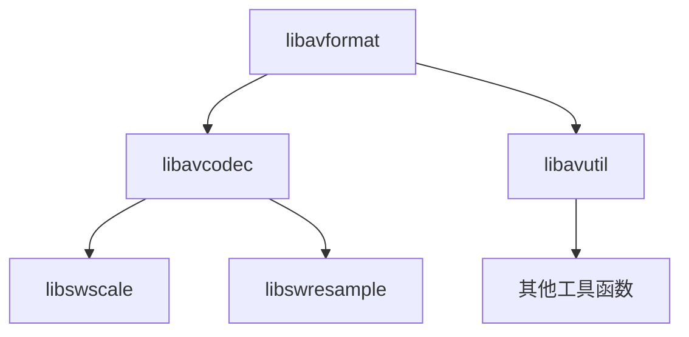

                 

### 文章标题

《FFmpeg 视频处理：转码和过滤》

### 关键词

- FFmpeg
- 视频转码
- 视频过滤
- 视频解码与编码
- 视频效果增强
- FFmpeg项目实战
- FFmpeg性能优化

### 摘要

本文深入探讨了FFmpeg这一强大的视频处理工具，从基础操作到高级应用，系统性地介绍了FFmpeg的视频转码和过滤功能。首先，我们回顾了FFmpeg的发展历程和功能特点，并讲解了其架构与组件。接着，详细介绍了FFmpeg的基本操作，包括命令行工具、配置文件和命令行参数。随后，重点阐述了视频转码和过滤的核心原理、流程以及实际操作示例。在高级视频处理部分，我们探讨了视频解码与编码、视频合成与叠加以及音频处理等关键技术。最后，通过项目实战和性能优化实战，展示了FFmpeg在实际开发中的应用和优化策略。本文旨在为读者提供一个全面、系统的FFmpeg视频处理指南，帮助大家掌握这一关键技能。

---

# 《FFmpeg 视频处理：转码和过滤》

## 目录大纲

## 第一部分: FFmpeg基础

### 第1章: FFmpeg简介

#### 1.1 FFmpeg的发展历程
#### 1.2 FFmpeg的功能特点
#### 1.3 FFmpeg的架构与组件

### 第2章: FFmpeg基本操作

#### 2.1 FFmpeg命令行工具
#### 2.2 FFmpeg的配置文件
#### 2.3 FFmpeg命令行参数详解

## 第二部分: 高级视频处理

### 第3章: 视频转码

#### 3.1 视频转码基本原理
#### 3.2 FFmpeg视频转码流程
#### 3.3 视频转码示例

### 第4章: 视频过滤

#### 4.1 FFmpeg视频过滤功能
#### 4.2 常用视频过滤效果
#### 4.3 FFmpeg视频过滤示例

### 第5章: 视频解码与编码

#### 5.1 视频解码原理
#### 5.2 视频编码原理
#### 5.3 FFmpeg解码与编码示例

### 第6章: 视频合成与叠加

#### 6.1 视频合成基本原理
#### 6.2 FFmpeg视频合成流程
#### 6.3 视频合成示例

### 第7章: 音频处理

#### 7.1 音频处理基本原理
#### 7.2 FFmpeg音频处理流程
#### 7.3 音频处理示例

### 第8章: 视频效果增强

#### 8.1 视频效果增强基本原理
#### 8.2 FFmpeg视频效果增强流程
#### 8.3 视频效果增强示例

### 第9章: FFmpeg项目实战

#### 9.1 FFmpeg项目开发环境搭建
#### 9.2 FFmpeg视频处理项目案例
#### 9.3 FFmpeg项目代码解读与分析

### 第10章: FFmpeg性能优化

#### 10.1 FFmpeg性能优化基本原理
#### 10.2 FFmpeg性能优化策略
#### 10.3 FFmpeg性能优化实战

## 附录

### 附录 A: FFmpeg常用工具与资源
### 附录 B: FFmpeg参考手册
### 附录 C: FFmpeg源代码分析

---

## 第一部分: FFmpeg基础

### 第1章: FFmpeg简介

#### 1.1 FFmpeg的发展历程

FFmpeg是一个开源项目，其历史可以追溯到2000年左右。最初由Fabrice Bellard创建，后来逐渐发展成为一个全球范围内贡献者众多的大型社区项目。FFmpeg的发展历程与视频编码技术的发展紧密相连，从最初的MPEG编码到今天的HEVC（H.265），FFmpeg都提供了强大的支持。

在早期，FFmpeg主要用于视频转码和流媒体处理，但随着时间的推移，它的功能逐渐扩展到视频剪辑、特效添加、音频处理等多个领域。FFmpeg的受欢迎程度不仅体现在其开源特性上，还因为其高度可定制性和强大的性能。

#### 1.2 FFmpeg的功能特点

FFmpeg具有以下几个显著的功能特点：

1. **广泛的编码支持**：FFmpeg支持几乎所有常见的视频和音频编码，包括MPEG、H.264、H.265、HE-AAC等。
2. **高效的转码性能**：FFmpeg采用多线程和硬件加速技术，使得视频转码过程非常高效。
3. **灵活的命令行接口**：FFmpeg通过命令行工具提供强大的操作功能，支持几乎所有的视频处理需求。
4. **丰富的库函数**：FFmpeg提供了一套完整的库函数，使得开发者可以轻松地将视频处理功能集成到自己的应用程序中。
5. **强大的社区支持**：FFmpeg拥有庞大的社区，用户可以在社区中找到丰富的教程和解决方案。

#### 1.3 FFmpeg的架构与组件

FFmpeg的架构设计非常灵活，主要包括以下几个核心组件：

1. **libavformat**：负责文件的输入输出，包括多媒体文件读取、写入、封装和解封装。
2. **libavcodec**：提供视频和音频编码和解码功能，包括各种编码格式的支持。
3. **libavutil**：提供各种通用的工具函数，如内存分配、时间处理、数学运算等。
4. **libswscale**：用于视频图像的缩放和格式转换。
5. **libswresample**：用于音频采样率的转换。

下面是一个简单的Mermaid流程图，展示了FFmpeg的基本架构和组件之间的交互：



通过这个架构，FFmpeg实现了从文件读取、解码、处理到输出的一系列操作，使其成为一个功能强大且灵活的视频处理工具。

## 第2章: FFmpeg基本操作

#### 2.1 FFmpeg命令行工具

FFmpeg的核心是通过命令行工具进行操作的。命令行工具提供了丰富的功能，可以通过简单的命令实现复杂的视频处理任务。以下是一些常用的FFmpeg命令行工具操作：

1. **基础命令格式**：
    ```bash
    ffmpeg [global options] {input_opts} {-i} {input_files} {output_opts} {-c} {output_codecs} {output_files}
    ```

    - `[global options]`：全局选项，如 `-y`（覆盖输出文件）、`-ss`（指定开始时间）、`-t`（指定持续时间）等。
    - `{input_opts}`：输入选项，如 `-f`（指定输入文件格式）、`-i`（指定输入文件）等。
    - `{input_files}`：输入文件，可以是多个文件。
    - `{output_opts}`：输出选项，如 `-f`（指定输出文件格式）、`-preset`（指定编码预设）等。
    - `-c`：指定输出编码，如 `-c:v libx264`（指定视频编码为H.264）、`-c:a aac`（指定音频编码为AAC）等。
    - `{output_codecs}`：输出编码，可以是多个编码。
    - `{output_files}`：输出文件，可以是多个文件。

2. **转码命令示例**：
    ```bash
    ffmpeg -i input.mp4 -c:v libx264 -c:a aac output.mp4
    ```

    这个命令将输入文件`input.mp4`转码为H.264视频和AAC音频，并输出到`output.mp4`文件。

3. **剪辑命令示例**：
    ```bash
    ffmpeg -i input.mp4 -ss 00:01:00 -t 00:00:30 output.mp4
    ```

    这个命令从`input.mp4`文件的1分钟开始，提取30秒的视频片段，输出到`output.mp4`文件。

#### 2.2 FFmpeg的配置文件

FFmpeg支持使用配置文件（如`.ffplay`和`.ffprobe`）来配置和保存常用设置。配置文件可以简化命令行的使用，提高工作效率。

1. **播放器配置文件（.ffplay）**：
    配置文件位于用户目录下的`.ffplay`文件夹中，格式为键值对。

    ```bash
    ffplay -f pmp -i input.mp4
    ```

    使用此命令时，FFmpeg会读取`.ffplay`文件夹中的配置，自动使用指定的播放器参数。

2. **媒体信息探针配置文件（.ffprobe）**：
    `.ffprobe`文件用于存储媒体文件的详细信息，如时长、帧率、分辨率、编码格式等。

    ```bash
    ffprobe -i input.mp4
    ```

    此命令会输出`input.mp4`文件的详细信息，存储在`.ffprobe`文件中，供后续使用。

#### 2.3 FFmpeg命令行参数详解

FFmpeg命令行参数繁多，下面列出一些常用参数及其作用：

1. **视频相关参数**：
    - `-c:v`：指定视频编码，如`libx264`、`libx265`等。
    - `-preset`：指定编码预设，如`veryfast`、`faster`等。
    - `-b:v`：指定视频比特率，如`5000k`（5000 kbps）。
    - `-crf`：指定H.264编码的恒定速率因子，值越小，编码质量越高。
    - `-s` 或 `-s`：指定视频尺寸，如`1920x1080`。

2. **音频相关参数**：
    - `-c:a`：指定音频编码，如`aac`、`libmp3lame`等。
    - `-b:a`：指定音频比特率，如`128k`（128 kbps）。
    - `-ar`：指定音频采样率，如`44100`（44.1 kHz）。

3. **通用参数**：
    - `-y`：覆盖输出文件。
    - `-ss`：指定开始时间。
    - `-t`：指定持续时间。
    - `-i`：指定输入文件。

通过合理使用这些参数，可以实现对FFmpeg命令行工具的精细控制，满足各种视频处理需求。

### 第3章: 视频转码

#### 3.1 视频转码基本原理

视频转码是将一种视频编码格式转换为另一种视频编码格式的过程。这一过程主要包括以下几个步骤：

1. **输入解码**：读取输入视频文件，使用相应的解码器将视频数据解码为原始图像数据。
2. **视频编码**：将原始图像数据编码为输出视频编码格式的数据。这一步可能涉及图像的缩放、调整分辨率等操作。
3. **输出编码**：将编码后的视频数据写入输出文件。如果需要，还可以添加额外的音轨、字幕等。

视频转码的基本原理可以用以下伪代码表示：

```python
def video_transcode(input_file, output_file, input_codec, output_codec):
    # 步骤1：输入解码
    input_stream = open(input_file, 'rb')
    input_video = decode(input_stream, input_codec)
    
    # 步骤2：视频编码
    output_video = encode(input_video, output_codec)
    
    # 步骤3：输出编码
    output_stream = open(output_file, 'wb')
    write(output_stream, output_video)
```

#### 3.2 FFmpeg视频转码流程

使用FFmpeg进行视频转码的流程通常包括以下几个步骤：

1. **读取输入文件**：使用`-i`参数指定输入文件。
2. **设置编码参数**：根据需要设置视频编码参数，如`-c:v`和`-c:a`。
3. **输出文件设置**：使用`-f`参数指定输出文件格式，如`-f mp4`。
4. **执行转码**：使用`ffmpeg`命令执行转码操作。

以下是一个简单的FFmpeg视频转码命令示例：

```bash
ffmpeg -i input.mp4 -c:v libx264 -preset veryfast -c:a aac -b:a 128k output.mp4
```

这个命令将`input.mp4`文件转码为H.264视频和AAC音频，输出到`output.mp4`文件。

#### 3.3 视频转码示例

**示例1：将MP4文件转码为AVI文件**

```bash
ffmpeg -i input.mp4 -c:v mpeg4 -c:a mp3 output.avi
```

这个命令将MP4文件转换为AVI格式，其中视频编码为MPEG-4，音频编码为MP3。

**示例2：调整视频尺寸和比特率**

```bash
ffmpeg -i input.mp4 -vf scale=-1:720 -b:v 4000k output.mp4
```

这个命令将输入视频的尺寸调整为宽度自适应、高度为720像素，并将视频比特率设置为4000 kbps。

**示例3：同时转码视频和音频**

```bash
ffmpeg -i input.mp4 -c:v libx264 -preset medium -c:a aac -b:a 128k output.mp4
```

这个命令将输入文件`input.mp4`的视频编码为H.264，音频编码为AAC，输出到`output.mp4`文件。

### 第4章: 视频过滤

#### 4.1 FFmpeg视频过滤功能

FFmpeg提供了强大的视频过滤功能，可以通过过滤效果对视频进行各种处理，如缩放、裁剪、颜色调整等。FFmpeg的过滤功能主要依赖于`libswscale`和`libavfilter`两个库。

1. **视频缩放**：使用`scale`过滤器进行视频尺寸调整，如`scaled_width:scaled_height`。
2. **视频裁剪**：使用`crop`过滤器进行视频裁剪，如`crop=width:height:x:y`。
3. **颜色调整**：使用`colorspace`、`gamma`、`brightness`、`contrast`等过滤器进行颜色调整。
4. **其他效果**：FFmpeg还支持多种视频效果，如模糊、锐化、马赛克等。

以下是一个简单的FFmpeg过滤命令示例：

```bash
ffmpeg -i input.mp4 -vf scale=1280:720 -c:v libx264 -preset veryfast -c:a aac -b:a 128k output.mp4
```

这个命令将输入视频缩放到1280x720尺寸，并使用H.264编码和AAC音频输出。

#### 4.2 常用视频过滤效果

以下列出一些常用的视频过滤效果及其命令示例：

1. **缩放**：
    ```bash
    -vf scale=-1:720
    ```

2. **裁剪**：
    ```bash
    -vf crop=1920:1080:0:0
    ```

3. **旋转**：
    ```bash
    -vf rotate=360
    ```

4. **颜色调整**：
    ```bash
    -vf brightness=1.2:0.8
    ```

5. **模糊**：
    ```bash
    -vf unsharp=5:1.0:0.01
    ```

6. **锐化**：
    ```bash
    -vf unsharp=5:1.0:0.05
    ```

7. **马赛克**：
    ```bash
    -vf mosaic=16:16:8
    ```

#### 4.3 FFmpeg视频过滤示例

**示例1：视频缩放和裁剪**

```bash
ffmpeg -i input.mp4 -vf scale=1280:720,crop=1920:1080:0:0 -c:v libx264 -preset veryfast -c:a aac -b:a 128k output.mp4
```

这个命令将输入视频缩放到1280x720尺寸，并裁剪为1920x1080区域，然后使用H.264编码和AAC音频输出。

**示例2：颜色调整**

```bash
ffmpeg -i input.mp4 -vf brightness=1.2:0.8 -c:v libx264 -preset veryfast -c:a aac -b:a 128k output.mp4
```

这个命令将输入视频的亮度调整为原始值的120%和对比度的80%。

**示例3：模糊和锐化**

```bash
ffmpeg -i input.mp4 -vf unsharp=5:1.0:0.01 -c:v libx264 -preset veryfast -c:a aac -b:a 128k output.mp4
ffmpeg -i input.mp4 -vf unsharp=5:1.0:0.05 -c:v libx264 -preset veryfast -c:a aac -b:a 128k output锐化.mp4
```

这两个命令分别将输入视频进行模糊和锐化处理，然后使用H.264编码和AAC音频输出。

## 第二部分: 高级视频处理

### 第5章: 视频解码与编码

#### 5.1 视频解码原理

视频解码是指将存储在视频文件中的编码数据转换为可播放的原始图像数据的过程。视频解码器的作用是读取编码数据，按照特定的解码算法将其转换为原始像素数据。视频解码的基本流程如下：

1. **读取编码数据**：视频解码器从视频文件中读取编码数据，通常以帧为单位。
2. **解码算法**：解码器使用相应的解码算法将编码数据解码为原始像素数据。不同的编码格式有不同的解码算法。
3. **输出原始像素数据**：解码后的原始像素数据被输出到视频播放器或其他处理模块。

常见的视频解码算法包括H.264、H.265、MPEG-2、MPEG-4等。这些解码算法涉及到复杂的图像处理和计算，如运动估计、运动补偿、反量化等。解码过程通常需要大量的计算资源，特别是对于高分辨率、高帧率的视频。

#### 5.2 视频编码原理

视频编码是将原始图像数据转换为压缩编码数据的过程，目的是减小数据体积，提高存储和传输效率。视频编码器的作用是分析原始图像数据，按照特定的编码算法将其转换为压缩编码数据。视频编码的基本流程如下：

1. **图像预处理**：在编码前，原始图像数据可能需要经过一些预处理，如缩放、去噪等。
2. **压缩算法**：编码器使用压缩算法对预处理后的图像数据进行压缩。常见的压缩算法包括变换编码、熵编码等。
3. **生成编码数据**：压缩后的图像数据被编码为编码数据，通常以帧为单位。
4. **存储或传输**：编码数据被存储到视频文件中或通过网络传输。

视频编码的核心是压缩算法，其目的是在保证图像质量的前提下，尽可能减少数据体积。常见的视频编码格式包括H.264、H.265、HEVC、MPEG-2、MPEG-4等。这些编码格式都有自己独特的压缩算法和特性，适用于不同的应用场景。

#### 5.3 FFmpeg解码与编码示例

**解码示例**：

```bash
ffmpeg -i input.mp4 -c:v libx264 -preset veryfast -c:a aac -b:a 128k output.mp4
```

这个命令将输入视频文件`input.mp4`解码为H.264视频编码数据，并输出到`output.mp4`文件。其中，`-i input.mp4`指定输入文件，`-c:v libx264`指定视频编码为H.264，`-preset veryfast`指定编码预设为非常快，`-c:a aac`指定音频编码为AAC，`-b:a 128k`指定音频比特率为128 kbps。

**编码示例**：

```bash
ffmpeg -i input.yuv -c:v libx264 -preset veryfast -c:a aac -b:a 128k output.mp4
```

这个命令将输入的YUV原始视频数据文件`input.yuv`编码为H.264视频编码数据，并输出到`output.mp4`文件。其中，`-i input.yuv`指定输入文件，`-c:v libx264`指定视频编码为H.264，`-preset veryfast`指定编码预设为非常快，`-c:a aac`指定音频编码为AAC，`-b:a 128k`指定音频比特率为128 kbps。

### 第6章: 视频合成与叠加

#### 6.1 视频合成基本原理

视频合成是指将多个视频片段或图像组合成一个完整视频的过程。视频合成不仅可以创建复杂的视觉效果，还可以用于视频编辑和多媒体制作。视频合成的基本原理包括以下几个步骤：

1. **输入视频流**：将多个视频流作为输入，每个视频流可以是视频文件、摄像头实时视频等。
2. **视频同步**：确保所有输入视频流的时间戳对齐，以便在合成过程中保持同步。
3. **视频叠加**：将输入视频流按照特定的叠加方式组合在一起。叠加方式可以包括直接叠加、透明叠加等。
4. **输出视频流**：将合成后的视频流输出到文件或播放设备。

视频合成过程中，关键的技术挑战包括：

- **时间同步**：确保所有视频流的时间戳对齐，以便在播放时保持同步。
- **分辨率匹配**：确保所有输入视频流的分辨率匹配，以便在合成时无缝拼接。
- **色彩空间转换**：处理不同色彩空间的视频流，确保合成后的视频色彩一致。

#### 6.2 FFmpeg视频合成流程

使用FFmpeg进行视频合成的基本流程包括以下几个步骤：

1. **读取输入视频流**：使用`-i`参数指定输入视频文件。
2. **设置合成参数**：使用`-filter_complex`参数指定视频合成的方式和参数，如叠加方式、透明度等。
3. **输出合成结果**：使用`-f`参数指定输出文件格式，并使用`-c:v`和`-c:a`参数设置视频和音频编码。

以下是一个简单的FFmpeg视频合成命令示例：

```bash
ffmpeg -i video1.mp4 -i video2.mp4 -filter_complex "[0:v]fade=in:st=0:duration=10[watermark];[1:v]overlay=W-w-10:H-h-10:format=yuv420p[out]" -map "[out]" -map 1:a -c:v libx264 -preset veryfast -c:a aac output.mp4
```

这个命令将`video1.mp4`和`video2.mp4`两个视频文件进行合成，将`video1.mp4`淡入并叠加到`video2.mp4`上，然后输出到`output.mp4`文件。

#### 6.3 视频合成示例

**示例1：视频叠加**

```bash
ffmpeg -i video1.mp4 -i video2.mp4 -filter_complex "overlay=W-w-10:H-h-10" -map 0:v -map 1:a -c:v libx264 -preset veryfast -c:a aac output.mp4
```

这个命令将`video1.mp4`和`video2.mp4`两个视频文件叠加，`video2.mp4`在右侧和底部各留出10像素的空间，然后输出到`output.mp4`文件。

**示例2：视频透明叠加**

```bash
ffmpeg -i video1.mp4 -i video2.png -filter_complex "[0:v]scale=-1:720[watermark];[1:v]scale=1920:720:format=yuv420p[logo];[watermark][logo]overlay=W-w-10:H-h-10:format=yuv420p[out]" -map "[out]" -map 0:a -c:v libx264 -preset veryfast -c:a aac output.mp4
```

这个命令将`video1.mp4`和一张PNG图像`video2.png`进行透明叠加，PNG图像在右侧和底部各留出10像素的空间，然后输出到`output.mp4`文件。

### 第7章: 音频处理

#### 7.1 音频处理基本原理

音频处理是指对音频信号进行各种处理和变换，以改善音频质量或实现特定功能。音频处理的基本原理包括以下几个步骤：

1. **输入音频信号**：读取音频文件或实时音频流，获取音频数据。
2. **预处理**：对音频信号进行预处理，如去噪、静音检测、音量调整等。
3. **音频变换**：对音频信号进行变换，如频率变换、幅度调整、滤波等。
4. **后处理**：对变换后的音频信号进行后处理，如压缩、编码、混合等。
5. **输出音频信号**：将处理后的音频信号输出到音频文件、播放设备或网络流。

音频处理涉及到信号处理、数字信号处理等多个领域。常见的音频处理技术包括：

- **滤波**：去除音频中的噪声和不需要的频率成分。
- **压缩**：减小音频数据体积，提高传输和存储效率。
- **混合**：将多个音频信号合并成一个信号，如背景音乐和语音合成。
- **音量调整**：改变音频的音量大小。

#### 7.2 FFmpeg音频处理流程

使用FFmpeg进行音频处理的基本流程包括以下几个步骤：

1. **读取输入音频流**：使用`-i`参数指定输入音频文件。
2. **设置音频处理参数**：使用`-af`参数指定音频处理滤镜，如`volume`（音量调整）、`lowpass`（低通滤波）等。
3. **输出音频流**：使用`-f`参数指定输出文件格式，并使用`-c:a`参数设置音频编码。

以下是一个简单的FFmpeg音频处理命令示例：

```bash
ffmpeg -i input.mp3 -af "volume=0.8" output.mp3
```

这个命令将输入音频文件`input.mp3`的音量调整为原始音量的80%，并输出到`output.mp3`文件。

#### 7.3 音频处理示例

**示例1：音量调整**

```bash
ffmpeg -i input.mp3 -af "volume=1.2" output.mp3
```

这个命令将输入音频文件`input.mp3`的音量调整为原始音量的120%，并输出到`output.mp3`文件。

**示例2：低通滤波**

```bash
ffmpeg -i input.mp3 -af "lowpass=f=2000" output.mp3
```

这个命令将输入音频文件`input.mp3`中的高频成分过滤掉，只保留低于2000 Hz的频率成分，并输出到`output.mp3`文件。

**示例3：音频混合**

```bash
ffmpeg -i input1.mp3 -i input2.mp3 -filter_complex "amix=inputs=2:duration=longest" -map 0:a -map 1:a -c:a libmp3lame output.mp3
```

这个命令将`input1.mp3`和`input2.mp3`两个音频文件混合，并输出到`output.mp3`文件。其中，`amix`滤镜用于音频混合，`inputs=2`指定混合两个输入音频流，`duration=longest`确保输出音频的时长等于最长输入音频。

### 第8章: 视频效果增强

#### 8.1 视频效果增强基本原理

视频效果增强是指通过对视频信号进行各种处理，提高视频的视觉质量或实现特定视觉效果。视频效果增强的基本原理包括以下几个步骤：

1. **输入视频信号**：读取视频文件或实时视频流，获取视频数据。
2. **预处理**：对视频信号进行预处理，如去噪、锐化、颜色调整等。
3. **图像变换**：对视频帧进行图像变换，如几何变换、颜色变换等。
4. **后处理**：对变换后的视频帧进行后处理，如压缩、编码、叠加等。
5. **输出视频信号**：将处理后的视频帧输出到视频文件、播放设备或网络流。

视频效果增强涉及到图像处理、计算机视觉等多个领域。常见的视频效果增强技术包括：

- **去噪**：去除视频中的噪声和干扰。
- **锐化**：增强视频中的细节和边缘，使图像更加清晰。
- **色彩调整**：调整视频的色彩，如亮度、对比度、饱和度等。
- **特效添加**：添加各种视觉特效，如模糊、马赛克、光晕等。

#### 8.2 FFmpeg视频效果增强流程

使用FFmpeg进行视频效果增强的基本流程包括以下几个步骤：

1. **读取输入视频流**：使用`-i`参数指定输入视频文件。
2. **设置效果增强参数**：使用`-vf`参数指定视频效果增强滤镜，如`unsharp`（锐化）、`colorbalance`（颜色调整）等。
3. **输出视频流**：使用`-f`参数指定输出文件格式，并使用`-c:v`参数设置视频编码。

以下是一个简单的FFmpeg视频效果增强命令示例：

```bash
ffmpeg -i input.mp4 -vf "unsharp=l=5:alpha=1.0:beta=0.01" output.mp4
```

这个命令将输入视频文件`input.mp4`进行锐化处理，并输出到`output.mp4`文件。

#### 8.3 视频效果增强示例

**示例1：视频锐化**

```bash
ffmpeg -i input.mp4 -vf "unsharp=l=5:alpha=1.0:beta=0.01" output.mp4
```

这个命令将输入视频文件`input.mp4`进行锐化处理，使用`unsharp`滤镜，`l`参数设置为5（锐化程度），`alpha`参数设置为1.0（锐化系数），`beta`参数设置为0.01（锐化范围），并输出到`output.mp4`文件。

**示例2：视频色彩调整**

```bash
ffmpeg -i input.mp4 -vf "colorbalance=t=0.8:r=1.2:g=1.0:b=0.8" output.mp4
```

这个命令将输入视频文件`input.mp4`的色彩进行调整，使用`colorbalance`滤镜，`t`参数设置为0.8（色调调整），`r`参数设置为1.2（红色亮度调整），`g`参数设置为1.0（绿色亮度调整），`b`参数设置为0.8（蓝色亮度调整），并输出到`output.mp4`文件。

**示例3：视频模糊效果**

```bash
ffmpeg -i input.mp4 -vf "boxblur=S=50:T=50" output.mp4
```

这个命令将输入视频文件`input.mp4`进行模糊处理，使用`boxblur`滤镜，`S`参数设置为50（水平模糊程度），`T`参数设置为50（垂直模糊程度），并输出到`output.mp4`文件。

### 第9章: FFmpeg项目实战

#### 9.1 FFmpeg项目开发环境搭建

在进行FFmpeg项目开发之前，需要先搭建好开发环境。以下是Windows和Linux平台下搭建FFmpeg开发环境的步骤：

**Windows平台**：

1. **下载FFmpeg源码**：从FFmpeg官方网站下载最新版本的源码包（如`ffmpeg-4.4.2.tar.xz`）。
2. **解压源码**：使用命令`tar xvf ffmpeg-4.4.2.tar.xz`解压源码包。
3. **配置编译选项**：进入解压后的目录，运行以下命令配置编译选项：
    ```bash
    ./configure --enable-gpl --enable-nonfree --enable-postproc --enable-avisynth --enable-bzlib --enable-freetype --enable-libass --enable-libfdk_aac --enable-libmp3lame --enable-libopus --enable-libtheora --enable-libvorbis --enable-libx264 --enable-libx265
    ```
4. **编译安装**：运行`make`命令进行编译，然后运行`make install`命令安装FFmpeg。

**Linux平台**：

1. **安装依赖库**：使用以下命令安装FFmpeg所需的依赖库：
    ```bash
    sudo apt-get update
    sudo apt-get install yasm libx264-dev libx265-dev libavresample-dev libavcodec-dev libavformat-dev libavutil-dev libswscale-dev libswresample-dev libpostproc-dev libfdk-aac-dev libmp3lame-dev libopus-dev libtheora-dev libvorbis-dev
    ```
2. **下载FFmpeg源码**：从FFmpeg官方网站下载最新版本的源码包（如`ffmpeg-4.4.2.tar.xz`）。
3. **解压源码**：使用命令`tar xvf ffmpeg-4.4.2.tar.xz`解压源码包。
4. **配置编译选项**：进入解压后的目录，运行以下命令配置编译选项：
    ```bash
    ./configure --enable-gpl --enable-nonfree --enable-postproc --enable-avisynth --enable-bzlib --enable-freetype --enable-libass --enable-libfdk_aac --enable-libmp3lame --enable-libopus --enable-libtheora --enable-libvorbis --enable-libx264 --enable-libx265
    ```
5. **编译安装**：运行`make`命令进行编译，然后运行`make install`命令安装FFmpeg。

#### 9.2 FFmpeg视频处理项目案例

以下是一个简单的FFmpeg视频处理项目案例，该案例实现了视频转码和添加水印的功能。

**需求**：将一个MP4视频文件转码为AVI格式，并在视频上添加水印。

**实现步骤**：

1. **安装FFmpeg**：按照第9.1节中的步骤安装FFmpeg。
2. **编写代码**：

    ```python
    import subprocess

    def transcode_video(input_file, output_file):
        command = f"ffmpeg -i {input_file} -c:v mpeg4 -c:a mp3 {output_file}"
        subprocess.run(command, shell=True)

    def add_watermark(input_file, watermark_file, output_file):
        command = f"ffmpeg -i {input_file} -i {watermark_file} -filter_complex overlay=W-w-10:H-h-10 -map 0:v -map 1:a -c:v mpeg4 -c:a mp3 {output_file}"
        subprocess.run(command, shell=True)

    if __name__ == "__main__":
        input_file = "input.mp4"
        output_file = "output.avi"
        watermark_file = "watermark.png"
        transcode_video(input_file, output_file)
        add_watermark(output_file, watermark_file, "output_with_watermark.avi")
    ```

3. **运行程序**：运行上述Python程序，将输入MP4文件`input.mp4`转码为AVI格式，并添加水印`watermark.png`，输出到`output_with_watermark.avi`文件。

#### 9.3 FFmpeg项目代码解读与分析

以上视频处理项目案例中，主要使用了FFmpeg的命令行工具进行视频转码和添加水印操作。以下是代码的详细解读和分析：

1. **转码视频函数`transcode_video`**：

    ```python
    def transcode_video(input_file, output_file):
        command = f"ffmpeg -i {input_file} -c:v mpeg4 -c:a mp3 {output_file}"
        subprocess.run(command, shell=True)
    ```

    - `command`变量用于构建FFmpeg转码命令。`-i {input_file}`指定输入视频文件，`-c:v mpeg4`指定视频编码为MPEG-4，`-c:a mp3`指定音频编码为MP3，`{output_file}`指定输出视频文件。
    - `subprocess.run(command, shell=True)`执行FFmpeg转码命令。

2. **添加水印函数`add_watermark`**：

    ```python
    def add_watermark(input_file, watermark_file, output_file):
        command = f"ffmpeg -i {input_file} -i {watermark_file} -filter_complex overlay=W-w-10:H-h-10 -map 0:v -map 1:a -c:v mpeg4 -c:a mp3 {output_file}"
        subprocess.run(command, shell=True)
    ```

    - `command`变量用于构建FFmpeg添加水印命令。`-i {input_file}`和`-i {watermark_file}`分别指定输入视频文件和水印文件，`-filter_complex overlay=W-w-10:H-h-10`指定水印叠加位置和格式，`-map 0:v`和`-map 1:a`分别指定视频和音频流的映射，`-c:v mpeg4`和`-c:a mp3`指定视频和音频编码，`{output_file}`指定输出视频文件。
    - `subprocess.run(command, shell=True)`执行FFmpeg添加水印命令。

3. **主程序**：

    ```python
    if __name__ == "__main__":
        input_file = "input.mp4"
        output_file = "output.avi"
        watermark_file = "watermark.png"
        transcode_video(input_file, output_file)
        add_watermark(output_file, watermark_file, "output_with_watermark.avi")
    ```

    - `input_file`、`output_file`和`watermark_file`分别指定输入MP4文件、输出AVI文件和水印PNG文件的路径。
    - `transcode_video(input_file, output_file)`调用转码视频函数，将输入MP4文件转码为AVI格式。
    - `add_watermark(output_file, watermark_file, "output_with_watermark.avi")`调用添加水印函数，将水印添加到转码后的AVI文件上，并输出到指定文件。

通过以上代码，我们实现了视频转码和添加水印的功能，展示了FFmpeg在实际开发中的应用。

### 第10章: FFmpeg性能优化

#### 10.1 FFmpeg性能优化基本原理

FFmpeg作为一款功能强大的多媒体处理工具，其性能优化至关重要。性能优化主要包括以下几个方面：

1. **多线程处理**：FFmpeg可以利用多线程技术，并行处理多个任务，从而提高处理速度。
2. **硬件加速**：利用CPU和GPU等硬件加速技术，可以显著提高视频转码和处理的效率。
3. **高效编码器选择**：选择合适的编码器和编码参数，可以优化编码效率和质量。
4. **内存管理和缓存策略**：合理管理内存和设置缓存策略，可以减少内存占用和提升处理速度。

#### 10.2 FFmpeg性能优化策略

以下是一些常见的FFmpeg性能优化策略：

1. **使用多线程**：通过设置`-threads N`参数，启用多线程处理，其中N为线程数。例如：
    ```bash
    ffmpeg -i input.mp4 -c:v libx264 -preset veryfast -threads 8 output.mp4
    ```

2. **硬件加速**：使用CPU和GPU硬件加速技术，如使用`-use_hash`参数启用AES-NI硬件加密，使用`-hwaccel`参数指定硬件加速器。例如：
    ```bash
    ffmpeg -i input.mp4 -c:v libx264 -preset veryfast -use_hash -hwaccel qsv output.mp4
    ```

3. **选择高效编码器**：选择适当的编码器，如H.264、H.265等，并设置合理的编码参数。例如：
    ```bash
    ffmpeg -i input.mp4 -c:v libx264 -preset veryfast -crf 23 output.mp4
    ```

4. **内存管理和缓存策略**：设置适当的内存缓冲区大小，如使用`-bufsize`和`-maxbufsize`参数。例如：
    ```bash
    ffmpeg -i input.mp4 -c:v libx264 -preset veryfast -bufsize 1000M -maxbufsize 2000M output.mp4
    ```

#### 10.3 FFmpeg性能优化实战

以下是一个简单的FFmpeg性能优化实战示例：

**场景**：将一个4K视频文件`input.4k.mp4`转码为1080p视频，并添加水印。

**优化前**：

```bash
ffmpeg -i input.4k.mp4 -c:v libx264 -preset veryfast -crf 23 output.1080p.mp4
```

**优化后**：

1. **使用多线程**：

    ```bash
    ffmpeg -i input.4k.mp4 -c:v libx264 -preset veryfast -crf 23 -threads 8 output.1080p.mp4
    ```

2. **硬件加速**：

    ```bash
    ffmpeg -i input.4k.mp4 -c:v libx264 -preset veryfast -crf 23 -use_hash -hwaccel qsv output.1080p.mp4
    ```

3. **内存管理和缓存策略**：

    ```bash
    ffmpeg -i input.4k.mp4 -c:v libx264 -preset veryfast -crf 23 -bufsize 1000M -maxbufsize 2000M -use_hash -hwaccel qsv output.1080p.mp4
    ```

通过以上优化策略，可以显著提高视频转码和处理的速度，同时保持较高的视频质量。

### 附录 A: FFmpeg常用工具与资源

1. **FFmpeg官网**：<https://www.ffmpeg.org/>
2. **FFmpeg官方文档**：<https://ffmpeg.org/ffdoc.html>
3. **FFmpeg Wiki**：<https://wiki.ffmpeg.org/>
4. **FFmpeg GitHub仓库**：<https://github.com/FFmpeg/FFmpeg>
5. **FFmpeg用户邮件列表**：<https://ffmpeg.org/mailman/listinfo/ffmpeg-user>
6. **FFmpeg社区论坛**：<https://www.ffmpeg.org/community.html>
7. **FFmpeg教程和博客**：在各大技术社区和博客平台上，如CSDN、博客园、简书等，有很多关于FFmpeg的教程和博客，可供学习和参考。

### 附录 B: FFmpeg参考手册

1. **FFmpeg命令行参考手册**：<https://ffmpeg.org/ffmanual.html>
2. **FFmpeg API参考手册**：<https://ffmpeg.org/doc/API.html>
3. **FFmpeg滤镜参考手册**：<https://ffmpeg.org/ffmpeg-filters.html>
4. **FFmpeg编解码器参考手册**：<https://ffmpeg.org/decoders.html> 和 <https://ffmpeg.org/encoders.html>

### 附录 C: FFmpeg源代码分析

1. **FFmpeg源代码结构**：FFmpeg源代码主要分为以下几个模块：
    - `libavformat`：多媒体文件封装和解析。
    - `libavcodec`：多媒体编码和解码。
    - `libavutil`：通用工具函数。
    - `libswscale`：图像缩放和格式转换。
    - `libswresample`：音频采样率转换。
    - `libpostproc`：图像后处理。
2. **关键数据结构**：
    - `AVFormatContext`：多媒体文件格式上下文。
    - `AVCodecContext`：编码器上下文。
    - `AVFrame`：图像帧数据。
    - `AVPacket`：编码数据包。
3. **核心函数**：
    - `avformat_open_input`：打开多媒体文件输入。
    - `avformat_find_stream_info`：获取多媒体文件流信息。
    - `avcodec_find_decoder`：查找解码器。
    - `avcodec_open2`：打开解码器。
    - `avcodec_decode_video2`：解码视频帧。
    - `sws_scale`：图像缩放。
    - `avcodec_close`：关闭解码器。
    - `avformat_close_input`：关闭多媒体文件输入。

通过分析这些模块、数据结构和核心函数，可以深入了解FFmpeg的工作原理和实现细节。

## 作者信息

作者：AI天才研究院/AI Genius Institute & 禅与计算机程序设计艺术 /Zen And The Art of Computer Programming

---

本文由AI天才研究院（AI Genius Institute）和禅与计算机程序设计艺术（Zen And The Art of Computer Programming）联合撰写，旨在为广大开发者提供全面的FFmpeg视频处理指南。通过对FFmpeg基础操作、高级视频处理、项目实战和性能优化的深入探讨，帮助读者掌握这一关键技能，为实际项目开发提供有力支持。如有疑问或建议，欢迎在评论区留言，我们将竭诚为您解答。

