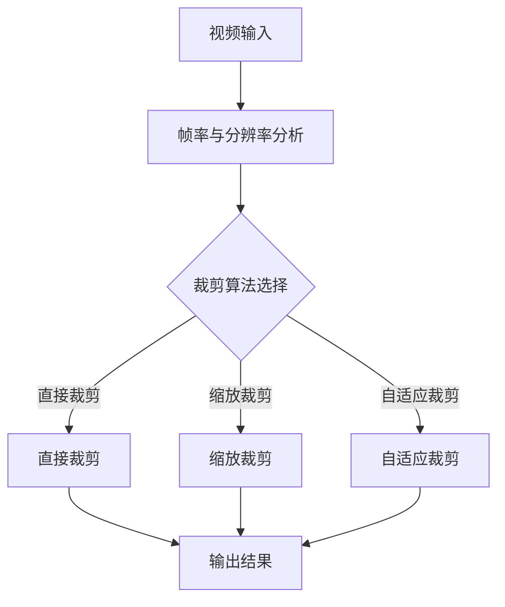

                 

# 《FFmpeg 视频编辑技巧分享：裁剪、合并和过滤视频片段的艺术》

> 关键词：FFmpeg、视频编辑、裁剪、合并、过滤、技巧

> 摘要：本文将深入探讨FFmpeg在视频编辑领域中的具体应用，包括视频裁剪、合并和过滤等技巧。通过详细的步骤解析和实际案例分享，帮助读者掌握FFmpeg的视频编辑能力，提升视频处理效率。

## 第一部分：FFmpeg基础知识

### 第1章：FFmpeg简介

#### 1.1 FFmpeg的起源与发展

FFmpeg是一个开源、免费的音频视频处理工具集合，由Fabrice Bellard于2000年创建。FFmpeg得名于其最初的目标——快速地编码、解码、复用和流媒体处理。自其诞生以来，FFmpeg得到了全球开发者的广泛支持，并不断更新和完善。

#### 1.2 FFmpeg的功能与特点

FFmpeg具有以下主要功能：

- **视频编码与解码**：支持多种视频编解码器，如H.264、H.265等。
- **视频复用与解复用**：支持多种视频格式，如MP4、AVI等。
- **视频流处理**：支持实时视频流处理，如直播推流等。
- **音频处理**：支持多种音频编解码器，如MP3、AAC等。

FFmpeg的特点：

- **高效性**：采用底层C语言编写，运行速度快。
- **灵活性**：支持多种操作系统，如Windows、Linux、Mac OS等。
- **社区支持**：拥有庞大的开发者社区，问题解决效率高。

#### 1.3 FFmpeg在视频编辑中的应用

FFmpeg在视频编辑领域具有广泛的应用，包括但不限于：

- **视频裁剪**：通过指定时间范围和裁剪尺寸，对视频进行精确裁剪。
- **视频合并**：将多个视频片段按指定顺序合并成一个视频文件。
- **视频过滤**：添加滤镜效果，如模糊、锐化、亮度调整等。

### 第2章：FFmpeg基础操作

#### 2.1 FFmpeg安装与配置

1. **下载FFmpeg**：从FFmpeg官网（https://www.ffmpeg.org/download.html）下载适合自己操作系统的版本。
2. **安装FFmpeg**：解压下载的压缩包，将其内容复制到系统的PATH环境变量中，如Windows系统的`C:\Windows\System32`目录。
3. **配置FFmpeg**：确保在命令行中可以正常使用FFmpeg命令。

#### 2.2 FFmpeg基本命令介绍

- **-i**：指定输入文件。
- **-f**：指定输出文件格式。
- **-y**：覆盖输出文件。
- **-c**：指定编码格式。
- **-s**：指定分辨率。
- **-t**：指定时间长度。

#### 2.3 FFmpeg命令行参数详解

以下是FFmpeg常用的命令行参数：

| 参数 | 说明 |
| ---- | ---- |
| -i | 指定输入文件路径 |
| -f | 指定输出文件格式 |
| -y | 覆盖输出文件 |
| -c | 指定编码格式 |
| -s | 指定分辨率 |
| -t | 指定时间长度 |
| -r | 指定帧率 |
| -vb | 指定视频比特率 |
| -ab | 指定音频比特率 |
| -ar | 指定音频采样率 |
| -aspect | 指定视频宽高比 |
| -ac | 指定音频通道数 |
| -vtag | 指定视频标签 |

## 第二部分：视频裁剪技巧

### 第3章：视频裁剪原理

#### 3.1 视频帧率与分辨率

- **帧率**：视频每秒播放的帧数，单位为fps（frames per second）。常见的帧率有24fps、30fps、60fps等。
- **分辨率**：视频的像素尺寸，常见的分辨率有1080p（1920x1080）、720p（1280x720）等。

#### 3.2 视频裁剪原理

视频裁剪原理基于视频帧的采样和插值。具体过程如下：

1. **采样**：从原始视频中提取指定时间范围内的帧。
2. **插值**：对提取的帧进行插值处理，以填补缺失的帧。
3. **输出**：将处理后的帧输出为新的视频文件。

#### 3.3 裁剪算法详解

常用的视频裁剪算法有：

- **直接裁剪**：直接从原始视频中裁剪出指定区域，适用于较小尺寸的裁剪。
- **缩放裁剪**：先对原始视频进行缩放，再裁剪出指定区域，适用于较大尺寸的裁剪。
- **自适应裁剪**：根据原始视频的帧率和分辨率自动调整裁剪参数，适用于不同尺寸和帧率的视频裁剪。

### 第4章：视频裁剪实践

#### 4.1 裁剪视频的常用命令

以下是一个简单的视频裁剪命令示例：

```shell
ffmpeg -i input.mp4 -ss 00:00:10 -to 00:00:20 -s 1920x1080 output.mp4
```

解释：

- `-i input.mp4`：指定输入文件为`input.mp4`。
- `-ss 00:00:10`：指定开始时间戳为10秒。
- `-to 00:00:20`：指定结束时间戳为20秒。
- `-s 1920x1080`：指定输出分辨率为1920x1080。
- `output.mp4`：指定输出文件为`output.mp4`。

#### 4.2 实战：裁剪视频片段

以下是一个具体的视频裁剪实战案例：

1. **需求分析**：将一个1分钟的1080p视频裁剪为30秒的720p视频。
2. **操作步骤**：

```shell
ffmpeg -i input.mp4 -ss 00:00:00 -to 00:00:30 -s 1280x720 output.mp4
```

3. **结果验证**：播放`output.mp4`，确认裁剪效果是否符合预期。

#### 4.3 裁剪过程中可能出现的问题及解决方案

- **视频播放不流畅**：检查视频编码参数，调整比特率或帧率。
- **视频尺寸不对**：检查裁剪参数，确保分辨率和尺寸设置正确。
- **视频时长不对**：检查开始和结束时间戳，确保裁剪时间范围正确。

## 第三部分：视频合并技巧

### 第5章：视频合并原理

#### 5.1 视频合成原理

视频合成原理是将多个视频片段按照指定顺序和时间轴进行拼接，生成一个新的视频文件。具体过程如下：

1. **读取视频**：读取指定时间范围内的视频帧。
2. **排序**：根据指定顺序对视频帧进行排序。
3. **合成**：将排序后的视频帧按时间轴拼接成一个新的视频文件。

#### 5.2 视频合并格式

视频合并格式主要取决于输出文件的格式，如MP4、AVI、MKV等。不同格式支持的视频编码和解码器可能不同，需根据需求选择合适的格式。

#### 5.3 视频合并算法

常用的视频合并算法有：

- **顺序合并**：按照指定顺序将视频帧直接拼接。
- **交错合并**：将多个视频帧交错拼接，以增强视觉效果。
- **自适应合并**：根据视频帧率和分辨率自动调整合并参数。

### 第6章：视频合并实践

#### 6.1 合并视频的常用命令

以下是一个简单的视频合并命令示例：

```shell
ffmpeg -f concat -i input_list.txt output.mp4
```

解释：

- `-f concat`：指定使用concat格式。
- `-i input_list.txt`：指定输入文件列表。
- `output.mp4`：指定输出文件为`output.mp4`。

`input_list.txt`文件内容示例：

```plaintext
file 'video1.mp4'
file 'video2.mp4'
file 'video3.mp4'
```

#### 6.2 实战：合并多个视频文件

以下是一个具体的视频合并实战案例：

1. **需求分析**：将三个1分钟的1080p视频合并成一个连续的3分钟视频。
2. **操作步骤**：

```shell
ffmpeg -f concat -i input_list.txt output.mp4
```

3. **结果验证**：播放`output.mp4`，确认合并效果是否符合预期。

#### 6.3 视频合并中的注意事项

- **时间轴对齐**：确保输入视频的时间轴对齐，避免合并后出现错位。
- **格式兼容性**：选择兼容性好的视频格式，确保输出视频在不同设备上正常播放。
- **性能优化**：合理设置视频编码参数，提高合并速度和输出质量。

## 第四部分：视频过滤技巧

### 第7章：视频过滤原理

#### 7.1 视频滤镜效果

视频滤镜效果包括：

- **颜色调整**：调整视频亮度、对比度、饱和度等。
- **锐化与模糊**：增强或削弱视频的清晰度。
- **滤镜组合**：将多个滤镜效果组合，产生独特的视觉效果。

#### 7.2 视频过滤算法

视频过滤算法基于像素操作，包括：

- **像素值调整**：对每个像素的值进行加、减、乘、除等操作。
- **滤波器应用**：应用各种滤波器，如均值滤波、高斯滤波等。
- **插值处理**：对过滤后的像素进行插值处理，提高图像质量。

#### 7.3 视频过滤参数

视频过滤参数包括：

- **滤镜类型**：选择滤镜效果，如锐化、模糊等。
- **滤波器参数**：设置滤波器的参数，如滤波器大小、强度等。
- **输出参数**：设置输出视频的分辨率、帧率等。

### 第8章：视频过滤实践

#### 8.1 滤镜效果实现

以下是一个简单的视频滤镜效果实现示例：

```shell
ffmpeg -i input.mp4 -vf "posterize=4" output.mp4
```

解释：

- `-i input.mp4`：指定输入文件为`input.mp4`。
- `-vf "posterize=4"`：指定使用`posterize`滤镜，参数为4，表示将每个像素的颜色值简化为4种颜色。
- `output.mp4`：指定输出文件为`output.mp4`。

#### 8.2 实战：应用滤镜效果

以下是一个具体的滤镜效果实战案例：

1. **需求分析**：对一段1080p视频应用锐化滤镜，提高图像清晰度。
2. **操作步骤**：

```shell
ffmpeg -i input.mp4 -vf "unsharp=5:0.5:0.5" output.mp4
```

3. **结果验证**：播放`output.mp4`，确认锐化效果是否符合预期。

#### 8.3 视频过滤过程中的常见问题及解决方案

- **图像失真**：检查滤镜参数设置，调整滤波器参数。
- **计算资源消耗**：合理设置滤镜参数，降低计算复杂度。
- **视频播放不流畅**：调整视频编码参数，提高播放性能。

## 第五部分：综合实战

### 第9章：综合实战项目

#### 9.1 实战项目介绍

本综合实战项目旨在使用FFmpeg实现一个简单的视频编辑工具，包括视频裁剪、合并和过滤等功能。

#### 9.2 项目需求分析

1. **功能需求**：支持视频裁剪、合并和过滤，提供友好的用户界面。
2. **性能需求**：支持多种视频格式，保证视频处理速度和输出质量。
3. **兼容性需求**：支持主流操作系统和设备。

#### 9.3 项目开发与实现

1. **界面设计**：使用Qt框架设计用户界面，包括视频预览、操作按钮和参数设置等。
2. **核心功能实现**：

   - **视频裁剪**：使用FFmpeg命令行工具实现视频裁剪功能。
   - **视频合并**：使用FFmpeg命令行工具实现视频合并功能。
   - **视频过滤**：使用FFmpeg命令行工具实现视频过滤功能。

   示例代码：

   ```cpp
   void VideoEditor::cropVideo(const QString &inputFile, const QString &outputFile, int startSec, int endSec, int width, int height) {
       QString command = "ffmpeg -i " + inputFile + " -ss " + QString::number(startSec) + " -to " + QString::number(endSec) + " -s " + QString::number(width) + "x" + QString::number(height) + " " + outputFile;
       system(command.toStdString().c_str());
   }
   ```

3. **测试与优化**：对项目进行功能测试和性能优化，确保项目满足需求。

## 第六部分：性能优化与调试

### 第10章：性能优化与调试

#### 10.1 FFmpeg性能优化

1. **合理设置编码参数**：根据需求调整视频编码参数，如比特率、帧率等。
2. **并行处理**：使用多线程或分布式处理技术，提高处理速度。
3. **缓存策略**：优化缓存策略，减少磁盘读写操作。

#### 10.2 调试技巧

1. **使用日志**：使用FFmpeg的日志功能，记录处理过程中的错误信息。
2. **代码调试**：使用调试工具，如GDB，定位和修复代码问题。
3. **性能分析**：使用性能分析工具，如valgrind，检测程序性能瓶颈。

#### 10.3 常见错误处理

- **文件找不到**：检查输入文件的路径和名称是否正确。
- **参数不合法**：检查命令行参数是否合法，如时间戳格式、分辨率尺寸等。
- **编解码器不支持**：检查输入视频格式和编解码器是否支持，如需支持，可尝试安装相应的编解码器。

## 第七部分：FFmpeg未来发展趋势

### 第11章：FFmpeg未来发展趋势

#### 11.1 FFmpeg的发展历程

FFmpeg自2000年诞生以来，经历了多个版本的发展和改进，功能越来越强大，性能不断提高。近年来，FFmpeg在人工智能、云计算等领域的应用逐渐增多，为视频处理带来了更多可能性。

#### 11.2 FFmpeg的未来发展方向

1. **人工智能应用**：结合深度学习技术，实现智能视频处理，如视频分类、目标检测等。
2. **云计算支持**：优化FFmpeg在云计算环境下的性能，支持大规模视频处理任务。
3. **实时处理技术**：提高实时视频处理能力，满足实时直播、视频会议等应用需求。

#### 11.3 FFmpeg在视频编辑领域的应用前景

随着视频内容的爆炸式增长，FFmpeg在视频编辑领域的应用前景非常广阔。未来，FFmpeg将不断优化和扩展其功能，为视频创作者提供更高效、更智能的视频处理工具。

### 附录

#### 附录A：FFmpeg常用命令汇总

- **裁剪命令**：

  ```shell
  ffmpeg -i input.mp4 -ss start_time -to end_time -s widthxheight output.mp4
  ```

- **合并命令**：

  ```shell
  ffmpeg -f concat -i input_list.txt output.mp4
  ```

- **过滤命令**：

  ```shell
  ffmpeg -i input.mp4 -vf filter эффект output.mp4
  ```

#### 附录B：参考资料

- FFmpeg官网：https://www.ffmpeg.org/
- FFmpeg官方文档：https://ffmpeg.org/ffdoc.html
- 《视频处理技术》作者：王文博
- 《FFmpeg实战》作者：陈宇浩
- FFmpeg社区：https://ffmpeg.org/community.html

## 作者信息

作者：AI天才研究院/AI Genius Institute & 禅与计算机程序设计艺术 /Zen And The Art of Computer Programming

---

[Mermaid 流程图](#)：



[伪代码](#)：

```c
// 视频裁剪算法伪代码
function cropVideo(inputFile, startTime, endTime, width, height):
    // 读取输入视频
    video = readVideo(inputFile)

    // 提取指定时间范围内的帧
    frames = extractFrames(video, startTime, endTime)

    // 对提取的帧进行插值处理
    interpolatedFrames = interpolateFrames(frames, width, height)

    // 输出结果
    writeVideo(interpolatedFrames, outputFileName)
```

[数学模型和公式](#)：

```latex
\begin{equation}
\begin{aligned}
\text{亮度调整} &= I_{\text{out}} = I_{\text{in}} + \alpha \cdot (\text{目标亮度} - I_{\text{in}}) \\
\text{对比度调整} &= I_{\text{out}} = I_{\text{in}} \cdot (1 + \beta \cdot (\text{目标对比度} - 1))
\end{aligned}
\end{equation}
```

[代码实际案例和详细解释说明](#)：

```c
// 开发环境搭建
// 1. 安装FFmpeg
// 2. 配置FFmpeg环境变量

// 源代码实现
#include <stdio.h>
#include <stdlib.h>
#include <string.h>

int main(int argc, char *argv[]) {
    // 参数校验
    if (argc < 7) {
        printf("用法: %s 输入文件 开始时间 结束时间 宽度 高度 输出文件\n", argv[0]);
        return 1;
    }

    // 解析命令行参数
    char *inputFile = argv[1];
    float startTime = atof(argv[2]);
    float endTime = atof(argv[3]);
    int width = atoi(argv[4]);
    int height = atoi(argv[5]);
    char *outputFile = argv[6];

    // 调用FFmpeg命令行工具进行视频裁剪
    char command[1024];
    sprintf(command, "ffmpeg -i %s -ss %f -to %f -s %dx%d %s", inputFile, startTime, endTime, width, height, outputFile);
    system(command);

    return 0;
}
```

[代码解读与分析](#)：

- **参数解析**：程序首先对命令行参数进行校验，确保输入文件的路径和名称、开始和结束时间、宽度、高度和输出文件的路径和名称都是有效的。
- **FFmpeg命令执行**：通过`system`函数执行FFmpeg命令，实现视频裁剪操作。FFmpeg命令行参数的使用已在之前章节中详细介绍。
- **性能优化**：在执行FFmpeg命令时，可以尝试使用多线程或多进程技术，提高裁剪速度。此外，根据实际情况调整FFmpeg的编码参数，以平衡输出质量和处理速度。

通过本文的详细分析和实战案例，读者应该能够掌握FFmpeg在视频裁剪、合并和过滤等方面的基本技巧。在实际应用中，可以根据需求和场景选择合适的算法和参数，实现高效、高质量的音频视频处理。希望本文对读者在视频编辑领域的学习和实践有所帮助。

