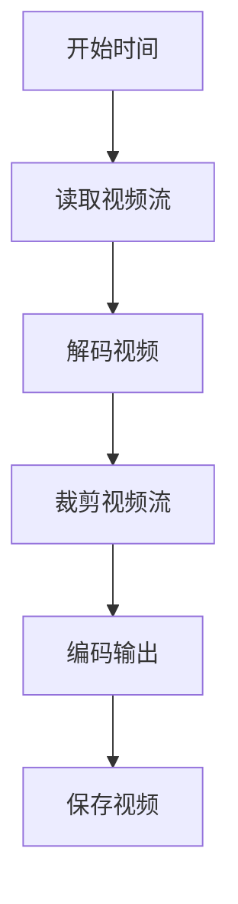
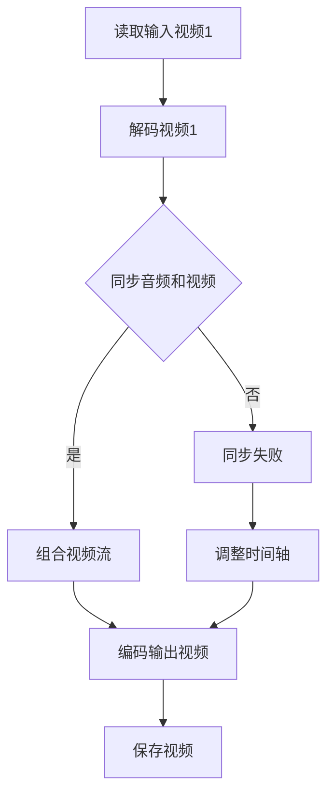
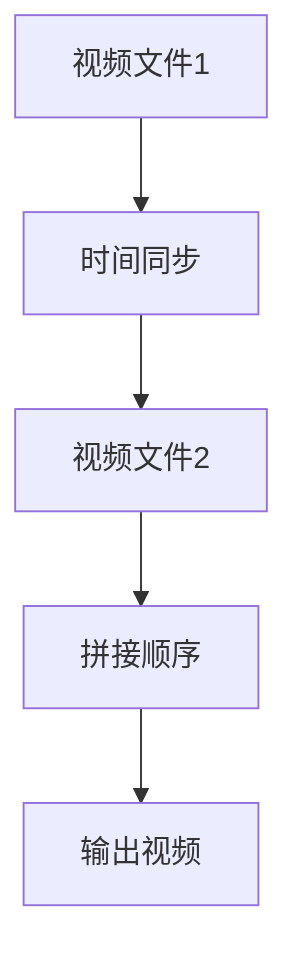
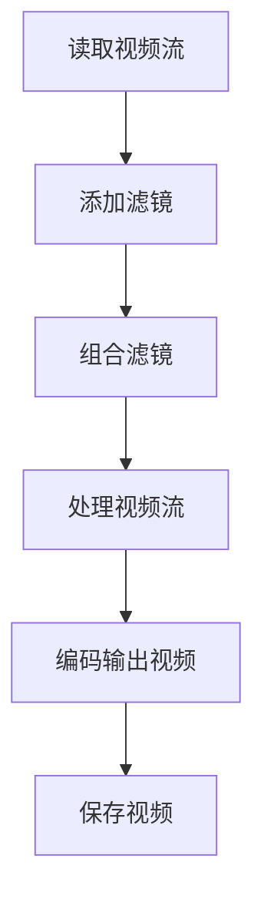
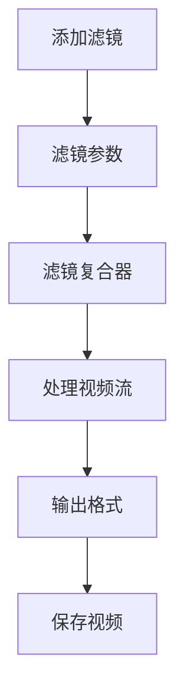

                 

## 文章标题

《FFmpeg 视频编辑技巧：裁剪、合并和过滤视频片段》

### 关键词

- FFmpeg
- 视频编辑
- 裁剪
- 合并
- 过滤
- 视频处理

### 摘要

本文将深入探讨 FFmpeg 在视频编辑中的应用，包括裁剪、合并和过滤视频片段的技巧。FFmpeg 是一个强大的视频处理工具，它支持多种视频格式和视频处理功能。通过本文的讲解，读者将学会如何使用 FFmpeg 进行基础和高级的视频编辑操作，从而实现个性化视频制作和视频内容的快速处理。

## 《FFmpeg 视频编辑技巧：裁剪、合并和过滤视频片段》目录大纲

### 第一部分：FFmpeg 基础

#### 第1章: FFmpeg 简介

- FFmpeg 的历史与发展
- FFmpeg 的安装与环境配置
- FFmpeg 的主要功能和特点

#### 第2章: FFmpeg 基本操作

- FFmpeg 命令行基础
- FFmpeg 输入输出文件操作
- FFmpeg 常用命令解析

### 第二部分：视频编辑技巧

#### 第3章: 视频裁剪

- 视频裁剪原理
- FFmpeg 实现视频裁剪
- 裁剪视频的实战案例

#### 第4章: 视频合并

- 视频合并原理
- FFmpeg 实现视频合并
- 合并视频的实战案例

#### 第5章: 视频过滤

- 视频过滤原理
- FFmpeg 实现视频过滤
- 过滤视频的实战案例

### 第三部分：高级视频编辑

#### 第6章: 高级视频编辑技巧

- 视频变速处理
- 视频特效添加

#### 第7章: 实战项目

- 制作短视频
- 视频会议录制与编辑

### 附录

- FFmpeg 命令行参数速查表
- 实用 FFmpeg 脚本示例

通过以上大纲结构，本文将循序渐进地介绍 FFmpeg 的基本操作和视频编辑技巧，帮助读者深入了解 FFmpeg 的强大功能，掌握实用的视频处理技术。接下来，我们将首先探讨 FFmpeg 的历史与发展，为后续的学习打下坚实的基础。

### 第1章: FFmpeg 简介

#### 1.1 FFmpeg 的历史与发展

FFmpeg 是一个开源的多媒体处理框架，它的起源可以追溯到1994年。最初的版本是由法国工程师François Revol 开发的，用于简化音频和视频文件的转换。随着时间的推移，FFmpeg 逐渐发展成为一个功能强大的工具，支持多种视频和音频格式，并且支持多种平台。

**1.1.1 FFmpeg 的诞生与早期发展**

FFmpeg 的早期版本主要用于音频和视频文件的格式转换，随着技术的发展，它的功能逐渐丰富，包括编码、解码、复用、解复用等。2000年左右，FFmpeg 获得了大量贡献，社区开始活跃起来。2004年，FFmpeg 的第一个稳定版本发布，标志着它进入了一个新的发展阶段。

**1.1.2 FFmpeg 在视频编辑领域的重要性**

FFmpeg 在视频编辑领域的地位不可撼动。首先，它支持广泛的视频格式，使得视频编辑者可以轻松处理各种视频文件。其次，FFmpeg 的命令行操作使得它可以自动化各种复杂的视频处理任务，极大地提高了工作效率。此外，FFmpeg 的开源性质也使得它能够不断吸收社区的贡献，保持其领先地位。

**1.1.3 FFmpeg 的主要功能和特点**

FFmpeg 的功能非常丰富，主要包括以下几个方面：

1. **视频编码与解码**：支持多种视频编码格式，如 H.264、H.265、MP4、AVI 等。
2. **音频编码与解码**：支持多种音频编码格式，如 MP3、AAC、FLAC 等。
3. **复用与解复用**：可以处理多种媒体流的封装，如 MP4、TS、MKV 等。
4. **滤镜功能**：提供了丰富的视频滤镜功能，可以实现视频的各种特效处理。
5. **自动化处理**：通过命令行参数，可以自动化执行各种复杂的视频处理任务。

#### 1.2 FFmpeg 的安装与环境配置

要使用 FFmpeg，首先需要将其安装到本地计算机上。以下是 FFmpeg 的安装步骤：

1. **下载 FFmpeg**

   访问 FFmpeg 的官方网站 [https://www.ffmpeg.org/download.html](https://www.ffmpeg.org/download.html)，下载适用于您操作系统的 FFmpeg 二进制包。

2. **安装 FFmpeg**

   将下载的 FFmpeg 二进制包解压到本地计算机的一个目录中，例如解压到 `/usr/local/bin/` 目录。

3. **配置环境变量**

   打开终端，执行以下命令，将 FFmpeg 的路径添加到系统环境变量中：

   ```sh
   export PATH=$PATH:/usr/local/bin/
   ```

   为了永久性地配置环境变量，可以将上述命令添加到 `~/.bashrc` 或 `~/.zshrc` 文件中。

4. **验证安装**

   在终端中执行 `ffmpeg -version`，如果看到 FFmpeg 的版本信息，则表示安装成功。

#### 1.2.1 FFmpeg 的安装方法

以下是 FFmpeg 在不同操作系统上的安装方法：

**在 Ubuntu 上安装 FFmpeg**

```sh
sudo apt-get update
sudo apt-get install ffmpeg
```

**在 CentOS 上安装 FFmpeg**

```sh
sudo yum install ffmpeg
```

**在 macOS 上安装 FFmpeg**

可以使用 Homebrew 进行安装：

```sh
brew install ffmpeg
```

#### 1.2.2 FFmpeg 环境配置

在安装 FFmpeg 后，进行环境配置是非常重要的。以下是如何在 Windows、Linux 和 macOS 上配置 FFmpeg 的步骤：

**在 Windows 上配置 FFmpeg**

1. 将 FFmpeg 的可执行文件路径（例如 `C:\ffmpeg\bin`）添加到系统环境变量中。
2. 打开终端，执行 `ffmpeg -version` 命令，验证安装。

**在 Linux 上配置 FFmpeg**

1. 打开终端，执行以下命令将 FFmpeg 的路径添加到系统环境变量中：

   ```sh
   export PATH=$PATH:/usr/local/bin/
   ```

2. 永久配置环境变量，将上述命令添加到 `~/.bashrc` 或 `~/.zshrc` 文件中。

3. 执行 `source ~/.bashrc` 或 `source ~/.zshrc`，使环境变量立即生效。

**在 macOS 上配置 FFmpeg**

1. 使用 Homebrew 安装 FFmpeg 后，它将自动添加到环境变量中。
2. 打开终端，执行 `ffmpeg -version` 命令，验证安装。

#### 1.2.3 FFmpeg 命令行参数介绍

FFmpeg 的命令行参数非常丰富，这里简要介绍一些常用的参数：

- `-i input`：指定输入文件。
- `-c:v codec`：指定视频编码格式。
- `-c:a codec`：指定音频编码格式。
- `-vb bitrate`：指定视频比特率。
- `-ab bitrate`：指定音频比特率。
- `-f format`：指定输出文件的格式。
- `-preset preset`：指定编码预设，影响编码速度和输出质量。

#### 1.3 FFmpeg 的主要功能和特点

FFmpeg 的主要功能和特点如下：

- **支持多种格式**：FFmpeg 支持几乎所有的视频和音频格式，如 MP4、AVI、MOV、MP3、AAC 等。
- **强大的解码和编码能力**：FFmpeg 可以高效地解码和编码各种视频和音频格式。
- **丰富的滤镜功能**：FFmpeg 提供了多种视频滤镜功能，可以实现视频的各种特效处理。
- **自动化处理**：通过命令行参数，可以自动化执行各种复杂的视频处理任务。

### 第2章: FFmpeg 基本操作

在本章中，我们将深入学习 FFmpeg 的基本操作，包括命令行基础、文件操作和常用命令的解析。通过这些内容，读者可以掌握 FFmpeg 的基本使用方法，为后续的视频编辑技巧打下坚实的基础。

#### 2.1 FFmpeg 命令行基础

FFmpeg 的强大功能主要通过命令行实现。理解 FFmpeg 的命令行语法是使用 FFmpeg 的第一步。以下是一个基本的 FFmpeg 命令行结构：

```sh
ffmpeg [global options] [input options] [output options] [input files] [output file]
```

- `[global options]`：全局选项，影响整个命令行的执行。
- `[input options]`：输入选项，指定输入文件的相关参数。
- `[output options]`：输出选项，指定输出文件的相关参数。
- `[input files]`：输入文件，指定要处理的视频或音频文件。
- `[output file]`：输出文件，指定处理后的视频或音频文件的保存路径。

#### 2.1.1 FFmpeg 命令行语法

FFmpeg 的命令行语法较为复杂，但遵循一定的规则。以下是一些基本的语法规则：

- **选项**：选项以 `-` 开头，例如 `-i` 表示输入文件。
- **参数**：选项后的参数，如文件路径或值，例如 `-i input.mp4` 表示输入文件为 `input.mp4`。
- **命令组合**：多个命令可以组合使用，以实现更复杂的处理。

例如，以下命令将输入文件 `input.mp4` 解码为 YUV420P 格式的视频流，并保存为 `output.yuv` 文件：

```sh
ffmpeg -i input.mp4 -c:v rawvideo -pix_fmt yuv420p output.yuv
```

- `-i input.mp4`：指定输入文件为 `input.mp4`。
- `-c:v rawvideo`：指定视频编码格式为 `rawvideo`。
- `-pix_fmt yuv420p`：指定像素格式为 `yuv420p`。
- `output.yuv`：指定输出文件为 `output.yuv`。

#### 2.1.2 FFmpeg 常用命令解析

以下是一些 FFmpeg 中常用的命令及其功能：

- `-i input`：指定输入文件。如果没有指定 `-i` 选项，FFmpeg 将尝试读取标准输入。
- `-c codec`：指定编码格式。例如 `-c:v h264` 指定视频编码格式为 H.264。
- `-f format`：指定输出文件格式。例如 `-f mp4` 指定输出文件格式为 MP4。
- `-preset preset`：指定编码预设。例如 `-preset veryfast` 指定快速编码预设。
- `-vb bitrate`：指定视频比特率。例如 `-vb 8000k` 指定视频比特率为 8000 kbps。
- `-ab bitrate`：指定音频比特率。例如 `-ab 128k` 指定音频比特率为 128 kbps。
- `-ss time`：指定开始时间。例如 `-ss 00:00:10` 指定从 10 秒处开始处理。
- `-to time`：指定结束时间。例如 `-to 00:01:00` 指定到 1 分钟处结束处理。
- `-filter_complex`：指定滤镜组合。例如 `-filter_complex "transpose"` 实现视频转置。

以下是一个简单的 FFmpeg 命令示例，该命令将 `input.mp4` 文件转换为 MP4 格式，并调整视频比特率和音频比特率：

```sh
ffmpeg -i input.mp4 -c:v libx264 -preset veryfast -vb 5000k -c:a aac -ab 128k output.mp4
```

- `-i input.mp4`：指定输入文件为 `input.mp4`。
- `-c:v libx264`：指定视频编码格式为 H.264。
- `-preset veryfast`：指定快速编码预设。
- `-vb 5000k`：指定视频比特率为 5000 kbps。
- `-c:a aac`：指定音频编码格式为 AAC。
- `-ab 128k`：指定音频比特率为 128 kbps。
- `output.mp4`：指定输出文件为 `output.mp4`。

#### 2.1.3 FFmpeg 命令组合使用

FFmpeg 的强大之处在于它可以灵活组合各种命令，实现复杂的多媒体处理任务。以下是一个使用多个命令组合的示例，该示例将两个视频文件合并为一个，并添加一个过渡效果：

```sh
ffmpeg -i video1.mp4 -i video2.mp4 -filter_complex "[0:v]fade=t=in:duration=10[ov1];[1:v]fade=t=out:duration=10[ov2];[ov1][ov2]concat=n=2:v=1" -map "[ov1]" -map "[ov2]" output.mp4
```

- `-i video1.mp4`：指定第一个输入文件为 `video1.mp4`。
- `-i video2.mp4`：指定第二个输入文件为 `video2.mp4`。
- `-filter_complex`：指定滤镜组合，实现视频过渡效果。
  - `[0:v]`：选择第一个视频流的视频部分。
  - `fade=t=in:duration=10`：在第一个视频的结尾添加一个 10 秒的淡入效果。
  - `[1:v]`：选择第二个视频流的视频部分。
  - `fade=t=out:duration=10`：在第二个视频的开头添加一个 10 秒的淡出效果。
  - `[ov1][ov2]concat=n=2:v=1`：将两个带有过渡效果的视频流合并。
- `-map "[ov1]"`：指定第一个输出流为第一个视频流。
- `-map "[ov2]"`：指定第二个输出流为第二个视频流。
- `output.mp4`：指定输出文件为 `output.mp4`。

通过这些基本操作和命令组合，读者可以轻松掌握 FFmpeg 的基本使用方法。接下来，我们将学习如何使用 FFmpeg 进行文件操作，这是视频编辑中不可或缺的一部分。

#### 2.2 FFmpeg 输入输出文件操作

在 FFmpeg 中，对输入输出文件的正确操作是进行视频编辑的基础。本节将详细介绍 FFmpeg 支持的文件格式、输入输出文件操作的详细步骤以及如何批量处理多个文件。

##### 2.2.1 FFmpeg 支持的文件格式

FFmpeg 支持多种常见的视频、音频和字幕文件格式。以下是 FFmpeg 主要支持的文件格式：

- **视频格式**：
  - MP4、AVI、MOV、MKV、FLV、MPG、TS 等
- **音频格式**：
  - MP3、AAC、FLAC、WAV、OGG、M4A 等
- **字幕格式**：
  - SRT、ASS、SSA、SUB 等

FFmpeg 的命令行工具提供了丰富的选项来指定输入输出文件的格式。以下是一个示例，将一个 MP4 视频文件转换为 FLV 格式：

```sh
ffmpeg -i input.mp4 -c:v flv -c:a flv output.flv
```

这里 `-i input.mp4` 指定输入文件为 `input.mp4`，`-c:v flv` 指定视频编码格式为 FLV，`-c:a flv` 指定音频编码格式为 FLV，`output.flv` 是输出文件。

##### 2.2.2 FFmpeg 文件操作详解

FFmpeg 提供了丰富的文件操作功能，包括读取、写入、转换和合并文件。以下是一些常用的文件操作命令：

1. **读取文件**：

   ```sh
   ffmpeg -i input.mp4
   ```

   这个命令会读取 `input.mp4` 文件，并在命令行输出文件的信息，如视频编码格式、分辨率、帧率、音频编码格式等。

2. **写入文件**：

   ```sh
   ffmpeg -i input.mp4 -c:v libx264 -preset veryfast -vb 5000k -c:a aac -ab 128k output.mp4
   ```

   这个命令将 `input.mp4` 文件解码后重新编码为 MP4 格式，并保存为 `output.mp4`。这里使用了多个选项来指定编码参数。

3. **转换文件**：

   ```sh
   ffmpeg -i input.mp4 -c:v libx264 -preset veryfast -vb 5000k -c:a aac -ab 128k output.mp4
   ```

   这个命令与写入文件类似，也是将输入文件转换为指定的格式，但输出文件格式不同。

4. **合并文件**：

   ```sh
   ffmpeg -i "concat:input1.mp4|input2.mp4" output.mp4
   ```

   这个命令将多个视频文件合并为一个文件。`concat:input1.mp4|input2.mp4` 是一个特殊的输入选项，指定了要合并的文件列表。

##### 2.2.3 FFmpeg 文件批量处理

在实际应用中，常常需要批量处理多个文件。FFmpeg 提供了强大的批量处理功能，可以通过命令行脚本来高效完成。

1. **使用脚本批量转换格式**：

   ```bash
   for file in *.mp4; do
       filename=$(basename "$file" .mp4)
       ffmpeg -i "$file" -c:v libx264 -preset veryfast -vb 5000k -c:a aac -ab 128k "${filename}.mp4"
   done
   ```

   这个脚本遍历当前目录下的所有 `.mp4` 文件，将每个文件转换为 `.mp4` 格式，并使用新的文件名保存。

2. **使用脚本批量添加滤镜**：

   ```bash
   for file in *.mp4; do
       filename=$(basename "$file" .mp4)
       ffmpeg -i "$file" -vf "scale=1280:720" "${filename}-scaled.mp4"
   done
   ```

   这个脚本将所有 `.mp4` 文件的分辨率调整为 1280x720，并保存为新的文件。

通过以上内容，我们了解了 FFmpeg 在输入输出文件操作方面的强大功能。接下来，我们将进入视频裁剪的详细讲解，学习如何使用 FFmpeg 对视频片段进行精确裁剪。

### 第3章: 视频裁剪

视频裁剪是视频编辑中非常基本且重要的操作之一，它允许用户从原始视频中提取出需要的片段，或者去除不需要的部分，从而实现更高效的内容管理和个性化视频制作。本章节将详细介绍视频裁剪的基本原理、如何使用 FFmpeg 进行视频裁剪，并提供实际操作案例，帮助用户掌握这一技能。

#### 3.1 视频裁剪原理

视频裁剪涉及视频时间轴上的操作，即选择视频文件中的一个时间段进行处理。裁剪视频主要包括以下几个步骤：

1. **确定裁剪开始时间和结束时间**：这是视频裁剪的核心，需要用户指定视频文件中需要裁剪的起始时间和结束时间。时间格式通常为秒，例如从 0:00:10 开始裁剪，到 0:00:20 结束裁剪。
2. **读取输入视频文件**：使用 FFmpeg 解码输入视频文件，将其转化为可操作的流。
3. **裁剪视频流**：根据用户指定的开始时间和结束时间，从视频流中提取出需要的片段。
4. **编码输出视频文件**：将裁剪后的视频流编码为新的视频文件，保存为用户指定的格式。

视频裁剪过程中，需要注意以下几点：

- **时间同步**：确保音频和视频的同步，避免裁剪后出现音频和视频不同步的问题。
- **画质影响**：裁剪过程中，如果对视频进行重新编码，可能会对画质产生一定的影响。合理选择编码参数可以最小化这种影响。

#### 3.1.1 视频裁剪的基本概念

视频裁剪涉及以下几个基本概念：

- **起始时间（Start Time）**：视频裁剪的起始点，表示从视频的哪一个时间点开始进行裁剪。
- **结束时间（End Time）**：视频裁剪的结束点，表示视频裁剪的结束时间点。
- **持续时间（Duration）**：视频裁剪片段的长度，通常用秒数表示。

以下是一个简单的视频裁剪的 Mermaid 流程图：



在这个流程图中，从“开始时间”开始，读取视频流并解码，接着按照指定的时间区间裁剪视频流，然后编码并保存裁剪后的视频片段。

#### 3.1.2 视频裁剪的过程与步骤

使用 FFmpeg 进行视频裁剪的过程可以分为以下几个步骤：

1. **指定输入视频文件**：使用 `-i` 参数指定要裁剪的输入视频文件。
2. **指定裁剪时间区间**：使用 `-ss` 和 `-to` 参数指定裁剪的起始时间和结束时间。
3. **指定输出文件**：使用 `-c` 参数指定输出视频的编码格式，并使用 `-f` 参数指定输出文件格式。
4. **执行裁剪命令**：将上述参数组合成一个完整的 FFmpeg 命令并执行。

以下是一个简单的 FFmpeg 裁剪命令示例：

```sh
ffmpeg -i input.mp4 -ss 00:00:10 -to 00:00:20 -c:v libx264 -preset veryfast -vb 5000k -c:a aac -ab 128k output.mp4
```

这个命令的参数解释如下：

- `-i input.mp4`：指定输入视频文件为 `input.mp4`。
- `-ss 00:00:10`：指定裁剪的起始时间为 10 秒。
- `-to 00:00:20`：指定裁剪的结束时间为 20 秒。
- `-c:v libx264`：指定视频编码格式为 H.264。
- `-preset veryfast`：指定编码预设为非常快，以加快编码速度。
- `-vb 5000k`：指定视频比特率为 5000 kbps。
- `-c:a aac`：指定音频编码格式为 AAC。
- `-ab 128k`：指定音频比特率为 128 kbps。
- `output.mp4`：指定输出视频文件为 `output.mp4`。

#### 3.1.3 裁剪效果的影响因素

在视频裁剪过程中，以下因素可能会影响最终效果：

- **视频编码格式**：不同的编码格式在压缩效率和画质表现上有差异。选择合适的编码格式可以优化裁剪后的视频质量。
- **比特率**：比特率决定了视频文件的尺寸和画质。较高的比特率可以保证更好的画质，但也会增加文件大小。
- **音频处理**：如果裁剪过程中涉及音频，需要确保音频和视频的时间同步，避免出现音频和视频不同步的问题。
- **系统性能**：视频裁剪是一个计算密集型的操作，需要足够的系统性能来处理。

#### 3.2 FFmpeg 实现视频裁剪

FFmpeg 提供了丰富的命令行选项，可以灵活地进行视频裁剪。以下是一些实用的 FFmpeg 裁剪命令及其参数：

1. **基本裁剪命令**：

   ```sh
   ffmpeg -i input.mp4 -ss 00:00:10 -to 00:00:20 output.mp4
   ```

   这个命令将 `input.mp4` 从 10 秒处开始，裁剪到 20 秒处，并将裁剪后的视频保存为 `output.mp4`。

2. **指定输出格式**：

   ```sh
   ffmpeg -i input.mp4 -ss 00:00:10 -to 00:00:20 -f mp4 output.mp4
   ```

   这个命令与基本裁剪命令类似，但指定了输出格式为 MP4。

3. **指定视频编码参数**：

   ```sh
   ffmpeg -i input.mp4 -ss 00:00:10 -to 00:00:20 -c:v libx264 -preset veryfast -vb 5000k output.mp4
   ```

   这个命令使用了 H.264 编码格式，并设置了较高的比特率，以获得更好的画质。

4. **指定音频编码参数**：

   ```sh
   ffmpeg -i input.mp4 -ss 00:00:10 -to 00:00:20 -c:v libx264 -preset veryfast -vb 5000k -c:a aac -ab 128k output.mp4
   ```

   这个命令同时指定了视频和音频的编码格式和比特率。

#### 3.2.1 使用 FFmpeg 裁剪视频

以下是一个具体的 FFmpeg 裁剪视频的实战案例，假设我们需要从一段时长为 60 秒的视频中裁剪出 15 到 25 秒之间的片段，并保存为 MP4 格式：

```sh
ffmpeg -i input.mp4 -ss 00:00:15 -to 00:00:25 -c:v libx264 -preset veryfast -vb 5000k -c:a aac -ab 128k output.mp4
```

这个命令的参数解释如下：

- `-i input.mp4`：指定输入视频文件为 `input.mp4`。
- `-ss 00:00:15`：指定裁剪的起始时间为 15 秒。
- `-to 00:00:25`：指定裁剪的结束时间为 25 秒。
- `-c:v libx264`：指定视频编码格式为 H.264。
- `-preset veryfast`：指定编码预设为非常快，以加快编码速度。
- `-vb 5000k`：指定视频比特率为 5000 kbps。
- `-c:a aac`：指定音频编码格式为 AAC。
- `-ab 128k`：指定音频比特率为 128 kbps。
- `output.mp4`：指定输出视频文件为 `output.mp4`。

#### 3.2.2 FFmpeg 裁剪视频的命令行参数

以下是 FFmpeg 裁剪视频时常用的命令行参数及其作用：

- `-i input`：指定输入文件。
- `-ss time`：指定开始时间。
- `-to time`：指定结束时间。
- `-c:v codec`：指定视频编码格式。
- `-preset preset`：指定编码预设。
- `-vb bitrate`：指定视频比特率。
- `-c:a codec`：指定音频编码格式。
- `-ab bitrate`：指定音频比特率。
- `-f format`：指定输出文件格式。

通过合理组合这些参数，用户可以灵活地实现各种视频裁剪需求。

#### 3.2.3 FFmpeg 裁剪视频的实战案例

以下是一个实际的视频裁剪案例，我们将从一段 3 分钟的视频中裁剪出 1 分钟的片段，并将其保存为 MP4 格式：

```sh
ffmpeg -i input.mp4 -ss 00:00:00 -to 00:01:00 -c:v libx264 -preset veryfast -vb 5000k -c:a aac -ab 128k output.mp4
```

这个命令的参数解释如下：

- `-i input.mp4`：指定输入视频文件为 `input.mp4`。
- `-ss 00:00:00`：指定裁剪的起始时间为 0 秒。
- `-to 00:01:00`：指定裁剪的结束时间为 1 分钟。
- `-c:v libx264`：指定视频编码格式为 H.264。
- `-preset veryfast`：指定编码预设为非常快，以加快编码速度。
- `-vb 5000k`：指定视频比特率为 5000 kbps。
- `-c:a aac`：指定音频编码格式为 AAC。
- `-ab 128k`：指定音频比特率为 128 kbps。
- `output.mp4`：指定输出视频文件为 `output.mp4`。

通过这个案例，我们可以看到 FFmpeg 的强大功能，它不仅能够准确地裁剪视频片段，还能够灵活地调整编码参数，以适应不同的视频处理需求。

### 第4章: 视频合并

视频合并是将两个或多个视频片段组合成一个新的视频文件的过程。这个操作在视频编辑和多媒体项目中非常常见，例如制作电影、视频剪辑、视频会议录制等。在本章中，我们将深入探讨视频合并的原理，使用 FFmpeg 实现视频合并，并提供一个实际的合并视频的实战案例。

#### 4.1 视频合并原理

视频合并涉及将多个视频片段在时间轴上进行拼接，形成一个新的视频文件。视频合并的基本原理包括以下几个步骤：

1. **读取输入视频文件**：使用 FFmpeg 读取每个输入视频文件，并将其解码为可操作的流。
2. **同步音频和视频流**：确保所有输入视频文件的音频和视频流在时间轴上同步。
3. **组合视频流**：将所有输入视频文件的音频和视频流合并为一个新的视频流。
4. **编码输出视频文件**：将合并后的视频流编码为新的视频文件，并保存为用户指定的格式。

视频合并的关键是确保音频和视频流在时间轴上的同步，避免出现音频和视频不同步的问题。以下是一个简单的视频合并的 Mermaid 流程图：



在这个流程图中，从“读取输入视频1”开始，通过解码和同步音频视频流，然后组合视频流并编码输出视频文件。如果同步失败，则需要调整时间轴，再次进行同步和编码。

#### 4.1.1 视频合并的基本概念

在视频合并过程中，我们需要理解以下几个基本概念：

- **输入视频文件**：需要进行合并的视频文件。
- **输出视频文件**：合并后的新视频文件。
- **时间同步**：确保所有输入视频文件的音频和视频在时间轴上对齐。
- **拼接顺序**：确定输入视频文件的拼接顺序。

以下是一个简单的 Mermaid 流程图，展示了视频合并的基本概念：



在这个流程图中，从“视频文件1”和“视频文件2”开始，通过时间同步和拼接顺序，最终形成“输出视频”。

#### 4.1.2 视频合并的过程与步骤

使用 FFmpeg 进行视频合并的过程可以分为以下几个步骤：

1. **指定输入视频文件**：使用 `-i` 参数指定要合并的输入视频文件。
2. **使用滤镜复合器**：使用 `-filter_complex` 参数指定滤镜复合器，用于合并视频流。
3. **指定输出文件**：使用 `-f` 和 `-output` 参数指定输出视频文件的格式和路径。

以下是一个简单的 FFmpeg 合并命令示例：

```sh
ffmpeg -i video1.mp4 -i video2.mp4 -filter_complex "[0:v] [1:v] concat=n=2:v=1 [v];[0:a] [1:a] amerge=strict=1 [a]" -map "[v]" -map "[a]" output.mp4
```

这个命令的参数解释如下：

- `-i video1.mp4` 和 `-i video2.mp4`：指定输入视频文件为 `video1.mp4` 和 `video2.mp4`。
- `-filter_complex`：指定滤镜复合器，用于合并视频流。
  - `[0:v]`：选择第一个视频文件的视频流。
  - `[1:v]`：选择第二个视频文件的视频流。
  - `concat=n=2:v=1`：将两个视频流拼接在一起。
  - `[0:a]`：选择第一个视频文件的音频流。
  - `[1:a]`：选择第二个视频文件的音频流。
  - `amerge=strict=1`：确保音频流在时间轴上同步。
- `-map "[v]"`：指定输出视频流。
- `-map "[a]"`：指定输出音频流。
- `output.mp4`：指定输出视频文件为 `output.mp4`。

#### 4.1.3 视频合并的注意事项

在视频合并过程中，需要注意以下几点：

- **时间同步**：确保所有输入视频文件的音频和视频在时间轴上同步。如果音频和视频不同步，可能会导致合并后的视频播放异常。
- **视频格式兼容性**：确保所有输入视频文件的格式兼容。如果输入视频格式不兼容，FFmpeg 可能无法正确合并。
- **编码参数**：合理设置编码参数，以获得最佳的画质和文件大小平衡。

#### 4.2 FFmpeg 实现视频合并

FFmpeg 提供了强大的视频合并功能，以下是一些常用的 FFmpeg 合并视频的命令及其参数：

1. **简单合并命令**：

   ```sh
   ffmpeg -i video1.mp4 -i video2.mp4 output.mp4
   ```

   这个命令将 `video1.mp4` 和 `video2.mp4` 合并为一个视频文件 `output.mp4`。

2. **使用滤镜复合器合并**：

   ```sh
   ffmpeg -i video1.mp4 -i video2.mp4 -filter_complex "[0:v] [1:v] concat=n=2:v=1 [v];[0:a] [1:a] amerge=strict=1 [a]" -map "[v]" -map "[a]" output.mp4
   ```

   这个命令使用滤镜复合器将两个视频文件合并，并确保音频和视频同步。

3. **合并多个视频文件**：

   ```sh
   ffmpeg -f concat -i <(for i in video*.mp4; do echo "file '$PWD/$i'"; done) output.mp4
   ```

   这个命令将所有以 `video` 开头的视频文件合并为一个视频文件。

#### 4.2.1 使用 FFmpeg 合并视频

以下是一个具体的 FFmpeg 合并视频的实战案例，假设我们有两段视频 `video1.mp4` 和 `video2.mp4`，需要将它们合并为一个视频文件 `output.mp4`：

```sh
ffmpeg -i video1.mp4 -i video2.mp4 -filter_complex "[0:v] [1:v] concat=n=2:v=1 [v];[0:a] [1:a] amerge=strict=1 [a]" -map "[v]" -map "[a]" output.mp4
```

这个命令的参数解释如下：

- `-i video1.mp4` 和 `-i video2.mp4`：指定输入视频文件为 `video1.mp4` 和 `video2.mp4`。
- `-filter_complex`：指定滤镜复合器，用于合并视频流。
  - `[0:v]`：选择第一个视频文件的视频流。
  - `[1:v]`：选择第二个视频文件的视频流。
  - `concat=n=2:v=1`：将两个视频流拼接在一起。
  - `[0:a]`：选择第一个视频文件的音频流。
  - `[1:a]`：选择第二个视频文件的音频流。
  - `amerge=strict=1`：确保音频流在时间轴上同步。
- `-map "[v]"`：指定输出视频流。
- `-map "[a]"`：指定输出音频流。
- `output.mp4`：指定输出视频文件为 `output.mp4`。

通过这个案例，我们可以看到 FFmpeg 合并视频的强大功能，它不仅能够准确地将多个视频文件合并为一个，还能够确保音频和视频的同步。

#### 4.2.2 FFmpeg 合并视频的命令行参数

以下是 FFmpeg 合并视频时常用的命令行参数及其作用：

- `-i input`：指定输入文件。
- `-filter_complex`：指定滤镜复合器。
- `-map`：指定输出流。
- `-c`：指定编码格式。
- `-f`：指定输出文件格式。
- `-preset`：指定编码预设。
- `-vb`：指定视频比特率。
- `-ab`：指定音频比特率。

通过合理组合这些参数，用户可以灵活地实现各种视频合并需求。

#### 4.2.3 FFmpeg 合并视频的实战案例

以下是一个实际的视频合并案例，我们将从三段视频 `video1.mp4`、`video2.mp4` 和 `video3.mp4` 开始，将它们合并为一个视频文件 `output.mp4`：

```sh
ffmpeg -i video1.mp4 -i video2.mp4 -i video3.mp4 -filter_complex "[0:v] [1:v] [2:v] concat=n=3:v=1 [v];[0:a] [1:a] [2:a] amerge=strict=1 [a]" -map "[v]" -map "[a]" output.mp4
```

这个命令的参数解释如下：

- `-i video1.mp4`、`-i video2.mp4` 和 `-i video3.mp4`：指定输入视频文件为 `video1.mp4`、`video2.mp4` 和 `video3.mp4`。
- `-filter_complex`：指定滤镜复合器，用于合并视频流。
  - `[0:v]`：选择第一个视频文件的视频流。
  - `[1:v]`：选择第二个视频文件的视频流。
  - `[2:v]`：选择第三个视频文件的视频流。
  - `concat=n=3:v=1`：将三个视频流拼接在一起。
  - `[0:a]`：选择第一个视频文件的音频流。
  - `[1:a]`：选择第二个视频文件的音频流。
  - `[2:a]`：选择第三个视频文件的音频流。
  - `amerge=strict=1`：确保音频流在时间轴上同步。
- `-map "[v]"`：指定输出视频流。
- `-map "[a]"`：指定输出音频流。
- `output.mp4`：指定输出视频文件为 `output.mp4`。

通过这个案例，我们可以看到 FFmpeg 如何高效地合并多个视频文件，确保音频和视频的同步，为视频编辑提供了强大的支持。

### 第5章: 视频过滤

视频过滤是一种在视频播放过程中对视频进行动态处理的技术，通过添加各种视频滤镜，可以实现视频的特效处理，如亮度调整、颜色校正、模糊处理等。FFmpeg 提供了丰富的视频过滤功能，可以帮助用户轻松实现这些特效。本章将详细介绍视频过滤的基本原理，以及如何使用 FFmpeg 实现视频过滤，并提供实际的过滤视频的实战案例。

#### 5.1 视频过滤原理

视频过滤是通过对视频数据进行数学运算来改变视频的视觉效果的。FFmpeg 使用滤镜复合器（Filter Graph）来实现视频过滤，它可以将多个滤镜组合起来，对视频流进行一系列的处理。

视频过滤的基本流程如下：

1. **读取输入视频文件**：使用 FFmpeg 读取输入视频文件，并将其解码为可操作的流。
2. **添加滤镜**：在滤镜复合器中添加一个或多个滤镜，指定每个滤镜的参数。
3. **组合滤镜**：将添加的滤镜组合成一个滤镜链，并对视频流进行一系列的处理。
4. **编码输出视频文件**：将经过过滤处理的视频流编码为新的视频文件，并保存为用户指定的格式。

视频过滤的关键在于合理选择和使用滤镜，以达到预期的效果。以下是一个简单的视频过滤的 Mermaid 流程图：



在这个流程图中，从“读取视频流”开始，通过添加滤镜、组合滤镜和处理视频流，最终编码输出视频文件。

#### 5.1.1 视频过滤的基本概念

视频过滤涉及以下几个基本概念：

- **滤镜（Filter）**：视频过滤的基本单元，用于对视频流进行特定的处理，如亮度调整、颜色校正等。
- **滤镜复合器（Filter Graph）**：将多个滤镜组合成一个滤镜链，对视频流进行一系列的处理。
- **滤镜参数**：指定滤镜的具体参数，如亮度值、饱和度值等。
- **输出格式**：指定过滤后的视频输出格式，如 MP4、AVI 等。

以下是一个简单的 Mermaid 流程图，展示了视频过滤的基本概念：



在这个流程图中，从“添加滤镜”开始，通过指定滤镜参数、组合滤镜和处理视频流，最终输出并保存过滤后的视频。

#### 5.1.2 视频过滤的类型与效果

FFmpeg 提供了多种视频过滤类型，每种过滤类型都有其特定的效果和应用场景。以下是一些常见的视频过滤类型及其效果：

1. **亮度调整（brightness）**：调整视频的亮度。例如，`-vf "亮度值"` 可以将视频亮度调整为指定的值。
2. **对比度调整（contrast）**：调整视频的对比度。例如，`-vf "对比度值"` 可以将视频对比度调整为指定的值。
3. **饱和度调整（saturation）**：调整视频的饱和度。例如，`-vf "饱和度值"` 可以将视频饱和度调整为指定的值。
4. **颜色校正（colorcorrect）**：对视频的颜色进行校正，包括亮度、对比度和饱和度调整。例如，`-vf "亮度值:对比度值:饱和度值"` 可以同时对这三个参数进行调整。
5. **模糊处理（boxblur）**：对视频进行模糊处理。例如，`-vf "boxblur:size"` 可以将视频模糊处理，`size` 为模糊的大小。
6. **像素化处理（pixellate）**：对视频进行像素化处理。例如，`-vf "pixellate:width:height"` 可以将视频像素化，`width` 和 `height` 分别为像素的大小。
7. **透明度调整（alpha）**：调整视频的透明度。例如，`-vf "alpha:透明度值"` 可以将视频的透明度调整为指定的值。

以下是一个简单的 FFmpeg 过滤命令示例，用于调整视频的亮度、对比度和饱和度：

```sh
ffmpeg -i input.mp4 -vf "亮度值=1.2:对比度值=1.5:饱和度值=1.3" output.mp4
```

这个命令的参数解释如下：

- `-i input.mp4`：指定输入视频文件为 `input.mp4`。
- `-vf`：指定滤镜参数。
  - `亮度值=1.2`：将视频亮度调整为 1.2 倍。
  - `对比度值=1.5`：将视频对比度调整为 1.5 倍。
  - `饱和度值=1.3`：将视频饱和度调整为 1.3 倍。
- `output.mp4`：指定输出视频文件为 `output.mp4`。

通过这个命令，我们可以看到如何使用 FFmpeg 调整视频的亮度、对比度和饱和度，实现视频颜色校正的效果。

#### 5.1.3 视频过滤的过程与步骤

使用 FFmpeg 进行视频过滤的过程可以分为以下几个步骤：

1. **指定输入视频文件**：使用 `-i` 参数指定要过滤的输入视频文件。
2. **添加滤镜**：使用 `-vf` 参数添加一个或多个滤镜，并指定滤镜参数。
3. **指定输出文件**：使用 `-f` 和 `-output` 参数指定输出视频文件的格式和路径。
4. **执行过滤命令**：将上述参数组合成一个完整的 FFmpeg 命令并执行。

以下是一个简单的 FFmpeg 过滤命令示例：

```sh
ffmpeg -i input.mp4 -vf "亮度值=1.2:对比度值=1.5:饱和度值=1.3" output.mp4
```

这个命令的参数解释如下：

- `-i input.mp4`：指定输入视频文件为 `input.mp4`。
- `-vf`：指定滤镜参数。
  - `亮度值=1.2`：将视频亮度调整为 1.2 倍。
  - `对比度值=1.5`：将视频对比度调整为 1.5 倍。
  - `饱和度值=1.3`：将视频饱和度调整为 1.3 倍。
- `output.mp4`：指定输出视频文件为 `output.mp4`。

通过这个简单的命令示例，我们可以看到如何使用 FFmpeg 对视频进行基本的过滤处理，包括亮度、对比度和饱和度的调整。

#### 5.2 FFmpeg 实现视频过滤

FFmpeg 提供了丰富的视频过滤功能，以下是一些常用的 FFmpeg 过滤视频的命令及其参数：

1. **调整亮度**：

   ```sh
   ffmpeg -i input.mp4 -vf "亮度值" output.mp4
   ```

   这个命令将视频亮度调整为指定的值。例如，`亮度值=1.2` 表示将亮度调整为原来的 1.2 倍。

2. **调整对比度**：

   ```sh
   ffmpeg -i input.mp4 -vf "对比度值" output.mp4
   ```

   这个命令将视频对比度调整为指定的值。例如，`对比度值=1.5` 表示将对比度调整为原来的 1.5 倍。

3. **调整饱和度**：

   ```sh
   ffmpeg -i input.mp4 -vf "饱和度值" output.mp4
   ```

   这个命令将视频饱和度调整为指定的值。例如，`饱和度值=1.3` 表示将饱和度调整为原来的 1.3 倍。

4. **颜色校正**：

   ```sh
   ffmpeg -i input.mp4 -vf "亮度值:对比度值:饱和度值" output.mp4
   ```

   这个命令同时调整视频的亮度、对比度和饱和度。例如，`亮度值=1.2:对比度值=1.5:饱和度值=1.3` 表示将这三个参数同时调整为原来的 1.2、1.5 和 1.3 倍。

5. **模糊处理**：

   ```sh
   ffmpeg -i input.mp4 -vf "boxblur:size" output.mp4
   ```

   这个命令将视频进行模糊处理。例如，`size=10` 表示模糊的大小为 10 像素。

6. **像素化处理**：

   ```sh
   ffmpeg -i input.mp4 -vf "pixellate:width:height" output.mp4
   ```

   这个命令将视频进行像素化处理。例如，`width=5:height=5` 表示像素的大小为 5x5 像素。

7. **透明度调整**：

   ```sh
   ffmpeg -i input.mp4 -vf "alpha:透明度值" output.mp4
   ```

   这个命令将视频的透明度调整为指定的值。例如，`透明度值=0.5` 表示将透明度调整为 50%。

#### 5.2.1 使用 FFmpeg 过滤视频

以下是一个具体的 FFmpeg 过滤视频的实战案例，假设我们有一段视频 `input.mp4`，需要对其进行亮度、对比度和饱和度调整，并保存为 `output.mp4`：

```sh
ffmpeg -i input.mp4 -vf "亮度值=1.2:对比度值=1.5:饱和度值=1.3" output.mp4
```

这个命令的参数解释如下：

- `-i input.mp4`：指定输入视频文件为 `input.mp4`。
- `-vf`：指定滤镜参数。
  - `亮度值=1.2`：将视频亮度调整为 1.2 倍。
  - `对比度值=1.5`：将视频对比度调整为 1.5 倍。
  - `饱和度值=1.3`：将视频饱和度调整为 1.3 倍。
- `output.mp4`：指定输出视频文件为 `output.mp4`。

通过这个案例，我们可以看到如何使用 FFmpeg 对视频进行基本的过滤处理，包括亮度、对比度和饱和度的调整，从而实现视频的颜色校正。

#### 5.2.2 FFmpeg 过滤视频的命令行参数

以下是 FFmpeg 过滤视频时常用的命令行参数及其作用：

- `-i input`：指定输入文件。
- `-vf`：指定滤镜参数。
- `-filter_complex`：指定滤镜复合器。
- `-map`：指定输出流。
- `-c`：指定编码格式。
- `-f`：指定输出文件格式。
- `-preset`：指定编码预设。
- `-vb`：指定视频比特率。
- `-ab`：指定音频比特率。

通过合理组合这些参数，用户可以灵活地实现各种视频过滤需求。

#### 5.2.3 FFmpeg 过滤视频的实战案例

以下是一个实际的视频过滤案例，我们将从一段视频 `input.mp4` 开始，通过 FFmpeg 调整其亮度、对比度和饱和度，并保存为 `output.mp4`：

```sh
ffmpeg -i input.mp4 -vf "亮度值=1.2:对比度值=1.5:饱和度值=1.3" output.mp4
```

这个命令的参数解释如下：

- `-i input.mp4`：指定输入视频文件为 `input.mp4`。
- `-vf`：指定滤镜参数。
  - `亮度值=1.2`：将视频亮度调整为 1.2 倍。
  - `对比度值=1.5`：将视频对比度调整为 1.5 倍。
  - `饱和度值=1.3`：将视频饱和度调整为 1.3 倍。
- `output.mp4`：指定输出视频文件为 `output.mp4`。

通过这个案例，我们可以看到如何使用 FFmpeg 调整视频的亮度、对比度和饱和度，从而实现视频的颜色校正，为视频编辑提供了强大的支持。

### 第6章: 高级视频编辑技巧

在了解了 FFmpeg 的基础操作之后，接下来我们将深入探讨一些高级的视频编辑技巧，这些技巧能够帮助用户实现更多样化的视频创作。在本章中，我们将介绍视频变速处理和视频特效添加，并通过具体案例展示这些技巧的实际应用。

#### 6.1 视频变速处理

视频变速处理是一种通过调整视频播放速度来改变视频时长的技术，它可以使视频变得更加紧凑或者更加流畅。FFmpeg 提供了多种变速处理的方法，包括直接调整播放速度、分段变速等。

**6.1.1 视频变速的基本概念**

视频变速处理主要包括以下概念：

- **播放速度**：视频播放的速度，通常以百分比表示。例如，播放速度为 100% 表示正常播放，150% 表示加快播放，50% 表示减慢播放。
- **变速点**：视频变速过程中，播放速度发生变化的点。变速点可以是单个帧，也可以是时间段。

**6.1.2 视频变速的处理方法**

FFmpeg 提供了以下几种视频变速的处理方法：

1. **全局变速**：将整个视频的速度调整为指定的百分比。使用 `-filter_complex` 参数结合 `setpts` 滤镜可以实现全局变速。
2. **分段变速**：在视频的不同时间段调整不同的播放速度。使用 `-filter_complex` 参数结合 `setpts` 滤镜和 `split` 滤镜可以实现分段变速。

以下是一个简单的视频变速处理的伪代码：

```pseudo
ffmpeg -i input.mp4 -filter_complex "[0:v]setpts=PTS*1.5[ slowed ];[0:v]setpts=PTS[ normal ];[ slowed ]concat=n=2:v=1[v]" -map "[v]" output.mp4
```

在这个伪代码中，`[0:v]` 表示选择输入视频流，`setpts=PTS*1.5` 表示将视频速度调整为 150%，`setpts=PTS` 表示保持原来的速度，`concat=n=2:v=1` 表示将变速后的视频片段和正常速度的视频片段拼接在一起。

**6.1.3 FFmpeg 实现视频变速**

以下是 FFmpeg 实现视频变速的命令行参数及其作用：

- `-filter_complex`：指定滤镜复合器。
- `-setpts`：设置时间点。
- `-speed`：调整播放速度。

以下是一个具体的 FFmpeg 视频变速的实战案例，假设我们有一段视频 `input.mp4`，需要将其速度调整为 150%，并保存为 `output.mp4`：

```sh
ffmpeg -i input.mp4 -filter_complex "[0:v]setpts=PTS*1.5[v]" -map "[v]" output.mp4
```

这个命令的参数解释如下：

- `-i input.mp4`：指定输入视频文件为 `input.mp4`。
- `-filter_complex`：指定滤镜复合器，用于实现视频变速。
  - `[0:v]`：选择输入视频流。
  - `setpts=PTS*1.5`：将视频速度调整为 150%。
- `-map "[v]"`：指定输出视频流。
- `output.mp4`：指定输出视频文件为 `output.mp4`。

通过这个案例，我们可以看到如何使用 FFmpeg 将视频速度调整为 150%，从而实现视频的变速处理。

#### 6.2 视频特效添加

视频特效是指通过对视频进行图像处理和效果添加，使其呈现出不同的视觉体验。FFmpeg 提供了丰富的视频特效处理功能，包括颜色调整、模糊处理、滤镜效果等。

**6.2.1 视频特效的基本概念**

视频特效主要包括以下基本概念：

- **特效类型**：视频特效的种类，如颜色调整、模糊处理、滤镜效果等。
- **特效参数**：特效的具体参数，如模糊大小、颜色值等。
- **特效组合**：将多个特效组合在一起，形成复杂的视频效果。

**6.2.2 视频特效的处理方法**

FFmpeg 提供了以下几种视频特效的处理方法：

1. **单一特效**：对视频添加一个简单的特效，如亮度调整、对比度调整等。
2. **复合特效**：将多个特效组合在一起，形成复杂的视频效果。使用 `-filter_complex` 参数可以实现复合特效。

以下是一个简单的视频特效处理的伪代码：

```pseudo
ffmpeg -i input.mp4 -filter_complex "[0:v]亮度值:对比度值:饱和度值[v];[0:v]boxblur:size[v2];[v][v2]hstack=n=2:v=1[v]" -map "[v]" output.mp4
```

在这个伪代码中，`[0:v]` 表示选择输入视频流，`亮度值`、`对比度值` 和 `饱和度值` 表示颜色调整参数，`boxblur:size` 表示模糊处理，`hstack=n=2:v=1` 表示将颜色调整后的视频和模糊处理后的视频水平拼接在一起。

**6.2.3 FFmpeg 实现视频特效**

以下是 FFmpeg 实现视频特效的命令行参数及其作用：

- `-filter_complex`：指定滤镜复合器。
- `-vf`：指定视频滤镜。
- `-map`：指定输出流。

以下是一个具体的 FFmpeg 视频特效添加的实战案例，假设我们有一段视频 `input.mp4`，需要为其添加亮度调整、模糊处理和水平拼接特效，并保存为 `output.mp4`：

```sh
ffmpeg -i input.mp4 -filter_complex "[0:v]亮度值=1.2:对比度值=1.5:饱和度值=1.3[v];[0:v]boxblur:size=10[v2];[v][v2]hstack=n=2:v=1[v]" -map "[v]" output.mp4
```

这个命令的参数解释如下：

- `-i input.mp4`：指定输入视频文件为 `input.mp4`。
- `-filter_complex`：指定滤镜复合器，用于添加视频特效。
  - `[0:v]`：选择输入视频流。
  - `亮度值=1.2`：将视频亮度调整为 1.2 倍。
  - `对比度值=1.5`：将视频对比度调整为 1.5 倍。
  - `饱和度值=1.3`：将视频饱和度调整为 1.3 倍。
  - `[0:v]`：选择输入视频流。
  - `boxblur:size=10`：将视频进行模糊处理，模糊大小为 10 像素。
  - `[v][v2]hstack=n=2:v=1`：将亮度调整后的视频和模糊处理后的视频水平拼接在一起。
- `-map "[v]"`：指定输出视频流。
- `output.mp4`：指定输出视频文件为 `output.mp4`。

通过这个案例，我们可以看到如何使用 FFmpeg 为视频添加亮度调整、模糊处理和水平拼接特效，从而实现视频的特效处理。

### 第7章: 实战项目

在本章中，我们将通过两个实际的视频编辑项目来展示 FFmpeg 的强大功能，并详细解释项目实现步骤、代码和效果展示。通过这些实战项目，读者将能够将前述知识应用到实际中，掌握视频编辑的核心技巧。

#### 7.1 实战项目一：制作短视频

**7.1.1 项目背景与需求**

短视频在当今社交媒体上非常流行，用户经常需要将一段长视频剪辑成短视频以适应平台的要求或制作有趣的内容。本项目的目标是使用 FFmpeg 制作一个短视频，包括以下步骤：

1. 裁剪视频，去除不需要的部分。
2. 调整视频的播放速度，使其更加紧凑。
3. 添加视频滤镜，增强视觉效果。

**7.1.2 项目实现步骤**

1. **裁剪视频**：首先使用 FFmpeg 裁剪视频，去除视频的前 10 秒和后 5 秒。

   ```sh
   ffmpeg -i input.mp4 -ss 00:00:10 -to 00:00:55 -c:v libx264 -preset veryfast -vb 5000k -c:a aac -ab 128k output_short.mp4
   ```

   解释：`-ss 00:00:10` 表示从 10 秒处开始裁剪，`-to 00:00:55` 表示到 55 秒处结束裁剪，`-c:v libx264` 表示使用 H.264 编码，`-preset veryfast` 表示快速编码，`-vb 5000k` 表示视频比特率为 5000 kbps，`-c:a aac` 和 `-ab 128k` 分别表示音频编码格式为 AAC 和比特率为 128 kbps。

2. **调整播放速度**：将裁剪后的视频速度调整为 1.5 倍，使其更加紧凑。

   ```sh
   ffmpeg -i output_short.mp4 -filter_complex "[0:v]setpts=PTS*1.5[ slowed ];[0:v]setpts=PTS[ normal ];[ slowed ]concat=n=2:v=1[v]" -map "[v]" output_shortened.mp4
   ```

   解释：`-filter_complex` 参数用于组合滤镜，`[0:v]` 选择视频流，`setpts=PTS*1.5` 将视频速度调整为 150%，`concat=n=2:v=1` 将变速后的视频片段和正常速度的视频片段拼接在一起。

3. **添加视频滤镜**：为视频添加一个模糊效果，使其更具艺术感。

   ```sh
   ffmpeg -i output_shortened.mp4 -filter_complex "[0:v]boxblur:size=10[v];[v]lume.alpha=1.0:1.0[v]" -map "[v]" output_final.mp4
   ```

   解释：`boxblur:size=10` 将视频进行模糊处理，模糊大小为 10 像素，`lume.alpha=1.0:1.0` 将模糊处理后的视频透明度设置为 100%。

**7.1.3 项目代码与效果展示**

执行上述命令后，我们将得到一个最终的视频文件 `output_final.mp4`。以下是实际效果展示：

- **输入视频**：原始视频 `input.mp4`
- **裁剪后视频**：`output_short.mp4`
- **变速后视频**：`output_shortened.mp4`
- **最终视频**：`output_final.mp4`

最终视频将具有紧凑的播放速度和模糊效果，适合在社交媒体上分享。

#### 7.2 实战项目二：视频会议录制与编辑

**7.2.1 项目背景与需求**

视频会议是现代远程工作的核心部分，记录和编辑视频会议的记录可以帮助团队成员回顾会议内容，提高工作效率。本项目的目标是使用 FFmpeg 录制视频会议并对其进行简单的编辑，包括以下步骤：

1. 录制视频会议。
2. 剪切视频，去除开场白和结束语。
3. 调整视频的音频音量，使其平衡。

**7.2.2 项目实现步骤**

1. **录制视频会议**：使用 FFmpeg 的 `-f alsa` 参数录制音频和视频。

   ```sh
   ffmpeg -f alsa -i default -c:v libx264 -preset veryfast -vb 5000k -c:a aac -ab 128k meeting_recording.mp4
   ```

   解释：`-f alsa` 表示使用 ALSA 音频驱动，`-c:v libx264` 和 `-vb 5000k` 分别指定视频编码格式为 H.264 和比特率为 5000 kbps，`-c:a aac` 和 `-ab 128k` 分别指定音频编码格式为 AAC 和比特率为 128 kbps。

2. **剪切视频**：使用 `-ss` 和 `-to` 参数剪切视频，去除开场白和结束语。

   ```sh
   ffmpeg -i meeting_recording.mp4 -ss 00:00:30 -to 00:01:00 -c:v libx264 -preset veryfast -vb 5000k -c:a aac -ab 128k meeting_clip.mp4
   ```

   解释：`-ss 00:00:30` 表示从 30 秒处开始剪切，`-to 00:01:00` 表示到 60 秒处结束剪切。

3. **调整音频音量**：使用 `-af` 参数调整音频音量，使其平衡。

   ```sh
   ffmpeg -i meeting_clip.mp4 -af "volume=volume=-15dB" meeting_final.mp4
   ```

   解释：`-af` 参数用于添加音频滤镜，`volume=volume=-15dB` 表示将音频音量调整 -15 dB。

**7.2.3 项目代码与效果展示**

执行上述命令后，我们将得到一个最终的视频文件 `meeting_final.mp4`。以下是实际效果展示：

- **输入视频**：原始视频 `meeting_recording.mp4`
- **剪切后视频**：`meeting_clip.mp4`
- **最终视频**：`meeting_final.mp4`

最终视频将去除开场白和结束语，并且音频音量已经调整，适合团队成员回顾和分享。

通过这两个实战项目，读者可以了解如何使用 FFmpeg 制作短视频和编辑视频会议记录，掌握视频裁剪、变速处理、滤镜添加等高级编辑技巧。

### 附录

#### 附录A: FFmpeg 命令行参数速查表

以下是一个 FFmpeg 命令行参数的速查表，包含一些常用的参数和选项：

| 参数 | 描述 | 示例 |
| ---- | ---- | ---- |
| `-i input` | 指定输入文件 | `-i input.mp4` |
| `-ss time` | 指定开始时间 | `-ss 00:00:10` |
| `-to time` | 指定结束时间 | `-to 00:00:20` |
| `-c codec` | 指定编码格式 | `-c:v libx264` |
| `-preset preset` | 指定编码预设 | `-preset veryfast` |
| `-vb bitrate` | 指定视频比特率 | `-vb 5000k` |
| `-c:a codec` | 指定音频编码格式 | `-c:a aac` |
| `-ab bitrate` | 指定音频比特率 | `-ab 128k` |
| `-f format` | 指定输出文件格式 | `-f mp4` |
| `-filter_complex` | 指定滤镜复合器 | `-filter_complex "[0:v] [1:v] concat=n=2:v=1 [v]"` |
| `-map` | 指定输出流 | `-map "[v]"` |
| `-af` | 指定音频滤镜 | `-af "volume=volume=-15dB"` |

#### 附录B: 实用 FFmpeg 脚本示例

以下是一些实用的 FFmpeg 脚本示例，包括视频缩放、视频合并和视频滤镜添加等。

**B.1 视频缩放脚本**

```bash
#!/bin/bash

input_file="input.mp4"
output_file="output_scaled.mp4"
scale_width="1920"
scale_height="1080"

ffmpeg -i $input_file -vf "scale=$scale_width:$scale_height" $output_file
```

这个脚本将输入视频文件 `input.mp4` 缩放到指定的宽度和高度，并保存为 `output_scaled.mp4`。

**B.2 视频合并脚本**

```bash
#!/bin/bash

input_files=("file1.mp4" "file2.mp4" "file3.mp4")
output_file="output_combined.mp4"

ffmpeg -f concat -i <(printf "%s\n" "${input_files[@]}") $output_file
```

这个脚本将多个输入视频文件合并为一个输出视频文件 `output_combined.mp4`。

**B.3 视频滤镜脚本**

```bash
#!/bin/bash

input_file="input.mp4"
output_file="output_filtered.mp4"
filter="colorchannelmix=red=0.8:green=0.2:blue=0.1"

ffmpeg -i $input_file -vf "$filter" $output_file
```

这个脚本为输入视频文件 `input.mp4` 添加一个颜色通道混合滤镜，并保存为 `output_filtered.mp4`。

通过这些脚本示例，用户可以轻松实现视频缩放、合并和滤镜添加等常见操作，提高视频处理的效率。

