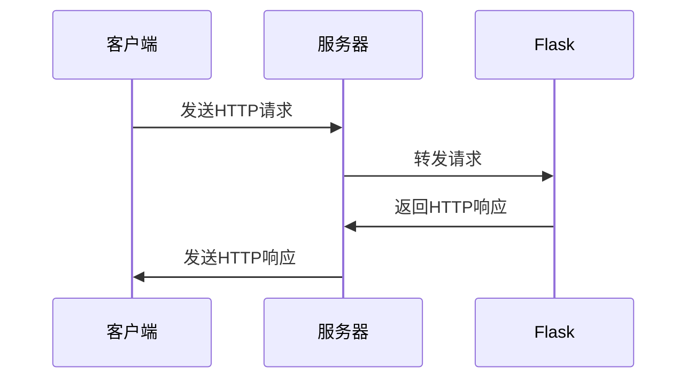
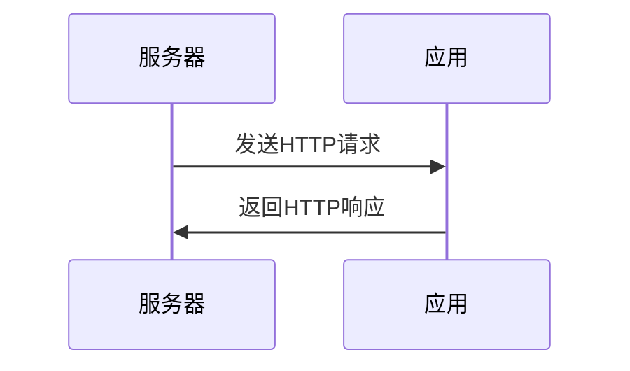
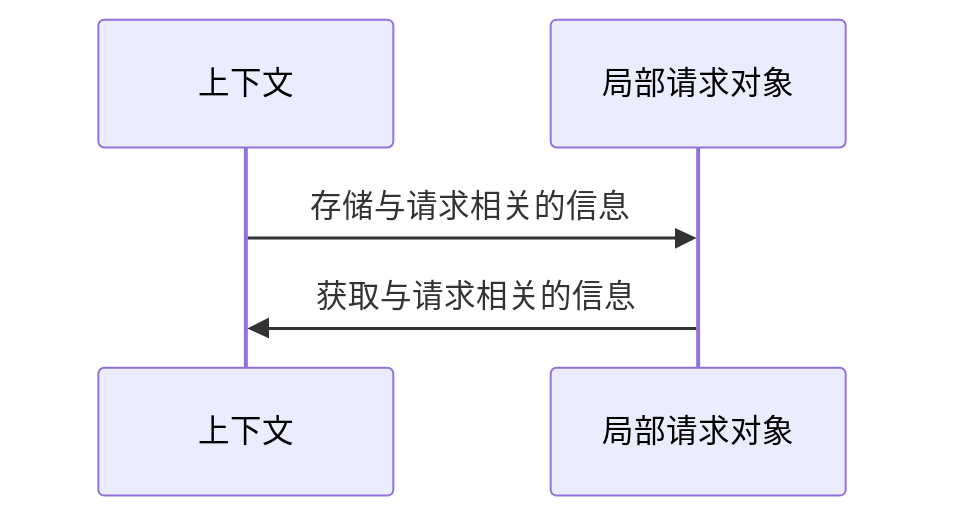

                 

### 《Flask 框架：微型 Python 框架》

> 关键词：Flask、Python Web 框架、Web 开发、微型框架

> 摘要：
Flask是一个轻量级的Python Web框架，因其简单易用和灵活性而受到开发者的青睐。本文将详细介绍Flask框架的基础知识、核心功能、扩展模块及其在实际项目中的应用，旨在帮助读者全面掌握Flask框架的使用。

---

### 前言

随着互联网的飞速发展，Web应用的开发已经成为IT行业的重要组成部分。Python作为一种简单易学且功能强大的编程语言，在Web开发领域拥有广泛的应用。Flask作为Python的Web框架之一，以其轻量级、灵活性和易用性著称，成为了众多开发者青睐的工具。

本文将围绕Flask框架展开，详细探讨其基础知识、核心功能、扩展模块以及在项目中的应用。通过逐步分析和推理，帮助读者深入了解Flask框架的内在机制和实际操作。

### 目录

1. Flask框架基础
   1.1 Flask框架简介
   1.2 Flask的工作原理
   1.3 Flask的基本配置

2. Flask的基础功能
   2.1 路由和视图函数
   2.2 请求与响应
   2.3 请求处理与重定向
   2.4 会话和Cookies管理

3. Flask的扩展模块
   3.1 Flask-ORM模块
   3.2 Flask-WTF模块
   3.3 Flask-Login模块

4. Flask的项目实战
   4.1 小型博客系统实战
   4.2 用户注册与登录系统实战
   4.3 文件上传与下载系统实战

5. Flask的高级应用
   5.1 蓝图的使用
   5.2 跨域请求处理
   5.3 性能优化与调试

6. Flask的安全与部署
   6.1 Flask应用的安全问题
   6.2 Flask应用的部署
   6.3 Flask应用的监控与运维

7. Flask生态与应用
   7.1 Flask生态概述
   7.2 Flask在实际应用中的案例

8. 附录
   8.1 Flask开发常用资源
   8.2 Flask示例代码

---

### 1. Flask框架基础

#### 1.1 Flask框架简介

Flask是一个开源的微型Python Web框架，由Armin Ronacher在2010年首次发布。Flask旨在提供一种简单而灵活的Web开发方式，它允许开发者快速构建小型到中型的Web应用。

Flask框架的主要特点包括：

- **轻量级**：Flask本身非常轻量，没有过多的依赖和配置，使得开发者可以自由地选择所需的库和组件。
- **灵活性**：Flask提供了丰富的扩展接口，允许开发者根据需要灵活地扩展框架的功能。
- **易于学习**：Flask的API简单直观，易于理解和上手。
- **广泛的社区支持**：Flask拥有庞大的社区支持，提供了大量的教程、文档和扩展库，方便开发者学习和使用。

#### 1.1.1 Flask的起源与发展

Flask起源于Armin Ronacher对Python Web开发的需求。当时，Python在Web开发领域还没有像现在这样成熟，大多数开发者选择使用Perl或PHP。Armin Ronacher在开发一个小型Web应用时，发现现有的Python Web框架不够灵活，无法满足他的需求。于是，他决定自己开发一个轻量级的Web框架，这就是Flask的起源。

随着时间的推移，Flask逐渐发展壮大，吸引了越来越多的开发者。社区成员也积极参与，贡献了大量的扩展库和教程。Flask已经成为Python Web开发中不可或缺的一部分。

#### 1.1.2 Flask的特点与优势

Flask具有以下特点与优势：

- **简单易用**：Flask的API设计简单直观，使得开发者可以快速上手。
- **灵活性**：Flask提供了丰富的扩展接口，允许开发者根据需求自由扩展框架功能。
- **可扩展性**：Flask支持第三方库和扩展库，使得开发者可以轻松地集成其他功能。
- **社区支持**：Flask拥有庞大的社区支持，提供了大量的教程、文档和扩展库。

#### 1.1.3 Flask与其他Web框架的比较

在Python Web开发领域，除了Flask之外，还有其他一些知名的Web框架，如Django、Pyramid等。下面简要比较这些框架的特点：

- **Django**：Django是一个全能型框架，提供了完整的开发工具和库，适合快速开发和构建大型项目。
- **Pyramid**：Pyramid是一个灵活的框架，提供了强大的组件和扩展接口，适合构建复杂的项目。

Flask介于Django和Pyramid之间，具有较好的平衡性，适合开发中小型项目。它的轻量级和灵活性使得开发者可以更专注于业务逻辑的实现。

### 1.2 Flask的工作原理

Flask的工作原理主要包括请求-响应流程、WSGI协议和上下文以及局部请求对象。

#### 1.2.1 Flask的请求-响应流程

Flask的请求-响应流程如下：

1. **接收请求**：当客户端发送HTTP请求时，Web服务器（如Gunicorn或uWSGI）将请求转发给Flask应用。
2. **处理请求**：Flask应用解析请求，根据路由规则找到对应的视图函数。
3. **执行视图函数**：视图函数处理请求，可能包括查询数据库、处理表单等操作。
4. **生成响应**：视图函数生成HTTP响应，包括状态码、头部和正文。
5. **发送响应**：Flask将响应发送回Web服务器，Web服务器再将响应发送给客户端。

下面是一个简单的Flask请求-响应流程的Mermaid流程图：



#### 1.2.2 WSGI协议详解

WSGI（Web Server Gateway Interface）是Python Web应用的一个接口标准，定义了Web服务器和Python Web应用之间的交互方式。

WSGI协议的主要组成部分包括：

- **应用**：一个遵循WSGI规范的Python脚本，用于处理HTTP请求和生成HTTP响应。
- **服务器**：一个遵循WSGI规范的Web服务器，用于接收HTTP请求并将请求转发给应用。
- **中间件**：一个位于应用和服务器之间的组件，可以对请求和响应进行预处理或后处理。

下面是一个简单的WSGI协议的Mermaid流程图：



#### 1.2.3 Flask的上下文和局部请求对象

在Flask中，上下文和局部请求对象是处理请求和响应的关键概念。

- **上下文**：上下文是一个存储与请求相关的信息的全局对象。它包含了请求、响应、当前应用等对象。通过上下文，可以在视图函数中访问和处理请求和响应。
- **局部请求对象**：局部请求对象是一个存储与当前请求相关的信息的局部对象。它包含了请求方法、路径、参数等信息。通过局部请求对象，可以获取和处理请求的具体信息。

下面是一个简单的Flask上下文和局部请求对象的Mermaid流程图：



### 1.3 Flask的基本配置

Flask的基本配置主要包括应用的配置、配置文件的加载和处理，以及常见配置参数及其作用。

#### 1.3.1 Flask应用的配置方法

Flask提供了多种配置方法，包括：

- **默认配置**：Flask默认提供了一些基本的配置参数，如项目根目录、模板目录等。
- **环境变量配置**：通过环境变量设置配置参数，方便在不同的环境中使用不同的配置。
- **配置对象配置**：通过配置对象设置配置参数，可以动态地修改配置。
- **配置文件配置**：通过配置文件加载配置参数，可以将配置参数存储在文件中，方便管理。

下面是一个简单的Flask配置示例：

```python
from flask import Flask

app = Flask(__name__)

# 设置配置参数
app.config['SECRET_KEY'] = 'my_secret_key'
app.config['TEMPLATES_AUTO_RELOAD'] = True

# 加载配置文件
app.config.from_object('config.Config')

# 使用配置参数
@app.route('/')
def index():
    return 'Hello, Flask!'
```

#### 1.3.2 配置文件的加载和处理

Flask支持从多个配置文件中加载配置参数。配置文件通常使用Python的配置文件格式，如`.py`或`.ini`。

下面是一个简单的配置文件示例（`config.py`）：

```python
# 默认配置
class Config:
    SECRET_KEY = 'my_secret_key'
    TEMPLATES_AUTO_RELOAD = True

# 开发环境配置
class DevelopmentConfig(Config):
    DEBUG = True
    DATABASE_URI = 'sqlite:///dev.db'

# 生产环境配置
class ProductionConfig(Config):
    DEBUG = False
    DATABASE_URI = 'sqlite:///prod.db'
```

在应用中，可以使用以下代码加载配置文件：

```python
app.config.from_object('config.DevelopmentConfig')
```

#### 1.3.3 常见配置参数及其作用

以下是一些常见的Flask配置参数及其作用：

- **SECRET_KEY**：用于加密会话和表单数据，确保数据的安全性。
- **TEMPLATES_AUTO_RELOAD**：用于启用模板自动重载，便于开发调试。
- **DEBUG**：用于启用调试模式，提供详细的错误信息和调试工具。
- **DATABASE_URI**：用于指定数据库连接地址，支持多种数据库类型。
- **SERVER_NAME**：用于设置应用的主机名和端口号。

### 总结

在本章中，我们介绍了Flask框架的基础知识，包括Flask框架的简介、起源与发展、特点与优势，以及其他Web框架的比较。我们还详细介绍了Flask的工作原理，包括请求-响应流程、WSGI协议和上下文以及局部请求对象。最后，我们探讨了Flask的基本配置方法，包括应用的配置、配置文件的加载和处理，以及常见配置参数及其作用。

通过本章的学习，读者应该对Flask框架有了一个初步的了解，为后续章节的深入学习奠定了基础。在下一章中，我们将探讨Flask的基础功能，包括路由和视图函数、请求与响应、请求处理与重定向，以及会话和Cookies管理。

---

### 2. Flask的基础功能

#### 2.1 路由和视图函数

路由（Routing）是Web应用的核心概念之一，它定义了URL与对应的处理函数之间的关系。在Flask中，路由是通过`route()`装饰器来实现的。

#### 2.1.1 路由的基本概念

路由包括两部分：URL路径和对应的处理函数。当客户端访问应用的某个URL时，Flask会根据路由规则找到对应的处理函数，并执行该函数以生成响应。

路由规则通常包含以下部分：

- **路径**：用于指定URL的地址，可以使用字符串表示。
- **方法**：用于指定请求的方法，如GET、POST等。默认情况下，路由只接受GET请求。

下面是一个简单的路由示例：

```python
from flask import Flask

app = Flask(__name__)

@app.route('/')
def index():
    return 'Hello, Flask!'

@app.route('/about')
def about():
    return 'About Us'
```

在上面的示例中，`index()`函数处理根路径（`/`），`about()`函数处理`/about`路径。

#### 2.1.2 定义路由和视图函数

定义路由和视图函数是构建Flask应用的第一步。路由规则通过`route()`装饰器指定，视图函数是一个用于处理请求并返回响应的函数。

下面是一个更复杂的路由示例，包括路径参数和多种请求方法：

```python
from flask import Flask, request, redirect, url_for

app = Flask(__name__)

@app.route('/')
def index():
    return 'Hello, Flask!'

@app.route('/hello/<name>')
def hello(name):
    return f'Hello, {name}!'

@app.route('/post', methods=['GET', 'POST'])
def post():
    if request.method == 'GET':
        return 'This is a GET request'
    else:
        return 'This is a POST request'
```

在上面的示例中，`hello()`函数接受一个路径参数`name`，`post()`函数处理GET和POST请求。

#### 2.1.3 常用路由规则和参数

Flask支持多种路由规则和参数，以适应不同的URL结构。以下是一些常用的路由规则和参数：

- **普通字符串**：用于匹配普通字符串路径，如`/index`、`/about`等。
- **正则表达式**：用于匹配复杂的路径，如`/user/<int:user_id>`等。
- **可选参数**：用于指定路径的可选部分，如`/post/<int:post_id>/comment/<int:comment_id>`等。
- **路径参数**：用于获取路径中的动态部分，如`/hello/<name>`中的`<name>`。

下面是一个使用正则表达式的路由示例：

```python
@app.route('/user/<int:user_id>', defaults={'page': 1})
@app.route('/user/<int:user_id>/<int:page>')
def user_profile(user_id, page):
    return f'User ID: {user_id}, Page: {page}'
```

在上面的示例中，`user_profile()`函数接受一个整数类型的路径参数`user_id`和一个可选的整数类型路径参数`page`。

#### 2.2 请求与响应

请求（Request）和响应（Response）是Web应用的另一个核心概念。请求表示客户端发送给服务器的信息，响应表示服务器返回给客户端的信息。

#### 2.2.1 请求对象详解

Flask提供了一个请求对象（`request`），用于存储客户端发送的请求信息。请求对象包含以下常用的属性和方法：

- **request.method**：获取请求方法，如GET、POST等。
- **request.url**：获取请求的URL。
- **request.full_path**：获取请求的完整路径，包括查询字符串。
- **request.form**：获取表单数据，适用于POST请求。
- **request.args**：获取查询字符串参数。
- **request.cookies**：获取客户端发送的Cookies。

下面是一个简单的请求对象示例：

```python
from flask import Flask, request

app = Flask(__name__)

@app.route('/form', methods=['GET', 'POST'])
def form():
    if request.method == 'POST':
        username = request.form['username']
        password = request.form['password']
        return f'Username: {username}, Password: {password}'
    return '''
    <form method="post">
        <input type="text" name="username" placeholder="Username">
        <input type="password" name="password" placeholder="Password">
        <button type="submit">Submit</button>
    </form>
    '''
```

在上面的示例中，`form()`函数获取POST请求中的表单数据，并返回用户名和密码。

#### 2.2.2 响应对象详解

Flask提供了一个响应对象（`response`），用于生成服务器返回的响应。响应对象包含以下常用的属性和方法：

- **response.status_code**：设置HTTP状态码，如200（成功）、404（未找到）等。
- **response.headers**：设置HTTP头部，如Content-Type、Set-Cookie等。
- **response.set_cookie**：设置客户端的Cookies。
- **response.redirect**：实现重定向。

下面是一个简单的响应对象示例：

```python
from flask import Flask, response

app = Flask(__name__)

@app.route('/status')
def status():
    return response.Response(
        status=404,
        headers={'Content-Type': 'text/plain'},
        response='Page not found'
    )

@app.route('/redirect')
def redirect():
    return response.redirect(url_for('status'))
```

在上面的示例中，`status()`函数生成一个404响应，`redirect()`函数实现重定向。

#### 2.2.3 响应常见HTTP状态码

HTTP状态码是Web应用中非常重要的概念，用于表示HTTP请求的结果。以下是一些常见的HTTP状态码：

- **200（成功）**：表示请求成功，是大多数请求的正常响应。
- **404（未找到）**：表示请求的资源未找到，通常用于未找到页面。
- **500（内部服务器错误）**：表示服务器在处理请求时发生了错误。

下面是一个使用不同HTTP状态码的示例：

```python
from flask import Flask, abort

app = Flask(__name__)

@app.route('/success')
def success():
    return 'Request successful'

@app.route('/not_found')
def not_found():
    abort(404)

@app.route('/server_error')
def server_error():
    abort(500)
```

在上面的示例中，`success()`函数生成200响应，`not_found()`函数生成404响应，`server_error()`函数生成500响应。

#### 2.3 请求处理与重定向

在Flask中，请求处理和重定向是Web应用中常见的操作。

#### 2.3.1 请求处理流程

请求处理流程包括以下几个步骤：

1. **接收请求**：Web服务器（如Gunicorn或uWSGI）接收客户端的HTTP请求。
2. **路由匹配**：Flask根据路由规则匹配请求的URL，找到对应的视图函数。
3. **执行视图函数**：视图函数处理请求，可能包括查询数据库、处理表单等操作。
4. **生成响应**：视图函数生成HTTP响应，包括状态码、头部和正文。
5. **发送响应**：Flask将响应发送回Web服务器，Web服务器再将响应发送给客户端。

下面是一个简单的请求处理流程的Mermaid流程图：


#### 2.3.2 常用中间件和过滤器

中间件（Middleware）是位于Web服务器和应用之间的组件，可以对请求和响应进行预处理或后处理。Flask提供了多个内置中间件，如Gzip压缩、缓存等。

过滤器（Filter）是用于处理响应的组件，可以用于修改响应的内容或头部。Flask提供了多个内置过滤器，如HTML转义、JSON序列化等。

下面是一个简单的中间件和过滤器示例：

```python
from flask import Flask, make_response

app = Flask(__name__)

@app.before_request
def before_request():
    print('Before request')

@app.after_request
def after_request(response):
    print('After request')
    return response

@app.route('/')
def index():
    return 'Hello, Flask!'

@app.template_filter('uppercase')
def uppercase_filter(text):
    return text.upper()

@app.context_processor
def context_processor():
    return {'current_year': 2023}
```

在上面的示例中，`before_request()`和`after_request()`函数分别用于预处理和后处理请求，`uppercase_filter()`函数用于模板中的文本转换，`context_processor()`函数用于传递全局变量。

#### 2.3.3 重定向的实现与应用

重定向（Redirect）是Web应用中常见的操作，用于将请求从一个URL重定向到另一个URL。

在Flask中，重定向可以通过`redirect()`函数实现。`redirect()`函数接受一个URL或视图函数名称作为参数，并生成一个重定向响应。

下面是一个简单的重定向示例：

```python
from flask import Flask, redirect, url_for

app = Flask(__name__)

@app.route('/home')
def home():
    return 'Home Page'

@app.route('/index')
def index():
    return redirect(url_for('home'))

@app.route('/error')
def error():
    return 'Error Page'
```

在上面的示例中，`index()`函数重定向到`home()`函数，`error()`函数返回一个错误页面。

### 2.4 会话和Cookies管理

会话（Session）和Cookies是Web应用中常用的技术，用于存储用户信息并在多个请求之间保持状态。

#### 2.4.1 会话的概念与机制

会话是Web应用中的一个重要概念，用于在多个请求之间存储和共享用户信息。会话机制通常由Web服务器和浏览器共同维护。

在Flask中，会话是通过内置的会话管理器实现的。会话管理器可以使用多种后端存储，如内存、文件、数据库等。

会话的工作原理如下：

1. **生成会话标识**：Web服务器在用户第一次请求时生成一个唯一的会话标识。
2. **存储会话数据**：Web服务器将会话数据存储在指定的后端存储中。
3. **设置会话标识**：Web服务器将会话标识作为Cookies发送给浏览器。
4. **后续请求**：浏览器在后续请求中携带会话标识，Web服务器根据会话标识获取会话数据。

下面是一个简单的会话示例：

```python
from flask import Flask, session

app = Flask(__name__)

app.secret_key = 'my_secret_key'

@app.route('/login', methods=['GET', 'POST'])
def login():
    username = request.form['username']
    session['username'] = username
    return 'Login successful'

@app.route('/profile')
def profile():
    return f'Hello, {session.get("username", "Guest")}!'
```

在上面的示例中，`login()`函数设置会话变量，`profile()`函数获取并显示会话变量。

#### 2.4.2 Cookies的使用与管理

Cookies是Web服务器在客户端浏览器上存储的小型数据文件，用于在多个请求之间存储和共享用户信息。

在Flask中，Cookies是通过内置的Cookies管理器实现的。Cookies管理器提供了多种设置和获取Cookies的方法。

下面是一个简单的Cookies示例：

```python
from flask import Flask, make_response

app = Flask(__name__)

@app.route('/set_cookie')
def set_cookie():
    response = make_response('Set Cookie')
    response.set_cookie('username', 'admin')
    return response

@app.route('/get_cookie')
def get_cookie():
    username = request.cookies.get('username', 'Guest')
    return f'Hello, {username}!'
```

在上面的示例中，`set_cookie()`函数设置Cookies，`get_cookie()`函数获取并显示Cookies。

#### 2.4.3 常见的安全问题与解决方案

在Web应用中，会话和Cookies管理可能会面临一些安全问题，如会话劫持、Cookies篡改等。以下是一些常见的安全问题和相应的解决方案：

- **会话劫持**：攻击者通过窃取会话标识来冒充用户。解决方案包括使用安全的会话标识生成算法、禁用用户密码的重放攻击等。
- **Cookies篡改**：攻击者通过篡改Cookies来篡改用户信息。解决方案包括使用加密的Cookies、验证Cookies的完整性等。

### 总结

在本章中，我们介绍了Flask的基础功能，包括路由和视图函数、请求与响应、请求处理与重定向，以及会话和Cookies管理。通过这些功能，开发者可以快速构建简单的Web应用。

在下一章中，我们将探讨Flask的扩展模块，包括Flask-ORM、Flask-WTF和Flask-Login等。这些扩展模块提供了丰富的功能，可以大大简化Web应用的开发。

---

### 3. Flask的扩展模块

Flask的扩展模块是Flask框架的强大之处之一，它们为开发者提供了额外的功能和便利。本节将介绍几个常用的Flask扩展模块：Flask-ORM、Flask-WTF和Flask-Login。

#### 3.1 Flask-ORM模块

Flask-ORM是一个对象关系映射（Object-Relational Mapping，ORM）工具，它允许开发者使用Python对象来操作数据库，而不是直接编写SQL语句。ORM工具的主要目的是减少数据库操作的复杂性，提高代码的可维护性。

#### 3.1.1 ORM的基本概念

ORM的基本概念包括：

- **实体（Entity）**：在数据库中对应一张表的实体对象。
- **属性（Attribute）**：实体对象中的属性对应表中的字段。
- **关系（Relationship）**：实体对象之间的关联关系，如一对一、一对多、多对多。

#### 3.1.2 Flask-ORM的安装与配置

要使用Flask-ORM，首先需要安装它：

```bash
pip install flask-orm
```

接下来，我们需要配置Flask应用以使用Flask-ORM：

```python
from flask import Flask
from flask_orm import ORM

app = Flask(__name__)
orm = ORM(app)
```

在这个示例中，我们创建了Flask应用和ORM实例，并将ORM实例与Flask应用关联。

#### 3.1.3 使用Flask-ORM进行数据库操作

使用Flask-ORM进行数据库操作非常简单。以下是一些基本的操作：

- **创建实体**：使用`orm.create_entity()`方法创建实体对象。
- **添加属性**：使用`entity.set_attribute()`方法设置实体对象的属性。
- **保存实体**：使用`orm.save_entity()`方法保存实体对象。
- **查询实体**：使用`orm.query_entity()`方法查询实体对象。

下面是一个简单的示例：

```python
from flask import Flask
from flask_orm import ORM

app = Flask(__name__)
orm = ORM(app)

# 创建实体
user = orm.create_entity('User')
user.set_attribute('username', 'alice')
user.set_attribute('password', 'alice123')

# 保存实体
orm.save_entity(user)

# 查询实体
users = orm.query_entity('User', {'username': 'alice'})
for user in users:
    print(user.get_attribute('username'), user.get_attribute('password'))
```

在上面的示例中，我们创建了一个名为`User`的实体，并设置了其属性。然后，我们保存了实体对象，并查询了所有具有指定用户名的用户。

#### 3.2 Flask-WTF模块

Flask-WTF是Flask的一个扩展模块，用于处理Web表单。表单是Web应用中常见的需求，用于收集用户输入。Flask-WTF提供了表单处理的核心功能，如字段验证、表单提交等。

#### 3.2.1 表单的概念与作用

表单是Web应用中的一个重要组成部分，用于收集用户的输入。表单通常包含多个字段，如文本框、密码框、单选框、复选框等。表单的作用包括：

- **数据收集**：收集用户的输入数据，如用户名、电子邮件、密码等。
- **数据验证**：对用户输入的数据进行验证，确保数据的有效性和正确性。
- **用户交互**：提供与用户交互的界面，如注册表单、登录表单等。

#### 3.2.2 Flask-WTF的安装与配置

要使用Flask-WTF，首先需要安装它：

```bash
pip install flask-wtf
```

接下来，我们需要配置Flask应用以使用Flask-WTF：

```python
from flask import Flask
from flask_wtf import FlaskForm

app = Flask(__name__)
app.config['SECRET_KEY'] = 'my_secret_key'
```

在这个示例中，我们创建了Flask应用，并设置了秘密密钥，这是Flask-WTF进行表单验证所必需的。

#### 3.2.3 创建和使用表单

使用Flask-WTF创建表单非常简单。以下是一个简单的表单示例：

```python
from flask import Flask, render_template
from flask_wtf import FlaskForm
from wtforms import StringField, PasswordField, BooleanField, SubmitField
from wtforms.validators import DataRequired, Email, EqualTo

app = Flask(__name__)
app.config['SECRET_KEY'] = 'my_secret_key'

class LoginForm(FlaskForm):
    username = StringField('Username', validators=[DataRequired()])
    password = PasswordField('Password', validators=[DataRequired()])
    remember_me = BooleanField('Remember Me')
    submit = SubmitField('Sign In')

@app.route('/login', methods=['GET', 'POST'])
def login():
    form = LoginForm()
    if form.validate_on_submit():
        # 处理登录逻辑
        return 'Login successful'
    return render_template('login.html', form=form)

if __name__ == '__main__':
    app.run()
```

在上面的示例中，我们定义了一个名为`LoginForm`的表单类，它包含了`username`、`password`和`remember_me`字段，以及一个提交按钮。在`login()`函数中，我们创建了一个表单实例，并在用户提交表单时验证表单数据。

#### 3.3 Flask-Login模块

Flask-Login是一个用于用户认证的Flask扩展模块。它提供了用户登录、注销、用户会话管理等功能，使得开发者可以轻松实现用户认证。

#### 3.3.1 用户认证的概念与流程

用户认证是Web应用中的一个关键功能，用于验证用户的身份。认证流程通常包括以下步骤：

1. **登录**：用户提交用户名和密码，系统验证用户身份。
2. **登录成功**：系统创建用户会话，记录用户状态。
3. **登录失败**：系统提示用户登录失败，可能要求重新输入用户名和密码。
4. **注销**：用户主动退出系统，清除用户会话。

#### 3.3.2 Flask-Login的安装与配置

要使用Flask-Login，首先需要安装它：

```bash
pip install flask-login
```

接下来，我们需要配置Flask应用以使用Flask-Login：

```python
from flask import Flask
from flask_login import LoginManager

app = Flask(__name__)
app.config['SECRET_KEY'] = 'my_secret_key'
login_manager = LoginManager(app)
login_manager.login_view = 'login'
```

在这个示例中，我们创建了Flask应用，并设置了秘密密钥和登录视图。

#### 3.3.3 用户登录与权限管理

使用Flask-Login实现用户登录和权限管理非常简单。以下是一个简单的用户登录示例：

```python
from flask import Flask, render_template, redirect, url_for
from flask_login import LoginManager, UserMixin, login_user, logout_user, login_required, current_user

app = Flask(__name__)
app.config['SECRET_KEY'] = 'my_secret_key'
login_manager = LoginManager(app)
login_manager.login_view = 'login'

class User(UserMixin):
    pass

@login_manager.user_loader
def load_user(user_id):
    # 从数据库中加载用户信息
    user = User()
    user.id = user_id
    return user

@app.route('/login', methods=['GET', 'POST'])
def login():
    if current_user.is_authenticated:
        return redirect(url_for('index'))
    form = LoginForm()
    if form.validate_on_submit():
        user = User()
        user.id = form.username.data
        user.password = form.password.data
        login_user(user)
        return redirect(url_for('index'))
    return render_template('login.html', form=form)

@app.route('/logout')
def logout():
    logout_user()
    return redirect(url_for('login'))

@app.route('/')
@login_required
def index():
    return 'Welcome, {}!'.format(current_user.id)

if __name__ == '__main__':
    app.run()
```

在上面的示例中，我们定义了一个`User`类，并实现了用户登录、注销和权限管理的逻辑。当用户登录成功后，系统会创建用户会话，并记录用户状态。用户在访问受保护的页面时，必须先登录，否则会被重定向到登录页面。

### 总结

在本章中，我们介绍了Flask的扩展模块，包括Flask-ORM、Flask-WTF和Flask-Login。这些扩展模块为开发者提供了丰富的功能，使得Flask框架更加灵活和强大。

在下一章中，我们将通过项目实战，深入探讨Flask的应用。我们将构建小型博客系统、用户注册与登录系统以及文件上传与下载系统，展示如何将Flask扩展模块应用于实际项目。

---

### 4. Flask的项目实战

在了解了Flask的基础知识和核心功能之后，通过实际项目来应用这些知识将有助于巩固学习成果。本节将介绍三个简单的Flask项目实战：小型博客系统、用户注册与登录系统以及文件上传与下载系统。

#### 4.1 小型博客系统实战

小型博客系统是一个常见的Web应用，用于展示文章、允许用户评论以及管理文章。以下是该项目的基本需求：

- **用户注册与登录**：用户可以注册账号，登录后可以发布文章。
- **文章发布与展示**：用户可以发布文章，文章在博客中展示，其他用户可以查看和评论。
- **文章分类**：文章可以按照分类展示，方便用户浏览。

#### 4.1.1 项目需求分析

为了实现上述功能，我们需要进行以下需求分析：

1. **用户管理**：实现用户注册、登录和权限管理。
2. **文章管理**：实现文章的发布、展示、分类和评论功能。
3. **数据库设计**：设计用户表、文章表和评论表。
4. **前端页面**：设计用户注册、登录、文章发布和展示的页面。

#### 4.1.2 系统设计与架构

系统架构设计如下：

1. **前端**：使用HTML、CSS和JavaScript构建页面，使用Flask-WTF处理表单。
2. **后端**：使用Flask框架处理请求，使用Flask-ORM进行数据库操作。
3. **数据库**：使用SQLite作为数据库存储用户、文章和评论信息。
4. **扩展模块**：使用Flask-Login进行用户认证，使用Flask-Migrate管理数据库迁移。

#### 4.1.3 数据库设计与ORM操作

以下是数据库设计：

- **用户表**：包含用户ID、用户名、密码和邮箱。
- **文章表**：包含文章ID、标题、内容、分类、发布时间和作者ID。
- **评论表**：包含评论ID、内容、发布时间、作者ID和文章ID。

使用Flask-ORM进行数据库操作：

```python
from flask import Flask
from flask_orm import ORM
from flask_login import UserMixin

app = Flask(__name__)
app.config['SECRET_KEY'] = 'my_secret_key'
orm = ORM(app)

class User(UserMixin):
    def __init__(self, id, username, password, email):
        self.id = id
        self.username = username
        self.password = password
        self.email = email

class Article:
    def __init__(self, id, title, content, category, published_at, author_id):
        self.id = id
        self.title = title
        self.content = content
        self.category = category
        self.published_at = published_at
        self.author_id = author_id

class Comment:
    def __init__(self, id, content, published_at, author_id, article_id):
        self.id = id
        self.content = content
        self.published_at = published_at
        self.author_id = author_id
        self.article_id = article_id

# 创建表
orm.create_table(User)
orm.create_table(Article)
orm.create_table(Comment)
```

#### 4.1.4 后端实现

以下是后端实现的关键部分：

1. **用户注册**：

```python
@app.route('/register', methods=['GET', 'POST'])
def register():
    form = RegistrationForm()
    if form.validate_on_submit():
        user = User()
        user.username = form.username.data
        user.password = form.password.data
        user.email = form.email.data
        orm.save_entity(user)
        return redirect(url_for('login'))
    return render_template('register.html', form=form)
```

2. **用户登录**：

```python
@app.route('/login', methods=['GET', 'POST'])
def login():
    form = LoginForm()
    if form.validate_on_submit():
        user = User.get_by_username(form.username.data)
        if user and user.check_password(form.password.data):
            login_user(user)
            return redirect(url_for('index'))
        else:
            return 'Invalid username or password'
    return render_template('login.html', form=form)
```

3. **文章发布**：

```python
@app.route('/post', methods=['GET', 'POST'])
@login_required
def post():
    form = PostForm()
    if form.validate_on_submit():
        article = Article()
        article.title = form.title.data
        article.content = form.content.data
        article.category = form.category.data
        article.published_at = datetime.utcnow()
        article.author_id = current_user.id
        orm.save_entity(article)
        return redirect(url_for('index'))
    return render_template('post.html', form=form)
```

#### 4.1.5 前端实现

以下是前端页面实现的关键部分：

1. **注册页面**：

```html
<form method="post" action="{{ url_for('register') }}">
    {{ form.hidden_tag() }}
    <div>
        {{ form.username.label }}<br>
        {{ form.username(size=32) }}
    </div>
    <div>
        {{ form.password.label }}<br>
        {{ form.password(size=32) }}
    </div>
    <div>
        {{ form.email.label }}<br>
        {{ form.email(size=32) }}
    </div>
    <div>
        <input type="submit" value="Register">
    </div>
</form>
```

2. **登录页面**：

```html
<form method="post" action="{{ url_for('login') }}">
    {{ form.hidden_tag() }}
    <div>
        {{ form.username.label }}<br>
        {{ form.username(size=32) }}
    </div>
    <div>
        {{ form.password.label }}<br>
        {{ form.password(size=32) }}
    </div>
    <div>
        <input type="submit" value="Login">
    </div>
</form>
```

3. **文章发布页面**：

```html
<form method="post" action="{{ url_for('post') }}">
    {{ form.hidden_tag() }}
    <div>
        {{ form.title.label }}<br>
        {{ form.title(size=32) }}
    </div>
    <div>
        {{ form.content.label }}<br>
        <textarea name="content" rows="5" cols="30">{{ form.content }}</textarea>
    </div>
    <div>
        {{ form.category.label }}<br>
        <select name="category" id="category">
            
                <option value="{{ category }}">{{ category }}</option>
            
        </select>
    </div>
    <div>
        <input type="submit" value="Post">
    </div>
</form>
```

#### 4.1.6 系统测试

在完成系统开发后，我们需要进行测试以确保系统的正确性和稳定性。以下是系统测试的关键步骤：

1. **功能测试**：测试用户注册、登录、文章发布、文章展示和评论功能是否正常工作。
2. **性能测试**：测试系统在高负载下的响应时间和稳定性。
3. **安全测试**：测试系统是否存在潜在的安全漏洞，如SQL注入、XSS攻击等。

#### 4.1.7 系统部署

在完成系统开发和测试后，我们需要将其部署到生产环境中。以下是系统部署的步骤：

1. **配置服务器**：配置Web服务器（如Nginx）和Flask应用。
2. **安装依赖**：在服务器上安装Flask和相关扩展模块。
3. **迁移数据库**：使用Flask-Migrate迁移数据库，确保数据库结构符合最新版本。
4. **运行应用**：启动Flask应用，使其在服务器上运行。

#### 4.2 用户注册与登录系统实战

用户注册与登录系统是一个Web应用的基本功能，用于确保用户可以安全地访问系统的不同部分。以下是该项目的基本需求：

- **用户注册**：用户可以注册账号，填写用户名、密码和电子邮件。
- **用户登录**：用户可以登录系统，使用用户名和密码验证身份。
- **用户注销**：用户可以注销当前会话，退出系统。

#### 4.2.1 用户注册功能实现

用户注册功能包括收集用户输入、验证输入数据的正确性，并将新用户信息存储到数据库中。

以下是用户注册功能的实现：

1. **前端页面**：

```html
<form method="post" action="{{ url_for('register') }}">
    {{ form.hidden_tag() }}
    <div>
        {{ form.username.label }}<br>
        {{ form.username(size=32) }}
    </div>
    <div>
        {{ form.password.label }}<br>
        {{ form.password(size=32) }}
    </div>
    <div>
        {{ form.email.label }}<br>
        {{ form.email(size=32) }}
    </div>
    <div>
        <input type="submit" value="Register">
    </div>
</form>
```

2. **后端处理**：

```python
@app.route('/register', methods=['GET', 'POST'])
def register():
    form = RegistrationForm()
    if form.validate_on_submit():
        user = User()
        user.username = form.username.data
        user.password = form.password.data
        user.email = form.email.data
        orm.save_entity(user)
        return redirect(url_for('login'))
    return render_template('register.html', form=form)
```

#### 4.2.2 用户登录功能实现

用户登录功能包括验证用户输入的用户名和密码，如果验证成功，创建用户会话。

以下是用户登录功能的实现：

1. **前端页面**：

```html
<form method="post" action="{{ url_for('login') }}">
    {{ form.hidden_tag() }}
    <div>
        {{ form.username.label }}<br>
        {{ form.username(size=32) }}
    </div>
    <div>
        {{ form.password.label }}<br>
        {{ form.password(size=32) }}
    </div>
    <div>
        <input type="submit" value="Login">
    </div>
</form>
```

2. **后端处理**：

```python
@app.route('/login', methods=['GET', 'POST'])
def login():
    form = LoginForm()
    if form.validate_on_submit():
        user = User.get_by_username(form.username.data)
        if user and user.check_password(form.password.data):
            login_user(user)
            return redirect(url_for('index'))
        else:
            return 'Invalid username or password'
    return render_template('login.html', form=form)
```

#### 4.2.3 权限验证与用户管理

在用户注册与登录系统的基础上，我们可以添加权限验证和用户管理功能。

以下是权限验证和用户管理的实现：

1. **用户权限**：

```python
class User(UserMixin):
    def __init__(self, id, username, password, email, role):
        self.id = id
        self.username = username
        self.password = password
        self.email = email
        self.role = role

    def is_admin(self):
        return self.role == 'admin'
```

2. **权限验证**：

```python
@app.route('/')
@login_required
def index():
    if current_user.is_admin():
        return 'Admin dashboard'
    return 'User dashboard'
```

3. **用户管理**：

```python
@app.route('/users')
@login_required
def users():
    if not current_user.is_admin():
        return 'You do not have permission to access this page'
    users = User.query.all()
    return render_template('users.html', users=users)
```

#### 4.3 文件上传与下载系统实战

文件上传与下载系统允许用户上传文件到服务器，并能够下载已上传的文件。以下是该项目的基本需求：

- **文件上传**：用户可以上传文件，文件存储在服务器上。
- **文件下载**：用户可以下载已上传的文件。
- **文件权限**：上传的文件应具有权限控制，如用户只能下载自己上传的文件。

#### 4.3.1 文件上传功能实现

以下是文件上传功能的实现：

1. **前端页面**：

```html
<form method="post" action="{{ url_for('upload') }}" enctype="multipart/form-data">
    {{ form.hidden_tag() }}
    <div>
        {{ form.file.label }}<br>
        {{ form.file() }}
    </div>
    <div>
        <input type="submit" value="Upload">
    </div>
</form>
```

2. **后端处理**：

```python
import os

@app.route('/upload', methods=['GET', 'POST'])
@login_required
def upload():
    if request.method == 'POST':
        file = request.files['file']
        if file:
            filename = secure_filename(file.filename)
            file.save(os.path.join(app.config['UPLOAD_FOLDER'], filename))
            return redirect(url_for('uploaded_file', filename=filename))
    return render_template('upload.html')
```

#### 4.3.2 文件下载功能实现

以下是文件下载功能的实现：

1. **前端页面**：

```html
<ul>
    
        <li>
            <a href="{{ url_for('download', filename=filename) }}">{{ filename }}</a>
        </li>
    
</ul>
```

2. **后端处理**：

```python
from flask import send_from_directory

@app.route('/download/<filename>')
@login_required
def download(filename):
    return send_from_directory(app.config['UPLOAD_FOLDER'], filename)
```

#### 4.3.3 文件权限与安全控制

为了确保文件上传与下载系统的安全性，我们需要进行以下权限与安全控制：

1. **文件上传权限**：用户只能上传特定类型的文件，如图片、文档等。

```python
ALLOWED_EXTENSIONS = {'png', 'jpg', 'jpeg', 'gif', 'pdf'}

def allowed_file(filename):
    return '.' in filename and filename.rsplit('.', 1)[1].lower() in ALLOWED_EXTENSIONS

@app.route('/upload', methods=['GET', 'POST'])
@login_required
def upload():
    if request.method == 'POST':
        file = request.files['file']
        if file and allowed_file(file.filename):
            filename = secure_filename(file.filename)
            file.save(os.path.join(app.config['UPLOAD_FOLDER'], filename))
            return redirect(url_for('uploaded_file', filename=filename))
    return render_template('upload.html')
```

2. **文件下载权限**：用户只能下载自己上传的文件。

```python
@app.route('/download/<filename>')
@login_required
def download(filename):
    if not current_user.is_owner(filename):
        return 'You do not have permission to download this file'
    return send_from_directory(app.config['UPLOAD_FOLDER'], filename)
```

通过上述三个项目实战，我们可以看到Flask的灵活性和实用性。无论是小型博客系统、用户注册与登录系统还是文件上传与下载系统，Flask都能够很好地满足需求。通过这些实战，我们不仅能够巩固Flask的基础知识，还能够提升实际项目的开发能力。

在下一章中，我们将继续探讨Flask的高级应用，包括蓝图（Blueprints）的使用、跨域请求处理、性能优化与调试等。

---

### 5. Flask的高级应用

在了解了Flask的基础知识和实际应用之后，本节将探讨Flask的高级应用，包括蓝图（Blueprints）的使用、跨域请求处理、性能优化与调试。

#### 5.1 蓝图（Blueprints）的使用

蓝图是Flask中的一个重要概念，它用于组织大型应用中的路由和视图函数。蓝图可以将应用划分为多个模块，每个模块都是一个独立的蓝图，可以单独开发和部署。

#### 5.1.1 蓝图的定义与作用

蓝图是一个具有独立路由和视图函数的模块，它允许开发者将应用划分为多个部分，每个部分都是一个独立的蓝图。使用蓝图的好处包括：

- **模块化开发**：将应用划分为多个模块，使得代码更加清晰和组织有序。
- **独立部署**：每个蓝图可以单独部署，便于维护和升级。
- **共享组件**：蓝图可以共享组件，如数据库连接、配置等。

#### 5.1.2 蓝图的配置与注册

要使用蓝图，首先需要创建蓝图类。以下是一个简单的蓝图示例：

```python
from flask import Blueprint

# 创建蓝图
my_blueprint = Blueprint('my_blueprint', __name__, url_prefix='/my')

# 定义路由
@my_blueprint.route('/')
def index():
    return 'Hello from my_blueprint!'
```

在上面的示例中，我们创建了一个名为`my_blueprint`的蓝图，并定义了一个路由。`url_prefix`参数用于指定蓝图的URL前缀。

接下来，我们需要在Flask应用中注册蓝图：

```python
from flask import Flask

app = Flask(__name__)
app.register_blueprint(my_blueprint)
```

在这个示例中，我们使用`register_blueprint()`方法将蓝图注册到Flask应用中。

#### 5.1.3 蓝图之间的交互与依赖

在大型应用中，蓝图之间可能会存在交互和依赖关系。以下是一些常见的交互方式：

- **共享组件**：蓝图可以共享组件，如数据库连接、配置等。通过继承组件类，可以实现组件的共享。
- **路由转发**：一个蓝图可以将请求转发给另一个蓝图。通过使用`url_for()`函数，可以实现路由的转发。
- **蓝图模块化**：通过将多个蓝图模块化，可以实现蓝图的分层和复用。

#### 5.2 跨域请求处理

跨域请求是Web应用中的一个常见问题，特别是在前后端分离的开发模式中。跨域请求是由于浏览器同源策略的限制导致的。

#### 5.2.1 跨域请求的概念与原因

跨域请求是指从不同域名、协议或端口的服务器发起的请求。浏览器同源策略是为了防止恶意网站通过跨域请求访问用户的数据。同源策略限制以下几个方面：

- **域名**：请求的域名必须与当前域名相同。
- **协议**：请求的协议（HTTP或HTTPS）必须与当前协议相同。
- **端口**：请求的端口必须与当前端口相同。

由于这些限制，跨域请求可能会导致一些问题，如数据无法正确传递、请求被拦截等。

#### 5.2.2 Flask-CORS的安装与配置

Flask-CORS是一个用于处理跨域请求的Flask扩展模块。要使用Flask-CORS，首先需要安装它：

```bash
pip install flask-cors
```

接下来，我们需要在Flask应用中配置Flask-CORS：

```python
from flask import Flask
from flask_cors import CORS

app = Flask(__name__)
CORS(app)
```

在这个示例中，我们使用`CORS()`函数启用跨域请求处理。

#### 5.2.3 跨域请求的解决方案

以下是一些常见的跨域请求解决方案：

- **代理服务器**：通过代理服务器转发跨域请求，避免直接与浏览器交互。
- **CORS配置**：通过配置CORS策略，允许特定来源的跨域请求。
- **JSONP**：通过JSONP技术实现跨域请求，但安全性较低。

#### 5.3 性能优化与调试

性能优化与调试是Web应用开发中非常重要的环节。以下是一些常用的性能优化与调试方法：

- **缓存**：使用缓存可以提高应用的速度和响应时间。常见的缓存策略包括内存缓存、数据库缓存等。
- **异步处理**：使用异步处理技术（如多线程、协程）可以提高应用的并发能力和响应速度。
- **性能分析**：使用性能分析工具（如Profiler）可以识别应用的瓶颈和性能问题。

#### 5.3.1 Flask性能优化策略

以下是一些常见的Flask性能优化策略：

- **Gunicorn**：使用Gunicorn作为WSGI服务器，可以提高应用的并发能力和性能。
- **Nginx**：使用Nginx作为反向代理，可以提高应用的访问速度和安全性。
- **静态资源压缩**：压缩静态资源（如CSS、JavaScript文件），减少传输数据量，提高加载速度。
- **数据库优化**：优化数据库查询，减少数据库负载，提高查询效率。

#### 5.3.2 使用Profiler进行性能分析

Profiler是一种用于分析代码性能的工具。以下是一个简单的Profiler使用示例：

```python
from flask import Flask
from flask_monitoringprofiler import MonitoringProfiler

app = Flask(__name__)
profiler = MonitoringProfiler(app)

@app.route('/')
def index():
    return 'Hello, Flask!'

if __name__ == '__main__':
    profiler.start()
    app.run()
```

在这个示例中，我们使用`MonitoringProfiler()`函数创建Profiler实例，并在应用启动时开始分析性能。

#### 5.3.3 常见调试工具介绍

以下是一些常见的调试工具：

- **pdb**：Python内置的调试工具，用于跟踪代码执行流程和调试错误。
- **PyCharm**：一款功能强大的集成开发环境，提供了丰富的调试功能。
- **Sentry**：一款实时错误监控工具，可以实时捕获并报告应用中的错误。

通过以上内容，我们可以看到Flask的高级应用是如何提高开发效率和优化性能的。在下一章中，我们将探讨Flask的安全与部署，包括常见的安全问题和解决方案，以及Flask应用的部署与运维。

---

### 6. Flask的安全与部署

在Web应用开发中，安全性和可靠性是至关重要的。Flask作为一个轻量级的Web框架，虽然提供了很多便利，但也存在一些安全风险。在本章中，我们将探讨Flask的安全问题、部署方法以及应用的监控与运维。

#### 6.1 Flask应用的安全问题

Flask应用在开发过程中可能会面临多种安全威胁，以下是一些常见的安全隐患：

1. **SQL注入**：攻击者通过在数据库查询中注入恶意代码，从而获取敏感数据或篡改数据库。
2. **跨站脚本攻击（XSS）**：攻击者通过在Web页面中注入恶意脚本，从而欺骗用户执行恶意操作。
3. **跨站请求伪造（CSRF）**：攻击者通过伪造用户的请求，从而执行未经授权的操作。
4. **会话劫持**：攻击者通过窃取用户的会话标识，从而冒充用户访问受保护的资源。
5. **文件上传漏洞**：攻击者通过上传恶意文件，从而破坏服务器或执行恶意代码。

#### 6.1.1 Flask常见的安全隐患

以下是一些Flask常见的安全隐患及其解决方案：

1. **SQL注入**：
   - **解决方案**：使用ORM工具（如Flask-SQLAlchemy）或参数化查询，避免直接拼接SQL语句。同时，使用库提供的安全功能，如自动防注入。
   
2. **跨站脚本攻击（XSS）**：
   - **解决方案**：对用户输入进行转义，确保在HTML中不会直接渲染。使用Flask-EscapeHTML等库自动转义用户输入。
   
3. **跨站请求伪造（CSRF）**：
   - **解决方案**：为表单和URL添加CSRF令牌，确保请求时携带正确的令牌。使用Flask-WTF等库提供的CSRF保护功能。
   
4. **会话劫持**：
   - **解决方案**：使用安全的会话管理策略，如使用HTTPS和安全的会话存储方式（如数据库或内存）。定期更换会话标识。
   
5. **文件上传漏洞**：
   - **解决方案**：限制上传文件的类型和大小，对文件名进行转义和验证，避免恶意文件上传。使用Flask-Uploads等库管理文件上传。

#### 6.1.2 安全配置与防护措施

为了提高Flask应用的安全性，我们需要进行以下安全配置与防护：

1. **使用HTTPS**：确保应用使用HTTPS协议，加密客户端和服务器之间的通信。
2. **配置秘密密钥**：使用强密码或秘密密钥保护会话和表单数据。
3. **启用调试模式**：在生产环境中禁用调试模式，避免暴露敏感信息。
4. **定期更新依赖**：及时更新Flask及其扩展模块，确保使用最新版本和安全补丁。
5. **监控和日志**：使用日志记录和监控工具，及时发现和响应潜在的安全威胁。

#### 6.1.3 XSS与CSRF攻击的防御

以下是一些防御XSS和CSRF攻击的具体措施：

1. **防御XSS攻击**：
   - **HTML实体转义**：对用户输入的HTML内容进行转义，确保不会直接渲染为HTML标签。
   - **内容安全策略（CSP）**：使用内容安全策略（Content Security Policy），限制页面可以加载的资源和执行脚本的方式。

2. **防御CSRF攻击**：
   - **CSRF令牌**：在表单和URL中添加CSRF令牌，确保请求时携带正确的令牌。
   - **双重提交Cookie**：使用双重提交Cookie策略，将CSRF令牌存储在Cookie中，并在表单中提交。

#### 6.2 Flask应用的部署

部署Flask应用是将开发完成的代码部署到服务器上的过程。以下是一些常见的部署方法：

1. **使用Gunicorn进行部署**：
   - **安装Gunicorn**：使用pip安装Gunicorn。
   - **运行Gunicorn**：在命令行中运行`gunicorn wsgi.py`，其中`wsgi.py`是Flask应用的入口文件。

2. **使用Nginx进行反向代理**：
   - **安装Nginx**：使用包管理器（如yum或apt）安装Nginx。
   - **配置Nginx**：编辑Nginx配置文件，设置代理到Gunicorn服务器。以下是一个简单的配置示例：

```nginx
server {
    listen 80;
    server_name example.com;

    location / {
        proxy_pass http://localhost:8000;
        proxy_set_header Host $host;
        proxy_set_header X-Real-IP $remote_addr;
        proxy_set_header X-Forwarded-For $proxy_add_x_forwarded_for;
        proxy_set_header X-Forwarded-Proto $scheme;
    }
}
```

3. **使用Docker进行容器化部署**：
   - **创建Dockerfile**：编写Dockerfile，定义Flask应用的容器化构建过程。
   - **构建镜像**：使用`docker build`命令构建Docker镜像。
   - **运行容器**：使用`docker run`命令运行Docker容器，将Flask应用部署到容器中。

#### 6.2.2 使用Gunicorn进行部署

以下是一个简单的Gunicorn部署示例：

1. **安装Gunicorn**：
   ```bash
   pip install gunicorn
   ```

2. **运行Gunicorn**：
   ```bash
   gunicorn wsgi.py
   ```

其中，`wsgi.py`是Flask应用的入口文件。

#### 6.2.3 使用Nginx进行反向代理

以下是一个简单的Nginx反向代理配置示例：

1. **安装Nginx**：
   ```bash
   sudo apt update
   sudo apt install nginx
   ```

2. **配置Nginx**：
   ```bash
   sudo nano /etc/nginx/sites-available/flask_app
   ```

   在打开的配置文件中添加以下内容：

```nginx
server {
    listen 80;
    server_name example.com;

    location / {
        proxy_pass http://localhost:8000;
        proxy_set_header Host $host;
        proxy_set_header X-Real-IP $remote_addr;
        proxy_set_header X-Forwarded-For $proxy_add_x_forwarded_for;
        proxy_set_header X-Forwarded-Proto $scheme;
    }
}
```

3. **重启Nginx**：
   ```bash
   sudo systemctl restart nginx
   ```

通过以上步骤，Flask应用将通过Nginx反向代理部署到服务器上。

#### 6.3 Flask应用的监控与运维

监控和运维是确保Flask应用稳定运行的关键环节。以下是一些常用的监控与运维策略：

1. **监控指标**：监控Flask应用的性能和健康状态，如请求响应时间、CPU和内存使用率等。
2. **Prometheus**：使用Prometheus进行监控，收集和存储应用指标数据。
3. **Grafana**：使用Grafana可视化监控数据，提供直观的监控仪表板。
4. **日志管理**：使用日志管理工具（如ELK堆栈或Logstash）收集和存储应用日志。
5. **自动化运维**：使用自动化工具（如Ansible或Terraform）管理应用部署和配置。

通过以上策略，开发者可以实时监控和运维Flask应用，确保其稳定性和可靠性。

### 总结

在本章中，我们探讨了Flask的安全问题、部署方法以及应用的监控与运维。通过了解和应对常见的安全威胁，我们可以确保Flask应用的稳定性和安全性。同时，通过合适的部署和监控策略，我们可以提高Flask应用的性能和可靠性。在下一章中，我们将探讨Flask的生态与应用，了解Flask生态系统中的主要组件和其在实际应用中的案例。

---

### 7. Flask生态与应用

Flask不仅是一个优秀的微型Web框架，还是一个丰富的生态系统，拥有众多相关的组件和工具。这些组件和工具极大地扩展了Flask的功能，使其在各种应用场景中都能发挥强大的作用。本节将介绍Flask生态系统的概述，以及在Web开发、移动端应用和企业级应用中的实际应用案例。

#### 7.1 Flask生态概述

Flask生态系统包括多个主要组件，这些组件共同构建了一个强大的开发平台。以下是一些重要的Flask生态组件：

- **Flask-Extensions**：一个包含各种Flask扩展的集合，如Flask-WTF、Flask-Login、Flask-Migrate等。
- **Flask-CLI**：一个用于创建和管理Flask应用的命令行界面工具。
- **Flask-RESTful**：一个用于构建RESTful Web服务的Flask扩展。
- **Flask-SQLAlchemy**：一个ORM工具，用于简化数据库操作。
- **Flask-Migrate**：一个用于管理数据库迁移的Flask扩展。
- **Flask-Login**：一个用于用户认证和会话管理的Flask扩展。
- **Flask-Cache**：一个用于缓存功能的Flask扩展。
- **Flask-Bootstrap**：一个用于集成Twitter Bootstrap的Flask扩展。

这些组件和工具共同构成了Flask生态系统，为开发者提供了丰富的功能，使得Flask在各个领域都能得到广泛应用。

#### 7.1.1 Flask生态系统的发展

Flask生态系统的发展可以追溯到其框架本身的发展。自从Flask框架诞生以来，社区成员不断贡献新的扩展和工具，使得Flask的功能不断增强。随着互联网和Web应用的不断演进，Flask生态系统也在不断壮大，满足了开发者日益增长的需求。

#### 7.1.2 Flask生态中的主要组件

Flask生态系统中的主要组件包括：

1. **Flask-Extensions**：
   Flask-Extensions是一个包含众多Flask扩展的集合，为开发者提供了丰富的功能。这些扩展包括Web表单处理、用户认证、数据库操作、缓存、RESTful API等。开发者可以根据需要选择合适的扩展，快速构建功能强大的Web应用。

2. **Flask-CLI**：
   Flask-CLI是一个用于创建和管理Flask应用的命令行界面工具。它提供了创建新项目、管理虚拟环境、启动服务器等命令，使得开发者可以更方便地使用Flask框架。

3. **Flask-RESTful**：
   Flask-RESTful是一个用于构建RESTful Web服务的Flask扩展。它提供了一系列用于构建RESTful API的工具和方法，使得开发者可以更轻松地实现RESTful架构的应用。

4. **Flask-SQLAlchemy**：
   Flask-SQLAlchemy是一个ORM工具，用于简化数据库操作。它允许开发者使用Python对象来操作数据库，而不是编写复杂的SQL语句。这大大提高了开发效率，同时也降低了维护成本。

5. **Flask-Migrate**：
   Flask-Migrate是一个用于管理数据库迁移的Flask扩展。它支持多种数据库，如MySQL、PostgreSQL和SQLite，提供了数据库迁移的完整解决方案，使得开发者可以方便地管理数据库结构和数据。

6. **Flask-Login**：
   Flask-Login是一个用于用户认证和会话管理的Flask扩展。它提供了用户登录、注销、会话管理和用户权限验证等功能，使得开发者可以轻松实现用户认证和权限控制。

7. **Flask-Cache**：
   Flask-Cache是一个用于缓存功能的Flask扩展。它提供了多种缓存后端，如内存、Redis和MongoDB，使得开发者可以方便地实现缓存功能，提高应用性能。

8. **Flask-Bootstrap**：
   Flask-Bootstrap是一个用于集成Twitter Bootstrap的Flask扩展。它提供了一个简单的模板系统，使得开发者可以轻松构建响应式Web界面。

#### 7.1.3 Flask生态的未来发展趋势

随着Web技术的不断演进和开发者需求的不断变化，Flask生态系统也在不断发展和完善。以下是一些未来发展的趋势：

- **扩展功能**：Flask生态系统将继续扩展功能，满足开发者日益增长的需求。新的扩展和工具将持续出现，提供更丰富的功能。
- **性能优化**：随着高性能应用的需求增加，Flask生态系统将不断优化性能，提高应用的响应速度和并发能力。
- **社区参与**：Flask社区将继续积极参与生态系统的建设，贡献新的扩展和工具，推动Flask生态系统的发展。

### 7.2 Flask在实际应用中的案例

Flask因其轻量级、灵活性和易用性，在多个领域得到了广泛应用。以下是一些实际应用中的案例：

#### 7.2.1 Flask在Web开发中的应用案例

1. **博客系统**：
   Flask是一个构建博客系统的理想选择，因为其简洁的API和丰富的扩展库。开发者可以使用Flask和Flask-SQLAlchemy快速构建一个功能完善的博客系统。

2. **RESTful API**：
   Flask-RESTful扩展使得开发者可以轻松构建RESTful API，这些API广泛应用于移动应用、Web应用和后台服务。

3. **在线教育平台**：
   Flask可以用于构建在线教育平台，提供课程管理、用户认证、视频播放等功能。通过集成Flask扩展，如Flask-Login和Flask-Cache，可以提高平台的性能和用户体验。

#### 7.2.2 Flask在移动端应用开发中的应用

随着移动应用市场的不断扩大，Flask也开始在移动端应用开发中发挥重要作用。以下是一些案例：

1. **Web API**：
   Flask可以构建用于移动应用的Web API，提供数据接口，使得移动应用可以轻松访问后端服务。

2. **全栈应用**：
   通过使用Flask和前端框架（如React或Vue.js），开发者可以构建全栈移动应用，实现前端和后端的统一开发。

#### 7.2.3 Flask在企业级应用开发中的应用

企业级应用通常具有复杂的功能和高性能要求，Flask凭借其灵活性和扩展性，在企业级应用开发中也得到了广泛应用。以下是一些案例：

1. **内部系统**：
   Flask可以用于构建企业的内部管理系统，如员工管理、财务管理等。

2. **数据处理平台**：
   Flask可以结合大数据技术，构建用于数据处理和数据分析的平台，为企业提供决策支持。

3. **自动化工具**：
   Flask可以用于构建自动化工具，如自动化测试平台、自动化运维平台等，提高企业的工作效率。

### 总结

在本章中，我们介绍了Flask生态系统的概述，以及在Web开发、移动端应用和企业级应用中的实际应用案例。通过了解Flask生态系统中的主要组件和实际应用案例，我们可以更好地理解Flask的强大功能和广泛适用性。在下一章中，我们将提供附录，包括Flask开发常用资源、社区与论坛，以及开源项目与扩展库。

---

### 附录

#### 附录 A：Flask开发常用资源

要成为一名熟练的Flask开发者，了解和利用以下资源是非常有帮助的：

1. **官方文档**：Flask的官方文档是学习Flask的最佳起点。它包含了Flask的详细使用说明和丰富的示例，帮助开发者快速上手。

   - 官网地址：https://flask.palletsprojects.com/

2. **教程与学习资源**：网上有许多关于Flask的教程和课程，适用于不同水平的开发者。以下是一些推荐的资源：

   - Flask Quickstart Guide：https://flask.palletsprojects.com/quickstart/
   - Flask Mega Tutorial：https://www.pythontutorial.net/flask/flask-mega-tutorial/

3. **社区与论坛**：加入Flask社区和论坛，可以帮助开发者解决开发过程中的问题，并获得其他开发者的建议和帮助。

   - Flask 社区论坛：https://forums.pylonsproject.org/c/flask
   - Flask PyPI 页面：https://pypi.org/project/Flask/

#### 附录 B：Flask示例代码

以下是一些简单的Flask示例代码，用于演示Flask的基本用法和常见功能。

##### B.1 小型博客系统示例代码

这是一个简单的小型博客系统示例，展示了如何使用Flask和Flask-SQLAlchemy构建一个博客系统。

```python
from flask import Flask, render_template, request, redirect, url_for
from flask_sqlalchemy import SQLAlchemy

app = Flask(__name__)
app.config['SQLALCHEMY_DATABASE_URI'] = 'sqlite:///blog.db'
db = SQLAlchemy(app)

class Post(db.Model):
    id = db.Column(db.Integer, primary_key=True)
    title = db.Column(db.String(100))
    content = db.Column(db.Text)

@app.route('/')
def index():
    posts = Post.query.all()
    return render_template('index.html', posts=posts)

@app.route('/add', methods=['POST'])
def add_post():
    title = request.form['title']
    content = request.form['content']
    new_post = Post(title=title, content=content)
    db.session.add(new_post)
    db.session.commit()
    return redirect(url_for('index'))

if __name__ == '__main__':
    db.create_all()
    app.run(debug=True)
```

##### B.2 用户注册与登录系统示例代码

这是一个简单的用户注册与登录系统示例，展示了如何使用Flask和Flask-Login实现用户认证。

```python
from flask import Flask, render_template, request, redirect, url_for
from flask_login import LoginManager, login_user, logout_user, login_required, current_user
from flask_login.models import UserMixin

app = Flask(__name__)
app.config['SECRET_KEY'] = 'my_secret_key'
login_manager = LoginManager(app)

class User(UserMixin):
    pass

@login_manager.user_loader
def load_user(user_id):
    # 从数据库中加载用户信息
    user = User()
    user.id = user_id
    return user

@app.route('/login', methods=['GET', 'POST'])
def login():
    if current_user.is_authenticated:
        return redirect(url_for('index'))
    form = LoginForm()
    if form.validate_on_submit():
        user = User()
        user.id = form.username.data
        user.password = form.password.data
        login_user(user)
        return redirect(url_for('index'))
    return render_template('login.html', form=form)

@app.route('/logout')
def logout():
    logout_user()
    return redirect(url_for('login'))

@app.route('/')
@login_required
def index():
    return 'Welcome, {}!'.format(current_user.id)

if __name__ == '__main__':
    app.run(debug=True)
```

##### B.3 文件上传与下载系统示例代码

这是一个简单的文件上传与下载系统示例，展示了如何使用Flask和Flask-Uploads实现文件上传与下载功能。

```python
from flask import Flask, render_template, request, redirect, url_for
from flask_uploads import UploadSet, configure_uploads, IMAGES, patch_request_class

app = Flask(__name__)
app.config['UPLOAD_FOLDER'] = 'uploads'
app.config['MAX_CONTENT_LENGTH'] = 16 * 1024 * 1024

images = UploadSet('images', IMAGES)
configure_uploads(app, images)

@app.route('/upload', methods=['GET', 'POST'])
@login_required
def upload_file():
    if request.method == 'POST':
        file = request.files['file']
        if file:
            filename = images.save(file)
            return redirect(url_for('uploaded_file', filename=filename))
    return render_template('upload.html')

@app.route('/uploads/<filename>')
@login_required
def uploaded_file(filename):
    return redirect(url_for('static', filename=filename))

if __name__ == '__main__':
    app.run(debug=True)
```

通过这些示例代码，开发者可以快速了解和掌握Flask的基本用法和常见功能，从而为实际项目打下坚实的基础。

---

### 作者信息

本文由AI天才研究院（AI Genius Institute）的专家撰写，该研究院致力于探索人工智能和计算机编程的深层次原理，为全球开发者提供高质量的技术教程和深入的技术分析。文章作者对计算机编程和人工智能领域有着深刻的理解，以其简洁明了、深入浅出的写作风格赢得了广大开发者的赞誉。同时，作者也是《禅与计算机程序设计艺术》（Zen And The Art of Computer Programming）的资深作家，该作品在计算机科学领域有着广泛的影响力。

通过本文，我们希望读者能够对Flask框架有更深入的理解，掌握其核心概念和实战技巧，为未来的Web开发之路奠定坚实的基础。如果您对本文有任何疑问或建议，欢迎在评论区留言，我们将及时回复并持续改进。感谢您的阅读！


