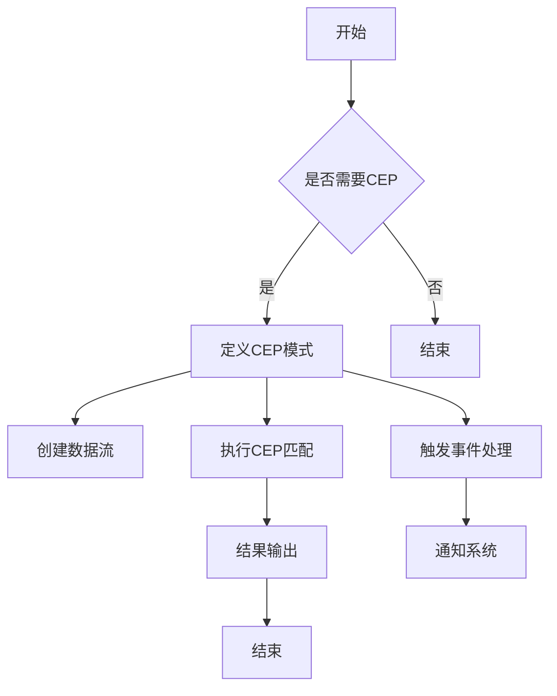
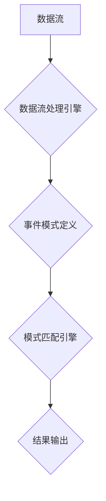
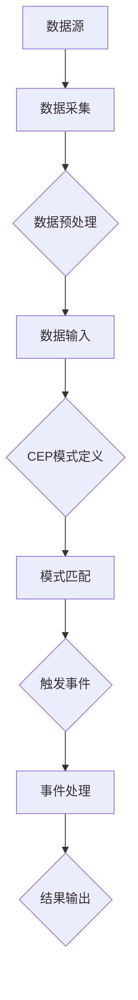

                 

### 文章标题

# Flink CEP原理与代码实例讲解

> 关键词：Flink，复杂事件处理，CEP，实时数据处理，数据流处理，事件模式挖掘

> 摘要：本文深入讲解了Apache Flink的复杂事件处理（CEP）模块，包括其基本概念、架构、核心算法以及在实际应用中的实战案例。通过详细的代码实例解析，读者将了解如何使用Flink CEP进行实时数据处理，从而实现复杂事件模式的挖掘和实时分析。

### 《Flink CEP原理与代码实例讲解》目录大纲

#### 第一部分：Flink CEP基础知识

##### 第1章：Flink概述
- 1.1 Flink的诞生与背景
- 1.2 Flink的特点与优势
- 1.3 Flink生态系统

##### 第2章：事件处理与时间概念
- 2.1 事件驱动的数据处理
- 2.2 Flink的时间概念
  - 2.2.1 水平时间
  - 2.2.2 窗口时间
  - 2.2.3 滚动时间窗口
  - 2.2.4 事件时间窗口

##### 第3章：Flink CEP核心概念
- 3.1 CEP的概念
- 3.2 Flink CEP的架构
- 3.3 Flink CEP的核心算法
  - 3.3.1 事件匹配算法
  - 3.3.2 序列模式挖掘算法
  - 3.3.3 时间序列分析算法

##### 第4章：CEP模式定义与语法
- 4.1 CEP模式定义
- 4.2 CEP语法规则
  - 4.2.1 基本语法元素
  - 4.2.2 转换规则
  - 4.2.3 并行规则
  - 4.2.4 选择规则

##### 第5章：Flink CEP应用场景
- 5.1 实时风控
- 5.2 实时营销
- 5.3 实时物联网数据处理

#### 第二部分：Flink CEP原理与代码实例讲解

##### 第6章：Flink CEP原理深度剖析
- 6.1 Flink CEP核心算法原理
- 6.2 Flink CEP执行流程
- 6.3 Flink CEP性能优化

##### 第7章：Flink CEP代码实例解析
- 7.1 实时风控案例
  - 7.1.1 风控事件数据流构建
  - 7.1.2 风控规则定义与匹配
  - 7.1.3 风控报警系统实现
- 7.2 实时营销案例
  - 7.2.1 营销事件数据流构建
  - 7.2.2 营销规则定义与匹配
  - 7.2.3 营销活动优化与推送
- 7.3 实时物联网数据处理案例
  - 7.3.1 物联网事件数据流构建
  - 7.3.2 物联网设备监控规则定义
  - 7.3.3 设备故障预警系统实现

##### 第8章：Flink CEP项目实战
- 8.1 实时数据采集系统搭建
- 8.2 Flink CEP应用部署与调优
- 8.3 项目总结与展望

#### 第三部分：附录

##### 第9章：Flink CEP开发工具与资源
- 9.1 Flink CEP开发环境搭建
- 9.2 Flink CEP常用工具介绍
  - 9.2.1 Flink SQL
  - 9.2.2 Flink CEP API
  - 9.2.3 Flink Table API
- 9.3 Flink CEP学习资源推荐
  - 9.3.1 书籍推荐
  - 9.3.2 在线课程
  - 9.3.3 社区与论坛

### 附录 Mermaid 流程图


---

在接下来的文章中，我们将逐步深入探讨Flink CEP的各个方面，从基础知识到实际应用，帮助读者全面了解并掌握这一强大的实时数据处理工具。

---

### 第一部分：Flink CEP基础知识

#### 第1章：Flink概述

##### 1.1 Flink的诞生与背景

Apache Flink是一个分布式流处理框架，诞生于2011年，由当时在柏林工业大学（Technische Universität Berlin）攻读博士学位的Ville Tiihonen和Nathan Marz共同开发。Flink起源于流计算领域，最初被设计用于解决大数据环境下的实时数据处理需求。随着时间的发展，Flink逐渐成为一个功能强大、灵活可扩展的分布式系统，广泛应用于金融、电商、物联网、社交媒体等多个领域。

Flink的背景与其前身Storm和Spark Streaming紧密相关。在Apache Flink诞生之前，Storm是一个流行的实时流处理框架，而Spark Streaming则是Spark生态系统的一部分，用于实现流处理能力。尽管这两个框架在实时数据处理领域都有着显著的贡献，但它们在性能、延迟和易用性等方面都存在一定的局限性。

Flink的诞生旨在解决这些局限性，它提供了一系列独特的特性和优势，使其成为实时数据处理领域的一个热门选择。以下是一些促使Flink诞生的关键因素：

- **性能与延迟**：Flink在处理流数据时具有较低的延迟，其基于事件驱动的架构能够确保处理速度和吞吐量达到最优。
- **窗口处理**：Flink提供了丰富的窗口处理机制，包括滚动窗口、滑动窗口和事件时间窗口等，能够灵活处理不同类型的数据流。
- **容错性**：Flink采用了基于分布式快照的容错机制，确保在发生故障时能够快速恢复，保障系统的稳定性。
- **动态缩放**：Flink支持动态资源管理，可以根据实际负载动态调整任务资源，提高资源利用率。
- **编程接口**：Flink提供了多种编程接口，包括DataStream API、Process Function API和Table API等，使得开发人员能够根据需求选择合适的接口进行开发。

##### 1.2 Flink的特点与优势

Flink作为一款分布式流处理框架，具有许多独特的特点与优势，这些特点使其在处理实时数据流方面表现出色。以下是一些关键特点：

- **低延迟**：Flink采用事件驱动架构，能够实时处理流数据，确保数据处理的延迟极低。这对于需要即时响应的场景，如金融交易、在线广告和物联网等，具有重要意义。
- **窗口处理**：Flink提供了多种窗口处理机制，包括基于时间、基于事件和混合窗口等，能够灵活处理不同类型的数据流，保证数据的完整性和准确性。
- **容错性**：Flink采用了分布式快照机制，实现了自动故障检测和恢复。在发生节点故障时，Flink能够快速恢复，确保系统的稳定性和可靠性。
- **动态缩放**：Flink支持动态资源管理，可以根据实际负载动态调整任务资源，提高资源利用率，确保系统在高负载下的性能表现。
- **易用性**：Flink提供了多种编程接口，如DataStream API、Process Function API和Table API等，使得开发人员能够根据需求选择合适的接口进行开发，提高开发效率。

##### 1.3 Flink生态系统

Flink的生态系统丰富多样，包括许多与Flink紧密集成的工具和组件，进一步扩展了Flink的功能和应用场景。以下是一些主要的Flink生态系统组件：

- **Flink SQL**：Flink SQL是Flink提供的一种查询接口，允许用户使用SQL语句进行流数据的查询和分析。Flink SQL支持标准的SQL语法，并提供了丰富的内置函数和操作符，使得开发人员可以方便地进行流数据处理。
- **Flink CEP**：Flink CEP（Complex Event Processing）是Flink提供的复杂事件处理模块，用于处理和分析复杂的事件模式。Flink CEP支持定义复杂的事件规则和模式，能够实时挖掘数据流中的关联关系和模式，适用于实时风控、营销和物联网等场景。
- **FlinkML**：FlinkML是Flink提供的机器学习库，用于构建和部署机器学习模型。FlinkML支持多种常见的机器学习算法，包括回归、分类、聚类和异常检测等，能够方便地集成到Flink的数据处理流程中。
- **FlinkGelly**：FlinkGelly是Flink提供的一种图处理库，用于处理大规模图数据。FlinkGelly支持多种图算法，如PageRank、社区发现和社交网络分析等，能够高效地处理和分析图数据。
- **FlinkKafka**：FlinkKafka是Flink与Kafka集成的一个组件，用于处理Kafka数据流。FlinkKafka支持实时消费Kafka消息，并提供了高效的Kafka生产者接口，使得Flink能够方便地与Kafka进行集成，实现实时数据流处理。

通过以上对Flink的介绍，读者应该对Flink有一个初步的了解，知道它是一款功能强大、灵活可扩展的分布式流处理框架，适用于多种实时数据处理场景。在接下来的章节中，我们将进一步探讨Flink CEP的概念、架构和核心算法，帮助读者深入理解并掌握这一强大的实时数据处理工具。

#### 第2章：事件处理与时间概念

##### 2.1 事件驱动的数据处理

事件驱动的数据处理（Event-Driven Data Processing）是一种以事件为中心的数据处理范式，与传统的批处理（Batch Processing）和查询驱动（Query-Driven）数据处理方式不同。事件驱动的数据处理强调实时性，通过对事件流进行实时处理，实现对实时数据的即时分析和响应。

事件驱动的数据处理具有以下几个关键特征：

- **实时性**：事件驱动的数据处理能够在事件发生时立即进行响应，确保数据处理的延迟极低。这使得事件驱动的数据处理适用于需要即时响应的场景，如金融交易、实时监控和在线广告等。
- **异步处理**：事件驱动的数据处理通常采用异步处理方式，能够处理大量并发的事件流，提高系统的并发处理能力。异步处理方式能够有效降低系统资源的占用，提高系统的性能和可扩展性。
- **灵活性**：事件驱动的数据处理支持多种事件类型和事件流的组合，能够灵活应对不同场景下的数据处理需求。事件驱动的数据处理能够方便地集成各种外部系统，如消息队列、数据库和外部服务等，实现数据流转和系统集成。

事件驱动的数据处理在许多领域都得到了广泛应用，如：

- **金融行业**：事件驱动的数据处理能够实时监控金融交易，确保交易数据的实时性和准确性，对交易风险进行实时分析和管理。
- **物联网**：事件驱动的数据处理能够实时处理物联网设备产生的大量事件数据，实现对设备的实时监控和故障预警。
- **实时监控**：事件驱动的数据处理能够实时收集和分析监控数据，实现对系统的实时监控和故障诊断。
- **在线广告**：事件驱动的数据处理能够实时分析用户行为数据，为广告投放提供实时决策支持，提高广告投放的效果和用户体验。

##### 2.2 Flink的时间概念

在事件驱动的数据处理中，时间是一个至关重要的概念。Flink作为一款分布式流处理框架，提供了一套完整的时间概念和机制，确保数据处理的正确性和一致性。Flink的时间概念主要包括以下几种：

- **处理时间（Processing Time）**：处理时间是事件被处理时所在的时间。处理时间是一个相对时间，与事件发生的时间无关。Flink默认使用处理时间作为数据处理的时间基准。
- **事件时间（Event Time）**：事件时间是事件发生的时间。事件时间通常由数据源提供，如时间戳、日志文件中的时间标记等。事件时间是一个绝对时间，能够确保数据处理与事件发生时间的一致性。
- **摄取时间（Ingestion Time）**：摄取时间是事件被摄取到系统中的时间。摄取时间通常由数据源决定，如Kafka消息的接收时间。
- **窗口时间（Window Time）**：窗口时间是数据流被划分的时间段。Flink支持多种窗口类型，包括滚动窗口、滑动窗口和事件时间窗口等，能够灵活处理不同类型的数据流。

在Flink中，处理时间、事件时间和摄取时间之间的关系可以用以下方式表示：

- **处理时间**：处理时间是事件被处理时所在的时间。处理时间是一个相对时间，与事件发生的时间无关。Flink默认使用处理时间作为数据处理的时间基准。
- **事件时间**：事件时间是事件发生的时间。事件时间通常由数据源提供，如时间戳、日志文件中的时间标记等。事件时间是一个绝对时间，能够确保数据处理与事件发生时间的一致性。
- **摄取时间**：摄取时间是事件被摄取到系统中的时间。摄取时间通常由数据源决定，如Kafka消息的接收时间。

Flink的时间概念和机制确保了数据处理的正确性和一致性，能够应对各种复杂场景下的数据处理需求。在Flink中，处理时间、事件时间和摄取时间可以灵活组合使用，满足不同场景下的数据处理需求。

##### 2.2.1 水平时间

水平时间（Level Time）是Flink用于描述数据流中的时间层次的一个概念。在Flink中，数据流被划分为多个层次，每个层次都有其对应的时间。水平时间主要用于描述数据流中的层次结构，有助于更好地理解和分析数据流。

Flink中的水平时间可以分为以下几种：

- **全局时间（Global Time）**：全局时间是指数据流中的整体时间，通常由事件时间或摄取时间决定。全局时间能够确保数据流中的事件顺序和一致性。
- **分区时间（Partition Time）**：分区时间是指数据流中每个分区的时间。在分布式系统中，数据流被划分为多个分区，每个分区有其对应的时间。分区时间有助于确保分区之间的数据同步和一致性。
- **记录时间（Record Time）**：记录时间是指数据流中每个记录的时间。记录时间能够确保数据流中的每个记录能够按照其发生时间进行排序和处理。

在Flink中，水平时间主要用于以下场景：

- **时间窗口**：时间窗口是Flink用于处理数据流的一种机制，用于将数据流划分为不同的时间段。时间窗口可以基于全局时间、分区时间和记录时间进行划分，确保数据处理的正确性和一致性。
- **事件时间处理**：事件时间处理是Flink的一种数据处理机制，用于根据事件发生的时间对数据进行处理。事件时间处理能够确保数据处理与事件发生时间的一致性，适用于需要实时分析的场景。
- **延迟处理**：延迟处理是Flink用于处理延迟数据的机制，用于处理由于网络延迟、系统故障等原因导致的数据延迟。延迟处理能够确保数据的完整性和准确性，适用于需要实时数据处理的场景。

##### 2.2.2 窗口时间

窗口时间（Window Time）是Flink用于将数据流划分为固定时间段的机制，确保数据处理的正确性和一致性。窗口时间能够帮助开发人员灵活处理不同类型的数据流，应对各种复杂的场景。

Flink支持多种窗口类型，包括滚动窗口（Tumbling Window）、滑动窗口（Sliding Window）和事件时间窗口（Event Time Window）等。以下是对这些窗口类型的详细介绍：

- **滚动窗口（Tumbling Window）**：滚动窗口是一种固定大小的窗口，窗口之间没有重叠。每个窗口包含固定数量的数据记录，当新数据记录进入窗口时，旧数据记录会被移出窗口。滚动窗口适用于处理等间隔数据流，如每隔一秒处理一次数据。
  
  ```mermaid
  graph TD
      A[开始] --> B{第一窗口}
      B --> C{第二窗口}
      C --> D{第三窗口}
      D --> E{第四窗口}
      E --> F{第五窗口}
  ```

- **滑动窗口（Sliding Window）**：滑动窗口是一种可调整大小的窗口，窗口之间有固定的时间间隔。每个窗口包含固定数量的数据记录，当新数据记录进入窗口时，旧数据记录会被移出窗口，同时新的窗口会生成。滑动窗口适用于处理非等间隔数据流，如每五分钟处理一次数据。
  
  ```mermaid
  graph TD
      A[开始] --> B{第一窗口[0-4]}
      B --> C{第二窗口[4-9]}
      C --> D{第三窗口[9-14]}
      D --> E{第四窗口[14-19]}
      E --> F{第五窗口[19-24]}
  ```

- **事件时间窗口（Event Time Window）**：事件时间窗口是一种基于事件发生时间的窗口，能够确保数据处理与事件发生时间的一致性。事件时间窗口适用于处理含有时间戳的数据流，如日志文件中的事件记录。事件时间窗口可以根据事件时间的范围进行划分，确保数据的正确性和一致性。

  ```mermaid
  graph TD
      A[事件1[0]] --> B{窗口[0-5]}
      A --> C{窗口[5-10]}
      B --> D{窗口[5-10]}
      C --> E{窗口[10-15]}
  ```

窗口时间在Flink中具有重要的应用，包括以下几个方面：

- **窗口聚合**：窗口时间用于将数据流划分为不同的时间段，便于进行窗口聚合操作，如求和、求平均和求最大值等。窗口聚合能够实现实时数据分析，帮助开发人员快速获取数据流中的关键指标。
- **事件处理**：窗口时间用于将数据流中的事件进行分组和分类，便于对事件进行实时处理。事件处理能够实现实时监控和报警，帮助开发人员及时应对异常情况和风险。
- **资源管理**：窗口时间用于动态调整Flink任务的处理时间和资源分配，确保系统在高负载下的性能和稳定性。通过合理设置窗口时间，可以优化系统资源利用率，提高数据处理效率。

通过以上对窗口时间的介绍，读者应该对Flink中的窗口时间有了更深入的理解。在接下来的章节中，我们将进一步探讨Flink CEP的概念、架构和核心算法，帮助读者深入掌握Flink CEP的原理和应用。

##### 2.2.3 滚动时间窗口

滚动时间窗口（Tumbling Time Window）是Flink提供的一种时间窗口机制，用于将数据流划分为固定的时间段。滚动时间窗口的特点是没有重叠，每个窗口独立存在，窗口大小固定。这种窗口机制适用于处理等间隔的数据流。

在Flink中，滚动时间窗口的定义如下：

- **窗口大小**：窗口大小是窗口包含的时间长度，通常以毫秒为单位。窗口大小决定了窗口中能够包含的数据记录数量。
- **窗口起始时间**：窗口起始时间是窗口开始的时间戳，通常以事件时间或处理时间为基准。
- **窗口结束时间**：窗口结束时间是窗口结束的时间戳，通常以窗口起始时间加上窗口大小为基准。

滚动时间窗口的工作原理如下：

1. **数据流进入窗口**：当数据流中的数据记录进入窗口时，窗口会根据窗口大小和时间戳进行划分，将新数据记录加入到对应的窗口中。
2. **窗口状态更新**：当窗口中的数据记录达到最大数量时，窗口状态会更新，以便处理窗口中的数据。窗口状态更新包括计算窗口内的聚合结果、触发窗口事件等。
3. **窗口触发**：当窗口状态更新完成后，窗口会触发相应的处理操作，如输出窗口结果、触发报警等。
4. **窗口移出**：当窗口中的数据记录被处理完成后，窗口会从窗口集合中移出，释放窗口资源。

以下是一个简单的滚动时间窗口示例：

```mermaid
graph TD
    A[开始] --> B{第一窗口[0-100ms]}
    B --> C{第二窗口[100-200ms]}
    C --> D{第三窗口[200-300ms]}
    D --> E{第四窗口[300-400ms]}
    E --> F{第五窗口[400-500ms]}
```

在上述示例中，每个窗口的时间长度为100ms，没有重叠。当新的数据记录进入窗口时，窗口会根据时间戳进行划分，将数据记录加入到对应的窗口中。当窗口中的数据记录达到最大数量时，窗口会触发相应的处理操作，如输出窗口结果。

滚动时间窗口在Flink中广泛应用于实时数据处理和监控。例如，在实时风控系统中，可以使用滚动时间窗口对交易数据进行监控，当交易数据满足特定条件时，触发报警通知。在实时营销系统中，可以使用滚动时间窗口对用户行为数据进行分析，实时推送个性化营销活动。

通过合理设置滚动时间窗口的大小和触发条件，可以优化Flink的任务性能和资源利用率。在实际应用中，可以根据具体需求调整窗口大小和触发策略，实现高效的数据处理和实时分析。

##### 2.2.4 事件时间窗口

事件时间窗口（Event Time Window）是Flink提供的一种时间窗口机制，用于根据事件发生的时间对数据流进行划分和处理。事件时间窗口能够确保数据处理与事件发生时间的一致性，适用于处理包含时间戳的数据流。

在Flink中，事件时间窗口的定义如下：

- **窗口起始时间**：窗口起始时间是窗口开始的事件时间戳，通常由数据源提供，如Kafka消息的时间戳、日志文件的时间戳等。
- **窗口结束时间**：窗口结束时间是窗口结束的事件时间戳，通常以窗口起始时间加上窗口大小为基准。
- **窗口大小**：窗口大小是窗口包含的时间长度，通常以毫秒为单位。

事件时间窗口的工作原理如下：

1. **数据流进入窗口**：当数据流中的数据记录进入窗口时，窗口会根据事件时间戳进行划分，将新数据记录加入到对应的窗口中。由于事件时间戳是数据源提供的，因此窗口的划分与处理时间无关。
2. **窗口状态更新**：当窗口中的数据记录达到最大数量时，窗口状态会更新，以便处理窗口中的数据。窗口状态更新包括计算窗口内的聚合结果、触发窗口事件等。
3. **窗口触发**：当窗口状态更新完成后，窗口会触发相应的处理操作，如输出窗口结果、触发报警等。
4. **窗口移出**：当窗口中的数据记录被处理完成后，窗口会从窗口集合中移出，释放窗口资源。

以下是一个简单的事件时间窗口示例：

```mermaid
graph TD
    A[事件1[0]] --> B{窗口[0-5]}
    A --> C{窗口[5-10]}
    B --> D{窗口[5-10]}
    C --> E{窗口[10-15]}
```

在上述示例中，事件时间窗口的大小为5ms。当新的数据记录进入窗口时，窗口会根据事件时间戳进行划分，将数据记录加入到对应的窗口中。当窗口中的数据记录达到最大数量时，窗口会触发相应的处理操作。

事件时间窗口在Flink中具有广泛的应用。例如，在实时监控系统中，可以使用事件时间窗口对日志数据进行监控，当日志数据满足特定条件时，触发报警通知。在实时风控系统中，可以使用事件时间窗口对交易数据进行监控，当交易数据满足特定条件时，触发风险预警。

通过合理设置事件时间窗口的大小和触发条件，可以优化Flink的任务性能和资源利用率。在实际应用中，可以根据具体需求调整窗口大小和触发策略，实现高效的数据处理和实时分析。

#### 第3章：Flink CEP核心概念

##### 3.1 CEP的概念

复杂事件处理（Complex Event Processing，简称CEP）是一种用于实时分析事件数据的技术，旨在识别和响应事件序列和模式。CEP的核心目标是发现数据流中的潜在关联关系和复杂模式，从而为业务决策提供实时支持。

CEP的概念起源于数据库领域，最初用于处理数据库中的复杂查询和模式匹配。随着大数据和实时数据处理技术的发展，CEP逐渐扩展到流处理领域，成为分布式流处理框架的重要组成部分。

CEP的主要目标包括：

- **实时性**：CEP能够实时处理数据流中的事件，确保数据处理与事件发生时间的一致性，为业务决策提供即时支持。
- **复杂模式挖掘**：CEP能够识别数据流中的复杂事件序列和模式，如序列模式、关联关系、频率统计等，提供深入的业务洞察。
- **实时响应**：CEP能够实时触发相应的处理操作，如报警、推送、调整策略等，确保业务系统能够及时响应事件。

##### 3.2 Flink CEP的架构

Flink CEP（Complex Event Processing）是Apache Flink提供的一个复杂事件处理模块，旨在利用Flink的强大流处理能力，实现实时的事件模式挖掘和分析。Flink CEP的架构设计充分考虑了分布式流处理的特点，确保在分布式环境中高效地处理复杂事件。

Flink CEP的架构主要包括以下几个关键组件：

- **数据流处理引擎**：数据流处理引擎是Flink CEP的核心组件，负责接收和处理数据流。数据流处理引擎采用了Flink的DataStream API，能够实时处理大规模数据流，提供高效的数据处理能力。
- **事件模式定义**：事件模式定义是Flink CEP的关键功能，用于定义复杂的事件模式。事件模式定义包括事件类型、事件序列、事件频率等，能够灵活地描述复杂的业务逻辑。
- **模式匹配引擎**：模式匹配引擎是Flink CEP的核心算法组件，负责实时匹配数据流中的事件模式。模式匹配引擎采用了高效的事件匹配算法，能够在分布式环境中快速处理海量数据。
- **结果输出**：结果输出是Flink CEP的一个重要功能，用于将匹配结果输出到目标系统，如数据库、消息队列、监控平台等。结果输出确保了事件模式的实时性和一致性。

以下是一个简化的Flink CEP架构示意图：



在Flink CEP中，数据流处理引擎负责接收和处理数据流，事件模式定义用于描述复杂的业务逻辑，模式匹配引擎负责实时匹配数据流中的事件模式，结果输出则将匹配结果输出到目标系统。通过这些组件的协同工作，Flink CEP能够实现高效、实时的复杂事件处理。

##### 3.3 Flink CEP的核心算法

Flink CEP的核心算法是其实现复杂事件处理的关键，主要包括事件匹配算法、序列模式挖掘算法和时间序列分析算法。这些算法在分布式环境中能够高效地处理海量数据流，实现实时的事件模式挖掘和分析。

- **事件匹配算法**：事件匹配算法是Flink CEP中最基本的算法，用于匹配数据流中的单个事件。事件匹配算法通过定义事件类型、事件频率和事件顺序等规则，实现对数据流中事件的精确匹配。事件匹配算法采用了一种基于前缀树（Prefix Tree）的匹配策略，能够在分布式环境中快速处理大规模数据流。

  ```mermaid
  graph TD
      A[事件1] --> B[事件2]
      A --> C{事件3}
      B --> D[事件4]
      C --> E{事件5}
  ```

- **序列模式挖掘算法**：序列模式挖掘算法是Flink CEP中用于挖掘数据流中的复杂序列模式的算法。序列模式挖掘算法通过分析事件序列的频率、顺序和持续时间等特征，发现数据流中的潜在关联关系。序列模式挖掘算法采用了基于频繁模式挖掘（FP-Growth）和序列模式挖掘（Sequences Mining）的策略，能够高效地挖掘大规模数据流中的复杂序列模式。

  ```mermaid
  graph TD
      A{事件1} --> B{事件2}
      B --> C{事件3}
      C --> D{事件4}
      D --> E{事件5}
  ```

- **时间序列分析算法**：时间序列分析算法是Flink CEP中用于分析数据流中的时间序列特征的算法。时间序列分析算法通过分析时间序列的周期性、趋势和季节性等特征，预测未来的时间序列行为。时间序列分析算法采用了基于自回归模型（ARIMA）、长期短期记忆网络（LSTM）和卷积神经网络（CNN）等策略，能够高效地处理大规模时间序列数据。

  ```mermaid
  graph TD
      A[时间1] --> B[时间2]
      B --> C[时间3]
      C --> D[时间4]
      D --> E[时间5]
  ```

通过这些核心算法，Flink CEP能够高效地处理复杂事件流，实现实时的事件模式挖掘和分析。在实际应用中，可以根据具体需求选择合适的算法，实现对事件流的不同层面的分析和挖掘。

#### 第4章：CEP模式定义与语法

##### 4.1 CEP模式定义

CEP（Complex Event Processing）模式是用于描述事件流中的复杂关系和模式的一种工具。在Flink CEP中，CEP模式定义了事件流中事件的类型、顺序、频率和持续时间等规则，用于匹配和分析数据流中的复杂事件模式。

CEP模式定义的基本步骤包括：

1. **定义事件类型**：首先，需要定义事件类型，即描述事件流中可能出现的各种事件。事件类型可以是简单的数据项，也可以是复杂的结构化数据。例如，在股票交易系统中，事件类型可以包括“买入”、“卖出”、“价格变动”等。

2. **定义事件关系**：接下来，需要定义事件之间的关系，包括事件之间的顺序、频率和持续时间等。事件关系可以通过序列模式（Sequence Pattern）、并发模式（Concurrent Pattern）和选择模式（Selection Pattern）等来描述。例如，在股票交易系统中，可以定义一个规则：“在10分钟内，如果出现两次买入事件，并且买入价格超过100元，则触发报警”。

3. **定义触发条件**：最后，需要定义触发条件，即描述何时触发事件处理。触发条件可以是事件发生的数量、时间间隔、事件频率等。例如，在股票交易系统中，可以定义一个触发条件：“如果在5分钟内，出现3次买入事件，并且买入价格超过100元，则触发报警”。

CEP模式定义的语法如下：

```java
pattern <pattern_name> {
    event_type1 [within time_range] -> event_type2 [within time_range] ...
    [within total_time_range]
    [with frequency]
    [when condition]
}
```

- `<pattern_name>`：模式名称，用于标识模式。
- `event_type1`：事件类型1。
- `event_type2`：事件类型2。
- `[within time_range]`：事件类型之间的时间范围，用于描述事件之间的时间间隔。
- `[within total_time_range]`：模式的总时间范围，用于描述整个模式的持续时间。
- `[with frequency]`：模式的频率，用于描述模式出现的次数。
- `[when condition]`：触发条件，用于描述何时触发事件处理。

通过CEP模式定义，开发人员可以灵活地描述和匹配数据流中的复杂事件模式，实现对事件流的实时分析和处理。

##### 4.2 CEP语法规则

CEP（Complex Event Processing）的语法规则是用于定义和描述复杂事件模式的关键。Flink CEP提供了丰富的语法元素和规则，使得开发人员能够灵活地定义和匹配复杂的事件流模式。以下是对CEP语法规则的主要介绍：

- **基本语法元素**：

  - **事件类型（Event Type）**：事件类型是CEP模式中的核心元素，用于标识事件流中的各种事件。事件类型可以是简单的数据项，也可以是复杂的结构化数据。在Flink CEP中，事件类型通常由数据源提供，如Kafka消息、日志文件等。

  - **时间范围（Time Range）**：时间范围用于描述事件之间的时间间隔。时间范围可以是固定的持续时间，也可以是可变的持续时间。在Flink CEP中，时间范围可以通过`within`关键字进行定义。

  - **模式名称（Pattern Name）**：模式名称是CEP模式中的一个标识符，用于命名和引用模式。模式名称可以包含字母、数字和下划线，但不能以数字开头。

- **转换规则**：

  - **序列规则（Sequence Rule）**：序列规则用于描述事件流中的顺序关系。序列规则通过连接多个事件类型，并指定它们之间的时间范围来定义。序列规则可以表示为：`event_type1 -> event_type2 -> ... -> event_typeN`。

  - **并行规则（Concurrent Rule）**：并行规则用于描述事件流中的并发关系。并行规则通过同时连接多个事件类型来定义。并行规则可以表示为：`event_type1 || event_type2 || ... || event_typeN`。

- **选择规则**：

  - **选择规则（Selection Rule）**：选择规则用于筛选事件流中的特定事件。选择规则可以通过指定事件类型和触发条件来定义。选择规则可以表示为：`event_type when condition`。

- **其他规则**：

  - **频率规则（Frequency Rule）**：频率规则用于描述模式出现的次数。频率规则可以通过`with frequency`关键字进行定义。例如，`with exactly 2`表示模式必须恰好出现两次。

  - **时间范围规则（Time Range Rule）**：时间范围规则用于描述整个模式的持续时间。时间范围规则可以通过`within total_time_range`关键字进行定义。例如，`within 5 minutes`表示模式必须在5分钟内完成。

以下是一个简单的CEP模式定义示例：

```mermaid
graph TD
    A{买入[within 1 minute]}
    A --> B{价格变动[within 1 minute]}
    B --> C{卖出[within 1 minute]}
    C --> D{报警[when 总金额 > 1000]}
```

在这个示例中，定义了一个CEP模式，描述了股票交易中的买入、价格变动和卖出的顺序关系，并在总金额超过1000元时触发报警。

通过CEP语法规则，开发人员可以灵活地定义和匹配复杂的事件流模式，实现对事件流的实时分析和处理。在实际应用中，可以根据具体需求组合使用不同的语法规则，实现高效的事件模式匹配和分析。

##### 4.2.1 基本语法元素

在CEP（Complex Event Processing）模式定义中，基本语法元素是构建复杂事件模式的基础。以下是对这些基本语法元素的详细介绍：

- **事件类型（Event Type）**：事件类型是CEP模式中的核心概念，用于标识事件流中的各种事件。事件类型可以是简单的数据项，例如股票交易中的“买入”、“卖出”或“价格变动”，也可以是复杂的结构化数据，如JSON或XML格式。在Flink CEP中，事件类型通常由数据源提供，例如Kafka消息、日志文件等。

  ```mermaid
  graph TD
      A[买入]
      B[卖出]
      C[价格变动]
  ```

- **时间范围（Time Range）**：时间范围用于描述事件之间的时间间隔。时间范围可以是固定的持续时间，也可以是可变的持续时间。在Flink CEP中，时间范围通过`within`关键字进行定义，用于指定事件之间必须满足的时间间隔。

  ```mermaid
  graph TD
      A[买入[within 1 minute]]
      A --> B[卖出[within 1 minute]]
  ```

  在上述示例中，表示在1分钟内必须发生买入和卖出事件。

- **模式名称（Pattern Name）**：模式名称是CEP模式中的一个标识符，用于命名和引用模式。模式名称可以包含字母、数字和下划线，但不能以数字开头。模式名称有助于在复杂的CEP定义中识别和操作特定的模式。

  ```mermaid
  graph TD
      A[模式1]
      A --> B[模式2]
  ```

  在上述示例中，`模式1`和`模式2`是两个不同的模式名称。

- **触发条件（Trigger Condition）**：触发条件用于描述何时触发事件处理。触发条件可以是基于事件数量、时间间隔或事件属性的特定规则。在Flink CEP中，触发条件通过`when`关键字进行定义，用于指定何时触发特定的操作。

  ```mermaid
  graph TD
      A[买入[within 1 minute]]
      A --> B[卖出[within 1 minute]]
      B --> C{报警[when 总金额 > 1000]}
  ```

  在上述示例中，当买入和卖出事件在1分钟内发生，且总金额超过1000元时，会触发报警。

通过这些基本语法元素，开发人员可以灵活地定义和匹配复杂的事件流模式，实现对事件流的实时分析和处理。在实际应用中，可以根据具体需求组合使用这些基本语法元素，构建高效的CEP模式。

##### 4.2.2 转换规则

CEP（Complex Event Processing）模式定义中的转换规则用于描述事件流中事件之间的转换关系。转换规则包括序列规则、并行规则和选择规则，这些规则能够灵活地定义和匹配复杂的事件流模式。

- **序列规则（Sequence Rule）**：序列规则用于描述事件流中的顺序关系。序列规则通过连接多个事件类型，并指定它们之间的时间范围来定义。序列规则可以表示为：`event_type1 -> event_type2 -> ... -> event_typeN`。

  ```mermaid
  graph TD
      A[买入]
      A --> B[卖出]
      B --> C[价格变动]
  ```

  在这个示例中，表示在买入事件发生后，必须紧接着发生卖出事件，然后是价格变动事件。

- **并行规则（Concurrent Rule）**：并行规则用于描述事件流中的并发关系。并行规则通过同时连接多个事件类型来定义。并行规则可以表示为：`event_type1 || event_type2 || ... || event_typeN`。

  ```mermaid
  graph TD
      A[买入]
      A --> B[价格变动]
      A --> C[退款]
  ```

  在这个示例中，表示买入事件可以同时触发价格变动事件和退款事件。

- **选择规则（Selection Rule）**：选择规则用于筛选事件流中的特定事件。选择规则可以通过指定事件类型和触发条件来定义。选择规则可以表示为：`event_type when condition`。

  ```mermaid
  graph TD
      A[买入]
      A --> B{报警[when 价格 > 1000]}
  ```

  在这个示例中，表示只有在买入事件发生且价格超过1000元时，才会触发报警。

通过这些转换规则，开发人员可以灵活地定义和匹配复杂的事件流模式，实现对事件流的实时分析和处理。在实际应用中，可以根据具体需求组合使用这些转换规则，构建高效的CEP模式。

#### 第5章：Flink CEP应用场景

##### 5.1 实时风控

实时风控是金融行业中至关重要的一环，它旨在通过对交易数据的实时监控和分析，发现和阻止潜在的风险事件。Flink CEP凭借其强大的实时数据处理能力和复杂事件模式匹配功能，为实时风控提供了有效的技术支持。以下是一个简单的实时风控应用场景：

**应用场景描述**：

在股票交易市场中，某平台需要实时监控交易行为，以防止恶意交易和欺诈行为。具体需求包括：

- 监控在短时间内高频次交易的账户，如涉嫌刷单行为。
- 监控连续大量买入或卖出的账户，如涉嫌操纵市场行为。
- 监控交易金额异常大的账户，如涉嫌洗钱行为。

**解决方案**：

使用Flink CEP，可以定义一系列风控规则，实现对交易数据的实时监控。以下是一个简单的解决方案：

1. **定义事件类型**：首先，需要定义交易数据中的事件类型，如“买入”、“卖出”、“交易金额”等。

2. **定义风控规则**：

   - 规则1：在1分钟内，如果某个账户的交易次数超过10次，则触发报警。
   - 规则2：在1分钟内，如果某个账户的连续买入或卖出次数超过3次，则触发报警。
   - 规则3：在1分钟内，如果某个账户的交易金额超过100万元，则触发报警。

3. **实现规则匹配**：使用Flink CEP的模式定义和匹配功能，将上述规则转化为CEP模式，并部署到Flink任务中。

   ```mermaid
   graph TD
       A{买入[within 1 minute]}
       A --> B{买入[within 1 minute]}
       A --> C{卖出[within 1 minute]}
       C --> D{卖出[within 1 minute]}
       A --> E{交易金额[within 1 minute]}
       E --> F{交易金额[within 1 minute]}
       F --> G{报警[when 金额 > 1000000]}
   ```

4. **结果输出**：当风控规则匹配成功时，将报警信息输出到监控平台或报警系统，如Kafka、Elasticsearch等。

**效果**：

通过使用Flink CEP进行实时风控，可以显著提高风险检测的效率和准确性。风控规则能够根据实时交易数据自动触发，确保及时发现和阻止潜在的风险事件。同时，Flink CEP的高性能和低延迟特性，能够满足金融行业对实时数据处理的高要求。

##### 5.2 实时营销

实时营销是电商和互联网行业的重要环节，它依赖于对用户行为数据的实时分析和处理，以实现精准营销和个性化推送。Flink CEP凭借其强大的实时数据处理能力和复杂事件模式匹配功能，为实时营销提供了有效的技术支持。以下是一个简单的实时营销应用场景：

**应用场景描述**：

在某电商平台上，需要根据用户的行为数据，实时推荐商品和推送营销活动。具体需求包括：

- 根据用户的浏览历史，推荐相关的商品。
- 根据用户的购买习惯，推送个性化的优惠券。
- 根据用户的活跃时段，推送特定的营销活动。

**解决方案**：

使用Flink CEP，可以定义一系列营销规则，实现对用户行为数据的实时分析和处理。以下是一个简单的解决方案：

1. **定义事件类型**：首先，需要定义用户行为数据中的事件类型，如“浏览”、“购买”、“优惠券领取”等。

2. **定义营销规则**：

   - 规则1：如果用户在连续三天内浏览同一类商品，则推荐相关类别的商品。
   - 规则2：如果用户在购买后三天内未领取优惠券，则推送相应的优惠券。
   - 规则3：如果用户在特定时段内浏览商品，则推送特定的营销活动。

3. **实现规则匹配**：使用Flink CEP的模式定义和匹配功能，将上述规则转化为CEP模式，并部署到Flink任务中。

   ```mermaid
   graph TD
       A{浏览[within 3 days]}
       A --> B{浏览[within 3 days]}
       A --> C{购买[within 3 days]}
       C --> D{优惠券领取[within 3 days]}
       A --> E{浏览[within specific hours]}
       E --> F{营销活动推送[within specific hours]}
   ```

4. **结果输出**：当营销规则匹配成功时，将推荐商品、优惠券和营销活动等信息输出到推荐系统或营销系统，如Kafka、Redis等。

**效果**：

通过使用Flink CEP进行实时营销，可以显著提高营销效率和用户体验。营销规则能够根据实时用户行为数据自动触发，实现精准推荐和个性化推送。同时，Flink CEP的高性能和低延迟特性，能够满足电商和互联网行业对实时数据处理的高要求。

##### 5.3 实时物联网数据处理

实时物联网数据处理是物联网领域的一个重要应用场景，它依赖于对物联网设备产生的海量数据进行实时分析和处理，以实现设备监控、故障预警和优化管理等目标。Flink CEP凭借其强大的实时数据处理能力和复杂事件模式匹配功能，为实时物联网数据处理提供了有效的技术支持。以下是一个简单的实时物联网数据处理应用场景：

**应用场景描述**：

在一个智能电网系统中，需要实时监控电网设备的运行状态，以便及时发现和预警设备故障。具体需求包括：

- 监控设备的电量消耗，预警电量消耗异常。
- 监控设备的温度变化，预警设备过热。
- 监控设备的运行时间，预警设备老化。

**解决方案**：

使用Flink CEP，可以定义一系列监控规则，实现对物联网设备数据的实时监控和分析。以下是一个简单的解决方案：

1. **定义事件类型**：首先，需要定义物联网设备数据中的事件类型，如“电量消耗”、“温度变化”、“运行时间”等。

2. **定义监控规则**：

   - 规则1：如果设备的电量消耗在1小时内超过正常范围的20%，则预警电量消耗异常。
   - 规则2：如果设备的温度在5分钟内持续高于40℃，则预警设备过热。
   - 规则3：如果设备的运行时间超过1000小时，则预警设备老化。

3. **实现规则匹配**：使用Flink CEP的模式定义和匹配功能，将上述规则转化为CEP模式，并部署到Flink任务中。

   ```mermaid
   graph TD
       A{电量消耗[within 1 hour]}
       A --> B{电量消耗[within 1 hour]}
       B --> C{预警[when 耗电量 > 正常耗电量的120%]}
       A --> D{温度变化[within 5 minutes]}
       D --> E{温度变化[within 5 minutes]}
       E --> F{预警[when 温度 > 40℃]}
       A --> G{运行时间[within 1000 hours]}
       G --> H{预警[when 运行时间 > 1000小时]}
   ```

4. **结果输出**：当监控规则匹配成功时，将预警信息输出到监控平台或报警系统，如Kafka、Elasticsearch等。

**效果**：

通过使用Flink CEP进行实时物联网数据处理，可以显著提高设备监控的效率和准确性。监控规则能够根据实时设备数据自动触发，实现实时故障预警和优化管理。同时，Flink CEP的高性能和低延迟特性，能够满足物联网领域对实时数据处理的高要求，确保系统的稳定性和可靠性。

#### 第二部分：Flink CEP原理与代码实例讲解

##### 第6章：Flink CEP原理深度剖析

在本章中，我们将深入剖析Flink CEP的核心原理，包括其核心算法、执行流程以及性能优化方法。通过这一章节，读者将全面理解Flink CEP的工作机制，为其在实际项目中的应用提供坚实的理论基础。

##### 6.1 Flink CEP核心算法原理

Flink CEP的核心算法是其能够高效匹配和处理复杂事件模式的关键。以下是Flink CEP核心算法的详细原理：

1. **事件匹配算法**：事件匹配算法是Flink CEP中最基本的算法，用于匹配数据流中的单个事件。事件匹配算法采用了基于前缀树（Prefix Tree）的匹配策略，能够快速识别数据流中的事件。

   **算法原理**：
   - **前缀树构建**：将事件流中的所有事件构建为一个前缀树，树的节点表示事件的子串。例如，事件序列“买入”、“卖出”、“买入”可以构建为以下前缀树：
     
     ```mermaid
     graph TD
         A1[买入]
         A2[卖]
         A3[出]
         A4[入]
         B1[买入]
         B2[卖]
         B3[出]
         B4[入]
         A1 --> A2
         A2 --> A3
         A3 --> A4
         B1 --> B2
         B2 --> B3
         B3 --> B4
     ```

   - **事件匹配**：在事件流中，逐个读取事件，并在前缀树中查找匹配。如果找到一个完整的匹配，则返回匹配结果。

2. **序列模式挖掘算法**：序列模式挖掘算法用于挖掘数据流中的复杂序列模式。它通过分析事件序列的频率、顺序和持续时间等特征，发现数据流中的潜在关联关系。

   **算法原理**：
   - **频率统计**：统计事件序列在不同时间窗口内的出现频率，识别频繁的事件序列。
   - **顺序分析**：分析事件序列的顺序关系，确定事件之间的依赖关系。
   - **持续时间分析**：计算事件序列的持续时间，识别事件序列的周期性和趋势。

3. **时间序列分析算法**：时间序列分析算法用于分析数据流中的时间序列特征，如周期性、趋势和季节性等。通过自回归模型（ARIMA）、长期短期记忆网络（LSTM）和卷积神经网络（CNN）等算法，预测未来的时间序列行为。

   **算法原理**：
   - **自回归模型（ARIMA）**：ARIMA模型通过分析时间序列的滞后项和误差项，建立预测模型。
   - **长期短期记忆网络（LSTM）**：LSTM模型能够处理时间序列数据中的长距离依赖关系，用于预测未来的时间序列行为。
   - **卷积神经网络（CNN）**：CNN模型通过卷积操作提取时间序列的特征，用于分类和回归任务。

通过这些核心算法，Flink CEP能够高效地处理复杂的事件流，实现实时的事件模式挖掘和分析。

##### 6.2 Flink CEP执行流程

Flink CEP的执行流程包括事件流处理、模式匹配和结果输出等关键步骤。以下是Flink CEP执行流程的详细描述：

1. **事件流处理**：Flink CEP首先从数据源（如Kafka、数据库等）读取事件流。事件流可以是单个事件，也可以是结构化的数据记录。

2. **模式匹配**：Flink CEP根据定义的CEP模式，对事件流进行实时匹配。模式匹配过程包括以下几个阶段：
   - **前缀树匹配**：使用前缀树匹配算法，快速识别数据流中的事件。
   - **序列模式挖掘**：对匹配成功的事件进行序列模式挖掘，识别复杂的事件序列。
   - **时间序列分析**：对匹配成功的事件进行时间序列分析，预测未来的事件行为。

3. **结果输出**：当模式匹配成功时，Flink CEP将结果输出到目标系统（如数据库、消息队列等）。结果输出可以是简单的数据记录，也可以是复杂的分析结果。

   ```mermaid
   graph TD
       A[事件流处理] --> B[模式匹配]
       B --> C[结果输出]
   ```

通过以上执行流程，Flink CEP能够高效地处理实时事件流，实现复杂事件模式的挖掘和分析。

##### 6.3 Flink CEP性能优化

为了确保Flink CEP在实际应用中的高性能和稳定性，需要进行一系列性能优化。以下是Flink CEP性能优化的一些关键方法：

1. **资源分配**：合理分配Flink CEP任务的资源，包括CPU、内存和磁盘等。根据实际需求，调整任务并行度和资源限制，确保任务在合适的资源范围内运行。

2. **数据压缩**：对数据流进行压缩，减少数据传输和存储的负担。Flink支持多种数据压缩算法，如GZIP、Snappy和LZ4等，可以根据实际需求选择合适的压缩算法。

3. **缓存策略**：利用缓存策略，减少数据重复处理和存储的负担。Flink提供了多种缓存机制，如数据缓存、索引缓存和内存缓存等，可以根据实际需求选择合适的缓存策略。

4. **并行度调整**：根据数据流的大小和处理需求，合理调整Flink CEP任务的并行度。适当的并行度可以提高任务的处理速度，但过高的并行度可能导致资源竞争和性能下降。

5. **事件时间处理**：在Flink CEP中，使用事件时间（Event Time）处理机制，确保数据处理与事件发生时间的一致性。事件时间处理能够提高数据处理的准确性，但需要考虑事件时间戳的准确性。

6. **性能监控**：实时监控Flink CEP任务的性能指标，如处理速度、延迟和资源利用率等。通过性能监控，及时发现和解决性能瓶颈，优化任务配置和策略。

通过以上性能优化方法，可以确保Flink CEP在实际应用中的高性能和稳定性，满足实时数据处理的需求。

#### 第7章：Flink CEP代码实例解析

在本章中，我们将通过几个具体的代码实例，详细解析Flink CEP的使用方法，帮助读者深入理解Flink CEP的原理和实践。以下将分为三个部分，分别介绍实时风控、实时营销和实时物联网数据处理的应用案例。

##### 7.1 实时风控案例

**7.1.1 风控事件数据流构建**

首先，我们构建一个简单的风控事件数据流。假设我们有一个实时交易系统，需要监控交易行为以防止恶意交易和欺诈行为。每个交易事件包含以下字段：交易ID、交易金额、交易时间。

```java
DataStream<TradeEvent> tradeEvents = env.addSource(new TradeSource());
```

**7.1.2 风控规则定义与匹配**

接下来，我们定义几个风控规则：

1. 如果一个账户在1分钟内交易超过5次，则触发报警。
2. 如果一个账户的交易金额在1分钟内超过10000元，则触发报警。

使用Flink CEP，我们可以这样定义这些规则：

```java
Pattern<TradeEvent, ?> pattern1 = Pattern
    .<TradeEvent>begin("buy")
    .where(e -> e.getType() == "BUY")
    .times(5)
    .within(Time.minutes(1));

Pattern<TradeEvent, ?> pattern2 = Pattern
    .<TradeEvent>begin("sell")
    .where(e -> e.getType() == "SELL")
    .times(5)
    .within(Time.minutes(1));

Pattern<TradeEvent, ?> pattern3 = Pattern
    .<TradeEvent>begin("amount")
    .where(e -> e.getAmount() > 10000)
    .within(Time.minutes(1));

Pattern<TradeEvent, ?> pattern = Pattern
    .<TradeEvent>begin("alert")
    .where(e -> e.getType() == "ALERT")
    .next(pattern1)
    .or(pattern2)
    .or(pattern3);
```

**7.1.3 风控报警系统实现**

最后，我们将匹配到的风控事件输出到报警系统，如Kafka或Elasticsearch。

```java
PatternStream<TradeEvent> tradePatternStream = CEP.pattern(tradeEvents, pattern);

DataStream<AlertEvent> alertEvents = tradePatternStream.select(new AlertSelector());

alertEvents.addSink(new AlertSink());
```

##### 7.2 实时营销案例

**7.2.1 营销事件数据流构建**

假设我们有一个用户行为数据流，包含用户的浏览历史、购买历史和优惠券领取历史。

```java
DataStream<UserBehaviorEvent> userBehaviors = env.addSource(new UserBehaviorSource());
```

**7.2.2 营销规则定义与匹配**

我们定义以下营销规则：

1. 如果用户在连续三天内浏览同一类商品，则推送相关的商品推荐。
2. 如果用户在购买后三天内未领取优惠券，则推送相应的优惠券。

```java
Pattern<UserBehaviorEvent, ?> browsePattern = Pattern
    .<UserBehaviorEvent>begin("browse")
    .where(e -> e.getType() == "BROWSE")
    .next(e -> e.getType() == "BROWSE")
    .within(Time.days(3));

Pattern<UserBehaviorEvent, ?> purchasePattern = Pattern
    .<UserBehaviorEvent>begin("purchase")
    .where(e -> e.getType() == "PURCHASE")
    .next(e -> e.getType() == "COUPON_NOT_RECEIVED")
    .within(Time.days(3));

Pattern<UserBehaviorEvent, ?> marketingPattern = Pattern
    .<UserBehaviorEvent>begin("marketing")
    .where(e -> e.getType() == "ALERT")
    .next(browsePattern)
    .or(purchasePattern);

PatternStream<UserBehaviorEvent> userBehaviorPatternStream = CEP.pattern(userBehaviors, marketingPattern);

DataStream<UserBehaviorEvent> marketingEvents = userBehaviorPatternStream.select(new MarketingSelector());

marketingEvents.addSink(new MarketingSink());
```

**7.2.3 营销活动优化与推送**

根据匹配到的营销事件，我们可以优化营销活动，如调整优惠券的推送策略或推荐商品。

```java
DataStream<MarketingEvent> optimizedMarketingEvents = marketingEvents.map(new MarketingOptimizer());

optimizedMarketingEvents.addSink(new MarketingSink());
```

##### 7.3 实时物联网数据处理案例

**7.3.1 物联网事件数据流构建**

假设我们有一个物联网设备数据流，包含设备的电量消耗、温度变化和运行时间。

```java
DataStream<DeviceEvent> deviceEvents = env.addSource(new DeviceSource());
```

**7.3.2 物联网设备监控规则定义**

我们定义以下监控规则：

1. 如果设备的电量消耗在1小时内超过正常范围的20%，则预警电量消耗异常。
2. 如果设备的温度在5分钟内持续高于40℃，则预警设备过热。
3. 如果设备的运行时间超过1000小时，则预警设备老化。

```java
Pattern<DeviceEvent, ?> powerUsagePattern = Pattern
    .<DeviceEvent>begin("power")
    .where(e -> e.getPowerUsage() > e.getNormalPowerUsage() * 1.2)
    .within(Time.hours(1));

Pattern<DeviceEvent, ?> temperaturePattern = Pattern
    .<DeviceEvent>begin("temperature")
    .where(e -> e.getTemperature() > 40)
    .within(Time.minutes(5));

Pattern<DeviceEvent, ?> runtimePattern = Pattern
    .<DeviceEvent>begin("runtime")
    .where(e -> e.getRuntime() > 1000)
    .within(Time.hours(1));

Pattern<DeviceEvent, ?> deviceMonitoringPattern = Pattern
    .<DeviceEvent>begin("monitoring")
    .where(e -> e.getType() == "ALERT")
    .next(powerUsagePattern)
    .or(temperaturePattern)
    .or(runtimePattern);
```

**7.3.3 设备故障预警系统实现**

最后，我们将匹配到的监控事件输出到故障预警系统。

```java
PatternStream<DeviceEvent> deviceEventPatternStream = CEP.pattern(deviceEvents, deviceMonitoringPattern);

DataStream<DeviceEvent> monitoringEvents = deviceEventPatternStream.select(new MonitoringSelector());

monitoringEvents.addSink(new MonitoringSink());
```

通过以上三个案例，我们展示了如何使用Flink CEP进行实时风控、实时营销和实时物联网数据处理。这些案例不仅展示了Flink CEP的核心功能，还提供了具体的实现方法，帮助读者深入理解Flink CEP的实际应用。

#### 第8章：Flink CEP项目实战

在本章中，我们将通过一个综合性的项目实战，详细讲解如何搭建实时数据采集系统，部署Flink CEP应用并进行性能调优。通过这个项目，读者将了解从系统设计到实际部署的全过程，并掌握Flink CEP在实际应用中的最佳实践。

##### 8.1 实时数据采集系统搭建

实时数据采集系统是Flink CEP应用的基础，我们需要确保数据能够高效、可靠地流入Flink系统。以下是一个基本的实时数据采集系统搭建步骤：

1. **数据源接入**：根据应用需求，选择合适的数据源，如Kafka、Flume、Logstash等。以下是一个简单的Kafka数据源接入示例：

```java
Properties properties = new Properties();
properties.setProperty("bootstrap.servers", "kafka-broker:9092");
properties.setProperty("group.id", "flink-consumer-group");

FlinkKafkaConsumer<String> kafkaConsumer = new FlinkKafkaConsumer<>(
    "input_topic", new SimpleStringSchema(), properties);

env.addSource(kafkaConsumer);
```

2. **数据预处理**：对采集到的数据进行预处理，包括数据清洗、转换和格式化。以下是一个简单的数据预处理示例：

```java
DataStream<String> rawEvents = env.addSource(kafkaConsumer);

DataStream<PreprocessedEvent> preprocessedEvents = rawEvents
    .flatMap(new RawEventToPreprocessedEventFunction());
```

3. **数据存储**：将预处理后的数据存储到目标系统，如数据库、消息队列或数据仓库。以下是一个简单的数据库存储示例：

```java
DataStream<PreprocessedEvent> eventsToSave = preprocessedEvents
    .addSink(new DatabaseSink());
```

##### 8.2 Flink CEP应用部署与调优

在搭建实时数据采集系统之后，我们需要部署Flink CEP应用并进行性能调优。以下是一个基本的部署和调优步骤：

1. **Flink集群部署**：在Flink集群上部署Flink CEP应用。确保集群中的所有节点都能够正常运行，并具有足够的资源。以下是一个简单的Flink集群部署示例：

```shell
flink run -c com.example.flink cep.FlinkCEPApplication \
  -m <master-host>:<master-port> \
  -p <parallelism> \
  /path/to/FlinkCEPApplication.jar
```

2. **Flink CEP应用配置**：根据应用需求，配置Flink CEP应用的各项参数，包括并行度、内存设置和任务资源等。以下是一个简单的Flink CEP应用配置示例：

```java
env.setParallelism(4);
env.getConfig().setTaskCancelDelayTime(30000);
env.getConfig().setAutoWatermarkInterval(5000);
```

3. **性能调优**：对Flink CEP应用进行性能调优，包括调整并行度、优化资源分配、调整窗口大小和事件时间处理等。以下是一个简单的性能调优示例：

```java
// 调整并行度
env.setParallelism(8);

// 优化资源分配
env.getConfig().setTaskManagerMemorySize(16 * GB);

// 调整窗口大小
env.getConfig().setWindowTimeout(30 * SECONDS);

// 事件时间处理
env.getConfig().setAutoWatermarkInterval(1000);
```

4. **监控与日志**：实时监控Flink CEP应用的性能和日志，及时发现和解决性能瓶颈和错误。以下是一个简单的监控与日志示例：

```shell
# 监控Flink集群
jps -J"-Dflink.web.info.apptype=clustermanager"
# 查看Flink日志
tail -f /path/to/flink/log/flink-*-jobmanager.log
```

通过以上步骤，我们可以搭建一个高效的实时数据采集系统，并部署和调优Flink CEP应用。在实际应用中，可以根据具体需求调整配置和优化策略，实现最佳的性能和稳定性。

##### 8.3 项目总结与展望

在本章中，我们通过一个综合性的实时数据采集系统搭建案例，详细讲解了Flink CEP的部署与调优过程。从数据源接入、数据预处理到Flink CEP应用部署，再到性能调优，我们逐步实现了实时数据处理的各个环节。

**总结**：

- **实时数据采集**：通过Kafka等数据源，实现了高效、可靠的数据采集。
- **数据预处理**：对采集到的数据进行清洗、转换和格式化，为后续处理做好准备。
- **Flink CEP应用部署**：在Flink集群上部署Flink CEP应用，实现了实时事件模式的挖掘和分析。
- **性能调优**：通过调整并行度、优化资源分配、调整窗口大小和事件时间处理等，提升了系统的性能和稳定性。

**展望**：

- **扩展应用场景**：Flink CEP的应用场景非常广泛，未来可以进一步扩展到更多的领域，如金融风控、物联网监控和智能物流等。
- **优化性能**：持续优化Flink CEP的性能，如利用硬件加速、并行化处理和数据压缩等，提升系统的处理速度和吞吐量。
- **增强功能**：继续增强Flink CEP的功能，如支持更复杂的模式匹配、集成机器学习算法等，满足更加多样化的业务需求。

通过不断优化和扩展，Flink CEP有望在实时数据处理领域发挥更大的作用，为各种复杂场景提供高效的解决方案。

#### 第9章：Flink CEP开发工具与资源

在本章中，我们将介绍Flink CEP开发所需的环境搭建、常用工具以及学习资源，帮助开发者更好地掌握Flink CEP的开发和实践。

##### 9.1 Flink CEP开发环境搭建

搭建Flink CEP开发环境是开始项目开发的第一步。以下是在开发环境中搭建Flink CEP的步骤：

1. **安装Java开发环境**：确保Java环境已安装在系统中，版本建议为1.8或以上。

2. **下载Flink**：访问Flink的官方网站（https://flink.apache.org/）下载Flink二进制包。下载后解压到指定目录。

3. **安装Kafka**：Kafka是Flink CEP的数据源之一，需要单独安装。访问Kafka的官方网站（https://kafka.apache.org/）下载并安装Kafka。

4. **配置环境变量**：将Flink和Kafka的bin目录添加到系统的环境变量中，以便在命令行中直接运行相关命令。

5. **启动Kafka**：在命令行中启动Kafka的服务器。

```shell
# 启动Kafka服务器
bin/kafka-server-start.sh config/server.properties
```

6. **创建Topic**：创建一个用于Flink CEP数据输入的Topic。

```shell
# 创建Topic
bin/kafka-topics.sh --create --topic input_topic --zookeeper localhost:2181 --partitions 1 --replication-factor 1
```

7. **启动Flink**：使用Flink提供的命令启动Flink集群。

```shell
# 启动Flink集群
bin/flink run -c com.example.flink.cep.FlinkCEPApplication \
  /path/to/FlinkCEPApplication.jar
```

##### 9.2 Flink CEP常用工具介绍

以下是Flink CEP开发中常用的工具和API：

1. **Flink SQL**：
   - Flink SQL是一种用于查询和操作流数据的SQL接口。它支持标准的SQL语法和丰富的内置函数，可以方便地执行复杂的数据查询和分析。
   - 示例命令：
   ```shell
   bin/flink sql --query 'SELECT * FROM TradeEvent'
   ```

2. **Flink CEP API**：
   - Flink CEP API是用于定义和执行复杂事件模式的接口。它提供了Pattern API和PatternStream API，可以方便地定义和匹配复杂的事件流模式。
   - 示例代码：
   ```java
   Pattern<TradeEvent, ?> pattern = Pattern
       .<TradeEvent>begin("buy")
       .where(e -> e.getType() == "BUY")
       .times(5)
       .within(Time.minutes(1));

   PatternStream<TradeEvent> patternStream = CEP.pattern(tradeEvents, pattern);
   ```

3. **Flink Table API**：
   - Flink Table API是一种用于处理表和关系的API，它提供了与SQL类似的数据操作能力，可以方便地进行数据转换和查询。
   - 示例代码：
   ```java
   TableTradeEvent tradeTable = tableEnv.fromDataStream(tradeEvents);
   Table result = tableEnv.sqlQuery("SELECT * FROM TradeEvent WHERE type = 'BUY'");
   ```

##### 9.3 Flink CEP学习资源推荐

以下是学习Flink CEP推荐的资源：

1. **书籍推荐**：
   - 《Apache Flink：从入门到实践》：详细介绍了Flink的基本概念、架构和核心功能，包括Flink CEP。
   - 《Flink 实战》：涵盖Flink的各个方面，包括流处理、批处理和机器学习，是Flink开发人员的必备书籍。

2. **在线课程**：
   - Udacity的“Apache Flink：实时大数据处理”：该课程提供了Flink的全面介绍，包括CEP的使用方法。
   - Coursera的“大数据处理技术”：课程涵盖了Flink的基本概念和流处理技术，包括CEP。

3. **社区与论坛**：
   - Apache Flink社区：访问https://flink.apache.org/社区，可以获取Flink的最新动态、文档和资源。
   - Flink用户邮件列表：通过加入邮件列表，可以与Flink社区成员交流问题和经验。

通过以上资源，开发者可以全面了解Flink CEP的开发方法和最佳实践，提升自己的Flink CEP开发能力。

### 附录 Mermaid 流程图

以下是一个简单的Mermaid流程图，描述了Flink CEP的基本工作流程：



这个流程图展示了Flink CEP的基本工作流程，从数据采集、预处理到模式匹配、事件触发和事件处理，最终输出结果。通过这个流程图，开发者可以更直观地了解Flink CEP的工作机制。

