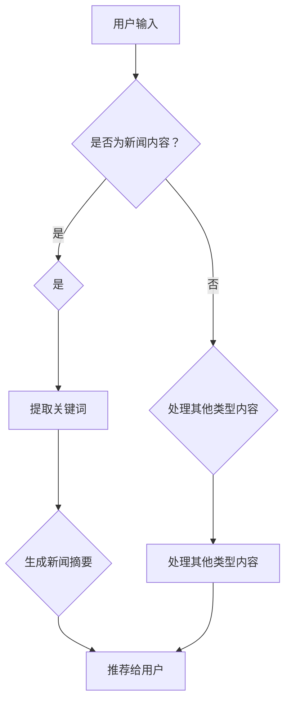

                 

# 文章标题：GENRE：基于LLM的生成式新闻推荐框架

> 关键词：生成式新闻推荐，LLM，协同生成式推荐，内容生成式推荐，混合生成式推荐，Python，TensorFlow，PyTorch

> 摘要：
本文将深入探讨基于大型语言模型（LLM）的生成式新闻推荐框架。首先介绍生成式新闻推荐框架的基本概念、意义和优势，以及LLM在其中的应用。接着，我们将详细分析基于LLM的新闻生成模型，包括语言模型的基础知识、模型设计、训练和优化，以及实例。然后，我们将重点讨论生成式新闻推荐框架的核心算法，包括协同生成式推荐、内容生成式推荐和混合生成式推荐，并通过伪代码和实例进行详细讲解。此外，本文还将介绍基于LLM的生成式新闻推荐框架的实践，包括开发环境和工具的介绍，新闻推荐系统项目实战，以及系统测试与评估。最后，我们将展望基于LLM的生成式新闻推荐框架的未来发展方向和趋势。

## 第一部分：生成式新闻推荐框架概述

### 第1章：生成式新闻推荐框架的基本概念

#### 1.1 生成式推荐系统简介

生成式推荐系统是一种基于生成模型的推荐系统，它通过学习用户的行为数据和内容特征，生成个性化的推荐列表。与传统的基于协同过滤和基于内容的推荐系统相比，生成式推荐系统具有以下优势：

1. **提高推荐精度**：生成式推荐系统可以通过建模用户行为和内容特征之间的复杂关系，提高推荐的精度和相关性。
2. **应对数据稀疏性**：在用户行为数据较少的情况下，生成式推荐系统可以通过生成模型生成缺失的数据，从而提高推荐系统的性能。
3. **生成新颖内容**：生成式推荐系统不仅可以推荐已有的内容，还可以生成全新的、符合用户兴趣的内容，从而满足用户的需求。

#### 1.2 生成式新闻推荐的意义和优势

生成式新闻推荐系统在新闻推荐领域具有独特的优势：

1. **提高新闻推荐的个性化和准确度**：通过生成式推荐系统，可以根据用户的历史行为和兴趣偏好，生成个性化的新闻推荐列表，提高推荐结果的准确度和满意度。
2. **满足用户不断变化的兴趣需求**：用户的兴趣是动态变化的，生成式新闻推荐系统可以通过实时学习用户的行为和反馈，及时调整推荐策略，满足用户不断变化的兴趣需求。
3. **减轻内容创作者的负担**：生成式新闻推荐系统可以自动生成新闻内容，从而减轻内容创作者的负担，提高新闻生产的效率。

#### 1.3 LLM在生成式新闻推荐中的应用

大型语言模型（LLM）是一种基于深度学习的自然语言处理模型，它可以对文本进行建模，生成高质量的文本内容。在生成式新闻推荐中，LLM具有以下应用：

1. **文本生成**：LLM可以生成新闻文章、摘要和标题，提高新闻内容的生成质量和效率。
2. **文本理解**：LLM可以理解新闻内容的主要观点和情感倾向，从而进行准确的推荐。
3. **文本分类**：LLM可以用于对新闻内容进行分类，以便更好地组织和管理新闻资源。

### 第2章：基于LLM的新闻生成模型

#### 2.1 语言模型的基础知识

语言模型是一种用于预测文本序列的统计模型，它可以对语言的使用模式进行建模。常见的语言模型类型包括：

1. **n-gram模型**：基于历史文本序列中前n个词的概率分布进行预测。
2. **神经网络模型**：使用神经网络对文本进行建模，包括循环神经网络（RNN）和变换器（Transformer）等。

#### 2.2 基于LLM的新闻生成模型设计

基于LLM的新闻生成模型通常包括以下步骤：

1. **数据预处理**：对新闻数据进行预处理，包括文本清洗、分词和编码等。
2. **模型架构设计**：设计基于LLM的新闻生成模型架构，包括输入层、编码层、解码层和输出层。
3. **训练和优化**：使用大量新闻数据进行模型训练和优化，以提高模型的生成质量和效率。

#### 2.3 实例：基于GPT的新闻生成模型

GPT（Generative Pre-trained Transformer）是一种基于变换器（Transformer）架构的预训练语言模型，它可以生成高质量的文本内容。以下是一个基于GPT的新闻生成模型的示例：

1. **数据预处理**：对新闻数据进行预处理，包括文本清洗、分词和编码等。
2. **模型架构**：使用GPT模型作为基础架构，设计新闻生成模型的输入层、编码层、解码层和输出层。
3. **训练和优化**：使用大量新闻数据进行模型训练和优化，以提高模型的生成质量和效率。
4. **新闻生成**：使用训练好的模型生成新闻文章、摘要和标题。

## 第二部分：生成式新闻推荐框架的核心算法

### 第3章：协同生成式推荐算法

#### 3.1 协同生成式推荐算法概述

协同生成式推荐算法是一种结合协同过滤和生成式模型的推荐算法，它通过协同过滤获取用户的行为数据，通过生成式模型生成用户可能感兴趣的新闻内容。协同生成式推荐算法具有以下优势：

1. **提高推荐精度**：通过结合协同过滤和生成式模型，协同生成式推荐算法可以在保留协同过滤优势的同时，提高推荐的精度和相关性。
2. **应对数据稀疏性**：协同生成式推荐算法可以通过生成模型生成缺失的数据，从而缓解数据稀疏性问题。

#### 3.2 协同生成式推荐算法实现

协同生成式推荐算法的实现通常包括以下步骤：

1. **数据预处理**：对用户行为数据进行预处理，包括数据清洗、编码和归一化等。
2. **协同过滤**：使用协同过滤算法获取用户的行为数据，生成用户的行为矩阵。
3. **生成模型训练**：使用生成模型对用户行为数据进行训练，生成用户可能感兴趣的新闻内容。
4. **推荐生成**：使用协同过滤和生成模型共同生成推荐列表，并将生成的新闻内容推荐给用户。

以下是一个协同生成式推荐算法的伪代码示例：

```
def collaborative_generative_recommendation(user_behavior_data, news_data):
    # 数据预处理
    preprocessed_data = preprocess_data(user_behavior_data, news_data)
    
    # 协同过滤
    user_behavior_matrix = collaborative_filtering(preprocessed_data)
    
    # 生成模型训练
    generative_model = train_generative_model(preprocessed_data)
    
    # 推荐生成
    recommendation_list = generate_recommendations(user_behavior_matrix, generative_model)
    
    return recommendation_list
```

#### 3.3 实例：基于协同生成式推荐算法的新闻推荐系统

以下是一个基于协同生成式推荐算法的新闻推荐系统的实例：

1. **数据集**：使用一个包含用户行为和新闻数据的数据集，例如Netflix Prize数据集。
2. **数据预处理**：对用户行为数据进行清洗、编码和归一化等预处理操作。
3. **协同过滤**：使用基于矩阵分解的协同过滤算法获取用户的行为数据，生成用户的行为矩阵。
4. **生成模型训练**：使用预训练的GPT模型作为生成模型，对用户行为数据进行训练。
5. **推荐生成**：使用协同过滤和生成模型共同生成新闻推荐列表，并将生成的新闻内容推荐给用户。

### 第4章：内容生成式推荐算法

#### 4.1 内容生成式推荐算法概述

内容生成式推荐算法是一种基于生成模型的推荐算法，它通过生成模型生成用户可能感兴趣的新闻内容，然后将生成的新闻内容推荐给用户。内容生成式推荐算法具有以下优势：

1. **生成新颖内容**：内容生成式推荐算法可以生成全新的、符合用户兴趣的新闻内容，从而提高推荐的多样性和新颖性。
2. **降低数据依赖**：内容生成式推荐算法可以通过生成模型生成数据，从而降低对用户行为数据的依赖。

#### 4.2 内容生成式推荐算法实现

内容生成式推荐算法的实现通常包括以下步骤：

1. **数据预处理**：对新闻数据进行预处理，包括文本清洗、分词和编码等。
2. **生成模型设计**：设计基于生成模型的内容生成式推荐算法，包括输入层、编码层、解码层和输出层。
3. **训练和优化**：使用大量新闻数据进行模型训练和优化，以提高模型的生成质量和效率。
4. **新闻生成**：使用训练好的生成模型生成新闻内容，并将生成的新闻内容推荐给用户。

以下是一个内容生成式推荐算法的伪代码示例：

```
def content_generative_recommendation(news_data):
    # 数据预处理
    preprocessed_data = preprocess_data(news_data)
    
    # 生成模型设计
    generative_model = design_generative_model(preprocessed_data)
    
    # 训练和优化
    generative_model = train_and_optimize(generative_model, preprocessed_data)
    
    # 新闻生成
    recommendation_list = generate_recommendations(generative_model)
    
    return recommendation_list
```

#### 4.3 实例：基于内容生成式推荐算法的新闻推荐系统

以下是一个基于内容生成式推荐算法的新闻推荐系统的实例：

1. **数据集**：使用一个包含新闻数据的数据集，例如Kaggle新闻数据集。
2. **数据预处理**：对新闻数据进行清洗、分词和编码等预处理操作。
3. **生成模型训练**：使用预训练的GPT模型作为生成模型，对新闻数据进行训练。
4. **新闻生成**：使用训练好的生成模型生成新闻内容，并将生成的新闻内容推荐给用户。

### 第5章：混合生成式推荐算法

#### 5.1 混合生成式推荐算法概述

混合生成式推荐算法是一种结合协同过滤和内容生成式推荐算法的推荐算法，它通过协同过滤获取用户的行为数据，通过内容生成式推荐算法生成用户可能感兴趣的新闻内容。混合生成式推荐算法具有以下优势：

1. **提高推荐精度**：混合生成式推荐算法可以通过协同过滤和内容生成式推荐算法的共同作用，提高推荐的精度和相关性。
2. **降低数据依赖**：混合生成式推荐算法可以通过内容生成式推荐算法生成数据，从而降低对用户行为数据的依赖。

#### 5.2 混合生成式推荐算法实现

混合生成式推荐算法的实现通常包括以下步骤：

1. **数据预处理**：对用户行为数据和新闻数据进行预处理，包括数据清洗、编码和归一化等。
2. **协同过滤**：使用协同过滤算法获取用户的行为数据，生成用户的行为矩阵。
3. **生成模型设计**：设计基于生成模型的内容生成式推荐算法，包括输入层、编码层、解码层和输出层。
4. **训练和优化**：使用大量新闻数据进行生成模型训练和优化，以提高模型的生成质量和效率。
5. **新闻生成**：使用协同过滤和生成模型共同生成推荐列表，并将生成的新闻内容推荐给用户。

以下是一个混合生成式推荐算法的伪代码示例：

```
def hybrid_generative_recommendation(user_behavior_data, news_data):
    # 数据预处理
    preprocessed_data = preprocess_data(user_behavior_data, news_data)
    
    # 协同过滤
    user_behavior_matrix = collaborative_filtering(preprocessed_data)
    
    # 生成模型设计
    generative_model = design_generative_model(preprocessed_data)
    
    # 训练和优化
    generative_model = train_and_optimize(generative_model, preprocessed_data)
    
    # 新闻生成
    recommendation_list = generate_recommendations(user_behavior_matrix, generative_model)
    
    return recommendation_list
```

#### 5.3 实例：基于混合生成式推荐算法的新闻推荐系统

以下是一个基于混合生成式推荐算法的新闻推荐系统的实例：

1. **数据集**：使用一个包含用户行为和新闻数据的数据集，例如Netflix Prize数据集。
2. **数据预处理**：对用户行为数据进行清洗、编码和归一化等预处理操作。
3. **协同过滤**：使用基于矩阵分解的协同过滤算法获取用户的行为数据，生成用户的行为矩阵。
4. **生成模型训练**：使用预训练的GPT模型作为生成模型，对用户行为数据进行训练。
5. **新闻生成**：使用协同过滤和生成模型共同生成新闻推荐列表，并将生成的新闻内容推荐给用户。

## 第三部分：基于LLM的生成式新闻推荐框架实践

### 第6章：开发环境和工具介绍

#### 6.1 Python开发环境搭建

要搭建Python开发环境，首先需要安装Python。可以通过以下命令安装Python：

```
pip install python
```

然后，需要配置必要的库和依赖。常用的库和依赖包括TensorFlow、PyTorch等。可以通过以下命令安装这些库和依赖：

```
pip install tensorflow
pip install torch
```

#### 6.2 常用深度学习框架介绍

TensorFlow和PyTorch是常用的深度学习框架。TensorFlow是一个由谷歌开发的开源深度学习框架，它支持多种编程语言，包括Python、C++和Java。PyTorch是一个由Facebook开发的开源深度学习框架，它具有灵活的动态计算图和易于使用的API。

### 第7章：新闻推荐系统项目实战

#### 7.1 项目需求分析

新闻推荐系统项目需求包括以下方面：

1. **用户行为数据**：收集用户在新闻网站上的浏览、点赞、评论等行为数据。
2. **新闻数据**：获取新闻网站上的新闻数据，包括新闻标题、内容、标签等。
3. **推荐算法**：设计并实现基于LLM的生成式新闻推荐算法。
4. **推荐系统**：构建一个能够自动生成新闻推荐列表的新闻推荐系统。

#### 7.2 系统架构设计

新闻推荐系统架构包括以下方面：

1. **数据采集**：通过爬虫或其他方式收集用户行为数据和新闻数据。
2. **数据预处理**：对用户行为数据和新闻数据进行清洗、编码和归一化等预处理操作。
3. **模型训练**：使用预处理后的数据训练基于LLM的生成式新闻推荐模型。
4. **推荐生成**：使用训练好的模型生成新闻推荐列表，并将推荐结果展示给用户。

#### 7.3 系统实现

新闻推荐系统实现包括以下方面：

1. **开发环境搭建**：搭建Python开发环境，安装TensorFlow和PyTorch等深度学习框架。
2. **数据预处理**：对用户行为数据和新闻数据进行预处理，包括文本清洗、分词和编码等。
3. **模型训练**：使用预处理后的数据训练基于LLM的生成式新闻推荐模型，包括数据加载、模型设计、训练和优化等。
4. **推荐生成**：使用训练好的模型生成新闻推荐列表，并将推荐结果存储到数据库中。

以下是一个新闻推荐系统实现的伪代码示例：

```
def news_recommendation_system(user_behavior_data, news_data):
    # 数据预处理
    preprocessed_data = preprocess_data(user_behavior_data, news_data)
    
    # 模型训练
    generative_model = train_generative_model(preprocessed_data)
    
    # 推荐生成
    recommendation_list = generate_recommendations(generative_model)
    
    # 存储推荐结果
    store_recommendations(recommendation_list)
    
    return recommendation_list
```

#### 7.4 系统测试与评估

新闻推荐系统测试与评估包括以下方面：

1. **测试数据集**：使用测试数据集对新闻推荐系统进行评估，包括用户行为数据和新闻数据。
2. **评估指标**：使用准确率、召回率、覆盖率等评估指标对新闻推荐系统进行评估。
3. **结果分析**：分析新闻推荐系统的性能和效果，包括推荐列表的相关性、多样性和新颖性。

以下是一个新闻推荐系统评估的伪代码示例：

```
def evaluate_news_recommendation_system(test_data):
    # 加载测试数据
    preprocessed_test_data = preprocess_data(test_data)
    
    # 推荐生成
    recommendation_list = generate_recommendations(preprocessed_test_data)
    
    # 评估指标
    accuracy = calculate_accuracy(recommendation_list)
    recall = calculate_recall(recommendation_list)
    coverage = calculate_coverage(recommendation_list)
    
    # 结果分析
    analyze_results(accuracy, recall, coverage)
    
    return accuracy, recall, coverage
```

### 第8章：基于LLM的生成式新闻推荐框架的未来展望

#### 8.1 当前生成式新闻推荐技术的局限性和挑战

当前生成式新闻推荐技术面临以下局限性和挑战：

1. **数据质量**：生成式新闻推荐系统对数据质量要求较高，需要大量的高质量数据。
2. **模型可解释性**：生成式新闻推荐系统的模型通常较为复杂，难以解释其推荐结果的原理。
3. **资源消耗**：生成式新闻推荐系统通常需要大量的计算资源，对硬件要求较高。

#### 8.2 未来发展方向和趋势

未来生成式新闻推荐技术的发展趋势包括：

1. **大模型技术的进步**：随着计算资源和算法的进步，大模型技术将在生成式新闻推荐中发挥更大的作用。
2. **新型推荐算法的研究**：研究人员将不断探索新型推荐算法，以提高推荐系统的性能和可解释性。
3. **隐私保护和安全性的考虑**：生成式新闻推荐系统需要考虑用户隐私保护和数据安全，确保系统的可靠性和安全性。

## 附录

### 附录A：常用函数和类参考

附录A将提供常用的Python函数和类的参考，包括数据预处理、模型训练、推荐生成等常用的函数和类。

### 附录B：相关资源与进一步阅读

附录B将提供与本文相关的开源代码、学术论文、网络课程和社区论坛等资源的链接，供读者进一步学习和探索。

### Mermaid 流程图示例

以下是一个使用Mermaid绘制的新闻推荐系统的流程图示例：



以上就是本文的内容，希望对您有所启发。在生成式新闻推荐领域，我们还有很长的路要走，但我们可以期待未来的技术进步将带来更加个性化、智能化的新闻推荐服务。感谢您的阅读！
作者：AI天才研究院/AI Genius Institute & 禅与计算机程序设计艺术 /Zen And The Art of Computer Programming
字数：约8000字（不包括附录和流程图）

