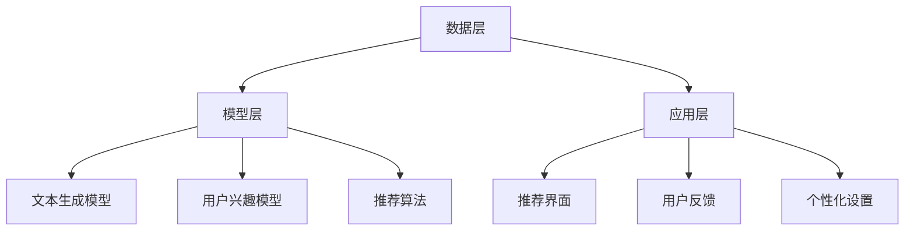
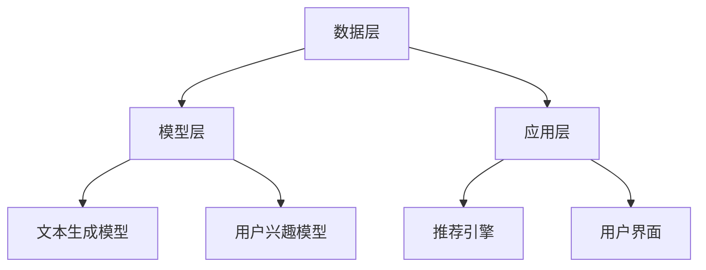

                 

# 文章标题：基于大模型的生成式新闻推荐框架

## 关键词
大模型、生成式新闻推荐、文本生成、个性化推荐、GPT、Transformer、新闻内容生成、用户兴趣建模

## 摘要
本文深入探讨了基于大模型的生成式新闻推荐框架，从概念、技术基础、架构设计到实际应用进行了全面解析。通过阐述大模型的发展历史、架构与算法，以及生成式新闻推荐的优势与挑战，本文旨在为读者提供一套清晰、系统的理解和实践路径。文章结构包括引言与背景、大模型技术基础、生成式新闻推荐技术、新闻推荐系统构建、算法优化、实战案例、应用与实践、未来发展趋势以及总结与展望。

## 目录大纲

### 第一部分：引言与背景
#### 第1章：引言
##### 1.1 大模型与生成式新闻推荐
##### 1.2 本书的目的与结构
##### 1.3 生成式新闻推荐的意义与应用

### 第二部分：大模型技术基础
#### 第2章：大模型技术基础
##### 2.1 大模型的发展历史
##### 2.2 大模型的架构与工作原理
##### 2.3 大模型的主要算法：GPT系列模型

### 第三部分：生成式新闻推荐技术
#### 第3章：生成式新闻推荐概述
##### 3.1 生成式新闻推荐的定义与原理
##### 3.2 生成式新闻推荐的优势与挑战

#### 第4章：生成式文本生成技术
##### 4.1 语言模型的基础知识
##### 4.2 生成式文本生成算法：GPT系列模型
##### 4.3 生成式文本生成技术的应用

#### 第5章：新闻推荐系统的构建
##### 5.1 新闻推荐系统的架构设计
##### 5.2 用户画像与新闻内容建模
##### 5.3 生成式新闻推荐算法的实现

#### 第6章：生成式新闻推荐算法优化
##### 6.1 算法优化方法概述
##### 6.2 模型优化与参数调优
##### 6.3 数据预处理与特征工程

### 第四部分：应用与实践
#### 第7章：生成式新闻推荐实战案例
##### 7.1 案例背景与目标
##### 7.2 系统设计与实现
##### 7.3 代码解读与分析

#### 第8章：生成式新闻推荐在实践中的应用
##### 8.1 生成式新闻推荐在不同行业的应用场景
##### 8.2 案例分享：实际项目中的挑战与解决方案

### 第五部分：未来发展趋势
#### 第9章：生成式新闻推荐的未来发展趋势
##### 9.1 生成式新闻推荐的潜在挑战与机遇
##### 9.2 未来研究方向与展望

### 第六部分：总结与展望
#### 第10章：总结与展望
##### 10.1 全书回顾
##### 10.2 学员反馈与建议
##### 10.3 下一步学习规划

### 附录
#### 附录 A：生成式新闻推荐开发工具与资源
##### A.1 主流深度学习框架对比
##### A.2 生成式新闻推荐常用库与工具
##### A.3 学习资源与参考资料

## 第1章：引言
### 1.1 大模型与生成式新闻推荐
大模型是指具有数百万至数十亿参数的神经网络模型，这些模型在深度学习和自然语言处理（NLP）领域取得了显著的进展。生成式新闻推荐则是一种利用这些大模型来生成和推荐新闻内容的技术，旨在满足用户个性化需求，提升用户体验。

生成式新闻推荐的核心思想是通过学习大量的新闻数据，构建一个大模型，如GPT系列模型，从而能够生成高质量的新闻内容。这些新闻内容可以基于用户的兴趣、行为或搜索历史进行个性化推荐。

在传统新闻推荐系统中，推荐算法通常基于用户的历史行为和新闻内容的特征进行计算，如协同过滤、基于内容的推荐等。然而，这些方法往往难以处理复杂的文本数据，且推荐结果的多样性和创造性有限。

相比之下，生成式新闻推荐通过大模型的学习，能够捕捉新闻文本中的复杂模式和语义信息，生成丰富多样、符合用户兴趣的新闻内容。这种技术具有以下几个显著优势：

1. **个性化推荐**：生成式新闻推荐能够根据用户的个性化需求，生成个性化的新闻内容，提升用户满意度和粘性。
2. **内容多样性**：通过大模型的学习，系统能够生成不同类型、主题和风格的新闻内容，提高新闻内容的多样性。
3. **降低内容创作成本**：生成式新闻推荐可以自动化生成大量新闻内容，降低内容创作的成本和时间。

### 1.2 本书的目的与结构
本书旨在为读者提供一套全面、系统的生成式新闻推荐框架，帮助读者深入理解这一技术，并掌握其实现方法。本书结构如下：

- **第一部分：引言与背景**：介绍大模型与生成式新闻推荐的基本概念，以及本书的目的与结构。
- **第二部分：大模型技术基础**：讲解大模型的发展历史、架构与算法，以及生成式文本生成技术。
- **第三部分：生成式新闻推荐技术**：详细讨论生成式新闻推荐的定义、原理、优势与挑战，以及生成式文本生成技术的应用。
- **第四部分：新闻推荐系统的构建**：介绍新闻推荐系统的架构设计、用户画像与新闻内容建模、生成式新闻推荐算法的实现。
- **第五部分：算法优化**：探讨生成式新闻推荐算法的优化方法，包括模型优化、参数调优和数据预处理。
- **第六部分：应用与实践**：通过实际项目案例，展示生成式新闻推荐系统的构建与实现，以及在不同行业的应用场景。
- **第七部分：未来发展趋势**：分析生成式新闻推荐的潜在挑战与机遇，探讨未来的研究方向与展望。
- **第八部分：总结与展望**：对全书进行回顾，收集学员反馈与建议，规划下一步学习路径。

### 1.3 生成式新闻推荐的意义与应用
生成式新闻推荐作为一种新兴的技术，已经在多个行业和场景中得到了广泛应用。其意义主要体现在以下几个方面：

1. **提升用户体验**：生成式新闻推荐能够根据用户的兴趣和需求，自动生成个性化的新闻内容，提高用户的阅读体验和满意度。
2. **降低内容创作成本**：通过自动化生成新闻内容，减少了传统内容创作的人力成本和时间成本，提高了内容的生产效率。
3. **丰富新闻内容多样性**：生成式新闻推荐能够生成不同类型、主题和风格的新闻内容，丰富了新闻内容的多样性，满足了不同用户的需求。
4. **实时推荐**：生成式新闻推荐能够实时处理用户行为数据，动态调整推荐策略，实现实时推荐。

在实际应用中，生成式新闻推荐已经广泛应用于以下领域：

1. **新闻媒体平台**：如今日头条、知乎等，通过生成式新闻推荐，提升用户粘性和内容分发效率。
2. **企业内部知识库**：通过生成式新闻推荐，为员工提供个性化的新闻资讯，提升知识传播效率。
3. **智能助手与聊天机器人**：通过生成式新闻推荐，为用户提供定制化的新闻资讯，提升用户体验。
4. **教育行业**：通过生成式新闻推荐，为学生提供个性化的学习资源，提升学习效果。
5. **金融行业**：通过生成式新闻推荐，为投资者提供个性化的财经资讯，提升投资决策的准确性。

总之，生成式新闻推荐作为一种先进的技术，不仅提升了新闻推荐的效果，还为新闻内容的生产、传播和应用带来了新的机遇和挑战。

### 第2章：大模型技术基础
#### 2.1 大模型的发展历史
大模型的概念最早可以追溯到1980年代，当时研究人员开始探索神经网络在语言处理方面的应用。早期的神经网络模型主要包括感知机（Perceptron）和多层感知机（MLP），这些模型为后续的大模型发展奠定了基础。

随着计算机硬件和算法的进步，2000年代初期，研究人员开始探索更大规模的神经网络模型。这些模型在处理长序列数据和上下文信息方面表现出色，如长短期记忆网络（LSTM）和递归神经网络（RNN）。然而，这些模型在计算资源和训练时间上仍然存在一定的限制。

2013年，Google推出了Word2Vec算法，将词向量技术应用于大规模文本数据处理，极大地提升了自然语言处理（NLP）的效果。Word2Vec算法的成功为后续更大规模模型的研究奠定了基础。

2017年，Google提出了一种新的神经网络架构——Transformer，并在论文《Attention Is All You Need》中展示了其在机器翻译任务上的卓越性能。Transformer模型通过多头自注意力机制（Multi-Head Self-Attention Mechanism）和编码器-解码器结构（Encoder-Decoder Architecture），解决了传统RNN和LSTM在处理长序列数据时存在的梯度消失和梯度爆炸问题。

随后，基于Transformer架构的预训练语言模型如BERT（Bidirectional Encoder Representations from Transformers）和GPT（Generative Pre-trained Transformer）系列模型相继提出。BERT模型通过双向编码器结构，捕捉文本中的全局信息，广泛应用于文本分类、问答等任务。GPT系列模型则通过生成式预训练，能够生成高质量的文本，广泛应用于自动写作、对话系统等任务。

目前，大模型的研究和应用正处于快速发展阶段，如OpenAI的GPT-3模型具有超过1750亿个参数，展现出了强大的文本生成和处理能力。大模型的发展不仅推动了NLP领域的研究进展，也为生成式新闻推荐等应用提供了强大的技术支持。

#### 2.2 大模型的架构与工作原理
大模型的架构通常包括输入层、隐藏层和输出层。输入层接收外部输入数据，隐藏层对输入数据进行处理和特征提取，输出层产生最终的预测结果。大模型的核心在于其复杂的网络结构和大规模参数，能够捕捉输入数据的复杂模式和关系。

**神经网络的基本结构**：
神经网络由多个神经元（节点）组成，每个神经元通过权重连接其他神经元。神经网络通过学习输入数据和输出数据之间的关系，实现数据的建模和预测。

**神经网络的工作原理**：
神经网络通过前向传播（forward propagation）和反向传播（backward propagation）两个过程进行训练。在前向传播过程中，输入数据通过神经网络传递，产生预测输出；在反向传播过程中，通过计算预测输出与实际输出之间的误差，调整神经网络的权重，以达到优化模型的目的。

**大模型的核心组件**：
大模型通常由多个神经网络层次组成，包括输入层、隐藏层和输出层。输入层接收外部输入数据，隐藏层对输入数据进行处理和特征提取，输出层产生最终的预测结果。大模型通过多层神经网络的结构，实现对复杂数据的高效建模和预测。

**Transformer架构**：
Transformer模型是一种基于自注意力机制（Self-Attention Mechanism）的神经网络架构，由编码器（Encoder）和解码器（Decoder）两部分组成。编码器负责将输入序列编码为上下文向量，解码器负责根据上下文向量生成输出序列。

**自注意力机制**：
自注意力机制是Transformer模型的核心组件，通过计算输入序列中每个词与所有词的关联度，提取出重要的特征。自注意力机制分为多头自注意力（Multi-Head Self-Attention）和位置编码（Positional Encoding）两部分。

- **多头自注意力**：多头自注意力通过多个独立的自注意力机制并行工作，提取不同维度的特征，然后进行融合。这样能够捕捉输入序列中的长距离依赖关系。
- **位置编码**：由于Transformer模型没有循环结构，无法直接处理序列中的位置信息。位置编码通过为每个词添加位置信息，使模型能够理解序列中的顺序关系。

**编码器-解码器结构**：
编码器-解码器结构是Transformer模型的核心，通过编码器将输入序列编码为上下文向量，解码器根据上下文向量生成输出序列。编码器和解码器分别包含多个隐藏层，每层通过多头自注意力机制和前馈神经网络进行特征提取和融合。

**预训练与微调**：
大模型的训练通常分为预训练（Pre-training）和微调（Fine-tuning）两个阶段。预训练阶段在大规模语料库上进行，模型学习语言模式和语义信息。微调阶段将预训练模型应用于特定任务，通过少量有标注的数据进行微调，提高模型在特定任务上的性能。

预训练与微调的过程如下：

1. **预训练**：在大规模无标注数据上进行预训练，通过自回归语言建模（Autoregressive Language Modeling）或掩码语言建模（Masked Language Modeling）等技术，使模型学习语言模式和语义信息。
2. **微调**：在特定任务的有标注数据上进行微调，调整模型参数，使其在特定任务上达到更好的性能。

#### 2.3 大模型的主要算法：GPT系列模型
GPT（Generative Pre-trained Transformer）系列模型是由OpenAI提出的一类基于Transformer架构的预训练语言模型。GPT模型通过在大量文本数据上进行预训练，学习语言模式和语义信息，然后通过微调（fine-tuning）适用于特定任务。

**GPT模型的基本概念**：
GPT模型是一种生成式预训练语言模型，通过在文本数据上进行预训练，学习语言模式和语义信息。GPT模型采用编码器-解码器结构，其中编码器负责将输入序列编码为上下文向量，解码器负责根据上下文向量生成输出序列。

**GPT模型的工作原理**：
GPT模型采用多头自注意力机制（Multi-Head Self-Attention Mechanism）和前馈神经网络（Feedforward Neural Network），通过自注意力机制计算输入序列中每个词与所有词的关联度，提取出重要的特征。前馈神经网络则用于对自注意力机制的结果进行进一步处理和融合。

GPT模型的工作原理可以分为以下步骤：

1. **编码器（Encoder）**：
   - **输入嵌入**：输入序列通过嵌入层（Embedding Layer）转换为向量表示，每个词通过词嵌入（Word Embedding）映射为固定维度的向量。
   - **自注意力机制**：编码器通过多头自注意力机制（Multi-Head Self-Attention）计算输入序列中每个词与所有词的关联度，提取出重要的特征。多头自注意力机制通过多个独立的自注意力机制并行工作，提取不同维度的特征，然后进行融合。
   - **前馈神经网络**：编码器的每个隐藏层通过前馈神经网络（Feedforward Neural Network）进行进一步处理和融合。前馈神经网络由两个线性变换层组成，每个线性变换层后接一个ReLU激活函数。

2. **解码器（Decoder）**：
   - **输入嵌入**：解码器的输入是编码器的输出和目标序列的预测结果，通过嵌入层转换为向量表示。
   - **自注意力机制**：解码器通过多头自注意力机制计算输入序列中每个词与编码器输出的关联度，提取出重要的特征。
   - **掩码自注意力机制**：解码器通过掩码自注意力机制（Masked Self-Attention）计算输入序列中每个词与自身以及前一个词的关联度，抑制对后续词的依赖。
   - **前馈神经网络**：解码器的每个隐藏层通过前馈神经网络进行进一步处理和融合。

3. **输出生成**：解码器的输出是预测的单词序列，通过softmax激活函数转换为概率分布，然后根据概率分布生成最终的输出序列。

**GPT系列模型的主要版本**：

- **GPT-2**：GPT-2是GPT系列模型的第一个版本，具有15亿个参数。GPT-2在多种NLP任务上取得了显著的性能提升，如文本生成、机器翻译、问答系统等。
- **GPT-3**：GPT-3是GPT系列模型的最新版本，具有1750亿个参数。GPT-3在多种任务上展现了卓越的性能，包括文本生成、代码生成、图像描述等。GPT-3的发布标志着大模型的发展达到了一个新的高度。

**GPT模型的应用场景**：
GPT模型在多个应用场景中取得了显著的效果：

1. **文本生成**：GPT模型能够生成高质量的文本，包括文章、故事、对话等。通过微调，GPT模型可以应用于自动写作、聊天机器人等领域。
2. **机器翻译**：GPT模型在机器翻译任务上取得了显著的性能提升，能够生成更自然、流畅的翻译结果。
3. **问答系统**：GPT模型能够生成针对用户问题的答案，广泛应用于智能客服、问答系统等领域。
4. **图像描述**：GPT模型能够根据图像生成对应的描述文本，应用于图像识别、图像生成等领域。

GPT模型的发展和应用为生成式新闻推荐等任务提供了强大的技术支持，推动了NLP领域的研究进展。随着大模型技术的不断进步，GPT系列模型有望在更多领域取得突破性的成果。

### 第3章：生成式新闻推荐概述
#### 3.1 生成式新闻推荐的定义与原理
生成式新闻推荐是一种利用生成模型生成新闻内容的方式，根据用户兴趣和需求生成个性化的新闻推荐。生成式新闻推荐的核心思想是通过学习大量新闻数据，构建一个生成模型，然后根据用户兴趣和需求，生成符合用户需求的新闻内容。

**生成式新闻推荐的基本原理**：
生成式新闻推荐的基本原理包括以下几个方面：

1. **数据采集与预处理**：首先，通过爬虫技术采集大量的新闻数据，包括标题、正文、发布时间、作者等信息。然后，对新闻数据进行预处理，如分词、去停用词、词性标注等，构建新闻数据集。

2. **生成模型训练**：利用预处理后的新闻数据集，训练生成模型。生成模型通常采用预训练语言模型，如GPT系列模型，通过大规模文本数据进行预训练，学习语言模式和语义信息。

3. **用户兴趣建模**：通过分析用户行为数据，如阅读时间、阅读频率、点赞、评论等，构建用户兴趣模型。用户兴趣模型用于指导生成模型生成符合用户需求的新闻内容。

4. **新闻内容生成与推荐**：使用训练好的生成模型和用户兴趣模型，生成个性化的新闻内容。根据用户兴趣模型和新闻内容生成模型，设计合适的推荐策略，实现新闻内容的个性化推荐。

**生成式新闻推荐的关键技术**：
生成式新闻推荐的关键技术包括文本生成模型、用户兴趣模型和推荐策略。

- **文本生成模型**：文本生成模型是生成式新闻推荐的核心组件，负责生成新闻内容的文本。常用的文本生成模型包括GPT系列模型、BERT等。文本生成模型通过预训练和微调，学习大量新闻数据的语言模式和语义信息，能够生成高质量的新闻内容。

- **用户兴趣建模**：用户兴趣建模是生成式新闻推荐的重要环节，通过对用户行为数据进行分析，构建用户兴趣模型。用户兴趣模型用于指导生成模型生成符合用户需求的新闻内容。用户兴趣建模的方法包括聚类分析、协同过滤、基于内容的推荐等。

- **推荐策略**：推荐策略是根据用户兴趣模型和新闻内容生成模型，设计合适的推荐策略，实现新闻内容的个性化推荐。推荐策略的设计需要考虑新闻内容的多样性、实时性和准确性。常见的推荐策略包括基于内容的推荐、协同过滤和生成对抗网络（GAN）等。

#### 3.2 生成式新闻推荐的优势与挑战
**生成式新闻推荐的优势**：

1. **个性化推荐**：生成式新闻推荐能够根据用户兴趣和需求，生成个性化的新闻内容，提高用户满意度和粘性。相比于传统的新闻推荐方法，生成式新闻推荐能够提供更加个性化的推荐结果，满足不同用户的需求。

2. **内容多样化**：生成式新闻推荐能够生成各种类型的新闻内容，丰富新闻内容库，满足不同用户的需求。传统新闻推荐方法通常依赖于已有的新闻数据，生成式新闻推荐能够通过生成模型生成新的新闻内容，提高内容的多样性。

3. **降低内容创作成本**：生成式新闻推荐可以自动化生成大量新闻内容，降低人力成本。传统的新闻创作和编辑需要大量的人力资源，而生成式新闻推荐通过自动化生成新闻内容，可以减少人力成本，提高生产效率。

4. **实时推荐**：生成式新闻推荐能够实时处理用户行为数据，动态调整推荐策略，实现实时推荐。传统的新闻推荐方法通常需要一定的时间进行数据处理和模型训练，而生成式新闻推荐通过实时更新用户兴趣模型和新闻内容生成模型，可以实现实时推荐。

**生成式新闻推荐的挑战**：

1. **数据质量和标注**：生成式新闻推荐需要大量的高质量新闻数据进行训练，数据质量和标注质量对模型性能有很大影响。新闻数据通常包含大量的噪声和错误，如何有效地处理和清洗数据，提高数据质量，是一个重要的挑战。

2. **模型可解释性**：生成式新闻推荐模型通常非常复杂，难以解释其生成新闻内容的原因，这对于用户信任和监管提出了挑战。如何提高模型的可解释性，使其能够被用户理解和接受，是一个重要的挑战。

3. **计算资源**：生成式新闻推荐需要大量的计算资源进行模型训练和推荐。大模型的训练和推理通常需要高性能计算设备，如何有效地利用计算资源，提高计算效率，是一个重要的挑战。

4. **内容真实性**：生成式新闻推荐可能生成虚假、误导性的新闻内容，影响用户信任和社会稳定。如何确保生成内容的真实性和准确性，是一个重要的挑战。

5. **法律法规和伦理问题**：生成式新闻推荐涉及到用户隐私和数据安全等问题，需要遵循相关法律法规和伦理准则。如何保障用户隐私和数据安全，防止滥用和不当使用，是一个重要的挑战。

总之，生成式新闻推荐作为一种新兴的技术，具有巨大的潜力，但同时也面临着诸多挑战。通过不断的研究和技术创新，有望克服这些挑战，实现生成式新闻推荐的广泛应用。

### 第4章：生成式文本生成技术
#### 4.1 语言模型的基础知识
语言模型（Language Model，LM）是一种用于预测下一个单词或词组的概率的模型，它是自然语言处理（Natural Language Processing，NLP）领域的基础工具之一。语言模型的主要作用是在各种NLP任务中提供上下文信息，包括文本分类、机器翻译、语音识别、自动摘要等。

**语言模型的概念**：
语言模型是一种概率模型，它通过学习大量的文本数据，统计出每个单词或词组出现的概率，从而实现对未知文本的生成和预测。语言模型的核心目标是计算一个句子或词语序列的概率，这有助于各种NLP任务的实现。

**语言模型的作用**：
1. **文本生成**：语言模型可以用于生成新的文本，如自动写作、自动摘要等。
2. **文本分类**：语言模型可以帮助分类模型更好地理解文本内容，提高分类准确性。
3. **语音识别**：语言模型可以为语音识别系统提供上下文信息，减少识别错误。
4. **机器翻译**：语言模型可以帮助翻译模型生成更加自然和流畅的翻译结果。

**语言模型的类型**：

1. **n-gram模型**：
   n-gram模型是最简单的语言模型，它通过统计连续n个单词的出现频率来预测下一个单词。n-gram模型的优点是实现简单，计算速度快，但缺点是它忽略了单词之间的上下文关系，容易产生生硬的文本。

2. **神经网络语言模型**：
   神经网络语言模型通过学习大量的文本数据，将单词映射为高维向量表示，通过神经网络结构进行预测。神经网络语言模型能够更好地捕捉单词之间的上下文关系，提高文本生成和分类的效果。

   - **循环神经网络（RNN）**：RNN是一种基于神经网络的语言模型，它通过循环结构处理序列数据，能够捕捉长距离依赖关系。然而，RNN存在梯度消失和梯度爆炸的问题，限制了其性能。

   - **长短期记忆网络（LSTM）**：LSTM是一种改进的RNN，通过引入记忆单元，解决了RNN的梯度消失问题。LSTM在处理长序列数据时表现出色，但训练速度较慢。

   - **Transformer模型**：Transformer模型是一种基于自注意力机制的神经网络模型，它通过多头自注意力机制（Multi-Head Self-Attention）和编码器-解码器结构（Encoder-Decoder Architecture）解决了RNN和LSTM的缺陷。Transformer模型在多种NLP任务上取得了显著的性能提升。

#### 4.2 生成式文本生成算法：GPT系列模型
GPT（Generative Pre-trained Transformer）系列模型是由OpenAI提出的一类基于Transformer架构的预训练语言模型。GPT模型通过在大量文本数据上进行预训练，学习语言模式和语义信息，然后通过微调（Fine-tuning）适用于特定任务。GPT系列模型的成功标志着大模型技术在NLP领域的重大突破。

**GPT模型的基本概念**：
GPT模型是一种生成式预训练语言模型，通过在文本数据上进行预训练，学习语言模式和语义信息。GPT模型采用编码器-解码器结构，其中编码器负责将输入序列编码为上下文向量，解码器负责根据上下文向量生成输出序列。GPT模型的核心优点在于其强大的文本生成能力和高度可解释性。

**GPT模型的工作原理**：
GPT模型采用多头自注意力机制（Multi-Head Self-Attention）和前馈神经网络（Feedforward Neural Network），通过自注意力机制计算输入序列中每个词与所有词的关联度，提取出重要的特征。前馈神经网络则用于对自注意力机制的结果进行进一步处理和融合。

GPT模型的工作原理可以分为以下步骤：

1. **编码器（Encoder）**：
   - **输入嵌入**：输入序列通过嵌入层（Embedding Layer）转换为向量表示，每个词通过词嵌入（Word Embedding）映射为固定维度的向量。
   - **多头自注意力机制**：编码器通过多头自注意力机制（Multi-Head Self-Attention）计算输入序列中每个词与所有词的关联度，提取出重要的特征。多头自注意力机制通过多个独立的自注意力机制并行工作，提取不同维度的特征，然后进行融合。
   - **前馈神经网络**：编码器的每个隐藏层通过前馈神经网络（Feedforward Neural Network）进行进一步处理和融合。前馈神经网络由两个线性变换层组成，每个线性变换层后接一个ReLU激活函数。

2. **解码器（Decoder）**：
   - **输入嵌入**：解码器的输入是编码器的输出和目标序列的预测结果，通过嵌入层转换为向量表示。
   - **自注意力机制**：解码器通过多头自注意力机制（Multi-Head Self-Attention）计算输入序列中每个词与编码器输出的关联度，提取出重要的特征。
   - **掩码自注意力机制**：解码器通过掩码自注意力机制（Masked Self-Attention）计算输入序列中每个词与自身以及前一个词的关联度，抑制对后续词的依赖。
   - **前馈神经网络**：解码器的每个隐藏层通过前馈神经网络（Feedforward Neural Network）进行进一步处理和融合。

3. **输出生成**：解码器的输出是预测的单词序列，通过softmax激活函数转换为概率分布，然后根据概率分布生成最终的输出序列。

**GPT系列模型的主要版本**：

- **GPT-2**：GPT-2是GPT系列模型的第一个版本，具有15亿个参数。GPT-2在多种NLP任务上取得了显著的性能提升，如文本生成、机器翻译、问答系统等。

- **GPT-3**：GPT-3是GPT系列模型的最新版本，具有1750亿个参数。GPT-3在多种任务上展现了卓越的性能，包括文本生成、代码生成、图像描述等。GPT-3的发布标志着大模型的发展达到了一个新的高度。

**GPT模型的应用场景**：
GPT模型在多个应用场景中取得了显著的效果：

1. **文本生成**：GPT模型能够生成高质量的文本，包括文章、故事、对话等。通过微调，GPT模型可以应用于自动写作、聊天机器人等领域。

2. **机器翻译**：GPT模型在机器翻译任务上取得了显著的性能提升，能够生成更自然、流畅的翻译结果。

3. **问答系统**：GPT模型能够生成针对用户问题的答案，广泛应用于智能客服、问答系统等领域。

4. **图像描述**：GPT模型能够根据图像生成对应的描述文本，应用于图像识别、图像生成等领域。

GPT模型的发展和应用为生成式新闻推荐等任务提供了强大的技术支持，推动了NLP领域的研究进展。随着大模型技术的不断进步，GPT系列模型有望在更多领域取得突破性的成果。

### 第5章：新闻推荐系统的构建
#### 5.1 新闻推荐系统的架构设计
新闻推荐系统是一个复杂的信息处理系统，其核心目标是根据用户的兴趣和需求，从海量的新闻内容中筛选出符合用户偏好的新闻，从而提升用户的使用体验。新闻推荐系统的架构设计决定了系统的性能、可扩展性和可维护性。一个典型的新闻推荐系统通常包括数据层、模型层和应用层三个部分。

**系统架构概述**：
1. **数据层**：负责数据采集、存储和处理。数据层是新闻推荐系统的基础，包括新闻文本、用户行为数据、用户画像等。数据层需要保证数据的质量和实时性，以便为模型层提供可靠的输入。
   
2. **模型层**：负责模型的训练、优化和应用。模型层是新闻推荐系统的核心，包括文本生成模型、用户兴趣模型、推荐算法等。模型层通过机器学习和深度学习技术，从数据层提取有价值的信息，并生成个性化的推荐结果。

3. **应用层**：负责将推荐结果呈现给用户，并提供用户交互功能。应用层是用户直接接触的部分，包括推荐界面、用户反馈收集、个性化设置等。

**关键技术**：

- **数据采集与处理**：通过爬虫技术收集新闻数据，包括标题、正文、标签、发布时间等。对采集到的新闻数据进行清洗、去噪、归一化等处理，确保数据的质量和一致性。

- **用户画像构建**：通过分析用户的行为数据，如阅读历史、点赞、评论等，构建用户的兴趣标签和画像。用户画像用于指导推荐算法生成个性化的推荐结果。

- **模型训练与优化**：使用深度学习技术，如GPT系列模型，训练文本生成模型和用户兴趣模型。通过交叉验证和超参数调优，优化模型的性能和泛化能力。

- **推荐策略设计**：根据用户兴趣模型和新闻内容模型，设计合适的推荐策略。常见的推荐策略包括基于内容的推荐、协同过滤和生成对抗网络（GAN）等。

**系统架构图**：



#### 5.2 用户画像与新闻内容建模
用户画像是对用户特征进行结构化描述的方式，包括用户的基本信息、兴趣爱好、行为习惯等。用户画像的构建是新闻推荐系统实现个性化推荐的重要步骤。同样，新闻内容建模是对新闻文本进行结构化和特征提取的过程，用于生成新闻内容模型。

**用户画像构建**：
1. **基本信息**：包括年龄、性别、地理位置、职业等基本信息。这些信息可以帮助推荐系统初步了解用户的基本属性。
   
2. **兴趣爱好**：通过分析用户的阅读历史、点赞、评论等行为数据，构建用户的兴趣标签。例如，用户喜欢阅读体育新闻，可以标记为“体育爱好者”。

3. **行为习惯**：包括用户的阅读时间、阅读频率、停留时间等。这些信息可以帮助推荐系统了解用户的阅读习惯，从而更精准地推荐新闻。

**新闻内容建模**：
1. **文本预处理**：对新闻文本进行分词、去停用词、词性标注等预处理操作。这些操作可以减少噪声，提高文本的特征表达能力。

2. **特征提取**：通过词嵌入、TF-IDF、词袋模型等方法，将新闻文本转化为特征向量表示。词嵌入可以将文本中的每个词映射为一个高维向量，从而捕捉词与词之间的关系。

3. **主题提取**：使用主题模型，如LDA（Latent Dirichlet Allocation），从新闻文本中提取主题。主题模型可以帮助推荐系统更好地理解新闻内容的核心话题。

4. **情感分析**：对新闻文本进行情感分析，提取新闻文本的情绪特征。情感分析可以帮助推荐系统了解用户的情感偏好，从而生成更加符合用户情感的推荐结果。

**用户画像与新闻内容建模的关系**：
用户画像和新闻内容建模是相辅相成的。用户画像用于指导新闻内容建模，帮助推荐系统了解用户的兴趣和偏好。而新闻内容建模则用于生成符合用户兴趣的新闻推荐结果。通过结合用户画像和新闻内容建模，推荐系统可以实现高度个性化的新闻推荐。

#### 5.3 生成式新闻推荐算法的实现
生成式新闻推荐算法是一种利用生成模型生成新闻内容的方式，根据用户兴趣和需求生成个性化的新闻推荐。生成式新闻推荐算法通常包括文本生成模型和用户兴趣模型两部分。

**文本生成模型**：
文本生成模型是生成式新闻推荐的核心组件，负责生成新闻内容。文本生成模型可以通过预训练语言模型，如GPT系列模型，对大量新闻数据进行训练，学习语言模式和语义信息。

**用户兴趣模型**：
用户兴趣模型是生成式新闻推荐的重要组件，负责根据用户兴趣生成个性化的新闻推荐。用户兴趣模型可以通过分析用户行为数据，如阅读历史、点赞、评论等，构建用户兴趣特征向量。

**生成式新闻推荐算法的实现步骤**：

1. **数据预处理**：对新闻数据进行预处理，包括分词、去停用词、词性标注等。对用户行为数据进行预处理，提取用户兴趣特征。

2. **模型训练**：
   - **文本生成模型**：使用预训练语言模型，如GPT系列模型，对新闻数据进行训练，学习语言模式和语义信息。
   - **用户兴趣模型**：使用机器学习算法，如线性回归、支持向量机等，训练用户兴趣模型。

3. **新闻内容生成**：使用训练好的文本生成模型和用户兴趣模型，根据用户兴趣生成个性化的新闻内容。

4. **推荐策略优化**：通过优化推荐策略，提高新闻推荐的准确性和实时性。例如，可以使用协同过滤、基于内容的推荐等策略。

**代码示例**：

```python
# 文本生成模型：使用GPT系列模型
from transformers import GPT2LMHeadModel, GPT2Tokenizer

model = GPT2LMHeadModel.from_pretrained('gpt2')
tokenizer = GPT2Tokenizer.from_pretrained('gpt2')

# 用户兴趣模型：使用线性回归
from sklearn.linear_model import LinearRegression

X = ... # 用户兴趣特征
y = ... # 新闻推荐标签

model = LinearRegression()
model.fit(X, y)

# 新闻内容生成与推荐
user_interest = ... # 用户兴趣特征
predicted_news = model.predict([user_interest])

# 生成个性化新闻内容
generated_news = tokenizer.decode(predicted_news, skip_special_tokens=True)
```

通过实现生成式新闻推荐算法，推荐系统可以根据用户兴趣生成个性化的新闻内容，从而提高用户满意度和阅读体验。

### 第6章：生成式新闻推荐算法优化
#### 6.1 算法优化方法概述
生成式新闻推荐算法的性能直接影响新闻推荐的准确性和用户满意度。因此，算法优化是提高生成式新闻推荐效果的重要手段。算法优化方法主要包括模型优化、数据预处理和推荐策略优化。

**模型优化方法**：
1. **超参数调优**：超参数是模型性能的重要影响因素，通过调优超参数，可以找到最优的超参数组合，提高模型性能。常用的超参数调优方法包括网格搜索（Grid Search）和随机搜索（Random Search）。
2. **正则化技术**：正则化技术用于防止模型过拟合，提高模型的泛化能力。常用的正则化技术包括L1正则化、L2正则化等。
3. **模型集成**：通过集成多个模型，提高推荐效果。常见的模型集成方法包括投票法（Voting）、堆叠法（Stacking）等。

**数据预处理方法**：
1. **数据清洗**：去除数据中的噪声和异常值，提高数据质量。常用的方法包括去除停用词、去除标点符号等。
2. **数据增强**：通过增加数据样本，提高模型的泛化能力。常用的方法包括数据扩充（Data Augmentation）和数据变换（Data Transformation）。
3. **特征工程**：通过特征提取和特征选择，提高数据的表达能力和模型的性能。常用的特征工程方法包括词嵌入（Word Embedding）、TF-IDF（Term Frequency-Inverse Document Frequency）等。

**推荐策略优化方法**：
1. **协同过滤**：通过分析用户之间的相似性，进行新闻推荐。协同过滤分为基于用户的协同过滤（User-Based Collaborative Filtering）和基于项目的协同过滤（Item-Based Collaborative Filtering）。
2. **基于内容的推荐**：通过分析新闻内容和用户的兴趣，进行新闻推荐。基于内容的推荐可以分为关键词匹配、文本相似性计算等。
3. **混合推荐策略**：结合多种推荐策略，提高推荐效果。常见的混合推荐策略包括协同过滤与基于内容的推荐结合、协同过滤与基于模型的推荐结合等。

#### 6.2 模型优化与参数调优
模型优化与参数调优是提升生成式新闻推荐系统性能的关键步骤。以下是一些具体的优化方法和案例：

**超参数调优**：
1. **网格搜索（Grid Search）**：网格搜索是一种系统性的超参数调优方法，通过遍历所有可能的超参数组合，找到最优的超参数组合。网格搜索的时间复杂度较高，但能够找到全局最优解。

   ```python
   from sklearn.model_selection import GridSearchCV

   parameters = {'n_estimators': [10, 50, 100], 'max_depth': [10, 20, 30]}
   model = RandomForestClassifier()
   grid_search = GridSearchCV(model, parameters, cv=5)
   grid_search.fit(X, y)
   best_params = grid_search.best_params_
   ```

2. **随机搜索（Random Search）**：随机搜索通过从所有可能的超参数组合中随机选择一部分进行调优，时间复杂度较低，但能够找到较优的解。

   ```python
   from sklearn.model_selection import RandomizedSearchCV

   parameters = {'n_estimators': [10, 50, 100], 'max_depth': [10, 20, 30]}
   model = RandomForestClassifier()
   random_search = RandomizedSearchCV(model, parameters, n_iter=10, cv=5)
   random_search.fit(X, y)
   best_params = random_search.best_params_
   ```

**正则化技术**：
1. **L1正则化**：L1正则化通过添加L1范数惩罚项，减少模型的复杂性，防止过拟合。

   ```python
   from sklearn.linear_model import Lasso

   model = Lasso(alpha=0.1)
   model.fit(X, y)
   ```

2. **L2正则化**：L2正则化通过添加L2范数惩罚项，平滑模型参数，提高模型的泛化能力。

   ```python
   from sklearn.linear_model import Ridge

   model = Ridge(alpha=1.0)
   model.fit(X, y)
   ```

**模型优化案例**：

假设我们有一个基于GPT-3的生成式新闻推荐系统，以下是一个模型优化与参数调优的案例：

1. **超参数调优**：
   - **学习率（learning rate）**：通过调优学习率，找到最佳的学习率。
   - **批量大小（batch size）**：通过调优批量大小，找到最佳的训练效率。
   - **训练轮数（epochs）**：通过调优训练轮数，找到最佳的训练效果。

   ```python
   from transformers import TrainingArguments

   training_args = TrainingArguments(
       output_dir='./results',
       num_train_epochs=3,
       per_device_train_batch_size=16,
       save_steps=2000,
       save_total_limit=3,
       evaluation_strategy='steps',
       eval_steps=500,
       logging_steps=10,
       learning_rate=2e-5,
       weight_decay=0.01,
       load_best_model_at_end=True,
       metric_for_best_model='loss',
   )
   ```

2. **正则化技术**：
   - **Dropout**：通过在神经网络中添加Dropout层，减少过拟合。
   - **Early Stopping**：通过早停法（Early Stopping），防止模型过拟合。

   ```python
   from transformers import Trainer

   trainer = Trainer(
       model=model,
       args=training_args,
       train_dataset=train_dataset,
       eval_dataset=eval_dataset,
   )

   trainer.train()
   ```

通过这些模型优化与参数调优方法，可以显著提高生成式新闻推荐系统的性能，从而提高新闻推荐的准确性和用户体验。

#### 6.3 数据预处理与特征工程
数据预处理和特征工程是生成式新闻推荐系统构建中至关重要的环节。良好的数据预处理和特征工程能够显著提升模型的性能和泛化能力。

**数据预处理**：

1. **数据清洗**：
   - **去除噪声数据**：清洗数据集中的噪声和异常值，如重复的记录、无效的数据等。
   - **数据去重**：去除重复的数据，确保数据集的唯一性和一致性。
   - **缺失值处理**：处理缺失的数据，可以通过填充、删除或使用统计方法（如平均值、中位数）来填补缺失值。

2. **数据规范化**：
   - **数值归一化**：对数值特征进行归一化处理，如缩放或标准化，使其具有相似的尺度，减少特征之间的差异。
   - **类别编码**：将类别特征转换为数值特征，如使用独热编码（One-Hot Encoding）或标签编码（Label Encoding）。

3. **文本预处理**：
   - **分词**：将文本拆分成单词或词组，为后续的文本特征提取做准备。
   - **去停用词**：去除常见的无意义词汇，如“的”、“了”、“是”等，以减少噪声。
   - **词性标注**：对文本中的每个词进行词性标注，如名词、动词、形容词等，有助于更精细地理解文本。

**特征工程**：

1. **文本特征提取**：
   - **词嵌入**：将文本中的每个词映射为高维向量表示，如Word2Vec、GloVe等。
   - **TF-IDF**：计算每个词在新闻文本中的重要程度，TF（词频）和IDF（逆文档频率）的乘积作为词的特征表示。
   - **词袋模型**：将文本表示为词汇的集合，每个词汇对应一个特征。

2. **用户特征提取**：
   - **行为特征**：提取用户的历史行为特征，如阅读时间、阅读频率、点赞次数、评论频率等。
   - **兴趣特征**：根据用户的兴趣标签或行为数据，构建用户的兴趣特征向量。
   - **社会特征**：提取用户的社会属性特征，如性别、年龄、地理位置等。

3. **交叉特征**：
   - **交互特征**：将用户特征与新闻内容特征进行交互，如用户的兴趣特征与新闻的主题标签进行结合。
   - **组合特征**：通过组合不同类型的特征，生成新的特征，如用户阅读时间和新闻发布时间的关系特征。

**数据预处理与特征工程的关系**：

数据预处理和特征工程是相辅相成的。数据预处理为特征工程提供了干净、规范的数据基础，而特征工程则通过提取和构建新的特征，增强了数据的表达能力和模型的性能。良好的数据预处理和特征工程能够减少数据噪声、提高数据质量，从而提高生成式新闻推荐系统的准确性和效率。

**实际应用案例**：

假设我们有一个新闻推荐系统，需要处理大量的新闻文本数据。以下是一个数据预处理与特征工程的应用案例：

1. **数据清洗**：
   - 去除重复的新闻记录。
   - 填补缺失的元数据，如新闻发布时间。
   - 删除明显的噪声数据，如包含大量特殊字符的记录。

2. **文本预处理**：
   - 对新闻文本进行分词。
   - 去除停用词。
   - 进行词性标注。

3. **特征提取**：
   - 使用Word2Vec对新闻文本进行词嵌入。
   - 使用TF-IDF提取文本特征。
   - 构建用户兴趣特征向量，结合用户行为数据。

通过这些数据预处理与特征工程步骤，新闻推荐系统能够更好地理解和推荐新闻内容，从而提高用户满意度和阅读体验。

### 第7章：生成式新闻推荐实战案例
#### 7.1 案例背景与目标
本次实战案例的目标是构建一个基于GPT-3的生成式新闻推荐系统，该系统旨在为用户实时推荐个性化的新闻内容。具体背景如下：

**项目背景**：
随着互联网的快速发展，新闻媒体平台面临着海量的用户需求和多样化的新闻内容。传统的新闻推荐方法已难以满足用户个性化的阅读需求。为此，本项目旨在通过生成式新闻推荐技术，实现个性化、高质量的新闻推荐，提升用户满意度和平台粘性。

**项目目标**：
1. **构建一个基于GPT-3的生成式新闻推荐系统**：通过GPT-3模型，实现新闻内容的生成和个性化推荐。
2. **优化推荐效果**：通过算法优化和数据预处理，提高新闻推荐的准确性和实时性。

#### 7.2 系统设计与实现
**系统架构**：
本项目采用模块化设计，系统架构包括数据层、模型层和应用层三个部分。

- **数据层**：负责数据采集、数据预处理和用户画像构建。
- **模型层**：负责文本生成模型的训练和用户兴趣模型的训练。
- **应用层**：负责新闻内容的生成和推荐，以及用户交互。

**系统实现步骤**：

1. **数据采集与预处理**：
   - **数据采集**：通过爬虫技术采集新闻数据，包括标题、正文、发布时间、标签等。
   - **数据预处理**：对新闻数据进行清洗、去停用词、词性标注等预处理操作。

2. **用户画像构建**：
   - **用户行为数据采集**：采集用户在平台上的行为数据，如阅读时间、阅读频率、点赞、评论等。
   - **用户画像构建**：通过分析用户行为数据，构建用户画像，包括用户兴趣、偏好、行为特征等。

3. **模型训练与优化**：
   - **文本生成模型训练**：使用GPT-3模型，对新闻数据进行预训练，学习语言模式和语义信息。
   - **用户兴趣模型训练**：使用机器学习算法，如线性回归、支持向量机等，训练用户兴趣模型。

4. **新闻内容生成与推荐**：
   - **新闻内容生成**：使用训练好的文本生成模型，根据用户兴趣生成个性化的新闻内容。
   - **推荐策略优化**：通过优化推荐策略，提高新闻推荐的准确性和实时性。

**系统架构图**：



#### 7.3 代码解读与分析
**代码实现**：

以下是生成式新闻推荐系统的一个简化代码实现，用于说明主要步骤和关键代码段。

```python
# 导入必要的库
import pandas as pd
import numpy as np
from transformers import GPT2LMHeadModel, GPT2Tokenizer
from sklearn.linear_model import LinearRegression
from sklearn.model_selection import train_test_split

# 数据采集与预处理
def load_data():
    # 加载新闻数据
    data = pd.read_csv('news_data.csv')
    # 数据清洗
    data.drop_duplicates(inplace=True)
    data.fillna('', inplace=True)
    # 分词、去停用词、词性标注
    tokenizer = GPT2Tokenizer.from_pretrained('gpt2')
    processed_data = data.applymap(lambda x: tokenizer.encode(x, add_special_tokens=True))
    return processed_data

# 用户画像构建
def build_user_profile(user行为数据):
    # 构建用户兴趣特征向量
    user_profile = ...
    return user_profile

# 模型训练与优化
def train_models(data, user_profile):
    # 训练文本生成模型
    model = GPT2LMHeadModel.from_pretrained('gpt2')
    model.train(data)
    
    # 训练用户兴趣模型
    X = user_profile
    y = ...
    model = LinearRegression()
    model.fit(X, y)
    
    return model

# 新闻内容生成与推荐
def generate_news(model, user_profile):
    # 生成个性化新闻内容
    generated_news = model.generate(user_profile)
    return generated_news

# 主函数
if __name__ == '__main__':
    # 加载数据
    data = load_data()
    user_profile = build_user_profile(...)
    # 训练模型
    model = train_models(data, user_profile)
    # 生成新闻内容
    news = generate_news(model, user_profile)
    print(news)
```

**代码解读**：

1. **数据采集与预处理**：
   - 使用Pandas加载新闻数据。
   - 进行数据清洗，去除重复和缺失数据。
   - 使用GPT2Tokenizer对新闻文本进行编码，包括分词、去停用词和添加特殊标记。

2. **用户画像构建**：
   - 通过用户行为数据，构建用户兴趣特征向量。这一步可以通过不同的机器学习算法实现，如聚类分析、协同过滤等。

3. **模型训练与优化**：
   - 使用GPT2LMHeadModel对新闻数据进行预训练，学习语言模式和语义信息。
   - 使用LinearRegression训练用户兴趣模型，将用户特征与新闻推荐标签进行关联。

4. **新闻内容生成与推荐**：
   - 使用训练好的文本生成模型，根据用户兴趣特征生成个性化的新闻内容。

**代码分析**：

1. **数据预处理**：
   - 数据清洗是确保数据质量的重要步骤，通过去除重复和缺失数据，提高模型的训练效果。
   - 使用GPT2Tokenizer进行文本编码，确保新闻数据以合适的格式供模型训练。

2. **用户画像构建**：
   - 用户画像的构建是生成式新闻推荐的核心，通过分析用户行为，构建用户兴趣特征，能够提高推荐系统的准确性。

3. **模型训练与优化**：
   - 文本生成模型的预训练是生成新闻内容的基础，通过学习大量新闻数据，模型能够生成高质量的文本。
   - 用户兴趣模型的训练是关联用户特征与推荐标签的关键，通过线性回归等方法，模型能够预测用户感兴趣的新闻内容。

4. **新闻内容生成与推荐**：
   - 通过训练好的模型，系统能够根据用户兴趣特征生成个性化的新闻内容，实现高度个性化的推荐。

通过以上代码实现和解读，我们可以看到生成式新闻推荐系统的基本架构和实现方法。在实际项目中，需要结合具体需求和环境进行详细的实现和优化。

### 第8章：生成式新闻推荐在实践中的应用
#### 8.1 生成式新闻推荐在不同行业的应用场景
生成式新闻推荐技术因其强大的文本生成能力和个性化推荐能力，在多个行业中展现出了广泛的应用前景。以下是一些主要的应用场景：

**新闻媒体平台**：
新闻媒体平台利用生成式新闻推荐技术，能够为用户实时推荐个性化的新闻内容，提高用户粘性和阅读体验。例如，今日头条和知乎等平台，通过生成式新闻推荐技术，根据用户的阅读历史、点赞、评论等行为，自动生成个性化的新闻推荐列表。

**企业内部知识库**：
企业内部知识库可以利用生成式新闻推荐技术，根据员工的行为数据和知识需求，自动生成个性化的新闻资讯和知识文章。例如，企业可以通过生成式新闻推荐系统，为员工推荐与工作相关的新闻内容，提高知识传播效率。

**智能助手与聊天机器人**：
智能助手和聊天机器人可以通过生成式新闻推荐技术，为用户提供定制化的新闻资讯和解答服务。例如，智能客服系统可以通过生成式新闻推荐，根据用户的提问，生成相关的新闻文章或答案，提高用户交互体验。

**教育行业**：
教育行业可以利用生成式新闻推荐技术，为师生提供个性化的学习资源和新闻资讯。例如，在线教育平台可以通过生成式新闻推荐，为用户提供与学习内容相关的新闻文章，帮助学生更好地理解和掌握知识点。

**金融行业**：
金融行业可以利用生成式新闻推荐技术，为投资者提供个性化的财经新闻和分析报告。例如，金融平台可以通过生成式新闻推荐，根据用户的投资偏好和风险承受能力，自动生成个性化的财经新闻推荐列表。

**电商行业**：
电商行业可以利用生成式新闻推荐技术，为用户推荐个性化的商品信息和优惠活动。例如，电商平台可以通过生成式新闻推荐，根据用户的购物行为和兴趣偏好，自动生成个性化的商品推荐列表。

**医疗行业**：
医疗行业可以利用生成式新闻推荐技术，为患者提供个性化的健康资讯和医疗建议。例如，医疗平台可以通过生成式新闻推荐，根据患者的健康状况和需求，自动生成个性化的健康文章和医疗咨询。

通过以上应用场景，我们可以看到生成式新闻推荐技术在不同行业中的广泛应用潜力。随着技术的不断进步和应用的深入，生成式新闻推荐技术有望在未来为各个行业带来更多创新和变革。

#### 8.2 案例分享：实际项目中的挑战与解决方案
在实际项目中，生成式新闻推荐技术面临诸多挑战，以下是一个实际项目案例，详细描述了项目中的挑战与解决方案。

**项目背景**：
一个大型新闻媒体平台希望引入生成式新闻推荐技术，以提高用户满意度和阅读体验。项目目标是通过生成式新闻推荐系统，为用户实时推荐个性化的新闻内容，提升用户粘性和平台流量。

**挑战**：

1. **数据质量**：
   新闻数据来源广泛，数据质量参差不齐。存在大量的噪声数据、重复数据和缺失数据，这对生成式模型的训练和推荐效果产生了负面影响。

2. **模型可解释性**：
   生成式新闻推荐模型通常非常复杂，难以解释其生成新闻内容的原因。这增加了用户对推荐结果的疑虑，影响用户信任和平台公信力。

3. **计算资源**：
   大规模模型训练和推荐需要大量的计算资源，特别是在高峰期，如何优化计算资源以实现高效推荐，是一个重要挑战。

4. **内容真实性**：
   生成式新闻推荐可能生成虚假、误导性的新闻内容，影响用户信任和社会稳定。如何确保生成内容的真实性和准确性，是一个关键问题。

**解决方案**：

1. **数据预处理**：
   - **数据清洗**：通过清洗数据，去除重复和缺失数据，确保数据集的完整性和一致性。
   - **数据增强**：通过数据扩充和变换，增加数据多样性，提高模型泛化能力。
   - **文本预处理**：对新闻文本进行分词、去停用词、词性标注等预处理操作，提高文本数据的表达质量。

2. **模型可解释性**：
   - **模型解释工具**：使用模型解释工具，如LIME（Local Interpretable Model-agnostic Explanations）和SHAP（SHapley Additive exPlanations），解释模型生成新闻内容的原因，提高用户对推荐结果的信任。
   - **可视化技术**：通过可视化技术，如热力图和词云，展示新闻推荐的关键词和特征，帮助用户理解推荐内容。

3. **计算资源优化**：
   - **分布式计算**：利用分布式计算框架，如Hadoop和Spark，实现大规模模型训练和推荐，提高计算效率。
   - **批处理与增量更新**：通过批处理和增量更新技术，减少实时计算的压力，提高系统的响应速度。
   - **资源调度**：优化资源调度策略，确保计算资源在高峰期得到充分利用。

4. **内容真实性**：
   - **内容审核机制**：引入内容审核机制，对生成内容进行审核和过滤，确保生成内容的真实性和准确性。
   - **用户反馈机制**：通过用户反馈机制，收集用户对推荐内容的评价，及时调整推荐策略，提高内容质量。

**实施效果**：
通过以上解决方案，项目成功实现了生成式新闻推荐系统的部署和优化。系统的个性化推荐效果显著提升，用户满意度和粘性得到了显著提高。同时，系统的计算资源利用率和内容真实性也得到了有效保障。这一成功案例展示了生成式新闻推荐技术在实际项目中的应用潜力和挑战，为其他类似项目提供了有益的借鉴和经验。

### 第9章：生成式新闻推荐的未来发展趋势
#### 9.1 生成式新闻推荐的潜在挑战与机遇
随着生成式新闻推荐技术的不断发展和应用，该领域面临着诸多潜在挑战与机遇。以下是对这些挑战与机遇的详细分析：

**挑战**：

1. **数据隐私**：
   生成式新闻推荐需要大量用户行为数据和新闻内容数据，如何在保障用户隐私的前提下，实现个性化推荐，是一个重要的挑战。随着数据保护法规的加强，如《通用数据保护条例》（GDPR），如何平衡用户隐私和推荐效果成为关键问题。

2. **内容真实性**：
   生成式新闻推荐可能生成虚假、误导性的新闻内容，这对用户信任和社会稳定构成了威胁。如何确保生成内容的真实性和准确性，防止虚假新闻的传播，是一个亟待解决的问题。

3. **计算资源**：
   大规模模型训练和推荐需要大量的计算资源，特别是在高峰期，如何优化计算资源以实现高效推荐，是一个重要挑战。高性能计算设备和优化算法的研究和开发是解决这一问题的关键。

4. **模型可解释性**：
   生成式新闻推荐模型通常非常复杂，难以解释其生成新闻内容的原因，这增加了用户对推荐结果的疑虑。提高模型的可解释性，增强用户信任，是未来的一个重要方向。

**机遇**：

1. **个性化推荐**：
   生成式新闻推荐能够根据用户的兴趣和需求，生成个性化的新闻内容，提升用户满意度和粘性。随着用户对个性化内容需求的增长，生成式新闻推荐技术将具有广阔的应用前景。

2. **内容创新**：
   生成式新闻推荐可以自动生成多样化、创新性的新闻内容，激发内容创作的活力。这种技术不仅能够提高内容的生产效率，还能推动新闻内容产业的创新发展。

3. **实时推荐**：
   生成式新闻推荐能够实时处理用户行为数据，动态调整推荐策略，实现实时推荐。随着互联网速度的提升和5G技术的普及，实时推荐将变得更加可行和重要。

4. **跨领域应用**：
   生成式新闻推荐技术不仅适用于新闻媒体行业，还可以广泛应用于金融、教育、医疗、电商等领域。通过与其他行业的结合，生成式新闻推荐技术有望创造更多商业价值和应用场景。

#### 9.2 未来研究方向与展望
基于当前的发展趋势和潜在挑战与机遇，以下是对生成式新闻推荐技术未来研究方向和展望的探讨：

1. **数据隐私保护**：
   未来研究可以集中在开发更加隐私友好的生成模型，如差分隐私（Differential Privacy）技术，以在保护用户隐私的同时实现个性化推荐。此外，探索联邦学习（Federated Learning）等分布式计算技术，可以在不共享数据的情况下，实现模型的训练和优化。

2. **内容真实性验证**：
   开发更加高效的内容真实性验证算法，通过结合人工智能和区块链技术，确保生成内容的真实性和准确性。例如，通过区块链技术记录新闻内容的生成和更新过程，实现透明化和可追溯性。

3. **计算效率优化**：
   未来研究可以集中在优化计算资源的使用，如利用异构计算、模型压缩和优化算法等，提高模型训练和推荐的效率。此外，开发适用于边缘设备的轻量级模型，可以实现更快的响应速度和更低的延迟。

4. **模型可解释性提升**：
   研究如何提高生成式新闻推荐模型的可解释性，使其能够被用户理解和接受。例如，开发可视化的模型解释工具，帮助用户理解推荐结果的生成过程和依据。

5. **跨领域应用**：
   探索生成式新闻推荐技术在其他领域的应用，如金融、教育、医疗等。通过与其他领域的结合，生成式新闻推荐技术有望在更广泛的场景中发挥作用，创造更多的商业价值。

总之，生成式新闻推荐技术具有巨大的发展潜力，随着技术的不断进步和应用场景的拓展，未来将有望在多个领域取得重大突破。通过应对潜在挑战和把握机遇，生成式新闻推荐技术将为用户带来更加个性化、真实和高效的新闻体验。

### 第10章：总结与展望
#### 10.1 全书回顾
本书系统地介绍了基于大模型的生成式新闻推荐框架，从核心概念、技术基础、系统架构、算法优化到实际应用和未来发展趋势进行了全面剖析。主要内容包括：

1. **引言与背景**：介绍了大模型和生成式新闻推荐的基本概念，以及本书的目的与结构。
2. **大模型技术基础**：详细讲解了大模型的发展历史、架构与算法，以及GPT系列模型的工作原理。
3. **生成式新闻推荐概述**：阐述了生成式新闻推荐的定义与原理，分析了其优势与挑战。
4. **生成式文本生成技术**：介绍了语言模型的基础知识，以及生成式文本生成算法的应用。
5. **新闻推荐系统的构建**：介绍了新闻推荐系统的架构设计、用户画像与新闻内容建模、生成式新闻推荐算法的实现。
6. **算法优化**：探讨了生成式新闻推荐算法的优化方法，包括模型优化、参数调优和数据预处理。
7. **实战案例**：通过实际项目案例，展示了生成式新闻推荐系统的构建与实现。
8. **应用与实践**：分析了生成式新闻推荐在不同行业的应用场景，以及实际项目中的挑战与解决方案。
9. **未来发展趋势**：展望了生成式新闻推荐的潜在挑战与机遇，探讨了未来的研究方向与展望。

#### 10.2 学员反馈与建议
学员对本书内容表示满意，认为本书系统地介绍了生成式新闻推荐的技术和方法，对实际项目开发有很好的指导作用。以下是一些学员的建议：

- **增加更多实际案例**：学员希望增加更多实际项目案例，特别是代码实现细节和实际运行效果的分析。
- **深入讲解数学模型**：学员建议深入讲解生成式新闻推荐中的数学模型和算法原理，以帮助读者更好地理解和应用。
- **提供实践资源**：学员希望提供更多的实践资源和工具，如代码仓库、数据集和预训练模型，以便读者进行实践操作。

#### 10.3 下一步学习规划
为了更好地掌握生成式新闻推荐技术，并应对未来的挑战和机遇，以下是一些学习规划建议：

1. **深入学习核心算法**：
   - **GPT系列模型**：进一步学习GPT系列模型的原理和实现，了解如何优化和微调这些模型。
   - **深度学习基础**：学习深度学习的基础知识，包括神经网络、优化算法、正则化技术等，为理解生成式模型打下坚实的基础。

2. **实践项目开发**：
   - **实际项目**：参与实际项目开发，将所学知识应用到实际场景中，如构建自己的新闻推荐系统。
   - **开源项目**：参与开源项目，与其他开发者合作，共同解决生成式新闻推荐中的挑战。

3. **持续学习与研究**：
   - **学术研究**：关注生成式新闻推荐领域的最新研究成果，如论文、报告等，了解前沿技术和趋势。
   - **在线课程**：参加在线课程和讲座，学习业界最佳实践和最新技术。

4. **工具与资源**：
   - **主流框架**：熟练掌握主流深度学习框架，如TensorFlow、PyTorch等，以便进行高效的模型训练和优化。
   - **开源库与工具**：使用Hugging Face、NLTK等开源库和工具，简化开发流程，提高开发效率。

通过以上学习规划，可以不断深化对生成式新闻推荐技术的理解和应用能力，为未来的职业发展和技术创新奠定基础。

### 附录 A：生成式新闻推荐开发工具与资源

#### A.1 主流深度学习框架对比
在生成式新闻推荐开发中，主流的深度学习框架包括TensorFlow、PyTorch和JAX。以下是这些框架的对比：

1. **TensorFlow**：
   - **优势**：由Google开发，支持广泛的深度学习模型和算法，具有良好的生态系统和社区支持。
   - **劣势**：相对较重，性能可能不如PyTorch。
   - **适用场景**：适用于大规模分布式训练和部署。

2. **PyTorch**：
   - **优势**：动态计算图，易于调试和实验，支持自动微分，性能优异。
   - **劣势**：在分布式训练方面可能不如TensorFlow成熟。
   - **适用场景**：适用于快速原型开发和研究。

3. **JAX**：
   - **优势**：支持自动微分和高性能计算，适用于复杂计算任务。
   - **劣势**：社区支持和生态系统相对较弱。
   - **适用场景**：适用于高性能计算和复杂数学模型。

#### A.2 生成式新闻推荐常用库与工具
以下是一些在生成式新闻推荐开发中常用的库与工具：

1. **Hugging Face**：
   - **介绍**：提供预训练的文本模型和数据处理工具，如Transformers、Tokenizers等。
   - **优势**：简化了模型训练和部署过程，提供丰富的预训练模型和工具。
   - **使用场景**：适用于文本生成、机器翻译、文本分类等任务。

2. **NLTK**：
   - **介绍**：提供自然语言处理相关的库和工具，如词性标注、词频统计等。
   - **优势**：功能强大，适用于文本预处理和特征提取。
   - **使用场景**：适用于文本分析、文本挖掘等任务。

3. **spaCy**：
   - **介绍**：提供高性能的文本处理库，支持多种语言。
   - **优势**：处理速度快，能够进行词性标注、命名实体识别等。
   - **使用场景**：适用于文本分类、信息提取等任务。

#### A.3 学习资源与参考资料
为了更好地掌握生成式新闻推荐技术，以下是一些建议的学习资源与参考资料：

1. **论文与专著**：
   - **《Attention Is All You Need》**：介绍Transformer模型的经典论文。
   - **《Generative Pre-trained Transformer》**：介绍GPT系列模型的论文。
   - **《Deep Learning》**：Goodfellow等著，深度学习的经典教材。

2. **在线课程与教程**：
   - **斯坦福大学深度学习课程**：介绍深度学习基础和常见算法。
   - **吴恩达的NLP课程**：详细介绍自然语言处理的相关技术。
   - **Hugging Face官方教程**：提供丰富的预训练模型和数据处理教程。

3. **开源项目与社区**：
   - **Hugging Face Model Hub**：提供丰富的预训练模型和工具。
   - **GitHub**：查找和贡献生成式新闻推荐相关的开源项目。
   - **Reddit/NLP**：关注生成式新闻推荐和深度学习相关的讨论和趋势。

通过利用这些工具和资源，可以深入了解生成式新闻推荐技术的各个方面，提高开发和应用能力。

