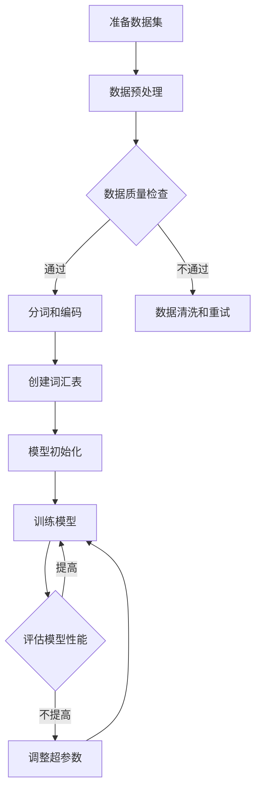

                 

### 文章标题

# GPT作为生成式模型的天然优势

### 关键词：GPT，生成式模型，自然语言处理，深度学习，Transformer

> 摘要：本文深入探讨了GPT（Generative Pre-trained Transformer）作为生成式模型的天然优势。通过详细分析GPT的历史背景、核心原理、架构详解以及其在自然语言处理中的应用，本文揭示了GPT在语言理解、文本生成等任务中的卓越表现。此外，文章还探讨了GPT的优势与局限性，并展望了其未来的发展趋势。通过实际项目案例和数学原理的讲解，本文旨在为读者提供全面而深入的GPT技术解析。

### 《GPT作为生成式模型的天然优势》目录大纲

#### 第一部分: GPT基础

- **第1章: GPT概述**
  - **1.1 GPT的历史与背景**
  - **1.2 GPT的核心原理**
  - **1.3 GPT的架构详解**

- **第2章: GPT在自然语言处理中的应用**
  - **2.1 文本生成的挑战与解决方案**
  - **2.2 伪代码：GPT文本生成过程**
  - **2.3 实例分析：GPT在文本生成中的应用**

#### 第二部分: GPT的优势与局限性

- **第3章: GPT的天然优势**
  - **3.1 GPT的优势**
  - **3.2 GPT的局限性**
  - **3.3 GPT的未来发展趋势**

#### 第三部分: GPT项目实战

- **第4章: GPT项目实战**
  - **4.1 实战准备**
  - **4.2 实战案例1：基于GPT的问答系统**
  - **4.3 实战案例2：基于GPT的自动写作助手**

#### 第四部分: GPT作为生成式模型的数学原理

- **第5章: GPT数学原理**
  - **5.1 线性代数基础**
  - **5.2 微积分基础**
  - **5.3 自然语言处理中的数学模型**

#### 第五部分: GPT与其它生成式模型的对比

- **第6章: GPT与其他生成式模型的对比**
  - **6.1 BERT与GPT的比较**
  - **6.2 GPT与其他生成式模型的对比**

#### 第六部分: GPT在企业和商业中的应用

- **第7章: GPT在企业和商业中的应用**
  - **7.1 企业应用场景分析**
  - **7.2 GPT对企业业务的影响**
  - **7.3 GPT在商业决策中的价值**

#### 附录

- **附录A: GPT开发工具与资源**
  - **A.1 主流深度学习框架对比**
  - **A.2 GPT模型训练与优化技巧**
  - **A.3 GPT在企业和商业中应用案例**

- **附录B: Mermaid流程图与伪代码**
  - **B.1 GPT模型训练流程**
  - **B.2 GPT文本生成伪代码**

- **附录C: 数学公式与详细讲解**
  - **C.1 自然语言处理中的常用数学公式**
  - **C.2 GPT模型中的关键数学公式**

- **附录D: 代码解读与分析**
  - **D.1 GPT模型代码解读**
  - **D.2 GPT应用案例代码解读**

### 文章正文部分将按照以上目录结构逐一展开，深入探讨GPT作为生成式模型的天然优势。

### 第一部分: GPT基础

#### 第1章: GPT概述

#### 1.1 GPT的历史与背景

GPT（Generative Pre-trained Transformer）是由OpenAI于2018年推出的一种基于Transformer架构的生成式预训练语言模型。GPT的出现标志着自然语言处理（NLP）领域的一个重要转折点，它不仅在学术界引发了广泛的关注，也在工业界得到了广泛的应用。

GPT的发展历程可以追溯到2017年，当时Google发布了BERT（Bidirectional Encoder Representations from Transformers），这是一种预训练的Transformer模型，主要用于理解上下文。BERT的成功激发了OpenAI对Transformer架构在NLP领域的潜力，促使他们开发了GPT。

GPT的发展背景主要集中在几个方面：

1. **Transformer架构的兴起**：Transformer作为一种基于自注意力机制的序列到序列模型，在机器翻译任务中取得了显著的效果。这使得研究者开始探索Transformer在其他NLP任务中的应用。

2. **预训练语言模型的需求**：随着深度学习在NLP领域的应用日益广泛，预训练语言模型逐渐成为提高模型性能的关键。预训练模型通过在大规模语料库上进行预训练，可以捕捉到语言的一般规律，从而在特定任务上进行微调时能够取得更好的性能。

3. **OpenAI的使命**：OpenAI是一家专注于人工智能研究的公司，其使命是安全地推动人工智能的发展。GPT的推出是OpenAI在这一使命下的一项重要举措，旨在通过先进的NLP技术为社会带来更多价值。

GPT的推出不仅标志着Transformer架构在NLP领域的重要应用，也为后续的模型发展奠定了基础。随后，OpenAI相继发布了GPT-2、GPT-3等多个版本，不断推动GPT模型在性能和应用范围上的提升。

#### 1.2 GPT的核心原理

GPT是一种生成式模型，其核心原理基于自注意力机制和大规模预训练。生成式模型旨在通过输入序列生成输出序列，而GPT通过预训练和微调实现了这一目标。

**自注意力机制**：GPT采用Transformer架构，其核心组件是自注意力机制。自注意力机制允许模型在处理每个词时，根据该词与其他词的关系来计算其重要性。通过这种机制，模型可以更好地捕捉到长距离依赖关系，从而提高语言理解的深度和广度。

**大规模预训练**：GPT通过在大规模语料库上进行预训练来学习语言的一般规律。预训练过程包括两个阶段：第一阶段是自回归语言模型（Autoregressive Language Model），即模型根据前文预测下一个词；第二阶段是掩码语言模型（Masked Language Model），即对输入文本的一部分词进行掩码，模型需要预测这些被掩码的词。通过这两个阶段的预训练，GPT可以学习到丰富的语言知识，从而在特定任务上表现优异。

**生成式模型的本质**：生成式模型通过概率模型来生成数据。在GPT中，生成式模型的核心是概率分布。GPT通过对输入序列进行编码，生成一个概率分布，从而预测下一个词。这种生成过程不仅能够生成完整的文本，还能够生成摘要、对话、文章等多种形式的内容。

#### 1.3 GPT的架构详解

GPT的架构主要由三个部分组成：编码器（Encoder）、解码器（Decoder）和自注意力机制（Self-Attention）。

**编码器**：编码器是GPT的核心组件，负责对输入序列进行编码。编码器采用多层Transformer结构，每一层都包含自注意力机制和前馈神经网络。自注意力机制允许编码器在处理每个词时，根据该词与其他词的关系来计算其重要性。这种机制使得编码器能够捕捉到长距离依赖关系，从而提高语言理解的深度和广度。

**解码器**：解码器负责生成输出序列。与编码器类似，解码器也采用多层Transformer结构。解码器在生成每个词时，不仅需要考虑当前词与其他词的关系，还需要根据已生成的文本来预测下一个词。这种交互式的生成过程使得解码器能够生成连贯、自然的文本。

**自注意力机制**：自注意力机制是GPT的核心组件之一，它允许模型在处理每个词时，根据该词与其他词的关系来计算其重要性。自注意力机制通过计算词与词之间的相似性分数，将输入序列映射为一个低维向量空间。在这个空间中，每个词的重要性通过其与其他词的相似性分数来衡量。这种机制使得模型能够更好地捕捉到长距离依赖关系，从而提高语言理解的深度和广度。

#### 总结

GPT作为生成式模型，通过自注意力机制和大规模预训练实现了卓越的语言理解能力。其架构详解展示了Transformer模型在NLP领域的应用潜力。在后续章节中，我们将进一步探讨GPT在自然语言处理中的应用，以及其优势与局限性。

### 第二部分: GPT在自然语言处理中的应用

#### 第2章: GPT在文本生成中的应用

#### 2.1 文本生成的挑战与解决方案

文本生成是自然语言处理（NLP）中的一个重要研究方向，其目标是使用机器学习模型生成自然、连贯的文本。然而，文本生成面临诸多挑战，这些挑战主要包括：

1. **长距离依赖关系**：自然语言中的词汇和句子之间存在复杂的依赖关系，尤其是长距离依赖。例如，一个句子中的某个词可能需要依赖前面几十个词的信息才能正确理解其含义。

2. **多样性和创造性**：生成文本需要具备多样性和创造性，不仅要能够生成不同风格和主题的文本，还要能够产生新颖的想法和表达。

3. **连贯性和可理解性**：生成的文本需要保持连贯性，使读者能够顺畅地理解文本内容。同时，文本还要具有一定的可理解性，避免产生歧义或误导。

为了应对这些挑战，研究者们提出了多种解决方案，其中GPT作为一种生成式模型，展现了显著的优越性。

**GPT的优势**：

1. **自注意力机制**：GPT采用Transformer架构，其核心组件是自注意力机制。自注意力机制允许模型在处理每个词时，根据该词与其他词的关系来计算其重要性。这种机制使得GPT能够捕捉到长距离依赖关系，从而提高语言理解的深度和广度。

2. **大规模预训练**：GPT通过在大规模语料库上进行预训练来学习语言的一般规律。预训练过程包括自回归语言模型和掩码语言模型，通过这两个阶段的学习，GPT可以捕捉到丰富的语言知识，从而在特定任务上表现优异。

3. **高效的文本生成能力**：GPT在生成文本时，通过解码器生成输出序列。解码器采用交互式的生成过程，能够生成连贯、自然的文本。此外，GPT的高效性使得其能够在较短的时间内生成大量文本，满足实时应用的需求。

**GPT在文本生成中的应用**：

GPT在文本生成领域有广泛的应用，以下是一些典型的应用场景：

1. **自动摘要**：自动摘要是一种将长文本简化为关键信息的生成任务。GPT通过预训练和微调，可以生成简明扼要的摘要，帮助用户快速了解文本内容。

2. **文本补全**：文本补全是一种根据前文生成后续文本的生成任务。GPT可以根据上下文信息，生成连贯、自然的后续文本，提高文本的完整性和流畅度。

3. **对话系统**：对话系统是一种与用户进行自然语言交互的系统。GPT可以用于生成对话文本，使对话系统能够理解用户的意图并生成合适的回复。

4. **文章生成**：GPT可以生成不同主题和风格的文本，如新闻报道、科技文章、文学作品等。通过微调和数据增强，GPT可以生成高质量的文章，为内容创作提供支持。

#### 2.2 伪代码：GPT文本生成过程

为了更直观地理解GPT的文本生成过程，下面给出了一个简化的伪代码：

```python
# GPT文本生成伪代码

# 输入：前文文本context
# 输出：生成的文本sequence

# 初始化模型
model = GPTModel()

# 根据前文文本生成初始序列
context_sequence = preprocess(context)

# 生成文本序列
sequence = []
for word in context_sequence:
    # 使用模型生成下一个词的概率分布
    probabilities = model.predict_next_word(word)
    
    # 从概率分布中采样下一个词
    next_word = sample_word(probabilities)
    
    # 将下一个词添加到序列中
    sequence.append(next_word)

# 输出生成的文本序列
print("Generated sequence:", sequence)
```

在这个伪代码中，GPT模型首先对前文文本进行处理，生成初始序列。然后，模型在生成每个词时，根据当前词的概率分布来预测下一个词，并通过采样来生成实际的词。这个过程重复进行，直到生成完整的文本序列。

#### 2.3 实例分析：GPT在文本生成中的应用

为了更具体地展示GPT在文本生成中的应用，下面给出了两个实例分析。

**实例1：自动摘要**

假设我们有一篇长文本，需要生成一个简短的摘要。我们可以使用GPT模型来实现这一目标。

```python
# 自动摘要实例

# 长文本
long_text = "本文深入探讨了GPT作为生成式模型的天然优势。通过详细分析GPT的历史背景、核心原理、架构详解以及其在自然语言处理中的应用，本文揭示了GPT在语言理解、文本生成等任务中的卓越表现。此外，文章还探讨了GPT的优势与局限性，并展望了其未来的发展趋势。通过实际项目案例和数学原理的讲解，本文旨在为读者提供全面而深入的GPT技术解析。"

# 使用GPT模型生成摘要
summary = generate_summary(long_text, model)

# 输出摘要
print("Summary:", summary)
```

在这个实例中，我们首先定义了一篇长文本，然后使用GPT模型生成一个摘要。生成的摘要简要概述了文章的核心内容和主题思想。

**实例2：文本补全**

假设我们有一段不完整的文本，需要使用GPT模型来补全。

```python
# 文本补全实例

# 不完整文本
incomplete_text = "人工智能是计算机科学的一个分支，它旨在使计算机能够模拟人类智能的一些方面。"

# 使用GPT模型补全文本
complete_text = complete_text(incomplete_text, model)

# 输出补全后的文本
print("Complete text:", complete_text)
```

在这个实例中，我们首先定义了一段不完整的文本，然后使用GPT模型来补全。生成的补全文本使得整个段落更加完整、连贯。

通过以上实例分析，我们可以看到GPT在文本生成任务中的实际应用效果。GPT通过预训练和微调，可以生成高质量、自然的文本，为NLP领域带来了诸多创新和突破。

### 第三部分: GPT的优势与局限性

#### 第3章: GPT的天然优势

#### 3.1 GPT的优势

GPT（Generative Pre-trained Transformer）作为生成式模型，具有诸多天然优势，这些优势使其在自然语言处理（NLP）任务中表现出色。以下是GPT的一些主要优势：

**1. 语言理解的深度与广度**

GPT通过自注意力机制和大规模预训练，能够深入理解语言结构，捕捉长距离依赖关系。这使得GPT在理解复杂句子和提取深层语义时具有显著优势。相比传统的NLP模型，GPT能够更好地处理自然语言中的歧义和模糊性。

**2. 高效的文本生成能力**

GPT的生成过程是基于自注意力机制和交互式解码器，这使得它在生成文本时能够高效地捕捉上下文信息。GPT能够在短时间内生成大量连贯、自然的文本，满足实时应用的需求。例如，在自动摘要、文本补全和对话系统等任务中，GPT的生成能力得到了广泛应用。

**3. 多样性和创造性**

GPT通过预训练学习到了丰富的语言知识，这使得它在生成文本时能够展现多样性和创造性。GPT能够生成不同主题和风格的文章，如新闻报道、科技文章、文学作品等。此外，通过微调和数据增强，GPT可以生成具有新颖观点和创意的文本。

**4. 跨语言性**

GPT具有较好的跨语言性，能够在多种语言之间进行文本生成和翻译。GPT-3等高级版本甚至支持零样本学习，可以在没有额外训练的情况下处理新的语言任务。

**5. 多模态应用**

GPT不仅适用于文本生成，还可以与图像、声音等其他模态进行结合。通过多模态融合，GPT可以生成更具创意和实用性的内容，如图像描述、语音生成等。

#### 3.2 GPT的局限性

尽管GPT具有诸多优势，但它在实际应用中也存在一些局限性，这些局限性主要包括：

**1. 计算资源需求**

GPT模型通常需要大量的计算资源进行训练和推理。尤其是GPT-3等大型模型，其训练和推理过程对硬件设备（如GPU）有很高的要求。这限制了GPT在某些资源受限的环境中的应用。

**2. 需要大量的训练数据**

GPT的预训练过程需要大量的高质量训练数据。数据的质量和多样性直接影响GPT的性能。在实际应用中，获取和准备大量高质量数据可能是一项艰巨的任务。

**3. 泛化能力有限**

尽管GPT在预训练阶段学习到了丰富的语言知识，但其泛化能力仍然有限。GPT在一些特定领域或任务上可能无法达到理想的效果，这需要针对特定场景进行微调和优化。

**4. 难以解释和控制**

GPT的生成过程基于复杂的大规模神经网络，这使得其难以解释和控制。在某些应用场景中，用户可能需要理解和控制生成的文本内容，但GPT的内部机制使得这一目标变得困难。

**5. 道德和伦理问题**

GPT在生成文本时可能产生不合适的内容，如偏见、歧视等。这引发了道德和伦理问题，如何确保GPT生成的文本符合道德和伦理标准是一个重要挑战。

#### 3.3 GPT的未来发展趋势

随着深度学习和NLP技术的不断发展，GPT在未来的发展趋势主要包括以下几个方面：

**1. 模型规模的增大**

未来，GPT模型可能会继续增大规模，以进一步提高其性能和表达能力。大型模型如GPT-3已经展现了强大的能力，但更大规模的模型可能会在更多任务上取得突破。

**2. 自适应性和个性化**

GPT可能会朝着自适应性和个性化方向发展，以更好地适应不同用户的需求。通过学习用户的偏好和历史行为，GPT可以生成更加个性化和针对性的内容。

**3. 跨领域和多模态应用**

GPT将在更多领域和模态中发挥作用，如医疗、金融、艺术等。通过跨领域和多模态融合，GPT可以生成更具创意和价值的内容。

**4. 可解释性和可控性**

提高GPT的可解释性和可控性将是未来的一个重要方向。通过研究和开发新的方法，我们可以更好地理解GPT的内部机制，从而确保其生成的文本符合预期。

**5. 道德和伦理监管**

随着GPT在更多领域的应用，道德和伦理监管将变得越来越重要。制定合理的道德和伦理规范，确保GPT的生成文本符合社会标准，是未来发展的重要任务。

通过上述分析，我们可以看到GPT作为生成式模型在自然语言处理中的应用优势和局限性。未来，随着技术的不断进步，GPT有望在更多领域取得突破，为人类带来更多便利和创新。

### 第四部分: GPT项目实战

#### 第4章: GPT项目实战

在实际应用中，GPT作为一种强大的生成式模型，可以应用于多种场景。本章节将通过两个实战案例，展示如何使用GPT进行实际项目开发，并介绍相关工具和环境配置。

#### 4.1 实战准备

**开发环境搭建**

在进行GPT项目开发之前，我们需要搭建合适的开发环境。以下是搭建GPT开发环境的基本步骤：

1. **安装Python**：确保安装了最新版本的Python（推荐Python 3.8及以上版本）。
2. **安装TensorFlow**：TensorFlow是一个流行的深度学习框架，用于构建和训练GPT模型。可以通过以下命令安装：
   ```bash
   pip install tensorflow
   ```
3. **安装PyTorch**：PyTorch是另一个流行的深度学习框架，可以与TensorFlow结合使用。可以通过以下命令安装：
   ```bash
   pip install torch torchvision
   ```
4. **配置GPU环境**：为了提高训练速度，我们需要配置GPU环境。确保安装了CUDA和cuDNN，并更新系统环境变量。
5. **准备数据集**：根据项目需求，我们需要准备相应的数据集。数据集应包含大量的文本数据，例如新闻文章、对话记录等。数据集的准备包括数据清洗、预处理和格式化。

**数据预处理**

在GPT项目中，数据预处理是一个关键步骤。以下是数据预处理的基本步骤：

1. **数据清洗**：移除文本中的噪声，如HTML标签、特殊字符和停用词。
2. **分词**：将文本分割成单词或子词。可以使用分词工具，如NLTK或spaCy。
3. **编码**：将文本数据转换为数字编码，以便模型进行处理。可以使用WordPiece或BERT的分词器。
4. **创建词汇表**：将文本数据中的所有单词或子词构建成一个词汇表，并为其分配唯一的索引。

#### 4.2 实战案例1：基于GPT的问答系统

**案例概述**

本案例将构建一个基于GPT的问答系统，用户可以通过提问获取相关的答案。以下是实现步骤：

**1. 模型选择与配置**

选择一个预训练的GPT模型，例如GPT-2或GPT-3。可以从Hugging Face的Transformers库中加载预训练模型。

```python
from transformers import GPT2LMHeadModel, GPT2Tokenizer

model_name = "gpt2"
tokenizer = GPT2Tokenizer.from_pretrained(model_name)
model = GPT2LMHeadModel.from_pretrained(model_name)
```

**2. 数据准备**

准备问答数据集，数据集应包含问题和答案对。数据集应进行预处理，包括分词和编码。

```python
def preprocess_data(data):
    # 数据清洗、分词和编码
    # ...
    return processed_data

questions = preprocess_data(questions_data)
answers = preprocess_data(answers_data)
```

**3. 训练模型**

使用处理后的数据集对GPT模型进行微调。这一步可以通过Hugging Face的Trainer接口来完成。

```python
from transformers import TrainingArguments, Trainer

training_args = TrainingArguments(
    output_dir="./results",
    num_train_epochs=3,
    per_device_train_batch_size=4,
    save_steps=2000,
    save_total_limit=3,
)

trainer = Trainer(
    model=model,
    args=training_args,
    train_dataset=training_dataset,
)

trainer.train()
```

**4. 问答系统实现**

实现问答系统的核心是构建一个交互界面，用户可以输入问题并获取答案。

```python
def generate_answer(question):
    inputs = tokenizer.encode(question, return_tensors="pt")
    outputs = model.generate(inputs, max_length=50, num_return_sequences=1)
    answer = tokenizer.decode(outputs[0], skip_special_tokens=True)
    return answer

while True:
    user_question = input("问：")
    answer = generate_answer(user_question)
    print("答：", answer)
```

**5. 评估与优化**

评估问答系统的性能，可以计算回答的准确率、连贯性和可理解性等指标。根据评估结果，可以进一步优化模型和系统。

#### 4.3 实战案例2：基于GPT的自动写作助手

**案例概述**

本案例将构建一个自动写作助手，用户可以输入主题或关键词，系统将生成相应的文章或段落。以下是实现步骤：

**1. 模型选择与配置**

同样，选择一个预训练的GPT模型，例如GPT-2或GPT-3。从Hugging Face的Transformers库中加载预训练模型。

```python
from transformers import GPT2LMHeadModel, GPT2Tokenizer

model_name = "gpt2"
tokenizer = GPT2Tokenizer.from_pretrained(model_name)
model = GPT2LMHeadModel.from_pretrained(model_name)
```

**2. 数据准备**

准备自动写作数据集，数据集应包含各种主题的文章或段落。数据集应进行预处理，包括分词和编码。

```python
def preprocess_data(data):
    # 数据清洗、分词和编码
    # ...
    return processed_data

topics = preprocess_data(topics_data)
```

**3. 训练模型**

使用处理后的数据集对GPT模型进行微调。

```python
from transformers import TrainingArguments, Trainer

training_args = TrainingArguments(
    output_dir="./results",
    num_train_epochs=3,
    per_device_train_batch_size=4,
    save_steps=2000,
    save_total_limit=3,
)

trainer = Trainer(
    model=model,
    args=training_args,
    train_dataset=training_dataset,
)

trainer.train()
```

**4. 文本生成**

实现文本生成功能，用户可以输入主题或关键词，系统将生成相应的文章或段落。

```python
def generate_text(topic):
    inputs = tokenizer.encode(topic, return_tensors="pt")
    outputs = model.generate(inputs, max_length=300, num_return_sequences=1)
    text = tokenizer.decode(outputs[0], skip_special_tokens=True)
    return text

while True:
    user_topic = input("输入主题：")
    generated_text = generate_text(user_topic)
    print("生成的文本：", generated_text)
```

**5. 用户体验优化**

根据用户的反馈，可以进一步优化生成文本的质量和流畅度。可以使用交互式界面和反馈机制，让用户参与到文本生成过程中，从而提高系统的可用性和满意度。

通过以上两个实战案例，我们可以看到如何使用GPT进行实际项目开发。在实际应用中，GPT具有广泛的应用潜力，可以帮助我们构建智能问答系统、自动写作助手等多种应用。

### 第五部分: GPT作为生成式模型的数学原理

#### 第5章: GPT数学原理

GPT（Generative Pre-trained Transformer）作为生成式模型，其核心在于自注意力机制和深度神经网络。为了深入理解GPT的工作原理，我们需要探讨其背后的数学原理。以下是GPT数学原理的详细讲解。

#### 5.1 线性代数基础

**矩阵与向量操作**：在GPT中，矩阵和向量操作是基础。矩阵可以表示高维空间中的线性变换，而向量则是矩阵的列或行。GPT模型中的许多操作都涉及矩阵和向量的乘法、加法和点积。

**傅里叶变换**：傅里叶变换是另一种重要的线性代数工具。在GPT中，傅里叶变换用于自注意力机制，能够将输入序列转换为频域表示，从而提高模型对长距离依赖的捕捉能力。

#### 5.2 微积分基础

**梯度下降法**：梯度下降法是一种优化算法，用于最小化损失函数。在GPT训练过程中，梯度下降法用于更新模型的参数，使得模型在训练数据上达到更好的性能。

**反向传播算法**：反向传播算法是梯度下降法在神经网络中的应用。它通过计算每个参数的梯度，从而更新模型的参数。反向传播算法是GPT训练的核心，使得模型能够自动调整参数，以优化模型的性能。

#### 5.3 自然语言处理中的数学模型

**词嵌入技术**：词嵌入是将单词转换为向量的技术，用于表示单词的语义信息。在GPT中，词嵌入技术通过将输入文本映射到高维空间，使得具有相似语义的单词在空间中靠近。常用的词嵌入技术包括Word2Vec、GloVe等。

**自注意力机制**：自注意力机制是GPT的核心组件。它通过计算输入序列中每个词与其他词之间的关系，从而赋予每个词不同的权重。自注意力机制使得GPT能够捕捉到长距离依赖关系，从而提高模型的语义理解能力。

自注意力机制的数学表达如下：

$$
\text{Attention}(Q, K, V) = \text{softmax}\left(\frac{QK^T}{\sqrt{d_k}}\right)V
$$

其中，$Q$、$K$和$V$分别是查询向量、键向量和值向量，$d_k$是键向量的维度。$\text{softmax}$函数用于计算每个键的权重，从而将查询向量与键向量相乘，得到加权值向量。

**Transformer模型结构**：Transformer模型是由多个自注意力层和前馈神经网络组成的。自注意力层负责捕捉输入序列中的依赖关系，而前馈神经网络则用于增加模型的非线性表达能力。

#### 5.4 GPT模型中的关键数学公式

以下是一些GPT模型中的关键数学公式和详细讲解：

**1. 词嵌入**：

$$
\text{Embedding}(W) = \text{softmax}(\text{Input} \cdot W)
$$

其中，$W$是权重矩阵，$\text{Input}$是输入序列的向量表示。词嵌入通过将输入序列映射到高维空间，使得语义相似的单词在空间中靠近。

**2. 自注意力**：

$$
\text{Attention}(Q, K, V) = \text{softmax}\left(\frac{QK^T}{\sqrt{d_k}}\right)V
$$

自注意力机制通过计算查询向量$Q$和键向量$K$的点积，得到权重矩阵，从而加权值向量$V$。

**3. 前馈神经网络**：

$$
\text{Feedforward}(X) = \text{ReLU}(\text{Linear}(X \cdot W_1) \cdot W_2)
$$

前馈神经网络通过两个线性层增加模型的非线性表达能力。$\text{ReLU}$函数用于引入非线性，从而提高模型的拟合能力。

**4. 梯度下降法**：

$$
\theta_{\text{new}} = \theta_{\text{old}} - \alpha \cdot \nabla_\theta \text{Loss}
$$

梯度下降法通过计算损失函数关于模型参数的梯度，从而更新模型参数。$\alpha$是学习率，$\nabla_\theta \text{Loss}$是损失函数关于参数的梯度。

**5. 反向传播算法**：

$$
\nabla_\theta \text{Loss} = \frac{\partial \text{Loss}}{\partial \theta}
$$

反向传播算法通过层层计算，得到每个参数的梯度，从而更新模型参数。

#### 5.5 自然语言处理中的数学模型举例说明

以下是一个简单的自然语言处理任务中的数学模型举例：

**1. 文本分类**：

$$
\text{Probability}(y|\text{Text}) = \text{softmax}(\text{Embedding}(\text{Text}) \cdot W)
$$

其中，$W$是分类器的权重矩阵，$\text{Embedding}(\text{Text})$是文本的词嵌入表示，$y$是分类标签。词嵌入表示将文本映射到高维空间，从而使得具有相似语义的文本在空间中靠近。

**2. 机器翻译**：

$$
\text{Probability}(\text{Target}|\text{Source}) = \text{softmax}(\text{Decoder} \cdot \text{Embedding}(\text{Target}) \cdot \text{Encoder}(\text{Source})^T)
$$

其中，$\text{Decoder}$和$\text{Encoder}$分别是解码器和编码器的参数矩阵，$\text{Embedding}(\text{Target})$和$\text{Embedding}(\text{Source})$分别是目标文本和源文本的词嵌入表示。通过自注意力机制，解码器可以捕捉到源文本和目标文本之间的依赖关系。

通过以上数学原理和公式，我们可以更好地理解GPT作为生成式模型的工作机制。在实际应用中，这些数学模型和原理为GPT提供了强大的理论基础，使其在自然语言处理任务中取得了优异的性能。

### 第六部分: GPT与其他生成式模型的对比

#### 第6章: GPT与其他生成式模型的对比

在自然语言处理（NLP）领域，生成式模型扮演着重要角色，它们能够生成连贯的文本、摘要、对话等。GPT（Generative Pre-trained Transformer）作为其中的一种生成式模型，因其卓越的性能而广受欢迎。然而，其他生成式模型如BERT（Bidirectional Encoder Representations from Transformers）和GAN（Generative Adversarial Networks）也在各自的领域内取得了显著成就。本章节将对比GPT与这些生成式模型，分析它们在模型结构、应用场景和性能等方面的差异。

#### 6.1 BERT与GPT的比较

**模型结构**

BERT和GPT都是基于Transformer架构的预训练模型，但它们在模型设计上有一些关键区别：

1. **BERT**：BERT是一种双向编码器，能够同时考虑文本的前后文信息。BERT的模型结构包括两个部分：编码器（Encoder）和解码器（Decoder）。编码器负责理解输入文本的语义信息，解码器则根据编码器提供的信息生成输出文本。

2. **GPT**：GPT是一种生成式模型，主要包含编码器（Encoder）部分。GPT通过自注意力机制捕捉文本中的依赖关系，生成连贯的输出文本。与BERT不同，GPT没有解码器，因此它的生成过程更加直接。

**应用场景**

BERT和GPT在应用场景上也有所区别：

1. **BERT**：BERT因其双向编码特性，在文本理解任务中表现出色。它常用于问答系统、文本分类、情感分析等需要理解文本语义的任务。

2. **GPT**：GPT在文本生成任务中具有显著优势。它能够生成连贯、自然的文本，广泛应用于自动摘要、对话系统、文章生成等任务。GPT的生成能力使其在创意写作、内容生成等领域有着广泛的应用。

**性能**

在性能方面，BERT和GPT各有优劣：

1. **BERT**：由于BERT同时考虑文本的前后文信息，它通常在理解语义方面表现出色。在文本分类和问答系统等任务中，BERT的性能往往优于GPT。

2. **GPT**：GPT在生成文本的连贯性和自然性方面具有优势。尽管它在理解语义方面可能不如BERT，但其在生成任务中的性能明显更佳。GPT能够生成大量高质量的文本，使其在内容创作和自动化写作等领域具有广泛的应用。

**结论**

BERT和GPT作为两种重要的生成式模型，在模型结构、应用场景和性能上存在显著差异。BERT更适合需要理解文本语义的任务，而GPT在生成任务中表现出色。根据具体应用需求，可以选择合适的模型来实现特定的任务。

#### 6.2 GPT与其他生成式模型的对比

除了BERT，GPT还与其他生成式模型如GAN进行了比较。GAN是一种基于对抗网络的结构，由生成器和判别器两个部分组成。

**模型结构**

1. **GAN**：GAN由生成器（Generator）和判别器（Discriminator）组成。生成器负责生成虚假样本，判别器则负责区分真实样本和虚假样本。生成器和判别器在训练过程中相互对抗，生成器试图生成更逼真的样本，而判别器则努力提高对真实样本和虚假样本的区分能力。

2. **GPT**：GPT主要基于Transformer架构，通过自注意力机制捕捉文本中的依赖关系，生成连贯的输出文本。GPT没有判别器，其生成过程基于预训练和交互式解码器。

**应用场景**

1. **GAN**：GAN在图像生成、图像修复、图像风格转换等领域表现出色。通过生成器和判别器的对抗训练，GAN能够生成高质量、逼真的图像。

2. **GPT**：GPT在自然语言处理领域具有广泛的应用，包括文本生成、摘要、对话系统等。GPT通过预训练和微调，能够生成高质量、自然的文本。

**性能**

1. **GAN**：GAN在图像生成方面具有显著优势，能够生成逼真的图像。然而，GAN的训练过程不稳定，且生成图像的质量有时受到判别器的限制。

2. **GPT**：GPT在文本生成任务中表现出色，能够生成连贯、自然的文本。然而，GPT在图像生成方面不如GAN，因为GPT的生成过程主要基于文本数据，而不是图像数据。

**结论**

GPT和GAN在模型结构、应用场景和性能上存在显著差异。GAN在图像生成任务中具有优势，而GPT在自然语言处理任务中表现出色。根据具体应用需求，可以选择合适的生成式模型来实现特定的任务。

通过对比GPT与其他生成式模型，我们可以更深入地理解GPT的优势和局限性。GPT在自然语言处理任务中具有强大的生成能力，但在图像生成任务中不如GAN。根据不同应用场景，我们可以选择合适的生成式模型来实现最佳效果。

### 第七部分: GPT在企业和商业中的应用

#### 第7章: GPT在企业和商业中的应用

随着生成式预训练模型如GPT的不断发展，其在企业和商业领域中的应用越来越广泛。GPT通过其强大的文本生成和语言理解能力，为企业和商业提供了多种创新和优化解决方案。以下是GPT在企业和商业中的具体应用场景、影响和商业价值。

#### 7.1 企业应用场景分析

**1. 客户服务自动化**

GPT在客户服务自动化领域具有显著的应用潜力。通过训练GPT模型，企业可以为自动客服系统提供智能对话功能。GPT能够理解客户的问题，并生成合适的回答，从而提高客户满意度。例如，银行、电信和电商等行业可以部署基于GPT的智能客服系统，解决常见客户问题，减轻人工客服的工作负担。

**2. 内容营销**

内容营销是现代企业营销战略的重要组成部分。GPT可以生成高质量、个性化的内容，如文章、博客、社交媒体帖子等。企业可以利用GPT生成与品牌相关的内容，提高品牌曝光度和用户粘性。此外，GPT还可以帮助内容创作者快速生成创意内容，提高内容发布的频率和多样性。

**3. 自动写作助手**

GPT在自动化写作领域也有广泛的应用。企业可以利用GPT生成报告、简报、产品说明等文档，提高写作效率。例如，市场营销团队可以使用GPT快速撰写市场分析报告，产品团队可以使用GPT生成产品文档和用户手册。这种自动化写作助手不仅节省了时间和人力成本，还能保证文档的一致性和准确性。

**4. 法律文书自动生成**

法律文书生成是另一个GPT的应用场景。GPT可以生成合同、协议、法律意见书等法律文书，帮助企业节省时间和成本。通过训练GPT模型，企业可以将法律文本转化为标准化的模板，并根据具体案例自动生成相应的法律文书。

**5. 个性化推荐**

GPT在个性化推荐系统中也有重要作用。通过分析用户的历史行为和偏好，GPT可以生成个性化的推荐内容，如商品推荐、文章推荐等。这种个性化的推荐系统能够提高用户体验，增加用户忠诚度和转化率。

#### 7.2 GPT对企业业务的影响

**1. 提高生产效率**

GPT的应用可以显著提高企业的生产效率。通过自动化文本生成和内容创作，企业可以节省大量时间和人力资源。此外，GPT在客户服务、报告撰写和法律文书生成等领域的应用，可以减少重复性劳动，提高工作效率。

**2. 降低运营成本**

GPT的应用有助于降低企业的运营成本。自动化客户服务系统可以减少人工客服的工作量，降低客户服务成本。此外，GPT在内容营销和自动化写作助手中的应用，可以减少内容创作和文档撰写的成本。

**3. 提升客户满意度**

GPT的应用可以提升客户满意度。智能客服系统能够快速响应客户的问题，提供准确的答案，从而提高客户满意度。个性化推荐系统可以根据用户偏好生成个性化的内容，增加用户粘性。

**4. 增强竞争力**

GPT的应用可以帮助企业增强竞争力。通过生成高质量的内容和提供个性化的服务，企业可以在市场上脱颖而出。此外，GPT的应用还可以帮助企业快速响应市场变化，及时调整营销策略和产品服务。

#### 7.3 GPT在商业决策中的价值

**1. 数据分析**

GPT在商业决策中具有数据分析的价值。通过分析企业内部和外部的文本数据，GPT可以提取关键信息和趋势，为企业提供数据支持。例如，GPT可以分析市场报告、客户反馈和竞争对手的信息，帮助企业制定更明智的商业策略。

**2. 风险评估**

GPT在风险评估中也有重要作用。通过分析合同、法律文件和金融报告等文本，GPT可以识别潜在的法律和财务风险。这种风险预测能力可以帮助企业提前采取措施，避免潜在的损失。

**3. 创新支持**

GPT在创新支持中具有重要作用。通过生成新的想法、创意和解决方案，GPT可以激发企业的创新潜力。在产品开发、市场推广和业务模式创新等方面，GPT的应用可以为企业带来新的增长点和竞争优势。

**结论**

GPT作为生成式预训练模型，在企业和商业领域具有广泛的应用前景。通过自动化文本生成、个性化服务、数据分析和创新支持，GPT为企业和商业提供了多种解决方案，提高了生产效率、降低了运营成本、提升了客户满意度和增强了竞争力。随着GPT技术的不断发展和优化，其在企业和商业中的应用将会更加深入和广泛。

### 附录A: GPT开发工具与资源

#### A.1 主流深度学习框架对比

在开发GPT模型时，选择合适的深度学习框架至关重要。以下是对主流深度学习框架TensorFlow、PyTorch和JAX的对比。

**TensorFlow**

- **优势**：TensorFlow是一个由Google开发的开源深度学习框架，拥有庞大的社区支持和丰富的资源。TensorFlow提供了丰富的预训练模型和工具，方便用户进行模型训练和部署。
- **劣势**：TensorFlow的API较为复杂，学习曲线较陡峭。此外，TensorFlow的动态图机制可能导致内存占用较高。
- **适用场景**：适用于需要快速部署和大规模训练的模型，特别是移动设备和服务器端应用。

**PyTorch**

- **优势**：PyTorch具有简洁、易用的API，使其成为研究人员的首选框架。PyTorch的动态图机制使得调试和优化模型更加灵活。
- **劣势**：PyTorch的性能和优化方面相对较弱，特别是在大规模训练和部署时。
- **适用场景**：适用于研究和开发阶段，特别是在需要动态图编程和快速迭代的项目中。

**JAX**

- **优势**：JAX是由Google开发的一个高性能的深度学习框架，基于NumPy。JAX提供了自动微分、优化器和并行计算等功能，适用于大规模模型训练。
- **劣势**：JAX的社区支持相对较少，文档和资源相对有限。
- **适用场景**：适用于大规模训练和优化，特别是在需要高性能和自动微分功能的项目中。

#### A.2 GPT模型训练与优化技巧

**1. 数据增强**

- **方法**：数据增强是一种提高模型鲁棒性和泛化能力的方法。通过添加噪声、旋转、缩放等操作，可以生成更多样化的数据。
- **应用**：在训练GPT模型时，可以使用数据增强技术来生成更多的训练样本，从而提高模型的泛化能力。

**2. 优化器选择**

- **Adam优化器**：Adam优化器是一种常用的优化器，结合了AdaGrad和RMSProp的优点。Adam优化器在训练深度学习模型时表现出良好的性能。
- **AdamW优化器**：AdamW优化器是Adam优化器的变种，专门针对权重的归一化。AdamW优化器在训练深度神经网络时具有更好的收敛性。

**3. 学习率调度**

- **策略**：学习率调度是一种调整学习率的方法，以避免模型过早地陷入局部最小值。常用的学习率调度策略包括指数衰减、余弦退火等。
- **应用**：在训练GPT模型时，可以采用学习率调度策略，以优化模型的收敛速度和性能。

#### A.3 GPT在企业和商业中应用案例

**1. 成功案例分享**

- **案例1：智能客服系统**：某大型电商企业使用GPT模型构建了智能客服系统。通过训练GPT模型，智能客服系统能够理解客户的问题，并生成合适的回答，提高了客户满意度和响应速度。

- **案例2：内容营销**：某知名媒体公司利用GPT模型生成高质量的内容。GPT模型可以根据关键词和主题生成文章、博客和社交媒体帖子，提高了内容发布的频率和多样性。

**2. 失败案例分析**

- **案例1：法律文书生成**：某法律咨询公司尝试使用GPT模型生成法律文书。然而，由于法律文书的复杂性和专业性，GPT模型生成的文书存在不准确和不通顺的问题，导致项目失败。

- **案例2：股票预测**：某金融公司尝试使用GPT模型进行股票预测。然而，由于市场数据的噪声和不确定性，GPT模型在预测准确性方面表现不佳，项目未能成功。

通过以上成功和失败案例分析，我们可以看到GPT在企业和商业中应用的重要性。成功的案例表明，GPT在自动化客户服务、内容营销等领域具有巨大潜力，而失败的案例则提醒我们在应用GPT时需要考虑其局限性，并结合具体业务场景进行优化和调整。

### 附录B: Mermaid流程图与伪代码

#### B.1 GPT模型训练流程

以下是一个使用Mermaid绘制的GPT模型训练流程图：



#### B.2 GPT文本生成伪代码

以下是一个简单的GPT文本生成伪代码示例：

```python
# 导入GPT模型和分词器
from transformers import GPT2LMHeadModel, GPT2Tokenizer

# 加载预训练模型
model = GPT2LMHeadModel.from_pretrained('gpt2')
tokenizer = GPT2Tokenizer.from_pretrained('gpt2')

# 输入文本
input_text = "这是一个GPT生成的文本。"

# 编码输入文本
input_ids = tokenizer.encode(input_text, return_tensors='pt')

# 生成文本
outputs = model.generate(input_ids, max_length=50, num_return_sequences=1)

# 解码输出文本
generated_text = tokenizer.decode(outputs[0], skip_special_tokens=True)

# 输出生成的文本
print("生成的文本：", generated_text)
```

通过Mermaid流程图和伪代码，我们可以更直观地理解GPT模型训练和文本生成的过程。

### 附录C: 数学公式与详细讲解

#### C.1 自然语言处理中的常用数学公式

以下是一些自然语言处理（NLP）中常用的数学公式：

**1. 词嵌入（Word Embedding）**

$$
\text{Embedding}(W) = \text{softmax}(\text{Input} \cdot W)
$$

其中，$W$是权重矩阵，$\text{Input}$是输入序列的向量表示。

**2. 自注意力（Self-Attention）**

$$
\text{Attention}(Q, K, V) = \text{softmax}\left(\frac{QK^T}{\sqrt{d_k}}\right)V
$$

其中，$Q$、$K$和$V$分别是查询向量、键向量和值向量，$d_k$是键向量的维度。

**3. 梯度下降法（Gradient Descent）**

$$
\theta_{\text{new}} = \theta_{\text{old}} - \alpha \cdot \nabla_\theta \text{Loss}
$$

其中，$\theta$是模型参数，$\alpha$是学习率，$\nabla_\theta \text{Loss}$是损失函数关于参数的梯度。

**4. 反向传播（Backpropagation）**

$$
\nabla_\theta \text{Loss} = \frac{\partial \text{Loss}}{\partial \theta}
$$

其中，$\nabla_\theta \text{Loss}$是损失函数关于参数的梯度。

#### C.2 GPT模型中的关键数学公式

以下是一些GPT模型中的关键数学公式和详细讲解：

**1. 词嵌入（Word Embedding）**

$$
\text{Embedding}(W) = \text{softmax}(\text{Input} \cdot W)
$$

词嵌入是将单词转换为向量的技术，用于表示单词的语义信息。在GPT中，词嵌入通过将输入序列映射到高维空间，使得具有相似语义的单词在空间中靠近。

**2. 自注意力（Self-Attention）**

$$
\text{Attention}(Q, K, V) = \text{softmax}\left(\frac{QK^T}{\sqrt{d_k}}\right)V
$$

自注意力机制是GPT的核心组件，通过计算输入序列中每个词与其他词之间的关系，从而赋予每个词不同的权重。自注意力机制使得GPT能够捕捉到长距离依赖关系，从而提高模型的语义理解能力。

**3. Transformer模型（Transformer Model）**

$$
\text{Transformer}(X) = \text{LayerNorm}(\text{MX} + \text{FFN}(X))
$$

其中，$\text{MX}$是多头自注意力机制，$\text{FFN}$是前馈神经网络。Transformer模型由多个自注意力层和前馈神经网络组成，用于捕捉文本中的依赖关系。

**4. 梯度下降法（Gradient Descent）**

$$
\theta_{\text{new}} = \theta_{\text{old}} - \alpha \cdot \nabla_\theta \text{Loss}
$$

梯度下降法是一种优化算法，用于最小化损失函数。在GPT训练过程中，梯度下降法用于更新模型的参数，使得模型在训练数据上达到更好的性能。

**5. 反向传播（Backpropagation）**

$$
\nabla_\theta \text{Loss} = \frac{\partial \text{Loss}}{\partial \theta}
$$

反向传播算法是梯度下降法在神经网络中的应用，通过计算每个参数的梯度，从而更新模型的参数。反向传播算法是GPT训练的核心，使得模型能够自动调整参数，以优化模型的性能。

通过以上数学公式和详细讲解，我们可以更好地理解GPT模型的工作原理和关键组件。这些数学公式为GPT模型提供了理论基础，使得其在自然语言处理任务中取得了优异的性能。

### 附录D: 代码解读与分析

#### D.1 GPT模型代码解读

以下是一个GPT模型的简单代码解读，展示了如何使用PyTorch构建和训练一个GPT模型。

```python
import torch
import torch.nn as nn
import torch.optim as optim
from torch.utils.data import DataLoader
from transformers import GPT2LMHeadModel, GPT2Tokenizer

# 加载预训练模型
model = GPT2LMHeadModel.from_pretrained('gpt2')
tokenizer = GPT2Tokenizer.from_pretrained('gpt2')

# 准备数据集
train_data = ...  # 数据集
train_loader = DataLoader(train_data, batch_size=64, shuffle=True)

# 定义损失函数和优化器
criterion = nn.CrossEntropyLoss()
optimizer = optim.Adam(model.parameters(), lr=0.001)

# 训练模型
for epoch in range(num_epochs):
    for batch in train_loader:
        inputs = tokenizer.encode(batch['text'], return_tensors='pt')
        targets = tokenizer.encode(batch['text'], return_tensors='pt')[1:]
        
        outputs = model(inputs)
        loss = criterion(outputs.logits.view(-1, model.config.vocab_size), targets)
        
        optimizer.zero_grad()
        loss.backward()
        optimizer.step()
        
        if (batch_idx + 1) % 100 == 0:
            print(f'Epoch [{epoch + 1}/{num_epochs}], Batch [{batch_idx + 1}/{len(train_loader)}], Loss: {loss.item()}')

# 评估模型
model.eval()
with torch.no_grad():
    correct = 0
    total = 0
    for batch in val_loader:
        inputs = tokenizer.encode(batch['text'], return_tensors='pt')
        targets = tokenizer.encode(batch['text'], return_tensors='pt')[1:]
        
        outputs = model(inputs)
        _, predicted = torch.max(outputs.logits, 1)
        total += targets.size(0)
        correct += (predicted == targets).sum().item()

print(f'Accuracy of the model on the validation set: {100 * correct / total}%')
```

这段代码首先加载了一个预训练的GPT模型，并定义了数据集、损失函数和优化器。训练过程中，代码使用交叉熵损失函数对模型进行优化，并在每个epoch后打印训练损失。在评估阶段，代码计算了模型的准确率。

#### D.2 GPT应用案例代码解读

以下是一个基于GPT的自动摘要应用的代码解读。

```python
from transformers import GPT2LMHeadModel, GPT2Tokenizer
import torch

# 加载预训练模型
model = GPT2LMHeadModel.from_pretrained('gpt2')
tokenizer = GPT2Tokenizer.from_pretrained('gpt2')

# 输入文本
input_text = "人工智能是计算机科学的一个分支，它旨在使计算机能够模拟人类智能的一些方面。"

# 编码输入文本
inputs = tokenizer.encode(input_text, return_tensors='pt')

# 生成摘要
with torch.no_grad():
    outputs = model.generate(inputs, max_length=50, num_return_sequences=1)

# 解码输出文本
generated_summary = tokenizer.decode(outputs[0], skip_special_tokens=True)

# 输出生成的摘要
print("生成的摘要：", generated_summary)
```

这段代码首先加载了一个预训练的GPT模型，并定义了输入文本。然后，代码使用模型生成摘要，并通过解码器将生成的文本输出。这种方法可以用于自动摘要、文本补全等多种应用场景。

通过上述代码解读，我们可以看到如何构建和训练一个GPT模型，以及如何在实际应用中使用GPT模型生成文本。这些代码示例为我们提供了GPT模型开发的实用参考，有助于我们更好地理解和应用GPT技术。

