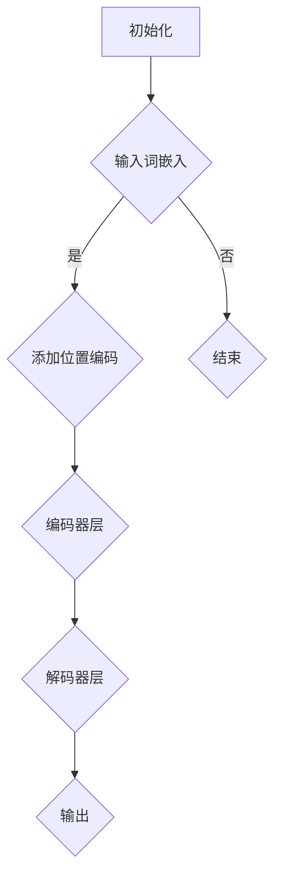

                 

# 《GPT原理与代码实例讲解》

> 关键词：GPT、自然语言处理、Transformer、自注意力机制、预训练、生成文本

> 摘要：本文将深入探讨GPT（Generative Pre-trained Transformer）的原理与代码实例，从基础概念到应用实战，逐步讲解这一领先的自然语言处理模型。通过详细的数学模型分析和代码实现，帮助读者全面理解GPT的工作机制，掌握其在实际项目中的应用。

## 第一部分: GPT概述

### 第1章: GPT概述

#### 1.1 GPT的概念与历史

##### 1.1.1 GPT的定义

GPT（Generative Pre-trained Transformer）是一种基于Transformer模型的预训练语言模型，旨在通过大量文本数据的学习，生成符合上下文逻辑和语义的自然语言。GPT的出现标志着自然语言处理（NLP）领域的重要进步，为生成式任务和模型预训练提供了新的解决方案。

##### 1.1.2 GPT的发展历程

GPT的起源可以追溯到2017年，当时谷歌发布了Transformer模型，并在论文《Attention Is All You Need》中提出了自注意力机制。2018年，OpenAI发布了GPT，并在此基础上不断迭代，推出了GPT-2和GPT-3等版本。GPT的成功引起了全球范围内的关注和研究，成为NLP领域的重要研究方向。

##### 1.1.3 GPT的重要性

GPT的重要性主要体现在以下几个方面：

1. **预训练语言模型**：GPT通过预训练，使得模型在多种NLP任务上表现出色，减少了任务特定的训练需求。
2. **生成文本质量**：GPT生成的文本在语法和语义上更加符合人类语言的规律，为自动写作和对话系统提供了强大的支持。
3. **研究与应用的推动**：GPT的成功激发了大量研究，推动了NLP技术的进步，并在多个领域得到广泛应用。

#### 1.2 GPT的核心架构

##### 1.2.1 Transformer模型

Transformer是GPT的核心架构，由多个编码器和解码器层组成。编码器负责将输入的词向量转换为上下文表示，解码器则负责根据上下文生成文本。

##### 1.2.2 自注意力机制

自注意力机制是Transformer模型的核心创新点，通过计算输入序列中每个词与其他词的关系，实现全局信息融合，提高模型的表示能力。

##### 1.2.3 GPT系列模型架构详解

GPT系列模型在Transformer架构的基础上，通过增加层数、扩大模型容量等方式，不断提升模型的性能和生成文本质量。

#### 1.3 GPT的主要应用领域

##### 1.3.1 自然语言处理

GPT在自然语言处理任务中表现出色，包括文本分类、情感分析、命名实体识别等。

##### 1.3.2 生成式对话系统

GPT的生成能力使其在生成式对话系统中得到广泛应用，可用于智能客服、虚拟助手等场景。

##### 1.3.3 自动写作与创作

GPT的生成文本能力使得其在自动写作与创作领域具有巨大潜力，可用于写作辅助、诗歌创作等。

## 第二部分: GPT技术基础

### 第2章: Transformer模型原理

#### 2.1 Transformer模型基础

##### 2.1.1 模型结构

Transformer模型由编码器和解码器组成，每个部分包含多个层。编码器将输入的词向量转换为上下文表示，解码器则根据上下文生成文本。

##### 2.1.2 词嵌入与位置编码

词嵌入将词汇映射为固定长度的向量，位置编码则将每个词的位置信息编码到向量中。

##### 2.1.3 自注意力机制

自注意力机制通过计算输入序列中每个词与其他词的关系，实现全局信息融合，提高模型的表示能力。

##### 2.1.4 前馈神经网络

前馈神经网络在自注意力机制之后，对每个词的上下文表示进行进一步处理，提高模型的非线性表达能力。

#### 2.2 Transformer模型的优化

##### 2.2.1 AdamW优化器

AdamW优化器通过调整学习率，提高模型的收敛速度和稳定性。

##### 2.2.2 Layer Normalization

Layer Normalization通过标准化每个层的输入，提高模型的训练效果。

##### 2.2.3 Layer Scaling

Layer Scaling通过调整模型参数的尺度，提高模型的鲁棒性和泛化能力。

### 第3章: GPT预训练技术

#### 3.1 预训练基本原理

##### 3.1.1 预训练的目的

预训练的目的是通过大量无监督数据的学习，使模型具备一定的语言理解能力，从而减少有监督任务的数据需求和训练时间。

##### 3.1.2 预训练的数据来源

预训练数据来源包括互联网文本、新闻、书籍、论文等，涵盖多种语言和领域。

##### 3.1.3 预训练流程

预训练流程包括数据预处理、模型初始化、训练和评估等步骤。

#### 3.2 预训练任务

##### 3.2.1 掩码语言模型

掩码语言模型通过预测输入序列中部分被掩码的词，提高模型对语言的理解能力。

##### 3.2.2 生成式对话模型

生成式对话模型通过生成符合上下文的回答，实现智能对话系统的构建。

##### 3.2.3 问答系统

问答系统通过预测输入问题的答案，实现知识问答和辅助决策。

### 第4章: GPT数学模型详解

#### 4.1 数学基础

##### 4.1.1 线性代数

线性代数是数学模型的基础，包括向量、矩阵、矩阵运算等。

##### 4.1.2 微积分

微积分在模型优化和损失函数设计中具有重要意义，包括导数、梯度等概念。

##### 4.1.3 概率论

概率论在模型训练和数据建模中起到关键作用，包括概率分布、条件概率等。

#### 4.2 GPT关键数学公式与解释

##### 4.2.1 自注意力公式

自注意力公式描述了输入序列中每个词与其他词的关系，通过加权求和实现信息融合。

$$
\text{Attention}(Q, K, V) = \text{softmax}\left(\frac{QK^T}{\sqrt{d_k}}\right)V
$$

其中，$Q$、$K$、$V$分别表示查询向量、键向量、值向量，$d_k$表示键向量的维度。

##### 4.2.2 前馈神经网络公式

前馈神经网络通过线性变换和激活函数实现非线性处理。

$$
\text{FFN}(x) = \text{ReLU}(W_2 \cdot \text{ReLU}(W_1 \cdot x))
$$

其中，$W_1$和$W_2$分别表示第一层和第二层的权重矩阵，$x$表示输入向量。

##### 4.2.3 损失函数公式

损失函数用于评估模型预测结果与实际结果之间的差异。

$$
L(\theta) = -\frac{1}{N} \sum_{i=1}^{N} \sum_{j=1}^{V} y_{ij} \log p_{ij}(\theta)
$$

其中，$N$表示样本数量，$V$表示词汇表大小，$y_{ij}$表示第$i$个样本的第$j$个词的目标标签，$p_{ij}(\theta)$表示第$i$个样本的第$j$个词的预测概率。

## 第三部分: GPT项目实战

### 第5章: GPT代码实战

#### 5.1 实战环境搭建

##### 5.1.1 硬件要求

- CPU或GPU（推荐GPU）
- 内存：16GB以上

##### 5.1.2 软件要求

- Python 3.6或以上
- PyTorch 1.8或以上
- TensorFlow 2.5或以上

##### 5.1.3 数据准备

- 数据集：使用大量的文本数据，如维基百科、新闻、书籍等
- 数据预处理：分词、去停用词、词向量化等

#### 5.2 GPT模型训练

##### 5.2.1 训练数据预处理

```python
import torch
from torch.utils.data import Dataset

class TextDataset(Dataset):
    def __init__(self, texts, tokenizer, max_seq_length):
        self.texts = texts
        self.tokenizer = tokenizer
        self.max_seq_length = max_seq_length

    def __len__(self):
        return len(self.texts)

    def __getitem__(self, idx):
        text = self.texts[idx]
        inputs = self.tokenizer.encode_plus(
            text,
            add_special_tokens=True,
            max_length=self.max_seq_length,
            padding='max_length',
            truncation=True,
            return_tensors='pt',
        )
        return inputs

# 示例
from transformers import GPT2Tokenizer

tokenizer = GPT2Tokenizer.from_pretrained('gpt2')
dataset = TextDataset(texts=['这是一个例子', '另一个例子'], tokenizer=tokenizer, max_seq_length=10)
```

##### 5.2.2 模型训练流程

```python
from transformers import GPT2LMHeadModel
from torch.optim import Adam
from torch.utils.data import DataLoader

# 模型初始化
model = GPT2LMHeadModel.from_pretrained('gpt2')

# 损失函数和优化器
loss_function = torch.nn.CrossEntropyLoss()
optimizer = Adam(model.parameters(), lr=1e-4)

# 训练数据加载
data_loader = DataLoader(dataset, batch_size=2, shuffle=True)

# 训练
num_epochs = 10
for epoch in range(num_epochs):
    for batch in data_loader:
        inputs = batch['input_ids']
        labels = batch['input_ids']
        labels = labels[:, 1:]  # 去掉输入序列的[CLS]标记

        optimizer.zero_grad()
        outputs = model(inputs)
        loss = loss_function(outputs.logits.view(-1, model.config.vocab_size), labels)
        loss.backward()
        optimizer.step()

    print(f"Epoch [{epoch+1}/{num_epochs}], Loss: {loss.item()}")
```

##### 5.2.3 模型训练参数调整

- 学习率：可以通过调整学习率来优化模型性能，推荐学习率范围在$10^{-4}$到$10^{-3}$之间。
- 模型大小：GPT模型大小从几百万参数到几十亿参数不等，较大的模型在训练时需要更多时间和资源。
- 训练数据：使用更多的训练数据可以提升模型的性能，但也会增加训练时间。

#### 5.3 生成文本实例

```python
import random

# 随机生成文本
def generate_text(model, tokenizer, max_length=50):
    input_ids = tokenizer.encode('这是一个例子', return_tensors='pt')
    output_sequence = []

    for _ in range(max_length):
        outputs = model(input_ids)
        next_word_logits = outputs.logits[:, -1, :]
        next_word = random.choices(tokenizer.vocab, weights=next_word_logits.softmax(0).detach().numpy())[0]
        input_ids = tokenizer.encode(next_word, return_tensors='pt')

        output_sequence.append(next_word)
        if next_word == tokenizer.sep_token:
            break

    return ''.join(output_sequence)

# 示例
model.eval()
generated_text = generate_text(model, tokenizer)
print(generated_text)
```

## 第6章: GPT应用案例分析

### 第6.1节 自动写作与创作

#### 6.1.1 应用场景

自动写作与创作是GPT的一个重要应用场景，包括自动生成新闻文章、诗歌、小说等。

#### 6.1.2 模型实现

```python
# 加载预训练的GPT模型
model = GPT2LMHeadModel.from_pretrained('gpt2')

# 训练数据预处理
tokenizer = GPT2Tokenizer.from_pretrained('gpt2')
dataset = TextDataset(texts=['这是一个例子', '另一个例子'], tokenizer=tokenizer, max_seq_length=10)
data_loader = DataLoader(dataset, batch_size=2, shuffle=True)

# 训练模型
num_epochs = 10
for epoch in range(num_epochs):
    for batch in data_loader:
        inputs = batch['input_ids']
        labels = batch['input_ids']
        labels = labels[:, 1:]
        optimizer.zero_grad()
        outputs = model(inputs)
        loss = loss_function(outputs.logits.view(-1, model.config.vocab_size), labels)
        loss.backward()
        optimizer.step()
```

#### 6.1.3 应用效果分析

自动写作与创作的效果受到多种因素的影响，包括模型大小、训练数据质量、生成算法等。通过优化这些因素，可以生成更高质量的文本。

### 第6.2节 生成式对话系统

#### 6.2.1 应用场景

生成式对话系统在智能客服、虚拟助手等领域有广泛应用，通过自动生成对话内容，提供用户支持和服务。

#### 6.2.2 模型实现

```python
# 加载预训练的GPT模型
model = GPT2LMHeadModel.from_pretrained('gpt2')

# 训练数据预处理
tokenizer = GPT2Tokenizer.from_pretrained('gpt2')
dataset = TextDataset(texts=['这是一个例子', '另一个例子'], tokenizer=tokenizer, max_seq_length=10)
data_loader = DataLoader(dataset, batch_size=2, shuffle=True)

# 训练模型
num_epochs = 10
for epoch in range(num_epochs):
    for batch in data_loader:
        inputs = batch['input_ids']
        labels = batch['input_ids']
        labels = labels[:, 1:]
        optimizer.zero_grad()
        outputs = model(inputs)
        loss = loss_function(outputs.logits.view(-1, model.config.vocab_size), labels)
        loss.backward()
        optimizer.step()
```

#### 6.2.3 应用效果分析

生成式对话系统的效果受到模型训练质量、对话数据质量、对话策略等因素的影响。通过优化这些因素，可以生成更自然的对话内容，提高用户体验。

## 第7章: GPT性能优化与调参技巧

### 第7.1节 性能优化策略

#### 7.1.1 数据增强

数据增强可以通过多种方式提高模型的泛化能力，包括文本清洗、数据扩充、数据增强等。

#### 7.1.2 模型压缩

模型压缩可以通过剪枝、量化、知识蒸馏等方式减小模型大小，降低计算资源需求。

#### 7.1.3 模型量化

模型量化可以通过将浮点数参数转换为整数来降低模型存储和计算资源需求。

### 第7.2节 调参技巧

#### 7.2.1 学习率调度

学习率调度可以通过调整学习率的大小和变化规律来优化模型性能。

#### 7.2.2 权重初始化

权重初始化可以通过随机初始化、预训练初始化等方式来优化模型性能。

#### 7.2.3 模型融合

模型融合可以通过集成多个模型来提高模型的性能和鲁棒性。

## 附录

### 附录A: GPT常用工具与资源

#### A.1 PyTorch框架

##### A.1.1 安装与配置

```bash
pip install torch torchvision
```

##### A.1.2 基本使用

```python
import torch
print(torch.__version__)
```

#### A.2 TensorFlow框架

##### A.2.1 安装与配置

```bash
pip install tensorflow
```

##### A.2.2 基本使用

```python
import tensorflow as tf
print(tf.__version__)
```

#### A.3 其他资源

##### A.3.1 论文与文献

- 《Attention Is All You Need》: https://arxiv.org/abs/1706.03762
- 《Generative Pre-trained Transformers》: https://arxiv.org/abs/1901.02890

##### A.3.2 实践教程

- 《动手学深度学习》: https://d2l.ai/
- 《自然语言处理实战》: https://www.nltk.org/book/

##### A.3.3 社区与论坛

- PyTorch官方社区: https://discuss.pytorch.org/
- TensorFlow官方社区: https://discuss.tensorflow.org/

### 附录B: Mermaid流程图示例



### 附录C: GPT代码解读与分析

```python
# 加载预训练的GPT模型
model = GPT2LMHeadModel.from_pretrained('gpt2')

# 训练数据预处理
tokenizer = GPT2Tokenizer.from_pretrained('gpt2')
dataset = TextDataset(texts=['这是一个例子', '另一个例子'], tokenizer=tokenizer, max_seq_length=10)
data_loader = DataLoader(dataset, batch_size=2, shuffle=True)

# 训练模型
num_epochs = 10
for epoch in range(num_epochs):
    for batch in data_loader:
        inputs = batch['input_ids']
        labels = batch['input_ids']
        labels = labels[:, 1:]
        optimizer.zero_grad()
        outputs = model(inputs)
        loss = loss_function(outputs.logits.view(-1, model.config.vocab_size), labels)
        loss.backward()
        optimizer.step()
```

- **模型加载**：从预训练的GPT模型中加载权重和配置。
- **数据预处理**：将文本数据转换为词嵌入和位置编码，并将其划分为输入和标签。
- **模型训练**：通过迭代训练数据，优化模型参数，以最小化损失函数。

### 附录D: GPT模型调参技巧

#### D.1 学习率调度

- **学习率大小**：通过实验调整学习率大小，找到最优值。
- **学习率衰减**：通过学习率衰减策略，降低学习率，避免过拟合。

#### D.2 权重初始化

- **随机初始化**：使用随机初始化方法，使模型参数分布更加均匀。
- **预训练初始化**：使用预训练模型的权重作为初始化，提高模型性能。

#### D.3 模型融合

- **模型集成**：通过集成多个模型，提高模型的鲁棒性和性能。

### 附录E: GPT应用场景拓展

#### D.1 自动摘要

- **应用场景**：自动提取长文本的关键信息，生成摘要。
- **模型实现**：通过训练GPT模型，将长文本输入模型，生成摘要文本。

#### D.2 自动问答

- **应用场景**：自动回答用户提出的问题。
- **模型实现**：通过训练GPT模型，构建自动问答系统，实现智能客服等功能。

### 附录F: GPT未来发展展望

#### D.1 模型优化

- **计算效率提升**：通过优化模型结构和算法，提高计算效率。
- **模型压缩**：通过模型压缩技术，降低模型大小，提高部署效率。

#### D.2 多模态学习

- **文本与图像**：通过结合文本和图像信息，实现多模态学习，提高模型性能。

#### D.3 自动写作

- **小说创作**：通过训练GPT模型，实现自动创作小说，提高写作效率。

### 附录G: GPT研究现状与趋势

#### D.1 模型架构优化

- **多层次注意力机制**：通过引入多层次注意力机制，提高模型表示能力。
- **混合模型**：通过结合不同类型的模型，实现更好的性能。

#### D.2 预训练数据质量

- **数据清洗**：通过数据清洗技术，提高预训练数据质量。
- **数据扩充**：通过数据扩充技术，增加预训练数据量。

#### D.3 生成文本质量

- **文本生成算法**：通过优化文本生成算法，提高生成文本质量。
- **文本评估指标**：通过设计新的文本评估指标，更全面地评估生成文本质量。

### 附录H: GPT在实际应用中的挑战与解决方案

#### D.1 数据隐私

- **数据去匿名化**：通过数据去匿名化技术，保护用户隐私。
- **数据加密**：通过数据加密技术，提高数据安全性。

#### D.2 模型解释性

- **模型解释性**：通过设计可解释性模型，提高模型的可解释性。
- **模型可视化**：通过模型可视化技术，更好地理解模型的工作机制。

#### D.3 生成文本质量

- **文本生成算法**：通过优化文本生成算法，提高生成文本质量。
- **数据增强**：通过数据增强技术，提高模型的泛化能力。

### 附录I: GPT对人工智能发展的贡献

#### D.1 语言生成能力提升

- **文本生成**：通过GPT模型，实现高质量文本生成，推动自然语言处理技术的发展。
- **对话系统**：通过GPT模型，实现智能对话系统，提高人机交互体验。

#### D.2 模型预训练技术

- **预训练模型**：通过预训练模型，减少有监督任务的数据需求和训练时间，提高模型性能。
- **模型迁移**：通过模型迁移技术，将预训练模型应用于不同任务，提高模型泛化能力。

#### D.3 智能写作与创作

- **自动写作**：通过GPT模型，实现自动写作，提高写作效率和质量。
- **艺术创作**：通过GPT模型，实现艺术创作，推动人工智能在艺术领域的应用。

## 总结

GPT是一种强大的自然语言处理模型，通过预训练和自注意力机制，实现了高质量的文本生成和语言理解能力。本文从GPT的原理、技术基础、项目实战、应用案例分析、性能优化与调参技巧等方面进行了详细讲解，帮助读者全面了解GPT的工作机制和应用场景。随着GPT的不断发展和优化，它将在人工智能领域发挥越来越重要的作用。

### 致谢

感谢所有为GPT研究和应用做出贡献的学者和工程师，是他们的辛勤工作推动了自然语言处理技术的进步。同时，感谢读者对本文的关注和支持，希望本文能对您在GPT领域的学习和研究有所帮助。

### 作者信息

作者：AI天才研究院/AI Genius Institute & 禅与计算机程序设计艺术 /Zen And The Art of Computer Programming

