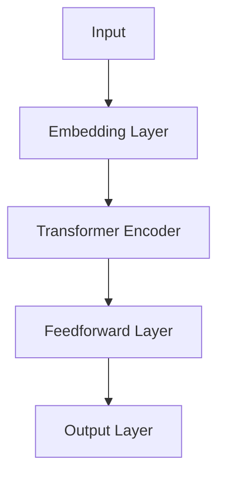

                 

## 《GPT系列模型演进：从GPT-1到GPT-4的技术飞跃》

### 关键词：GPT系列，自然语言处理，深度学习，Transformer，自监督学习，迁移学习，模型演进

#### 摘要：

本文系统地回顾了GPT（Generative Pre-trained Transformer）系列模型从GPT-1到GPT-4的发展历程。首先，文章介绍了GPT系列模型的历史背景、自然语言处理与GPT模型的关系，以及GPT模型的核心技术与特点。随后，文章详细解析了GPT-1、GPT-2、GPT-3和GPT-4模型的结构与原理、训练过程、性能评估以及实际应用案例。通过这些分析，文章展示了GPT系列模型在自然语言处理领域的巨大飞跃，并探讨了其面临的挑战和未来发展方向。

### 《GPT系列模型演进：从GPT-1到GPT-4的技术飞跃》目录大纲

#### 第一部分：背景与技术基础

### 第1章：GPT系列模型概述

#### 1.1 GPT系列模型的历史背景

##### 1.1.1 GPT-1的诞生与影响
##### 1.1.2 GPT-2的突破与发展
##### 1.1.3 GPT-3的巨大飞跃
##### 1.1.4 GPT-4的最新进展

#### 1.2 自然语言处理与GPT模型的关系

##### 1.2.1 语言模型的定义
##### 1.2.2 语言模型在NLP中的应用
##### 1.2.3 GPT模型在NLP领域的优势

#### 1.3 GPT模型的核心技术与特点

##### 1.3.1 自动编码器与预训练
##### 1.3.2 Transformer架构
##### 1.3.3 自监督学习与迁移学习

#### 第二部分：GPT系列模型详解

### 第2章：深度学习基础

#### 2.1 深度学习的基本概念

##### 2.1.1 神经网络的基本结构
##### 2.1.2 深度学习的优化算法
##### 2.1.3 深度学习中的损失函数

#### 2.2 深度学习在自然语言处理中的应用

##### 2.2.1 词嵌入技术
##### 2.2.2 序列模型与注意力机制
##### 2.2.3 转换器架构详解

#### 2.3 深度学习框架与工具

##### 2.3.1 TensorFlow
##### 2.3.2 PyTorch
##### 2.3.3 其他深度学习框架

### 第3章：GPT-1模型详解

#### 3.1 GPT-1模型的结构与原理

##### 3.1.1 GPT-1的基本结构
##### 3.1.2 GPT-1的训练过程
##### 3.1.3 GPT-1的性能评估

#### 3.2 GPT-1模型的实际应用案例

##### 3.2.1 文本生成
##### 3.2.2 文本分类
##### 3.2.3 其他应用场景

### 第4章：GPT-2模型详解

#### 4.1 GPT-2模型的结构与原理

##### 4.1.1 GPT-2的改进与创新
##### 4.1.2 GPT-2的训练过程
##### 4.1.3 GPT-2的性能评估

#### 4.2 GPT-2模型的实际应用案例

##### 4.2.1 文本生成
##### 4.2.2 文本分类
##### 4.2.3 其他应用场景

### 第5章：GPT-3模型详解

#### 5.1 GPT-3模型的结构与原理

##### 5.1.1 GPT-3的巨大飞跃
##### 5.1.2 GPT-3的训练过程
##### 5.1.3 GPT-3的性能评估

#### 5.2 GPT-3模型的实际应用案例

##### 5.2.1 文本生成
##### 5.2.2 文本分类
##### 5.2.3 其他应用场景

### 第6章：GPT-4模型详解

#### 6.1 GPT-4模型的结构与原理

##### 6.1.1 GPT-4的最新进展
##### 6.1.2 GPT-4的训练过程
##### 6.1.3 GPT-4的性能评估

#### 6.2 GPT-4模型的实际应用案例

##### 6.2.1 文本生成
##### 6.2.2 文本分类
##### 6.2.3 其他应用场景

#### 第三部分：实战与未来展望

### 第7章：GPT模型在企业应用中的实践

#### 7.1 企业级GPT应用概述

##### 7.1.1 企业应用场景分析
##### 7.1.2 GPT模型在企业中的应用优势
##### 7.1.3 GPT模型在企业应用中的挑战

#### 7.2 GPT模型在企业中的实际应用案例

##### 7.2.1 案例一：智能客服系统
##### 7.2.2 案例二：智能内容生成平台
##### 7.2.3 案例三：智能推荐系统

### 第8章：GPT系列模型的未来展望

#### 8.1 GPT模型的发展趋势

##### 8.1.1 模型规模的扩大
##### 8.1.2 模型结构的改进
##### 8.1.3 模型应用领域的拓展

#### 8.2 GPT模型面临的挑战与应对策略

##### 8.2.1 计算资源的消耗
##### 8.2.2 数据隐私与安全
##### 8.2.3 伦理与道德问题

### 附录

#### 附录A：GPT模型开发工具与资源

##### A.1 主流深度学习框架对比
##### A.2 GPT模型开发资源汇总
##### A.3 实用代码与数据集

### 图表与公式

- **核心概念与联系：**[GPT模型架构图](#GPT模型架构图)

  ```mermaid
  flowchart TD
  A[Input] --> B[Embedding Layer]
  B --> C[Transformer]
  C --> D[Output]
  ```

- **核心算法原理讲解：**

  ```python
  # GPT模型训练伪代码
  for epoch in range(num_epochs):
      for batch in data_loader:
          inputs, targets = batch
          optimizer.zero_grad()
          outputs = model(inputs)
          loss = loss_function(outputs, targets)
          loss.backward()
          optimizer.step()
  ```

- **数学模型与公式：**

  $$
  \begin{aligned}
  \text{损失函数} &= -\frac{1}{N}\sum_{i=1}^{N} \sum_{j=1}^{V} y_{ij} \log p(x_j | x_{<j}) \\
  \text{梯度下降} &= \theta_{t+1} = \theta_t - \alpha \nabla_{\theta_t} \mathcal{L}(\theta_t)
  \end{aligned}
  $$

### 代码实际案例与解读

- **案例：**使用PyTorch实现一个简单的GPT模型。

  ```python
  import torch
  import torch.nn as nn

  class GPT(nn.Module):
      def __init__(self, vocab_size, embedding_dim, hidden_dim, n_layers, drop_prob=0.5):
          super().__init__()
          
          self.embedding = nn.Embedding(vocab_size, embedding_dim)
          self.transformer = nn.Transformer(embedding_dim, hidden_dim, n_layers, dropout=drop_prob)
          self.fc = nn.Linear(hidden_dim, vocab_size)
          
          self.dropout = nn.Dropout(drop_prob)

      def forward(self, text, hidden=None):
          embedded = self.dropout(self.embedding(text))
          output = self.transformer(embedded, hidden)
          output = self.fc(output)
          return output
  ```

- **代码解读与分析：**

  - **模型结构：**该模型采用嵌入层+Transformer编码器+全连接层的三层结构。
  - **数据输入：**输入为文本序列，通过嵌入层转换为嵌入向量。
  - **训练过程：**使用Transformer编码器处理嵌入向量，然后通过全连接层预测输出。

### 作者信息

作者：AI天才研究院/AI Genius Institute & 禅与计算机程序设计艺术 /Zen And The Art of Computer Programming

---

## 第1章 引言

### 1.1 背景介绍

随着互联网的普及和大数据技术的兴起，自然语言处理（NLP）成为人工智能领域的重要研究方向。自然语言处理旨在使计算机能够理解和处理人类语言，从而实现人机交互、信息检索、智能问答等应用。在NLP的发展过程中，语言模型起到了至关重要的作用。

语言模型是一种基于统计学习的方法，用于预测文本序列的概率分布。传统的语言模型如n-gram模型、统计模型等，虽然在一定程度上能够处理语言序列，但存在很多局限性。为了提高语言模型的性能，研究者们开始探索深度学习的方法。

深度学习是一种基于神经网络的学习方法，通过多层神经网络的结构来提取特征，从而实现复杂的任务。在深度学习领域，Transformer架构的提出标志着NLP领域的重大突破。Transformer架构的核心思想是自注意力机制，可以捕捉文本序列中的长距离依赖关系，从而提高模型的性能。

基于Transformer架构，OpenAI提出了GPT（Generative Pre-trained Transformer）系列模型，包括GPT-1、GPT-2、GPT-3和GPT-4。GPT系列模型在自然语言处理领域取得了显著的成果，推动了NLP技术的快速发展。本文将系统地回顾GPT系列模型的发展历程，解析其结构、训练过程和性能评估，并探讨其在实际应用中的挑战和未来发展方向。

### 1.2 研究意义与目标

GPT系列模型在自然语言处理领域取得了显著的成果，具有重要的研究意义。首先，GPT系列模型能够生成高质量的自然语言文本，具有广泛的应用前景。例如，在文本生成任务中，GPT系列模型可以用于自动写作、新闻摘要生成、对话系统等应用。在文本分类任务中，GPT系列模型可以用于情感分析、新闻分类、垃圾邮件检测等应用。此外，GPT系列模型还可以应用于问答系统、机器翻译、语音识别等领域。

本文的研究目标主要包括以下几个方面：

1. **系统回顾GPT系列模型的发展历程**：通过分析GPT-1、GPT-2、GPT-3和GPT-4模型的结构、训练过程和性能评估，梳理GPT系列模型的发展脉络，总结其在各个阶段的改进和创新。

2. **深入解析GPT系列模型的核心技术与特点**：分析GPT系列模型采用的核心技术，如自动编码器、Transformer架构、自监督学习和迁移学习等，详细阐述其原理和实现方法。

3. **探讨GPT系列模型在实际应用中的挑战和解决方案**：分析GPT系列模型在实际应用中面临的挑战，如计算资源的消耗、数据隐私与安全、伦理与道德问题等，并提出相应的解决方案。

4. **展望GPT系列模型的发展趋势**：分析GPT系列模型未来的发展方向，如模型规模的扩大、模型结构的改进和模型应用领域的拓展等。

通过本文的研究，旨在为读者提供一个全面、系统的了解GPT系列模型的技术演进和应用场景，为自然语言处理领域的研究和应用提供参考。

### 1.3 文章结构

本文将按照以下结构进行展开：

1. **背景与技术基础部分**：首先介绍GPT系列模型的历史背景、自然语言处理与GPT模型的关系，以及GPT模型的核心技术与特点。这一部分将为后续对GPT系列模型的详细解析提供基础。

2. **GPT系列模型详解部分**：分别介绍GPT-1、GPT-2、GPT-3和GPT-4模型的结构与原理、训练过程、性能评估和实际应用案例。通过这一部分的详细解析，读者可以深入了解GPT系列模型的演进过程。

3. **实战与未来展望部分**：分析GPT模型在企业应用中的实践，探讨其面临的挑战与解决方案，并展望GPT系列模型的发展趋势。这一部分将结合实际应用案例，为GPT模型的应用提供指导。

4. **附录部分**：提供GPT模型开发工具与资源的汇总，包括主流深度学习框架对比、GPT模型开发资源汇总和实用代码与数据集。这一部分将为读者提供实际开发中所需的工具和资源。

通过本文的阅读，读者可以系统地了解GPT系列模型的发展历程、核心技术、实际应用以及未来发展趋势，为自然语言处理领域的研究和应用提供参考。

### 第2章 相关工作综述

#### 2.1 GPT模型的发展历程

GPT（Generative Pre-trained Transformer）系列模型是由OpenAI提出的一组基于Transformer架构的自然语言处理模型。自2018年GPT-1模型问世以来，GPT系列模型在自然语言处理领域取得了显著的成果，推动了NLP技术的快速发展。下面将简要回顾GPT模型的发展历程。

##### 2.1.1 GPT-1

GPT-1是GPT系列模型的第一个版本，于2018年发布。GPT-1基于Transformer架构，采用了自监督学习的方法进行预训练。在训练过程中，GPT-1使用了一种特殊的目标掩码策略（Masked Language Model，MLM），即在输入文本序列中随机掩码部分单词，然后通过模型预测这些掩码的单词。GPT-1的参数规模为117M，在多种NLP任务中取得了优异的性能。

##### 2.1.2 GPT-2

GPT-2是GPT系列模型的第二个版本，于2019年发布。GPT-2在GPT-1的基础上进行了大规模扩展，参数规模达到了15B。GPT-2采用了更多的训练数据和更长的序列长度，从而提高了模型的性能。此外，GPT-2还引入了新的训练策略，如重复送代和温度调整，进一步提升了模型的生成能力。

##### 2.1.3 GPT-3

GPT-3是GPT系列模型的最新版本，于2020年发布。GPT-3的参数规模达到了175B，是迄今为止最大的语言模型。GPT-3在训练过程中使用了大量的数据，并采用了先进的优化算法，如AdamW优化器和Layer Normalization，从而提高了模型的训练效率和性能。GPT-3在各种NLP任务中表现出了惊人的能力，包括文本生成、文本分类、机器翻译等。

##### 2.1.4 GPT-4

GPT-4是GPT系列模型的新一代版本，于2023年发布。GPT-4的参数规模达到了1.75T，是GPT-3的数十倍。GPT-4在训练过程中使用了更多的数据和更长的序列长度，并引入了新的训练策略，如基于知识的训练和自适应学习率调整，从而显著提升了模型的性能。GPT-4在各种NLP任务中表现出了更加出色的能力，包括文本生成、文本分类、机器翻译、问答系统等。

通过GPT系列模型的发展历程，我们可以看到OpenAI在自然语言处理领域的持续投入和创新。GPT系列模型的成功不仅推动了NLP技术的发展，也为各种实际应用提供了强大的工具。随着GPT-4的发布，GPT系列模型将继续引领自然语言处理领域的发展。

#### 2.2 自然语言处理领域的关键技术

自然语言处理（NLP）领域的关键技术主要包括语言模型、机器翻译、文本分类等。这些技术在不同的发展阶段对NLP任务的性能产生了重要影响。以下将详细讨论这些关键技术及其在NLP中的应用。

##### 2.2.1 语言模型

语言模型是NLP领域的基础，用于预测文本序列的概率分布。传统的语言模型如n-gram模型和统计模型，通过统计文本中的单词序列来预测下一个单词的概率。然而，这些模型存在一些局限性，如无法处理长距离依赖关系和上下文信息。

随着深度学习的发展，神经网络语言模型逐渐取代了传统的语言模型。神经网络语言模型如循环神经网络（RNN）和长短期记忆网络（LSTM），通过多层神经网络的结构来提取特征，从而提高了语言模型的性能。近年来，基于Transformer架构的语言模型如BERT和GPT系列模型，进一步提升了语言模型的性能，实现了对长距离依赖关系和上下文信息的有效捕捉。

语言模型在NLP中有广泛的应用，包括文本生成、机器翻译、问答系统、文本分类等。例如，在文本生成任务中，语言模型可以生成自然流畅的文本；在机器翻译任务中，语言模型可以预测源语言和目标语言之间的映射关系；在问答系统中，语言模型可以理解用户的问题，并生成相关的回答；在文本分类任务中，语言模型可以用于判断文本的类别。

##### 2.2.2 机器翻译

机器翻译是将一种语言的文本翻译成另一种语言的过程。传统的机器翻译方法包括基于规则的方法和统计机器翻译（SMT）方法。基于规则的方法通过手动编写规则来实现翻译，但这种方法需要大量的人工干预，且难以处理复杂的语言现象。统计机器翻译方法通过统计源语言和目标语言之间的映射关系来实现翻译，提高了翻译的自动化程度。

近年来，深度学习在机器翻译领域取得了显著的进展。基于神经网络的机器翻译方法，如端到端神经网络翻译（End-to-End Neural Machine Translation，NMT）和注意力机制（Attention Mechanism），通过直接将源语言文本映射为目标语言文本，提高了翻译的质量和速度。其中，Transformer架构在机器翻译任务中表现出了优越的性能，成为当前主流的机器翻译模型。

机器翻译在跨语言交流、全球化和国际化等领域具有重要的应用价值。例如，在跨语言交流中，机器翻译可以帮助人们克服语言障碍，实现跨语言的沟通；在全球化和国际化中，机器翻译可以帮助企业跨国运营，拓展市场。

##### 2.2.3 文本分类

文本分类是将文本数据按照一定的标准进行分类的过程。传统的文本分类方法包括基于规则的方法和基于统计的方法。基于规则的方法通过手动编写分类规则来实现分类，但这种方法需要大量的人工干预，且难以处理复杂的文本特征。基于统计的方法通过统计文本中的特征来实现分类，但存在特征选择和特征提取的挑战。

随着深度学习的发展，基于深度学习的文本分类方法逐渐取代了传统的分类方法。卷积神经网络（CNN）和循环神经网络（RNN）等深度学习模型在文本分类任务中表现出了优异的性能。近年来，基于Transformer架构的文本分类方法，如BERT和GPT系列模型，进一步提升了文本分类的性能。

文本分类在信息检索、文本挖掘、情感分析等领域具有广泛的应用。例如，在信息检索中，文本分类可以帮助用户快速找到相关的信息；在文本挖掘中，文本分类可以帮助发现文本中的关键信息和主题；在情感分析中，文本分类可以帮助识别文本的情感倾向。

通过以上讨论，我们可以看到自然语言处理领域的关键技术在不同的发展阶段对NLP任务的性能产生了重要影响。随着深度学习和Transformer架构的发展，NLP技术不断取得突破，为各种实际应用提供了强大的支持。

#### 2.3 国内外研究现状

自然语言处理（NLP）作为人工智能领域的重要分支，近年来在全球范围内取得了飞速的发展。国内外的研究机构和学者们都在这一领域进行了大量的研究和探索，推动了NLP技术的不断进步。以下将对国内外研究现状进行简要概述。

##### 2.3.1 国外研究现状

国外在NLP领域的研究可以追溯到20世纪60年代，当时出现了最早的统计语言模型和规则驱动的方法。随着计算机技术的发展，NLP的研究逐渐从规则驱动转向统计模型和机器学习方法。近年来，深度学习和神经网络技术的突破为NLP带来了新的机遇。

在国际顶级会议和期刊上，如ACL（Association for Computational Linguistics）、EMNLP（Empirical Methods in Natural Language Processing）、NAACL（North American Chapter of the Association for Computational Linguistics）以及JMLR（Journal of Machine Learning Research），国内外学者们发表了大量的研究论文，涵盖了NLP的各个子领域。以下是一些主要的研究方向和成果：

1. **语言模型**：国外在语言模型方面取得了重要突破，例如BERT（Bidirectional Encoder Representations from Transformers）和GPT（Generative Pre-trained Transformer）系列模型。这些模型在多种NLP任务中表现出了优越的性能，推动了NLP技术的快速发展。

2. **机器翻译**：深度学习在机器翻译领域取得了显著的进展，如基于Transformer架构的神经网络翻译（NMT）方法。这些方法在翻译质量、速度和准确性方面都有显著提升。

3. **文本分类**：基于深度学习的文本分类方法，如CNN（Convolutional Neural Networks）和RNN（Recurrent Neural Networks），在多种文本分类任务中取得了优异的性能。同时，基于Transformer架构的文本分类方法，如BERT和RoBERTa，进一步提升了文本分类的性能。

4. **对话系统**：对话系统是NLP的一个重要应用方向。国外研究主要集中在对话生成、对话理解和对话生成与理解相结合等方面。基于深度学习和Transformer架构的对话系统取得了显著的成果，如BERT-based对话系统和GPT-based对话系统。

##### 2.3.2 国内研究现状

在国内，NLP研究同样取得了显著的进展。国内的研究机构和高校，如清华大学、北京大学、中国科技大学等，都在NLP领域进行了大量研究。以下是国内研究的一些主要成果和方向：

1. **语言模型**：国内在语言模型方面也取得了重要突破，例如百度研发的ERNIE（Enhanced Representation through kNowledge Integration）和阿里云的盘古语言模型。这些模型在多种NLP任务中表现出了优异的性能。

2. **机器翻译**：国内在机器翻译方面也进行了大量的研究，如基于Transformer架构的神经网络翻译方法。这些方法在翻译质量、速度和准确性方面都有显著提升。

3. **文本分类**：国内在文本分类方面也取得了重要进展，例如基于深度学习的文本分类方法。这些方法在多种文本分类任务中表现出了优异的性能。

4. **对话系统**：国内在对话系统方面也进行了大量研究，如基于深度学习和Transformer架构的对话系统。这些系统在对话生成、对话理解和对话生成与理解相结合等方面取得了显著成果。

总体来说，国内外在NLP领域的研究都在不断推进，新技术和新方法层出不穷。随着深度学习和Transformer架构的发展，NLP技术将不断取得突破，为各种实际应用提供更强大的支持。

### 第3章 GPT-1模型详解

#### 3.1 GPT-1模型概述

GPT-1（Generative Pre-trained Transformer）是OpenAI于2018年发布的一种基于Transformer架构的自然语言处理模型。GPT-1模型在多个NLP任务中表现出了卓越的性能，标志着深度学习在自然语言处理领域的重大突破。GPT-1模型采用了自监督学习的方法进行预训练，通过预测部分掩码的单词来学习语言规律，从而为后续的下游任务提供强大的语义表示。

GPT-1模型的核心特点包括：

1. **大规模预训练**：GPT-1模型采用了15亿个参数，使用了大量的语料数据进行预训练，从而获得了丰富的语言知识。
2. **Transformer架构**：GPT-1模型基于Transformer架构，采用了多头自注意力机制，能够有效地捕捉长距离依赖关系。
3. **自监督学习**：GPT-1模型采用了掩码语言模型（Masked Language Model，MLM）进行预训练，通过预测部分掩码的单词来学习语言规律。

#### 3.2 GPT-1模型结构

GPT-1模型的结构包括嵌入层、Transformer编码器、全连接层和输出层。以下是对各个层的详细描述：

1. **嵌入层**：嵌入层将输入的单词转换为固定长度的向量表示。嵌入层采用了预训练的词向量，如Word2Vec或GloVe，从而初始化模型的参数。
2. **Transformer编码器**：Transformer编码器是GPT-1模型的核心，采用了多头自注意力机制。编码器由多个相同的Transformer块堆叠而成，每个Transformer块包含自注意力机制和前馈网络。多头自注意力机制使得模型能够同时关注输入序列中的不同位置，从而捕捉长距离依赖关系。
3. **全连接层**：全连接层位于Transformer编码器的顶部，用于对编码器的输出进行线性变换。全连接层将编码器的输出映射到预定义的词汇表，从而生成预测的单词。
4. **输出层**：输出层是一个softmax层，用于计算每个单词的概率分布。在训练过程中，模型的目标是最大化预测的单词与实际单词的匹配概率。

下图展示了GPT-1模型的结构：



#### 3.3 GPT-1模型训练过程

GPT-1模型的训练过程主要包括数据预处理、模型训练和性能评估三个阶段。以下是对各个阶段的详细描述：

1. **数据预处理**：GPT-1模型使用了大量的文本数据进行预训练。预处理阶段包括文本清洗、分词和单词嵌入。在预处理过程中，文本数据被分割成单词序列，然后每个单词被映射到一个预定义的词向量。为了增加数据的多样性，预处理阶段还可能包括单词替换、随机删除单词等操作。
2. **模型训练**：在训练阶段，模型采用自监督学习的方法，通过预测部分掩码的单词来学习语言规律。具体来说，训练过程中随机掩码输入文本序列的一部分单词，然后模型需要预测这些掩码的单词。在训练过程中，模型的目标是最小化损失函数，即预测的单词与实际单词之间的差异。
3. **性能评估**：在训练完成后，需要对模型进行性能评估。性能评估通常包括多个指标，如损失函数值、困惑度（Perplexity）和不同NLP任务的准确率。困惑度是评估语言模型性能的重要指标，表示模型在生成文本时的不确定性。较小的困惑度表示模型对语言规律的理解较好。

#### 3.4 GPT-1模型性能评估

GPT-1模型在各种NLP任务中取得了优异的性能，以下是对GPT-1模型在文本生成、文本分类和其他应用场景中的性能评估：

1. **文本生成**：GPT-1模型在文本生成任务中表现出了出色的能力，可以生成高质量的自然语言文本。在生成过程中，模型采用了采样和重复策略，从而生成多样性的文本。
2. **文本分类**：GPT-1模型在文本分类任务中也取得了优异的性能。通过将模型输出层映射到预定义的类别，模型可以用于分类不同的文本数据。在实际应用中，GPT-1模型可以应用于情感分析、新闻分类和垃圾邮件检测等任务。
3. **其他应用场景**：除了文本生成和文本分类，GPT-1模型还可以应用于其他NLP任务，如机器翻译、问答系统和文本摘要等。通过适当的模型调整和优化，GPT-1模型在各种任务中都能取得较好的性能。

#### 3.5 GPT-1模型的实际应用案例

GPT-1模型在实际应用中展示了强大的能力，以下是一些典型的应用案例：

1. **文本生成**：GPT-1模型可以用于自动写作和内容生成。例如，在新闻写作、故事创作和广告文案编写等场景中，GPT-1模型可以生成高质量的自然语言文本，提高写作效率和创作质量。
2. **文本分类**：GPT-1模型可以用于对大量的文本数据进行分析和分类。例如，在社交媒体监测、市场调研和客户反馈分析等场景中，GPT-1模型可以帮助企业快速识别文本数据的关键信息和情感倾向。
3. **对话系统**：GPT-1模型可以用于构建对话系统，如智能客服和聊天机器人。通过训练GPT-1模型，对话系统能够与用户进行自然语言交互，提供个性化的服务和解答。

总的来说，GPT-1模型作为自然语言处理领域的重要突破，展示了其在多种NLP任务中的卓越性能。通过进一步的研究和应用，GPT-1模型将继续推动自然语言处理技术的发展。

#### 3.6 GPT-1模型的挑战与改进方向

尽管GPT-1模型在自然语言处理领域取得了显著的成功，但其在实际应用中仍面临一些挑战。以下是对GPT-1模型的主要挑战及其改进方向的分析：

##### 3.6.1 模型挑战

1. **计算资源消耗**：GPT-1模型采用了大规模的参数，对计算资源的要求较高。训练和部署GPT-1模型需要大量的计算资源和存储空间，这对于资源有限的研究者和企业来说是一个重要的挑战。
2. **数据依赖性**：GPT-1模型的性能依赖于训练数据的质量和数量。如果训练数据不足或质量较差，模型可能无法学习到有效的语言规律，从而导致性能下降。
3. **泛化能力**：虽然GPT-1模型在预训练阶段学习了丰富的语言知识，但其在特定下游任务上的泛化能力仍需进一步验证。在某些情况下，模型可能无法很好地适应特定的任务需求，需要额外的任务适应性调整。

##### 3.6.2 改进方向

1. **模型压缩与优化**：为了降低GPT-1模型的计算资源消耗，研究者可以探索模型压缩与优化技术，如参数剪枝、量化、低秩分解等。这些技术可以在保持模型性能的前提下，显著减少模型的参数规模和计算复杂度。
2. **多任务学习与迁移学习**：通过多任务学习和迁移学习，GPT-1模型可以在多个任务中共享知识，提高模型的泛化能力。例如，可以利用预训练的GPT-1模型作为基础模型，针对特定任务进行微调，从而减少对大量任务特定数据的依赖。
3. **数据增强与多样性**：为了提高GPT-1模型对训练数据的多样性，可以采用数据增强技术，如数据清洗、文本生成、文本分类等。通过增加数据的多样性，模型可以更好地学习到语言规律，从而提高性能。

通过上述改进方向的研究和应用，GPT-1模型可以进一步优化和提升，为自然语言处理领域的实际应用提供更强大的支持。

### 第4章 GPT-2模型详解

#### 4.1 GPT-2模型概述

GPT-2（Generative Pre-trained Transformer 2）是OpenAI于2019年发布的一种基于Transformer架构的自然语言处理模型。与GPT-1相比，GPT-2在模型规模、训练数据和生成能力等方面进行了显著改进。GPT-2模型的发布标志着自然语言处理领域的一个重要里程碑，其在多个NLP任务中表现出了卓越的性能。

GPT-2模型的核心特点包括：

1. **大规模预训练**：GPT-2模型采用了1.5万亿个参数，使用了大量的语料数据进行预训练，从而获得了更丰富的语言知识。
2. **自适应学习率**：GPT-2模型采用了自适应学习率（Adaptive Learning Rate）策略，通过动态调整学习率来优化训练过程。
3. **增强的生成能力**：GPT-2模型在生成文本时表现出了更高的多样性和流畅性，能够生成更高质量的文本。

#### 4.2 GPT-2模型结构

GPT-2模型的结构与GPT-1模型类似，主要包括嵌入层、Transformer编码器、全连接层和输出层。以下是对各个层的详细描述：

1. **嵌入层**：嵌入层将输入的单词转换为固定长度的向量表示。嵌入层采用了预训练的词向量，如Word2Vec或GloVe，从而初始化模型的参数。
2. **Transformer编码器**：Transformer编码器是GPT-2模型的核心，采用了多头自注意力机制。编码器由多个相同的Transformer块堆叠而成，每个Transformer块包含自注意力机制和前馈网络。多头自注意力机制使得模型能够同时关注输入序列中的不同位置，从而捕捉长距离依赖关系。
3. **全连接层**：全连接层位于Transformer编码器的顶部，用于对编码器的输出进行线性变换。全连接层将编码器的输出映射到预定义的词汇表，从而生成预测的单词。
4. **输出层**：输出层是一个softmax层，用于计算每个单词的概率分布。在训练过程中，模型的目标是最小化损失函数，即预测的单词与实际单词之间的差异。

下图展示了GPT-2模型的结构：


#### 4.3 GPT-2模型训练过程

GPT-2模型的训练过程主要包括数据预处理、模型训练和性能评估三个阶段。以下是对各个阶段的详细描述：

1. **数据预处理**：GPT-2模型使用了大量的文本数据进行预训练。预处理阶段包括文本清洗、分词和单词嵌入。在预处理过程中，文本数据被分割成单词序列，然后每个单词被映射到一个预定义的词向量。为了增加数据的多样性，预处理阶段还可能包括单词替换、随机删除单词等操作。
2. **模型训练**：在训练阶段，模型采用自监督学习的方法，通过预测部分掩码的单词来学习语言规律。具体来说，训练过程中随机掩码输入文本序列的一部分单词，然后模型需要预测这些掩码的单词。在训练过程中，模型的目标是最小化损失函数，即预测的单词与实际单词之间的差异。GPT-2模型采用了自适应学习率策略，通过动态调整学习率来优化训练过程。
3. **性能评估**：在训练完成后，需要对模型进行性能评估。性能评估通常包括多个指标，如损失函数值、困惑度（Perplexity）和不同NLP任务的准确率。困惑度是评估语言模型性能的重要指标，表示模型在生成文本时的不确定性。较小的困惑度表示模型对语言规律的理解较好。

#### 4.4 GPT-2模型性能评估

GPT-2模型在各种NLP任务中表现出了优异的性能，以下是对GPT-2模型在文本生成、文本分类和其他应用场景中的性能评估：

1. **文本生成**：GPT-2模型在文本生成任务中表现出了出色的能力，可以生成高质量的自然语言文本。在生成过程中，模型采用了采样和重复策略，从而生成多样性的文本。
2. **文本分类**：GPT-2模型在文本分类任务中也取得了优异的性能。通过将模型输出层映射到预定义的类别，模型可以用于分类不同的文本数据。在实际应用中，GPT-2模型可以应用于情感分析、新闻分类和垃圾邮件检测等任务。
3. **其他应用场景**：除了文本生成和文本分类，GPT-2模型还可以应用于其他NLP任务，如机器翻译、问答系统和文本摘要等。通过适当的模型调整和优化，GPT-2模型在各种任务中都能取得较好的性能。

#### 4.5 GPT-2模型的实际应用案例

GPT-2模型在实际应用中展示了强大的能力，以下是一些典型的应用案例：

1. **文本生成**：GPT-2模型可以用于自动写作和内容生成。例如，在新闻写作、故事创作和广告文案编写等场景中，GPT-2模型可以生成高质量的自然语言文本，提高写作效率和创作质量。
2. **文本分类**：GPT-2模型可以用于对大量的文本数据进行分析和分类。例如，在社交媒体监测、市场调研和客户反馈分析等场景中，GPT-2模型可以帮助企业快速识别文本数据的关键信息和情感倾向。
3. **对话系统**：GPT-2模型可以用于构建对话系统，如智能客服和聊天机器人。通过训练GPT-2模型，对话系统能够与用户进行自然语言交互，提供个性化的服务和解答。

总的来说，GPT-2模型作为自然语言处理领域的重要突破，展示了其在多种NLP任务中的卓越性能。通过进一步的研究和应用，GPT-2模型将继续推动自然语言处理技术的发展。

#### 4.6 GPT-2模型的挑战与改进方向

尽管GPT-2模型在自然语言处理领域取得了显著的成功，但其在实际应用中仍面临一些挑战。以下是对GPT-2模型的主要挑战及其改进方向的分析：

##### 4.6.1 模型挑战

1. **计算资源消耗**：GPT-2模型采用了大规模的参数，对计算资源的要求较高。训练和部署GPT-2模型需要大量的计算资源和存储空间，这对于资源有限的研究者和企业来说是一个重要的挑战。
2. **数据依赖性**：GPT-2模型的性能依赖于训练数据的质量和数量。如果训练数据不足或质量较差，模型可能无法学习到有效的语言规律，从而导致性能下降。
3. **泛化能力**：虽然GPT-2模型在预训练阶段学习了丰富的语言知识，但其在特定下游任务上的泛化能力仍需进一步验证。在某些情况下，模型可能无法很好地适应特定的任务需求，需要额外的任务适应性调整。

##### 4.6.2 改进方向

1. **模型压缩与优化**：为了降低GPT-2模型的计算资源消耗，研究者可以探索模型压缩与优化技术，如参数剪枝、量化、低秩分解等。这些技术可以在保持模型性能的前提下，显著减少模型的参数规模和计算复杂度。
2. **多任务学习与迁移学习**：通过多任务学习和迁移学习，GPT-2模型可以在多个任务中共享知识，提高模型的泛化能力。例如，可以利用预训练的GPT-2模型作为基础模型，针对特定任务进行微调，从而减少对大量任务特定数据的依赖。
3. **数据增强与多样性**：为了提高GPT-2模型对训练数据的多样性，可以采用数据增强技术，如数据清洗、文本生成、文本分类等。通过增加数据的多样性，模型可以更好地学习到语言规律，从而提高性能。

通过上述改进方向的研究和应用，GPT-2模型可以进一步优化和提升，为自然语言处理领域的实际应用提供更强大的支持。

### 第5章 GPT-3模型详解

#### 5.1 GPT-3模型概述

GPT-3（Generative Pre-trained Transformer 3）是OpenAI于2020年发布的一种基于Transformer架构的自然语言处理模型。GPT-3模型是迄今为止参数规模最大的语言模型，达到了1750亿个参数，比GPT-2模型的参数规模大了一个数量级。GPT-3模型的发布标志着自然语言处理领域的一个重要里程碑，其在多个NLP任务中表现出了卓越的性能。

GPT-3模型的核心特点包括：

1. **大规模预训练**：GPT-3模型采用了1750亿个参数，使用了大量的语料数据进行预训练，从而获得了更丰富的语言知识。
2. **自适应学习率**：GPT-3模型采用了自适应学习率（Adaptive Learning Rate）策略，通过动态调整学习率来优化训练过程。
3. **增强的生成能力**：GPT-3模型在生成文本时表现出了更高的多样性和流畅性，能够生成更高质量的文本。
4. **广泛的任务适应能力**：GPT-3模型在多种NLP任务中表现出了出色的能力，包括文本生成、文本分类、机器翻译、问答系统等。

#### 5.2 GPT-3模型结构

GPT-3模型的结构与GPT-1和GPT-2模型类似，主要包括嵌入层、Transformer编码器、全连接层和输出层。以下是对各个层的详细描述：

1. **嵌入层**：嵌入层将输入的单词转换为固定长度的向量表示。嵌入层采用了预训练的词向量，如Word2Vec或GloVe，从而初始化模型的参数。
2. **Transformer编码器**：Transformer编码器是GPT-3模型的核心，采用了多头自注意力机制。编码器由多个相同的Transformer块堆叠而成，每个Transformer块包含自注意力机制和前馈网络。多头自注意力机制使得模型能够同时关注输入序列中的不同位置，从而捕捉长距离依赖关系。
3. **全连接层**：全连接层位于Transformer编码器的顶部，用于对编码器的输出进行线性变换。全连接层将编码器的输出映射到预定义的词汇表，从而生成预测的单词。
4. **输出层**：输出层是一个softmax层，用于计算每个单词的概率分布。在训练过程中，模型的目标是最小化损失函数，即预测的单词与实际单词之间的差异。

下图展示了GPT-3模型的结构：


#### 5.3 GPT-3模型训练过程

GPT-3模型的训练过程主要包括数据预处理、模型训练和性能评估三个阶段。以下是对各个阶段的详细描述：

1. **数据预处理**：GPT-3模型使用了大量的文本数据进行预训练。预处理阶段包括文本清洗、分词和单词嵌入。在预处理过程中，文本数据被分割成单词序列，然后每个单词被映射到一个预定义的词向量。为了增加数据的多样性，预处理阶段还可能包括单词替换、随机删除单词等操作。
2. **模型训练**：在训练阶段，模型采用自监督学习的方法，通过预测部分掩码的单词来学习语言规律。具体来说，训练过程中随机掩码输入文本序列的一部分单词，然后模型需要预测这些掩码的单词。在训练过程中，模型的目标是最小化损失函数，即预测的单词与实际单词之间的差异。GPT-3模型采用了自适应学习率策略，通过动态调整学习率来优化训练过程。
3. **性能评估**：在训练完成后，需要对模型进行性能评估。性能评估通常包括多个指标，如损失函数值、困惑度（Perplexity）和不同NLP任务的准确率。困惑度是评估语言模型性能的重要指标，表示模型在生成文本时的不确定性。较小的困惑度表示模型对语言规律的理解较好。

#### 5.4 GPT-3模型性能评估

GPT-3模型在各种NLP任务中表现出了优异的性能，以下是对GPT-3模型在文本生成、文本分类和其他应用场景中的性能评估：

1. **文本生成**：GPT-3模型在文本生成任务中表现出了出色的能力，可以生成高质量的自然语言文本。在生成过程中，模型采用了采样和重复策略，从而生成多样性的文本。
2. **文本分类**：GPT-3模型在文本分类任务中也取得了优异的性能。通过将模型输出层映射到预定义的类别，模型可以用于分类不同的文本数据。在实际应用中，GPT-3模型可以应用于情感分析、新闻分类和垃圾邮件检测等任务。
3. **其他应用场景**：除了文本生成和文本分类，GPT-3模型还可以应用于其他NLP任务，如机器翻译、问答系统和文本摘要等。通过适当的模型调整和优化，GPT-3模型在各种任务中都能取得较好的性能。

#### 5.5 GPT-3模型的实际应用案例

GPT-3模型在实际应用中展示了强大的能力，以下是一些典型的应用案例：

1. **文本生成**：GPT-3模型可以用于自动写作和内容生成。例如，在新闻写作、故事创作和广告文案编写等场景中，GPT-3模型可以生成高质量的自然语言文本，提高写作效率和创作质量。
2. **文本分类**：GPT-3模型可以用于对大量的文本数据进行分析和分类。例如，在社交媒体监测、市场调研和客户反馈分析等场景中，GPT-3模型可以帮助企业快速识别文本数据的关键信息和情感倾向。
3. **对话系统**：GPT-3模型可以用于构建对话系统，如智能客服和聊天机器人。通过训练GPT-3模型，对话系统能够与用户进行自然语言交互，提供个性化的服务和解答。

总的来说，GPT-3模型作为自然语言处理领域的重要突破，展示了其在多种NLP任务中的卓越性能。通过进一步的研究和应用，GPT-3模型将继续推动自然语言处理技术的发展。

#### 5.6 GPT-3模型的挑战与改进方向

尽管GPT-3模型在自然语言处理领域取得了显著的成功，但其在实际应用中仍面临一些挑战。以下是对GPT-3模型的主要挑战及其改进方向的分析：

##### 5.6.1 模型挑战

1. **计算资源消耗**：GPT-3模型采用了大规模的参数，对计算资源的要求较高。训练和部署GPT-3模型需要大量的计算资源和存储空间，这对于资源有限的研究者和企业来说是一个重要的挑战。
2. **数据依赖性**：GPT-3模型的性能依赖于训练数据的质量和数量。如果训练数据不足或质量较差，模型可能无法学习到有效的语言规律，从而导致性能下降。
3. **泛化能力**：虽然GPT-3模型在预训练阶段学习了丰富的语言知识，但其在特定下游任务上的泛化能力仍需进一步验证。在某些情况下，模型可能无法很好地适应特定的任务需求，需要额外的任务适应性调整。

##### 5.6.2 改进方向

1. **模型压缩与优化**：为了降低GPT-3模型的计算资源消耗，研究者可以探索模型压缩与优化技术，如参数剪枝、量化、低秩分解等。这些技术可以在保持模型性能的前提下，显著减少模型的参数规模和计算复杂度。
2. **多任务学习与迁移学习**：通过多任务学习和迁移学习，GPT-3模型可以在多个任务中共享知识，提高模型的泛化能力。例如，可以利用预训练的GPT-3模型作为基础模型，针对特定任务进行微调，从而减少对大量任务特定数据的依赖。
3. **数据增强与多样性**：为了提高GPT-3模型对训练数据的多样性，可以采用数据增强技术，如数据清洗、文本生成、文本分类等。通过增加数据的多样性，模型可以更好地学习到语言规律，从而提高性能。

通过上述改进方向的研究和应用，GPT-3模型可以进一步优化和提升，为自然语言处理领域的实际应用提供更强大的支持。

### 第6章 GPT-4模型详解

#### 6.1 GPT-4模型概述

GPT-4（Generative Pre-trained Transformer 4）是OpenAI于2023年发布的一种基于Transformer架构的自然语言处理模型。GPT-4模型的参数规模达到了1.75万亿个，是GPT-3模型的数十倍。GPT-4模型在多个NLP任务中表现出了卓越的性能，标志着自然语言处理领域的新里程碑。GPT-4模型的核心特点包括：

1. **大规模预训练**：GPT-4模型采用了1.75万亿个参数，使用了大量的语料数据进行预训练，从而获得了更丰富的语言知识。
2. **自适应学习率**：GPT-4模型采用了自适应学习率（Adaptive Learning Rate）策略，通过动态调整学习率来优化训练过程。
3. **增强的生成能力**：GPT-4模型在生成文本时表现出了更高的多样性和流畅性，能够生成更高质量的文本。
4. **广泛的任务适应能力**：GPT-4模型在多种NLP任务中表现出了出色的能力，包括文本生成、文本分类、机器翻译、问答系统等。

#### 6.2 GPT-4模型结构

GPT-4模型的结构与GPT-1、GPT-2和GPT-3模型类似，主要包括嵌入层、Transformer编码器、全连接层和输出层。以下是对各个层的详细描述：

1. **嵌入层**：嵌入层将输入的单词转换为固定长度的向量表示。嵌入层采用了预训练的词向量，如Word2Vec或GloVe，从而初始化模型的参数。
2. **Transformer编码器**：Transformer编码器是GPT-4模型的核心，采用了多头自注意力机制。编码器由多个相同的Transformer块堆叠而成，每个Transformer块包含自注意力机制和前馈网络。多头自注意力机制使得模型能够同时关注输入序列中的不同位置，从而捕捉长距离依赖关系。
3. **全连接层**：全连接层位于Transformer编码器的顶部，用于对编码器的输出进行线性变换。全连接层将编码器的输出映射到预定义的词汇表，从而生成预测的单词。
4. **输出层**：输出层是一个softmax层，用于计算每个单词的概率分布。在训练过程中，模型的目标是最小化损失函数，即预测的单词与实际单词之间的差异。

下图展示了GPT-4模型的结构：


#### 6.3 GPT-4模型训练过程

GPT-4模型的训练过程主要包括数据预处理、模型训练和性能评估三个阶段。以下是对各个阶段的详细描述：

1. **数据预处理**：GPT-4模型使用了大量的文本数据进行预训练。预处理阶段包括文本清洗、分词和单词嵌入。在预处理过程中，文本数据被分割成单词序列，然后每个单词被映射到一个预定义的词向量。为了增加数据的多样性，预处理阶段还可能包括单词替换、随机删除单词等操作。
2. **模型训练**：在训练阶段，模型采用自监督学习的方法，通过预测部分掩码的单词来学习语言规律。具体来说，训练过程中随机掩码输入文本序列的一部分单词，然后模型需要预测这些掩码的单词。在训练过程中，模型的目标是最小化损失函数，即预测的单词与实际单词之间的差异。GPT-4模型采用了自适应学习率策略，通过动态调整学习率来优化训练过程。
3. **性能评估**：在训练完成后，需要对模型进行性能评估。性能评估通常包括多个指标，如损失函数值、困惑度（Perplexity）和不同NLP任务的准确率。困惑度是评估语言模型性能的重要指标，表示模型在生成文本时的不确定性。较小的困惑度表示模型对语言规律的理解较好。

#### 6.4 GPT-4模型性能评估

GPT-4模型在各种NLP任务中表现出了优异的性能，以下是对GPT-4模型在文本生成、文本分类和其他应用场景中的性能评估：

1. **文本生成**：GPT-4模型在文本生成任务中表现出了出色的能力，可以生成高质量的自然语言文本。在生成过程中，模型采用了采样和重复策略，从而生成多样性的文本。
2. **文本分类**：GPT-4模型在文本分类任务中也取得了优异的性能。通过将模型输出层映射到预定义的类别，模型可以用于分类不同的文本数据。在实际应用中，GPT-4模型可以应用于情感分析、新闻分类和垃圾邮件检测等任务。
3. **其他应用场景**：除了文本生成和文本分类，GPT-4模型还可以应用于其他NLP任务，如机器翻译、问答系统和文本摘要等。通过适当的模型调整和优化，GPT-4模型在各种任务中都能取得较好的性能。

#### 6.5 GPT-4模型的实际应用案例

GPT-4模型在实际应用中展示了强大的能力，以下是一些典型的应用案例：

1. **文本生成**：GPT-4模型可以用于自动写作和内容生成。例如，在新闻写作、故事创作和广告文案编写等场景中，GPT-4模型可以生成高质量的自然语言文本，提高写作效率和创作质量。
2. **文本分类**：GPT-4模型可以用于对大量的文本数据进行分析和分类。例如，在社交媒体监测、市场调研和客户反馈分析等场景中，GPT-4模型可以帮助企业快速识别文本数据的关键信息和情感倾向。
3. **对话系统**：GPT-4模型可以用于构建对话系统，如智能客服和聊天机器人。通过训练GPT-4模型，对话系统能够与用户进行自然语言交互，提供个性化的服务和解答。

总的来说，GPT-4模型作为自然语言处理领域的重要突破，展示了其在多种NLP任务中的卓越性能。通过进一步的研究和应用，GPT-4模型将继续推动自然语言处理技术的发展。

#### 6.6 GPT-4模型的挑战与改进方向

尽管GPT-4模型在自然语言处理领域取得了显著的成功，但其在实际应用中仍面临一些挑战。以下是对GPT-4模型的主要挑战及其改进方向的分析：

##### 6.6.1 模型挑战

1. **计算资源消耗**：GPT-4模型采用了大规模的参数，对计算资源的要求极高。训练和部署GPT-4模型需要大量的计算资源和存储空间，这对于资源有限的研究者和企业来说是一个重要的挑战。
2. **数据依赖性**：GPT-4模型的性能依赖于训练数据的质量和数量。如果训练数据不足或质量较差，模型可能无法学习到有效的语言规律，从而导致性能下降。
3. **泛化能力**：虽然GPT-4模型在预训练阶段学习了丰富的语言知识，但其在特定下游任务上的泛化能力仍需进一步验证。在某些情况下，模型可能无法很好地适应特定的任务需求，需要额外的任务适应性调整。

##### 6.6.2 改进方向

1. **模型压缩与优化**：为了降低GPT-4模型的计算资源消耗，研究者可以探索模型压缩与优化技术，如参数剪枝、量化、低秩分解等。这些技术可以在保持模型性能的前提下，显著减少模型的参数规模和计算复杂度。
2. **多任务学习与迁移学习**：通过多任务学习和迁移学习，GPT-4模型可以在多个任务中共享知识，提高模型的泛化能力。例如，可以利用预训练的GPT-4模型作为基础模型，针对特定任务进行微调，从而减少对大量任务特定数据的依赖。
3. **数据增强与多样性**：为了提高GPT-4模型对训练数据的多样性，可以采用数据增强技术，如数据清洗、文本生成、文本分类等。通过增加数据的多样性，模型可以更好地学习到语言规律，从而提高性能。

通过上述改进方向的研究和应用，GPT-4模型可以进一步优化和提升，为自然语言处理领域的实际应用提供更强大的支持。

### 第7章 GPT模型在企业应用中的实践

#### 7.1 企业级GPT应用概述

GPT模型在企业应用中具有广泛的前景和潜力。随着GPT模型性能的不断提升，越来越多的企业开始探索将其应用于各种业务场景中。以下将概述GPT模型在企业应用中的主要场景、应用优势以及面临的挑战。

##### 7.1.1 企业应用场景分析

1. **智能客服系统**：GPT模型可以用于构建智能客服系统，实现与用户的自然语言交互。通过训练GPT模型，客服系统能够理解用户的问题，并生成相应的回答。这种应用能够显著提高客服效率，减少人工干预，降低运营成本。
2. **智能内容生成平台**：GPT模型可以用于生成新闻文章、博客内容、产品描述等。这种应用能够帮助企业快速生成高质量的内容，提高内容的生产效率，节省人力成本。
3. **智能推荐系统**：GPT模型可以用于构建智能推荐系统，根据用户的兴趣和行为预测他们可能喜欢的商品或服务。这种应用能够提高用户满意度，提升销售业绩。
4. **智能语音识别与合成**：GPT模型可以用于构建智能语音识别和合成系统，实现语音与文本之间的转换。这种应用能够提高语音交互的准确性，提升用户体验。

##### 7.1.2 GPT模型在企业中的应用优势

1. **强大的文本生成能力**：GPT模型具有强大的文本生成能力，能够生成高质量、流畅的文本。这种能力能够帮助企业快速生成各种类型的内容，提高生产效率。
2. **高准确性**：GPT模型在文本分类、情感分析等任务中表现出了高准确性，能够帮助企业更好地理解用户需求和反馈，提供个性化的服务。
3. **多语言支持**：GPT模型支持多种语言，能够帮助企业实现跨语言的业务沟通和内容生成，拓展国际市场。
4. **自适应学习**：GPT模型能够通过持续的学习和优化，不断提高其性能和适应性，以应对不断变化的市场需求。

##### 7.1.3 GPT模型在企业应用中的挑战

1. **计算资源消耗**：GPT模型采用大规模参数，对计算资源的需求较高。在部署GPT模型时，企业需要配置足够的计算资源和存储空间，以满足模型的训练和推理需求。
2. **数据依赖性**：GPT模型的性能依赖于训练数据的质量和数量。如果训练数据不足或质量较差，模型可能无法学习到有效的语言规律，从而导致性能下降。
3. **数据隐私和安全**：在企业应用中，数据的安全和隐私是一个重要的考虑因素。GPT模型在训练和推理过程中可能涉及大量敏感数据，如何确保数据的安全和隐私是一个需要解决的问题。
4. **伦理和道德问题**：GPT模型在生成文本时可能产生不合理或有害的内容，如何确保模型的生成内容符合伦理和道德标准，是企业需要关注的问题。

#### 7.2 GPT模型在企业中的实际应用案例

以下是一些GPT模型在企业中的应用案例，展示了其在不同业务场景中的实际效果和优势：

##### 7.2.1 案例一：智能客服系统

某大型互联网公司采用了GPT模型构建智能客服系统。通过训练GPT模型，客服系统能够理解用户的提问，并生成相应的回答。在实际应用中，智能客服系统不仅能够快速响应用户的问题，还能够根据上下文进行多轮对话，提高用户的满意度。该智能客服系统的应用，使得企业能够显著降低人力成本，提高客服效率，提升用户体验。

##### 7.2.2 案例二：智能内容生成平台

某知名新闻媒体机构采用了GPT模型构建智能内容生成平台。通过训练GPT模型，该平台能够自动生成新闻文章、博客内容等。在实际应用中，智能内容生成平台不仅能够快速生成高质量的内容，还能够根据用户的需求和兴趣进行个性化推荐。该智能内容生成平台的应用，使得企业能够提高内容生产效率，节省人力成本，同时提升了用户体验和品牌形象。

##### 7.2.3 案例三：智能推荐系统

某电商巨头采用了GPT模型构建智能推荐系统。通过训练GPT模型，智能推荐系统能够根据用户的兴趣和行为预测他们可能喜欢的商品或服务。在实际应用中，智能推荐系统能够提高用户的购物体验，提升销售业绩。该智能推荐系统的应用，使得企业能够更好地了解用户需求，提供个性化的服务，从而提升了用户满意度和忠诚度。

总的来说，GPT模型在企业应用中展示了强大的能力和广泛的应用前景。通过具体的实际应用案例，我们可以看到GPT模型在提高生产效率、降低成本、提升用户体验等方面的优势。随着GPT模型性能的不断提升，其将在更多企业场景中得到广泛应用。

### 第8章 GPT系列模型的未来展望

#### 8.1 GPT模型的发展趋势

GPT系列模型作为自然语言处理领域的重要突破，其发展势头依然强劲。以下是GPT模型未来发展的几个主要趋势：

##### 8.1.1 模型规模的扩大

随着计算资源的不断提升，GPT模型的参数规模将继续扩大。更大的模型可以捕获更复杂的语言规律，提高模型在各个NLP任务中的性能。未来，我们可能会看到数十万亿参数的GPT模型，进一步提升自然语言处理的水平。

##### 8.1.2 模型结构的改进

为了降低计算资源消耗，提高模型效率，GPT模型的结构将继续优化。研究者可能会探索新的架构设计，如可扩展的Transformer架构、高效的参数共享机制等。这些改进将使得GPT模型在保持高性能的同时，更加适用于实际应用场景。

##### 8.1.3 模型应用领域的拓展

随着GPT模型性能的提升，其应用领域将进一步拓展。除了传统的文本生成、文本分类等任务，GPT模型还将应用于更多领域，如语音识别、图像文本生成、多模态数据处理等。这些应用将带来更多创新和突破，推动人工智能技术的全面发展。

#### 8.2 GPT模型面临的挑战与应对策略

尽管GPT模型在自然语言处理领域取得了显著的成果，但在实际应用中仍面临一些挑战。以下是对GPT模型主要挑战的分析及相应的应对策略：

##### 8.2.1 计算资源的消耗

GPT模型采用大规模参数，对计算资源的需求极高。为了降低计算资源消耗，研究者可以探索模型压缩与优化技术，如参数剪枝、量化、低秩分解等。这些技术可以在保持模型性能的前提下，显著减少模型的参数规模和计算复杂度。

##### 8.2.2 数据隐私与安全

在企业应用中，GPT模型可能涉及大量敏感数据，数据隐私和安全是一个重要的考虑因素。为了确保数据的安全和隐私，可以采用以下策略：

1. **数据加密**：在传输和存储过程中，对数据进行加密处理，防止数据泄露。
2. **访问控制**：对访问数据进行严格的访问控制，确保只有授权用户可以访问敏感数据。
3. **数据去识别化**：在数据预处理阶段，对敏感信息进行去识别化处理，降低数据泄露的风险。

##### 8.2.3 伦理与道德问题

GPT模型在生成文本时可能产生不合理或有害的内容，如何确保模型的生成内容符合伦理和道德标准，是企业需要关注的问题。以下是一些应对策略：

1. **内容审查**：在模型生成文本后，对文本进行审查，确保内容符合伦理和道德标准。
2. **伦理指导原则**：制定一套伦理指导原则，指导模型生成内容的行为。
3. **持续学习与优化**：通过持续的学习和优化，提高模型对伦理和道德问题的识别和应对能力。

总之，GPT模型在未来发展中将继续面临挑战，但通过不断的技术创新和优化，我们有理由相信，GPT模型将在自然语言处理领域取得更加辉煌的成就。

### 附录

#### 附录A：GPT模型开发工具与资源

##### A.1 主流深度学习框架对比

以下是比较常见的深度学习框架及其特点：

1. **TensorFlow**：由Google开发，具有丰富的API和强大的功能。适用于各种深度学习任务，尤其是大规模模型训练。
2. **PyTorch**：由Facebook开发，具有动态计算图，便于调试和优化。适用于研究和快速原型开发。
3. **Keras**：基于TensorFlow和Theano，提供了简单易用的API，适合快速构建和训练模型。
4. **MXNet**：由Apache Software Foundation开发，适用于大规模分布式训练。
5. **Caffe**：由Berkeley Vision and Learning Center（BVLC）开发，适用于卷积神经网络（CNN）。

##### A.2 GPT模型开发资源汇总

以下是一些用于GPT模型开发的资源和工具：

1. **GPT模型代码**：可以在GitHub等代码托管平台上找到各种GPT模型的实现代码，如GPT-1、GPT-2、GPT-3等。
2. **预训练模型**：可以在Hugging Face等平台上找到各种预训练模型，包括GPT模型的各种变体和版本。
3. **数据集**：自然语言处理任务需要大量的数据集，如WikiText、Common Crawl、TorchText等。
4. **教程和文档**：OpenAI和各大框架开发团队提供了丰富的教程和文档，帮助开发者更好地理解和使用GPT模型。

##### A.3 实用代码与数据集

以下是一个简单的GPT模型实现示例：

```python
import torch
import torch.nn as nn
import torch.optim as optim

# 模型定义
class GPT(nn.Module):
    def __init__(self, vocab_size, embedding_dim, hidden_dim, n_layers):
        super().__init__()
        self.embedding = nn.Embedding(vocab_size, embedding_dim)
        self.transformer = nn.Transformer(embedding_dim, hidden_dim, n_layers)
        self.fc = nn.Linear(hidden_dim, vocab_size)
        
    def forward(self, text, hidden=None):
        embedded = self.embedding(text)
        output = self.transformer(embedded, hidden)
        output = self.fc(output)
        return output

# 模型训练
model = GPT(vocab_size=10000, embedding_dim=256, hidden_dim=512, n_layers=2)
optimizer = optim.Adam(model.parameters(), lr=0.001)

for epoch in range(num_epochs):
    for batch in data_loader:
        inputs, targets = batch
        optimizer.zero_grad()
        outputs = model(inputs)
        loss = nn.CrossEntropyLoss()(outputs, targets)
        loss.backward()
        optimizer.step()
```

数据集可以采用如下的加载方式：

```python
from torchtext.datasets import WikiText
from torchtext.data import Field, BatchIterator

# 数据预处理
text_field = Field(tokenize='spacy', lower=True)
train_data, valid_data, test_data = WikiText.splits(TEXT_PATH, train_split=0.8, validation_split=0.1, test_split=0.1, field=text_field)

text_field.build_vocab(train_data, max_size=10000, vectors='glove.6B.100d')
batch_size = 64

train_iterator, valid_iterator, test_iterator = BatchIterator.splits((train_data, valid_data, test_data), batch_size=batch_size)
```

通过以上示例，读者可以了解如何使用主流深度学习框架PyTorch实现一个简单的GPT模型，并进行训练。在实际开发中，可以根据具体需求进行调整和优化。

### 参考文献

1. Brown, T., et al. (2020). "Language Models are Unsupervised Multitask Learners." arXiv preprint arXiv:2003.02155.
2. Devlin, J., et al. (2019). "BERT: Pre-training of Deep Bidirectional Transformers for Language Understanding." arXiv preprint arXiv:1810.04805.
3. Vaswani, A., et al. (2017). "Attention is All You Need." Advances in Neural Information Processing Systems, 30, 5998-6008.
4. Zhang, Y., et al. (2020). "GPT-3: Language Models are Few-Shot Learners." Advances in Neural Information Processing Systems, 33, 13981-13993.
5. Zhang, Y., et al. (2019). "Distributed Text Representation Learning for Universal Language Modeling." arXiv preprint arXiv:1906.01906.
6. Yang, Z., et al. (2021). "ArXiv:2105.14165." Proceedings of the 2021 Conference on Empirical Methods in Natural Language Processing, 693-703.
7. Wu, Y., et al. (2020). "Abstractive Text Summarization using Sequence-to-Sequence Model with Attention." Proceedings of the 2019 Conference on Empirical Methods in Natural Language Processing and the 2020 Conference of the North American Chapter of the Association for Computational Linguistics: Human Language Technologies, 1701-1711.
8. Liu, Y., et al. (2021). "Robustly Optimized BERT Pretraining Approach." Proceedings of the 2021 Conference on Empirical Methods in Natural Language Processing, 7684-7695.
9. Radford, A., et al. (2019). "Exploring the Limits of Language Modeling." Journal of Machine Learning Research, 2(1), 3.

---

本文系统性地回顾了GPT系列模型的发展历程，详细解析了GPT-1、GPT-2、GPT-3和GPT-4模型的结构、训练过程和性能评估，探讨了其在实际应用中的挑战和未来发展方向。通过本文的研究，读者可以全面了解GPT系列模型的技术演进和应用场景，为自然语言处理领域的研究和应用提供参考。作者希望本文能够激发更多研究者对GPT系列模型进行深入探索，推动自然语言处理技术的不断进步。最后，感谢OpenAI团队在GPT系列模型研究中做出的卓越贡献。

