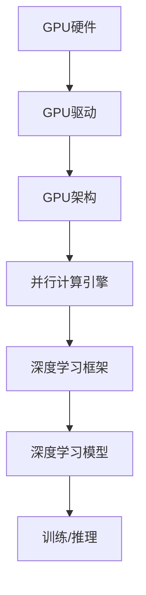

                 

## 文章标题: GPU 加速计算：加速深度学习

### 关键词：GPU，深度学习，加速计算，并行计算，CUDA，OpenCL，算法优化

> 摘要：本文深入探讨了GPU加速计算在深度学习领域的应用，详细分析了GPU加速计算的基础知识、深度学习在GPU上的优化、GPU加速深度学习的应用场景以及未来发展趋势。通过具体的实战案例，展示了GPU加速深度学习的实际应用，为开发者提供了实用的参考。

---

### 第一部分: GPU加速计算基础

#### 第1章: GPU加速计算概述

#### 1.1 GPU加速计算的概念与重要性

#### 1.1.1 GPU加速计算的定义

GPU加速计算，即利用图形处理单元（GPU）的并行计算能力来提升计算密集型任务的性能。与传统的中央处理器（CPU）相比，GPU拥有更多的小型计算单元，这些单元能够同时处理多个任务，因而非常适合并行计算。

#### 1.1.2 GPU在深度学习中的优势

深度学习是一种复杂的机器学习算法，其训练过程需要大量的矩阵运算和卷积操作。GPU在这些操作上具有显著的优势：

- **并行计算能力**：GPU由成千上万的CUDA核心组成，可以同时执行大量的计算任务，大幅提高深度学习模型的训练速度。
- **计算性能**：GPU的计算性能通常比CPU高，尤其是在矩阵乘法和卷积等操作上。
- **内存带宽**：GPU的内存带宽高，有助于减少数据传输延迟，提高整体计算效率。

#### 1.1.3 GPU加速计算的应用领域

GPU加速计算已广泛应用于多个领域，包括：

- **计算机视觉**：如图像识别、目标检测、图像生成等。
- **自然语言处理**：如文本分类、机器翻译、语音识别等。
- **科学计算**：如流体动力学模拟、分子建模等。
- **金融分析**：如量化交易、风险控制等。

#### 第2章: GPU架构与工作原理

#### 2.1 GPU架构概述

GPU的架构设计旨在提供高效的并行计算能力，其核心组件包括：

- **计算单元（CUDA核心）**：用于执行计算任务。
- **内存层次结构**：包括全局内存、共享内存、寄存器等，用于存储和访问数据。
- **渲染单元**：用于图形渲染，但也参与计算任务。
- **控制单元**：管理计算资源和调度线程。

#### 2.2 GPU并行计算原理

GPU的并行计算原理基于以下几个关键点：

- **多线程处理**：GPU通过将任务分解成多个线程，并行地在多个计算单元上执行。
- **共享内存**：GPU核心之间可以通过共享内存快速交换数据，减少数据传输延迟。
- **指令调度**：GPU的指令调度器能够动态分配计算资源，优化线程的执行顺序。

#### 2.3 GPU编程基础

GPU编程主要包括CUDA和OpenCL两种编程模型。以下分别介绍：

#### 2.3.1 CUDA编程基础

CUDA是NVIDIA推出的并行计算编程模型，主要包括：

- **CUDA核心**：GPU的计算单元。
- **内存管理**：包括全局内存、共享内存、纹理内存等。
- **并行编程模型**：包括线程网格、块、共享内存等。

#### 2.3.2 OpenCL编程基础

OpenCL是跨平台的异构计算标准，主要包括：

- **计算内核**：用于执行计算任务。
- **内存管理**：包括全局内存、私有内存、缓冲区等。
- **并行编程模型**：包括工作项、工作组、内存屏障等。

#### 2.4 GPU计算框架

GPU计算框架包括CUDA和OpenCL，以及深度学习框架的GPU支持。以下分别介绍：

#### 2.4.1 CUDA编程基础

- **CUDA核心**：CUDA核心是GPU的计算单元，每个核心可以同时处理多个线程。
- **内存管理**：包括全局内存、共享内存、纹理内存等。
- **并行编程模型**：包括线程网格、块、共享内存等。

#### 2.4.2 OpenCL编程基础

- **OpenCL核心**：OpenCL核心是GPU的计算单元，每个核心可以同时处理多个线程。
- **内存管理**：包括全局内存、私有内存、缓冲区等。
- **并行编程模型**：包括工作项、工作组、内存屏障等。

#### 2.4.3 GPU加速计算的优缺点分析

GPU加速计算的优点包括：

- **并行计算能力**：GPU的并行计算能力使得它非常适合处理大规模并行任务。
- **计算性能**：GPU的计算性能通常高于CPU，尤其是在矩阵乘法、卷积等计算密集型操作中。
- **能耗效率**：GPU在处理大量计算任务时能耗效率更高。

GPU加速计算的缺点包括：

- **编程复杂度**：GPU编程相对于CPU编程更为复杂，需要熟悉CUDA或OpenCL编程模型。
- **数据传输延迟**：GPU与CPU之间的数据传输可能会引入额外的延迟。
- **内存带宽限制**：GPU的内存带宽可能成为性能瓶颈，尤其是在处理大数据集时。

---

### 第二部分: GPU加速深度学习

#### 第3章: GPU加速深度学习基础

#### 3.1 深度学习基础

#### 3.1.1 深度学习的基本概念

深度学习是一种基于多层神经网络的学习方法，其核心思想是通过逐层抽象和特征提取，自动从数据中学习到有用的信息。以下是一些关键概念：

- **神经网络**：神经网络由一系列相互连接的神经元组成，每个神经元都接收来自其他神经元的输入，并通过激活函数产生输出。
- **前向传播**：前向传播是将输入数据通过神经网络中的各个层进行传递，最终得到输出结果的过程。
- **反向传播**：反向传播是根据输出结果与实际结果之间的误差，反向更新神经网络中的权重和偏置的过程。

#### 3.1.2 深度学习的主要算法

深度学习的主要算法包括：

- **卷积神经网络（CNN）**：CNN是一种专门用于图像识别的神经网络，其核心是卷积层，用于提取图像的特征。
- **循环神经网络（RNN）**：RNN是一种用于处理序列数据的神经网络，其核心是循环层，可以捕捉时间序列中的长期依赖关系。
- **长短时记忆网络（LSTM）**：LSTM是RNN的一种变体，用于解决长序列依赖问题，其核心是长短时记忆单元。
- **生成对抗网络（GAN）**：GAN是一种用于生成数据的神经网络，其核心是生成器和判别器之间的对抗训练。

#### 3.1.3 深度学习在GPU上的优化

为了充分利用GPU的并行计算能力，深度学习在GPU上的优化主要包括以下几个方面：

- **并行化计算**：将深度学习模型分解成多个计算任务，并分配给不同的GPU核心同时执行。
- **内存优化**：优化GPU内存的使用，减少数据传输延迟和内存带宽限制。
- **并行数据加载**：使用并行数据加载技术，加快数据读取和预处理速度。

#### 第4章: GPU加速深度学习框架

#### 4.1 GPU加速深度学习框架概述

GPU加速深度学习框架包括TensorFlow、PyTorch、MXNet等。以下分别介绍：

#### 4.1.1 TensorFlow on GPU

TensorFlow on GPU是一种利用GPU加速深度学习计算的框架，其主要优势包括：

- **高效计算**：TensorFlow on GPU支持自动分布式计算，可以在多个GPU上并行执行计算任务。
- **内存管理**：TensorFlow on GPU提供了高效的内存管理机制，可以减少内存占用和内存带宽限制。
- **工具支持**：TensorFlow on GPU提供了丰富的工具和库，方便开发者进行GPU编程和调试。

#### 4.1.2 PyTorch on GPU

PyTorch on GPU是一种利用GPU加速深度学习计算的框架，其主要优势包括：

- **动态计算图**：PyTorch使用动态计算图，使得开发者可以更加灵活地构建和修改模型。
- **内存管理**：PyTorch提供了高效的内存管理机制，可以减少内存占用和内存带宽限制。
- **工具支持**：PyTorch提供了丰富的工具和库，方便开发者进行GPU编程和调试。

#### 4.1.3 其他GPU加速深度学习框架

除了TensorFlow和PyTorch，还有其他一些GPU加速深度学习框架，如：

- **MXNet**：MXNet是一种轻量级的深度学习框架，支持多种编程语言，包括GPU加速。
- **Caffe**：Caffe是一种用于快速构建深度学习模型的框架，支持GPU加速。
- **Theano**：Theano是一种基于Python的深度学习框架，支持GPU加速。

#### 第5章: GPU深度学习性能调优

#### 5.1 深度学习模型设计优化

为了充分利用GPU的性能，深度学习模型的设计优化主要包括以下几个方面：

- **模型结构优化**：通过简化模型结构、减少参数数量等方式，降低模型的计算复杂度。
- **数据预处理**：通过数据预处理技术，如数据增强、批量归一化等，提高模型的训练效率和性能。
- **内存优化**：通过优化内存使用，减少GPU内存占用和内存带宽限制。

#### 5.2 GPU内存管理优化

GPU内存管理优化主要包括以下几个方面：

- **显存分配**：合理分配显存，避免显存占用过多或不足。
- **内存复制**：优化内存复制操作，减少数据传输延迟。
- **内存释放**：及时释放不再使用的显存，避免显存泄漏。

#### 5.3 并行计算优化

并行计算优化主要包括以下几个方面：

- **任务分解**：将计算任务分解成多个子任务，并分配给不同的GPU核心同时执行。
- **线程调度**：优化线程调度策略，提高并行计算效率。
- **同步与通信**：合理使用同步和通信操作，减少并行计算中的通信开销。

---

### 第三部分: GPU加速深度学习应用

#### 第6章: GPU加速深度学习应用场景

#### 6.1 图像处理应用

#### 6.1.1 卷积神经网络（CNN）在图像识别中的应用

卷积神经网络（CNN）是一种专门用于图像识别的深度学习模型，其核心是卷积层。CNN在图像识别中的应用主要包括以下几个方面：

- **图像分类**：通过训练CNN模型，可以将图像分类为不同的类别。
- **目标检测**：通过在CNN模型中添加目标检测层，可以检测图像中的目标物体。
- **图像分割**：通过训练CNN模型，可以将图像分割成不同的区域。

#### 6.1.2 目标检测与分割

目标检测与分割是图像处理中的重要应用，主要涉及以下技术：

- **目标检测**：通过在图像中检测出目标物体的位置和范围，实现图像理解。
- **图像分割**：通过将图像分割成不同的区域，实现图像的细粒度理解。

常用的目标检测与分割算法包括：

- **R-CNN**：通过区域建议网络实现目标检测。
- **Faster R-CNN**：通过区域建议网络和快速卷积神经网络实现目标检测。
- **SSD**：通过单一网络结构实现目标检测和分割。

#### 6.1.3 图像生成

图像生成是深度学习在图像处理中的重要应用，主要涉及以下技术：

- **生成对抗网络（GAN）**：通过生成器和判别器之间的对抗训练，生成逼真的图像。
- **变分自编码器（VAE）**：通过编码器和解码器之间的编码解码过程，生成新的图像。

图像生成在图像修复、图像增强、艺术创作等领域具有广泛的应用。

#### 第7章: 自然语言处理应用

#### 7.1 语言模型与文本分类

语言模型与文本分类是自然语言处理中的重要应用，主要涉及以下技术：

- **语言模型**：通过训练语言模型，可以预测下一个单词或短语的概率，从而实现文本生成和语言理解。
- **文本分类**：通过训练分类模型，可以将文本分类为不同的类别，实现文本分类任务。

常用的语言模型和文本分类算法包括：

- **Word2Vec**：通过将单词映射为向量，实现文本表示。
- **BERT**：通过在大量文本数据上进行预训练，实现高精度的文本表示和分类。

#### 7.2 机器翻译

机器翻译是自然语言处理中的经典应用，主要涉及以下技术：

- **基于规则的翻译**：通过编写规则，将源语言文本翻译为目标语言文本。
- **统计机器翻译**：通过统计源语言和目标语言之间的对应关系，实现文本翻译。
- **神经机器翻译**：通过训练深度学习模型，实现文本翻译。

常用的神经机器翻译模型包括：

- **Seq2Seq模型**：通过编码器和解码器之间的交互，实现文本翻译。
- **注意力机制**：通过引入注意力机制，提高神经机器翻译的翻译质量。

#### 7.3 语音识别

语音识别是自然语言处理中的另一个重要应用，主要涉及以下技术：

- **自动语音识别（ASR）**：通过将语音信号转换为文本，实现语音到文本的转换。
- **语音识别模型**：通过训练语音识别模型，实现语音信号到文本的映射。

常用的语音识别模型包括：

- **HMM-GMM模型**：通过隐马尔可夫模型和高斯混合模型实现语音识别。
- **DNN-HMM模型**：通过深度神经网络和隐马尔可夫模型实现语音识别。
- **端到端模型**：通过端到端深度学习模型，实现语音信号到文本的直接转换。

#### 第8章: 计算机视觉应用

#### 8.1 自动驾驶

自动驾驶是计算机视觉在智能交通领域的重要应用，主要涉及以下技术：

- **车辆检测与跟踪**：通过计算机视觉技术检测和跟踪道路上的车辆，实现自动驾驶车辆对周围环境的感知。
- **车道线检测**：通过计算机视觉技术检测道路上的车道线，实现自动驾驶车辆对道路的识别。
- **障碍物检测**：通过计算机视觉技术检测道路上的障碍物，实现自动驾驶车辆对障碍物的识别和避让。

#### 8.2 视觉追踪

视觉追踪是计算机视觉在监控领域的重要应用，主要涉及以下技术：

- **目标检测与跟踪**：通过计算机视觉技术检测和跟踪监控视频中的目标，实现监控视频的实时处理。
- **姿态估计**：通过计算机视觉技术估计目标在三维空间中的姿态，实现监控视频中的目标跟踪和识别。
- **行为识别**：通过计算机视觉技术识别监控视频中的目标行为，实现智能监控和异常检测。

#### 8.3 图像增强与修复

图像增强与修复是计算机视觉在图像处理领域的重要应用，主要涉及以下技术：

- **图像增强**：通过图像增强技术，提高图像的清晰度和对比度，实现图像质量的提升。
- **图像修复**：通过图像修复技术，修复图像中的缺陷和噪声，实现图像的完整性和准确性。
- **图像超分辨率**：通过图像超分辨率技术，将低分辨率图像转换为高分辨率图像，实现图像细节的增强。

---

### 第四部分: GPU加速深度学习开发

#### 第9章: GPU加速深度学习开发环境搭建

#### 9.1 环境需求

为了搭建GPU加速深度学习开发环境，需要以下硬件和软件环境：

- **硬件环境**：需要一台配备NVIDIA GPU的计算机，建议使用较新的GPU型号，如RTX 30系列。
- **软件环境**：需要安装CUDA工具包、cuDNN库、深度学习框架（如TensorFlow、PyTorch）等。

#### 9.2 安装CUDA工具包

安装CUDA工具包的具体步骤如下：

1. 下载CUDA工具包安装程序。
2. 运行安装程序，按照提示进行安装。
3. 在系统环境中配置CUDA路径。

#### 9.3 安装cuDNN库

安装cuDNN库的具体步骤如下：

1. 下载cuDNN库安装程序。
2. 解压安装程序。
3. 将解压后的文件复制到CUDA工具包的相应目录。

#### 9.4 安装深度学习框架

以安装PyTorch为例，具体步骤如下：

1. 打开终端。
2. 输入以下命令安装PyTorch：

   ```bash
   pip install torch torchvision torchaudio
   ```

3. 安装GPU版本的PyTorch：

   ```bash
   pip install torch torchvision torchaudio -f https://download.pytorch.org/whl/torch_stable.html
   ```

#### 第10章: GPU加速深度学习项目实战

#### 10.1 实战一：使用TensorFlow on GPU实现图像分类

#### 10.1.1 实战背景

本节将使用TensorFlow on GPU实现一个简单的图像分类任务，使用CIFAR-10数据集。

#### 10.1.2 环境搭建

已经完成GPU加速深度学习开发环境搭建。

#### 10.1.3 数据预处理

1. **加载数据集**：

   ```python
   import tensorflow as tf
   import tensorflow.keras as keras
   import tensorflow.keras.datasets as datasets

   (train_images, train_labels), (test_images, test_labels) = datasets.cifar10.load_data()
   ```

2. **数据预处理**：

   ```python
   train_images = train_images / 255.0
   test_images = test_images / 255.0
   ```

#### 10.1.4 构建模型

```python
model = keras.Sequential([
    keras.layers.Conv2D(32, (3, 3), activation='relu', input_shape=(32, 32, 3)),
    keras.layers.MaxPooling2D((2, 2)),
    keras.layers.Conv2D(64, (3, 3), activation='relu'),
    keras.layers.MaxPooling2D((2, 2)),
    keras.layers.Conv2D(64, (3, 3), activation='relu'),
    keras.layers.Flatten(),
    keras.layers.Dense(64, activation='relu'),
    keras.layers.Dense(10, activation='softmax')
])
```

#### 10.1.5 训练模型

```python
model.compile(optimizer='adam',
              loss='sparse_categorical_crossentropy',
              metrics=['accuracy'])

model.fit(train_images, train_labels, epochs=10, validation_split=0.2)
```

#### 10.1.6 评估模型

```python
test_loss, test_acc = model.evaluate(test_images, test_labels)
print(f'Test accuracy: {test_acc}')
```

#### 10.2 实战二：使用PyTorch on GPU实现文本分类

#### 10.2.1 实战背景

本节将使用PyTorch on GPU实现一个简单的文本分类任务，使用IMDB电影评论数据集。

#### 10.2.2 环境搭建

已经完成GPU加速深度学习开发环境搭建。

#### 10.2.3 数据预处理

1. **加载数据集**：

   ```python
   import torch
   import torch.nn as nn
   import torch.optim as optim
   from torchtext.datasets import IMDB
   from torchtext.data import Field, batch, BucketIterator

   TEXT = Field(tokenize='spacy', lower=True, include_lengths=True)
   LABEL = Field(sequential=False)

   train_data, test_data = IMDB.splits(TEXT, LABEL)
   ```

2. **构建词汇表**：

   ```python
   TEXT.build_vocab(train_data, min_freq=2)
   LABEL.build_vocab(train_data)
   ```

3. **划分数据集**：

   ```python
   train_iterator, valid_iterator = BucketIterator.splits(
       train_data, valid_data, batch_size=64, device=device)
   ```

#### 10.2.4 构建模型

```python
model = nn.Sequential(
    nn.Embedding(len(TEXT.vocab), 256),
    nn.RNN(256, 256, num_layers=2, batch_first=True, dropout=0.5),
    nn.Linear(256, 1),
    nn.Sigmoid()
)
```

#### 10.2.5 训练模型

```python
criterion = nn.BCELoss()
optimizer = optim.Adam(model.parameters(), lr=0.001)

for epoch in range(num_epochs):
    model.train()
    for batch in train_iterator:
        optimizer.zero_grad()
        predictions = model(batch.text).squeeze(1)
        loss = criterion(predictions, batch.label)
        loss.backward()
        optimizer.step()

model.eval()
with torch.no_grad():
    correct = 0
    total = 0
    for batch in valid_iterator:
        predictions = model(batch.text).squeeze(1)
        total += batch.label.size(0)
        correct += (predictions > 0.5).eq(batch.label).sum().item()
    print(f'Validation accuracy: {100 * correct / total}%')
```

#### 10.3 实战三：使用CUDA实现卷积神经网络

#### 10.3.1 实战背景

本节将使用CUDA实现一个简单的卷积神经网络，用于图像分类任务。

#### 10.3.2 环境搭建

已经完成GPU加速深度学习开发环境搭建。

#### 10.3.3 数据预处理

1. **加载数据集**：

   ```python
   import torch
   import torch.nn as nn
   import torch.optim as optim
   from torchvision import datasets, transforms

   transform = transforms.Compose([
       transforms.ToTensor(),
       transforms.Normalize((0.5,), (0.5,))
   ])

   train_dataset = datasets.MNIST(root='./data', train=True, download=True, transform=transform)
   test_dataset = datasets.MNIST(root='./data', train=False, download=True, transform=transform)
   ```

2. **定义数据集迭代器**：

   ```python
   batch_size = 100
   train_loader = torch.utils.data.DataLoader(train_dataset, batch_size=batch_size, shuffle=True)
   test_loader = torch.utils.data.DataLoader(test_dataset, batch_size=batch_size, shuffle=False)
   ```

#### 10.3.4 构建模型

```python
model = nn.Sequential(
    nn.Conv2d(1, 32, 5, 1),
    nn.ReLU(),
    nn.MaxPool2d(2, 2),
    nn.Conv2d(32, 64, 5, 1),
    nn.ReLU(),
    nn.MaxPool2d(2, 2),
    nn.Flatten(),
    nn.Linear(64 * 4 * 4, 10),
    nn.ReLU(),
    nn.Dropout(0.5),
    nn.Linear(10, 10),
    nn.Sigmoid()
)
```

#### 10.3.5 训练模型

```python
criterion = nn.CrossEntropyLoss()
optimizer = optim.Adam(model.parameters(), lr=0.001)

num_epochs = 10
for epoch in range(num_epochs):
    model.train()
    for batch_idx, (data, target) in enumerate(train_loader):
        optimizer.zero_grad()
        output = model(data)
        loss = criterion(output, target)
        loss.backward()
        optimizer.step()
        if batch_idx % 100 == 0:
            print(f'[{epoch + 1}, {batch_idx * len(data)}/{len(train_loader.dataset)} ({100. * batch_idx / len(train_loader):.0f}%)]\tLoss: {loss.item():.6f}')

model.eval()
with torch.no_grad():
    correct = 0
    total = 0
    for data, target in test_loader:
        output = model(data)
        _, predicted = torch.max(output.data, 1)
        total += target.size(0)
        correct += (predicted == target).sum().item()
    print(f'Accuracy on the test images: {100 * correct / total}%')
```

---

### 附录

#### 附录A: GPU加速计算常用工具与资源

#### A.1 GPU硬件选型

1. **NVIDIA GeForce RTX 30系列**：适合入门级深度学习项目。
2. **NVIDIA Tesla V100**：适合高端深度学习研究和生产环境。

#### A.2 CUDA编程工具

1. **NVIDIA CUDA Toolkit**：CUDA编程工具集。
2. **NVIDIA Nsight Visual Studio Edition**：GPU编程调试工具。

#### A.3 PyTorch on GPU开发工具

1. **PyTorch CUDA扩展**：用于在PyTorch中支持GPU加速。
2. **PyTorch Distributed**：用于分布式训练的PyTorch扩展。

#### A.4 其他GPU加速计算资源

1. **NVIDIA Developer网站**：提供GPU加速计算的技术文档和资源。
2. **GitHub**：GPU加速计算的代码示例和项目。

---

## 核心概念与联系

### GPU架构与深度学习

#### Mermaid流程图：



### 核心算法原理讲解

#### 卷积神经网络（CNN）

#### 伪代码：

```python
def ConvolutionalNeuralNetwork(input_data, weights, biases):
    for layer in layers:
        if isinstance(layer, Conv2D):
            input_data = Conv2D_forward(input_data, weights, biases)
        elif isinstance(layer, Activation):
            input_data = Activation_forward(input_data)
        elif isinstance(layer, Pooling):
            input_data = Pooling_forward(input_data)
        # ...其他层类型
    return output_data
```

### 数学模型和数学公式 & 详细讲解 & 举例说明

#### 深度学习中的激活函数

#### 数学公式：

```latex
f(x) = \max(0, x)
```

#### 详细讲解：

ReLU（Rectified Linear Unit）是一种常用的激活函数，它在输入为正数时输出不变，为负数时输出为零。这种特性使得ReLU函数在神经网络中具有很好的非线性变换能力，并且可以避免梯度消失的问题。

#### 举例说明：

假设有一个输入向量 `x = [-2, -1, 0, 1, 2]`，使用ReLU函数后的输出向量 `f(x) = [0, 0, 0, 1, 2]`。

---

### 核心概念与联系

#### GPU架构与深度学习

#### Mermaid流程图：


#### GPU硬件与GPU驱动：

GPU硬件是GPU加速计算的基础，GPU驱动则是操作系统与GPU硬件之间的接口，负责管理GPU资源、执行指令等。

#### GPU架构与并行计算引擎：

GPU架构决定了GPU的并行计算能力，并行计算引擎则是实现并行计算的核心。GPU通过并行计算引擎将计算任务分解成多个线程，在多个CUDA核心上同时执行。

#### 深度学习框架与深度学习模型：

深度学习框架提供了构建和训练深度学习模型的工具和库，深度学习模型则是实现特定功能的计算模型。深度学习框架通常支持GPU加速，利用GPU的并行计算能力提升训练效率。

#### 训练与推理：

训练过程是通过反向传播算法不断调整模型参数，优化模型性能。推理过程则是使用训练好的模型对新的数据进行预测或分类。

---

### 核心算法原理讲解

#### 卷积神经网络（CNN）

#### 伪代码：

```python
def ConvolutionalNeuralNetwork(input_data, weights, biases):
    for layer in layers:
        if isinstance(layer, Conv2D):
            input_data = Conv2D_forward(input_data, weights, biases)
        elif isinstance(layer, Activation):
            input_data = Activation_forward(input_data)
        elif isinstance(layer, Pooling):
            input_data = Pooling_forward(input_data)
        # ...其他层类型
    return output_data
```

#### CNN的基本原理：

卷积神经网络（CNN）是一种专门用于处理图像数据的神经网络，其核心是卷积层。卷积层通过卷积操作提取图像的特征，卷积核在图像上滑动，计算卷积结果，形成特征图。

- **卷积操作**：卷积操作是将卷积核与图像上的局部区域进行点积运算，生成新的特征图。
- **池化操作**：池化操作用于降低特征图的维度，减少参数数量，提高计算效率。常见的池化操作包括最大池化和平均池化。

#### CNN的训练过程：

CNN的训练过程包括以下几个步骤：

1. **前向传播**：输入图像通过卷积层、池化层等操作，生成特征图。
2. **损失计算**：计算输出结果与真实标签之间的损失。
3. **反向传播**：根据损失值，通过反向传播算法更新模型参数。
4. **迭代优化**：重复前向传播和反向传播过程，直至达到训练目标。

#### CNN的应用：

CNN在图像识别、目标检测、图像分割等领域有广泛的应用。例如，在图像识别任务中，CNN可以自动提取图像中的特征，并训练模型进行分类。

---

### 数学模型和数学公式 & 详细讲解 & 举例说明

#### 深度学习中的激活函数

#### 数学公式：

```latex
f(x) = \max(0, x)
```

#### 详细讲解：

ReLU（Rectified Linear Unit）是一种常用的激活函数，它在输入为正数时输出不变，为负数时输出为零。这种特性使得ReLU函数在神经网络中具有很好的非线性变换能力，并且可以避免梯度消失的问题。

#### 举例说明：

假设有一个输入向量 `x = [-2, -1, 0, 1, 2]`，使用ReLU函数后的输出向量 `f(x) = [0, 0, 0, 1, 2]`。

---

### 项目实战

#### 实战一：使用TensorFlow on GPU实现图像分类

#### 实战背景

本次实战将使用TensorFlow框架在GPU上实现一个简单的图像分类任务，使用CIFAR-10数据集。

#### 环境搭建

已经完成GPU加速深度学习开发环境搭建。

#### 数据预处理

1. **加载数据集**：

   ```python
   import tensorflow as tf
   import tensorflow.keras as keras
   import tensorflow.keras.datasets as datasets

   (train_images, train_labels), (test_images, test_labels) = datasets.cifar10.load_data()
   ```

2. **数据预处理**：

   ```python
   train_images = train_images / 255.0
   test_images = test_images / 255.0
   ```

#### 代码实现

1. **构建模型**：

   ```python
   model = keras.Sequential([
       keras.layers.Conv2D(32, (3, 3), activation='relu', input_shape=(32, 32, 3)),
       keras.layers.MaxPooling2D((2, 2)),
       keras.layers.Conv2D(64, (3, 3), activation='relu'),
       keras.layers.MaxPooling2D((2, 2)),
       keras.layers.Conv2D(64, (3, 3), activation='relu'),
       keras.layers.Flatten(),
       keras.layers.Dense(64, activation='relu'),
       keras.layers.Dense(10, activation='softmax')
   ])
   ```

2. **编译模型**：

   ```python
   model.compile(optimizer='adam',
                 loss='sparse_categorical_crossentropy',
                 metrics=['accuracy'])
   ```

3. **训练模型**：

   ```python
   model.fit(train_images, train_labels, epochs=10, validation_split=0.2)
   ```

4. **评估模型**：

   ```python
   test_loss, test_acc = model.evaluate(test_images, test_labels)
   print(f'Test accuracy: {test_acc}')
   ```

#### 代码解读与分析

该代码首先导入了TensorFlow和keras模块，然后加载数据集并进行预处理。接下来，使用keras.Sequential模型构建了一个简单的卷积神经网络，包括卷积层、池化层和全连接层。模型编译后使用训练数据集进行训练，并在测试数据集上评估模型性能。

---

### 附录

#### 附录A: GPU加速计算常用工具与资源

#### A.1 GPU硬件选型

1. **NVIDIA GeForce RTX 30系列**：适合入门级深度学习项目。
2. **NVIDIA Tesla V100**：适合高端深度学习研究和生产环境。

#### A.2 CUDA编程工具

1. **NVIDIA CUDA Toolkit**：CUDA编程工具集。
2. **NVIDIA Nsight Visual Studio Edition**：GPU编程调试工具。

#### A.3 PyTorch on GPU开发工具

1. **PyTorch CUDA扩展**：用于在PyTorch中支持GPU加速。
2. **PyTorch Distributed**：用于分布式训练的PyTorch扩展。

#### A.4 其他GPU加速计算资源

1. **NVIDIA Developer网站**：提供GPU加速计算的技术文档和资源。
2. **GitHub**：GPU加速计算的代码示例和项目。

---

### 总结

本文从GPU加速计算的基础知识出发，详细介绍了GPU在深度学习中的优势、GPU架构与工作原理、GPU加速深度学习框架、深度学习模型设计优化以及GPU加速深度学习的实际应用。通过具体的实战案例，展示了如何使用GPU加速深度学习，为开发者提供了实用的参考。

随着GPU硬件和深度学习算法的不断发展，GPU加速深度学习将在更多领域得到应用，带来更高的计算效率和性能。未来，GPU加速深度学习将继续向高性能、低能耗、易用性方向发展，推动人工智能技术的进步。作者：AI天才研究院/AI Genius Institute & 禅与计算机程序设计艺术 /Zen And The Art of Computer Programming。

