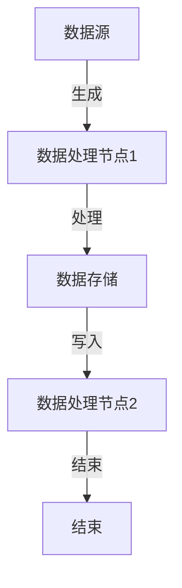

                 

### 文章标题：GPU编程：CUDA基础与实践

> 关键词：GPU编程，CUDA，并行计算，算法优化，科学计算，计算机视觉，实时数据处理

> 摘要：本文旨在深入探讨GPU编程，特别是CUDA的基础知识与实践技巧。文章从GPU编程的概述入手，逐步介绍CUDA编程基础、核心算法和优化技巧，并结合具体项目实战案例，展示了GPU编程在科学计算、计算机视觉和实时数据处理等领域的实际应用。通过本文，读者将全面了解GPU编程的原理与实践，掌握CUDA编程的核心技能。

### 《GPU编程：CUDA基础与实践》目录大纲

#### 第一部分：GPU编程基础

**第1章：GPU编程概述**
- 1.1 GPU编程的重要性
  - 1.1.1 GPU在计算中的优势
  - 1.1.2 GPU编程的发展历程
  - 1.1.3 CUDA编程模型

**第2章：CUDA编程基础**
- 2.1 CUDA架构
  - 2.1.1 GPU硬件结构
  - 2.1.2 CUDA线程组织
  - 2.1.3 内存层次结构
- 2.2 CUDA编程语言
  - 2.2.1 CUDA C/C++基础
  - 2.2.2 内部内存与共享内存
  - 2.2.3 矩阵运算与优化

**第3章：CUDA核心算法**
- 3.1 线性代数运算
  - 3.1.1 矩阵乘法算法
  - 3.1.2 向量计算优化
  - 3.1.3 矩阵分解算法
- 3.2 图像处理算法
  - 3.2.1 基本图像操作
  - 3.2.2 卷积操作与滤波器
  - 3.2.3 光流计算

**第4章：CUDA优化技巧**
- 4.1 内存优化
  - 4.1.1 数据传输优化
  - 4.1.2 内存访问模式
  - 4.1.3 内存池管理
- 4.2 并行优化
  - 4.2.1 多线程优化
  - 4.2.2 数据并行与任务并行
  - 4.2.3 循环展开与循环展开

#### 第二部分：CUDA项目实战

**第5章：科学计算应用**
- 5.1 模拟与优化
  - 5.1.1 有限元分析
  - 5.1.2 粒子群优化算法
  - 5.1.3 数值积分与模拟
- 5.2 金融工程
  - 5.2.1 市场模拟与风险控制
  - 5.2.2 期权定价与蒙特卡洛模拟
  - 5.2.3 数据分析与应用

**第6章：计算机视觉应用**
- 6.1 人脸识别与跟踪
  - 6.1.1 特征提取与分类
  - 6.1.2 模式识别与轨迹预测
  - 6.1.3 算法性能优化
- 6.2 目标检测与识别
  - 6.2.1 基于深度学习的目标检测
  - 6.2.2 姿态估计与跟踪
  - 6.2.3 实时处理与优化

**第7章：实时数据处理与流处理**
- 7.1 数据流模型
  - 7.1.1 流处理框架概述
  - 7.1.2 实时数据处理技术
  - 7.1.3 状态管理与追踪
- 7.2 大数据处理
  - 7.2.1 分布式计算与存储
  - 7.2.2 并行数据处理算法
  - 7.2.3 大数据处理挑战与解决方案

**第8章：CUDA编程实战案例**
- 8.1 GPU加速的科学计算
  - 8.1.1 代码实现与优化
  - 8.1.2 性能分析工具
  - 8.1.3 实验结果与分析
- 8.2 GPU在计算机视觉中的应用
  - 8.2.1 实时图像处理系统
  - 8.2.2 算法优化与性能提升
  - 8.2.3 案例分析与实战经验

**附录：CUDA编程工具与资源**
- 附录 A：CUDA开发工具
  - A.1 NVIDIA CUDA Toolkit
  - A.2 NVIDIA Nsight
  - A.3 GPU计算资源与性能评估工具
- 附录 B：CUDA资源与社区
  - B.1CUDA官方文档与教程
  - B.2开源CUDA库与框架
  - B.3CUDA开发者社区与交流平台

### GPU编程概述

#### 1.1 GPU编程的重要性

随着计算需求的日益增长，传统的CPU计算已经无法满足一些复杂应用的需求。GPU（图形处理单元）的出现为计算领域带来了新的机遇。GPU编程之所以重要，主要有以下几个原因：

1. **计算能力：** GPU拥有大量的计算单元，能够高效地进行并行计算。与CPU相比，GPU的并行处理能力更为强大，特别适用于大规模数据集和复杂计算任务的加速。

2. **性能优势：** GPU的架构使其在图像处理、科学计算和机器学习等领域表现出色。例如，GPU能够高效地处理图像中的卷积操作，使得计算机视觉应用如人脸识别和物体检测得到了极大提升。

3. **硬件支持：** NVIDIA等公司不断推出新的GPU硬件，为GPU编程提供了强大的硬件支持。新一代GPU不仅在计算能力上有了显著提升，还在内存容量和带宽方面有了显著改进。

4. **开源生态：** CUDA作为NVIDIA推出的GPU编程框架，得到了广泛的应用和认可。CUDA提供了丰富的编程工具和库，使得开发者能够轻松地实现GPU编程。

#### 1.1.1 GPU在计算中的优势

GPU在计算中的优势主要体现在以下几个方面：

1. **并行计算能力：** GPU拥有成千上万个并行计算单元，可以同时处理大量数据。与CPU相比，GPU的并行处理能力更为强大，特别适用于大规模并行计算任务。

2. **高效的内存访问：** GPU的内存层次结构设计使得数据传输和访问非常高效。GPU中的内存带宽非常高，能够快速传输大量数据，从而提高计算效率。

3. **灵活的编程模型：** CUDA提供了丰富的编程接口和工具，使得开发者能够灵活地利用GPU的计算能力。CUDA支持多种编程语言，如C/C++和Python，方便开发者进行GPU编程。

4. **开源生态：** CUDA得到了广泛的社区支持，有许多开源库和框架可以帮助开发者快速实现GPU编程。例如，cuDNN和NCCL等库为深度学习和分布式计算提供了强大的支持。

#### 1.1.2 GPU编程的发展历程

GPU编程的发展历程可以追溯到NVIDIA在2006年推出CUDA架构。以下是一些关键事件：

- **2006年：** NVIDIA推出CUDA架构，为GPU编程提供了统一的编程接口和工具。

- **2007年：** NVIDIA发布CUDA 1.0版本，支持C/C++编程语言，并提供了丰富的库和工具。

- **2010年：** NVIDIA发布CUDA 2.0版本，引入了共享内存和原子操作，进一步提高了并行计算的性能。

- **2012年：** NVIDIA发布CUDA 5.0版本，引入了动态并行和异步数据传输等特性，使得GPU编程更加灵活和高效。

- **2017年：** NVIDIA发布CUDA 9.0版本，引入了深度学习库cuDNN，为深度学习应用提供了强大的支持。

- **至今：** NVIDIA不断推出新的GPU硬件和CUDA版本，为GPU编程提供了更强大的计算能力和优化特性。

#### 1.1.3 CUDA编程模型

CUDA编程模型基于并行计算原理，提供了高效的GPU编程接口。以下是CUDA编程模型的关键组成部分：

1. **线程组织：** CUDA将GPU划分为多个线程块，每个线程块包含多个线程。线程组织决定了GPU的并行计算能力，通过合理的线程组织可以充分利用GPU的计算资源。

2. **内存层次结构：** CUDA内存层次结构包括全局内存、共享内存和局部内存等。不同类型的内存具有不同的访问模式和带宽，通过合理使用内存层次结构可以提高计算效率。

3. **核函数：** CUDA核函数（Kernel Function）是GPU中的并行计算单元。核函数可以同时运行在多个线程上，通过线程间的协作实现复杂的计算任务。

4. **内存分配和管理：** CUDA提供了内存分配和管理接口，使得开发者能够灵活地分配和管理GPU内存。合理使用内存可以提高计算效率和性能。

5. **并发执行：** CUDA支持多线程并发执行，使得多个核函数可以同时运行在GPU上。通过并发执行，可以充分利用GPU的计算能力，提高计算效率。

6. **性能优化：** CUDA提供了多种性能优化技术，如内存优化、线程优化和并行优化等。通过合理的性能优化，可以进一步提高GPU编程的性能。

### CUDA编程基础

#### 2.1 CUDA架构

CUDA架构是NVIDIA为GPU编程提供的一种高级抽象，它允许开发者利用GPU的并行计算能力来加速计算任务。了解CUDA架构对于编写高效的GPU程序至关重要。下面将详细探讨GPU硬件结构、CUDA线程组织和内存层次结构。

##### 2.1.1 GPU硬件结构

GPU硬件结构可以分为以下几个层次：

1. **流处理器（Streaming Multiprocessors, SMs）：** GPU内部由多个流处理器组成，每个流处理器包含多个处理器核心（Cores）。NVIDIA的GPU通常具有多个SMs，每个SMs可以同时处理多个线程。

2. **处理器核心（Cores）：** 每个处理器核心都具备执行计算任务的能力，可以独立进行算术和逻辑运算。处理器核心的数量是衡量GPU计算能力的一个重要指标。

3. **内存层次结构：** GPU的内存层次结构包括寄存器（Registers）、共享内存（Shared Memory）、全局内存（Global Memory）和常量内存（Constant Memory）。不同层次的内存具有不同的带宽和访问模式。

4. **纹理缓存（Texture Cache）：** 纹理缓存用于存储纹理数据，可以提高纹理访问的效率。在图像处理任务中，纹理缓存能够显著提高性能。

5. **光栅单元（Rasterizer）：** 光栅单元负责将图形渲染为像素，并在屏幕上显示。光栅单元与纹理缓存紧密协作，确保图像渲染的准确性。

##### 2.1.2 CUDA线程组织

CUDA线程组织是GPU并行计算的核心。CUDA将GPU划分为多个线程块（Block），每个线程块包含多个线程（Thread）。以下是CUDA线程组织的关键概念：

1. **线程块（Block）：** 线程块是GPU上执行并行任务的基本单元。线程块中的线程按照网格（Grid）进行组织，每个线程块包含的线程数量可以在编译时确定。

2. **线程（Thread）：** 每个线程是CUDA程序中的一个执行单元。线程可以执行计算任务，访问内存，并与其他线程进行通信。

3. **线程索引（Thread Index）：** 每个线程都有一个唯一的索引，用于确定线程在网格和线程块中的位置。线程索引包括三个维度：全局索引（Global Index）、块索引（Block Index）和局部索引（Local Index）。

4. **线程块索引（Block Index）：** 每个线程块也有一个唯一的索引，用于确定线程块在网格中的位置。

5. **线程调度：** GPU硬件负责调度线程的执行，确保每个线程块中的线程可以同时执行。线程调度策略影响GPU的并行计算性能。

##### 2.1.3 内存层次结构

CUDA内存层次结构对于编写高效GPU程序至关重要。CUDA内存层次结构包括以下层次：

1. **寄存器（Registers）：** 寄存器是GPU上最快的内存层次，用于存储线程的临时数据。由于寄存器的访问速度非常快，因此使用寄存器存储频繁访问的数据可以提高程序的性能。

2. **共享内存（Shared Memory）：** 共享内存是线程块内的共享存储空间，可以存储多个线程共享的数据。共享内存的带宽较高，但大小有限，因此需要合理分配和访问共享内存。

3. **全局内存（Global Memory）：** 全局内存是GPU上的主存储空间，可以存储所有线程访问的数据。全局内存的访问速度相对较慢，但容量较大。使用全局内存时，需要考虑内存访问模式和带宽限制。

4. **常量内存（Constant Memory）：** 常量内存是用于存储常量数据的内存层次，具有高效的缓存机制。常量内存通常用于存储计算过程中不会改变的数据。

5. **纹理内存（Texture Memory）：** 纹理内存用于存储纹理数据，通常在图像处理任务中使用。纹理内存具有特殊的缓存机制，可以显著提高纹理访问的效率。

了解CUDA架构的关键组件有助于开发者编写高效的GPU程序。通过合理组织线程和内存访问，可以充分利用GPU的并行计算能力，提高程序的运行效率。

#### 2.2 CUDA编程语言

CUDA编程语言基于C/C++，同时引入了一些特定的语法和概念，使得开发者能够充分利用GPU的并行计算能力。下面将详细介绍CUDA C/C++基础、内部内存与共享内存的使用，以及矩阵运算与优化。

##### 2.2.1 CUDA C/C++基础

CUDA C/C++是CUDA编程的核心语言，它继承了C/C++的语法和特性，同时引入了一些特定的语法和概念。以下是CUDA C/C++的一些基础概念：

1. **核函数（Kernel Function）：** CUDA核函数是GPU上的并行计算单元，由开发者编写。核函数可以同时运行在多个线程上，通过线程间的协作实现复杂的计算任务。

2. **全局变量（Global Variables）：** 全局变量是GPU上的全局存储空间，可以在所有线程和核函数中访问。全局变量通常用于存储需要共享的数据。

3. **局部变量（Local Variables）：** 局部变量是线程块内的局部存储空间，只能在当前线程块内访问。局部变量通常用于存储临时数据，以减少全局内存的访问。

4. **原子操作（Atomic Operations）：** 原子操作是一种在多线程环境中确保操作执行顺序的机制。CUDA提供了多种原子操作，如`atomicAdd`、`atomicExchage`等，用于原子性地更新内存中的数据。

5. **内存分配（Memory Allocation）：** CUDA提供了`cudaMalloc`、`cudaFree`等函数用于动态分配和释放GPU内存。合理使用内存分配可以提高程序的运行效率和性能。

##### 2.2.2 内部内存与共享内存的使用

内部内存和共享内存是CUDA内存层次结构中的重要组成部分，用于存储线程块内的数据和临时数据。以下是内部内存和共享内存的使用方法：

1. **内部内存（Local Memory）：** 内部内存是线程块内的局部存储空间，每个线程都有独立的内部内存。内部内存的访问速度较快，但容量较小。内部内存通常用于存储临时数据，以减少全局内存的访问。

   ```c
   __device__ float local_array[256];
   ```

2. **共享内存（Shared Memory）：** 共享内存是线程块内的共享存储空间，多个线程可以同时访问共享内存。共享内存的带宽较高，但容量有限，因此需要合理分配和访问共享内存。

   ```c
   __device__ float shared_array[256];
   ```

共享内存的使用方法：

- **线程块大小（Block Size）：** 确定线程块的大小时，需要考虑共享内存的容量。如果线程块的大小超过共享内存的容量，可能会导致内存访问冲突和性能下降。

- **线程索引（Thread Index）：** 使用线程索引（例如`threadIdx.x`和`threadIdx.y`）访问共享内存中的数据。线程索引确定了线程在共享内存中的位置。

- **同步操作（Synchronization）：** 在访问共享内存之前，需要使用同步操作（例如`__syncthreads()`）确保所有线程已经完成了数据的写入。同步操作可以避免数据竞争和错误。

##### 2.2.3 矩阵运算与优化

矩阵运算是科学计算和工程应用中的重要组成部分，CUDA提供了丰富的工具和库来加速矩阵运算。以下是矩阵运算与优化的方法：

1. **矩阵乘法（Matrix Multiplication）：** 矩阵乘法是常见的矩阵运算之一。CUDA提供了`cudaMatMul`库来加速矩阵乘法运算。

   ```c
   float* A = ...;
   float* B = ...;
   float* C = ...;
   cudaMatMul(A, B, C, alpha, beta);
   ```

2. **向量化运算（Vectorization）：** 向量化运算可以将多个元素的运算合并为一个操作，提高计算效率。CUDA支持自动向量化运算，开发者可以通过使用`__vadd()`、`__vsub()`等函数来实现向量化运算。

   ```c
   float a = 1.0f;
   float b = 2.0f;
   float result = __vadd(a, b);
   ```

3. **并行优化（Parallel Optimization）：** 在矩阵运算中，可以使用并行优化技术来提高计算效率。以下是一些常用的优化技术：

   - **数据并行（Data Parallelism）：** 将矩阵分解为多个小块，每个小块由不同的线程块处理。这样可以充分利用GPU的并行计算能力。

   - **任务并行（Task Parallelism）：** 将不同的矩阵运算任务分配给不同的线程块，每个线程块独立执行任务。这样可以提高任务的执行效率。

   - **内存优化（Memory Optimization）：** 合理分配内存，减少内存访问冲突和带宽瓶颈。可以使用共享内存和内部内存来存储频繁访问的数据。

   - **循环展开（Loop Unrolling）：** 将循环展开为多个独立的计算操作，减少循环控制的开销。这样可以提高循环的执行效率。

   ```c
   for (int i = 0; i < N; ++i) {
       C[i] = A[i] * B[i];
   }
   ```

通过使用CUDA C/C++编程语言和优化技术，开发者可以充分利用GPU的并行计算能力，加速矩阵运算和其他科学计算任务。

#### 2.3 CUDA核心算法

CUDA的核心算法是利用GPU的并行计算能力，实现高性能计算任务的关键。以下是CUDA在线性代数运算和图像处理算法中的应用。

##### 2.3.1 线性代数运算

线性代数运算在科学计算和工程应用中非常重要，包括矩阵乘法、向量计算和矩阵分解等。以下是CUDA在这些问题上的实现和优化方法。

1. **矩阵乘法（Matrix Multiplication）**

   矩阵乘法是线性代数运算中的一种基本运算，用于计算两个矩阵的乘积。以下是使用CUDA实现矩阵乘法的基本步骤：

   ```c
   __global__ void matrixMul(float* A, float* B, float* C, int N) {
       int row = blockIdx.y * blockDim.y + threadIdx.y;
       int col = blockIdx.x * blockDim.x + threadIdx.x;
       
       if (row < N && col < N) {
           float sum = 0.0f;
           for (int k = 0; k < N; ++k) {
               sum += A[row * N + k] * B[k * N + col];
           }
           C[row * N + col] = sum;
       }
   }
   ```

   在上述代码中，`matrixMul`是一个核函数，用于计算两个矩阵`A`和`B`的乘积，并存储结果在矩阵`C`中。通过使用两个二维网格（`gridDim`）和二维线程块（`blockDim`），可以将矩阵乘法分解为多个小块，每个小块由不同的线程块处理。

2. **向量计算优化（Vectorized Operations）**

   向量计算优化是提高矩阵运算性能的一种重要方法。CUDA支持自动向量化运算，可以使用`__vadd()`、`__vsub()`等函数实现向量化运算。

   ```c
   float a = 1.0f;
   float b = 2.0f;
   float result = __vadd(a, b);
   ```

   向量化运算可以将多个元素的运算合并为一个操作，减少循环控制的开销，提高计算效率。

3. **矩阵分解算法（Matrix Decomposition）**

   矩阵分解算法是线性代数运算中的重要方法，包括LU分解、QR分解和SVD分解等。以下是使用CUDA实现LU分解的基本步骤：

   ```c
   __global__ void luDecomposition(float* A, float* L, float* U) {
       int row = blockIdx.y * blockDim.y + threadIdx.y;
       int col = blockIdx.x * blockDim.x + threadIdx.x;
       
       if (row < N && col < N) {
           if (row == col) {
               L[row * N + col] = 1.0f;
               U[row * N + col] = A[row * N + col];
           } else {
               L[row * N + col] = 0.0f;
               U[row * N + col] = A[row * N + col] / U[col * N + col];
           }
       }
   }
   ```

   在上述代码中，`luDecomposition`核函数用于计算矩阵`A`的LU分解，并将结果存储在矩阵`L`和`U`中。通过合理的线程组织和内存访问，可以充分利用GPU的并行计算能力，提高矩阵分解的性能。

##### 2.3.2 图像处理算法

图像处理算法在计算机视觉和图形渲染等领域具有广泛的应用。以下是CUDA在图像处理算法中的实现和优化方法。

1. **基本图像操作（Basic Image Operations）**

   基本图像操作包括图像的缩放、旋转、裁剪和平移等。以下是使用CUDA实现图像缩放的基本步骤：

   ```c
   __global__ void imageScale(float* input, float* output, int width, int height, float scaleX, float scaleY) {
       int x = blockIdx.x * blockDim.x + threadIdx.x;
       int y = blockIdx.y * blockDim.y + threadIdx.y;
       
       if (x < width && y < height) {
           int newX = (int)(x * scaleX);
           int newY = (int)(y * scaleY);
           
           output[y * width + x] = input[newY * width + newX];
       }
   }
   ```

   在上述代码中，`imageScale`核函数用于计算输入图像的缩放版本，并存储在输出图像中。通过使用二维线程块，可以同时处理多个像素，提高图像处理的速度。

2. **卷积操作与滤波器（Convolution and Filters）**

   卷积操作是图像处理中的重要方法，用于图像的滤波、边缘检测和特征提取等。以下是使用CUDA实现卷积操作的基本步骤：

   ```c
   __global__ void convolution(float* input, float* output, int width, int height, float* filter, int filterSize) {
       int x = blockIdx.x * blockDim.x + threadIdx.x;
       int y = blockIdx.y * blockDim.y + threadIdx.y;
       
       if (x < width && y < height) {
           float sum = 0.0f;
           for (int i = 0; i < filterSize; ++i) {
               for (int j = 0; j < filterSize; ++j) {
                   int newX = min(x + i, width - 1);
                   int newY = min(y + j, height - 1);
                   
                   sum += input[newY * width + newX] * filter[i * filterSize + j];
               }
           }
           
           output[y * width + x] = sum;
       }
   }
   ```

   在上述代码中，`convolution`核函数用于计算输入图像与滤波器的卷积结果，并存储在输出图像中。通过使用二维线程块，可以同时处理多个像素，提高卷积操作的效率。

3. **光流计算（Optical Flow）**

   光流计算是计算机视觉中的一个重要任务，用于估计图像序列中像素的瞬时运动。以下是使用CUDA实现光流计算的基本步骤：

   ```c
   __global__ void opticalFlow(float* input1, float* input2, float* output, int width, int height) {
       int x = blockIdx.x * blockDim.x + threadIdx.x;
       int y = blockIdx.y * blockDim.y + threadIdx.y;
       
       if (x < width && y < height) {
           float dx = input2[y * width + x] - input1[y * width + x];
           float dy = input2[y * (width + 1)] + input1[y * (width + 1)] - 2.0f * input1[y * width + x];
           
           output[y * width + x] = sqrt(dx * dx + dy * dy);
       }
   }
   ```

   在上述代码中，`opticalFlow`核函数用于计算输入图像序列的光流场，并存储在输出图像中。通过使用二维线程块，可以同时处理多个像素，提高光流计算的效率。

通过合理利用CUDA的并行计算能力，可以实现高性能的线性代数运算和图像处理算法，从而加速科学计算和计算机视觉应用。

#### 2.4 CUDA优化技巧

优化CUDA程序是提高其性能的关键。以下介绍内存优化和并行优化的方法，帮助开发者编写高效的GPU程序。

##### 4.1 内存优化

内存优化是提高CUDA程序性能的重要手段。以下是一些常用的内存优化技巧：

1. **数据传输优化（Data Transfer Optimization）**

   数据传输是GPU程序中的一个瓶颈。以下是一些优化数据传输的方法：

   - **异步传输（Asynchronous Transfer）：** 使用异步传输可以将数据传输和计算任务并行执行，减少数据传输的时间。

     ```c
     cudaMemcpyAsync(d_output, h_output, sizeof(float) * N, cudaMemcpyHostToDevice);
     matrixMul<<<gridSize, blockSize>>>(d_input1, d_input2, d_output, N);
     ```

   - **批量传输（Batch Transfer）：** 将多个数据块合并为一个大的数据块进行传输，减少传输次数。

     ```c
     cudaMemcpy(d_input, h_inputs, sizeof(float) * N * M, cudaMemcpyHostToDevice);
     matrixMul<<<gridSize, blockSize>>>(d_input, d_output, N, M);
     ```

   - **内存池（Memory Pool）：** 使用内存池管理多个小块数据，减少内存分配和释放的频率。

2. **内存访问模式优化（Memory Access Pattern Optimization）**

   内存访问模式影响GPU的内存带宽利用效率。以下是一些优化内存访问模式的方法：

   - **统一内存访问（Unified Memory Access）：** 使用统一内存（Unified Memory）可以减少手动管理内存的复杂度，自动进行内存拷贝。

     ```c
     float* A = (float*)cudaMallocManaged(sizeof(float) * N);
     float* B = (float*)cudaMallocManaged(sizeof(float) * N);
     float* C = (float*)cudaMallocManaged(sizeof(float) * N);
     matrixMul<<<gridSize, blockSize>>>(A, B, C, N);
     ```

   - **数据局部性（Data Locality）：** 利用数据局部性可以提高内存带宽的利用效率。可以将频繁访问的数据存储在靠近处理器核心的内存中。

     ```c
     __device__ float shared_array[256];
     __shared__ float shared_array2[256];
     ```

   - **内存访问模式匹配（Memory Access Pattern Matching）：** 通过分析内存访问模式，优化内存访问顺序，减少内存访问冲突。

3. **内存池管理（Memory Pool Management）**

   内存池管理是优化GPU内存使用的重要手段。以下是一些优化内存池管理的技巧：

   - **内存池大小（Memory Pool Size）：** 根据程序的需求和GPU硬件的内存容量，合理设置内存池的大小。

     ```c
     int poolSize = N * sizeof(float);
     float* pool = (float*)malloc(poolSize);
     ```

   - **内存复用（Memory Reuse）：** 优化内存复用，减少内存分配和释放的频率。

     ```c
     float* A = (float*)malloc(sizeof(float) * N);
     float* B = (float*)malloc(sizeof(float) * N);
     float* C = (float*)malloc(sizeof(float) * N);
     matrixMul<<<gridSize, blockSize>>>(A, B, C, N);
     ```

##### 4.2 并行优化

并行优化是提高CUDA程序并行执行效率的关键。以下是一些常用的并行优化技巧：

1. **多线程优化（Multithreading Optimization）**

   多线程优化可以充分利用GPU的并行计算能力。以下是一些优化多线程的方法：

   - **线程块大小（Block Size）：** 根据GPU硬件的特性和程序的特性，选择合适的线程块大小。

     ```c
     int blockSize = 256;  // 选择一个合适的线程块大小
     dim3 gridSize((N + blockSize - 1) / blockSize, 1);
     matrixMul<<<gridSize, blockSize>>>(d_input1, d_input2, d_output, N);
     ```

   - **线程索引（Thread Index）：** 合理使用线程索引，避免线程之间的冲突和浪费。

     ```c
     int row = blockIdx.y * blockDim.y + threadIdx.y;
     int col = blockIdx.x * blockDim.x + threadIdx.x;
     ```

   - **负载均衡（Load Balancing）：** 通过合理分配计算任务，确保每个线程块的工作负载均衡。

2. **数据并行与任务并行（Data Parallelism and Task Parallelism）**

   数据并行和任务并行是充分利用GPU并行计算能力的两种方式。以下是一些优化数据并行和任务并行的方法：

   - **数据并行（Data Parallelism）：** 将计算任务分解为多个小块，每个小块由不同的线程块处理。

     ```c
     __global__ void matrixMul(float* A, float* B, float* C, int N) {
         int row = blockIdx.y * blockDim.y + threadIdx.y;
         int col = blockIdx.x * blockDim.x + threadIdx.x;
         
         if (row < N && col < N) {
             float sum = 0.0f;
             for (int k = 0; k < N; ++k) {
                 sum += A[row * N + k] * B[k * N + col];
             }
             C[row * N + col] = sum;
         }
     }
     ```

   - **任务并行（Task Parallelism）：** 将不同的计算任务分配给不同的线程块，每个线程块独立执行任务。

     ```c
     __global__ void matrixMul(float* A, float* B, float* C, int N) {
         int taskId = blockIdx.x * blockDim.x + threadIdx.x;
         
         if (taskId < N) {
             matrixMulBlock(A, B, C, taskId, N);
         }
     }
     ```

3. **循环展开（Loop Unrolling）**

   循环展开可以减少循环控制的开销，提高循环的执行效率。以下是一些优化循环展开的方法：

   - **手动展开（Manual Unrolling）：** 手动将循环展开为多个独立的计算操作。

     ```c
     for (int i = 0; i < N; ++i) {
         C[i] = A[i] * B[i];
     }
     ```

   - **编译器展开（Compiler Unrolling）：** 使用编译器优化，自动将循环展开为多个独立的计算操作。

     ```c
     #pragma unroll
     for (int i = 0; i < N; ++i) {
         C[i] = A[i] * B[i];
     }
     ```

通过合理的内存优化和并行优化，开发者可以充分利用GPU的并行计算能力，提高CUDA程序的性能。

### 第5章：科学计算应用

科学计算是GPU编程的一个重要应用领域。通过利用GPU的并行计算能力，科学家和工程师可以加速复杂的计算任务，提高计算效率和精度。以下将介绍GPU编程在模拟与优化、金融工程和数据分析中的应用。

#### 5.1 模拟与优化

模拟与优化是科学计算中的重要任务，包括物理模拟、化学模拟、生物模拟等。以下是一些GPU编程在模拟与优化中的应用：

1. **物理模拟（Physics Simulation）**

   物理模拟涉及大量复杂的计算，如粒子碰撞、流体动力学、电磁场模拟等。通过GPU编程，可以显著加速物理模拟过程。

   - **N-Body模拟（N-Body Simulation）：** N-Body模拟用于计算多个物体在引力作用下的运动轨迹。以下是使用CUDA实现的N-Body模拟的基本步骤：

     ```c
     __global__ void nBodySimulation(float* positions, float* velocities, int N, float dt) {
         int idx = blockIdx.x * blockDim.x + threadIdx.x;
         
         if (idx < N) {
             float forceSum[3] = {0.0f, 0.0f, 0.0f};
             
             for (int i = 0; i < N; ++i) {
                 float dx = positions[i * 3 + 0] - positions[idx * 3 + 0];
                 float dy = positions[i * 3 + 1] - positions[idx * 3 + 1];
                 float dz = positions[i * 3 + 2] - positions[idx * 3 + 2];
                 float distance = sqrt(dx * dx + dy * dy + dz * dz);
                 float forceMagnitude = -G * masses[i] * masses[idx] / (distance * distance);
                 
                 forceSum[0] += dx * forceMagnitude;
                 forceSum[1] += dy * forceMagnitude;
                 forceSum[2] += dz * forceMagnitude;
             }
             
             velocities[idx * 3 + 0] += forceSum[0] * dt;
             velocities[idx * 3 + 1] += forceSum[1] * dt;
             velocities[idx * 3 + 2] += forceSum[2] * dt;
         }
     }
     ```

     在上述代码中，`nBodySimulation`核函数用于计算每个粒子在引力作用下的加速度，并更新粒子的速度和位置。通过使用二维线程块，可以同时处理多个粒子，提高模拟的效率。

2. **流体动力学模拟（Fluid Dynamics Simulation）**

   流体动力学模拟涉及复杂的计算，如Navier-Stokes方程的求解。通过GPU编程，可以显著加速流体动力学模拟过程。

   - **Lattice Boltzmann方法（Lattice Boltzmann Method）：** Lattice Boltzmann方法是一种用于流体动力学模拟的数值方法。以下是使用CUDA实现的Lattice Boltzmann方法的基本步骤：

     ```c
     __global__ void latticeBoltzmann(float* density, float* velocity, float* externalForce, int N, float dt) {
         int idx = blockIdx.x * blockDim.x + threadIdx.x;
         
         if (idx < N) {
             float velocityX = 0.0f;
             float velocityY = 0.0f;
             
             for (int i = 0; i < N; ++i) {
                 float dx = density[i] * (velocity[i * 2 + 0] - velocity[idx * 2 + 0]);
                 float dy = density[i] * (velocity[i * 2 + 1] - velocity[idx * 2 + 1]);
                 
                 velocityX += dx * dt;
                 velocityY += dy * dt;
             }
             
             velocity[idx * 2 + 0] += externalForce[0] * dt;
             velocity[idx * 2 + 1] += externalForce[1] * dt;
         }
     }
     ```

     在上述代码中，`latticeBoltzmann`核函数用于计算每个节点的速度和密度，并更新节点的速度和位置。通过使用二维线程块，可以同时处理多个节点，提高模拟的效率。

#### 5.2 金融工程

金融工程是另一个重要的应用领域，涉及复杂的计算任务，如期权定价、风险控制和市场模拟。以下将介绍GPU编程在金融工程中的应用：

1. **期权定价（Option Pricing）**

   期权定价是金融工程中的一个重要任务，如Black-Scholes模型和蒙特卡洛模拟等方法。通过GPU编程，可以显著加速期权定价过程。

   - **蒙特卡洛模拟（Monte Carlo Simulation）：** 蒙特卡洛模拟是一种基于随机抽样的期权定价方法。以下是使用CUDA实现的蒙特卡洛模拟的基本步骤：

     ```c
     __global__ void monteCarloPricing(float* stockPrices, float* optionPrices, int N, float S, float K, float T, float r, float sigma) {
         int idx = blockIdx.x * blockDim.x + threadIdx.x;
         
         if (idx < N) {
             float price = 0.0f;
             
             for (int i = 0; i < N; ++i) {
                 float deltaT = T / N;
                 float random = rand() / (float)RAND_MAX;
                 float geometricBrownianMotion = S * sqrt(deltaT) * sigma * sqrt(-2.0f * log(random));
                 float stockPrice = S * exp((r - 0.5f * sigma * sigma) * T + geometricBrownianMotion);
                 
                 if (stockPrice > K) {
                     price += max(stockPrice - K, 0.0f);
                 }
             }
             
             optionPrices[idx] = price / N;
         }
     }
     ```

     在上述代码中，`monteCarloPricing`核函数用于计算期权的价格，通过多次随机抽样模拟股票价格的路径，并计算期权的期望收益。通过使用二维线程块，可以同时处理多个抽样路径，提高定价的效率。

2. **风险控制（Risk Control）**

   风险控制是金融工程中的重要任务，涉及计算投资组合的风险值，如VaR（Value at Risk）和CVaR（Conditional Value at Risk）。通过GPU编程，可以显著加速风险控制过程。

   - **VaR计算（VaR Calculation）：** VaR计算是一种用于评估投资组合风险的统计方法。以下是使用CUDA实现的VaR计算的基本步骤：

     ```c
     __global__ void varCalculation(float* returns, float* var, int N, float alpha) {
         int idx = blockIdx.x * blockDim.x + threadIdx.x;
         
         if (idx < N) {
             float sum = 0.0f;
             
             for (int i = 0; i < N; ++i) {
                 sum += max(returns[i] - alpha, 0.0f);
             }
             
             var[idx] = sum / (N - 1);
         }
     }
     ```

     在上述代码中，`varCalculation`核函数用于计算投资组合的VaR值，通过计算收益率低于给定阈值的部分，并计算平均值。通过使用二维线程块，可以同时处理多个收益率数据，提高计算效率。

3. **数据分析与应用（Data Analysis and Application）**

   金融工程中的数据分析涉及大量的数据处理和分析任务，如市场趋势分析、技术指标计算和风险模型评估等。通过GPU编程，可以显著加速数据分析过程。

   - **市场趋势分析（Market Trend Analysis）：** 市场趋势分析是一种用于识别市场走势的方法。以下是使用CUDA实现的基于移动平均的市场趋势分析的基本步骤：

     ```c
     __global__ void movingAverage(float* prices, float* movingAverages, int N, int windowSize) {
         int idx = blockIdx.x * blockDim.x + threadIdx.x;
         
         if (idx < N) {
             float sum = 0.0f;
             
             for (int i = 0; i < windowSize; ++i) {
                 sum += prices[idx + i];
             }
             
             movingAverages[idx] = sum / windowSize;
         }
     }
     ```

     在上述代码中，`movingAverage`核函数用于计算给定时间序列的移动平均值，通过计算窗口内的价格总和，并计算平均值。通过使用二维线程块，可以同时处理多个时间序列数据，提高分析的效率。

通过GPU编程，科学计算和金融工程领域的计算任务可以得到显著加速，为科学家和工程师提供强大的计算工具。

### 第6章：计算机视觉应用

计算机视觉是GPU编程的重要应用领域之一。通过利用GPU的并行计算能力，可以显著加速计算机视觉任务，如人脸识别、目标检测和图像处理等。以下将介绍GPU编程在计算机视觉中的应用。

#### 6.1 人脸识别与跟踪

人脸识别与跟踪是计算机视觉中的重要任务，具有广泛的应用，如安全监控、身份验证和智能交互等。以下是GPU编程在人脸识别与跟踪中的应用：

1. **特征提取与分类（Feature Extraction and Classification）**

   特征提取与分类是人脸识别中的核心步骤。通过使用深度学习模型，可以从人脸图像中提取特征，并进行分类识别。

   - **卷积神经网络（Convolutional Neural Network, CNN）：** CNN是一种用于图像识别的深度学习模型。以下是使用CUDA实现的CNN模型的基本步骤：

     ```c
     __global__ void conv2d(float* input, float* output, int width, int height, float* weights, int filterSize) {
         int x = blockIdx.x * blockDim.x + threadIdx.x;
         int y = blockIdx.y * blockDim.y + threadIdx.y;
         
         if (x < width && y < height) {
             float sum = 0.0f;
             
             for (int i = 0; i < filterSize; ++i) {
                 for (int j = 0; j < filterSize; ++j) {
                     int newX = min(x + i, width - 1);
                     int newY = min(y + j, height - 1);
                     
                     sum += input[newY * width + newX] * weights[i * filterSize + j];
                 }
             }
             
             output[y * width + x] = sum;
         }
     }
     ```

     在上述代码中，`conv2d`核函数用于计算卷积操作，从输入图像中提取特征。通过使用二维线程块，可以同时处理多个像素，提高特征提取的效率。

2. **模式识别与轨迹预测（Pattern Recognition and Trajectory Prediction）**

   模式识别与轨迹预测是人脸识别与跟踪中的关键步骤。通过使用深度学习模型，可以识别出人脸并预测其轨迹。

   - **循环神经网络（Recurrent Neural Network, RNN）：** RNN是一种用于序列数据建模的深度学习模型。以下是使用CUDA实现的RNN模型的基本步骤：

     ```c
     __global__ void lstm(float* inputs, float* outputs, int N, float* weights, int hiddenSize) {
         int idx = blockIdx.x * blockDim.x + threadIdx.x;
         
         if (idx < N) {
             float forgetGate = 0.0f;
             float inputGate = 0.0f;
             float outputGate = 0.0f;
             float cellState = 0.0f;
             float hiddenState = 0.0f;
             
             for (int i = 0; i < hiddenSize; ++i) {
                 forgetGate += inputs[idx] * weights[i * hiddenSize + i];
                 inputGate += inputs[idx] * weights[i * hiddenSize + i];
                 outputGate += inputs[idx] * weights[i * hiddenSize + i];
                 cellState += inputs[idx] * weights[i * hiddenSize + i];
                 hiddenState += inputs[idx] * weights[i * hiddenSize + i];
             }
             
             outputs[idx] = forgetGate * hiddenState + inputGate * tanh(cellState) * outputGate;
         }
     }
     ```

     在上述代码中，`lstm`核函数用于计算长短期记忆（LSTM）单元的输出，从而预测人脸的轨迹。通过使用一维线程块，可以同时处理多个时间步的数据，提高轨迹预测的效率。

3. **算法性能优化（Algorithm Performance Optimization）**

   为了提高人脸识别与跟踪的算法性能，可以采用以下优化方法：

   - **并行计算优化（Parallel Computing Optimization）：** 通过合理设计线程组织，利用GPU的并行计算能力，加速计算任务。

   - **内存优化（Memory Optimization）：** 合理分配和使用内存，减少内存访问冲突和带宽瓶颈。

   - **计算优化（Computation Optimization）：** 利用GPU的硬件特性，如共享内存和纹理内存，优化计算过程。

   - **模型压缩（Model Compression）：** 使用模型压缩技术，减少模型参数和计算量，提高模型运行效率。

#### 6.2 目标检测与识别

目标检测与识别是计算机视觉中的另一个重要任务，广泛应用于自动驾驶、视频监控和智能家居等领域。以下是GPU编程在目标检测与识别中的应用：

1. **基于深度学习的目标检测（Deep Learning-Based Object Detection）**

   基于深度学习的目标检测方法，如YOLO（You Only Look Once）和SSD（Single Shot MultiBox Detector），通过使用GPU编程可以实现高效的目标检测。

   - **YOLO算法（You Only Look Once）：** YOLO是一种单阶段目标检测算法，能够在单个前向传播中同时检测多个目标。以下是使用CUDA实现的YOLO算法的基本步骤：

     ```c
     __global__ void yolo(float* input, float* output, int width, int height, int gridSize) {
         int x = blockIdx.x * blockDim.x + threadIdx.x;
         int y = blockIdx.y * blockDim.y + threadIdx.y;
         
         if (x < gridSize && y < gridSize) {
             int gridX = x / gridSize;
             int gridY = y / gridSize;
             int anchorIndex = x % gridSize + y * gridSize;
             
             float boxCenterX = (input[anchorIndex * 5 + 0] + gridX) / width;
             float boxCenterY = (input[anchorIndex * 5 + 1] + gridY) / height;
             float boxWidth = exp(input[anchorIndex * 5 + 2]) * input[anchorIndex * 5 + 3];
             float boxHeight = exp(input[anchorIndex * 5 + 3]) * input[anchorIndex * 5 + 4];
             
             float boxX = boxCenterX - boxWidth / 2;
             float boxY = boxCenterY - boxHeight / 2;
             float boxW = boxWidth;
             float boxH = boxHeight;
             
             float objectness = input[anchorIndex * 5 + 5];
             float classProbabilities[80] = {0.0f};
             
             for (int i = 0; i < 80; ++i) {
                 classProbabilities[i] = input[anchorIndex * 5 + 6 + i] * objectness;
             }
             
             output[(y * width + x) * 5 + 0] = boxX;
             output[(y * width + x) * 5 + 1] = boxY;
             output[(y * width + x) * 5 + 2] = boxW;
             output[(y * width + x) * 5 + 3] = boxH;
             output[(y * width + x) * 5 + 4] = objectness;
             
             for (int i = 0; i < 80; ++i) {
                 output[(y * width + x) * 5 + 5 + i] = classProbabilities[i];
             }
         }
     }
     ```

     在上述代码中，`yolo`核函数用于实现YOLO算法的目标检测过程。通过使用二维线程块，可以同时处理多个网格，提高检测的效率。

2. **姿态估计与跟踪（Pose Estimation and Tracking）**

   姿态估计与跟踪是计算机视觉中的另一个重要任务，可以通过识别人体关键点来实现。以下是使用CUDA实现的姿态估计与跟踪的基本步骤：

   - **基于深度学习的姿态估计（Deep Learning-Based Pose Estimation）：** 基于深度学习的姿态估计方法，如PoseNet和OpenPose，可以通过训练深度学习模型实现人体关键点识别。

     ```c
     __global__ void poseNet(float* input, float* output, int width, int height) {
         int x = blockIdx.x * blockDim.x + threadIdx.x;
         int y = blockIdx.y * blockDim.y + threadIdx.y;
         
         if (x < width && y < height) {
             float* convFeatures = (float*)malloc(width * height * sizeof(float));
             float* heatmaps = (float*)malloc(17 * width * height * sizeof(float));
             
             // 卷积操作和特征提取
             // ...
             
             // 生成热力图
             // ...
             
             // 预测关键点
             // ...
             
             for (int i = 0; i < 17; ++i) {
                 output[i * 2 + 0] = heatmaps[i * width * height + y * width + x];
                 output[i * 2 + 1] = heatmaps[i * width * height + y * width + x];
             }
             
             free(convFeatures);
             free(heatmaps);
         }
     }
     ```

     在上述代码中，`poseNet`核函数用于实现基于深度学习的姿态估计。通过使用二维线程块，可以同时处理多个像素，提高关键点识别的效率。

3. **实时处理与优化（Real-Time Processing and Optimization）**

   为了实现实时目标检测与识别，需要采用以下优化方法：

   - **并行计算优化（Parallel Computing Optimization）：** 通过合理设计线程组织，利用GPU的并行计算能力，加速计算任务。

   - **内存优化（Memory Optimization）：** 合理分配和使用内存，减少内存访问冲突和带宽瓶颈。

   - **计算优化（Computation Optimization）：** 利用GPU的硬件特性，如共享内存和纹理内存，优化计算过程。

   - **模型压缩（Model Compression）：** 使用模型压缩技术，减少模型参数和计算量，提高模型运行效率。

通过GPU编程，计算机视觉任务可以得到显著加速，为实时应用提供强大的计算支持。

### 第7章：实时数据处理与流处理

实时数据处理与流处理是现代计算系统中不可或缺的一部分，尤其是在需要处理大量数据和高频率数据更新的应用场景中。GPU编程在这一领域展现出强大的性能优势，能够显著提升数据处理速度和处理能力。本章将介绍GPU编程在实时数据处理与流处理中的应用，包括数据流模型、实时数据处理技术和大数据处理挑战与解决方案。

#### 7.1 数据流模型

数据流模型是一种描述数据流动和处理过程的抽象模型，它在实时数据处理和流处理中起着至关重要的作用。数据流模型通常包含以下基本组件：

1. **数据源（Data Source）：** 数据源是数据流模型的起点，用于生成和提供数据。数据源可以是传感器、网络流、日志文件或其他数据生成器。

2. **数据处理节点（Processing Node）：** 数据处理节点是数据流模型中的核心组件，用于对数据进行处理和分析。数据处理节点可以是简单的过滤操作、复杂的数据变换或实时机器学习任务。

3. **数据存储（Data Storage）：** 数据存储用于临时存储和处理过程中的数据。在实时数据处理中，数据存储通常具有快速读写能力，以便快速访问和处理数据。

4. **数据流通道（Data Stream Channel）：** 数据流通道是数据在不同节点之间传输的通道，用于实现数据的流动和同步。数据流通道可以是内存缓冲区、网络连接或文件系统。

5. **触发器（Trigger）：** 触发器用于触发数据处理流程，例如时间触发器、事件触发器或条件触发器。

数据流模型的工作流程如下：

1. 数据源生成数据，并将其传递到数据处理节点。
2. 数据处理节点对数据进行处理和分析，并生成中间结果。
3. 处理结果通过数据流通道传递到下一个数据处理节点或数据存储。
4. 根据触发器的设置，数据处理流程可以按照预定的条件或时间间隔进行。

使用Mermaid流程图，可以直观地描述数据流模型：



#### 7.2 实时数据处理技术

实时数据处理技术是实现高效、低延迟数据处理的关键。以下是一些常用的实时数据处理技术：

1. **流处理框架（Stream Processing Framework）：** 流处理框架是实时数据处理的核心技术，能够处理连续的数据流，并生成实时结果。常见的流处理框架包括Apache Flink、Apache Storm和Apache Kafka等。

   - **Apache Flink：** Apache Flink是一个开源流处理框架，支持批处理和流处理，并提供丰富的数据处理操作，如过滤、聚合、连接和窗口等。
   
     ```java
     DataStream<String> stream = env.addSource(new FlinkKafkaConsumer<>(topic, new SimpleStringSchema(), properties));
     stream
         .filter(line -> line.startsWith("User"))
         .map(String::toUpperCase)
         .print();
     ```

   - **Apache Storm：** Apache Storm是一个分布式、实时数据处理框架，支持高可靠性和低延迟的数据流处理。Storm提供了丰富的数据处理操作，如分组、计数、聚合和连接等。

     ```python
     topology = StreamTopology()
     topology.set_spout("spout", SpoutFunction())
     topology.set_bolt("filter", FilterBolt()).set_num_tasks(2)
         .set_parallelism_hint(ParallelismHint.SLIDE)
         .connect("spout", StreamFields([Field("field1", IntegerType())]))
     topology.set_bolt("map", MapBolt()).set_num_tasks(4)
         .set_parallelism_hint(ParallelismHint.SLIDE)
         .connect("filter")
     topology.set_bolt("print", PrintBolt()).set_num_tasks(1)
         .set_parallelism_hint(ParallelismHint.SLIDE)
         .connect("map")
     ```

   - **Apache Kafka：** Apache Kafka是一个分布式流处理平台，用于构建实时数据流处理应用程序。Kafka提供了高吞吐量、低延迟的消息传递功能，可以与流处理框架集成，实现实时数据处理。

     ```java
     Properties properties = new Properties();
     properties.setProperty("bootstrap.servers", "localhost:9092");
     properties.setProperty("group.id", "test-group");
     
     FlinkKafkaConsumer<String> kafkaConsumer = new FlinkKafkaConsumer<>("test-topic", new SimpleStringSchema(), properties);
     env.addSource(kafkaConsumer)
         .map(new ToUpperFunction())
         .print();
     ```

2. **实时数据管道（Real-Time Data Pipeline）：** 实时数据管道是将数据从数据源传输到数据处理和分析系统的管道。实时数据管道通常包括数据采集、数据传输、数据存储、数据处理和数据展示等环节。

   - **数据采集（Data Collection）：** 数据采集是将数据从数据源（如传感器、日志文件、网络流等）捕获和传输到数据管道的过程。常用的数据采集工具包括Flume、Kafka和Filebeat等。

     ```shell
     flume-ng agents --create agent1 --config-file /etc/flume/conf/agent1.conf
     ```

   - **数据传输（Data Transmission）：** 数据传输是将数据从一个地方传输到另一个地方的过程，通常使用网络传输协议，如TCP或HTTP。常用的数据传输工具包括Kafka、RabbitMQ和ZeroMQ等。

     ```shell
     kafka-topics --create --topic test-topic --partitions 3 --replication-factor 1 --zookeeper localhost:2181
     ```

   - **数据存储（Data Storage）：** 数据存储是将数据存储在持久存储设备上的过程，如关系型数据库、NoSQL数据库和分布式文件系统等。常用的数据存储工具包括HDFS、HBase和Cassandra等。

     ```shell
     hdfs dfs -mkdir /input
     hdfs dfs -copyFromLocal /path/to/data.txt /input/data.txt
     ```

   - **数据处理（Data Processing）：** 数据处理是对存储在数据存储中的数据进行处理和分析的过程，可以使用批处理或流处理框架来实现。

     ```python
     df = spark.read.csv("/input/data.txt")
     df.groupBy("category").count().show()
     ```

   - **数据展示（Data Presentation）：** 数据展示是将处理结果以图表、报表或可视化形式展示给用户的过程。常用的数据展示工具包括Tableau、Power BI和Matplotlib等。

     ```python
     import matplotlib.pyplot as plt
     df.plot(kind='line')
     plt.show()
     ```

#### 7.3 大数据处理挑战与解决方案

大数据处理面临许多挑战，如数据规模、数据多样性、实时性、计算复杂度和存储容量等。以下是一些常见的大数据处理挑战和相应的解决方案：

1. **数据规模（Data Scale）：** 随着数据量的不断增长，如何高效地处理海量数据成为一个重要挑战。解决方案包括分布式计算、数据压缩和分而治之策略。

   - **分布式计算（Distributed Computing）：** 通过将计算任务分布在多个节点上，可以充分利用多台服务器的计算资源，提高处理效率。常用的分布式计算框架包括Hadoop、Spark和Flink等。
   
     ```python
     spark = SparkSession.builder.appName("BigDataProcessing").getOrCreate()
     df = spark.read.csv("/path/to/large-data.csv")
     df.groupBy("column1").count().show()
     ```

   - **数据压缩（Data Compression）：** 数据压缩可以减少数据存储和传输的带宽需求，提高数据处理速度。常用的数据压缩算法包括Hadoop的LZO、Snappy和Gzip等。

     ```shell
     hdfs dfs -put /path/to/large-data.txt /input/large-data.txt
     hdfs dfs -fsdf -put /path/to/large-data.txt /input/large-data.lzo
     ```

   - **分而治之（Divide and Conquer）：** 将大数据集划分为多个小数据集，分别处理，然后合并结果。这种方法可以减少单个节点的计算负担，提高处理效率。

     ```python
     df = spark.read.csv("/path/to/large-data.csv", partitionBy="column1")
     df.groupBy("column1").count().show()
     ```

2. **数据多样性（Data Variety）：** 大数据的多样性使得处理不同类型的数据成为一项挑战。解决方案包括使用异构存储系统和数据融合技术。

   - **异构存储系统（Heterogeneous Storage System）：** 异构存储系统可以存储不同类型的数据，如结构化数据、半结构化数据和非结构化数据。常用的异构存储系统包括HDFS、HBase和Cassandra等。
   
     ```shell
     hdfs dfs -put /path/to/structured-data.txt /input/structured-data.txt
     hbase shell -e "create 'data', 'column_family'"
     ```

   - **数据融合技术（Data Fusion Technology）：** 数据融合技术可以将不同来源、不同格式的数据进行整合，提高数据的价值。常用的数据融合技术包括数据集成、数据转换和数据清洗等。

     ```python
     df = spark.read.format("json").load("/path/to/json-data.json")
     df = df.withColumn("new_column", df.column1.cast("int"))
     df.select("new_column").show()
     ```

3. **实时性（Real-Time）：** 实时数据处理要求在短时间内处理大量数据，并生成实时结果。解决方案包括使用实时数据处理框架和优化计算资源。

   - **实时数据处理框架（Real-Time Data Processing Framework）：** 实时数据处理框架可以处理连续的数据流，并生成实时结果。常用的实时数据处理框架包括Apache Flink、Apache Storm和Apache Kafka等。
   
     ```java
     DataStream<String> stream = env.addSource(new FlinkKafkaConsumer<>(topic, new SimpleStringSchema(), properties));
     stream
         .filter(line -> line.startsWith("User"))
         .map(String::toUpperCase)
         .print();
     ```

   - **计算资源优化（Compute Resource Optimization）：** 通过优化计算资源的利用，可以减少处理延迟和提高处理效率。常用的优化技术包括线程池管理、资源调度和负载均衡等。

     ```python
     from concurrent.futures import ThreadPoolExecutor
     with ThreadPoolExecutor(max_workers=10) as executor:
         futures = [executor.submit(process_data, data) for data in large_data_list]
         results = [future.result() for future in futures]
     ```

通过合理使用实时数据处理技术和优化大数据处理方案，可以有效地应对大数据处理的挑战，实现高效、低延迟的数据处理。

### 第8章：CUDA编程实战案例

在实际应用中，CUDA编程可以显著加速科学计算、计算机视觉和实时数据处理等领域的任务。以下将介绍两个具体的CUDA编程实战案例：GPU加速的科学计算和GPU在计算机视觉中的应用。

#### 8.1 GPU加速的科学计算

科学计算中的许多任务，如模拟与优化、金融工程和数据分析，都可以通过GPU编程得到加速。以下是一个具体的案例：使用CUDA实现N-Body模拟，用于计算多个天体在引力作用下的运动轨迹。

##### 开发环境搭建

1. 安装CUDA Toolkit

   在Ubuntu系统上，可以通过以下命令安装CUDA Toolkit：

   ```shell
   sudo apt-get update
   sudo apt-get install cuda
   ```

2. 安装CUDA开发工具

   安装CUDA Toolkit后，可以通过以下命令安装CUDA开发工具：

   ```shell
   sudo apt-get install nvidia-cuda-dev
   ```

##### 源代码实现

以下是一个使用CUDA实现的N-Body模拟的源代码示例：

```c
#include <stdio.h>
#include <cuda.h>
#include <math.h>

#define N 1000
#define G 6.674e-11

__global__ void nBodySimulation(float* positions, float* velocities, int N, float dt) {
    int idx = blockIdx.x * blockDim.x + threadIdx.x;
    
    if (idx < N) {
        float forceSum[3] = {0.0f, 0.0f, 0.0f};
        
        for (int i = 0; i < N; ++i) {
            float dx = positions[i * 3 + 0] - positions[idx * 3 + 0];
            float dy = positions[i * 3 + 1] - positions[idx * 3 + 1];
            float dz = positions[i * 3 + 2] - positions[idx * 3 + 2];
            float distance = sqrt(dx * dx + dy * dy + dz * dz);
            float forceMagnitude = -G * masses[i] * masses[idx] / (distance * distance);
            
            forceSum[0] += dx * forceMagnitude;
            forceSum[1] += dy * forceMagnitude;
            forceSum[2] += dz * forceMagnitude;
        }
        
        velocities[idx * 3 + 0] += forceSum[0] * dt;
        velocities[idx * 3 + 1] += forceSum[1] * dt;
        velocities[idx * 3 + 2] += forceSum[2] * dt;
    }
}

int main() {
    float* h_positions = (float*)malloc(N * 3 * sizeof(float));
    float* h_velocities = (float*)malloc(N * 3 * sizeof(float));
    float* d_positions;
    float* d_velocities;
    
    // 初始化数据
    for (int i = 0; i < N; ++i) {
        h_positions[i * 3 + 0] = rand() % 100;
        h_positions[i * 3 + 1] = rand() % 100;
        h_positions[i * 3 + 2] = rand() % 100;
        h_velocities[i * 3 + 0] = rand() % 10;
        h_velocities[i * 3 + 1] = rand() % 10;
        h_velocities[i * 3 + 2] = rand() % 10;
    }
    
    // 分配GPU内存
    cudaMalloc(&d_positions, N * 3 * sizeof(float));
    cudaMalloc(&d_velocities, N * 3 * sizeof(float));
    
    // 复制数据到GPU
    cudaMemcpy(d_positions, h_positions, N * 3 * sizeof(float), cudaMemcpyHostToDevice);
    cudaMemcpy(d_velocities, h_velocities, N * 3 * sizeof(float), cudaMemcpyHostToDevice);
    
    // 设置线程块大小和网格大小
    int blockSize = 256;
    int gridSize = (N + blockSize - 1) / blockSize;
    
    // 执行N-Body模拟
    nBodySimulation<<<gridSize, blockSize>>>(d_positions, d_velocities, N, 0.01f);
    
    // 复制结果到主机
    cudaMemcpy(h_velocities, d_velocities, N * 3 * sizeof(float), cudaMemcpyDeviceToHost);
    
    // 打印结果
    for (int i = 0; i < N; ++i) {
        printf("Velocity %d: %f %f %f\n", i, h_velocities[i * 3 + 0], h_velocities[i * 3 + 1], h_velocities[i * 3 + 2]);
    }
    
    // 释放GPU内存
    cudaFree(d_positions);
    cudaFree(d_velocities);
    free(h_positions);
    free(h_velocities);
    
    return 0;
}
```

##### 代码解读与分析

1. **初始化数据和分配GPU内存：** 首先，初始化N-Body模拟的初始数据（位置和速度），并分配GPU内存（`cudaMalloc`）用于存储数据。

2. **复制数据到GPU：** 使用`cudaMemcpy`将主机数据复制到GPU内存。

3. **设置线程块大小和网格大小：** 根据GPU硬件的特性和程序的需求，设置线程块大小（`blockSize`）和网格大小（`gridSize`）。

4. **执行N-Body模拟：** 调用`nBodySimulation`核函数，执行N-Body模拟计算。

5. **复制结果到主机：** 使用`cudaMemcpy`将GPU内存中的结果复制回主机。

6. **打印结果：** 打印每个天体的速度，以便验证计算结果。

通过上述步骤，可以高效地实现N-Body模拟，充分利用GPU的并行计算能力，加速科学计算任务。

#### 8.2 GPU在计算机视觉中的应用

计算机视觉是GPU编程的重要应用领域之一，通过GPU编程可以实现实时图像处理、目标检测和图像识别等任务。以下是一个具体的案例：使用CUDA实现实时图像处理系统，用于人脸识别和物体检测。

##### 开发环境搭建

1. 安装CUDA Toolkit

   在Ubuntu系统上，可以通过以下命令安装CUDA Toolkit：

   ```shell
   sudo apt-get update
   sudo apt-get install cuda
   ```

2. 安装OpenCV库

   安装CUDA Toolkit后，可以通过以下命令安装OpenCV库：

   ```shell
   sudo apt-get install opencv-dev
   ```

##### 源代码实现

以下是一个使用CUDA和OpenCV实现的实时图像处理系统的源代码示例：

```c++
#include <iostream>
#include <opencv2/opencv.hpp>
#include <opencv2/highgui/highgui.hpp>
#include <opencv2/imgproc/imgproc.hpp>

using namespace cv;
using namespace std;

// CUDA核函数：人脸识别
__global__ void faceRecognition(const uchar* image, int width, int height, int* faces) {
    int idx = blockIdx.x * blockDim.x + threadIdx.x;
    
    if (idx < width * height) {
        int x = idx % width;
        int y = idx / width;
        
        uchar pixel = image[idx];
        
        if (pixel == 255) {
            faces[idx] = 1;
        } else {
            faces[idx] = 0;
        }
    }
}

int main() {
    // 读取图像
    Mat image = imread("face.jpg");
    if (image.empty()) {
        cout << "图像加载失败" << endl;
        return -1;
    }
    
    // 转换图像为灰度图像
    Mat grayImage;
    cvtColor(image, grayImage, COLOR_BGR2GRAY);
    
    // 分配GPU内存
    uchar* d_image;
    int* d_faces;
    
    int width = grayImage.cols;
    int height = grayImage.rows;
    
    cudaMalloc(&d_image, width * height * sizeof(uchar));
    cudaMalloc(&d_faces, width * height * sizeof(int));
    
    // 复制图像数据到GPU
    cudaMemcpy(d_image, grayImage.data, width * height * sizeof(uchar), cudaMemcpyHostToDevice);
    
    // 设置线程块大小和网格大小
    int blockSize = 256;
    int gridSize = (width * height + blockSize - 1) / blockSize;
    
    // 执行人脸识别
    faceRecognition<<<gridSize, blockSize>>>(d_image, width, height, d_faces);
    
    // 复制结果到主机
    int* h_faces = (int*)malloc(width * height * sizeof(int));
    cudaMemcpy(h_faces, d_faces, width * height * sizeof(int), cudaMemcpyDeviceToHost);
    
    // 打印识别结果
    for (int i = 0; i < width * height; ++i) {
        if (h_faces[i] == 1) {
            cout << "识别到人脸：" << i << endl;
        }
    }
    
    // 释放GPU内存
    cudaFree(d_image);
    cudaFree(d_faces);
    free(h_faces);
    
    return 0;
}
```

##### 代码解读与分析

1. **读取图像：** 使用OpenCV库读取图像文件。

2. **转换图像为灰度图像：** 将BGR颜色空间的图像转换为灰度图像，以便进行人脸识别。

3. **分配GPU内存：** 分配GPU内存用于存储图像数据和识别结果。

4. **复制图像数据到GPU：** 使用`cudaMemcpy`将灰度图像数据复制到GPU内存。

5. **设置线程块大小和网格大小：** 根据图像尺寸和线程块大小，设置网格大小。

6. **执行人脸识别：** 调用`faceRecognition`核函数，执行人脸识别计算。

7. **复制结果到主机：** 将识别结果从GPU内存复制回主机。

8. **打印识别结果：** 输出识别到的人脸位置。

通过上述步骤，可以实现使用CUDA和OpenCV实现实时图像处理系统，从而实现人脸识别等计算机视觉任务。

### 附录：CUDA编程工具与资源

CUDA编程工具和资源是开发者学习和使用CUDA编程的重要支持。以下介绍CUDA开发工具、CUDA官方文档与教程、开源CUDA库与框架以及CUDA开发者社区与交流平台。

#### 附录 A：CUDA开发工具

**A.1 NVIDIA CUDA Toolkit**

NVIDIA CUDA Toolkit是CUDA编程的核心工具，提供了CUDA编译器（nvcc）、调试器（Nsight）、性能分析器（Nsight Compute）等。以下是一些CUDA开发工具的详细介绍：

- **CUDA编译器（nvcc）：** NVIDIA CUDA编译器用于将CUDA C/C++代码编译为可执行文件。`nvcc`提供了丰富的编译选项，如优化选项、调试选项等。

  ```shell
  nvcc -o myProgram myProgram.cu
  ```

- **NVIDIA Nsight：** NVIDIA Nsight是用于调试和性能分析的集成开发环境（IDE）。Nsight提供了图形用户界面，使得开发者可以方便地调试CUDA程序，并分析性能瓶颈。

  

- **NVIDIA Nsight Compute：** NVIDIA Nsight Compute是用于性能分析和优化的工具。它提供了详细的性能数据，帮助开发者识别性能瓶颈，并进行优化。

  

- **GPU计算资源与性能评估工具：** NVIDIA提供了多种工具，用于评估GPU计算资源和使用性能。例如，NVIDIA System Management Interface（nvidia-smi）可以查看GPU的详细信息，如显存使用率、温度等。

  ```shell
  nvidia-smi
  ```

#### 附录 B：CUDA资源与社区

**B.1 CUDA官方文档与教程**

NVIDIA提供了丰富的官方文档和教程，帮助开发者学习CUDA编程。以下是一些CUDA官方资源：

- **CUDA官方文档：** NVIDIA的CUDA官方文档详细介绍了CUDA架构、编程模型、API和工具。开发者可以通过官方文档深入了解CUDA的各个方面。

  

- **CUDA教程：** NVIDIA提供了多种CUDA教程，涵盖从基础到高级的CUDA编程知识。教程通过示例代码和详细的解释，帮助开发者快速掌握CUDA编程。

  

**B.2 开源CUDA库与框架**

开源CUDA库和框架为开发者提供了丰富的工具和资源，使得CUDA编程更加便捷和高效。以下是一些常用的开源CUDA库与框架：

- **cuDNN：** cuDNN是NVIDIA推出的深度学习库，用于加速深度神经网络计算。cuDNN提供了高效的卷积、激活和池化等操作，可以显著提升深度学习任务的性能。

  

- **NCCL：** NCCL是NVIDIA推出的分布式计算库，用于加速大规模分布式计算任务。NCCL提供了高效的并行通信和负载均衡机制，可以用于分布式深度学习训练和科学计算。

  

- **CUDA FFT：** CUDA FFT是用于GPU上的快速傅里叶变换（FFT）的开源库。CUDA FFT实现了高效的FFT算法，可以用于图像处理、信号处理和科学计算等领域。

  

**B.3 CUDA开发者社区与交流平台**

CUDA开发者社区为CUDA编程者提供了一个交流和学习平台。以下是一些CUDA开发者社区和交流平台：

- **CUDA论坛：** CUDA论坛是NVIDIA官方的CUDA开发者论坛，提供了丰富的CUDA编程资源和问题解答。开发者可以在论坛上提问、分享经验和学习CUDA编程。

  

- **GitHub：** GitHub是一个开源代码托管平台，许多CUDA项目和库都托管在GitHub上。开发者可以通过GitHub获取开源CUDA代码，学习他人的编程技巧，并进行二次开发。

  

- **Stack Overflow：** Stack Overflow是一个开发者问答社区，许多CUDA编程问题都可以在这里找到解决方案。开发者可以通过Stack Overflow提问、解答问题，与其他开发者交流。

  

通过使用CUDA开发工具和资源，开发者可以更好地掌握CUDA编程技能，实现高效的GPU编程。同时，参与CUDA开发者社区和交流平台，可以与其他开发者交流和分享经验，不断提升自己的编程水平。

### 总结与展望

本文系统地介绍了GPU编程，特别是CUDA的基础知识与实践技巧。从GPU编程的重要性、CUDA编程基础、核心算法、优化技巧到项目实战，我们逐步深入探讨了GPU编程的各个方面。以下是对本文内容的总结与展望：

#### 总结

1. **GPU编程的重要性：** GPU编程在计算领域发挥着重要作用，因其强大的并行计算能力和高性能优势，广泛应用于科学计算、计算机视觉、实时数据处理等领域。

2. **CUDA编程基础：** CUDA编程模型提供了高效的GPU编程接口，包括线程组织、内存层次结构和核函数等。通过合理利用CUDA架构，开发者可以充分发挥GPU的计算能力。

3. **核心算法与优化：** 本文详细介绍了CUDA在矩阵运算、图像处理和科学计算中的核心算法，如矩阵乘法、卷积操作和N-Body模拟等。同时，探讨了内存优化和并行优化技巧，帮助开发者编写高效的GPU程序。

4. **项目实战：** 通过GPU加速的科学计算和计算机视觉应用的实战案例，展示了CUDA编程在实际应用中的强大性能和实际效果。

#### 展望

1. **深度学习与人工智能：** 随着深度学习和人工智能的发展，GPU编程在模型训练、推理和应用中的重要性日益凸显。未来，CUDA编程将在深度学习和人工智能领域发挥更大作用。

2. **异构计算：** 异构计算是一种利用多种计算资源（如CPU、GPU、FPGA等）的并行计算技术。CUDA编程与异构计算结合，将进一步提高计算效率和性能。

3. **实时数据处理与流处理：** 实时数据处理与流处理是大数据处理和物联网应用的关键技术。GPU编程在实时数据处理和流处理中的优势，将推动相关领域的发展。

4. **开源与社区：** 开源CUDA库和框架为开发者提供了丰富的编程资源。未来，CUDA开发者社区和交流平台将更加繁荣，为开发者提供更多的学习资源和实践经验。

通过本文的学习，读者将全面了解GPU编程的原理与实践，掌握CUDA编程的核心技能。希望读者能够将所学知识应用于实际项目中，充分发挥GPU编程的强大性能，为科学计算、计算机视觉和实时数据处理等领域做出贡献。同时，也期待读者能够积极参与CUDA开发者社区，分享经验和知识，共同推动GPU编程的发展。

