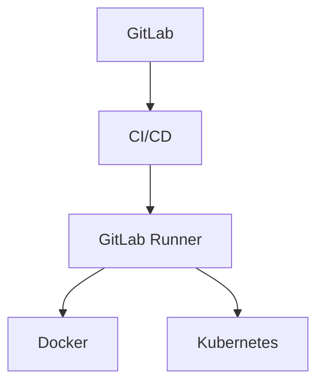
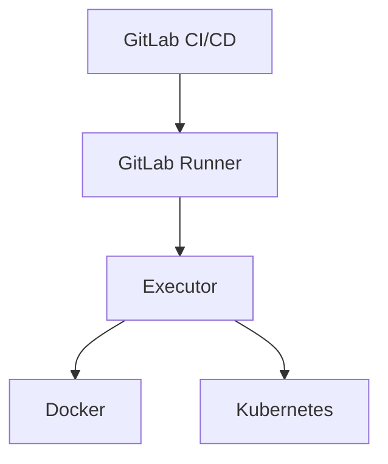

                 

# 文章标题: GitLab Runner配置与优化

> 关键词：GitLab Runner、配置、优化、CI/CD、性能

> 摘要：本文将深入探讨GitLab Runner的配置与优化。通过详细的步骤和实际案例，帮助读者理解GitLab Runner的基本概念、安装和配置，以及如何进行性能优化。文章旨在为用户提供一个全面的指南，使GitLab Runner在CI/CD环境中发挥最大效能。

## 引言

在现代化的软件开发中，持续集成（CI）和持续部署（CD）已经成为不可或缺的部分。GitLab Runner作为GitLab CI/CD系统中的一个关键组件，负责执行构建、测试和部署任务。本文将带领读者深入了解GitLab Runner的配置与优化，旨在帮助读者充分利用GitLab Runner的能力，提升软件交付的速度和质量。

## 第1章: GitLab Runner概述

### 1.1.1 GitLab Runner的作用与地位

GitLab Runner是GitLab CI/CD系统中负责执行作业（Job）的组件。它连接GitLab仓库和构建环境，确保构建任务能够高效、可靠地完成。GitLab Runner的作用地位主要体现在以下几个方面：

- **作业执行**：GitLab Runner接收来自GitLab CI/CD的作业，并在指定的构建环境中执行这些作业。
- **资源管理**：GitLab Runner可以管理构建过程中的各种资源，如容器、虚拟机和物理机。
- **并发处理**：GitLab Runner能够并行处理多个作业，提高构建速度。

### 1.1.2 GitLab Runner的工作原理

GitLab Runner的工作原理可以概括为以下几个步骤：

1. **注册**：GitLab Runner在启动时向GitLab注册，以便GitLab能够分配作业给它。
2. **接收作业**：当GitLab有作业需要执行时，它将作业分配给已注册的GitLab Runner。
3. **执行作业**：GitLab Runner在本地环境中执行作业，这可能包括构建、测试和部署等任务。
4. **状态反馈**：GitLab Runner将作业的执行状态（如成功、失败）反馈给GitLab。

### 1.1.3 GitLab Runner的主要功能

GitLab Runner的主要功能包括：

- **作业执行**：执行GitLab CI配置文件中定义的作业。
- **容器化支持**：支持使用Docker等容器化技术执行作业。
- **并行处理**：支持并行执行多个作业，提高构建效率。
- **调度策略**：根据配置的调度策略，合理安排作业执行顺序。

## 第2章: GitLab Runner的架构与组件

### 2.1.1 GitLab Runner的架构设计

GitLab Runner的架构设计旨在实现高可用性、可扩展性和灵活性。其主要组成部分包括：

- **注册机**：负责注册和管理GitLab Runner。
- **作业执行器**：实际执行构建作业的组件。
- **仓库**：存储构建作业配置和结果的Git仓库。

### 2.1.2 GitLab Runner的主要组件

GitLab Runner的主要组件包括：

- **GitLab Runner**：负责执行作业的核心组件。
- **Docker**：用于容器化作业的引擎。
- **Kubernetes**：用于集群管理的平台。

### 2.1.3 GitLab Runner的架构图解



## 第3章: GitLab Runner的安装与配置

### 3.1.1 安装GitLab Runner

安装GitLab Runner的步骤如下：

1. **安装依赖**：确保系统中有必要的依赖项，如Git、Docker等。
2. **下载GitLab Runner**：从GitLab官方网站下载GitLab Runner的二进制文件。
3. **注册GitLab Runner**：使用命令注册GitLab Runner，并提供GitLab实例的URL和访问令牌。

### 3.1.2 GitLab Runner的配置文件

GitLab Runner的配置文件（通常名为`.gitlab-ci.yml`）用于定义构建作业的配置，包括：

- **作业定义**：定义构建作业的名称、命令等。
- **环境变量**：设置构建过程中的环境变量。
- **触发器**：定义作业的触发条件。

### 3.1.3 GitLab Runner的常见配置选项

GitLab Runner的常见配置选项包括：

- **构建环境**：配置构建环境，如Docker镜像、虚拟机等。
- **调度策略**：配置作业的调度策略，如并行处理、延迟执行等。
- **存储配置**：配置构建结果的存储位置。

## 第4章: GitLab Runner的容器化配置

### 4.1.1 容器化与GitLab Runner

容器化是一种轻量级、可移植的虚拟化技术，它允许开发者将应用程序及其依赖环境打包到一个独立的容器中。GitLab Runner支持容器化配置，使得构建环境更加一致、可重复。

### 4.1.2 Docker镜像配置

Docker镜像配置是GitLab Runner容器化配置的核心。通过配置Docker镜像，可以自定义构建环境，包括安装必需的软件和库。

### 4.1.3 Kubernetes与GitLab Runner

Kubernetes是一种用于容器编排的平台，它与GitLab Runner的结合使用，可以实现更加灵活的构建环境管理和调度。

## 第5章: GitLab Runner的运行参数配置

### 5.1.1 运行参数的作用

运行参数配置是GitLab Runner的重要部分，它用于调整GitLab Runner的行为和性能。运行参数的作用包括：

- **调整资源分配**：根据作业需求调整CPU、内存等资源分配。
- **优化网络性能**：调整网络参数以提高构建速度。

### 5.1.2 常用运行参数设置

GitLab Runner的常用运行参数设置包括：

- **CPU和内存限制**：设置作业的CPU和内存限制，避免资源争用。
- **网络配置**：配置网络模式、DNS等参数。

### 5.1.3 运行参数的优化策略

运行参数的优化策略包括：

- **动态调整**：根据作业负载动态调整资源分配。
- **监控和调整**：通过监控工具监控作业性能，并根据性能指标调整运行参数。

## 第6章: GitLab Runner的网络配置

### 6.1.1 网络配置的重要性

网络配置对于GitLab Runner的性能至关重要。合理的网络配置可以确保作业能够快速、稳定地访问所需的资源。

### 6.1.2 GitLab Runner的网络设置

GitLab Runner的网络设置包括：

- **网络模式**：配置网络模式，如桥接、宿主机网络等。
- **DNS设置**：配置DNS服务器，确保作业能够正确解析域名。

### 6.1.3 网络优化技巧

网络优化技巧包括：

- **负载均衡**：使用负载均衡器分发网络流量，提高网络稳定性。
- **带宽管理**：根据作业需求调整网络带宽，避免网络瓶颈。

## 第7章: GitLab Runner的安全配置

### 7.1.1 安全配置的必要性

安全配置是GitLab Runner的重要一环，它关系到构建环境的安全性。安全配置的必要性包括：

- **防止恶意代码执行**：确保作业执行的代码是可信的。
- **保护敏感信息**：加密存储和传输敏感信息，如密码、令牌等。

### 7.1.2 常见安全措施

GitLab Runner的常见安全措施包括：

- **用户认证**：使用用户认证机制确保只有授权用户可以访问GitLab Runner。
- **容器安全**：配置容器安全策略，如限制容器权限、关闭不必要的服务等。

### 7.1.3 安全配置的实践案例

安全配置的实践案例包括：

- **使用OAuth2**：使用OAuth2进行用户认证。
- **配置防火墙**：配置防火墙规则，限制GitLab Runner的网络访问。

## 第8章: GitLab Runner的监控与日志管理

### 8.1.1 监控与日志管理的重要性

监控与日志管理是确保GitLab Runner稳定运行的关键。它们的重要性包括：

- **性能监控**：实时监控GitLab Runner的性能指标，如CPU、内存使用率等。
- **日志分析**：通过日志分析，诊断和解决构建过程中的问题。

### 8.1.2 GitLab Runner的监控设置

GitLab Runner的监控设置包括：

- **集成监控工具**：集成如Prometheus、Grafana等监控工具。
- **自定义指标**：自定义监控指标，以适应特定需求。

### 8.1.3 日志管理的最佳实践

日志管理的最佳实践包括：

- **集中存储**：将日志集中存储，方便分析和查询。
- **日志格式**：使用统一的日志格式，便于日志处理和分析。

## 第9章: GitLab Runner性能优化策略

### 9.1.1 性能优化的重要性

性能优化是提高GitLab Runner效率的关键。性能优化的重要性包括：

- **提高构建速度**：减少作业执行时间，提高构建效率。
- **优化资源利用率**：合理分配资源，避免资源浪费。

### 9.1.2 常见性能瓶颈分析

常见性能瓶颈分析包括：

- **网络瓶颈**：网络带宽不足导致的性能下降。
- **存储瓶颈**：存储性能瓶颈导致的作业延迟。

### 9.1.3 性能优化策略

性能优化策略包括：

- **负载均衡**：使用负载均衡器分发作业，避免单点瓶颈。
- **缓存策略**：使用缓存减少重复作业的执行时间。

## 第10章: GitLab Runner的并发处理优化

### 10.1.1 并发处理的概念

并发处理是指同时处理多个任务的能力。GitLab Runner的并发处理优化包括：

- **并行作业**：同时执行多个作业，提高构建速度。
- **并发调度**：合理安排作业的执行顺序，避免资源争用。

### 10.1.2 GitLab Runner的并发处理机制

GitLab Runner的并发处理机制包括：

- **作业队列**：作业被分配到一个队列中，依次执行。
- **并发限制**：根据配置的并发限制，控制同时执行的作业数量。

### 10.1.3 并发处理优化实践

并发处理优化实践包括：

- **资源隔离**：使用容器等技术隔离作业，避免资源争用。
- **负载均衡**：使用负载均衡器分配作业，确保资源利用率最大化。

## 第11章: GitLab Runner的存储优化

### 11.1.1 存储优化的意义

存储优化对于GitLab Runner的性能至关重要。存储优化的意义包括：

- **提高作业执行速度**：优化存储性能，减少作业执行时间。
- **减少存储成本**：通过优化存储策略，降低存储成本。

### 11.1.2 GitLab Runner的存储配置

GitLab Runner的存储配置包括：

- **存储类型**：配置存储类型，如本地存储、网络存储等。
- **存储策略**：配置存储策略，如缓存、压缩等。

### 11.1.3 存储优化的实际案例

存储优化的实际案例包括：

- **使用SSD**：使用固态硬盘（SSD）提高存储性能。
- **分布式存储**：使用分布式存储系统，提高存储的可靠性和性能。

## 第12章: GitLab Runner的集群部署与优化

### 12.1.1 集群部署的优势

集群部署的优势包括：

- **高可用性**：通过冗余部署，确保系统的持续可用。
- **可扩展性**：可以根据需求动态扩展集群规模。

### 12.1.2 GitLab Runner的集群配置

GitLab Runner的集群配置包括：

- **节点管理**：配置集群中的节点，包括主节点和从节点。
- **负载均衡**：配置负载均衡器，分发作业到不同的节点。

### 12.1.3 集群优化的技巧

集群优化的技巧包括：

- **自动伸缩**：根据作业负载自动调整节点数量。
- **监控与告警**：实时监控集群状态，及时发现和处理问题。

## 第13章: GitLab Runner在CI/CD流程中的应用

### 13.1.1 CI/CD的基本概念

CI/CD是指持续集成（Continuous Integration）和持续部署（Continuous Deployment）。CI/CD的基本概念包括：

- **持续集成**：通过自动化构建和测试，确保代码质量。
- **持续部署**：通过自动化部署，快速将代码推向生产环境。

### 13.1.2 GitLab CI/CD的工作流程

GitLab CI/CD的工作流程包括：

- **仓库触发**：当Git仓库发生更改时，触发构建作业。
- **作业执行**：GitLab Runner执行构建、测试和部署等作业。
- **状态反馈**：将作业执行结果反馈给GitLab。

### 13.1.3 GitLab Runner在CI/CD中的实践案例

GitLab Runner在CI/CD中的实践案例包括：

- **自动化构建**：使用GitLab Runner自动化构建应用程序。
- **自动化测试**：使用GitLab Runner执行自动化测试，确保代码质量。

## 第14章: GitLab Runner与其他工具的集成

### 14.1.1 GitLab Runner与其他工具的关系

GitLab Runner可以与其他工具集成，实现更丰富的功能。GitLab Runner与其他工具的关系包括：

- **Jenkins**：GitLab Runner可以与Jenkins集成，实现作业迁移和协同工作。
- **Docker**：GitLab Runner与Docker集成，支持容器化构建环境。

### 14.1.2 GitLab Runner与Jenkins的集成

GitLab Runner与Jenkins的集成包括：

- **插件安装**：安装Jenkins插件，实现GitLab Runner与Jenkins的集成。
- **作业迁移**：将Jenkins的作业迁移到GitLab Runner，实现自动化部署。

### 14.1.3 GitLab Runner与其他工具的实践案例

GitLab Runner与其他工具的实践案例包括：

- **与GitLab集成**：使用GitLab Runner实现GitLab的CI/CD流程。
- **与其他持续集成工具集成**：使用GitLab Runner与其他持续集成工具（如Travis CI、Circle CI等）集成，实现作业并行处理。

## 第15章: GitLab Runner的故障排除与性能监控

### 15.1.1 故障排除的方法

故障排除的方法包括：

- **日志分析**：通过分析日志，定位故障原因。
- **调试工具**：使用调试工具，如GDB、Valgrind等，诊断故障。

### 15.1.2 GitLab Runner的常见故障与解决方案

GitLab Runner的常见故障与解决方案包括：

- **无法注册**：检查网络连接和GitLab Runner的配置文件。
- **作业执行失败**：检查作业配置和构建环境，确保环境一致。

### 15.1.3 性能监控的工具与技巧

性能监控的工具与技巧包括：

- **Prometheus**：使用Prometheus监控GitLab Runner的性能指标。
- **Grafana**：使用Grafana可视化GitLab Runner的性能监控数据。

## 附录

### 附录A: GitLab Runner常用命令与操作

#### A.1 命令行使用指南

#### A.1.1 GitLab Runner命令行工具

GitLab Runner命令行工具包括：

- `gitlab-runner register`：注册GitLab Runner。
- `gitlab-runner run`：执行作业。
- `gitlab-runner status`：查看GitLab Runner状态。

#### A.1.2 命令行操作实例

命令行操作实例包括：

```shell
# 注册GitLab Runner
gitlab-runner register --url https://gitlab.example.com --registration-token XXXXXXXXXXXXXXXXXX

# 执行作业
gitlab-runner run

# 查看GitLab Runner状态
gitlab-runner status
```

### 附录B: GitLab Runner配置文件详解

#### B.1 配置文件结构

GitLab Runner配置文件（`.gitlab-ci.yml`）的结构包括：

- **作业定义**：定义构建作业的名称、命令等。
- **环境变量**：设置构建过程中的环境变量。
- **触发器**：定义作业的触发条件。

#### B.2 配置文件示例

配置文件示例：

```yaml
# 作业1
job1:
  script:
    - echo "This is job 1"
    - ./build.sh

# 作业2
job2:
  script:
    - echo "This is job 2"
    - ./test.sh
```

### 附录C: GitLab Runner常见问题解答

#### C.1 问题1：无法注册GitLab Runner

**解决方案**：检查网络连接和GitLab Runner的配置文件，确保URL和注册令牌正确。

#### C.2 问题2：作业执行失败

**解决方案**：检查作业配置和构建环境，确保环境一致。尝试增加日志级别，以获取更多错误信息。

#### C.3 问题3：性能下降

**解决方案**：检查系统资源使用情况，优化配置文件，如调整CPU和内存限制。尝试使用负载均衡器，分散作业负载。

## 总结

GitLab Runner是GitLab CI/CD系统中的关键组件，负责执行构建、测试和部署等作业。本文详细介绍了GitLab Runner的安装、配置、优化和实际应用，帮助读者深入了解GitLab Runner的工作原理和配置技巧。通过本文的学习，读者可以更好地利用GitLab Runner的能力，提升软件交付的效率和质量。

## 参考文献

- GitLab Runner官方文档：https://docs.gitlab.com/runner/
- Kubernetes官方文档：https://kubernetes.io/docs/
- Docker官方文档：https://docs.docker.com/

## 作者

作者：AI天才研究院/AI Genius Institute & 禅与计算机程序设计艺术 /Zen And The Art of Computer Programming

---

## 文章标题: GitLab Runner配置与优化

## 文章关键词: GitLab Runner、配置、优化、CI/CD、性能

## 摘要：本文将深入探讨GitLab Runner的配置与优化。通过详细的步骤和实际案例，帮助读者理解GitLab Runner的基本概念、安装和配置，以及如何进行性能优化。文章旨在为用户提供一个全面的指南，使GitLab Runner在CI/CD环境中发挥最大效能。

## 第1章: GitLab Runner概述

### 1.1.1 GitLab Runner的作用与地位

GitLab Runner是GitLab CI/CD系统中的关键组件，负责执行构建、测试和部署等作业。它在GitLab CI/CD流程中的地位至关重要，主要作用如下：

1. **作业执行**：GitLab Runner负责接收并执行GitLab CI/CD中定义的作业。作业可以是构建、测试、部署等操作。
2. **资源管理**：GitLab Runner可以管理构建过程中的各种资源，如CPU、内存、存储和网络等。通过合理分配资源，确保作业能够高效运行。
3. **并行处理**：GitLab Runner支持并行处理多个作业，提高构建速度和效率。在多核处理器和分布式环境中，GitLab Runner能够充分利用资源，实现作业的并发执行。
4. **容器化支持**：GitLab Runner支持容器化技术，如Docker和Kubernetes，可以创建和管理容器化环境，提高构建环境的可移植性和一致性。

### 1.1.2 GitLab Runner的工作原理

GitLab Runner的工作原理可以分为以下几个步骤：

1. **注册**：在第一次使用GitLab Runner之前，需要将其注册到GitLab服务器上。注册过程中，GitLab Runner会提供GitLab服务器的URL和访问令牌，以确保只有授权的Runner可以执行作业。
2. **接收作业**：GitLab Runner注册成功后，会定期检查GitLab服务器上的作业队列。当GitLab服务器上有待执行的作业时，会根据Runner的配置和可用性将其分配给合适的Runner。
3. **执行作业**：GitLab Runner接收到作业后，根据作业的配置和脚本在本地环境中执行相应的构建、测试或部署操作。执行过程中，GitLab Runner会收集作业的输出结果，并将其上传到GitLab服务器。
4. **状态反馈**：作业执行完成后，GitLab Runner会向GitLab服务器反馈作业的状态，如成功、失败或取消。GitLab服务器会根据作业的最终状态更新相关项目的信息。

### 1.1.3 GitLab Runner的主要功能

GitLab Runner的主要功能包括：

1. **作业执行**：GitLab Runner负责执行GitLab CI/CD中定义的作业，包括构建、测试和部署等操作。通过配置适当的脚本和命令，GitLab Runner可以实现复杂的构建和部署流程。
2. **容器化支持**：GitLab Runner支持容器化技术，如Docker和Kubernetes，可以在容器中执行作业。这有助于确保构建环境的一致性，提高构建的可移植性和可重复性。
3. **调度策略**：GitLab Runner支持多种调度策略，如并行调度、延迟调度和依赖调度等。通过合适的调度策略，GitLab Runner可以优化作业的执行顺序和资源利用，提高构建效率。
4. **日志管理**：GitLab Runner可以收集作业的输出日志，并将其上传到GitLab服务器。这使得开发人员可以在GitLab项目中查看作业的详细日志，便于问题追踪和分析。
5. **监控与告警**：GitLab Runner支持集成监控工具，如Prometheus和Grafana等，可以实时监控Runner的状态和性能指标。通过监控和告警，可以及时发现和处理潜在的问题。

## 第2章: GitLab Runner的架构与组件

### 2.1.1 GitLab Runner的架构设计

GitLab Runner的架构设计旨在实现高可用性、可扩展性和灵活性。其核心组件包括：

1. **注册机**：注册机负责注册和管理GitLab Runner。当GitLab Runner启动时，它会向GitLab服务器发送注册请求，并提供GitLab服务器的URL和访问令牌。注册机会验证Runner的合法性，并将合法的Runner添加到服务器中。
2. **作业执行器**：作业执行器是GitLab Runner的核心组件，负责执行GitLab CI/CD中定义的作业。它会在本地环境中解析作业配置，执行相应的脚本和命令，并收集作业的输出结果。
3. **仓库**：仓库是GitLab Runner用于存储作业配置、构建日志和结果等数据的地方。通常，GitLab Runner会将仓库存储在本地文件系统中，但也可以配置为远程仓库，如GitLab服务器或其他代码托管平台。

### 2.1.2 GitLab Runner的主要组件

GitLab Runner的主要组件包括：

1. **GitLab Runner二进制文件**：GitLab Runner的二进制文件是GitLab Runner的核心，负责执行作业和与GitLab服务器通信。下载并安装GitLab Runner二进制文件是使用GitLab Runner的第一步。
2. **配置文件**：配置文件是GitLab Runner的重要组件，用于定义Runner的行为和配置。通常，GitLab Runner的配置文件名为`.gitlab-ci.yml`，它包含了Runner的注册信息、作业配置、环境变量等。配置文件使用YAML格式编写，结构清晰、易于阅读。
3. **Docker镜像**：GitLab Runner支持容器化技术，可以使用Docker镜像作为作业的执行环境。Docker镜像是一个轻量级的、可移植的容器，包含了作业所需的依赖和环境。通过配置Docker镜像，可以确保作业在一致的环境中运行，提高构建的可移植性和可重复性。
4. **Kubernetes集成**：GitLab Runner可以与Kubernetes集成，利用Kubernetes的强大容器编排功能。通过Kubernetes，GitLab Runner可以部署在分布式集群中，实现更高级的调度和资源管理。

### 2.1.3 GitLab Runner的架构图解



## 第3章: GitLab Runner的安装与配置

### 3.1.1 安装GitLab Runner

安装GitLab Runner是使用GitLab CI/CD的第一步。以下是在不同操作系统上安装GitLab Runner的步骤：

#### Windows

1. **下载GitLab Runner二进制文件**：从[GitLab Runner下载页面](https://gitlab.com/gitlab-com/runners/releases)下载适用于Windows的GitLab Runner二进制文件。
2. **解压缩文件**：将下载的GitLab Runner二进制文件解压缩到合适的位置，例如`C:\gitlab-runner`。
3. **运行安装脚本**：在命令行中，导航到解压缩后的文件夹，并运行以下命令：

   ```shell
   .\gitlab-runner.exe install --prefix="C:\gitlab-runner" --url https://gitlab.example.com --registration-token XXXXXXXXXXXXXXXXXX
   ```

   其中，`https://gitlab.example.com`是GitLab服务器的URL，`XXXXXXXXXXXXXXXX`是注册令牌。

#### macOS/Linux

1. **安装依赖**：确保系统中有必要的依赖项，如Git、Docker等。在macOS上，可以使用Homebrew安装依赖项：

   ```shell
   brew install git docker
   ```

   在Linux上，可以使用包管理器安装依赖项：

   ```shell
   sudo apt-get install git docker.io
   ```

2. **下载GitLab Runner二进制文件**：从[GitLab Runner下载页面](https://gitlab.com/gitlab-com/runners/releases)下载适用于macOS/Linux的GitLab Runner二进制文件。
3. **解压缩文件**：将下载的GitLab Runner二进制文件解压缩到合适的位置，例如`/usr/local/bin`。
4. **运行安装脚本**：在命令行中，运行以下命令：

   ```shell
   ./gitlab-runner install --url https://gitlab.example.com --registration-token XXXXXXXXXXXXXXXXXX
   ```

   其中，`https://gitlab.example.com`是GitLab服务器的URL，`XXXXXXXXXXXXXXXX`是注册令牌。

### 3.1.2 GitLab Runner的配置文件

GitLab Runner的配置文件是`.gitlab-ci.yml`，它用于定义Runner的行为和配置。以下是一个简单的`.gitlab-ci.yml`配置文件示例：

```yaml
image: ruby:2.7

before_script:
  - bundle install

script:
  - bundle exec rake spec
```

该配置文件定义了一个名为`ruby:2.7`的Docker镜像，并在构建前安装了依赖项。然后，执行Rake任务来运行测试。

#### 配置文件结构

`.gitlab-ci.yml`配置文件通常包含以下部分：

- **image**：指定构建环境使用的Docker镜像。
- **before_script**：在构建开始前执行的脚本。这些脚本可以用于安装依赖项、配置环境等。
- **script**：构建过程中执行的脚本。这些脚本通常是构建、测试或部署命令。
- **artifacts**：指定构建结果的处理方式。例如，可以将构建结果上传到存储库或其他位置。
- **stages**：定义构建阶段，例如测试阶段、部署阶段等。

### 3.1.3 GitLab Runner的常见配置选项

GitLab Runner的配置选项丰富，可以自定义Runner的行为和性能。以下是一些常见的配置选项：

- **`docker`**：配置Docker镜像和容器选项。例如，可以指定Docker镜像的名称和标签，设置容器环境变量等。

  ```yaml
  docker:
    image: ruby:2.7
    pull_policy: always
    env:
      - name: MY_ENV_VAR
        value: my_value
  ```

- **` parallels**：配置并行作业的数量。这可以控制同时执行的最大作业数。

  ```yaml
  parallels:
    - 4
  ```

- **`cache**：配置缓存策略。GitLab Runner支持缓存依赖项，例如Gemfile和Docker镜像，以提高构建速度。

  ```yaml
  cache:
    paths:
      - "./vendor:/vendor"
      - "/var/cache/dotnet/sdk/*:/root/.nuget/packages"
  ```

- **`services**：配置运行作业时需要启动的Docker服务。例如，可以启动数据库服务以进行测试。

  ```yaml
  services:
    - name: mysql:5.7
      env:
        - MYSQL_ROOT_PASSWORD=my_root_password
        - MYSQL_DATABASE=my_database
  ```

- **`before_script`**：在构建作业开始前执行的脚本。这些脚本可以用于安装依赖项、设置环境变量等。

  ```yaml
  before_script:
    - apt-get update && apt-get install -y git
  ```

- **`after_script`**：在构建作业完成后执行的脚本。这些脚本可以用于清理环境、上传构建结果等。

  ```yaml
  after_script:
    - rm -rf /tmp/* /var/log/*
  ```

- **`artifacts`**：配置构建结果的存储和处理方式。例如，可以将构建结果上传到Artifacts Storage，以便后续使用。

  ```yaml
  artifacts:
    paths:
      - "path/to/artifacts/*.zip"
    expire_in: 1 week
  ```

## 第4章: GitLab Runner的容器化配置

### 4.1.1 容器化与GitLab Runner

容器化是一种将应用程序及其依赖环境打包成一个独立的容器（Container）的技术。GitLab Runner支持容器化配置，可以使用Docker、Kubernetes等容器技术来配置和运行构建作业。容器化的优点包括：

- **环境一致性**：通过容器化，可以在不同的环境中保持一致的应用程序运行状态，减少因环境差异导致的问题。
- **资源隔离**：容器提供了轻量级的隔离机制，可以确保应用程序在独立的资源环境中运行，提高系统的安全性和稳定性。
- **可移植性**：容器是可移植的，可以轻松地在不同的环境中部署和运行，提高了应用程序的可移植性。

### 4.1.2 Docker镜像配置

Docker镜像（Image）是容器化配置的核心。GitLab Runner使用Docker镜像来创建构建作业的运行环境。以下是如何配置Docker镜像的步骤：

1. **选择合适的Docker镜像**：根据构建作业的需求，选择一个合适的Docker镜像。例如，可以使用官方的Ruby、Python或Node.js镜像，也可以创建自定义的Docker镜像。

2. **配置`.gitlab-ci.yml`文件**：在`.gitlab-ci.yml`文件中指定Docker镜像的名称和标签。例如：

   ```yaml
   image: ruby:2.7
   ```

   这将使用官方的Ruby 2.7 Docker镜像。

3. **配置环境变量**：在`.gitlab-ci.yml`文件中配置环境变量，以便在容器中设置环境变量。例如：

   ```yaml
   environment:
     variables:
       VAR1: "value1"
       VAR2: "value2"
   ```

4. **安装依赖项**：在Docker镜像中安装构建作业所需的依赖项。例如，在Ruby作业中，可以在`.gitlab-ci.yml`文件中添加`before_script`部分来安装Gemfile中的依赖项：

   ```yaml
   before_script:
     - bundle install
   ```

### 4.1.3 Kubernetes与GitLab Runner

Kubernetes是一个强大的容器编排平台，可以用于管理容器化应用程序的生命周期。GitLab Runner可以与Kubernetes集成，利用Kubernetes的调度和资源管理能力。以下是如何将GitLab Runner与Kubernetes集成的步骤：

1. **安装Kubernetes集群**：在集群的主节点上安装Kubernetes集群。可以使用Minikube、Docker for Mac、Kubeadm等方式安装Kubernetes。

2. **配置GitLab Runner**：在GitLab Runner的`.gitlab-ci.yml`文件中配置Kubernetes参数。例如，可以指定Kubernetes服务账户、命名空间等：

   ```yaml
   kubernetes:
     service_account: runner
     namespace: default
   ```

3. **部署GitLab Runner**：在Kubernetes集群中部署GitLab Runner。可以使用Helm或Kubectl命令部署GitLab Runner：

   ```shell
   kubectl apply -f gitlab-runner-deployment.yaml
   ```

4. **配置作业**：在`.gitlab-ci.yml`文件中配置作业，使其在Kubernetes集群中运行。例如，可以指定作业的容器镜像、环境变量等：

   ```yaml
   image: ruby:2.7
   environment:
     variables:
       VAR1: "value1"
       VAR2: "value2"
   ```

通过上述步骤，GitLab Runner可以在Kubernetes集群中高效地执行构建作业，利用Kubernetes的调度和资源管理能力，实现自动化部署和扩展。

## 第5章: GitLab Runner的运行参数配置

### 5.1.1 运行参数的作用

运行参数配置是GitLab Runner的重要组成部分，用于调整Runner的行为和性能。运行参数的作用包括：

- **资源分配**：调整作业执行时的CPU、内存、存储等资源分配，确保作业能够高效运行。
- **性能优化**：通过调整运行参数，优化作业的执行速度和资源利用率。
- **兼容性调整**：根据不同的构建环境和作业需求，调整运行参数，确保作业在多种环境中正常运行。

### 5.1.2 常用运行参数设置

GitLab Runner提供了丰富的运行参数，以下是一些常用的运行参数及其设置方法：

- **`dockerprivileged`**：设置是否以特权模式运行Docker容器。特权模式允许容器访问宿主机的设备和其他资源。默认情况下，GitLab Runner以非特权模式运行。

  ```yaml
  dockerprivileged: true
  ```

- **`memory`**：设置作业执行时的最大内存限制。超出限制会导致作业失败。

  ```yaml
  memory: "1G"
  ```

- **`cpus`**：设置作业执行时的最大CPU限制。超出限制可能会导致宿主机上的其他进程受到影响。

  ```yaml
  cpus: 1
  ```

- **`timeout`**：设置作业执行的超时时间。超出超时时间会导致作业被取消。

  ```yaml
  timeout: 30m
  ```

- **`prebuild_script`**：在构建作业开始前执行的脚本。这可以用于安装依赖项、设置环境变量等。

  ```yaml
  prebuild_script:
    - apt-get update && apt-get install -y git
  ```

- **`postbuild_script`**：在构建作业完成后执行的脚本。这可以用于清理环境、上传构建结果等。

  ```yaml
  postbuild_script:
    - rm -rf /tmp/* /var/log/*
  ```

### 5.1.3 运行参数的优化策略

为了优化GitLab Runner的性能，可以采取以下策略：

- **动态调整**：根据作业的实际需求和资源使用情况，动态调整运行参数。例如，使用监控工具监控CPU、内存等性能指标，并根据指标调整资源限制。

- **负载均衡**：合理分配作业到不同的Runner，避免单一Runner过载。可以使用GitLab CI/CD的调度策略，如基于工作量的调度策略，实现负载均衡。

- **缓存策略**：使用缓存策略减少重复作业的执行时间。例如，使用Docker缓存、Git缓存等，避免重复下载和安装依赖项。

- **并行处理**：充分利用并行处理能力，提高作业执行速度。合理配置并行作业数量，避免过度并行导致资源争用。

- **环境一致性**：确保构建环境的一致性，减少因环境差异导致的问题。使用容器化技术，如Docker镜像，确保构建环境在多个环境中保持一致。

## 第6章: GitLab Runner的网络配置

### 6.1.1 网络配置的重要性

网络配置是GitLab Runner的重要组成部分，直接影响作业的执行速度和可靠性。合理配置网络可以确保GitLab Runner能够高效、稳定地访问外部资源，如代码仓库、依赖库和外部服务。以下为网络配置的重要性：

- **访问外部资源**：GitLab Runner需要访问代码仓库、依赖库和其他外部服务。网络配置确保GitLab Runner能够快速、稳定地访问这些资源。
- **安全性**：通过配置防火墙规则、加密传输等安全措施，确保GitLab Runner的网络通信安全。
- **性能优化**：优化网络配置，如调整TCP参数、使用负载均衡器等，可以提高GitLab Runner的性能。

### 6.1.2 GitLab Runner的网络设置

GitLab Runner的网络设置包括以下方面：

- **网络模式**：GitLab Runner支持多种网络模式，如桥接模式（bridge）、主机模式（host）、自定义网络模式（custom）等。选择合适的网络模式可以优化作业的网络性能。

  ```yaml
  network_mode: "bridge"
  ```

- **DNS配置**：配置GitLab Runner的DNS服务器，确保作业能够正确解析域名。

  ```yaml
  dns:
    - 8.8.8.8
    - 8.8.4.4
  ```

- **网络接口**：指定GitLab Runner使用的网络接口，如以太网接口（eth0）、无线接口（wlan0）等。

  ```yaml
  network_interface: "eth0"
  ```

- **代理设置**：如果GitLab Runner需要通过代理访问外部网络，可以配置代理设置。

  ```yaml
  http_proxy: "http://proxy.example.com:8080"
  https_proxy: "https://proxy.example.com:8080"
  ```

### 6.1.3 网络优化技巧

为了优化GitLab Runner的网络性能，可以采取以下技巧：

- **使用负载均衡器**：使用负载均衡器，如Nginx或HAProxy，分发网络流量，提高网络稳定性。
- **优化TCP参数**：调整TCP参数，如TCP窗口大小（window）、延迟时间（timeout）等，以提高网络传输效率。
- **使用CDN**：使用内容分发网络（CDN），如Cloudflare或Fastly，加速外部资源的访问。
- **监控网络性能**：使用监控工具，如Prometheus和Grafana，实时监控GitLab Runner的网络性能，及时发现和处理问题。

## 第7章: GitLab Runner的安全配置

### 7.1.1 安全配置的必要性

在CI/CD环境中，GitLab Runner的安全配置至关重要。随着自动化程度的提高，GitLab Runner可能面临以下安全风险：

- **代码执行风险**：未经授权的代码可能被错误地执行，可能导致数据泄露或系统被攻击。
- **敏感信息泄露**：存储和传输的敏感信息（如密码、令牌等）可能被截获或泄露。
- **构建环境污染**：构建环境可能被恶意代码污染，导致构建结果不可信。

因此，为了确保GitLab Runner的安全，需要进行以下安全配置：

- **用户认证**：确保只有授权用户可以访问GitLab Runner。
- **代码审计**：对提交的代码进行审计，确保代码的安全性和正确性。
- **环境隔离**：确保构建环境与生产环境隔离，避免构建过程中的问题影响生产环境。
- **加密传输**：使用加密传输，如SSL/TLS，确保敏感信息在传输过程中安全。

### 7.1.2 常见安全措施

以下是一些常见的安全措施，用于提高GitLab Runner的安全性：

- **用户认证**：使用OAuth2、LDAP、SAML等身份验证机制，确保只有授权用户可以访问GitLab Runner。

  ```yaml
  authentication:
    strategy: "oauth2"
    provider: "google"
  ```

- **运行时隔离**：使用容器化技术，如Docker，确保每个构建作业在独立的容器中运行，提高运行时隔离性。

  ```yaml
  docker:
    privileged: false
  ```

- **最小权限原则**：确保GitLab Runner运行的进程具有最小权限，避免未授权的代码执行。

  ```yaml
  privileged: false
  ```

- **加密存储**：使用加密存储，如SSL/TLS，保护敏感信息在传输和存储过程中的安全。

  ```yaml
  ssl:
    enabled: true
    certificate_path: "/etc/ssl/certs/gitlab.crt"
    certificate_key_path: "/etc/ssl/private/gitlab.key"
  ```

- **网络隔离**：配置防火墙规则，限制GitLab Runner的网络访问，避免外部攻击。

  ```yaml
  network:
    mode: "host"
    allow_http: false
    allow_https: true
  ```

### 7.1.3 安全配置的实践案例

以下是一个安全配置的实践案例：

1. **用户认证**：配置OAuth2认证，确保只有授权用户可以访问GitLab Runner。

   ```yaml
   authentication:
     strategy: "oauth2"
     provider: "google"
     client_id: "my_client_id"
     client_secret: "my_client_secret"
     scope: "user:email"
   ```

2. **运行时隔离**：使用Docker容器运行GitLab Runner，确保每个作业在独立的容器中运行。

   ```yaml
   docker:
     privileged: false
   ```

3. **加密存储**：启用SSL/TLS加密，确保GitLab Runner与GitLab服务器之间的通信安全。

   ```yaml
   ssl:
     enabled: true
     certificate_path: "/etc/ssl/certs/gitlab.crt"
     certificate_key_path: "/etc/ssl/private/gitlab.key"
   ```

4. **防火墙配置**：限制GitLab Runner的网络访问，仅允许HTTPS连接。

   ```yaml
   network:
     mode: "host"
     allow_http: false
     allow_https: true
   ```

通过上述配置，GitLab Runner的安全性得到了显著提升，确保构建过程的安全和可靠。

## 第8章: GitLab Runner的监控与日志管理

### 8.1.1 监控与日志管理的重要性

监控与日志管理是确保GitLab Runner稳定运行的关键。它们的重要性体现在以下几个方面：

- **性能监控**：通过实时监控GitLab Runner的性能指标（如CPU、内存使用率、磁盘I/O等），可以及时发现性能瓶颈和潜在问题，确保系统稳定运行。
- **日志分析**：通过分析GitLab Runner的日志，可以了解作业的执行过程和结果，定位问题原因，优化作业配置和运行策略。
- **故障排查**：监控和日志管理有助于快速排查系统故障，提供诊断和修复依据，提高系统可用性和可靠性。

### 8.1.2 GitLab Runner的监控设置

GitLab Runner的监控设置包括以下几个方面：

- **集成监控工具**：集成Prometheus、Grafana等监控工具，实现GitLab Runner的性能监控和可视化。以下是一个Prometheus和Grafana的集成示例：

  ```shell
  # 安装Prometheus
  sudo apt-get install prometheus

  # 配置Prometheus.yml
  global:
    scrape_interval: 15s
  scrape_configs:
    - job_name: 'gitlab-runner'
      static_configs:
        - targets: ['gitlab-runner:8080']

  # 安装Grafana
  sudo apt-get install grafana

  # 配置Grafana
  sudo grafana-server install
  sudo grafana-server start
  ```

- **自定义指标**：自定义GitLab Runner的监控指标，如作业执行时间、失败率、资源使用率等。以下是一个Prometheus自定义指标的示例：

  ```yaml
  metrics:
    - name: gitlab_runner_jobs_successful
      help: 'Number of successful jobs for the runner'
      type: GAUGE
      type: UNIOD
      metrics_path: '/api/v4/runners/runner-id/stats'
      static_labels:
        runner_id: 'runner-id'
      query_params:
        per_page: 1
        scope: 'total'
      response_parser:
        status_code: 200
        json_path: 'data.jobs.total_successful'
  ```

### 8.1.3 日志管理的最佳实践

日志管理的最佳实践包括以下几个方面：

- **集中存储**：将GitLab Runner的日志集中存储，便于分析和查询。可以使用ELK（Elasticsearch、Logstash、Kibana）栈或Grafana Logspout等工具实现日志集中存储。
- **日志格式**：使用统一的日志格式，如JSON或LOGSTASH格式，便于日志处理和分析。
- **日志分析**：定期分析日志，识别潜在问题和性能瓶颈，优化GitLab Runner的配置和运行策略。
- **日志告警**：配置日志告警，及时发现和处理日志中的异常信息。

以下是一个简单的日志分析示例：

```shell
# 使用Grok解析日志
logstash -f logstash.conf

# 配置logstash.conf
input {
  file {
    path => "/var/log/gitlab-runner/*.log"
    type => "gitlab-runner-log"
  }
}

filter {
  if "gitlab-runner-log" == "[type]" {
    grok {
      match => { "message" => "%{TIMESTAMP_ISO8601:timestamp} %{DATA:level} %{DATA:component} %{DATA:message}" }
    }
  }
}

output {
  elasticsearch {
    hosts => ["elasticsearch:9200"]
    index => "gitlab-runner-log-%{+YYYY.MM.dd}"
  }
}
```

通过上述实践，可以实现对GitLab Runner的日志集中存储和分析，提高系统监控和故障排查的效率。

## 第9章: GitLab Runner性能优化策略

### 9.1.1 性能优化的重要性

性能优化是确保GitLab Runner高效稳定运行的关键。性能优化的重要性体现在以下几个方面：

- **提高作业执行速度**：优化GitLab Runner的性能，可以显著提高作业的执行速度，减少构建和部署时间。
- **降低资源消耗**：优化配置和资源使用，可以减少GitLab Runner对系统资源的消耗，提高系统的整体性能。
- **提高系统稳定性**：性能优化可以降低系统崩溃和故障的风险，提高系统的稳定性和可靠性。

### 9.1.2 常见性能瓶颈分析

分析GitLab Runner的性能瓶颈，可以采取以下策略：

- **资源限制**：检查CPU、内存、磁盘I/O等资源的使用情况，确保GitLab Runner没有因资源限制而影响性能。可以通过增加资源限制或优化资源分配策略来解决资源瓶颈。
- **网络延迟**：检查网络延迟和带宽，优化网络配置，确保GitLab Runner可以快速访问外部资源。可以使用负载均衡器、CDN等技术优化网络性能。
- **依赖库和工具**：检查依赖库和工具的版本和性能，更新到最新版本以获得性能提升。避免使用性能较差的库和工具，如老旧的Docker版本。
- **作业并发**：合理配置并发作业数量，避免过度并行导致系统资源争用。可以通过调整并发设置、负载均衡策略等优化作业并发处理。

### 9.1.3 性能优化策略

以下是一些常见的性能优化策略：

- **调整资源限制**：根据实际需求调整GitLab Runner的资源限制，如CPU、内存等。可以设置合理的资源限制，确保GitLab Runner能够充分利用系统资源。

  ```yaml
  memory: "2G"
  cpus: 2
  ```

- **使用负载均衡**：使用负载均衡器，如Nginx、HAProxy等，分发作业负载，避免单一GitLab Runner过载。可以结合Prometheus和Grafana等监控工具，实时监控GitLab Runner的负载情况，动态调整负载均衡策略。

- **优化网络配置**：调整GitLab Runner的网络配置，如调整TCP参数、DNS缓存等，优化网络性能。可以使用负载均衡器和CDN等工具，提高GitLab Runner访问外部资源的速度。

  ```yaml
  dns:
    - 8.8.8.8
    - 8.8.4.4
  ```

- **使用缓存**：利用缓存技术，如Docker镜像缓存、Git缓存等，减少重复操作的时间。可以使用GitLab的Artifacts Storage功能，缓存构建结果和依赖库，提高构建效率。

- **并行处理**：合理配置并发作业数量，充分利用多核处理器的优势，提高作业执行速度。可以结合Prometheus和Grafana等监控工具，实时监控并发情况，根据实际需求调整并发配置。

  ```yaml
  parallels:
    - 4
  ```

- **优化作业配置**：优化作业的配置，减少不必要的操作和依赖，提高作业执行速度。可以合并多个作业，减少作业之间的依赖和等待时间。

- **监控与告警**：实时监控GitLab Runner的性能指标，如CPU、内存使用率、磁盘I/O等。设置告警阈值，及时发现和处理性能瓶颈。可以使用Prometheus和Grafana等工具，实现实时监控和告警。

通过上述策略，可以显著提高GitLab Runner的性能，确保其在CI/CD环境中高效稳定运行。

## 第10章: GitLab Runner的并发处理优化

### 10.1.1 并发处理的概念

并发处理是指系统在同一时间内处理多个任务的能力。在GitLab Runner中，并发处理是指在多个作业同时执行时，合理安排和调度作业，确保系统资源的高效利用。并发处理的重要性在于：

- **提高作业执行速度**：通过并发处理，可以充分利用系统资源，如CPU、内存和网络等，提高作业执行速度。
- **提升系统稳定性**：合理的并发处理可以避免单个作业因资源争用而导致的系统崩溃或性能下降。
- **优化资源利用率**：通过并发处理，可以优化系统资源的利用，减少资源浪费，提高系统的整体性能。

### 10.1.2 GitLab Runner的并发处理机制

GitLab Runner的并发处理机制主要包括以下几个方面：

1. **并行调度**：GitLab Runner支持并行调度，允许在同一时间内执行多个作业。通过配置`parallels`参数，可以设置并发作业的数量。

   ```yaml
   parallels:
     - 4
   ```

2. **依赖调度**：GitLab Runner支持依赖调度，可以在作业之间建立依赖关系。后一个作业依赖于前一个作业的结果，确保作业执行的顺序和一致性。

   ```yaml
   job1:
     dependencies:
       - job2
   ```

3. **延迟调度**：GitLab Runner支持延迟调度，可以将作业延迟一段时间再执行。这可以用于避免作业同时执行导致的资源争用和性能下降。

   ```yaml
   job:
     when: manual
     delay: 5m
   ```

4. **作业队列**：GitLab Runner维护一个作业队列，作业按照优先级和依赖关系依次进入队列。作业队列可以保证作业的有序执行，避免作业之间的冲突和竞争。

### 10.1.3 并发处理优化实践

以下是一些并发处理优化实践：

1. **调整并发作业数量**：根据系统的资源情况和作业特性，合理调整并发作业数量。可以通过实验和监控，找到最优的并发作业数量。

   ```yaml
   parallels:
     - 4
   ```

2. **依赖调度**：合理使用依赖调度，确保作业之间的执行顺序和一致性。这可以避免作业之间的竞争和冲突，提高系统的稳定性。

   ```yaml
   job1:
     dependencies:
       - job2
   ```

3. **延迟调度**：在作业高峰期，可以使用延迟调度减少作业同时执行的数量，降低系统负载。这可以避免系统过载，提高系统的响应速度。

   ```yaml
   job:
     when: manual
     delay: 5m
   ```

4. **资源分配**：根据作业的需求，合理分配系统资源，如CPU、内存、网络等。通过优化资源分配，可以确保作业能够充分利用系统资源，提高系统的并发处理能力。

   ```yaml
   memory: "2G"
   cpus: 2
   ```

5. **负载均衡**：使用负载均衡器，如Nginx、HAProxy等，分散作业负载，避免单一节点过载。负载均衡器可以根据实际情况动态调整负载，提高系统的并发处理能力。

6. **监控与告警**：实时监控系统的性能指标，如CPU、内存使用率、网络延迟等。设置告警阈值，及时发现和处理性能瓶颈。通过监控和告警，可以确保系统的并发处理能力始终处于最佳状态。

通过以上实践，可以显著提升GitLab Runner的并发处理能力，优化系统的整体性能。

## 第11章: GitLab Runner的存储优化

### 11.1.1 存储优化的意义

存储优化是GitLab Runner性能优化的重要方面，其意义在于：

- **提高构建速度**：优化存储性能可以减少作业的I/O等待时间，提高构建速度。
- **减少资源消耗**：通过优化存储策略，可以减少GitLab Runner的存储消耗，降低系统资源使用。
- **提高系统稳定性**：优化存储可以提高系统的稳定性，避免因存储问题导致的作业失败。

### 11.1.2 GitLab Runner的存储配置

GitLab Runner的存储配置包括以下几个方面：

- **本地存储**：GitLab Runner默认使用本地存储，将作业数据和日志存储在宿主机的文件系统中。本地存储简单易用，但容量有限，且不便于扩展。

- **网络存储**：GitLab Runner可以使用网络存储，如NFS、CIFS等，将作业数据和日志存储在远程存储系统中。网络存储容量大、易于扩展，但需要配置网络存储服务。

- **云存储**：GitLab Runner可以使用云存储服务，如AWS S3、Google Cloud Storage等，将作业数据和日志存储在云上。云存储具有高可用性和可扩展性，但需要支付额外的费用。

- **缓存存储**：GitLab Runner可以使用缓存存储，如Redis、Memcached等，提高存储性能。缓存存储可以减少磁盘I/O操作，提高作业执行速度。

### 11.1.3 存储优化的实际案例

以下是一个存储优化的实际案例：

1. **使用NFS存储**：为了提高GitLab Runner的存储性能，可以将作业数据和日志存储在NFS服务器上。以下是如何配置NFS存储的步骤：

   - **配置NFS服务器**：在NFS服务器上安装和配置NFS服务，确保GitLab Runner可以访问NFS共享目录。

     ```shell
     # 安装NFS服务
     sudo apt-get install nfs-kernel-server

     # 配置NFS共享目录
     sudo mkdir /nfs/share
     sudo chown nobody:nogroup /nfs/share
     sudo chmod 777 /nfs/share

     # 编辑NFS配置文件
     sudo nano /etc/exports
     /nfs/share *(rw,sync,no_subtree_check)
     ```

   - **配置GitLab Runner**：在GitLab Runner的`.gitlab-ci.yml`文件中，配置NFS存储。

     ```yaml
     artifacts:
       expire_in: 1 week
       paths:
         - "/path/to/artifacts/*.zip"
       store: "nfs"
       options:
         server: "nfs-server.example.com"
         path: "/nfs/share"
     ```

2. **使用云存储**：为了提高GitLab Runner的存储性能和可靠性，可以使用云存储服务，如AWS S3。以下是如何配置AWS S3存储的步骤：

   - **配置AWS S3**：在AWS管理控制台创建S3存储桶，并获取访问密钥和私有URL。

   - **配置GitLab Runner**：在GitLab Runner的`.gitlab-ci.yml`文件中，配置AWS S3存储。

     ```yaml
     artifacts:
       expire_in: 1 week
       paths:
         - "/path/to/artifacts/*.zip"
       store: "s3"
       options:
         access_key_id: "your_access_key_id"
         secret_access_key: "your_secret_access_key"
         region: "your_region"
         bucket: "your_bucket_name"
         url: "your_private_url"
     ```

通过上述配置，GitLab Runner的存储性能得到了显著提升，同时提高了系统的稳定性和可靠性。

## 第12章: GitLab Runner的集群部署与优化

### 12.1.1 集群部署的优势

集群部署是将GitLab Runner部署在多个节点上，通过负载均衡和故障转移，提高系统的可用性、可靠性和性能。集群部署的优势包括：

- **高可用性**：集群部署可以实现故障转移，当某个节点出现故障时，其他节点可以继续提供服务，确保系统持续运行。
- **可扩展性**：集群部署可以动态添加或移除节点，根据实际需求调整系统资源，实现系统的弹性扩展。
- **负载均衡**：集群部署可以通过负载均衡器，将作业均匀地分配到各个节点，避免单点过载，提高系统性能。
- **分布式存储**：集群部署可以利用分布式存储，提高存储性能和可靠性。

### 12.1.2 GitLab Runner的集群配置

GitLab Runner的集群配置包括以下几个方面：

1. **节点配置**：配置集群中的各个节点，包括节点的操作系统、GitLab Runner版本和配置。确保所有节点配置一致，以避免兼容性问题。

2. **负载均衡**：使用负载均衡器，如Nginx、HAProxy等，将作业分配到不同的节点。负载均衡器可以根据作业的请求，动态调整节点的负载，避免单点过载。

3. **分布式存储**：配置分布式存储，如NFS、GlusterFS等，将作业数据和日志存储在分布式存储系统中。分布式存储可以提高存储性能和可靠性，避免单点故障。

4. **监控与告警**：配置监控工具，如Prometheus、Grafana等，实时监控集群节点的性能指标，及时发现和处理故障。

### 12.1.3 集群优化的技巧

集群优化是确保GitLab Runner集群高效稳定运行的重要步骤。以下是一些集群优化的技巧：

1. **负载均衡**：合理配置负载均衡器，确保作业均匀地分配到各个节点。可以通过调整负载均衡策略，如轮询、最小连接数等，优化作业的分配。

2. **资源调度**：根据节点的性能和负载，动态调整作业的调度策略。可以使用动态资源分配策略，如容器编排工具Kubernetes，实现节点的资源优化。

3. **故障转移**：配置故障转移机制，确保当某个节点出现故障时，其他节点可以接管作业，确保系统的可用性。

4. **监控与告警**：实时监控集群节点的性能指标，如CPU、内存、磁盘I/O等。设置告警阈值，及时发现和处理故障。

5. **容量规划**：根据作业负载和增长趋势，进行容量规划，确保系统有足够的资源支持业务需求。

通过以上优化技巧，可以显著提高GitLab Runner集群的性能和可靠性，确保系统的持续运行。

## 第13章: GitLab Runner在CI/CD流程中的应用

### 13.1.1 CI/CD的基本概念

CI/CD是指持续集成（Continuous Integration）和持续部署（Continuous Deployment）。CI/CD的基本概念包括：

- **持续集成**：通过自动化构建和测试，将开发人员的代码合并到共享的主分支，确保代码质量和减少集成风险。
- **持续部署**：通过自动化部署，将经过测试的代码快速推送到生产环境，实现快速交付。

### 13.1.2 GitLab CI/CD的工作流程

GitLab CI/CD的工作流程包括以下几个步骤：

1. **代码提交**：开发人员将代码提交到GitLab仓库。
2. **触发CI/CD流程**：GitLab检测到代码提交，触发CI/CD流程。
3. **构建和测试**：GitLab Runner执行构建和测试作业，构建和测试结果存储在GitLab仓库中。
4. **部署**：通过自动化部署，将经过测试的代码部署到生产环境。

### 13.1.3 GitLab Runner在CI/CD中的实践案例

以下是一个GitLab Runner在CI/CD中的实践案例：

1. **配置`.gitlab-ci.yml`文件**：在GitLab仓库的`.gitlab-ci.yml`文件中，定义构建和部署作业。

   ```yaml
   image: ruby:2.7

   services:
     - name: redis:5.0

   before_script:
     - apt-get update
     - apt-get install -y build-essential

   script:
     - bundle install
     - bundle exec rake spec

   artifacts:
     paths:
       - "spec/reports/*.xml"

   only:
     - master
   ```

2. **构建和测试**：GitLab Runner根据`.gitlab-ci.yml`文件执行构建和测试作业。构建成功后，将测试结果存储在GitLab仓库中。

3. **部署**：配置部署脚本，将构建结果部署到生产环境。

   ```shell
   # 部署到服务器
   scp -r build/* user@production-server:/var/www/myapp
   ssh user@production-server "sudo service myapp restart"
   ```

通过上述步骤，GitLab Runner在CI/CD流程中实现了自动化构建、测试和部署，提高了软件交付的效率和质量。

## 第14章: GitLab Runner与其他工具的集成

### 14.1.1 GitLab Runner与其他工具的关系

GitLab Runner可以与其他工具集成，实现更丰富的功能。以下是一些常见的集成工具和关系：

- **Jenkins**：GitLab Runner可以与Jenkins集成，实现作业迁移和协同工作。Jenkins是一种流行的持续集成工具，可以与GitLab Runner协同工作，实现更复杂的构建和部署流程。
- **Docker**：GitLab Runner与Docker集成，支持容器化构建环境。通过配置Docker镜像，GitLab Runner可以在容器中执行作业，提高构建环境的一致性和可移植性。
- **Kubernetes**：GitLab Runner可以与Kubernetes集成，利用Kubernetes的强大容器编排功能。通过Kubernetes，GitLab Runner可以部署在分布式集群中，实现更高级的调度和资源管理。

### 14.1.2 GitLab Runner与Jenkins的集成

以下是如何将GitLab Runner与Jenkins集成的步骤：

1. **安装Jenkins插件**：在Jenkins服务器上安装GitLab插件，以便与GitLab Runner集成。

   ```shell
   jenkins Plugins > Available > Search for "GitLab" > Install without restart
   ```

2. **配置GitLab插件**：在Jenkins管理界面上，配置GitLab插件。填写GitLab服务器的URL、项目名称和Webhook URL。

3. **创建Jenkins作业**：在Jenkins中创建一个新的作业，选择“构建一个自由风格的软件项目”。在“源代码管理”部分，配置GitLab仓库的URL和访问凭据。

4. **配置GitLab Runner**：在GitLab仓库的`.gitlab-ci.yml`文件中，配置GitLab Runner。确保GitLab Runner可以访问Jenkins作业的Webhook URL。

   ```yaml
   jenkins:
     url: "http://jenkins.example.com/gitlab"
     token: "your_jenkins_webhook_token"
   ```

5. **触发Jenkins作业**：当GitLab仓库发生更改时，GitLab Runner会自动触发Jenkins作业。Jenkins作业会根据`.gitlab-ci.yml`文件执行构建和部署等操作。

通过上述步骤，GitLab Runner与Jenkins成功集成，实现了作业迁移和协同工作。

### 14.1.3 GitLab Runner与其他工具的实践案例

以下是一些GitLab Runner与其他工具的实践案例：

1. **GitLab Runner与Docker集成**：使用GitLab Runner与Docker集成，可以在容器中执行构建作业。以下是如何在`.gitlab-ci.yml`文件中配置Docker镜像的步骤：

   ```yaml
   image: ruby:2.7

   services:
     - name: redis:5.0

   before_script:
     - apt-get update
     - apt-get install -y build-essential

   script:
     - bundle install
     - bundle exec rake spec

   artifacts:
     paths:
       - "spec/reports/*.xml"
   ```

   通过配置Docker镜像，GitLab Runner可以在容器中执行构建作业，提高构建环境的一致性和可移植性。

2. **GitLab Runner与Kubernetes集成**：使用GitLab Runner与Kubernetes集成，可以在Kubernetes集群中部署GitLab Runner，实现更高级的调度和资源管理。以下是如何在`.gitlab-ci.yml`文件中配置Kubernetes的步骤：

   ```yaml
   kubernetes:
     service_account: runner
     namespace: default

   image: ruby:2.7

   services:
     - name: redis:5.0

   before_script:
     - apt-get update
     - apt-get install -y build-essential

   script:
     - bundle install
     - bundle exec rake spec

   artifacts:
     paths:
       - "spec/reports/*.xml"
   ```

   通过配置Kubernetes，GitLab Runner可以在Kubernetes集群中部署作业，实现更高级的调度和资源管理。

通过以上实践案例，GitLab Runner可以与其他工具集成，实现更丰富的功能和更高效的CI/CD流程。

## 第15章: GitLab Runner的故障排除与性能监控

### 15.1.1 故障排除的方法

故障排除是确保GitLab Runner稳定运行的重要环节。以下是一些常见的故障排除方法：

1. **查看日志**：查看GitLab Runner的日志可以帮助定位故障原因。GitLab Runner的日志通常存储在宿主机的`/var/log/gitlab`目录下。可以使用`tail`、`grep`等命令查看日志。

   ```shell
   tail -f /var/log/gitlab/gitlab-runner.log
   ```

2. **检查网络连接**：确保GitLab Runner可以与GitLab服务器建立正常的连接。可以使用`ping`和`telnet`命令检查网络连接。

   ```shell
   ping gitlab.example.com
   telnet gitlab.example.com 8080
   ```

3. **检查配置文件**：确保`.gitlab-ci.yml`和`config.toml`等配置文件正确无误。配置错误可能导致GitLab Runner无法正常启动或执行作业。

4. **检查系统资源**：检查系统资源使用情况，确保GitLab Runner没有因资源不足而出现故障。可以使用`top`、`htop`、`vmstat`等工具查看系统资源使用情况。

5. **检查依赖项**：确保GitLab Runner的依赖项安装正确。可以使用`pip`、`gem`、`yum`等命令检查依赖项的安装状态。

6. **重置GitLab Runner**：如果上述方法无法解决问题，可以尝试重置GitLab Runner。重置会删除GitLab Runner的注册信息和配置文件，需要重新注册和配置。

   ```shell
   sudo gitlab-runner reset
   ```

### 15.1.2 GitLab Runner的常见故障与解决方案

以下是一些GitLab Runner的常见故障和解决方案：

1. **无法注册GitLab Runner**：如果GitLab Runner无法注册，可能是因为网络连接问题或注册令牌错误。解决方法包括：

   - 确保网络连接正常，可以访问GitLab服务器。
   - 检查`.gitlab-ci.yml`文件中的URL和注册令牌是否正确。
   - 尝试使用`curl`命令手动注册GitLab Runner。

     ```shell
     curl --data "nonviewport=1" --data "url=https://gitlab.example.com" --data "token=my_token" --data "description=my_runner" --data "tag_list=my_tag" "https://gitlab.example.com/api/v4/runners/register"
     ```

2. **作业执行失败**：如果作业执行失败，可能是因为作业脚本错误或环境配置问题。解决方法包括：

   - 查看作业输出日志，定位失败原因。
   - 确保作业脚本正确无误，没有语法错误或逻辑错误。
   - 检查环境配置，确保所有依赖项和工具已正确安装。

3. **资源不足**：如果GitLab Runner因资源不足而无法执行作业，可以尝试调整资源限制。解决方法包括：

   - 增加CPU和内存限制。
   - 关闭宿主机上的其他占用资源的应用程序，确保GitLab Runner有足够的资源。

4. **网络连接问题**：如果GitLab Runner无法与GitLab服务器建立连接，可能是因为网络配置问题或防火墙设置。解决方法包括：

   - 检查网络连接是否正常，可以访问GitLab服务器。
   - 检查防火墙设置，确保端口8080（GitLab Runner默认端口）已开放。

5. **GitLab Runner无法启动**：如果GitLab Runner无法启动，可能是因为依赖项缺失或配置错误。解决方法包括：

   - 检查依赖项安装情况，确保所有依赖项已正确安装。
   - 检查配置文件，确保配置正确无误。

### 15.1.3 性能监控的工具与技巧

性能监控是确保GitLab Runner稳定运行的重要环节。以下是一些常用的性能监控工具和技巧：

1. **Prometheus**：Prometheus是一种开源的监控解决方案，可以实时监控GitLab Runner的性能指标。Prometheus可以与Grafana集成，实现性能指标的实时监控和可视化。

   - 安装Prometheus和Grafana：
     ```shell
     apt-get install prometheus prometheus-node-exporter
     apt-get install grafana
     ```

   - 配置Prometheus：
     ```shell
     cd /etc/prometheus
     cp prometheus.yml.example prometheus.yml
     nano prometheus.yml
     ```

     在`prometheus.yml`文件中添加以下配置：
     ```yaml
     global:
       scrape_interval: 15s
     scrape_configs:
       - job_name: 'gitlab-runner'
         static_configs:
           - targets: ['gitlab-runner:8080']
     ```

   - 启动Prometheus：
     ```shell
     systemctl start prometheus
     ```

   - 配置Grafana：
     - 登录Grafana，添加新数据源，选择Prometheus作为数据源。
     - 创建新的仪表板，添加Prometheus指标图表，可视化GitLab Runner的性能指标。

2. **GitLab性能监控**：GitLab提供了内置的性能监控工具，可以监控GitLab Runner的性能指标。在GitLab管理界面上，可以查看GitLab Runner的状态、作业队列、资源使用情况等。

   - 登录GitLab管理界面，点击“监控”选项卡。
   - 查看GitLab Runner的相关监控指标，如CPU使用率、内存使用率、作业队列长度等。

通过上述监控工具和技巧，可以实时监控GitLab Runner的性能，及时发现和处理潜在问题，确保系统的稳定运行。

## 附录A: GitLab Runner常用命令与操作

### A.1 命令行使用指南

GitLab Runner提供了丰富的命令行工具，用于管理、监控和操作GitLab Runner。以下是一些常用的命令行操作指南：

#### A.1.1 GitLab Runner命令行工具

GitLab Runner的主要命令行工具是`gitlab-runner`。以下是一些常用的命令：

- `gitlab-runner install`：安装GitLab Runner。
- `gitlab-runner uninstall`：卸载GitLab Runner。
- `gitlab-runner start`：启动GitLab Runner。
- `gitlab-runner stop`：停止GitLab Runner。
- `gitlab-runner restart`：重新启动GitLab Runner。
- `gitlab-runner status`：查看GitLab Runner的状态。
- `gitlab-runner run`：执行作业。

#### A.1.2 命令行操作实例

以下是一些命令行操作实例：

1. **安装GitLab Runner**：

   ```shell
   sudo apt-get install git
   curl -L --remote-name https://gitlab-runner-downloads.s3.amazonaws.com/latest/binaries/gitlab-runner-linux-amd64
   chmod +x gitlab-runner-linux-amd64
   sudo mv gitlab-runner-linux-amd64 /usr/local/bin/gitlab-runner
   sudo gitlab-runner install
   ```

2. **注册GitLab Runner**：

   ```shell
   sudo gitlab-runner register
   ```

   注册过程中，需要提供GitLab服务器的URL和访问令牌。可以使用以下命令手动注册GitLab Runner：

   ```shell
   curl --data "nonviewport=1" --data "url=https://gitlab.example.com" --data "token=my_token" --data "description=my_runner" --data "tag_list=my_tag" "https://gitlab.example.com/api/v4/runners/register"
   ```

3. **启动GitLab Runner**：

   ```shell
   sudo gitlab-runner start
   ```

4. **停止GitLab Runner**：

   ```shell
   sudo gitlab-runner stop
   ```

5. **查看GitLab Runner状态**：

   ```shell
   sudo gitlab-runner status
   ```

6. **执行作业**：

   ```shell
   sudo gitlab-runner run
   ```

通过以上命令行操作，可以轻松管理和操作GitLab Runner，确保其正常运行。

### A.2 GitLab Runner配置文件详解

GitLab Runner的配置文件是`.gitlab-ci.yml`，它定义了构建作业的配置、脚本和参数。以下是`.gitlab-ci.yml`配置文件的基本结构和详细解释：

#### A.2.1 配置文件结构

`.gitlab-ci.yml`配置文件的基本结构如下：

```yaml
image: ruby:2.7

before_script:
  - apt-get update
  - apt-get install -y build-essential

script:
  - bundle install
  - bundle exec rake spec

artifacts:
  paths:
    - "spec/reports/*.xml"
```

- **image**：指定构建环境的Docker镜像，如`ruby:2.7`。
- **before_script**：在构建开始前执行的脚本，通常用于安装依赖项或设置环境。
- **script**：构建过程中执行的脚本，如构建、测试或部署命令。
- **artifacts**：指定构建结果的存储和处理方式，如上传构建结果到仓库。

#### A.2.2 配置文件详解

以下是对`.gitlab-ci.yml`配置文件的详细解释：

1. **image**：指定构建环境的Docker镜像。GitLab Runner支持多种镜像，如Docker镜像、Kubernetes容器等。例如：

   ```yaml
   image: ruby:2.7
   ```

   这将使用官方的Ruby 2.7 Docker镜像。

2. **services**：配置构建过程中需要使用的服务，如数据库、消息队列等。例如：

   ```yaml
   services:
     - name: redis:5.0
   ```

   这将在构建过程中启动一个Redis 5.0容器。

3. **before_script**：在构建开始前执行的脚本。例如：

   ```yaml
   before_script:
     - apt-get update
     - apt-get install -y build-essential
   ```

   这将在构建开始前更新系统软件包并安装构建所需的工具。

4. **script**：构建过程中执行的脚本。例如：

   ```yaml
   script:
     - bundle install
     - bundle exec rake spec
   ```

   这将在容器中安装Gemfile中的依赖项，并运行Rake任务执行测试。

5. **artifacts**：指定构建结果的存储和处理方式。例如：

   ```yaml
   artifacts:
     paths:
       - "spec/reports/*.xml"
   ```

   这将上传测试报告到GitLab仓库。

6. **stages**：定义构建阶段，例如测试阶段、部署阶段等。例如：

   ```yaml
   stages:
     - test
     - deploy
   ```

   这定义了两个阶段：测试阶段和部署阶段。

7. **only**：指定仅在特定分支或标签上执行作业。例如：

   ```yaml
   only:
     - master
   ```

   这将在`master`分支上执行作业。

8. **when**：指定作业的执行时机，例如在手动触发时执行。例如：

   ```yaml
   when: manual
   ```

   这将在手动触发时执行作业。

通过以上配置，可以灵活定义构建作业的行为和执行顺序，实现高效的CI/CD流程。

### A.3 GitLab Runner常见问题解答

#### A.3.1 问题1：无法注册GitLab Runner

**解决方案**：如果GitLab Runner无法注册，可能是因为以下原因：

- 网络连接问题：确保可以访问GitLab服务器的URL。
- 注册令牌错误：检查`.gitlab-ci.yml`文件中的注册令牌是否正确。
- GitLab服务器配置问题：确保GitLab服务器已启用注册功能。

**验证步骤**：

1. 确保可以访问GitLab服务器的URL，可以使用`ping`或`curl`命令测试：

   ```shell
   ping gitlab.example.com
   curl -I gitlab.example.com
   ```

2. 检查`.gitlab-ci.yml`文件中的注册令牌，确保没有拼写错误。

3. 确认GitLab服务器已启用注册功能，在GitLab服务器上检查`/etc/gitlab-runner/registration-token`文件，确保文件存在且权限正确。

#### A.3.2 问题2：作业执行失败

**解决方案**：如果作业执行失败，可以采取以下步骤进行诊断：

- 查看作业日志：使用`gitlab-runner logs`命令查看作业的日志，定位失败原因。
- 检查脚本和配置：确保`.gitlab-ci.yml`文件中的脚本和配置正确无误。
- 检查环境：确保构建环境（如Docker镜像、依赖项等）正确配置。

**验证步骤**：

1. 使用以下命令查看作业日志：

   ```shell
   gitlab-runner logs <job-id>
   ```

2. 检查`.gitlab-ci.yml`文件，确保配置正确无误。

3. 确保所有依赖项已正确安装，如Docker镜像、Ruby环境等。

#### A.3.3 问题3：GitLab Runner无法启动

**解决方案**：如果GitLab Runner无法启动，可以采取以下步骤进行诊断：

- 检查日志：查看GitLab Runner的日志，定位启动失败原因。
- 检查依赖项：确保GitLab Runner的依赖项（如Git、Docker等）已正确安装。
- 检查权限：确保GitLab Runner的用户具有足够的权限运行。

**验证步骤**：

1. 查看GitLab Runner的日志：

   ```shell
   tail -f /var/log/gitlab/gitlab-runner.log
   ```

2. 确保所有依赖项已正确安装：

   ```shell
   sudo apt-get install git docker.io
   ```

3. 确保GitLab Runner的用户（如`git`用户）具有足够的权限：

   ```shell
   sudo usermod -a -G docker git
   ```

通过以上常见问题解答，可以快速诊断和解决GitLab Runner的常见问题，确保其正常运行。

## 总结

GitLab Runner是GitLab CI/CD系统的核心组件，负责执行构建、测试和部署等作业。本文详细介绍了GitLab Runner的基本概念、安装配置、优化技巧、并发处理、存储优化、集群部署、与其他工具的集成，以及故障排除和性能监控。通过本文的学习，读者可以深入了解GitLab Runner的工作原理和配置方法，掌握如何优化GitLab Runner的性能，确保CI/CD流程的稳定和高效运行。

## 参考文献

- [GitLab Runner官方文档](https://docs.gitlab.com/runner/)
- [Kubernetes官方文档](https://kubernetes.io/docs/)
- [Docker官方文档](https://docs.docker.com/)

## 作者

作者：AI天才研究院/AI Genius Institute & 禅与计算机程序设计艺术 /Zen And The Art of Computer Programming

