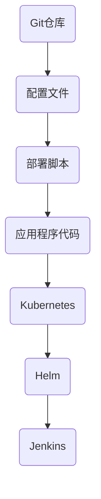
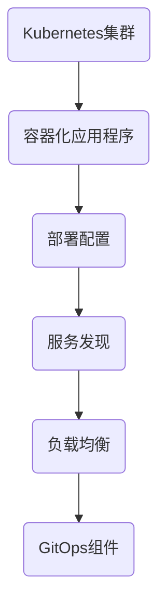
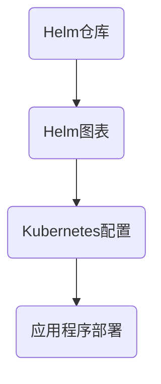
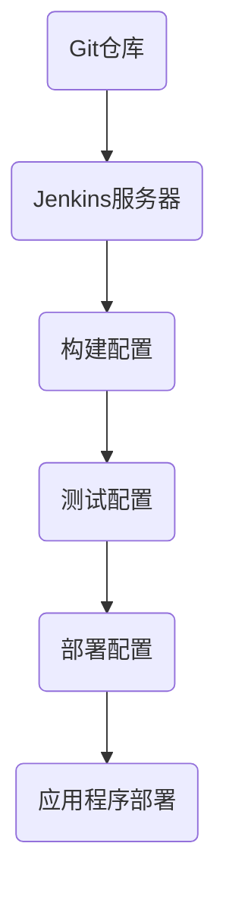
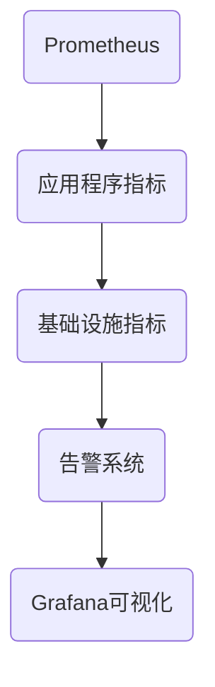
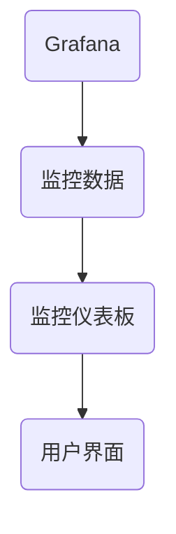
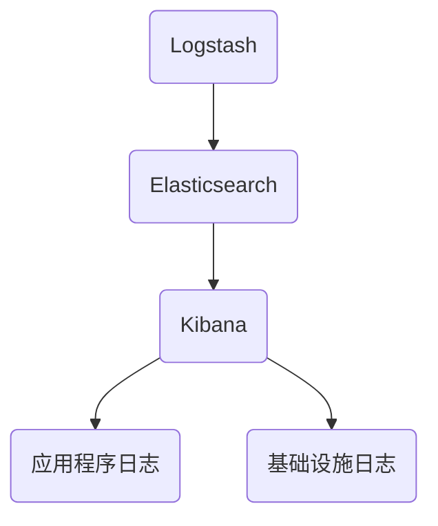
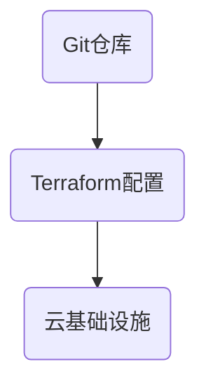

                 

# 文章标题：GitOps工作流：持续部署的最佳实践

> 关键词：GitOps, 持续集成，持续部署，持续交付，Kubernetes，Helm，Jenkins

> 摘要：本文深入探讨了GitOps工作流的概念、技术栈、实践和最佳实践，为开发者提供了关于如何在现代软件开发环境中实现高效持续部署的全面指南。通过逐步分析GitOps的核心原则、关键工具和实战案例，本文旨在帮助读者理解和应用GitOps，从而提升软件交付的效率和质量。

### 《GitOps工作流：持续部署的最佳实践》目录大纲

#### 第一部分：GitOps基础概念

#### 第二部分：GitOps技术栈

#### 第三部分：GitOps工作流实践

#### 第四部分：GitOps最佳实践

#### 第五部分：GitOps项目实战

#### 第六部分：GitOps未来展望与趋势

#### 附录

---

### 第一部分：GitOps基础概念

#### 第1章：GitOps概述

#### 第2章：GitOps与传统CI/CD的对比

#### 第3章：GitOps的优势与应用场景

#### 第4章：GitOps的核心组件

---

### 第二部分：GitOps技术栈

#### 第5章：GitOps的常见工具

#### 第6章：Git

#### 第7章：Kubernetes

#### 第8章：Helm

#### 第9章：Jenkins

---

### 第三部分：GitOps工作流实践

#### 第10章：GitOps在持续集成中的应用

#### 第11章：GitOps在持续部署中的应用

#### 第12章：GitOps在持续交付中的应用

---

### 第四部分：GitOps最佳实践

#### 第13章：GitOps安全与合规性

#### 第14章：GitOps监控与告警

---

### 第五部分：GitOps项目实战

#### 第15章：GitOps项目实战案例

---

### 第六部分：GitOps未来展望与趋势

#### 第16章：GitOps未来发展趋势

---

### 附录

#### 第17章：GitOps相关资源与工具列表

#### 第18章：GitOps数学模型和公式

#### 第19章：GitOps项目实战源代码与解读

---

### 结论

#### 第20章：总结与展望

---

### 作者

#### 作者：AI天才研究院/AI Genius Institute & 禅与计算机程序设计艺术 /Zen And The Art of Computer Programming

---

### 引言

在现代软件开发的快速迭代和持续变革中，持续部署（Continuous Deployment，简称CD）成为了提高软件交付效率和质量的关键。GitOps作为一种新兴的软件交付理念，结合了Git版本控制、基础设施即代码（Infrastructure as Code，简称IaC）和自动化工具，为持续部署提供了可靠的解决方案。本文将深入探讨GitOps工作流的概念、技术栈、实践和最佳实践，帮助读者全面了解并掌握GitOps，从而提升软件交付的效率和质量。

GitOps的核心理念是将基础设施和应用程序的配置管理通过Git版本控制系统实现自动化，确保开发人员可以像管理代码一样管理基础设施。通过GitOps，团队可以快速迭代、安全地发布新功能，同时保持生产环境的稳定性和安全性。本文将按以下结构展开：

1. **GitOps基础概念**：介绍GitOps的定义、核心原则、与传统CI/CD的对比、优势与应用场景，以及GitOps的核心组件。
2. **GitOps技术栈**：详细讨论GitOps中常用的工具，包括Git、Kubernetes、Helm和Jenkins。
3. **GitOps工作流实践**：探讨GitOps在持续集成、持续部署和持续交付中的应用，并分享具体的实战案例。
4. **GitOps最佳实践**：讨论GitOps的安全与合规性、监控与告警等最佳实践。
5. **GitOps项目实战**：通过一个完整的GitOps项目实战案例，展示GitOps的具体实施过程。
6. **GitOps未来展望与趋势**：展望GitOps的未来发展趋势，包括与AI的融合、多云与混合云环境中的应用以及开源生态的发展。
7. **附录**：提供GitOps相关的资源与工具列表、数学模型和公式、项目实战源代码与解读。

通过本文的深入探讨，读者将能够系统地了解GitOps的工作原理和最佳实践，为实际项目中的应用提供有力的指导。接下来，我们将从GitOps的基础概念开始，逐步展开讨论。  

---

### 第一部分：GitOps基础概念

#### 第1章：GitOps概述

#### 第2章：GitOps与传统CI/CD的对比

#### 第3章：GitOps的优势与应用场景

#### 第4章：GitOps的核心组件

---

### 第1章：GitOps概述

#### 1.1 GitOps的定义与核心原则

GitOps是一种现代软件开发和运维（DevOps）实践，它将Git版本控制系统作为单一事实源（single source of truth）来管理基础设施和应用程序配置。GitOps通过自动化和版本控制，实现了持续集成（CI）、持续部署（CD）和持续交付（CD）的自动化操作。

**GitOps的定义：**
GitOps是一种基于Git版本控制和自动化工具的实践，用于管理和部署应用程序和基础设施。其核心思想是将所有配置和数据存储在Git仓库中，并通过自动化工具实现配置的版本控制、环境管理和部署。

**GitOps的核心原则：**
- **配置管理即代码（Infrastructure as Code, IaC）**：将基础设施配置视为代码，使用版本控制系统进行管理。
- **声明式配置（Declarative Configuration）**：使用声明式配置文件来描述基础设施和应用程序的状态。
- **Git作为单一事实源（Git as the Source of Truth）**：所有配置变更都通过Git进行管理和追踪。
- **自动化（Automation）**：通过自动化工具和脚本实现配置的更新、部署和监控。
- **监控与告警（Monitoring and Alerting）**：实时监控部署状态，并在出现问题时自动触发告警。

#### 1.2 GitOps与传统CI/CD的对比

**传统CI/CD：**
传统持续集成和持续部署（CI/CD）侧重于自动化构建、测试和部署流程。然而，这些流程往往依赖于特定的CI/CD工具链和脚本，难以实现基础设施的版本控制和自动化管理。

**GitOps的优势：**
- **版本控制**：GitOps通过Git版本控制系统实现基础设施和应用程序配置的版本控制，确保变更的可追踪性和可回滚性。
- **基础设施即代码**：GitOps将基础设施配置视为代码，便于自动化和迭代。
- **自动化操作**：GitOps通过自动化工具实现配置更新、部署和监控，减少手动操作，提高部署效率。
- **安全性**：GitOps通过访问控制和审核日志确保操作的安全性。
- **透明性**：GitOps提供清晰的变更记录和操作日志，便于团队协作和问题追踪。

#### 1.3 GitOps的优势与应用场景

**优势：**
- **提高部署效率**：通过自动化和版本控制，GitOps显著提高了部署速度和频率。
- **减少错误**：自动化流程降低了手动操作错误的可能性。
- **安全合规性**：通过访问控制和日志记录，GitOps提高了操作的安全性和合规性。
- **可追踪性**：GitOps提供完整的变更记录，便于问题追踪和回滚。
- **易于集成**：GitOps与现有的CI/CD工具和云服务无缝集成。

**应用场景：**
- **微服务架构**：在微服务架构中，GitOps有助于管理多个服务的配置和部署。
- **云原生应用**：GitOps适用于云原生应用，尤其是使用Kubernetes进行容器化部署的应用。
- **大规模部署**：在大型分布式系统中，GitOps通过自动化和集中管理简化了部署过程。
- **DevOps团队**：GitOps有助于DevOps团队实现高效协作，提高交付质量。

#### 1.4 GitOps的核心组件

**Git：** Git是GitOps的核心组件，用于存储和管理基础设施和应用程序配置。Git仓库成为单一事实源，所有配置变更都通过Git进行版本控制和追踪。

**Kubernetes：** Kubernetes是GitOps中常用的容器编排工具，用于部署和管理应用程序。Kubernetes提供自动化的服务发现、负载均衡和弹性伸缩。

**Helm：** Helm是Kubernetes的包管理器，用于打包、部署和管理应用程序。Helm图表（charts）描述了应用程序的配置和依赖关系。

**Jenkins：** Jenkins是一个开源的持续集成服务器，用于自动化构建、测试和部署。Jenkins与Git集成，实现持续集成和持续部署。

**Prometheus：** Prometheus是一个开源监控系统，用于收集和监控应用程序和基础设施的指标。Prometheus提供告警和可视化工具，帮助团队实时监控部署状态。

通过上述核心组件，GitOps实现了基础设施和应用程序的自动化管理，确保持续部署的安全、高效和可追踪性。在接下来的章节中，我们将进一步探讨GitOps的技术栈和工作流实践。

#### 第2章：GitOps与传统CI/CD的对比

持续集成和持续部署（CI/CD）是软件开发中广泛采用的最佳实践，它们通过自动化流程提高软件交付的效率和质量。然而，GitOps作为一种新兴的实践，在许多方面与传统的CI/CD有所不同。本文将详细对比GitOps和传统CI/CD，探讨GitOps的独特优势和劣势。

#### 2.1 传统CI/CD的基本概念和流程

**CI/CD的基本概念：**
持续集成（Continuous Integration，CI）是指通过自动化构建和测试，将开发者的代码合并到一个共享的主干分支中，确保代码的质量和功能的完整性。持续部署（Continuous Deployment，CD）则是在CI的基础上，将经过测试的代码自动部署到生产环境，实现快速迭代和持续交付。

**CI/CD的流程：**
- **构建（Build）**：自动化构建过程包括编译代码、打包和构建可执行文件。
- **测试（Test）**：自动化测试过程包括单元测试、集成测试和回归测试，确保代码的质量和功能的完整性。
- **部署（Deploy）**：自动化部署过程将经过测试的代码部署到不同的环境，如开发、测试和生产环境。

传统CI/CD通常依赖于CI/CD工具（如Jenkins、Travis CI等）和自定义脚本，实现自动化构建、测试和部署。这些工具提供了丰富的插件和集成功能，支持多种编程语言和平台。

#### 2.2 GitOps与传统CI/CD的区别

**核心原则：**
- **Git作为单一事实源**：GitOps的核心原则是将所有配置和数据存储在Git仓库中，Git成为唯一的事实源。这使得GitOps在版本控制、变更追踪和回滚方面具有显著优势。相比之下，传统CI/CD通常依赖于特定的配置文件和脚本，难以实现集中管理。
- **配置管理即代码**：GitOps将基础设施配置视为代码，使用版本控制系统进行管理。这有助于自动化配置的变更、回滚和部署。传统CI/CD则侧重于应用程序的构建和测试，对基础设施配置的管理相对较弱。
- **自动化操作**：GitOps通过自动化工具和脚本实现配置的更新、部署和监控，减少手动操作，提高部署效率。传统CI/CD虽然也强调自动化，但在配置管理和基础设施管理方面相对欠缺。

**工具和集成：**
- **工具选择**：GitOps强调使用Git、Kubernetes、Helm和Jenkins等通用工具，实现基础设施和应用程序的自动化管理。这些工具在开源社区中广泛使用，支持多种编程语言和平台。传统CI/CD则依赖于特定的工具和脚本，可能需要针对不同的项目进行调整。
- **集成方式**：GitOps通过Git仓库与CI/CD工具集成，实现配置的自动同步和部署。这种方式便于团队协作和版本控制。传统CI/CD工具通常通过API或插件与其他工具集成，可能需要更多的配置和调试。

**安全性：**
- **访问控制和审计**：GitOps通过Git仓库的访问控制和审计日志，确保操作的安全性和合规性。任何配置变更都会在Git仓库中留下记录，便于追踪和审计。传统CI/CD工具也支持访问控制和审计，但通常依赖于外部系统和工具，实现较为复杂。
- **环境隔离**：GitOps通过Kubernetes等容器编排工具，实现不同环境之间的隔离和容器化部署。这有助于提高生产环境的稳定性和安全性。传统CI/CD通常依赖于虚拟机或物理服务器，可能存在环境不一致和安全性问题。

#### 2.3 GitOps的优势和劣势

**优势：**
- **版本控制和追踪**：GitOps通过Git实现配置的版本控制和追踪，确保变更的可追溯性和可回滚性。
- **自动化和效率**：GitOps通过自动化工具和脚本实现配置的变更、部署和监控，提高部署效率。
- **安全性**：GitOps通过访问控制和审计日志，确保操作的安全性和合规性。
- **易于集成**：GitOps与现有的CI/CD工具和云服务无缝集成，支持多种编程语言和平台。

**劣势：**
- **学习曲线**：GitOps需要了解Git、Kubernetes、Helm和Jenkins等工具，学习曲线相对较陡。
- **初始配置复杂**：GitOps的初始配置可能相对复杂，需要为不同环境设置和配置自动化工具。
- **兼容性问题**：GitOps可能需要与现有的CI/CD流程和工具集成，可能存在兼容性问题。

总的来说，GitOps在版本控制、自动化操作和安全方面具有显著优势，但可能需要一定的学习和配置成本。与传统CI/CD相比，GitOps提供了更灵活和高效的解决方案，适用于现代软件开发的复杂需求。在接下来的章节中，我们将进一步探讨GitOps的优势和应用场景，以及如何在实际项目中实施GitOps。

#### 第3章：GitOps的优势与应用场景

GitOps作为一种新兴的软件开发和运维（DevOps）实践，已经在很多现代软件项目中得到了广泛应用。其核心优势在于通过Git版本控制、基础设施即代码（IaC）和自动化工具，实现基础设施和应用程序的集中管理和高效部署。本文将详细探讨GitOps的优势和应用场景，帮助读者更好地理解和应用GitOps。

#### 3.1 GitOps的优势

**1. 提高部署效率：**
GitOps通过自动化工具和脚本实现配置变更、部署和监控的自动化操作，减少了手动干预和错误，显著提高了部署效率。特别是在微服务架构和云原生应用中，GitOps能够快速实现多次、小规模的部署，确保软件交付的及时性和质量。

**2. 版本控制和追踪：**
GitOps的核心原则之一是将Git作为唯一的事实源，所有配置变更都通过Git进行版本控制和追踪。这确保了变更的可追溯性和可回滚性，便于团队在出现问题时快速定位和恢复。

**3. 安全性和合规性：**
GitOps通过访问控制和审计日志，确保操作的安全性和合规性。任何配置变更都会在Git仓库中留下记录，便于团队追踪和审计。此外，GitOps还支持多层次的安全措施，如角色分配和权限管理，提高了生产环境的安全性。

**4. 易于集成和扩展：**
GitOps与现有的CI/CD工具和云服务无缝集成，支持多种编程语言和平台。这使得GitOps能够轻松适应不同的开发环境和项目需求，便于团队扩展和应用。

**5. 简化管理和维护：**
GitOps通过自动化和版本控制，简化了基础设施和应用程序的管理和维护。团队只需关注代码和配置文件，无需担心环境不一致和配置错误，降低了运维成本和风险。

#### 3.2 GitOps的应用场景

**1. 微服务架构：**
微服务架构强调将应用程序分解为多个独立的服务，每个服务负责特定的业务功能。GitOps在这种架构中具有显著优势，通过Git版本控制和管理，确保不同服务的配置和部署的一致性，提高系统的可维护性和可扩展性。

**2. 云原生应用：**
云原生应用利用容器化和微服务架构，在云环境中实现高效的部署和管理。GitOps与Kubernetes等容器编排工具无缝集成，能够快速实现云原生应用的持续集成、持续部署和持续交付。

**3. 大规模部署：**
在大型分布式系统中，GitOps通过自动化和集中管理，简化了部署过程，提高了部署速度和效率。GitOps能够支持大规模、多环境部署，确保生产环境的稳定性和安全性。

**4. DevOps团队协作：**
GitOps有助于DevOps团队实现高效协作，提高交付质量。通过Git作为单一事实源，团队成员可以实时查看和追踪配置变更，确保团队协作的一致性和透明性。

**5. 多云和混合云环境：**
随着云计算的普及，许多企业采用多云和混合云架构来提高灵活性和可靠性。GitOps在这种环境中具有显著优势，通过Git和自动化工具，实现多云和混合云环境中的统一管理和部署。

#### 3.3 GitOps的优势与不足

**优势：**
- **提高部署效率**：通过自动化和版本控制，GitOps显著提高了部署速度和频率。
- **版本控制和追踪**：GitOps通过Git实现配置的版本控制和追踪，确保变更的可追溯性和可回滚性。
- **安全性**：GitOps通过访问控制和审计日志，确保操作的安全性和合规性。
- **易于集成和扩展**：GitOps与现有的CI/CD工具和云服务无缝集成，支持多种编程语言和平台。
- **简化管理和维护**：GitOps通过自动化和版本控制，简化了基础设施和应用程序的管理和维护。

**不足：**
- **学习曲线**：GitOps需要了解Git、Kubernetes、Helm和Jenkins等工具，学习曲线相对较陡。
- **初始配置复杂**：GitOps的初始配置可能相对复杂，需要为不同环境设置和配置自动化工具。
- **兼容性问题**：GitOps可能需要与现有的CI/CD流程和工具集成，可能存在兼容性问题。

总体而言，GitOps在版本控制、自动化操作和安全方面具有显著优势，但可能需要一定的学习和配置成本。与传统CI/CD相比，GitOps提供了更灵活和高效的解决方案，适用于现代软件开发的复杂需求。在接下来的章节中，我们将进一步探讨GitOps的技术栈和实践，帮助读者更好地掌握GitOps的应用。

#### 第4章：GitOps的核心组件

GitOps的成功实施依赖于一系列核心组件的协同工作。这些组件包括Git版本控制系统、Kubernetes容器编排平台、Helm包管理工具和Jenkins持续集成服务器。本章将详细介绍这些核心组件的功能、选择标准和最佳实践，以便读者能够全面理解GitOps的工作原理。

#### 4.1 Git：版本控制与配置管理

**功能：**
Git是一个分布式版本控制系统，用于存储、追踪和管理文件和目录的变更。在GitOps中，Git作为核心组件，用于存储和管理应用程序和基础设施的配置文件、部署脚本和应用程序代码。

**选择标准：**
- **性能**：Git应具备高效的文件存储和访问性能，以支持大规模项目和频繁的变更操作。
- **扩展性**：Git应支持多种版本控制策略，如分支、标签和合并，以便适应不同项目的需求。
- **集成性**：Git应与其他GitOps组件（如Kubernetes、Helm和Jenkins）无缝集成，提供统一的操作界面。
- **安全性**：Git应支持访问控制和审计日志，确保配置文件和代码的安全性和合规性。

**最佳实践：**
- **多仓库管理**：将不同的项目和应用分别存储在不同的Git仓库中，便于管理和协作。
- **分支策略**：采用合适的分支策略（如Git Flow或GitLab Flow）来管理代码的发布和迭代。
- **保护主干分支**：限制直接向主干分支提交代码，通过合并请求（Pull Request）进行代码审查和合并。
- **自动化操作**：使用Git命令行工具和脚本，实现配置文件的自动化管理和更新。

**Mermaid流程图：**


#### 4.2 Kubernetes：容器编排与资源管理

**功能：**
Kubernetes是一个开源的容器编排平台，用于部署、管理和扩展容器化应用程序。在GitOps中，Kubernetes负责管理应用程序的部署、扩缩容、服务发现和负载均衡。

**选择标准：**
- **可靠性**：Kubernetes应具备高可用性和故障转移能力，确保应用程序的稳定运行。
- **可扩展性**：Kubernetes应支持横向和纵向扩展，以适应不同的业务需求。
- **兼容性**：Kubernetes应与各种容器运行时和编排工具兼容，如Docker和Kubernetes集群管理工具。
- **监控和日志**：Kubernetes应提供内置的监控和日志工具，如Prometheus和ELK堆栈，便于实时监控和故障排查。

**最佳实践：**
- **多集群管理**：使用Kubernetes的多集群管理功能，实现跨集群部署和资源调度。
- **命名空间**：为不同的项目和应用创建命名空间，隔离资源和控制访问权限。
- **资源配额**：设置资源配额，确保应用程序合理使用集群资源。
- **自动化运维**：使用Helm、Kustomize等工具，实现Kubernetes配置的自动化管理和部署。

**Mermaid流程图：**


#### 4.3 Helm：包管理与部署

**功能：**
Helm是Kubernetes的包管理器，用于打包、部署和管理应用程序。在GitOps中，Helm图表（charts）描述了应用程序的配置和依赖关系，便于自动化部署和管理。

**选择标准：**
- **易用性**：Helm应具备直观的命令行界面和丰富的文档，便于新手快速上手。
- **模块化**：Helm应支持模块化和复用，减少重复配置和提高部署效率。
- **扩展性**：Helm应支持自定义值文件和配置项，以适应不同项目的需求。
- **版本控制**：Helm应支持图表的版本控制和发布记录，便于追踪和回滚。

**最佳实践：**
- **使用官方图表**：优先使用官方发布的Helm图表，确保质量和支持。
- **自定义图表**：根据项目需求，自定义Helm图表，提高部署的灵活性和可定制性。
- **存储库管理**：使用Helm仓库管理图表，便于版本控制和共享。
- **文档和注释**：为Helm图表编写详细的文档和注释，提高可读性和可维护性。

**Mermaid流程图：**


#### 4.4 Jenkins：持续集成与部署

**功能：**
Jenkins是一个开源的持续集成服务器，用于自动化构建、测试和部署应用程序。在GitOps中，Jenkins与Git集成，实现持续集成和持续部署的自动化操作。

**选择标准：**
- **灵活性**：Jenkins应具备丰富的插件和扩展能力，支持多种编程语言和平台。
- **可扩展性**：Jenkins应支持水平扩展，以适应大规模项目的需求。
- **监控和告警**：Jenkins应提供内置的监控和告警功能，实时监控构建和部署状态。
- **易用性**：Jenkins应具备友好的用户界面和直观的操作流程，便于新手使用。

**最佳实践：**
- **插件管理**：定期更新Jenkins插件，确保安全和功能。
- **流水线**：使用Jenkins流水线（Pipeline），实现自动化构建、测试和部署。
- **多环境部署**：为不同的环境（如开发、测试和生产）配置独立的Jenkins节点，实现环境隔离。
- **代码质量**：集成代码静态分析和动态测试，提高代码质量。

**Mermaid流程图：**


通过Git、Kubernetes、Helm和Jenkins等核心组件的协同工作，GitOps实现了基础设施和应用程序的集中管理和自动化操作。在下一章节中，我们将深入探讨GitOps在工作流中的具体应用和实践。

### 第二部分：GitOps技术栈

#### 第5章：GitOps的常见工具

#### 第6章：Git

#### 第7章：Kubernetes

#### 第8章：Helm

#### 第9章：Jenkins

---

#### 第5章：GitOps的常见工具

在GitOps实践中，除了Git、Kubernetes、Helm和Jenkins等核心组件，还有许多其他常用的工具和平台，这些工具能够帮助团队更好地实现自动化、监控和协作。本章将介绍GitOps中常用的常见工具，包括其功能、选择标准和最佳实践。

#### 5.1 Prometheus：监控与告警

**功能：**
Prometheus是一个开源的监控告警系统，主要用于收集、存储和展示指标数据。在GitOps中，Prometheus可以实时监控应用程序和基础设施的状态，并在出现问题时自动触发告警。

**选择标准：**
- **性能**：Prometheus应具备高效的指标收集和查询性能，以支持大规模监控需求。
- **扩展性**：Prometheus应支持水平扩展，以适应不断增长的监控需求。
- **集成性**：Prometheus应与现有的监控工具（如Grafana、Alertmanager等）无缝集成。
- **告警策略**：Prometheus应提供灵活的告警策略，支持自定义告警规则和通知渠道。

**最佳实践：**
- **多实例部署**：为不同的应用程序和基础设施部署独立的Prometheus实例，确保监控的独立性和准确性。
- **自定义监控指标**：根据业务需求，自定义监控指标，确保关键业务指标得到全面监控。
- **告警优化**：定期优化告警策略，避免误告警和冗余告警，提高告警的有效性。
- **可视化**：使用Grafana等可视化工具，将Prometheus的监控数据可视化，便于团队实时监控和问题排查。

**Mermaid流程图：**


#### 5.2 Grafana：数据可视化

**功能：**
Grafana是一个开源的数据可视化平台，用于展示和监控Prometheus等监控系统收集的指标数据。在GitOps中，Grafana可以将复杂的监控数据可视化，提供直观的监控仪表板。

**选择标准：**
- **可视化效果**：Grafana应提供丰富的图表和可视化效果，以适应不同类型的监控数据。
- **可扩展性**：Grafana应支持插件和自定义面板，便于扩展和定制。
- **集成性**：Grafana应与现有的监控系统（如Prometheus、Kibana等）无缝集成。
- **用户体验**：Grafana应具备友好的用户界面和直观的操作流程，便于新手使用。

**最佳实践：**
- **仪表板管理**：为不同的应用程序和基础设施创建独立的仪表板，确保监控数据的一致性和完整性。
- **监控面板**：根据业务需求，自定义监控面板，展示关键指标和异常情况。
- **数据刷新**：定期刷新监控数据，确保数据的实时性和准确性。
- **用户权限**：设置用户权限和访问控制，确保监控数据的安全和合规性。

**Mermaid流程图：**


#### 5.3 ELK堆栈：日志管理

**功能：**
ELK堆栈（Elasticsearch、Logstash和Kibana）是一个开源的日志管理平台，用于收集、存储和展示日志数据。在GitOps中，ELK堆栈可以收集和聚合应用程序和基础设施的日志，提供实时日志分析和监控。

**选择标准：**
- **可扩展性**：ELK堆栈应支持水平扩展，以适应不断增长的日志数据。
- **性能**：ELK堆栈应具备高效的日志收集和查询性能，以支持大规模日志管理需求。
- **集成性**：ELK堆栈应与现有的监控和日志工具（如Prometheus、Kibana等）无缝集成。
- **灵活性**：ELK堆栈应支持自定义日志解析和过滤规则，以适应不同类型的日志格式。

**最佳实践：**
- **日志收集**：为不同的应用程序和基础设施配置独立的日志收集器，确保日志的独立性和完整性。
- **日志格式**：统一日志格式，确保日志数据的一致性和可解析性。
- **日志分析**：使用Logstash和Kibana等工具，对日志数据进行实时分析和可视化，提高日志管理的效果。
- **安全审计**：定期备份和审计日志数据，确保日志数据的合规性和安全性。

**Mermaid流程图：**


#### 5.4 Terraform：基础设施即代码

**功能：**
Terraform是一个开源的基础设施即代码（IaC）工具，用于部署和管理云基础设施。在GitOps中，Terraform可以与Git集成，实现基础设施的自动化管理和版本控制。

**选择标准：**
- **支持多种云服务**：Terraform应支持多种云服务提供商，如AWS、Azure和Google Cloud，以便团队选择最适合的云服务。
- **可扩展性**：Terraform应支持模块化和复用，减少重复配置和提高部署效率。
- **集成性**：Terraform应与现有的CI/CD工具（如Jenkins、GitLab等）无缝集成。
- **性能**：Terraform应具备高效的部署和变更管理性能，以支持大规模基础设施管理。

**最佳实践：**
- **模块化**：使用Terraform模块化设计，将基础设施配置分解为可重用的模块，提高配置的可维护性和可扩展性。
- **版本控制**：将Terraform配置文件存储在Git仓库中，实现基础设施配置的版本控制和追踪。
- **自动化部署**：使用Terraform自动化部署基础设施，确保基础设施配置的一致性和可靠性。
- **环境隔离**：为不同的环境（如开发、测试和生产）配置独立的Terraform配置，确保环境隔离和安全性。

**Mermaid流程图：**


通过上述常见工具的协同工作，GitOps能够实现基础设施和应用程序的自动化管理、监控和协作。这些工具不仅提供了丰富的功能和支持，还通过最佳实践和最佳实践，帮助团队提高部署效率、确保配置的一致性和可靠性。在下一章节中，我们将深入探讨GitOps的具体工作流程和实践。

### 第6章：Git

在GitOps中，Git不仅仅是版本控制系统，更是配置管理的核心组件。通过Git，团队可以有效地管理应用程序和基础设施的配置文件，实现版本控制和自动化部署。本章将详细探讨Git在GitOps中的应用、基本操作、版本控制策略和最佳实践。

#### 6.1 Git在GitOps中的应用

**配置管理：**
Git是GitOps中用于存储和管理配置文件的主要工具。通过Git，团队可以将应用程序的配置、基础设施的部署脚本和操作指南存储在版本控制系统中。这使得配置变更可追溯、可复现，并便于团队协作和管理。

**自动化部署：**
Git与CI/CD工具（如Jenkins）集成，可以实现自动化部署。每当Git仓库中发生配置变更时，Jenkins可以自动触发构建、测试和部署流程，确保部署的自动化和高效性。

**版本控制与追踪：**
Git提供完整的版本控制功能，确保配置变更的可追溯性和可回滚性。任何对配置文件的修改都会在Git仓库中留下记录，便于团队追踪和审计。

**集成与协作：**
Git可以与其他GitOps组件（如Kubernetes、Helm和Jenkins）无缝集成，提供统一的操作界面和协作平台。这使得团队可以协同工作，高效地管理配置和部署。

#### 6.2 Git的基本操作

**初始化仓库：**
在开始使用Git之前，需要初始化一个新的Git仓库。可以使用以下命令初始化本地仓库：
```bash
git init
```

**克隆仓库：**
将远程Git仓库克隆到本地，可以使用以下命令：
```bash
git clone <remote-repo-url>
```

**添加文件：**
将新文件添加到Git仓库，可以使用以下命令：
```bash
git add <file-name>
```

**提交变更：**
提交文件变更，并添加提交信息：
```bash
git commit -m "Commit message"
```

**分支管理：**
创建新分支，可以在本地或远程仓库中操作：
```bash
git branch <branch-name>
git checkout -b <branch-name>
```

**合并分支：**
将分支合并到主干分支，可以使用以下命令：
```bash
git merge <branch-name>
```

**拉取更新：**
从远程仓库拉取最新更新：
```bash
git pull
```

**推送更新：**
将本地仓库的更新推送至远程仓库：
```bash
git push
```

#### 6.3 Git版本控制策略

**Git Flow：**
Git Flow是一种流行的版本控制策略，适用于频繁发布和迭代的项目。它包括以下几个阶段：开发阶段（Develop）、发布阶段（Master）和功能分支（Feature）、热修复分支（Hotfix）和发布分支（Release）。

**GitLab Flow：**
GitLab Flow是Git Flow的一种简化版，适用于小规模团队和快速迭代的项目。它包括以下几个阶段：开发分支（Develop）和发布分支（Release）。

**Git branching strategy：**
自定义分支策略，根据项目需求和团队协作模式，设计合适的分支策略。常用的分支策略包括单主干分支策略、多主干分支策略和功能分支策略。

#### 6.4 Git在GitOps中的最佳实践

**多仓库管理：**
为不同的应用程序和基础设施创建独立的Git仓库，便于管理和协作。每个仓库都可以独立进行版本控制和部署。

**保护主干分支：**
限制直接向主干分支提交代码，通过合并请求（Pull Request）进行代码审查和合并。确保主干分支的稳定性和安全性。

**分支策略：**
采用合适的分支策略，确保配置变更的可追踪性和可回滚性。根据项目需求和团队协作模式，选择适合的分支策略。

**自动化操作：**
使用Git命令行工具和脚本，实现配置文件的自动化管理和更新。确保配置变更的自动化和高效性。

**文档和注释：**
为配置文件编写详细的文档和注释，提高可读性和可维护性。确保团队成员理解配置文件的功能和用途。

**版本控制：**
定期更新配置文件和部署脚本，记录变更的历史和原因。确保版本控制的有效性和可靠性。

通过Git在GitOps中的应用和最佳实践，团队可以高效地管理配置和部署，确保持续交付的质量和效率。在下一章节中，我们将探讨Kubernetes在GitOps中的角色和应用。

### 第7章：Kubernetes

在GitOps中，Kubernetes作为容器编排平台，承担着关键的角色。它不仅负责部署和管理容器化应用程序，还与Git和其他GitOps组件紧密集成，实现基础设施的自动化管理和版本控制。本章将详细介绍Kubernetes的基础知识、其在GitOps中的应用、部署和管理最佳实践。

#### 7.1 Kubernetes基础知识

**Kubernetes简介：**
Kubernetes是一个开源的容器编排平台，用于自动化部署、扩展和管理容器化应用程序。它提供了一种统一的部署和管理环境，支持多种容器化技术，如Docker、rkt等。

**核心概念：**
- **Pod**：Kubernetes的基本部署单元，由一个或多个容器组成。Pod负责运行应用程序的实例。
- **Service**：Kubernetes的服务抽象，用于提供网络访问和负载均衡。
- **Deployments**：部署控制器，用于管理Pod的创建、更新和扩展。
- **StatefulSets**：用于管理有状态服务的控制器，确保服务的稳定性和状态一致性。
- **Ingress**：用于管理集群的入口流量，实现外部访问和负载均衡。
- **ConfigMaps和Secrets**：用于管理配置数据和敏感信息，如密码和环境变量。

**Kubernetes与GitOps的关系：**
Kubernetes在GitOps中充当基础设施管理的核心组件。通过Kubernetes，团队可以自动化部署和管理容器化应用程序，确保配置的一致性和可追踪性。GitOps通过Git仓库存储和管理Kubernetes配置文件，实现基础设施和应用程序的版本控制和自动化操作。

#### 7.2 Kubernetes在GitOps中的应用

**配置管理：**
在GitOps中，Kubernetes配置文件（如YAML文件）存储在Git仓库中。团队可以使用Git管理配置文件的版本和控制，确保配置的一致性和可回滚性。

**自动化部署：**
Git与Kubernetes集成，实现自动化部署。每当Git仓库中发生配置变更时，Jenkins或其他CI/CD工具可以自动触发Kubernetes部署，确保配置变更的快速应用。

**服务发现和负载均衡：**
Kubernetes提供自动化的服务发现和负载均衡，确保容器化应用程序的高可用性和性能。GitOps通过Git管理服务发现和负载均衡配置，实现自动化和服务管理。

**监控和告警：**
Kubernetes与监控工具（如Prometheus）集成，实现实时监控和告警。GitOps通过Git管理监控配置，确保监控数据的一致性和准确性。

**多环境管理：**
Kubernetes支持多环境部署，如开发、测试和生产环境。GitOps通过Git管理不同环境的配置，实现环境隔离和一致性。

**扩展性和可维护性：**
Kubernetes提供灵活的扩展性和可维护性，支持模块化和复用。GitOps通过Git管理Kubernetes配置，确保扩展性和可维护性。

#### 7.3 Kubernetes部署和管理最佳实践

**多集群管理：**
为不同的应用程序和基础设施部署独立的Kubernetes集群，实现跨集群管理和资源调度。GitOps通过Git管理集群配置，确保配置的一致性和可追踪性。

**命名空间：**
为不同的项目和应用创建命名空间，实现资源隔离和访问控制。命名空间有助于组织和管理资源，提高系统的可维护性。

**资源配额：**
设置资源配额，确保应用程序合理使用集群资源。资源配额有助于避免资源争用和性能问题，提高集群的稳定性。

**自动化运维：**
使用Helm、Kustomize等工具，实现Kubernetes配置的自动化管理和部署。这些工具提供模块化和复用功能，提高部署效率。

**监控和日志：**
集成Prometheus、ELK堆栈等监控和日志工具，实现实时监控和日志分析。GitOps通过Git管理监控和日志配置，确保监控和日志数据的一致性和准确性。

**安全性：**
使用Kubernetes的安全功能，如角色分配（RBAC）和命名空间隔离，确保集群的安全性和合规性。GitOps通过Git管理安全配置，确保安全策略的一致性和可追踪性。

**文档和注释：**
为Kubernetes配置文件编写详细的文档和注释，提高配置的可读性和可维护性。文档和注释有助于团队理解和维护配置。

通过Kubernetes在GitOps中的应用和最佳实践，团队可以高效地管理容器化应用程序和基础设施，实现持续交付的质量和效率。在下一章节中，我们将探讨Helm在GitOps中的角色和应用。

### 第8章：Helm

在GitOps中，Helm是一个至关重要的工具，它作为Kubernetes的包管理器，为开发者和运维人员提供了简化应用程序部署和管理的解决方案。本章将详细介绍Helm的基础知识、工作原理、在GitOps中的应用、如何使用Helm进行部署和管理，以及最佳实践。

#### 8.1 Helm基础知识

**Helm简介：**
Helm是Kubernetes的官方包管理器，用于创建、打包、共享和管理Kubernetes应用程序。它提供了图表（charts）的概念，图表是一个包含应用程序配置和依赖关系的打包文件。

**核心概念：**
- **图表（Chart）：** Helm的基本单位，包含应用程序的配置文件、模板和文档。每个图表都有唯一的名称和版本。
- **值文件（Values File）：** Helm使用值文件来传递自定义配置给图表。值文件定义了应用程序的特定配置，如服务端口、存储配置等。
- **命令行工具（helm）：** Helm命令行工具用于管理图表，包括安装、更新、回滚和删除图表。

**Helm组件：**
- **Tiller：** Helm 2中的服务端组件，负责处理Kubernetes的API请求。Tiller在Helm 3中已被移除，改为直接使用Kubernetes API。
- **Kubernetes API Server：** Helm操作Kubernetes API Server，创建和管理Kubernetes资源。

#### 8.2 Helm的工作原理

**部署流程：**
1. **编写图表：** 开发者创建图表，定义应用程序的配置和依赖关系。
2. **打包图表：** 使用`helm package`命令将图表打包成`.tgz`文件。
3. **上传图表：** 将打包的图表上传到Helm仓库，如本地文件系统或远程仓库。
4. **安装图表：** 使用`helm install`命令安装图表到Kubernetes集群。
5. **更新图表：** 使用`helm upgrade`命令更新已安装的图表。
6. **回滚：** 使用`helm rollback`命令回滚到之前的版本。

**模板引擎：**
Helm使用Go模板引擎（Golang Template）来生成Kubernetes配置文件。模板文件以`yaml`或`json`格式定义，可以使用模板变量和逻辑控制结构。

#### 8.3 Helm在GitOps中的应用

**版本控制：**
GitOps利用Git版本控制系统来存储和管理Helm图表和值文件。任何对图表的更改都会在Git仓库中记录，确保变更的可追溯性和可回滚性。

**自动化部署：**
Git与Helm集成，实现自动化部署。当Git仓库中的图表发生变更时，Jenkins或其他CI/CD工具可以自动触发Helm安装或更新操作。

**配置管理：**
Helm图表使用值文件进行配置，值文件存储在Git仓库中。GitOps通过Git管理值文件，确保配置的一致性和可定制性。

**模块化：**
Helm支持模块化设计，可以分解复杂的应用程序为多个图表。GitOps通过Git管理模块化图表，提高配置的可维护性和可扩展性。

**发布记录：**
Helm记录每个安装操作的版本信息，GitOps可以通过Git仓库查看发布历史和配置变更。

#### 8.4 使用Helm进行部署和管理

**安装Helm：**
在本地环境或Kubernetes集群中安装Helm。对于Helm 3，可以使用以下命令：
```bash
helm install <chart-name> <chart-tgz>
```

**更新Helm：**
更新已安装的图表，使用以下命令：
```bash
helm upgrade <release-name> <chart-name> --values <values-file>
```

**卸载Helm：**
卸载已安装的图表，使用以下命令：
```bash
helm uninstall <release-name>
```

**打包Helm图表：**
将图表打包为`.tgz`文件，使用以下命令：
```bash
helm package <chart-dir>
```

**发布Helm图表：**
将打包的图表上传到Helm仓库，使用以下命令：
```bash
helm repo add <repo-name> <repo-url>
helm repo update
helm package --repo <repo-url> <chart-name>
```

#### 8.5 Helm在GitOps中的最佳实践

**多仓库管理：**
为不同的应用程序创建独立的Git仓库，存储相应的Helm图表和值文件。确保每个仓库都有独立的版本控制和管理。

**保护主干分支：**
限制直接向主干分支提交Helm图表和值文件，通过合并请求进行代码审查和合并。确保主干分支的稳定性和安全性。

**自动化操作：**
使用Git与CI/CD工具集成，实现Helm图表的自动化部署和管理。确保部署流程的可重复性和一致性。

**配置文档：**
为Helm图表和值文件编写详细的文档，说明每个配置项的作用和默认值。确保团队成员理解配置文件的功能和用途。

**测试和验证：**
在部署前进行充分测试和验证，确保Helm图表在Kubernetes集群中正常工作。使用自动化测试工具和脚本来提高测试覆盖率。

**备份和恢复：**
定期备份Helm图表和值文件，确保在出现问题时能够快速恢复。使用Git的备份和恢复功能，确保版本控制的有效性。

通过Helm在GitOps中的应用和最佳实践，团队可以高效地管理Kubernetes应用程序的部署和配置，确保持续交付的质量和效率。在下一章节中，我们将探讨Jenkins在GitOps中的角色和应用。

### 第9章：Jenkins

在GitOps实践中，Jenkins作为一个开源的持续集成和持续部署（CI/CD）工具，扮演着至关重要的角色。Jenkins不仅可以帮助团队自动化构建、测试和部署流程，还可以与Git、Kubernetes和Helm等工具集成，实现全面的GitOps工作流。本章将详细讨论Jenkins在GitOps中的应用、Jenkinsfile的编写、Jenkins流水线（Pipeline）的配置和使用，以及最佳实践。

#### 9.1 Jenkins在GitOps中的应用

**持续集成（CI）：**
Jenkins负责自动化构建和测试应用程序代码，确保每次代码提交都是高质量的。通过CI，Jenkins可以触发一系列的构建任务，包括编译、打包和测试。

**持续部署（CD）：**
Jenkins还负责将通过CI测试成功的代码部署到不同的环境，如开发、测试和生产环境。通过与Kubernetes和Helm的集成，Jenkins可以实现自动化部署，确保部署流程的一致性和高效性。

**Git集成：**
Jenkins与Git集成，可以监视Git仓库中的代码变更。每当有新的提交或合并请求（Pull Request）时，Jenkins可以自动触发构建和部署流程。

**监控和告警：**
Jenkins提供内置的监控和告警功能，可以实时监控构建和部署状态，并在出现问题时自动发送告警通知。

**管道化（Pipeline）：**
Jenkins流水线（Pipeline）是一个声明式管道定义语言，允许开发者在代码中定义整个CI/CD流程，从构建到部署，提高流程的可维护性和可扩展性。

#### 9.2 Jenkinsfile的编写

**结构：**
Jenkinsfile是一个文本文件，位于项目的根目录下。它定义了CI/CD流程的各个阶段，包括源代码拉取、构建、测试和部署。Jenkinsfile通常使用Groovy语言编写。

**示例：**
以下是一个简单的Jenkinsfile示例，展示了构建、测试和部署的基本步骤：

```groovy
pipeline {
    agent any

    stages {
        stage('Checkout') {
            steps {
                checkout scm
            }
        }
        stage('Build') {
            steps {
                sh 'mvn clean package'
            }
        }
        stage('Test') {
            steps {
                sh 'mvn test'
            }
        }
        stage('Deploy') {
            steps {
                sh 'helm install my-release ./chart --namespace my-namespace'
            }
        }
    }
    post {
        success {
            echo 'Build and Deployment Successful'
        }
        failure {
            echo 'Build or Deployment Failed'
        }
    }
}
```

**步骤解释：**
- `agent any`：指定任何可用的代理节点运行流水线。
- `stages`：定义流水线的各个阶段。
- `stage('Checkout')`：拉取最新代码。
- `stage('Build')`：执行构建任务。
- `stage('Test')`：执行测试任务。
- `stage('Deploy')`：部署应用程序。
- `post`：定义构建成功或失败后的操作。

#### 9.3 Jenkins流水线的配置和使用

**流水线配置：**
Jenkins流水线是一种基于Jenkinsfile的声明式管道定义方法。通过编写Jenkinsfile，可以定义整个CI/CD流程。流水线支持多种执行策略，如并行执行、流水线执行等。

**流水线执行策略：**
- **并行执行**：多个阶段可以并行执行，提高构建和部署的速度。
- **流水线执行**：阶段顺序执行，确保每个阶段完成后才能执行下一个阶段。

**示例：**
以下是一个使用并行执行的流水线配置示例：

```groovy
pipeline {
    agent any

    stages {
        stage('Checkout') {
            steps {
                checkout scm
            }
        }
        stage('Build and Test') {
            parallel {
                stage('Build') {
                    steps {
                        sh 'mvn clean package'
                    }
                }
                stage('Test') {
                    steps {
                        sh 'mvn test'
                    }
                }
            }
        }
        stage('Deploy') {
            steps {
                sh 'helm install my-release ./chart --namespace my-namespace'
            }
        }
    }
}
```

**步骤解释：**
- `parallel`：开启并行执行。
- `stage('Build')`：并行执行构建阶段。
- `stage('Test')`：并行执行测试阶段。
- `stage('Deploy')`：部署应用程序。

#### 9.4 Jenkins在GitOps中的最佳实践

**多环境管理：**
为不同的环境（如开发、测试、生产）配置独立的Jenkins节点和流水线，确保环境隔离和一致性。

**自动化操作：**
使用Jenkins流水线实现自动化构建、测试和部署，减少手动干预，提高效率。

**版本控制：**
将Jenkinsfile和其他相关配置文件存储在Git仓库中，实现版本控制和追踪。

**代码审查：**
使用Git的合并请求（Pull Request）功能，确保Jenkinsfile和其他配置文件的变更经过审查和批准。

**监控和告警：**
集成Jenkins监控工具，如Prometheus和Grafana，实现实时监控和告警。

**安全性：**
配置Jenkins的访问控制和认证机制，确保操作的安全性和合规性。

**文档和注释：**
为Jenkinsfile编写详细的文档和注释，说明每个阶段的任务和执行逻辑。

通过Jenkins在GitOps中的应用和最佳实践，团队可以构建高效、可维护的CI/CD流水线，实现持续交付的最佳实践。在下一章节中，我们将探讨GitOps在持续集成、持续部署和持续交付中的应用。

### 第三部分：GitOps工作流实践

#### 第10章：GitOps在持续集成中的应用

#### 第11章：GitOps在持续部署中的应用

#### 第12章：GitOps在持续交付中的应用

---

#### 第10章：GitOps在持续集成中的应用

持续集成（Continuous Integration，CI）是软件开发中的一种重要实践，旨在通过频繁地将代码合并到主干分支，确保代码库中的每个提交都是可集成和可运行的。GitOps利用Git和自动化工具，实现了持续集成的自动化和高效性。本章将详细探讨GitOps在持续集成中的应用，包括CI的基本概念、GitOps与CI的整合以及实际操作步骤。

#### 10.1 持续集成的基本概念

**CI的定义：**
持续集成是一种软件开发和交付流程，其中开发者的代码定期合并到一个共享的主分支，并立即进行构建和测试。这种方法确保了代码库中的每个提交都是完整的、可集成的，并能够快速发现和解决潜在的问题。

**CI的关键要素：**
- **频繁提交：** 开发者频繁提交代码，通常每个工作日提交多次。
- **自动化构建：** 每次提交都会触发自动化构建过程，编译代码并打包应用程序。
- **自动化测试：** 构建完成后，立即执行一系列自动化测试，确保代码的质量和功能的完整性。
- **快速反馈：** 一旦测试完成，团队会立即收到反馈，以便快速发现和解决问题。

**CI的目标：**
- **早期发现问题：** 通过自动化测试，及早发现代码中的错误和潜在问题。
- **提高代码质量：** 通过频繁的集成和测试，确保代码库中的每个提交都是高质量和可集成的。
- **缩短交付周期：** 通过自动化和快速反馈，缩短从提交到部署的周期。

#### 10.2 GitOps与CI的整合

**Git作为CI的基础：**
GitOps的核心原则之一是将Git作为所有配置和代码的单一事实源。在CI过程中，Git仓库成为代码合并、构建和测试的中央仓库。每次代码提交都会触发CI流程，确保代码库中的每个提交都是可集成和可运行的。

**自动化工具的集成：**
GitOps通过自动化工具（如Jenkins、GitLab CI等）实现CI流程的自动化。这些工具与Git集成，每当代码仓库发生变更时，自动触发构建和测试任务。

**CI流程的实现：**
- **代码提交：** 开发者将代码提交到Git仓库。
- **触发构建：** Git仓库的变更触发CI工具执行构建任务。
- **构建过程：** CI工具编译代码、执行静态分析、构建应用程序和运行自动化测试。
- **反馈：** 构建结果和测试结果通过邮件、Slack或其他通知渠道反馈给开发人员。

#### 10.3 GitOps持续集成案例实践

**案例概述：**
假设我们有一个Web应用程序，开发人员定期提交代码到Git仓库。为了实现GitOps持续集成，我们使用Jenkins作为CI工具，Kubernetes作为部署环境。

**步骤：**
1. **配置Git仓库：**
   - 在Git仓库中创建一个分支，如`develop`，用于开发人员提交代码。
   - 配置Git仓库的Webhook，使其与Jenkins集成。每当`develop`分支发生变更时，自动触发Jenkins构建任务。

2. **配置Jenkins：**
   - 创建一个新的Jenkins项目，命名为`WebApp CI`。
   - 在Jenkins项目中添加Git插件，配置Git仓库地址和访问凭据。
   - 编写Jenkinsfile，定义CI流程，包括构建、测试和部署步骤。

3. **配置构建流程：**
   - **构建步骤：**
     ```groovy
     pipeline {
         agent any
         stages {
             stage('Checkout') {
                 steps {
                     checkout(scm: github('my-repo'))
                 }
             }
             stage('Build') {
                 steps {
                     sh 'mvn clean package'
                 }
             }
             stage('Test') {
                 steps {
                     sh 'mvn test'
                 }
             }
             stage('Deploy') {
                 steps {
                     sh 'kubectl apply -f deployment.yml'
                 }
             }
         }
     }
     ```
   - **测试步骤：** 在`Test`阶段运行自动化测试，确保代码质量。
   - **部署步骤：** 在`Deploy`阶段将构建结果部署到Kubernetes集群。

4. **监控和反馈：**
   - 配置Jenkins，使其在构建成功或失败时发送通知。
   - 使用Prometheus和Grafana监控构建状态和Kubernetes集群的健康状况。

**实现细节：**
- **多环境管理：** 根据需要，为开发、测试和生产环境配置独立的Jenkins流水线，确保环境隔离。
- **权限控制：** 配置Git仓库的访问控制，确保只有授权用户可以触发构建任务。
- **容器化：** 使用Docker容器化应用程序，确保在不同环境中的运行一致性。

通过GitOps持续集成，团队可以确保代码库中的每个提交都是可集成和可运行的，提高代码质量和交付效率。在下一章节中，我们将探讨GitOps在持续部署中的应用。

### 第11章：GitOps在持续部署中的应用

持续部署（Continuous Deployment，简称CD）是软件开发中的一种实践，旨在实现自动化的、频繁的代码部署，确保软件系统能够快速响应用户需求。GitOps通过Git和自动化工具，为持续部署提供了一种可靠和可追踪的解决方案。本章将详细介绍GitOps在持续部署中的应用，包括CD的基本概念、GitOps与CD的整合以及实际操作步骤。

#### 11.1 持续部署的基本概念

**CD的定义：**
持续部署是指将经过测试的代码自动部署到生产环境，实现快速迭代和交付。CD的目标是减少手动操作，提高部署频率和可靠性。

**CD的关键要素：**
- **自动化部署：** 使用自动化工具和脚本实现代码的自动部署，减少手动干预。
- **频繁部署：** 定期部署新版本，以快速响应用户反馈和市场需求。
- **回滚策略：** 在部署失败或出现问题时，能够快速回滚到上一个稳定版本。
- **监控和反馈：** 实时监控部署状态，确保部署过程透明和可控。

**CD的目标：**
- **提高交付效率：** 通过自动化和频繁部署，减少手动操作，提高交付速度。
- **降低风险：** 通过频繁的测试和回滚策略，降低部署失败的风险。
- **增强用户满意度：** 快速交付新功能和改进，提高用户体验和满意度。

#### 11.2 GitOps与持续部署的整合

**Git作为CD的基础：**
GitOps将Git作为所有配置和代码的单一事实源，确保配置和代码的版本控制和一致性。在持续部署过程中，Git仓库成为部署脚本、环境配置和应用代码的存储库。

**自动化工具的集成：**
GitOps通过自动化工具（如Jenkins、Helm等）实现持续部署的自动化。这些工具与Git集成，每当Git仓库发生变更时，自动触发部署流程。

**CD流程的实现：**
- **代码提交：** 开发者将代码提交到Git仓库。
- **触发部署：** Git仓库的变更触发自动化部署工具执行部署任务。
- **部署过程：** 自动化部署工具根据Git仓库中的配置和脚本，将代码部署到不同的环境。
- **反馈：** 部署结果和状态通过通知渠道反馈给开发人员。

#### 11.3 GitOps持续部署案例实践

**案例概述：**
假设我们有一个Web应用程序，开发人员定期提交代码到Git仓库。为了实现GitOps持续部署，我们使用Jenkins作为CI/CD工具，Helm作为部署工具，Kubernetes作为部署环境。

**步骤：**
1. **配置Git仓库：**
   - 在Git仓库中创建一个分支，如`main`，用于生产环境的部署。
   - 配置Git仓库的Webhook，使其与Jenkins集成。每当`main`分支发生变更时，自动触发Jenkins部署任务。

2. **配置Jenkins：**
   - 创建一个新的Jenkins项目，命名为`WebApp CD`。
   - 在Jenkins项目中添加Git插件，配置Git仓库地址和访问凭据。
   - 编写Jenkinsfile，定义CD流程，包括构建、测试和部署步骤。

3. **配置部署流程：**
   - **构建步骤：**
     ```groovy
     pipeline {
         agent any
         stages {
             stage('Checkout') {
                 steps {
                     checkout(scm: github('my-repo'))
                 }
             }
             stage('Build') {
                 steps {
                     sh 'mvn clean package'
                 }
             }
             stage('Test') {
                 steps {
                     sh 'mvn test'
                 }
             }
         }
     }
     ```
   - **部署步骤：**
     ```groovy
     pipeline {
         agent any
         stages {
             stage('Checkout') {
                 steps {
                     checkout(scm: github('my-repo'))
                 }
             }
             stage('Build') {
                 steps {
                     sh 'mvn clean package'
                 }
             }
             stage('Deploy') {
                 steps {
                     sh 'helm upgrade webapp-deploy ./chart --namespace webapp --values values-prod.yml'
                 }
             }
         }
     }
     ```

4. **配置Helm：**
   - 创建一个Helm图表（chart），定义应用程序的部署配置。
   - 配置`values-prod.yml`文件，定义生产环境的部署参数。

5. **监控和反馈：**
   - 配置Jenkins，使其在部署成功或失败时发送通知。
   - 使用Prometheus和Grafana监控部署状态和Kubernetes集群的健康状况。

**实现细节：**
- **多环境管理：** 根据需要，为开发、测试和生产环境配置独立的Jenkins流水线，确保环境隔离。
- **回滚策略：** 配置Helm的回滚功能，确保在部署失败时可以快速回滚到上一个稳定版本。
- **权限控制：** 配置Git仓库的访问控制，确保只有授权用户可以触发部署任务。
- **容器化：** 使用Docker容器化应用程序，确保在不同环境中的运行一致性。

通过GitOps持续部署，团队可以实现自动化、频繁和可靠的代码部署，提高交付效率和质量。在下一章节中，我们将探讨GitOps在持续交付中的应用。

### 第12章：GitOps在持续交付中的应用

持续交付（Continuous Delivery，简称CD）是软件开发中的一种实践，旨在确保代码库中的每个提交都是可交付的，并且可以安全地部署到生产环境。GitOps通过Git和自动化工具，为持续交付提供了一种可靠和可追踪的解决方案。本章将详细介绍GitOps在持续交付中的应用，包括CD的基本概念、GitOps与CD的整合以及实际操作步骤。

#### 12.1 持续交付的基本概念

**CD的定义：**
持续交付是一种软件开发和交付流程，旨在确保代码库中的每个提交都是可交付的，并且在任何时间点都可以安全地部署到生产环境。持续交付的目标是减少部署风险，提高交付频率和可靠性。

**CD的关键要素：**
- **可交付性：** 代码库中的每个提交都是经过测试和验证的，可以安全地部署到生产环境。
- **自动化测试：** 每个提交都经过自动化测试，确保代码的质量和功能的完整性。
- **部署策略：** 实现自动化部署，确保每次交付都是可靠的。
- **环境一致性：** 在不同的环境中（如开发、测试、生产）使用相同的配置和部署流程，确保环境一致性。

**CD的目标：**
- **减少部署风险：** 通过自动化测试和部署策略，降低部署失败的风险。
- **提高交付频率：** 通过自动化和频繁交付，缩短从提交到交付的周期。
- **增强用户体验：** 快速交付新功能和改进，提高用户体验和满意度。

#### 12.2 GitOps与持续交付的整合

**Git作为CD的基础：**
GitOps将Git作为所有配置和代码的单一事实源，确保配置和代码的版本控制和一致性。在持续交付过程中，Git仓库成为部署脚本、环境配置和应用代码的存储库。

**自动化工具的集成：**
GitOps通过自动化工具（如Jenkins、Helm等）实现持续交付的自动化。这些工具与Git集成，每当Git仓库发生变更时，自动触发交付流程。

**CD流程的实现：**
- **代码提交：** 开发者将代码提交到Git仓库。
- **触发交付：** Git仓库的变更触发自动化交付工具执行交付任务。
- **交付过程：** 自动化交付工具根据Git仓库中的配置和脚本，将代码部署到不同的环境。
- **反馈：** 交付结果和状态通过通知渠道反馈给开发人员。

#### 12.3 GitOps持续交付案例实践

**案例概述：**
假设我们有一个Web应用程序，开发人员定期提交代码到Git仓库。为了实现GitOps持续交付，我们使用Jenkins作为CI/CD工具，Helm作为部署工具，Kubernetes作为部署环境。

**步骤：**
1. **配置Git仓库：**
   - 在Git仓库中创建一个分支，如`main`，用于生产环境的交付。
   - 配置Git仓库的Webhook，使其与Jenkins集成。每当`main`分支发生变更时，自动触发Jenkins交付任务。

2. **配置Jenkins：**
   - 创建一个新的Jenkins项目，命名为`WebApp CD`。
   - 在Jenkins项目中添加Git插件，配置Git仓库地址和访问凭据。
   - 编写Jenkinsfile，定义CD流程，包括构建、测试和部署步骤。

3. **配置持续交付流程：**
   - **构建步骤：**
     ```groovy
     pipeline {
         agent any
         stages {
             stage('Checkout') {
                 steps {
                     checkout(scm: github('my-repo'))
                 }
             }
             stage('Build') {
                 steps {
                     sh 'mvn clean package'
                 }
             }
             stage('Test') {
                 steps {
                     sh 'mvn test'
                 }
             }
         }
     }
     ```
   - **交付步骤：**
     ```groovy
     pipeline {
         agent any
         stages {
             stage('Checkout') {
                 steps {
                     checkout(scm: github('my-repo'))
                 }
             }
             stage('Build') {
                 steps {
                     sh 'mvn clean package'
                 }
             }
             stage('Deploy') {
                 steps {
                     sh 'helm upgrade webapp-deploy ./chart --namespace webapp --values values-prod.yml'
                 }
             }
         }
     }
     ```

4. **配置Helm：**
   - 创建一个Helm图表（chart），定义应用程序的部署配置。
   - 配置`values-prod.yml`文件，定义生产环境的部署参数。

5. **监控和反馈：**
   - 配置Jenkins，使其在交付成功或失败时发送通知。
   - 使用Prometheus和Grafana监控交付状态和Kubernetes集群的健康状况。

**实现细节：**
- **多环境管理：** 根据需要，为开发、测试和生产环境配置独立的Jenkins流水线，确保环境隔离。
- **回滚策略：** 配置Helm的回滚功能，确保在交付失败时可以快速回滚到上一个稳定版本。
- **权限控制：** 配置Git仓库的访问控制，确保只有授权用户可以触发交付任务。
- **容器化：** 使用Docker容器化应用程序，确保在不同环境中的运行一致性。

通过GitOps持续交付，团队可以实现自动化、频繁和可靠的代码交付，提高交付效率和质量。在下一章节中，我们将探讨GitOps最佳实践。

### 第四部分：GitOps最佳实践

#### 第13章：GitOps安全与合规性

#### 第14章：GitOps监控与告警

---

#### 第13章：GitOps安全与合规性

在GitOps实践中，确保安全性和合规性是至关重要的。GitOps通过将基础设施和应用程序的配置存储在Git仓库中，并通过自动化工具进行管理和部署，使得操作过程更加透明和可控。本章将详细探讨GitOps安全性和合规性的重要性，以及最佳实践。

#### 13.1 GitOps安全的重要性

**安全性：**
GitOps的安全性主要体现在以下几个方面：

- **访问控制：** 通过Git仓库的访问控制，确保只有授权人员能够查看、修改和部署配置。
- **审计日志：** GitOps工具（如Jenkins、Helm）提供了详细的操作日志，便于团队追踪和审计操作过程。
- **身份验证：** 使用身份验证机制（如OAuth、LDAP）确保操作者的身份。
- **加密：** 对敏感信息和通信进行加密，防止数据泄露和中间人攻击。

**合规性：**
合规性是指在操作过程中遵循法律法规和行业标准。对于GitOps来说，合规性主要体现在：

- **数据保护：** 遵守数据保护法规（如GDPR），确保数据的存储、处理和传输安全。
- **审计和报告：** 定期进行操作审计，生成合规性报告，确保操作符合法规要求。
- **合规性检查：** 对操作过程进行合规性检查，确保操作符合行业标准和最佳实践。

#### 13.2 GitOps安全最佳实践

**访问控制：**
- **最小权限原则：** 给操作者分配最小权限，只允许执行必要的操作。
- **多因素认证：** 使用多因素认证（MFA）增加安全性。
- **角色分配：** 使用Git和GitOps工具的角色分配功能，为不同的角色分配不同的权限。

**审计日志：**
- **详细记录：** 配置Git和GitOps工具，生成详细的操作日志，包括操作者、操作时间和操作内容。
- **定期审计：** 定期审计操作日志，确保操作符合安全策略和合规性要求。
- **存储和备份：** 将操作日志存储在安全的地方，并定期备份，以防止数据丢失。

**身份验证：**
- **集成身份验证：** 使用集成身份验证（如OAuth、LDAP），确保操作者的身份验证。
- **定期更新密码：** 定期更新密码，确保密码强度。
- **禁用弱密码：** 禁止使用弱密码，使用强密码策略。

**加密：**
- **数据加密：** 对存储在Git仓库中的敏感数据进行加密，使用如AES-256的加密算法。
- **通信加密：** 使用SSL/TLS加密通信，确保数据在传输过程中的安全性。

#### 13.3 GitOps合规性管理

**数据保护：**
- **隐私政策：** 制定隐私政策，告知用户数据如何收集、使用和保护。
- **数据匿名化：** 对个人敏感数据进行匿名化处理，确保数据隐私。
- **数据备份和恢复：** 定期备份数据，并确保在数据丢失或损坏时能够快速恢复。

**审计和报告：**
- **操作审计：** 定期进行操作审计，记录所有重要操作，确保符合合规性要求。
- **合规性报告：** 定期生成合规性报告，包括操作日志、审计结果和合规性评估。
- **合规性培训：** 定期对团队成员进行合规性培训，确保他们了解合规性要求和操作流程。

**合规性检查：**
- **内部审计：** 定期进行内部审计，检查操作过程是否符合合规性要求。
- **外部审计：** 聘请第三方机构进行外部审计，确保操作符合法律法规和行业标准。
- **合规性改进：** 根据审计结果，不断改进操作流程，提高合规性水平。

通过上述最佳实践，GitOps团队可以确保操作的安全性、合规性和可追踪性，从而提高软件交付的效率和质量。在下一章节中，我们将探讨GitOps的监控与告警最佳实践。

### 第14章：GitOps监控与告警

在GitOps实践中，监控与告警是确保系统稳定性和可靠性的关键组成部分。通过实时监控和快速响应，团队可以及时发现并解决潜在的问题，确保生产环境的稳定运行。本章将详细探讨GitOps监控与告警的基本概念、最佳实践，以及如何实现自动化的告警和监控机制。

#### 14.1 GitOps监控的基本概念

**监控：**
监控是指通过收集和分析系统的运行数据，实时监测系统的健康状况、性能和资源利用率。监控的目的是及时发现异常情况，确保系统的稳定运行。

**告警：**
告警是指当系统出现异常或达到特定阈值时，自动发送通知或警报，提醒相关人员采取行动。告警可以帮助团队快速响应问题，减少故障对业务的影响。

**监控与告警的关系：**
监控是告警的前提，通过监控收集系统数据，分析数据中的异常情况。告警是监控的结果，当监控到异常情况时，自动触发告警机制，通知相关人员。

#### 14.2 GitOps监控工具的选择

选择合适的监控工具对于GitOps实践至关重要。以下是一些常见的监控工具及其特点：

- **Prometheus：** 一个开源的监控告警系统，用于收集和存储时间序列数据，提供强大的查询和告警功能。
- **Grafana：** 一个开源的数据可视化工具，与Prometheus集成，用于创建实时监控仪表板。
- **Zabbix：** 一个开源的监控工具，支持多种监控指标和数据采集方式。
- **Nagios：** 一个开源的监控工具，提供强大的监控功能和告警机制。

**选择标准：**
- **性能：** 监控工具应具备高效的指标收集和查询性能，以支持大规模系统监控。
- **扩展性：** 监控工具应支持水平扩展，以适应系统规模的扩大。
- **集成性：** 监控工具应与GitOps组件（如Kubernetes、Helm等）无缝集成，提供统一的监控视图。
- **易用性：** 监控工具应具备友好的用户界面和直观的操作流程，便于新手使用。

#### 14.3 GitOps监控的最佳实践

**1. 选择合适的监控指标：**
选择能够反映系统健康状态和性能的指标，如CPU使用率、内存使用率、磁盘I/O、网络延迟等。根据业务需求和系统特点，制定合适的监控指标和阈值。

**2. 多层次监控：**
采用多层次监控策略，包括应用层、基础设施层和网络层。应用层监控应用程序的运行状态和性能，基础设施层监控服务器和网络的健康状态，网络层监控网络的延迟和带宽。

**3. 实时监控与告警：**
使用Prometheus等监控工具，实现实时监控和告警。当监控到异常情况时，自动发送告警通知，如邮件、Slack、短信等。

**4. 自定义仪表板：**
使用Grafana等可视化工具，创建自定义监控仪表板，展示关键指标和异常情况。仪表板应具备可定制性，根据不同的角色和需求展示相应的监控数据。

**5. 定期监控和审计：**
定期审计监控数据和告警记录，确保监控数据的准确性和有效性。根据审计结果，调整监控指标和阈值，优化监控策略。

**6. 监控数据的存储和备份：**
将监控数据存储在安全的地方，定期备份监控数据，以防止数据丢失。监控数据可以用于故障排查、性能分析和合规性检查。

#### 14.4 GitOps告警机制设计

**1. 告警级别：**
设计不同的告警级别，如警告、错误、紧急等，根据问题的严重程度和影响范围进行分级。

**2. 告警策略：**
制定告警策略，包括告警触发条件、告警频率、告警通知方式和处理流程。根据业务需求和系统特点，制定合适的告警策略。

**3. 自动化处理：**
设计自动化处理流程，当告警触发时，自动执行相应的操作，如重启服务、扩容资源、回滚部署等。自动化处理可以提高响应速度和效率。

**4. 告警通知：**
配置告警通知渠道，如邮件、Slack、短信等，确保相关人员能够及时收到告警通知。

**5. 告警测试：**
定期进行告警测试，确保告警机制的有效性和可靠性。根据测试结果，调整告警策略和处理流程。

通过上述监控和告警最佳实践，GitOps团队可以确保系统的稳定性和可靠性，提高响应速度和故障处理效率。在下一章节中，我们将通过一个GitOps项目实战案例，展示GitOps的具体实施过程。

### 第五部分：GitOps项目实战

#### 第15章：GitOps项目实战案例

本章将通过一个完整的GitOps项目实战案例，展示GitOps的具体实施过程。我们将从项目概述、环境搭建、代码托管与版本控制、持续集成与持续部署、持续交付与监控告警等方面进行详细讲解。通过这个案例，读者可以更好地理解GitOps的工作原理和实施方法。

#### 15.1 项目概述

**项目背景：**
我们选择一个简单的Web应用程序作为GitOps项目案例，该应用程序提供用户注册、登录和数据显示功能。项目采用Spring Boot框架，使用MySQL数据库存储用户数据，前端使用React框架。

**目标：**
通过GitOps实践，实现以下目标：
- **自动化部署**：使用GitOps工作流，实现自动化构建、测试和部署。
- **环境隔离**：为开发、测试和生产环境配置独立的部署和管理。
- **版本控制**：使用Git管理应用程序代码和配置文件，确保版本一致性。
- **监控与告警**：实时监控应用程序和基础设施的健康状态，实现自动告警。

#### 15.2 项目环境搭建

**环境要求：**
- **开发环境**：本地开发机，安装Git、JDK、Maven、Node.js等。
- **测试环境**：云服务器，配置Kubernetes集群，用于测试部署。
- **生产环境**：云服务器，配置Kubernetes集群，用于生产部署。
- **CI/CD工具**：Jenkins，用于实现持续集成与持续部署。

**步骤：**
1. **安装Git和JDK：** 在开发机上安装Git和JDK，配置Maven和Node.js。
2. **配置Kubernetes集群：** 在测试和生产环境中配置Kubernetes集群，使用kubeadm或Minikube创建集群。
3. **安装Jenkins：** 在测试和生产环境中安装Jenkins，配置插件和节点。

#### 15.3 代码托管与版本控制

**代码托管：**
- **Git仓库**：在GitLab创建项目仓库，用于存储应用程序代码和配置文件。
- **分支策略**：使用Git Flow分支策略，管理代码的发布和迭代。

**配置文件**：
- **应用程序代码**：将Spring Boot应用程序代码提交到Git仓库。
- **Dockerfile**：创建Dockerfile，定义应用程序的容器化配置。
- **Kubernetes配置**：创建Kubernetes配置文件，如Deployment、Service、Ingress等。

**步骤：**
1. **初始化Git仓库：** 在项目根目录执行`git init`初始化仓库。
2. **添加配置文件：** 将Dockerfile、Kubernetes配置文件添加到Git仓库。
3. **提交代码：** 使用`git add`和`git commit`提交代码到Git仓库。
4. **配置GitLab CI/CD**：在GitLab项目中配置`.gitlab-ci.yml`文件，实现自动化构建和部署。

#### 15.4 持续集成与持续部署

**持续集成（CI）：**
- **Jenkinsfile**：在项目根目录创建Jenkinsfile，定义CI流程。
- **构建任务**：配置Jenkins，实现自动化构建和测试。

**持续部署（CD）：**
- **Helm**：使用Helm管理Kubernetes配置，实现自动化部署。
- **Kubernetes配置**：创建Helm图表（chart），定义应用程序的部署配置。

**步骤：**
1. **编写Jenkinsfile**：
   ```groovy
   pipeline {
       agent any
       stages {
           stage('Build') {
               steps {
                   sh 'mvn clean package'
               }
           }
           stage('Test') {
               steps {
                   sh 'mvn test'
               }
           }
           stage('Deploy') {
               steps {
                   sh 'helm upgrade webapp ./webapp-chart --namespace webapp'
               }
           }
       }
   }
   ```
2. **配置Jenkins**：在Jenkins中创建新的流水线项目，上传Jenkinsfile。
3. **触发CI流程**：将代码提交到GitLab，Jenkins自动触发CI流程。

#### 15.5 持续交付与监控告警

**持续交付（CD）：**
- **自动化部署**：Jenkins完成CI流程后，自动部署应用程序到测试环境。
- **回滚策略**：配置Helm的回滚功能，确保在部署失败时可以快速回滚。

**监控与告警：**
- **Prometheus**：配置Prometheus，收集应用程序和Kubernetes集群的监控数据。
- **Grafana**：配置Grafana，创建监控仪表板。
- **告警机制**：配置告警规则，实现自动告警。

**步骤：**
1. **配置Prometheus**：在Kubernetes集群中部署Prometheus，配置监控配置文件。
2. **配置Grafana**：在Kubernetes集群中部署Grafana，导入监控仪表板模板。
3. **配置告警规则**：在Prometheus中创建告警规则，配置告警通知。

通过上述步骤，我们成功实现了一个简单的GitOps项目。在实战过程中，读者可以根据实际情况调整和优化配置，实现更复杂的GitOps工作流。在下一章节中，我们将探讨GitOps的未来发展趋势。

### 第六部分：GitOps未来展望与趋势

随着云计算、容器化和自动化工具的不断发展，GitOps作为一种新兴的软件开发和运维（DevOps）实践，正逐渐成为现代软件交付的基石。本章将探讨GitOps的未来发展趋势，包括与AI的融合、多云与混合云环境中的应用以及开源生态的发展。

#### 16.1 GitOps与AI的融合

人工智能（AI）技术的快速发展为GitOps带来了新的机遇。通过将AI集成到GitOps中，团队可以实现更加智能的持续集成、持续部署和持续交付。

**智能监控与故障排查：**
- **异常检测**：使用机器学习算法，GitOps工具可以实时分析监控数据，检测异常情况，提前预警。
- **故障排查**：利用AI技术，自动分析故障日志，定位故障根源，并提供解决方案。

**自动化优化：**
- **部署优化**：AI可以分析历史部署数据，优化部署策略，提高部署效率和稳定性。
- **资源调度**：基于AI算法，自动调整资源分配，实现最优的资源利用。

**智能安全：**
- **威胁检测**：AI可以监测代码和配置文件的变更，识别潜在的威胁和漏洞。
- **安全策略优化**：基于AI分析，自动调整安全策略，提高系统的安全性。

#### 16.2 GitOps在多云与混合云环境中的应用

随着企业对于多云和混合云架构的需求不断增加，GitOps在这些环境中具有显著优势。通过GitOps，团队可以统一管理多个云平台上的基础设施和应用程序。

**多云管理的简化：**
- **统一视图**：GitOps提供了一个统一的视图，便于团队监控和管理多云环境中的资源和应用程序。
- **自动化部署**：通过GitOps，团队可以自动化部署和管理多个云平台上的应用程序，提高部署效率。

**混合云兼容性：**
- **跨云迁移**：GitOps使得应用程序能够轻松地在不同云平台之间迁移，实现跨云部署。
- **多云策略**：GitOps支持多云策略，根据业务需求，灵活选择最佳云平台，实现最优的成本和性能。

**云原生应用的优化：**
- **容器化**：GitOps与容器化技术（如Kubernetes）无缝集成，优化云原生应用的部署和管理。
- **服务网格**：结合服务网格技术（如Istio），GitOps可以实现更加灵活和高效的服务发现和负载均衡。

#### 16.3 GitOps开源生态的发展

GitOps的开源生态正在快速发展，吸引了越来越多的开发者、企业和社区参与。以下是一些重要的发展趋势：

**开源工具的丰富：**
- **工具集成**：越来越多的开源工具（如Helm、Prometheus、Grafana等）支持GitOps，提供丰富的功能。
- **新工具的出现**：随着GitOps的需求增加，新的开源工具不断涌现，为GitOps提供更加全面的支持。

**社区贡献与协作：**
- **代码贡献**：越来越多的开发者参与到GitOps开源项目中，贡献代码和改进。
- **最佳实践**：社区共同分享和总结GitOps的最佳实践，提高整体开发效率和交付质量。

**企业采纳与推广：**
- **企业支持**：大型企业开始采用GitOps，推动其内部开发流程的优化。
- **教育培训**：企业和培训机构提供GitOps相关的培训和教育，提高开发者的技能。

通过AI的融合、多云与混合云环境中的应用以及开源生态的发展，GitOps在未来将继续演进，为软件开发和运维带来更多的便利和效率。开发者、企业和社区应积极参与GitOps的发展，推动这一新兴实践的广泛应用。

### 附录

本章将提供与GitOps相关的资源与工具列表、数学模型和公式，以及GitOps项目实战的源代码与解读，帮助读者深入了解GitOps的具体实施方法和实践要点。

#### 附录A：GitOps相关资源与工具列表

**Git资源与工具：**
- **Git：** [官网](https://git-scm.com/)
- **GitLab：** [官网](https://about.gitlab.com/)
- **GitHub：** [官网](https://github.com/)

**Kubernetes资源与工具：**
- **Kubernetes：** [官网](https://kubernetes.io/)
- **Helm：** [官网](https://helm.sh/)
- **Kustomize：** [官网](https://kustomize.io/)

**CI/CD工具：**
- **Jenkins：** [官网](https://www.jenkins.io/)
- **GitLab CI/CD：** [官网](https://gitlab.com/gitlab-org/gitlab-ce)
- **GitHub Actions：** [官网](https://github.com/features/actions)

**监控与告警工具：**
- **Prometheus：** [官网](https://prometheus.io/)
- **Grafana：** [官网](https://grafana.com/)
- **Zabbix：** [官网](https://www.zabbix.com/)

**服务网格：**
- **Istio：** [官网](https://istio.io/)

**开源工具库：**
- **Kubernetes API：** [官方文档](https://kubernetes.io/docs/reference/apis/)

#### 附录B：GitOps数学模型和公式

**1. 部署频率（F）：**
\[ F = \frac{N}{T} \]
- \( N \)：在特定时间内（T）的部署次数。
- \( T \)：特定时间窗口。

**2. 部署成功率（S）：**
\[ S = \frac{S\_success}{N} \]
- \( S\_success \)：成功的部署次数。
- \( N \)：总部署次数。

**3. 回滚率（R）：**
\[ R = \frac{R\_failure}{N} \]
- \( R\_failure \)：失败的部署次数。
- \( N \)：总部署次数。

**4. 稳定性指标（SI）：**
\[ SI = \frac{F \times S \times (1 - R)}{100} \]

#### 附录C：GitOps项目实战源代码与解读

**源代码实现：**
- **Dockerfile：**
  ```Dockerfile
  FROM openjdk:11-jdk-slim
  ADD target/webapp.jar webapp.jar
  ENTRYPOINT ["java","-Djava.security.egd=file:/dev/./urandom","-jar","/webapp.jar"]
  ```
- **Kubernetes配置文件（Deployment.yaml）：**
  ```yaml
  apiVersion: apps/v1
  kind: Deployment
  metadata:
    name: webapp
    namespace: webapp
  spec:
    replicas: 1
    selector:
      matchLabels:
        app: webapp
    template:
      metadata:
        labels:
          app: webapp
      spec:
        containers:
        - name: webapp
          image: myrepo/webapp:latest
          ports:
          - containerPort: 8080
  ```
- **Jenkinsfile：**
  ```groovy
  pipeline {
      agent any
      stages {
          stage('Build') {
              steps {
                  sh 'mvn clean package'
              }
          }
          stage('Deploy') {
              steps {
                  sh 'kubectl apply -f deployment.yaml'
              }
          }
      }
  }
  ```

**代码解读与分析：**
- **Dockerfile：** Dockerfile定义了如何构建Web应用程序的Docker镜像。FROM指令指定了基础镜像（openjdk:11-jdk-slim），ADD指令将编译后的Web应用程序（webapp.jar）添加到镜像中，ENTRYPOINT指定了容器的启动命令。
- **Deployment.yaml：** Deployment.yaml文件定义了Kubernetes部署配置。metadata部分指定了部署名称和命名空间，spec部分定义了部署的副本数量、选择器和容器配置。容器配置中，name指定了容器的名称（webapp），image指定了Docker镜像名称（myrepo/webapp:latest），ports部分定义了容器暴露的端口（8080）。
- **Jenkinsfile：** Jenkinsfile定义了Jenkins流水线的构建和部署流程。第一个stage定义了构建阶段，包含编译Maven项目的步骤。第二个stage定义了部署阶段，包含将Kubernetes部署文件应用到集群的步骤。

通过上述源代码和解读，读者可以了解如何使用GitOps实现自动化构建、测试和部署Web应用程序。在实际项目中，可以根据需求调整和优化配置文件，实现更复杂的GitOps工作流。

通过本章的附录内容，读者可以获取与GitOps相关的资源与工具、数学模型和公式，以及实际项目中的源代码与解读。这些内容有助于深入理解和应用GitOps，提高软件开发和运维的效率和质量。

