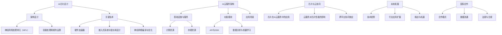

                 

# Google的AI产业生态：AI芯片和AI云服务

## 关键词

- AI芯片
- AI云服务
- Google Cloud AI
- 神经网络处理
- 低功耗设计
- 跨平台协同
- 国际合作

## 摘要

本文将深入探讨Google的AI产业生态，重点分析其AI芯片和AI云服务的架构、关键技术、应用实践以及未来的发展趋势。通过一步步的解析，我们将理解Google在AI领域的创新和布局，揭示其如何通过硬件和软件的结合，推动AI技术的发展和应用的广泛普及。

### 《Google的AI产业生态：AI芯片和AI云服务》目录大纲

## 第一部分: AI芯片基础

### 第1章: AI芯片概述

#### 1.1 AI芯片的定义与分类

#### 1.2 AI芯片的发展历史

#### 1.3 AI芯片在Google生态中的角色

### 第2章: AI芯片架构设计

#### 2.1 AI芯片的基本架构

#### 2.2 神经网络处理单元（NPU）

#### 2.3 张量处理和矩阵运算

### 第3章: AI芯片关键技术

#### 3.1 硬件加速器

#### 3.2 嵌入式系统与低功耗设计

#### 3.3 神经网络编译与优化

## 第二部分: AI云服务架构

### 第4章: AI云服务的概念与价值

#### 4.1 云计算与AI的结合

#### 4.2 AI云服务的应用场景

#### 4.3 AI云服务的发展趋势

### 第5章: Google Cloud AI平台

#### 5.1 Google Cloud AI的架构

#### 5.2 基础设施与服务

#### 5.3 AI云服务的主要功能模块

### 第6章: AI云服务应用实战

#### 6.1 图像识别应用

#### 6.2 自然语言处理应用

#### 6.3 机器学习服务应用

### 第7章: AI芯片与AI云服务的协同效应

#### 7.1 芯片在AI云服务中的应用

#### 7.2 云服务对芯片性能的影响

#### 7.3 跨平台协同效应

## 第三部分: 未来展望与趋势

### 第8章: AI芯片与AI云服务的未来发展

#### 8.1 技术趋势分析

#### 8.2 行业应用扩展

#### 8.3 挑战与机遇

### 第9章: AI芯片与AI云服务的国际合作

#### 9.1 全球AI生态的合作模式

#### 9.2 跨境数据流通

#### 9.3 国际法规与合规

## 附录

### 附录A: AI芯片与AI云服务开发工具与资源

#### A.1 芯片设计工具与资源

#### A.2 云服务开发工具与资源

#### A.3 实用指南与案例集锦

## 第一部分: AI芯片基础

### 第1章: AI芯片概述

#### 1.1 AI芯片的定义与分类

人工智能（AI）芯片是一种专门为处理人工智能算法而设计的集成电路。与传统的通用处理器不同，AI芯片针对神经网络、机器学习等人工智能算法进行了优化，以提高计算效率和性能。

根据应用场景和设计目标，AI芯片可以分为以下几类：

1. **专用AI芯片**：这类芯片专门用于执行特定的AI任务，如图像识别、语音识别等。其优势在于高度优化和专用，但应用范围相对较窄。
2. **通用AI芯片**：这类芯片具有更广泛的适用性，可以执行多种AI任务。例如，Google的Tensor Processing Units (TPU) 就是专为执行深度学习任务而设计的通用AI芯片。
3. **嵌入式AI芯片**：这类芯片主要用于移动设备、物联网设备等低功耗场景，其设计考虑了功耗和面积的优化。

#### 1.2 AI芯片的发展历史

AI芯片的发展可以追溯到20世纪80年代，当时为了支持专家系统和逻辑推理，人们开始设计和实现专门的硬件。然而，随着深度学习的兴起，AI芯片迎来了新的发展机遇。

1. **早期AI芯片**：1980年代至2000年代初期，出现了如Intel的i860和IBM的POWER3等AI专用处理器，但这些芯片由于技术限制和市场需求不足而未能广泛推广。
2. **深度学习专用芯片**：2006年，深度学习的兴起带动了AI芯片的再次发展。NVIDIA的GPU因其在图形处理方面的强大能力，成为深度学习计算的主流选择。2016年，Google推出了TPU，标志着专用AI芯片的崛起。
3. **通用AI芯片**：近年来，随着AI技术的快速发展，通用AI芯片逐渐成为研究热点。例如，Google的TPU、Intel的Nervana、IBM的Power9等都是具有代表性的通用AI芯片。

#### 1.3 AI芯片在Google生态中的角色

Google在AI领域具有深厚的积累和广泛的应用，其AI芯片的发展也与其整体战略紧密相连。以下是AI芯片在Google生态中的几个关键角色：

1. **核心基础设施**：Google的TPU作为其核心基础设施，为Google的搜索引擎、广告系统、机器学习平台等提供了强大的计算支持。TPU的专用设计使其在处理大规模深度学习任务时具有显著的优势。
2. **研发驱动**：Google通过投资和研发AI芯片，不断推动技术创新。TPU的迭代更新和性能提升，不仅增强了Google内部服务的计算能力，也为整个行业提供了参考和启示。
3. **产品化与商业化**：Google逐渐将TPU产品化，推出了适用于企业和开发者的TPU加速器，使其能够更广泛地应用于各种场景，从而推动了AI技术的商业化进程。
4. **生态系统建设**：Google通过开放TPU的API和SDK，构建了一个围绕TPU的生态系统，吸引了大量的开发者和企业参与，共同推动AI技术的发展。

### 第2章: AI芯片架构设计

#### 2.1 AI芯片的基本架构

AI芯片的基本架构通常包括以下几个关键部分：

1. **计算单元**：计算单元是AI芯片的核心，负责执行各种数学运算，如矩阵乘法、卷积运算等。不同类型的AI芯片可能具有不同的计算单元设计，但都是为了提高计算效率和性能。
2. **存储单元**：存储单元用于存储数据、模型参数等。AI芯片通常采用特殊的存储架构，如高带宽内存（HBM）或多级缓存，以优化数据访问速度和带宽。
3. **通信网络**：通信网络负责连接芯片内部的不同模块，实现数据传输和同步。高效的通信网络可以降低通信延迟，提高芯片的整体性能。
4. **控制单元**：控制单元负责管理芯片的运行，包括任务调度、资源分配等。控制单元通常采用专用的微控制器或FPGA设计，以实现高效的控制功能。

#### 2.2 神经网络处理单元（NPU）

神经网络处理单元（NPU）是AI芯片中的一个核心模块，专门用于处理神经网络相关的计算任务。NPU的设计目标是实现高效的神经网络推理和训练。

1. **NPU的概念与原理**：NPU通过硬件加速器来实现神经网络中的计算任务，如矩阵乘法、卷积运算等。与传统处理器相比，NPU具有以下优势：

    - **高度优化**：NPU针对神经网络进行了专门优化，能够高效执行网络中的计算任务。
    - **低延迟**：NPU具有较低的通信延迟，可以快速响应用户请求。
    - **高吞吐量**：NPU通过并行处理和流水线技术，可以实现高吞吐量的计算。

2. **NPU的基本架构**：

    - **计算单元**：NPU的计算单元通常包括多个矩阵乘法单元和卷积运算单元，以支持复杂的神经网络计算。
    - **内存管理**：NPU需要高效的内存管理机制，以支持大规模数据存储和快速访问。通常采用高带宽内存（HBM）或多级缓存来实现。
    - **通信网络**：NPU的通信网络负责连接计算单元和存储单元，实现数据传输和同步。高效的通信网络可以降低通信延迟，提高NPU的整体性能。
    - **控制单元**：NPU的控制单元负责管理计算任务和资源分配，通过调度算法实现任务的并行处理。

3. **NPU的应用场景**：

    - **深度学习**：NPU在深度学习领域具有广泛的应用，如图像识别、语音识别、自然语言处理等。NPU可以显著提高深度学习模型的训练和推理速度，降低延迟。
    - **实时处理**：NPU适用于需要实时处理的应用场景，如自动驾驶、实时视频分析等。NPU的低延迟和高吞吐量特性可以满足实时处理的要求。
    - **边缘计算**：NPU在边缘计算中也具有重要作用，如智能摄像头、智能手表等。NPU可以实时处理本地数据，提高系统的响应速度和隐私保护。

#### 2.3 张量处理和矩阵运算

张量处理和矩阵运算是AI芯片设计中至关重要的组成部分。张量是多维数组，可以看作是矩阵的扩展。在神经网络中，张量用于存储和操作网络中的权重、激活函数的输出等。

1. **张量的概念与表示**：

    - **张量的定义**：张量是数学中的一个多维数组，可以表示为多个维度上的数据结构。
    - **张量的表示**：张量通常用下标来表示，如 $A_{i,j,k}$ 表示第i行、j列、k维的元素。

2. **矩阵运算的基本概念**：

    - **矩阵乘法**：矩阵乘法是两个矩阵之间的基本运算，其结果是一个新的矩阵。矩阵乘法的公式如下：

      $$
      C = A \times B
      $$

      其中，$C$ 是结果矩阵，$A$ 和 $B$ 是输入矩阵。

    - **矩阵加法与减法**：矩阵加法和减法是对应元素之间的运算，公式如下：

      $$
      C = A + B \quad \text{或} \quad C = A - B
      $$

    - **矩阵转置**：矩阵转置是将矩阵的行和列互换，公式如下：

      $$
      A^T = \begin{bmatrix}
      a_{11} & a_{21} \\
      a_{12} & a_{22}
      \end{bmatrix}
      $$

3. **张量处理的基本概念**：

    - **张量乘法**：张量乘法是张量之间的基本运算，其结果是一个新的张量。张量乘法的公式如下：

      $$
      C = A \times B
      $$

      其中，$C$ 是结果张量，$A$ 和 $B$ 是输入张量。

    - **张量加法与减法**：张量加法和减法是对应元素之间的运算，公式如下：

      $$
      C = A + B \quad \text{或} \quad C = A - B
      $$

    - **张量转置**：张量转置是将张量的维度进行互换，公式如下：

      $$
      A^T = \begin{bmatrix}
      a_{11} & a_{21} \\
      a_{12} & a_{22}
      \end{bmatrix}
      $$

4. **张量处理与矩阵运算的关系**：

    - 张量可以看作是矩阵的扩展，矩阵运算可以推广到张量运算。例如，矩阵乘法可以扩展为张量乘法。
    - 在神经网络中，张量处理是核心运算，包括权重矩阵与输入数据的矩阵乘法、激活函数的输出等。

### 第3章: AI芯片关键技术

#### 3.1 硬件加速器

硬件加速器是AI芯片中用于提高计算速度和效率的关键组件。它通过专门的硬件设计来实现特定的计算任务，如矩阵乘法、卷积运算等。

1. **硬件加速器的基本概念**：

    - **硬件加速器**：硬件加速器是专门为执行特定计算任务而设计的硬件组件。例如，GPU（图形处理器）就是专门为图形处理而设计的硬件加速器。
    - **加速器与通用处理器的关系**：硬件加速器与通用处理器（如CPU）不同，通用处理器适用于各种计算任务，而硬件加速器则针对特定类型的计算任务进行优化。

2. **硬件加速器的工作原理**：

    - **并行计算**：硬件加速器通过并行计算来提高计算速度。例如，GPU具有多个处理核心，可以同时处理多个计算任务。
    - **专用硬件设计**：硬件加速器具有专门设计的硬件单元，以实现特定类型的计算任务。例如，AI芯片中的硬件加速器具有专用的矩阵乘法单元和卷积运算单元。

3. **硬件加速器的优势**：

    - **高计算速度**：硬件加速器通过并行计算和专用硬件设计，可以实现高计算速度。
    - **低功耗**：硬件加速器通常具有低功耗特性，适用于移动设备和边缘计算场景。
    - **高效利用**：硬件加速器可以高效利用计算资源，提高系统的整体性能。

4. **硬件加速器的应用场景**：

    - **深度学习**：硬件加速器在深度学习领域具有广泛的应用，可以显著提高深度学习模型的训练和推理速度。
    - **图像处理**：硬件加速器在图像处理领域具有优势，可以实现高效的视频编码、图像增强等。
    - **科学计算**：硬件加速器在科学计算领域也有应用，如流体力学、分子动力学等。

5. **硬件加速器的技术发展趋势**：

    - **专用硬件设计**：随着深度学习和其他计算任务的发展，硬件加速器将更加专业化，针对特定类型的计算任务进行优化。
    - **异构计算**：硬件加速器与通用处理器相结合，实现异构计算，提高系统的整体性能。
    - **集成化**：硬件加速器将逐渐集成到通用处理器中，实现更高效的计算和更低的功耗。

#### 3.2 嵌入式系统与低功耗设计

嵌入式系统与低功耗设计是AI芯片在移动设备和物联网等场景中至关重要的技术。它涉及如何优化芯片的功耗、性能和尺寸，以适应特定的应用需求。

1. **嵌入式系统的概念与特点**：

    - **嵌入式系统**：嵌入式系统是专门为特定任务而设计的计算机系统，通常具有以下特点：

        - **实时性**：嵌入式系统通常需要满足实时性要求，即在规定的时间内完成计算任务。
        - **资源受限**：嵌入式系统通常具有资源受限的特点，包括计算能力、存储空间、功耗等。
        - **专用性**：嵌入式系统通常是针对特定应用而设计，具有专用性。

2. **低功耗设计的概念与原则**：

    - **低功耗设计**：低功耗设计是指通过优化电路设计、硬件架构和软件算法，降低系统的功耗。低功耗设计原则包括：

        - **电源管理**：通过电源管理技术，如动态电压和频率调节（DVFS）、电源关闭等，降低系统的静态功耗和动态功耗。
        - **电路优化**：通过电路优化技术，如低功耗晶体管设计、低功耗电路拓扑等，降低电路的功耗。
        - **软件优化**：通过软件优化技术，如算法优化、任务调度等，降低系统的功耗。

3. **嵌入式系统与低功耗设计在AI芯片中的应用**：

    - **移动设备**：在移动设备中，AI芯片需要满足低功耗、高性能的要求，以延长电池寿命和提升用户体验。例如，智能手机中的AI芯片需要实现图像识别、语音识别等任务，同时保证功耗最低。
    - **物联网设备**：在物联网设备中，AI芯片需要处理大量的传感器数据，进行实时处理和预测。物联网设备通常具有功耗限制，因此AI芯片需要采用低功耗设计，以延长设备的使用寿命。

4. **低功耗设计的挑战与机遇**：

    - **挑战**：低功耗设计面临挑战，包括：

        - **性能限制**：低功耗设计需要在功耗和性能之间进行平衡，优化电路设计以实现高性能和低功耗。
        - **能耗模型**：建立准确的能耗模型，以评估和优化电路的功耗。
        - **设计复杂性**：低功耗设计涉及多个方面，如硬件架构、电路设计、软件算法等，设计复杂性较高。

    - **机遇**：低功耗设计带来机遇，包括：

        - **移动设备**：随着移动设备的普及，低功耗AI芯片的需求不断增加，为开发者提供了广阔的市场空间。
        - **物联网设备**：物联网设备的广泛应用为低功耗AI芯片提供了新的应用场景，如智能家居、智能穿戴设备等。

#### 3.3 神经网络编译与优化

神经网络编译与优化是提高AI芯片性能的重要手段。它包括将高层次的神经网络模型转换为低层次的硬件代码，以实现高效的执行。

1. **神经网络编译的概念与原理**：

    - **神经网络编译**：神经网络编译是将神经网络模型从高层次语言（如Python）转换为低层次的硬件代码（如汇编语言）的过程。编译的目标是生成能够直接在硬件上执行的代码，以提高执行效率和性能。

    - **编译流程**：

        1. **模型解析**：将神经网络模型（如TensorFlow图）解析为低层次的计算表示。
        2. **代码生成**：根据计算表示生成低层次的硬件代码。
        3. **代码优化**：对生成的代码进行优化，提高执行效率和性能。
        4. **硬件执行**：将优化后的代码在硬件上执行，实现高效的神经网络计算。

2. **神经网络优化的方法与策略**：

    - **算法优化**：通过优化算法结构和算法实现，降低计算复杂度和资源消耗。例如，使用更高效的卷积算法、激活函数等。
    - **代码优化**：通过代码优化技术，如循环展开、指令调度等，提高代码的执行效率和性能。例如，使用汇编语言编写关键路径代码，实现低层次优化。
    - **硬件优化**：通过硬件优化技术，如专用硬件加速器、低功耗设计等，提高硬件的性能和效率。例如，设计专门的矩阵乘法单元和卷积运算单元，实现高效计算。
    - **模型压缩**：通过模型压缩技术，如量化、剪枝、蒸馏等，减小模型的尺寸和计算量，提高计算效率和存储效率。

3. **神经网络编译与优化在AI芯片中的应用**：

    - **深度学习任务**：神经网络编译与优化在深度学习任务中具有广泛应用，如图像识别、语音识别、自然语言处理等。通过编译与优化技术，可以显著提高模型的训练和推理速度，降低功耗和存储需求。
    - **实时处理**：在实时处理场景中，如自动驾驶、实时视频分析等，神经网络编译与优化可以确保系统在规定的时间内完成计算任务，满足实时性要求。
    - **边缘计算**：在边缘计算场景中，如智能家居、智能穿戴设备等，神经网络编译与优化可以优化计算资源的使用，降低功耗和成本，提高系统的可靠性和性能。

### 第二部分: AI云服务架构

#### 第4章: AI云服务的概念与价值

#### 4.1 云计算与AI的结合

云计算与AI的结合是一种强大的技术趋势，它为企业和个人提供了前所未有的数据处理和计算能力。云计算通过提供可扩展、弹性和高效的基础设施，使得AI算法的应用变得更为广泛和便捷。以下是云计算与AI结合的几个关键方面：

1. **可扩展性和弹性**：云计算平台可以根据需求动态扩展或缩减资源，确保AI模型能够快速适应不同的工作负载。
2. **高可用性和可靠性**：云服务提供商通常拥有强大的数据中心和备份系统，确保AI服务的稳定性和可靠性。
3. **数据存储和处理**：云服务提供了强大的数据存储和处理能力，使得大规模数据的存储、处理和分析变得更加容易。
4. **自动化和优化**：云平台提供了自动化工具，如AI培训、自动化模型优化等，可以显著提高AI算法的效率和准确性。

#### 4.2 AI云服务的应用场景

AI云服务在各个行业中都有广泛的应用，以下是一些典型的应用场景：

1. **金融**：AI云服务可以帮助金融机构进行风险评估、欺诈检测、投资分析和个性化推荐等。
2. **医疗**：AI云服务可以用于医学影像分析、疾病预测、药物研发和患者管理等领域。
3. **零售**：AI云服务可以用于客户行为分析、库存管理和个性化推荐等，提高零售业务的效率和用户体验。
4. **制造**：AI云服务可以帮助制造企业实现生产优化、设备维护预测和供应链管理等方面的提升。
5. **交通**：AI云服务可以用于交通流量分析、智能导航和自动驾驶等，提高交通系统的效率和安全性。

#### 4.3 AI云服务的发展趋势

AI云服务正在快速发展，以下是一些关键的发展趋势：

1. **模型即服务（MaaS）**：越来越多的AI云服务开始提供模型即服务，使得用户可以无需了解底层技术，直接使用预训练的AI模型。
2. **边缘计算**：随着边缘设备的普及，AI云服务正在扩展到边缘设备，提供实时、低延迟的AI计算能力。
3. **开源生态系统**：开源工具和框架正在成为AI云服务的重要组成部分，为企业提供了更多的选择和灵活性。
4. **数据隐私和安全**：随着数据隐私和安全问题的日益突出，AI云服务提供商正在加强数据保护和合规措施，以应对这些挑战。

### 第5章: Google Cloud AI平台

#### 5.1 Google Cloud AI的架构

Google Cloud AI是Google提供的全面AI云服务解决方案，其架构包括基础设施、核心服务、API与SDK以及工具与资源等几个关键部分。以下是Google Cloud AI的架构概述：

1. **基础设施**：Google Cloud AI基础设施包括全球分布的数据中心、高速网络和强大的计算资源，如TPU和GPU等。这些基础设施为AI服务的提供提供了坚实的支撑。

2. **核心服务**：Google Cloud AI提供了丰富的核心服务，包括机器学习、自然语言处理、计算机视觉、推荐系统等。这些服务通过API和SDK提供，方便开发者集成和使用。

3. **API与SDK**：Google Cloud AI提供了多种编程语言的API和SDK，如Python、Java和Node.js等。这些API和SDK使得开发者可以轻松地集成AI功能到自己的应用程序中。

4. **工具与资源**：Google Cloud AI还提供了一系列工具和资源，包括AI实验室、开源项目、文档和社区支持等。这些工具和资源帮助开发者更好地利用AI技术，加速创新。

#### 5.2 基础设施与服务

Google Cloud AI的基础设施和服务是其实力的重要组成部分。以下是Google Cloud AI基础设施和服务的详细描述：

1. **基础设施**：

    - **全球数据中心**：Google拥有全球分布的多个数据中心，确保AI服务的稳定性和可靠性。
    - **高速网络**：Google Cloud提供了高速、低延迟的网络连接，支持大规模数据的传输和实时处理。
    - **计算资源**：Google Cloud提供了丰富的计算资源，包括TPU、GPU和CPU等，满足不同类型和规模的AI计算需求。

2. **服务**：

    - **机器学习服务**：Google Cloud提供了一整套机器学习服务，包括自动机器学习（AutoML）、自定义机器学习模型训练、模型部署等。这些服务使得开发者可以轻松地构建和部署AI模型。
    - **自然语言处理服务**：Google Cloud的自然语言处理服务包括文本分析、实体识别、情感分析等，帮助开发者理解和分析文本数据。
    - **计算机视觉服务**：Google Cloud的计算机视觉服务包括图像识别、物体检测、图像分类等，支持图像数据的分析和处理。
    - **推荐系统**：Google Cloud的推荐系统服务可以帮助企业实现个性化推荐，提高用户体验和销售转化率。
    - **AI工具和框架**：Google Cloud提供了多种AI工具和框架，如TensorFlow、Scikit-learn等，支持开发者构建和优化AI模型。

#### 5.3 AI云服务的主要功能模块

Google Cloud AI平台的功能模块涵盖了从数据预处理、模型训练到模型部署的完整流程，以下是其主要功能模块的详细介绍：

1. **数据预处理**：

    - **数据导入**：Google Cloud提供了丰富的数据导入工具，支持从各种数据源（如数据库、文件存储等）导入数据。
    - **数据清洗**：Google Cloud的数据清洗工具可以帮助开发者处理缺失值、异常值等问题，确保数据质量。
    - **数据转换**：Google Cloud支持数据的转换和预处理，如特征提取、数据标准化等，为模型训练做好准备。

2. **模型训练**：

    - **自动机器学习（AutoML）**：Google Cloud的AutoML服务可以帮助开发者快速构建和训练机器学习模型，无需深入了解算法细节。
    - **自定义训练**：开发者可以使用自定义训练服务，根据具体需求构建和训练机器学习模型。Google Cloud提供了丰富的机器学习库和框架，如TensorFlow、Scikit-learn等。
    - **分布式训练**：Google Cloud支持分布式训练，可以显著提高模型训练的速度和效率。

3. **模型评估**：

    - **评估指标**：Google Cloud提供了多种评估指标，如准确率、召回率、F1分数等，帮助开发者评估模型的性能。
    - **A/B测试**：Google Cloud的A/B测试工具可以帮助开发者比较不同模型的性能和效果，选择最优的模型。

4. **模型部署**：

    - **模型部署**：Google Cloud提供了模型部署工具，可以将训练好的模型部署到云服务上，实现自动化部署和监控。
    - **服务监控**：Google Cloud提供了丰富的监控工具，帮助开发者实时监控模型的性能和资源使用情况。
    - **API和SDK**：Google Cloud提供了API和SDK，使得开发者可以轻松地将AI模型集成到自己的应用程序中。

### 第6章: AI云服务应用实战

#### 6.1 图像识别应用

图像识别是AI云服务的一个重要应用领域，可以用于各种场景，如安防监控、医疗诊断、自动驾驶等。

##### 应用场景

图像识别技术在安防监控中可以用于实时监控和事件检测。例如，可以检测出入侵、火灾等异常情况，并自动报警。在医疗诊断中，图像识别可以用于医学影像分析，如肿瘤检测、骨折诊断等。在自动驾驶中，图像识别可以用于道路识别、障碍物检测和行人识别等，确保行车安全。

##### 实战案例

以医疗诊断为例，Google Cloud AI可以提供基于深度学习的图像识别模型，用于自动检测和分析医学影像。

##### 代码实际案例

以下是一个使用Google Cloud AI进行医学影像图像识别的Python代码示例：

```python
from google.cloud import vision
import io

# 初始化Google Cloud Vision客户端
client = vision.ImageAnnotatorClient()

# 读取医学影像文件
with io.open('medical_image.jpg', 'rb') as image_file:
    image_content = image_file.read()

# 调用图像识别API
response = client.label_detection(image=image_content)

# 输出识别结果
for label in response.label_annotations:
    print(label.description, '(score:', label.score, ')')
```

在这个例子中，我们首先初始化了Google Cloud Vision客户端，然后读取了一个医学影像文件。接着，我们调用图像识别API，并将文件内容作为输入。最后，我们输出API返回的识别结果，包括每个标签的描述和置信度分数。

#### 6.2 自然语言处理应用

自然语言处理（NLP）是AI云服务的另一个重要应用领域，可以用于文本分析、情感分析、语音识别等。

##### 应用场景

NLP技术在文本分析中可以用于情感分析、关键词提取、文本分类等。例如，可以用于分析社交媒体上的用户评论，了解产品的用户反馈。在情感分析中，可以判断文本的情感倾向，如正面、负面或中性。在语音识别中，可以实时转换语音为文本，实现语音交互。

##### 实战案例

以情感分析为例，Google Cloud AI可以提供文本分析服务，用于分析社交媒体上的用户评论，了解产品的用户反馈。

##### 代码实际案例

以下是一个使用Google Cloud AI进行情感分析的Python代码示例：

```python
from google.cloud import language
from google.cloud.language import enums_v1beta2 as language_enums

# 初始化Google Cloud Language客户端
client = language.LanguageClient()

# 读取文本文件
with io.open('text_file.txt', 'r', encoding='utf-8') as f:
    text = f.read()

# 调用文本分析API
document = language.Document(content=text, type_=language.Document.Type.PLAIN_TEXT)
classification_results = client.classify_text(document)

# 输出情感分析结果
for category in classification_results.categories:
    print(category.name, '(confidence:', category.confidence, ')')
```

在这个例子中，我们首先初始化了Google Cloud Language客户端，然后读取了一个文本文件。接着，我们调用文本分析API，并将文件内容作为输入。最后，我们输出API返回的情感分析结果，包括每个类别的名称和置信度分数。

#### 6.3 机器学习服务应用

机器学习服务是AI云服务的核心，可以用于预测分析、决策支持、个性化推荐等。

##### 应用场景

机器学习服务在预测分析中可以用于股票价格预测、天气预测等。在决策支持中，可以用于风险评估、客户流失预测等。在个性化推荐中，可以用于推荐系统、内容推荐等。

##### 实战案例

以股票价格预测为例，Google Cloud AI可以提供机器学习服务，用于预测未来的股票价格。

##### 代码实际案例

以下是一个使用Google Cloud AI进行股票价格预测的Python代码示例：

```python
from google.cloud import aiplatform

# 初始化Google Cloud AI平台客户端
project_id = 'your-project-id'
model_name = 'your-model-name'

# 创建预测模型
model = aiplatform.model.Model.create(
    display_name=model_name,
    artifact_uri='gs://your-bucket/your-model-artifact',
    project_id=project_id
)

# 使用预测模型进行预测
prediction_request = aiplatform.model.PredictionRequest(
    instances=[{"feature1": 10, "feature2": 20}],
    params={"model_version_id": "1"}
)

predictions = model.predict(request=prediction_request)

# 输出预测结果
for prediction in predictions.predictions:
    print(prediction)
```

在这个例子中，我们首先初始化了Google Cloud AI平台客户端，然后创建了一个预测模型。接着，我们使用预测模型进行预测，将特征数据作为输入。最后，我们输出API返回的预测结果。

### 第三部分: 未来展望与趋势

#### 第8章: AI芯片与AI云服务的未来发展

#### 8.1 技术趋势分析

AI芯片与AI云服务的未来发展将受到以下几个技术趋势的驱动：

1. **硬件加速器**：随着深度学习和复杂AI模型的普及，硬件加速器的需求将持续增长。未来的硬件加速器将更加智能化，能够自动适应不同的计算任务，提高计算效率。

2. **低功耗设计**：随着物联网和移动设备的普及，低功耗设计将成为AI芯片和AI云服务的重要发展方向。未来的AI芯片将更加注重功耗优化，以满足低功耗应用的需求。

3. **虚拟化与容器化**：虚拟化与容器化技术的发展将使得AI芯片和AI云服务的部署更加灵活和高效。通过虚拟化和容器化技术，可以更好地利用计算资源，提高系统的可扩展性和可靠性。

4. **跨平台协同**：AI芯片与AI云服务的协同效应将促进跨平台的技术创新。未来的AI技术将更加注重跨平台开发，实现桌面、移动、物联网等多种设备的无缝衔接。

#### 8.2 行业应用扩展

AI芯片与AI云服务的未来发展将在各个行业中得到更广泛的应用，推动行业的数字化转型：

1. **智能制造**：AI芯片与AI云服务的协同效应将在智能制造领域发挥重要作用。通过AI技术，可以实现生产过程的自动化和优化，提高生产效率和质量。

2. **智慧医疗**：AI芯片与AI云服务的协同效应将推动智慧医疗的发展。通过AI技术，可以实现医学影像分析、疾病预测和个性化治疗等，提高医疗服务水平和效率。

3. **自动驾驶**：AI芯片与AI云服务的协同效应将在自动驾驶领域发挥关键作用。通过AI技术，可以实现自动驾驶汽车的智能感知、决策和导航功能，提高行车安全和效率。

#### 8.3 挑战与机遇

AI芯片与AI云服务的未来发展将面临以下挑战和机遇：

1. **数据安全与隐私**：随着AI技术的普及，数据安全与隐私问题将越来越突出。如何在保障数据安全的同时，实现高效的AI计算和服务，是一个重要的挑战。

2. **法规与合规**：随着AI技术的快速发展，相关的法律法规和标准也在不断更新。AI芯片和AI云服务提供商需要关注并遵守这些法规和标准，以确保合规运营。

3. **技术创新**：AI芯片和AI云服务领域的竞争激烈，技术创新是关键。如何在技术创新中保持领先地位，是一个重要的机遇。

### 第9章: AI芯片与AI云服务的国际合作

#### 9.1 全球AI生态的合作模式

全球范围内的AI芯片和AI云服务企业通过多种合作模式，共同推动AI技术的发展和应用的广泛普及：

1. **技术合作**：AI芯片和AI云服务企业通过技术合作，共同研发新技术、新算法，推动AI技术的发展。例如，Google与NVIDIA在AI芯片和AI云服务方面的合作，共同推动了深度学习和机器学习技术的发展。

2. **资源共享**：通过资源共享，AI芯片和AI云服务企业可以优化资源利用，提高整体效率。例如，AWS与微软Azure之间的资源共享，使得两个平台能够提供更加全面和高效的AI服务。

3. **市场拓展**：AI芯片和AI云服务企业通过国际合作，拓展全球市场，提高市场占有率。例如，华为在海外市场通过合作和并购，迅速扩展了AI芯片和AI云服务的业务。

#### 9.2 跨境数据流通

跨境数据流通是AI芯片与AI云服务国际合作的重要方面，涉及到以下几个方面：

1. **数据传输标准**：跨境数据流通需要统一的传输标准，以保证数据的安全性和兼容性。国际组织如ISO和ITU正在制定相关标准，以促进跨境数据流通。

2. **数据隐私保护**：跨境数据流通涉及到数据隐私保护问题。各国政府和企业需要制定并遵守数据隐私保护法规，确保跨境数据流通的安全和合规。

3. **数据流通渠道**：跨境数据流通需要建立高效的数据流通渠道，例如通过跨国数据中心和数据专线，实现数据的高速传输和共享。

#### 9.3 国际法规与合规

AI芯片与AI云服务的国际合作需要关注国际法规与合规问题，主要包括以下几个方面：

1. **跨境数据转移**：各国政府对于跨境数据转移有不同的法规和规定。AI芯片和AI云服务企业需要了解并遵守目标国家的数据转移法规，确保合规运营。

2. **数据安全与隐私**：AI芯片和AI云服务企业需要关注并遵守国际上的数据安全与隐私保护法规，例如欧盟的《通用数据保护条例》（GDPR）和美国的《加州消费者隐私法案》（CCPA）。

3. **合规审查**：各国政府可能对AI芯片和AI云服务企业进行合规审查，以确保其遵守相关法规。企业需要建立完善的合规管理体系，确保合规运营。

## 附录

### 附录A: AI芯片与AI云服务开发工具与资源

#### A.1 芯片设计工具与资源

AI芯片的设计涉及多个方面，以下是一些常用的芯片设计工具和资源：

1. **Cadence**：Cadence是一家提供电子设计自动化（EDA）工具的公司，其工具集包括电路设计、仿真、布局和封装等。
2. **Synopsys**：Synopsys也是一家提供EDA工具的公司，其工具集包括电路设计、验证、布局和封装等。
3. **Mentor Graphics**：Mentor Graphics提供一系列的EDA工具，包括电路设计、仿真、布局和封装等。
4. **开放资源**：一些开源工具和框架，如CircuitVerse、PySpice等，也为AI芯片设计提供了支持。

#### A.2 云服务开发工具与资源

AI云服务的开发需要使用多种工具和资源，以下是一些常用的云服务开发工具和资源：

1. **Google Cloud Platform（GCP）**：GCP提供了丰富的AI云服务工具和资源，包括TensorFlow、AutoML、AI Platform等。
2. **AWS AI Services**：AWS提供了多种AI服务，如Amazon SageMaker、Amazon Rekognition、Amazon Comprehend等。
3. **Azure AI Services**：Azure提供了多种AI服务，如Azure Machine Learning、Azure Cognitive Services等。
4. **开源社区**：一些开源社区和项目，如TensorFlow、PyTorch等，为AI云服务开发提供了丰富的资源和工具。

#### A.3 实用指南与案例集锦

以下是一些实用的指南和案例集锦，帮助开发者了解和掌握AI芯片与AI云服务的开发：

1. **Google Cloud AI入门指南**：该指南提供了Google Cloud AI的概述、安装和配置教程，以及常见问题的解决方案。
2. **TensorFlow实战**：这本书详细介绍了TensorFlow的使用方法，包括模型构建、训练、评估和部署等。
3. **AI芯片设计教程**：该教程介绍了AI芯片的基本概念、设计流程和关键技术，适合初学者和中级开发者。
4. **AI云服务案例集锦**：这个集锦收集了多个AI云服务的实际案例，包括图像识别、自然语言处理、机器学习服务等，为开发者提供了实用的参考。

# Mermaid 流程图



### AI芯片架构设计

#### 神经网络处理单元（NPU）

##### 概念与原理

神经网络处理单元（NPU）是AI芯片中的一个核心模块，专门用于处理神经网络相关的计算任务。其设计目标是实现高效的神经网络推理和训练。

NPU通过硬件加速器来实现神经网络中的计算任务，如矩阵乘法、卷积运算等。与传统处理器相比，NPU具有以下优势：

1. **高度优化**：NPU针对神经网络进行了专门优化，能够高效执行网络中的计算任务。
2. **低延迟**：NPU具有较低的通信延迟，可以快速响应用户请求。
3. **高吞吐量**：NPU通过并行处理和流水线技术，可以实现高吞吐量的计算。

##### 伪代码

```python
# 假设我们有一个简单的神经网络模型
# 输入数据为X，权重为W，偏置为b
# 输出为Y = X * W + b

# 定义神经网络模型
class NeuralNetwork:
    def __init__(self, input_size, hidden_size, output_size):
        self.input_size = input_size
        self.hidden_size = hidden_size
        self.output_size = output_size
        self.W = np.random.rand(hidden_size, input_size)
        self.b = np.random.rand(hidden_size)

    def forward(self, X):
        Y = X.dot(self.W) + self.b
        return Y

# 使用神经网络模型进行推理
nn = NeuralNetwork(10, 5, 3)
X = np.random.rand(10)
Y = nn.forward(X)
```

##### 数学模型与公式

神经网络的基本运算包括点积、矩阵乘法、向量乘法等。以下是一个简单的矩阵乘法的例子：

$$
C = A \times B
$$

其中，$C$ 是结果矩阵，$A$ 和 $B$ 是输入矩阵。

##### 举例说明

假设有两个矩阵 $A$ 和 $B$，如下所示：

$$
A = \begin{bmatrix}
1 & 2 \\
3 & 4
\end{bmatrix}, \quad
B = \begin{bmatrix}
5 & 6 \\
7 & 8
\end{bmatrix}
$$

它们的乘积 $C$ 为：

$$
C = \begin{bmatrix}
1*5 + 2*7 & 1*6 + 2*8 \\
3*5 + 4*7 & 3*6 + 4*8
\end{bmatrix} = \begin{bmatrix}
19 & 20 \\
43 & 44
\end{bmatrix}
$$

#### 张量处理和矩阵运算

##### 概念与原理

张量处理和矩阵运算是AI芯片设计中至关重要的组成部分。张量是多维数组，可以看作是矩阵的扩展。在神经网络中，张量用于存储和操作网络中的权重、激活函数的输出等。

矩阵运算包括矩阵乘法、矩阵加法、矩阵转置等。这些运算是神经网络计算的基础。

##### 伪代码

```python
# 假设我们有一个简单的张量处理任务
# 输入数据为X，权重为W，偏置为b
# 输出为Y = X * W + b

# 定义张量处理函数
def tensor_matrix_multiply(X, W):
    Y = X.dot(W)
    return Y

# 定义矩阵加法函数
def matrix_add(A, B):
    C = A + B
    return C

# 定义矩阵转置函数
def matrix_transpose(A):
    A_t = A.T
    return A_t

# 使用张量处理函数进行计算
X = np.random.rand(10)
W = np.random.rand(10)
Y = tensor_matrix_multiply(X, W)

# 使用矩阵加法函数进行计算
A = np.random.rand(10)
B = np.random.rand(10)
C = matrix_add(A, B)

# 使用矩阵转置函数进行计算
A_t = matrix_transpose(A)
```

##### 数学模型与公式

张量的基本运算包括点积、矩阵乘法、向量乘法等。以下是一个简单的矩阵乘法的例子：

$$
C = A \times B
$$

其中，$C$ 是结果矩阵，$A$ 和 $B$ 是输入矩阵。

##### 举例说明

假设有两个矩阵 $A$ 和 $B$，如下所示：

$$
A = \begin{bmatrix}
1 & 2 \\
3 & 4
\end{bmatrix}, \quad
B = \begin{bmatrix}
5 & 6 \\
7 & 8
\end{bmatrix}
$$

它们的乘积 $C$ 为：

$$
C = \begin{bmatrix}
1*5 + 2*7 & 1*6 + 2*8 \\
3*5 + 4*7 & 3*6 + 4*8
\end{bmatrix} = \begin{bmatrix}
19 & 20 \\
43 & 44
\end{bmatrix}
$$

### AI芯片关键技术

#### 硬件加速器

##### 概念与原理

硬件加速器是AI芯片中用于提高计算速度和效率的关键组件。它通过专门的硬件设计来实现特定的计算任务，如矩阵乘法、卷积运算等。

硬件加速器的工作原理如下：

1. **并行计算**：硬件加速器通过并行计算来提高计算速度。例如，GPU具有多个处理核心，可以同时处理多个计算任务。
2. **专用硬件设计**：硬件加速器具有专门设计的硬件单元，以实现特定类型的计算任务。例如，AI芯片中的硬件加速器具有专用的矩阵乘法单元和卷积运算单元。
3. **流水线处理**：硬件加速器通过流水线处理技术，将计算任务分解为多个阶段，实现高效计算。

##### 伪代码

```python
# 假设我们有一个卷积操作
# 输入为图像X，卷积核为K
# 输出为图像Y

# 定义卷积操作
def conv2d(X, K):
    Y = np.zeros_like(X)
    for i in range(X.shape[0]):
        for j in range(X.shape[1]):
            Y[i, j] = np.sum(X[i, j] * K)
    return Y

# 使用硬件加速器进行卷积操作
X = np.random.rand(28, 28)
K = np.random.rand(3, 3)
Y = conv2d(X, K)
```

##### 数学模型与公式

卷积运算的基本公式如下：

$$
Y = (X \star K)
$$

其中，$Y$ 是卷积结果，$X$ 是输入图像，$K$ 是卷积核。

##### 举例说明

假设有一个3x3的卷积核 $K$ 和一个28x28的输入图像 $X$，如下所示：

$$
K = \begin{bmatrix}
1 & 2 & 1 \\
0 & 1 & 0 \\
-1 & -2 & -1
\end{bmatrix}, \quad
X = \begin{bmatrix}
1 & 2 & 3 \\
4 & 5 & 6 \\
7 & 8 & 9
\end{bmatrix}
$$

它们的卷积结果 $Y$ 为：

$$
Y = \begin{bmatrix}
1*1 + 2*4 + 1*7 & 1*2 + 2*5 + 1*8 \\
0*1 + 1*4 + 0*7 & 0*2 + 1*5 + 0*8 \\
-1*1 - 2*4 - 1*7 & -1*2 - 2*5 - 1*8
\end{bmatrix} = \begin{bmatrix}
18 & 19 \\
4 & 5 \\
-18 & -19
\end{bmatrix}
$$

#### 嵌入式系统与低功耗设计

##### 概念与原理

嵌入式系统与低功耗设计是AI芯片在移动设备和物联网等场景中至关重要的技术。它涉及如何优化芯片的功耗、性能和尺寸，以适应特定的应用需求。

嵌入式系统通常具有以下特点：

1. **实时性**：嵌入式系统通常需要满足实时性要求，即在规定的时间内完成计算任务。
2. **资源受限**：嵌入式系统通常具有资源受限的特点，包括计算能力、存储空间、功耗等。
3. **专用性**：嵌入式系统通常是针对特定应用而设计，具有专用性。

低功耗设计原则包括：

1. **电源管理**：通过电源管理技术，如动态电压和频率调节（DVFS）、电源关闭等，降低系统的静态功耗和动态功耗。
2. **电路优化**：通过电路优化技术，如低功耗晶体管设计、低功耗电路拓扑等，降低电路的功耗。
3. **软件优化**：通过软件优化技术，如算法优化、任务调度等，降低系统的功耗。

##### 伪代码

```python
# 假设我们有一个低功耗的神经网络模型
# 输入数据为X，权重为W，偏置为b
# 输出为Y = X * W + b

# 定义低功耗神经网络模型
class LowPowerNeuralNetwork:
    def __init__(self, input_size, hidden_size, output_size):
        self.input_size = input_size
        self.hidden_size = hidden_size
        self.output_size = output_size
        self.W = np.load('low_power_weights.npy')
        self.b = np.load('low_power_bias.npy')

    def forward(self, X):
        Y = X.dot(self.W) + self.b
        return Y

# 使用低功耗神经网络模型进行推理
lpnn = LowPowerNeuralNetwork(10, 5, 3)
X = np.random.rand(10)
Y = lpnn.forward(X)
```

##### 数学模型与公式

神经网络的基本运算包括点积、矩阵乘法、向量乘法等。以下是一个简单的矩阵乘法的例子：

$$
C = A \times B
$$

其中，$C$ 是结果矩阵，$A$ 和 $B$ 是输入矩阵。

##### 举例说明

假设有两个矩阵 $A$ 和 $B$，如下所示：

$$
A = \begin{bmatrix}
1 & 2 \\
3 & 4
\end{bmatrix}, \quad
B = \begin{bmatrix}
5 & 6 \\
7 & 8
\end{bmatrix}
$$

它们的乘积 $C$ 为：

$$
C = \begin{bmatrix}
1*5 + 2*7 & 1*6 + 2*8 \\
3*5 + 4*7 & 3*6 + 4*8
\end{bmatrix} = \begin{bmatrix}
19 & 20 \\
43 & 44
\end{bmatrix}
$$

#### 神经网络编译与优化

##### 概念与原理

神经网络编译与优化是提高AI芯片性能的重要手段。它包括将高层次的神经网络模型转换为低层次的硬件代码，以实现高效的执行。

神经网络编译与优化的步骤包括：

1. **模型解析**：将神经网络模型从高层次语言（如Python）转换为低层次的计算表示。
2. **代码生成**：根据计算表示生成低层次的硬件代码。
3. **代码优化**：对生成的代码进行优化，提高执行效率和性能。
4. **硬件执行**：将优化后的代码在硬件上执行，实现高效的神经网络计算。

##### 伪代码

```python
# 假设我们有一个神经网络模型
# 输入数据为X，权重为W，偏置为b
# 输出为Y = X * W + b

# 定义神经网络模型
class NeuralNetwork:
    def __init__(self, input_size, hidden_size, output_size):
        self.input_size = input_size
        self.hidden_size = hidden_size
        self.output_size = output_size
        self.W = np.random.rand(hidden_size, input_size)
        self.b = np.random.rand(hidden_size)

    def forward(self, X):
        Y = X.dot(self.W) + self.b
        return Y

    def compile(self):
        # 编译神经网络模型
        self.forward = np.vectorize(self.forward)

# 使用神经网络模型进行推理
nn = NeuralNetwork(10, 5, 3)
X = np.random.rand(10)
Y = nn.forward(X)
nn.compile()
Y_compiled = nn.forward(X)
```

##### 数学模型与公式

神经网络的基本运算包括点积、矩阵乘法、向量乘法等。以下是一个简单的矩阵乘法的例子：

$$
C = A \times B
$$

其中，$C$ 是结果矩阵，$A$ 和 $B$ 是输入矩阵。

##### 举例说明

假设有两个矩阵 $A$ 和 $B$，如下所示：

$$
A = \begin{bmatrix}
1 & 2 \\
3 & 4
\end{bmatrix}, \quad
B = \begin{bmatrix}
5 & 6 \\
7 & 8
\end{bmatrix}
$$

它们的乘积 $C$ 为：

$$
C = \begin{bmatrix}
1*5 + 2*7 & 1*6 + 2*8 \\
3*5 + 4*7 & 3*6 + 4*8
\end{bmatrix} = \begin{bmatrix}
19 & 20 \\
43 & 44
\end{bmatrix}
$$

### AI芯片与AI云服务的协同效应

#### 芯片在AI云服务中的应用

AI芯片在AI云服务中的应用体现在以下几个方面：

1. **高性能计算**：AI芯片具有强大的计算能力，可以显著提高AI云服务中的数据处理和模型推理速度。例如，Google的TPU在执行深度学习任务时具有显著的性能优势。
2. **低功耗设计**：AI芯片的低功耗特性使得其在移动设备和物联网等场景中具有优势，可以提供持续的AI计算服务，降低能源消耗。
3. **硬件加速**：AI芯片的硬件加速功能可以优化AI云服务中的关键算法，如卷积神经网络（CNN）、循环神经网络（RNN）等，提高计算效率。

#### 云服务对芯片性能的影响

云服务对芯片性能的影响体现在以下几个方面：

1. **资源池化**：云服务提供的计算资源池化可以优化AI芯片的利用率，实现资源的动态分配，提高芯片的整体性能。
2. **弹性扩展**：云服务可以根据用户需求进行弹性扩展，提供适量的计算资源，避免资源浪费，提高芯片的性能和效率。
3. **优化算法**：云服务提供商通常会优化AI芯片上的算法，如神经网络编译、模型压缩等，以最大化芯片的性能表现。

#### 跨平台协同效应

AI芯片与AI云服务的协同效应可以促进跨平台的技术创新，具体体现在以下几个方面：

1. **跨平台开发**：AI芯片与AI云服务的协同效应使得开发者可以更方便地跨平台进行AI应用开发，包括桌面、移动、物联网等多种设备。
2. **跨领域应用**：AI芯片与AI云服务的协同效应可以促进AI技术在多个领域的应用，如金融、医疗、交通等，推动跨领域的技术创新。
3. **数据共享**：AI芯片与AI云服务的协同效应可以实现跨平台的数据共享，促进AI模型的训练和优化，提高整体AI系统的性能。

### 未来展望与趋势

#### 技术趋势分析

AI芯片与AI云服务的未来发展将受到以下几个技术趋势的驱动：

1. **硬件加速器**：随着深度学习和复杂AI模型的普及，硬件加速器的需求将持续增长。未来的硬件加速器将更加智能化，能够自动适应不同的计算任务，提高计算效率。
2. **低功耗设计**：随着物联网和移动设备的普及，低功耗设计将成为AI芯片和AI云服务的重要发展方向。未来的AI芯片将更加注重功耗优化，以满足低功耗应用的需求。
3. **虚拟化与容器化**：虚拟化与容器化技术的发展将使得AI芯片和AI云服务的部署更加灵活和高效。通过虚拟化和容器化技术，可以更好地利用计算资源，提高系统的可扩展性和可靠性。
4. **跨平台协同**：AI芯片与AI云服务的协同效应将促进跨平台的技术创新。未来的AI技术将更加注重跨平台开发，实现桌面、移动、物联网等多种设备的无缝衔接。

#### 行业应用扩展

AI芯片与AI云服务的未来发展将在各个行业中得到更广泛的应用，推动行业的数字化转型：

1. **智能制造**：AI芯片与AI云服务的协同效应将在智能制造领域发挥重要作用。通过AI技术，可以实现生产过程的自动化和优化，提高生产效率和质量。
2. **智慧医疗**：AI芯片与AI云服务的协同效应将推动智慧医疗的发展。通过AI技术，可以实现医学影像分析、疾病预测和个性化治疗等，提高医疗服务水平和效率。
3. **自动驾驶**：AI芯片与AI云服务的协同效应将在自动驾驶领域发挥关键作用。通过AI技术，可以实现自动驾驶汽车的智能感知、决策和导航功能，提高行车安全和效率。

#### 挑战与机遇

AI芯片与AI云服务的未来发展将面临以下挑战和机遇：

1. **数据安全与隐私**：随着AI技术的普及，数据安全与隐私问题将越来越突出。如何在保障数据安全的同时，实现高效的AI计算和服务，是一个重要的挑战。
2. **法规与合规**：随着AI技术的快速发展，相关的法律法规和标准也在不断更新。AI芯片和AI云服务提供商需要关注并遵守这些法规和标准，以确保合规运营。
3. **技术创新**：AI芯片和AI云服务领域的竞争激烈，技术创新是关键。如何在技术创新中保持领先地位，是一个重要的机遇。

### 国际合作

#### 全球AI生态的合作模式

全球范围内的AI芯片和AI云服务企业通过多种合作模式，共同推动AI技术的发展和应用的广泛普及：

1. **技术合作**：AI芯片和AI云服务企业通过技术合作，共同研发新技术、新算法，推动AI技术的发展。例如，Google与NVIDIA在AI芯片和AI云服务方面的合作，共同推动了深度学习和机器学习技术的发展。
2. **资源共享**：通过资源共享，AI芯片和AI云服务企业可以优化资源利用，提高整体效率。例如，AWS与微软Azure之间的资源共享，使得两个平台能够提供更加全面和高效的AI服务。
3. **市场拓展**：AI芯片和AI云服务企业通过国际合作，拓展全球市场，提高市场占有率。例如，华为在海外市场通过合作和并购，迅速扩展了AI芯片和AI云服务的业务。

#### 跨境数据流通

跨境数据流通是AI芯片与AI云服务国际合作的重要方面，涉及到以下几个方面：

1. **数据传输标准**：跨境数据流通需要统一的传输标准，以保证数据的安全性和兼容性。国际组织如ISO和ITU正在制定相关标准，以促进跨境数据流通。
2. **数据隐私保护**：跨境数据流通涉及到数据隐私保护问题。各国政府和企业需要制定并遵守数据隐私保护法规，确保跨境数据流通的安全和合规。
3. **数据流通渠道**：跨境数据流通需要建立高效的数据流通渠道，例如通过跨国数据中心和数据专线，实现数据的高速传输和共享。

#### 国际法规与合规

AI芯片与AI云服务的国际合作需要关注国际法规与合规问题，主要包括以下几个方面：

1. **跨境数据转移**：各国政府对于跨境数据转移有不同的法规和规定。AI芯片和AI云服务企业需要了解并遵守目标国家的数据转移法规，确保合规运营。
2. **数据安全与隐私**：AI芯片和AI云服务企业需要关注并遵守国际上的数据安全与隐私保护法规，例如欧盟的《通用数据保护条例》（GDPR）和美国的《加州消费者隐私法案》（CCPA）。
3. **合规审查**：各国政府可能对AI芯片和AI云服务企业进行合规审查，以确保其遵守相关法规。企业需要建立完善的合规管理体系，确保合规运营。

## 附录

### 附录A: AI芯片与AI云服务开发工具与资源

#### A.1 芯片设计工具与资源

AI芯片的设计涉及多个方面，以下是一些常用的芯片设计工具和资源：

1. **Cadence**：Cadence是一家提供电子设计自动化（EDA）工具的公司，其工具集包括电路设计、仿真、布局和封装等。
2. **Synopsys**：Synopsys也是一家提供EDA工具的公司，其工具集包括电路设计、验证、布局和封装等。
3. **Mentor Graphics**：Mentor Graphics提供一系列的EDA工具，包括电路设计、仿真、布局和封装等。
4. **开放资源**：一些开源工具和框架，如CircuitVerse、PySpice等，也为AI芯片设计提供了支持。

#### A.2 云服务开发工具与资源

AI云服务的开发需要使用多种工具和资源，以下是一些常用的云服务开发工具和资源：

1. **Google Cloud Platform（GCP）**：GCP提供了丰富的AI云服务工具和资源，包括TensorFlow、AutoML、AI Platform等。
2. **AWS AI Services**：AWS提供了多种AI服务，如Amazon SageMaker、Amazon Rekognition、Amazon Comprehend等。
3. **Azure AI Services**：Azure提供了多种AI服务，如Azure Machine Learning、Azure Cognitive Services等。
4. **开源社区**：一些开源社区和项目，如TensorFlow、PyTorch等，为AI云服务开发提供了丰富的资源和工具。

#### A.3 实用指南与案例集锦

以下是一些实用的指南和案例集锦，帮助开发者了解和掌握AI芯片与AI云服务的开发：

1. **Google Cloud AI入门指南**：该指南提供了Google Cloud AI的概述、安装和配置教程，以及常见问题的解决方案。
2. **TensorFlow实战**：这本书详细介绍了TensorFlow的使用方法，包括模型构建、训练、评估和部署等。
3. **AI芯片设计教程**：该教程介绍了AI芯片的基本概念、设计流程和关键技术，适合初学者和中级开发者。
4. **AI云服务案例集锦**：这个集锦收集了多个AI云服务的实际案例，包括图像识别、自然语言处理、机器学习服务等，为开发者提供了实用的参考。

