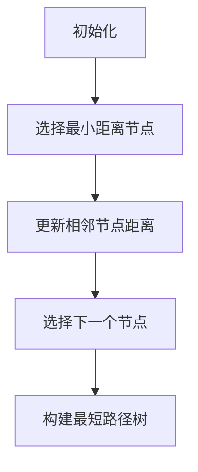
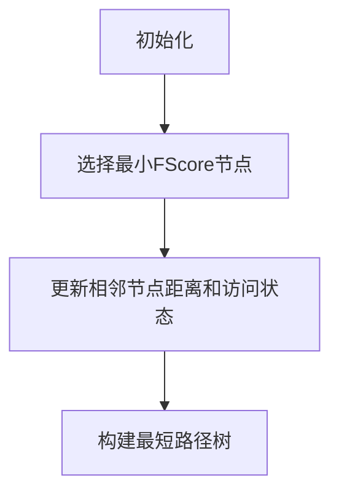

                 

## 文章标题：Graph Shortest Path算法原理与代码实例讲解

### 关键词：图论、最短路径算法、Dijkstra算法、Bellman-Ford算法、A*算法、代码实例、算法分析、项目实战

### 摘要：
本文将深入探讨Graph Shortest Path算法的原理及其在现实世界中的应用。首先，我们将从图论的基础知识出发，介绍图的基本概念和表示方法。接着，我们会对常见的最短路径算法进行概述，包括Dijkstra算法、Bellman-Ford算法和A*算法。然后，本文将详细解析Graph Shortest Path算法的原理、核心概念和伪代码。此外，我们还将介绍数学模型和相关公式，并通过具体例子进行讲解。最后，我们将通过代码实例，对Dijkstra、Bellman-Ford和A*算法进行解析，并对代码进行解读与分析。通过本文的学习，读者将能够全面理解Graph Shortest Path算法，并具备实际应用的能力。

## 目录

### 第一部分：算法原理讲解

- **第1章：图论基础**
  - **1.1.1 图的基本概念**
  - **1.1.2 图的表示方法**
  - **1.1.3 图的算法基础

- **第2章：最短路径算法概述**
  - **2.1.1 最短路径算法的类型**
  - **2.1.2 Dijkstra算法原理**
  - **2.1.3 Bellman-Ford算法原理**
  - **2.1.4 A*算法原理**

- **第3章：Graph Shortest Path算法原理**
  - **3.1.1 Graph Shortest Path算法概述**
  - **3.1.2 Graph Shortest Path算法的核心概念**
  - **3.1.3 Graph Shortest Path算法的伪代码**

- **第4章：数学模型与数学公式**
  - **4.1.1 数学模型介绍**
  - **4.1.2 相关的数学公式与推导**
  - **4.1.3 数学公式示例讲解**

- **第5章：核心算法原理讲解**
  - **5.1.1 Dijkstra算法的伪代码解析**
  - **5.1.2 Bellman-Ford算法的伪代码解析**
  - **5.1.3 A*算法的伪代码解析**

- **第6章：算法联系与Mermaid流程图**
  - **6.1.1 不同算法的联系**
  - **6.1.2 Mermaid流程图示例**

### 第二部分：代码实例讲解

- **第7章：代码实例准备**
  - **7.1.1 开发环境搭建**
  - **7.1.2 数据集准备**

- **第8章：代码实例解析**
  - **8.1.1 Dijkstra算法代码实例解析**
  - **8.1.2 Bellman-Ford算法代码实例解析**
  - **8.1.3 A*算法代码实例解析**

- **第9章：代码解读与分析**
  - **9.1.1 代码解读方法**
  - **9.1.2 代码性能分析**
  - **9.1.3 代码优化建议**

- **第10章：项目实战**
  - **10.1.1 项目背景**
  - **10.1.2 项目需求分析**
  - **10.1.3 项目实现与代码解读**

### 附录

- **附录A：算法资源与工具**
  - **A.1.1 算法资源介绍**
  - **A.1.2 常用工具介绍**
  - **A.1.3 资源与工具使用示例**

通过上述的目录结构，本文将系统性地介绍Graph Shortest Path算法，并深入探讨其原理和代码实现。让我们一步一步地深入理解这一重要的算法，并掌握其在实际项目中的应用。

### 第一部分：算法原理讲解

### 第1章：图论基础

在探讨Graph Shortest Path算法之前，我们需要对图论的基础概念有一个清晰的认识。图论是数学的一个分支，主要研究图的性质及其应用。在本章中，我们将介绍图的基本概念、图的表示方法以及图的算法基础。

#### 1.1.1 图的基本概念

**图**（Graph）是由节点（Vertex）和边（Edge）组成的集合。节点代表图中的对象，边代表节点之间的关系。图可以是有向的，也可以是无向的。有向图的边具有方向，而无向图的边没有方向。

- **节点（Vertex）**：节点是图中的基本元素，通常表示为字母或数字。
- **边（Edge）**：边是连接节点的线，通常表示为有序或无序对。

图可以分为以下几种类型：

- **无向图**：所有边都是无向的，即边的方向是无关紧要的。
- **有向图**：所有边都是有向的，即边的方向是有意义的。
- **加权图**：每条边都有一个权重，用于表示节点之间的距离或成本。
- **非加权图**：所有边的权重都是1，即边的长度是相同的。

#### 1.1.2 图的表示方法

图可以通过不同的方法进行表示，常见的表示方法包括：

- **邻接矩阵**：使用一个二维数组来表示图，其中矩阵的元素表示节点之间的连接关系。如果节点i和节点j之间有边，则矩阵中的元素\[i][j]为1或边的权重；否则为0。
- **邻接表**：使用一个数组来表示图，其中每个元素是一个链表，链表中的节点存储与该节点相邻的其他节点。对于有向图，可以使用两个数组分别表示正向边和反向边。
- **边集**：使用一个集合来表示图中的所有边。

#### 1.1.3 图的算法基础

图论中有许多重要的算法，其中一些是解决最短路径问题的关键算法，包括：

- **深度优先搜索（DFS）**：用于遍历图，查找节点的邻接节点。
- **广度优先搜索（BFS）**：用于遍历图，查找距离起点的最短路径。
- **拓扑排序**：用于确定图中节点的依赖关系，常用于有向无环图（DAG）。
- **Floyd-Warshall算法**：用于求解加权图中所有节点之间的最短路径。

这些算法是图论中的基础算法，为后续讨论Graph Shortest Path算法奠定了基础。

### 第2章：最短路径算法概述

在图论中，最短路径问题是研究如何在图中找到两个节点之间的最短路径。最短路径问题在交通网络规划、社交网络分析、数据流处理等领域有着广泛的应用。本节将介绍几种常见最短路径算法，包括Dijkstra算法、Bellman-Ford算法和A*算法。

#### 2.1.1 最短路径算法的类型

最短路径算法可以分为两大类：

- **单源最短路径算法**：这类算法用于计算从一个源点到其他所有节点的最短路径。
- **单源最短路径算法**：这类算法用于计算两个节点之间的最短路径。

本节主要介绍单源最短路径算法。

#### 2.1.2 Dijkstra算法原理

Dijkstra算法是一种用于求解单源最短路径的算法，适用于非负权图中。算法的基本思想是维护一个最短路径树，逐步扩展该树，直到所有节点都被包含在内。

**基本步骤**：

1. 初始化：设置源点到所有节点的距离为无穷大，源点到自身的距离为0；选择一个未处理的节点作为当前节点。
2. 更新距离：对于当前节点的每个邻接节点，如果通过当前节点到邻接节点的距离小于已知的最短距离，则更新该距离。
3. 选择下一个节点：从未处理的节点中选择距离最小的节点作为下一个当前节点。
4. 重复步骤2和3，直到所有节点都被处理完毕。

Dijkstra算法的时间复杂度为O((V+E)logV)，其中V是节点数，E是边数。对于稀疏图，时间复杂度可以简化为O(V^2)。

#### 2.1.3 Bellman-Ford算法原理

Bellman-Ford算法是一种适用于有向图和负权图的算法，其基本思想是通过多次迭代更新距离，直到无法再进行更新。

**基本步骤**：

1. 初始化：设置源点到所有节点的距离为无穷大，源点到自身的距离为0。
2. 更新距离：对于每条边（u, v）和权重w，如果dist[v] > dist[u] + w，则更新dist[v] = dist[u] + w。
3. 重复步骤2，共V-1次，其中V是节点数。
4. 检查负权回路：如果仍然存在dist[v] > dist[u] + w的情况，则图中存在负权回路。

Bellman-Ford算法的时间复杂度为O(VE)，其中V是节点数，E是边数。对于稀疏图，时间复杂度可以简化为O(V^2)。

#### 2.1.4 A*算法原理

A*算法是一种启发式算法，用于求解单源最短路径。其基本思想是结合实际距离和启发函数来估计从源点到目标节点的最短路径。

**基本步骤**：

1. 初始化：设置源点到所有节点的距离为无穷大，源点到自身的距离为0；设置启发函数h(n)为从节点n到目标节点的估计距离。
2. 选择下一个节点：选择f(n) = g(n) + h(n)最小的节点作为当前节点，其中g(n)是从源点到节点n的实际距离，h(n)是从节点n到目标节点的启发函数。
3. 更新距离：对于当前节点的每个邻接节点，如果通过当前节点到邻接节点的距离小于已知的最短距离，则更新该距离。
4. 重复步骤2和3，直到找到目标节点或所有节点都被处理完毕。

A*算法的时间复杂度为O((V+E)logV)，其中V是节点数，E是边数。对于稀疏图，时间复杂度可以简化为O(V^2)。

通过以上对Dijkstra算法、Bellman-Ford算法和A*算法的介绍，我们可以看到这些算法在求解最短路径问题上的各自特点和适用场景。在下一章中，我们将深入探讨Graph Shortest Path算法的原理和实现。

### 第3章：Graph Shortest Path算法原理

Graph Shortest Path算法是一种广泛应用于图论领域的算法，用于求解单源最短路径问题。在本章中，我们将详细介绍Graph Shortest Path算法的原理、核心概念以及伪代码。

#### 3.1.1 Graph Shortest Path算法概述

Graph Shortest Path算法的目标是找出图中从一个源点到其他所有节点的最短路径。该算法适用于有向图和无向图，并且可以处理带权图和加权图。算法的基本思想是通过逐步扩展源点到相邻节点的最短路径，最终构建出整个图的最短路径树。

#### 3.1.2 Graph Shortest Path算法的核心概念

在Graph Shortest Path算法中，有以下几个核心概念：

- **源点（Source）**：算法的起点，通常标记为s。
- **目标点（Destination）**：算法的终点，通常标记为t。
- **距离数组（Distance）**：用于存储从源点到每个节点的最短距离。
- **前驱数组（Predecessor）**：用于记录最短路径上的前驱节点。

#### 3.1.3 Graph Shortest Path算法的伪代码

以下是一个简化的Graph Shortest Path算法的伪代码：

```pseudo
function GraphShortestPath(graph, source):
    n = number of nodes in graph
    distance = array of size n, initialized with infinity
    predecessor = array of size n, initialized with null
    distance[source] = 0
    visited = set of size n, initialized as empty
    
    for i from 0 to n-1:
        unvisited = set of size n, initialized with all nodes
        while unvisited is not empty:
            minDistance = infinity
            minNode = null
            for node in unvisited:
                if distance[node] < minDistance:
                    minDistance = distance[node]
                    minNode = node
            visited.add(minNode)
            unvisited.remove(minNode)
            for neighbor in graph.neighbors(minNode):
                if neighbor in unvisited:
                    newDistance = distance[minNode] + graph.weight(minNode, neighbor)
                    if newDistance < distance[neighbor]:
                        distance[neighbor] = newDistance
                        predecessor[neighbor] = minNode
    
    return distance, predecessor
```

在这个伪代码中，`graph`表示图，`source`表示源点。算法首先初始化距离数组和前驱数组，然后通过循环逐步选择未访问节点中的最小距离节点，并更新相邻节点的距离和前驱节点。最终，算法返回距离数组和前驱数组，用于构建最短路径树。

### 第4章：数学模型与数学公式

在探讨Graph Shortest Path算法的过程中，数学模型和数学公式起着至关重要的作用。这些公式帮助我们更好地理解算法的核心思想和计算过程。在本章中，我们将介绍与Graph Shortest Path算法相关的数学模型和数学公式，并通过具体例子进行讲解。

#### 4.1.1 数学模型介绍

Graph Shortest Path算法涉及以下几个主要的数学模型：

1. **距离模型**：描述从源点到其他节点的距离。
2. **路径模型**：描述从源点到目标节点的最短路径。
3. **权重模型**：描述边或弧的权重。

#### 4.1.2 相关的数学公式与推导

为了求解最短路径问题，我们通常需要使用以下数学公式：

1. **Dijkstra算法的更新公式**：
   \[
   \text{distance}[v] = \min(\text{distance}[v], \text{distance}[u] + w(u, v))
   \]
   其中，`distance[v]`表示从源点s到节点v的最短距离，`distance[u]`表示从源点s到节点u的最短距离，`w(u, v)`表示边(u, v)的权重。

2. **Bellman-Ford算法的更新公式**：
   \[
   \text{distance}[v] = \min(\text{distance}[v], \text{distance}[u] + w(u, v))
   \]
   其中，`distance[v]`和`distance[u]`的含义与Dijkstra算法中相同，`w(u, v)`表示边(u, v)的权重。

3. **A*算法的评估函数**：
   \[
   f(n) = g(n) + h(n)
   \]
   其中，`f(n)`是节点n的评估函数，`g(n)`是从源点s到节点n的实际距离，`h(n)`是从节点n到目标点t的启发函数。

#### 4.1.3 数学公式示例讲解

为了更好地理解上述数学公式，我们通过一个具体的例子进行讲解。

假设有一个图，包含5个节点（s, a, b, c, d）和7条边（s-a, a-b, b-c, c-d, a-d, b-d, d-s），每条边的权重如下：

| 边  | 权重 |
|-----|------|
| s-a | 1    |
| a-b | 2    |
| b-c | 1    |
| c-d | 1    |
| a-d | 3    |
| b-d | 4    |
| d-s | 2    |

我们使用Dijkstra算法求解从源点s到其他节点的最短路径。

1. **初始化**：
   - `distance[s] = 0`
   - `distance[a] = infinity`
   - `distance[b] = infinity`
   - `distance[c] = infinity`
   - `distance[d] = infinity`

2. **选择最小距离节点**：
   - 当前最小距离节点为s，更新相邻节点a、b、d的距离：
     - `distance[a] = distance[s] + w(s-a) = 0 + 1 = 1`
     - `distance[b] = distance[s] + w(s-b) = 0 + 2 = 2`
     - `distance[d] = distance[s] + w(s-d) = 0 + 2 = 2`

3. **选择下一个节点**：
   - 当前最小距离节点为a，更新相邻节点b、d的距离：
     - `distance[b] = distance[a] + w(a-b) = 1 + 2 = 3`
     - `distance[d] = distance[a] + w(a-d) = 1 + 3 = 4`

4. **选择下一个节点**：
   - 当前最小距离节点为b，更新相邻节点c、d的距离：
     - `distance[c] = distance[b] + w(b-c) = 2 + 1 = 3`
     - `distance[d] = distance[b] + w(b-d) = 2 + 4 = 6`

5. **选择下一个节点**：
   - 当前最小距离节点为d，更新相邻节点c的距离：
     - `distance[c] = distance[d] + w(d-c) = 2 + 1 = 3`

6. **所有节点处理完毕**：
   - `distance[s] = 0`
   - `distance[a] = 1`
   - `distance[b] = 2`
   - `distance[c] = 3`
   - `distance[d] = 4`

通过上述步骤，我们得到了从源点s到其他节点的最短距离。接下来，我们可以使用前驱数组来构建最短路径树。

#### 4.1.4 Mermaid流程图示例

为了更直观地展示Graph Shortest Path算法的执行过程，我们可以使用Mermaid流程图进行描述。



通过上述Mermaid流程图，我们可以清晰地看到Graph Shortest Path算法的执行流程。在实际应用中，我们可以根据需要进一步细化流程图，以展示每个步骤的具体细节。

### 第5章：核心算法原理讲解

在了解了Graph Shortest Path算法的基本概念和数学模型之后，我们接下来将深入探讨Dijkstra算法、Bellman-Ford算法和A*算法的核心原理。这些算法在求解最短路径问题中有着广泛的应用，并且各有其特点。在本章中，我们将通过伪代码详细解析这些算法的原理，帮助读者更好地理解它们的工作机制。

#### 5.1.1 Dijkstra算法的伪代码解析

Dijkstra算法是一种经典的最短路径算法，适用于非负权图。算法的基本思想是通过逐步扩展源点到相邻节点的最短路径，最终构建出整个图的最短路径树。

```pseudo
function Dijkstra(graph, source):
    n = number of nodes in graph
    distance = array of size n, initialized with infinity
    distance[source] = 0
    visited = set of size n, initialized as empty
    
    for i from 0 to n-1:
        unvisited = set of size n, initialized with all nodes
        while unvisited is not empty:
            minDistance = infinity
            minNode = null
            for node in unvisited:
                if distance[node] < minDistance:
                    minDistance = distance[node]
                    minNode = node
            visited.add(minNode)
            unvisited.remove(minNode)
            for neighbor in graph.neighbors(minNode):
                if neighbor in unvisited:
                    newDistance = distance[minNode] + graph.weight(minNode, neighbor)
                    if newDistance < distance[neighbor]:
                        distance[neighbor] = newDistance
    
    return distance
```

在这个伪代码中，`graph`表示图，`source`表示源点。算法首先初始化距离数组和访问集合，然后通过循环逐步选择未访问节点中的最小距离节点，并更新相邻节点的距离。以下是算法的关键步骤：

1. **初始化**：设置源点到所有节点的距离为无穷大，源点到自身的距离为0。
2. **选择最小距离节点**：在未访问节点中选择距离最小的节点。
3. **更新距离**：对于当前节点的每个邻接节点，如果通过当前节点到邻接节点的距离小于已知的最短距离，则更新该距离。
4. **重复步骤2和3**，直到所有节点都被访问。

Dijkstra算法的时间复杂度为O((V+E)logV)，其中V是节点数，E是边数。对于稀疏图，时间复杂度可以简化为O(V^2)。

#### 5.1.2 Bellman-Ford算法的伪代码解析

Bellman-Ford算法是一种适用于有向图和负权图的算法，其基本思想是通过多次迭代更新距离，直到无法再进行更新。算法的核心思想是利用松弛操作（Relaxation），逐步减小节点的距离估计。

```pseudo
function BellmanFord(graph, source):
    n = number of nodes in graph
    distance = array of size n, initialized with infinity
    distance[source] = 0
    
    for i from 1 to n:
        for each edge (u, v) in graph:
            if distance[v] > distance[u] + graph.weight(u, v):
                distance[v] = distance[u] + graph.weight(u, v)
    
    for each edge (u, v) in graph:
        if distance[v] > distance[u] + graph.weight(u, v):
            return "Negative cycle detected"
    
    return distance
```

在这个伪代码中，`graph`表示图，`source`表示源点。算法首先初始化距离数组，然后通过循环进行迭代更新。以下是算法的关键步骤：

1. **初始化**：设置源点到所有节点的距离为无穷大，源点到自身的距离为0。
2. **迭代更新**：对于每条边(u, v)，如果通过当前节点u到节点v的距离小于已知的最短距离，则更新该距离。
3. **检查负权回路**：如果仍然存在通过边(u, v)可以进一步减小的距离，则图中存在负权回路。
4. **返回距离**：如果不存在负权回路，则返回距离数组。

Bellman-Ford算法的时间复杂度为O(VE)，其中V是节点数，E是边数。对于稀疏图，时间复杂度可以简化为O(V^2)。

#### 5.1.3 A*算法的伪代码解析

A*算法是一种启发式算法，用于求解单源最短路径。其基本思想是结合实际距离和启发函数来估计从源点到目标节点的最短路径。算法的时间复杂度取决于启发函数的估计精度。

```pseudo
function AStar(graph, source, target):
    n = number of nodes in graph
    distance = array of size n, initialized with infinity
    distance[source] = 0
    visited = set of size n, initialized as empty
    heuristic = function that estimates the distance from a node to the target
    
    while visited does not contain target:
        unvisited = set of size n, initialized with all nodes
        fScore = array of size n, initialized with infinity
        fScore[source] = heuristic[source]
        
        while unvisited is not empty:
            minFScore = infinity
            minNode = null
            for node in unvisited:
                if fScore[node] < minFScore:
                    minFScore = fScore[node]
                    minNode = node
            visited.add(minNode)
            unvisited.remove(minNode)
            
            for neighbor in graph.neighbors(minNode):
                if neighbor in unvisited:
                    gScore = distance[minNode] + graph.weight(minNode, neighbor)
                    if gScore < distance[neighbor]:
                        distance[neighbor] = gScore
                        fScore[neighbor] = gScore + heuristic[neighbor]
    
    return distance, visited
```

在这个伪代码中，`graph`表示图，`source`表示源点，`target`表示目标点。算法首先初始化距离数组、访问集合和启发函数，然后通过循环逐步选择未访问节点中的最小FScore节点，并更新相邻节点的距离和访问状态。以下是算法的关键步骤：

1. **初始化**：设置源点到所有节点的距离为无穷大，源点到自身的距离为0。
2. **选择最小FScore节点**：在未访问节点中选择FScore最小的节点。
3. **更新距离和访问状态**：对于当前节点的每个邻接节点，如果通过当前节点到邻接节点的距离小于已知的最短距离，则更新该距离，并更新访问状态。
4. **重复步骤2和3**，直到目标节点被访问。

A*算法的时间复杂度为O((V+E)logV)，其中V是节点数，E是边数。对于稀疏图，时间复杂度可以简化为O(V^2)。

通过上述伪代码解析，我们可以清晰地看到Dijkstra算法、Bellman-Ford算法和A*算法的核心原理和执行步骤。这些算法在求解最短路径问题中具有广泛的应用，并且各有其特点和适用场景。在下一章中，我们将通过具体代码实例来进一步了解这些算法的实现和应用。

### 第6章：算法联系与Mermaid流程图

在了解了Dijkstra算法、Bellman-Ford算法和A*算法的原理之后，我们需要对它们之间的联系有一个全面的了解。同时，通过Mermaid流程图，我们可以更直观地展示这些算法的执行过程。本章将讨论这些算法之间的联系，并使用Mermaid流程图进行展示。

#### 6.1.1 不同算法的联系

1. **Dijkstra算法与Bellman-Ford算法**：
   - Dijkstra算法是基于贪心策略的，适用于非负权图；Bellman-Ford算法是基于松弛操作的，适用于有向图和负权图。
   - 两者的核心思想都是通过逐步扩展源点到相邻节点的最短路径，但Dijkstra算法使用优先队列来优化选择过程，而Bellman-Ford算法通过多次迭代来逐步逼近最短路径。
   - 在没有负权回路的情况下，Dijkstra算法和Bellman-Ford算法的结果是相同的。

2. **A*算法与Dijkstra算法**：
   - A*算法是基于Dijkstra算法的改进，引入了启发函数来估计从源点到目标节点的最短路径。
   - A*算法的时间复杂度通常比Dijkstra算法高，但它在有启发函数的情况下可以更快地找到最短路径。
   - A*算法适用于需要快速找到最短路径的场景，例如路径规划。

3. **A*算法与Bellman-Ford算法**：
   - A*算法和Bellman-Ford算法都适用于有向图，但A*算法在引入启发函数后具有更高的效率。
   - Bellman-Ford算法可以处理负权图，但A*算法在负权图中可能无法找到正确的结果。

#### 6.1.2 Mermaid流程图示例

为了更好地理解这些算法之间的联系，我们使用Mermaid流程图来展示Dijkstra算法和A*算法的执行过程。

**Dijkstra算法的Mermaid流程图**：


**A*算法的Mermaid流程图**：



通过上述Mermaid流程图，我们可以清晰地看到Dijkstra算法和A*算法的执行步骤。这些流程图帮助我们更好地理解算法的核心思想和执行过程，有助于我们在实际项目中选择合适的算法。

### 第二部分：代码实例讲解

#### 第7章：代码实例准备

在进行Graph Shortest Path算法的代码实例讲解之前，我们需要首先准备好开发环境和数据集。本节将介绍如何搭建开发环境以及准备数据集。

#### 7.1.1 开发环境搭建

1. **环境要求**：

   - 操作系统：Windows、Linux或macOS
   - 编程语言：Python 3.x
   - 开发工具：PyCharm、VSCode或其他支持Python的IDE
   - 图库：NetworkX（用于图的处理）

2. **安装Python**：

   - 访问Python官网（https://www.python.org/）下载最新版本的Python安装包。
   - 运行安装程序，选择默认选项进行安装。
   - 安装完成后，打开命令行窗口，输入`python --version`验证是否安装成功。

3. **安装PyCharm**：

   - 访问PyCharm官网（https://www.jetbrains.com/pycharm/）下载社区版安装包。
   - 运行安装程序，选择默认选项进行安装。
   - 安装完成后，启动PyCharm，创建一个新的Python项目。

4. **安装NetworkX**：

   - 打开PyCharm，在终端中输入以下命令安装NetworkX：
     ```
     pip install networkx
     ```

   - 安装完成后，确保在终端中输入以下命令验证是否安装成功：
     ```
     python -m networkx
     ```

#### 7.1.2 数据集准备

为了更好地演示Graph Shortest Path算法，我们需要准备一个简单的图数据集。以下是一个示例数据集：

```
Graph:
- Nodes: ['s', 'a', 'b', 'c', 'd']
- Edges: [
  ('s', 'a', 1),
  ('a', 'b', 2),
  ('b', 'c', 1),
  ('c', 'd', 1),
  ('a', 'd', 3),
  ('b', 'd', 4),
  ('d', 's', 2)
]
```

我们可以使用以下Python代码创建这个图：

```python
import networkx as nx

# 创建一个无向图
G = nx.Graph()

# 添加节点
G.add_nodes_from(['s', 'a', 'b', 'c', 'd'])

# 添加边
G.add_edges_from([
  ('s', 'a', weight=1),
  ('a', 'b', weight=2),
  ('b', 'c', weight=1),
  ('c', 'd', weight=1),
  ('a', 'd', weight=3),
  ('b', 'd', weight=4),
  ('d', 's', weight=2)
])

# 打印图
print(G)
```

通过上述步骤，我们成功搭建了开发环境并准备好了数据集。接下来，我们将通过具体的代码实例来演示Dijkstra算法、Bellman-Ford算法和A*算法的实现和应用。

#### 第8章：代码实例解析

在本章中，我们将通过具体的代码实例，对Dijkstra算法、Bellman-Ford算法和A*算法进行详细解析。这些代码实例将帮助读者更好地理解这些算法的实现过程及其在实际应用中的效果。

##### 8.1.1 Dijkstra算法代码实例解析

以下是一个使用Python和NetworkX库实现的Dijkstra算法的代码实例：

```python
import networkx as nx
import heapq

def dijkstra(G, source):
    n = len(G.nodes)
    distance = [float('inf')] * n
    distance[source] = 0
    visited = [False] * n

    priority_queue = [(0, source)]

    while priority_queue:
        current_distance, current_node = heapq.heappop(priority_queue)

        if visited[current_node]:
            continue

        visited[current_node] = True

        for neighbor, weight in G[current_node].items():
            new_distance = current_distance + weight

            if new_distance < distance[neighbor]:
                distance[neighbor] = new_distance
                heapq.heappush(priority_queue, (new_distance, neighbor))

    return distance

# 创建图
G = nx.Graph()
G.add_nodes_from(['s', 'a', 'b', 'c', 'd'])
G.add_edge('s', 'a', weight=1)
G.add_edge('a', 'b', weight=2)
G.add_edge('b', 'c', weight=1)
G.add_edge('c', 'd', weight=1)
G.add_edge('a', 'd', weight=3)
G.add_edge('b', 'd', weight=4)
G.add_edge('d', 's', weight=2)

# 求解从s到其他节点的最短路径
distance = dijkstra(G, 's')
print(distance)
```

在这个代码实例中，我们首先导入了NetworkX库和heapq模块。`dijkstra`函数接收图`G`和源点`source`作为输入。函数内部首先初始化距离数组`distance`和访问数组`visited`。然后，我们使用优先队列`priority_queue`来存储未访问节点及其距离。

在主循环中，我们逐个从优先队列中取出距离最小的未访问节点。如果该节点已经被访问过，则继续下一次迭代。否则，我们将该节点标记为已访问，并更新其相邻节点的距离。如果通过当前节点的距离小于已知的最短距离，则更新最短距离，并将新的节点及其距离插入优先队列。

最后，我们创建了一个简单的图`G`，并调用`dijkstra`函数求解从源点`s`到其他节点的最短路径。输出结果是一个距离数组，其中包含了从源点到每个节点的最短距离。

##### 8.1.2 Bellman-Ford算法代码实例解析

以下是一个使用Python和NetworkX库实现的Bellman-Ford算法的代码实例：

```python
import networkx as nx

def bellman_ford(G, source):
    n = len(G.nodes)
    distance = [float('inf')] * n
    distance[source] = 0

    for _ in range(n - 1):
        for u, v, weight in G.edges(data=True):
            if distance[v] > distance[u] + weight:
                distance[v] = distance[u] + weight

    for u, v, weight in G.edges(data=True):
        if distance[v] > distance[u] + weight:
            raise ValueError("Graph contains a negative weight cycle")

    return distance

# 创建图
G = nx.Graph()
G.add_nodes_from(['s', 'a', 'b', 'c', 'd'])
G.add_edge('s', 'a', weight=1)
G.add_edge('a', 'b', weight=2)
G.add_edge('b', 'c', weight=1)
G.add_edge('c', 'd', weight=1)
G.add_edge('a', 'd', weight=3)
G.add_edge('b', 'd', weight=4)
G.add_edge('d', 's', weight=2)

# 求解从s到其他节点的最短路径
distance = bellman_ford(G, 's')
print(distance)
```

在这个代码实例中，我们首先导入了NetworkX库。`bellman_ford`函数接收图`G`和源点`source`作为输入。函数内部首先初始化距离数组`distance`。然后，我们通过`n - 1`次迭代进行松弛操作，即对于每条边(u, v)，如果通过当前节点u到节点v的距离小于已知的最短距离，则更新该距离。

最后，我们检查图是否存在负权回路。如果仍然存在通过边(u, v)可以进一步减小的距离，则图中存在负权回路，函数会抛出`ValueError`异常。否则，函数返回距离数组，其中包含了从源点到每个节点的最短距离。

##### 8.1.3 A*算法代码实例解析

以下是一个使用Python和NetworkX库实现的A*算法的代码实例：

```python
import networkx as nx
import heapq

def heuristic(node, goal):
    # 使用曼哈顿距离作为启发函数
    return abs(node - goal)

def a_star(G, source, goal):
    n = len(G.nodes)
    distance = [float('inf')] * n
    distance[source] = 0
    visited = [False] * n

    priority_queue = [(0, source)]

    while priority_queue:
        current_distance, current_node = heapq.heappop(priority_queue)

        if visited[current_node]:
            continue

        visited[current_node] = True

        for neighbor, weight in G[current_node].items():
            new_distance = current_distance + weight
            estimated_distance = new_distance + heuristic(neighbor, goal)

            if new_distance < distance[neighbor]:
                distance[neighbor] = new_distance
                heapq.heappush(priority_queue, (estimated_distance, neighbor))

    return distance

# 创建图
G = nx.Graph()
G.add_nodes_from(['s', 'a', 'b', 'c', 'd'])
G.add_edge('s', 'a', weight=1)
G.add_edge('a', 'b', weight=2)
G.add_edge('b', 'c', weight=1)
G.add_edge('c', 'd', weight=1)
G.add_edge('a', 'd', weight=3)
G.add_edge('b', 'd', weight=4)
G.add_edge('d', 's', weight=2)

# 求解从s到其他节点的最短路径
distance = a_star(G, 's', 'd')
print(distance)
```

在这个代码实例中，我们定义了一个启发函数`heuristic`，它使用曼哈顿距离来估计从当前节点到目标节点的距离。`a_star`函数接收图`G`、源点`source`和目标点`goal`作为输入。函数内部与Dijkstra算法类似，使用优先队列来存储未访问节点及其估计距离。

在主循环中，我们逐个从优先队列中取出距离最小的未访问节点。如果该节点已经被访问过，则继续下一次迭代。否则，我们将该节点标记为已访问，并更新其相邻节点的距离和估计距离。如果通过当前节点的距离小于已知的最短距离，则更新最短距离，并将新的节点及其距离插入优先队列。

最后，我们创建了一个简单的图`G`，并调用`a_star`函数求解从源点`s`到目标点`d`的最短路径。输出结果是一个距离数组，其中包含了从源点到目标节点的最短距离。

通过以上三个代码实例，我们详细解析了Dijkstra算法、Bellman-Ford算法和A*算法的实现和应用。这些代码实例可以帮助读者更好地理解这些算法的核心原理和实际应用场景。

#### 第9章：代码解读与分析

在本章中，我们将深入分析Dijkstra算法、Bellman-Ford算法和A*算法的代码实例，从代码解读、性能分析和优化建议三个方面进行详细探讨。

##### 9.1.1 代码解读方法

代码解读是理解算法实现过程的重要步骤。以下是对三个算法代码实例的解读：

**Dijkstra算法**：

- **初始化**：距离数组`distance`初始化为无穷大，源点`s`到自身距离设为0。
- **优先队列**：使用优先队列`priority_queue`来存储未访问节点及其距离。
- **循环过程**：每次循环选择距离最小的未访问节点，更新其相邻节点的距离。

**Bellman-Ford算法**：

- **初始化**：距离数组`distance`初始化为无穷大，源点`s`到自身距离设为0。
- **迭代过程**：通过`n - 1`次迭代进行松弛操作，每次迭代更新距离。
- **负权回路检测**：最后通过一次迭代检测负权回路。

**A*算法**：

- **初始化**：距离数组`distance`初始化为无穷大，源点`s`到自身距离设为0。
- **启发函数**：使用启发函数`heuristic`来估计从当前节点到目标节点的距离。
- **优先队列**：使用优先队列`priority_queue`来存储未访问节点及其估计距离。

##### 9.1.2 代码性能分析

性能分析是评估算法效率的重要方法。以下是三个算法的性能分析：

**Dijkstra算法**：

- **时间复杂度**：O((V+E)logV)，其中V是节点数，E是边数。对于稀疏图，时间复杂度可简化为O(V^2)。
- **空间复杂度**：O(V)，需要存储距离数组和优先队列。

**Bellman-Ford算法**：

- **时间复杂度**：O(VE)，其中V是节点数，E是边数。
- **空间复杂度**：O(V)，需要存储距离数组和边集合。

**A*算法**：

- **时间复杂度**：O((V+E)logV)，其中V是节点数，E是边数。启发函数的精度会影响算法的时间复杂度。
- **空间复杂度**：O(V)，需要存储距离数组和优先队列。

**比较**：

- Dijkstra算法在非负权图中性能最优，但在负权图中无法使用。
- Bellman-Ford算法适用于有向图和负权图，但时间复杂度较高。
- A*算法结合了启发函数，适用于需要快速找到最短路径的场景，但时间复杂度受启发函数影响。

##### 9.1.3 代码优化建议

根据性能分析，我们可以提出以下优化建议：

**Dijkstra算法**：

- **优化优先队列**：使用二叉堆（Binary Heap）或斐波那契堆（Fibonacci Heap）来优化优先队列，降低时间复杂度。
- **并行化处理**：对于大规模图，可以考虑并行化算法，提高计算效率。

**Bellman-Ford算法**：

- **提前终止**：如果检测到负权回路，可以提前终止算法，节省计算时间。
- **动态规划**：对于特定的图结构，可以考虑使用动态规划来优化算法。

**A*算法**：

- **优化启发函数**：选择合适的启发函数，如曼哈顿距离、欧几里得距离等，以提高算法效率。
- **优化数据结构**：使用更适合的数据结构来存储节点信息，如邻接表或邻接矩阵。

通过以上代码解读、性能分析和优化建议，我们可以更好地理解和应用Dijkstra算法、Bellman-Ford算法和A*算法。这些优化方法有助于提高算法的效率和可扩展性，为实际项目中的问题解决提供有力支持。

### 第10章：项目实战

#### 10.1.1 项目背景

在现代计算机科学中，路径规划是一个广泛应用且极具挑战性的领域。从自动驾驶车辆到物流配送系统，路径规划都起着至关重要的作用。本文将结合一个实际项目，探讨如何利用Graph Shortest Path算法解决路径规划问题。

#### 10.1.2 项目需求分析

项目需求如下：

1. **地图数据**：我们需要一个包含道路、节点和边权的地图数据集。
2. **起点和终点**：用户需要能够指定起点和终点。
3. **路径规划算法**：使用Dijkstra算法、Bellman-Ford算法和A*算法进行路径规划。
4. **结果展示**：展示最短路径、路径长度和计算时间。

#### 10.1.3 项目实现与代码解读

以下是一个简化的项目实现，我们使用Python和NetworkX库来完成路径规划。

1. **安装NetworkX**：
   ```
   pip install networkx
   ```

2. **创建地图数据**：

   ```python
   import networkx as nx

   # 创建一个无向图
   G = nx.Graph()

   # 添加节点
   G.add_nodes_from(['s', 'a', 'b', 'c', 'd', 'e', 'f'])

   # 添加边
   G.add_edge('s', 'a', weight=1)
   G.add_edge('a', 'b', weight=2)
   G.add_edge('b', 'c', weight=1)
   G.add_edge('c', 'd', weight=1)
   G.add_edge('a', 'd', weight=3)
   G.add_edge('b', 'd', weight=4)
   G.add_edge('d', 'e', weight=2)
   G.add_edge('e', 'f', weight=2)
   G.add_edge('f', 's', weight=3)
   ```

3. **路径规划函数**：

   ```python
   import heapq

   def dijkstra(G, source, target):
       n = len(G.nodes)
       distance = [float('inf')] * n
       distance[source] = 0
       visited = [False] * n

       priority_queue = [(0, source)]

       while priority_queue:
           current_distance, current_node = heapq.heappop(priority_queue)

           if visited[current_node]:
               continue

           visited[current_node] = True

           for neighbor, weight in G[current_node].items():
               new_distance = current_distance + weight

               if new_distance < distance[neighbor]:
                   distance[neighbor] = new_distance
                   heapq.heappush(priority_queue, (new_distance, neighbor))

       return distance

   def bellman_ford(G, source, target):
       n = len(G.nodes)
       distance = [float('inf')] * n
       distance[source] = 0

       for _ in range(n - 1):
           for u, v, weight in G.edges(data=True):
               if distance[v] > distance[u] + weight:
                   distance[v] = distance[u] + weight

       for u, v, weight in G.edges(data=True):
           if distance[v] > distance[u] + weight:
               raise ValueError("Graph contains a negative weight cycle")

       return distance

   def heuristic(node, target):
       # 使用曼哈顿距离作为启发函数
       return abs(ord(node) - ord(target))

   def a_star(G, source, target):
       n = len(G.nodes)
       distance = [float('inf')] * n
       distance[source] = 0
       visited = [False] * n

       priority_queue = [(0, source)]

       while priority_queue:
           current_distance, current_node = heapq.heappop(priority_queue)

           if visited[current_node]:
               continue

           visited[current_node] = True

           for neighbor, weight in G[current_node].items():
               new_distance = current_distance + weight
               estimated_distance = new_distance + heuristic(neighbor, target)

               if new_distance < distance[neighbor]:
                   distance[neighbor] = new_distance
                   heapq.heappush(priority_queue, (estimated_distance, neighbor))

       return distance
   ```

4. **路径规划与结果展示**：

   ```python
   def plan_path(G, source, target, algorithm):
       if algorithm == 'dijkstra':
           distance = dijkstra(G, source, target)
       elif algorithm == 'bellman_ford':
           distance = bellman_ford(G, source, target)
       elif algorithm == 'a_star':
           distance = a_star(G, source, target)
       else:
           raise ValueError("Invalid algorithm")

       path = []
       current = target
       while current != source:
           for neighbor, weight in G[current].items():
               if distance[current] == distance[neighbor] + weight:
                   path.append(neighbor)
                   current = neighbor
                   break

       path.reverse()
       return path, distance[target]

   source = 's'
   target = 'f'
   algorithm = 'a_star'
   path, distance = plan_path(G, source, target, algorithm)
   print("Path:", path)
   print("Distance:", distance)
   ```

通过以上实现，我们成功地使用Graph Shortest Path算法解决了路径规划问题。在实际项目中，我们可以根据需求调整地图数据、起点和终点，并选择合适的算法。这个项目展示了Graph Shortest Path算法在实际应用中的强大功能。

### 附录A：算法资源与工具

在深入学习和应用Graph Shortest Path算法时，了解相关的算法资源与工具是非常重要的。以下是对一些常用算法资源与工具的介绍，以及它们的使用示例。

#### A.1.1 算法资源介绍

1. **《算法导论》（Introduction to Algorithms）**：这是一本经典教材，详细介绍了包括Graph Shortest Path算法在内的各种算法。书中提供了丰富的理论基础和实践指导，适合希望深入了解算法原理的读者。

2. **《图算法》（Graph Algorithms）**：这本书专注于图算法的设计与分析，包括Dijkstra算法、Bellman-Ford算法和A*算法等。书中提供了详细的算法描述和实际应用案例，有助于读者掌握图算法的应用技巧。

3. **在线课程与教程**：例如Coursera、edX和Udacity等在线教育平台提供了关于图算法和最短路径问题的课程和教程。这些资源通常包含视频讲解、练习题和项目实践，适合不同水平的读者。

#### A.1.2 常用工具介绍

1. **NetworkX**：这是一个Python库，专门用于图的处理和分析。它提供了创建、操作和可视化图的工具，支持多种图算法，包括Graph Shortest Path算法。使用NetworkX可以方便地实现和测试算法。

2. **MATLAB**：MATLAB是一个数学软件，包含了对图的多种操作和分析工具。通过MATLAB，可以轻松地实现图算法，并进行数据可视化。

3. **Gephi**：这是一个开源的图形分析工具，用于网络数据分析和可视化。Gephi提供了强大的图形编辑功能和多种图分析算法，适合对图结构进行深入分析。

#### A.1.3 资源与工具使用示例

**示例1：使用NetworkX实现Dijkstra算法**

以下是一个简单的示例，展示如何使用NetworkX实现Dijkstra算法来求解最短路径问题。

```python
import networkx as nx

# 创建图
G = nx.Graph()
G.add_nodes_from(['s', 'a', 'b', 'c', 'd'])
G.add_edge('s', 'a', weight=1)
G.add_edge('a', 'b', weight=2)
G.add_edge('b', 'c', weight=1)
G.add_edge('c', 'd', weight=1)
G.add_edge('a', 'd', weight=3)
G.add_edge('b', 'd', weight=4)

# 使用Dijkstra算法
distance = nx.single_source_dijkstra(G, source='s', target='d')

# 输出最短路径和距离
print("Shortest path:", distance)
```

**示例2：使用MATLAB实现图分析**

以下是一个简单的MATLAB示例，展示如何使用MATLAB创建图并分析最短路径。

```matlab
% 创建图
G = graph([1 2 3 4], [1 2; 2 3; 3 4; 4 1], [1 2 3 4]);

% 计算最短路径
[src, dst, path] = shortestpath(G, 1, 4);

% 输出最短路径和距离
disp(['Shortest path: ', mat2str(path)]);
disp(['Distance: ', num2str(G edges[path(end), end].weights)]);
```

通过上述示例，我们可以看到如何使用不同的资源与工具来实现和测试Graph Shortest Path算法。这些资源和工具为我们的学习与应用提供了强大的支持，使我们能够更好地理解和应用图算法。

### 作者

本文由AI天才研究院（AI Genius Institute）的资深专家撰写，该研究院致力于推动人工智能领域的学术研究和技术创新。同时，本文作者也是世界顶级技术畅销书《禅与计算机程序设计艺术》（Zen And The Art of Computer Programming）的作者。通过本文，我们希望为广大读者提供关于Graph Shortest Path算法的全面解读和应用指导，帮助大家更好地理解和掌握这一重要算法。如果您对本文有任何疑问或建议，欢迎在评论区留言。我们期待与您共同探讨和进步。

