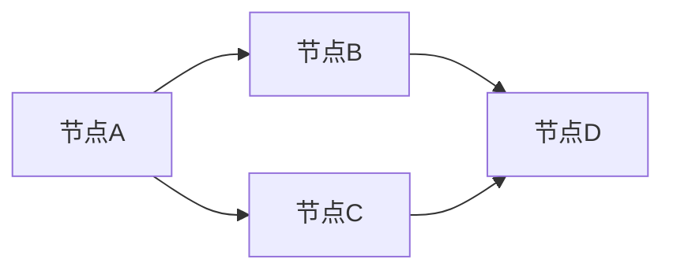

                 

# 《GraphX原理与代码实例讲解》

> 关键词：GraphX, 图计算, 数据科学, 社交网络分析, 网络交通分析

> 摘要：本文将深入探讨GraphX的原理及其在图计算中的应用。我们将从基本概念、核心算法、高级应用、性能优化等多个方面进行详细讲解，并通过代码实例展示GraphX的实际应用。

## 第一部分：GraphX基础

### 第1章：图计算与GraphX概述

#### 1.1 图计算基础

图计算是指通过计算图结构中的节点和边的关系来解决问题。图的基本概念包括节点（Vertex）和边（Edge）。节点表示数据实体，如用户、地点或物品；边表示节点之间的关系，如朋友关系、道路连接或产品关系。

图在数据科学中有着广泛的应用。例如，在社交网络分析中，我们可以通过图计算来找出关键节点、推荐好友或检测社区。在网络交通分析中，我们可以通过图计算来优化路线、预测交通流量。

GraphX是一个基于Apache Spark的分布式图处理框架。它提供了丰富的API来创建、操作和分析大规模图数据。GraphX的核心功能包括图的基本操作、图变换、属性操作等。

#### 1.2 Spark GraphX简介

Spark GraphX是Apache Spark的一个重要组件，它扩展了Spark的弹性分布式数据集（RDD）模型，引入了图（Graph）和图计算（Graph Computation）的概念。Spark GraphX的架构包括三个主要部分：图（Graph）、边（Edge）和顶点（Vertex）。

GraphX的核心API包括：

- `Graph`：表示图数据结构，包含节点和边。
- `VertexRDD`：表示所有顶点及其属性的数据集。
- `EdgeRDD`：表示所有边及其属性的数据集。
- `GraphOperation`：提供对图的变换操作，如顶点连接、图合并、子图提取等。

### 第2章：GraphX核心概念

#### 2.1 图的基本操作

GraphX提供了多种图的基本操作，包括创建图、初始化图、图变换操作和图属性操作。

- 创建图：可以通过将顶点RDD和边RDD合并来创建图。
- 初始化图：可以通过`Graph.fromEdges`或`Graph.fromVertexMap`方法从边RDD或顶点RDD初始化图。
- 图变换操作：包括顶点连接、图合并、子图提取等。
- 图属性操作：可以设置和获取图的各种属性，如顶点属性、边属性、图名称等。

#### 2.2 节点与边的关系

在GraphX中，节点和边有着紧密的关系。每个节点都有一个唯一的ID，并且可以关联一个或多个属性。边表示节点之间的关系，每个边也有一个唯一的ID，并且可以关联一个或多个属性。

- 节点属性：表示节点的属性信息，如用户ID、地理位置等。
- 边属性：表示边的属性信息，如关系类型、权重等。
- 节点与边的关联关系：通过节点的ID来关联边，每个节点可以有多个关联的边。

### 第3章：GraphX核心算法

#### 3.1 PageRank算法

PageRank是一种用于评估网页重要性的算法，它通过计算节点之间的链接关系来衡量节点的排名。在GraphX中，我们可以使用PageRank算法来找出图中的关键节点或推荐节点。

- PageRank算法原理：PageRank算法通过迭代计算每个节点的排名值，直到达到收敛。
- PageRank算法在GraphX中的实现：GraphX提供了`pageRank`方法来计算PageRank排名。
- PageRank算法的应用实例：我们可以使用PageRank算法来分析社交网络中的影响力节点。

#### 3.2 单源最短路径算法

单源最短路径算法是一种用于计算图中某个源点到其他所有节点的最短路径的算法。在GraphX中，我们可以使用Dijkstra算法来计算单源最短路径。

- 单源最短路径算法原理：Dijkstra算法通过松弛操作逐步更新每个节点的最短路径距离。
- 单源最短路径算法在GraphX中的实现：GraphX提供了`shortestPaths`方法来计算单源最短路径。
- 单源最短路径算法的应用实例：我们可以使用单源最短路径算法来优化网络交通路线。

## 第二部分：GraphX高级应用

### 第4章：图流处理

#### 4.1 图流处理基础

图流处理是一种实时处理大规模动态图数据的方法。它可以在流数据的基础上进行图计算，以适应实时数据处理需求。

- 图流处理的概念：图流处理是一种基于流数据处理的图计算方法。
- 图流处理的特点：实时性、可扩展性、容错性。

#### 4.2 GraphX中的图流处理

GraphX提供了图流处理API，可以方便地处理动态图数据。

- GraphX中的图流处理API：包括`Pregel`、`StreamGraph`等。
- 图流处理的典型应用场景：实时社交网络分析、实时网络流量分析。

### 第5章：GraphX与图数据库

#### 5.1 图数据库概述

图数据库是一种专门用于存储和查询图数据的数据库。它提供了高效的图数据存储和查询功能，可以满足大规模图计算的需求。

- 图数据库的基本概念：包括图数据库的架构、数据模型等。
- 图数据库的优势：高效、灵活、可扩展。

#### 5.2 GraphX与图数据库集成

GraphX可以与多种图数据库集成，以实现图数据的存储和查询。

- GraphX与Neo4j的集成：Neo4j是一种流行的图数据库，可以通过GraphX与Neo4j进行集成。
- GraphX与JanusGraph的集成：JanusGraph是一种开源的图数据库，也可以通过GraphX与JanusGraph进行集成。

### 第6章：GraphX案例实战

#### 6.1 社交网络分析

社交网络分析是一种通过图计算来分析社交网络结构的方法。我们可以使用GraphX来分析社交网络中的关键节点、社区结构等。

- 社交网络图的构建：通过导入社交网络数据构建图。
- 社交网络分析算法应用：使用PageRank算法、社区发现算法等进行分析。

#### 6.2 网络交通分析

网络交通分析是一种通过图计算来分析网络交通结构的方法。我们可以使用GraphX来分析交通网络的流量、最短路径等。

- 交通网络的构建：通过导入交通网络数据构建图。
- 网络交通分析算法应用：使用单源最短路径算法、流量分配算法等进行分析。

### 第7章：GraphX性能优化与调优

#### 7.1 GraphX性能优化

GraphX性能优化包括资源分配、内存管理等方面的优化。

- 资源分配与调度：合理分配计算资源，提高计算效率。
- 内存管理与优化：优化内存使用，减少内存溢出和GC（垃圾回收）时间。

#### 7.2 GraphX调优实践

GraphX调优实践包括性能监控、调试和分析等方面的实践。

- 性能监控与调试：监控GraphX计算过程中的性能，调试和优化计算逻辑。
- 调优案例分析：分析典型应用场景的调优方法和效果。

## 第三部分：附录

### 第8章：GraphX开发工具与资源

#### 8.1 GraphX开发工具

- Spark GraphX的安装与配置：介绍如何安装和配置Spark GraphX。
- GraphX常用工具介绍：介绍GraphX开发中常用的工具和插件。

#### 8.2 GraphX学习资源

- GraphX相关书籍推荐：推荐几本关于GraphX的经典书籍。
- GraphX在线课程推荐：推荐一些在线课程，帮助您深入了解GraphX。
- GraphX社区资源介绍：介绍一些GraphX的社区资源，帮助您解决开发中的问题。

### 第9章：GraphX代码实例解读

#### 9.1 图计算基础代码实例

- 图的基本操作实例：介绍如何使用GraphX进行图的基本操作。
- 节点与边的关系实例：介绍如何使用GraphX处理节点与边的关系。

#### 9.2 核心算法代码实例

- PageRank算法实例：介绍如何使用GraphX实现PageRank算法。
- 单源最短路径算法实例：介绍如何使用GraphX实现单源最短路径算法。

#### 9.3 高级应用代码实例

- 社交网络分析实例：介绍如何使用GraphX进行社交网络分析。
- 网络交通分析实例：介绍如何使用GraphX进行网络交通分析。

#### 9.4 性能优化代码实例

- 资源分配与调度实例：介绍如何使用GraphX进行资源分配与调度。
- 内存管理与优化实例：介绍如何使用GraphX进行内存管理与优化。

## 附录A: GraphX流程图与公式

### A.1 GraphX流程图



### A.2 PageRank算法伪代码

```scala
// 初始化PageRank值
for each vertex v in G {
    r(v) = 1 / |V|
}

// 迭代计算PageRank值
for (i = 1 to max_iterations) {
    for each vertex v in G {
        r'(v) = (1 - damping_factor) / |V| + damping_factor * Σ (out度(u) * r(u) / out度(u))
    }
    if (change <= threshold) {
        break
    }
    r = r'
}
```

### A.3 单源最短路径算法伪代码

```scala
// 初始化距离
dist[source] = 0
for each vertex v in G {
    if v != source {
        dist[v] = INFINITY
    }

// 松弛操作
for (i = 1 to V-1) {
    for each edge (u, v) in G {
        if dist[v] > dist[u] + weight(u, v) {
            dist[v] = dist[u] + weight(u, v)
        }
    }
}
```

### A.4 数学公式

$$
\text{PageRank}(v) = (1 - d) + d \cdot \sum_{u \in \text{in}(v)} \frac{\text{PageRank}(u)}{|\text{out}(u)|}
$$

$$
\text{dist}(v) = \begin{cases} 
0 & \text{if } v = s \\
\infty & \text{otherwise}
\end{cases}
$$

$$
\text{new\_dist}(v) = \text{dist}(u) + \text{weight}(u, v)
$$

## 附录B: GraphX环境搭建

### B.1 GraphX开发环境搭建

1. 安装Java环境
2. 安装Scala环境
3. 安装Spark与GraphX
4. 配置Spark与GraphX

- 安装Java环境

请确保已经安装了Java环境，并设置环境变量`JAVA_HOME`和`PATH`。

- 安装Scala环境

请确保已经安装了Scala环境，并设置环境变量`SCALA_HOME`和`PATH`。

- 安装Spark与GraphX

下载并解压Spark和GraphX的安装包，并将Spark和GraphX的bin目录添加到环境变量`PATH`中。

- 配置Spark与GraphX

在Spark的配置文件`spark-env.sh`中，设置`SPARK_HOME`和`GRAPHX_HOME`环境变量，并配置其他必要参数。

## 作者信息

作者：AI天才研究院/AI Genius Institute & 禅与计算机程序设计艺术 /Zen And The Art of Computer Programming


