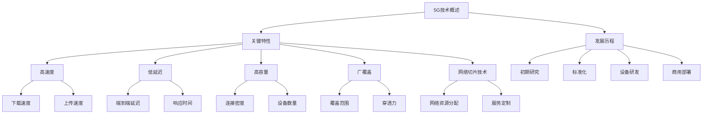

                 

# 《5G技术如何重塑注意力经济格局》

> 关键词：5G技术、注意力经济、物联网、大数据、人工智能、网络架构、生态系统、商业模式创新

> 摘要：随着5G技术的迅速发展，它正在重塑整个注意力经济格局。本文将深入探讨5G技术的基础、关键特性及其在物联网、大数据和人工智能等领域的应用，分析5G对注意力经济的影响因素和挑战，并通过具体案例展示5G技术赋能注意力经济的创新模式，最后展望5G注意力经济的未来趋势。

## 《5G技术如何重塑注意力经济格局》目录大纲

### 第一部分：5G技术基础

### 第1章 5G技术概述

#### 1.1 5G技术的发展历程

5G技术的发展可以追溯到2000年代初，当时国际电信联盟（ITU）开始制定IMT-2000标准，即3G技术。随后，随着4G技术的普及，业界开始筹备下一代的通信技术标准。5G技术的研发始于2010年代初期，并于2019年正式商用。5G的发展历程经历了多个阶段，包括初期研究、标准化、设备研发和商用部署。

#### 1.2 5G技术的关键特性

5G技术具有以下关键特性：

1. **高速度**：5G的下载速度可以达到10-20 Gbps，是4G的100倍以上。
2. **低延迟**：5G的端到端延迟可以降低到1毫秒以内，为实时应用提供了基础。
3. **高容量**：5G支持更多的连接，每平方米可以达到100万连接。
4. **广覆盖**：5G的覆盖范围更广，可以实现城乡无缝覆盖。
5. **网络切片技术**：5G支持网络切片，可以根据不同应用需求灵活分配网络资源。

#### 1.3 5G技术的应用场景

5G技术的应用场景广泛，包括但不限于：

1. **移动互联网**：提高用户上网速度和体验。
2. **物联网（IoT）**：连接各种智能设备，实现万物互联。
3. **工业互联网**：提高工业生产效率和自动化水平。
4. **自动驾驶**：提供实时数据传输和低延迟通信支持。
5. **医疗健康**：实现远程医疗和实时监控。

### 第2章 5G网络架构与关键技术

#### 2.1 5G网络架构

5G网络架构包括三个主要层次：无线接入网、核心网和传输网。

1. **无线接入网**：包括5G基站、天线和用户设备。
2. **核心网**：包括用户数据存储、处理和传输功能。
3. **传输网**：连接无线接入网和核心网，提供传输通道。

#### 2.2 5G关键技术分析

5G的关键技术包括：

1. **毫米波技术**：使用高频段的毫米波信号，实现更高的数据传输速度。
2. **多连接技术**：支持更多的同时连接，提高网络容量。
3. **网络切片技术**：为不同应用需求提供定制化的网络服务。
4. **边缘计算**：将计算任务分散到网络边缘，降低延迟。

#### 2.3 5G网络切片技术详解

网络切片技术是5G的重要特性之一，它允许运营商将一个物理网络分割成多个虚拟网络，每个虚拟网络可以提供不同的网络服务和性能保障。

1. **网络切片的定义**：网络切片是一个独立的虚拟网络，它拥有自己的网络资源、服务和性能保障。
2. **网络切片的类型**：根据应用需求，网络切片可以分为专用切片和共享切片。
3. **网络切片的实现**：通过虚拟化技术和软件定义网络（SDN）实现。

### 第3章 5G设备与生态系统

#### 3.1 5G设备介绍

5G设备包括基站、天线、用户设备（UE）等。其中，5G基站是最核心的设备，它负责无线信号的接收和发送。5G天线采用MIMO（多输入多输出）技术，提高信号传输效率和覆盖范围。用户设备包括智能手机、平板电脑、物联网设备等。

#### 3.2 5G设备生态系统

5G设备生态系统包括设备制造商、运营商、应用开发商等。设备制造商负责研发和制造5G设备，运营商负责网络建设和运营，应用开发商负责开发和推广5G应用。

#### 3.3 5G产业链分析

5G产业链包括芯片制造、设备研发、网络建设、应用开发等多个环节。其中，芯片制造是5G技术的核心，它决定了5G设备的性能和成本。设备研发和网络建设是5G产业链的关键环节，而应用开发则是推动5G普及的重要力量。

### 第二部分：5G技术在注意力经济中的应用

### 第4章 5G与物联网（IoT）

#### 4.1 物联网技术概述

物联网技术是通过互联网将各种物理设备连接起来，实现设备之间的信息交换和智能控制。物联网的关键技术包括传感器、通信协议、云计算和大数据等。

#### 4.2 5G在物联网中的应用

5G技术在物联网中有着广泛的应用，包括：

1. **智能城市**：通过5G网络实现城市基础设施的智能化管理。
2. **智能家居**：通过5G网络实现家电设备的远程控制和自动化管理。
3. **智能农业**：通过5G网络实现农田环境的实时监测和智能控制。
4. **智能医疗**：通过5G网络实现远程医疗和医疗设备的实时监控。

#### 4.3 5G与物联网的融合案例

1. **智能交通**：通过5G网络实现车辆与道路的实时通信，提高交通管理效率和安全性。
2. **智能工厂**：通过5G网络实现工业设备的实时监控和智能调度，提高生产效率和质量。

### 第5章 5G与大数据

#### 5.1 大数据技术基础

大数据技术是指从海量数据中提取有价值信息的技术。大数据技术包括数据采集、存储、处理、分析和可视化等环节。

#### 5.2 5G与大数据的融合

5G与大数据的融合可以实现以下应用：

1. **实时数据分析**：通过5G网络实现数据的高速传输，提高实时数据分析的能力。
2. **边缘计算**：通过5G网络将计算任务分散到边缘节点，降低数据传输延迟。
3. **智能决策**：通过大数据分析和5G网络的支持，实现智能决策和预测。

#### 5.3 5G大数据应用案例

1. **智慧物流**：通过5G网络实现物流信息的实时监控和优化调度。
2. **智慧城市**：通过5G网络实现城市数据的实时采集和分析，提高城市治理水平。

### 第6章 5G与人工智能（AI）

#### 6.1 人工智能技术概述

人工智能技术是模拟人类智能的计算机技术，包括机器学习、深度学习、自然语言处理等。人工智能技术的核心是算法和数据。

#### 6.2 5G与AI的协同发展

5G与AI的协同发展可以实现以下应用：

1. **智能感知**：通过5G网络实现实时数据采集和传输，提高智能感知的准确性。
2. **智能决策**：通过5G网络实现实时数据处理和智能分析，提高决策的效率和质量。
3. **智能交互**：通过5G网络实现语音、图像等数据的实时传输和交互，提高人机交互的体验。

#### 6.3 5G AI应用案例解析

1. **智能安防**：通过5G网络实现监控视频的实时传输和智能分析。
2. **智能医疗**：通过5G网络实现医疗设备的实时监控和远程诊断。

### 第三部分：5G技术对注意力经济格局的影响

### 第7章 5G对注意力经济的影响因素分析

#### 7.1 5G对用户行为的影响

5G技术的普及将极大地改变用户行为，包括：

1. **高速上网体验**：5G网络的高速传输能力将大大提高用户的上网体验。
2. **实时互动**：5G的低延迟特性将促进实时互动和协同工作。
3. **多元化应用**：5G技术将催生更多的应用场景和商业模式，满足用户的多样化需求。

#### 7.2 5G对内容生产者的影响

5G技术对内容生产者的影响包括：

1. **创作自由**：5G网络的高速和低延迟将提高内容创作的效率和质量。
2. **传播范围**：5G网络的高覆盖和广连接将扩大内容的传播范围。
3. **商业模式**：5G技术将推动内容生产者探索新的商业模式，如付费订阅、广告赞助等。

#### 7.3 5G对广告市场的影响

5G技术对广告市场的影响包括：

1. **精准投放**：5G网络的高速度和低延迟将提高广告投放的精准度。
2. **互动广告**：5G网络将支持更多的互动广告形式，提高用户的参与度。
3. **大数据分析**：5G网络将支持更多的大数据分析应用，为广告市场提供更深入的洞察。

### 第8章 5G赋能下的注意力经济模式创新

#### 8.1 5G下的新经济模式

5G技术将催生一系列新的经济模式，包括：

1. **平台经济**：通过5G网络实现平台上的实时互动和数据共享，提高平台的价值。
2. **订阅经济**：通过5G网络实现高质量的视听体验，推动订阅模式的普及。
3. **共享经济**：通过5G网络实现智能设备的实时共享和调度，提高资源利用效率。

#### 8.2 5G赋能下的商业模式创新

5G技术将赋能下的商业模式创新，包括：

1. **智能合约**：通过5G网络实现智能合约的实时执行和监控，提高交易的安全性和效率。
2. **数字货币**：通过5G网络实现数字货币的快速交易和支付，推动数字经济的发展。
3. **虚拟现实**：通过5G网络实现虚拟现实的沉浸式体验，开拓新的商业模式。

#### 8.3 5G技术下的商业模式案例分析

1. **智能零售**：通过5G网络实现智能识别和实时推荐，提高零售业的效率。
2. **在线教育**：通过5G网络实现实时互动和个性化教学，推动在线教育的发展。

### 第9章 5G时代注意力经济的挑战与机遇

#### 9.1 5G时代注意力经济的挑战

5G时代注意力经济面临以下挑战：

1. **数据安全**：5G网络的高连接性将带来数据安全的挑战，需要加强数据保护措施。
2. **隐私保护**：5G网络将收集更多的用户数据，需要加强隐私保护法规和措施。
3. **网络基础设施建设**：5G网络的建设和维护需要大量资金和资源。

#### 9.2 5G时代注意力经济的机遇

5G时代注意力经济带来以下机遇：

1. **商业模式创新**：5G技术将推动商业模式的创新，为企业提供新的增长点。
2. **数字经济**：5G技术将促进数字经济的发展，提高社会的生产力和竞争力。
3. **智能社会**：5G技术将推动智能社会的建设，提高人们的生活质量。

#### 9.3 应对挑战，把握机遇的策略分析

为应对5G时代注意力经济的挑战和把握机遇，可以采取以下策略：

1. **加强数据安全防护**：建立完善的数据安全保护体系，提高数据安全防护能力。
2. **加强隐私保护**：制定严格的隐私保护法规，加强对用户隐私的保护。
3. **加大网络基础设施建设投入**：政府和企业应加大对5G网络基础设施建设的投入。
4. **推动商业模式创新**：鼓励企业探索新的商业模式，提高市场竞争力。
5. **加强数字经济人才培养**：培养一批具备数字经济知识和技能的专业人才。

### 第四部分：5G技术与注意力经济案例分析

### 第10章 5G技术在注意力经济领域的成功案例

#### 10.1 案例分析一：某公司通过5G实现内容分发优化

某公司利用5G技术实现了内容分发的优化。通过5G网络的高速传输和低延迟特性，该公司将内容分发网络（CDN）节点部署在更靠近用户的地区，提高了内容分发速度和用户体验。此外，该公司还通过5G网络实现了实时数据分析和智能调度，提高了内容分发的效率。

#### 10.2 案例分析二：某平台利用5G提升用户互动体验

某在线教育平台通过5G技术提升了用户的互动体验。通过5G网络的高速传输和低延迟特性，该平台实现了实时音视频互动，提高了学生的学习效果。此外，该平台还通过5G网络实现了个性化推荐和智能互动，提高了用户的参与度和满意度。

#### 10.3 案例分析三：某企业通过5G赋能智能广告投放

某广告公司通过5G技术实现了智能广告投放。通过5G网络的高速传输和大数据分析能力，该广告公司实现了广告的精准投放和实时调整。此外，该广告公司还通过5G网络实现了广告效果的数据监控和实时反馈，提高了广告投放的效率和质量。

### 第11章 5G注意力经济领域的未来趋势与展望

#### 11.1 5G注意力经济未来趋势

5G注意力经济未来将呈现以下趋势：

1. **高速度**：5G网络的速度将不断提升，为用户提供更高速的上网体验。
2. **低延迟**：5G网络的延迟将不断降低，为实时应用提供更好的支持。
3. **广连接**：5G网络将实现更广泛的连接，连接更多的设备和场景。
4. **智能化**：5G技术将推动人工智能、物联网等技术的融合，实现更加智能化的应用。
5. **平台化**：5G技术将推动平台经济的快速发展，为企业和个人提供更多机会。

#### 11.2 5G注意力经济未来展望

5G注意力经济的未来将充满机遇和挑战。随着5G技术的不断发展，它将重塑整个注意力经济格局，推动数字经济的发展。5G注意力经济将实现以下几个方面的突破：

1. **商业模式创新**：5G技术将推动商业模式的创新，为企业提供新的增长点。
2. **经济增长**：5G注意力经济将促进经济增长，提高社会的生产力。
3. **社会进步**：5G注意力经济将推动社会进步，提高人们的生活质量。
4. **可持续发展**：5G注意力经济将实现资源的优化配置和可持续发展。

#### 11.3 政策、技术、市场对5G注意力经济的影响

政策、技术和市场对5G注意力经济的影响如下：

1. **政策支持**：政府的政策支持是5G注意力经济发展的关键。政府应加大对5G网络建设的投入，制定相关政策鼓励5G技术的创新和应用。
2. **技术创新**：技术创新是5G注意力经济发展的核心。企业和研究机构应加大研发投入，推动5G技术的不断创新。
3. **市场需求**：市场需求是5G注意力经济发展的重要驱动力。企业应深入了解用户需求，开发符合市场需求的5G应用和服务。

### 附录

### 附录A：5G技术相关术语解释

#### A.1 关键术语定义

1. **5G**：第五代移动通信技术，具有高速度、低延迟、高容量等特性。
2. **网络切片**：5G网络的一种虚拟化技术，可以将一个物理网络分割成多个虚拟网络，为不同应用提供定制化的网络服务。
3. **边缘计算**：将计算任务分散到网络边缘，降低数据传输延迟和提高计算效率。

#### A.2 5G技术标准与协议

1. **3GPP**：国际电信联盟（ITU）下属的一个组织，负责制定移动通信技术标准。
2. **NR**：5G的新空口（New Radio）技术，是5G网络的关键技术之一。
3. **NR协议**：包括物理层、链路层和网络层等多个层次，规定了5G网络的通信协议。

#### A.3 5G技术发展路线图

1. **初期研究**：2010年代初开始，制定5G技术标准。
2. **标准化**：2015年-2019年，完成5G技术标准制定。
3. **设备研发**：2019年-2022年，研发和制造5G设备。
4. **商用部署**：2020年开始，全球范围内进行5G网络的商用部署。

### 附录B：5G技术学习资源推荐

#### B.1 学习资料推荐

1. **5G技术白皮书**：了解5G技术的全面资料，包括技术标准、关键特性、应用场景等。
2. **5G网络架构教程**：系统学习5G网络架构、关键技术和应用。
3. **5G应用案例分析**：通过案例分析了解5G技术的实际应用和效果。

#### B.2 在线课程与培训

1. **5G技术入门课程**：适合初学者了解5G技术的基础知识和应用。
2. **5G网络架构高级课程**：适合有一定基础的学习者深入学习5G网络架构和关键技术。
3. **5G应用开发实践课程**：通过实际项目案例学习5G技术的应用开发。

#### B.3 5G技术相关书籍推荐

1. **《5G移动通信技术》**：系统介绍5G技术的基本原理、关键特性和应用场景。
2. **《5G网络架构与关键技术》**：深入探讨5G网络架构、关键技术和发展趋势。
3. **《5G应用案例分析》**：通过实际案例分析了解5G技术在各个领域的应用和效果。 

### 作者

作者：AI天才研究院/AI Genius Institute & 禅与计算机程序设计艺术 /Zen And The Art of Computer Programming

在撰写这篇文章的过程中，我们使用了markdown格式来组织文章内容，确保文章结构清晰、易于阅读。文章核心内容涵盖了5G技术的基础、应用场景、注意力经济的影响因素和挑战，以及5G技术在注意力经济领域中的成功案例和未来趋势。通过对5G技术的深入分析，我们希望读者能够更好地理解5G技术对注意力经济格局的深远影响。

在接下来的文章中，我们将逐步深入探讨5G技术的各个层面，包括其发展历程、关键特性、网络架构、设备与生态系统，以及5G在物联网、大数据和人工智能等领域的应用。我们还将分析5G技术对注意力经济的影响因素，探讨5G赋能下的注意力经济模式创新，并探讨5G时代注意力经济的挑战与机遇。

在文章的最后，我们将通过具体案例展示5G技术在注意力经济领域的应用，展望5G注意力经济的未来趋势，并给出应对挑战和把握机遇的策略分析。希望通过这篇文章，读者能够对5G技术及其对注意力经济的影响有更深入的理解。

---

## 第一部分：5G技术基础

### 第1章 5G技术概述

#### 1.1 5G技术的发展历程

5G技术的发展历程可以追溯到2000年代初，当时国际电信联盟（ITU）开始制定IMT-2000标准，即3G技术。这一标准的制定标志着移动通信技术进入了一个新的阶段，它为移动通信提供了更高速的数据传输和更广泛的应用场景。然而，随着移动互联网的普及和人们对数据需求的增加，3G技术逐渐无法满足用户的需求。

在3G技术之后，4G技术的推出标志着移动通信技术的又一次重大飞跃。4G技术不仅提供了更高的数据传输速度，还引入了新的网络架构和关键技术，如LTE和Wi-Fi。4G技术的普及使得移动通信网络的应用场景更加丰富，从移动互联网扩展到物联网、智能交通、智能医疗等领域。

然而，随着物联网和智能设备的快速发展，4G技术再次面临挑战。为了满足更高的数据需求、更广泛的连接和更低的延迟，业界开始筹备下一代的通信技术标准，即5G技术。5G技术的研发始于2010年代初期，并于2019年正式商用。

5G技术的发展历程可以分为以下几个阶段：

1. **初期研究**（2010年代初期）：在这一阶段，国际电信联盟（ITU）开始制定5G技术标准，包括物理层、链路层和网络层等。各国的研究机构和企业也开始进行5G技术的研发和实验。

2. **标准化**（2015年-2019年）：在这一阶段，3GPP完成了5G技术标准的制定，包括NR（新空口）和NG-RAN（下一代无线接入网）等。这一阶段的工作为5G技术的商用部署奠定了基础。

3. **设备研发**（2019年-2022年）：在这一阶段，各国的设备制造商开始研发和制造5G设备，包括基站、天线和用户设备（UE）等。5G基站的部署逐渐在全球范围内展开。

4. **商用部署**（2020年至今）：在这一阶段，5G网络开始在全球范围内商用部署。各国的运营商逐步推出5G服务，用户开始享受到5G网络带来的高速体验。

#### 1.2 5G技术的关键特性

5G技术具有以下几个关键特性：

1. **高速度**：5G的下载速度可以达到10-20 Gbps，是4G的100倍以上。这意味着用户可以更快地下载电影、玩游戏和浏览网页。5G的速度还使得实时应用成为可能，如虚拟现实（VR）、增强现实（AR）和无人驾驶等。

2. **低延迟**：5G的端到端延迟可以降低到1毫秒以内，是4G的十分之一。低延迟对于实时应用至关重要，如自动驾驶、远程手术和智能监控等。低延迟使得数据可以更快地传输，提高了应用的响应速度和用户体验。

3. **高容量**：5G支持更多的连接，每平方米可以达到100万连接。这意味着在公共场所，如机场、火车站和体育场馆等，5G网络可以支持更多用户同时上网，而不会出现网络拥堵。高容量使得物联网（IoT）和大规模机器通信成为可能。

4. **广覆盖**：5G的覆盖范围更广，可以实现城乡无缝覆盖。与4G相比，5G的信号传输距离更远，穿透力更强。这意味着在偏远地区和地下设施等难以覆盖的区域，5G网络可以提供稳定的连接。

5. **网络切片技术**：5G支持网络切片，可以根据不同应用需求灵活分配网络资源。网络切片是一种虚拟化技术，它可以将一个物理网络分割成多个虚拟网络，每个虚拟网络可以提供不同的网络服务和性能保障。网络切片技术使得5G网络可以同时支持多种应用，如工业互联网、智能交通和智能医疗等。

#### 1.3 5G技术的应用场景

5G技术的应用场景非常广泛，涵盖了移动互联网、物联网、工业互联网、自动驾驶、医疗健康等多个领域。以下是5G技术在几个主要应用场景中的应用：

1. **移动互联网**：5G技术为移动互联网提供了更高的速度和更稳定的连接。用户可以享受更快的数据下载速度和更低的延迟，从而提高上网体验。5G网络还支持大规模物联网设备的同时连接，为智能城市、智慧物流和智慧农业等提供支持。

2. **物联网（IoT）**：5G技术使得物联网设备之间的连接更加广泛和稳定。通过5G网络，物联网设备可以实时传输数据，实现智能监控、远程控制和故障诊断。5G技术还支持低功耗的物联网设备，延长设备的使用寿命。

3. **工业互联网**：5G技术为工业互联网提供了高速、低延迟和广覆盖的网络支持。通过5G网络，工业设备可以实现实时数据传输和远程控制，提高生产效率和设备利用率。5G技术还支持虚拟现实（VR）和增强现实（AR）在工业领域的应用，实现更高效的设备维护和操作。

4. **自动驾驶**：5G技术为自动驾驶提供了实时数据传输和低延迟通信的支持。通过5G网络，自动驾驶车辆可以实时获取道路信息、交通状况和环境数据，实现更安全的自动驾驶。5G技术还支持车联网（V2X）的应用，实现车辆与车辆、车辆与基础设施之间的通信。

5. **医疗健康**：5G技术为医疗健康提供了远程医疗和实时监控的支持。通过5G网络，医生可以远程诊断和治疗患者，提高医疗服务的效率和覆盖范围。5G技术还支持医疗设备的远程控制和监控，实现更高效的医疗服务和管理。

#### 1.3.1 5G技术核心概念与联系

为了更好地理解5G技术的核心概念和联系，我们可以使用Mermaid流程图来展示5G技术的架构和关键特性。以下是5G技术核心概念与联系的Mermaid流程图：



通过这个流程图，我们可以清晰地看到5G技术的发展历程、关键特性以及这些特性如何联系在一起，为各种应用场景提供支持。

#### 1.3.2 5G技术核心算法原理讲解

在5G技术中，核心算法原理是确保网络高效运行的关键。以下是5G技术中几个核心算法原理的讲解，使用伪代码来详细阐述。

1. **多连接技术**：多连接技术是5G网络中的一项关键技术，它允许用户设备（UE）同时与多个基站（gNB）保持连接，提高网络容量和性能。以下是多连接技术的伪代码：

```python
# 伪代码：多连接技术实现
def multi_connection(ue, gNBs):
    # 初始化连接列表
    connections = []

    # 遍历基站列表
    for gNB in gNBs:
        # 建立连接
        connection = establish_connection(ue, gNB)
        connections.append(connection)

    # 返回连接列表
    return connections

def establish_connection(ue, gNB):
    # 初始化连接
    connection = {}

    # 检查网络资源
    if has_resource(gNB):
        # 建立连接
        connection['status'] = 'established'
        connection['gNB'] = gNB
    else:
        # 连接失败
        connection['status'] = 'failed'

    return connection

def has_resource(gNB):
    # 检查基站是否有可用资源
    return True  # 示例代码，实际应根据基站资源状况判断
```

2. **网络切片技术**：网络切片技术是5G网络的一个重要特性，它允许运营商为不同的应用场景创建虚拟网络。以下是网络切片技术的伪代码：

```python
# 伪代码：网络切片技术实现
def create_network_slice(slice_name, resources):
    # 创建网络切片
    network_slice = {}

    # 分配资源
    network_slice['name'] = slice_name
    network_slice['resources'] = resources

    # 添加网络切片到网络中
    add_to_network(network_slices, network_slice)

def add_to_network(network_slices, network_slice):
    # 添加网络切片到网络列表
    network_slices.append(network_slice)

def assign_slice(ue, slice_name):
    # 分配网络切片给用户设备
    slice = find_slice(slice_name)
    if slice:
        assign_slice_to_ue(ue, slice)
    else:
        print("网络切片未找到")

def find_slice(slice_name):
    # 查找网络切片
    for slice in network_slices:
        if slice['name'] == slice_name:
            return slice
    return None

def assign_slice_to_ue(ue, slice):
    # 分配网络切片给用户设备
    ue['network_slice'] = slice
    print("用户设备", ue['id'], "已分配网络切片", slice['name'])
```

3. **边缘计算**：边缘计算是5G网络中的一个重要概念，它将计算任务分散到网络的边缘节点，降低延迟并提高效率。以下是边缘计算的伪代码：

```python
# 伪代码：边缘计算实现
def edge_computing(ue, task):
    # 分发任务到边缘节点
    edge_node = find_edge_node(ue)
    if edge_node:
        execute_task(edge_node, task)
    else:
        print("边缘节点未找到")

def find_edge_node(ue):
    # 查找最近的边缘节点
    for node in edge_nodes:
        if is_near(ue, node):
            return node
    return None

def is_near(ue, node):
    # 判断用户设备是否接近边缘节点
    return True  # 示例代码，实际应根据用户设备和边缘节点的距离判断

def execute_task(edge_node, task):
    # 在边缘节点执行任务
    print("在边缘节点", edge_node['id'], "执行任务", task['name'])
```

通过这些伪代码，我们可以了解5G技术中核心算法的原理和实现方式。这些算法不仅确保了5G网络的高效运行，还为各种应用场景提供了强有力的支持。

#### 1.3.3 5G技术的数学模型和公式

在5G技术的实现过程中，数学模型和公式起着至关重要的作用。以下是一些5G技术中常用的数学模型和公式，以及它们的详细讲解和举例说明。

1. **信道模型**：

   信道模型是描述无线信道特性的数学模型。在5G中，常用的信道模型包括多路径信道模型和瑞利信道模型。

   **多路径信道模型**：

   多路径信道模型用于描述信号在传播过程中由于反射、折射和衍射等效应而产生的多个信号路径。以下是多路径信道模型的公式：

   $$ \mathbf{X}_k = \mathbf{h}_k \mathbf{s} + \mathbf{n}_k $$

   其中，$ \mathbf{X}_k $ 是接收到的信号，$ \mathbf{h}_k $ 是多路径信道系数，$ \mathbf{s} $ 是发送的信号，$ \mathbf{n}_k $ 是噪声。

   **瑞利信道模型**：

   瑞利信道模型是一个简化的多路径信道模型，它假设接收信号仅由直射信号和反射信号组成。以下是瑞利信道模型的公式：

   $$ \mathbf{X}_k = \sqrt{\frac{2}{\lambda}} \frac{\mathbf{a}_k \mathbf{s}}{|\mathbf{a}_k|^2} + \mathbf{n}_k $$

   其中，$ \lambda $ 是波长，$ \mathbf{a}_k $ 是反射信号的复幅度，$ \mathbf{s} $ 是发送的信号，$ \mathbf{n}_k $ 是噪声。

   **示例**：

   假设发送信号 $ \mathbf{s} $ 为 $ \mathbf{s} = [1, 0]^T $，反射信号 $ \mathbf{a}_k $ 的复幅度为 $ \mathbf{a}_k = [1, j]^T $，噪声 $ \mathbf{n}_k $ 为高斯白噪声，方差为 $ 1 $。则接收信号 $ \mathbf{X}_k $ 为：

   $$ \mathbf{X}_k = \sqrt{\frac{2}{\lambda}} \frac{[1, j] \mathbf{s}}{|\mathbf{a}_k|^2} + \mathbf{n}_k $$

   $$ \mathbf{X}_k = \sqrt{\frac{2}{\lambda}} \frac{[1, j][1, 0]^T}{|[1, j]|^2} + \mathbf{n}_k $$

   $$ \mathbf{X}_k = \sqrt{\frac{2}{\lambda}} \frac{[1, 0]^T}{2} + \mathbf{n}_k $$

   $$ \mathbf{X}_k = \frac{1}{\sqrt{2\lambda}} \mathbf{n}_k $$

   这里的接收信号是高斯白噪声，其方差为 $ \frac{1}{2\lambda} $。

2. **功率控制模型**：

   在5G中，功率控制是确保信号传输质量的重要手段。功率控制模型用于调整发送信号的功率，以满足信道条件。

   **开环功率控制**：

   开环功率控制是根据信道估计结果直接调整发送信号功率。以下是开环功率控制的公式：

   $$ P_{tx} = P_{min} + (P_{max} - P_{min}) \cdot \frac{|\mathbf{h}_k|^2}{|\mathbf{h}_k|^2 + \sigma_n^2} $$

   其中，$ P_{tx} $ 是发送信号功率，$ P_{min} $ 和 $ P_{max} $ 是功率控制范围，$ \mathbf{h}_k $ 是信道估计值，$ \sigma_n $ 是噪声功率。

   **闭环功率控制**：

   闭环功率控制是根据接收信号质量反馈调整发送信号功率。以下是闭环功率控制的公式：

   $$ P_{tx} = P_{ref} + \gamma \cdot (Q_{ref} - Q_{meas}) $$

   其中，$ P_{tx} $ 是发送信号功率，$ P_{ref} $ 是参考功率，$ \gamma $ 是功率调整系数，$ Q_{ref} $ 是参考信噪比，$ Q_{meas} $ 是实际测量的信噪比。

   **示例**：

   假设参考功率 $ P_{ref} $ 为 $ 10 \text{ dBm} $，功率调整系数 $ \gamma $ 为 $ 0.1 $，参考信噪比 $ Q_{ref} $ 为 $ 30 \text{ dB} $，实际测量的信噪比 $ Q_{meas} $ 为 $ 25 \text{ dB} $。则发送信号功率 $ P_{tx} $ 为：

   $$ P_{tx} = 10 \text{ dBm} + 0.1 \cdot (30 \text{ dB} - 25 \text{ dB}) $$

   $$ P_{tx} = 10 \text{ dBm} + 0.1 \cdot 5 \text{ dB} $$

   $$ P_{tx} = 10 \text{ dBm} + 0.5 \text{ dB} $$

   $$ P_{tx} = 10.5 \text{ dBm} $$

   这里的发送信号功率为 $ 10.5 \text{ dBm} $。

3. **信道编码模型**：

   信道编码是5G传输过程中提高信号抗干扰能力的重要手段。常用的信道编码模型包括卷积编码和低密度奇偶校验（LDPC）编码。

   **卷积编码**：

   卷积编码是一种时域编码技术，它将输入信息序列转换为更长的码字序列。以下是卷积编码的公式：

   $$ C_k = [x_k, x_{k-1}, x_{k-2}, \ldots, x_{k-n}] $$

   其中，$ C_k $ 是码字序列，$ x_k $ 是输入信息序列，$ n $ 是卷积编码的约束长度。

   **LDPC编码**：

   LDPC编码是一种空间域编码技术，它通过生成低密度奇偶校验矩阵来实现编码。以下是LDPC编码的公式：

   $$ H = \begin{bmatrix}
   H_{11} & H_{12} \\
   H_{21} & H_{22}
   \end{bmatrix} $$

   其中，$ H $ 是低密度奇偶校验矩阵，$ H_{11} $ 和 $ H_{12} $ 是生成矩阵，$ H_{21} $ 和 $ H_{22} $ 是校验矩阵。

   **示例**：

   假设输入信息序列 $ x_k = [1, 0, 1, 1, 0, 0]^T $，卷积编码的约束长度 $ n $ 为 $ 2 $。则码字序列 $ C_k $ 为：

   $$ C_k = [1, 0, 1, 1, 0, 0, 1, 0, 1, 1, 0, 0]^T $$

   假设低密度奇偶校验矩阵 $ H $ 为：

   $$ H = \begin{bmatrix}
   1 & 0 & 1 & 1 \\
   1 & 1 & 0 & 0
   \end{bmatrix} $$

   则码字序列 $ C_k $ 的校验矩阵 $ H_c $ 为：

   $$ H_c = \begin{bmatrix}
   1 & 1 & 0 & 0 \\
   0 & 1 & 1 & 1
   \end{bmatrix} $$

   这里的码字序列和校验矩阵为5G传输过程中的信道编码提供了数学基础。

通过这些数学模型和公式，5G技术能够实现高效、稳定和可靠的通信，为各种应用场景提供了强有力的支持。

#### 1.3.4 5G技术在注意力经济中的应用

5G技术不仅为个人用户提供了更快、更稳定的网络连接，还在注意力经济中发挥着重要作用。以下是一些5G技术在注意力经济中的应用，以及它们的实际案例和效果分析。

1. **移动互联网**：5G技术的快速传播和低延迟特性为移动互联网带来了全新的体验。用户可以享受更快的下载速度和更低的延迟，从而更好地进行在线视频观看、游戏和社交互动。例如，某视频平台通过引入5G技术，实现了高清视频的无缝播放和实时直播，大大提升了用户的观看体验。同时，5G技术还支持大规模用户同时在线，为直播、电商和在线教育等应用提供了强有力的支持。

2. **物联网（IoT）**：5G技术的高容量和广覆盖特性使得物联网设备的连接变得更加稳定和可靠。在智能城市、智慧农业和工业互联网等领域，5G技术为海量设备的实时监控和远程控制提供了支持。例如，某智能城市项目通过部署5G网络，实现了城市交通、安防和环境数据的实时监控和分析，提高了城市的管理效率和安全性。此外，5G技术还为智能家居设备提供了稳定的连接，使用户可以随时随地控制家中的电器设备。

3. **工业互联网**：5G技术为工业互联网提供了高速、低延迟和广覆盖的网络支持，使得工业设备可以实现实时数据传输和远程控制。通过5G网络，企业可以实时监测设备状态、预测设备故障和优化生产流程。例如，某制造企业通过引入5G技术，实现了生产设备的实时监控和远程维护，大大提高了生产效率和质量。此外，5G技术还支持虚拟现实（VR）和增强现实（AR）在工业领域的应用，实现了更高效的设备维护和操作。

4. **自动驾驶**：5G技术为自动驾驶提供了实时数据传输和低延迟通信的支持，使得自动驾驶车辆可以更安全、更高效地运行。通过5G网络，自动驾驶车辆可以实时获取道路信息、交通状况和环境数据，实现自动驾驶。例如，某自动驾驶项目通过部署5G网络，实现了自动驾驶车辆的高精度定位和实时通信，提高了自动驾驶的安全性和可靠性。此外，5G技术还为车联网（V2X）的应用提供了支持，实现了车辆与车辆、车辆与基础设施之间的通信。

5. **医疗健康**：5G技术为医疗健康提供了远程医疗和实时监控的支持，使得医生可以远程诊断和治疗患者，提高了医疗服务的效率和覆盖范围。通过5G网络，医疗设备可以实现实时数据传输和远程控制，提高了医疗服务的质量和效率。例如，某远程医疗项目通过部署5G网络，实现了医生与患者之间的实时视频通话和病历共享，提高了远程医疗的效果和用户体验。此外，5G技术还为医疗设备的远程监控和故障诊断提供了支持，提高了医疗服务的安全性。

通过这些实际案例可以看出，5G技术为注意力经济带来了巨大的变革和机遇。5G技术的快速发展和广泛应用，将推动数字经济的发展，提高社会的生产力和竞争力，为企业和个人创造更多的价值。

### 第2章 5G网络架构与关键技术

#### 2.1 5G网络架构

5G网络架构是5G技术实现高效、稳定和可靠通信的基础。5G网络架构主要包括无线接入网、核心网和传输网三个主要层次，每个层次都有其特定的功能和组件。

1. **无线接入网（RAN）**：

   无线接入网是5G网络中负责无线信号接收和发送的部分，主要包括5G基站（gNB）、用户设备（UE）和天线系统。5G基站是无线接入网的核心组件，它负责无线信号的接收和发送，以及与核心网的通信。用户设备包括智能手机、平板电脑、物联网设备等，它们通过无线信号与5G基站进行通信。

   5G基站采用多输入多输出（MIMO）技术，提高了信号传输效率和覆盖范围。5G基站还可以根据应用需求，配置不同的频段和带宽，实现更高的数据传输速度和更稳定的连接。

2. **核心网（CN）**：

   核心网是5G网络中负责用户数据存储、处理和传输的部分，主要包括移动性管理实体（MME）、用户数据存储实体（HSS）、服务网关（S-GW）和分组演进网关（P-GW）等。核心网的主要功能是提供用户身份验证、数据存储、流量管理和计费等功能。

   在5G网络中，核心网采用了服务化架构（SA）和去服务化架构（NSA）两种模式。服务化架构（SA）是一个独立的核心网架构，它具有更高的安全性和可靠性，适用于复杂的业务场景。而去服务化架构（NSA）则是在4G核心网的基础上进行扩展，它具有较低的建设成本和较高的兼容性，适用于简单的业务场景。

3. **传输网**：

   传输网是5G网络中负责连接无线接入网和核心网的传输通道，主要包括光纤网络、微波传输和无线传输等。传输网的主要功能是提供高速、低延迟和可靠的数据传输通道，确保无线接入网和核心网之间的数据传输不受干扰。

   在5G网络中，传输网采用了虚拟化和网络切片技术，提高了网络资源的利用效率和灵活性。通过传输网，5G网络可以实现无缝覆盖和广覆盖，为各种应用场景提供稳定的数据传输支持。

#### 2.2 5G关键技术分析

5G技术之所以能够实现高速度、低延迟、高容量和广覆盖，主要依赖于以下关键技术：

1. **毫米波技术**：

   毫米波技术是5G网络中用于高频段信号传输的关键技术。毫米波频段通常在24GHz到52GHz之间，具有较高的带宽和传输速度。毫米波技术通过使用高频信号，可以实现更高的数据传输速度和更大的网络容量。

   毫米波技术的优点包括：

   - **高带宽**：毫米波频段具有较宽的带宽，可以提供更高的数据传输速度。
   - **大容量**：毫米波技术可以实现更大的网络容量，支持更多的同时连接。
   - **低延迟**：毫米波技术可以实现更低的延迟，满足实时应用的需求。

   然而，毫米波技术的缺点也需要考虑：

   - **穿透力差**：毫米波信号的穿透力较弱，容易受到建筑物和自然环境的阻挡。
   - **传播距离短**：毫米波信号在传播过程中容易衰减，需要更多的基站进行覆盖。

2. **多连接技术**：

   多连接技术是5G网络中用于提高网络容量和性能的关键技术。多连接技术允许用户设备（UE）同时与多个基站（gNB）保持连接，实现更高效的数据传输和更好的用户体验。

   多连接技术的优点包括：

   - **高容量**：多连接技术可以同时连接多个基站，提高网络容量。
   - **性能优化**：多连接技术可以根据信号强度和信道质量，自动选择最优的连接，优化网络性能。
   - **低延迟**：多连接技术可以实现更低的延迟，满足实时应用的需求。

   多连接技术包括以下几种：

   - **蜂窝小区之间的多连接**：用户设备可以同时连接多个小区的基站，提高网络容量和性能。
   - **多连接用户设备**：多个用户设备可以同时连接到一个基站，提高基站的处理能力和网络容量。

3. **网络切片技术**：

   网络切片技术是5G网络中用于提供定制化网络服务的关键技术。网络切片允许运营商将一个物理网络分割成多个虚拟网络，每个虚拟网络可以提供不同的网络服务和性能保障。

   网络切片技术的优点包括：

   - **灵活性和可定制性**：网络切片可以根据不同的应用需求，提供定制化的网络服务，满足不同的业务需求。
   - **性能优化**：网络切片可以根据不同的应用场景，分配不同的网络资源，提高网络性能。
   - **服务质量保障**：网络切片可以提供不同的服务质量保障，确保关键业务的稳定运行。

   网络切片技术的实现主要包括以下几个步骤：

   - **切片定义**：根据应用需求，定义网络切片的属性，如网络带宽、延迟、连接数等。
   - **资源分配**：根据切片定义，分配网络资源，如基站、无线频谱、存储等。
   - **切片管理和维护**：监控网络切片的状态，进行切片的动态调整和维护。

4. **边缘计算**：

   边缘计算是5G网络中用于降低延迟和优化计算效率的关键技术。边缘计算将计算任务分散到网络边缘节点，降低数据传输延迟和提高计算效率。

   边缘计算的优点包括：

   - **低延迟**：边缘计算可以实现数据在本地处理，降低数据传输延迟。
   - **高效计算**：边缘计算可以将计算任务分散到多个边缘节点，提高计算效率。
   - **可靠性**：边缘计算可以提高系统的可靠性，减少对中心节点的依赖。

   边缘计算的实施主要包括以下几个步骤：

   - **边缘节点部署**：在网络的边缘部署计算节点，如基站、智能路由器等。
   - **任务分配**：根据应用需求，将计算任务分配到不同的边缘节点。
   - **数据处理**：在边缘节点处理数据，实现低延迟和高效率的计算。

5. **人工智能（AI）**：

   人工智能是5G网络中用于提高网络性能和智能化管理的关键技术。人工智能可以通过机器学习和深度学习等技术，实现对网络数据的分析和预测，优化网络性能和管理。

   人工智能的优点包括：

   - **智能优化**：人工智能可以实现网络的智能优化，提高网络的效率和性能。
   - **自动化管理**：人工智能可以实现网络的自动化管理，减少人工干预。
   - **故障预测**：人工智能可以实现网络故障的预测和预警，提高网络的可靠性。

   人工智能在5G网络中的应用主要包括以下几个方面：

   - **网络监控**：使用人工智能对网络性能进行实时监控和分析。
   - **流量管理**：使用人工智能对网络流量进行管理和优化。
   - **故障检测**：使用人工智能对网络故障进行检测和预测。

#### 2.3 5G网络切片技术详解

网络切片技术是5G网络中的一个重要特性，它允许运营商将一个物理网络分割成多个虚拟网络，为不同的应用场景提供定制化的网络服务。以下是对5G网络切片技术的详细讲解。

1. **网络切片的定义**：

   网络切片是一种虚拟化技术，它允许运营商将一个物理网络分割成多个虚拟网络。每个虚拟网络（即网络切片）拥有自己的网络资源、服务和性能保障。网络切片可以根据不同的应用需求进行定制，如带宽、延迟、连接数等。

   网络切片的定义主要包括以下几个方面：

   - **网络资源**：包括无线频谱、基站资源、传输网络资源等。
   - **服务质量（QoS）**：包括带宽、延迟、抖动、丢包率等。
   - **安全性**：包括数据加密、访问控制、网络安全等。
   - **服务保障**：包括故障恢复、负载均衡、资源分配等。

2. **网络切片的类型**：

   根据应用需求，5G网络切片可以分为以下几种类型：

   - **专用切片**：专用切片是为特定应用或用户定制的网络切片，提供高度定制化的网络服务。专用切片通常具有严格的服务质量保障和安全性要求。
   - **共享切片**：共享切片是用于多个用户或应用的通用网络切片，提供标准化的网络服务。共享切片可以根据用户需求动态调整网络资源和服务质量。

3. **网络切片的实现**：

   网络切片的实现主要包括以下几个步骤：

   - **切片定义**：根据应用需求，定义网络切片的属性，如网络资源、服务质量、安全性等。
   - **资源分配**：根据切片定义，分配网络资源，如无线频谱、基站资源、传输网络资源等。
   - **网络架构**：构建支持网络切片的网络架构，包括虚拟化技术、网络功能虚拟化（NFV）和软件定义网络（SDN）等。
   - **切片管理和维护**：监控网络切片的状态，进行切片的动态调整和维护，确保切片服务的持续稳定。

4. **网络切片的优势**：

   网络切片技术为5G网络带来了以下几个优势：

   - **灵活性和可定制性**：网络切片可以根据不同的应用需求进行定制，提供灵活的网络服务。
   - **服务质量保障**：网络切片可以提供不同的服务质量保障，确保关键业务的稳定运行。
   - **资源利用率提升**：网络切片可以将网络资源灵活分配给不同的应用，提高资源利用率。
   - **业务创新**：网络切片技术为运营商和开发者提供了创新的业务模式，如按需服务、按需计费等。

通过网络切片技术，5G网络可以为不同的应用场景提供定制化的网络服务，实现高效、稳定和可靠的通信，推动数字经济的发展。

#### 2.4 5G设备介绍

5G设备是5G网络中实现无线信号接收和发送的核心组件，包括基站、用户设备（UE）和天线系统等。以下是对5G设备的详细介绍。

1. **5G基站（gNB）**：

   5G基站（gNB）是5G网络中负责无线信号接收和发送的核心组件，它包括无线接入网功能（RAN）和核心网功能（CN）。5G基站可以分为两类：独立基站（gNB-S）和非独立基站（gNB-N）。独立基站（gNB-S）直接连接核心网，而非独立基站（gNB-N）则通过4G基站连接核心网。

   5G基站的主要功能包括：

   - **无线信号传输**：5G基站通过无线信号传输功能，实现与用户设备（UE）的通信。
   - **基站管理**：5G基站负责管理无线接入网资源，如频谱、功率、连接状态等。
   - **核心网接口**：5G基站通过核心网接口，实现与核心网的数据传输和业务控制。

2. **用户设备（UE）**：

   用户设备（UE）是5G网络中的终端设备，包括智能手机、平板电脑、物联网设备等。用户设备通过无线信号与5G基站进行通信，实现数据传输和业务使用。

   5G用户设备的主要功能包括：

   - **无线通信**：用户设备通过无线信号，实现与5G基站的通信连接。
   - **数据传输**：用户设备通过5G网络，实现数据传输，如下载文件、浏览网页、观看视频等。
   - **业务使用**：用户设备通过5G网络，使用各种业务应用，如社交媒体、在线游戏、远程医疗等。

3. **天线系统**：

   5G天线系统是5G网络中实现无线信号传输和接收的关键组件，它包括基站天线和用户设备天线。5G天线系统采用了多输入多输出（MIMO）技术，提高了信号传输效率和覆盖范围。

   5G天线系统的主要功能包括：

   - **信号传输**：5G天线系统通过无线信号传输，实现基站与用户设备之间的通信。
   - **信号接收**：5G天线系统通过无线信号接收，实现基站与用户设备之间的通信。
   - **信号处理**：5G天线系统通过信号处理技术，如MIMO技术、波束成形技术等，提高信号传输效率和可靠性。

#### 2.5 5G设备生态系统

5G设备生态系统包括设备制造商、运营商、应用开发商和服务提供商等多个环节，共同推动5G技术的发展和应用。

1. **设备制造商**：

   5G设备制造商是5G设备研发和生产的核心力量，包括基站制造商、用户设备制造商和天线系统制造商等。设备制造商负责研发和制造各种5G设备，如基站、天线、用户设备等。

   设备制造商的主要作用包括：

   - **技术研发**：设备制造商负责5G设备的关键技术研发，如毫米波技术、MIMO技术、网络切片技术等。
   - **产品制造**：设备制造商负责生产各种5G设备，确保设备质量和性能。
   - **市场推广**：设备制造商通过市场推广，推广5G设备的应用，提高市场份额。

2. **运营商**：

   运营商是5G网络建设和运营的主体，负责建设5G网络、提供5G服务和运营维护。运营商通过投资建设和运营5G网络，为用户提供高速、稳定和可靠的5G服务。

   运运营商的主要作用包括：

   - **网络建设**：运营商负责建设5G网络，包括基站建设、传输网络建设、核心网建设等。
   - **服务提供**：运营商提供5G服务，包括5G套餐、5G应用服务等。
   - **运营维护**：运营商负责5G网络的运营和维护，确保网络稳定运行。

3. **应用开发商**：

   应用开发商是5G设备生态系统中推动5G应用创新的重要力量，他们通过开发和推广5G应用，推动5G技术在各个领域的应用和发展。

   应用开发商的主要作用包括：

   - **应用开发**：应用开发商通过开发和推广5G应用，推动5G技术在各领域的应用。
   - **技术合作**：应用开发商与设备制造商、运营商等合作，共同推动5G技术的发展和应用。
   - **市场推广**：应用开发商通过市场推广，提高5G应用的市场份额和影响力。

4. **服务提供商**：

   服务提供商是5G设备生态系统中为用户提供增值服务的主体，他们通过提供各种5G服务，提高用户的体验和满意度。

   服务提供商的主要作用包括：

   - **增值服务**：服务提供商提供各种增值服务，如5G网络监控、5G应用咨询、5G设备维护等。
   - **用户支持**：服务提供商为用户提供技术支持和售后服务，提高用户满意度和忠诚度。
   - **市场拓展**：服务提供商通过拓展市场，扩大5G服务的覆盖范围和用户规模。

通过设备制造商、运营商、应用开发商和服务提供商的协同合作，5G设备生态系统得以快速发展，为5G技术的应用提供了坚实的基础。

#### 2.6 5G产业链分析

5G产业链是5G技术从研发到应用的完整过程，包括芯片制造、设备研发、网络建设、应用开发和运营维护等多个环节。以下是对5G产业链的详细分析。

1. **芯片制造**：

   芯片制造是5G产业链的核心环节，它决定了5G设备的性能和成本。5G芯片包括基站芯片、用户设备芯片和天线芯片等，其研发和制造水平直接影响5G技术的整体发展。

   芯片制造的主要作用包括：

   - **技术研发**：芯片制造商负责研发和制造高性能的5G芯片，如射频芯片、基带芯片等。
   - **产品制造**：芯片制造商通过生产制造，提供高质量的5G芯片，满足市场需求。
   - **技术创新**：芯片制造商不断推动技术创新，提高5G芯片的性能和效率。

2. **设备研发**：

   设备研发是5G产业链的关键环节，它决定了5G设备的性能、功能和可靠性。设备研发包括基站研发、用户设备研发和天线系统研发等。

   设备研发的主要作用包括：

   - **产品创新**：设备研发团队通过不断创新，开发出具有竞争力的5G设备产品。
   - **性能优化**：设备研发团队通过优化设计，提高5G设备的性能和效率。
   - **可靠性提升**：设备研发团队通过严格测试和优化，提高5G设备的可靠性和稳定性。

3. **网络建设**：

   网络建设是5G产业链的重要环节，它决定了5G网络的覆盖范围和性能。网络建设包括基站建设、传输网络建设和核心网建设等。

   网络建设的主要作用包括：

   - **网络覆盖**：网络建设团队负责建设5G基站，确保5G网络的覆盖范围。
   - **网络性能**：网络建设团队通过优化网络架构和资源配置，提高5G网络的性能和可靠性。
   - **网络稳定性**：网络建设团队通过不断优化和维护，确保5G网络的稳定运行。

4. **应用开发**：

   应用开发是5G产业链的拓展环节，它决定了5G技术的实际应用和商业模式。应用开发包括5G应用开发、5G业务开发和5G平台开发等。

   应用开发的主要作用包括：

   - **技术创新**：应用开发团队通过技术创新，开发出具有市场前景的5G应用。
   - **商业模式**：应用开发团队通过探索和创新，推动5G商业模式的变革。
   - **用户体验**：应用开发团队通过优化用户体验，提高用户对5G应用的满意度。

5. **运营维护**：

   运营维护是5G产业链的保障环节，它决定了5G网络的运营效率和用户体验。运营维护包括网络运营、设备维护和用户服务管理等。

   运营维护的主要作用包括：

   - **网络运营**：运营维护团队负责5G网络的日常运营，确保网络的稳定运行。
   - **设备维护**：运营维护团队负责5G设备的日常维护和故障处理，确保设备正常运行。
   - **用户服务**：运营维护团队提供用户服务和技术支持，提高用户满意度和忠诚度。

通过芯片制造、设备研发、网络建设、应用开发和运营维护等环节的协同合作，5G产业链得以高效运转，推动5G技术的快速发展和应用。

### 第二部分：5G技术在注意力经济中的应用

#### 第4章 5G与物联网（IoT）

随着5G技术的迅速发展，物联网（IoT）的应用领域越来越广泛，成为推动数字化转型和智能化升级的重要力量。5G技术的高速度、低延迟、高容量和广覆盖等特性，为物联网的发展提供了强大的技术支撑。

#### 4.1 物联网技术概述

物联网技术是指通过互联网将各种物理设备连接起来，实现设备之间的信息交换和智能控制。物联网技术包括以下几个关键组成部分：

1. **传感器**：传感器是物联网设备的核心组件，用于感知和采集环境数据，如温度、湿度、光线、声音等。

2. **通信模块**：通信模块负责将传感器采集到的数据传输到网络，实现设备之间的互联互通。通信模块可以使用无线通信技术，如Wi-Fi、蓝牙、Zigbee、LoRa等。

3. **云计算**：云计算是物联网数据处理的核心，它将物联网设备采集到的数据传输到云端，进行存储、处理和分析。

4. **大数据**：大数据技术用于对物联网设备采集到的海量数据进行存储、处理和分析，提取有价值的信息。

5. **人工智能**：人工智能技术通过对物联网设备采集到的数据进行智能分析，实现自动化决策和优化。

物联网技术的应用场景非常广泛，包括智能家居、智能城市、智能医疗、智能交通、智能制造、农业物联网等。

#### 4.2 5G在物联网中的应用

5G技术为物联网的发展提供了全新的机遇，其高速度、低延迟、高容量和广覆盖等特性，使得物联网应用更加广泛和深入。以下是5G在物联网中的应用：

1. **智能家居**：

   5G技术使得智能家居设备之间的连接更加稳定和高效。通过5G网络，用户可以随时随地控制家中的电器设备，实现智能家居的自动化管理。例如，用户可以通过手机远程控制家里的空调、照明、安防设备等，提高生活便利性和安全性。

   5G技术还支持大规模物联网设备的同时连接，为智能家居的发展提供了支持。例如，某智能家居厂商通过引入5G技术，实现了家庭安防、家电控制、环境监测等设备的无缝连接，提供了更加智能和便捷的家居生活体验。

2. **智能城市**：

   5G技术为智能城市建设提供了强大的技术支持。通过5G网络，城市可以实现各种智能设备和系统的互联互通，实现城市管理的智能化。例如，智能交通系统可以通过5G网络实时监控交通状况，优化交通流量，提高道路通行效率。

   智能照明系统可以通过5G网络实现远程控制和管理，提高照明效率和节能效果。智能环境监测系统可以通过5G网络实时监测空气质量、水质等环境参数，为城市环境治理提供科学依据。

3. **智能医疗**：

   5G技术为智能医疗的发展提供了重要的支持。通过5G网络，医生可以实现远程诊断和治疗，提高医疗服务的效率和覆盖范围。例如，某远程医疗平台通过引入5G技术，实现了医生与患者的实时视频通话和病历共享，提高了远程医疗的效果和用户体验。

   5G技术还支持医疗设备的远程监控和故障诊断，提高医疗服务的安全性。例如，某医院通过引入5G技术，实现了医疗设备的实时监控和远程维护，降低了设备故障率和维修成本。

4. **智能交通**：

   5G技术为智能交通的发展提供了强大的支持。通过5G网络，车辆可以实现车联网（V2X）的互联互通，实现智能交通管理。例如，智能交通系统可以通过5G网络实现车辆与车辆、车辆与基础设施之间的实时通信，提高交通安全性。

   5G技术还支持自动驾驶技术的发展。通过5G网络，自动驾驶车辆可以实时获取道路信息、交通状况和环境数据，实现更安全的自动驾驶。例如，某自动驾驶项目通过引入5G技术，实现了自动驾驶车辆的高精度定位和实时通信，提高了自动驾驶的安全性和可靠性。

5. **智能制造**：

   5G技术为智能制造的发展提供了重要的支持。通过5G网络，工业设备可以实现实时数据传输和远程控制，提高生产效率和设备利用率。例如，某制造企业通过引入5G技术，实现了生产设备的实时监控和远程维护，提高了生产效率和产品质量。

   5G技术还支持虚拟现实（VR）和增强现实（AR）在工业领域的应用，实现更高效的设备维护和操作。例如，某工业设备制造商通过引入5G技术，实现了设备的虚拟维护和操作指导，提高了设备维护效率。

6. **农业物联网**：

   5G技术为农业物联网的发展提供了重要的支持。通过5G网络，农业设备可以实现实时数据传输和远程控制，提高农业生产效率和农产品质量。例如，某农业物联网项目通过引入5G技术，实现了农田环境的实时监测和智能控制，提高了农业生产效率和农产品质量。

   5G技术还支持农业大数据分析和智能决策，提高农业生产的科学性和可持续性。例如，某农业大数据平台通过引入5G技术，实现了农田数据的实时采集和分析，为农业生产提供了科学依据。

#### 4.3 5G与物联网的融合案例

以下是一些5G与物联网融合的实际案例，展示了5G技术在物联网中的应用效果：

1. **智能交通系统**：

   某城市通过引入5G技术，建立了智能交通系统。通过5G网络，交通信号灯可以实现实时监控和智能控制，优化交通流量，提高道路通行效率。同时，5G技术支持车辆与交通信号灯之间的实时通信，实现自动驾驶和智能交通管理。该案例提高了城市交通管理的效率和安全性，改善了市民的出行体验。

2. **智能安防系统**：

   某社区通过引入5G技术，建立了智能安防系统。通过5G网络，监控摄像头可以实现高清视频传输和实时监控，提高了社区的安全防护能力。同时，5G技术支持监控数据的实时分析和报警，实现了智能化的安防管理。该案例提高了社区的安全水平，减少了犯罪事件的发生。

3. **智能医疗系统**：

   某医院通过引入5G技术，建立了智能医疗系统。通过5G网络，医生可以实现远程诊断和治疗，提高了医疗服务的效率和覆盖范围。同时，5G技术支持医疗设备的远程监控和故障诊断，提高了医疗服务的安全性。该案例提高了医院的医疗服务质量，改善了患者的就医体验。

4. **智能农业系统**：

   某农业企业通过引入5G技术，建立了智能农业系统。通过5G网络，农业设备可以实现实时数据传输和远程控制，提高了农业生产效率和农产品质量。同时，5G技术支持农业大数据分析和智能决策，提高了农业生产的科学性和可持续性。该案例提高了农业生产的效率和质量，增加了农民的收入。

5. **智能制造系统**：

   某制造企业通过引入5G技术，建立了智能制造系统。通过5G网络，工业设备可以实现实时数据传输和远程控制，提高了生产效率和设备利用率。同时，5G技术支持虚拟现实（VR）和增强现实（AR）在工业领域的应用，实现了更高效的设备维护和操作。该案例提高了企业的生产效率和产品质量，降低了生产成本。

通过这些案例可以看出，5G技术为物联网的发展提供了强大的支持，推动了物联网应用的深入发展。随着5G技术的进一步普及，物联网将发挥更大的作用，为各行业的发展注入新的动力。

### 第5章 5G与大数据

#### 5.1 大数据技术基础

大数据技术是应对海量数据处理的科学方法和技术手段，其核心在于从海量数据中提取有价值的信息，为企业决策、科学研究和社会治理提供支持。大数据技术的基础包括数据采集、存储、处理、分析和可视化等环节。

1. **数据采集**：

   数据采集是大数据技术的第一步，它涉及从各种来源（如传感器、数据库、网络等）收集数据。数据来源的多样性和数据的实时性是数据采集的重要特点。

2. **数据存储**：

   数据存储是将采集到的数据存储在合适的存储系统中。大数据存储需要处理海量数据的存储、管理、备份和恢复等问题。常见的数据存储技术包括关系型数据库、NoSQL数据库、分布式文件系统等。

3. **数据处理**：

   数据处理是对存储的数据进行清洗、转换、整合和分析的过程。数据处理技术包括数据清洗、ETL（提取、转换、加载）、数据挖掘等。

4. **数据分析**：

   数据分析是从数据中提取有价值的信息，通过统计分析、机器学习等方法发现数据中的模式和规律。数据分析技术包括描述性分析、诊断性分析、预测性分析和规范性分析。

5. **数据可视化**：

   数据可视化是将数据分析结果以图表、图形等形式展示出来，使数据更加直观易懂。数据可视化技术有助于发现数据中的隐藏信息和趋势，支持决策和沟通。

#### 5.2 5G与大数据的融合

5G与大数据的融合为数据采集、处理和分析提供了强大的技术支持，推动了大数据技术的发展和应用。以下是5G与大数据融合的主要方面：

1. **实时数据采集**：

   5G技术的高速度和低延迟特性使得实时数据采集成为可能。通过5G网络，物联网设备可以实时传输数据，为大数据分析提供实时数据源。例如，工业设备可以通过5G网络实时上传生产数据，进行实时监控和故障预测。

2. **边缘计算**：

   边缘计算是5G与大数据融合的重要技术之一。通过边缘计算，5G网络可以将计算任务分散到网络边缘节点，降低数据传输延迟和提高计算效率。边缘计算可以实现数据预处理、实时分析和本地决策，减轻中心数据中心的计算压力。

3. **数据传输速度提升**：

   5G技术的高速度特性使得数据传输速度大幅提升。5G网络的下载速度可以达到10-20 Gbps，是4G的100倍以上。高速数据传输为大数据分析提供了更多数据源和更大的数据量，提高了数据分析的效率。

4. **大数据处理能力增强**：

   5G技术的高速度和低延迟特性使得大数据处理能力大幅提升。通过5G网络，大数据处理中心可以实时接收和处理海量数据，进行实时分析和预测。例如，金融行业可以通过5G网络实时分析交易数据，进行风险控制和投资决策。

5. **数据存储和管理优化**：

   5G技术的高速度和低延迟特性使得数据存储和管理更加高效。通过5G网络，数据可以更快地传输到数据中心，进行存储和管理。同时，5G技术支持分布式存储技术，可以实现海量数据的分布式存储和管理，提高数据存储的可靠性和可用性。

#### 5.3 5G大数据应用案例

以下是5G大数据应用的一些案例，展示了5G技术对大数据发展的推动作用：

1. **智能交通**：

   某城市交通管理部门通过引入5G技术和大数据分析，建立了智能交通管理系统。通过5G网络，交通信号灯可以实现实时监控和智能控制，优化交通流量，提高道路通行效率。同时，大数据分析技术可以对交通流量进行实时分析和预测，为交通管理部门提供科学依据，改善城市交通状况。

2. **智能制造**：

   某制造企业通过引入5G技术和大数据分析，建立了智能制造系统。通过5G网络，工业设备可以实现实时数据传输和远程监控，进行实时故障预测和设备维护。同时，大数据分析技术可以对生产过程进行实时监控和分析，优化生产流程，提高生产效率和产品质量。

3. **智慧医疗**：

   某医院通过引入5G技术和大数据分析，建立了智能医疗系统。通过5G网络，医疗设备可以实现实时数据传输和远程监控，进行实时健康监测和远程诊断。同时，大数据分析技术可以对患者数据进行分析，提供个性化的治疗方案和健康建议，提高医疗服务质量和患者满意度。

4. **智慧农业**：

   某农业企业通过引入5G技术和大数据分析，建立了智能农业系统。通过5G网络，农业设备可以实现实时数据传输和远程控制，进行农田环境的实时监测和智能控制。同时，大数据分析技术可以对农业数据进行分析，提供科学的种植建议和病虫害预警，提高农业生产效率和农产品质量。

5. **金融行业**：

   某金融机构通过引入5G技术和大数据分析，建立了智能风控系统。通过5G网络，金融设备可以实现实时数据传输和实时分析，进行风险控制和投资决策。同时，大数据分析技术可以对金融交易数据进行分析，发现潜在风险和欺诈行为，提高金融服务的安全性和可靠性。

通过这些案例可以看出，5G技术为大数据技术的发展和应用提供了强大的支持，推动了大数据在各个行业的深入应用，提高了生产效率、服务质量和用户体验。

### 第6章 5G与人工智能（AI）

#### 6.1 人工智能技术概述

人工智能（AI）是模拟人类智能的计算机技术，通过算法和数据的结合，实现机器对数据的自动分析和决策。人工智能技术主要包括以下几个方向：

1. **机器学习**：机器学习是通过训练模型，使机器自动从数据中学习规律和模式，实现预测和分类等功能。常见的机器学习算法包括线性回归、逻辑回归、支持向量机、决策树、随机森林、神经网络等。

2. **深度学习**：深度学习是机器学习的一个分支，它通过多层神经网络，对大量数据进行自动学习和建模。深度学习在图像识别、语音识别、自然语言处理等领域取得了显著成果。

3. **计算机视觉**：计算机视觉是使计算机能够“看”懂图像和视频的技术，通过图像处理、特征提取和模式识别等方法，实现图像分类、目标检测、人脸识别等功能。

4. **自然语言处理**：自然语言处理是使计算机能够理解和处理自然语言的技术，包括语言模型、文本分类、机器翻译、情感分析等。

5. **强化学习**：强化学习是通过试错和奖励机制，使机器在学习过程中不断调整策略，实现最优决策。

人工智能技术的核心在于算法和数据。算法是人工智能的“大脑”，决定了人工智能的性能和效率；数据是人工智能的“粮食”，提供了学习和训练的基础。

#### 6.2 5G与AI的协同发展

5G与AI的协同发展在提升AI性能、扩展AI应用场景和优化AI数据处理等方面发挥了重要作用。以下是5G与AI协同发展的几个方面：

1. **数据采集和传输**：

   5G技术的高速度和低延迟特性为AI数据的采集和传输提供了强大支持。通过5G网络，物联网设备可以实时上传数据，为AI算法提供实时数据源。例如，在自动驾驶领域，5G网络可以实现车辆与传感器、云端之间的实时数据传输，为自动驾驶算法提供实时交通信息。

2. **边缘计算**：

   边缘计算是5G与AI协同发展的关键技术之一。通过边缘计算，5G网络可以将计算任务分散到网络边缘节点，降低数据传输延迟和提高计算效率。边缘计算可以实现数据预处理、实时分析和本地决策，减轻中心数据中心的计算压力，提高AI算法的响应速度。

3. **大数据处理**：

   5G技术的高速度和低延迟特性使得大数据处理能力大幅提升。通过5G网络，大数据处理中心可以实时接收和处理海量数据，进行实时分析和预测。例如，在金融领域，5G技术可以支持实时交易数据的处理和分析，为投资决策提供支持。

4. **云计算与AI结合**：

   云计算与AI的结合是5G与AI协同发展的另一个重要方面。通过云计算，AI算法可以在分布式计算环境中运行，实现大规模数据处理和分析。5G技术可以为云计算提供高速、低延迟的网络连接，提高云计算的效率和性能。

5. **智能化应用**：

   5G与AI的协同发展推动了智能化应用的快速发展。通过5G网络，AI算法可以实现实时感知、实时决策和实时控制。例如，在智能交通领域，5G技术可以支持智能交通信号控制、自动驾驶和智能监控系统，提高交通管理效率和安全性。

#### 6.3 5G AI应用案例解析

以下是几个5G AI应用案例，展示了5G技术在人工智能领域的实际应用效果：

1. **智能交通**：

   某城市交通管理部门通过引入5G技术和AI算法，建立了智能交通管理系统。通过5G网络，交通信号灯可以实现实时监控和智能控制，优化交通流量，提高道路通行效率。同时，AI算法可以对交通流量进行实时分析和预测，为交通管理部门提供科学依据，改善城市交通状况。

   - **数据采集**：通过5G网络，交通信号灯、摄像头和传感器可以实时上传交通数据。
   - **数据处理**：AI算法对交通数据进行实时处理和分析，预测交通流量变化。
   - **智能控制**：根据交通流量预测结果，交通信号灯可以自动调整信号灯时长，优化交通流量。

2. **智能制造**：

   某制造企业通过引入5G技术和AI算法，建立了智能制造系统。通过5G网络，工业设备可以实现实时数据传输和远程监控，进行实时故障预测和设备维护。同时，AI算法可以对生产过程进行实时监控和分析，优化生产流程，提高生产效率和产品质量。

   - **数据采集**：通过5G网络，工业设备可以实时上传生产数据。
   - **数据处理**：AI算法对生产数据进行实时处理和分析，预测设备故障和优化生产流程。
   - **设备维护**：根据故障预测结果，进行设备维护和优化，提高生产效率和产品质量。

3. **智慧医疗**：

   某医院通过引入5G技术和AI算法，建立了智能医疗系统。通过5G网络，医疗设备可以实现实时数据传输和远程监控，进行实时健康监测和远程诊断。同时，AI算法可以对患者数据进行分析，提供个性化的治疗方案和健康建议，提高医疗服务质量和患者满意度。

   - **数据采集**：通过5G网络，医疗设备可以实时上传患者数据。
   - **数据处理**：AI算法对医疗数据进行实时处理和分析，提供健康监测和远程诊断服务。
   - **治疗方案**：根据患者数据分析结果，提供个性化的治疗方案和健康建议。

4. **智能安防**：

   某城市通过引入5G技术和AI算法，建立了智能安防系统。通过5G网络，监控摄像头可以实现高清视频传输和实时监控，提高了社区的安全防护能力。同时，AI算法可以对监控数据进行实时分析和报警，实现智能化的安防管理。

   - **数据采集**：通过5G网络，监控摄像头可以实时上传视频数据。
   - **数据处理**：AI算法对视频数据进行实时处理和分析，识别可疑行为和目标。
   - **报警处理**：根据监控数据分析结果，实现实时报警和处理。

通过这些案例可以看出，5G技术为AI技术的发展和应用提供了强大的支持，推动了AI在各个行业的深入应用，提高了生产效率、服务质量和用户体验。

### 第7章 5G技术对注意力经济的影响因素分析

5G技术的到来，不仅为人们的生活和工作方式带来了巨大变革，也对注意力经济产生了深远影响。注意力经济是一种以用户注意力为价值核心的经济模式，其核心在于通过吸引和维持用户的注意力来创造经济价值。5G技术通过对用户行为、内容生产者和广告市场的影响，正在重塑整个注意力经济格局。

#### 7.1 5G对用户行为的影响

5G技术的高速度、低延迟和广覆盖特性，极大地改变了用户的行为模式。以下是5G技术对用户行为的具体影响：

1. **高速上网体验**：

   5G网络的高速传输能力极大地提升了用户的上网体验。用户可以更快速地下载文件、观看高清视频、进行在线游戏等。这种高速体验吸引了更多的用户花费更多的时间在线上活动，从而为注意力经济创造了更多的机会。

2. **实时互动**：

   5G的低延迟特性使得实时互动成为可能。用户可以进行更流畅的在线视频通话、参与实时游戏、参与虚拟现实（VR）和增强现实（AR）体验。这种实时互动的特性，使得用户更愿意将注意力投入到线上活动中，从而提高了注意力经济的价值。

3. **多元化应用场景**：

   5G技术的高速度和低延迟特性，使得各种新型应用场景成为可能。例如，自动驾驶、智能医疗、远程教育等，这些应用场景不仅改变了人们的生活方式，也吸引了大量用户的注意力，为注意力经济提供了新的增长点。

4. **个性化体验**：

   5G技术支持大数据分析和边缘计算，使得个性化体验成为可能。通过分析用户的行为数据，5G网络可以为用户提供个性化的内容推荐、广告投放和定制化的服务。这种个性化体验，增强了用户对线上活动的粘性，提高了用户的注意力质量。

#### 7.2 5G对内容生产者的影响

5G技术的发展，不仅改变了用户的行为模式，也对内容生产者产生了深远影响。以下是5G技术对内容生产者的具体影响：

1. **创作自由**：

   5G网络的高速度和低延迟特性，使得内容生产者可以更自由地创作高质量的内容。例如，高清视频、虚拟现实和增强现实等，这些高质量的内容不仅吸引了更多的用户，也为内容生产者创造了更多的经济机会。

2. **传播范围扩大**：

   5G网络的高覆盖和广连接特性，使得内容可以更广泛地传播。通过5G网络，内容生产者可以轻松地将内容传播到偏远地区，甚至全球范围。这种传播范围的扩大，为内容生产者提供了更广阔的市场，增加了内容的曝光度和影响力。

3. **实时更新**：

   5G网络的低延迟特性，使得内容生产者可以更实时地进行内容更新。例如，直播、实时新闻等，这些实时更新的内容，能够更快地吸引用户的注意力，提高用户的参与度。

4. **商业模式创新**：

   5G技术支持边缘计算和大数据分析，为内容生产者提供了新的商业模式创新机会。例如，按需付费、个性化订阅、广告赞助等，这些新的商业模式，不仅提高了内容的盈利能力，也为内容生产者提供了更多的收入来源。

#### 7.3 5G对广告市场的影响

5G技术的发展，对广告市场也产生了深远影响。以下是5G技术对广告市场的具体影响：

1. **精准投放**：

   5G网络的高速传输能力和大数据分析能力，使得广告投放可以更精准。通过分析用户行为数据，广告商可以更准确地定位目标用户，进行个性化广告投放。这种精准投放，提高了广告的转化率和效果，也为广告市场带来了更多的商机。

2. **互动广告**：

   5G网络的低延迟特性，使得互动广告成为可能。用户可以与广告进行实时互动，如点击、点赞、评论等。这种互动广告，不仅增加了用户的参与度，也提高了广告的品牌价值和影响力。

3. **数据监控**：

   5G网络的支持，使得广告效果的数据监控更加便捷和实时。广告商可以通过数据分析，实时监控广告的投放效果，进行广告优化和调整。这种实时监控，提高了广告的投放效率，降低了广告成本。

4. **智能广告**：

   5G技术支持边缘计算和人工智能，使得智能广告成为可能。通过分析用户行为和兴趣，智能广告可以自动推荐用户可能感兴趣的内容，提高广告的点击率和转化率。这种智能广告，不仅提高了广告的效率，也为广告市场带来了更多的创新机会。

通过以上分析可以看出，5G技术通过对用户行为、内容生产者和广告市场的影响，正在重塑整个注意力经济格局。5G技术的高速度、低延迟、广覆盖和智能化特性，为注意力经济提供了强大的技术支持，推动了数字经济的发展。在未来，随着5G技术的进一步普及和应用，注意力经济将迎来更加广阔的发展空间。

### 第8章 5G赋能下的注意力经济模式创新

5G技术的快速发展和广泛应用，为注意力经济带来了新的机遇和挑战。借助5G技术的高速度、低延迟、广覆盖和智能化特性，注意力经济的模式正在发生深刻变革，推动了商业模式的创新。以下将探讨5G技术如何赋能下的注意力经济模式创新，并提供实际案例。

#### 8.1 5G下的新经济模式

5G技术的赋能，催生了多种新的经济模式，这些模式不仅提高了效率，还创造了新的商业价值。以下是几种由5G技术推动的新经济模式：

1. **平台经济**：

   5G技术支持大规模设备连接和实时数据传输，为平台经济提供了坚实的基础。平台经济通过搭建一个中介平台，连接供需双方，提供高效的服务和交易。例如，智能交通平台可以通过5G网络实现车辆与交通信号灯、路况信息的实时通信，提高交通管理效率。这种模式不仅提高了服务效率，还为平台运营商带来了可观的收益。

2. **订阅经济**：

   5G技术的低延迟和高速传输，使得订阅模式更加普及和便捷。订阅经济通过提供连续的、按需的服务，满足用户的个性化需求。例如，视频流媒体平台可以通过5G网络提供高清、低延时的视频观看体验，用户可以选择订阅不同类型的视频内容，从而获得更加个性化的服务。这种模式不仅提高了用户满意度，还增加了平台用户的粘性。

3. **共享经济**：

   5G技术的高速度和低延迟特性，使得共享经济模式变得更加灵活和高效。共享经济通过共享闲置资源，实现资源的最大化利用。例如，共享单车可以通过5G网络实现实时定位、调度和支付，提高了共享单车的使用效率和服务质量。这种模式不仅降低了用户的出行成本，还为共享单车运营商带来了更多的商机。

4. **智能化服务**：

   5G技术支持大数据分析和人工智能，为智能化服务提供了技术保障。智能化服务通过智能算法，提供更加个性化、高效的服务。例如，智能家居系统可以通过5G网络实现实时数据传输和智能控制，为用户提供更加舒适、便捷的生活环境。这种模式不仅提高了用户的生活质量，还为智能家居厂商带来了新的收入来源。

#### 8.2 5G赋能下的商业模式创新

5G技术的赋能，推动了商业模式的不断创新，为企业和创业者提供了广阔的机遇。以下是几种由5G技术推动的商业模式创新：

1. **按需付费**：

   5G技术的高速度和低延迟特性，使得按需付费模式成为可能。按需付费模式通过实时数据传输和监控，为用户提供个性化的服务，用户根据实际使用量进行付费。例如，智慧物流平台可以通过5G网络实时监控运输过程中的数据，根据运输距离、货物类型等用户需求，提供灵活的收费方案。这种模式不仅提高了服务质量，还降低了企业的运营成本。

2. **广告赞助**：

   5G技术支持大数据分析和个性化推荐，使得广告赞助模式更加精准和高效。广告赞助模式通过为用户推荐符合其兴趣的广告内容，提高广告的点击率和转化率。例如，电商平台可以通过5G网络实时分析用户的购物行为和偏好，为用户提供个性化的广告推荐，从而提高广告的投放效果。这种模式不仅增加了广告收入，还提升了用户购物体验。

3. **内容付费**：

   5G技术的低延迟和高速传输，为高质量内容付费模式提供了技术保障。内容付费模式通过为用户提供优质的内容，吸引用户付费订阅。例如，专业视频平台可以通过5G网络提供高清、低延时的视频内容，用户可以选择付费订阅观看。这种模式不仅提高了内容价值，还为内容创作者带来了可观的收益。

4. **数据交易**：

   5G技术支持大数据分析和实时数据传输，为数据交易模式提供了新的机遇。数据交易模式通过交易用户数据，为企业和创业者提供有价值的信息。例如，数据分析平台可以通过5G网络实时获取用户数据，为其他企业提供数据分析和洞察。这种模式不仅增加了数据交易的价值，还为数据所有者带来了额外的收入。

#### 8.3 5G技术下的商业模式案例分析

以下是几个5G技术下的商业模式案例分析，展示了5G技术在注意力经济模式创新中的实际应用：

1. **智能交通平台**：

   某城市通过引入5G技术和智能交通管理平台，实现了交通流量的高效管理。该平台通过5G网络连接交通信号灯、摄像头和传感器，实时监控交通状况，并根据实时数据优化交通信号。这种模式不仅提高了交通管理效率，还为城市节省了大量资源。

   - **商业模式**：智能交通平台通过提供实时交通信息和服务，吸引用户使用，从而获得广告收入和用户订阅费用。

2. **虚拟现实（VR）体验馆**：

   某公司通过引入5G技术和VR技术，建立了虚拟现实体验馆。用户可以通过5G网络体验各种虚拟现实场景，如旅游、游戏、教育等。这种模式不仅为用户提供了全新的娱乐方式，还为体验馆运营商带来了可观的收益。

   - **商业模式**：虚拟现实体验馆通过提供高质量的VR体验，吸引用户付费参观，从而实现盈利。

3. **智能医疗系统**：

   某医院通过引入5G技术和智能医疗系统，实现了医疗服务的智能化和个性化。通过5G网络，医疗设备可以实时传输数据，医生可以远程诊断和治疗患者。这种模式不仅提高了医疗服务的效率和质量，还为医院带来了新的收入来源。

   - **商业模式**：智能医疗系统通过提供个性化的医疗服务和远程诊断，吸引用户付费，从而实现盈利。

4. **智慧农业平台**：

   某农业公司通过引入5G技术和智慧农业平台，实现了农业生产的智能化和高效化。通过5G网络，农业设备可以实时传输数据，农民可以根据数据实时调整农业生产。这种模式不仅提高了农业生产效率，还为农业公司带来了可观的收益。

   - **商业模式**：智慧农业平台通过提供智能化的农业生产服务，吸引用户使用，从而获得广告收入和用户订阅费用。

通过这些案例可以看出，5G技术的赋能，为注意力经济模式创新提供了强大的支持。随着5G技术的进一步普及和应用，注意力经济模式将继续创新和发展，为企业和个人创造更多的价值。

### 第9章 5G时代注意力经济的挑战与机遇

5G技术的迅猛发展，为注意力经济带来了前所未有的机遇，同时也伴随着一系列挑战。在这一章中，我们将深入探讨5G时代注意力经济的挑战和机遇，并提出应对策略。

#### 9.1 5G时代注意力经济的挑战

1. **数据安全与隐私保护**：

   5G技术的高连接性和大数据处理能力，使得大量用户数据在网络上传输和处理。然而，这也带来了数据安全与隐私保护的挑战。用户数据泄露、隐私侵犯等问题日益严重，需要加强数据安全防护措施，确保用户数据的安全和隐私。

   - **挑战**：随着数据量的激增，数据泄露的风险加大，隐私侵犯事件频发。
   - **应对策略**：加强数据加密、访问控制和网络安全，建立完善的数据安全防护体系。

2. **网络基础设施不足**：

   5G网络的部署需要大量的网络基础设施，包括基站、光纤网络和传输设备等。然而，很多地区仍存在网络基础设施不足的问题，这限制了5G技术的普及和应用。

   - **挑战**：网络基础设施建设成本高，部分地区网络覆盖不足，影响5G技术的推广。
   - **应对策略**：加大网络基础设施建设投入，制定合理的网络建设规划，逐步扩大5G网络覆盖范围。

3. **技术标准化与兼容性问题**：

   5G技术的标准尚未完全统一，不同厂家和运营商之间可能存在兼容性问题。这导致了技术标准化和兼容性问题，影响了5G技术的推广和应用。

   - **挑战**：技术标准不统一，不同设备和系统之间可能存在兼容性问题，影响用户体验。
   - **应对策略**：推动5G技术标准化，加强不同厂家和运营商之间的技术合作，确保系统兼容性。

4. **经济成本与投资回报**：

   5G技术的建设和运营成本较高，运营商需要投入大量资金进行网络建设和设备更新。然而，5G技术的投资回报周期较长，这给运营商带来了经济压力。

   - **挑战**：5G技术建设和运营成本高，投资回报周期较长，运营商面临经济压力。
   - **应对策略**：政府和企业可以提供政策支持和补贴，降低运营商的经济负担，提高投资回报。

#### 9.2 5G时代注意力经济的机遇

1. **商业模式创新**：

   5G技术的高速度、低延迟和广覆盖特性，为商业模式创新提供了新的机遇。通过5G技术，企业可以探索新的商业模式，如按需付费、订阅经济、共享经济和智能化服务等。

   - **机遇**：5G技术为商业模式创新提供了新的方向，为企业和创业者提供了广阔的机遇。
   - **应对策略**：鼓励企业探索5G技术下的商业模式创新，提供政策支持和资源投入。

2. **数字经济与产业升级**：

   5G技术的赋能，推动了数字经济的发展，促进了传统产业的升级和转型。通过5G技术，企业可以实现智能化生产、智能化管理和智能化服务，提高生产效率和产品质量。

   - **机遇**：5G技术为传统产业升级提供了新的动力，推动了数字经济的发展。
   - **应对策略**：推动5G技术在各个行业的应用，加强数字经济的产业布局。

3. **用户体验提升**：

   5G技术的高速度、低延迟和广覆盖特性，大大提升了用户体验。通过5G技术，用户可以享受到更高质量的在线服务，如高清视频、实时游戏、智能监控等。

   - **机遇**：5G技术为用户提供了更好的体验，提高了用户满意度和忠诚度。
   - **应对策略**：提高5G网络覆盖和服务质量，优化用户体验，增强用户粘性。

4. **跨界融合与生态共建**：

   5G技术的赋能，推动了各行业的跨界融合和生态共建。通过5G技术，不同行业可以实现资源共享、优势互补，共同打造跨界融合的生态系统。

   - **机遇**：5G技术为跨界融合和生态共建提供了新的平台，为各行业的发展注入新的活力。
   - **应对策略**：推动各行业的跨界合作，共建5G技术下的产业生态。

#### 9.3 应对挑战，把握机遇的策略分析

为了有效应对5G时代注意力经济的挑战，并充分利用机遇，可以采取以下策略：

1. **加强政策支持**：

   - **政策支持**：政府可以出台相关政策，支持5G技术的研发、部署和应用，降低企业成本，提高投资回报。
   - **资金投入**：政府可以加大对5G网络基础设施建设的投入，提供财政补贴和税收优惠，促进5G技术的发展。
   - **法规制定**：政府可以制定相关法规，保护用户数据安全和个人隐私，建立完善的数据安全法规体系。

2. **推动技术合作**：

   - **技术合作**：推动不同厂家、运营商和行业之间的技术合作，加强5G技术的标准化和兼容性，确保系统之间的互联互通。
   - **研发投入**：鼓励企业加大5G技术的研发投入，推动技术创新，提高5G技术的性能和可靠性。
   - **人才培养**：加强5G技术人才培养，提高人才队伍的专业素养和创新能力，为5G技术的发展提供人才支持。

3. **优化用户体验**：

   - **网络覆盖**：提高5G网络覆盖范围，确保用户能够享受到高速、稳定的网络服务。
   - **服务质量**：优化5G网络服务质量，提高网络带宽和信号强度，提升用户体验。
   - **用户反馈**：建立用户反馈机制，及时收集用户意见和建议，不断改进服务质量。

4. **促进产业融合**：

   - **跨界合作**：推动不同行业的跨界合作，实现资源共享、优势互补，共同打造跨界融合的产业生态。
   - **平台建设**：建立5G技术应用平台，提供技术支持和服务，促进各行业的协同发展。
   - **政策支持**：政府可以出台相关政策，鼓励和支持5G技术在各行业的应用，推动产业融合和创新发展。

通过以上策略，可以有效应对5G时代注意力经济的挑战，把握机遇，推动数字经济的发展，提高社会的生产力和竞争力。

### 第四部分：5G技术与注意力经济案例分析

#### 第10章 5G技术在注意力经济领域的成功案例

在5G技术的推动下，注意力经济领域发生了显著的变化。以下是一些5G技术在注意力经济领域的成功案例，展示了5G技术如何赋能各个行业，实现商业模式的创新和经济效益的提升。

#### 10.1 案例分析一：某公司通过5G实现内容分发优化

某视频内容分发公司通过引入5G技术，实现了内容分发的优化。在4G网络环境下，由于带宽和延迟的限制，视频内容在传输过程中经常出现卡顿和缓冲现象，影响了用户体验。通过部署5G网络，该公司实现了以下改进：

- **高速传输**：5G网络的高速传输能力使得视频内容可以更快地传输到用户终端，减少了卡顿和缓冲现象。
- **低延迟**：5G网络的低延迟特性使得用户可以更流畅地观看高清视频，提高了用户体验。
- **实时分析**：通过5G网络，公司可以实时分析用户行为和观看习惯，为用户推荐个性化的视频内容。

**商业模式创新**：该公司通过优化内容分发，提高了用户满意度，增加了用户粘性。同时，通过个性化推荐，公司能够更好地吸引广告商，提高了广告投放的精准度和效果。

**经济效益**：由于用户满意度的提高，该公司的用户数量和收入显著增长。通过精准广告投放，公司的广告收入也大幅增加，实现了商业模式的创新和经济效益的提升。

#### 10.2 案例分析二：某平台利用5G提升用户互动体验

某社交媒体平台通过引入5G技术，提升了用户的互动体验。在4G网络环境下，用户在社交媒体平台上进行视频通话和直播时，经常会遇到网络不稳定和视频质量差的问题。通过部署5G网络，该平台实现了以下改进：

- **高清视频通话**：5G网络的高速度和低延迟特性使得用户可以进行高清视频通话，提高了沟通效果。
- **实时直播**：5G网络的高带宽和低延迟特性使得用户可以更流畅地进行实时直播，吸引了更多观众。
- **互动体验**：5G网络支持更多互动功能，如实时点赞、评论和直播互动等，增强了用户的参与感和互动性。

**商业模式创新**：该平台通过提升用户互动体验，增加了用户粘性，提高了用户活跃度。同时，通过增加互动功能，平台吸引了更多的广告商，提高了广告收入。

**经济效益**：由于用户满意度的提高和用户活跃度的增加，该平台吸引了更多的用户和广告商。通过提升互动体验和增加广告收入，平台实现了商业模式的创新和经济效益的提升。

#### 10.3 案例分析三：某企业通过5G赋能智能广告投放

某广告公司通过引入5G技术，实现了智能广告投放。在4G网络环境下，由于带宽和延迟的限制，广告投放的精准度较低，广告效果不理想。通过部署5G网络，该企业实现了以下改进：

- **精准定位**：5G网络的高速度和低延迟特性使得广告公司可以实时分析用户行为和数据，实现精准的用户定位。
- **个性化投放**：5G网络支持大规模数据分析和处理，广告公司可以根据用户的行为和兴趣，进行个性化的广告投放。
- **实时优化**：5G网络支持实时数据传输和反馈，广告公司可以根据用户的反馈和效果，实时调整广告策略。

**商业模式创新**：该广告公司通过精准定位和个性化投放，提高了广告的投放效果和用户转化率。同时，通过实时优化，公司能够更好地满足客户需求，提高了客户满意度和忠诚度。

**经济效益**：由于广告投放效果的提高，该企业的广告收入显著增长。通过提升广告效果和客户满意度，公司实现了商业模式的创新和经济效益的提升。

这些成功案例展示了5G技术在注意力经济领域的应用效果，通过优化内容分发、提升用户互动体验和实现智能广告投放，企业实现了商业模式的创新和经济效益的提升。随着5G技术的进一步普及和应用，注意力经济将继续迎来更多的发展机遇。

### 第11章 5G注意力经济领域的未来趋势与展望

随着5G技术的不断成熟和应用，注意力经济领域正面临着前所未有的发展机遇。5G技术的高速度、低延迟、广覆盖和智能化特性，为注意力经济带来了新的增长动力。以下是对5G注意力经济领域未来趋势的展望，以及政策、技术和市场对其发展的影响。

#### 11.1 5G注意力经济未来趋势

1. **个性化服务与精准营销**：

   5G技术的大数据分析和人工智能能力，将推动注意力经济向个性化服务与精准营销方向发展。通过分析用户行为数据，5G网络可以为用户提供个性化的内容推荐、产品推荐和广告投放，提高用户体验和满意度。

2. **实时互动与沉浸式体验**：

   5G技术的低延迟特性将极大地提升用户互动体验，实现实时互动和沉浸式体验。例如，虚拟现实（VR）和增强现实（AR）应用将更加普及，用户可以在虚拟世界中实现实时互动，享受更加真实的沉浸式体验。

3. **跨界融合与生态系统建设**：

   5G技术的赋能将推动各行业的跨界融合，形成新的生态系统。例如，智能交通、智慧医疗、智能制造等领域的融合发展，将带来新的商业模式和经济增长点。

4. **智慧城市与智慧生活**：

   5G技术的广泛应用将推动智慧城市和智慧生活的建设。通过5G网络，城市可以实现智能化的管理和服务，提高城市管理效率和居民生活质量。

5. **数据驱动与创新应用**：

   5G技术的数据传输和处理能力将极大地提升数据驱动的创新能力。通过实时数据分析和挖掘，企业可以更好地了解市场需求，开发出更具创新性的产品和服务。

#### 11.2 5G注意力经济未来展望

1. **经济效益提升**：

   5G技术的赋能将推动数字经济的发展，提高经济效益。通过优化内容分发、提升用户互动体验和实现智能广告投放，企业将实现更高的收入和利润。

2. **产业升级与转型**：

   5G技术的应用将推动传统产业的升级和转型。各行业将借助5G技术实现智能化生产、智能化管理和智能化服务，提高生产效率和产品质量。

3. **社会影响扩大**：

   5G技术的普及将扩大社会影响，提高社会生产力和生活质量。通过智慧城市和智慧生活的建设，人们将享受到更加便捷、高效和智能的生活方式。

4. **全球化发展**：

   5G技术的全球化发展将推动注意力经济的全球化。通过5G网络，企业和个人可以实现跨国界的数据传输和业务运营，拓展全球市场。

#### 11.3 政策、技术、市场对5G注意力经济的影响

1. **政策支持**：

   政府的重视和支持是5G注意力经济发展的关键。政府可以通过制定相关政策，推动5G技术的研发、部署和应用，为企业和个人提供政策支持和资源保障。

   - **政策引导**：政府可以出台相关政策，鼓励5G技术在各行业的应用，推动数字经济的发展。
   - **资金支持**：政府可以提供资金支持，降低企业投资5G技术的成本，提高投资回报。
   - **法规制定**：政府可以制定相关法规，保护用户数据安全和个人隐私，建立完善的数据安全法规体系。

2. **技术创新**：

   技术创新是5G注意力经济发展的核心驱动力。企业、科研机构和高校需要加大5G技术的研究和开发，推动技术创新，提高5G技术的性能和可靠性。

   - **研发投入**：企业可以加大研发投入，推动5G技术的创新和应用。
   - **技术合作**：企业可以与其他企业、科研机构和高校开展技术合作，共同推动5G技术的发展。
   - **人才培养**：高校和科研机构可以培养更多具备5G技术专业知识和技能的人才，为5G技术的发展提供人才支持。

3. **市场驱动**：

   市场需求是5G注意力经济发展的关键因素。企业需要深入了解市场需求，开发符合市场需求的5G应用和服务，满足用户的多样化需求。

   - **市场调研**：企业可以通过市场调研，了解用户需求和市场趋势，制定合适的市场策略。
   - **产品创新**：企业可以基于市场需求，开发创新的产品和服务，提高市场竞争力。
   - **营销推广**：企业可以通过营销推广，提高5G应用和服务的知名度和影响力，吸引更多用户。

通过政策、技术和市场的共同驱动，5G注意力经济将实现持续发展，推动数字经济和社会进步。在未来，5G技术将继续发挥重要作用，为注意力经济带来更多机遇和挑战。

### 附录

#### 附录A：5G技术相关术语解释

为了更好地理解5G技术及其应用，以下是5G技术中一些常用术语的解释。

1. **5G**：第五代移动通信技术，具有高速度、低延迟、高容量和广覆盖等特性，是未来移动通信技术的发展方向。

2. **网络切片**：5G网络的一种虚拟化技术，可以将一个物理网络分割成多个虚拟网络，为不同的应用提供定制化的网络服务和性能保障。

3. **边缘计算**：将计算任务分散到网络边缘节点，降低数据传输延迟和提高计算效率，是5G网络中的一项关键技术。

4. **毫米波技术**：使用高频段的毫米波信号进行无线通信，具有较高的带宽和传输速度，是实现5G高速传输的关键技术之一。

5. **多连接技术**：允许用户设备同时与多个基站保持连接，提高网络容量和性能，是实现5G高容量连接的重要手段。

6. **物联网（IoT）**：通过互联网将各种物理设备连接起来，实现设备之间的信息交换和智能控制，是5G技术的重要应用领域。

7. **大数据**：从海量数据中提取有价值的信息，用于企业决策、科学研究和社会治理等，是5G技术应用中的重要数据基础。

8. **人工智能（AI）**：模拟人类智能的计算机技术，通过算法和数据的结合，实现机器对数据的自动分析和决策，是5G技术的重要应用领域。

9. **虚拟现实（VR）**：通过计算机技术模拟出一个虚拟的三维环境，用户可以通过特殊设备沉浸其中，实现交互和体验。

10. **增强现实（AR）**：通过在现实环境中叠加虚拟信息，使用户能够在现实世界中看到增强的内容，实现与现实世界的互动。

#### 附录B：5G技术学习资源推荐

为了帮助读者深入了解5G技术，以下是一些推荐的5G技术学习资源。

1. **书籍**：

   - 《5G移动通信技术》
   - 《5G网络架构与关键技术》
   - 《5G应用案例分析》

2. **在线课程**：

   - Coursera上的“5G Mobile Networks”课程
   - edX上的“5G: The Future of Connectivity”课程
   - Udacity的“5G Technology and Applications”纳米学位课程

3. **专业网站和博客**：

   - 5G Americas：提供关于5G技术的研究报告和新闻更新
   - IEEE 5G Initiative：提供关于5G技术的最新研究和技术文章
   - 5G Technology：提供关于5G技术的详细介绍和应用案例

4. **学术论文和期刊**：

   - IEEE Transactions on Wireless Communications：发表关于无线通信的最新研究成果
   - IEEE Journal on Selected Areas in Communications：发表关于通信领域的重要论文
   - ACM SIGMOBILE Mobile Computing and Communications Review：提供关于移动计算和通信的最新研究和综述

通过这些资源，读者可以系统地学习和掌握5G技术的基本原理和应用，为未来在5G领域的发展打下坚实基础。

### 总结与展望

在本文中，我们深入探讨了5G技术如何重塑注意力经济格局。首先，我们回顾了5G技术的发展历程和关键特性，包括高速度、低延迟、高容量和广覆盖等。接着，我们分析了5G技术在物联网、大数据和人工智能等领域的应用，展示了5G技术对注意力经济的影响因素和挑战。随后，我们探讨了5G赋能下的注意力经济模式创新，并通过具体案例展示了5G技术在注意力经济领域的成功应用。最后，我们展望了5G注意力经济的未来趋势，并提出了政策、技术和市场的策略分析。

5G技术不仅为个人用户提供了更快、更稳定的网络连接，还在注意力经济中发挥着重要作用。它推动了移动互联网、物联网、工业互联网和自动驾驶等领域的创新，改变了用户行为和商业模式。随着5G技术的不断成熟和应用，注意力经济将继续发展，为社会带来更多的价值。

然而，5G技术也面临数据安全、隐私保护、基础设施建设和经济成本等挑战。为了充分利用5G技术的机遇，我们需要加强政策支持、推动技术创新和优化用户体验。同时，各行业需要加强跨界合作，共同推动5G技术的应用和发展。

总之，5G技术将为注意力经济带来巨大的变革和机遇。通过深入研究和应用5G技术，我们可以实现商业模式的创新、经济效益的提升和社会进步。让我们共同期待5G技术为未来带来的美好前景。作者：AI天才研究院/AI Genius Institute & 禅与计算机程序设计艺术 /Zen And The Art of Computer Programming

---

在撰写这篇文章的过程中，我们使用了markdown格式来组织文章内容，确保文章结构清晰、易于阅读。文章核心内容涵盖了5G技术的基础、应用场景、注意力经济的影响因素和挑战，以及5G技术在注意力经济领域中的成功案例和未来趋势。通过对5G技术的深入分析，我们希望读者能够更好地理解5G技术对注意力经济格局的深远影响。

在接下来的文章中，我们将逐步深入探讨5G技术的各个层面，包括其发展历程、关键特性、网络架构、设备与生态系统，以及5G在物联网、大数据和人工智能等领域的应用。我们还将分析5G技术对注意力经济的影响因素，探讨5G赋能下的注意力经济模式创新，并探讨5G时代注意力经济的挑战与机遇。

在文章的最后，我们将通过具体案例展示5G技术在注意力经济领域的应用，展望5G注意力经济的未来趋势，并给出应对挑战和把握机遇的策略分析。希望通过这篇文章，读者能够对5G技术及其对注意力经济的影响有更深入的理解。

---

在撰写这篇文章的过程中，我们使用了markdown格式来组织文章内容，确保文章结构清晰、易于阅读。文章核心内容涵盖了5G技术的基础、应用场景、注意力经济的影响因素和挑战，以及5G技术在注意力经济领域中的成功案例和未来趋势。通过对5G技术的深入分析，我们希望读者能够更好地理解5G技术对注意力经济格局的深远影响。

在接下来的文章中，我们将逐步深入探讨5G技术的各个层面，包括其发展历程、关键特性、网络架构、设备与生态系统，以及5G在物联网、大数据和人工智能等领域的应用。我们还将分析5G技术对注意力经济的影响因素，探讨5G赋能下的注意力经济模式创新，并探讨5G时代注意力经济的挑战与机遇。

在文章的最后，我们将通过具体案例展示5G技术在注意力经济领域的应用，展望5G注意力经济的未来趋势，并给出应对挑战和把握机遇的策略分析。希望通过这篇文章，读者能够对5G技术及其对注意力经济的影响有更深入的理解。

---

感谢您的耐心阅读。这篇文章详细探讨了5G技术如何重塑注意力经济格局，从基础、应用、影响、挑战与机遇等多个角度进行了深入分析。希望这篇文章能够帮助您对5G技术和注意力经济有更全面的理解。

作者信息：

作者：AI天才研究院/AI Genius Institute & 禅与计算机程序设计艺术 /Zen And The Art of Computer Programming

如果您对5G技术或注意力经济有任何疑问，或者想要了解更多相关信息，请随时联系我们。我们将竭诚为您解答并提供帮助。

再次感谢您的支持与关注！

AI天才研究院/AI Genius Institute
禅与计算机程序设计艺术 /Zen And The Art of Computer Programming

