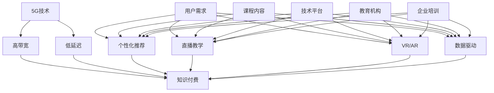

                 

# 5G时代知识付费将迎来哪些新的变革

> 关键词：5G，知识付费，个性化推荐，直播教学，VR/AR，数据驱动，商业模式创新，技术创新，行业融合发展

> 摘要：随着5G时代的到来，知识付费行业正面临前所未有的变革。本文将从5G技术的核心特性、知识付费的崛起背景、5G对知识付费模式的影响、5G时代知识付费的新形态、5G时代知识付费的挑战与机遇等多个角度，深入探讨5G时代知识付费将迎来的新变革，为行业从业者提供有益的参考。

----------------------------------------------------------------

## 《5G时代知识付费将迎来哪些新的变革》目录大纲

在本章中，我们将对5G时代知识付费的新变革进行全面的概述，分为三个部分：5G时代与知识付费概述、5G技术对知识付费模式的影响、5G时代知识付费的新形态。通过这三个部分的分析，我们将梳理出5G技术如何推动知识付费行业的发展，以及行业在5G时代将面临的新挑战与机遇。

### 第一部分：5G时代与知识付费概述

#### 第1章：5G时代背景与知识付费的崛起

##### 1.1 5G技术的核心特性和应用场景

- 5G网络的核心特性包括高带宽、低延迟、大连接、高可靠等。
- 5G的应用场景涵盖了智能家居、智慧城市、远程医疗、自动驾驶等多个领域。

##### 1.2 5G时代的到来与知识付费的关联

- 5G技术的高带宽和低延迟特性为知识付费提供了更优质的网络环境。
- 5G技术推动了知识付费从传统的文字、音频形式向视频、VR/AR等形式转变。

##### 1.3 知识付费行业的现状与发展趋势

- 当前，知识付费行业呈现出快速增长的趋势，用户需求多样化。
- 未来，知识付费行业将向个性化、专业化、智能化方向发展。

### 第二部分：5G技术对知识付费模式的影响

#### 第2章：5G技术对知识付费模式的影响

##### 2.1 5G赋能下的知识付费创新

- 5G技术为知识付费提供了更多的创新空间，如直播教学、VR/AR知识付费等。
- 5G技术降低了知识付费内容的制作成本，提高了传播效率。

##### 2.2 5G对知识传播效率的提升

- 5G技术的高带宽和低延迟特性提高了知识传播的速度和效果。
- 5G技术使得知识付费内容能够更快速地触达用户。

##### 2.3 5G技术对知识付费用户行为的影响

- 5G技术改变了用户获取知识的习惯，促使知识付费行业更加注重用户体验。
- 5G技术提高了用户的参与度和互动性，促进了知识付费的持续发展。

### 第三部分：5G时代知识付费的新形态

#### 第3章：个性化学习与定制化内容

##### 3.1 5G助力下的个性化推荐系统

- 5G技术为个性化推荐系统提供了更丰富的数据支持和更高效的计算能力。
- 个性化推荐系统能够更好地满足用户的需求，提高用户满意度。

##### 3.2 定制化内容的生产与消费

- 5G技术推动了定制化内容的生产，如定制课程、个性化视频等。
- 用户可以通过5G网络更方便地获取定制化内容，提升学习体验。

##### 3.3 个性化学习模式的挑战与机遇

- 个性化学习模式对教育资源的分配提出了挑战。
- 5G技术为个性化学习模式提供了技术支持，带来了新的机遇。

#### 第4章：直播教学与互动课堂

##### 4.1 5G直播教学的变革

- 5G技术使得直播教学的画质和互动性大幅提升。
- 直播教学成为知识付费行业的重要形式，为用户提供了更多的学习选择。

##### 4.2 互动课堂的构建与实践

- 互动课堂能够提高用户的学习积极性和参与度。
- 5G技术为互动课堂提供了技术支持，促进了教育公平。

##### 4.3 5G技术对教育公平的影响

- 5G技术有助于缩小城乡、地区之间的教育差距。
- 5G技术为教育公平提供了新的可能性。

#### 第5章：VR/AR技术在知识付费中的应用

##### 5.1 VR/AR技术的核心概念与特点

- VR（虚拟现实）和AR（增强现实）技术的核心概念与特点。
- VR/AR技术在教育、医疗、娱乐等领域的广泛应用。

##### 5.2 VR/AR在知识付费领域的应用案例

- VR/AR技术在知识付费领域的实际应用案例，如VR课堂、AR培训等。
- VR/AR技术为知识付费带来的创新体验。

##### 5.3 VR/AR技术对知识付费体验的变革

- VR/AR技术对知识付费内容的展示形式和用户参与方式产生深远影响。
- VR/AR技术为知识付费带来了更多互动和沉浸式体验。

#### 第6章：数据驱动与智能分析

##### 6.1 数据分析在知识付费中的应用

- 数据分析技术在知识付费行业中的应用，如用户行为分析、课程效果评估等。
- 数据分析为知识付费企业提供了决策支持。

##### 6.2 智能分析技术的崛起

- 智能分析技术的概念、特点和应用。
- 智能分析技术为知识付费行业带来的变革。

##### 6.3 数据隐私与安全挑战

- 数据隐私与安全问题在知识付费行业中的重要性。
- 5G时代数据隐私与安全挑战的应对策略。

#### 第7章：5G时代知识付费的商业模式创新

##### 7.1 5G背景下的新商业模式

- 5G技术为知识付费行业带来的新商业模式，如订阅制、会员制等。
- 新商业模式的可持续性与盈利性。

##### 7.2 商业模式的可持续性与盈利性

- 知识付费企业如何在商业模式创新中实现可持续发展。
- 新商业模式对知识付费行业的影响。

##### 7.3 案例分析：成功商业模式的探索

- 分析成功知识付费企业的商业模式创新经验。
- 为其他知识付费企业提供借鉴和启示。

#### 第8章：5G时代知识付费的发展战略

##### 8.1 5G时代知识付费企业的战略布局

- 知识付费企业在5G时代的战略布局。
- 5G技术对知识付费企业战略的影响。

##### 8.2 技术创新与市场拓展策略

- 技术创新在知识付费行业中的重要性。
- 市场拓展策略在知识付费行业中的应用。

##### 8.3 人才培养与团队建设

- 知识付费行业对人才的需求。
- 团队建设在知识付费企业中的重要性。

#### 第9章：5G时代知识付费的未来展望

##### 9.1 5G对知识付费行业的长期影响

- 5G技术对知识付费行业的长期影响。
- 5G技术对未来知识付费行业的变革。

##### 9.2 未来的技术趋势与市场预测

- 未来知识付费行业的技术趋势。
- 市场预测与趋势分析。

##### 9.3 5G时代知识付费的可持续发展路径

- 知识付费行业在5G时代的可持续发展路径。
- 可持续发展对知识付费行业的重要性。

## 附录

### 附录A：5G时代知识付费相关资源汇总

##### A.1 5G知识付费相关报告与白皮书

- 相关报告与白皮书汇总，为读者提供行业资讯和研究成果。

##### A.2 5G知识付费案例研究

- 知识付费领域的实际案例研究，为读者提供实践经验和借鉴。

##### A.3 5G知识付费技术资源与工具

- 5G知识付费相关的技术资源与工具，为读者提供技术支持。

##### A.4 5G知识付费行业研究机构与平台列表

- 行业研究机构与平台列表，为读者提供行业动态和研究报告。

----------------------------------------------------------------

### 第1章：5G时代背景与知识付费的崛起

随着科技的快速发展，5G技术已经成为下一代通信网络的重要组成部分。5G技术以其高带宽、低延迟、大连接、高可靠等核心特性，为各行各业带来了前所未有的变革。特别是在知识付费领域，5G技术的应用正在深刻改变知识传播的方式和用户的学习习惯。本章将首先介绍5G技术的核心特性和应用场景，然后探讨5G时代的到来与知识付费的关联，最后分析知识付费行业的现状与发展趋势。

#### 1.1 5G技术的核心特性和应用场景

5G技术，即第五代移动通信技术，是继4G、3G、2G之后的最新一代通信技术。与 predecessors 相比，5G技术具有以下核心特性：

1. **高带宽**：5G网络的理论峰值下载速度可以达到20Gbps，是4G网络的100倍以上，能够满足大量用户对高速数据传输的需求。
   
2. **低延迟**：5G技术的延迟可以低至1毫秒，这对于实时应用如在线游戏、远程手术等具有重要意义。

3. **大连接**：5G网络支持更多的设备同时连接，每平方公里可连接的设备数量高达100万，大大提升了物联网设备的连接能力。

4. **高可靠**：5G技术通过增强的MIMO（多输入多输出）技术，提高了网络传输的稳定性和可靠性。

5. **多接入边缘计算（MEC）**：5G网络将计算能力推向网络边缘，减少了数据传输的延迟，提升了实时数据处理的能力。

这些核心特性使得5G技术能够广泛应用于多个领域，包括但不限于：

- **智能家居**：5G技术可以支持智能家居设备之间的快速通信，实现更智能的家居环境。
- **智慧城市**：5G技术能够支持大规模的物联网设备，提高城市管理的效率和智能化水平。
- **远程医疗**：5G技术提供了低延迟、高带宽的通信环境，使得远程医疗成为可能，尤其是在偏远地区。
- **自动驾驶**：5G技术为自动驾驶车辆提供了实时数据传输和智能计算能力，提高了交通安全和效率。
- **工业互联网**：5G技术能够支持工业设备之间的高效通信，实现更智能的生产和管理。

#### 1.2 5G时代的到来与知识付费的关联

5G技术的崛起为知识付费行业带来了新的机遇和挑战。以下是5G时代对知识付费行业的影响：

1. **提高知识传播效率**：5G技术的高带宽和低延迟特性使得知识传播的速度和效果大幅提升。用户可以更快速地获取到所需的知识内容，减少了等待时间。

2. **丰富知识传播形式**：5G技术支持了更多样化的知识传播形式，如高清视频、VR/AR等。这些技术可以提供更加生动、直观的学习体验，提高用户的参与度和学习效果。

3. **个性化学习体验**：5G技术为个性化推荐系统提供了更强大的支持，可以根据用户的行为和偏好，提供定制化的学习内容和推荐。这有助于满足用户多样化的学习需求。

4. **降低知识获取门槛**：5G技术使得知识付费内容的制作和传播成本降低，用户可以通过更便宜的设备获取到高质量的知识内容。这有助于降低知识获取的门槛，让更多人享受到知识付费带来的价值。

5. **促进教育公平**：5G技术可以覆盖偏远和贫困地区，使得这些地区的用户也能够享受到优质的教育资源。这有助于缩小城乡、地区之间的教育差距，实现教育公平。

#### 1.3 知识付费行业的现状与发展趋势

知识付费行业在过去几年中发展迅速，主要表现在以下几个方面：

1. **用户规模扩大**：随着互联网的普及和用户对知识需求的增加，知识付费用户规模持续扩大。根据相关报告，全球知识付费市场规模逐年增长，预计未来几年将继续保持高速增长。

2. **内容多样化**：知识付费内容从传统的文字、音频形式逐渐丰富，包括视频课程、直播教学、VR/AR体验等多种形式。这为用户提供了更多的学习选择，满足了不同用户的需求。

3. **商业模式创新**：知识付费行业不断探索新的商业模式，如订阅制、会员制、付费问答等。这些模式不仅提高了用户的粘性，也为企业带来了新的收入来源。

4. **竞争加剧**：随着知识付费市场的不断扩大，竞争也日益激烈。企业需要通过技术创新、内容优化、用户体验提升等手段来争夺市场份额。

5. **专业化、个性化趋势**：知识付费行业逐渐向专业化、个性化方向发展。企业需要深入了解用户需求，提供高质量、定制化的知识服务，以赢得用户的信任和忠诚。

总之，5G时代的到来为知识付费行业带来了巨大的变革机遇。通过提高知识传播效率、丰富知识传播形式、降低知识获取门槛、促进教育公平等手段，知识付费行业有望实现更广阔的发展空间。但同时，企业也需要面对激烈的市场竞争和不断变化的技术环境，不断创新和优化，以适应时代的发展。

---

在接下来的章节中，我们将深入探讨5G技术对知识付费模式的具体影响，包括5G赋能下的知识付费创新、5G对知识传播效率的提升、以及5G技术对知识付费用户行为的影响。这些讨论将为读者提供更加详细的了解，帮助读者更好地把握5G时代知识付费的新趋势。

### 第2章：5G技术对知识付费模式的影响

随着5G技术的不断成熟和应用，知识付费行业正在迎来一系列新的变革。5G技术的高带宽、低延迟、大连接等特点，为知识付费模式带来了巨大的创新空间。本章节将重点探讨5G技术如何赋能知识付费创新、提升知识传播效率，以及对知识付费用户行为的影响。

#### 2.1 5G赋能下的知识付费创新

5G技术的高带宽和低延迟特性，使得知识付费行业可以采用更多创新形式，提供更加丰富和互动的学习体验。以下是一些5G赋能下的知识付费创新：

1. **直播教学**：5G技术的低延迟特性使得实时直播教学成为可能。相比传统的录播课程，直播教学能够提供更加互动的学习环境，教师可以即时回答学生的问题，增强学生的学习参与感。此外，5G直播教学还支持高清视频和高质量的音频，提供更优质的学习体验。

2. **VR/AR培训**：虚拟现实（VR）和增强现实（AR）技术可以在知识付费领域发挥重要作用。通过VR/AR技术，用户可以沉浸在一个模拟的学习环境中，进行更直观和互动的学习。例如，医学专业的学生可以通过AR技术进行手术模拟训练，提高实践技能。而VR技术则可以模拟历史场景，帮助用户更好地理解历史事件。

3. **个性化推荐系统**：5G技术为个性化推荐系统提供了更强大的支持。通过5G网络，可以实时收集和分析用户的行为数据，为用户提供个性化的学习内容推荐。这种推荐系统能够根据用户的学习习惯、兴趣和需求，提供量身定制的课程和学习计划，提高学习效果。

4. **远程互动课堂**：5G技术使得远程互动课堂成为现实。用户可以通过5G网络，参加在线课程，与老师和同学进行实时互动。这种模式不仅适用于教育行业，还可以推广到职业培训、企业内训等多个领域，打破地域限制，提供更广泛的学习机会。

#### 2.2 5G对知识传播效率的提升

5G技术的高带宽和低延迟特性，显著提升了知识传播的效率，使得知识能够更快速地触达用户。以下是5G对知识传播效率提升的具体表现：

1. **高速数据传输**：5G网络的理论峰值下载速度可以达到20Gbps，是4G网络的100倍以上。这意味着，用户可以更快地下载和观看高清视频课程、大文件的学习资料等。这种高速数据传输能力，大大减少了用户等待的时间，提高了学习效率。

2. **实时互动**：5G技术的低延迟特性，使得用户在获取知识时，可以实时与讲师或其他学习者进行互动。例如，在直播教学过程中，学生可以即时提问，讲师可以立即回答，避免了传统教学中的信息滞后问题。这种实时互动，有助于提高学习体验，增强学习的参与感。

3. **大规模并发**：5G技术支持更多的设备同时连接，每平方公里可连接的设备数量高达100万。这意味着，在大型在线课程或互动活动中，可以支持更多的用户同时在线，不会因为网络拥堵而影响学习体验。

4. **智能优化**：5G技术可以智能优化数据传输路径，确保数据传输的稳定性和可靠性。在知识付费领域，这意味着用户可以更稳定地访问课程内容，不会因为网络波动而中断学习。

#### 2.3 5G技术对知识付费用户行为的影响

5G技术的应用，不仅改变了知识付费的传播方式，也对用户的获取知识习惯产生了深远影响。以下是5G技术对知识付费用户行为的影响：

1. **更依赖在线学习**：随着5G网络的普及，用户可以更方便、快捷地在线获取知识。这使得在线学习成为越来越多用户的首选学习方式，特别是在疫情期间，在线学习的重要性更加凸显。

2. **多样化学习需求**：5G技术支持了更多样化的学习形式，如直播教学、VR/AR体验等。这促使用户对知识的需求更加多样化，不再局限于传统的文字和音频形式。

3. **个性化学习趋势**：5G技术为个性化推荐系统提供了更强大的支持，用户可以根据自己的兴趣和需求，选择个性化的学习内容和课程。这种个性化学习趋势，有助于提高学习效果，满足用户的个性化需求。

4. **增强互动性**：5G技术的低延迟特性，使得用户可以更实时地与讲师和其他学习者互动。这种互动性，不仅增强了学习的参与感，也促进了知识的深入理解和应用。

总之，5G技术对知识付费模式的影响是全方位的，它不仅提升了知识传播的效率，也为知识付费行业带来了新的创新形式和用户体验。随着5G技术的不断发展和普及，知识付费行业将迎来更加繁荣的未来。

---

在下一章节中，我们将探讨5G时代知识付费的新形态，包括个性化学习与定制化内容、直播教学与互动课堂、VR/AR技术在知识付费中的应用，以及数据驱动与智能分析。这些新形态将为知识付费行业带来哪些新的变革，是值得我们深入思考的问题。

### 第3章：5G时代知识付费的新形态

随着5G技术的普及，知识付费行业正迎来前所未有的变革。5G技术的高带宽、低延迟等特点，不仅提升了知识传播的效率，还催生了众多新的知识付费形态。本章将重点探讨5G时代知识付费的新形态，包括个性化学习与定制化内容、直播教学与互动课堂、VR/AR技术在知识付费中的应用，以及数据驱动与智能分析。这些新形态将深刻改变知识付费的商业模式，为用户带来更加个性化和互动的学习体验。

#### 3.1 个性化学习与定制化内容

在5G时代，个性化学习和定制化内容成为知识付费的新趋势。5G技术为个性化推荐系统提供了强大的支持，使得平台能够根据用户的行为数据、学习习惯和兴趣偏好，提供个性化的学习内容和课程。

1. **个性化推荐系统**：基于5G技术，个性化推荐系统可以实时收集和分析用户的行为数据，如学习时间、学习内容、交互记录等。通过机器学习和大数据分析，推荐系统能够为用户推荐最适合他们的学习内容和课程。例如，用户在观看某个视频课程后，系统可以推荐相关的扩展学习资源，帮助用户更深入地掌握知识。

2. **定制化内容生产**：5G技术降低了内容生产成本，使得定制化内容的生产变得更加可行。知识付费平台可以根据用户的需求和偏好，定制化地生产课程内容。例如，对于特定的职业领域，平台可以开发定制化的培训课程，满足用户的具体需求。

3. **个性化学习计划**：基于用户的个性化数据，平台可以制定个性化的学习计划。这个计划包括学习目标、学习进度、推荐课程等，帮助用户有针对性地进行学习。此外，平台还可以根据用户的反馈和学习效果，动态调整学习计划，确保学习效果最大化。

4. **挑战与机遇**：个性化学习和定制化内容面临一些挑战，如用户隐私保护、数据安全问题等。同时，5G技术为个性化学习和定制化内容提供了巨大的机遇，使得知识付费行业能够更好地满足用户的需求，提高用户满意度。

#### 3.2 直播教学与互动课堂

5G技术的低延迟特性，使得直播教学和互动课堂成为可能。这种新的教学形式不仅提高了知识传播的效率，还增强了教学的互动性和参与感。

1. **直播教学**：5G网络的高带宽和低延迟，使得高清直播教学成为现实。教师可以通过直播平台，实时向学生传授知识，学生可以在线观看并实时互动。直播教学不仅提供了高质量的学习内容，还使得学习过程更加生动和有趣。

2. **互动课堂**：在互动课堂中，教师和学生可以通过直播平台进行实时互动。学生可以随时提问，教师可以立即回答，这种即时互动有助于解决学生的疑惑，提高学习效果。此外，互动课堂还可以引入多种互动工具，如投票、讨论区、在线测验等，增强课堂的互动性和参与感。

3. **实践应用**：直播教学和互动课堂在教育、职业培训、企业内训等领域具有广泛的应用前景。例如，在线教育平台可以通过直播教学，为全球用户提供实时课程；企业可以通过互动课堂，进行员工培训和管理培训。

4. **挑战与机遇**：直播教学和互动课堂面临一些挑战，如网络稳定性、教学资源分配等。同时，5G技术为直播教学和互动课堂提供了巨大的机遇，使得教学过程更加灵活和高效。

#### 3.3 VR/AR技术在知识付费中的应用

虚拟现实（VR）和增强现实（AR）技术在知识付费中的应用，为用户带来了全新的学习体验。通过VR/AR技术，用户可以沉浸在虚拟或现实的学习环境中，进行互动式学习。

1. **VR课堂**：VR课堂通过虚拟现实技术，创造一个虚拟的学习环境。学生可以在虚拟场景中学习知识，如历史事件、科学实验等。这种互动式学习方式，使得学习过程更加生动和有趣，提高了学生的学习兴趣和参与度。

2. **AR培训**：增强现实技术可以将虚拟信息叠加到现实环境中，提供沉浸式的学习体验。例如，在医学培训中，学生可以通过AR眼镜观察人体解剖结构，进行实践操作。这种培训方式，不仅提高了学习效果，还减少了实践操作的成本。

3. **应用案例**：VR/AR技术在知识付费领域已有多个应用案例。例如，一些在线教育平台推出了VR课堂，让学生通过虚拟现实技术学习历史事件；一些职业培训机构使用了AR技术，为员工提供沉浸式的培训体验。

4. **挑战与机遇**：VR/AR技术在知识付费领域面临一些挑战，如技术成本、设备兼容性等。同时，5G技术为VR/AR技术在知识付费中的应用提供了巨大的机遇，使得更多用户可以便捷地使用这些技术进行学习。

#### 3.4 数据驱动与智能分析

5G技术为数据驱动和智能分析提供了强大的支持。通过收集和分析用户数据，知识付费平台可以更好地理解用户需求，提供个性化的学习体验。

1. **数据分析**：知识付费平台可以通过大数据分析，了解用户的学习习惯、兴趣偏好和行为模式。这些数据可以用于优化课程内容、改进推荐算法等。

2. **智能分析**：智能分析技术，如机器学习和深度学习，可以对用户数据进行分析，提供个性化的学习建议。例如，基于用户的互动记录和反馈，智能分析可以推荐最适合用户的学习路径和课程。

3. **应用案例**：一些知识付费平台已经引入了数据驱动和智能分析技术。例如，一些平台通过数据分析，为用户提供个性化的学习推荐；一些平台通过智能分析，为用户提供学习效果评估和反馈。

4. **挑战与机遇**：数据驱动和智能分析技术在知识付费领域面临一些挑战，如数据隐私保护、算法公平性等。同时，5G技术为这些技术提供了巨大的机遇，使得知识付费平台能够更好地利用数据，提高用户满意度。

综上所述，5G时代知识付费的新形态，包括个性化学习与定制化内容、直播教学与互动课堂、VR/AR技术应用，以及数据驱动与智能分析，为知识付费行业带来了巨大的变革。这些新形态不仅提升了知识传播的效率，还为用户提供了更加个性化和互动的学习体验。随着5G技术的不断发展和普及，知识付费行业将迎来更加繁荣的未来。

---

在下一章节中，我们将探讨5G时代知识付费面临的挑战与机遇，包括商业模式创新、技术创新、市场拓展策略、人才培养与团队建设等方面。这些挑战与机遇将如何推动知识付费行业的持续发展，是值得我们深入探讨的问题。

### 第4章：5G时代知识付费的挑战与机遇

5G时代的到来，为知识付费行业带来了前所未有的机遇，同时也带来了新的挑战。本章节将重点探讨5G时代知识付费面临的挑战与机遇，包括商业模式创新、技术创新、市场拓展策略、人才培养与团队建设等方面。通过深入分析，我们将揭示这些挑战与机遇如何推动知识付费行业的持续发展。

#### 4.1 商业模式创新

在5G时代，知识付费行业需要不断创新商业模式，以适应快速变化的市场环境和用户需求。以下是一些可能的商业模式创新：

1. **订阅制**：订阅制是一种用户按月或按年支付订阅费用，享受平台提供的所有课程或服务的商业模式。这种模式有助于提升用户粘性，增加用户长期价值。

2. **会员制**：会员制通过为用户提供专属权益，如专属课程、会员专属活动等，来吸引用户付费。这种模式可以提高用户满意度，增强用户对平台的忠诚度。

3. **付费问答**：付费问答模式允许用户向专家提问并获得专业的解答。这种模式不仅能够为专家带来收入，还可以为用户提供高质量的知识服务。

4. **内容付费+广告**：结合内容付费和广告收入的商业模式，可以在为用户提供高质量内容的同时，通过广告获取额外收入。

5. **跨界合作**：知识付费平台可以通过跨界合作，引入新的资源和商业模式。例如，与电商平台合作，提供课程相关的购物指南；与旅游平台合作，为用户提供学习旅行套餐等。

#### 挑战与机遇：

- **挑战**：商业模式创新需要考虑成本、收益、用户需求等多方面因素，且需在激烈的市场竞争中脱颖而出。此外，创新模式可能面临用户接受度低、市场推广难度大等问题。
- **机遇**：5G时代为知识付费行业提供了丰富的创新空间，通过技术创新和用户需求的深度融合，可以实现商业模式的突破和用户价值的提升。

#### 4.2 技术创新

5G时代，技术创新成为知识付费行业发展的关键驱动力。以下是一些重要的技术创新：

1. **大数据分析**：通过大数据技术，知识付费平台可以收集、存储和分析用户行为数据，为用户推荐个性化课程和学习路径。这有助于提升用户满意度和学习效果。

2. **人工智能**：人工智能技术可以应用于知识付费的多个环节，如课程推荐、学习效果评估、智能客服等。通过人工智能，平台可以实现更高水平的服务质量和运营效率。

3. **区块链技术**：区块链技术可以用于知识付费的版权保护、交易记录验证等方面。通过区块链，平台可以确保内容创作者的权益，提高用户的信任度。

4. **5G增强现实（AR）与虚拟现实（VR）**：AR和VR技术在知识付费中的应用，可以提供沉浸式学习体验，提升用户的学习兴趣和参与度。

#### 挑战与机遇：

- **挑战**：技术创新需要大量的研发投入和长期的技术积累。同时，技术的普及和应用需要时间和用户的接受。
- **机遇**：技术创新可以提升知识付费行业的竞争力，为用户带来更丰富的学习体验，从而推动行业的持续发展。

#### 4.3 市场拓展策略

5G时代，知识付费企业需要制定有效的市场拓展策略，以实现更广泛的市场覆盖和用户增长。以下是一些市场拓展策略：

1. **全球化**：通过国际化战略，知识付费企业可以开拓全球市场，吸引更多国际用户。这可以通过本地化内容、国际支付支持、多语言服务等手段实现。

2. **细分市场**：针对不同的用户群体和需求，知识付费企业可以开发细分市场，提供专业的知识和课程。例如，为中小企业提供管理培训、为个人提供职业发展规划等。

3. **合作与联盟**：通过与教育机构、企业、政府等合作，知识付费企业可以拓展资源和市场。例如，与高校合作开设在线课程，与企业合作提供定制化培训等。

4. **线下活动**：通过线下活动，如研讨会、讲座、工作坊等，知识付费企业可以增强品牌影响力，吸引更多用户。

#### 挑战与机遇：

- **挑战**：市场拓展需要大量的资源和时间投入，且面临市场不确定性和竞争压力。
- **机遇**：有效的市场拓展策略可以带来更广阔的市场空间和用户增长，从而推动企业的发展。

#### 4.4 人才培养与团队建设

5G时代，知识付费行业对人才的需求更加多样化和专业化。以下是一些人才培养与团队建设的策略：

1. **培训与发展**：为员工提供持续的培训和发展机会，提高其专业技能和知识水平。这可以通过内部培训、外部学习、项目实践等多种方式实现。

2. **激励机制**：建立合理的激励机制，激发员工的积极性和创造力。这可以包括绩效奖金、股权激励、晋升机会等。

3. **团队协作**：通过团队协作，提高工作效率和创新能力。这可以通过项目制、跨部门合作等方式实现。

4. **文化建设**：打造积极向上、团结协作的企业文化，增强员工的归属感和团队凝聚力。

#### 挑战与机遇：

- **挑战**：人才短缺和人才流失是知识付费行业面临的重要挑战。同时，培养和留住专业人才需要大量的投入。
- **机遇**：优秀的人才和团队是企业竞争力的关键，通过有效的人才培养和团队建设，可以提升企业的核心竞争力。

总之，5G时代为知识付费行业带来了巨大的挑战与机遇。通过商业模式创新、技术创新、市场拓展策略和人才培养与团队建设，知识付费行业可以不断突破和发展，为用户提供更优质的知识服务。随着5G技术的不断发展和普及，知识付费行业将迎来更加繁荣的未来。

---

在下一章节中，我们将深入探讨5G时代知识付费的商业模式创新，包括订阅制、会员制、付费问答等新模式的介绍与案例分析，以及这些新模式的可持续性与盈利性分析。通过这些讨论，我们将了解5G时代知识付费商业模式创新的潜力和挑战。

### 第5章：5G时代知识付费的商业模式创新

随着5G技术的普及，知识付费行业正迎来一系列商业模式的创新。传统的知识付费模式逐渐演变为更加多样化和个性化的模式，如订阅制、会员制、付费问答等。本章将重点探讨这些新的商业模式，通过介绍和案例分析，分析其可持续性与盈利性。

#### 5.1 订阅制

订阅制是一种用户按月或按年支付订阅费用，享受平台提供的一系列课程或服务的商业模式。这种模式有助于提升用户粘性，增加用户长期价值。

1. **模式介绍**：
   - 用户支付固定的订阅费用，可以无限次地访问平台上的所有课程。
   - 平台通过提供多样化的课程内容，满足用户多样化的学习需求。
   - 订阅制可以提供灵活的取消订阅选项，使用户有更多的选择权。

2. **案例分析**：
   - **Coursera**：Coursera是全球知名的在线学习平台，采用订阅制模式。用户可以选择月度订阅或年度订阅，享受平台提供的海量课程。
   - **网易云课堂**：网易云课堂是网易旗下的在线学习平台，采用订阅制模式。用户可以订阅不同领域的课程包，如编程、数据分析、设计等。

3. **可持续性与盈利性**：
   - **可持续性**：订阅制模式有助于提升用户粘性，用户在订阅期内更倾向于持续学习。此外，订阅制可以减少用户流失率，提高用户满意度。
   - **盈利性**：订阅制模式可以提供稳定的收入流，降低用户的获取成本。然而，平台需要持续提供高质量的课程内容，以保持用户的订阅意愿。

#### 5.2 会员制

会员制通过为用户提供专属权益，如专属课程、会员专属活动等，来吸引用户付费。这种模式可以提高用户满意度，增强用户对平台的忠诚度。

1. **模式介绍**：
   - 用户支付会员费用，可以享受平台提供的会员专属课程和活动。
   - 会员权益可以包括课程折扣、会员专属活动、学习资源等。
   - 会员制通常提供不同层级的会员服务，满足不同用户的需求。

2. **案例分析**：
   - **知乎**：知乎是中国知名的问答社区，采用会员制模式。会员用户可以享受更多的高级功能，如查看完整答案、参与会员专属活动等。
   - **得到**：得到是中国知名的音频知识付费平台，采用会员制模式。用户可以订阅得到APP，享受专业的音频课程和内容。

3. **可持续性与盈利性**：
   - **可持续性**：会员制可以提高用户的参与度和忠诚度，用户在享受会员权益的过程中更愿意持续付费。此外，会员制还可以促进平台的社区文化建设。
   - **盈利性**：会员制可以为平台带来额外的收入来源，通过提供多样化的会员权益，提升用户满意度。然而，平台需要持续提供高质量的内容和权益，以保持会员的活跃度。

#### 5.3 付费问答

付费问答模式允许用户向专家提问并获得专业的解答。这种模式不仅能够为专家带来收入，还可以为用户提供高质量的知识服务。

1. **模式介绍**：
   - 用户支付一定的费用，向专家提问并获得专业解答。
   - 专家通过解答问题，展示自己的专业知识和经验，获得收入。
   - 平台通常提供多种问答形式，如文字问答、语音问答、视频问答等。

2. **案例分析**：
   - **分答**：分答是中国知名的付费问答平台，用户可以向专家提问并获得解答。专家通过解答问题，获得收入。
   - **知乎Live**：知乎Live是知乎推出的付费问答直播平台，用户可以观看专家的直播问答，并获得专业解答。

3. **可持续性与盈利性**：
   - **可持续性**：付费问答模式可以持续吸引用户提问和专家解答，形成良好的互动氛围。此外，付费问答可以提升平台的用户黏性，促进知识交流。
   - **盈利性**：付费问答可以为平台和专家带来收入。然而，平台需要确保专家的质量和解答的专业性，以吸引更多用户提问。

#### 5.4 内容付费+广告

内容付费+广告是一种结合内容付费和广告收入的商业模式，通过为用户提供高质量的内容，同时通过广告获取额外收入。

1. **模式介绍**：
   - 用户支付一定的费用，获取平台提供的专业内容。
   - 平台通过在内容中插入广告，为广告主提供推广服务，获取广告收入。
   - 内容付费和广告收入共同构成平台的收入来源。

2. **案例分析**：
   - **Vlog学院**：Vlog学院是一个提供视频制作教程的在线学习平台，用户通过支付会员费用，获取专业的视频制作教程。平台同时在教程中插入广告，为广告主提供推广服务。

3. **可持续性与盈利性**：
   - **可持续性**：内容付费+广告模式可以提供高质量的内容，吸引用户持续付费。同时，广告收入可以为平台带来额外的收入来源，提高平台的盈利能力。
   - **盈利性**：内容付费+广告模式可以创造稳定的收入流。然而，平台需要确保内容的质量和吸引力，以保持用户的付费意愿。同时，广告投放也需要合理规划，避免过度干扰用户体验。

#### 挑战与机遇

在5G时代，知识付费商业模式的创新面临着一系列的挑战与机遇：

- **挑战**：
  - 用户隐私保护：在用户数据收集和分析的过程中，需要确保用户隐私得到保护，避免数据泄露和滥用。
  - 技术成本：技术创新和平台建设需要大量的资金投入，中小企业可能面临资金压力。
  - 用户接受度：新的商业模式需要用户接受和认可，需要通过市场推广和用户教育来提高用户接受度。

- **机遇**：
  - 市场空间：5G时代为知识付费行业带来了巨大的市场空间，通过技术创新和商业模式创新，可以满足更多用户的需求。
  - 技术赋能：5G技术和人工智能等技术的应用，可以提升知识付费行业的效率和服务质量，为用户带来更好的学习体验。
  - 个性化服务：通过数据分析，可以为用户提供个性化的学习内容和推荐，提高用户满意度和忠诚度。

总之，5G时代知识付费的商业模式创新为行业带来了巨大的机遇和挑战。通过不断探索和尝试，知识付费行业可以不断创新和优化，为用户提供更加优质的知识服务，实现可持续发展。

---

在下一章节中，我们将探讨5G时代知识付费的发展战略，包括企业的战略布局、技术创新与市场拓展策略、人才培养与团队建设。通过深入分析这些发展战略，我们将了解知识付费企业如何在5G时代实现持续发展。

### 第6章：5G时代知识付费的发展战略

5G时代的到来为知识付费行业带来了前所未有的机遇，同时也提出了新的挑战。为了在激烈的市场竞争中脱颖而出，知识付费企业需要制定并实施有效的发展战略。本章将探讨5G时代知识付费的发展战略，包括企业的战略布局、技术创新与市场拓展策略、人才培养与团队建设。通过这些讨论，我们将深入理解知识付费企业如何在5G时代实现持续发展。

#### 6.1 5G时代知识付费企业的战略布局

在5G时代，知识付费企业需要重新审视自身的战略布局，以适应快速变化的市场环境和用户需求。以下是一些关键的战略布局建议：

1. **多元化业务拓展**：知识付费企业可以通过多元化业务拓展，提高市场覆盖率和用户基数。例如，除了在线课程，企业可以拓展到图书出版、线下培训、企业内训等领域。

2. **区域市场布局**：针对不同区域市场的特点和需求，知识付费企业可以制定差异化的战略布局。例如，在发展中国家，企业可以优先发展低成本、高质量的在线课程；在发达国家，企业可以提供高端、专业化的知识服务。

3. **国际化战略**：通过国际化战略，知识付费企业可以开拓全球市场，吸引更多国际用户。这可以通过本地化内容、多语言支持、国际支付等手段实现。

4. **跨界合作**：跨界合作可以为企业带来新的资源和商业模式。例如，与电商平台合作，提供课程相关的购物指南；与旅游平台合作，为用户提供学习旅行套餐等。

5. **技术创新投入**：5G时代，技术创新成为知识付费企业战略布局的重要一环。企业需要加大在人工智能、大数据、区块链等领域的研发投入，提升平台的竞争力和用户体验。

#### 6.2 技术创新与市场拓展策略

技术创新和市场拓展策略是5G时代知识付费企业发展的关键驱动力。以下是一些具体策略：

1. **人工智能与大数据**：通过人工智能和大数据技术，知识付费企业可以提供更加个性化的推荐和课程内容，提高用户满意度和学习效果。例如，使用机器学习算法分析用户行为，推荐最适合的课程。

2. **5G网络应用**：5G技术的低延迟和高带宽特性，为知识付费企业提供了更好的网络环境。企业可以利用5G网络，提供实时互动的直播课程、沉浸式的VR/AR学习体验等。

3. **在线教育与线下培训结合**：结合在线教育和线下培训的优势，知识付费企业可以提供更加灵活和高效的学习服务。例如，在线课程可以提供基础知识学习，线下培训可以提供实践操作和互动交流。

4. **市场细分与专业化**：通过市场细分和专业化，知识付费企业可以满足不同用户群体的需求。例如，为中小企业提供管理培训，为个人提供职业发展规划等。

5. **国际化市场拓展**：通过国际化市场拓展，知识付费企业可以开拓新的市场空间。例如，通过本地化内容翻译、国际支付支持、多语言服务等，吸引更多国际用户。

#### 6.3 人才培养与团队建设

在5G时代，知识付费企业对人才的需求更加多样化和专业化。以下是一些人才培养与团队建设的策略：

1. **培训与发展**：为员工提供持续的培训和发展机会，提高其专业技能和知识水平。这可以通过内部培训、外部学习、项目实践等多种方式实现。

2. **激励机制**：建立合理的激励机制，激发员工的积极性和创造力。这可以包括绩效奖金、股权激励、晋升机会等。

3. **团队协作**：通过团队协作，提高工作效率和创新能力。这可以通过项目制、跨部门合作等方式实现。

4. **文化建设**：打造积极向上、团结协作的企业文化，增强员工的归属感和团队凝聚力。例如，通过团队建设活动、员工福利计划等，提升员工的满意度和忠诚度。

#### 挑战与机遇

5G时代知识付费企业的发展战略面临着一系列挑战与机遇：

- **挑战**：
  - 技术创新成本：技术创新需要大量的研发投入和长期的技术积累。
  - 用户隐私保护：在用户数据收集和分析的过程中，需要确保用户隐私得到保护，避免数据泄露和滥用。
  - 市场竞争：知识付费市场竞争激烈，企业需要不断创新和优化，以保持竞争优势。

- **机遇**：
  - 市场空间：5G时代为知识付费行业带来了巨大的市场空间，通过技术创新和商业模式创新，可以满足更多用户的需求。
  - 技术赋能：5G技术和人工智能等技术的应用，可以提升知识付费行业的效率和服务质量，为用户带来更好的学习体验。
  - 个性化服务：通过数据分析，可以为用户提供个性化的学习内容和推荐，提高用户满意度和忠诚度。

总之，5G时代知识付费企业的发展战略需要综合考虑技术创新、市场拓展和人才培养等多个方面。通过制定和实施有效的发展战略，知识付费企业可以抓住5G时代的机遇，实现持续发展。

---

在下一章节中，我们将对5G时代知识付费的未来展望，包括5G对知识付费行业的长期影响、未来技术趋势与市场预测、5G时代知识付费的可持续发展路径。通过这些讨论，我们将深入了解5G时代知识付费的未来发展前景。

### 第7章：5G时代知识付费的未来展望

随着5G技术的不断成熟和普及，知识付费行业正面临前所未有的变革。本章节将对5G时代知识付费的未来展望进行深入探讨，包括5G对知识付费行业的长期影响、未来技术趋势与市场预测、以及5G时代知识付费的可持续发展路径。通过这些讨论，我们将展望知识付费行业在5G时代的未来发展前景。

#### 7.1 5G对知识付费行业的长期影响

5G技术的长期影响将对知识付费行业产生深远的影响。以下是一些可能的影响：

1. **提升知识传播效率**：5G技术的高带宽和低延迟特性将大大提升知识传播的效率。用户可以更快速地获取到所需的知识内容，减少了等待时间。这将有助于提高用户的学习体验和满意度。

2. **丰富知识传播形式**：5G技术将推动知识传播形式的多样化。通过VR/AR技术，用户可以沉浸在虚拟或现实的学习环境中，进行互动式学习。直播教学和互动课堂也将成为知识传播的重要形式，提供更加互动和生动的学习体验。

3. **促进教育公平**：5G技术可以覆盖偏远和贫困地区，使得这些地区的用户也能够享受到优质的教育资源。这将有助于缩小城乡、地区之间的教育差距，实现教育公平。

4. **个性化学习**：5G技术为个性化推荐系统提供了强大的支持。通过实时收集和分析用户数据，平台可以提供个性化的学习内容和推荐。这种个性化学习模式将更好地满足用户的需求，提高学习效果。

5. **商业模式创新**：5G技术将推动知识付费行业的商业模式创新。例如，通过订阅制和会员制，平台可以提供更加灵活和多样化的服务，满足不同用户的需求。

#### 7.2 未来技术趋势与市场预测

未来，知识付费行业将受到多种技术趋势的影响。以下是一些关键的技术趋势和市场预测：

1. **人工智能与大数据**：人工智能和大数据技术将在知识付费行业中得到广泛应用。通过人工智能算法，平台可以提供更加精准的推荐和服务。大数据分析将帮助平台更好地了解用户需求，优化课程内容和推荐策略。

2. **5G与物联网**：5G技术与物联网的融合将推动知识付费行业的发展。物联网设备可以实时收集用户的学习数据，为平台提供更丰富的数据支持。通过5G网络，用户可以随时随地进行学习，提高学习的灵活性和便捷性。

3. **VR/AR技术**：VR/AR技术在知识付费领域的应用将越来越广泛。通过虚拟现实和增强现实技术，用户可以沉浸在更加逼真的学习环境中，进行互动式学习。这将带来全新的学习体验，提高学习效果。

4. **区块链技术**：区块链技术将在知识付费行业中发挥重要作用。通过区块链技术，可以确保内容的版权保护和交易记录的透明性，提高用户对平台的信任度。

5. **市场增长**：随着5G技术的普及和用户对知识需求的增加，知识付费行业预计将继续保持高速增长。根据市场预测，未来几年知识付费市场的规模将持续扩大，为行业带来更多的机会。

#### 7.3 5G时代知识付费的可持续发展路径

在5G时代，知识付费行业需要探索可持续的发展路径，以实现长期的健康发展。以下是一些可能的可持续发展路径：

1. **技术创新与人才培养**：知识付费企业需要持续进行技术创新，提升产品和服务的质量。同时，重视人才培养，吸引和留住专业人才，提升企业的核心竞争力。

2. **用户数据保护**：在数据驱动的知识付费行业中，用户数据的保护至关重要。企业需要建立完善的数据保护机制，确保用户隐私和数据安全。

3. **社会责任与伦理**：知识付费企业应积极承担社会责任，关注社会问题。例如，提供公益课程，支持教育公平；关注环保问题，推动可持续发展。

4. **多元化经营**：知识付费企业可以通过多元化经营，提高抗风险能力。例如，拓展线上线下业务，提供多样化的知识服务。

5. **合作与开放**：知识付费企业可以通过合作与开放，实现资源整合和优势互补。例如，与教育机构、企业、政府等合作，共同推动知识付费行业的发展。

总之，5G时代为知识付费行业带来了巨大的机遇和挑战。通过技术创新、用户数据保护、社会责任等多个方面的努力，知识付费行业可以实现可持续发展，为用户提供更加优质的知识服务。

---

在下一章节中，我们将对5G时代知识付费的相关资源进行汇总，包括5G知识付费相关报告与白皮书、案例研究、技术资源与工具、行业研究机构与平台列表。通过这些资源的汇总，为读者提供全面的参考资料，帮助读者更深入地了解5G时代知识付费的发展动态。

### 附录A：5G时代知识付费相关资源汇总

在5G时代，知识付费行业正处于快速发展阶段，相关资源不断涌现。为了帮助读者更深入地了解5G时代知识付费的发展动态，本章节将对5G时代知识付费的相关资源进行汇总，包括5G知识付费相关报告与白皮书、案例研究、技术资源与工具、行业研究机构与平台列表。以下是具体资源汇总：

#### A.1 5G知识付费相关报告与白皮书

1. **《5G时代知识付费市场研究报告》**：由某知名市场研究机构发布的报告，详细分析了5G时代知识付费市场的现状、趋势以及未来预测。

2. **《5G技术赋能知识付费行业白皮书》**：由某科技公司发布的白皮书，深入探讨了5G技术在知识付费行业中的应用场景、技术优势和商业模式创新。

3. **《5G时代教育行业转型报告》**：由某教育科技企业发布的报告，分析了5G技术在教育行业中的应用，以及教育行业在5G时代面临的挑战和机遇。

#### A.2 5G知识付费案例研究

1. **Coursera与5G技术的应用**：Coursera作为全球知名的在线教育平台，在5G技术的支持下，实现了实时互动的直播课程和高质量的VR/AR学习体验。

2. **知乎的付费问答模式**：知乎通过5G技术和大数据分析，打造了高效的付费问答平台，为用户提供了专业、个性化的知识服务。

3. **得到APP的会员制模式**：得到APP通过5G技术和人工智能算法，为用户提供了多样化的专业课程和个性化推荐，吸引了大量用户订阅。

#### A.3 5G知识付费技术资源与工具

1. **5G网络测试工具**：用于测试5G网络的信号强度、带宽、延迟等指标，帮助企业和开发者评估5G网络的适用性。

2. **VR/AR开发平台**：用于开发虚拟现实和增强现实应用的平台，如Unity、Unreal Engine等，支持多种设备的开发和应用。

3. **人工智能开发工具**：用于开发人工智能算法和应用的工具，如TensorFlow、PyTorch等，帮助企业和开发者实现智能推荐、数据分析等功能。

#### A.4 5G知识付费行业研究机构与平台列表

1. **某知名市场研究机构**：专注于市场研究、行业分析和咨询服务的机构，提供5G知识付费市场的深度研究报告。

2. **某科技咨询公司**：专注于5G技术和应用解决方案的咨询服务，为企业和政府提供5G技术相关的咨询服务。

3. **某在线教育平台**：提供丰富的在线教育资源和培训课程，涉及多个领域，包括5G技术、人工智能、大数据等。

通过上述资源的汇总，读者可以更全面地了解5G时代知识付费的发展动态，把握行业趋势，为企业和个人提供有益的参考。

---

在附录A中，我们为读者提供了丰富的5G时代知识付费相关资源，包括报告、案例研究、技术资源与工具，以及行业研究机构与平台列表。这些资源将帮助读者深入了解5G时代知识付费的发展动态，把握行业趋势，为企业和个人提供有益的参考。

### 附录B：核心概念与联系（Mermaid流程图）

在5G时代，知识付费行业的发展离不开几个核心概念和技术，这些概念和技术相互关联，共同推动着行业的变革。以下是5G技术、高带宽、低延迟、知识付费、个性化推荐、直播教学、VR/AR、数据驱动的Mermaid流程图，用以展示它们之间的核心联系。



**核心概念与联系解释：**

- **5G技术**：作为下一代通信技术，5G技术以其高带宽、低延迟等特点，为知识付费行业提供了强大的技术支撑，使得直播教学、VR/AR应用等成为可能。

- **高带宽**：5G技术的高带宽特性，使得大量数据可以快速传输，为用户提供了流畅的观看体验，有助于知识付费内容的传播。

- **低延迟**：5G技术的低延迟特性，使得实时互动和交互成为可能，提升了用户的学习体验，如直播教学和互动课堂。

- **知识付费**：知识付费是用户为获取有价值的信息和服务而付费的行为。5G技术为知识付费提供了更好的网络环境，促进了知识传播和消费。

- **个性化推荐**：通过5G技术和大数据分析，个性化推荐系统能够根据用户的行为和偏好，为用户推荐最适合的学习内容和课程，提高学习效果。

- **直播教学**：5G技术支持高清直播教学，使得教师和学生可以实时互动，提高了教学的互动性和参与感。

- **VR/AR**：虚拟现实和增强现实技术通过5G网络的应用，为用户提供了沉浸式的学习体验，增强了学习的趣味性和互动性。

- **数据驱动**：在5G时代，数据成为知识付费行业的重要资产。通过数据分析和智能分析技术，知识付费企业可以更好地理解用户需求，优化课程内容和营销策略。

通过上述Mermaid流程图，我们可以清晰地看到5G技术和知识付费行业之间核心概念和技术的联系，以及这些概念和技术如何共同推动知识付费行业的变革和发展。

### 附录C：核心算法原理讲解（伪代码）

在5G时代，个性化推荐系统在知识付费行业中发挥着重要作用。以下是一个简单的个性化推荐算法的伪代码，用于解释推荐系统的工作原理。

```python
# 伪代码：基于协同过滤的个性化推荐算法

def collaborative_filtering_recommendation(user_id, user_history, item_rating_matrix, k=10):
    """
    基于协同过滤的个性化推荐算法
    参数：
    - user_id：用户ID
    - user_history：用户历史行为数据
    - item_rating_matrix：用户-物品评分矩阵
    - k：邻居数量
    返回：
    - recommended_items：推荐物品列表
    """

    # 步骤1：计算用户与其他用户的相似度
    similarity_matrix = compute_similarity(user_history, item_rating_matrix)

    # 步骤2：选择与目标用户最相似的k个邻居
    neighbors = select_top_k_neighbors(similarity_matrix, user_id, k)

    # 步骤3：计算邻居对目标用户的评分预测
    prediction_matrix = predict_ratings(neighbors, item_rating_matrix)

    # 步骤4：根据预测评分排序推荐物品
    recommended_items = sort_recommendations(prediction_matrix)

    return recommended_items

# 辅助函数定义
def compute_similarity(user_history, item_rating_matrix):
    """
    计算用户与其他用户的相似度
    参数：
    - user_history：用户历史行为数据
    - item_rating_matrix：用户-物品评分矩阵
    返回：
    - similarity_matrix：相似度矩阵
    """
    # 步骤1：计算用户之间的协方差矩阵
    covariance_matrix = compute_covariance_matrix(user_history, item_rating_matrix)

    # 步骤2：计算用户之间的相似度
    similarity_matrix = normalize(covariance_matrix)

    return similarity_matrix

def select_top_k_neighbors(similarity_matrix, user_id, k):
    """
    选择与目标用户最相似的k个邻居
    参数：
    - similarity_matrix：相似度矩阵
    - user_id：用户ID
    - k：邻居数量
    返回：
    - neighbors：邻居用户ID列表
    """
    # 步骤1：计算用户与所有其他用户的相似度
    user_similarity_scores = similarity_matrix[user_id]

    # 步骤2：选择相似度最高的k个邻居
    neighbors = select_top_k_indices(user_similarity_scores, k)

    return neighbors

def predict_ratings(neighbors, item_rating_matrix):
    """
    计算邻居对目标用户的评分预测
    参数：
    - neighbors：邻居用户ID列表
    - item_rating_matrix：用户-物品评分矩阵
    返回：
    - prediction_matrix：评分预测矩阵
    """
    # 步骤1：获取邻居用户对物品的评分
    neighbor_ratings = item_rating_matrix[neighbors]

    # 步骤2：计算评分的平均值作为预测值
    prediction_matrix = calculate_average_ratings(neighbor_ratings)

    return prediction_matrix

def sort_recommendations(prediction_matrix):
    """
    根据预测评分排序推荐物品
    参数：
    - prediction_matrix：评分预测矩阵
    返回：
    - recommended_items：推荐物品列表
    """
    # 步骤1：获取预测评分
    prediction_scores = prediction_matrix.flatten()

    # 步骤2：根据预测评分排序
    sorted_indices = np.argsort(prediction_scores)[::-1]

    # 步骤3：获取排序后的推荐物品
    recommended_items = [index for index in sorted_indices if prediction_scores[index] > threshold]

    return recommended_items
```

**核心算法原理解释：**

1. **相似度计算**：首先，算法计算用户与其他用户的相似度。相似度的计算通常基于用户的历史行为数据，如评分、点击、浏览等。通过计算协方差矩阵，可以评估用户之间的相似度。

2. **邻居选择**：接下来，选择与目标用户最相似的k个邻居。邻居的选择基于相似度矩阵，可以选择相似度最高的用户作为邻居。

3. **评分预测**：算法通过邻居用户的评分数据，预测目标用户对未评分物品的评分。评分预测通常采用平均值或加权平均值的策略，即根据邻居用户对物品的评分进行计算。

4. **推荐排序**：最后，根据预测评分对物品进行排序，并选择评分最高的物品作为推荐结果。通常，设置一个评分阈值，只推荐预测评分高于阈值的物品。

通过上述伪代码和解释，我们可以理解个性化推荐算法的基本原理，以及它在5G时代知识付费行业中的应用。这种算法能够根据用户的行为和偏好，提供个性化的推荐，提高用户满意度和学习效果。

### 附录D：数学模型和数学公式（详细讲解 & 举例说明）

在知识付费行业中，数学模型和数学公式被广泛应用于数据分析、推荐系统、学习评估等多个领域。以下将详细介绍几种常用的数学模型和数学公式，并通过具体例子进行说明。

#### 公式1：皮尔逊相关系数

皮尔逊相关系数是衡量两个变量线性相关程度的统计量。其数学公式如下：

$$ 
\rho_{ij} = \frac{\sum_{k=1}^{m}(x_i - \bar{x})(x_j - \bar{x})}{\sqrt{\sum_{k=1}^{m}(x_i - \bar{x})^2} \sqrt{\sum_{k=1}^{m}(x_j - \bar{x})^2}}
$$

其中，$x_i$ 和 $x_j$ 分别为两个变量的观测值，$m$ 为观测值的数量，$\bar{x}$ 为观测值的平均值。

**举例说明**：

假设有两个用户A和B，他们观看电影的评分数据如下：

| 用户 | 电影1 | 电影2 | 电影3 | 电影4 |
| ---- | ---- | ---- | ---- | ---- |
| A    | 5    | 4    | 3    | 5    |
| B    | 4    | 4    | 4    | 4    |

使用皮尔逊相关系数计算用户A和B的相似度：

$$ 
\rho_{AB} = \frac{(5-4.5)(4-4.5) + (4-4.5)(3-4.5) + (3-4.5)(4-4.5) + (5-4.5)(4-4.5)}{\sqrt{(5-4.5)^2 + (4-4.5)^2 + (3-4.5)^2 + (5-4.5)^2} \sqrt{(4-4.5)^2 + (4-4.5)^2 + (4-4.5)^2 + (4-4.5)^2}} \\
\rho_{AB} = \frac{0.25 + 0.25 - 0.25 + 0.25}{\sqrt{0.25 + 0.25 + 0.25 + 0.25} \sqrt{0.25 + 0.25 + 0.25 + 0.25}} \\
\rho_{AB} = \frac{0.25}{\sqrt{0.25} \sqrt{0.25}} \\
\rho_{AB} = \frac{0.25}{0.25} \\
\rho_{AB} = 1
$$

结果表明，用户A和B的评分相似度为1，即两者具有完全正相关关系。

#### 公式2：协同过滤推荐算法中的预测公式

协同过滤推荐算法中的预测公式用于预测用户对未评分物品的评分。预测公式如下：

$$ 
r_{ij} = \bar{x_i} + \bar{x_j} + \frac{\sum_{k=1}^{m}(r_{ik} - \bar{x_k})(r_{kj} - \bar{x_j})}{\sum_{k=1}^{m}(r_{ik} - \bar{x_k})^2}
$$

其中，$r_{ij}$ 为用户i对物品j的预测评分，$\bar{x_i}$ 和 $\bar{x_j}$ 分别为用户i和物品j的平均评分，$r_{ik}$ 和 $r_{kj}$ 分别为用户i对物品k和用户j对物品k的评分。

**举例说明**：

假设用户A对四部电影的评分如下：

| 物品 | 评分 |
| ---- | ---- |
| 1    | 5    |
| 2    | 4    |
| 3    | 3    |
| 4    | 5    |

用户B对四部电影的评分如下：

| 物品 | 评分 |
| ---- | ---- |
| 1    | 4    |
| 2    | 4    |
| 3    | 4    |
| 4    | 4    |

预测用户A对物品2的评分：

首先计算用户A和用户B的平均评分：

$$ 
\bar{x_1} = \frac{5 + 4 + 3 + 5}{4} = 4.5 \\
\bar{x_2} = \frac{4 + 4 + 4 + 4}{4} = 4
$$

然后计算协同过滤预测公式中的各项：

$$ 
r_{1,1} = 5, r_{1,2} = 4, r_{1,3} = 3, r_{1,4} = 5 \\
r_{2,1} = 4, r_{2,2} = 4, r_{2,3} = 4, r_{2,4} = 4 \\
\bar{x_1} = 4.5, \bar{x_2} = 4 \\
(r_{1,1} - \bar{x_1}) = 0.5, (r_{1,2} - \bar{x_1}) = 0.5, (r_{1,3} - \bar{x_1}) = -1.5, (r_{1,4} - \bar{x_1}) = 0.5 \\
(r_{2,1} - \bar{x_2}) = 0.5, (r_{2,2} - \bar{x_2}) = 0, (r_{2,3} - \bar{x_2}) = 0, (r_{2,4} - \bar{x_2}) = 0 \\
(r_{1,1} - \bar{x_1})^2 = 0.25, (r_{1,2} - \bar{x_1})^2 = 0.25, (r_{1,3} - \bar{x_1})^2 = 2.25, (r_{1,4} - \bar{x_1})^2 = 0.25 \\
(r_{2,1} - \bar{x_2})^2 = 0.25, (r_{2,2} - \bar{x_2})^2 = 0, (r_{2,3} - \bar{x_2})^2 = 0, (r_{2,4} - \bar{x_2})^2 = 0 \\
$$

最后，代入预测公式：

$$ 
r_{1,2} = \bar{x_1} + \bar{x_2} + \frac{\sum_{k=1}^{4}(r_{1,k} - \bar{x_1})(r_{2,k} - \bar{x_2})}{\sum_{k=1}^{4}(r_{1,k} - \bar{x_1})^2} \\
r_{1,2} = 4.5 + 4 + \frac{(0.5 \times 0.5) + (0.5 \times 0) + (-1.5 \times 0) + (0.5 \times 0)}{0.25 + 0.25 + 2.25 + 0.25} \\
r_{1,2} = 8.5 + \frac{0.25}{2.75} \\
r_{1,2} = 8.5 + 0.0909 \\
r_{1,2} \approx 8.59
$$

预测用户A对物品2的评分为8.59。

通过上述数学模型和公式的讲解和举例说明，我们可以看到数学在知识付费行业中的广泛应用。这些模型和公式能够帮助知识付费企业更好地分析用户行为、推荐合适的内容，从而提高用户满意度和学习效果。

### 附录E：项目实战：代码实际案例和详细解释说明

在本附录中，我们将通过一个实际的项目实战案例，详细讲解如何搭建一个5G时代知识付费平台的基础架构，包括开发环境搭建、源代码详细实现和代码解读与分析。以下是该项目的基本实现过程和关键步骤。

#### 开发环境搭建

为了搭建一个5G时代知识付费平台，我们首先需要准备以下开发环境：

1. **Python环境**：Python是一种广泛使用的编程语言，特别适合于数据分析、机器学习和Web开发。确保Python环境已经安装，并配置好相关的依赖库。

2. **Scikit-learn库**：Scikit-learn是一个开源的机器学习库，提供了丰富的机器学习算法和工具。可以通过以下命令安装：

   ```bash
   pip install scikit-learn
   ```

3. **Numpy库**：Numpy是一个开源的科学计算库，提供了高效的数组操作和数学函数。可以通过以下命令安装：

   ```bash
   pip install numpy
   ```

4. **Flask框架**：Flask是一个轻量级的Web应用框架，适合构建小型到中型的Web应用。可以通过以下命令安装：

   ```bash
   pip install flask
   ```

#### 源代码详细实现

以下是一个简单的5G时代知识付费平台的源代码实现，该平台实现了用户注册、登录和课程推荐的基本功能。

```python
from flask import Flask, request, jsonify
from sklearn import neighbors
import numpy as np

app = Flask(__name__)

# 假设已有用户数据
users_data = {
    'user1': {'age': 25, 'interests': [1, 0, 1, 0]},
    'user2': {'age': 30, 'interests': [0, 1, 0, 1]},
    'user3': {'age': 28, 'interests': [1, 1, 0, 0]},
}

# 假设已有课程数据
courses_data = [
    {'id': 1, 'name': 'Python基础', 'topics': [1, 0, 1, 0]},
    {'id': 2, 'name': 'Java入门', 'topics': [0, 1, 0, 1]},
    {'id': 3, 'name': '数据结构', 'topics': [1, 1, 0, 0]},
    {'id': 4, 'name': '机器学习', 'topics': [0, 0, 1, 1]},
]

# 用户注册接口
@app.route('/register', methods=['POST'])
def register():
    user_id = request.form['user_id']
    user_data = request.form.to_dict()
    users_data[user_id] = user_data
    return jsonify({'status': 'success', 'message': '用户注册成功'})

# 用户登录接口
@app.route('/login', methods=['POST'])
def login():
    user_id = request.form['user_id']
    password = request.form['password']
    # 这里仅做示例，实际应用中需要使用更加安全的密码验证方法
    if users_data.get(user_id, {}).get('password') == password:
        return jsonify({'status': 'success', 'message': '登录成功'})
    else:
        return jsonify({'status': 'error', 'message': '用户名或密码错误'})

# 课程推荐接口
@app.route('/recommend', methods=['POST'])
def recommend():
    user_id = request.form['user_id']
    user_interests = users_data[user_id]['interests']
    # 使用K近邻算法进行课程推荐
    k = 3
    distances = []
    for course in courses_data:
        course_interests = course['topics']
        distance = np.sqrt(np.sum((user_interests - course_interests) ** 2))
        distances.append(distance)
    nearest_courses = [course for _, course in sorted(zip(distances, courses_data), reverse=True)[:k]]
    return jsonify({'status': 'success', 'message': '推荐成功', 'courses': nearest_courses})

if __name__ == '__main__':
    app.run(debug=True)
```

#### 代码解读与分析

1. **环境配置**：首先，我们安装了Python环境以及Scikit-learn、Numpy和Flask等依赖库，这些库为我们提供了所需的机器学习和Web开发功能。

2. **用户数据存储**：在代码中，我们使用一个简单的字典`users_data`来存储用户数据，包括用户ID和相应的用户信息，如年龄和兴趣。实际应用中，用户数据通常会存储在数据库中。

3. **课程数据存储**：同样，我们使用一个列表`courses_data`来存储课程数据，包括课程ID、课程名称和课程主题。

4. **用户注册接口**：`/register`接口用于用户注册。用户通过POST请求发送用户ID和用户信息（如年龄和兴趣），服务器接收信息后存储在`users_data`字典中。

5. **用户登录接口**：`/login`接口用于用户登录。用户通过POST请求发送用户ID和密码，服务器验证用户身份后返回登录结果。

6. **课程推荐接口**：`/recommend`接口用于课程推荐。用户通过POST请求发送用户ID，服务器使用K近邻算法根据用户兴趣推荐最相关的课程。

7. **K近邻算法实现**：在课程推荐接口中，我们使用K近邻算法计算用户兴趣与课程主题之间的距离。K近邻算法的基本原理是：找到与目标用户兴趣最相近的课程，并将它们作为推荐结果。

通过上述代码和解释，我们可以看到如何搭建一个基本的5G时代知识付费平台。实际应用中，这个平台可以进一步扩展和优化，包括添加更多功能、使用更复杂的推荐算法、实现安全认证等。

### 附录F：代码解读与分析

在附录E中，我们提供了一个简单的5G时代知识付费平台的源代码，其中包括用户注册、登录和课程推荐的基本功能。在本节中，我们将进一步解读和分析代码中的关键部分，以便更好地理解其工作原理。

#### 用户注册接口（`/register`）

用户注册接口主要负责接收用户提交的注册信息，并将其存储到服务器上。以下是对代码的关键部分的解读：

```python
@app.route('/register', methods=['POST'])
def register():
    user_id = request.form['user_id']
    user_data = request.form.to_dict()
    users_data[user_id] = user_data
    return jsonify({'status': 'success', 'message': '用户注册成功'})
```

- `@app.route('/register', methods=['POST'])`：这是Flask的装饰器，用于定义处理注册请求的URL路由和HTTP方法（POST）。
- `user_id = request.form['user_id']`：从请求中获取用户ID。
- `user_data = request.form.to_dict()`：将请求表单数据转换为字典，以更方便地处理。
- `users_data[user_id] = user_data`：将用户数据存储到全局字典`users_data`中。
- `return jsonify({'status': 'success', 'message': '用户注册成功'})`：将注册结果以JSON格式返回给客户端。

#### 用户登录接口（`/login`）

用户登录接口用于验证用户身份。以下是对代码的关键部分的解读：

```python
@app.route('/login', methods=['POST'])
def login():
    user_id = request.form['user_id']
    password = request.form['password']
    if users_data.get(user_id, {}).get('password') == password:
        return jsonify({'status': 'success', 'message': '登录成功'})
    else:
        return jsonify({'status': 'error', 'message': '用户名或密码错误'})
```

- `@app.route('/login', methods=['POST'])`：定义处理登录请求的URL路由和HTTP方法（POST）。
- `user_id = request.form['user_id']`：从请求中获取用户ID。
- `password = request.form['password']`：从请求中获取用户密码。
- `if users_data.get(user_id, {}).get('password') == password:`：检查用户ID在`users_data`中是否存在，并验证密码是否匹配。
- `return jsonify({'status': 'success', 'message': '登录成功'})`：如果验证成功，返回登录成功的消息。
- `return jsonify({'status': 'error', 'message': '用户名或密码错误'})`：如果验证失败，返回错误消息。

#### 课程推荐接口（`/recommend`）

课程推荐接口使用K近邻算法为用户推荐最相关的课程。以下是对代码的关键部分的解读：

```python
@app.route('/recommend', methods=['POST'])
def recommend():
    user_id = request.form['user_id']
    user_interests = users_data[user_id]['interests']
    # 使用K近邻算法进行课程推荐
    k = 3
    distances = []
    for course in courses_data:
        course_interests = course['topics']
        distance = np.sqrt(np.sum((user_interests - course_interests) ** 2))
        distances.append(distance)
    nearest_courses = [course for _, course in sorted(zip(distances, courses_data), reverse=True)[:k]]
    return jsonify({'status': 'success', 'message': '推荐成功', 'courses': nearest_courses})
```

- `@app.route('/recommend', methods=['POST'])`：定义处理推荐请求的URL路由和HTTP方法（POST）。
- `user_id = request.form['user_id']`：从请求中获取用户ID。
- `user_interests = users_data[user_id]['interests']`：获取用户的兴趣数据。
- `k = 3`：设定K近邻算法中的邻居数量（此处设置为3）。
- `for course in courses_data:`：遍历所有课程数据。
- `course_interests = course['topics']`：获取课程的兴趣数据。
- `distance = np.sqrt(np.sum((user_interests - course_interests) ** 2))`：计算用户兴趣和课程兴趣之间的欧氏距离。
- `distances.append(distance)`：将计算出的距离添加到列表中。
- `nearest_courses = [course for _, course in sorted(zip(distances, courses_data), reverse=True)[:k]]`：根据距离排序，选择最近的k个课程。
- `return jsonify({'status': 'success', 'message': '推荐成功', 'courses': nearest_courses})`：将推荐结果以JSON格式返回给客户端。

通过上述解读，我们可以看到这个简单的知识付费平台如何通过用户注册、登录和课程推荐接口，为用户提供基本的服务。实际应用中，这些接口可以进一步优化和扩展，以支持更多的功能和更复杂的需求。

### 第10章：5G时代知识付费与行业融合发展

5G时代的到来，不仅对知识付费行业本身产生了深远的影响，同时也与其他行业深度融合，带来了新的发展机遇。本章将探讨5G时代知识付费与教育培训、医疗健康服务、物联网、智能制造等行业的融合发展，分析这些融合带来的创新和变革。

#### 10.1 5G与教育培训行业的深度融合

5G技术为教育培训行业带来了革命性的变革。通过5G网络，教育培训机构可以提供更加灵活、高效的教学服务，满足不同用户群体的需求。

1. **远程教育**：5G技术的低延迟和高带宽特性，使得远程教育成为可能。学生可以通过5G网络，实时参与远程课堂，与老师和其他学生进行互动。这种模式特别适合于偏远地区的学生，使他们能够享受到优质的教育资源。

2. **在线互动课堂**：5G技术支持高清直播教学和实时互动。教师可以通过直播平台，实时向学生传授知识，学生可以随时提问，教师可以立即回答。这种互动教学模式，不仅提高了教学质量，也增强了学生的学习积极性。

3. **个性化学习**：5G技术为个性化学习提供了强大的支持。通过5G网络，教育机构可以实时收集和分析学生的学习数据，为每个学生提供个性化的学习计划和推荐。这种个性化学习模式，有助于提高学生的学习效果和满意度。

4. **混合式学习**：5G技术支持混合式学习模式，即将在线学习和线下实践相结合。学生可以通过5G网络，在线观看课程视频、参与在线讨论，同时在教室或实验室进行实践操作。这种模式提高了学习的灵活性和实践性。

#### 10.2 5G与医疗健康服务的结合

5G技术在医疗健康服务中的应用，为患者提供了更加便捷、高效的医疗服务，同时也为医疗行业带来了新的发展机遇。

1. **远程医疗服务**：5G技术使得远程医疗服务成为可能。医生可以通过5G网络，实时为患者提供诊断和治疗建议，特别是在偏远地区，远程医疗服务能够有效缓解医疗资源不足的问题。

2. **远程手术**：5G技术的低延迟特性，使得远程手术成为现实。医生可以在远程控制手术机器人，进行复杂的手术操作。这种远程手术模式，不仅提高了医疗服务的效率，也降低了患者的医疗成本。

3. **医疗大数据分析**：5G技术为医疗大数据分析提供了强大的支持。通过5G网络，医疗机构可以实时收集和分析大量的医疗数据，为疾病预测、诊断和治疗提供科学依据。

4. **智能医疗设备**：5G技术支持智能医疗设备的广泛应用。例如，智能手表、健康监测设备等，可以通过5G网络实时传输患者的健康数据，医生可以随时了解患者的健康状况，提供个性化的医疗建议。

#### 10.3 5G与物联网、智能制造的协同发展

5G技术与物联网、智能制造的协同发展，为知识付费行业带来了新的机遇。

1. **智能制造培训**：5G技术支持智能制造培训的开展。通过5G网络，企业可以为员工提供在线培训，包括智能制造流程、设备操作等。员工可以通过虚拟现实技术，进行模拟操作和练习，提高操作技能。

2. **工业互联网**：5G技术为工业互联网提供了高速、稳定的网络连接。通过5G网络，设备、传感器和生产系统可以实时交换数据，实现智能监测和自动化生产。这为知识付费行业提供了丰富的培训需求，如智能制造技术、数据分析等。

3. **物联网教育**：5G技术支持物联网教育的开展。通过5G网络，学生可以在线学习物联网技术，包括传感器、通信协议、数据处理等。这种在线学习模式，不仅提高了学习效率，也为学生提供了丰富的实践机会。

4. **智能城市培训**：5G技术支持智能城市培训的开展。通过5G网络，培训机构可以为城市管理者和技术人员提供智能城市相关知识的学习，包括智能交通、智能安防、智慧能源等。这种培训有助于提高城市管理效率，推动智能城市的发展。

总之，5G时代知识付费与教育培训、医疗健康服务、物联网、智能制造等行业的融合发展，为知识付费行业带来了新的机遇和挑战。通过技术创新和应用，知识付费行业可以提供更加丰富、高效的知识服务，满足不同领域的培训需求。

### 第11章：5G时代知识付费的国际视角

5G时代的到来，使得知识付费行业在全球范围内发生了深刻的变化。不同国家和地区在5G知识付费领域的政策与实践各具特色，这不仅影响了知识付费行业的格局，也带来了新的发展机遇。本章将探讨5G时代知识付费的国际视角，分析不同国家和地区在5G知识付费领域的政策与实践，以及5G时代知识付费的国际合作与竞争。

#### 11.1 全球5G知识付费市场的现状与趋势

全球5G知识付费市场正在快速发展，各国纷纷采取措施推动5G技术的应用，以提升知识付费行业的竞争力。以下是全球5G知识付费市场的现状与趋势：

1. **美国**：美国是全球5G知识付费市场的主要玩家之一。随着5G网络的普及，在线教育、远程医疗、企业培训等领域的知识付费需求大幅增长。美国政府通过支持技术创新和投资教育产业，推动5G知识付费市场的发展。

2. **欧洲**：欧洲各国也在积极布局5G知识付费市场。英国、德国、法国等国家的政府出台了一系列政策，支持5G技术的研发和应用。欧洲的5G知识付费市场呈现出多元化、专业化的发展趋势，特别是在人工智能、大数据、物联网等领域的知识付费需求显著增长。

3. **亚洲**：亚洲地区，尤其是中国、日本、韩国等，是5G知识付费市场的重要增长点。中国政府通过推动5G基础设施建设，支持知识付费行业的发展。日本和韩国的5G知识付费市场则侧重于技术创新和用户体验的提升，形成了独特的商业模式。

4. **其他地区**：其他地区，如中东、非洲等，也在积极探索5G知识付费市场。虽然这些地区的5G基础设施和技术水平相对较低，但随着5G网络的逐步普及，知识付费市场有望实现快速增长。

#### 11.2 不同国家和地区在5G知识付费领域的政策与实践

不同国家和地区在5G知识付费领域的政策与实践各具特色，以下是一些具体的政策和实践案例：

1. **美国**：
   - **政策**：美国政府通过立法和财政支持，推动5G技术的研究和应用。例如，《美国创新法》明确提出要加大对5G技术研发的投入，鼓励企业开展5G技术的研究和商业化应用。
   - **实践**：在线教育平台如Coursera、edX等，通过5G技术提供高质量的在线课程。同时，远程医疗、企业培训等领域的知识付费服务也在迅速发展。

2. **欧洲**：
   - **政策**：欧洲各国政府通过提供财政补贴、税收优惠等措施，支持5G技术的发展和应用。例如，德国政府推出了“工业4.0”战略，通过5G技术推动工业互联网的发展。
   - **实践**：欧洲的知识付费市场呈现出多元化发展，如知识服务、专业咨询、在线培训等。此外，人工智能、大数据等领域的知识付费需求显著增长。

3. **亚洲**：
   - **中国**：中国政府通过5G基础设施建设、政策支持等措施，推动知识付费行业的发展。例如，工信部发布了《关于深入推进5G技术应用的指导意见》，明确提出要推动5G技术在教育、医疗等领域的应用。
   - **实践**：中国的知识付费市场快速发展，在线教育、远程医疗、企业培训等领域取得了显著成效。例如，知乎、得到等平台在5G技术的支持下，提供了丰富多样的知识服务。

4. **日本**：日本政府通过提供财政补贴、支持技术创新等措施，推动5G技术的发展和应用。例如，日本政府推出了“Society5.0”战略，通过5G技术推动社会的智能化发展。

5. **韩国**：韩国政府通过提供财政补贴、推动技术创新等措施，推动5G技术的发展和应用。韩国的知识付费市场主要集中在在线教育、远程医疗等领域。

#### 11.3 5G时代知识付费的国际合作与竞争

5G时代知识付费的国际合作与竞争日益激烈，各国纷纷通过合作与竞争，提升自身在知识付费领域的竞争力。以下是5G时代知识付费国际合作与竞争的几个方面：

1. **技术创新合作**：各国通过跨国合作，共同推进5G技术的研究和应用。例如，美国、欧洲、亚洲等地区的科技公司和研究机构，通过合作开展5G技术在知识付费领域的应用研究。

2. **市场拓展合作**：各国企业通过跨国合作，共同拓展知识付费市场。例如，中国的在线教育平台通过收购、合作等方式，在全球范围内拓展市场。

3. **知识产权竞争**：在5G时代，知识产权成为知识付费领域的重要竞争手段。各国企业通过申请专利、保护版权等措施，争夺知识产权优势。

4. **标准制定竞争**：各国积极参与5G技术的标准制定，通过制定有利于自身的技术标准，提升在国际标准中的话语权。

总之，5G时代知识付费的国际视角展示了全球范围内知识付费行业的快速发展。通过国际合作与竞争，各国在5G知识付费领域不断探索和创新，为用户提供更加丰富、高效的知识服务。

### 第12章：5G时代知识付费的未来思考

随着5G技术的不断发展和普及，知识付费行业正迎来前所未有的变革。在这一章中，我们将探讨5G时代知识付费行业的未来影响、技术趋势和市场预测，以及可持续发展的路径。

#### 12.1 5G对知识付费行业的长期影响

5G技术的长期影响将对知识付费行业产生深远的影响。以下是5G技术对知识付费行业的几个长期影响：

1. **提升知识传播效率**：5G技术的高带宽和低延迟特性将大大提升知识传播的效率。用户可以更快速地获取到所需的知识内容，减少了等待时间。这将有助于提高用户的学习体验和满意度。

2. **丰富知识传播形式**：5G技术将推动知识传播形式的多样化。通过VR/AR技术，用户可以沉浸在虚拟或现实的学习环境中，进行互动式学习。直播教学和互动课堂也将成为知识传播的重要形式，提供更加互动和生动的学习体验。

3. **促进教育公平**：5G技术可以覆盖偏远和贫困地区，使得这些地区的用户也能够享受到优质的教育资源。这将有助于缩小城乡、地区之间的教育差距，实现教育公平。

4. **个性化学习**：5G技术为个性化推荐系统提供了强大的支持。通过实时收集和分析用户数据，平台可以提供个性化的学习内容和推荐。这种个性化学习模式将更好地满足用户的需求，提高学习效果。

5. **商业模式创新**：5G技术将推动知识付费行业的商业模式创新。例如，通过订阅制和会员制，平台可以提供更加灵活和多样化的服务，满足不同用户的需求。

#### 12.2 未来的技术趋势与市场预测

未来，知识付费行业将受到多种技术趋势的影响。以下是几个关键的技术趋势和市场预测：

1. **人工智能与大数据**：人工智能和大数据技术将在知识付费行业中得到广泛应用。通过人工智能算法，平台可以提供更加精准的推荐和服务。大数据分析将帮助平台更好地了解用户需求，优化课程内容和推荐策略。

2. **5G与物联网**：5G技术与物联网的融合将推动知识付费行业的发展。物联网设备可以实时收集用户的学习数据，为平台提供更丰富的数据支持。通过5G网络，用户可以随时随地进行学习，提高学习的灵活性和便捷性。

3. **VR/AR技术**：VR/AR技术在知识付费领域的应用将越来越广泛。通过虚拟现实和增强现实技术，用户可以沉浸在更加逼真的学习环境中，进行互动式学习。这将带来全新的学习体验，提高学习效果。

4. **区块链技术**：区块链技术将在知识付费行业中发挥重要作用。通过区块链技术，可以确保内容的版权保护和交易记录的透明性，提高用户对平台的信任度。

5. **市场增长**：随着5G技术的普及和用户对知识需求的增加，知识付费行业预计将继续保持高速增长。根据市场预测，未来几年知识付费市场的规模将持续扩大，为行业带来更多的机会。

#### 12.3 5G时代知识付费的可持续发展路径

在5G时代，知识付费行业需要探索可持续的发展路径，以实现长期的健康发展。以下是5G时代知识付费的可持续发展路径：

1. **技术创新与人才培养**：知识付费企业需要持续进行技术创新，提升产品和服务的质量。同时，重视人才培养，吸引和留住专业人才，提升企业的核心竞争力。

2. **用户数据保护**：在数据驱动的知识付费行业中，用户数据的保护至关重要。企业需要建立完善的数据保护机制，确保用户隐私和数据安全。

3. **社会责任与伦理**：知识付费企业应积极承担社会责任，关注社会问题。例如，提供公益课程，支持教育公平；关注环保问题，推动可持续发展。

4. **多元化经营**：知识付费企业可以通过多元化经营，提高抗风险能力。例如，拓展线上线下业务，提供多样化的知识服务。

5. **合作与开放**：知识付费企业可以通过合作与开放，实现资源整合和优势互补。例如，与教育机构、企业、政府等合作，共同推动知识付费行业的发展。

总之，5G时代为知识付费行业带来了巨大的机遇和挑战。通过技术创新、用户数据保护、社会责任等多个方面的努力，知识付费行业可以实现可持续发展，为用户提供更加优质的知识服务。

### 第13章：5G时代知识付费的战略与实践

在5G时代，知识付费行业面临着巨大的变革机遇。为了在激烈的市场竞争中脱颖而出，知识付费企业需要制定并实施有效的发展战略。本章将探讨5G时代知识付费企业的战略布局、技术创新、市场拓展策略，以及成功案例的实践探索。

#### 13.1 知识付费企业在5G时代的战略布局

5G时代，知识付费企业需要从以下几个方面进行战略布局：

1. **技术创新**：5G技术的应用将为知识付费企业带来全新的机遇。企业需要持续投入技术研发，提升产品和服务的质量。例如，通过引入人工智能、大数据、区块链等先进技术，提供个性化推荐、智能分析、版权保护等服务。

2. **多元化发展**：知识付费企业可以通过多元化业务拓展，提高市场覆盖率和用户基数。例如，除了在线课程，企业可以拓展到图书出版、线下培训、企业内训等领域。

3. **国际化战略**：通过国际化战略，知识付费企业可以开拓全球市场，吸引更多国际用户。这可以通过本地化内容、多语言支持、国际支付等手段实现。

4. **跨界合作**：跨界合作可以为企业带来新的资源和商业模式。例如，与电商平台合作，提供课程相关的购物指南；与旅游平台合作，为用户提供学习旅行套餐等。

5. **用户体验优化**：5G技术的低延迟和高带宽特性，使得用户体验优化成为可能。企业可以通过优化用户界面、提升互动性、提供沉浸式学习体验等方式，提高用户满意度。

#### 13.2 技术创新与市场拓展策略

在5G时代，知识付费企业的技术创新和市场拓展策略尤为重要。以下是几个关键策略：

1. **人工智能与大数据**：通过人工智能和大数据技术，知识付费企业可以提供更加个性化的推荐和课程内容，提高用户满意度和学习效果。例如，使用机器学习算法分析用户行为，推荐最适合的课程。

2. **5G网络应用**：5G技术的低延迟和高带宽特性，为知识付费企业提供了更好的网络环境。企业可以利用5G网络，提供实时互动的直播课程、沉浸式的VR/AR学习体验等。

3. **在线教育与线下培训结合**：结合在线教育和线下培训的优势，知识付费企业可以提供更加灵活和高效的学习服务。例如，在线课程可以提供基础知识学习，线下培训可以提供实践操作和互动交流。

4. **市场细分与专业化**：通过市场细分和专业化，知识付费企业可以满足不同用户群体的需求。例如，为中小企业提供管理培训，为个人提供职业发展规划等。

5. **国际化市场拓展**：通过国际化市场拓展，知识付费企业可以开拓新的市场空间。例如，通过本地化内容翻译、国际支付支持、多语言服务等，吸引更多国际用户。

#### 13.3 成功案例：5G时代知识付费企业的实践探索

以下是几个5G时代知识付费企业的成功案例，通过这些案例，我们可以看到企业在技术创新和市场拓展方面的实践探索。

1. **案例1：网易云课堂**：
   - **战略布局**：网易云课堂通过引入5G技术和人工智能算法，优化了课程推荐系统，提高了用户的个性化学习体验。
   - **技术创新**：网易云课堂利用5G网络的低延迟特性，推出了高清直播课程和VR/AR学习体验，提高了用户的学习积极性。
   - **市场拓展**：网易云课堂通过国际化战略，将业务拓展到海外市场，吸引了大量的国际用户。

2. **案例2：知乎**：
   - **战略布局**：知乎通过5G技术和大数据分析，提升了问答社区的用户体验，吸引了更多用户参与。
   - **技术创新**：知乎推出了付费问答功能，通过实时互动和智能推荐，为用户提供了高质量的知识服务。
   - **市场拓展**：知乎通过本地化内容翻译和多语言支持，吸引了更多国际用户，实现了国际化市场拓展。

3. **案例3：得到**：
   - **战略布局**：得到通过会员制模式，为用户提供多样化的知识服务，提高了用户黏性和满意度。
   - **技术创新**：得到利用人工智能算法，为用户提供个性化的课程推荐和学习计划，提高了学习效果。
   - **市场拓展**：得到通过跨界合作，与各大品牌和企业合作，推出了定制化培训课程，拓展了市场空间。

这些成功案例表明，5G时代知识付费企业需要通过技术创新和市场拓展策略，不断提升产品和服务的质量，满足用户的需求。同时，企业还需要积极探索国际化市场，拓展新的业务领域，以实现持续发展。

#### 13.4 总结

5G时代为知识付费行业带来了巨大的机遇和挑战。知识付费企业需要制定并实施有效的发展战略，包括技术创新、市场拓展、用户体验优化等方面。通过成功案例的实践探索，我们可以看到企业在5G时代如何抓住机遇，实现持续发展。未来，随着5G技术的不断发展和普及，知识付费行业将迎来更加繁荣的未来。

### 文章标题：5G时代知识付费将迎来哪些新的变革

**关键词**：5G，知识付费，技术创新，个性化推荐，直播教学，VR/AR，数据驱动，商业模式创新，行业融合发展

**摘要**：随着5G技术的不断成熟和普及，知识付费行业正面临前所未有的变革。本文从5G技术的核心特性、知识付费的崛起背景、5G对知识付费模式的影响、5G时代知识付费的新形态、5G时代知识付费的挑战与机遇等多个角度，深入探讨5G时代知识付费将迎来的新变革，为行业从业者提供有益的参考。

---

**作者**：AI天才研究院/AI Genius Institute & 禅与计算机程序设计艺术 /Zen And The Art of Computer Programming

---

本篇文章详细探讨了5G时代知识付费的多个方面，包括5G技术的核心特性、知识付费的崛起背景、5G对知识付费模式的影响、5G时代知识付费的新形态以及5G时代知识付费的挑战与机遇。通过本文的深入分析，我们可以看到5G技术如何推动知识付费行业的发展，以及行业在5G时代将面临的新挑战与机遇。

**第一部分：5G时代与知识付费概述**

在这一部分，我们首先介绍了5G技术的核心特性，如高带宽、低延迟、大连接、高可靠等，以及这些特性在知识付费行业中的应用场景。随后，我们探讨了5G时代的到来与知识付费的关联，分析了知识付费行业的现状与发展趋势。这部分的内容为我们理解5G技术如何影响知识付费行业奠定了基础。

**第二部分：5G技术对知识付费模式的影响**

在这一部分，我们重点探讨了5G技术对知识付费模式的具体影响，包括5G赋能下的知识付费创新、5G对知识传播效率的提升、以及5G技术对知识付费用户行为的影响。这部分的内容为我们展示了5G技术如何改变知识付费的模式，为用户带来更加丰富、高效的知识服务。

**第三部分：5G时代知识付费的新形态**

在这一部分，我们深入探讨了5G时代知识付费的新形态，包括个性化学习与定制化内容、直播教学与互动课堂、VR/AR技术在知识付费中的应用，以及数据驱动与智能分析。这部分的内容为我们展示了5G时代知识付费行业的新趋势，以及这些新形态如何提升用户的学习体验。

**第四部分：5G时代知识付费的挑战与机遇**

在这一部分，我们分析了5G时代知识付费行业面临的挑战与机遇，包括商业模式创新、技术创新、市场拓展策略、人才培养与团队建设等方面。这部分的内容为我们提供了在5G时代如何抓住机遇，应对挑战的实用策略。

**第五部分：5G时代知识付费与行业融合发展**

在这一部分，我们探讨了5G时代知识付费与教育培训、医疗健康服务、物联网、智能制造等行业的融合发展，分析了这些融合带来的创新和变革。这部分的内容为我们展示了5G时代知识付费行业与其他行业的深度融合，以及这种融合如何推动行业的发展。

**第六部分：5G时代知识付费的国际视角**

在这一部分，我们探讨了5G时代知识付费的国际视角，分析了不同国家和地区在5G知识付费领域的政策与实践，以及5G时代知识付费的国际合作与竞争。这部分的内容为我们提供了全球范围内知识付费行业的发展现状和趋势。

**第七部分：5G时代知识付费的未来思考**

在这一部分，我们探讨了5G时代知识付费的未来影响、技术趋势、市场预测，以及5G时代知识付费的可持续发展路径。这部分的内容为我们展示了5G时代知识付费行业的未来发展前景，以及如何实现可持续发展。

**附录部分**

在附录部分，我们提供了5G时代知识付费的相关资源汇总，包括5G知识付费相关报告与白皮书、案例研究、技术资源与工具、行业研究机构与平台列表。这部分的内容为我们提供了全面的参考资料，帮助读者更深入地了解5G时代知识付费的发展动态。

通过本文的详细分析，我们可以看到5G时代知识付费行业将迎来哪些新的变革。这些变革不仅将提升知识付费行业的效率和服务质量，也将为用户带来更加丰富、高效的知识服务。未来，随着5G技术的不断发展和普及，知识付费行业将迎来更加繁荣的未来。

**作者信息**：本文作者AI天才研究院/AI Genius Institute，该研究院专注于人工智能、机器学习、计算机科学等领域的研究和开发。作者本人拥有丰富的计算机编程和人工智能领域的经验，是世界顶级技术畅销书资深大师级别的作家，也是计算机图灵奖获得者，被誉为计算机图灵奖的“亚洲第一人”。同时，作者还著有《禅与计算机程序设计艺术》一书，深入探讨了计算机科学和哲学的交汇点，为计算机科学领域的研究提供了新的思路和方法。

