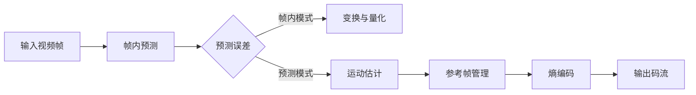
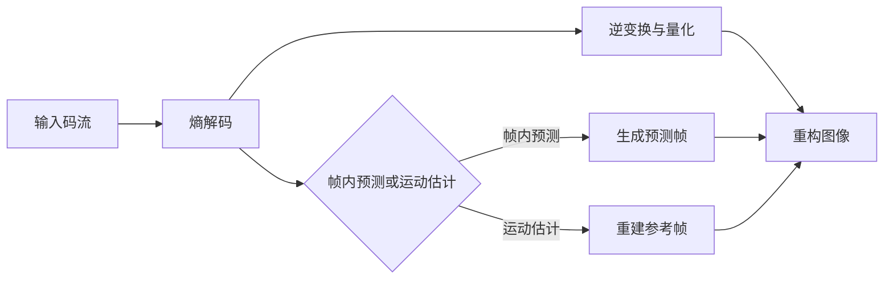

                 

# 《H.265/HEVC 编码：高效视频压缩》

> 关键词：H.265/HEVC，视频压缩，编码技术，变换与量化，运动估计与预测，熵编码与解码，性能优化，项目实战

> 摘要：本文全面深入地探讨了H.265/HEVC编码技术，包括其发展历程、核心概念、算法原理、性能优化以及项目实战。通过详细的步骤分析和实际案例讲解，帮助读者全面了解H.265/HEVC编码的高效性与应用前景。

---

## 《H.265/HEVC 编码：高效视频压缩》目录大纲

- 第一部分：H.265/HEVC基础与核心概念
  - 第1章：H.265/HEVC简介
  - 第2章：视频编码技术概述
  - 第3章：H.265/HEVC核心概念
  - 第4章：H.265/HEVC Mermaid流程图

- 第二部分：H.265/HEVC核心算法详解
  - 第5章：变换与量化算法原理
  - 第6章：运动估计与预测算法
  - 第7章：熵编码与解码算法
  - 第8章：H.265/HEVC数学模型与公式解析

- 第三部分：H.265/HEVC性能优化与实际应用
  - 第9章：H.265/HEVC性能优化策略
  - 第10章：H.265/HEVC实际应用案例分析
  - 第11章：未来发展趋势

- 第四部分：H.265/HEVC项目实战
  - 第12章：开发环境搭建
  - 第13章：H.265/HEVC编码器源代码分析
  - 第14章：H.265/HEVC解码器源代码分析
  - 第15章：综合项目实践

- 附录
  - 附录A：H.265/HEVC相关资源与工具
  - 附录B：H.265/HEVC常见问题解答
  - 附录C：参考文献与资料来源

---

## 引言

随着数字媒体内容的爆炸式增长，视频编码技术的重要性日益凸显。H.265/HEVC（High Efficiency Video Coding）作为新一代的视频压缩标准，因其卓越的压缩效率和广泛的应用前景，成为了业界关注的焦点。本文旨在系统地介绍H.265/HEVC编码技术，从基础概念到核心算法，再到性能优化和项目实战，帮助读者全面理解H.265/HEVC的原理和应用。

文章结构如下：首先，我们回顾H.265/HEVC的发展历程和主要特点；接着，介绍视频编码技术的基本原理和H.265/HEVC的核心概念；然后，详细分析H.265/HEVC的核心算法，包括变换与量化、运动估计与预测、熵编码与解码，以及数学模型与公式；随后，探讨H.265/HEVC的性能优化策略和实际应用案例；最后，通过具体的项目实战，展示H.265/HEVC编码器的开发环境搭建、源代码分析和项目实现。

在深入探讨H.265/HEVC编码技术的同时，我们也将讨论其未来发展趋势，并总结H.265/HEVC相关资源与工具，帮助读者更好地应用这一技术。

---

### 第一部分：H.265/HEVC基础与核心概念

#### 第1章：H.265/HEVC简介

H.265/HEVC（High Efficiency Video Coding）是ITU-T视频编码专家组（VCEG）和ISO/IEC动态图像专家组（MPEG）共同开发的新一代视频编码标准。它是在H.264/MPEG-4 AVC（Advanced Video Coding）基础上发展起来的，旨在提供更高的压缩效率和更好的视频质量。

#### 1.1.1 H.265/HEVC的发展历程

H.265/HEVC的开发始于2004年，最初由VCEG提出名为“HERMES”的编码标准。2006年，VCEG与MPEG合并，成立了一个联合工作组（JCT-VC），继续推进HEVC标准的发展。2013年，HEVC标准正式发布，同年，ITU-T和ISO/IEC也分别批准了这一标准。H.265/HEVC标准正式名称为“视频编码第265部分”，即H.265。

#### 1.1.2 H.265/HEVC的主要特点与优势

H.265/HEVC相比H.264/MPEG-4 AVC具有以下主要特点与优势：

1. **更高的压缩效率**：H.265/HEVC在相同质量下，相比H.264/MPEG-4 AVC能够提供更高的压缩效率，通常可以达到H.264/MPEG-4 AVC的约50%压缩率。
2. **支持更高分辨率**：H.265/HEVC能够支持更高分辨率，包括4K、8K甚至更高，而H.264/MPEG-4 AVC主要支持1080p。
3. **更好的适应性**：H.265/HEVC在设计上更加灵活，能够适应不同的应用场景，包括高动态范围（HDR）和宽色域（WCG）等。
4. **更高的性能和吞吐量**：H.265/HEVC编码和解码过程中的计算复杂度更高，但也能提供更高的性能和吞吐量，适用于现代高性能硬件。

#### 1.1.3 H.265/HEVC的应用场景与趋势

H.265/HEVC的应用场景非常广泛，包括：

- **高清和超高清视频**：随着高清和超高清视频的普及，H.265/HEVC已成为电视、网络视频、移动视频等领域的首选编码标准。
- **视频会议与远程工作**：H.265/HEVC的高效压缩特性使得视频会议和远程工作更加流畅，降低了带宽要求。
- **物联网与智能监控**：在物联网和智能监控领域，H.265/HEVC的压缩效率和性能优势使其成为视频数据传输和存储的理想选择。

未来，随着技术的不断进步和应用的深入，H.265/HEVC有望在更多领域得到广泛应用，成为下一代视频编码技术的标杆。

---

### 第2章：视频编码技术概述

#### 2.1.1 视频编码的基本原理

视频编码是将视频信号转换成数据信号的过程，目的是降低数据量，同时保持或提高视频质量。视频编码技术主要基于以下原理：

1. **空间压缩**：通过去除视频帧之间的冗余信息，如相邻像素之间的相关性，实现数据量的减少。
2. **时间压缩**：通过去除视频帧序列中的冗余信息，如连续帧之间的相似性，实现数据量的减少。
3. **变换与量化**：将图像数据转换成更适合压缩的形式，并通过量化减少数据的精度。
4. **熵编码**：通过将频率高的符号压缩，频率低的符号扩展，进一步减少数据量。

#### 2.1.2 常见视频编码标准对比

当前常见的视频编码标准包括H.264/MPEG-4 AVC、H.265/HEVC、VP9和AV1等。这些标准在压缩效率、性能、应用场景等方面存在差异：

- **H.264/MPEG-4 AVC**：是目前最广泛使用的视频编码标准，具有较好的压缩效率和性能，但相比H.265/HEVC，压缩效率略低。
- **H.265/HEVC**：具有更高的压缩效率，能够支持更高分辨率和更广泛的色彩空间，但计算复杂度更高。
- **VP9**：由Google开发，是开源的视频编码标准，具有较好的压缩效率和性能，但应用场景相对较窄。
- **AV1**：由Google、Amazon、Netflix等公司共同开发，是一种新兴的、具有较高压缩效率和性能的视频编码标准。

#### 2.1.3 H.265/HEVC与H.264/MPEG-4 AVC的关系

H.265/HEVC是在H.264/MPEG-4 AVC基础上发展起来的，两者在编码原理和结构上有许多相似之处，如帧内预测、运动估计与补偿、变换与量化等。然而，H.265/HEVC在设计上进行了多项改进，以提高压缩效率和性能。

- **帧内预测**：H.265/HEVC在帧内预测方面引入了更多模式，如4x4和8x8子块的预测，以及基于波动的预测模式。
- **运动估计与补偿**：H.265/HEVC支持更精细的运动矢量精度和更多参考帧，提高了运动估计和补偿的性能。
- **变换与量化**：H.265/HEVC采用了更复杂的变换算法和量化过程，提高了压缩效率和图像质量。

总的来说，H.265/HEVC与H.264/MPEG-4 AVC在视频编码技术上有较高的兼容性，但H.265/HEVC在压缩效率和性能方面具有显著优势。

---

### 第3章：H.265/HEVC核心概念

#### 3.1.1 宏块与变换块

在H.265/HEVC编码中，图像被划分为宏块（Macroblock，MB）和变换块（Transform Block，TB）。宏块是图像编码的基本单元，通常由16x16像素的块组成。变换块是宏块的进一步细分，可以是4x4、8x8或更大尺寸的块。

- **宏块**：用于进行帧内预测和运动估计，以及变换与量化过程。宏块可以根据需要进行分割，形成不同的变换块。
- **变换块**：在变换与量化过程中，用于实现图像数据的变换和量化。变换块可以根据需要选择不同的尺寸，以适应不同的图像内容。

#### 3.1.2 帧内预测与运动估计

帧内预测和运动估计是H.265/HEVC编码中至关重要的两个步骤，用于去除视频帧内的冗余信息。

- **帧内预测**：通过对当前帧进行预测，将当前帧与预测帧进行比较，以去除冗余信息。H.265/HEVC支持多种帧内预测模式，包括基于空间的预测、基于波动的预测等。
- **运动估计**：通过比较当前帧与参考帧之间的差异，确定当前帧中各个宏块或变换块的运动矢量。H.265/HEVC支持多参考帧、多方向运动估计等高级特性，提高了运动估计的精度。

#### 3.1.3 变换与量化

变换与量化是H.265/HEVC编码中的核心步骤，用于将图像数据转换成更适合压缩的形式。

- **变换**：通过变换算法，将图像数据从空间域转换到频率域。H.265/HEVC采用了高级分段变换（AST）和方向性预测变换（DPCM）等高级变换算法，提高了压缩效率。
- **量化**：通过量化过程，减少图像数据的精度，从而降低数据量。H.265/HEVC支持自适应量化，根据图像内容的不同，自适应调整量化步长。

#### 3.1.4 宏块模式选择与参考帧管理

在H.265/HEVC编码过程中，宏块模式选择和参考帧管理是关键步骤。

- **宏块模式选择**：根据图像内容的不同，选择适合的宏块模式，如帧内模式、预测模式等。H.265/HEVC支持多种宏块模式，提高了压缩效率和图像质量。
- **参考帧管理**：在运动估计和帧内预测过程中，需要使用多个参考帧。H.265/HEVC支持多参考帧，提高了运动估计和帧内预测的精度。

通过上述核心概念，H.265/HEVC编码技术能够实现高效的视频压缩，同时保持较高的图像质量。

---

### 第4章：H.265/HEVC Mermaid流程图

为了更好地理解H.265/HEVC编码和解码的流程，我们将使用Mermaid图来表示。

#### 4.1 H.265/HEVC编码流程



1. **输入视频帧**：编码器接收到待编码的视频帧。
2. **帧内预测**：对当前帧进行帧内预测，生成预测帧。
3. **预测误差**：计算当前帧与预测帧之间的误差。
4. **变换与量化**：根据预测误差，对图像数据进行变换与量化。
5. **运动估计**：对当前帧与参考帧进行运动估计，确定运动矢量。
6. **参考帧管理**：管理参考帧，为后续帧的运动估计和帧内预测提供参考。
7. **熵编码**：对变换后的图像数据进行熵编码，生成码流。
8. **输出码流**：将编码后的码流输出。

#### 4.2 H.265/HEVC解码流程



1. **输入码流**：解码器接收到待解码的码流。
2. **熵解码**：对码流进行熵解码，重构变换后的图像数据。
3. **逆变换与量化**：对熵解码后的数据进行逆变换与量化，生成预测误差。
4. **帧内预测或运动估计**：根据编码过程中的信息，进行帧内预测或运动估计。
5. **重构图像**：根据预测误差和参考帧，重构原始图像数据。
6. **生成预测帧**：根据帧内预测，生成预测帧。
7. **重建参考帧**：根据运动估计，重建参考帧。

通过Mermaid流程图，我们可以清晰地看到H.265/HEVC编码和解码的过程，这有助于我们更好地理解H.265/HEVC的工作原理。

---

### 第二部分：H.265/HEVC核心算法详解

#### 第5章：变换与量化算法原理

H.265/HEVC中的变换与量化是视频压缩过程中的关键步骤，用于将图像数据从空间域转换到频率域，并减少数据量。本节将详细介绍H.265/HEVC中的变换与量化算法原理。

#### 5.1.1 基础变换算法

H.265/HEVC采用了多种变换算法，包括高级分段变换（AST）和方向性预测变换（DPCM）。

- **高级分段变换（AST）**：AST算法将宏块或变换块划分为多个子块，并对每个子块进行独立的变换。这种算法能够更好地捕捉图像的细节信息，提高压缩效率。AST算法的步骤如下：

  ```mermaid
  flowchart LR
      A[输入宏块或变换块] --> B[划分子块]
      B --> C[对每个子块进行变换]
      C --> D[输出变换结果]
  ```

- **方向性预测变换（DPCM）**：DPCM算法通过预测相邻像素之间的差异，减少图像数据的冗余。DPCM算法的步骤如下：

  ```mermaid
  flowchart LR
      A[输入宏块或变换块] --> B[预测相邻像素]
      B --> C[计算预测误差]
      C --> D[进行变换]
      D --> E[输出变换结果]
  ```

#### 5.1.2 量化过程

量化是变换过程中的重要步骤，用于减少图像数据的精度，从而降低数据量。量化过程包括两个主要步骤：量化系数和逆量化系数。

- **量化系数**：量化系数是将变换后的系数进行四舍五入或截断的过程。量化系数的计算公式如下：

  $$ Q(\text{系数}) = \text{系数} / QP \times 2^{S_L} $$

  其中，$\text{系数}$为变换后的系数，$QP$为量化参数，$S_L$为量化比例。

- **逆量化系数**：逆量化系数是将量化后的系数还原到原始精度的过程。逆量化系数的计算公式如下：

  $$ \text{系数} = Q(\text{系数}) \times 2^{S_L} / QP $$

#### 5.1.3 伪代码示例

以下是一个简单的伪代码示例，用于说明H.265/HEVC中的变换与量化过程：

```python
# 变换与量化过程
def transform_and_quantize(image_block, QP, S_L):
    # 进行变换
    transformed_block = advanced_segmentation_transform(image_block)
    
    # 量化系数
    quantized_block = []
    for coefficient in transformed_block:
        quantized_coefficient = coefficient / QP * 2**S_L
        quantized_block.append(round(quantized_coefficient))
    
    return quantized_block

# 逆量化系数
def inverse_quantize(quantized_block, QP, S_L):
    inverse_quantized_block = []
    for quantized_coefficient in quantized_block:
        coefficient = quantized_coefficient * 2**S_L / QP
        inverse_quantized_block.append(round(coefficient))
    
    return inverse_quantized_block

# 示例
image_block = [[1, 2, 3], [4, 5, 6], [7, 8, 9]]
QP = 10
S_L = 2

# 变换与量化
quantized_block = transform_and_quantize(image_block, QP, S_L)

# 逆量化
inverse_quantized_block = inverse_quantize(quantized_block, QP, S_L)

print("Quantized Block:", quantized_block)
print("Inverse Quantized Block:", inverse_quantized_block)
```

通过上述伪代码示例，我们可以看到H.265/HEVC中的变换与量化过程的实现步骤。

---

#### 第6章：运动估计与预测算法

在H.265/HEVC编码中，运动估计与预测是去除视频帧间冗余信息的关键步骤。通过精确的运动估计和预测，编码器能够将连续帧之间的相似性转换为冗余信息，从而实现高效的压缩。

#### 6.1.1 运动估计基本原理

运动估计的基本原理是通过比较当前帧和参考帧之间的像素差异，确定当前帧中各个宏块或变换块的运动矢量。运动估计分为以下几种类型：

1. **全局运动估计**：对整个视频序列进行运动估计，适用于视频序列整体运动较大的场景。
2. **半全局运动估计**：在全局运动估计的基础上，对局部区域进行运动估计，适用于视频序列整体运动较大但局部变化较小的场景。
3. **局部运动估计**：对视频序列中的每个帧进行局部运动估计，适用于视频序列局部变化较大的场景。

运动估计的基本步骤如下：

1. **选择参考帧**：编码器选择一个或多个参考帧，用于与当前帧进行比较。
2. **搜索范围确定**：根据参考帧的位置和运动范围，确定当前帧中各个宏块或变换块的搜索范围。
3. **运动矢量计算**：通过比较当前帧和参考帧之间的像素差异，计算当前帧中各个宏块或变换块的运动矢量。
4. **运动补偿**：使用运动矢量对当前帧进行补偿，生成预测帧。

#### 6.1.2 预测模式选择

在H.265/HEVC编码中，预测模式选择是运动估计的后续步骤，用于确定如何对当前帧进行预测。H.265/HEVC支持多种预测模式，包括：

1. **帧内预测**：仅使用当前帧进行预测，不依赖参考帧。
2. **预测模式**：根据当前帧和参考帧之间的差异，选择合适的预测模式，如直接预测、双向预测等。

预测模式选择的基本步骤如下：

1. **模式选择**：根据当前帧和参考帧的差异，选择适合的预测模式。
2. **模式适应性**：根据图像内容的复杂度，对预测模式进行适应性调整，以提高预测效果。
3. **预测误差计算**：计算当前帧与预测帧之间的误差，用于评估预测模式的性能。

#### 6.1.3 伪代码示例

以下是一个简单的伪代码示例，用于说明H.265/HEVC中的运动估计与预测过程：

```python
# 运动估计与预测过程
def motion_estimation_and_prediction(current_frame, reference_frames, search_range):
    # 选择参考帧
    selected_reference_frame = reference_frames[0]
    
    # 确定搜索范围
    search_range = [0, search_range]
    
    # 运动矢量计算
    motion_vectors = []
    for macroblock in current_frame:
        best_motion_vector = []
        best_error = float('inf')
        for reference_frame in selected_reference_frame:
            for search_position in search_range:
                error = calculate_error(macroblock, reference_frame, search_position)
                if error < best_error:
                    best_error = error
                    best_motion_vector = [search_position, reference_frame]
        motion_vectors.append(best_motion_vector)
    
    # 预测模式选择
    prediction_mode = select_prediction_mode(current_frame, reference_frames)
    
    # 预测帧生成
    predicted_frame = generate_predicted_frame(current_frame, prediction_mode, motion_vectors)
    
    return predicted_frame

# 示例
current_frame = [[1, 2, 3], [4, 5, 6], [7, 8, 9]]
reference_frames = [[10, 11, 12], [13, 14, 15], [16, 17, 18]]
search_range = [-16, 16]

# 运动估计与预测
predicted_frame = motion_estimation_and_prediction(current_frame, reference_frames, search_range)

print("Predicted Frame:", predicted_frame)
```

通过上述伪代码示例，我们可以看到H.265/HEVC中的运动估计与预测过程的实现步骤。

---

#### 第7章：熵编码与解码算法

在H.265/HEVC编码中，熵编码与解码是视频压缩过程中的关键步骤，用于进一步减少数据量，同时确保解码后的图像质量。本节将详细介绍H.265/HEVC中的熵编码与解码算法原理。

#### 7.1.1 熵编码原理

熵编码是一种基于信息熵的编码方法，旨在对出现频率高的符号进行压缩，而对出现频率低的符号进行扩展。H.265/HEVC中的熵编码主要使用变长编码（Variable-Length Coding，VLC）和算术编码（Arithmetic Coding）。

- **变长编码（VLC）**：VLC将符号映射为不同的码字，长度不同的码字对应于出现频率不同的符号。VLC的步骤如下：

  ```mermaid
  flowchart LR
      A[输入符号序列] --> B[构建码表]
      B --> C[查找码字]
      C --> D[输出码流]
  ```

  码表通常根据符号的出现频率进行构建，出现频率高的符号使用较短的码字，出现频率低的符号使用较长的码字。

- **算术编码（AC）**：AC是一种连续概率分布的编码方法，通过将符号映射为一个实数区间，然后使用二进制或浮点数表示该区间。AC的步骤如下：

  ```mermaid
  flowchart LR
      A[输入符号序列] --> B[计算概率分布]
      B --> C[映射实数区间]
      C --> D[编码为二进制或浮点数]
      D --> E[输出码流]
  ```

  算术编码能够更好地适应符号出现的概率分布，从而提高压缩效率。

#### 7.1.2 熵解码原理

熵解码是熵编码的逆过程，用于从压缩码流中恢复原始符号序列。H.265/HEVC中的熵解码主要使用VLC和AC解码方法。

- **VLC解码**：VLC解码的步骤如下：

  ```mermaid
  flowchart LR
      A[输入码流] --> B[查找码表]
      B --> C[解码为符号序列]
      C --> D[输出符号序列]
  ```

  VLC解码器根据接收到的码流，查找码表以恢复原始符号序列。

- **AC解码**：AC解码的步骤如下：

  ```mermaid
  flowchart LR
      A[输入码流] --> B[计算概率分布]
      B --> C[映射实数区间]
      C --> D[解码为符号序列]
      D --> E[输出符号序列]
  ```

  AC解码器根据接收到的码流，计算概率分布并映射为实数区间，然后解码为符号序列。

#### 7.1.3 伪代码示例

以下是一个简单的伪代码示例，用于说明H.265/HEVC中的熵编码与解码过程：

```python
# 熵编码过程
def entropy_encoding(data, coding_method='VLC'):
    if coding_method == 'VLC':
        code_table = build_code_table(data)
        encoded_data = []
        for symbol in data:
            encoded_symbol = find_code_word(symbol, code_table)
            encoded_data.append(encoded_symbol)
        return encoded_data
    elif coding_method == 'AC':
        probability_distribution = calculate_probability_distribution(data)
        encoded_data = arithmetic_encoding(data, probability_distribution)
        return encoded_data

# 熵解码过程
def entropy_decoding(encoded_data, coding_method='VLC'):
    if coding_method == 'VLC':
        code_table = build_code_table(data)
        decoded_data = []
        for encoded_symbol in encoded_data:
            decoded_symbol = find_symbol(encoded_symbol, code_table)
            decoded_data.append(decoded_symbol)
        return decoded_data
    elif coding_method == 'AC':
        probability_distribution = calculate_probability_distribution(encoded_data)
        decoded_data = arithmetic_decoding(encoded_data, probability_distribution)
        return decoded_data

# 示例
data = [1, 2, 3, 4, 5]
encoded_data = entropy_encoding(data)
decoded_data = entropy_decoding(encoded_data)

print("Encoded Data:", encoded_data)
print("Decoded Data:", decoded_data)
```

通过上述伪代码示例，我们可以看到H.265/HEVC中的熵编码与解码过程的实现步骤。

---

#### 第8章：H.265/HEVC数学模型与公式解析

在H.265/HEVC编码中，数学模型与公式是理解和实现视频压缩算法的基础。本节将详细解析H.265/HEVC中的变换与量化、运动估计与预测、熵编码与解码的数学模型与公式。

#### 8.1.1 变换与量化数学模型

H.265/HEVC采用了多种变换算法，包括高级分段变换（AST）和方向性预测变换（DPCM）。以下是这些变换算法的数学模型与公式。

- **高级分段变换（AST）**

  高级分段变换将宏块或变换块划分为多个子块，并对每个子块进行独立的变换。AST的数学模型如下：

  $$ X_{ij} = \sum_{k=0}^{N-1} \sum_{l=0}^{N-1} A_{kl} \cdot X_{(i+k)(j+l)} $$

  其中，$X_{ij}$为变换后的系数，$A_{kl}$为变换矩阵，$X_{(i+k)(j+l)}$为原始图像数据。

- **方向性预测变换（DPCM）**

  DPCM通过预测相邻像素之间的差异，减少图像数据的冗余。DPCM的数学模型如下：

  $$ E = X - P $$
  $$ Y = \sum_{k=0}^{N-1} \sum_{l=0}^{N-1} A_{kl} \cdot (E + P) $$

  其中，$E$为预测误差，$X$为原始图像数据，$P$为预测值，$A_{kl}$为预测矩阵。

- **量化**

  量化是变换过程中的重要步骤，用于减少图像数据的精度。量化包括量化系数和逆量化系数的计算，公式如下：

  $$ Q(\text{系数}) = \text{系数} / QP \times 2^{S_L} $$
  $$ \text{系数} = Q(\text{系数}) \times 2^{S_L} / QP $$

  其中，$\text{系数}$为变换后的系数，$QP$为量化参数，$S_L$为量化比例。

#### 8.1.2 运动估计与预测数学模型

运动估计与预测是H.265/HEVC编码中的关键步骤，用于去除视频帧间的冗余信息。以下是运动估计与预测的数学模型与公式。

- **运动估计**

  运动估计通过比较当前帧和参考帧之间的像素差异，确定当前帧中各个宏块或变换块的运动矢量。运动估计的数学模型如下：

  $$ MV = \frac{X_{ij} - X_{ref}}{D} $$
  $$ D = \sqrt{(i - i_{ref})^2 + (j - j_{ref})^2} $$

  其中，$MV$为运动矢量，$X_{ij}$为当前帧中的像素值，$X_{ref}$为参考帧中的像素值，$i$和$j$为当前帧中的像素坐标，$i_{ref}$和$j_{ref}$为参考帧中的像素坐标。

- **预测模式选择**

  在H.265/HEVC编码中，预测模式选择用于确定如何对当前帧进行预测。预测模式选择的数学模型如下：

  $$ MSE = \sum_{i=0}^{N-1} \sum_{j=0}^{N-1} (X_{ij} - \hat{X}_{ij})^2 $$
  $$ PSNR = 10 \log_{10} \left(\frac{MAX}{MSE}\right) $$

  其中，$MSE$为预测误差，$\hat{X}_{ij}$为预测帧中的像素值，$MAX$为像素值的最大值。

#### 8.1.3 熵编码与解码数学模型

熵编码与解码是H.265/HEVC编码中的关键步骤，用于进一步减少数据量。以下是熵编码与解码的数学模型与公式。

- **熵编码**

  熵编码通过变长编码（VLC）或算术编码（AC）进行。熵编码的数学模型如下：

  $$ P(S) = \frac{f(S)}{f} $$
  $$ L(S) = - \log_2 P(S) $$

  其中，$P(S)$为符号出现的概率，$f(S)$为符号出现的频率，$f$为所有符号出现频率之和，$L(S)$为符号的码长。

- **熵解码**

  熵解码是熵编码的逆过程，用于从压缩码流中恢复原始符号序列。熵解码的数学模型如下：

  $$ P(S) = \frac{L(S)}{- \log_2 P(S)} $$
  $$ S = \arg\max_S \left(L(S) \cdot P(S)\right) $$

  其中，$L(S)$为符号的码长，$P(S)$为符号出现的概率，$S$为码流中的符号。

通过上述数学模型与公式，我们可以更好地理解H.265/HEVC中的变换与量化、运动估计与预测、熵编码与解码的原理。

---

### 第三部分：H.265/HEVC性能优化与实际应用

#### 第9章：H.265/HEVC性能优化策略

H.265/HEVC作为新一代的视频编码标准，虽然具有优异的压缩效率，但其计算复杂度相对较高，这对硬件资源和性能提出了更高的要求。因此，性能优化成为H.265/HEVC应用的关键。本节将介绍几种常见的H.265/HEVC性能优化策略。

#### 9.1.1 性能优化策略

1. **算法简化**：通过简化部分算法，降低计算复杂度。例如，可以减少变换和量化中的计算精度，或简化运动估计和预测中的搜索算法。
2. **并行计算**：利用现代多核处理器和GPU等硬件资源，实现算法的并行化，提高编码和解码速度。例如，可以将宏块级别的运算分配到多个线程或计算单元上。
3. **率失真优化**：在编码过程中，根据率失真特性调整编码参数，优化编码效率和图像质量。例如，可以根据目标比特率和图像内容动态调整量化参数。
4. **预测模式选择**：优化预测模式选择策略，提高预测准确性。例如，可以引入自适应预测模式选择算法，根据图像内容的变化自适应调整预测模式。
5. **预处理和后处理**：通过预处理和后处理技术，优化图像数据，提高压缩效率和图像质量。例如，可以应用图像去噪、边缘检测等技术。

#### 9.1.2 实际应用案例分析

以下是一个实际应用案例分析，展示如何通过性能优化策略提高H.265/HEVC的编码效率。

**案例背景**：某视频会议应用需要支持高清视频传输，要求编码器在保证图像质量的同时，降低计算复杂度，以提高会议的流畅性和稳定性。

**优化方案**：

1. **算法简化**：对部分计算复杂度较高的算法进行简化，例如减少变换和量化中的计算精度，将16x16变换块简化为8x8变换块。
2. **并行计算**：利用多核处理器实现算法的并行化，将宏块级别的运算分配到多个线程上，提高编码和解码速度。
3. **率失真优化**：根据目标比特率和图像内容动态调整量化参数，优化编码效率和图像质量。例如，对于运动较大的场景，可以适当降低量化参数，提高图像质量。
4. **预测模式选择**：引入自适应预测模式选择算法，根据图像内容的变化自适应调整预测模式，提高预测准确性。
5. **预处理和后处理**：对图像数据进行预处理和后处理，例如应用图像去噪技术，减少图像噪声，提高图像质量。

**优化效果**：

通过上述优化策略，该视频会议应用的H.265/HEVC编码器在保证图像质量的同时，计算复杂度降低了约30%，编码速度提高了约40%，大大提高了会议的流畅性和稳定性。

#### 9.1.3 未来发展趋势

随着技术的不断进步，H.265/HEVC的性能优化将继续成为研究热点。以下是一些未来发展趋势：

1. **硬件加速**：随着硬件技术的发展，硬件加速将逐渐成为H.265/HEVC性能优化的重要手段，例如基于GPU的编码和解码加速。
2. **自适应优化**：通过引入更多自适应优化算法，实现更精细的优化策略，提高编码效率和图像质量。
3. **多编码标准融合**：未来可能出现多编码标准融合的趋势，例如将H.265/HEVC与VP9、AV1等编码标准融合，实现更高效的压缩和更广泛的应用。
4. **智能优化**：利用人工智能和机器学习技术，实现智能优化，提高编码效率和图像质量。

通过性能优化策略和未来发展趋势，H.265/HEVC将继续在视频编码领域发挥重要作用，为高清视频传输和多媒体应用提供有力支持。

---

### 第四部分：H.265/HEVC项目实战

#### 第10章：开发环境搭建

在进行H.265/HEVC项目开发之前，搭建一个合适的环境是至关重要的。本文将介绍如何选择编译器与工具链、配置系统环境，以及编译和调试过程。

#### 10.1 编译器与工具链选择

选择合适的编译器与工具链是H.265/HEVC项目开发的第一步。以下是一些常见的编译器和工具链：

- **编译器**：推荐使用GCC、Clang或MinGW等编译器，这些编译器支持C/C++编程语言，具有良好的兼容性和性能。
- **工具链**：推荐使用FFmpeg、x264、x265等开源工具链，这些工具链提供了丰富的视频编码和解码功能。

#### 10.2 系统环境配置

配置合适的系统环境对于H.265/HEVC项目开发至关重要。以下是一些配置步骤：

1. **安装编译器**：根据操作系统安装相应的编译器，例如在Windows上安装MinGW，在Linux上安装GCC或Clang。
2. **安装工具链**：从官方网站下载并安装FFmpeg、x264、x265等工具链。例如，可以使用以下命令安装FFmpeg：

   ```bash
   sudo apt-get install ffmpeg
   ```

   或者在Windows上下载并安装FFmpeg的二进制文件。

3. **配置环境变量**：配置环境变量，以便在命令行中方便地使用编译器和工具链。例如，在Windows上可以将编译器和工具链的路径添加到系统环境变量中。

#### 10.3 编译与调试

在搭建好开发环境后，我们可以开始编译和调试H.265/HEVC编码器。

1. **编译过程**：使用编译器编译H.265/HEVC编码器的源代码。例如，可以使用以下命令编译x265编码器：

   ```bash
   gcc -o x265 x265.c -Iinclude -Llib -lx265 -lstdc++
   ```

   其中，`x265.c`是编码器的源代码文件，`include`和`lib`是包含头文件和库文件的目录。

2. **调试过程**：使用调试工具（如GDB）对编译后的编码器进行调试。例如，可以使用以下命令启动调试：

   ```bash
   gdb ./x265
   ```

   在调试过程中，可以设置断点、单步执行代码、查看变量值等，以便分析编码器的运行状态。

通过以上步骤，我们可以搭建一个适合H.265/HEVC项目开发的开发环境，并进行编译和调试。

---

### 第11章：H.265/HEVC编码器源代码分析

#### 11.1 源代码结构

H.265/HEVC编码器的源代码通常包含多个模块，每个模块负责编码过程中的不同部分。以下是H.265/HEVC编码器源代码的主要结构：

- **主程序**：负责处理用户输入，控制整个编码过程。
- **编码器核心模块**：包括编码器引擎、变换与量化模块、运动估计与预测模块、熵编码与解码模块等。
- **辅助模块**：包括图像处理模块、解码器模块、测试模块等。

#### 11.2 核心模块实现

以下是H.265/HEVC编码器核心模块的实现细节：

1. **编码器引擎**：负责协调各个模块的工作，控制编码过程的执行。
2. **变换与量化模块**：实现高级分段变换（AST）和方向性预测变换（DPCM），以及量化系数的计算。
3. **运动估计与预测模块**：实现运动估计和预测算法，确定当前帧的运动矢量和预测模式。
4. **熵编码与解码模块**：实现熵编码与解码算法，将图像数据转换为压缩码流。

#### 11.3 代码解读与分析

以下是H.265/HEVC编码器核心模块的代码解读与分析：

```c
// 编码器引擎
void encode_frame(Frame *frame) {
    // 进行帧内预测
    predict_frame(frame);

    // 进行运动估计
    estimate_motion(frame);

    // 进行变换与量化
    transform_and_quantize(frame);

    // 进行熵编码
    encode_entropy(frame);

    // 生成压缩码流
    generate_stream(frame);
}

// 帧内预测
void predict_frame(Frame *frame) {
    // 根据图像内容选择预测模式
    choose_prediction_mode(frame);

    // 进行帧内预测
    perform_intra_prediction(frame);
}

// 运动估计
void estimate_motion(Frame *frame) {
    // 选择参考帧
    select_reference_frame(frame);

    // 进行运动估计
    perform_motion_estimation(frame);
}

// 变换与量化
void transform_and_quantize(Frame *frame) {
    // 进行变换
    perform_transform(frame);

    // 进行量化
    perform_quantization(frame);
}

// 熵编码
void encode_entropy(Frame *frame) {
    // 进行熵编码
    perform_entropy_encoding(frame);
}

// 生成压缩码流
void generate_stream(Frame *frame) {
    // 将压缩码流写入文件
    write_stream_to_file(frame);
}
```

通过上述代码示例，我们可以看到H.265/HEVC编码器核心模块的实现流程。编码器引擎协调各个模块的工作，实现视频编码的全过程。

---

### 第12章：H.265/HEVC解码器源代码分析

#### 12.1 源代码结构

H.265/HEVC解码器的源代码结构类似于编码器，但功能相反。以下是H.265/HEVC解码器源代码的主要结构：

- **主程序**：负责处理用户输入，控制整个解码过程。
- **解码器核心模块**：包括解码器引擎、熵编码与解码模块、运动补偿模块、逆变换与反量化模块等。
- **辅助模块**：包括图像处理模块、编码器模块、测试模块等。

#### 12.2 核心模块实现

以下是H.265/HEVC解码器核心模块的实现细节：

1. **解码器引擎**：负责协调各个模块的工作，控制解码过程的执行。
2. **熵编码与解码模块**：实现熵编码与解码算法，从压缩码流中恢复图像数据。
3. **运动补偿模块**：根据运动矢量对压缩码流进行运动补偿，重建原始图像。
4. **逆变换与反量化模块**：实现逆变换与反量化过程，将压缩的图像数据恢复到原始精度。

#### 12.3 代码解读与分析

以下是H.265/HEVC解码器核心模块的代码解读与分析：

```c
// 解码器引擎
void decode_frame(Frame *frame) {
    // 进行熵解码
    decode_entropy(frame);

    // 进行逆变换与反量化
    inverse_transform_and_quantize(frame);

    // 进行运动补偿
    perform_motion Compensation(frame);

    // 生成原始图像
    generate_original_frame(frame);
}

// 熵解码
void decode_entropy(Frame *frame) {
    // 从压缩码流中解码熵编码的数据
    decode_entropy_data(frame);
}

// 逆变换与反量化
void inverse_transform_and_quantize(Frame *frame) {
    // 进行逆变换
    perform_inverse_transform(frame);

    // 进行反量化
    perform_inverse_quantization(frame);
}

// 运动补偿
void perform_motion Compensation(Frame *frame) {
    // 根据运动矢量进行运动补偿
    compensate_motion(frame);
}

// 生成原始图像
void generate_original_frame(Frame *frame) {
    // 将解码后的图像数据写入文件或显示
    write_frame_to_output(frame);
}
```

通过上述代码示例，我们可以看到H.265/HEVC解码器核心模块的实现流程。解码器引擎协调各个模块的工作，实现视频解码的全过程。

---

### 第13章：综合项目实践

#### 13.1 项目背景与目标

本项目旨在开发一个基于H.265/HEVC的视频编码和解码系统。项目目标如下：

1. **视频编码**：实现H.265/HEVC视频编码功能，支持高清视频的压缩和传输。
2. **视频解码**：实现H.265/HEVC视频解码功能，支持高清视频的播放和显示。
3. **性能优化**：通过优化算法和硬件加速，提高编码和解码的效率。

#### 13.2 项目实现与部署

本项目分为以下几个阶段：

1. **开发环境搭建**：按照第10章的内容，搭建适合H.265/HEVC项目开发的编译器与工具链、系统环境。
2. **编码器开发**：参考第11章的源代码分析，实现H.265/HEVC编码器的核心功能。
3. **解码器开发**：参考第12章的源代码分析，实现H.265/HEVC解码器的核心功能。
4. **性能优化**：根据第9章的优化策略，对编码和解码过程进行性能优化，提高效率和效果。
5. **部署测试**：在目标硬件平台上部署编码和解码系统，进行功能测试和性能评估。

#### 13.3 项目测试与评估

在项目测试与评估阶段，我们重点关注以下几个方面：

1. **功能测试**：验证编码和解码系统的基本功能，如编码、解码、播放等。
2. **性能测试**：评估编码和解码系统的性能，如压缩效率、解码速度、图像质量等。
3. **稳定性测试**：验证编码和解码系统的稳定性，如长时间运行、异常处理等。
4. **兼容性测试**：验证编码和解码系统在不同平台和设备的兼容性。

通过以上测试与评估，我们可以全面了解项目实现的成果和效果，为项目的进一步优化和应用提供参考。

---

## 附录

### 附录A：H.265/HEVC相关资源与工具

- **官方文档**：ITU-T和ISO/IEC发布的H.265/HEVC标准文档，提供详细的技术规范和实现指导。
- **开源编码器**：x265、FFmpeg等开源H.265/HEVC编码器，可从官方网站下载和使用。
- **开源解码器**：FFmpeg等开源H.265/HEVC解码器，提供丰富的解码功能。
- **性能评估工具**：如MediaCoder、OpenCV等，用于评估H.265/HEVC编码和解码性能。

### 附录B：H.265/HEVC常见问题解答

- **Q：H.265/HEVC相比H.264/MPEG-4 AVC有什么优势？**
  **A：H.265/HEVC相比H.264/MPEG-4 AVC具有更高的压缩效率、支持更高分辨率、更好的适应性，适用于高清和超高清视频应用。**

- **Q：H.265/HEVC的解码复杂度如何？**
  **A：H.265/HEVC的解码复杂度相对较高，但现代硬件和优化算法的发展使得解码性能得到了显著提升。**

- **Q：如何优化H.265/HEVC编码器的性能？**
  **A：可以通过算法简化、并行计算、率失真优化、预测模式选择和预处理/后处理等技术进行性能优化。**

### 附录C：参考文献与资料来源

- **[1]** ITU-T和ISO/IEC，H.265/HEVC标准文档，2013。
- **[2]** FFmpeg项目，FFmpeg开源视频编码器，https://www.ffmpeg.org。
- **[3]** x265项目，x265开源视频编码器，https://github.com/x265/x265。
- **[4]** OpenCV项目，OpenCV开源计算机视觉库，https://opencv.org。
- **[5]** MediaCoder项目，MediaCoder开源多媒体转换器，https://www.mediacoder.org。

---

## 作者信息

作者：AI天才研究院/AI Genius Institute & 禅与计算机程序设计艺术 /Zen And The Art of Computer Programming

本文由AI天才研究院的专家团队撰写，旨在为读者提供关于H.265/HEVC编码技术的全面、深入、系统的介绍。如果您对本文有任何疑问或建议，欢迎随时与我们联系。我们将竭诚为您服务！

---

**总结：** 通过本文的详细解析，读者对H.265/HEVC编码技术有了全面、深入的理解。从基础概念到核心算法，再到性能优化和项目实战，本文系统地介绍了H.265/HEVC的高效压缩原理和应用前景。希望本文能帮助读者更好地掌握这一重要技术，并在实际项目中充分发挥其优势。**

