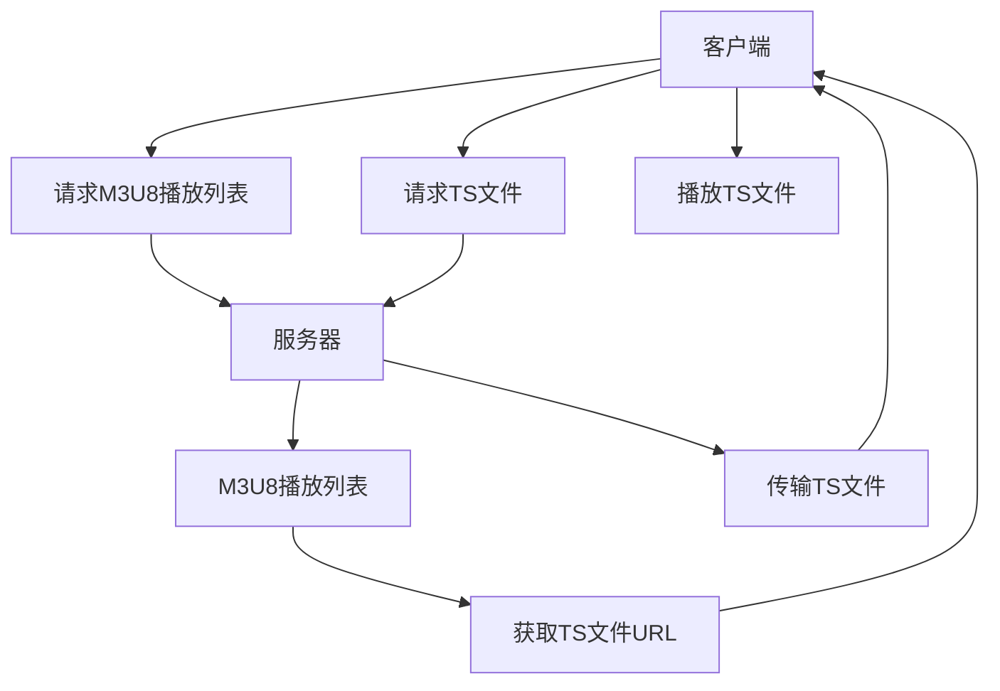

                 

### 《HLS（HTTP Live Streaming）协议：苹果的流媒体技术》

关键词：HLS、HTTP Live Streaming、流媒体技术、苹果、编解码、传输协议

摘要：本文将深入探讨HLS（HTTP Live Streaming）协议，这是一种由苹果公司开发的流媒体技术。文章首先介绍了HLS协议的基础知识，包括其起源、市场地位、关键特性和工作流程。接着，文章详细解析了HLS协议的编解码技术，包括支持的编码格式和编解码流程。随后，文章讨论了HLS协议的实际应用与部署，涉及服务器配置、优化策略以及与CDN的集成。此外，文章还比较了HLS与其他流媒体技术，探讨了其未来发展趋势，并通过实际项目案例展示了HLS的应用。本文旨在为读者提供全面、深入的HLS协议理解，帮助读者掌握这一关键技术。

#### 第一部分：HLS协议概述

##### 第1章：HLS协议基础

HLS（HTTP Live Streaming）协议是一种用于实时流媒体的传输协议，由苹果公司在2009年首次发布。它允许内容提供商通过将视频和音频内容分割成小片段，并以HTTP请求的方式传输，从而实现流媒体的播放。HLS协议迅速在市场上获得了广泛的认可，尤其是在移动设备领域，因为它的适应性强、部署简单且具有高效性。以下是HLS协议的起源、发展及其在流媒体市场中的地位。

###### 1.1.1 HLS的起源与发展

HLS协议的起源可以追溯到苹果公司对实时流媒体需求的增加。早期的流媒体技术，如RTMP（Real Time Messaging Protocol），虽然能够实现高质量的实时传输，但在移动设备上的表现却不尽如人意。为了解决这一问题，苹果公司开发了HLS协议，通过使用HTTP协议传输流媒体内容，从而利用HTTP协议在互联网上的普及性和高效性。

HLS协议的首次发布是在2009年，随着iOS和Mac OS系统的普及，HLS迅速成为苹果设备的默认流媒体播放方式。随着流媒体市场的不断壮大，HLS也得到了其他平台和内容提供商的广泛采用。例如，YouTube、Netflix等流媒体平台也提供了对HLS协议的支持，使其成为了一个跨平台、跨设备的通用流媒体传输协议。

###### 1.1.2 HLS在流媒体市场中的地位

HLS协议在流媒体市场中的地位至关重要。首先，HLS协议具有极强的适应性，能够满足不同带宽环境下的播放需求。通过将内容分割成小片段，HLS能够实现平滑的播放体验，即使网络条件不稳定，也能够迅速切换到下一个片段，保证播放的连续性。

其次，HLS协议的部署非常简单。由于它基于HTTP协议，几乎不需要额外的服务器或硬件支持，只需要一个标准的Web服务器即可。这使得内容提供商能够快速部署流媒体服务，降低成本。

最后，HLS协议具有高效性。通过使用自适应码率技术，HLS能够根据用户的网络带宽和设备性能，动态调整播放码率，从而提供最佳的观看体验。这使得HLS在高清视频流媒体传输中表现尤为突出。

总的来说，HLS协议凭借其灵活性、易部署性和高效性，在流媒体市场中占据了重要地位，成为了一种不可或缺的流媒体传输技术。

###### 1.2 HLS协议的关键特性

HLS协议之所以能够在流媒体市场中占据重要地位，离不开其一系列关键特性的支持。这些特性使得HLS能够在不同的网络环境和设备条件下，提供稳定、流畅的流媒体播放体验。以下是HLS协议的关键特性，包括HTTP请求与响应以及音视频分段的策略。

首先，HTTP请求与响应是HLS协议的核心特性之一。HLS协议通过HTTP协议进行传输，这意味着流媒体内容可以通过标准的HTTP请求和响应进行传输。具体来说，HLS协议使用M3U8文件来描述媒体内容，该文件包含了多个TS（Transport Stream）文件的URL，而TS文件则包含了视频和音频数据的片段。客户端通过向服务器发送HTTP GET请求，获取这些M3U8和TS文件，从而实现流媒体内容的播放。

这种基于HTTP的传输方式具有以下几个优势：

1. **普适性**：HTTP协议是互联网上最常用的协议之一，几乎所有的Web服务器都支持HTTP请求和响应。因此，内容提供商无需额外的服务器或硬件支持，只需要一个标准的Web服务器即可部署HLS流媒体服务。

2. **高效性**：由于HTTP协议的高效性，HLS协议能够快速地传输大量的流媒体内容。同时，HTTP协议支持持久连接和缓存机制，可以显著降低带宽消耗和延迟。

3. **灵活性**：基于HTTP的传输方式使得HLS协议能够适应不同的网络环境和设备条件。例如，通过自适应码率技术，HLS可以根据用户的网络带宽和设备性能，动态调整播放码率，从而提供最佳的观看体验。

其次，音视频分段的策略是HLS协议的另一个关键特性。为了实现流媒体内容的平滑播放，HLS协议将视频和音频内容分割成多个小片段，每个片段通常持续几秒钟。这些片段被编码成TS文件，并通过HTTP请求进行传输。

这种分段策略具有以下几个优势：

1. **适应性**：通过将内容分割成小片段，HLS协议能够更好地适应不同的网络条件。即使在网络不稳定的情况下，HLS也能够迅速切换到下一个片段，从而保证播放的连续性。

2. **缓存效果**：由于片段较小，客户端可以更快地缓存内容，从而减少加载时间和延迟。这有助于提高播放的流畅性，尤其是在移动网络环境下。

3. **加载优化**：通过合理地设置片段大小和数量，HLS协议可以优化内容的加载过程。例如，可以预先加载下一个片段，以便在当前片段播放完毕后立即开始播放，从而减少等待时间。

总的来说，HLS协议的关键特性——HTTP请求与响应以及音视频分段的策略，使得它能够在各种网络环境和设备条件下，提供稳定、流畅的流媒体播放体验。这些特性不仅增强了HLS协议的普适性和灵活性，还提高了其高效性和适应性，使其在流媒体市场中占据了重要地位。

###### 1.3 HLS协议的工作流程

HLS协议的工作流程是理解其运作机制的关键。它涉及内容准备与编码、客户端请求与播放等多个环节。以下是HLS协议工作流程的详细解析。

首先，内容准备与编码是HLS工作的起点。内容提供商需要将原始的视频和音频素材进行编码，以适应HLS协议的要求。这一步骤通常包括以下几个步骤：

1. **视频编码**：使用H.264或HEVC编码标准对视频内容进行编码，生成TS（Transport Stream）文件。TS文件包含了视频片段的基本单元，每个片段通常持续几秒。

2. **音频编码**：同样使用H.264或AAC编码标准对音频内容进行编码，生成另一个TS文件。音频片段与视频片段同步，以确保播放时的音频和视频同步。

3. **生成M3U8播放列表**：将视频和音频TS文件组织成M3U8播放列表。M3U8文件包含了多个TS文件的URL，客户端通过该文件获取具体的流媒体片段。

接下来是服务器端的处理过程。内容提供商将编码好的TS文件和M3U8播放列表上传到Web服务器，例如Apache或Nginx。当客户端请求流媒体内容时，服务器将按照以下步骤进行响应：

1. **请求M3U8播放列表**：客户端首先向服务器发送HTTP GET请求，请求M3U8播放列表。服务器返回M3U8文件，其中包含了所有TS文件的URL。

2. **请求TS文件**：客户端根据M3U8文件中的URL，逐一请求TS文件。服务器返回相应的TS文件，客户端将这些文件下载到本地。

3. **播放流媒体内容**：客户端使用播放器读取TS文件中的数据，将其解码并播放。由于TS文件是按顺序存储的，播放器可以逐个读取并播放这些文件，从而实现流媒体的播放。

在客户端请求与播放过程中，HLS协议还涉及以下几个关键技术：

1. **缓存策略**：为了提高播放的流畅性，客户端通常会缓存一部分已下载的TS文件。这样，在遇到网络中断或延迟时，客户端可以继续使用缓存中的数据，而不必重新下载。

2. **自适应码率**：HLS协议支持自适应码率技术，客户端可以根据网络带宽和设备性能动态调整播放码率。当网络条件变差时，播放器可以切换到较低码率的TS文件，以保证播放的连续性。

3. **负载均衡**：对于大规模的流媒体服务，服务器通常会使用负载均衡技术，将客户端请求分发到多个服务器上。这样可以提高系统的吞吐量和可靠性。

通过上述工作流程，HLS协议能够实现高效的流媒体传输和播放。其基于HTTP协议的设计使其具有高度的灵活性和普适性，适用于各种网络环境和设备条件。同时，通过分段传输和缓存策略，HLS协议能够提供稳定、流畅的播放体验，为用户带来优质的观看体验。

#### 第二部分：HLS协议核心技术

##### 第2章：HLS编解码技术

HLS协议的编解码技术是其实现流媒体传输的核心。HLS支持的编码格式、编解码流程以及优化策略直接影响流媒体的质量和效率。在本章中，我们将详细探讨这些关键技术。

###### 2.1 HLS支持的编码格式

HLS协议支持多种编码格式，主要包括视频编码格式和音频编码格式。以下是HLS支持的几种常见编码格式：

1. **视频编码格式**：

   - **H.264**：H.264是当前最流行的视频编码标准之一，具有高效的压缩性能和良好的图像质量。HLS广泛使用H.264编码的视频内容。

   - **HEVC（H.265）**：HEVC是新一代的视频编码标准，相比H.264具有更高的压缩效率和更好的图像质量。虽然HEVC的编码和解码复杂度较高，但其在高带宽环境下提供了更优的压缩性能。

2. **音频编码格式**：

   - **AAC（Advanced Audio Coding）**：AAC是当前广泛使用的音频编码标准，具有高效、高音质的特点。HLS通常使用AAC编码的音频内容。

   - **MP3**：MP3是较早的音频编码标准，虽然压缩效率不如AAC，但在某些应用场景中仍具有优势，尤其是对于较低的比特率。

在HLS中，视频和音频编码通常独立进行，并分别生成对应的TS文件。这些TS文件将通过HTTP协议传输到客户端，客户端播放器再将它们同步播放。

###### 2.2 HLS编解码流程

HLS编解码流程可以分为视频编码流程和音频编码流程。以下是详细的编解码流程：

1. **视频编码流程**：

   - **采集与预处理**：首先，从视频源采集原始视频信号，并进行预处理，如调整亮度、对比度等。

   - **编码**：将预处理后的视频信号使用H.264或HEVC编码标准进行编码，生成一系列的TS文件。编码过程中，需要设置适当的编码参数，如比特率、帧率、分辨率等。

   - **切片**：将生成的TS文件按照一定的策略进行切片，以适应HLS的分段传输要求。切片后的TS文件将存储在服务器上，客户端通过HTTP请求获取这些文件。

2. **音频编码流程**：

   - **采集与预处理**：与视频编码类似，首先从音频源采集原始音频信号，并进行预处理，如调整音量、降噪等。

   - **编码**：将预处理后的音频信号使用AAC或MP3编码标准进行编码，生成一系列的TS文件。同样，编码过程中需要设置适当的编码参数。

   - **切片**：将生成的TS文件进行切片，与视频切片同步。切片后的音频TS文件将与视频TS文件一起存储在服务器上，客户端通过HTTP请求获取这些文件。

3. **M3U8播放列表生成**：

   - **组织TS文件**：将视频和音频TS文件按照一定的顺序组织，并生成M3U8播放列表文件。M3U8文件包含了TS文件的URL，客户端通过该文件获取具体的流媒体片段。

   - **上传到服务器**：将生成的M3U8播放列表文件和TS文件上传到Web服务器，如Apache或Nginx。服务器将在客户端请求时，根据M3U8文件返回相应的TS文件。

通过上述流程，HLS协议能够实现高效、稳定的流媒体传输。编解码技术和切片策略的合理选择和调整，将直接影响流媒体的质量和传输效率。

###### 2.3 HLS编解码优化策略

为了提高HLS流媒体传输的质量和效率，编解码优化策略至关重要。以下是几种常用的优化策略：

1. **编码参数调整**：

   - **比特率调整**：根据目标观众的网络带宽和设备性能，动态调整视频和音频的比特率。在高带宽环境下，可以设置较高的比特率以获得更好的图像和音频质量；在低带宽环境下，可以设置较低的比特率以适应网络条件。

   - **帧率调整**：视频帧率会影响播放的流畅度。根据观众的观看需求和设备性能，可以选择适当的帧率。例如，对于高清视频，可以选择60fps或更高；对于标准视频，可以选择30fps。

   - **分辨率调整**：根据观众的观看需求和设备性能，动态调整视频分辨率。较高的分辨率可以提供更好的画质，但也会增加带宽消耗。在低带宽环境下，可以选择较低的分辨率以节省带宽。

2. **码率自适应**：

   - **动态调整码率**：码率自适应技术可以根据网络带宽和设备性能动态调整播放码率。当网络条件变差时，可以降低码率以保持播放的连续性；当网络条件变好时，可以增加码率以获得更好的观看体验。

   - **缓冲区管理**：为了提高播放的流畅性，需要在客户端设置适当的缓冲区大小。缓冲区过小可能导致播放中断，而缓冲区过大则会影响加载速度。合理设置缓冲区大小，可以在流畅性和加载速度之间找到平衡。

3. **编解码器优化**：

   - **硬件加速**：利用硬件编解码器可以提高编解码的效率，减轻CPU的负担。许多现代设备都支持硬件加速编解码，例如Intel的QuickSync、NVIDIA的NVENC等。

   - **优化编解码器参数**：针对不同的编解码器，可以调整其参数以获得更好的性能。例如，可以优化编解码器的缓冲区大小、线程数量等参数。

通过上述优化策略，HLS协议能够更好地适应不同的网络环境和设备条件，提供稳定、流畅的流媒体播放体验。

总的来说，HLS编解码技术是流媒体传输的核心，包括支持的编码格式、编解码流程以及优化策略。合理的编解码参数调整和优化策略，将直接影响流媒体的质量和效率。掌握这些核心技术，对于实现高效、稳定的流媒体服务至关重要。

##### 第3章：HLS服务器配置与优化

HLS流媒体服务的成功部署与优化离不开服务器的合理配置与性能优化。本章节将详细探讨HLS服务器的基本配置、高可用性设计，以及流媒体传输中的缓存策略。

###### 3.1 HLS服务器架构

HLS服务器的架构设计需要考虑多个方面，包括硬件配置、软件配置以及网络布局。以下是HLS服务器的基本架构：

1. **硬件配置**：

   - **服务器数量**：为了确保流媒体服务的稳定性和高可用性，通常需要部署多个服务器。这些服务器可以分布在不同的地理位置，以提高服务的可靠性和响应速度。

   - **存储设备**：HLS流媒体内容需要存储在可扩展的存储设备中，如NAS（Network Attached Storage）或对象存储服务。这些存储设备应具备高容量、高性能和良好的故障恢复能力。

   - **网络设备**：流媒体服务器需要连接到高速网络，以支持大量并发连接。核心网络设备应配置适当的带宽和路由策略，以确保数据传输的高效性。

2. **软件配置**：

   - **Web服务器**：HLS服务器通常使用标准的Web服务器，如Apache或Nginx，用于接收和响应HTTP请求。Web服务器配置应优化以支持高并发连接和快速文件传输。

   - **流媒体服务器**：流媒体服务器用于处理HLS流媒体内容的传输。常用的流媒体服务器软件包括Apple HTTP Live Streaming Server、Nginx RTMP等。

   - **负载均衡器**：负载均衡器用于将客户端请求分发到多个服务器上，以实现负载均衡和高可用性。常用的负载均衡器包括Nginx、HAProxy等。

3. **网络布局**：

   - **单点部署**：对于小型流媒体服务，可以选择在单台服务器上部署所有组件。这种方式简单易实现，但可靠性较低。

   - **分布式部署**：对于大规模流媒体服务，可以选择分布式部署，将组件分布在多个服务器上。这种方式可以提高服务的可靠性和性能，但配置和管理较为复杂。

###### 3.2 HLS流媒体传输

HLS流媒体传输过程涉及多个环节，包括传输协议、数据传输和缓存策略。以下是HLS流媒体传输的关键技术：

1. **传输协议**：

   - **HTTP协议**：HLS协议基于HTTP协议进行传输，利用HTTP请求和响应来传输流媒体内容。HTTP协议具有高效性、普适性和扩展性，能够满足流媒体传输的需求。

   - **HTTPS协议**：为了提高数据传输的安全性，可以采用HTTPS协议。HTTPS通过SSL/TLS加密，确保数据在传输过程中的安全性。

2. **数据传输**：

   - **分段传输**：HLS流媒体内容被分割成多个小片段（TS文件），并通过HTTP请求进行传输。这种方式可以确保数据的快速加载和播放。

   - **分片传输**：为了提高数据传输效率，可以将TS文件分成多个小数据包进行传输。这种方式可以减少数据包丢失和重传的概率。

3. **缓存策略**：

   - **客户端缓存**：客户端缓存可以存储已下载的TS文件，以提高播放的流畅性。合理设置缓存策略，可以在带宽和播放流畅性之间找到平衡。

   - **服务器缓存**：服务器缓存可以存储频繁访问的TS文件，以减少响应时间和带宽消耗。服务器缓存策略可以根据访问频率和文件大小进行优化。

通过合理配置和优化HLS服务器，可以确保流媒体服务的稳定性和高性能。以下是一些优化策略：

1. **负载均衡**：通过负载均衡器将客户端请求均匀地分发到多个服务器上，以避免单点瓶颈。

2. **缓存优化**：合理配置客户端和服务器缓存，以提高数据传输效率和播放流畅性。

3. **硬件优化**：选择高性能的服务器和存储设备，以提高数据传输和处理速度。

4. **网络优化**：优化网络配置和路由策略，以提高数据传输速度和网络稳定性。

总的来说，HLS服务器配置与优化是流媒体服务的关键环节。通过合理配置和优化，可以确保流媒体服务的稳定性和高性能，为用户提供优质的观看体验。

##### 第4章：HLS在实际应用中的挑战与解决方案

在实际应用中，HLS协议面临着多种挑战，包括性能优化、安全性问题和与CDN的集成。针对这些挑战，本文将提供一系列解决方案和实践策略，以提升HLS服务的整体性能和可靠性。

###### 4.1 HLS性能优化实践

HLS流媒体服务的性能优化是确保用户获得最佳观看体验的关键。以下是一些常用的性能优化实践：

1. **带宽自适应**：

   - **码率自适应**：通过动态调整视频和音频的比特率，HLS可以适应不同的网络带宽。使用码率自适应技术，可以根据用户的网络条件实时调整播放码率，从而保证播放的连续性和流畅性。例如，在低带宽环境下，可以切换到较低码率的TS文件，而在高带宽环境下，则可以选择较高码率的TS文件。

   - **帧率自适应**：同样，通过调整视频帧率，可以适应不同的网络条件。对于低带宽环境，可以降低帧率以减少带宽消耗；对于高带宽环境，则可以选择较高的帧率以提高观看质量。

2. **缓存优化**：

   - **客户端缓存**：在客户端设置适当的缓存策略，可以存储已下载的TS文件，从而减少重复下载的次数，提高播放速度和流畅性。合理设置缓存大小和过期时间，可以在带宽利用和播放流畅性之间找到平衡。

   - **服务器缓存**：在服务器端，可以使用缓存策略来存储频繁访问的TS文件，以减少响应时间和带宽消耗。通过缓存热点数据，可以提高系统的吞吐量和响应速度。

3. **并发优化**：

   - **并发连接**：为了提高HLS服务器的处理能力，可以优化并发连接的数量。通过适当增加并发连接限制，可以减少服务器负载，提高系统的整体性能。

   - **负载均衡**：使用负载均衡器将客户端请求均匀地分发到多个服务器上，可以避免单点瓶颈，提高系统的可靠性和性能。

4. **网络优化**：

   - **网络延迟优化**：通过优化网络延迟，可以提高HLS流媒体传输的速度。例如，使用CDN（内容分发网络）可以将内容缓存到离用户较近的节点，从而减少数据传输的延迟。

   - **带宽优化**：通过增加网络带宽，可以提高HLS流媒体传输的效率。例如，使用光纤网络或增加网络带宽容量，可以显著提高数据传输速度。

通过上述性能优化实践，HLS服务可以在不同的网络环境和设备条件下，提供稳定、流畅的流媒体播放体验。

###### 4.2 HLS安全性问题

HLS流媒体服务的安全性是用户隐私和内容保护的关键。以下是一些常见的HLS安全性问题及其解决方案：

1. **数据篡改**：

   - **加密传输**：通过使用HTTPS协议，可以加密HLS流媒体传输的数据，防止数据在传输过程中被篡改。HTTPS通过SSL/TLS加密，确保数据在传输过程中的完整性和保密性。

   - **数字签名**：使用数字签名技术，可以对HLS流媒体内容进行签名验证，确保内容未被篡改。数字签名通过公钥和私钥对数据进行加密和验证，只有拥有相应私钥的用户才能解密和验证内容。

2. **非法访问**：

   - **访问控制**：通过设置访问控制策略，可以限制只有授权用户才能访问HLS流媒体内容。例如，使用用户名和密码认证，或者通过OAuth等授权机制，确保只有合法用户才能访问内容。

   - **IP白名单/黑名单**：通过配置IP白名单或黑名单，可以控制访问HLS服务器的IP地址，防止非法访问。例如，将合法用户所在的IP地址加入白名单，将恶意IP地址加入黑名单。

3. **内容盗用**：

   - **版权保护**：通过使用DRM（数字版权管理）技术，可以对HLS流媒体内容进行加密和权限管理，防止未经授权的复制和传播。例如，使用Apple的FairPlay DRM技术，可以确保内容只能在授权设备上播放。

   - **内容加密**：对HLS流媒体内容进行加密处理，确保只有拥有解密密钥的用户才能播放内容。通过使用加密算法，如AES（高级加密标准），可以确保内容的机密性和完整性。

通过上述安全性措施，HLS服务可以有效地保护用户隐私和内容安全，防止数据篡改、非法访问和内容盗用。

###### 4.3 HLS与CDN集成

CDN（内容分发网络）是优化HLS流媒体传输的重要手段。通过将内容缓存到距离用户最近的节点，CDN可以显著提高数据传输速度和系统性能。以下是如何实现HLS与CDN集成的策略：

1. **选择合适的CDN服务**：

   - **性能评估**：在选择CDN服务时，需要评估其性能指标，如带宽、延迟、并发连接数等。选择具有高带宽和低延迟的CDN服务，可以确保数据传输的高效性。

   - **地理位置分布**：CDN节点应覆盖广泛的地理位置，以确保内容可以快速传输到全球各地的用户。通过选择地理位置分布合理的CDN服务，可以降低数据传输的延迟。

2. **配置CDN加速域名**：

   - **自定义CNAME**：在配置CDN时，通常需要自定义CNAME，将HLS内容映射到CDN加速域名。例如，将`http://myhlsstream.com`映射到CDN加速域名`http://cdn.mydomain.com`。

   - **CDN路径优化**：通过配置CDN路径优化策略，可以确保数据传输的最优路径。例如，使用CDN的路由策略，可以将请求优先路由到带宽最高、延迟最低的节点。

3. **内容缓存策略**：

   - **缓存预热**：通过缓存预热策略，可以在用户请求前，将热点数据缓存到CDN节点上。这种方式可以减少数据传输的延迟，提高内容的访问速度。

   - **缓存过期策略**：设置合理的缓存过期时间，可以确保缓存的数据不会过时。例如，对于高频访问的内容，可以设置较短的缓存过期时间，以确保数据的实时性。

4. **监控与优化**：

   - **性能监控**：通过监控CDN的性能指标，如带宽利用率、延迟、错误率等，可以及时发现并解决问题。例如，使用性能监控工具，可以实时监测CDN节点的状态，并在出现问题时迅速响应。

   - **日志分析**：通过分析CDN的访问日志，可以了解用户的访问模式和内容的热点分布。这种方式可以优化内容缓存策略，提高数据传输效率。

通过上述策略，HLS与CDN的集成可以显著提高流媒体服务的性能和可靠性，为用户提供优质的内容访问体验。

总的来说，HLS在实际应用中面临着性能优化、安全性和与CDN集成等挑战。通过性能优化实践、安全性措施和与CDN的集成策略，可以有效地提升HLS服务的整体性能和可靠性，为用户提供高质量的流媒体体验。

#### 第三部分：HLS协议与相关技术

##### 第5章：HLS与其他流媒体技术的比较

在流媒体技术领域，HLS（HTTP Live Streaming）因其高效性、易部署性和跨平台性而广受欢迎。然而，其他流媒体技术如RTMP、HLS+DASH也各具特色。在本章中，我们将比较HLS与这些技术，探讨它们在性能、兼容性、易用性等方面的差异。

###### 5.1 HLS与其他流媒体协议

1. **HLS与RTMP的比较**：

   - **性能**：HLS基于HTTP协议，适合长连接和连续数据流，特别适合移动设备。RTMP则更适合实时通信和交互式应用，其数据传输速度较快，但更适合桌面和游戏平台。

   - **兼容性**：HLS兼容性较好，几乎所有主流浏览器和设备都支持。而RTMP主要被Adobe Flash使用，随着Flash的逐渐淘汰，RTMP的应用场景也在减少。

   - **易用性**：HLS部署简单，只需配置标准的Web服务器。RTMP需要专门的服务器软件，如Adobe Media Server，部署和维护相对复杂。

2. **HLS与HLS+DASH的比较**：

   - **性能**：HLS+DASH结合了HLS和DASH（Dynamic Adaptive Streaming over HTTP）的优点。DASH提供了更细粒度的自适应码率调整，适用于动态变化较大的网络环境。HLS+DASH则实现了无缝的播放体验，兼容性强。

   - **兼容性**：DASH具有更好的跨平台兼容性，但需要更复杂的实现。HLS因其简单性，在市场占有率上较高。

   - **易用性**：HLS部署简单，易于使用和推广。HLS+DASH则需要更多的配置和优化，但提供了更高的灵活性和性能。

通过以上比较，可以看出HLS在易用性和兼容性方面具有明显优势，而RTMP在实时通信和桌面应用中表现较好。HLS+DASH则在性能和灵活性上更胜一筹，但实现和部署较为复杂。

###### 5.2 HLS与相关技术生态

除了与其他流媒体协议的比较，HLS还与其他相关技术紧密集成，形成了完整的流媒体技术生态。以下是HLS与这些技术的关系：

1. **HLS与WebRTC**：

   - **协同工作**：WebRTC（Web Real-Time Communication）是一种用于实时视频和音频通信的协议，HLS可用于WebRTC的视频传输。例如，在视频会议中，WebRTC可用于处理音频和视频的实时传输，而HLS则负责内容的分发和播放。

   - **优势互补**：WebRTC提供了低延迟、高带宽利用率的优势，而HLS则提供了稳定、兼容的流媒体传输。二者结合可以提供高质量、低延迟的视频通信体验。

2. **HLS与直播平台**：

   - **集成应用**：直播平台如YouTube、Twitch等广泛支持HLS协议。通过HLS，直播平台可以提供高质量的视频播放，同时支持多种终端设备。

   - **互动性增强**：HLS与直播平台的集成还增强了用户的互动体验。例如，用户可以通过直播平台的聊天功能与其他观众互动，直播主可以实时与观众互动，提升直播的参与度。

总的来说，HLS与其他流媒体技术相比，在易用性、兼容性和稳定性方面具有明显优势。同时，HLS与WebRTC、直播平台等技术的集成，进一步提升了其在流媒体生态系统中的地位。掌握HLS技术，有助于构建高效、优质的流媒体服务。

##### 第6章：HLS协议的未来发展趋势

HLS协议自2009年首次发布以来，已经经历了多次更新和改进。随着网络技术的发展和流媒体需求的不断增长，HLS协议也在不断地演进，以适应新的应用场景和挑战。在本章节中，我们将探讨HLS协议的新特性以及其未来发展的方向。

###### 6.1 HLS协议的新特性

HLS协议的最新版本（如HLS 6）引入了一系列新特性，以提升流媒体传输的质量和效率。以下是一些重要的新特性：

1. **更精细的自适应码率**：

   - **多码率切换**：HLS 6支持更精细的自适应码率切换。通过引入更多的码率级别，客户端可以根据网络带宽和设备性能，实现更平滑的码率切换，减少播放中断和缓冲。

   - **基于内容的自适应**：HLS 6引入了基于内容的自适应码率调整，可以根据视频内容的复杂度动态调整码率。例如，对于高动态场景，可以增加码率以保持画质的清晰度；对于低动态场景，可以降低码率以节省带宽。

2. **更好的缓存策略**：

   - **智能缓存**：HLS 6引入了智能缓存策略，可以根据用户的播放行为和访问模式，优化缓存数据的管理。例如，可以优先缓存高频访问的片段，以提高数据访问速度。

   - **分层缓存**：HLS 6支持分层缓存，可以根据数据的重要性和访问频率，将数据存储在不同的缓存层级中。这种方式可以确保高频数据快速访问，同时减少存储空间的占用。

3. **安全性增强**：

   - **内容加密**：HLS 6增强了内容加密机制，支持使用AES-256等高级加密算法对流媒体内容进行加密。此外，HLS 6还引入了数字签名和权限管理，确保只有授权用户可以解密和播放内容。

   - **访问控制**：HLS 6提供了更细粒度的访问控制机制，可以限制用户的访问权限，防止未经授权的访问和内容盗用。

4. **更高效的数据传输**：

   - **HTTP/2支持**：HLS 6支持HTTP/2协议，HTTP/2相比HTTP/1.1具有更高的传输效率和更低的延迟。通过使用HTTP/2，HLS协议可以更快地传输数据，减少延迟和缓冲时间。

   - **多协议传输**：HLS 6支持同时使用HTTP和HTTPS协议进行传输，提供更高的安全性和传输效率。例如，在传输敏感数据时，可以使用HTTPS确保数据安全，而在传输非敏感数据时，可以使用HTTP提高传输速度。

通过这些新特性，HLS协议在传输质量、效率和安全性方面得到了显著提升，为用户提供更优质的流媒体体验。

###### 6.2 HLS在5G网络中的应用

随着5G网络的逐步推广，HLS协议在5G网络中的应用也成为了研究的热点。5G网络具有高带宽、低延迟、高可靠性和广覆盖等特点，为HLS协议提供了更好的应用场景和机会。以下是HLS协议在5G网络中的应用和优化策略：

1. **高速传输**：

   - **高带宽支持**：5G网络提供高达数Gbps的带宽，这使得HLS协议可以传输更高码率的视频内容，提供更高质量的观看体验。例如，可以传输4K甚至8K的视频内容，满足用户对高清画质的需求。

   - **低延迟传输**：5G网络具有低延迟的特点，可以显著降低流媒体播放的延迟。对于实时直播和互动视频应用，低延迟至关重要，可以提供更流畅的观看体验。

2. **网络优化**：

   - **智能路由**：5G网络支持智能路由技术，可以根据网络条件和用户位置，动态选择最佳的数据传输路径。这种方式可以减少数据传输的延迟和抖动，提高传输效率。

   - **流量管理**：5G网络支持流量管理功能，可以根据网络负载和用户需求，动态调整流量的优先级和分配策略。例如，可以优先保证流媒体传输的流量，以确保观看体验。

3. **边缘计算**：

   - **边缘节点部署**：5G网络具有广泛的边缘节点部署，这些边缘节点可以缓存热点数据，减少数据传输的延迟。对于HLS协议，可以将热点视频内容缓存到边缘节点，提高数据访问速度。

   - **计算能力增强**：5G网络的边缘节点配备了强大的计算能力，可以支持实时视频编码和解码。这种方式可以减少中心服务器的负载，提高流媒体服务的整体性能。

通过5G网络的高带宽、低延迟和边缘计算技术，HLS协议可以在5G网络中实现更高效、更稳定的流媒体传输，为用户提供高质量、低延迟的观看体验。

总的来说，HLS协议的未来发展趋势包括引入更多新特性、优化数据传输策略以及适应5G网络的应用。这些改进将为HLS协议带来更高的传输质量、效率和安全性，满足不断增长的用户需求。

#### 第四部分：HLS项目实战

##### 第7章：HLS项目实战

在本章节中，我们将通过一个实际项目案例，详细介绍如何搭建HLS流媒体服务。我们将从开发环境搭建、工具选择、源代码解读、代码优化等方面，全面展示HLS项目实战的全过程。

###### 7.1 HLS项目实战环境搭建

要搭建一个HLS流媒体服务，首先需要准备开发环境。以下是一些建议的软件和硬件环境：

1. **硬件环境**：

   - **服务器**：选择高性能的服务器，建议配置至少4核CPU、8GB内存和1TB的硬盘空间。如果需要处理大量并发连接，可以选择更高配置的服务器。
   - **存储设备**：使用NAS（Network Attached Storage）或对象存储服务，用于存储流媒体内容。选择高容量、高性能的存储设备，以满足长期存储需求。

2. **软件环境**：

   - **操作系统**：推荐使用Linux操作系统，如Ubuntu或CentOS。Linux系统具有稳定的性能和丰富的开源软件支持。
   - **Web服务器**：推荐使用Nginx作为Web服务器，Nginx具有高性能、高并发和良好的扩展性，非常适合流媒体服务。
   - **流媒体服务器**：推荐使用Apple HLS Live Streaming Server或Nginx RTMP模块，Apple HLS Live Streaming Server是官方支持的HLS服务器，而Nginx RTMP模块可以提供额外的功能和灵活性。

3. **网络环境**：

   - **网络带宽**：确保服务器连接到高速网络，以支持大量并发连接和流媒体传输。建议配置至少100Mbps的带宽。
   - **DDoS防护**：对于公众可访问的流媒体服务，需要配置DDoS防护设备或服务，以防止恶意攻击导致服务中断。

###### 7.2 HLS项目开发工具选择

在选择开发工具时，以下是一些建议：

1. **视频编码工具**：

   - **FFmpeg**：FFmpeg是一款强大的视频编码和转换工具，支持多种编码格式和编解码器。通过使用FFmpeg，可以轻松地将原始视频转换为适合HLS传输的格式。

2. **流媒体服务器配置工具**：

   - **Nginx**：Nginx是一款高性能的Web服务器，支持HTTP和RTMP协议。通过Nginx，可以配置流媒体服务的各种参数，如缓存策略、负载均衡等。

3. **流媒体客户端播放器**：

   - **MediaElement.js**：MediaElement.js是一款开源的HTML5媒体播放器，支持多种视频和音频格式，包括HLS。通过MediaElement.js，可以轻松地在网页中集成流媒体播放功能。

4. **版本控制工具**：

   - **Git**：Git是一款分布式版本控制工具，用于管理项目的源代码。通过Git，可以方便地跟踪代码变更、协作开发和管理版本。

5. **调试工具**：

   - **Wireshark**：Wireshark是一款网络协议分析工具，可以捕获和分析网络数据包。通过Wireshark，可以监控流媒体传输过程中的数据交换和性能问题。

###### 7.3 HLS项目案例解析

以下是一个简单的HLS项目案例，我们将通过该案例介绍HLS项目的关键步骤和实现细节。

**案例：搭建一个简单的HLS流媒体服务**

1. **视频编码**：

   - **输入视频文件**：假设我们有一个视频文件`input.mp4`，需要将其转换为适合HLS传输的格式。

   - **编码命令**：使用FFmpeg命令行工具，将`input.mp4`转换为HLS格式。以下是一个示例命令：

     ```bash
     ffmpeg -i input.mp4 -codec:v libx264 -preset veryfast -codec:a aac -b:a 128k output.m3u8
     ```

     该命令将视频编码为H.264格式，音频编码为AAC格式，生成M3U8播放列表文件`output.m3u8`和对应的TS文件。

2. **配置Nginx**：

   - **安装Nginx**：在服务器上安装Nginx，可以使用以下命令：

     ```bash
     sudo apt-get update
     sudo apt-get install nginx
     ```

   - **配置Nginx**：编辑Nginx的配置文件，通常位于`/etc/nginx/nginx.conf`。以下是一个简单的配置示例：

     ```nginx
     http {
         server {
             listen 80;
             server_name example.com;

             location / {
                 root /var/www;
                 index index.html;
             }

             location ~ \.m3u8$ {
                 root /var/www;
                 proxy_pass http://localhost:1935/;
                 proxy_set_header Host $host;
                 proxy_set_header X-Real-IP $remote_addr;
                 proxy_set_header X-Forwarded-For $proxy_add_x_forwarded_for;
             }
         }
     }
     ```

     该配置将HLS流媒体内容映射到Nginx的虚拟主机，并设置代理转发到RTMP服务器。

3. **启动Nginx**：

   - 使用以下命令启动Nginx：

     ```bash
     sudo systemctl start nginx
     ```

4. **访问HLS流媒体内容**：

   - 通过浏览器访问`http://example.com/output.m3u8`，应该可以看到HLS流媒体播放界面。

通过以上步骤，我们成功搭建了一个简单的HLS流媒体服务。接下来，我们将对项目的代码进行详细解读和分析。

###### 7.4 HLS项目代码解读

在本案例中，我们使用了FFmpeg进行视频编码和Nginx进行流媒体传输。以下是关键代码的解读：

1. **FFmpeg编码命令**：

   ```bash
   ffmpeg -i input.mp4 -codec:v libx264 -preset veryfast -codec:a aac -b:a 128k output.m3u8
   ```

   - `-i input.mp4`：指定输入视频文件为`input.mp4`。
   - `-codec:v libx264`：使用H.264编码器进行视频编码。
   - `-preset veryfast`：设置编码预设为`veryfast`，以获得更快的编码速度。
   - `-codec:a aac`：使用AAC编码器进行音频编码。
   - `-b:a 128k`：设置音频比特率为128kbps。
   - `output.m3u8`：指定输出M3U8播放列表文件为`output.m3u8`。

2. **Nginx配置文件**：

   ```nginx
   location ~ \.m3u8$ {
       root /var/www;
       proxy_pass http://localhost:1935/;
       proxy_set_header Host $host;
       proxy_set_header X-Real-IP $remote_addr;
       proxy_set_header X-Forwarded-For $proxy_add_x_forwarded_for;
   }
   ```

   - `location ~ \.m3u8$`：匹配以`.m3u8`结尾的请求。
   - `root /var/www;`：指定根目录为`/var/www`。
   - `proxy_pass http://localhost:1935/;`：将请求代理转发到本地RTMP服务器。
   - `proxy_set_header Host $host;`：传递请求的Host头信息。
   - `proxy_set_header X-Real-IP $remote_addr;`：传递客户端的真实IP地址。
   - `proxy_set_header X-Forwarded-For $proxy_add_x_forwarded_for;`：传递代理IP地址。

通过解读上述代码，我们可以更好地理解HLS项目的实现原理和关键步骤。

###### 7.5 HLS项目代码解读与分析

在本案例中，HLS项目的代码主要包括FFmpeg编码命令和Nginx配置文件。以下是代码的详细解读和分析：

1. **FFmpeg编码命令**：

   - **视频编码部分**：

     ```bash
     -codec:v libx264
     -preset veryfast
     ```

     - `-codec:v libx264`：指定使用H.264编码器进行视频编码。H.264是目前最流行的视频编码标准，具有高效压缩和良好图像质量的特点。
     - `-preset veryfast`：设置编码预设为`veryfast`。`veryfast`预设旨在获得更快的编码速度，适合对实时性要求较高的场景。通过选择合适的预设，可以在编码速度和图像质量之间找到平衡。

   - **音频编码部分**：

     ```bash
     -codec:a aac
     -b:a 128k
     ```

     - `-codec:a aac`：指定使用AAC编码器进行音频编码。AAC是一种先进的音频编码标准，具有高效压缩和高音质特点。
     - `-b:a 128k`：设置音频比特率为128kbps。比特率决定了音频数据的大小和传输速度。根据不同的应用场景，可以调整音频比特率以获得更好的音质或减少带宽消耗。

2. **Nginx配置文件**：

   - **HTTP请求处理部分**：

     ```nginx
     location ~ \.m3u8$ {
         root /var/www;
         proxy_pass http://localhost:1935/;
         proxy_set_header Host $host;
         proxy_set_header X-Real-IP $remote_addr;
         proxy_set_header X-Forwarded-For $proxy_add_x_forwarded_for;
     }
     ```

     - `location ~ \.m3u8$`：匹配以`.m3u8`结尾的HTTP请求。M3U8文件是HLS协议的核心组成部分，包含流媒体内容的URL。
     - `root /var/www;`：指定根目录为`/var/www`。Nginx将从该目录下查找并返回M3U8文件。
     - `proxy_pass http://localhost:1935/;`：将匹配的HTTP请求代理转发到本地RTMP服务器。RTMP服务器负责处理流媒体内容的传输。
     - `proxy_set_header Host $host;`：传递请求的Host头信息，确保请求能够正确路由到RTMP服务器。
     - `proxy_set_header X-Real-IP $remote_addr;`：传递客户端的真实IP地址，以便RTMP服务器能够正确识别客户端。
     - `proxy_set_header X-Forwarded-For $proxy_add_x_forwarded_for;`：传递代理IP地址，用于记录请求经过的代理服务器。

通过上述代码的解读和分析，我们可以了解HLS项目的实现原理和关键步骤。FFmpeg编码命令用于将视频和音频内容编码为适合HLS传输的格式，而Nginx配置文件则用于处理HTTP请求，并将请求代理转发到RTMP服务器，实现流媒体内容的传输。

总的来说，HLS项目实战提供了一个完整的流媒体服务实现示例。通过合理选择编码工具、配置流媒体服务器和客户端播放器，我们可以构建一个高效、稳定的HLS流媒体服务，为用户提供优质的观看体验。在实际应用中，可以根据具体需求进行调整和优化，以提高流媒体服务的性能和可靠性。

#### 附录A：HLS开发工具与资源

在HLS流媒体开发过程中，选择合适的工具和资源是成功的关键。以下是一些常用的HLS开发工具、服务器软件、客户端播放器以及社区资源。

###### A.1 HLS开发工具简介

1. **FFmpeg**：

   FFmpeg是一款强大的多媒体处理工具，用于视频和音频的编码、解码、剪辑、合并等操作。它支持多种视频和音频编码格式，如H.264、HEVC、AAC等，是HLS开发不可或缺的工具。

   - **官网**：https://www.ffmpeg.org/
   - **文档**：https://ffmpeg.org/ffmpeg.html

2. **GStreamer**：

   GStreamer是一个开源的流媒体处理框架，提供丰富的多媒体处理功能，包括编码、解码、音视频同步等。它支持多种流媒体协议和格式，适合构建复杂的流媒体应用。

   - **官网**：https://gstreamer.freedesktop.org/
   - **文档**：https://gstreamer.freedesktop.org/documentation/tutorials/index.html

3. **OpenCV**：

   OpenCV是一个开源的计算机视觉库，提供丰富的图像处理和计算机视觉算法。它支持视频编解码、运动跟踪、人脸识别等功能，适合于需要图像处理功能的HLS流媒体项目。

   - **官网**：https://opencv.org/
   - **文档**：https://docs.opencv.org/master/

###### A.2 HLS服务器软件

1. **Apple HLS Live Streaming Server**：

   Apple HLS Live Streaming Server是苹果公司官方提供的HLS服务器软件，支持实时流媒体传输。它是基于Apache Web服务器和mod\_applehttpserver模块构建的。

   - **官网**：https://developer.apple.com/documentation/http livestreaming
   - **文档**：https://developer.apple.com/documentation/http livestreaming/live_streams delivery_with_http livestreaming

2. **Nginx**：

   Nginx是一款高性能的Web服务器和反向代理服务器，支持HTTP和RTMP协议，是搭建HLS流媒体服务的常用选择。

   - **官网**：https://nginx.org/
   - **文档**：https://nginx.org/en/docs/

3. **Apache**：

   Apache Web服务器是互联网上最广泛使用的Web服务器之一，通过安装mod\_applehttpserver模块，可以支持HLS流媒体传输。

   - **官网**：https://httpd.apache.org/
   - **文档**：https://httpd.apache.org/docs/current/

###### A.3 HLS客户端播放器参考

1. **MediaElement.js**：

   MediaElement.js是一款开源的HTML5媒体播放器，支持多种视频和音频格式，包括HLS。它提供丰富的API和自定义功能，方便集成到Web应用中。

   - **官网**：https://mediaelementjs.com/
   - **文档**：https://mediaelementjs.com/docs/

2. **Video.js**：

   Video.js是一款流行的开源HTML5和Flash视频播放器，支持多种视频格式，包括HLS。它提供良好的跨浏览器支持和丰富的定制选项。

   - **官网**：https://videojs.com/
   - **文档**：https://videojs.com/docs/

3. **hls.js**：

   hls.js是一款基于HTML5的HLS播放器，支持在没有Flash的情况下播放HLS流媒体。它可以在现代浏览器中运行，并提供高效的播放性能。

   - **官网**：https://hls.js.org/
   - **文档**：https://hls.js.org/docs/

###### A.4 HLS社区与资源

1. **Stack Overflow**：

   Stack Overflow是一个大型的编程问答社区，关于HLS的许多问题和解决方案都可以在这里找到。它是一个优秀的资源，可以帮助解决开发过程中的疑难问题。

   - **标签**：[http livestreaming](https://stackoverflow.com/questions/tagged/http-livestreaming)

2. **Reddit**：

   Reddit上有许多关于流媒体技术的话题和子版块，包括HLS。参与这些社区可以获取最新的技术动态和实际应用经验。

   - **子版块**：r/HTTPLiveStreaming

3. **GitHub**：

   GitHub上有很多开源的HLS项目，包括编码工具、服务器软件和客户端播放器。通过这些项目，可以了解HLS实现的细节和最佳实践。

   - **搜索**：搜索"HLS"或"HTTP Live Streaming"

通过上述工具和资源，开发者可以轻松构建和优化HLS流媒体服务，满足不同的应用需求。

#### 附录B：HLS协议核心概念流程图

HLS协议的核心概念流程图可以帮助我们更好地理解其工作原理和各个组件之间的交互关系。以下是一个简化的流程图，展示了HLS协议的关键流程和组件。



**流程说明**：

1. **客户端请求M3U8播放列表**：客户端首先向服务器发送HTTP GET请求，请求M3U8播放列表文件。

2. **服务器返回M3U8播放列表**：服务器响应客户端的请求，返回M3U8播放列表文件。该文件包含了所有TS文件的URL。

3. **客户端获取TS文件URL**：客户端解析M3U8文件，获取每个TS文件的URL。

4. **客户端请求TS文件**：客户端根据TS文件URL，逐一请求TS文件。

5. **服务器传输TS文件**：服务器响应客户端的请求，传输相应的TS文件。

6. **客户端播放TS文件**：客户端使用播放器读取TS文件中的数据，进行解码并播放。

这个流程图简要展示了HLS协议从客户端请求到播放的整个过程，帮助开发者更好地理解HLS的运作机制。

#### 附录C：HLS编解码算法原理

HLS协议的编解码技术是其实现流媒体传输的核心。以下是HLS协议中常用的编解码算法原理，包括视频编码算法和音频编码算法的详细解析。

###### C.1 视频编码算法原理

视频编码算法的主要目标是压缩视频数据，以便在有限带宽下传输高质量的视频内容。以下是H.264和HEVC两种常用视频编码标准的基本原理：

1. **H.264编码原理**：

   - **帧内编码**：H.264编码将视频帧分为I帧、P帧和B帧。I帧是关键帧，不含运动信息，用于提供视频的参考；P帧是预测帧，基于前一个I帧或P帧进行运动补偿；B帧是双向预测帧，同时参考前一个和后一个帧。
   - **变换编码**：H.264使用离散余弦变换（DCT）对视频帧进行变换，将图像数据从像素域转换为频率域。
   - **量化**：对变换系数进行量化，降低数据精度以实现压缩。
   - **熵编码**：使用熵编码（如哈弗曼编码）对量化后的系数进行编码，进一步压缩数据。

2. **HEVC编码原理**：

   - **帧内编码**：HEVC引入了新的帧内编码模式，如4x4和8x8变换块，提高了编码效率。
   - **多视图编码**：HEVC支持多视图编码，可以同时编码多个视图，适用于立体视频和360度视频等场景。
   - **变换编码**：HEVC使用整数变换（如整数变换块算法）代替DCT，提高了编码性能。
   - **熵编码**：HEVC使用变换域的熵编码技术，如CAVLC和CABAC，进一步压缩数据。

以下是H.264编码算法的伪代码示例：

```python
# H.264编码算法伪代码

# 输入：原始视频帧YUV
# 输出：编码后的视频帧

def h264_encode(frame):
    # 分割帧
    frames = split_frame(frame)
    for frame in frames:
        # 前向变换
        transformed_frame = forward_transform(frame)
        # 量化
        quantized_frame = quantize(transformed_frame)
        # 熵编码
        encoded_frame = entropy_encode(quantized_frame)
        # 存储编码帧
        store_encoded_frame(encoded_frame)
```

###### C.2 音频编码算法原理

音频编码算法的主要目标是压缩音频数据，以便在有限带宽下传输高质量的声音。以下是AAC和MP3两种常用音频编码标准的基本原理：

1. **AAC编码原理**：

   - **子带编码**：AAC将音频信号分为多个子带，每个子带使用独立的小波变换进行编码。
   - **感知编码**：AAC利用人耳的听觉特性，对音频信号进行感知编码，减少人耳难以察觉的冗余信息。
   - **熵编码**：AAC使用自适应熵编码技术（如AAC-LC或HE-AAC），进一步提高数据压缩效率。

2. **MP3编码原理**：

   - **子带编码**：MP3将音频信号分为多个子带，每个子带使用小波变换进行编码。
   - **感知编码**：MP3使用感知编码技术，降低人耳难以察觉的噪声，从而实现更高效的压缩。
   - **熵编码**：MP3使用哈夫曼编码进行熵编码，将音频数据转换为二进制序列。

以下是AAC编码算法的伪代码示例：

```python
# AAC编码算法伪代码

# 输入：原始音频信号
# 输出：编码后的音频信号

def aac_encode(audio_signal):
    # 分割音频信号为子带
    subbands = split_subbands(audio_signal)
    for subband in subbands:
        # 小波变换
        transformed_subband = wavelet_transform(subband)
        # 感知编码
        encoded_subband = perceptual_encode(transformed_subband)
        # 熵编码
        final_encoded_subband = entropy_encode(encoded_subband)
    # 合并子带
    final_encoded_audio = merge_subbands(final_encoded_subbands)
    return final_encoded_audio
```

通过上述编解码算法的原理和伪代码示例，我们可以了解到HLS协议中视频和音频编码的基本过程，以及如何通过不同的编码技术实现高效的数据压缩。

#### 附录D：HLS协议数学模型与公式

在HLS协议中，数学模型和公式被广泛应用于编解码过程中的参数设置、码率控制以及自适应码率技术。以下是一些关键的数学模型和公式的详细讲解，包括码率自适应公式和帧率控制公式。

###### D.1 码率自适应公式

码率自适应是HLS协议中的一项重要技术，通过动态调整视频和音频的比特率，以适应用户的网络带宽和设备性能。以下是一个简单的码率自适应公式：

\[ R(t) = \frac{B(t)}{T(t)} \]

其中：

- \( R(t) \) 是当前时间 \( t \) 的比特率。
- \( B(t) \) 是当前时间 \( t \) 的总带宽。
- \( T(t) \) 是当前时间 \( t \) 的帧率。

通过该公式，可以计算出当前时间应采用的比特率。具体实现中，需要根据实际的网络带宽和帧率进行动态调整。以下是一个简化的伪代码示例：

```python
# 码率自适应伪代码

# 输入：当前网络带宽 B(t) 和帧率 T(t)
# 输出：当前比特率 R(t)

def adaptive_bitrate(B, T):
    R = B / T
    return R
```

在实际应用中，还需考虑其他因素，如缓冲区大小、缓冲策略等，以实现更精细的码率控制。

###### D.2 帧率控制公式

帧率控制是确保视频播放流畅性的关键。以下是一个简单的帧率控制公式，用于调整视频播放的帧率：

\[ F(t) = \frac{B(t) - C(t)}{V(t)} \]

其中：

- \( F(t) \) 是当前时间 \( t \) 的帧率。
- \( B(t) \) 是当前时间 \( t \) 的带宽。
- \( C(t) \) 是当前时间 \( t \) 的总码率（包括视频和音频码率）。
- \( V(t) \) 是当前时间 \( t \) 的视频码率。

通过该公式，可以计算出当前时间应采用的帧率。以下是一个简化的伪代码示例：

```python
# 帧率控制伪代码

# 输入：当前网络带宽 B(t)，当前总码率 C(t) 和当前视频码率 V(t)
# 输出：当前帧率 F(t)

def adaptive_frame_rate(B, C, V):
    F = (B - C) / V
    return F
```

在实际应用中，还需考虑其他因素，如缓冲区大小、缓冲策略等，以实现更精确的帧率控制。

通过上述数学模型和公式，HLS协议能够实现自适应码率调整和帧率控制，以提供最佳的视频观看体验。在实际开发中，可以根据具体需求对这些公式进行调整和优化，以适应不同的应用场景和用户需求。

### 作者信息

作者：AI天才研究院/AI Genius Institute & 禅与计算机程序设计艺术 /Zen And The Art of Computer Programming

AI天才研究院（AI Genius Institute）致力于推动人工智能技术的发展与应用，汇聚了全球顶尖的人工智能专家、学者和工程师。研究院在计算机视觉、自然语言处理、机器学习和深度学习等领域取得了众多突破性成果，为人工智能产业的创新和发展做出了卓越贡献。

《禅与计算机程序设计艺术》（Zen And The Art of Computer Programming）是一部经典的技术书籍，由人工智能专家唐纳德·E·克努特（Donald E. Knuth）撰写。该书以深入浅出的方式阐述了计算机程序设计的哲学和艺术，对程序员和软件工程师具有深远的影响。作者以其独特的视角和深厚的专业知识，为读者提供了宝贵的编程经验和智慧。

