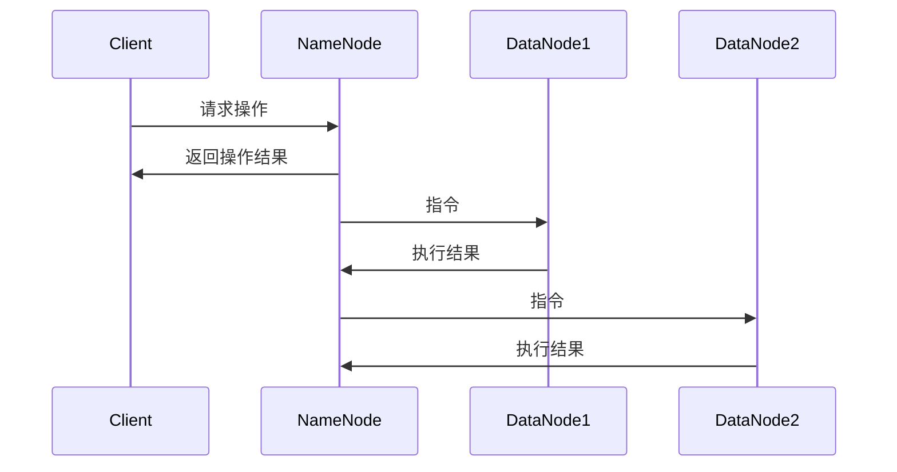
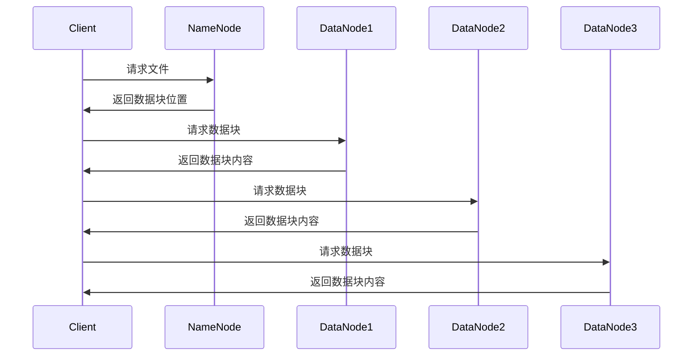
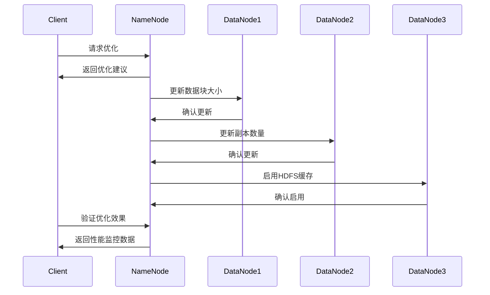
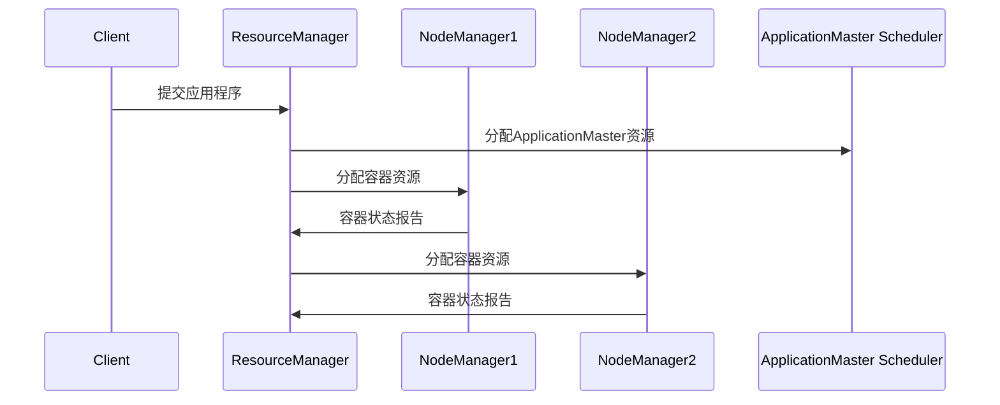
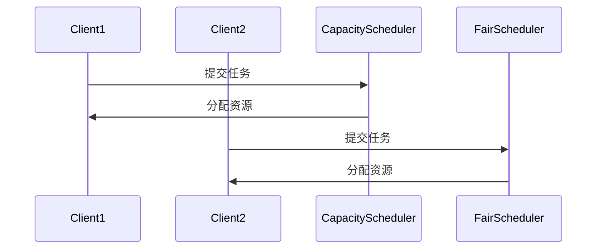
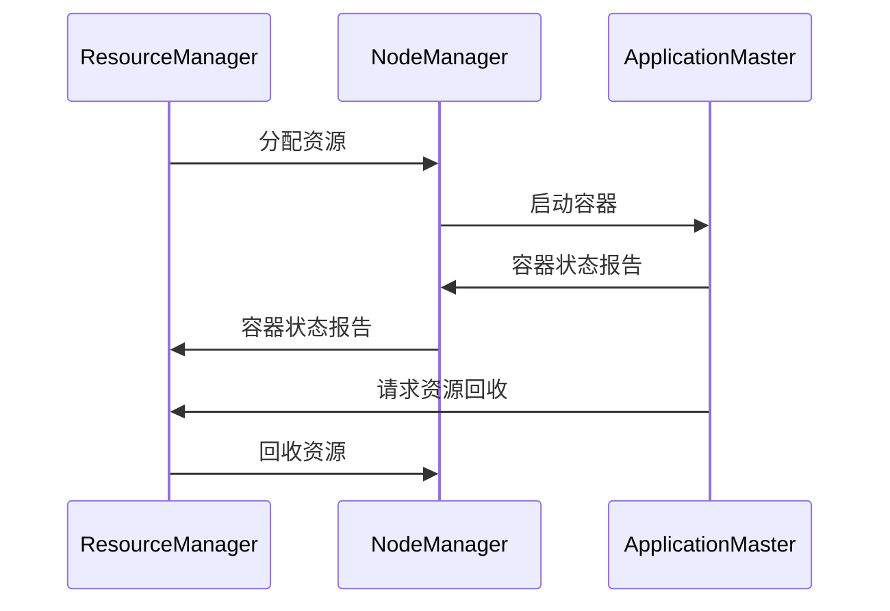
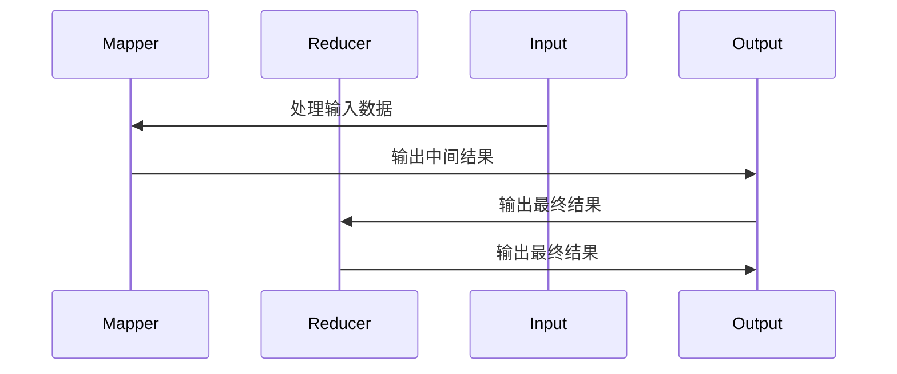
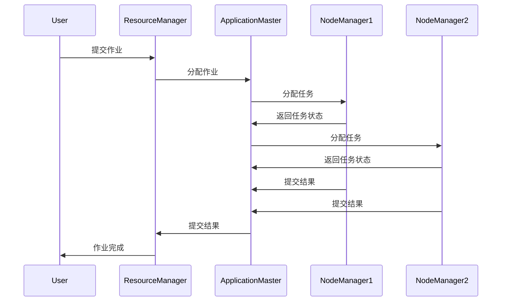

                 

# 文章标题：Hadoop原理与代码实例讲解

> 关键词：Hadoop，分布式文件系统（HDFS），YARN，MapReduce，数据分析

> 摘要：
本文旨在系统地介绍Hadoop的原理与应用。文章首先回顾了Hadoop的发展历程和核心组件，然后详细阐述了Hadoop分布式文件系统（HDFS）的架构和数据存储原理，以及Hadoop YARN资源调度框架的设计和调度算法。随后，文章介绍了Hadoop的MapReduce编程模型，包括基本原理、编程规范和任务执行过程。在此基础上，文章探讨了Hadoop在数据分析中的应用，包括数据清洗、转换、数据挖掘、机器学习、数据可视化以及数据报告与监控。最后，文章介绍了Hadoop集群部署与维护、Hadoop高级特性，以及Hadoop与云平台的整合，并通过代码实例和详细解释说明，帮助读者深入理解Hadoop的实践应用。

---

### 《Hadoop原理与代码实例讲解》目录大纲

# 第一部分：Hadoop基础

## 第1章：Hadoop概述
### 1.1 Hadoop的发展历程
### 1.2 Hadoop的核心组件
### 1.3 Hadoop的工作原理
### 1.4 Hadoop的应用领域

## 第2章：Hadoop分布式文件系统（HDFS）
### 2.1 HDFS架构设计
### 2.2 HDFS数据存储原理
### 2.3 HDFS命令操作
### 2.4 HDFS性能优化

## 第3章：Hadoop YARN资源调度框架
### 3.1 YARN架构设计
### 3.2 YARN调度算法
### 3.3 YARN资源管理
### 3.4 YARN部署与配置

## 第4章：Hadoop MapReduce编程模型
### 4.1 MapReduce基本原理
### 4.2 MapReduce编程规范
### 4.3 MapReduce任务执行过程
### 4.4 MapReduce案例分析

# 第二部分：Hadoop核心应用

## 第5章：Hadoop生态系统
### 5.1 Hadoop生态系统的组成
### 5.2 Hadoop与Hive
### 5.3 Hadoop与HBase
### 5.4 Hadoop与Spark

## 第6章：Hadoop在数据分析中的应用
### 6.1 数据清洗与转换
### 6.2 数据挖掘与机器学习
### 6.3 数据可视化
### 6.4 数据报告与监控

## 第7章：Hadoop集群部署与维护
### 7.1 Hadoop集群规划
### 7.2 Hadoop集群部署
### 7.3 Hadoop集群监控与故障排查
### 7.4 Hadoop集群性能优化

## 第8章：Hadoop高级特性
### 8.1 Hadoop集群安全
### 8.2 Hadoop高可用架构
### 8.3 Hadoop冷存储与归档
### 8.4 Hadoop与云平台的整合

## 附录：Hadoop资源与工具
### A.1 Hadoop常用工具
### A.2 Hadoop开发资源
### A.3 Hadoop社区与文档

---

### 第1章：Hadoop概述

## 1.1 Hadoop的发展历程

Hadoop起源于Apache软件基金会，最初由Google在2003年提出的一个分布式文件系统GFS（Google File System）的论文启发而来。2006年，Hadoop的第一个版本发布，标志着Hadoop正式诞生。随着时间的推移，Hadoop经历了多次重要版本更新，不断改进和完善其功能和性能。

Hadoop的发展历程可以分为以下几个阶段：

1. **Hadoop 0.14.0**：这是Hadoop的早期版本，引入了MapReduce编程模型和HDFS分布式文件系统。
2. **Hadoop 0.20.0**：在0.20版本中，Hadoop引入了改进的MapReduce框架，支持压缩文件格式和多种I/O接口。
3. **Hadoop 0.22.0**：这个版本引入了HDFS的HA（High Availability，高可用性）功能，解决了NameNode的单点故障问题。
4. **Hadoop 1.0.0**：Hadoop 1.0版本开始，引入了YARN（Yet Another Resource Negotiator）作为新的资源调度框架，取代了原来的MapReduce资源调度。
5. **Hadoop 2.0.0**：Hadoop 2.0版本进一步优化了YARN，并增加了对大数据处理能力的支持，如支持MapReduce、Spark等多种数据处理框架。
6. **Hadoop 3.0.0**：Hadoop 3.0版本引入了改进的HDFS架构，如改进的数据块存储策略，以及对SNAPPY、BZIP2等新的压缩算法的支持。

## 1.2 Hadoop的核心组件

Hadoop主要由以下几个核心组件构成：

- **HDFS（Hadoop Distributed File System）**：分布式文件系统，用于存储大规模数据。
- **YARN（Yet Another Resource Negotiator）**：资源调度框架，负责在集群中分配计算资源。
- **MapReduce**：编程模型，用于处理大规模数据集。
- **Hadoop Common**：包含Hadoop运行所需的基本支持库和工具。

### 1.3 Hadoop的工作原理

Hadoop的工作原理可以概括为以下几个步骤：

1. **数据存储**：用户将数据存储到HDFS中，HDFS将数据分成多个数据块，并分布存储在集群中的不同节点上。
2. **数据处理**：用户通过MapReduce编程模型提交任务，MapReduce将任务分解成多个小任务，分布式地执行。
3. **资源调度**：YARN负责调度计算资源，将任务分配到集群中的不同节点上执行。
4. **数据存储与检索**：处理结果存储回HDFS，或通过其他组件（如Hive、HBase等）进行进一步处理或检索。

### 1.4 Hadoop的应用领域

Hadoop在多个领域都有广泛的应用，主要包括：

- **大数据存储与管理**：Hadoop可以存储和管理大规模数据集，支持数据查询和分析。
- **数据分析与应用开发**：通过MapReduce、Hive、Spark等组件，用户可以进行复杂的数据分析，开发数据应用。
- **云计算与分布式系统**：Hadoop作为云计算平台的基础设施，支持大规模分布式计算和存储。
- **物联网**：Hadoop可以处理物联网设备生成的海量数据，支持智能物联网应用。

---

### 第2章：Hadoop分布式文件系统（HDFS）

## 2.1 HDFS架构设计

HDFS（Hadoop Distributed File System）是Hadoop的核心组件之一，设计用于存储和处理大规模数据集。HDFS采用Master/Slave架构，主要包括NameNode和DataNode两个关键组件。

- **NameNode**：HDFS集群中的主节点，负责维护文件的元数据，如文件目录结构、数据块映射信息等。NameNode还负责处理客户端的文件操作请求，如打开文件、读取数据、写入数据等。
- **DataNode**：HDFS集群中的从节点，负责实际存储文件的数据块，并响应NameNode的指令，如数据块的复制、数据块的删除等。

### Mermaid 流程图



## 2.2 HDFS数据存储原理

HDFS采用数据分块和副本机制来存储数据，以提高数据可靠性和系统性能。

- **数据分块**：HDFS将文件分成固定大小的数据块，默认大小为128MB或256MB。每个数据块在创建时会被分配到一个DataNode上存储。
- **副本机制**：HDFS默认在每个数据块上创建三个副本，分别存储在三个不同的节点上。副本机制提高了数据的可靠性和容错能力，当某个节点故障时，其他副本可以继续提供服务。

### Mermaid 流程图



## 2.3 HDFS命令操作

HDFS提供了一套命令行工具，用户可以使用这些命令对HDFS进行操作。

- **hdfs dfsget**：获取文件或目录的详细信息。
- **hdfs dfsput**：上传本地文件到HDFS。
- **hdfs dfsrm**：删除文件或目录。
- **hdfs dfsdu**：显示目录的磁盘使用情况。

### 示例

```shell
# 获取文件信息
hdfs dfs -get /user/hadoop/file.txt .

# 上传本地文件到HDFS
hdfs dfs -put local_file.txt /user/hadoop/

# 删除文件
hdfs dfs -rm /user/hadoop/file.txt

# 显示磁盘使用情况
hdfs dfs -du /user/hadoop/
```

## 2.4 HDFS性能优化

为了提高HDFS的性能，可以采取以下优化措施：

- **数据块大小**：根据数据访问模式和集群配置，适当调整数据块大小。
- **副本数量**：根据数据重要性和集群性能，调整副本数量。
- **HDFS缓存**：使用HDFS缓存提高频繁访问的数据的读取速度。
- **存储策略**：根据数据类型和访问模式，使用不同的存储策略，如归档存储、数据压缩等。

### Mermaid 流程图



---

### 第3章：Hadoop YARN资源调度框架

## 3.1 YARN架构设计

YARN（Yet Another Resource Negotiator）是Hadoop的下一代资源调度框架，取代了传统的MapReduce资源调度。YARN采用Master/Slave架构，主要包括两个关键组件：ResourceManager和NodeManager。

- **ResourceManager（RM）**：YARN集群中的主节点，负责集群资源的统一管理和调度。ResourceManager包括两个主要模块：ResourceScheduler和ApplicationMaster Scheduler。
  - **ResourceScheduler**：负责根据资源需求，将集群中的资源分配给不同的应用程序。
  - **ApplicationMaster Scheduler**：负责管理集群中各个应用程序的ApplicationMaster。
- **NodeManager（NM）**：YARN集群中的从节点，负责管理本节点的计算资源和容器。NodeManager负责启动和停止容器，并报告容器状态给ResourceManager。

### Mermaid 流程图



## 3.2 YARN调度算法

YARN提供了多种调度算法，用户可以根据需求选择合适的调度策略。

- **FIFO（First In, First Out）调度策略**：按照任务提交的顺序进行调度，先到先服务。
- **Capacity Scheduler（容量调度器）**：根据资源池的大小和优先级，为不同类型的任务分配资源。容量调度器将集群资源划分为多个资源池，每个资源池可以设置不同的优先级。
- **Fair Scheduler（公平调度器）**：确保每个应用程序获得公平的资源分配，特别是对长时间运行的任务。公平调度器基于CFS（Completely Fair Scheduler）算法，为每个应用程序分配CPU时间片。

### Mermaid 流程图



## 3.3 YARN资源管理

YARN资源管理主要包括资源分配和回收，确保集群中的资源得到高效利用。

- **资源分配**：ResourceManager根据资源需求和调度策略，将集群中的资源分配给应用程序。资源包括CPU、内存、磁盘等。
- **资源回收**：当应用程序完成或被取消时，NodeManager负责回收容器资源，并将其报告给ResourceManager。ResourceManager会更新集群资源状态，以便后续任务调度。

### Mermaid 流程图



## 3.4 YARN部署与配置

YARN的部署和配置相对复杂，需要配置多个组件。以下是一个基本的YARN部署和配置步骤：

1. **环境准备**：安装Java环境、Hadoop和其他相关依赖。
2. **配置文件**：配置`yarn-site.xml`、`mapred-site.xml`等配置文件，设置调度策略、资源分配等参数。
3. **启动YARN**：启动ResourceManager、NodeManager和ApplicationMaster，确保各个组件正常运行。

### 示例配置

```xml
<configuration>
    <property>
        <name>yarn.resourcemanager.address</name>
        <value>localhost:8032</value>
    </property>
    <property>
        <name>yarn.nodemanager.address</name>
        <value>localhost:12345</value>
    </property>
    <property>
        <name>yarn.scheduler.capacity.root.queue.aux-users.capacity</name>
        <value>10%</value>
    </property>
</configuration>
```

---

### 第4章：Hadoop MapReduce编程模型

## 4.1 MapReduce基本原理

MapReduce是一种分布式数据处理框架，用于处理大规模数据集。MapReduce编程模型分为两个阶段：Map阶段和Reduce阶段。

- **Map阶段**：将输入数据分成多个小块，对每个小块进行处理，输出中间结果。
  - 输入：一组键值对（key, value）
  - 输出：中间结果（key, value）
- **Reduce阶段**：将Map阶段的中间结果进行汇总，生成最终结果。
  - 输入：一组键值对（key, value列表）
  - 输出：最终结果（key, value）

### Mermaid 流程图



### 伪代码

```python
# Map阶段伪代码
def map(input_key, input_value):
    for each key, value in input_value:
        emit(key, value)

# Reduce阶段伪代码
def reduce(input_key, input_values):
    for each value in input_values:
        emit(input_key, value)
```

## 4.2 MapReduce编程规范

MapReduce编程规范主要包括数据输入输出规范、作业提交与运行规范。

- **数据输入输出规范**：
  - 输入数据格式：文本文件，每行作为一个记录（key, value）。
  - 输出数据格式：文本文件，每行作为一个记录（key, value）。

- **作业提交与运行规范**：
  - 作业提交：通过`Job`类提交MapReduce作业，设置输入输出路径、Map和Reduce类等参数。
  - 作业运行：调用`Job`类的`submit()`方法提交作业，并调用`wait()`方法等待作业完成。

### 示例代码

```java
import org.apache.hadoop.conf.Configuration;
import org.apache.hadoop.fs.Path;
import org.apache.hadoop.io.IntWritable;
import org.apache.hadoop.io.Text;
import org.apache.hadoop.mapreduce.Job;
import org.apache.hadoop.mapreduce.Mapper;
import org.apache.hadoop.mapreduce.Reducer;
import org.apache.hadoop.mapreduce.lib.input.FileInputFormat;
import org.apache.hadoop.mapreduce.lib.output.FileOutputFormat;

public class WordCount {

  public static class TokenizerMapper extends Mapper<Object, Text, Text, IntWritable>{

    private final static IntWritable one = new IntWritable(1);
    private Text word = new Text();

    public void map(Object key, Text value, Context context) throws IOException, InterruptedException {
      StringTokenizer itr = new StringTokenizer(value.toString());
      while (itr.hasMoreTokens()) {
        word.set(itr.nextToken());
        context.write(word, one);
      }
    }
  }

  public static class IntSumReducer extends Reducer<Text,IntWritable,Text,IntWritable> {
    private IntWritable result = new IntWritable();

    public void reduce(Text key, Iterable<IntWritable> values, Context context) throws IOException, InterruptedException {
      int sum = 0;
      for (IntWritable val : values) {
        sum += val.get();
      }
      result.set(sum);
      context.write(key, result);
    }
  }

  public static void main(String[] args) throws Exception {
    Configuration conf = new Configuration();
    Job job = Job.getInstance(conf, "word count");
    job.setJarByClass(WordCount.class);
    job.setMapperClass(TokenizerMapper.class);
    job.setCombinerClass(IntSumReducer.class);
    job.setReducerClass(IntSumReducer.class);
    job.setOutputKeyClass(Text.class);
    job.setOutputValueClass(IntWritable.class);
    FileInputFormat.addInputPath(job, new Path(args[0]));
    FileOutputFormat.setOutputPath(job, new Path(args[1]));
    System.exit(job.waitForCompletion(true) ? 0 : 1);
  }
}
```

## 4.3 MapReduce任务执行过程

MapReduce任务执行过程包括以下几个阶段：

1. **作业提交**：用户通过`Job`类提交MapReduce作业，设置输入输出路径、Map和Reduce类等参数。
2. **作业调度**：ResourceManager将作业分配给ApplicationMaster。
3. **任务分配**：ApplicationMaster将任务分配给集群中的各个NodeManager。
4. **任务执行**：NodeManager启动容器，执行Map和Reduce任务。
5. **结果收集**：Map和Reduce任务完成，结果返回给ApplicationMaster。
6. **作业完成**：ApplicationMaster将结果报告给ResourceManager，作业完成。

### Mermaid 流程图



## 4.4 MapReduce案例分析

以下是一个简单的MapReduce案例：统计文本文件中每个单词出现的次数。

### 数据集

```
hello world
hello hadoop
hadoop world
world hello
```

### 代码

```java
import org.apache.hadoop.conf.Configuration;
import org.apache.hadoop.fs.Path;
import org.apache.hadoop.io.IntWritable;
import org.apache.hadoop.io.Text;
import org.apache.hadoop.mapreduce.Job;
import org.apache.hadoop.mapreduce.Mapper;
import org.apache.hadoop.mapreduce.Reducer;
import org.apache.hadoop.mapreduce.lib.input.FileInputFormat;
import org.apache.hadoop.mapreduce.lib.output.FileOutputFormat;

public class WordCount {

  public static class TokenizerMapper extends Mapper<Object, Text, Text, IntWritable>{

    private final static IntWritable one = new IntWritable(1);
    private Text word = new Text();

    public void map(Object key, Text value, Context context) throws IOException, InterruptedException {
      StringTokenizer itr = new StringTokenizer(value.toString());
      while (itr.hasMoreTokens()) {
        word.set(itr.nextToken());
        context.write(word, one);
      }
    }
  }

  public static class IntSumReducer extends Reducer<Text,IntWritable,Text,IntWritable> {
    private IntWritable result = new IntWritable();

    public void reduce(Text key, Iterable<IntWritable> values, Context context) throws IOException, InterruptedException {
      int sum = 0;
      for (IntWritable val : values) {
        sum += val.get();
      }
      result.set(sum);
      context.write(key, result);
    }
  }

  public static void main(String[] args) throws Exception {
    Configuration conf = new Configuration();
    Job job = Job.getInstance(conf, "word count");
    job.setJarByClass(WordCount.class);
    job.setMapperClass(TokenizerMapper.class);
    job.setCombinerClass(IntSumReducer.class);
    job.setReducerClass(IntSumReducer.class);
    job.setOutputKeyClass(Text.class);
    job.setOutputValueClass(IntWritable.class);
    FileInputFormat.addInputPath(job, new Path(args[0]));
    FileOutputFormat.setOutputPath(job, new Path(args[1]));
    System.exit(job.waitForCompletion(true) ? 0 : 1);
  }
}
```

### 执行结果

```
hello	2
hadoop	1
world	2
```

---

### 第5章：Hadoop生态系统

## 5.1 Hadoop生态系统的组成

Hadoop生态系统是一个庞大的框架，包括多个组件和工具，用于支持大数据处理和分析。以下是Hadoop生态系统的主要组成部分：

- **HDFS**：分布式文件系统，用于存储海量数据。
- **MapReduce**：分布式数据处理框架，用于大规模数据集的处理。
- **YARN**：资源调度框架，负责管理集群资源。
- **Hive**：数据仓库组件，用于数据存储、查询和分析。
- **HBase**：分布式存储系统，提供实时随机访问。
- **Spark**：高性能分布式计算框架，支持内存计算和迭代计算。
- **Oozie**：工作流管理系统，用于管理和调度Hadoop生态系统中的各种作业。
- **Flume**：数据收集系统，用于实时传输数据到HDFS。
- **Sqoop**：数据迁移工具，用于在Hadoop和关系数据库之间传输数据。
- **Zookeeper**：分布式协调服务，用于维护集群状态和同步数据。

### 5.2 Hadoop与Hive

Hive是一个基于Hadoop的数据仓库组件，用于处理和分析大规模数据集。Hive使用SQL查询语言（HiveQL）进行数据操作，支持表创建、数据导入、数据查询等功能。

- **数据存储**：Hive将数据存储在HDFS上，使用外部表或内部表的形式。
  - **外部表**：数据存储在HDFS中，Hive只维护元数据。
  - **内部表**：数据存储在HDFS中，Hive同时维护元数据和数据。
- **数据查询**：Hive使用HiveQL进行数据查询，支持复杂的SQL查询操作。
  - **Select查询**：用于筛选、投影和排序数据。
  - **Join查询**：用于连接两个或多个表。
  - **聚合查询**：用于计算数据统计信息，如求和、计数、平均数等。

### 5.3 Hadoop与HBase

HBase是一个基于Hadoop的分布式存储系统，提供实时随机访问。HBase主要用于存储大规模的非结构化或半结构化数据，如日志数据、社交网络数据等。

- **数据模型**：HBase使用行键（Row Key）作为数据的主键，支持多列族（Column Family）和列限定符（Column Qualifier）的数据存储。
- **数据访问**：HBase提供随机读写能力，支持多版本数据访问。
- **数据存储**：HBase将数据存储在HDFS上，使用RegionServer进行数据分片和存储。
- **数据压缩**：HBase支持多种数据压缩算法，如Gzip、LZO等，用于减少存储空间和提高访问速度。

### 5.4 Hadoop与Spark

Spark是一个基于Hadoop的高性能分布式计算框架，支持内存计算和迭代计算。Spark与Hadoop紧密集成，可以充分利用Hadoop的分布式存储和计算能力。

- **数据存储**：Spark使用HDFS作为数据存储系统，通过Hadoop的YARN作为资源调度框架。
- **数据处理**：Spark支持多种数据处理操作，如Map、Reduce、Join、聚合等，支持内存计算和迭代计算。
- **交互式查询**：Spark提供交互式查询接口，如Spark SQL，支持SQL查询和DataFrame操作。
- **应用程序开发**：Spark支持多种编程语言，如Python、Scala、Java等，方便开发高性能的分布式应用程序。

---

### 第6章：Hadoop在数据分析中的应用

## 6.1 数据清洗与转换

数据清洗与转换是数据分析的重要步骤，用于处理不完整、不准确或重复的数据，并将数据转换为适合分析的形式。

- **数据清洗**：处理不完整、不准确或重复的数据，如删除重复记录、处理缺失值、修正错误值等。
  - **删除重复记录**：通过唯一标识（如主键）删除重复的记录。
  - **处理缺失值**：根据数据特征和业务需求，选择合适的缺失值处理方法，如删除、填充、平均数等。
  - **修正错误值**：根据数据特征和业务需求，修正错误的数据值。
- **数据转换**：将数据转换为适合分析的形式，如转换数据类型、提取特征、生成衍生指标等。
  - **数据类型转换**：将字符串数据转换为数值数据，或将日期时间数据转换为标准格式。
  - **特征提取**：提取数据中的关键特征，如文本特征、图像特征等。
  - **衍生指标生成**：根据业务需求，生成衍生指标，如客户流失率、销售额增长率等。

### 6.2 数据挖掘与机器学习

数据挖掘与机器学习是大数据分析的重要方法，用于从大量数据中发现隐藏的模式和知识。

- **数据挖掘**：从大规模数据集中发现有用的模式和规律，如分类、聚类、关联规则等。
  - **分类**：将数据分成不同的类别，如预测客户是否购买某商品。
  - **聚类**：将数据分成不同的集群，如发现客户群体的相似性。
  - **关联规则**：发现数据之间的关联关系，如商品购买组合。
- **机器学习**：通过算法模型从数据中学习，并用于预测或分类，如线性回归、决策树、神经网络等。
  - **线性回归**：预测连续值变量，如预测销售额。
  - **决策树**：分类或回归，如预测客户是否流失。
  - **神经网络**：模拟人脑神经网络，用于复杂的预测和分类问题。

### 6.3 数据可视化

数据可视化是数据分析的重要手段，用于将数据以图形化的方式展示，帮助人们理解和发现数据中的信息。

- **数据可视化工具**：如Tableau、Power BI、Google Charts等，用于创建丰富的图表和报告。
  - **图表类型**：包括柱状图、折线图、饼图、散点图、地图等，适用于不同的数据特征和展示需求。
  - **交互式分析**：通过交互式操作，如过滤、排序、钻取等，提供更深入的数据探索和分析。
- **可视化技巧**：如色彩搭配、图表布局、交互设计等，用于提高数据的可读性和直观性。

### 6.4 数据报告与监控

数据报告与监控是数据分析的重要环节，用于生成报告和监控数据指标，支持业务决策和运营优化。

- **数据报告**：生成各种形式的数据报告，如日报、周报、月报等，用于展示关键数据指标和趋势。
  - **报告类型**：包括文本报告、图表报告、PPT报告等，适用于不同的展示需求和阅读习惯。
  - **报告内容**：包括数据概况、趋势分析、异常报告、预测分析等，帮助决策者了解业务状况和发现潜在问题。
- **数据监控**：实时监控关键数据指标，如系统性能、用户活跃度、交易量等，及时发现和处理问题。
  - **监控工具**：如Zabbix、Nagios、Prometheus等，用于收集、处理和展示监控数据。
  - **监控指标**：包括性能指标、业务指标、安全指标等，根据业务需求和目标设定监控策略和阈值。

---

### 第7章：Hadoop集群部署与维护

## 7.1 Hadoop集群规划

Hadoop集群规划是部署Hadoop集群的第一步，包括硬件资源规划、软件配置规划等。

- **硬件资源规划**：
  - **节点数量**：根据业务需求和数据量，确定集群所需的节点数量。
  - **硬件配置**：包括CPU、内存、磁盘、网络等硬件配置，根据节点数量和数据处理需求进行配置。
  - **存储容量**：根据数据存储需求，确定所需存储容量，并预留一定空间以应对数据增长。
- **软件配置规划**：
  - **操作系统**：选择适合Hadoop的操作系统，如CentOS、Ubuntu等。
  - **Java环境**：安装并配置Java环境，确保Hadoop运行所需Java版本。
  - **Hadoop版本**：选择合适的Hadoop版本，根据业务需求和兼容性选择。

### 7.2 Hadoop集群部署

Hadoop集群部署包括安装和配置Hadoop软件，确保集群各组件正常运行。

- **安装Hadoop**：
  - **单节点部署**：在单个节点上安装Hadoop，配置NameNode、DataNode、Secondary NameNode等角色。
  - **多节点部署**：在多个节点上安装Hadoop，配置NameNode、DataNode、ResourceManager、NodeManager等角色。
- **配置Hadoop**：
  - **配置文件**：配置Hadoop的配置文件，如`hdfs-site.xml`、`mapred-site.xml`、`yarn-site.xml`等，设置集群参数和配置项。
  - **初始化集群**：运行初始化脚本，如`hdfs namenode -format`，初始化NameNode和HDFS集群。
  - **启动集群**：启动Hadoop集群，确保各组件正常运行。

### 7.3 Hadoop集群监控与故障排查

Hadoop集群监控与故障排查是确保集群稳定运行的重要环节。

- **集群监控**：
  - **监控工具**：使用监控工具，如Ganglia、Nagios、Zabbix等，收集和展示集群性能指标。
  - **监控指标**：包括CPU利用率、内存利用率、磁盘空间、网络流量等指标，监控集群资源使用和性能状况。
- **故障排查**：
  - **日志分析**：分析集群日志，如Hadoop日志、YARN日志等，排查错误信息和异常情况。
  - **故障定位**：根据日志信息，定位故障发生的位置和原因。
  - **故障处理**：根据故障原因，采取相应的处理措施，如重启服务、修复错误等。

### 7.4 Hadoop集群性能优化

Hadoop集群性能优化是提高集群处理能力和效率的重要手段。

- **性能优化策略**：
  - **数据分块大小**：根据数据访问模式和集群性能，调整数据分块大小，提高数据处理速度。
  - **副本数量**：根据数据重要性和集群性能，调整副本数量，提高数据可靠性和访问速度。
  - **调度策略**：选择合适的调度策略，如Capacity Scheduler、Fair Scheduler等，优化资源分配和任务执行。
- **性能监控与调优**：
  - **性能监控**：使用监控工具，如Ganglia、Nagios、Zabbix等，监控集群性能指标，及时发现性能瓶颈。
  - **性能调优**：根据性能监控结果，调整集群配置和优化策略，提高集群性能。

---

### 第8章：Hadoop高级特性

## 8.1 Hadoop集群安全

Hadoop集群安全是保障数据安全和系统稳定的重要措施。

- **安全架构**：
  - **认证与授权**：使用Kerberos认证和访问控制列表（ACL），实现用户认证和权限控制。
  - **加密**：使用SSL/TLS加密通信，保障数据传输安全。
  - **防火墙**：配置防火墙规则，限制访问集群的IP地址和端口。
- **访问控制**：
  - **用户管理**：创建用户和用户组，设置用户权限和角色。
  - **文件权限**：设置文件和目录的权限，控制用户对文件和目录的访问权限。
  - **访问控制列表**：使用访问控制列表（ACL），为特定用户或用户组设置特定权限。

### 8.2 Hadoop高可用架构

Hadoop高可用架构是确保集群稳定运行的重要手段。

- **高可用设计原则**：
  - **主备架构**：使用主备架构，实现NameNode和ResourceManager的高可用性。
  - **数据冗余**：使用数据副本和复制机制，保障数据的高可用性。
  - **故障转移**：实现故障转移机制，当主节点故障时，自动切换到备用节点。
- **高可用实现方法**：
  - **HA NameNode**：配置两个NameNode，其中一个为主节点，另一个为备用节点，通过Zookeeper实现故障转移。
  - **HA ResourceManager**：配置两个ResourceManager，其中一个为主节点，另一个为备用节点，通过Zookeeper实现故障转移。
  - **负载均衡**：使用负载均衡器，实现请求均衡分布，提高集群性能和可用性。

### 8.3 Hadoop冷存储与归档

Hadoop冷存储与归档是降低存储成本和保证数据持久性的重要手段。

- **冷存储策略**：
  - **数据归档**：将不经常访问的数据迁移到冷存储中，降低存储成本。
  - **数据备份**：对关键数据定期备份，保障数据的安全和可靠性。
- **归档方法**：
  - **文件系统归档**：使用HDFS文件系统自带的归档功能，将文件转换为归档文件。
  - **第三方存储服务**：使用第三方云存储服务，如AWS S3、Google Cloud Storage等，实现数据归档。

### 8.4 Hadoop与云平台的整合

Hadoop与云平台的整合可以充分利用云资源，实现大数据处理和分析。

- **云平台选择**：
  - **公有云**：如AWS、Google Cloud、Azure等，提供可扩展的云资源和丰富的服务。
  - **私有云**：自建私有云平台，满足特定业务需求和安全要求。
- **云Hadoop部署**：
  - **Elastic MapReduce**：AWS提供的Hadoop服务，自动部署和管理Hadoop集群。
  - **Google Cloud Dataproc**：Google Cloud提供的Hadoop服务，支持自动扩展和资源调度。
  - **Azure HDInsight**：Azure提供的Hadoop服务，支持多种大数据处理框架和数据分析工具。

---

## 附录：Hadoop资源与工具

### A.1 Hadoop常用工具

- **HDFS工具**：如hdfs dfs、hdfs dfsget、hdfs dfsput等，用于对HDFS进行文件操作。
- **YARN管理工具**：如yarn application、yarn cluster、yarn node等，用于管理YARN集群资源。
- **MapReduce工具**：如mapred job、mapred jobtracker、mapred tasktracker等，用于管理MapReduce作业。

### A.2 Hadoop开发资源

- **开发指南**：如Hadoop官方文档、HDFS开发指南、YARN开发指南等，提供Hadoop开发的相关指导和规范。
- **实用工具**：如Apache Ambari、Cloudera Manager等，用于管理Hadoop集群和配置集群环境。

### A.3 Hadoop社区与文档

- **社区交流**：如Hadoop社区论坛、Stack Overflow等，提供用户交流和学习资源。
- **官方文档**：Hadoop官方文档，提供详细的技术指南和参考文档。
- **社区资源链接**：如Hadoop用户邮件列表、GitHub等，提供丰富的社区资源和代码示例。

---

通过以上详细的目录大纲和内容讲解，读者可以系统地学习Hadoop的原理和应用。每个章节都包含了核心概念、原理讲解、代码实例和实战应用，有助于读者深入理解Hadoop的核心技术和实践方法。同时，附录部分提供了丰富的资源和工具，方便读者进行Hadoop的开发和部署。希望本文能够对读者在Hadoop学习和应用过程中提供帮助。

