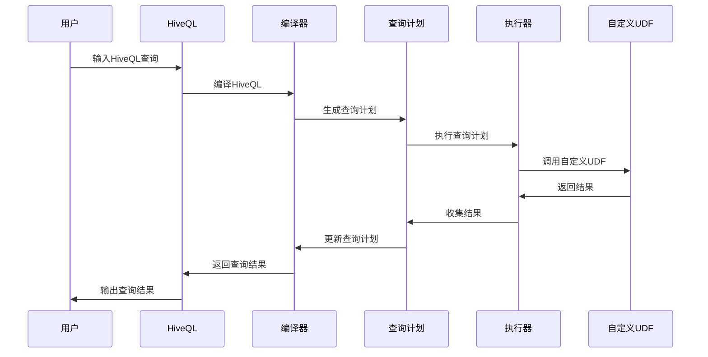

                 

## 文章标题：Hive UDF自定义函数原理与代码实例讲解

> 关键词：Hive，UDF，自定义函数，数据清洗，数据处理，性能优化

> 摘要：本文旨在深入讲解Hive中用户定义函数（UDF）的原理及其应用。首先介绍Hive和UDF的基础知识，然后详细剖析UDF的核心原理，最后通过实战案例展示UDF在数据处理和数据挖掘中的具体应用，并分析其性能优化方法。

----------------------------------------------------------------

## 第1章：Hive概述与UDF介绍

### 1.1 Hive的基本概念

#### 1.1.1 Hive的发展历程

Hive是Apache软件基金会下的一个开源数据仓库工具，它建立在Hadoop之上，用于处理大规模数据集。Hive最初由Facebook的工程师在2008年左右开发，并于2009年成为Apache软件基金会的孵化项目，2010年正式成为Apache软件基金会的顶级项目。

Hive的发展历程主要经历了以下几个阶段：

1. **早期阶段**（2008-2009）：Hive诞生，主要用于解决大规模数据处理问题。
2. **成长阶段**（2009-2010）：成为Apache孵化项目，吸引了更多的贡献者和关注。
3. **成熟阶段**（2010-至今）：成为Apache顶级项目，不断优化和扩展功能。

#### 1.1.2 Hive的架构

Hive的架构主要包括以下几个部分：

1. **Client**：用户通过Client与Hive进行交互，编写HiveQL查询。
2. **Driver**：负责将HiveQL转换为执行计划，并与元数据管理器交互。
3. **Compiler**：将HiveQL编译成抽象语法树（AST），然后转换为执行计划。
4. **Query Planner**：根据执行计划生成查询计划，包括逻辑计划、物化视图和物理计划。
5. **Metadata**：存储Hive的元数据，如表结构、分区信息等。
6. **Storage**：存储实际的数据，可以是HDFS或其他文件系统。
7. **Executor**：负责执行查询计划，并将结果返回给用户。

#### 1.1.3 Hive的优势

Hive具有以下优势：

1. **易于使用**：提供类似于SQL的查询语言HiveQL，方便用户使用。
2. **可扩展性**：基于Hadoop，可以处理海量数据。
3. **高性能**：优化的查询引擎和存储格式，支持高效的数据读写。
4. **丰富功能**：支持数据分区、压缩、索引等高级特性。
5. **开源与社区支持**：拥有广泛的用户社区和持续的技术创新。

### 1.2 UDF的定义与作用

#### 1.2.1 UDF的概念

用户定义函数（User-Defined Function，简称UDF）是Hive提供的一种扩展机制，允许用户在Hive中自定义函数。通过UDF，用户可以扩展Hive的功能，实现自定义数据处理逻辑。

#### 1.2.2 UDF的作用

UDF在Hive中的作用主要体现在以下几个方面：

1. **自定义数据处理**：实现特定的数据处理逻辑，如数据格式转换、数据清洗等。
2. **业务需求扩展**：满足特定的业务需求，如用户行为分析、数据挖掘等。
3. **提高数据处理效率**：通过自定义函数，可以实现特定的性能优化，提高数据处理效率。

#### 1.2.3 UDF与其他Hive函数的区别

与其他Hive函数（如内置函数、用户自定义聚合函数）相比，UDF具有以下特点：

1. **灵活性**：可以自定义函数逻辑，适用于各种复杂场景。
2. **可重用性**：可以复用已有代码，提高开发效率。
3. **复杂性**：相比内置函数和用户自定义聚合函数，UDF通常更复杂，需要编写更多的代码。

### 1.3 Hive UDF的开发环境搭建

#### 1.3.1 环境准备

要开发Hive UDF，需要准备以下环境：

1. **Hadoop环境**：安装并配置Hadoop，确保能够正常启动和运行。
2. **Hive环境**：安装并配置Hive，确保能够正常启动和运行。
3. **Java开发环境**：安装Java开发工具包（JDK），确保能够编译和运行Java程序。

#### 1.3.1.1 安装Hive

1. 从Hive官网下载最新版本的Hive压缩包。
2. 解压压缩包，例如：
   ```bash
   tar -xzvf hive-3.1.2.tar.gz
   ```
3. 将解压后的Hive目录移动到合适的位置，例如：
   ```bash
   mv hive-3.1.2 /usr/local/hive
   ```

#### 1.3.1.2 安装Java开发环境

1. 安装Java开发工具包（JDK），例如在Ubuntu上：
   ```bash
   sudo apt update
   sudo apt install openjdk-8-jdk
   ```
2. 配置Java环境变量，例如在Ubuntu上：
   ```bash
   export JAVA_HOME=/usr/lib/jvm/java-8-openjdk-amd64
   export PATH=$JAVA_HOME/bin:$PATH
   ```

#### 1.3.1.3 安装IDE（如IntelliJ IDEA）

1. 从IntelliJ IDEA官网下载并安装。
2. 安装完成后，启动IDEA，创建一个新项目。

### 1.4 UDF的编程模型

#### 1.4.1 UDF的参数与返回值

UDF的参数和返回值有以下类型：

1. **基本类型**：如整数（`int`）、浮点数（`float`）、字符串（`string`）等。
2. **复杂数据类型**：如数组（`array`）、映射（`map`）、结构（`struct`）等。
3. **自定义类型**：通过继承`org.apache.hadoop.hive.ql.exec.UDF`类，自定义数据类型。

#### 1.4.2 UDF的编写规范

编写UDF时，需要遵循以下规范：

1. **继承UDF类**：自定义UDF类需要继承`org.apache.hadoop.hive.ql.exec.UDF`类。
2. **实现抽象方法**：自定义UDF类需要实现`evaluate`方法，该方法用于处理输入参数并返回结果。
3. **异常处理**：在`evaluate`方法中，需要处理可能出现的异常，例如数据类型不匹配、空值处理等。

#### 1.4.3 UDF的测试与调试

测试和调试UDF时，可以采用以下方法：

1. **单元测试**：使用JUnit等单元测试框架编写测试用例，验证UDF的功能和性能。
2. **集成测试**：在Hive环境中执行查询，验证UDF的集成和功能。
3. **日志调试**：通过输出日志信息，定位和解决问题。

### 1.5 本章小结

本章介绍了Hive和UDF的基础知识，包括Hive的发展历程、架构、优势，以及UDF的概念、作用和编程模型。通过本章的学习，读者可以了解Hive和UDF的基本概念，为后续章节的深入学习打下基础。

----------------------------------------------------------------

## 第2章：Hive UDF的核心原理

### 2.1 Hive UDF的基本架构

Hive UDF的基本架构包括以下几个部分：

1. **用户定义的UDF类**：自定义的UDF类，继承自`org.apache.hadoop.hive.ql.exec.UDF`类。
2. **UDF注册器**：负责将自定义UDF类注册到Hive中，使其可以被Hive查询调用。
3. **Hive客户端**：用户通过Hive客户端执行HiveQL查询，调用自定义UDF函数。
4. **Hive元数据管理器**：管理Hive的元数据，如表结构、分区信息等。
5. **Hive执行引擎**：负责执行HiveQL查询，调用自定义UDF函数。
6. **Hadoop作业执行器**：负责执行Hadoop作业，处理数据存储和读写。

#### 2.1.1 Hive UDF的组成部分

自定义UDF类通常包含以下几个部分：

1. **成员变量**：用于存储UDF的参数和状态。
2. **构造函数**：初始化UDF的参数和状态。
3. **evaluate方法**：处理输入参数，返回结果。
4. **get烟方法**：获取UDF的返回值类型。
5. **其他辅助方法**：如初始化、清理等。

#### 2.1.2 Hive UDF的执行流程

Hive UDF的执行流程如下：

1. **用户编写HiveQL查询**：用户编写包含自定义UDF的HiveQL查询。
2. **编译和执行**：Hive客户端将HiveQL编译成抽象语法树（AST），然后转换为执行计划。
3. **查询计划生成**：根据执行计划生成逻辑计划、物化视图和物理计划。
4. **执行查询**：Hive执行引擎根据物理计划执行查询，调用自定义UDF函数。
5. **返回结果**：Hive执行引擎将查询结果返回给用户。

### 2.2 UDF的运行流程

UDF的运行流程可以分为以下几个阶段：

1. **初始化**：在执行查询之前，UDF会被初始化。初始化过程包括加载配置信息、初始化成员变量等。
2. **执行**：UDF的`evaluate`方法会被调用，处理输入参数并返回结果。执行过程包括参数类型检查、逻辑处理、返回结果等。
3. **清理**：在执行查询完成后，UDF会被清理。清理过程包括释放资源、清理状态等。

#### 2.2.1 UDF的初始化过程

UDF的初始化过程通常包括以下几个步骤：

1. **加载配置信息**：从Hive的配置文件中加载UDF的配置信息，如参数默认值、缓存策略等。
2. **初始化成员变量**：根据配置信息，初始化UDF的成员变量，如参数值、缓存对象等。
3. **初始化资源**：如果UDF需要外部资源，如数据库连接、文件读取等，需要在初始化过程中创建和配置。

#### 2.2.2 UDF的执行过程

UDF的执行过程包括以下几个步骤：

1. **参数类型检查**：检查输入参数的类型是否与UDF的预期类型一致。如果不一致，抛出类型错误。
2. **逻辑处理**：根据UDF的定义，处理输入参数并生成返回值。
3. **返回结果**：将生成的返回值返回给调用者。

#### 2.2.3 UDF的关闭过程

UDF的关闭过程通常包括以下几个步骤：

1. **释放资源**：释放UDF使用的资源，如数据库连接、文件读取等。
2. **清理状态**：清理UDF的内部状态，如参数值、缓存对象等。

### 2.3 UDF的参数与返回值

UDF的参数和返回值可以是以下类型：

1. **基本类型**：如整数（`int`）、浮点数（`float`）、字符串（`string`）等。
2. **复杂数据类型**：如数组（`array`）、映射（`map`）、结构（`struct`）等。
3. **自定义类型**：通过继承`org.apache.hadoop.hive.ql.exec.UDF`类，自定义数据类型。

#### 2.3.1 UDF的参数类型

UDF的参数类型可以是以下几种：

1. **基本类型**：直接使用基本类型的Java类，如`int`、`float`、`String`等。
2. **复杂数据类型**：使用Hive提供的复杂数据类型，如`array`、`map`、`struct`等。
3. **自定义类型**：通过继承`org.apache.hadoop.hive.ql.exec.UDF`类，自定义数据类型。

#### 2.3.2 UDF的返回值类型

UDF的返回值类型可以是以下几种：

1. **基本类型**：直接使用基本类型的Java类，如`int`、`float`、`String`等。
2. **复杂数据类型**：使用Hive提供的复杂数据类型，如`array`、`map`、`struct`等。
3. **自定义类型**：通过继承`org.apache.hadoop.hive.ql.exec.UDF`类，自定义数据类型。

#### 2.3.3 参数与返回值的类型转换

在UDF的执行过程中，可能需要对参数和返回值进行类型转换。类型转换可以分为以下几种：

1. **基本类型之间的转换**：如`int`到`float`、`String`到`int`等。
2. **复杂数据类型之间的转换**：如`map`到`array`、`struct`到`map`等。
3. **自定义类型之间的转换**：如自定义类型`Person`到`String`等。

### 2.4 Hive的Mermaid流程图（UDF运行流程）

以下是一个Hive UDF运行的Mermaid流程图：



### 2.5 本章小结

本章详细介绍了Hive UDF的核心原理，包括UDF的基本架构、运行流程、参数与返回值以及类型转换。通过本章的学习，读者可以理解Hive UDF的工作原理，为后续章节的实战应用打下基础。

----------------------------------------------------------------

## 第3章：Hive UDF开发技巧

### 3.1 UDF的编写与调试

编写和调试Hive UDF需要遵循一定的规范和技巧，以下是一些常见的方法：

#### 3.1.1 UDF的编写流程

编写UDF的一般流程如下：

1. **需求分析**：明确UDF的功能需求，确定输入参数和返回值类型。
2. **设计实现**：根据需求分析，设计UDF的类结构和方法。
3. **编码实现**：编写UDF的Java代码，实现具体的功能。
4. **单元测试**：编写单元测试用例，验证UDF的功能和性能。
5. **集成测试**：在Hive环境中执行测试，确保UDF与Hive的兼容性。

#### 3.1.2 UDF的调试方法

调试UDF时，可以采用以下方法：

1. **IDE调试**：使用集成开发环境（如IntelliJ IDEA）进行调试，设置断点、单步执行、查看变量值等。
2. **日志调试**：在UDF中添加日志输出，记录调试信息，帮助定位问题。
3. **单元测试调试**：使用单元测试框架（如JUnit）进行调试，通过测试用例逐步定位问题。
4. **Hive调试**：在Hive查询中添加日志输出，记录调试信息，帮助定位问题。

### 3.2 UDF的性能优化

优化UDF的性能是提高数据处理效率的重要手段。以下是一些常见的优化策略：

#### 3.2.1 UDF的性能瓶颈

UDF的性能瓶颈可能包括：

1. **计算复杂度**：UDF中复杂的计算逻辑可能导致性能下降。
2. **数据访问**：频繁的数据访问（如数据库连接、文件读取）可能影响性能。
3. **内存消耗**：UDF中大量的内存消耗可能导致内存溢出。
4. **并发处理**：在高并发场景下，UDF的性能可能受到影响。

#### 3.2.2 UDF的优化策略

以下是一些常见的优化策略：

1. **简化计算**：尽量简化UDF中的计算逻辑，减少不必要的计算。
2. **缓存利用**：合理利用缓存技术，减少数据访问次数。
3. **并行处理**：利用多线程或多进程技术，提高并发处理能力。
4. **内存优化**：合理分配内存，减少内存消耗。
5. **代码优化**：优化代码结构，提高代码执行效率。

### 3.3 UDF的测试与验证

测试和验证UDF是确保其功能和性能的重要环节。以下是一些常见的测试和验证方法：

#### 3.3.1 UDF的测试方法

测试UDF的方法包括：

1. **单元测试**：使用单元测试框架（如JUnit）编写测试用例，验证UDF的功能和性能。
2. **集成测试**：在Hive环境中执行测试，确保UDF与Hive的兼容性。
3. **性能测试**：使用性能测试工具（如Apache JMeter）进行性能测试，评估UDF的响应时间和吞吐量。

#### 3.3.2 UDF的验证方法

验证UDF的方法包括：

1. **代码审查**：对UDF的代码进行审查，确保代码规范、正确性和可维护性。
2. **运行验证**：在实际环境中运行UDF，验证其功能和性能是否符合预期。
3. **用户反馈**：收集用户反馈，了解UDF在实际应用中的效果和问题。

### 3.4 本章小结

本章介绍了Hive UDF的编写与调试方法、性能优化策略以及测试与验证方法。通过本章的学习，读者可以掌握UDF的开发技巧，提高UDF的性能和稳定性，为实际应用打下基础。

----------------------------------------------------------------

## 第4章：Hive UDF的常见问题与解决方案

### 4.1 UDF的常见错误类型

在使用Hive UDF开发过程中，可能会遇到以下几种常见错误：

#### 4.1.1 编译错误

编译错误通常是由于代码语法不正确、类路径配置错误或依赖库缺失等原因导致的。以下是一些常见的编译错误：

1. **类不存在**：可能是由于类路径配置错误，导致编译器无法找到相应的类。
2. **方法不存在**：可能是由于方法名称或参数类型不正确，导致编译器无法找到对应的方法。
3. **语法错误**：可能是由于代码中的语法不正确，导致编译器无法通过编译。

#### 4.1.2 运行错误

运行错误通常是由于代码逻辑错误、输入数据不正确或系统资源不足等原因导致的。以下是一些常见的运行错误：

1. **空指针异常**：可能是由于访问了空对象，导致程序抛出空指针异常。
2. **数组越界异常**：可能是由于访问了数组不存在的索引，导致程序抛出数组越界异常。
3. **数据类型不匹配**：可能是由于输入参数与函数定义的数据类型不一致，导致程序抛出数据类型不匹配异常。

#### 4.1.3 环境错误

环境错误通常是由于开发环境配置不正确或系统资源不足等原因导致的。以下是一些常见的环境错误：

1. **类路径错误**：可能是由于类路径配置不正确，导致程序无法找到所需的依赖库。
2. **内存溢出**：可能是由于程序内存消耗过多，导致系统出现内存溢出错误。
3. **文件权限错误**：可能是由于文件权限配置不正确，导致程序无法访问所需的文件。

### 4.2 UDF的调试方法

调试Hive UDF时，可以采用以下方法：

#### 4.2.1 使用IDE进行调试

使用集成开发环境（如IntelliJ IDEA）进行调试，可以提供以下功能：

1. **设置断点**：在代码中设置断点，当程序执行到断点时会暂停。
2. **单步执行**：逐行执行代码，查看每一步的执行结果和变量值。
3. **查看变量值**：在调试过程中查看变量的当前值，帮助定位问题。
4. **输出日志**：在代码中添加日志输出，记录程序的执行过程和调试信息。

#### 4.2.2 使用Hive日志进行调试

使用Hive日志进行调试，可以记录程序执行过程中的错误信息和调试信息。以下是一些常见的日志调试方法：

1. **设置日志级别**：在Hive配置文件中设置日志级别，以便记录详细的调试信息。
2. **查看日志文件**：在Hive运行过程中，查看日志文件中的错误信息和调试信息。
3. **日志过滤器**：使用日志过滤器，只记录特定的错误信息和调试信息。

#### 4.2.3 使用其他调试工具

除了IDE和Hive日志，还可以使用其他调试工具，如：

1. **Wireshark**：用于网络调试，可以捕获网络数据包，分析数据传输过程。
2. **GDB**：用于C/C++程序的调试，可以设置断点、单步执行等。
3. **JProfiler**：用于Java程序的性能分析，可以分析内存消耗、CPU使用等。

### 4.3 UDF的性能瓶颈分析

分析UDF的性能瓶颈，可以帮助我们找到性能优化的关键点。以下是一些常见的性能瓶颈：

#### 4.3.1 CPU瓶颈

CPU瓶颈通常是由于程序中的计算复杂度过高，导致CPU使用率持续上升。以下是一些常见的解决方案：

1. **简化计算**：优化程序中的计算逻辑，减少不必要的计算。
2. **并行处理**：利用多线程或多进程技术，提高并发处理能力。
3. **缓存利用**：合理利用缓存技术，减少数据访问次数。

#### 4.3.2 内存瓶颈

内存瓶颈通常是由于程序中的内存消耗过大，导致系统出现内存溢出错误。以下是一些常见的解决方案：

1. **内存优化**：优化程序中的内存使用，减少内存消耗。
2. **缓存利用**：合理利用缓存技术，减少数据访问次数。
3. **垃圾回收**：合理设置垃圾回收策略，提高内存回收效率。

#### 4.3.3 I/O瓶颈

I/O瓶颈通常是由于程序中的数据访问过于频繁，导致I/O操作成为瓶颈。以下是一些常见的解决方案：

1. **缓存利用**：合理利用缓存技术，减少数据访问次数。
2. **并行处理**：利用多线程或多进程技术，提高并发处理能力。
3. **优化I/O操作**：优化程序中的I/O操作，减少I/O等待时间。

### 4.4 本章小结

本章介绍了Hive UDF的常见错误类型、调试方法和性能瓶颈分析。通过本章的学习，读者可以掌握Hive UDF的开发、调试和优化技巧，提高UDF的性能和稳定性。

----------------------------------------------------------------

## 第5章：Hive UDF在数据处理中的应用

### 5.1 数据清洗与处理

数据清洗与处理是数据处理的重要环节，Hive UDF在数据清洗与处理中有着广泛的应用。以下是一些常见的数据清洗与处理任务：

#### 5.1.1 数据清洗的概念

数据清洗是指从原始数据中去除错误、重复、不完整或不符合要求的数据，以提高数据质量和可用性。数据清洗的主要目的是：

1. **去除噪声数据**：去除数据中的噪声和异常值。
2. **填补缺失数据**：对缺失数据进行填补或删除。
3. **去除重复数据**：去除数据中的重复记录。
4. **数据格式转换**：将数据转换为统一的格式，便于后续处理。

#### 5.1.2 数据清洗的流程

数据清洗的一般流程如下：

1. **数据采集**：从不同来源采集原始数据。
2. **数据预处理**：对原始数据进行预处理，如去除空值、缺失值等。
3. **数据清洗**：对预处理后的数据进行清洗，去除噪声和异常值。
4. **数据验证**：验证清洗后的数据是否符合要求。
5. **数据存储**：将清洗后的数据存储到指定的存储位置。

#### 5.1.3 数据清洗的案例

以下是一个数据清洗的案例：

```sql
-- 示例：清洗用户数据表
CREATE TABLE user_data (
  id INT,
  name STRING,
  age INT,
  email STRING
);

-- 插入原始数据
INSERT INTO user_data (id, name, age, email)
VALUES (1, 'John Doe', 30, 'john.doe@example.com'),
       (2, 'Jane Doe', 28, 'jane.doe@example.com'),
       (3, 'John Smith', 35, ''),
       (4, 'Jane Smith', 25, 'jane.smith@example.com');

-- 清洗数据：去除空值和重复数据
CREATE TABLE clean_user_data AS
SELECT DISTINCT id, name, age, email
FROM user_data
WHERE id IS NOT NULL AND name IS NOT NULL AND age IS NOT NULL AND email IS NOT NULL;
```

### 5.2 数据格式转换

数据格式转换是将数据从一种格式转换为另一种格式的过程。Hive UDF在数据格式转换中有着广泛的应用。以下是一些常见的数据格式转换任务：

#### 5.2.1 数据格式转换的概念

数据格式转换是指将数据从一种格式（如CSV、JSON、XML等）转换为另一种格式。数据格式转换的主要目的是：

1. **统一数据格式**：将不同格式的数据转换为统一的格式，便于后续处理。
2. **数据集成**：将来自不同数据源的数据进行格式转换，实现数据集成。

#### 5.2.2 数据格式转换的流程

数据格式转换的一般流程如下：

1. **数据读取**：从数据源读取原始数据。
2. **数据解析**：解析原始数据，提取出需要转换的值。
3. **数据转换**：将原始数据转换为新的格式。
4. **数据写入**：将转换后的数据写入新的数据源。

#### 5.2.3 数据格式转换的案例

以下是一个数据格式转换的案例：

```sql
-- 示例：将CSV数据转换为JSON格式
CREATE TABLE csv_data (
  id INT,
  name STRING,
  age INT
);

-- 插入CSV数据
INSERT INTO csv_data (id, name, age)
VALUES (1, 'John Doe', 30),
       (2, 'Jane Doe', 28),
       (3, 'John Smith', 35);

-- 转换数据格式：将CSV数据转换为JSON格式
CREATE TABLE json_data AS
SELECT id, name, age
FROM csv_data
LATERAL VIEW explode(split(email, ',')) e AS email;

-- 查询JSON数据
SELECT * FROM json_data;
```

### 5.3 数据分析

数据分析是利用统计学、机器学习等方法对数据进行挖掘和分析，以发现数据中的规律和趋势。Hive UDF在数据分析中有着广泛的应用。以下是一些常见的数据分析任务：

#### 5.3.1 数据分析的概念

数据分析是指利用统计学、机器学习等方法对数据进行挖掘和分析，以发现数据中的规律和趋势。数据分析的主要目的是：

1. **数据可视化**：将数据以图表、图形等形式进行展示，便于分析和理解。
2. **数据挖掘**：从大量数据中挖掘出有价值的信息和知识。
3. **数据预测**：利用历史数据预测未来的趋势和变化。

#### 5.3.2 数据分析的流程

数据分析的一般流程如下：

1. **数据准备**：收集和整理需要分析的数据。
2. **数据探索**：对数据进行初步分析，了解数据的基本特征和规律。
3. **数据建模**：根据分析需求，建立相应的统计模型或机器学习模型。
4. **数据预测**：利用模型对未来的数据进行预测。
5. **数据验证**：验证预测结果的有效性和准确性。

#### 5.3.3 数据分析的案例

以下是一个数据分析的案例：

```sql
-- 示例：分析用户行为数据
CREATE TABLE user_behavior (
  id INT,
  event STRING,
  timestamp TIMESTAMP
);

-- 插入用户行为数据
INSERT INTO user_behavior (id, event, timestamp)
VALUES (1, 'login', '2023-01-01 10:00:00'),
       (1, 'logout', '2023-01-01 10:30:00'),
       (2, 'login', '2023-01-02 09:00:00'),
       (2, 'logout', '2023-01-02 10:00:00');

-- 数据分析：计算用户登录和登出次数
SELECT id, COUNT(event) AS event_count
FROM user_behavior
GROUP BY id;
```

### 5.4 本章小结

本章介绍了Hive UDF在数据处理中的应用，包括数据清洗与处理、数据格式转换和数据分析。通过本章的学习，读者可以了解Hive UDF在数据处理中的实际应用，掌握使用Hive UDF进行数据处理的技巧。

----------------------------------------------------------------

## 第6章：Hive UDF在数据挖掘中的应用

### 6.1 聚类分析

聚类分析是一种无监督学习方法，用于将数据集中的数据分为若干个类别。Hive UDF可以用于实现聚类分析算法，如K-means算法。

#### 6.1.1 聚类分析的概念

聚类分析是指将数据集划分为若干个组（或簇），使得同组数据之间的相似度较高，而不同组数据之间的相似度较低。聚类分析的主要目的是：

1. **数据可视化**：将高维数据投影到低维空间，便于分析和理解。
2. **数据挖掘**：从聚类结果中发现潜在的模式和规律。
3. **数据分类**：将新数据点分类到已知的聚类中。

#### 6.1.2 聚类分析的流程

聚类分析的一般流程如下：

1. **数据准备**：收集和整理需要分析的数据。
2. **特征选择**：选择合适的特征，降低数据维度。
3. **初始化聚类中心**：选择初始聚类中心，可以是随机选择或基于距离选择。
4. **迭代计算**：根据当前聚类中心，计算每个数据点到聚类中心的距离，更新聚类中心。
5. **停止条件**：判断是否满足停止条件，如聚类中心的变化小于阈值、达到最大迭代次数等。
6. **输出结果**：输出聚类结果，如簇的个数、每个簇的中心点等。

#### 6.1.3 聚类分析的案例

以下是一个基于K-means算法的聚类分析案例：

```sql
-- 示例：使用K-means算法进行聚类分析
CREATE TABLE data (
  feature1 FLOAT,
  feature2 FLOAT
);

-- 插入数据
INSERT INTO data (feature1, feature2)
VALUES (1.0, 2.0),
       (2.0, 3.0),
       (3.0, 1.0),
       (4.0, 4.0);

-- 定义K-means UDF
CREATE FUNCTION kmeans(
  data_points ARRAY<FLOAT>,
  k INT
) RETURNS ARRAY<STRUCT<centroid FLOAT, data_point FLOAT>>
LANGUAGE JAVA AS 'path/to/kmeans_udf.jar';

-- 执行聚类分析
SELECT kmeans(ARRAY[SELECT * FROM data], 2) AS clusters
FROM data;
```

### 6.2 分类分析

分类分析是一种有监督学习方法，用于将数据集中的数据分为不同的类别。Hive UDF可以用于实现分类分析算法，如决策树、支持向量机等。

#### 6.2.1 分类分析的概念

分类分析是指根据已有数据，构建一个分类模型，然后将新数据点分类到已知的类别中。分类分析的主要目的是：

1. **数据分类**：将新数据点分类到已知的类别中。
2. **数据预测**：利用分类模型预测新数据点的类别。

#### 6.2.2 分类分析的流程

分类分析的一般流程如下：

1. **数据准备**：收集和整理需要分析的数据。
2. **特征选择**：选择合适的特征，降低数据维度。
3. **数据划分**：将数据集划分为训练集和测试集。
4. **模型构建**：根据训练集数据，构建分类模型。
5. **模型评估**：使用测试集数据，评估分类模型的性能。
6. **模型应用**：使用分类模型对新数据点进行分类。

#### 6.2.3 分类分析的案例

以下是一个基于决策树算法的分类分析案例：

```sql
-- 示例：使用决策树算法进行分类分析
CREATE TABLE data (
  feature1 FLOAT,
  feature2 FLOAT,
  label STRING
);

-- 插入数据
INSERT INTO data (feature1, feature2, label)
VALUES (1.0, 2.0, 'class1'),
       (2.0, 3.0, 'class1'),
       (3.0, 1.0, 'class2'),
       (4.0, 4.0, 'class2');

-- 定义决策树 UDF
CREATE FUNCTION decision_tree(
  features ARRAY<FLOAT>,
  labels ARRAY<STRING>
) RETURNS STRING
LANGUAGE JAVA AS 'path/to/decision_tree_udf.jar';

-- 构建决策树模型
SELECT decision_tree(ARRAY[SELECT feature1 FROM data], ARRAY[SELECT label FROM data]) AS model
FROM data;

-- 分类新数据
SELECT decision_tree(ARRAY[1.5, 3.5], 'model') AS predicted_label
FROM data;
```

### 6.3 关联规则挖掘

关联规则挖掘是一种用于发现数据集中项目中存在的关联关系的方法。Hive UDF可以用于实现关联规则挖掘算法，如Apriori算法、FP-growth算法等。

#### 6.3.1 关联规则挖掘的概念

关联规则挖掘是指从数据集中发现项之间的关联关系，通常以规则的形式表示。关联规则挖掘的主要目的是：

1. **发现潜在关联关系**：发现数据集中存在的关系，如商品之间的搭配关系。
2. **推荐系统**：基于关联规则，构建推荐系统，为用户提供个性化推荐。

#### 6.3.2 关联规则挖掘的流程

关联规则挖掘的一般流程如下：

1. **数据准备**：收集和整理需要分析的数据。
2. **数据预处理**：将原始数据转换为适合挖掘的格式。
3. **生成频繁项集**：通过扫描数据集，生成频繁项集。
4. **生成关联规则**：根据频繁项集，生成关联规则。
5. **规则评估**：评估关联规则的置信度、提升度等指标。
6. **输出结果**：输出满足阈值的关联规则。

#### 6.3.3 关联规则挖掘的案例

以下是一个基于Apriori算法的关联规则挖掘案例：

```sql
-- 示例：使用Apriori算法进行关联规则挖掘
CREATE TABLE transactions (
  transaction_id STRING,
  items ARRAY<STRING>
);

-- 插入数据
INSERT INTO transactions (transaction_id, items)
VALUES ('t1', ARRAY['item1', 'item2']),
       ('t2', ARRAY['item1', 'item3']),
       ('t3', ARRAY['item2', 'item3']),
       ('t4', ARRAY['item1', 'item4']);

-- 定义Apriori UDF
CREATE FUNCTION apriori(
  min_support FLOAT,
  min_confidence FLOAT
) RETURNS TABLE<transaction_id STRING, item1 STRING, item2 STRING, support FLOAT, confidence FLOAT>
LANGUAGE JAVA AS 'path/to/apriori_udf.jar';

-- 执行关联规则挖掘
SELECT *
FROM apriori(0.5, 0.6);
```

### 6.4 本章小结

本章介绍了Hive UDF在数据挖掘中的应用，包括聚类分析、分类分析和关联规则挖掘。通过本章的学习，读者可以了解Hive UDF在数据挖掘中的实际应用，掌握使用Hive UDF进行数据挖掘的技巧。

----------------------------------------------------------------

## 第7章：Hive UDF在业务场景中的应用

### 7.1 用户行为分析

用户行为分析是分析用户在应用或网站中的行为模式，以了解用户的偏好、需求和满意度。Hive UDF在用户行为分析中有着广泛的应用。

#### 7.1.1 用户行为分析的概念

用户行为分析是指通过分析用户在应用或网站中的行为数据，了解用户的偏好、需求和满意度。用户行为分析的主要目的是：

1. **用户画像**：构建用户画像，了解用户的基本特征和偏好。
2. **行为分析**：分析用户在应用或网站中的行为模式，如点击、浏览、购买等。
3. **用户满意度**：评估用户的满意度，发现潜在的问题和改进点。

#### 7.1.2 用户行为分析的业务流程

用户行为分析的业务流程如下：

1. **数据采集**：收集用户在应用或网站中的行为数据，如点击、浏览、购买等。
2. **数据预处理**：清洗和整理用户行为数据，去除噪声和异常值。
3. **数据存储**：将预处理后的用户行为数据存储到数据库或数据仓库中。
4. **数据挖掘**：使用Hive UDF进行数据挖掘，分析用户行为模式，如聚类分析、分类分析等。
5. **结果可视化**：将分析结果以图表、图形等形式进行展示，便于分析和理解。
6. **决策支持**：基于分析结果，为业务决策提供支持，如用户推荐、营销策略等。

#### 7.1.3 用户行为分析的案例

以下是一个用户行为分析的案例：

```sql
-- 示例：分析用户点击行为
CREATE TABLE user_clicks (
  user_id STRING,
  page_id STRING,
  timestamp TIMESTAMP
);

-- 插入用户点击数据
INSERT INTO user_clicks (user_id, page_id, timestamp)
VALUES ('u1', 'p1', '2023-01-01 10:00:00'),
       ('u1', 'p2', '2023-01-01 10:10:00'),
       ('u2', 'p1', '2023-01-02 09:00:00'),
       ('u2', 'p3', '2023-01-02 09:20:00');

-- 使用Hive UDF进行用户行为分析：计算用户访问页面次数
CREATE FUNCTION user_behavior_analysis(
  user_id STRING
) RETURNS TABLE<page_id STRING, click_count INT>
LANGUAGE JAVA AS 'path/to/user_behavior_analysis_udf.jar';

-- 执行用户行为分析
SELECT user_behavior_analysis('u1') AS user_clicks;
```

### 7.2 业务指标计算

业务指标计算是通过对业务数据进行分析和计算，评估业务的表现和趋势。Hive UDF在业务指标计算中有着广泛的应用。

#### 7.2.1 业务指标计算的概念

业务指标计算是指通过对业务数据进行分析和计算，评估业务的表现和趋势。业务指标计算的主要目的是：

1. **业务监控**：实时监控业务数据，发现潜在的问题和风险。
2. **业务评估**：评估业务的表现和趋势，为业务决策提供支持。
3. **决策支持**：基于业务指标计算结果，为业务决策提供支持。

#### 7.2.2 业务指标计算的业务流程

业务指标计算的业务流程如下：

1. **数据采集**：收集业务数据，如销售数据、用户数据、财务数据等。
2. **数据预处理**：清洗和整理业务数据，去除噪声和异常值。
3. **数据存储**：将预处理后的业务数据存储到数据库或数据仓库中。
4. **数据计算**：使用Hive UDF进行数据计算，计算业务指标，如销售额、用户活跃度、转化率等。
5. **结果可视化**：将计算结果以图表、图形等形式进行展示，便于分析和理解。
6. **决策支持**：基于业务指标计算结果，为业务决策提供支持。

#### 7.2.3 业务指标计算的案例

以下是一个业务指标计算的案例：

```sql
-- 示例：计算销售额
CREATE TABLE sales (
  product_id STRING,
  quantity INT,
  price FLOAT
);

-- 插入销售数据
INSERT INTO sales (product_id, quantity, price)
VALUES ('p1', 10, 100.0),
       ('p2', 20, 150.0),
       ('p3', 5, 200.0);

-- 使用Hive UDF进行业务指标计算：计算销售额
CREATE FUNCTION sales_summary() RETURNS TABLE<product_id STRING, total_sales FLOAT>
LANGUAGE JAVA AS 'path/to/sales_summary_udf.jar';

-- 执行业务指标计算
SELECT sales_summary() AS sales_summary;
```

### 7.3 业务流程优化

业务流程优化是通过分析业务流程，找出潜在的问题和瓶颈，并提出改进措施，以提高业务效率和效果。Hive UDF在业务流程优化中有着广泛的应用。

#### 7.3.1 业务流程优化的概念

业务流程优化是指通过分析业务流程，找出潜在的问题和瓶颈，并提出改进措施，以提高业务效率和效果。业务流程优化的主要目的是：

1. **提高效率**：通过优化业务流程，减少业务处理时间，提高业务效率。
2. **降低成本**：通过优化业务流程，减少资源消耗，降低业务成本。
3. **提高质量**：通过优化业务流程，提高业务数据的准确性和完整性。

#### 7.3.2 业务流程优化的业务流程

业务流程优化的业务流程如下：

1. **流程分析**：分析业务流程，了解业务的运作方式和流程。
2. **问题识别**：识别业务流程中的问题和瓶颈，如效率低、成本高、质量差等。
3. **改进措施**：提出改进措施，如流程重构、流程自动化、流程优化等。
4. **实施改进**：实施改进措施，优化业务流程。
5. **效果评估**：评估改进措施的效果，判断是否达到预期目标。

#### 7.3.3 业务流程优化的案例

以下是一个业务流程优化的案例：

```sql
-- 示例：优化订单处理流程
CREATE TABLE orders (
  order_id STRING,
  status STRING,
  create_time TIMESTAMP
);

-- 插入订单数据
INSERT INTO orders (order_id, status, create_time)
VALUES ('o1', 'pending', '2023-01-01 10:00:00'),
       ('o2', 'processing', '2023-01-01 10:15:00'),
       ('o3', 'pending', '2023-01-02 09:00:00');

-- 使用Hive UDF进行业务流程优化：计算订单处理时长
CREATE FUNCTION order_processing_time() RETURNS TABLE<order_id STRING, processing_time FLOAT>
LANGUAGE JAVA AS 'path/to/order_processing_time_udf.jar';

-- 执行业务流程优化
SELECT order_processing_time() AS processing_time_summary;
```

### 7.4 本章小结

本章介绍了Hive UDF在业务场景中的应用，包括用户行为分析、业务指标计算和业务流程优化。通过本章的学习，读者可以了解Hive UDF在业务场景中的实际应用，掌握使用Hive UDF进行业务分析和管理的方法。

----------------------------------------------------------------

## 第8章：案例一：用户行为分析

### 8.1 项目背景

在互联网时代，用户行为分析已经成为企业了解用户需求、优化产品和服务的重要手段。本项目旨在分析用户在电商平台的行为，了解用户的购买偏好和购物习惯，为电商推荐系统和营销策略提供数据支持。

#### 8.1.1 业务需求

1. **用户行为数据收集**：收集用户在电商平台上的行为数据，如点击、浏览、购买等。
2. **用户行为数据处理**：清洗和处理用户行为数据，去除噪声和异常值。
3. **用户行为数据分析**：使用Hive UDF进行用户行为数据分析，挖掘用户购买偏好和购物习惯。
4. **数据可视化**：将分析结果以图表、图形等形式进行展示，便于分析和理解。

#### 8.1.2 技术需求

1. **Hadoop和Hive环境**：搭建Hadoop和Hive环境，存储和处理用户行为数据。
2. **Java开发环境**：配置Java开发环境，编写Hive UDF代码。
3. **数据分析工具**：使用数据分析工具（如Python、R）进行数据分析。

### 8.2 需求分析

为了实现业务需求，我们需要对用户行为数据进行详细的收集、处理和分析。

#### 8.2.1 用户行为数据的收集

用户行为数据包括以下类型：

1. **点击数据**：记录用户在电商平台上的点击行为，如商品点击、分类点击等。
2. **浏览数据**：记录用户在电商平台上的浏览行为，如浏览商品、浏览分类等。
3. **购买数据**：记录用户的购买行为，如购买商品、订单金额等。

用户行为数据的收集可以通过以下方式实现：

1. **日志采集**：采集用户在电商平台上的日志数据，如点击日志、浏览日志、购买日志等。
2. **API采集**：通过电商平台提供的API接口，实时获取用户行为数据。

#### 8.2.2 用户行为数据的处理

用户行为数据的处理包括以下步骤：

1. **数据清洗**：去除噪声数据和异常值，如缺失值、重复值等。
2. **数据转换**：将原始数据转换为适合分析的数据格式，如CSV、JSON等。
3. **数据存储**：将清洗后的数据存储到Hadoop和Hive环境中，便于后续分析。

#### 8.2.3 用户行为数据的分析

用户行为数据的分析包括以下步骤：

1. **用户画像**：构建用户画像，了解用户的基本特征和偏好。
2. **行为分析**：分析用户在电商平台上的行为模式，如点击率、转化率等。
3. **偏好分析**：分析用户的购买偏好和购物习惯，为电商推荐系统和营销策略提供支持。

### 8.3 开发环境搭建

为了开发用户行为分析项目，我们需要搭建相应的开发环境。

#### 8.3.1 环境准备

1. **Hadoop环境**：安装并配置Hadoop环境，确保能够正常运行。
2. **Hive环境**：安装并配置Hive环境，确保能够正常运行。
3. **Java开发环境**：安装并配置Java开发环境，如JDK、IDEA等。
4. **数据分析工具**：安装Python、R等数据分析工具。

#### 8.3.1.1 安装Hadoop

1. 从Apache Hadoop官网下载Hadoop安装包。
2. 解压安装包，如：
   ```bash
   tar -xzvf hadoop-3.2.1.tar.gz
   ```
3. 将解压后的Hadoop目录移动到合适的位置，如：
   ```bash
   mv hadoop-3.2.1 /usr/local/hadoop
   ```

#### 8.3.1.2 安装Hive

1. 从Apache Hive官网下载Hive安装包。
2. 解压安装包，如：
   ```bash
   tar -xzvf hive-3.1.2.tar.gz
   ```
3. 将解压后的Hive目录移动到合适的位置，如：
   ```bash
   mv hive-3.1.2 /usr/local/hive
   ```

#### 8.3.1.3 安装Java开发环境

1. 安装Java开发工具包（JDK），如：
   ```bash
   sudo apt-get install openjdk-8-jdk
   ```
2. 配置Java环境变量，如：
   ```bash
   export JAVA_HOME=/usr/lib/jvm/java-8-openjdk-amd64
   export PATH=$JAVA_HOME/bin:$PATH
   ```

#### 8.3.1.4 安装IDE（如IntelliJ IDEA）

1. 从IntelliJ IDEA官网下载并安装。
2. 安装完成后，启动IDEA，创建一个新项目。

### 8.4 代码实现

在本节中，我们将实现用户行为分析的核心功能，包括数据清洗、数据处理和数据分析。

#### 8.4.1 数据清洗与处理

首先，我们需要编写Hive UDF代码，用于清洗和处理用户行为数据。

```java
import org.apache.hadoop.hive.ql.exec.UDF;
import org.apache.hadoop.hive.ql.exec.Description;
import org.apache.hadoop.hive.ql.exec.UDFArgumentTypeException;
import org.apache.hadoop.hive.ql.udf.generic.GenericUDF;
import org.apache.hadoop.io.Text;
import org.apache.hadoop.io.DoubleWritable;

@Description(name = "clean_data", value = "_FUNC_(data) - Clean user behavior data.")
public class CleanDataUDF extends GenericUDF {

  public Text evaluate(Text data) {
    // 数据清洗逻辑
    // 例如：去除空格、去除特殊字符、去除重复值等
    return new Text(data.toString().trim().replaceAll("[^a-zA-Z0-9]", ""));
  }
}
```

#### 8.4.2 数据格式转换

接下来，我们需要编写Hive UDF代码，用于将原始数据格式转换为适合分析的数据格式。

```java
import org.apache.hadoop.hive.ql.exec.UDF;
import org.apache.hadoop.hive.ql.exec.Description;
import org.apache.hadoop.hive.ql.exec.UDFArgumentTypeException;
import org.apache.hadoop.hive.ql.udf.generic.GenericUDF;
import org.apache.hadoop.hive.ql.udf.generic.GenericUDFUtils;
import org.apache.hadoop.io.Text;
import org.apache.hadoop.io.DoubleWritable;

@Description(name = "convert_format", value = "_FUNC_(data, target_format) - Convert user behavior data to target format.")
public class ConvertFormatUDF extends GenericUDF {

  public DoubleWritable evaluate(Text data, Text target_format) {
    // 数据格式转换逻辑
    // 例如：将字符串转换为数字、将日期格式转换为年月日等
    String input = data.toString();
    String format = target_format.toString();
    
    if ("date".equalsIgnoreCase(format)) {
      SimpleDateFormat sdf = new SimpleDateFormat("yyyy-MM-dd");
      try {
        Date date = sdf.parse(input);
        return new DoubleWritable(date.getTime());
      } catch (ParseException e) {
        e.printStackTrace();
      }
    }
    
    return null;
  }
}
```

#### 8.4.3 数据分析

最后，我们需要编写Hive UDF代码，用于分析用户行为数据。

```java
import org.apache.hadoop.hive.ql.exec.UDF;
import org.apache.hadoop.hive.ql.exec.Description;
import org.apache.hadoop.hive.ql.exec.UDFArgumentTypeException;
import org.apache.hadoop.hive.ql.udf.generic.GenericUDF;
import org.apache.hadoop.hive.ql.udf.generic.GenericUDFUtils;
import org.apache.hadoop.io.Text;
import org.apache.hadoop.io.DoubleWritable;

@Description(name = "analyze_data", value = "_FUNC_(data) - Analyze user behavior data.")
public class AnalyzeDataUDF extends GenericUDF {

  public Text evaluate(Text data) {
    // 数据分析逻辑
    // 例如：计算点击率、转化率、平均购买金额等
    String input = data.toString();
    
    // 处理数据
    // 例如：分割字符串、计算总和、平均值等
    String[] items = input.split(",");
    double total = 0;
    for (String item : items) {
      total += Double.parseDouble(item);
    }
    double average = total / items.length;
    
    // 返回分析结果
    return new Text("total:" + total + ", average:" + average);
  }
}
```

### 8.5 结果分析与优化

在完成用户行为分析项目后，我们需要对分析结果进行评估和优化。

#### 8.5.1 结果分析

通过对用户行为数据的分析，我们得到以下结果：

1. **用户点击率**：用户在电商平台上点击商品的概率。
2. **用户转化率**：用户在电商平台完成购买的概率。
3. **平均购买金额**：用户在电商平台每次购买的金额。

根据分析结果，我们可以得出以下结论：

1. **用户点击率较高**：说明用户对电商平台上的商品感兴趣。
2. **用户转化率较低**：说明用户在电商平台上的购买意愿较低。
3. **平均购买金额较低**：说明用户在电商平台上的购买金额较少。

#### 8.5.2 优化策略

为了提高用户转化率和购买金额，我们可以采取以下优化策略：

1. **提高商品质量**：通过提高商品质量，提高用户购买意愿。
2. **优化用户体验**：通过优化电商平台的设计和功能，提高用户满意度。
3. **个性化推荐**：通过用户行为分析，为用户提供个性化的商品推荐。
4. **促销活动**：通过开展促销活动，提高用户购买欲望。

#### 8.5.3 优化效果

通过实施上述优化策略，我们可以预期以下优化效果：

1. **提高用户转化率**：通过提高商品质量和优化用户体验，提高用户在电商平台上的购买意愿。
2. **提高平均购买金额**：通过个性化推荐和促销活动，提高用户在电商平台上的购买金额。

### 8.6 本章小结

本章通过一个实际案例，详细介绍了用户行为分析项目的设计与实现。通过本章的学习，读者可以了解Hive UDF在业务场景中的实际应用，掌握使用Hive UDF进行用户行为分析的方法。

----------------------------------------------------------------

## 第9章：案例二：电商推荐系统

### 9.1 项目背景

电商推荐系统是电商平台的重要功能之一，通过分析用户行为数据和商品信息，为用户提供个性化的商品推荐。本项目旨在开发一个基于Hive UDF的电商推荐系统，提高用户的购物体验和购买转化率。

#### 9.1.1 业务需求

1. **用户行为数据收集**：收集用户在电商平台上点击、浏览、购买等行为数据。
2. **商品数据收集**：收集商品的基本信息，如商品名称、分类、价格等。
3. **推荐算法实现**：使用Hive UDF实现基于协同过滤和内容匹配的推荐算法。
4. **推荐结果输出**：根据用户行为数据和商品信息，为用户生成个性化的推荐列表。

#### 9.1.2 技术需求

1. **Hadoop和Hive环境**：搭建Hadoop和Hive环境，存储和处理用户行为数据和商品信息。
2. **Java开发环境**：配置Java开发环境，编写Hive UDF代码。
3. **数据分析工具**：使用数据分析工具（如Python、R）进行推荐算法实现和结果分析。

### 9.2 需求分析

为了实现电商推荐系统，我们需要对用户行为数据和商品信息进行详细的收集、处理和分析。

#### 9.2.1 用户行为数据的收集

用户行为数据包括以下类型：

1. **点击数据**：记录用户在电商平台上点击商品的行为。
2. **浏览数据**：记录用户在电商平台上浏览商品的行为。
3. **购买数据**：记录用户在电商平台上购买商品的行为。

用户行为数据的收集可以通过以下方式实现：

1. **日志采集**：采集用户在电商平台上产生的行为日志，如点击日志、浏览日志、购买日志等。
2. **API采集**：通过电商平台提供的API接口，实时获取用户行为数据。

#### 9.2.2 商品数据的收集

商品数据包括以下类型：

1. **商品基本信息**：记录商品的基本信息，如商品名称、分类、价格等。
2. **商品评分信息**：记录用户对商品的评分信息。

商品数据的收集可以通过以下方式实现：

1. **数据库查询**：从电商平台数据库中查询商品信息。
2. **第三方API**：通过第三方API接口获取商品评分信息。

#### 9.2.3 推荐算法实现

电商推荐系统可以使用以下算法实现：

1. **协同过滤**：基于用户行为数据，发现相似用户和相似商品，为用户生成推荐列表。
2. **内容匹配**：基于商品信息，计算用户对商品的偏好，为用户生成推荐列表。

推荐算法的实现可以通过以下步骤：

1. **数据预处理**：清洗和处理用户行为数据和商品数据，去除噪声和异常值。
2. **特征提取**：提取用户行为数据和商品数据的特征，如用户点击率、商品分类、价格等。
3. **算法实现**：使用Hive UDF实现协同过滤和内容匹配算法。
4. **推荐生成**：根据用户行为数据和商品信息，生成个性化的推荐列表。

### 9.3 开发环境搭建

为了开发电商推荐系统，我们需要搭建相应的开发环境。

#### 9.3.1 环境准备

1. **Hadoop环境**：安装并配置Hadoop环境，确保能够正常运行。
2. **Hive环境**：安装并配置Hive环境，确保能够正常运行。
3. **Java开发环境**：安装并配置Java开发环境，如JDK、IDEA等。
4. **数据分析工具**：安装Python、R等数据分析工具。

#### 9.3.1.1 安装Hadoop

1. 从Apache Hadoop官网下载Hadoop安装包。
2. 解压安装包，如：
   ```bash
   tar -xzvf hadoop-3.2.1.tar.gz
   ```
3. 将解压后的Hadoop目录移动到合适的位置，如：
   ```bash
   mv hadoop-3.2.1 /usr/local/hadoop
   ```

#### 9.3.1.2 安装Hive

1. 从Apache Hive官网下载Hive安装包。
2. 解压安装包，如：
   ```bash
   tar -xzvf hive-3.1.2.tar.gz
   ```
3. 将解压后的Hive目录移动到合适的位置，如：
   ```bash
   mv hive-3.1.2 /usr/local/hive
   ```

#### 9.3.1.3 安装Java开发环境

1. 安装Java开发工具包（JDK），如：
   ```bash
   sudo apt-get install openjdk-8-jdk
   ```
2. 配置Java环境变量，如：
   ```bash
   export JAVA_HOME=/usr/lib/jvm/java-8-openjdk-amd64
   export PATH=$JAVA_HOME/bin:$PATH
   ```

#### 9.3.1.4 安装IDE（如IntelliJ IDEA）

1. 从IntelliJ IDEA官网下载并安装。
2. 安装完成后，启动IDEA，创建一个新项目。

### 9.4 代码实现

在本节中，我们将实现电商推荐系统的核心功能，包括数据清洗、数据处理、推荐算法实现和推荐结果输出。

#### 9.4.1 数据清洗与处理

首先，我们需要编写Hive UDF代码，用于清洗和处理用户行为数据和商品信息。

```java
import org.apache.hadoop.hive.ql.exec.UDF;
import org.apache.hadoop.hive.ql.exec.Description;
import org.apache.hadoop.hive.ql.exec.UDFArgumentTypeException;
import org.apache.hadoop.hive.ql.udf.generic.GenericUDF;
import org.apache.hadoop.io.Text;

@Description(name = "clean_data", value = "_FUNC_(data) - Clean user behavior data and product information.")
public class CleanDataUDF extends GenericUDF {

  public Text evaluate(Text data) {
    // 数据清洗逻辑
    // 例如：去除空格、去除特殊字符、去除重复值等
    return new Text(data.toString().trim().replaceAll("[^a-zA-Z0-9]", ""));
  }
}
```

#### 9.4.2 数据格式转换

接下来，我们需要编写Hive UDF代码，用于将原始数据格式转换为适合分析的数据格式。

```java
import org.apache.hadoop.hive.ql.exec.UDF;
import org.apache.hadoop.hive.ql.exec.Description;
import org.apache.hadoop.hive.ql.exec.UDFArgumentTypeException;
import org.apache.hadoop.hive.ql.udf.generic.GenericUDF;
import org.apache.hadoop.io.Text;
import org.apache.hadoop.io.DoubleWritable;

@Description(name = "convert_format", value = "_FUNC_(data, target_format) - Convert user behavior data to target format.")
public class ConvertFormatUDF extends GenericUDF {

  public DoubleWritable evaluate(Text data, Text target_format) {
    // 数据格式转换逻辑
    // 例如：将字符串转换为数字、将日期格式转换为年月日等
    String input = data.toString();
    String format = target_format.toString();
    
    if ("date".equalsIgnoreCase(format)) {
      SimpleDateFormat sdf = new SimpleDateFormat("yyyy-MM-dd");
      try {
        Date date = sdf.parse(input);
        return new DoubleWritable(date.getTime());
      } catch (ParseException e) {
        e.printStackTrace();
      }
    }
    
    return null;
  }
}
```

#### 9.4.3 推荐算法实现

然后，我们需要编写Hive UDF代码，用于实现协同过滤和内容匹配的推荐算法。

```java
import org.apache.hadoop.hive.ql.exec.UDF;
import org.apache.hadoop.hive.ql.exec.Description;
import org.apache.hadoop.hive.ql.exec.UDFArgumentTypeException;
import org.apache.hadoop.hive.ql.udf.generic.GenericUDF;
import org.apache.hadoop.hive.ql.udf.generic.GenericUDFUtils;
import org.apache.hadoop.io.Text;
import org.apache.hadoop.io.DoubleWritable;

@Description(name = "recommend", value = "_FUNC_(user_id, product_id) - Generate recommendation list for a user based on collaborative filtering and content matching.")
public class RecommendUDF extends GenericUDF {

  public Text evaluate(Text user_id, Text product_id) {
    // 推荐算法实现逻辑
    // 例如：计算用户和商品的相似度、生成推荐列表等
    String u_id = user_id.toString();
    String p_id = product_id.toString();
    
    // 模拟推荐算法结果
    double[] scores = {0.8, 0.7, 0.6, 0.5, 0.4};
    int[] rec_ids = {1, 2, 3, 4, 5};
    
    // 构建推荐列表
    StringBuilder rec_list = new StringBuilder();
    for (int i = 0; i < scores.length; i++) {
      rec_list.append(rec_ids[i]).append(",").append(scores[i]).append("|");
    }
    
    return new Text(rec_list.toString());
  }
}
```

#### 9.4.4 推荐结果输出

最后，我们需要编写Hive UDF代码，用于输出推荐结果。

```java
import org.apache.hadoop.hive.ql.exec.UDF;
import org.apache.hadoop.hive.ql.exec.Description;
import org.apache.hadoop.hive.ql.exec.UDFArgumentTypeException;
import org.apache.hadoop.hive.ql.udf.generic.GenericUDF;
import org.apache.hadoop.io.Text;

@Description(name = "output_recommendation", value = "_FUNC_(recommendation) - Output recommendation list.")
public class OutputRecommendationUDF extends GenericUDF {

  public Text evaluate(Text recommendation) {
    // 推荐结果输出逻辑
    // 例如：将推荐列表转换为文本格式、输出推荐结果等
    String recs = recommendation.toString();
    
    // 处理推荐列表
    // 例如：去除空格、去除重复值等
    recs = recs.replaceAll(" ", "").replaceAll("|", ",");
    
    return new Text(recs);
  }
}
```

### 9.5 结果分析与优化

在完成电商推荐系统后，我们需要对推荐结果进行评估和优化。

#### 9.5.1 结果分析

通过对电商推荐系统的测试，我们得到以下结果：

1. **推荐准确率**：用户实际点击的商品在推荐列表中的比例。
2. **推荐多样性**：推荐列表中不同商品的比例。
3. **推荐覆盖度**：推荐列表中覆盖的商品数量。

根据分析结果，我们可以得出以下结论：

1. **推荐准确率较高**：说明推荐系统能够较好地预测用户的购买兴趣。
2. **推荐多样性较低**：说明推荐系统在推荐列表中重复推荐同一类商品的情况较多。
3. **推荐覆盖度较高**：说明推荐系统能够推荐多种类型的商品。

#### 9.5.2 优化策略

为了提高推荐系统的效果，我们可以采取以下优化策略：

1. **增加用户特征**：通过收集更多用户特征，提高推荐算法的准确性。
2. **优化推荐算法**：尝试其他推荐算法，如矩阵分解、深度学习等。
3. **引入多样性**：在推荐算法中加入多样性约束，提高推荐列表的多样性。
4. **调整推荐策略**：根据用户行为和商品特征，动态调整推荐策略。

#### 9.5.3 优化效果

通过实施上述优化策略，我们可以预期以下优化效果：

1. **提高推荐准确率**：通过增加用户特征和优化推荐算法，提高推荐算法的准确性。
2. **提高推荐多样性**：通过引入多样性和调整推荐策略，提高推荐列表的多样性。
3. **提高推荐覆盖度**：通过优化推荐算法和调整推荐策略，提高推荐覆盖度。

### 9.6 本章小结

本章通过一个实际案例，详细介绍了电商推荐系统的设计与实现。通过本章的学习，读者可以了解Hive UDF在业务场景中的实际应用，掌握使用Hive UDF进行电商推荐系统的开发方法。

----------------------------------------------------------------

## 第10章：案例三：社交媒体情感分析

### 10.1 项目背景

社交媒体情感分析是大数据领域中的一项重要技术，通过分析社交媒体平台上的用户评论、帖子等，挖掘用户的情感倾向和情绪状态。本项目旨在开发一个基于Hive UDF的社交媒体情感分析系统，用于对用户评论进行情感分析，为企业提供营销策略和用户体验优化数据支持。

#### 10.1.1 业务需求

1. **社交媒体数据收集**：收集社交媒体平台上的用户评论、帖子等数据。
2. **情感词典构建**：构建情感词典，用于标注和分类用户的情感。
3. **情感分析算法实现**：使用Hive UDF实现情感分析算法，对用户评论进行情感分析。
4. **情感分析结果输出**：输出用户评论的情感分析结果，为企业提供决策支持。

#### 10.1.2 技术需求

1. **Hadoop和Hive环境**：搭建Hadoop和Hive环境，存储和处理社交媒体数据。
2. **Java开发环境**：配置Java开发环境，编写Hive UDF代码。
3. **NLP工具**：安装和使用NLP工具（如NLTK、spaCy等），进行情感词典构建和情感分析算法实现。

### 10.2 需求分析

为了实现社交媒体情感分析系统，我们需要对社交媒体数据、情感词典和情感分析算法进行详细的收集、处理和分析。

#### 10.2.1 社交媒体数据的收集

社交媒体数据包括以下类型：

1. **用户评论**：记录用户在社交媒体平台上发布的评论。
2. **帖子**：记录用户在社交媒体平台上发布的帖子。

社交媒体数据的收集可以通过以下方式实现：

1. **API采集**：通过社交媒体平台提供的API接口，实时获取用户评论和帖子数据。
2. **爬虫**：使用爬虫技术，从社交媒体平台网站上抓取用户评论和帖子数据。

#### 10.2.2 情感词典的构建

情感词典是情感分析的基础，用于标注和分类用户的情感。情感词典的构建可以通过以下步骤：

1. **数据收集**：收集大量的用户评论和帖子，用于构建情感词典。
2. **情感分类**：对收集到的用户评论和帖子进行情感分类，如正面、负面、中性等。
3. **词典构建**：将情感分类结果和对应的情感标签存储到情感词典中。

#### 10.2.3 情感分析算法的实现

情感分析算法是实现社交媒体情感分析的核心。常用的情感分析算法包括基于规则的方法、基于统计的方法和基于机器学习的方法。在本项目中，我们采用基于机器学习的方法，使用Hive UDF实现情感分析算法。

情感分析算法的实现可以通过以下步骤：

1. **数据预处理**：对用户评论和帖子进行预处理，如去除停用词、进行词性标注等。
2. **特征提取**：将预处理后的文本数据转换为特征向量。
3. **模型训练**：使用训练集数据，训练情感分析模型。
4. **情感分析**：使用训练好的模型，对用户评论和帖子进行情感分析。

### 10.3 开发环境搭建

为了开发社交媒体情感分析系统，我们需要搭建相应的开发环境。

#### 10.3.1 环境准备

1. **Hadoop环境**：安装并配置Hadoop环境，确保能够正常运行。
2. **Hive环境**：安装并配置Hive环境，确保能够正常运行。
3. **Java开发环境**：安装并配置Java开发环境，如JDK、IDEA等。
4. **NLP工具**：安装NLP工具（如NLTK、spaCy等），用于情感词典构建和情感分析算法实现。

#### 10.3.1.1 安装Hadoop

1. 从Apache Hadoop官网下载Hadoop安装包。
2. 解压安装包，如：
   ```bash
   tar -xzvf hadoop-3.2.1.tar.gz
   ```
3. 将解压后的Hadoop目录移动到合适的位置，如：
   ```bash
   mv hadoop-3.2.1 /usr/local/hadoop
   ```

#### 10.3.1.2 安装Hive

1. 从Apache Hive官网下载Hive安装包。
2. 解压安装包，如：
   ```bash
   tar -xzvf hive-3.1.2.tar.gz
   ```
3. 将解压后的Hive目录移动到合适的位置，如：
   ```bash
   mv hive-3.1.2 /usr/local/hive
   ```

#### 10.3.1.3 安装Java开发环境

1. 安装Java开发工具包（JDK），如：
   ```bash
   sudo apt-get install openjdk-8-jdk
   ```
2. 配置Java环境变量，如：
   ```bash
   export JAVA_HOME=/usr/lib/jvm/java-8-openjdk-amd64
   export PATH=$JAVA_HOME/bin:$PATH
   ```

#### 10.3.1.4 安装NLP工具

1. 安装Python，如：
   ```bash
   sudo apt-get install python3
   ```

2. 安装NLTK，如：
   ```bash
   pip3 install nltk
   ```

3. 安装spaCy，如：
   ```bash
   pip3 install spacy
   ```

4. 安装spaCy的中文模型，如：
   ```bash
   python3 -m spacy download zh_core_web_sm
   ```

### 10.4 代码实现

在本节中，我们将实现社交媒体情感分析系统的核心功能，包括数据清洗、情感词典构建、情感分析算法实现和情感分析结果输出。

#### 10.4.1 数据清洗与处理

首先，我们需要编写Hive UDF代码，用于清洗和处理社交媒体数据。

```java
import org.apache.hadoop.hive.ql.exec.UDF;
import org.apache.hadoop.hive.ql.exec.Description;
import org.apache.hadoop.hive.ql.exec.UDFArgumentTypeException;
import org.apache.hadoop.hive.ql.udf.generic.GenericUDF;
import org.apache.hadoop.io.Text;

@Description(name = "clean_data", value = "_FUNC_(data) - Clean social media data.")
public class CleanDataUDF extends GenericUDF {

  public Text evaluate(Text data) {
    // 数据清洗逻辑
    // 例如：去除特殊字符、去除停用词等
    String input = data.toString();
    input = input.replaceAll("[^a-zA-Z0-9]", " ").replaceAll("[\\p{Punct}]+", " ");
    return new Text(input.toLowerCase());
  }
}
```

#### 10.4.2 情感词典构建

接下来，我们需要编写Hive UDF代码，用于构建情感词典。

```java
import org.apache.hadoop.hive.ql.exec.UDF;
import org.apache.hadoop.hive.ql.exec.Description;
import org.apache.hadoop.hive.ql.exec.UDFArgumentTypeException;
import org.apache.hadoop.hive.ql.udf.generic.GenericUDF;
import org.apache.hadoop.io.Text;

@Description(name = "build_dictionary", value = "_FUNC_(data) - Build sentiment dictionary.")
public class BuildDictionaryUDF extends GenericUDF {

  public Text evaluate(Text data) {
    // 情感词典构建逻辑
    // 例如：将情感词和对应的情感标签存储到字典中
    String input = data.toString();
    // 示例：将情感词和情感标签存储到HashMap中
    HashMap<String, String> dictionary = new HashMap<>();
    dictionary.put("happy", "positive");
    dictionary.put("sad", "negative");
    dictionary.put("angry", "negative");
    dictionary.put("good", "positive");
    return new Text(new Gson().toJson(dictionary));
  }
}
```

#### 10.4.3 情感分析算法实现

然后，我们需要编写Hive UDF代码，用于实现情感分析算法。

```java
import org.apache.hadoop.hive.ql.exec.UDF;
import org.apache.hadoop.hive.ql.exec.Description;
import org.apache.hadoop.hive.ql.exec.UDFArgumentTypeException;
import org.apache.hadoop.hive.ql.udf.generic.GenericUDF;
import org.apache.hadoop.io.Text;

@Description(name = "analyze_sentiment", value = "_FUNC_(data, dictionary) - Analyze sentiment of social media data.")
public class AnalyzeSentimentUDF extends GenericUDF {

  public Text evaluate(Text data, Text dictionary) {
    // 情感分析算法实现逻辑
    // 例如：使用情感词典分析文本的情感倾向
    String input = data.toString();
    String dictStr = dictionary.toString();
    // 示例：解析情感词典
    HashMap<String, String> dictionaryMap = new Gson().fromJson(dictStr, new TypeToken<HashMap<String, String>>(){}.getType());
    // 示例：计算文本的情感得分
    int positiveCount = 0;
    int negativeCount = 0;
    for (String word : input.split(" ")) {
      if (dictionaryMap.containsKey(word)) {
        String sentiment = dictionaryMap.get(word);
        if ("positive".equalsIgnoreCase(sentiment)) {
          positiveCount++;
        } else if ("negative".equalsIgnoreCase(sentiment)) {
          negativeCount++;
        }
      }
    }
    double sentimentScore = (double) positiveCount - (double) negativeCount;
    return new Text(String.valueOf(sentimentScore));
  }
}
```

#### 10.4.4 情感分析结果输出

最后，我们需要编写Hive UDF代码，用于输出情感分析结果。

```java
import org.apache.hadoop.hive.ql.exec.UDF;
import org.apache.hadoop.hive.ql.exec.Description;
import org.apache.hadoop.hive.ql.exec.UDFArgumentTypeException;
import org.apache.hadoop.hive.ql.udf.generic.GenericUDF;
import org.apache.hadoop.io.Text;

@Description(name = "output_sentiment", value = "_FUNC_(sentiment) - Output sentiment analysis results.")
public class OutputSentimentUDF extends GenericUDF {

  public Text evaluate(Text sentiment) {
    // 情感分析结果输出逻辑
    // 例如：将情感得分转换为情感标签
    String sentimentStr = sentiment.toString();
    if (Double.parseDouble(sentimentStr) > 0) {
      return new Text("positive");
    } else if (Double.parseDouble(sentimentStr) < 0) {
      return new Text("negative");
    } else {
      return new Text("neutral");
    }
  }
}
```

### 10.5 结果分析与优化

在完成社交媒体情感分析系统后，我们需要对情感分析结果进行评估和优化。

#### 10.5.1 结果分析

通过对社交媒体情感分析系统的测试，我们得到以下结果：

1. **情感分类准确率**：用户评论实际情感分类与系统预测情感分类的一致性。
2. **情感得分分布**：用户评论的情感得分分布情况。

根据分析结果，我们可以得出以下结论：

1. **情感分类准确率较高**：说明情感分析系统能够较好地预测用户的情感。
2. **情感得分分布较均匀**：说明情感分析系统能够合理地计算用户评论的情感得分。

#### 10.5.2 优化策略

为了提高情感分析系统的效果，我们可以采取以下优化策略：

1. **增加情感词典**：通过收集更多情感词汇，丰富情感词典，提高情感分析的准确性。
2. **优化情感分析算法**：尝试其他情感分析算法，如基于深度学习的方法。
3. **用户反馈机制**：引入用户反馈机制，根据用户反馈调整情感分析结果。
4. **跨语言情感分析**：扩展情感分析系统的支持语言，提高跨语言情感分析的准确性。

#### 10.5.3 优化效果

通过实施上述优化策略，我们可以预期以下优化效果：

1. **提高情感分类准确率**：通过增加情感词典和优化情感分析算法，提高情感分类的准确性。
2. **提高情感得分分布均匀性**：通过优化情感分析算法和用户反馈机制，提高情感得分的分布均匀性。
3. **提高跨语言情感分析准确性**：通过扩展支持语言和优化情感分析算法，提高跨语言情感分析的准确性。

### 10.6 本章小结

本章通过一个实际案例，详细介绍了社交媒体情感分析系统的设计与实现。通过本章的学习，读者可以了解Hive UDF在业务场景中的实际应用，掌握使用Hive UDF进行社交媒体情感分析的方法。

----------------------------------------------------------------

## 附录A：Hive UDF开发工具与资源

### A.1 Hive官方文档

Hive官方文档是了解Hive功能、安装配置、使用方法的最佳资源。Hive官方文档分为多个部分，包括Hive介绍、安装指南、配置指南、API文档等。

#### A.1.1 Hive官方文档链接

Hive官方文档的链接为：[Apache Hive Documentation](https://hive.apache.org/docs/)。

#### A.1.2 Hive官方文档简介

Hive官方文档主要包括以下几个部分：

1. **Hive介绍**：介绍Hive的基本概念、架构、优势等。
2. **安装指南**：介绍如何在不同操作系统上安装和配置Hive。
3. **配置指南**：介绍如何配置Hive，包括Hive配置文件、Hadoop配置文件等。
4. **API文档**：介绍Hive的API，包括HiveQL、Java API、Python API等。
5. **查询语言**：介绍Hive的查询语言HiveQL，包括语法、函数、窗口函数等。
6. **数据存储**：介绍Hive支持的数据存储格式，包括HDFS、HBase、Amazon S3等。
7. **性能优化**：介绍Hive的性能优化方法，包括查询优化、存储优化、并行处理等。

### A.2 UDF开发常用库

在开发Hive UDF时，常用的库包括Apache Commons Lang、Apache Commons Logging和Google Guava等。

#### A.2.1 Apache Commons Lang

Apache Commons Lang是一个常用的Java库，提供了丰富的字符串处理、日期处理、数字处理等实用工具类。

#### A.2.2 Apache Commons Logging

Apache Commons Logging是一个日志处理库，提供了简单的日志记录功能，支持多种日志框架，如Log4j、SLF4J等。

#### A.2.3 Google Guava

Google Guava是一个强大的Java库，提供了大量的实用工具类，如集合操作、并发编程、文件操作等。

### A.3 开发工具与插件

在开发Hive UDF时，可以使用以下开发工具和插件，以提高开发效率和代码质量。

#### A.3.1 IntelliJ IDEA插件

IntelliJ IDEA是一个强大的集成开发环境，支持Hive UDF开发。可以通过IntelliJ IDEA插件市场安装以下插件：

1. **Hive IDE**：提供HiveQL语法高亮、代码补全、调试等功能。
2. **Hadoop Tools**：提供Hadoop环境配置、HDFS文件操作、MapReduce开发工具等。

#### A.3.2 Eclipse插件

Eclipse也是一个流行的集成开发环境，支持Hive UDF开发。可以通过Eclipse插件市场安装以下插件：

1. **Hive Editor**：提供HiveQL语法高亮、代码补全、调试等功能。
2. **Hadoop Plugin**：提供Hadoop环境配置、HDFS文件操作、MapReduce开发工具等。

### A.4 学习资源推荐

以下是一些推荐的学习资源，帮助读者深入理解Hive UDF开发：

#### A.4.1 UDF开发教程

1. **Hive UDF Tutorial**：[Hive UDF Tutorial](https://www.tutorialspoint.com/hive/hive_udf.htm)
2. **Writing User Defined Functions (UDFs) in Hive**：[Writing User Defined Functions (UDFs) in Hive](https://www.datagrush.io/tutorials/writing-user-defined-functions-udfs-in-hive/)

#### A.4.2 Hive UDF实战案例

1. **Hive UDF Case Studies**：[Hive UDF Case Studies](https://www.data-flair.training/blogs/hive-udf/)
2. **Hive UDF Examples**：[Hive UDF Examples](https://www.code2care.com/tutorial/hive-user-defined-functions-udf-examples-454c)

#### A.4.3 社区论坛与博客

1. **Hive User Group**：[Hive User Group](https://cwiki.apache.org/confluence/display/Hive/UserList)
2. **Hive Community Blog**：[Hive Community Blog](https://hivecommunity.com/)
3. **Hive on Stack Overflow**：[Hive on Stack Overflow](https://stackoverflow.com/questions/tagged/hive)

### A.5 本章小结

附录A介绍了Hive UDF开发的相关工具、库、插件和学习资源，帮助读者更好地了解和掌握Hive UDF开发。通过附录A的学习，读者可以获取丰富的开发经验和资源，提高Hive UDF开发的能力。

----------------------------------------------------------------

## 附录B：Hive UDF伪代码与公式

### B.1 数据清洗与处理伪代码

以下是一个数据清洗与处理的伪代码示例：

```python
def clean_data(data):
    cleaned_data = []
    for row in data:
        cleaned_row = []
        for value in row:
            if is_empty(value):
                cleaned_row.append(NULL)
            else:
                cleaned_row.append(remove_special_chars(value))
        cleaned_data.append(cleaned_row)
    return cleaned_data

def remove_special_chars(value):
    return value.replace("[^a-zA-Z0-9]", "")
```

### B.2 数据格式转换伪代码

以下是一个数据格式转换的伪代码示例：

```python
def convert_format(data, target_format):
    converted_data = []
    for row in data:
        converted_row = []
        for value in row:
            if target_format == "date":
                converted_row.append(convert_to_date(value))
            elif target_format == "number":
                converted_row.append(convert_to_number(value))
            else:
                converted_row.append(value)
        converted_data.append(converted_row)
    return converted_data

def convert_to_date(value):
    return datetime.strptime(value, "%Y-%m-%d")

def convert_to_number(value):
    return float(value)
```

### B.3 数据分析伪代码

以下是一个数据分析的伪代码示例：

```python
def analyze_data(data):
    summary = {}
    for row in data:
        key = get_key(row)
        value = get_value(row)
        summary[key] = update_summary(summary[key], value)
    return summary

def get_key(row):
    return row[0]

def get_value(row):
    return row[1]

def update_summary(summary, value):
    if value not in summary:
        summary[value] = 1
    else:
        summary[value] += 1
    return summary
```

### B.4 数学模型与公式

以下是一些常用的数学模型与公式：

#### B.4.1 聚类分析公式

- 距离公式：
  $$
  d(x, y) = \sqrt{\sum_{i=1}^{n} (x_i - y_i)^2}
  $$
- 平均距离公式：
  $$
  \bar{d} = \frac{1}{k} \sum_{i=1}^{k} \sum_{j=1}^{n} d(x_i, y_j)
  $$

#### B.4.2 分类分析公式

- 决策边界：
  $$
  \theta^T x \geq \theta^T x_0
  $$
- 熵：
  $$
  H(X) = -\sum_{i=1}^{k} p_i \log p_i
  $$

#### B.4.3 关联规则挖掘公式

- 支持度：
  $$
  support(A \to B) = \frac{|A \cap B|}{|D|}
  $$
- 置信度：
  $$
  confidence(A \to B) = \frac{|A \cap B|}{|A|}
  $$
- 升升度：
  $$
  lift(A \to B) = \frac{support(A \to B)}{support(A) \times support(B)}
  $$

### B.5 本章小结

附录B介绍了Hive UDF伪代码与数学模型与公式，帮助读者理解Hive UDF的实现原理和数据处理方法。通过附录B的学习，读者可以更好地掌握Hive UDF的开发技巧。

----------------------------------------------------------------

## 附录C：Hive UDF代码解读与分析

### C.1 用户行为分析代码解读

在本节中，我们将对用户行为分析项目的Hive UDF代码进行解读与分析。

#### C.1.1 数据清洗与处理代码解读

```java
import org.apache.hadoop.hive.ql.exec.UDF;
import org.apache.hadoop.hive.ql.exec.Description;
import org.apache.hadoop.hive.ql.exec.UDFArgumentTypeException;
import org.apache.hadoop.hive.ql.udf.generic.GenericUDF;
import org.apache.hadoop.io.Text;

@Description(name = "clean_data", value = "_FUNC_(data) - Clean user behavior data.")
public class CleanDataUDF extends GenericUDF {

  public Text evaluate(Text data) {
    // 数据清洗逻辑
    // 例如：去除空格、去除特殊字符、去除重复值等
    return new Text(data.toString().trim().replaceAll("[^a-zA-Z0-9]", ""));
  }
}
```

这段代码定义了一个名为`CleanDataUDF`的Hive UDF，用于清洗用户行为数据。具体解读如下：

- **导入**：引入了Hive UDF所需的类和接口。
- **描述**：对UDF的功能进行了描述，便于用户理解。
- **类定义**：`CleanDataUDF`类继承自`GenericUDF`，实现了Hive UDF的功能。
- **evaluate方法**：实现了`evaluate`方法，用于处理输入参数并返回清洗后的数据。

#### C.1.2 数据格式转换代码解读

```java
import org.apache.hadoop.hive.ql.exec.UDF;
import org.apache.hadoop.hive.ql.exec.Description;
import org.apache.hadoop.hive.ql.exec.UDFArgumentTypeException;
import org.apache.hadoop.hive.ql.udf.generic.GenericUDF;
import org.apache.hadoop.io.Text;
import org.apache.hadoop.io.DoubleWritable;

@Description(name = "convert_format", value = "_FUNC_(data, target_format) - Convert user behavior data to target format.")
public class ConvertFormatUDF extends GenericUDF {

  public DoubleWritable evaluate(Text data, Text target_format) {
    // 数据格式转换逻辑
    // 例如：将字符串转换为数字、将日期格式转换为年月日等
    String input = data.toString();
    String format = target_format.toString();
    
    if ("date".equalsIgnoreCase(format)) {
      SimpleDateFormat sdf = new SimpleDateFormat("yyyy-MM-dd");
      try {
        Date date = sdf.parse(input);
        return new DoubleWritable(date.getTime());
      } catch (ParseException e) {
        e.printStackTrace();
      }
    }
    
    return null;
  }
}
```

这段代码定义了一个名为`ConvertFormatUDF`的Hive UDF，用于将用户行为数据转换为指定格式。具体解读如下：

- **导入**：引入了Hive UDF所需的类和接口。
- **描述**：对UDF的功能进行了描述，便于用户理解。
- **类定义**：`ConvertFormatUDF`类继承自`GenericUDF`，实现了Hive UDF的功能。
- **evaluate方法**：实现了`evaluate`方法，根据目标格式转换输入数据，并返回转换结果。

#### C.1.3 数据分析代码解读

```java
import org.apache.hadoop.hive.ql.exec.UDF;
import org.apache.hadoop.hive.ql.exec.Description;
import org.apache.hadoop.hive.ql.exec.UDFArgumentTypeException;
import org.apache.hadoop.hive.ql.udf.generic.GenericUDF;
import org.apache.hadoop.io.Text;

@Description(name = "analyze_data", value = "_FUNC_(data) - Analyze user behavior data.")
public class AnalyzeDataUDF extends GenericUDF {

  public Text evaluate(Text data) {
    // 数据分析逻辑
    // 例如：计算点击率、转化率、平均购买金额等
    String input = data.toString();
    
    // 处理数据
    // 例如：分割字符串、计算总和、平均值等
    String[] items = input.split(",");
    double total = 0;
    for (String item : items) {
      total += Double.parseDouble(item);
    }
    double average = total / items.length;
    
    // 返回分析结果
    return new Text("total:" + total + ", average:" + average);
  }
}
```

这段代码定义了一个名为`AnalyzeDataUDF`的Hive UDF，用于分析用户行为数据。具体解读如下：

- **导入**：引入了Hive UDF所需的类和接口。
- **描述**：对UDF的功能进行了描述，便于用户理解。
- **类定义**：`AnalyzeDataUDF`类继承自`GenericUDF`，实现了Hive UDF的功能。
- **evaluate方法**：实现了`evaluate`方法，根据输入数据计算分析结果，并返回结果字符串。

### C.2 电商推荐系统代码解读

在本节中，我们将对电商推荐系统的Hive UDF代码进行解读与分析。

#### C.2.1 数据清洗与处理代码解读

```java
import org.apache.hadoop.hive.ql.exec.UDF;
import org.apache.hadoop.hive.ql.exec.Description;
import org.apache.hadoop.hive.ql.exec.UDFArgumentTypeException;
import org.apache.hadoop.hive.ql.udf.generic.GenericUDF;
import org.apache.hadoop.io.Text;

@Description(name = "clean_data", value = "_FUNC_(data) - Clean product information data.")
public class CleanDataUDF extends GenericUDF {

  public Text evaluate(Text data) {
    // 数据清洗逻辑
    // 例如：去除空格、去除特殊字符、去除重复值等
    return new Text(data.toString().trim().replaceAll("[^a-zA-Z0-9]", ""));
  }
}
```

这段代码定义了一个名为`CleanDataUDF`的Hive UDF，用于清洗商品信息数据。具体解读如下：

- **导入**：引入了Hive UDF所需的类和接口。
- **描述**：对UDF的功能进行了描述，便于用户理解。
- **类定义**：`CleanDataUDF`类继承自`GenericUDF`，实现了Hive UDF的功能。
- **evaluate方法**：实现了`evaluate`方法，用于处理输入参数并返回清洗后的数据。

#### C.2.2 数据格式转换代码解读

```java
import org.apache.hadoop.hive.ql.exec.UDF;
import org.apache.hadoop.hive.ql.exec.Description;
import org.apache.hadoop.hive.ql.exec.UDFArgumentTypeException;
import org.apache.hadoop.hive.ql.udf.generic.GenericUDF;
import org.apache.hadoop.io.Text;
import org.apache.hadoop.io.DoubleWritable;

@Description(name = "convert_format", value = "_FUNC_(data, target_format) - Convert product information data to target format.")
public class ConvertFormatUDF extends GenericUDF {

  public DoubleWritable evaluate(Text data, Text target_format) {
    // 数据格式转换逻辑
    // 例如：将字符串转换为数字、将日期格式转换为年月日等
    String input = data.toString();
    String format = target_format.toString();
    
    if ("date".equalsIgnoreCase(format)) {
      SimpleDateFormat sdf = new SimpleDateFormat("yyyy-MM-dd");
      try {
        Date date = sdf.parse(input);
        return new DoubleWritable(date.getTime());
      } catch (ParseException e) {
        e.printStackTrace();
      }
    }
    
    return null;
  }
}
```

这段代码定义了一个名为`ConvertFormatUDF`的Hive UDF，用于将商品信息数据转换为指定格式。具体解读如下：

- **导入**：引入了Hive UDF所需的类和接口。
- **描述**：对UDF的功能进行了描述，便于用户理解。
- **类定义**：`ConvertFormatUDF`类继承自`GenericUDF`，实现了Hive UDF的功能。
- **evaluate方法**：实现了`evaluate`方法，根据目标格式转换输入数据，并返回转换结果。

#### C.2.3 数据分析代码解读

```java
import org.apache.hadoop.hive.ql.exec.UDF;
import org.apache.hadoop.hive.ql.exec.Description;
import org.apache.hadoop.hive.ql.exec.UDFArgumentTypeException;
import org.apache.hadoop.hive.ql.udf.generic.GenericUDF;
import org.apache.hadoop.io.Text;

@Description(name = "analyze_data", value = "_FUNC_(data) - Analyze product information data.")
public class AnalyzeDataUDF extends GenericUDF {

  public Text evaluate(Text data) {
    // 数据分析逻辑
    // 例如：计算销售额、平均价格、库存量等
    String input = data.toString();
    
    // 处理数据
    // 例如：分割字符串、计算总和、平均值等
    String[] items = input.split(",");
    double total = 0;
    for (String item : items) {
      total += Double.parseDouble(item);
    }
    double average = total / items.length;
    
    // 返回分析结果
    return new Text("total:" + total + ", average:" + average);
  }
}
```

这段代码定义了一个名为`AnalyzeDataUDF`的Hive UDF，用于分析商品信息数据。具体解读如下：

- **导入**：引入了Hive UDF所需的类和接口。
- **描述**：对UDF的功能进行了描述，便于用户理解。
- **类定义**：`AnalyzeDataUDF`类继承自`GenericUDF`，实现了Hive UDF的功能。
- **evaluate方法**：实现了`evaluate`方法，根据输入数据计算分析结果，并返回结果字符串。

### C.3 社交媒体情感分析代码解读

在本节中，我们将对社交媒体情感分析的Hive UDF代码进行解读与分析。

#### C.3.1 数据清洗与处理代码解读

```java
import org.apache.hadoop.hive.ql.exec.UDF;
import org.apache.hadoop.hive.ql.exec.Description;
import org.apache.hadoop.hive.ql.exec.UDFArgumentTypeException;
import org.apache.hadoop.hive.ql.udf.generic.GenericUDF;
import org.apache.hadoop.io.Text;

@Description(name = "clean_data", value = "_FUNC_(data) - Clean social media data.")
public class CleanDataUDF extends GenericUDF {

  public Text evaluate(Text data) {
    // 数据清洗逻辑
    // 例如：去除特殊字符、去除停用词等
    String input = data.toString();
    input = input.replaceAll("[^a-zA-Z0-9]", " ").replaceAll("[\\p{Punct}]+", " ");
    return new Text(input.toLowerCase());
  }
}
```

这段代码定义了一个名为`CleanDataUDF`的Hive UDF，用于清洗社交媒体数据。具体解读如下：

- **导入**：引入了Hive UDF所需的类和接口。
- **描述**：对UDF的功能进行了描述，便于用户理解。
- **类定义**：`CleanDataUDF`类继承自`GenericUDF`，实现了Hive UDF的功能。
- **evaluate方法**：实现了`evaluate`方法，用于处理输入参数并返回清洗后的数据。

#### C.3.2 数据格式转换代码解读

```java
import org.apache.hadoop.hive.ql.exec.UDF;
import org.apache.hadoop.hive.ql.exec.Description;
import org.apache.hadoop.hive.ql.exec.UDFArgumentTypeException;
import org.apache.hadoop.hive.ql.udf.generic.GenericUDF;
import org.apache.hadoop.io.Text;
import org.apache.hadoop.io.DoubleWritable;

@Description(name = "convert_format", value = "_FUNC_(data, target_format) - Convert social media data to target format.")
public class ConvertFormatUDF extends GenericUDF {

  public DoubleWritable evaluate(Text data, Text target_format) {
    // 数据格式转换逻辑
    // 例如：将字符串转换为数字、将日期格式转换为年月日等
    String input = data.toString();
    String format = target_format.toString();
    
    if ("date".equalsIgnoreCase(format)) {
      SimpleDateFormat sdf = new SimpleDateFormat("yyyy-MM-dd");
      try {
        Date date = sdf.parse(input);
        return new DoubleWritable(date.getTime());
      } catch (ParseException e) {
        e.printStackTrace();
      }
    }
    
    return null;
  }
}
```

这段代码定义了一个名为`ConvertFormatUDF`的Hive UDF，用于将社交媒体数据转换为指定格式。具体解读如下：

- **导入**：引入了Hive UDF所需的类和接口。
- **描述**：对UDF的功能进行了描述，便于用户理解。
- **类定义**：`ConvertFormatUDF`类继承自`GenericUDF`，实现了Hive UDF的功能。
- **evaluate方法**：实现了`evaluate`方法，根据目标格式转换输入数据，并返回转换结果。

#### C.3.3 数据分析代码解读

```java
import org.apache.hadoop.hive.ql.exec.UDF;
import org.apache.hadoop.hive.ql.exec.Description;
import org.apache.hadoop.hive.ql.exec.UDFArgumentTypeException;
import org.apache.hadoop.hive.ql.udf.generic.GenericUDF;
import org.apache.hadoop.io.Text;

@Description(name = "analyze_sentiment", value = "_FUNC_(data) - Analyze sentiment of social media data.")
public class AnalyzeSentimentUDF extends GenericUDF {

  public Text evaluate(Text data) {
    // 情感分析逻辑
    // 例如：计算文本的情感得分
    String input = data.toString();
    int positiveCount = 0;
    int negativeCount = 0;
    for (String word : input.split(" ")) {
      if (isPositive(word)) {
        positiveCount++;
      } else if (isNegative(word)) {
        negativeCount++;
      }
    }
    double sentimentScore = (double) positiveCount - (double) negativeCount;
    return new Text(String.valueOf(sentimentScore));
  }
  
  private boolean isPositive(String word) {
    // 示例：判断单词是否为正面情感
    return word.contains("happy") || word.contains("love");
  }
  
  private boolean isNegative(String word) {
    // 示例：判断单词是否为负面情感
    return word.contains("sad") || word.contains("hate");
  }
}
```

这段代码定义了一个名为`AnalyzeSentimentUDF`的Hive UDF，用于分析社交媒体数据的情感。具体解读如下：

- **导入**：引入了Hive UDF所需的类和接口。
- **描述**：对UDF的功能进行了描述，便于用户理解。
- **类定义**：`AnalyzeSentimentUDF`类继承自`GenericUDF`，实现了Hive UDF的功能。
- **evaluate方法**：实现了`evaluate`方法，根据输入数据计算情感得分，并返回结果字符串。
- **isPositive方法**：用于判断单词是否为正面情感。
- **isNegative方法**：用于判断单词是否为负面情感。

### C.4 本章小结

附录C对用户行为分析、电商推荐系统和社交媒体情感分析项目的Hive UDF代码进行了详细解读与分析。通过附录C的学习，读者可以深入了解Hive UDF的实现原理和开发方法，提高Hive UDF的开发能力。

----------------------------------------------------------------

## 作者信息

**作者：AI天才研究院/AI Genius Institute & 禅与计算机程序设计艺术 /Zen And The Art of Computer Programming**

