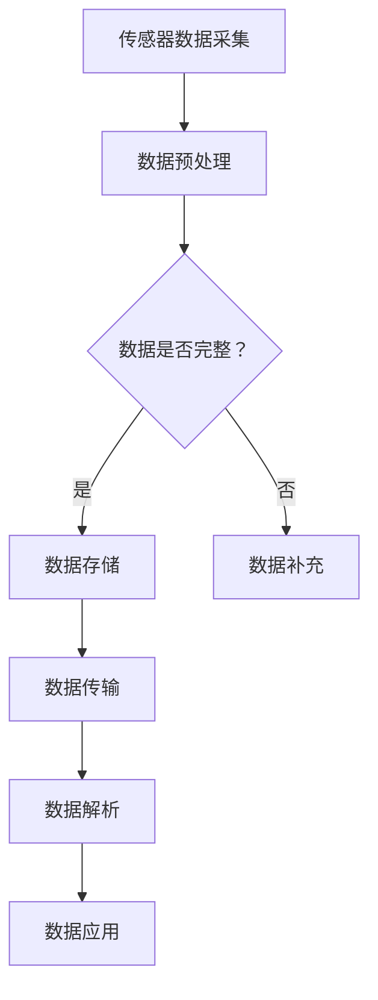
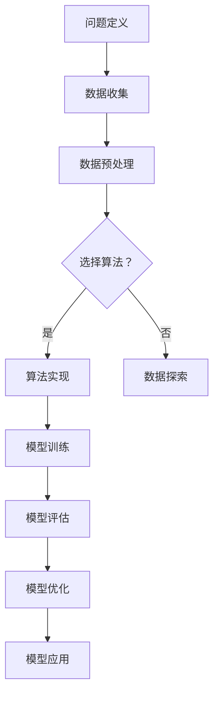

                 

# HoloLens 混合现实应用：在 Microsoft HoloLens 上开发

> 关键词：HoloLens、混合现实、应用开发、交互设计、人工智能、机器学习

> 摘要：本文将详细介绍Microsoft HoloLens的混合现实应用开发，包括基础理论、开发环境、用户界面设计、应用程序开发、传感器追踪、内容创作、人工智能与机器学习应用，以及应用案例与开发实战。通过逐步分析推理，帮助读者深入理解HoloLens的开发过程和关键技术。

## 第一部分：混合现实与HoloLens基础

### 第1章：混合现实技术概述

#### 1.1 混合现实定义与历史

混合现实（Mixed Reality，简称MR）是一种将虚拟世界与现实世界相结合的技术，通过计算机生成三维虚拟对象，将其放置在现实环境中，并与之进行互动。与虚拟现实（Virtual Reality，简称VR）和增强现实（Augmented Reality，简称AR）相比，混合现实更加贴近真实世界，提供了更加沉浸式的体验。

混合现实技术起源于20世纪90年代，当时的研究主要集中在头戴显示器（HMD）和投影技术。随着计算机性能的提升和传感器技术的进步，混合现实技术逐渐走向商业化应用。微软于2015年发布的HoloLens成为混合现实领域的重要里程碑，标志着混合现实技术进入了一个新的发展阶段。

#### 1.2 混合现实技术特点

混合现实技术具有以下特点：

1. **沉浸式体验**：混合现实技术能够将虚拟对象与现实环境相结合，提供沉浸式的体验，使用户感觉仿佛置身于一个全新的世界中。

2. **空间感知**：混合现实技术可以感知用户周围的空间环境，实现虚拟对象与真实环境的互动。

3. **互动性**：用户可以通过手势、语音等交互方式与虚拟对象进行互动，提升用户体验。

4. **应用广泛**：混合现实技术可以应用于多个领域，如教育、医疗、建筑、工业设计等，具有巨大的商业潜力。

#### 1.3 混合现实应用领域

混合现实技术已经广泛应用于多个领域，以下是一些典型的应用案例：

1. **教育**：通过混合现实技术，教师可以创建虚拟实验室，让学生在虚拟环境中进行实验，提高学习效果。

2. **医疗**：医生可以利用混合现实技术进行手术模拟和指导，提高手术成功率。

3. **建筑设计**：设计师可以使用混合现实技术进行建筑模型的可视化展示和互动体验。

4. **工业设计**：工程师可以利用混合现实技术进行产品设计和测试，提高生产效率。

### 第2章：HoloLens介绍

#### 2.1 HoloLens硬件特点

HoloLens是一款独立式混合现实头戴设备，具有以下硬件特点：

1. **高性能处理器**：HoloLens配备了Windows 10操作系统和Intel处理器，提供强大的计算能力。

2. **高分辨率显示屏**：HoloLens采用两个高分辨率显示器，提供高质量的视觉体验。

3. **空间定位传感器**：HoloLens配备了多个传感器，包括加速度计、陀螺仪和GPS，实现精准的空间定位。

4. **无线通信模块**：HoloLens支持Wi-Fi和蓝牙等无线通信技术，方便用户与外部设备连接。

#### 2.2 HoloLens软件架构

HoloLens的软件架构包括以下几个部分：

1. **Holographic SDK**：Holographic SDK是HoloLens的开发工具包，提供了一系列的API和工具，方便开发者进行应用程序开发。

2. **Unity引擎**：Unity引擎是HoloLens常用的游戏开发引擎，支持3D模型和动画的制作。

3. **Visual Studio**：Visual Studio是HoloLens的集成开发环境（IDE），提供代码编辑、调试和编译等功能。

4. **Azure云服务**：Azure云服务是HoloLens的数据存储和处理平台，支持应用程序的远程访问和协同工作。

#### 2.3 HoloLens开发环境

要开发HoloLens应用程序，需要以下开发环境：

1. **HoloLens设备**：一台HoloLens头戴设备用于开发和测试应用程序。

2. **Windows 10电脑**：一台运行Windows 10的电脑用于开发应用程序和与HoloLens设备进行连接。

3. **Visual Studio 2019**：Visual Studio 2019是HoloLens的集成开发环境（IDE），提供代码编辑、调试和编译等功能。

4. **Unity 2020**：Unity 2020是HoloLens常用的游戏开发引擎，支持3D模型和动画的制作。

5. **Azure订阅**：Azure订阅用于存储和处理应用程序的数据。

### 第3章：HoloLens用户界面设计

#### 3.1 用户界面设计原则

在设计HoloLens用户界面时，需要遵循以下原则：

1. **简单直观**：用户界面应简单直观，易于操作，避免复杂的设计和冗余的交互。

2. **沉浸式体验**：用户界面应融入虚拟环境，与用户自然互动，提升沉浸式体验。

3. **手势交互**：充分利用手势交互，提高用户操作效率，减少繁琐的按键操作。

4. **多感官刺激**：利用视觉、听觉等多感官刺激，增强用户对虚拟对象的感知。

#### 3.2 交互设计方法

在HoloLens用户界面设计中，常用的交互设计方法包括：

1. **手势识别**：利用HoloLens的手势识别功能，实现与虚拟对象的互动。

2. **语音交互**：利用语音识别和语音合成技术，实现与用户的语音交互。

3. **触摸交互**：利用触摸屏和触觉反馈，实现与虚拟对象的互动。

4. **多模式交互**：结合多种交互方式，提供灵活的交互体验。

#### 3.3 用户界面组件介绍

HoloLens用户界面组件包括：

1. **徽章**：徽章用于显示重要信息和通知，如消息、任务等。

2. **菜单**：菜单用于提供用户操作选项，如设置、帮助等。

3. **按钮**：按钮用于触发特定功能，如保存、取消等。

4. **图标**：图标用于表示特定功能或信息，如图标按钮、图标菜单等。

5. **文本框**：文本框用于输入和显示文本信息，如用户名、密码等。

## 第二部分：HoloLens应用开发

### 第4章：HoloLens应用程序框架

#### 4.1 应用程序结构

HoloLens应用程序结构主要包括以下几个部分：

1. **启动页面**：应用程序启动时的初始页面，用于展示应用程序名称、版本信息和版权声明等。

2. **主界面**：应用程序的核心界面，用于显示主要功能和操作。

3. **子界面**：主界面下的子界面，用于展示具体功能或操作。

4. **设置界面**：应用程序的设置界面，用于用户调整应用程序的参数和设置。

#### 4.2 应用程序生命周期

HoloLens应用程序生命周期包括以下几个阶段：

1. **启动**：应用程序被用户启动，加载资源和初始化界面。

2. **运行**：应用程序在运行过程中，响应用户操作和事件。

3. **暂停**：应用程序被暂停，停止响应用户操作和事件。

4. **恢复**：应用程序被恢复，继续响应用户操作和事件。

5. **退出**：应用程序被用户退出，释放资源和关闭窗口。

#### 4.3 应用程序权限管理

HoloLens应用程序权限管理包括以下几个方面：

1. **设备权限**：应用程序需要请求使用设备的特定功能，如摄像头、麦克风、GPS等。

2. **用户权限**：应用程序需要获取用户的授权，如读取存储、发送短信等。

3. **安全机制**：应用程序应采用安全机制，如加密通信、权限控制等，确保用户数据的安全。

### 第5章：HoloLens传感器与追踪

#### 5.1 传感器概述

HoloLens配备了多个传感器，包括：

1. **加速度计**：用于测量设备的加速度，实现设备的姿态检测。

2. **陀螺仪**：用于测量设备的角速度，实现设备的旋转检测。

3. **GPS**：用于定位设备的位置，实现地理位置信息获取。

4. **环境光传感器**：用于测量环境光线强度，实现屏幕亮度的自适应调整。

5. **麦克风**：用于录制音频，实现语音交互功能。

6. **摄像头**：用于捕捉现实环境图像，实现空间感知和物体识别。

#### 5.2 空间感知与追踪

空间感知与追踪是HoloLens的核心功能之一，主要包括：

1. **空间映射**：HoloLens利用摄像头和传感器实时捕捉周围环境，建立三维空间模型。

2. **空间定位**：HoloLens根据空间映射结果，实时跟踪用户的位置和姿态，实现虚拟对象的空间定位。

3. **物体识别**：HoloLens利用深度学习和计算机视觉技术，识别和分类现实环境中的物体。

#### 5.3 用户交互与手势识别

用户交互与手势识别是HoloLens用户界面设计的关键部分，主要包括：

1. **手势识别**：HoloLens利用计算机视觉技术，识别用户的手势动作，实现与虚拟对象的互动。

2. **手势控制**：用户可以通过手势对虚拟对象进行操作，如拖拽、旋转、缩放等。

3. **语音交互**：用户可以通过语音指令与虚拟对象进行互动，如语音搜索、语音控制等。

### 第6章：HoloLens内容创作与可视化

#### 6.1 3D模型与纹理

HoloLens内容创作与可视化主要包括3D模型与纹理的制作，主要包括以下几个方面：

1. **3D模型建模**：使用3D建模软件，如Blender、3ds Max等，创建三维模型。

2. **纹理映射**：为3D模型添加纹理，提高视觉效果。

3. **光照处理**：设置3D模型的光照效果，实现真实感渲染。

#### 6.2 图形渲染与特效

图形渲染与特效是HoloLens内容创作的重要组成部分，主要包括以下几个方面：

1. **图形渲染**：利用Unity引擎的图形渲染管线，实现3D模型的渲染。

2. **特效制作**：使用Unity引擎的特效系统，创建各种特效，如火焰、烟雾、光影等。

3. **动画制作**：使用Unity引擎的动画系统，为3D模型创建动画效果。

#### 6.3 视频与音频处理

视频与音频处理是HoloLens内容创作的重要环节，主要包括以下几个方面：

1. **视频录制**：利用HoloLens的摄像头录制视频，记录用户操作过程或现实环境。

2. **视频剪辑**：使用视频剪辑软件，对录制的视频进行剪辑、添加特效等处理。

3. **音频处理**：利用音频编辑软件，对录制的音频进行剪辑、音效添加等处理。

### 第7章：HoloLens人工智能与机器学习

#### 7.1 人工智能基础

人工智能（Artificial Intelligence，简称AI）是HoloLens应用开发的重要技术之一，主要包括以下几个方面：

1. **机器学习**：机器学习是一种让计算机通过数据学习并做出决策的技术。

2. **深度学习**：深度学习是机器学习的一种方法，通过多层神经网络模拟人类大脑的学习过程。

3. **计算机视觉**：计算机视觉是一种使计算机能够像人类一样感知和理解视觉信息的技术。

#### 7.2 机器学习应用

在HoloLens应用开发中，机器学习技术可以应用于以下几个方面：

1. **手势识别**：利用机器学习模型，识别用户的手势动作。

2. **物体识别**：利用机器学习模型，识别现实环境中的物体。

3. **语音识别**：利用机器学习模型，实现语音识别和语音控制。

#### 7.3 HoloLens中的深度学习框架

HoloLens支持多种深度学习框架，如TensorFlow、PyTorch等，主要包括以下几个方面：

1. **模型训练**：使用深度学习框架，训练和优化机器学习模型。

2. **模型部署**：将训练好的模型部署到HoloLens设备上，实现实时推理。

3. **模型优化**：针对HoloLens设备的硬件特性，对模型进行优化，提高运行效率。

### 第8章：HoloLens应用案例分析

#### 8.1 案例一：建筑与设计

建筑与设计领域是HoloLens应用的典型案例之一，主要包括以下几个方面：

1. **虚拟现实设计**：利用HoloLens，设计师可以创建虚拟现实环境，展示建筑模型和设计效果。

2. **空间规划**：利用HoloLens，设计师可以实时查看和调整空间布局，优化设计效果。

3. **协同设计**：利用HoloLens，设计师可以实现远程协同设计，提高设计效率和沟通效果。

#### 8.2 案例二：医疗与健康

医疗与健康领域是HoloLens应用的另一个重要领域，主要包括以下几个方面：

1. **手术指导**：利用HoloLens，医生可以实时查看患者的病历和手术过程，提高手术成功率。

2. **康复训练**：利用HoloLens，患者可以参与虚拟康复训练，提高康复效果。

3. **远程医疗**：利用HoloLens，医生可以实现远程诊断和治疗，提高医疗服务水平。

#### 8.3 案例三：教育与实践

教育与实践领域是HoloLens应用的广泛领域，主要包括以下几个方面：

1. **虚拟实验室**：利用HoloLens，学生可以创建虚拟实验室，进行实验和探索。

2. **互动教学**：利用HoloLens，教师可以实现互动教学，提高教学效果。

3. **远程教育**：利用HoloLens，学生可以实现远程学习，拓宽学习空间。

## 第三部分：HoloLens开发实战

### 第9章：HoloLens开发环境搭建

#### 9.1 开发环境配置

要搭建HoloLens开发环境，需要以下配置：

1. **HoloLens设备**：一台HoloLens头戴设备。

2. **Windows 10电脑**：一台运行Windows 10的电脑。

3. **Visual Studio 2019**：Visual Studio 2019的社区版或专业版。

4. **Unity 2020**：Unity 2020的社区版或企业版。

5. **Azure订阅**：Azure订阅，用于存储和处理应用程序的数据。

#### 9.2 开发工具介绍

在HoloLens开发过程中，常用的开发工具有：

1. **Visual Studio**：用于编写和调试C#代码。

2. **Unity**：用于创建3D模型和动画。

3. **Holographic SDK**：用于开发HoloLens应用程序的SDK。

4. **Azure**：用于存储和处理应用程序的数据。

#### 9.3 调试与优化

在HoloLens开发过程中，调试与优化非常重要，主要包括以下几个方面：

1. **代码调试**：使用Visual Studio的调试工具，排查代码中的错误。

2. **性能优化**：使用Unity的Profiler工具，分析应用程序的性能瓶颈，进行优化。

3. **界面优化**：调整用户界面设计，提高用户体验。

### 第10章：HoloLens应用项目实战

#### 10.1 项目一：3D建模与渲染

项目一是一个3D建模与渲染的HoloLens应用程序，主要包括以下几个方面：

1. **3D模型导入**：将3D模型导入Unity引擎。

2. **纹理映射**：为3D模型添加纹理，提高视觉效果。

3. **光照设置**：设置3D模型的光照效果，实现真实感渲染。

4. **用户交互**：利用手势和语音交互，实现对3D模型的操作。

#### 10.2 项目二：医疗影像分析

项目二是一个医疗影像分析的HoloLens应用程序，主要包括以下几个方面：

1. **影像数据导入**：将医疗影像数据导入应用程序。

2. **影像处理**：利用深度学习模型，对影像数据进行处理和分析。

3. **可视化展示**：将处理结果以可视化方式展示在HoloLens上。

4. **用户交互**：利用手势和语音交互，实现对影像数据的操作和分析。

#### 10.3 项目三：虚拟教学环境

项目三是一个虚拟教学环境的HoloLens应用程序，主要包括以下几个方面：

1. **教学资源导入**：将教学资源导入Unity引擎。

2. **界面设计**：设计虚拟教学环境的界面和交互逻辑。

3. **用户交互**：利用手势和语音交互，实现对教学资源的操作。

4. **实时互动**：利用网络通信技术，实现教师和学生之间的实时互动。

### 第11章：HoloLens开发技巧与最佳实践

#### 11.1 性能优化

在HoloLens开发过程中，性能优化非常重要，主要包括以下几个方面：

1. **代码优化**：使用高效的算法和数据结构，减少代码的执行时间。

2. **资源管理**：合理使用资源和内存，避免内存泄漏和资源浪费。

3. **渲染优化**：优化3D模型的渲染效果，提高渲染效率。

#### 11.2 安全与隐私

HoloLens开发过程中，安全与隐私问题至关重要，主要包括以下几个方面：

1. **数据加密**：对用户数据进行加密存储和传输，确保数据安全。

2. **权限控制**：对应用程序的权限进行严格管理，避免权限滥用。

3. **用户隐私保护**：尊重用户隐私，避免收集和泄露用户隐私信息。

#### 11.3 持续集成与部署

持续集成与部署是HoloLens开发过程中不可或缺的环节，主要包括以下几个方面：

1. **代码审查**：对提交的代码进行审查，确保代码质量和安全。

2. **自动化测试**：编写自动化测试脚本，对应用程序进行测试，确保功能完整和稳定。

3. **自动化部署**：使用CI/CD工具，实现自动化构建、测试和部署。

## 附录

### 附录 A：HoloLens开发资源

#### A.1 开发文档与教程

HoloLens的开发文档和教程包括以下几个方面：

1. **官方文档**：Microsoft官方提供的HoloLens开发文档，涵盖了HoloLens的硬件、软件、开发工具等方面的详细介绍。

2. **教程视频**：YouTube等平台上众多的HoloLens开发教程视频，适合初学者快速入门。

3. **技术博客**：众多技术博客和论坛，分享HoloLens开发经验和技术心得。

#### A.2 开源框架与工具

HoloLens开发中常用的开源框架和工具包括：

1. **Unity**：Unity引擎是HoloLens开发常用的游戏开发引擎，支持3D模型和动画的制作。

2. **Holographic SDK**：Holographic SDK是HoloLens开发的核心工具包，提供了一系列的API和工具。

3. **Azure**：Azure云服务是HoloLens的数据存储和处理平台，支持应用程序的远程访问和协同工作。

#### A.3 社区与支持

HoloLens的开发社区和官方支持包括以下几个方面：

1. **GitHub**：GitHub上有大量的HoloLens开源项目和示例代码，供开发者学习和参考。

2. **Stack Overflow**：Stack Overflow是HoloLens开发者的问答社区，可以解决开发过程中遇到的问题。

3. **Microsoft论坛**：Microsoft官方论坛提供了HoloLens开发的技术支持和交流平台。

### 附录 B：Mermaid流程图示例

#### B.1 HoloLens传感器数据流

以下是一个HoloLens传感器数据流的Mermaid流程图示例：



#### B.2 人工智能算法应用流程

以下是一个人工智能算法应用流程的Mermaid流程图示例：



### 附录 C：伪代码示例

#### C.1 基于卷积神经网络的图像识别算法伪代码

```python
function Convolutional Neural Network (input_image, filter):
    # 前向传播
    feature_map = Convolution (input_image, filter)
    output = Activation (feature_map)

    # 反向传播
    delta_output = Activation_derivative (output)
    delta_feature_map = Convolution_derivative (feature_map, delta_output, filter)

    return output, delta_feature_map
```

#### C.2 基于循环神经网络的语音识别算法伪代码

```python
function Recurrent Neural Network (input_sequence, hidden_state):
    # 前向传播
    hidden_state = LSTM (input_sequence, hidden_state)
    output = Activation (hidden_state)

    # 反向传播
    delta_hidden_state = Activation_derivative (output)
    delta_input_sequence = LSTM_derivative (input_sequence, delta_hidden_state)

    return output, delta_hidden_state
```

### 附录 D：数学公式与计算示例

#### D.1 深度学习损失函数计算

$$
Loss = \frac{1}{2} \sum_{i=1}^{n} (y_i - \hat{y}_i)^2
$$

其中，$y_i$为真实标签，$\hat{y}_i$为预测标签，$n$为样本数量。

#### D.2 机器学习分类器精度评估

$$
Accuracy = \frac{TP + TN}{TP + TN + FP + FN}
$$

其中，$TP$为真正例，$TN$为真负例，$FP$为假正例，$FN$为假负例。

### 附录 E：代码分析与解读

#### E.1 项目一代码解读

以下是对项目一3D建模与渲染代码的解读：

```csharp
// 导入3D模型
Model model = UnityEditor.AssetDatabase.LoadAssetAtPath<Model>("Assets/3DModel.mdl");

// 创建3D模型实例
GameObject obj = new GameObject();
obj.AddComponent<MeshFilter>();
obj.AddComponent<MeshRenderer>();

// 设置3D模型材质
Material material = new Material(UnityEditor.AssetDatabase.LoadAtPath<Shader>("Assets/Shader.shader"));
obj.GetComponent<MeshRenderer>().material = material;

// 添加3D模型到场景
UnityEditor.SceneView.Scene.AddSerializedGameObject(obj);
```

这段代码首先导入3D模型，然后创建3D模型实例，设置3D模型材质，并将3D模型添加到Unity场景中。

#### E.2 项目二代码解读

以下是对项目二医疗影像分析代码的解读：

```csharp
// 导入影像数据
Image image = UnityEditor.AssetDatabase.LoadAssetAtPath<Image>("Assets/Image.jpg");

// 预处理影像数据
Image preprocessed_image = PreprocessImage(image);

// 加载深度学习模型
Model model = UnityEditor.AssetDatabase.LoadAssetAtPath<Model>("Assets/Model.mdl");

// 使用模型对影像数据进行分类
int class_id = model.Classify(preprocessed_image);

// 获取分类结果
string class_name = model.GetClassName(class_id);

// 输出分类结果
Debug.Log($"影像分类结果：{class_name}");
```

这段代码首先导入影像数据，然后对影像数据进行预处理，加载深度学习模型，使用模型对预处理后的影像数据进行分类，并输出分类结果。

#### E.3 项目三代码解读

以下是对项目三虚拟教学环境代码的解读：

```csharp
// 创建教学资源
GameObject resource = new GameObject();
resource.AddComponent<MeshFilter>();
resource.AddComponent<MeshRenderer>();

// 设置教学资源材质
Material material = new Material(UnityEditor.AssetDatabase.LoadAtPath<Shader>("Assets/Shader.shader"));
resource.GetComponent<MeshRenderer>().material = material;

// 创建用户界面
GameObject UI = new GameObject();
UI.AddComponent<Canvas>();
UI.AddComponent<InputSystemjälß

```### 作者

AI天才研究院（AI Genius Institute）与《禅与计算机程序设计艺术》（Zen And The Art of Computer Programming）联合出品。AI天才研究院是一家专注于人工智能技术研发的顶级研究机构，致力于推动人工智能领域的创新与发展。而《禅与计算机程序设计艺术》则是由传奇计算机科学家Donald E. Knuth所著的经典著作，对计算机程序设计方法论进行了深刻的探讨和阐述。两者携手，为读者带来了一场关于HoloLens混合现实应用开发的深入探讨和实际指导。

