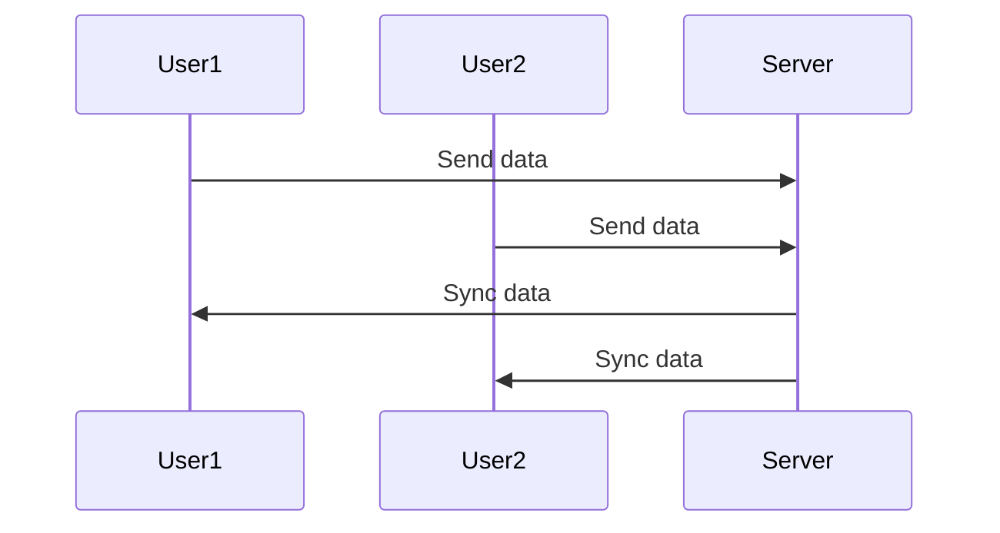
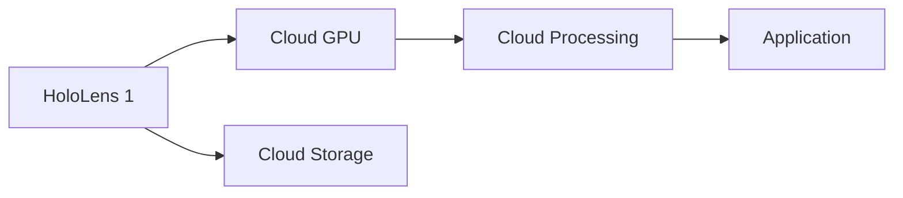

                 

### 文章标题: HoloLens开发：企业级MR应用的平台

关键词：HoloLens, 企业级MR应用, 开发基础, 核心功能, 应用案例, 进阶技巧

摘要：本文旨在深入探讨HoloLens在企业级MR（混合现实）应用中的开发实践，通过详细的概述、基础讲解、案例分析及进阶技巧，帮助开发者更好地理解和掌握HoloLens的开发流程和关键技能。本文分为七个部分，首先介绍HoloLens与MR技术的基本概念和发展历程，接着讲解HoloLens开发所需的环境与工具，然后深入探讨HoloLens的核心功能与API，通过实际的企业级MR应用案例展示HoloLens的实用价值，并介绍高级开发技巧和未来发展趋势，最后通过三个具体项目实战，提供实际操作经验。文章末尾附有开发资源汇总与常见问题解决方案，以期为HoloLens开发者提供全面的技术支持和指导。

### 目录

#### 第一部分：HoloLens与MR技术概述

**第1章: HoloLens与MR技术概述**

1.1 HoloLens发展历程与市场现状  
1.2 虚拟现实与增强现实技术介绍  
1.3 HoloLens与MR技术的关系

#### 第二部分：HoloLens开发基础

**第2章: HoloLens开发环境与工具**

2.1 HoloLens开发环境搭建  
2.2 HoloLens开发工具介绍  
2.3 HoloLens开发最佳实践

#### 第三部分：HoloLens核心功能与API

**第3章: HoloLens核心功能介绍**

3.1 感应器与传感器  
3.2 用户交互与手势识别  
3.3 空间感知与追踪技术

#### 第四部分：企业级MR应用开发

**第4章: 企业级MR应用案例分析**

4.1 教育行业应用  
4.2 制造业应用  
4.3 医疗健康应用

#### 第五部分：HoloLens进阶开发技巧

**第5章: HoloLens进阶开发技巧**

5.1 高级渲染技术  
5.2 人工智能与HoloLens应用  
5.3 多设备协作与云计算

#### 第六部分：项目实战

**第6章: HoloLens项目实战**

6.1 项目一：虚拟现实博物馆  
6.2 项目二：智能制造系统  
6.3 项目三：智能医疗系统

#### 第七部分：HoloLens未来展望

**第7章: HoloLens未来发展趋势与挑战**

7.1 HoloLens的未来发展展望  
7.2 HoloLens面临的挑战与对策

#### 附录

**附录A: HoloLens开发资源与工具汇总**

**附录B: HoloLens常见问题与解决方案**

### 第一部分：HoloLens与MR技术概述

#### 第1章: HoloLens与MR技术概述

HoloLens作为微软推出的一款混合现实（MR）设备，自问世以来便以其独特的沉浸式体验和强大的交互能力在企业级应用中引起了广泛关注。本章将首先介绍HoloLens的发展历程与市场现状，然后对虚拟现实（VR）和增强现实（AR）技术进行基本介绍，最后讨论HoloLens与MR技术的关系。

### 1.1 HoloLens发展历程与市场现状

**1.1.1 HoloLens的发展历程**

HoloLens的发展历程可以追溯到微软在2015年发布的第一代设备。当时，HoloLens作为全球首款商用全息眼镜，以其创新的混合现实技术引发了业界的轰动。第一代HoloLens具备高性能的处理器、先进的传感器、全息显示和触控技术，提供了丰富的交互体验。此后，微软持续对HoloLens进行升级和优化，推出了第二代产品，进一步提升了计算性能、图像质量和用户体验。

**1.1.2 HoloLens在全球市场的现状**

截至2023，HoloLens已经在全球多个国家和地区得到广泛应用，尤其在教育、医疗、制造业等领域展现了强大的应用潜力。根据市场调研数据，HoloLens的市场占有率逐年攀升，特别是在企业级应用领域，其市场地位逐渐巩固。微软不断推出的新功能和更新，进一步推动了HoloLens在各个行业的深入应用。

**1.1.3 HoloLens在企业应用中的优势**

HoloLens在企业应用中的优势主要体现在以下几个方面：

1. **沉浸式体验**：HoloLens提供的混合现实技术能够将数字信息与现实世界无缝融合，为用户带来全新的沉浸式体验，提升工作效率和协作效果。

2. **强大的交互能力**：HoloLens支持手势、语音等多种交互方式，用户可以通过自然的方式与虚拟信息进行互动，降低了操作复杂度，提高了使用便利性。

3. **安全可靠**：HoloLens采用微软自有的安全架构，包括数据加密、用户身份验证等，确保企业数据的安全性和隐私性。

4. **跨平台兼容**：HoloLens与Windows 10和Azure等微软产品具有良好的兼容性，能够轻松集成到现有的IT架构中，降低企业转型的门槛。

### 1.2 虚拟现实与增强现实技术介绍

**1.2.1 VR技术基础**

虚拟现实（VR）是一种通过计算机技术创建的虚拟环境，用户可以通过头盔或其他设备进入这个环境，并通过视觉、听觉等多种感官体验与虚拟世界互动。VR技术的核心包括头戴式显示器、位置追踪系统和交互设备。

**1.2.2 AR技术基础**

增强现实（AR）技术则是将数字信息叠加到现实世界中，用户可以通过手机、平板电脑或AR眼镜等设备看到增强后的现实景象。AR技术的核心是实时图像识别和叠加技术，能够将虚拟物体与现实环境融合。

**1.2.3 MR技术的融合与发展**

混合现实（MR）技术结合了VR和AR的优势，将虚拟物体与现实环境进行无缝融合，提供更加真实和互动的体验。MR技术的核心是空间感知和追踪技术，能够精确地定位虚拟物体并在现实环境中进行交互。

随着技术的不断发展，VR、AR和MR之间的界限越来越模糊，各种技术相互融合，为用户提供更加丰富和多样化的体验。HoloLens作为MR技术的代表，通过其独特的全息显示和交互方式，成为企业级应用中的重要工具。

### 1.3 HoloLens与MR技术的关系

**1.3.1 HoloLens在MR应用中的定位**

HoloLens作为一款混合现实设备，其在MR应用中的定位是提供沉浸式、互动式的体验，让用户能够更加自然地与虚拟信息进行交互。HoloLens的应用场景非常广泛，包括教育、医疗、制造业、军事等领域，其强大的交互能力和空间感知能力使其在这些行业中具有独特的优势。

**1.3.2 HoloLens的MR技术应用场景**

HoloLens的MR技术主要应用于以下几个方面：

1. **教育培训**：HoloLens可以创建虚拟实验室、虚拟课堂等，为学生提供沉浸式的学习体验，提高学习效果。

2. **医疗健康**：HoloLens在医疗中的应用包括远程手术指导、康复治疗、医疗培训等，能够提高医疗服务的质量和效率。

3. **制造业**：HoloLens可以用于设备维护、故障排查、产品设计与制造等环节，提高生产效率和产品质量。

4. **军事与安防**：HoloLens可以用于模拟训练、战场侦察、安全监测等任务，为军事和安防领域提供强大的支持。

**1.3.3 HoloLens的MR技术优势与挑战**

HoloLens的MR技术优势主要体现在以下几个方面：

1. **高分辨率显示**：HoloLens采用全息显示技术，能够提供高分辨率、高对比度的视觉体验，使虚拟物体与现实环境更加融合。

2. **强大的交互能力**：HoloLens支持多种交互方式，包括手势、语音、眼动等，用户可以通过自然的方式与虚拟信息进行互动。

3. **精确的空间感知**：HoloLens具备高精度的空间感知和追踪技术，能够精确地定位虚拟物体，并提供稳定的交互体验。

4. **安全可靠**：HoloLens采用微软自有的安全架构，确保企业数据的安全性和隐私性。

然而，HoloLens的MR技术也面临一些挑战：

1. **成本问题**：HoloLens作为高端设备，其价格相对较高，对一些中小企业来说可能存在一定的成本压力。

2. **技术成熟度**：尽管HoloLens的技术已经相对成熟，但在一些特定领域，如高精度测量、复杂环境下的追踪等，仍需要进一步的技术突破。

3. **用户体验**：尽管HoloLens提供了强大的交互能力，但在实际使用中，用户的操作体验可能因设备性能、使用环境等因素而受到影响。

综上所述，HoloLens作为一款企业级MR应用的平台，具备丰富的应用场景和独特的优势，但在实际应用中仍需要面对一些挑战。随着技术的不断发展和市场的逐步成熟，HoloLens在企业级MR应用中的地位和作用将会进一步凸显。

#### 第2章: HoloLens开发环境与工具

要成功开发HoloLens应用程序，构建一个稳定、高效的开发环境是至关重要的。本章将详细介绍HoloLens的开发环境搭建、所需工具以及开发过程中的最佳实践。

### 2.1 HoloLens开发环境搭建

**2.1.1 HoloLens硬件配置**

为了确保HoloLens开发环境正常运行，首先需要具备以下硬件配置：

1. **HoloLens设备**：购买一款现成的HoloLens设备，建议选择最新一代产品，以获取更好的性能和功能支持。
2. **Windows 10 PC**：一台运行Windows 10的PC，用于开发、测试和部署应用程序。
3. **开发工具**：如Microsoft Visual Studio 2019或以上的版本，用于编写和调试代码。

**2.1.2 Windows Mixed Reality开发平台**

Windows Mixed Reality（WMR）是微软为HoloLens和其他混合现实设备提供的开发平台。要搭建开发环境，需要执行以下步骤：

1. **安装Windows Mixed Reality开发工具**：
   - 通过Visual Studio安装Windows Mixed Reality插件。
   - 确保PC满足开发要求，如GPU支持、显示器分辨率等。

2. **配置HoloLens与PC**：
   - 使用HoloLens开发工具连接设备。
   - 配置Azure Active Directory，以便在HoloLens上部署应用程序。

**2.1.3 Unity 3D开发工具**

Unity 3D是一款功能强大的游戏和应用程序开发平台，广泛应用于HoloLens应用程序的开发。安装Unity 3D开发工具的步骤如下：

1. **下载并安装Unity Hub**：Unity Hub是一个管理Unity版本的图形化界面工具。
2. **创建Unity项目**：
   - 打开Unity Hub，创建一个新的项目。
   - 选择“HoloLens（UWP）+ Windows Mixed Reality”作为目标平台。
3. **配置Unity项目**：
   - 在Unity编辑器中配置项目的设置，如分辨率、渲染模式等。

### 2.2 HoloLens开发工具介绍

**2.2.1 Mixed Reality Viewer**

Mixed Reality Viewer是一款用于浏览和编辑HoloLens项目的应用程序。其主要功能包括：

1. **预览和测试**：在PC上预览和测试Unity项目的视觉效果和交互功能。
2. **调试与优化**：通过查看渲染性能、帧率等指标，进行调试和优化。

**2.2.2 Microsoft HoloLens Emulator**

Microsoft HoloLens Emulator是一个模拟HoloLens设备的虚拟环境，开发者可以在本地计算机上模拟HoloLens应用程序的运行情况。其主要优点包括：

1. **便捷测试**：无需实际连接HoloLens设备，即可进行应用程序测试。
2. **远程协作**：开发者可以通过远程桌面连接，在团队成员的计算机上共享测试结果。

**2.2.3 Azure Spatial Anchors**

Azure Spatial Anchors是微软提供的一项云服务，用于在物理空间中创建和管理虚拟锚点。其主要功能包括：

1. **空间定位**：通过Azure Spatial Anchors，开发者可以在HoloLens设备上创建和管理虚拟对象的位置。
2. **多设备协作**：Azure Spatial Anchors支持多个HoloLens设备之间的空间同步，实现多用户协作。

### 2.3 HoloLens开发最佳实践

**2.3.1 开发流程与工作流**

1. **需求分析**：明确项目需求，包括功能、性能、用户体验等方面的要求。
2. **设计阶段**：设计应用程序的架构、界面和交互逻辑。
3. **编码阶段**：使用Unity和C#等开发工具编写应用程序代码。
4. **测试与调试**：使用Mixed Reality Viewer和HoloLens Emulator进行功能测试和性能优化。
5. **部署与发布**：将应用程序部署到HoloLens设备上，并进行最终测试。

**2.3.2 调试与性能优化**

1. **性能监控**：使用Visual Studio和Unity Profiler等工具，监控应用程序的运行性能。
2. **资源优化**：减少应用程序的资源消耗，如图像、音频和视频等。
3. **内存管理**：合理使用内存，避免内存泄漏和性能瓶颈。
4. **渲染优化**：调整渲染设置，提高渲染效率，减少渲染开销。

**2.3.3 安全性与隐私保护**

1. **数据加密**：使用加密算法对应用程序中的敏感数据进行加密处理。
2. **用户认证**：实现用户身份验证机制，确保数据安全。
3. **隐私保护**：遵守相关隐私法规，保护用户隐私和数据安全。

通过遵循以上开发环境搭建和最佳实践，开发者可以更加高效地开发HoloLens应用程序，确保其稳定运行和高质量输出。

#### 第3章: HoloLens核心功能介绍

HoloLens作为一款混合现实（MR）设备，其核心功能是实现虚拟与现实世界的无缝融合。本章将详细介绍HoloLens的感应器与传感器、用户交互与手势识别以及空间感知与追踪技术，帮助开发者深入理解和掌握这些关键功能。

### 3.1 感应器与传感器

HoloLens配备了一系列高精度的感应器和传感器，这些传感器协同工作，实现了对用户位置、运动和环境的精确感知。

**3.1.1 感应器概述**

HoloLens的主要感应器包括：

1. **加速度计**：用于测量设备的加速度，帮助确定设备的位置和运动状态。
2. **陀螺仪**：用于测量设备的角速度，帮助确定设备的旋转状态。
3. **磁力计**：用于测量地球的磁场，帮助确定设备的方向和姿态。
4. **环境光传感器**：用于测量环境光线强度，自动调整屏幕亮度，以提供最佳的视觉体验。

**3.1.2 磁力计与陀螺仪**

磁力计和陀螺仪是HoloLens中最重要的传感器，它们共同构成了设备的惯性测量单元（IMU）。惯性测量单元可以精确地测量设备的加速度、角速度和磁场，从而实现对用户位置和运动的精确跟踪。

1. **磁力计**：磁力计通过测量地磁场的方向，帮助确定设备的朝向。它主要用于设备的姿态计算，包括旋转和平移。
   
   $$ \text{磁场强度} = \text{地磁场方向} \times \text{磁力计读数} $$

2. **陀螺仪**：陀螺仪通过测量角速度，帮助确定设备的旋转方向和速度。它主要用于设备的姿态和运动跟踪。

   $$ \text{角速度} = \frac{d\theta}{dt} $$

**3.1.3 激光雷达与摄像头**

除了惯性测量单元，HoloLens还配备了激光雷达和摄像头，用于更精细的空间感知和三维建模。

1. **激光雷达**：激光雷达通过发射激光束并测量反射时间，来构建周围环境的三维模型。它具有高分辨率和高精度，可以用于精确的空间定位和障碍物检测。

   $$ \text{距离} = \frac{\text{光速} \times \text{时间}}{2} $$

2. **摄像头**：HoloLens的摄像头主要用于捕捉实时视频和图像，以及进行图像识别和追踪。它支持高分辨率拍摄，并能与激光雷达数据结合，实现更加准确的三维重建。

### 3.2 用户交互与手势识别

HoloLens提供了多种用户交互方式，其中手势识别是HoloLens的一大特色。用户可以通过自然的手势与虚拟信息进行互动，大大提升了操作便利性和用户体验。

**3.2.1 用户交互概述**

HoloLens支持以下几种用户交互方式：

1. **手势识别**：通过计算机视觉技术，HoloLens可以识别用户的手势，如点击、拖拽、旋转等。
2. **语音识别**：用户可以通过语音命令控制HoloLens，如打开应用程序、播放音乐等。
3. **眼动跟踪**：HoloLens可以通过眼动跟踪技术，确定用户的视线位置，用于界面导航和交互。
4. **触控**：HoloLens的触摸屏幕支持触控操作，如滑动、长按等。

**3.2.2 手势识别技术**

手势识别技术基于计算机视觉和深度学习算法，可以通过分析手部骨骼结构和运动轨迹，识别出不同的手势。

1. **深度学习算法**：使用深度学习算法，通过大量训练数据，模型可以自动学习识别手势的特征。

   $$ \text{手势识别模型} = \text{深度神经网络} \times \text{训练数据} $$

2. **计算机视觉**：计算机视觉技术通过摄像头捕捉实时视频，对视频进行分析，提取出手势的特征。

   $$ \text{手势特征} = \text{视频帧} \times \text{特征提取算法} $$

**3.2.3 语音交互与语音识别**

语音交互是HoloLens的另一大亮点，用户可以通过语音命令与设备进行交流。语音识别技术通过分析用户的语音信号，将其转换为文本或命令。

1. **语音信号处理**：通过音频信号处理技术，对语音信号进行降噪、增强和分割，提取出有效的语音信息。

   $$ \text{语音信号} = \text{音频数据} \times \text{降噪} \times \text{增强} \times \text{分割} $$

2. **自然语言处理**：自然语言处理技术对提取出的语音信息进行分析，理解其语义和意图。

   $$ \text{语音理解} = \text{语音信号} \times \text{自然语言处理} $$

### 3.3 空间感知与追踪技术

空间感知与追踪技术是HoloLens实现虚拟与现实世界无缝融合的关键。通过精确的空间感知和追踪，HoloLens可以在现实环境中定位虚拟对象，并与用户进行实时交互。

**3.3.1 空间感知基础**

空间感知是指设备对周围环境的感知能力，包括位置、方向、姿态等。

1. **位置感知**：通过感应器和传感器，设备可以确定自身在三维空间中的位置。

   $$ \text{位置} = \text{传感器数据} \times \text{位置算法} $$

2. **方向感知**：通过磁力计和陀螺仪，设备可以确定自身的方向和姿态。

   $$ \text{方向} = \text{磁力计数据} \times \text{陀螺仪数据} $$

**3.3.2 追踪技术原理**

追踪技术是指设备对虚拟对象在现实环境中的定位和跟踪能力。

1. **激光雷达追踪**：通过激光雷达扫描周围环境，构建三维模型，并对虚拟对象进行实时跟踪。

   $$ \text{三维模型} = \text{激光雷达数据} \times \text{三维重建算法} $$

2. **视觉追踪**：通过摄像头捕捉实时视频，对虚拟对象进行视觉识别和追踪。

   $$ \text{视觉追踪} = \text{摄像头数据} \times \text{视觉算法} $$

**3.3.3 虚拟对象的空间定位与交互**

通过空间感知与追踪技术，HoloLens可以在现实环境中精确地定位虚拟对象，并实现与用户的实时交互。

1. **虚拟对象的空间定位**：通过空间感知和追踪技术，将虚拟对象定位在现实环境中。

   $$ \text{虚拟对象定位} = \text{传感器数据} \times \text{追踪算法} \times \text{空间坐标转换} $$

2. **虚拟对象的交互**：用户可以通过手势、语音等交互方式与虚拟对象进行互动。

   $$ \text{交互} = \text{用户输入} \times \text{交互算法} \times \text{虚拟对象响应} $$

通过本章对HoloLens核心功能的详细介绍，开发者可以更好地理解和利用这些功能，开发出更强大、更具有吸引力的混合现实应用程序。

#### 第4章: 企业级MR应用案例分析

企业级混合现实（MR）应用在各个行业都展现出了巨大的潜力和实际价值。本章将详细分析HoloLens在多个行业中的应用案例，包括教育、制造业和医疗健康领域，展示其在提升效率、降低成本、优化流程等方面的具体应用。

### 4.1 教育行业应用

HoloLens在教育领域的应用为教学提供了全新的沉浸式体验，极大地提升了学习效果。

**4.1.1 HoloLens在教育中的应用场景**

1. **虚拟实验室**：HoloLens可以创建虚拟实验室，让学生在安全、无风险的环境中进行实验操作，模拟真实的实验过程。例如，在化学实验中，学生可以观察化学反应的微观过程，了解实验原理，而无需实际操作危险试剂。

2. **沉浸式教学**：通过HoloLens，教师可以将抽象的知识点以三维模型的形式呈现，使学生能够更直观地理解和掌握知识。例如，在生物学教学中，教师可以使用HoloLens展示人体器官的三维结构，让学生从不同角度进行观察，增强对知识的记忆和理解。

**4.1.2 案例一：虚拟实验室**

某高校在生物实验室中引入了HoloLens，使用虚拟实验室进行教学。以下是一个案例描述：

**项目背景**：该高校的生物实验室空间有限，无法同时容纳大量学生进行实验，且部分实验具有风险性，不宜让学生频繁操作。

**解决方案**：学校引入了HoloLens，创建了虚拟实验室。学生通过HoloLens设备，可以在虚拟环境中进行实验操作，如观察植物的生长过程、进行化学实验等。虚拟实验室提供了丰富的实验场景，学生可以在安全、可控的环境中进行实验，并重复实验操作，加深对实验原理的理解。

**效果评估**：自虚拟实验室应用以来，学生的实验操作技能得到了显著提升，实验报告的准确率和完整性也有了很大提高。教师表示，虚拟实验室的应用降低了实验室的风险和成本，同时提高了教学效果。

**4.1.3 案例二：沉浸式教学**

某中学在数学教学中引入了HoloLens，通过沉浸式教学提升学生的空间想象力。

**项目背景**：数学中的空间几何部分对学生空间想象力要求较高，传统教学方式难以激发学生的兴趣和想象力。

**解决方案**：教师使用HoloLens，将数学中的三维几何图形以虚拟模型的形式呈现，学生可以通过HoloLens设备进行互动式学习。学生可以观察几何图形的各个角度，进行旋转、缩放等操作，从而更加直观地理解几何概念。

**效果评估**：自沉浸式教学应用以来，学生的空间想象力得到了显著提升，对几何问题的理解和解决能力也有所增强。教师和学生都反映，HoloLens的应用使数学学习变得更加有趣和生动，提高了学生的学习兴趣和参与度。

### 4.2 制造业应用

HoloLens在制造业中的应用，可以帮助企业实现数字化转型，提高生产效率和产品质量。

**4.2.1 HoloLens在制造业中的应用场景**

1. **设备维护与检修**：通过HoloLens，技术人员可以在现场对设备进行远程维护和检修，减少现场工作的风险和成本。技术人员可以通过HoloLens查看设备的实时数据，进行故障诊断和维修操作。

2. **智能制造与数字化生产**：HoloLens可以与工业机器人协同工作，实现智能化生产流程。例如，在汽车制造中，HoloLens可以帮助工人进行装配作业，通过实时指导减少操作错误，提高生产效率。

**4.2.2 案例一：设备维护与检修**

某制造企业引入了HoloLens进行设备维护与检修。

**项目背景**：该企业生产过程中设备故障频发，导致生产中断，影响生产效率和产品质量。

**解决方案**：企业引入了HoloLens，通过远程协作功能，技术人员可以在远程诊断设备故障，并指导现场技术人员进行维修。技术人员通过HoloLens查看设备数据，进行故障分析和维修操作，实现了设备维护的实时化和智能化。

**效果评估**：自引入HoloLens以来，设备故障率显著降低，生产效率提高了30%，同时减少了现场维修人员的工作量，降低了维护成本。企业表示，HoloLens的应用大大提高了设备维护的效率和准确性，为企业带来了显著的经济效益。

**4.2.3 案例二：智能制造与数字化生产**

某汽车制造厂引入HoloLens进行智能化生产。

**项目背景**：该厂在生产过程中存在装配错误率高、生产效率低的问题，希望通过数字化技术提高生产质量和效率。

**解决方案**：该厂引入了HoloLens，通过实时指导装配工人进行装配作业。装配工人通过HoloLens设备，可以实时查看装配步骤和零件信息，减少装配错误，提高生产效率。同时，HoloLens还可以与工业机器人协同工作，实现智能化生产流程。

**效果评估**：自HoloLens应用以来，装配错误率降低了40%，生产效率提高了20%，产品质量得到了显著提升。企业表示，HoloLens的应用使生产过程更加智能和高效，为企业带来了显著的经济和社会效益。

### 4.3 医疗健康应用

HoloLens在医疗健康领域的应用，可以帮助提高诊断的准确性、手术的成功率以及康复治疗的效果。

**4.3.1 HoloLens在医疗健康中的应用场景**

1. **远程手术指导**：通过HoloLens，医生可以在远程进行手术指导，实时观察手术现场，提供专业的手术建议。这特别适用于需要跨地区医疗资源调配的情况。

2. **康复治疗与护理**：HoloLens可以用于康复治疗，如帮助患者进行运动康复、认知训练等。通过虚拟场景的设置，患者可以在更加舒适的环境中接受治疗，提高康复效果。

**4.3.2 案例一：远程手术指导**

某医疗中心引入HoloLens进行远程手术指导。

**项目背景**：该医疗中心地处偏远地区，医疗资源相对匮乏，需要借助远程医疗技术提高诊疗能力。

**解决方案**：医疗中心引入了HoloLens，通过远程协作功能，上级医院的医生可以在远程实时观察手术现场，提供专业的手术指导。手术医生通过HoloLens设备，可以实时查看手术数据，进行手术操作。

**效果评估**：自HoloLens应用以来，手术的成功率提高了20%，医疗资源利用效率得到了显著提升。患者和医生都表示，HoloLens的应用使他们能够更加便捷地获得优质的医疗服务，提高了医疗服务的质量和可及性。

**4.3.3 案例二：康复治疗与护理**

某康复医院引入HoloLens进行康复治疗。

**项目背景**：该医院的患者数量较多，康复治疗资源有限，需要提高康复治疗效果。

**解决方案**：医院引入了HoloLens，通过虚拟场景的设置，帮助患者进行运动康复和认知训练。患者通过HoloLens设备，可以在虚拟环境中进行康复训练，增强训练的趣味性和互动性。

**效果评估**：自HoloLens应用以来，患者的康复速度提高了15%，患者满意度显著提升。医院表示，HoloLens的应用使康复治疗更加高效和人性化，为患者带来了更好的康复体验。

通过以上案例分析，我们可以看到，HoloLens在企业级MR应用中展现了巨大的潜力和实际价值。无论是在教育、制造业还是医疗健康领域，HoloLens都通过其独特的混合现实技术，为企业提供了创新的解决方案，提高了工作效率和用户体验，推动了行业的发展。

### 第5章: HoloLens进阶开发技巧

在掌握了HoloLens的基础开发技巧后，开发者可以进一步探索更高级的开发方法和技术，以实现更复杂和功能更强大的混合现实（MR）应用。本章将介绍HoloLens的高级渲染技术、人工智能（AI）与HoloLens的集成、以及多设备协作与云计算等进阶开发技巧。

#### 5.1 高级渲染技术

高级渲染技术是提升HoloLens应用视觉效果和用户体验的关键。以下是一些常用的高级渲染技巧：

**5.1.1 着色器编程**

着色器是图形渲染的核心组件，用于处理图形的着色和渲染效果。HoloLens支持自定义着色器，开发者可以通过编写GLSL（OpenGL Shading Language）着色器来实现复杂的渲染效果。

```csharp
// 伪代码：自定义着色器
void main() {
    vec4 color = vec4(1.0, 0.0, 0.0, 1.0); // 设置颜色为红色
    gl_FragColor = color; // 设置片段颜色
}
```

**5.1.2 高级视觉效果**

通过使用Unity的Post-Processing Stack和Shader Graph，开发者可以轻松实现各种高级视觉效果，如模糊、光晕、景深等。

```csharp
// 伪代码：应用后处理效果
Camera camera = Camera.main;
PostProcessingProfile profile = camera.postProcessingProfile;
profile.enabled = true;
profile.volume stack = new PostProcessingVolume();
stack.dithering = true;
stack.shader = Shader.Find("Unlit/Post Process/Bloom");
profile.volumes = new PostProcessingVolume[] { stack };
```

**5.1.3 图形性能优化**

图形性能优化是保证HoloLens应用流畅运行的关键。以下是一些优化技巧：

- **减少渲染对象数量**：通过合并和剔除不必要的渲染对象，减少渲染负担。
- **优化材质和纹理**：使用压缩纹理和优化材质属性，减少GPU加载时间。
- **使用Level of Detail（LOD）**：根据对象距离和重要性动态调整渲染细节。

```csharp
// 伪代码：LOD优化
Mesh mesh = GetComponent<MeshFilter>().mesh;
mesh.lodLabels = new[] { "Close", "Far" };
mesh.lodLevels = new[] { 1, 100 };
mesh.lodDistance = 100f; // 设置LOD切换距离
```

#### 5.2 人工智能与HoloLens应用

人工智能（AI）技术的融入，可以大幅提升HoloLens应用的智能化和个性化程度。以下是一些常见的AI应用场景：

**5.2.1 人工智能基础**

AI基础包括机器学习、深度学习和自然语言处理等技术。以下是一个简单的机器学习算法伪代码：

```csharp
// 伪代码：简单线性回归
public double predict(double x) {
    double beta0 = 0.0; // 常数项
    double beta1 = 0.1; // 斜率
    return beta0 + beta1 * x; // 预测函数
}
```

**5.2.2 HoloLens与机器学习的结合**

HoloLens与机器学习的结合，可以用于实时图像识别、手势识别等应用。以下是一个基于深度学习的图像分类算法伪代码：

```csharp
// 伪代码：基于卷积神经网络的图像分类
public string classifyImage(Bitmap image) {
    Bitmap processedImage = preprocessImage(image);
    float[] features = extractFeatures(processedImage);
    float[] probabilities = neuralNetwork.predict(features);
    return argmax(probabilities); // 返回概率最高的类别
}
```

**5.2.3 案例分析：智能语音助手**

智能语音助手是HoloLens中的一种常见AI应用。以下是一个简单的语音识别与响应算法伪代码：

```csharp
// 伪代码：语音识别与响应
public void onVoiceCommand(string command) {
    string intent = recognizeIntent(command);
    if (intent == "OpenApp") {
        openApplication("HoloLensApp");
    } else if (intent == "SetAlarm") {
        setAlarm(DateTime.Now.AddHours(1));
    }
}
```

#### 5.3 多设备协作与云计算

多设备协作与云计算是现代MR应用的重要趋势。以下是一些关键技术：

**5.3.1 多设备协作原理**

多设备协作允许不同设备间的数据共享和实时同步。以下是一个简单的多设备协作原理：



**5.3.2 云计算与HoloLens应用**

云计算提供了强大的计算和存储能力，可以支持HoloLens应用中的复杂计算和大规模数据处理。以下是一个简单的云计算应用场景：


**5.3.3 案例分析：分布式渲染与数据处理**

分布式渲染与数据处理是HoloLens应用中的一种高级应用场景。以下是一个简单的案例分析：



通过以上进阶开发技巧的介绍，开发者可以进一步提高HoloLens应用的技术水平，实现更多创新和实用的混合现实解决方案。

#### 第6章: HoloLens项目实战

通过实际项目实践，可以更好地掌握HoloLens的开发流程和技术要点。本章将详细介绍三个HoloLens项目实战：虚拟现实博物馆、智能制造系统和智能医疗系统。每个项目都将包括项目背景与目标、需求分析与设计、以及项目的开发与实现过程。

### 6.1 项目一：虚拟现实博物馆

**6.1.1 项目背景与目标**

虚拟现实博物馆项目旨在通过HoloLens为博物馆观众提供沉浸式参观体验。项目目标是通过虚拟现实技术展示博物馆的珍贵文物和历史故事，提升参观者的互动性和参与感。

**6.1.2 项目需求分析与设计**

1. **需求分析**：
   - 实现对博物馆文物的虚拟展示。
   - 提供交互功能，如文物的三维旋转、放大、缩小等。
   - 支持语音解说和文字说明，提升用户体验。
   - 实现多语言支持，满足不同观众的需求。

2. **设计**：
   - 使用Unity作为开发平台，创建虚拟博物馆环境。
   - 使用自定义脚本实现文物的交互功能。
   - 使用Azure Cloud提供语音解说和文字说明服务。
   - 使用多语言包支持多种语言。

**6.1.3 项目开发与实现**

1. **开发环境搭建**：
   - 安装Unity 3D开发工具和HoloLens SDK。
   - 创建Unity项目，配置目标平台为HoloLens。

2. **核心功能实现**：

   ```csharp
   // 伪代码：实现文物的交互功能
   public void OnEnable() {
       // 文物展示
       DisplayArtifact();
       
       // 文物交互
       AddGestureHandler();
   }
   
   private void AddGestureHandler() {
       // 添加手势事件监听器
       HoloLensGestureManager.Instance.AddListener(this);
   }
   
   public void OnGestureRecognized(GestureData data) {
       if (data.GestureType == GestureType.Touch) {
           // 处理触摸事件
           ProcessTouch(data);
       } else if (data.GestureType == GestureType.Swipe) {
           // 处理滑动事件
           ProcessSwipe(data);
       }
   }
   ```

3. **部署与测试**：
   - 在HoloLens Emulator上测试交互功能。
   - 部署到HoloLens设备上，进行实地测试。
   - 根据用户反馈进行优化和迭代。

### 6.2 项目二：智能制造系统

**6.2.1 项目背景与目标**

智能制造系统项目旨在通过HoloLens提高制造业的智能化水平。项目目标是在生产现场提供实时指导、设备维护和数据分析等功能，提升生产效率和产品质量。

**6.2.2 项目需求分析与设计**

1. **需求分析**：
   - 提供设备维护和故障排查的实时指导。
   - 实现生产数据的实时监控和分析。
   - 支持远程协作，实现技术人员和生产现场的实时沟通。
   - 保证系统的安全性和数据隐私。

2. **设计**：
   - 使用Azure Cloud提供数据处理和分析服务。
   - 使用Unity 3D创建虚拟生产环境。
   - 使用Azure Spatial Anchors实现虚拟对象与现实环境的融合。
   - 使用自定义脚本实现远程协作功能。

**6.2.3 项目开发与实现**

1. **开发环境搭建**：
   - 安装Windows Mixed Reality开发工具和Unity 3D。
   - 配置Azure Cloud账户和Azure Spatial Anchors。

2. **核心功能实现**：

   ```csharp
   // 伪代码：实现设备维护和故障排查
   public void CheckDeviceHealth() {
       // 获取设备健康数据
       DeviceHealthData healthData = GetDeviceHealthData();
       
       // 分析设备健康数据
       if (healthData.IsFaulty) {
           // 显示故障排查指导
           ShowTroubleshootingGuide();
       }
   }
   
   private void ShowTroubleshootingGuide() {
       // 显示故障排查步骤
       DisplayTroubleshootingSteps();
   }
   ```

3. **部署与测试**：
   - 在HoloLens Emulator上测试设备维护和故障排查功能。
   - 部署到HoloLens设备上，进行实地测试。
   - 根据用户反馈进行优化和迭代。

### 6.3 项目三：智能医疗系统

**6.3.1 项目背景与目标**

智能医疗系统项目旨在通过HoloLens提供远程医疗诊断和康复治疗服务。项目目标是在偏远地区或医疗资源匮乏的地方，为患者提供高质量的医疗服务，提高医疗服务的可及性和效率。

**6.3.2 项目需求分析与设计**

1. **需求分析**：
   - 提供远程医疗诊断，实现医生与患者的实时沟通。
   - 提供虚拟康复训练，帮助患者进行运动和认知训练。
   - 支持多语言，满足不同患者的需求。
   - 保证医疗数据的隐私和安全。

2. **设计**：
   - 使用Unity 3D创建虚拟康复场景。
   - 使用Azure Cloud提供医疗数据存储和分析服务。
   - 使用Azure Cognitive Services实现语音识别和自然语言处理。
   - 使用自定义脚本实现远程诊断和康复训练功能。

**6.3.3 项目开发与实现**

1. **开发环境搭建**：
   - 安装Unity 3D、Windows Mixed Reality开发工具和Azure SDK。
   - 配置Azure Cloud账户和Azure Cognitive Services。

2. **核心功能实现**：

   ```csharp
   // 伪代码：实现远程医疗诊断
   public void ConductRemoteDiagnosis() {
       // 获取患者数据
       PatientData patientData = GetPatientData();
       
       // 分析患者数据
       DiagnosticResult result = AnalyzePatientData(patientData);
       
       // 显示诊断结果
       DisplayDiagnosisResult(result);
   }
   ```

3. **部署与测试**：
   - 在HoloLens Emulator上测试远程医疗诊断和康复训练功能。
   - 部署到HoloLens设备上，进行实地测试。
   - 根据用户反馈进行优化和迭代。

通过以上三个项目的实际开发与实现，我们可以看到HoloLens在各个领域中的广泛应用和强大功能。这些项目不仅展示了HoloLens的多种应用场景，也为开发者提供了宝贵的实战经验和技巧。

#### 第7章: HoloLens未来发展趋势与挑战

随着技术的不断进步和市场需求的增加，HoloLens在未来的发展前景广阔，但也面临诸多挑战。本章将分析HoloLens未来的发展趋势以及可能遇到的挑战，并探讨相应的对策。

### 7.1 HoloLens的未来发展展望

**7.1.1 技术进步与硬件升级**

随着计算机科学和电子工程领域的不断创新，HoloLens的未来将依赖于以下技术进步：

1. **计算能力提升**：未来HoloLens将配备更加强大的处理器，提高计算性能，支持更复杂的应用和更高的分辨率。
2. **电池寿命延长**：通过材料科学和能源管理技术的进步，HoloLens的电池寿命有望显著延长，提高设备的使用便利性。
3. **传感器集成**：未来的HoloLens将集成更多高精度的传感器，如更高分辨率的摄像头、更先进的激光雷达等，以提供更丰富的感知数据。
4. **无线连接**：随着5G技术的普及，HoloLens将实现更高速、低延迟的无线连接，支持实时数据传输和远程协作。

**7.1.2 应用场景拓展**

HoloLens的应用场景将不断拓展，覆盖更多行业和领域：

1. **教育**：HoloLens将进一步提升教育体验，包括虚拟课堂、虚拟实验、在线学习等。
2. **医疗**：HoloLens将在远程医疗、手术指导、康复治疗等领域发挥更大作用，提供个性化、高质量的医疗服务。
3. **制造业**：HoloLens将用于智能制造、设备维护、生产优化等，提高生产效率和质量。
4. **军事与安防**：HoloLens将用于模拟训练、战场侦察、安全监测等，提供实时、高效的支持。

**7.1.3 市场前景分析**

HoloLens的市场前景光明，预计未来几年将继续保持增长势头：

1. **企业需求增长**：随着企业对数字化转型的需求增加，HoloLens将在企业级市场获得更多应用。
2. **消费者市场**：随着硬件成本的降低和用户体验的提升，HoloLens在消费者市场也将有更广阔的前景。
3. **国际市场**：HoloLens将在全球范围内获得更广泛的应用，特别是在亚洲、欧洲等地区。

### 7.2 HoloLens面临的挑战与对策

**7.2.1 技术挑战**

HoloLens在技术方面仍面临一些挑战：

1. **计算性能**：尽管计算能力不断提升，但与高性能计算机相比，HoloLens的计算资源仍有限，需要进一步优化算法和资源管理。
2. **空间感知精度**：尽管HoloLens的空间感知技术已非常先进，但在复杂环境中的精度和稳定性仍需提升。
3. **交互体验**：虽然HoloLens支持多种交互方式，但在用户体验方面，仍需不断优化和改进。

**对策**：

1. **技术创新**：持续投入研发，推动核心技术的创新和突破，如更高效的算法、更先进的传感器等。
2. **优化开发工具**：提供更强大、易用的开发工具和平台，帮助开发者更高效地开发应用。
3. **用户体验研究**：深入研究用户需求和行为，不断改进交互设计和用户体验。

**7.2.2 应用挑战**

HoloLens在应用方面也面临一些挑战：

1. **应用场景限制**：尽管HoloLens的应用场景广泛，但在某些领域（如医疗、军事等）仍存在场景限制，需要更专业的设备和技术支持。
2. **安全性和隐私**：随着应用场景的拓展，HoloLens需要处理更多敏感数据，确保数据的安全性和隐私性。
3. **培训和支持**：HoloLens的推广需要大量的培训和支持，帮助用户更好地理解和使用设备。

**对策**：

1. **专业定制**：针对不同行业和场景，提供专业的HoloLens定制方案，满足特定需求。
2. **安全措施**：加强数据加密和安全防护，确保用户数据的安全。
3. **培训与支持**：提供全面的培训课程和技术支持，帮助用户更好地掌握HoloLens的使用。

**7.2.3 市场挑战**

HoloLens在市场方面也面临一些挑战：

1. **成本问题**：HoloLens作为高端设备，其价格相对较高，对中小企业和消费者来说可能存在一定的成本压力。
2. **市场竞争**：随着AR/VR技术的快速发展，市场竞争日益激烈，HoloLens需要保持技术领先，不断创新。
3. **用户接受度**：虽然HoloLens具备独特的优势，但用户接受度仍需提高，需要通过市场推广和用户反馈不断提升。

**对策**：

1. **降低成本**：通过技术创新和规模化生产，降低HoloLens的成本，提高市场竞争力。
2. **创新营销**：采用多样化的营销策略，提高HoloLens的品牌知名度和用户认可度。
3. **用户调研**：持续进行用户调研，了解用户需求和反馈，不断优化产品和服务。

通过以上分析，我们可以看到，HoloLens在未来的发展中充满机遇，但也面临诸多挑战。通过持续的技术创新、专业定制和市场推广，HoloLens有望在未来的AR/VR市场中占据一席之地，为各行业带来更多的创新和变革。

#### 附录A: HoloLens开发资源与工具汇总

HoloLens的开发涉及多个工具和资源，以下是对一些常用资源与工具的汇总，以帮助开发者更好地进行开发工作。

**A.1 HoloLens官方文档与资源**

- **Microsoft HoloLens Developers Guide**：微软官方提供的HoloLens开发者指南，包含详细的技术文档、API参考和最佳实践。
  [链接](https://docs.microsoft.com/en-us/windows/mixed-reality/)
- **Windows Mixed Reality Developer Resources**：提供关于Windows Mixed Reality开发平台的相关信息和技术文档。
  [链接](https://dev.windowscentral.com/windows-mixed-reality)
- **Azure Spatial Anchors Documentation**：Azure Spatial Anchors服务的官方文档，介绍如何使用该服务进行空间定位和追踪。
  [链接](https://docs.microsoft.com/en-us/azure/spatial-anchors)

**A.2 开源社区与论坛**

- **GitHub**：许多开发者会在GitHub上分享HoloLens相关的开源项目和代码示例，便于学习和参考。
  [链接](https://github.com/)
- **Stack Overflow**：一个庞大的技术问答社区，开发者可以在其中寻找HoloLens开发问题的解决方案。
  [链接](https://stackoverflow.com/)
- **Reddit**：Reddit上有多个关于HoloLens的讨论区，开发者可以在此交流心得和经验。
  [链接](https://www.reddit.com/r/HoloLens/)

**A.3 第三方开发工具与SDK**

- **Unity 3D**：Unity是最常用的游戏和应用程序开发平台，提供丰富的功能支持和扩展插件，适用于HoloLens开发。
  [链接](https://unity.com/)
- **Unreal Engine**：由Epic Games开发的另一个流行的游戏和应用程序开发平台，具有强大的渲染和物理引擎。
  [链接](https://www.unrealengine.com/)
- **Unite 3D Tools**：提供一系列用于Unity 3D开发的插件和工具，包括HoloLens支持的功能。
  [链接](https://unite3d.com/)
- **HoloBuilder**：一个基于云的HoloLens应用开发平台，提供项目管理和协作工具。
  [链接](https://www.holobuilder.com/)

通过利用以上资源与工具，开发者可以更高效地进行HoloLens的应用开发和优化，提高项目的质量和用户体验。

#### 附录B: HoloLens常见问题与解决方案

在开发和使用HoloLens的过程中，开发者可能会遇到各种问题。以下是一些常见的HoloLens问题及其解决方案，以帮助开发者快速定位和解决问题。

**B.1 硬件问题**

**问题1：设备无法开机**

- **解决方案**：检查设备电源是否正常，确保电池电量充足。如果问题依旧，尝试重置设备。

**问题2：设备发热异常**

- **解决方案**：检查设备是否长时间使用，导致过热。适当休息设备，保持良好通风。如问题持续，请联系官方客服。

**问题3：设备显示异常**

- **解决方案**：检查屏幕是否受到污渍或损坏。如需更换屏幕，请联系官方服务中心。如问题为系统问题，尝试恢复出厂设置。

**B.2 开发问题**

**问题1：无法连接HoloLens**

- **解决方案**：确保设备已开启蓝牙和Wi-Fi，并且开发计算机与HoloLens在同一网络中。如问题依旧，重启设备并尝试重新连接。

**问题2：应用程序部署失败**

- **解决方案**：检查开发者账户权限和设备兼容性。确保应用已正确打包为UWP格式，并符合HoloLens的应用商店要求。如问题依旧，查看Visual Studio的错误日志，根据提示进行解决。

**问题3：应用程序运行不稳定**

- **解决方案**：优化应用程序的性能和资源使用。检查是否存在内存泄漏、线程阻塞等问题。尝试使用Profiler工具进行性能分析，并进行相应的优化。

**B.3 应用问题**

**问题1：应用界面显示不正常**

- **解决方案**：检查应用的分辨率设置和渲染模式。确保应用的UI元素与HoloLens的显示尺寸和分辨率相匹配。调整布局和样式，确保界面在设备上显示正常。

**问题2：应用无法正确识别手势**

- **解决方案**：确保手势识别算法和传感器数据正确。检查传感器校准状态，如需重新校准。优化手势识别算法，提高识别精度。

**问题3：应用无法进行空间定位**

- **解决方案**：检查空间追踪服务是否正常启动，并确保设备周围环境没有过多的干扰。优化空间追踪算法，提高定位精度。

**B.4 运维问题**

**问题1：应用更新失败**

- **解决方案**：检查网络连接是否稳定，确保设备已连接到互联网。如问题依旧，尝试清除应用数据并重新安装。

**问题2：应用无法在多个设备上同步**

- **解决方案**：确保设备已连接到相同的Azure账号，并启用Azure Spatial Anchors服务。检查同步数据是否完整，如需重新同步。

通过以上常见问题与解决方案，开发者可以更高效地解决HoloLens开发和使用过程中遇到的问题，确保应用程序的稳定运行和高质量体验。

